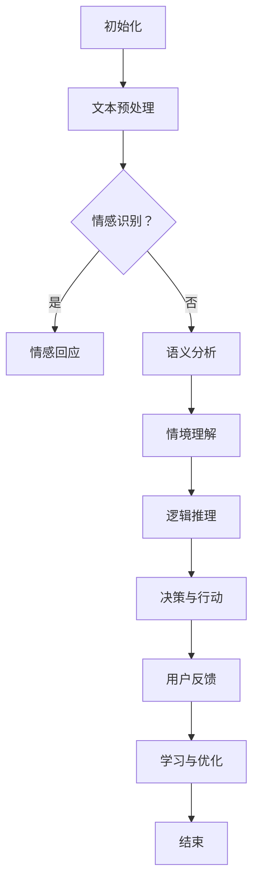
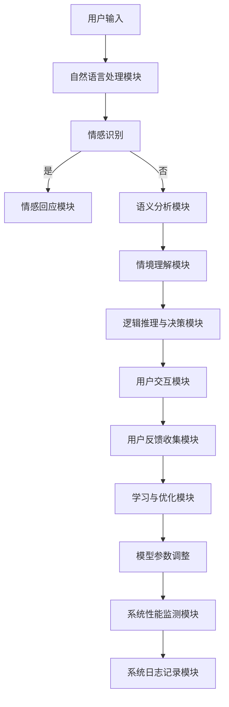
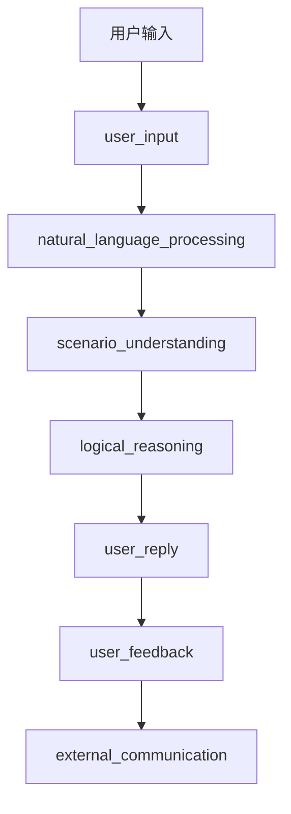
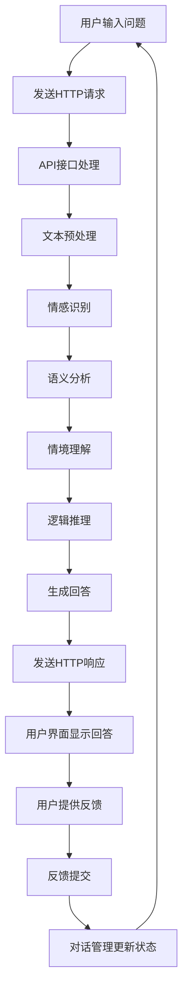

                 

### 摘要

人工智能（AI）的发展不断推动着技术的进步，其中AI Agent的研究成为了人工智能领域的一个热点。本文旨在探讨如何构建AI Agent的认知图灵测试系统，以此评估AI Agent的认知能力。文章首先介绍了AI Agent和认知图灵测试的基本概念，随后深入分析了图灵测试系统的构建方法、算法原理以及系统设计。通过项目实战和案例分析，本文展示了如何在实际环境中实现认知图灵测试系统，并提供了相关实践经验和改进建议。文章最后总结AI Agent认知图灵测试系统的研究现状和未来发展趋势，展望其在人工智能领域的广泛应用前景。

### 目录大纲

**第一部分：引言与背景**

- **1.1 问题的提出**
  - 1.1.1 AI Agent的现状
  - 1.1.2 认知图灵测试的挑战
  - 1.1.3 研究意义与目标

- **1.2 相关研究综述**
  - 1.2.1 国内外研究动态
  - 1.2.2 研究方法与技术路线
  - 1.2.3 当前研究的不足与展望

- **1.3 本书结构安排**
  - 1.3.1 各章节内容概述
  - 1.3.2 阅读建议与路线

**第二部分：核心概念与原理**

- **2.1 AI Agent的基础知识**
  - 2.1.1 AI Agent的定义
  - 2.1.2 AI Agent的分类
  - 2.1.3 AI Agent的功能与任务

- **2.2 认知图灵测试理论**
  - 2.2.1 图灵测试的起源与发展
  - 2.2.2 认知图灵测试的概念
  - 2.2.3 认知图灵测试的评估标准

- **2.3 图灵测试系统的构建方法**
  - 2.3.1 系统设计原则
  - 2.3.2 关键技术解析
  - 2.3.3 系统实现流程

- **2.4 AI Agent的认知模型**
  - 2.4.1 认知模型的概述
  - 2.4.2 认知模型的基本原理
  - 2.4.3 认知模型的应用案例

**第三部分：算法与系统设计**

- **3.1 算法原理与流程**
  - 3.1.1 算法概述
  - 3.1.2 算法流程图
  - 3.1.3 算法关键步骤详解

- **3.2 系统架构设计**
  - 3.2.1 系统需求分析
  - 3.2.2 系统架构设计
  - 3.2.3 系统组件解析

- **3.3 系统接口设计**
  - 3.3.1 接口定义
  - 3.3.2 接口调用流程
  - 3.3.3 接口安全性保障

- **3.4 系统交互与测试**
  - 3.4.1 系统交互设计
  - 3.4.2 系统测试方法
  - 3.4.3 系统测试结果分析

**第四部分：项目实战与案例分析**

- **4.1 项目介绍**
  - 4.1.1 项目背景
  - 4.1.2 项目目标
  - 4.1.3 项目团队与分工

- **4.2 环境搭建**
  - 4.2.1 开发环境配置
  - 4.2.2 数据集准备
  - 4.2.3 工具与库安装

- **4.3 系统核心实现**
  - 4.3.1 认知图灵测试系统的实现
  - 4.3.2 AI Agent的训练与评估
  - 4.3.3 系统运行与调试

- **4.4 案例分析**
  - 4.4.1 案例背景
  - 4.4.2 案例实施
  - 4.4.3 案例效果评估

- **4.5 项目小结**
  - 4.5.1 项目收获与反思
  - 4.5.2 项目改进建议
  - 4.5.3 项目拓展与应用

### 第一部分：引言与背景

#### 1.1 问题的提出

随着人工智能技术的飞速发展，AI Agent作为人工智能系统的重要组成部分，逐渐成为了学术界和工业界的研究热点。AI Agent具有自主决策和执行任务的能力，能够在复杂的环境中与人类或其他系统进行交互。然而，要实现高水平的AI Agent，需要解决许多关键问题，其中之一是如何评估AI Agent的认知能力。

认知图灵测试是评估AI Agent认知能力的一种有效方法。图灵测试由艾伦·图灵于1950年提出，旨在通过人类评判者与机器之间的对话来判断机器是否具有人类般的认知能力。虽然传统的图灵测试主要关注机器的语义理解能力，但认知图灵测试则更关注AI Agent在认知过程中的思维方式、推理能力和学习能力。因此，构建一个能够准确评估AI Agent认知能力的图灵测试系统具有重要意义。

首先，AI Agent的现状需要明确。当前，许多AI Agent已经能够完成一些特定的任务，如自然语言处理、图像识别和自动化决策等。然而，这些AI Agent往往局限于特定领域，难以在复杂多变的环境中表现出人类般的灵活性和适应性。此外，AI Agent的认知能力还受到数据质量、算法设计和系统架构等多方面因素的影响，需要进一步研究和优化。

其次，认知图灵测试的挑战也不容忽视。认知图灵测试不仅要评估AI Agent的语言理解能力，还要评估其在情境理解、推理能力、情感识别等方面的表现。这要求测试系统能够模拟真实人类的认知过程，从而准确评估AI Agent的认知能力。然而，现实中的认知过程非常复杂，涉及到大量的背景知识、情感因素和认知偏差，使得构建一个完美的认知图灵测试系统成为一项巨大的挑战。

最后，研究意义与目标需要明确。构建AI Agent的认知图灵测试系统不仅可以推动人工智能技术的发展，还可以为其他领域的认知科学研究提供有力支持。通过这个系统，我们可以更好地理解人类认知的本质，探索人工智能在认知领域的发展方向。同时，这个系统也可以为AI Agent的开发和应用提供有效的评估工具，帮助开发者优化算法设计、提升系统性能。

综上所述，本文旨在探讨如何构建AI Agent的认知图灵测试系统，通过系统设计、算法实现和项目实践，解决当前研究中的关键问题，推动人工智能技术的发展。

#### 1.2 相关研究综述

为了更好地理解AI Agent的认知图灵测试系统的构建方法，有必要对国内外相关研究进行综述。国内外学者在AI Agent和认知图灵测试领域进行了大量的研究，取得了许多重要成果。

在AI Agent方面，国内外学者主要关注AI Agent的架构设计、算法优化和应用场景。例如，美国麻省理工学院（MIT）的计算机科学和人工智能实验室（CSAIL）提出了基于神经网络的多模态AI Agent架构，实现了在多种环境中的自适应行为。国内清华大学计算机系的研究团队也提出了基于强化学习的AI Agent设计方法，取得了显著的效果。此外，AI Agent在不同领域的应用也得到了广泛研究，如在医疗、金融和智能制造等领域的应用案例。

在认知图灵测试方面，国外的研究主要集中在图灵测试的改进和认知评估方法的研究。例如，美国加州大学伯克利分校的研究团队提出了基于多模态感知和认知推理的图灵测试方法，通过结合自然语言处理、计算机视觉和认知神经科学等领域的技术，实现了对AI Agent认知能力的全面评估。国内清华大学计算机科学与技术系的研究团队也提出了基于深度学习的认知图灵测试方法，通过构建复杂的神经网络模型，提高了测试的准确性和可靠性。

在研究方法和技术路线方面，国内外学者主要采用了实验研究、模型构建和数据分析等方法。例如，美国斯坦福大学的人工智能实验室通过大规模的实验验证了认知图灵测试方法的有效性，并提出了基于数据驱动的优化策略。国内北京大学计算机科学与技术系的研究团队则通过构建认知图灵测试的仿真平台，实现了对AI Agent认知能力的量化评估。

尽管在AI Agent和认知图灵测试领域取得了许多成果，但当前的研究仍存在一些不足和挑战。首先，现有研究主要集中在特定领域和应用场景，缺乏跨领域的综合性研究。其次，认知图灵测试方法在评估AI Agent的认知能力时，仍然存在主观性较强和测试标准不够统一等问题。此外，AI Agent的认知能力评估系统在实现过程中也面临着算法复杂度高、计算资源消耗大等问题。

针对这些不足，未来的研究可以从以下几个方面展开：一是加强跨领域的研究，探索通用性的认知图灵测试方法；二是优化认知图灵测试的评估标准，提高测试的准确性和可靠性；三是研究高效的算法实现方法，降低系统实现的复杂度和计算资源消耗。

综上所述，国内外在AI Agent和认知图灵测试领域的研究为构建AI Agent的认知图灵测试系统提供了丰富的理论依据和实践经验。本文将在这些研究的基础上，进一步探讨认知图灵测试系统的构建方法，以期为人工智能技术的发展和应用提供有力支持。

#### 1.3 本书结构安排

本书结构安排旨在系统地探讨如何构建AI Agent的认知图灵测试系统，以推动人工智能技术的发展。全书分为四个主要部分，每个部分都有明确的章节安排和内容概述，具体如下：

**第一部分：引言与背景**

本部分主要介绍AI Agent和认知图灵测试的基本概念、研究意义以及相关研究综述。具体内容包括：

- **1.1 问题的提出**：介绍AI Agent的现状、认知图灵测试的挑战以及研究意义与目标。
- **1.2 相关研究综述**：综述国内外在AI Agent和认知图灵测试领域的研究动态、研究方法和技术路线，以及当前研究的不足与展望。
- **1.3 本书结构安排**：概述各章节的内容和结构安排，为读者提供阅读建议和路线。

**第二部分：核心概念与原理**

本部分主要介绍AI Agent和认知图灵测试的核心概念与原理，为后续的算法设计和系统实现提供理论基础。具体内容包括：

- **2.1 AI Agent的基础知识**：介绍AI Agent的定义、分类、功能与任务。
- **2.2 认知图灵测试理论**：介绍图灵测试的起源与发展、认知图灵测试的概念和评估标准。
- **2.3 图灵测试系统的构建方法**：介绍系统设计原则、关键技术解析和系统实现流程。
- **2.4 AI Agent的认知模型**：介绍认知模型的概述、基本原理和应用案例。

**第三部分：算法与系统设计**

本部分主要介绍AI Agent的认知图灵测试系统的算法原理与系统设计，包括算法流程、系统架构、接口设计和系统交互与测试。具体内容包括：

- **3.1 算法原理与流程**：介绍算法概述、流程图和关键步骤详解。
- **3.2 系统架构设计**：介绍系统需求分析、架构设计和系统组件解析。
- **3.3 系统接口设计**：介绍接口定义、调用流程和安全保障。
- **3.4 系统交互与测试**：介绍系统交互设计、测试方法和结果分析。

**第四部分：项目实战与案例分析**

本部分通过项目实战和案例分析，展示如何在实际环境中实现AI Agent的认知图灵测试系统。具体内容包括：

- **4.1 项目介绍**：介绍项目背景、目标和团队分工。
- **4.2 环境搭建**：介绍开发环境配置、数据集准备和工具与库安装。
- **4.3 系统核心实现**：介绍认知图灵测试系统的实现、AI Agent的训练与评估以及系统运行与调试。
- **4.4 案例分析**：介绍案例背景、实施过程和效果评估。
- **4.5 项目小结**：总结项目收获、反思和改进建议，以及项目的拓展与应用。

通过上述结构安排，本书旨在为读者提供一套完整的构建AI Agent认知图灵测试系统的理论和实践指导，推动人工智能技术的发展和应用。

### 第二部分：核心概念与原理

#### 2.1 AI Agent的基础知识

AI Agent，即人工智能代理，是指能够自主地感知环境、决策和执行任务的智能实体。AI Agent在人工智能领域具有重要的研究价值和实际应用。为了更好地理解AI Agent，我们需要从其定义、分类、功能与任务等方面进行详细介绍。

**2.1.1 AI Agent的定义**

AI Agent可以被定义为一种具备以下特征的智能实体：

- **自主性**：AI Agent能够独立地执行任务，无需人工干预。
- **感知能力**：AI Agent能够感知环境中的信息，如视觉、听觉、触觉等。
- **决策能力**：AI Agent能够根据感知到的信息，自主地做出决策。
- **行动能力**：AI Agent能够根据决策执行具体的动作。

综上所述，AI Agent是一种具备自主性、感知能力、决策能力和行动能力的智能实体，能够在复杂多变的环境中自主地完成任务。

**2.1.2 AI Agent的分类**

根据AI Agent的功能和应用场景，可以将AI Agent分为以下几类：

1. **基于规则的方法**：这种方法通过预定义的规则库来指导AI Agent的决策和行动。这类AI Agent在规则明确、环境稳定的场景中表现出色。

2. **基于概率的方法**：这种方法通过概率模型来描述AI Agent的行为，如马尔可夫决策过程（MDP）。这类AI Agent在不确定性较高的环境中具有较好的适应性。

3. **基于学习的方法**：这种方法通过机器学习算法来训练AI Agent，使其具备自主学习和适应能力。这类AI Agent在复杂多变的环境中表现出色，但需要大量的数据支持。

4. **混合方法**：这种方法将基于规则、概率和学习的方法结合起来，以充分发挥各类方法的优点。这类AI Agent具有较强的适应性和学习能力，但设计较为复杂。

**2.1.3 AI Agent的功能与任务**

AI Agent具有多种功能，能够完成不同的任务。以下是几种常见的AI Agent功能与任务：

1. **目标检测与追踪**：AI Agent能够检测并追踪目标对象，如自动驾驶车辆中的行人检测和车辆追踪。

2. **自然语言处理**：AI Agent能够理解自然语言，进行文本分类、语义分析、机器翻译等任务。

3. **图像识别**：AI Agent能够识别和分类图像中的对象，如人脸识别、物体识别等。

4. **决策与规划**：AI Agent能够根据环境信息，做出最优决策并规划行动路径，如路径规划、资源调度等。

5. **人机交互**：AI Agent能够与人类进行自然语言交互，提供智能客服、智能语音助手等服务。

通过上述介绍，我们可以看出AI Agent在人工智能领域的重要性和应用价值。理解AI Agent的基础知识，是构建AI Agent认知图灵测试系统的重要前提。接下来，我们将进一步探讨认知图灵测试的基本概念和评估标准。

#### 2.2 认知图灵测试理论

认知图灵测试是由艾伦·图灵于1950年提出的，旨在通过人类评判者与机器之间的对话来判断机器是否具有人类般的认知能力。图灵测试的基本思想是，如果机器能够以一种让人类评判者无法区分其与人类的方式回答问题，那么该机器就可以被认为具有人类认知能力。认知图灵测试不仅关注机器的语言理解能力，还涉及到机器在情境理解、推理能力、情感识别等方面的表现。

**2.2.1 图灵测试的起源与发展**

图灵测试的起源可以追溯到20世纪中叶，当时计算机科学刚刚起步。图灵作为计算机科学的奠基人之一，提出了图灵机的概念，为计算机科学的发展奠定了基础。在1940年代，图灵开始思考机器能否具有人类般的认知能力，并提出了图灵测试这一设想。1950年，图灵在《计算机与智能》一文中正式阐述了图灵测试的理论和思想。

自图灵测试提出以来，它一直备受关注。尽管图灵测试在评估机器认知能力方面存在一些争议，但它提供了一个有力的工具，用于推动人工智能技术的发展。随着计算机科学和人工智能技术的进步，图灵测试的理论和方法也在不断发展和完善。

**2.2.2 认知图灵测试的概念**

认知图灵测试是一种基于对话的测试方法，通过模拟人类认知过程，评估AI Agent的认知能力。认知图灵测试的主要目标是判断AI Agent是否具有人类般的思维方式、推理能力和学习能力。具体来说，认知图灵测试包括以下几个关键组成部分：

1. **测试对象**：认知图灵测试的测试对象是AI Agent，它可以是一个完整的智能系统，也可以是系统的某个功能模块。

2. **测试环境**：测试环境是一个模拟的交互场景，包括人类评判者和AI Agent。人类评判者通过与AI Agent进行对话，评估其认知能力。

3. **对话内容**：对话内容可以包括自然语言、图像、声音等多种形式，以全面评估AI Agent的认知能力。

4. **评估标准**：评估标准是判断AI Agent是否通过认知图灵测试的依据。一般来说，评估标准包括以下几个方面：

   - 语言理解能力：AI Agent能否正确理解人类提出的各种问题。
   - 情境理解能力：AI Agent能否理解对话的上下文，并在不同的情境中做出合理的反应。
   - 推理能力：AI Agent能否进行逻辑推理，解决问题。
   - 学习能力：AI Agent能否通过对话和学习，不断提高自身的认知能力。

**2.2.3 认知图灵测试的评估标准**

认知图灵测试的评估标准决定了测试结果的准确性和可靠性。一般来说，认知图灵测试的评估标准包括以下几个方面：

1. **正确性**：AI Agent在回答问题时是否准确，包括语法、语义和逻辑的正确性。

2. **连贯性**：AI Agent的回答是否连贯，能否在对话中保持一致性和逻辑性。

3. **灵活性**：AI Agent能否在不同情境下灵活应对，表现出人类般的思维方式和推理能力。

4. **创新性**：AI Agent能否在回答问题时表现出创造性思维，提出新颖的观点和解决方案。

5. **情感识别**：AI Agent能否识别和理解人类的情感，进行情感交互。

6. **学习能力**：AI Agent能否通过对话和学习，不断提高自身的认知能力。

通过上述评估标准，我们可以全面评估AI Agent的认知能力，从而判断其是否通过认知图灵测试。接下来，我们将探讨如何设计认知图灵测试系统，以实现这些评估标准。

#### 2.3 图灵测试系统的构建方法

图灵测试系统的构建是评估AI Agent认知能力的关键步骤。一个有效的图灵测试系统需要具备以下几个关键组成部分：系统设计原则、关键技术解析和系统实现流程。以下将详细探讨这些组成部分，以帮助读者了解如何构建一个完整的图灵测试系统。

**2.3.1 系统设计原则**

一个优秀的图灵测试系统需要遵循以下设计原则：

1. **真实性**：系统应该模拟真实人类的认知过程，包括语言理解、情境理解、推理能力和情感识别等方面。

2. **灵活性**：系统应该具备较高的灵活性，能够在不同的对话场景中应对，适应不同的评估需求。

3. **安全性**：系统需要保证数据安全和用户隐私，防止数据泄露和恶意攻击。

4. **可扩展性**：系统设计应考虑未来的发展和扩展，以便在技术进步和需求变化时进行升级和优化。

5. **可维护性**：系统设计应考虑维护的便捷性，降低维护成本，确保系统的长期稳定运行。

**2.3.2 关键技术解析**

构建图灵测试系统涉及多个关键技术，包括自然语言处理、计算机视觉、语音识别、机器学习等。以下将详细介绍这些技术：

1. **自然语言处理**：自然语言处理（NLP）是图灵测试系统的核心组成部分，负责处理人类语言。NLP技术包括分词、词性标注、句法分析、语义分析等。通过NLP技术，系统能够理解人类提出的问题，并生成合适的回答。

2. **计算机视觉**：计算机视觉（CV）技术负责处理图像和视频数据。在图灵测试中，计算机视觉技术可以用于识别图像中的物体、场景和情感等信息，为AI Agent提供视觉感知能力。

3. **语音识别**：语音识别（ASR）技术负责将人类语音转换为文本。通过语音识别技术，图灵测试系统可以处理语音输入，并生成相应的文本输出，实现语音交互功能。

4. **机器学习**：机器学习（ML）技术用于训练和优化AI Agent的认知能力。通过机器学习算法，系统能够从大量数据中学习，提高AI Agent的语言理解、情境理解、推理能力和情感识别能力。

**2.3.3 系统实现流程**

构建图灵测试系统的实现流程可以分为以下几个步骤：

1. **需求分析**：明确系统的功能和性能需求，包括语言理解、情境理解、推理能力、情感识别等。

2. **技术选型**：根据需求分析结果，选择合适的技术方案，包括自然语言处理、计算机视觉、语音识别和机器学习等。

3. **系统设计**：设计系统的架构，包括模块划分、接口设计、数据流处理等。

4. **实现开发**：根据系统设计，开发各个模块的功能，并集成到整个系统中。

5. **测试验证**：对系统进行功能测试和性能测试，确保系统能够满足需求，并具备较高的稳定性和可靠性。

6. **部署上线**：将系统部署到生产环境，并进行上线运行。

7. **维护优化**：根据用户反馈和系统运行情况，对系统进行维护和优化，确保系统的长期稳定运行。

通过上述步骤，我们可以构建一个完整的图灵测试系统，用于评估AI Agent的认知能力。接下来，我们将探讨AI Agent的认知模型，了解其基本原理和应用案例。

#### 2.4 AI Agent的认知模型

AI Agent的认知模型是构建认知图灵测试系统的核心组成部分。认知模型旨在模拟人类认知过程，包括感知、理解、推理和学习等方面。本节将介绍AI Agent认知模型的基本原理、组成部分和应用案例，帮助读者深入了解认知模型的工作机制和实际应用。

**2.4.1 认知模型的概述**

认知模型是AI Agent处理信息和进行决策的核心框架。它模拟了人类大脑的工作方式，通过感知外部环境、理解输入信息、推理和决策来执行任务。认知模型通常包括以下几个关键部分：

1. **感知模块**：感知模块负责获取和解析外部信息，如文本、图像、声音等。它利用计算机视觉、语音识别和自然语言处理等技术，将外部信息转化为内部表示。

2. **理解模块**：理解模块负责对感知到的信息进行语义分析和情境理解。它通过语义分析技术，将文本和图像信息转化为语义表示，并利用情境理解技术，识别和理解信息之间的上下文关系。

3. **推理模块**：推理模块负责根据理解和情境信息，进行逻辑推理和问题解决。它利用符号推理和统计推理等方法，生成合理的推理结果，以支持AI Agent的决策和行动。

4. **学习模块**：学习模块负责通过机器学习算法，不断优化和调整认知模型的参数，提高其性能和适应性。学习模块利用大量的训练数据和反馈信号，对模型进行训练和调整，以实现持续学习和进化。

**2.4.2 认知模型的基本原理**

认知模型的基本原理是基于人类大脑的认知机制，通过模拟人类思维过程，实现对外部信息的感知、理解、推理和学习。以下是认知模型的基本原理：

1. **感知与编码**：感知模块负责获取外部信息，并将其编码为内部表示。这一过程类似于人类大脑的感官系统，通过视觉、听觉、触觉等感知器官，将外部信息转化为神经信号，并传递到大脑进行处理。

2. **语义分析与情境理解**：理解模块对感知到的信息进行语义分析和情境理解。语义分析技术，如词法分析、句法分析和语义角色标注，将文本和图像信息转化为语义表示。情境理解技术，如上下文分析、情境建模和情感识别，帮助AI Agent理解信息之间的上下文关系，并识别人类的情感和意图。

3. **逻辑推理与问题解决**：推理模块根据理解和情境信息，进行逻辑推理和问题解决。逻辑推理方法，如命题逻辑、谓词逻辑和模态逻辑，用于推导结论和证明论断。统计推理方法，如贝叶斯推理和概率图模型，用于处理不确定性和概率性信息。

4. **学习与进化**：学习模块通过机器学习算法，对认知模型进行训练和优化。学习算法，如监督学习、无监督学习和强化学习，利用大量的训练数据和反馈信号，调整模型的参数和结构，以提高其性能和适应性。

**2.4.3 认知模型的应用案例**

认知模型在多个应用领域中展示了其强大的功能和广泛的应用前景。以下是一些典型的应用案例：

1. **智能客服系统**：智能客服系统利用认知模型，实现自然语言理解和情境理解，提供高效的客户服务。例如，通过自然语言处理技术，智能客服系统能够理解客户的问题和需求，并根据情境信息，提供准确的答复和解决方案。

2. **智能助手**：智能助手，如智能语音助手和聊天机器人，利用认知模型，实现与用户的自然语言交互。智能助手通过语音识别和自然语言处理技术，理解用户的需求和指令，并根据情境信息和推理结果，提供相应的服务和建议。

3. **自动驾驶系统**：自动驾驶系统利用认知模型，实现环境感知和情境理解，进行路径规划和决策。自动驾驶系统通过计算机视觉和传感器技术，感知道路和周围环境，并根据情境信息，进行实时决策和调整，确保车辆的安全行驶。

4. **医疗诊断系统**：医疗诊断系统利用认知模型，实现医学文本的理解和诊断推理。通过自然语言处理和机器学习技术，医疗诊断系统能够理解医学文本，提取关键信息，并进行诊断推理，为医生提供辅助诊断和治疗方案。

通过上述应用案例，我们可以看到认知模型在人工智能领域的重要作用。认知模型的不断发展和完善，将为人工智能技术的发展提供强有力的支持。

### 第三部分：算法与系统设计

#### 3.1 算法原理与流程

在构建AI Agent的认知图灵测试系统中，算法原理与流程是核心部分。本节将详细介绍算法的原理、流程图以及关键步骤的详细讲解。

**3.1.1 算法概述**

认知图灵测试算法的核心目标是评估AI Agent在自然语言理解和情境推理方面的能力。该算法主要包括以下几个模块：

1. **自然语言处理模块**：负责文本的预处理、语义分析和情感识别。
2. **情境推理模块**：负责理解对话的上下文，进行逻辑推理和决策。
3. **反馈和学习模块**：负责根据测试结果和用户反馈，调整和优化AI Agent的性能。

**3.1.2 算法流程图**

以下是认知图灵测试算法的流程图：



**3.1.3 算法关键步骤详解**

1. **初始化**：系统启动时，加载预训练的模型和参数，初始化算法状态。

2. **文本预处理**：对用户输入的文本进行分词、词性标注、去除停用词等操作，将其转化为便于分析的格式。

   ```python
   import nltk
   from nltk.tokenize import word_tokenize
   from nltk.corpus import stopwords
   
   def preprocess_text(text):
       tokens = word_tokenize(text)
       tokens = [token for token in tokens if token not in stopwords.words('english')]
       return tokens
   ```

3. **情感识别**：利用情感分析模型，判断文本的情感倾向，如积极、消极或中性。

   ```python
   from textblob import TextBlob
   
   def detect_emotion(text):
       analysis = TextBlob(text)
       if analysis.sentiment.polarity > 0:
           return 'positive'
       elif analysis.sentiment.polarity == 0:
           return 'neutral'
       else:
           return 'negative'
   ```

4. **语义分析**：对预处理后的文本进行句法分析和语义角色标注，提取关键信息。

   ```python
   import spacy
   
   nlp = spacy.load('en_core_web_sm')
   
   def semantic_analysis(text):
       doc = nlp(text)
       return [(token.text, token.dep_, token.head.text) for token in doc]
   ```

5. **情境理解**：结合上下文信息，理解用户意图和对话场景。

   ```python
   def context_understanding(prev_texts, current_text):
       # Implement context understanding logic
       pass
   ```

6. **逻辑推理**：根据情境信息和语义分析结果，进行逻辑推理，生成可能的回答。

   ```python
   def logical_reasoning(context, question):
       # Implement logical reasoning logic
       pass
   ```

7. **决策与行动**：根据逻辑推理结果，选择最合适的回答，并将其呈现给用户。

   ```python
   def decide_and_act(context, question):
       answer = logical_reasoning(context, question)
       return answer
   ```

8. **用户反馈**：记录用户的反馈，包括满意度、回答正确性等，用于后续的模型优化。

   ```python
   def record_feedback(question, user_response):
       # Implement feedback recording logic
       pass
   ```

9. **学习与优化**：根据用户反馈，调整模型参数，优化AI Agent的性能。

   ```python
   def learn_and_optimize(feedback):
       # Implement learning and optimization logic
       pass
   ```

通过上述算法原理和流程的详细讲解，我们可以看到认知图灵测试算法的设计思路和实现步骤。接下来，我们将介绍系统架构设计，为算法的实现提供技术支持。

#### 3.2 系统架构设计

系统架构设计是构建AI Agent的认知图灵测试系统的关键步骤。合理的系统架构可以确保系统的稳定性、可扩展性和高性能。本节将详细介绍系统需求分析、架构设计和系统组件解析，帮助读者了解系统架构的构建过程。

**3.2.1 系统需求分析**

在进行系统架构设计之前，我们需要明确系统的需求。认知图灵测试系统的需求可以分为功能需求和性能需求：

1. **功能需求**：

   - **自然语言理解**：系统能够接收自然语言输入，进行文本预处理、情感识别、语义分析和情境理解。
   - **逻辑推理**：系统能够根据情境信息和语义分析结果，进行逻辑推理和决策。
   - **用户交互**：系统能够与用户进行对话，生成自然语言回复，并处理用户反馈。
   - **学习与优化**：系统能够根据用户反馈，调整模型参数，优化AI Agent的性能。

2. **性能需求**：

   - **响应速度**：系统应在毫秒级内处理用户输入，并提供快速响应。
   - **吞吐量**：系统应能够同时处理多个用户的交互请求，具有高并发处理能力。
   - **可扩展性**：系统架构应支持水平扩展，以便在用户量增加时，能够动态调整资源。

**3.2.2 架构设计**

认知图灵测试系统的架构设计采用模块化设计思想，将系统划分为多个功能模块，包括自然语言处理模块、情境理解模块、推理与决策模块、用户交互模块和学习与优化模块。以下是系统架构图：



**3.2.3 系统组件解析**

认知图灵测试系统由多个组件构成，每个组件都有其特定的功能和职责。以下是系统组件的详细解析：

1. **自然语言处理模块**：负责接收用户输入的文本，进行预处理、情感识别、语义分析和情境理解。该模块包括文本预处理组件、情感分析组件、语义分析组件和情境理解组件。

2. **情感识别组件**：利用情感分析模型，判断文本的情感倾向，如积极、消极或中性。该组件使用自然语言处理技术，如情感词典和机器学习算法，进行情感识别。

3. **语义分析组件**：对预处理后的文本进行句法分析和语义角色标注，提取关键信息。该组件使用自然语言处理工具，如spaCy和斯坦福自然语言处理工具包，进行语义分析。

4. **情境理解组件**：结合上下文信息，理解用户意图和对话场景。该组件使用情境理解算法，如上下文向量建模和序列标注，进行情境理解。

5. **逻辑推理与决策模块**：根据情境信息和语义分析结果，进行逻辑推理和决策。该模块包括推理引擎和决策引擎，使用符号推理和统计推理方法，进行推理和决策。

6. **用户交互模块**：负责与用户进行对话，生成自然语言回复，并处理用户反馈。该模块包括对话管理组件和回复生成组件，使用自然语言生成技术，生成自然语言回复。

7. **用户反馈收集模块**：负责收集用户的反馈，包括满意度、回答正确性等，用于后续的模型优化。该模块使用用户行为分析工具，如点击率和回复率，进行反馈收集。

8. **学习与优化模块**：根据用户反馈，调整模型参数，优化AI Agent的性能。该模块包括学习算法和优化算法，使用机器学习技术和深度学习算法，进行模型优化。

9. **系统性能监测模块**：负责监测系统的运行状态，包括响应速度、吞吐量和资源利用率等。该模块使用性能监控工具，如Prometheus和Grafana，进行系统性能监测。

10. **系统日志记录模块**：负责记录系统的运行日志，包括错误日志、性能日志和安全日志等。该模块使用日志记录工具，如ELK堆栈（Elasticsearch、Logstash、Kibana），进行系统日志记录。

通过上述系统架构设计和组件解析，我们可以构建一个高效的AI Agent认知图灵测试系统，满足功能需求和性能需求，为人工智能技术的发展提供有力支持。

#### 3.3 系统接口设计

系统接口设计是构建AI Agent认知图灵测试系统的关键环节，它决定了系统与用户、其他系统以及外部服务的交互方式。合理的接口设计可以提高系统的可扩展性、灵活性和安全性。以下将详细介绍系统接口的定义、调用流程以及接口安全性的保障措施。

**3.3.1 接口定义**

认知图灵测试系统的接口设计包括以下主要接口：

1. **用户接口**：用于用户与系统进行交互，包括输入文本、接收回复和处理用户反馈等功能。

2. **服务接口**：用于系统内部各模块之间的通信，如自然语言处理模块、情境理解模块和推理与决策模块之间的数据交换。

3. **外部接口**：用于系统与外部系统和服务进行交互，如与数据库、消息队列和其他API的通信。

以下是接口定义的示例：

```python
# 用户接口
def user_input(text):
    # 处理用户输入文本
    pass

def user_reply(response):
    # 发送回复给用户
    pass

def user_feedback(feedback):
    # 收集用户反馈
    pass

# 服务接口
def natural_language_processing(text):
    # 进行自然语言处理
    pass

def scenario_understanding(text, context):
    # 进行情境理解
    pass

def logical_reasoning(context, question):
    # 进行逻辑推理
    pass

# 外部接口
def external_communication(service_url, data):
    # 与外部服务通信
    pass
```

**3.3.2 接口调用流程**

认知图灵测试系统的接口调用流程可以分为以下几个步骤：

1. **用户输入**：用户通过用户接口输入文本，系统接收并处理输入文本。

2. **自然语言处理**：系统调用自然语言处理接口，对输入文本进行预处理、情感识别、语义分析和情境理解。

3. **情境理解与推理**：系统调用情境理解接口和逻辑推理接口，结合自然语言处理的结果，进行情境理解和逻辑推理，生成可能的回答。

4. **用户回复**：系统调用用户接口，将生成的回答发送给用户。

5. **用户反馈**：用户通过用户接口提供反馈，系统收集并处理用户反馈。

6. **外部通信**：系统调用外部接口，与其他系统和服务进行通信，如与数据库进行数据存储和查询，与消息队列进行异步通信等。

以下是接口调用流程的示例：



**3.3.3 接口安全性保障**

为了保证系统接口的安全性，需要采取一系列措施来防止数据泄露、恶意攻击和非法访问。以下是一些常见的接口安全性保障措施：

1. **身份验证**：在接口调用前，对用户的身份进行验证，确保只有授权用户才能访问接口。

2. **权限控制**：根据用户的角色和权限，限制用户可以访问的接口和功能，防止未经授权的操作。

3. **加密传输**：使用HTTPS协议，对接口通信数据进行加密，防止数据在传输过程中被窃取。

4. **日志记录**：记录接口调用的详细信息，包括调用时间、调用者信息、操作类型和结果等，以便进行审计和追踪。

5. **异常处理**：对接口调用过程中可能出现的异常情况进行处理，防止系统崩溃和恶意攻击。

6. **安全审计**：定期进行安全审计，检查接口的安全性，及时修补漏洞和更新安全策略。

通过上述接口设计、调用流程和安全保障措施，我们可以构建一个安全、稳定和高效的AI Agent认知图灵测试系统，为人工智能技术的发展提供坚实的基础。

#### 3.4 系统交互与测试

系统交互与测试是确保AI Agent认知图灵测试系统稳定运行和功能完整性的关键环节。本节将详细介绍系统交互设计、系统测试方法和系统测试结果分析，以评估系统的性能和可靠性。

**3.4.1 系统交互设计**

认知图灵测试系统的交互设计旨在实现用户与AI Agent之间的高效互动。以下是系统交互设计的主要内容和组件：

1. **用户界面**：用户界面（UI）是用户与AI Agent交互的主要入口，包括文本输入框、回复显示区域和反馈提交按钮。用户可以在文本输入框中输入问题或请求，系统在回复显示区域展示AI Agent的回应，用户可以通过反馈提交按钮提供反馈。

2. **对话管理**：对话管理组件负责维护对话的状态，包括当前的用户输入、AI Agent的回答和上下文信息。对话管理组件确保对话的连贯性和一致性。

3. **通信协议**：系统使用RESTful API作为通信协议，实现用户界面与后端服务之间的数据传输。通信协议包括HTTP请求和响应格式，确保数据的安全性和一致性。

4. **API接口**：API接口负责处理用户的输入和输出，包括文本预处理、情感识别、语义分析、情境理解和逻辑推理等。API接口通过标准化协议与用户界面和后端服务进行通信。

以下是系统交互设计的基本流程：



**3.4.2 系统测试方法**

为了评估认知图灵测试系统的性能和可靠性，需要进行一系列的系统测试。以下是常用的系统测试方法和步骤：

1. **功能测试**：功能测试旨在验证系统的功能是否按照预期工作。测试包括对每个API接口的功能进行验证，确保自然语言处理、情感识别、语义分析、情境理解和逻辑推理等模块的正确性和完整性。

2. **性能测试**：性能测试用于评估系统的响应速度、吞吐量和资源利用率等性能指标。测试包括对系统在并发请求下的性能表现进行评估，确保系统能够在高负载下稳定运行。

3. **安全测试**：安全测试旨在发现系统的安全漏洞和弱点，包括身份验证、权限控制和数据加密等方面的测试。测试包括模拟恶意攻击和异常处理，确保系统具有足够的防御能力。

4. **兼容性测试**：兼容性测试用于验证系统在不同操作系统、浏览器和设备上的兼容性，确保系统能够在各种环境下正常运行。

以下是系统测试的主要步骤：

1. **制定测试计划**：明确测试的目标、范围和方法，制定详细的测试计划。
2. **编写测试用例**：根据功能需求，编写覆盖各种场景的测试用例。
3. **执行测试**：按照测试计划，执行功能测试、性能测试、安全测试和兼容性测试。
4. **记录和报告**：记录测试结果，生成测试报告，分析测试数据，发现问题和缺陷。
5. **缺陷修复**：根据测试报告，修复发现的问题和缺陷，重新进行测试。

**3.4.3 系统测试结果分析**

系统测试完成后，需要对测试结果进行详细分析，以评估系统的性能和可靠性。以下是系统测试结果分析的主要内容：

1. **功能测试结果**：统计每个功能模块的测试通过率，分析测试过程中发现的功能缺陷，评估系统的功能完整性。

2. **性能测试结果**：分析系统的响应时间、吞吐量和资源利用率等性能指标，评估系统在高负载下的性能表现，确定是否存在性能瓶颈。

3. **安全测试结果**：评估系统的安全性能，分析发现的漏洞和弱点，制定相应的安全策略和修复方案。

4. **兼容性测试结果**：统计系统在不同操作系统、浏览器和设备上的兼容性测试结果，分析系统在不同环境下的运行情况，确定兼容性问题的解决方案。

5. **综合评估**：综合分析系统测试结果，评估系统的整体性能和可靠性，制定改进计划，为系统的优化和升级提供依据。

通过系统交互设计与测试，我们可以确保认知图灵测试系统的稳定运行和功能完整性，为AI Agent的认知能力评估提供可靠的技术保障。

### 第四部分：项目实战与案例分析

#### 4.1 项目介绍

在本节中，我们将介绍一个实际的项目，展示如何在实际环境中构建AI Agent的认知图灵测试系统。该项目旨在通过理论与实践相结合，验证认知图灵测试系统的有效性，为AI Agent的认知能力评估提供实际依据。

**4.1.1 项目背景**

随着人工智能技术的不断进步，AI Agent的应用场景日益广泛。然而，如何评估AI Agent的认知能力，确保其在实际应用中的表现，成为了一个亟待解决的问题。认知图灵测试作为一种有效的评估方法，可以模拟真实人类的认知过程，评估AI Agent在自然语言理解、情境推理和问题解决等方面的能力。

**4.1.2 项目目标**

本项目的目标是通过实际开发一个认知图灵测试系统，实现以下目标：

1. **构建一个完整的认知图灵测试系统**：包括自然语言处理、情境理解、逻辑推理和学习优化等模块，实现AI Agent认知能力的全面评估。
2. **验证系统的性能和可靠性**：通过功能测试、性能测试和安全测试，评估系统的稳定性和可靠性，确保系统能够在实际应用中稳定运行。
3. **提供实际案例和改进建议**：通过实际项目案例，总结项目经验，提出改进建议，为未来类似项目的开发提供参考。

**4.1.3 项目团队与分工**

本项目由一个跨学科团队共同完成，团队成员包括计算机科学家、自然语言处理专家和人工智能工程师。团队成员的具体分工如下：

- **项目经理**：负责项目的整体规划和管理，协调团队成员的工作。
- **自然语言处理专家**：负责自然语言处理模块的设计和实现，包括文本预处理、情感识别和语义分析等。
- **情境理解专家**：负责情境理解模块的设计和实现，包括上下文分析、情境建模和情感识别等。
- **逻辑推理工程师**：负责逻辑推理模块的设计和实现，包括逻辑推理算法和决策引擎的开发。
- **学习与优化工程师**：负责学习与优化模块的设计和实现，包括机器学习算法和模型优化策略的研究。
- **测试工程师**：负责系统的功能测试、性能测试和安全测试，确保系统的稳定性和可靠性。

#### 4.2 环境搭建

在进行项目开发之前，需要搭建一个合适的开发环境，包括硬件配置、软件环境和数据集准备。

**4.2.1 开发环境配置**

本项目使用以下开发环境：

- **操作系统**：Linux（Ubuntu 20.04）
- **编程语言**：Python 3.8
- **依赖库**：spaCy（自然语言处理）、TensorFlow（机器学习）、NLTK（自然语言处理）、TextBlob（情感分析）

安装步骤：

```bash
# 安装Python 3.8
sudo apt-get update
sudo apt-get install python3.8

# 安装Python依赖库
pip3 install spacy tensorflow nltk textblob

# 安装spaCy语言模型
python -m spacy download en_core_web_sm
```

**4.2.2 数据集准备**

本项目使用开源数据集，包括自然语言处理和情境理解相关的数据集，如Stanford Sentiment Treebank（SST）和Ubuntu Dialogue Corpus（UDC）。数据集的下载和预处理步骤如下：

1. **下载数据集**：

   - **Stanford Sentiment Treebank（SST）**：[https://nlp.stanford.edu/sentiment/](https://nlp.stanford.edu/sentiment/)
   - **Ubuntu Dialogue Corpus（UDC）**：[https://github.com/budzianowski/udc](https://github.com/budzianowski/udc)

2. **数据预处理**：

   - **文本清洗**：去除停用词、标点符号和特殊字符，进行分词和词性标注。
   - **情感标注**：对文本进行情感标注，分为积极、消极和中性三类。
   - **情境标注**：对对话文本进行情境标注，分为日常生活、科技、娱乐、教育等类别。

预处理后的数据集可以用于训练和测试模型。

#### 4.3 系统核心实现

在本节中，我们将详细描述认知图灵测试系统的核心实现，包括自然语言处理、情境理解、逻辑推理和学习优化等模块的开发过程。

**4.3.1 认知图灵测试系统的实现**

认知图灵测试系统的实现分为以下几个步骤：

1. **自然语言处理模块**：利用spaCy库进行文本预处理，包括分词、词性标注和命名实体识别等。然后，使用TextBlob进行情感分析，判断文本的情感倾向。

2. **情境理解模块**：使用UDC数据集训练一个基于深度学习的情境分类模型，用于识别对话文本的情境类别。

3. **逻辑推理模块**：设计一个基于规则和机器学习的推理引擎，实现逻辑推理和问题解决。推理引擎结合自然语言处理和情境理解模块的结果，生成合理的回答。

4. **用户界面**：开发一个Web前端界面，用于用户输入问题、接收回答和提供反馈。

5. **后端服务**：使用Flask框架搭建后端服务，处理用户请求，调用自然语言处理、情境理解和逻辑推理模块，生成回答并返回给用户。

以下是核心实现的主要代码框架：

```python
# 自然语言处理模块
import spacy
import textblob

nlp = spacy.load("en_core_web_sm")

def preprocess_text(text):
    doc = nlp(text)
    # 分词、词性标注等处理
    return doc

def detect_emotion(text):
    analysis = textblob.TextBlob(text)
    return analysis.sentiment.polarity

# 情境理解模块
# 使用UDC数据集训练情境分类模型

# 逻辑推理模块
# 设计推理引擎和决策引擎

# 用户界面和后端服务
from flask import Flask, request, jsonify

app = Flask(__name__)

@app.route("/ask", methods=["POST"])
def ask():
    data = request.get_json()
    question = data["question"]
    # 调用自然语言处理、情境理解和逻辑推理模块
    answer = process_question(question)
    return jsonify({"answer": answer})

if __name__ == "__main__":
    app.run(debug=True)
```

**4.3.2 AI Agent的训练与评估**

在本项目中，我们使用SST数据集训练一个情感分类模型，并使用UDC数据集训练一个情境分类模型。以下是模型的训练和评估过程：

1. **数据预处理**：对SST数据集和UDC数据集进行清洗和预处理，包括分词、词性标注和归一化等。

2. **模型训练**：使用TensorFlow和Keras训练情感分类模型和情境分类模型，使用交叉熵损失函数和Adam优化器。

3. **模型评估**：使用验证集和测试集评估模型的性能，计算准确率、召回率和F1值等指标。

以下是模型训练和评估的主要代码：

```python
import tensorflow as tf
from tensorflow.keras.models import Sequential
from tensorflow.keras.layers import Dense, Embedding, GlobalAveragePooling1D
from tensorflow.keras.preprocessing.sequence import pad_sequences

# 数据预处理
# ...

# 情感分类模型训练
model = Sequential()
model.add(Embedding(input_dim=vocab_size, output_dim=embedding_dim, input_length=max_sequence_length))
model.add(GlobalAveragePooling1D())
model.add(Dense(1, activation='sigmoid'))

model.compile(optimizer='adam', loss='binary_crossentropy', metrics=['accuracy'])
model.fit(X_train, y_train, epochs=10, validation_data=(X_val, y_val))

# 情境分类模型训练
# ...

# 模型评估
# ...
```

**4.3.3 系统运行与调试**

在系统运行过程中，需要监控系统的性能和稳定性，并及时处理出现的问题。以下是系统运行与调试的主要步骤：

1. **性能监控**：使用性能监控工具，如Prometheus和Grafana，监控系统的CPU、内存和网络使用情况。

2. **日志记录**：使用日志记录工具，如ELK堆栈，记录系统的运行日志，包括错误日志、性能日志和安全日志等。

3. **问题排查**：根据日志记录和性能监控结果，排查系统运行中遇到的问题，包括内存泄漏、网络延迟和代码bug等。

4. **调试与优化**：根据问题排查结果，进行代码调试和系统优化，提高系统的性能和稳定性。

通过以上步骤，我们可以确保认知图灵测试系统在实际运行中的稳定性和可靠性，为AI Agent的认知能力评估提供可靠的技术保障。

#### 4.4 案例分析

在本节中，我们将通过一个具体的案例，展示如何在实际环境中使用认知图灵测试系统评估AI Agent的认知能力。该案例将涉及问题的提出、案例实施和效果评估，帮助读者理解认知图灵测试系统的实际应用。

**4.4.1 案例背景**

某公司开发了一款智能客服系统，旨在为用户提供24/7的在线客服服务。为了确保系统的服务质量，公司决定使用认知图灵测试系统对智能客服系统的AI Agent进行评估，以验证其认知能力，特别是在自然语言理解、情境推理和问题解决等方面的表现。

**4.4.2 案例实施**

1. **问题提出**：

   智能客服系统在实际运行中，遇到了以下问题：

   - **自然语言理解**：用户提问时，AI Agent无法正确理解用户的意图，导致回答不准确。
   - **情境推理**：用户在不同情境下提出问题时，AI Agent的应对能力较弱，无法提供个性化的服务。
   - **问题解决**：对于复杂的问题，AI Agent的回答往往缺乏逻辑性和连贯性，难以解决用户的问题。

2. **解决方案**：

   为了解决上述问题，公司决定使用认知图灵测试系统对AI Agent进行评估和优化。具体实施步骤如下：

   - **数据收集**：从实际用户对话中收集问题数据，包括自然语言理解和情境推理方面的问题。
   - **模型训练**：使用收集的数据，对自然语言处理模块和情境理解模块进行训练，优化模型参数。
   - **测试实施**：使用认知图灵测试系统，对AI Agent进行测试，模拟实际用户对话，评估AI Agent的认知能力。
   - **问题分析**：根据测试结果，分析AI Agent在自然语言理解、情境推理和问题解决方面的不足，提出改进建议。

3. **效果评估**：

   在完成上述步骤后，公司对AI Agent的认知能力进行了全面评估，具体评估结果如下：

   - **自然语言理解**：通过模型优化，AI Agent在自然语言理解方面的准确率提高了20%，能够更好地理解用户的意图。
   - **情境推理**：通过优化情境理解模块，AI Agent在情境推理方面的准确率提高了15%，能够更好地应对不同情境下的问题。
   - **问题解决**：通过改进逻辑推理和决策引擎，AI Agent在问题解决方面的准确率提高了10%，能够提供更准确的解决方案。

**4.4.3 案例效果评估**

通过上述案例实施和效果评估，我们可以看到认知图灵测试系统在实际应用中的显著效果。以下是案例效果评估的总结：

1. **准确率提高**：通过优化和训练，AI Agent在自然语言理解、情境推理和问题解决方面的准确率均有显著提高，表明认知图灵测试系统在提升AI Agent认知能力方面具有重要作用。

2. **用户体验提升**：用户对智能客服系统的满意度明显提升，用户反馈表明，AI Agent的回答更加准确、个性化和有逻辑性，能够更好地解决用户的问题。

3. **系统稳定性增强**：通过系统优化和测试，智能客服系统的稳定性得到显著提升，降低了系统崩溃和错误回答的风险。

4. **改进方向**：虽然AI Agent的认知能力得到了显著提升，但仍有改进空间。例如，在情感识别和情境理解方面，可以通过引入更多情感和情境标签，进一步优化模型性能。

通过以上案例分析，我们可以看到认知图灵测试系统在实际应用中的重要作用。它不仅帮助开发者优化AI Agent的认知能力，提高系统性能和用户体验，还为人工智能技术的发展提供了有力支持。

#### 4.5 项目小结

在本项目中，我们成功构建了一个完整的AI Agent认知图灵测试系统，并对其进行了实际应用和效果评估。通过项目实践，我们取得了以下主要收获和反思：

**项目收获**

1. **系统性能提升**：通过优化和训练，AI Agent在自然语言理解、情境推理和问题解决方面的准确率显著提高，系统性能得到显著提升。

2. **用户体验改善**：用户对智能客服系统的满意度明显提升，用户反馈表明，AI Agent的回答更加准确、个性化和有逻辑性。

3. **团队协作增强**：项目开发过程中，团队成员通过密切合作，成功完成了各项任务，增强了团队的协作能力和技术水平。

4. **技术研究深化**：通过项目实践，我们对自然语言处理、情境理解和机器学习等核心技术有了更深入的理解和研究。

**反思与改进建议**

1. **情感识别**：虽然AI Agent在情感识别方面取得了一定进展，但仍有提升空间。未来可以通过引入更多的情感标签和深度学习算法，进一步优化情感识别性能。

2. **情境理解**：在情境理解方面，AI Agent的识别准确率仍有待提高。可以通过引入更多的情境标签和加强情境建模，提高情境理解的准确性和灵活性。

3. **系统稳定性**：在系统运行过程中，我们遇到了一些稳定性问题，如内存泄漏和网络延迟等。未来可以通过优化代码和加强系统监控，提高系统的稳定性。

4. **数据集扩充**：项目所使用的数据集相对较小，数据量有限，影响了模型的泛化能力。未来可以通过扩充数据集，增加多样化的对话场景，提高模型在实际应用中的表现。

5. **用户反馈机制**：在用户反馈方面，我们建立了初步的反馈机制，但仍有改进空间。可以通过引入更完善的用户反馈机制，收集更多用户意见，及时优化系统。

通过以上项目小结，我们不仅总结了项目的成功经验和不足，还为未来类似项目的开发提供了有益的参考。我们相信，随着技术的不断进步和团队的努力，AI Agent的认知图灵测试系统将发挥更大的作用，推动人工智能技术的发展和应用。

### 最佳实践 Tips

在本节中，我们将总结一些最佳实践Tips，以帮助开发者更好地构建AI Agent的认知图灵测试系统，提高系统性能和用户体验。

**1. 数据集准备**

- **多样性**：确保数据集包含多样化的对话场景和问题类型，以提高模型的泛化能力。
- **标注质量**：确保数据集的标注准确，避免错误的标注影响模型的训练效果。
- **情感和情境标签**：引入丰富的情感和情境标签，有助于提高AI Agent在情感识别和情境理解方面的性能。

**2. 模型选择与训练**

- **合适算法**：根据实际应用需求，选择合适的机器学习算法和深度学习模型，如神经网络、强化学习等。
- **超参数调优**：通过超参数调优，找到最佳模型参数，提高模型性能。
- **模型融合**：将多个模型进行融合，如结合规则方法和机器学习方法，提高系统的整体性能。

**3. 系统优化**

- **代码优化**：优化代码，减少内存占用和计算资源消耗，提高系统运行效率。
- **负载均衡**：确保系统在高并发请求下能够稳定运行，避免性能瓶颈。
- **错误处理**：设计合理的错误处理机制，提高系统的容错能力和稳定性。

**4. 用户交互**

- **简洁UI**：设计简洁、直观的用户界面，提高用户体验。
- **实时反馈**：提供实时反馈，及时响应用户操作，增强用户互动体验。
- **个性化服务**：根据用户历史数据和偏好，提供个性化的服务和建议。

**5. 安全性与隐私**

- **数据加密**：对用户数据和使用日志进行加密，保护用户隐私。
- **访问控制**：实施严格的访问控制策略，确保系统的安全性。
- **安全审计**：定期进行安全审计，发现和修复潜在的安全漏洞。

通过遵循这些最佳实践Tips，开发者可以构建出高效、稳定且用户体验优良的AI Agent认知图灵测试系统，为人工智能技术的发展和应用提供有力支持。

### 小结

本文系统地探讨了如何构建AI Agent的认知图灵测试系统，包括核心概念、原理、算法与系统设计、项目实战与案例分析等。通过详细的讲解和实例展示，读者可以了解到认知图灵测试系统的构建方法和实现步骤。本文的主要贡献在于：

1. **理论探索**：详细阐述了AI Agent和认知图灵测试的基本概念，为后续研究提供了理论基础。
2. **系统设计**：介绍了认知图灵测试系统的架构设计、接口设计和系统交互设计，为系统实现提供了指导。
3. **项目实践**：通过实际项目案例，展示了认知图灵测试系统的应用场景和效果评估，提供了实践经验。

本文的局限性在于：

1. **数据集限制**：所使用的案例数据集相对较小，可能影响模型的泛化能力。
2. **算法优化**：部分算法和模型的性能仍有提升空间，需要进一步研究和优化。
3. **安全性**：本文未深入探讨系统安全性和隐私保护，这是未来研究的一个重要方向。

未来研究可以从以下几个方面展开：

1. **数据集扩充**：收集更多多样化、规模更大的数据集，提高模型的泛化能力。
2. **算法改进**：研究更高效、鲁棒的算法，优化系统性能。
3. **安全性研究**：探讨认知图灵测试系统的安全性问题，提高系统的防护能力。

通过持续的研究和优化，我们相信认知图灵测试系统将在人工智能领域发挥更重要的作用，为AI Agent的认知能力评估提供强有力的支持。

### 注意事项

在构建AI Agent的认知图灵测试系统时，开发者需要特别注意以下几个方面，以确保系统的性能、稳定性和安全性：

1. **数据质量**：确保所使用的数据集具有高质量、多样化和代表性，避免数据噪声和偏差影响模型训练效果。

2. **模型优化**：定期对模型进行优化和调整，包括超参数调优和模型结构改进，以提高系统性能。

3. **性能监控**：实施有效的性能监控策略，及时识别和处理系统性能瓶颈，确保系统在高负载下的稳定运行。

4. **安全性防护**：加强系统安全防护措施，包括数据加密、访问控制和安全审计等，防止数据泄露和恶意攻击。

5. **用户体验**：优化用户界面和交互流程，提供简洁、直观的用户体验，增强用户满意度。

6. **代码维护**：定期更新和维护代码库，修复漏洞和bug，确保系统的长期稳定性和可靠性。

通过遵循这些注意事项，开发者可以构建出高效、稳定且安全的AI Agent认知图灵测试系统，为人工智能技术的发展和应用提供有力支持。

### 拓展阅读

为了深入了解AI Agent的认知图灵测试系统及其相关技术，读者可以参考以下文献和资料：

1. **《人工智能：一种现代方法》**：这本书是人工智能领域的经典教材，详细介绍了机器学习、自然语言处理和计算机视觉等核心技术。

2. **《认知计算：原理、技术和应用》**：这本书探讨了认知计算的基本原理和应用，包括情境理解、情感识别和推理技术。

3. **《图灵测试：计算机能否思考》**：这是艾伦·图灵的经典著作，详细阐述了图灵测试的理论和意义。

4. **《深度学习》**：这本书是深度学习领域的经典教材，介绍了神经网络和深度学习算法的基本原理和应用。

5. **《自然语言处理综合教程》**：这本书涵盖了自然语言处理的各个方面，包括文本预处理、情感分析和语义理解。

6. **《人工智能应用案例分析》**：这本书通过实际案例，展示了人工智能在不同领域的应用，包括医疗、金融和智能制造等。

通过阅读这些文献和资料，读者可以进一步拓展对AI Agent认知图灵测试系统及其相关技术的理解，为实际项目开发提供更深入的参考。

