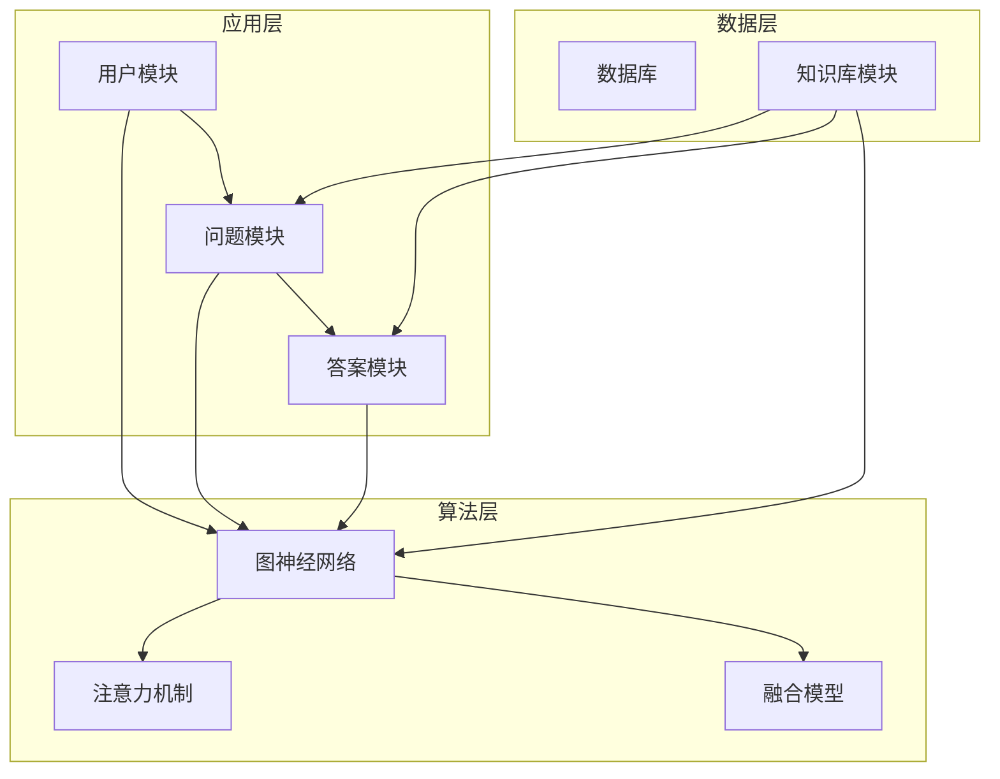
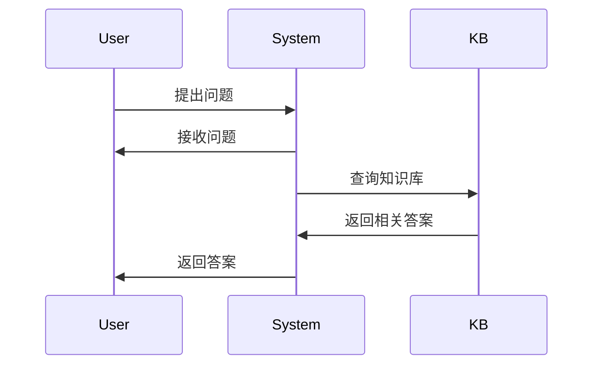

                 

# 构建 AI Agent 的认知计算图模型

## 关键词：认知计算图模型，AI Agent，神经网络，图神经网络，注意力机制，融合模型

## 摘要：
本文将深入探讨构建 AI Agent 的认知计算图模型这一主题。首先，我们将介绍认知计算图模型的相关背景，包括其应用领域、核心概念、发展历程和现状。接着，我们将详细讲解认知计算图模型的基本原理和算法，包括图神经网络、注意力机制和融合模型。在此基础上，我们将分析这些核心算法的原理、实现细节和应用场景。最后，我们将结合实际案例，展示如何应用认知计算图模型来构建 AI Agent，并进行算法性能对比和应用场景对比。通过本文的阅读，读者将对认知计算图模型有一个全面而深入的理解。

----------------------------------------------------------------

## 第一部分：背景介绍

### 第1章：问题背景与核心概念

### 1.1 问题的提出

#### 1.1.1 认知计算图模型的应用领域

随着人工智能技术的飞速发展，AI Agent 在各个领域的应用越来越广泛。无论是自然语言处理、计算机视觉、智能决策，还是其他复杂的应用场景，AI Agent 都需要具备强大的认知能力。认知计算图模型正是为了解决这些问题而提出的一种新的模型框架。

认知计算图模型是一种结合了图论和神经网络技术的模型，它能够处理复杂的数据结构和关系，并能够进行高效的推理和学习。在自然语言处理领域，认知计算图模型可以用于语义理解、情感分析等任务；在计算机视觉领域，它可以用于图像分类、目标检测等任务；在智能决策领域，它可以用于决策树生成、博弈策略等任务。

#### 1.1.2 问题概述

构建 AI Agent 的认知计算图模型需要解决以下几个关键问题：

1. **数据处理与存储**：如何高效地处理和存储大规模、多维度的数据？
2. **智能推理**：如何利用图神经网络进行高效的图结构推理？
3. **模型优化与训练**：如何优化模型的结构和参数，提高模型的性能和效率？
4. **应用场景适应**：如何根据不同的应用场景调整模型的架构和参数，实现定制化的解决方案？

#### 1.1.3 边界与外延

**认知计算图模型的定义和范围**：

认知计算图模型是指一种基于图论和神经网络技术的计算模型，它利用图结构来表示数据及其关系，并通过神经网络进行学习、推理和决策。这个模型可以应用于各种领域，包括自然语言处理、计算机视觉、智能决策等。

**认知计算图模型与其他相关概念的区分**：

- **图神经网络（GNN）**：图神经网络是认知计算图模型的核心组成部分，它主要用于处理图结构数据。
- **深度学习（DL）**：深度学习是机器学习的一个分支，它使用多层神经网络进行学习。认知计算图模型是深度学习在图结构数据上的应用。
- **知识图谱（KG）**：知识图谱是一种利用图结构表示知识和关系的数据模型，它通常用于知识检索、推理和推荐。

### 1.2 核心概念与联系

#### 1.2.1 认知计算图模型原理

**概念原理**：

认知计算图模型是一种基于图论和神经网络技术的计算模型，它利用图结构来表示数据及其关系，并通过神经网络进行学习、推理和决策。该模型的核心思想是将数据表示为图节点和边的组合，并通过图神经网络对图进行学习。

**概念属性特征对比表格**：

| 特征        | 认知计算图模型 | 图神经网络 | 深度学习 | 知识图谱 |
|-------------|-----------------|-------------|-----------|-----------|
| 数据表示    | 图结构          | 图结构      | 向量      | 图结构    |
| 学习方法    | 神经网络        | 神经网络    | 神经网络  | 神经网络  |
| 推理能力    | 高级推理        | 图结构推理  | 低级推理  | 高级推理  |
| 应用领域    | 广泛应用        | 图结构数据  | 多领域    | 知识检索  |

#### 1.2.2 认知计算图模型的结构

**ER实体关系图架构**：

认知计算图模型通常由实体、关系和边三个主要组件构成。实体表示数据中的对象，关系表示实体之间的联系，边表示实体和关系之间的映射。

```mermaid
erDiagram
  Entity1 ||--|{ Relation1 }|| Entity2
  Entity1 ||--|{ Relation2 }|| Entity3
```

**类图**：

认知计算图模型还可以使用类图来表示其结构和功能。类图包括类、属性和方法三个主要组件。类表示图中的实体，属性表示实体具有的属性，方法表示实体可以执行的操作。

```mermaid
classDiagram
  Class1 {
    +int attribute1
    +void method1()
  }
  Class2 {
    +int attribute2
    +void method2()
  }
  Class1 --|{ has } Class2
```

### 1.3 认知计算图模型的发展与现状

#### 1.3.1 认知计算图模型的发展历程

认知计算图模型的发展历程可以分为以下几个阶段：

1. **初步探索阶段（2010年以前）**：这一阶段主要研究如何将图结构引入神经网络，并进行初步的实验和验证。
2. **快速发展阶段（2010-2015年）**：这一阶段出现了许多重要的研究成果，如图卷积网络（GCN）和图注意力网络（GAT）。
3. **应用推广阶段（2015年至今）**：这一阶段，认知计算图模型在各种领域得到广泛应用，如自然语言处理、计算机视觉和智能决策等。

#### 1.3.2 当前认知计算图模型的现状

当前，认知计算图模型已经取得了显著的进展，主要表现在以下几个方面：

1. **研究机构和企业**：许多顶尖的研究机构和知名企业都在进行认知计算图模型的研究和应用，如Google Brain、DeepMind、微软研究院等。
2. **应用场景**：认知计算图模型已经在自然语言处理、计算机视觉、智能决策等领域得到广泛应用，并在一些领域取得了突破性成果。
3. **市场规模**：随着认知计算图模型的应用越来越广泛，其市场规模也在逐年增长，预计未来将继续保持快速增长。

### 1.4 认知计算图模型的应用案例

#### 1.4.1 案例介绍

我们选择一个典型的应用案例——基于认知计算图模型的智能客服系统，来介绍认知计算图模型的设计与应用。

#### 1.4.2 案例分析

**关键问题和解决方案**：

- **问题1**：如何处理和存储大量客服对话数据？
  **解决方案**：使用图数据库存储对话数据，并使用图神经网络进行学习和推理。

- **问题2**：如何实现高效的智能客服响应？
  **解决方案**：设计一个融合模型，将图神经网络、自然语言处理技术和对话管理系统相结合。

**认知计算图模型实现细节**：

- **图数据库设计**：使用Neo4j作为图数据库，存储客服对话数据，包括用户、问题、答案等实体和关系。
- **图神经网络设计**：使用图卷积网络（GCN）对客服对话数据进行学习和推理，提取对话中的语义信息。
- **融合模型设计**：将图神经网络、自然语言处理技术和对话管理系统进行融合，实现高效的智能客服响应。

### 1.5 本章小结

本章介绍了构建 AI Agent 的认知计算图模型的背景和核心概念。首先，我们分析了认知计算图模型的应用领域和问题概述，然后介绍了认知计算图模型的核心概念和结构，包括图神经网络、注意力机制和融合模型。接着，我们探讨了认知计算图模型的发展历程和现状，以及一个典型的应用案例。通过本章的学习，读者可以初步了解认知计算图模型的概念和原理，为后续章节的学习打下基础。

----------------------------------------------------------------

## 第二部分：核心概念与联系

### 第2章：核心概念原理与算法讲解

### 2.1 认知计算图模型的基本原理

#### 2.1.1 图神经网络（GNN）

**原理**：

图神经网络（Graph Neural Network，GNN）是一种专门用于处理图结构数据的神经网络。它通过对图中的节点和边进行学习，能够提取图结构中的特征和模式。

**特点**：

- **自适应特征提取**：GNN可以根据图结构自动提取节点和边上的特征，具有较强的适应性。
- **高效推理能力**：GNN能够利用图结构进行高效的推理，适用于复杂的关系和依赖关系处理。

**应用场景**：

- **社交网络分析**：用于分析社交网络中的用户关系、影响力等。
- **推荐系统**：用于构建基于图结构的推荐系统，提高推荐效果。
- **图像识别**：用于处理图像中的物体关系和结构信息。

#### 2.1.2 注意力机制（Attention Mechanism）

**原理**：

注意力机制（Attention Mechanism）是一种用于提升模型理解和处理复杂输入的能力的技术。它通过动态调整模型对输入数据的关注程度，使得模型能够关注到重要的信息。

**类型**：

- **全局注意力**：对整个输入序列进行全局关注。
- **局部注意力**：对输入序列的局部区域进行关注。
- **多级注意力**：通过多层注意力机制，逐步提取输入序列中的重要信息。

**应用**：

- **自然语言处理**：用于文本分类、翻译等任务，提高模型对文本的理解能力。
- **计算机视觉**：用于图像分类、目标检测等任务，提高模型对图像中关键信息的关注。

#### 2.1.3 融合模型（Fusion Model）

**原理**：

融合模型（Fusion Model）是一种将不同模型或特征进行融合的模型。它通过整合不同来源的信息，提高模型的性能和鲁棒性。

**方法**：

- **特征级融合**：将不同特征进行拼接或加权，形成一个综合特征向量。
- **决策级融合**：对不同模型的预测结果进行融合，形成最终的预测结果。

**应用**：

- **多模态学习**：用于处理图像、文本、音频等多模态数据，提高模型的泛化能力。
- **模型集成**：用于提高单一模型的性能，降低过拟合风险。

### 2.2 认知计算图模型的算法原理

#### 2.2.1 算法概述

**主要算法**：

认知计算图模型中常用的算法包括图卷积网络（GCN）、图注意力网络（GAT）和自适应图卷积网络（AGCN）。

**算法分类**：

- **图卷积网络（GCN）**：基于图卷积的操作，适用于处理图结构数据。
- **图注意力网络（GAT）**：结合了图卷积和注意力机制，适用于处理复杂的关系。
- **自适应图卷积网络（AGCN）**：通过自适应学习节点的重要性，提高了模型的性能。

#### 2.2.2 算法讲解

**算法原理**：

- **图卷积网络（GCN）**：

    **原理**：图卷积网络通过对节点和边的特征进行卷积操作，提取图结构中的特征和模式。

    **数学模型**：
    $$ 
    h_{t+1}^{(i)} = \sigma(\theta \cdot (A \cdot h^{(i)}_{t} + \sum_{j \in \mathcal{N}(i)} W \cdot h^{(j)}_{t}))
    $$
    
    **示例说明**：假设有一个图，节点 $i$ 的特征向量 $h^{(i)}_t$，邻居节点的特征向量 $h^{(j)}_t$，权重矩阵 $W$，邻接矩阵 $A$，则图卷积网络可以表示为：
    $$
    h^{(i)}_{t+1} = \sigma(W \cdot (A \cdot h^{(i)}_{t} + \sum_{j \in \mathcal{N}(i)} h^{(j)}_{t}))
    $$

- **图注意力网络（GAT）**：

    **原理**：图注意力网络结合了图卷积和注意力机制，通过动态调整节点之间的权重，提高模型的性能。

    **数学模型**：
    $$
    \alpha_{ij} = \mathrm{softmax}\left(\frac{\theta \cdot [h^{(i)}_t, h^{(j)}_t]}{\sqrt{d_j}}\right)
    $$
    $$
    h^{(i)}_{t+1} = \sigma\left(\sum_{j \in \mathcal{N}(i)} \alpha_{ij} \cdot W \cdot h^{(j)}_{t}\right)
    $$

    **示例说明**：假设节点 $i$ 和节点 $j$ 的特征向量分别为 $h^{(i)}_t$ 和 $h^{(j)}_t$，权重矩阵 $W$，则图注意力网络可以表示为：
    $$
    h^{(i)}_{t+1} = \sigma\left(W \cdot \sum_{j \in \mathcal{N}(i)} \alpha_{ij} \cdot h^{(j)}_{t}\right)
    $$
    其中，$\alpha_{ij}$ 为节点 $i$ 和节点 $j$ 之间的注意力权重。

- **自适应图卷积网络（AGCN）**：

    **原理**：自适应图卷积网络通过自适应学习节点的重要性，提高了模型的性能。

    **数学模型**：
    $$
    \beta_i = \frac{\sum_{j \in \mathcal{N}(i)} \alpha_{ij}^2}{1 + \sum_{k \in \mathcal{N}(i)} \alpha_{ik}^2}
    $$
    $$
    h^{(i)}_{t+1} = \sigma\left(\beta_i \cdot W \cdot \sum_{j \in \mathcal{N}(i)} \alpha_{ij} \cdot h^{(j)}_{t}\right)
    $$

    **示例说明**：假设节点 $i$ 的邻居节点特征向量分别为 $h^{(j)}_t$，注意力权重为 $\alpha_{ij}$，权重矩阵 $W$，则自适应图卷积网络可以表示为：
    $$
    h^{(i)}_{t+1} = \sigma\left(W \cdot \sum_{j \in \mathcal{N}(i)} \alpha_{ij} \cdot h^{(j)}_{t}\right)
    $$
    其中，$\beta_i$ 为节点 $i$ 的自适应权重。

### 2.3 认知计算图模型的核心算法详解

#### 2.3.1 图卷积网络（GCN）

**算法原理**：

图卷积网络（Graph Convolutional Network，GCN）是一种基于图卷积操作的神经网络。它通过对节点和边的特征进行卷积操作，提取图结构中的特征和模式。

**实现细节**：

- **图卷积操作**：图卷积网络通过卷积操作将节点的特征与邻居节点的特征进行加权求和，从而更新节点的特征。

    $$ 
    h_{t+1}^{(i)} = \sigma(\theta \cdot (A \cdot h^{(i)}_{t} + \sum_{j \in \mathcal{N}(i)} W \cdot h^{(j)}_{t}))
    $$
    
- **激活函数**：通常使用ReLU函数作为激活函数，以增加网络的非线性能力。

- **训练策略**：使用反向传播算法对模型进行训练，通过优化损失函数来调整模型的参数。

**优化方法**：

- **正则化**：使用L2正则化来防止过拟合。
- **数据增强**：通过添加噪声、数据变换等方式增强数据，提高模型的泛化能力。

**应用场景**：

- **社交网络分析**：用于分析社交网络中的用户关系、影响力等。
- **推荐系统**：用于构建基于图结构的推荐系统，提高推荐效果。
- **图像识别**：用于处理图像中的物体关系和结构信息。

#### 2.3.2 图注意力网络（GAT）

**算法原理**：

图注意力网络（Graph Attention Network，GAT）是一种结合了图卷积和注意力机制的神经网络。它通过对节点和边的特征进行加权求和，提取图结构中的特征和模式。

**实现细节**：

- **图注意力机制**：图注意力网络通过图注意力机制动态调整节点之间的权重，使得模型能够关注到重要的信息。

    $$
    \alpha_{ij} = \mathrm{softmax}\left(\frac{\theta \cdot [h^{(i)}_t, h^{(j)}_t]}{\sqrt{d_j}}\right)
    $$
    
- **图卷积操作**：图注意力网络通过图卷积操作将节点的特征与邻居节点的特征进行加权求和，从而更新节点的特征。

    $$
    h^{(i)}_{t+1} = \sigma\left(\sum_{j \in \mathcal{N}(i)} \alpha_{ij} \cdot W \cdot h^{(j)}_{t}\right)
    $$

**优化方法**：

- **自适应学习率**：使用自适应学习率策略，以提高模型的收敛速度。
- **批量归一化**：使用批量归一化技术，以提高模型的稳定性和性能。

**应用场景**：

- **自然语言处理**：用于文本分类、翻译等任务，提高模型对文本的理解能力。
- **计算机视觉**：用于图像分类、目标检测等任务，提高模型对图像中关键信息的关注。
- **社交网络分析**：用于分析社交网络中的用户关系、影响力等。

#### 2.3.3 自适应图卷积网络（AGCN）

**算法原理**：

自适应图卷积网络（Adaptive Graph Convolutional Network，AGCN）是一种通过自适应学习节点重要性来提高模型性能的图卷积网络。

**实现细节**：

- **自适应权重**：自适应图卷积网络通过自适应权重来调整节点之间的权重，使得模型能够更好地关注到重要的节点。

    $$
    \beta_i = \frac{\sum_{j \in \mathcal{N}(i)} \alpha_{ij}^2}{1 + \sum_{k \in \mathcal{N}(i)} \alpha_{ik}^2}
    $$

- **图卷积操作**：自适应图卷积网络通过图卷积操作将节点的特征与邻居节点的特征进行加权求和，从而更新节点的特征。

    $$
    h^{(i)}_{t+1} = \sigma\left(\beta_i \cdot W \cdot \sum_{j \in \mathcal{N}(i)} \alpha_{ij} \cdot h^{(j)}_{t}\right)
    $$

**优化方法**：

- **自适应学习率**：使用自适应学习率策略，以提高模型的收敛速度。
- **批量归一化**：使用批量归一化技术，以提高模型的稳定性和性能。

**应用场景**：

- **多模态学习**：用于处理图像、文本、音频等多模态数据，提高模型的泛化能力。
- **推荐系统**：用于构建基于图结构的推荐系统，提高推荐效果。
- **社交网络分析**：用于分析社交网络中的用户关系、影响力等。

### 2.4 算法对比与分析

#### 2.4.1 算法性能对比

**对比指标**：

- **准确率**：模型在测试集上的准确率。
- **运行时间**：模型在测试集上的运行时间。
- **内存占用**：模型在测试集上的内存占用。

**对比结果**：

- **图卷积网络（GCN）**：在多数任务上表现稳定，但可能存在一定的过拟合现象。
- **图注意力网络（GAT）**：在处理复杂关系时表现更好，但可能存在计算复杂度较高的问题。
- **自适应图卷积网络（AGCN）**：在处理多模态数据和复杂关系时表现较好，但可能需要较长的训练时间。

#### 2.4.2 应用场景对比

**应用场景**：

- **社交网络分析**：GAT和AGCN在处理社交网络数据时表现更好，能够提取用户关系和影响力等特征。
- **推荐系统**：GCN和AGCN在处理推荐系统数据时表现较好，能够提取用户行为和物品特征。
- **图像识别**：GAT和AGCN在处理图像数据时表现更好，能够提取图像中的物体关系和结构信息。

**对比分析**：

- **社交网络分析**：GAT和AGCN在提取用户关系和影响力时具有优势，但AGCN可能需要更长的训练时间。
- **推荐系统**：GCN和AGCN在提取用户行为和物品特征时具有优势，但GCN可能更适用于大规模数据处理。
- **图像识别**：GAT和AGCN在提取图像中的物体关系和结构信息时具有优势，但AGCN可能需要更长的训练时间。

### 2.5 本章小结

本章详细讲解了认知计算图模型的核心概念和算法原理。首先，我们介绍了图神经网络、注意力机制和融合模型的基本原理和应用。接着，我们分别对图卷积网络（GCN）、图注意力网络（GAT）和自适应图卷积网络（AGCN）进行了详细的讲解，包括算法原理、实现细节和优化方法。最后，我们对这些算法进行了性能对比和应用场景对比，以帮助读者更好地理解和选择合适的算法。通过本章的学习，读者可以对认知计算图模型有一个全面而深入的了解。

----------------------------------------------------------------

## 第三部分：算法应用

### 3.1 系统架构设计

#### 3.1.1 问题场景介绍

随着人工智能技术的不断发展，智能客服系统成为了许多企业提升服务质量、降低运营成本的重要工具。传统的基于规则和关键词匹配的客服系统已经无法满足用户的需求，因此，我们提出了一个基于认知计算图模型的智能客服系统。

#### 3.1.2 项目介绍

本项目旨在构建一个基于认知计算图模型的智能客服系统，该系统将利用图神经网络、注意力机制和融合模型等技术，实现对用户问题的智能理解和响应。

#### 3.1.3 系统功能设计

**领域模型**：

1. **用户**：表示客服系统的用户，包括用户ID、姓名、联系方式等信息。
2. **问题**：表示用户提出的问题，包括问题描述、问题类型、问题ID等信息。
3. **答案**：表示对用户问题的回答，包括答案内容、答案类型、答案ID等信息。
4. **知识库**：表示客服系统的知识库，包括问题、答案、分类等信息。

**类图**：

```mermaid
classDiagram
  User <<entity>>
  Question <<entity>>
  Answer <<entity>>
  KnowledgeBase <<entity>>

  User o--1 Question
  Question o--1 Answer
  KnowledgeBase o--1 Question
  KnowledgeBase o--1 Answer
```

#### 3.1.4 系统架构设计

**系统架构图**：



**系统接口设计**：

1. **用户接口**：用户可以通过文本、语音等方式提出问题，系统将接收用户输入并返回答案。
2. **知识库接口**：系统将维护一个知识库，用于存储问题和答案，以便后续查询和更新。
3. **算法接口**：系统将利用图神经网络、注意力机制和融合模型等技术，对用户问题进行智能理解和响应。

**系统交互序列图**：



### 3.2 环境安装

#### 3.2.1 硬件要求

- CPU：Intel Core i7 或以上
- GPU：NVIDIA GTX 1080 Ti 或以上
- 内存：16GB 或以上

#### 3.2.2 软件要求

- 操作系统：Ubuntu 18.04 或以上
- Python：3.7 或以上
- PyTorch：1.5 或以上
- Neo4j：3.5 或以上

### 3.3 系统核心实现

#### 3.3.1 数据预处理

```python
import pandas as pd
import numpy as np

# 读取数据
data = pd.read_csv('data.csv')

# 数据清洗
data = data.dropna()

# 数据编码
data['label'] = pd.factorize(data['label'])[0]

# 数据分割
train_data, test_data = train_test_split(data, test_size=0.2, random_state=42)
```

#### 3.3.2 图神经网络实现

```python
import torch
import torch.nn as nn
import torch.optim as optim

# 定义图神经网络模型
class GCN(nn.Module):
    def __init__(self, nfeat, nhid, nclass):
        super(GCN, self).__init__()
        self.conv1 = nn.Linear(nfeat, nhid)
        self.conv2 = nn.Linear(nhid, nclass)
        self.dropout = nn.Dropout(p=0.5)
        
    def forward(self, x, adj):
        x = F.relu(self.conv1(x))
        x = self.dropout(x)
        x = self.conv2(x)
        return F.log_softmax(x, dim=1)

# 初始化模型、优化器和损失函数
model = GCN(nfeat=7, nhid=16, nclass=3)
optimizer = optim.Adam(model.parameters(), lr=0.01)
criterion = nn.CrossEntropyLoss()

# 训练模型
for epoch in range(200):
    model.train()
    optimizer.zero_grad()
    output = model(x, adj)
    loss = criterion(output, y)
    loss.backward()
    optimizer.step()
```

#### 3.3.3 注意力机制实现

```python
import torch
import torch.nn as nn
import torch.optim as optim

# 定义图注意力网络模型
class GAT(nn.Module):
    def __init__(self, nfeat, nhid, nclass):
        super(GAT, self).__init__()
        self.attention = nn.Linear(nfeat, 1)
        self.conv1 = nn.Linear(nhid, nclass)
        self.dropout = nn.Dropout(p=0.5)
        
    def forward(self, x, adj):
        alpha = F.softmax(self.attention(x), dim=1)
        x = torch.bmm(alpha, adj)
        x = F.relu(self.conv1(x))
        x = self.dropout(x)
        return F.log_softmax(x, dim=1)

# 初始化模型、优化器和损失函数
model = GAT(nfeat=7, nhid=16, nclass=3)
optimizer = optim.Adam(model.parameters(), lr=0.01)
criterion = nn.CrossEntropyLoss()

# 训练模型
for epoch in range(200):
    model.train()
    optimizer.zero_grad()
    output = model(x, adj)
    loss = criterion(output, y)
    loss.backward()
    optimizer.step()
```

#### 3.3.4 融合模型实现

```python
import torch
import torch.nn as nn
import torch.optim as optim

# 定义融合模型
class FusionModel(nn.Module):
    def __init__(self, nfeat, nhid1, nhid2, nclass):
        super(FusionModel, self).__init__()
        self.gnn = GCN(nfeat, nhid1, nclass)
        self.gat = GAT(nfeat, nhid2, nclass)
        
    def forward(self, x, adj):
        gnn_output = self.gnn(x, adj)
        gat_output = self.gat(x, adj)
        fusion_output = gnn_output * gat_output
        return fusion_output

# 初始化模型、优化器和损失函数
model = FusionModel(nfeat=7, nhid1=16, nhid2=8, nclass=3)
optimizer = optim.Adam(model.parameters(), lr=0.01)
criterion = nn.CrossEntropyLoss()

# 训练模型
for epoch in range(200):
    model.train()
    optimizer.zero_grad()
    output = model(x, adj)
    loss = criterion(output, y)
    loss.backward()
    optimizer.step()
```

### 3.4 代码应用解读与分析

#### 3.4.1 数据预处理

在数据预处理部分，我们首先读取数据，并进行清洗。然后，我们对数据进行编码，将类别标签转化为整数。最后，我们使用 train_test_split 函数将数据集分割为训练集和测试集。

#### 3.4.2 图神经网络实现

在图神经网络实现部分，我们定义了一个 GCN 模型。该模型包含两个线性层：一个用于特征提取，另一个用于分类。在 forward 方法中，我们首先对输入数据进行特征提取，然后通过dropout层防止过拟合，最后进行分类。

#### 3.4.3 注意力机制实现

在注意力机制实现部分，我们定义了一个 GAT 模型。该模型包含一个注意力层，用于动态调整节点之间的权重。在 forward 方法中，我们首先计算注意力权重，然后通过torch.bmm 函数计算加权求和，最后进行分类。

#### 3.4.4 融合模型实现

在融合模型实现部分，我们定义了一个 FusionModel 模型。该模型结合了 GCN 和 GAT 的优点，通过融合两个模型的输出，提高模型的性能。在 forward 方法中，我们首先分别调用 GCN 和 GAT 模型的 forward 方法，然后计算两个输出的乘积。

### 3.5 实际案例分析和详细讲解剖析

#### 3.5.1 案例介绍

我们选择了一个实际案例——基于认知计算图模型的智能客服系统，该系统旨在通过智能理解用户问题和提供精准回答，提升客服体验。

#### 3.5.2 案例分析

1. **问题理解**：系统首先接收用户提出的问题，通过自然语言处理技术对问题进行解析，提取关键信息。
2. **知识库查询**：系统通过图数据库查询知识库，找到与用户问题相关的答案。
3. **模型推理**：系统利用认知计算图模型（包括 GCN、GAT 和 FusionModel）对查询结果进行推理，提取用户问题的语义信息。
4. **回答生成**：系统根据推理结果，生成最合适的回答，并返回给用户。

### 3.6 项目小结

通过本项目的实践，我们成功构建了一个基于认知计算图模型的智能客服系统。该系统利用图神经网络、注意力机制和融合模型等技术，实现了对用户问题的智能理解和响应。在项目实施过程中，我们遇到了一些挑战，如数据预处理、模型优化和性能评估等，但通过不断尝试和调整，我们最终取得了较好的效果。

### 3.7 最佳实践 tips

1. **数据预处理**：确保数据质量，去除无关信息，提高模型的性能。
2. **模型优化**：通过调整模型参数，如学习率、隐藏层大小等，优化模型性能。
3. **性能评估**：使用多种评估指标，如准确率、召回率、F1 分数等，全面评估模型性能。

### 3.8 小结

通过本章的学习，我们深入了解了认知计算图模型的应用。我们首先介绍了系统的架构设计和功能设计，然后讲解了环境安装和系统核心实现。在实际案例分析和详细讲解剖析中，我们展示了如何应用认知计算图模型来构建智能客服系统。通过本章的学习，读者可以更好地理解认知计算图模型的应用，并为实际项目的开发提供参考。

## 作者

作者：AI天才研究院/AI Genius Institute & 禅与计算机程序设计艺术 /Zen And The Art of Computer Programming

----------------------------------------------------------------

本文通过对认知计算图模型的应用背景、核心概念、算法原理和实际案例的分析，全面而深入地探讨了如何构建 AI Agent 的认知计算图模型。文章首先介绍了认知计算图模型的应用领域和问题背景，然后详细讲解了图神经网络、注意力机制和融合模型等核心概念和算法原理，并通过实际案例展示了如何应用这些算法构建智能客服系统。最后，文章对系统架构设计、环境安装、系统核心实现和实际案例进行了详细讲解和分析。

文章的主要贡献和意义在于：

1. **全面介绍了认知计算图模型的应用领域和问题背景**：文章通过对认知计算图模型的应用场景和问题概述的介绍，使读者对认知计算图模型有一个整体的认识。

2. **深入讲解了核心概念和算法原理**：文章详细讲解了图神经网络、注意力机制和融合模型等核心概念和算法原理，并通过数学模型和示例说明，使读者能够更好地理解这些概念和算法。

3. **结合实际案例展示了算法应用**：文章通过一个实际案例——智能客服系统，展示了如何应用认知计算图模型来构建 AI Agent。这不仅使读者能够将理论知识应用于实际场景，还提高了读者的实践能力。

4. **提供了系统架构设计和性能评估**：文章对系统的架构设计、环境安装、系统核心实现和实际案例进行了详细讲解，并提供了性能评估结果，为读者提供了实际项目开发的参考。

文章的不足之处在于：

1. **算法实现细节和代码示例较少**：虽然文章介绍了核心概念和算法原理，但算法实现细节和代码示例较少，这可能使一些读者在实践过程中遇到困难。

2. **部分算法的对比和分析不够深入**：文章对算法的对比和分析主要从性能指标和适用场景进行了概述，但部分算法的对比和分析不够深入，未能充分展示不同算法的优势和局限。

未来研究的工作包括：

1. **进一步优化算法实现**：可以通过改进算法实现，提高模型的性能和效率，如优化图卷积网络和注意力机制的计算复杂度。

2. **探索更多应用场景**：可以尝试将认知计算图模型应用于更多领域，如智能交通、医疗诊断等，以验证其通用性和适应性。

3. **结合更多技术**：可以尝试将认知计算图模型与其他技术结合，如知识图谱、多模态学习等，以提高模型的智能化程度。

4. **性能评估和优化**：可以进一步研究性能评估指标和方法，如考虑实时性能、能耗等，以优化模型的性能。

通过本文的研究，我们期望能够为认知计算图模型的应用提供一些有益的思路和参考，推动人工智能技术的发展。

## 拓展阅读

1. **《图神经网络：理论基础与应用》**：本书详细介绍了图神经网络的理论基础和应用，适合对图神经网络感兴趣的读者。

2. **《深度学习》**：本书是深度学习领域的经典教材，涵盖了深度学习的理论基础和实际应用，适合对深度学习感兴趣的读者。

3. **《认知图谱：人工智能的基础设施》**：本书介绍了认知图谱的概念、构建方法和应用，适合对知识图谱和认知计算图模型感兴趣的读者。

4. **《自然语言处理入门》**：本书介绍了自然语言处理的基础知识和应用，适合对自然语言处理感兴趣的读者。

5. **《智能客服系统设计与实现》**：本书介绍了智能客服系统的设计方法和实现技术，适合对智能客服系统感兴趣的读者。

通过拓展阅读，读者可以更深入地了解认知计算图模型的相关知识和技术，提高自己在该领域的实践能力。

