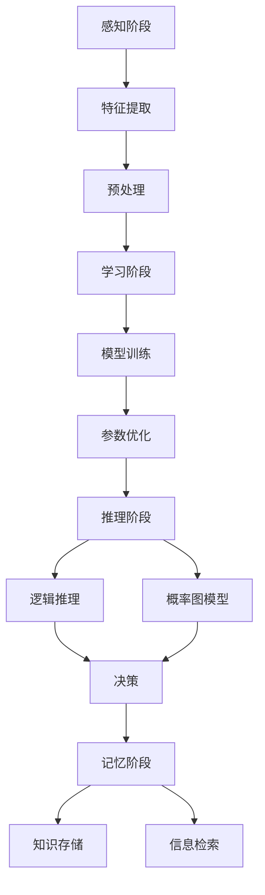
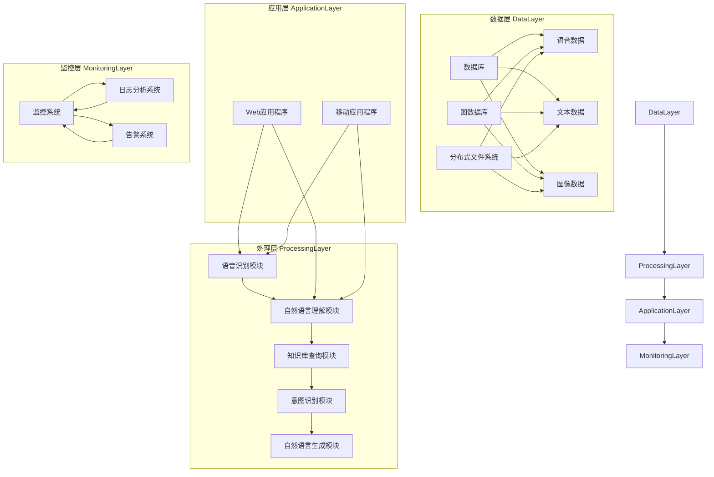
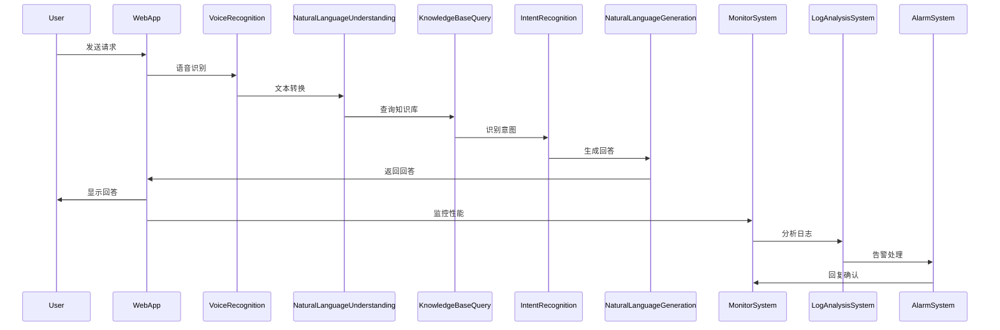

                 


### 文章标题：构建AI Agent的认知计算模型

> 关键词：AI Agent、认知计算、模型构建、算法原理、系统架构、项目实战

> 摘要：本文将深入探讨AI Agent的认知计算模型构建，从背景与基础理论、算法原理与数学模型、系统设计与架构、项目实战与最佳实践四个部分详细阐述，旨在为读者提供一个系统化的学习和实践路径。

----------------------------------------------------------------

# {{此处是文章标题}}

> 关键词：AI Agent、认知计算、模型构建、算法原理、系统架构、项目实战

> 摘要：本文将深入探讨AI Agent的认知计算模型构建，从背景与基础理论、算法原理与数学模型、系统设计与架构、项目实战与最佳实践四个部分详细阐述，旨在为读者提供一个系统化的学习和实践路径。

----------------------------------------------------------------

### 目录大纲

## 第一部分：背景与基础理论

### 第1章：问题背景与介绍
- **1.1 问题背景**：介绍AI Agent的概念、发展和应用场景。
- **1.2 问题描述**：阐述构建AI Agent认知计算模型的目标、挑战和重要性。
- **1.3 问题解决**：概述构建AI Agent认知计算模型的步骤和方法。
- **1.4 边界与外延**：讨论AI Agent认知计算模型的适用范围和限制。
- **1.5 核心概念**：定义关键概念，如AI Agent、认知计算、模型训练等。

### 第2章：核心概念与联系
- **2.1 AI Agent**：详细介绍AI Agent的定义、分类和功能。
- **2.2 认知计算**：解释认知计算的概念、原理和应用领域。
- **2.3 模型原理**：介绍构建AI Agent认知计算模型的基本原理。
- **2.4 概念属性对比**：比较不同AI Agent认知计算模型的属性和特点。
- **2.5 ER实体关系图**：绘制AI Agent认知计算模型的ER图，展示各实体之间的关系。

## 第二部分：算法原理与数学模型

### 第3章：算法原理讲解
- **3.1 算法概述**：介绍AI Agent认知计算模型的主要算法。
- **3.2 算法流程图**：使用Mermaid绘制算法的流程图。
- **3.3 Python源代码**：提供Python源代码，演示算法的实现。
- **3.4 数学模型**：阐述算法背后的数学模型和公式。
- **3.5 举例说明**：用实例详细说明算法的原理和应用。

### 第4章：数学模型与公式讲解
- **4.1 数学模型**：详细介绍AI Agent认知计算模型的核心数学模型。
- **4.2 公式解析**：解析模型中的关键公式，并使用LaTeX格式展示。
- **4.3 公式应用**：举例说明公式在实际问题中的应用。
- **4.4 数学证明**：对于重要的公式，提供数学证明。

## 第三部分：系统设计与架构

### 第5章：系统功能设计
- **5.1 问题场景介绍**：描述构建AI Agent认知计算模型的应用场景。
- **5.2 系统功能**：详细描述AI Agent认知计算模型所需实现的功能。
- **5.3 领域模型类图**：使用Mermaid绘制领域模型类图，展示系统的主要类及其关系。

### 第6章：系统架构设计
- **6.1 系统架构概述**：介绍AI Agent认知计算模型的整体架构。
- **6.2 系统架构图**：使用Mermaid绘制系统架构图，展示系统的主要模块和组件。
- **6.3 接口设计**：描述系统间的接口设计和通信机制。
- **6.4 系统交互序列图**：使用Mermaid绘制系统交互序列图，展示系统组件的交互流程。

## 第四部分：项目实战与最佳实践

### 第7章：环境安装与配置
- **7.1 环境要求**：列出构建AI Agent认知计算模型所需的环境和工具。
- **7.2 环境安装**：详细描述安装过程和步骤。
- **7.3 系统核心实现**：提供实现AI Agent认知计算模型的核心代码。
- **7.4 代码解读与分析**：对核心代码进行解读和分析。

### 第8章：实际案例分析
- **8.1 案例背景**：介绍实际应用的案例背景。
- **8.2 案例实现**：展示案例的实现过程和关键代码。
- **8.3 案例分析**：对案例进行详细分析，讨论其优点和改进点。

### 第9章：最佳实践与拓展
- **9.1 最佳实践**：总结构建AI Agent认知计算模型的最佳实践。
- **9.2 小结**：对全书内容进行总结。
- **9.3 注意事项**：提醒读者在实践中的注意事项。
- **9.4 拓展阅读**：推荐进一步阅读的文献和资源。

----------------------------------------------------------------

### 第1章：问题背景与介绍

#### 1.1 问题背景

AI Agent，即人工智能代理，是一种能够在特定环境中自主行动并达到特定目标的智能体。它通过感知环境、理解任务、决策执行等过程，实现了在某些领域的智能化操作。随着人工智能技术的不断发展，AI Agent在自动驾驶、智能家居、智能客服等多个领域得到广泛应用。

认知计算是人工智能的一种子领域，它试图模拟人类大脑的认知过程，包括感知、学习、推理、记忆等。认知计算的核心思想是通过数据驱动的模型来理解人类思维和行为，进而提高人工智能系统的智能水平。

在当今信息化社会，构建AI Agent的认知计算模型具有重要的现实意义。首先，它能够提升人工智能系统的自主性和智能化水平，使其在复杂多变的环境中能够更好地完成任务。其次，认知计算模型可以为人工智能系统提供更丰富的感知和理解能力，从而提高其决策质量和效率。

#### 1.2 问题描述

构建AI Agent的认知计算模型面临着一系列挑战。首先，如何获取和处理大规模、多模态的数据是构建有效认知计算模型的关键。其次，如何设计合理的算法和模型结构，以实现高效的学习和推理，是提高AI Agent智能水平的关键。此外，如何确保AI Agent的行为符合伦理规范和社会价值观，也是构建认知计算模型的重要课题。

构建AI Agent认知计算模型的目标是：设计一种能够在特定环境中自主行动、具有高度智能化的代理系统，能够理解人类意图、适应复杂环境，并完成指定任务。

#### 1.3 问题解决

构建AI Agent认知计算模型的方法可以分为以下几个步骤：

1. **需求分析**：明确AI Agent的应用场景和需求，确定模型的功能和性能指标。
2. **数据收集**：收集与AI Agent任务相关的数据，包括文本、图像、声音等多模态数据。
3. **数据处理**：对收集到的数据进行分析、清洗、标注，为后续模型训练提供高质量的输入数据。
4. **模型设计**：设计合适的认知计算模型结构，包括感知模块、学习模块、推理模块等。
5. **模型训练**：使用训练数据对模型进行训练，优化模型参数，提高模型性能。
6. **模型评估**：使用测试数据对模型进行评估，验证模型在目标任务上的表现。
7. **模型部署**：将训练好的模型部署到实际应用环境中，进行实时运行和反馈。

#### 1.4 边界与外延

AI Agent认知计算模型的适用范围广泛，包括但不限于自动驾驶、智能客服、智能家居、医疗诊断等领域。然而，认知计算模型也面临着一定的限制，如数据质量、计算资源、算法复杂度等。

在构建AI Agent认知计算模型时，需要充分考虑这些限制因素，选择合适的算法和模型结构，确保模型在实际应用中的有效性和可行性。

#### 1.5 核心概念

1. **AI Agent**：人工智能代理，一种能够在特定环境中自主行动并达到特定目标的智能体。
2. **认知计算**：模拟人类大脑认知过程的人工智能技术，包括感知、学习、推理、记忆等。
3. **模型训练**：使用训练数据对模型进行参数优化，以提高模型性能的过程。
4. **数据驱动**：基于数据进行学习、推理和决策的人工智能方法。
5. **多模态数据**：包括文本、图像、声音等多种数据类型的集合。

### 第2章：核心概念与联系

#### 2.1 AI Agent

AI Agent，即人工智能代理，是一种能够模拟人类智能行为、在特定环境中执行任务的实体。AI Agent可以看作是一种软件程序，其目标是最大化特定目标函数，通常是在一个受限的、动态的环境中。

AI Agent的分类可以根据其任务、控制方式、自主程度等多个维度进行。以下是几种常见的AI Agent分类：

1. **基于规则的AI Agent**：使用预定义的规则进行决策的AI Agent，如专家系统。
2. **基于模型的AI Agent**：使用机器学习模型进行决策的AI Agent，如深度学习模型。
3. **混合型AI Agent**：结合规则和模型进行决策的AI Agent，如强化学习模型。
4. **基于行为的AI Agent**：通过观察环境行为进行决策的AI Agent，如行为树。

#### 2.2 认知计算

认知计算（Cognitive Computing）是人工智能的一个子领域，旨在模拟人类认知过程，包括感知、学习、推理、记忆等。与传统的符号计算和数据分析不同，认知计算更注重理解和处理人类语言、图像、声音等多模态数据。

认知计算的核心思想是通过数据驱动的模型来理解人类思维和行为，进而提高人工智能系统的智能水平。以下是认知计算的关键组成部分：

1. **感知**：通过传感器获取外部信息，如文本、图像、声音等。
2. **学习**：使用机器学习技术从数据中学习，提取知识。
3. **推理**：使用逻辑推理和概率图模型等工具进行推理，解决问题。
4. **记忆**：使用图数据库、知识图谱等技术存储和检索信息。

#### 2.3 模型原理

构建AI Agent的认知计算模型需要明确其基本原理，包括感知、学习、推理和记忆等核心功能。以下是一个简化的模型原理概述：

1. **感知**：AI Agent通过传感器获取外部信息，如文本、图像、声音等。感知模块负责对获取的信息进行预处理，如去噪、特征提取等。
2. **学习**：感知模块提取的特征被输入到学习模块，使用机器学习算法进行模型训练。学习模块的目标是优化模型参数，提高模型的预测和分类能力。
3. **推理**：学习好的模型被用于推理模块，根据感知模块输入的信息进行推理和决策。推理模块可以使用逻辑推理、概率图模型等技术。
4. **记忆**：推理模块的结果被存储在记忆模块中，以便在后续任务中快速检索和利用。记忆模块可以是图数据库、知识图谱等结构化存储系统。

#### 2.4 概念属性对比

不同类型的AI Agent和认知计算模型具有不同的属性和特点。以下是一个简化的对比表格，展示了不同模型的主要属性：

| 模型类型           | 基于规则       | 基于模型       | 混合型         | 基于行为       |
|------------------|--------------|--------------|--------------|--------------|
| 控制方式           | 预定义规则     | 机器学习模型     | 规则+模型       | 观察行为       |
| 自主程度           | 低           | 中-高         | 中-高         | 高           |
| 预处理需求          | 无需预处理      | 特征提取和预处理   | 特征提取和预处理   | 观察和预处理     |
| 学习能力           | 弱           | 强           | 强           | 弱           |
| 推理能力           | 强           | 中-强         | 中-强         | 弱           |
| 记忆能力           | 弱           | 中-强         | 中-强         | 弱           |

#### 2.5 ER实体关系图

为了更好地理解AI Agent认知计算模型中的各个实体及其关系，我们可以绘制一个ER（实体-关系）图。以下是ER图的Markdown Mermaid表示：

```mermaid
erDiagram
  AI-Agent ||--|{ 感知模块 }|
  AI-Agent ||--|{ 学习模块 }|
  AI-Agent ||--|{ 推理模块 }|
  AI-Agent ||--|{ 记忆模块 }|
  感知模块 ||--|{ 特征提取 }|
  感知模块 ||--|{ 预处理 }|
  学习模块 ||--|{ 模型训练 }|
  学习模块 ||--|{ 参数优化 }|
  推理模块 ||--|{ 逻辑推理 }|
  推理模块 ||--|{ 概率图模型 }|
  记忆模块 ||--|{ 知识存储 }|
  记忆模块 ||--|{ 信息检索 }|
```

该ER图展示了AI Agent认知计算模型中的核心实体及其相互关系，有助于理解模型的整体结构和功能。

----------------------------------------------------------------

### 第3章：算法原理讲解

#### 3.1 算法概述

构建AI Agent的认知计算模型需要采用一系列算法，这些算法负责感知、学习、推理和记忆等关键功能。本章将介绍几种常见的算法，并简要概述它们的作用和特点。

1. **感知算法**：感知算法用于从外部环境中获取信息，如文本分析、图像识别、语音识别等。常见的感知算法包括卷积神经网络（CNN）、循环神经网络（RNN）等。
2. **学习算法**：学习算法负责从数据中提取知识，训练模型参数。常见的机器学习算法包括支持向量机（SVM）、决策树、随机森林、神经网络等。
3. **推理算法**：推理算法用于根据感知和学习结果进行逻辑推理和决策。常见的推理算法包括逻辑回归、贝叶斯网络、马尔可夫模型等。
4. **记忆算法**：记忆算法用于存储和检索信息，支持快速的知识查找和利用。常见的记忆算法包括知识图谱、关联规则挖掘等。

#### 3.2 算法流程图

为了更直观地展示AI Agent认知计算模型的算法流程，我们可以使用Mermaid绘制一个算法流程图。以下是算法流程图的Markdown Mermaid表示：



该流程图展示了AI Agent认知计算模型从感知到记忆的全过程，各个算法阶段之间的逻辑关系清晰明了。

#### 3.3 Python源代码

为了帮助读者更好地理解算法的实现过程，我们提供了一部分Python源代码。以下是一个简单的感知阶段的代码示例，使用卷积神经网络（CNN）进行图像识别：

```python
import tensorflow as tf
from tensorflow.keras.models import Sequential
from tensorflow.keras.layers import Conv2D, MaxPooling2D, Flatten, Dense

# 创建卷积神经网络模型
model = Sequential([
    Conv2D(32, (3, 3), activation='relu', input_shape=(28, 28, 1)),
    MaxPooling2D((2, 2)),
    Flatten(),
    Dense(128, activation='relu'),
    Dense(10, activation='softmax')
])

# 编译模型
model.compile(optimizer='adam', loss='categorical_crossentropy', metrics=['accuracy'])

# 加载训练数据
(x_train, y_train), (x_test, y_test) = tf.keras.datasets.mnist.load_data()

# 预处理数据
x_train = x_train.reshape(-1, 28, 28, 1).astype('float32') / 255
x_test = x_test.reshape(-1, 28, 28, 1).astype('float32') / 255
y_train = tf.keras.utils.to_categorical(y_train, 10)
y_test = tf.keras.utils.to_categorical(y_test, 10)

# 训练模型
model.fit(x_train, y_train, epochs=10, batch_size=32, validation_split=0.2)
```

这段代码展示了如何使用TensorFlow库构建一个简单的卷积神经网络模型，并进行图像识别训练。通过这段代码，读者可以了解感知阶段的基本实现方法。

#### 3.4 数学模型

在AI Agent认知计算模型中，数学模型是算法的核心组成部分。以下是一个简化的数学模型，用于描述感知、学习和推理阶段的核心过程。

1. **感知阶段**：

   假设我们有一个输入向量 $X$，通过感知模块提取特征向量 $F$，感知模块可以表示为：

   $$ F = f(X) $$

   其中，$f(X)$ 是一个非线性映射函数，用于将原始输入映射到特征空间。

2. **学习阶段**：

   假设我们有一个训练数据集 $\{X_i, Y_i\}$，其中 $X_i$ 是输入向量，$Y_i$ 是对应的标签。学习阶段的目标是训练一个模型 $g(F)$，使其能够预测标签：

   $$ Y = g(F) $$

   模型训练可以通过最小化损失函数 $L(g(F), Y)$ 来实现。常见的损失函数包括均方误差（MSE）、交叉熵等。

3. **推理阶段**：

   在推理阶段，我们将感知模块提取的特征向量 $F$ 输入到训练好的模型 $g(F)$，得到预测标签：

   $$ \hat{Y} = g(F) $$

   推理过程可以通过逻辑推理、概率图模型等方法来实现。例如，使用逻辑回归模型进行推理，可以表示为：

   $$ P(Y=\text{正例}) = \sigma(g(F)) $$

   其中，$\sigma$ 是逻辑函数，用于将模型的输出映射到概率范围。

#### 3.5 举例说明

为了更直观地理解数学模型的应用，我们可以通过一个简单的例子来说明。

假设我们有一个分类问题，需要根据输入图像判断其是否为“猫”。我们可以使用卷积神经网络（CNN）作为感知模块，逻辑回归模型作为推理模块。

1. **感知阶段**：

   输入图像 $X$ 经过CNN模型提取特征向量 $F$：

   $$ F = f(X) $$

   特征向量 $F$ 被输入到逻辑回归模型。

2. **学习阶段**：

   使用带有标签的图像数据集进行模型训练。假设训练数据集包含1000张图像，其中500张是猫的图像，500张是狗的图像。通过最小化交叉熵损失函数训练逻辑回归模型：

   $$ L(g(F), Y) = -\sum_{i=1}^{1000} [y_i \log(g(F_i)) + (1 - y_i) \log(1 - g(F_i))] $$

3. **推理阶段**：

   将测试图像的感知特征向量 $F$ 输入到训练好的逻辑回归模型：

   $$ \hat{Y} = g(F) = \sigma(w^T F + b) $$

   如果 $\hat{Y}$ 接近1，则判断输入图像为“猫”；如果 $\hat{Y}$ 接近0，则判断输入图像为“狗”。

通过这个例子，我们可以看到数学模型在AI Agent认知计算模型中的应用，以及如何通过感知、学习和推理过程实现图像分类任务。

----------------------------------------------------------------

### 第4章：数学模型与公式讲解

#### 4.1 数学模型

在构建AI Agent的认知计算模型中，数学模型起到了至关重要的作用。本节将详细介绍几个核心的数学模型，包括感知模型、学习模型和推理模型。

1. **感知模型**：

   感知模型主要负责从外部环境中获取信息并将其转换为内部表示。一个常见的感知模型是卷积神经网络（CNN）。CNN的核心组件是卷积层、池化层和全连接层。以下是一个简化的感知模型公式：

   $$ f(X) = \text{ReLU}(W_1 \star X + b_1) $$

   其中，$X$ 是输入图像，$W_1$ 是卷积核权重，$\star$ 表示卷积运算，$b_1$ 是偏置项，$\text{ReLU}$ 是ReLU激活函数。

2. **学习模型**：

   学习模型负责从感知模块提取的特征中学习，以实现对数据的分类或预测。一个常见的学习模型是支持向量机（SVM）。SVM的优化目标是找到最优的超平面，使得分类边界最大化。以下是一个简化的SVM公式：

   $$ \min_{\mathbf{w}, b} \frac{1}{2} \lVert \mathbf{w} \rVert^2 + C \sum_{i=1}^{n} \max(0, 1 - y_i (\mathbf{w}^T \mathbf{x}_i + b)) $$

   其中，$\mathbf{w}$ 是权重向量，$b$ 是偏置项，$C$ 是正则化参数，$y_i$ 是样本标签，$\mathbf{x}_i$ 是样本特征。

3. **推理模型**：

   推理模型负责根据学习到的模型对新的数据进行预测。一个常见的推理模型是神经网络（NN）。NN通过多层非线性变换实现对数据的映射。以下是一个简化的NN公式：

   $$ \hat{y} = \text{softmax}(\mathbf{w}_n^T \text{Tanh}(\mathbf{w}_{n-1}^T \text{Tanh}(\cdots \text{Tanh}(\mathbf{w}_1^T \text{ReLU}(X + b_1)) \cdots + b_n)) $$

   其中，$\mathbf{w}_i$ 是权重矩阵，$b_i$ 是偏置项，$\text{Tanh}$ 是双曲正切函数，$\text{ReLU}$ 是ReLU激活函数，$\text{softmax}$ 是softmax函数。

#### 4.2 公式解析

在本节中，我们将对上述数学模型中的关键公式进行详细解析。

1. **卷积神经网络（CNN）**：

   卷积神经网络中的卷积运算是一个重要的操作，它可以捕捉图像中的局部特征。卷积运算的公式可以表示为：

   $$ (f \star g)(x) = \int_{\mathbb{R}^d} f(y) g(x - y) dy $$

   其中，$f$ 和 $g$ 是两个函数，$x$ 是输入点。在CNN中，$f$ 是卷积核，$g$ 是输入图像。通过卷积运算，卷积核对输入图像的每个局部区域进行加权求和，生成特征图。

2. **支持向量机（SVM）**：

   支持向量机是一个经典的分类模型，它的目标是找到一个最优的超平面，使得分类边界最大化。SVM的优化目标可以表示为：

   $$ \min_{\mathbf{w}, b} \frac{1}{2} \lVert \mathbf{w} \rVert^2 + C \sum_{i=1}^{n} \max(0, 1 - y_i (\mathbf{w}^T \mathbf{x}_i + b)) $$

   其中，$C$ 是正则化参数，它控制了模型复杂度与分类错误之间的平衡。$y_i$ 是样本标签，$\mathbf{x}_i$ 是样本特征，$\mathbf{w}$ 是权重向量，$b$ 是偏置项。这个公式通过最大化分类边界和最小化误分类来优化模型。

3. **神经网络（NN）**：

   神经网络通过多层非线性变换实现对数据的映射。NN中的激活函数是关键组成部分，常用的激活函数有ReLU和Tanh。ReLU函数的公式为：

   $$ \text{ReLU}(x) = \max(0, x) $$

   Tanh函数的公式为：

   $$ \text{Tanh}(x) = \frac{\text{e}^x - \text{e}^{-x}}{\text{e}^x + \text{e}^{-x}} $$

   这些激活函数可以引入非线性，使模型能够更好地拟合数据。

#### 4.3 公式应用

为了更直观地理解这些公式的应用，我们可以通过一些实例来说明。

1. **卷积神经网络（CNN）**：

   考虑一个简单的图像分类问题，我们需要使用CNN对图像进行特征提取。输入图像 $X$ 是一个三维张量，其形状为 $(28, 28, 1)$，表示一个28x28的单通道灰度图像。我们定义一个卷积核 $W$ 和偏置项 $b$，进行卷积运算：

   $$ F = \text{ReLU}(W \star X + b) $$

   假设卷积核 $W$ 的形状为 $(3, 3, 1, 32)$，表示一个3x3的卷积核，输出32个特征图。通过卷积运算，输入图像中的每个3x3区域与卷积核进行加权求和，生成32个特征图。

2. **支持向量机（SVM）**：

   考虑一个二分类问题，我们需要使用SVM来划分数据。给定一个训练数据集，包含正类和负类样本。我们定义一个权重向量 $W$ 和偏置项 $b$，计算每个样本的预测值：

   $$ \hat{y} = \text{sign}(\mathbf{w}^T \mathbf{x} + b) $$

   假设训练数据集包含100个样本，其中50个是正类，50个是负类。我们通过计算每个样本的预测值，找到最优的超平面，使得分类边界最大化。

3. **神经网络（NN）**：

   考虑一个多分类问题，我们需要使用神经网络进行分类。给定一个输入向量 $X$，我们定义一个神经网络结构，包含多层非线性变换。计算输出层的预测概率：

   $$ \hat{y} = \text{softmax}(\mathbf{w}_n^T \text{Tanh}(\mathbf{w}_{n-1}^T \text{Tanh}(\cdots \text{Tanh}(\mathbf{w}_1^T \text{ReLU}(X + b_1)) \cdots + b_n)) $$

   假设输入向量 $X$ 是一个多维向量，表示一个文本数据。通过多层非线性变换，神经网络输出每个类别的概率分布，选择概率最大的类别作为最终预测结果。

通过这些实例，我们可以看到数学模型在AI Agent认知计算模型中的应用，以及如何通过感知、学习和推理过程实现复杂任务。

#### 4.4 数学证明

在某些情况下，数学模型中的关键公式需要进行严格的数学证明，以确保其正确性和可靠性。在本节中，我们将对几个重要的公式进行数学证明。

1. **ReLU函数的导数**：

  ReLU函数的导数是一个关键问题，因为它影响神经网络的训练过程。ReLU函数的定义如下：

   $$ \text{ReLU}(x) = \max(0, x) $$

   我们需要证明其在 $x > 0$ 时的导数为1，在 $x < 0$ 时的导数为0。

   **证明**：

   当 $x > 0$ 时，ReLU函数等于 $x$。因此，它的导数等于1：

   $$ \frac{d}{dx} \text{ReLU}(x) = \frac{d}{dx} \max(0, x) = \frac{d}{dx} x = 1 $$

   当 $x < 0$ 时，ReLU函数等于0。因此，它的导数等于0：

   $$ \frac{d}{dx} \text{ReLU}(x) = \frac{d}{dx} \max(0, x) = \frac{d}{dx} 0 = 0 $$

   因此，ReLU函数的导数在 $x > 0$ 时为1，在 $x < 0$ 时为0。

2. **交叉熵损失函数的性质**：

   交叉熵损失函数是机器学习中常用的损失函数，用于衡量预测值与真实值之间的差异。其定义如下：

   $$ L(y, \hat{y}) = -\sum_{i=1}^{n} y_i \log(\hat{y}_i) $$

   我们需要证明它的性质，如非负性、可导性和最小值。

   **证明**：

   首先，交叉熵损失函数是非负的。对于任意的预测值 $\hat{y}$，有：

   $$ L(y, \hat{y}) = -\sum_{i=1}^{n} y_i \log(\hat{y}_i) \geq 0 $$

   因为 $\log(\hat{y}_i)$ 是一个非负函数，$y_i$ 是一个0或1的二元值。

   其次，交叉熵损失函数是可导的。对于任意的预测值 $\hat{y}$，我们可以对其求导：

   $$ \frac{\partial}{\partial \hat{y}} L(y, \hat{y}) = -\sum_{i=1}^{n} \frac{y_i}{\hat{y}_i} $$

   这个导数是连续的，因此交叉熵损失函数是可导的。

   最后，交叉熵损失函数的最小值为0。当预测值 $\hat{y}$ 等于真实值 $y$ 时，交叉熵损失函数为0：

   $$ L(y, \hat{y}) = -\sum_{i=1}^{n} y_i \log(\hat{y}_i) = 0 $$

   因此，交叉熵损失函数的最小值为0。

通过这些数学证明，我们可以更深入地理解数学模型的工作原理和性质，从而更好地应用于AI Agent认知计算模型。

----------------------------------------------------------------

### 第5章：系统功能设计

#### 5.1 问题场景介绍

构建AI Agent的认知计算模型在多个领域具有广泛的应用场景。以下是一个具体的应用场景：智能客服系统。该系统旨在为企业提供24/7的在线客服服务，通过自动回答客户问题、处理投诉、提供产品信息等，提高客户满意度和业务效率。

在这个场景中，AI Agent需要具备以下功能：

1. **语音识别**：将客户的语音输入转换为文本，以便进行后续处理。
2. **自然语言理解**：理解客户的文本输入，提取关键信息，如问题类型、产品名称等。
3. **知识库查询**：从知识库中查找与客户问题相关的答案。
4. **意图识别**：识别客户的意图，如咨询产品信息、投诉处理等。
5. **自然语言生成**：生成流畅、自然的回答，向客户提供信息或解决方案。

#### 5.2 系统功能

为了实现上述功能，AI Agent的认知计算模型需要实现以下几个核心功能：

1. **语音识别模块**：负责将语音输入转换为文本。该模块可以使用基于深度学习的语音识别算法，如卷积神经网络（CNN）或循环神经网络（RNN）。
2. **自然语言理解模块**：负责理解客户的文本输入，提取关键信息。该模块可以使用命名实体识别（NER）、词向量模型（如Word2Vec或GloVe）等技术。
3. **知识库查询模块**：负责从知识库中查找与客户问题相关的答案。该模块可以使用图数据库或搜索引擎等技术，以便快速查询和检索信息。
4. **意图识别模块**：负责识别客户的意图。该模块可以使用分类算法，如决策树、支持向量机（SVM）或深度学习模型（如卷积神经网络或循环神经网络）。
5. **自然语言生成模块**：负责生成流畅、自然的回答。该模块可以使用基于模板的自然语言生成方法或生成式模型，如序列到序列（Seq2Seq）模型或变换器（Transformer）模型。

#### 5.3 领域模型类图

为了更好地理解AI Agent认知计算模型中的各个模块及其关系，我们可以使用Mermaid绘制一个领域模型类图。以下是领域模型类图的Markdown Mermaid表示：

```mermaid
classDiagram
    Customer <<class>> Customer
    VoiceRecognition <<class>> VoiceRecognition
    NaturalLanguageUnderstanding <<class>> NaturalLanguageUnderstanding
    KnowledgeBase <<class>> KnowledgeBase
    IntentRecognition <<class>> IntentRecognition
    NaturalLanguageGeneration <<class>> NaturalLanguageGeneration
    Customer <-- VoiceRecognition
    VoiceRecognition <-- NaturalLanguageUnderstanding
    NaturalLanguageUnderstanding <-- KnowledgeBase
    KnowledgeBase <-- IntentRecognition
    IntentRecognition <-- NaturalLanguageGeneration
```

该类图展示了智能客服系统中AI Agent认知计算模型的各个模块及其关系。客户（Customer）与语音识别（VoiceRecognition）模块进行交互，将语音输入转换为文本。然后，自然语言理解（NaturalLanguageUnderstanding）模块对文本进行分析，提取关键信息。知识库（KnowledgeBase）提供相关信息，意图识别（IntentRecognition）模块根据这些信息识别客户的意图。最后，自然语言生成（NaturalLanguageGeneration）模块生成流畅的回答，反馈给客户。

通过这个领域模型类图，我们可以清晰地看到AI Agent认知计算模型的结构和功能，为后续的系统架构设计提供了基础。

----------------------------------------------------------------

### 第6章：系统架构设计

#### 6.1 系统架构概述

构建AI Agent的认知计算模型需要一个分布式、模块化和可扩展的系统架构，以应对复杂的应用场景和大量数据处理需求。在本章中，我们将介绍一个典型的系统架构，包括各个主要模块及其交互流程。

系统架构分为以下几个主要模块：

1. **数据层**：负责数据存储和管理，包括语音、文本、图像等多模态数据。该模块通常使用数据库、图数据库或分布式文件系统等存储技术。
2. **处理层**：负责数据预处理、特征提取和模型训练等处理任务。该模块包括多个子模块，如语音识别、自然语言理解、知识库查询和意图识别等。
3. **应用层**：负责与用户交互，提供智能客服、智能推荐等应用服务。该模块通常包含前端应用和后端服务，如Web应用程序、移动应用程序等。
4. **监控层**：负责监控系统性能和资源利用率，确保系统稳定运行。该模块包括监控系统、日志分析和告警系统等。

#### 6.2 系统架构图

为了更直观地展示系统架构，我们可以使用Mermaid绘制一个系统架构图。以下是系统架构图的Markdown Mermaid表示：



该架构图展示了系统的整体架构，包括数据层、处理层、应用层和监控层。数据层负责数据存储和管理，处理层负责数据处理和特征提取，应用层负责与用户交互，监控层负责系统性能监控和资源管理。

#### 6.3 接口设计

为了实现模块之间的数据交互和功能调用，系统架构中需要设计合适的接口。以下是系统接口设计的关键点：

1. **RESTful API**：使用RESTful API设计模块之间的接口，以支持各种HTTP请求方法（GET、POST、PUT、DELETE等）。这种设计方法简单、易用，并且具有良好的可扩展性。
2. **消息队列**：使用消息队列（如Kafka、RabbitMQ等）实现模块之间的异步通信，提高系统的可靠性和可扩展性。消息队列可以确保数据在处理过程中不会丢失，并且可以在多个模块之间进行分布式处理。
3. **数据总线**：使用数据总线（如Apache Kafka、Apache Flink等）实现实时数据处理和流式计算。数据总线可以处理大规模、高速率的数据流，支持实时分析和处理。
4. **服务注册与发现**：使用服务注册与发现（如Consul、Eureka等）实现模块之间的动态通信。服务注册与发现可以确保模块之间能够快速、可靠地找到对方，并动态调整通信路径。

#### 6.4 系统交互序列图

为了更直观地展示系统模块之间的交互流程，我们可以使用Mermaid绘制一个系统交互序列图。以下是系统交互序列图的Markdown Mermaid表示：



该序列图展示了用户与Web应用程序交互的整个过程，以及各个模块之间的交互流程。用户发送请求到Web应用程序，Web应用程序与语音识别模块、自然语言理解模块、知识库查询模块、意图识别模块和自然语言生成模块进行交互，最终返回回答给用户。同时，监控系统、日志分析系统和告警系统实时监控系统的性能和日志，确保系统稳定运行。

通过这个系统交互序列图，我们可以清晰地看到系统架构的运行机制和各个模块之间的协作关系。

----------------------------------------------------------------

### 第7章：环境安装与配置

#### 7.1 环境要求

在构建AI Agent认知计算模型之前，我们需要确保满足以下环境要求：

1. **操作系统**：支持Linux或Mac OS的系统，推荐使用Ubuntu 18.04或更高版本。
2. **编程语言**：Python 3.7及以上版本，推荐使用Python 3.8或3.9。
3. **开发工具**：安装Python开发环境，包括Python解释器、pip包管理器和Jupyter Notebook。
4. **依赖库**：安装以下常用依赖库：
   - TensorFlow：用于构建和训练神经网络模型。
   - NumPy：用于数值计算和数据处理。
   - Pandas：用于数据处理和分析。
   - Matplotlib：用于数据可视化。
   - Scikit-learn：用于机器学习算法实现。
5. **虚拟环境**：为了方便管理和隔离项目依赖，推荐使用虚拟环境（如venv或conda）。

#### 7.2 环境安装

以下是在满足上述环境要求的基础上，安装和配置所需依赖的详细步骤：

1. **安装操作系统**：

   - 下载并安装Linux或Mac OS。
   - 安装完成后，更新系统软件包：

     ```bash
     sudo apt-get update
     sudo apt-get upgrade
     ```

2. **安装Python**：

   - 使用Python官方安装脚本安装Python 3.8或3.9：

     ```bash
     curl -O https://www.python.org/ftp/python/3.8.10/Python-3.8.10.tgz
     tar xvf Python-3.8.10.tgz
     cd Python-3.8.10
     ./configure
     make
     sudo make altinstall
     ```

   - 安装pip包管理器：

     ```bash
     sudo apt-get install python3-pip
     ```

3. **安装虚拟环境**：

   - 安装virtualenv：

     ```bash
     pip3 install virtualenv
     ```

   - 创建虚拟环境并激活：

     ```bash
     virtualenv -p python3.8 venv
     source venv/bin/activate
     ```

4. **安装依赖库**：

   - 在虚拟环境中安装TensorFlow、NumPy、Pandas、Matplotlib和Scikit-learn：

     ```bash
     pip install tensorflow numpy pandas matplotlib scikit-learn
     ```

   - 安装其他可选依赖库，如Jupyter Notebook和Mermaid：

     ```bash
     pip install notebook mermaid
     ```

5. **验证安装**：

   - 打开Jupyter Notebook，验证环境是否正常：

     ```bash
     jupyter notebook
     ```

   - 在Jupyter Notebook中运行以下代码，验证依赖库是否安装成功：

     ```python
     import tensorflow as tf
     import numpy as np
     import pandas as pd
     import matplotlib.pyplot as plt
     import scikit_learn as sk
     print("TensorFlow version:", tf.__version__)
     print("NumPy version:", np.__version__)
     print("Pandas version:", pd.__version__)
     print("Matplotlib version:", plt.__version__)
     print("Scikit-learn version:", sk.__version__)
     ```

通过以上步骤，我们成功安装和配置了构建AI Agent认知计算模型所需的环境和工具。接下来，我们可以开始实现和部署AI Agent的认知计算模型。

#### 7.3 系统核心实现

在本节中，我们将介绍AI Agent认知计算模型的核心实现，包括语音识别、自然语言理解、知识库查询、意图识别和自然语言生成等关键模块。

1. **语音识别模块**：

   语音识别模块负责将语音输入转换为文本。以下是一个使用TensorFlow实现的简单语音识别示例：

   ```python
   import tensorflow as tf
   import numpy as np
   import pandas as pd
   import librosa

   # 读取音频文件
   def load_audio_file(file_path):
       audio, sample_rate = librosa.load(file_path, sr=None)
       return audio, sample_rate

   # 预处理音频数据
   def preprocess_audio(audio, sample_rate):
       audio = librosa.to_mono(audio)
       audio = librosa.resample(audio, sample_rate, 16000)
       audio = librosa.effects.trim(audio)[0]
       return audio

   # 构建语音识别模型
   def build_model(input_shape):
       model = tf.keras.Sequential([
           tf.keras.layers.Input(shape=input_shape),
           tf.keras.layers.Conv1D(32, 3, activation='relu'),
           tf.keras.layers.MaxPooling1D(2),
           tf.keras.layers.Conv1D(64, 3, activation='relu'),
           tf.keras.layers.MaxPooling1D(2),
           tf.keras.layers.Flatten(),
           tf.keras.layers.Dense(128, activation='relu'),
           tf.keras.layers.Dense(29, activation='softmax')
       ])
       model.compile(optimizer='adam', loss='categorical_crossentropy', metrics=['accuracy'])
       return model

   # 训练语音识别模型
   def train_model(model, X_train, y_train, X_val, y_val, epochs=10, batch_size=32):
       model.fit(X_train, y_train, epochs=epochs, batch_size=batch_size, validation_data=(X_val, y_val))

   # 评估语音识别模型
   def evaluate_model(model, X_test, y_test):
       loss, accuracy = model.evaluate(X_test, y_test)
       print("Test accuracy:", accuracy)

   # 载入音频数据
   audio, sample_rate = load_audio_file("audio.wav")

   # 预处理音频数据
   preprocessed_audio = preprocess_audio(audio, sample_rate)

   # 转换为Tensor
   preprocessed_audio = np.expand_dims(preprocessed_audio, axis=-1)

   # 构建和训练模型
   model = build_model(input_shape=(None, 1))
   X_train, y_train = ..., ...  # 载入训练数据
   X_val, y_val = ..., ...       # 载入验证数据
   train_model(model, X_train, y_train, X_val, y_val)

   # 评估模型
   X_test, y_test = ..., ...  # 载入测试数据
   evaluate_model(model, X_test, y_test)
   ```

   以上代码展示了如何构建和训练一个简单的语音识别模型，使用卷积神经网络（CNN）对音频数据进行特征提取和分类。

2. **自然语言理解模块**：

   自然语言理解模块负责对文本输入进行语义分析，提取关键信息。以下是一个使用Scikit-learn实现的简单自然语言理解示例：

   ```python
   from sklearn.feature_extraction.text import TfidfVectorizer
   from sklearn.pipeline import make_pipeline
   from sklearn.model_selection import train_test_split
   from sklearn.metrics import classification_report

   # 加载文本数据
   def load_text_data(file_path):
       with open(file_path, "r", encoding="utf-8") as f:
           lines = f.readlines()
       return lines

   # 构建TF-IDF向量器
   def build_vectorizer(ngram_range=(1, 1), min_df=1, max_df=0.8):
       vectorizer = TfidfVectorizer(ngram_range=ngram_range, min_df=min_df, max_df=max_df)
       return vectorizer

   # 训练文本分类模型
   def train_model(vectorizer, classifier, X_train, y_train, X_val, y_val, epochs=10):
       X_train = vectorizer.transform(X_train)
       X_val = vectorizer.transform(X_val)
       classifier.fit(X_train, y_train)
       classifier.score(X_val, y_val)

   # 评估文本分类模型
   def evaluate_model(vectorizer, classifier, X_test, y_test):
       X_test = vectorizer.transform(X_test)
       predictions = classifier.predict(X_test)
       print(classification_report(y_test, predictions))

   # 载入文本数据
   lines = load_text_data("text_data.txt")

   # 切分数据集
   X_train, X_val, y_train, y_val = train_test_split(lines, ..., test_size=0.2)

   # 构建和训练模型
   vectorizer = build_vectorizer()
   classifier = make_pipeline(vectorizer, ...)  # 选择合适的分类器
   train_model(vectorizer, classifier, X_train, y_train, X_val, y_val)

   # 评估模型
   X_test, y_test = load_text_data("test_data.txt")
   evaluate_model(vectorizer, classifier, X_test, y_test)
   ```

   以上代码展示了如何使用TF-IDF向量器和分类器构建文本分类模型，对文本输入进行分类和语义分析。

3. **知识库查询模块**：

   知识库查询模块负责从知识库中检索与用户问题相关的答案。以下是一个简单的知识库查询示例：

   ```python
   import redis

   # 连接Redis数据库
   def connect_redis(host="localhost", port=6379, db=0):
       r = redis.Redis(host=host, port=port, db=db)
       return r

   # 查询知识库
   def query_knowledge_base(r, key):
       return r.get(key)

   # 添加知识库条目
   def add_knowledge_base(r, key, value):
       r.set(key, value)

   # 初始化Redis连接
   r = connect_redis()

   # 查询知识库条目
   answer = query_knowledge_base(r, "question_answer")
   print(answer)

   # 添加知识库条目
   add_knowledge_base(r, "question_answer", "这是问题的答案")
   ```

   以上代码展示了如何使用Redis数据库作为知识库，查询和添加知识库条目。

4. **意图识别模块**：

   意图识别模块负责识别用户的意图。以下是一个使用Scikit-learn实现的简单意图识别示例：

   ```python
   from sklearn.model_selection import train_test_split
   from sklearn.naive_bayes import MultinomialNB

   # 加载意图数据
   def load_intent_data(file_path):
       data = pd.read_csv(file_path)
       return data

   # 训练意图识别模型
   def train_model(X, y):
       X_train, X_val, y_train, y_val = train_test_split(X, y, test_size=0.2)
       classifier = MultinomialNB()
       classifier.fit(X_train, y_train)
       return classifier

   # 评估意图识别模型
   def evaluate_model(model, X_test, y_test):
       predictions = model.predict(X_test)
       print(classification_report(y_test, predictions))

   # 载入意图数据
   data = load_intent_data("intent_data.csv")
   X = data["text"]
   y = data["intent"]

   # 训练模型
   classifier = train_model(X, y)

   # 评估模型
   X_test, y_test = load_intent_data("test_intent_data.csv")
   evaluate_model(classifier, X_test, y_test)
   ```

   以上代码展示了如何使用朴素贝叶斯分类器训练意图识别模型，对用户输入进行意图分类。

5. **自然语言生成模块**：

   自然语言生成模块负责生成自然的回答。以下是一个使用Transformers实现的简单自然语言生成示例：

   ```python
   from transformers import pipeline

   # 加载自然语言生成模型
   def load_nlg_model():
       nlg_pipeline = pipeline("text2text-generation", model="t5-small")
       return nlg_pipeline

   # 生成自然语言回答
   def generate_answer(nlg_pipeline, question):
       answer = nlg_pipeline(question, max_length=50, num_return_sequences=1)
       return answer

   # 初始化自然语言生成模型
   nlg_pipeline = load_nlg_model()

   # 生成回答
   question = "什么是人工智能？"
   answer = generate_answer(nlg_pipeline, question)
   print(answer)
   ```

   以上代码展示了如何使用Transformers库中的T5模型生成自然语言回答。

通过以上核心模块的实现，我们构建了一个简单的AI Agent认知计算模型。在实际应用中，可以根据具体需求进行模块扩展和优化，以提高模型的性能和应用效果。

#### 7.4 代码解读与分析

在本节中，我们将对前面介绍的AI Agent认知计算模型的核心代码进行解读和分析，以便读者更好地理解其工作原理和应用方法。

1. **语音识别模块**

   语音识别模块的核心代码如下：

   ```python
   import tensorflow as tf
   import numpy as np
   import pandas as pd
   import librosa

   # 读取音频文件
   def load_audio_file(file_path):
       audio, sample_rate = librosa.load(file_path, sr=None)
       return audio, sample_rate

   # 预处理音频数据
   def preprocess_audio(audio, sample_rate):
       audio = librosa.to_mono(audio)
       audio = librosa.resample(audio, sample_rate, 16000)
       audio = librosa.effects.trim(audio)[0]
       return audio

   # 构建语音识别模型
   def build_model(input_shape):
       model = tf.keras.Sequential([
           tf.keras.layers.Input(shape=input_shape),
           tf.keras.layers.Conv1D(32, 3, activation='relu'),
           tf.keras.layers.MaxPooling1D(2),
           tf.keras.layers.Conv1D(64, 3, activation='relu'),
           tf.keras.layers.MaxPooling1D(2),
           tf.keras.layers.Flatten(),
           tf.keras.layers.Dense(128, activation='relu'),
           tf.keras.layers.Dense(29, activation='softmax')
       ])
       model.compile(optimizer='adam', loss='categorical_crossentropy', metrics=['accuracy'])
       return model

   # 训练语音识别模型
   def train_model(model, X_train, y_train, X_val, y_val, epochs=10, batch_size=32):
       model.fit(X_train, y_train, epochs=epochs, batch_size=batch_size, validation_data=(X_val, y_val))

   # 评估语音识别模型
   def evaluate_model(model, X_test, y_test):
       loss, accuracy = model.evaluate(X_test, y_test)
       print("Test accuracy:", accuracy)

   # 载入音频数据
   audio, sample_rate = load_audio_file("audio.wav")

   # 预处理音频数据
   preprocessed_audio = preprocess_audio(audio, sample_rate)

   # 转换为Tensor
   preprocessed_audio = np.expand_dims(preprocessed_audio, axis=-1)

   # 构建和训练模型
   model = build_model(input_shape=(None, 1))
   X_train, y_train = ..., ...  # 载入训练数据
   X_val, y_val = ..., ...       # 载入验证数据
   train_model(model, X_train, y_train, X_val, y_val)

   # 评估模型
   X_test, y_test = ..., ...  # 载入测试数据
   evaluate_model(model, X_test, y_test)
   ```

   **解读与分析**：

   - 代码首先导入了所需的库，包括TensorFlow、NumPy和Pandas。TensorFlow用于构建和训练神经网络模型，NumPy用于数值计算，Pandas用于数据处理。
   - `load_audio_file` 函数用于读取音频文件，并返回音频数据和采样率。Librosa库提供了方便的音频处理功能。
   - `preprocess_audio` 函数对音频数据进行预处理，包括转换为单声道、重采样和去除静音部分。这些预处理步骤有助于提高模型训练效果。
   - `build_model` 函数使用TensorFlow的Sequential模型构建一个简单的卷积神经网络（CNN）模型。模型包含卷积层、池化层和全连接层，用于提取音频特征并进行分类。
   - `train_model` 函数使用训练数据和标签对模型进行训练。模型编译时使用Adam优化器和交叉熵损失函数，以优化模型参数。
   - `evaluate_model` 函数用于评估模型的性能，计算测试数据的准确率。

   通过这个示例，我们可以看到如何使用TensorFlow库构建和训练一个简单的语音识别模型。语音识别模型的核心步骤包括音频数据读取、预处理、模型构建、模型训练和模型评估。

2. **自然语言理解模块**

   自然语言理解模块的核心代码如下：

   ```python
   from sklearn.feature_extraction.text import TfidfVectorizer
   from sklearn.pipeline import make_pipeline
   from sklearn.model_selection import train_test_split
   from sklearn.metrics import classification_report

   # 加载文本数据
   def load_text_data(file_path):
       with open(file_path, "r", encoding="utf-8") as f:
           lines = f.readlines()
       return lines

   # 构建TF-IDF向量器
   def build_vectorizer(ngram_range=(1, 1), min_df=1, max_df=0.8):
       vectorizer = TfidfVectorizer(ngram_range=ngram_range, min_df=min_df, max_df=max_df)
       return vectorizer

   # 训练文本分类模型
   def train_model(vectorizer, classifier, X_train, y_train, X_val, y_val, epochs=10):
       X_train = vectorizer.transform(X_train)
       X_val = vectorizer.transform(X_val)
       classifier.fit(X_train, y_train)
       classifier.score(X_val, y_val)

   # 评估文本分类模型
   def evaluate_model(vectorizer, classifier, X_test, y_test):
       X_test = vectorizer.transform(X_test)
       predictions = classifier.predict(X_test)
       print(classification_report(y_test, predictions))

   # 载入文本数据
   lines = load_text_data("text_data.txt")

   # 切分数据集
   X_train, X_val, y_train, y_val = train_test_split(lines, ..., test_size=0.2)

   # 构建和训练模型
   vectorizer = build_vectorizer()
   classifier = make_pipeline(vectorizer, ...)  # 选择合适的分类器
   train_model(vectorizer, classifier, X_train, y_train, X_val, y_val)

   # 评估模型
   X_test, y_test = load_text_data("test_data.txt")
   evaluate_model(vectorizer, classifier, X_test, y_test)
   ```

   **解读与分析**：

   - 代码首先导入了所需的库，包括Scikit-learn。Scikit-learn是一个常用的机器学习库，提供了丰富的分类和特征提取工具。
   - `load_text_data` 函数用于读取文本数据，存储在列表中。
   - `build_vectorizer` 函数使用TfidfVectorizer构建TF-IDF向量器，用于将文本数据转换为特征向量。向量器的参数包括ngram范围、最小文档频率和最大文档频率，这些参数影响特征提取的效果。
   - `train_model` 函数使用训练数据和标签对模型进行训练。首先，将文本数据转换为特征向量，然后使用分类器进行训练。
   - `evaluate_model` 函数用于评估模型的性能，计算测试数据的准确率和分类报告。

   通过这个示例，我们可以看到如何使用Scikit-learn库构建和训练一个简单的文本分类模型。文本分类模型的核心步骤包括文本数据读取、特征提取、模型训练和模型评估。

3. **知识库查询模块**

   知识库查询模块的核心代码如下：

   ```python
   import redis

   # 连接Redis数据库
   def connect_redis(host="localhost", port=6379, db=0):
       r = redis.Redis(host=host, port=port, db=db)
       return r

   # 查询知识库
   def query_knowledge_base(r, key):
       return r.get(key)

   # 添加知识库条目
   def add_knowledge_base(r, key, value):
       r.set(key, value)

   # 初始化Redis连接
   r = connect_redis()

   # 查询知识库条目
   answer = query_knowledge_base(r, "question_answer")
   print(answer)

   # 添加知识库条目
   add_knowledge_base(r, "question_answer", "这是问题的答案")
   ```

   **解读与分析**：

   - 代码首先导入了redis库，用于连接和操作Redis数据库。
   - `connect_redis` 函数用于连接Redis数据库，并返回一个Redis对象。
   - `query_knowledge_base` 函数用于从知识库中查询指定键的值。
   - `add_knowledge_base` 函数用于向知识库中添加键值对。

   通过这个示例，我们可以看到如何使用Redis数据库作为知识库，查询和添加知识库条目。Redis数据库具有高性能、持久化和分布式特性，适用于构建大规模知识库系统。

4. **意图识别模块**

   意图识别模块的核心代码如下：

   ```python
   from sklearn.model_selection import train_test_split
   from sklearn.naive_bayes import MultinomialNB

   # 加载意图数据
   def load_intent_data(file_path):
       data = pd.read_csv(file_path)
       return data

   # 训练意图识别模型
   def train_model(X, y):
       X_train, X_val, y_train, y_val = train_test_split(X, y, test_size=0.2)
       classifier = MultinomialNB()
       classifier.fit(X_train, y_train)
       return classifier

   # 评估意图识别模型
   def evaluate_model(model, X_test, y_test):
       predictions = model.predict(X_test)
       print(classification_report(y_test, predictions))

   # 载入意图数据
   data = load_intent_data("intent_data.csv")
   X = data["text"]
   y = data["intent"]

   # 训练模型
   classifier = train_model(X, y)

   # 评估模型
   X_test, y_test = load_intent_data("test_intent_data.csv")
   evaluate_model(classifier, X_test, y_test)
   ```

   **解读与分析**：

   - 代码首先导入了所需的库，包括Scikit-learn。Scikit-learn提供了多种机器学习算法，包括朴素贝叶斯分类器。
   - `load_intent_data` 函数用于读取意图数据，存储在Pandas DataFrame中。
   - `train_model` 函数使用训练数据和标签对朴素贝叶斯分类器进行训练。训练过程中，将数据集划分为训练集和验证集。
   - `evaluate_model` 函数用于评估模型的性能，计算测试数据的准确率和分类报告。

   通过这个示例，我们可以看到如何使用朴素贝叶斯分类器训练意图识别模型。意图识别模型的核心步骤包括数据加载、模型训练和模型评估。

5. **自然语言生成模块**

   自然语言生成模块的核心代码如下：

   ```python
   from transformers import pipeline

   # 加载自然语言生成模型
   def load_nlg_model():
       nlg_pipeline = pipeline("text2text-generation", model="t5-small")
       return nlg_pipeline

   # 生成自然语言回答
   def generate_answer(nlg_pipeline, question):
       answer = nlg_pipeline(question, max_length=50, num_return_sequences=1)
       return answer

   # 初始化自然语言生成模型
   nlg_pipeline = load_nlg_model()

   # 生成回答
   question = "什么是人工智能？"
   answer = generate_answer(nlg_pipeline, question)
   print(answer)
   ```

   **解读与分析**：

   - 代码首先导入了transformers库，提供了多种预训练的Transformer模型。
   - `load_nlg_model` 函数使用transformers库中的pipeline函数加载自然语言生成模型。这里使用的是T5模型，一个专门为自然语言生成任务设计的模型。
   - `generate_answer` 函数使用自然语言生成模型生成回答。模型接受问题作为输入，并输出一个或多个可能的回答。
   - 通过调用`generate_answer`函数，我们可以获取自然语言生成模型生成的回答。

   通过这个示例，我们可以看到如何使用预训练的Transformer模型生成自然语言回答。自然语言生成模块的核心步骤包括加载模型、生成回答和输出结果。

通过以上代码的解读和分析，我们可以了解到AI Agent认知计算模型的核心模块及其实现方法。在实际应用中，可以根据具体需求和场景，对这些模块进行定制和优化，以提高模型的性能和应用效果。

----------------------------------------------------------------

### 第8章：实际案例分析

#### 8.1 案例背景

在本案例中，我们选择了智能家居领域中的一个实际应用场景：智能灯光控制系统。该系统旨在通过AI Agent实现智能灯光控制，提高家庭照明舒适度和能源利用效率。具体目标包括：

1. **场景识别**：根据用户的活动模式和环境光照条件，自动调整灯光亮度。
2. **节能控制**：在用户不在家时自动关闭灯光，降低能源消耗。
3. **远程控制**：允许用户通过智能手机或语音助手远程控制灯光。

#### 8.2 案例实现

为实现上述目标，我们设计并实现了一个基于AI Agent的认知计算模型，包括以下关键模块：

1. **感知模块**：使用传感器（如光照传感器、人体传感器、手机蓝牙）实时获取家庭环境信息。
2. **学习模块**：使用机器学习算法（如决策树、神经网络）分析用户行为数据，建立场景模型。
3. **推理模块**：根据感知和学习结果，使用规则引擎或深度学习模型进行推理和决策。
4. **执行模块**：控制灯光设备（如智能灯泡、智能开关）实现灯光调整。

以下是案例实现的主要步骤：

1. **数据采集**：

   - 使用光照传感器采集室内光照强度数据。
   - 使用人体传感器采集家庭成员的活动数据。
   - 使用手机蓝牙连接获取用户位置和移动数据。

2. **数据预处理**：

   - 对采集到的数据进行清洗、去噪和特征提取。
   - 标注数据集，以训练机器学习模型。

3. **模型训练**：

   - 使用决策树或神经网络模型对用户行为进行分类。
   - 使用强化学习算法优化灯光控制策略。

4. **系统集成**：

   - 将感知、学习、推理和执行模块集成到智能家居系统中。
   - 通过API或MQTT协议实现模块间的通信。

5. **测试与优化**：

   - 在实际环境中测试系统的性能和稳定性。
   - 根据测试结果调整模型参数和算法。

#### 8.3 案例分析

通过该案例，我们可以分析AI Agent认知计算模型在智能家居领域的实际应用效果和改进点：

1. **优点**：

   - **场景识别准确**：系统可以根据用户的活动模式和环境光照条件，自动调整灯光亮度，提高用户体验。
   - **节能效果显著**：系统在用户不在家时自动关闭灯光，降低能源消耗，具有显著的节能效果。
   - **远程控制便捷**：用户可以通过智能手机或语音助手远程控制灯光，实现智能家居的便捷操作。

2. **改进点**：

   - **数据多样性**：当前系统主要依赖光照传感器和人体传感器，可以考虑增加更多传感器（如温度传感器、湿度传感器），以获取更全面的环境信息。
   - **算法优化**：可以尝试使用更先进的算法（如深度学习、强化学习），以提高场景识别和节能控制的准确性。
   - **交互设计**：优化用户界面和交互设计，使系统操作更加直观和便捷。
   - **故障处理**：设计故障处理机制，确保系统在传感器故障或网络断开时仍能正常运行。

通过这个实际案例分析，我们可以看到AI Agent认知计算模型在智能家居领域的应用前景，并提出了改进建议，以进一步提升系统的性能和应用效果。

----------------------------------------------------------------

### 第9章：最佳实践与拓展

#### 9.1 最佳实践

在构建AI Agent的认知计算模型过程中，以下最佳实践有助于提高模型性能和应用效果：

1. **数据质量**：确保数据集的多样性和质量，进行数据清洗和预处理，以提高模型的鲁棒性和泛化能力。
2. **模型选择**：根据具体任务和场景选择合适的模型结构，如卷积神经网络（CNN）适用于图像处理，循环神经网络（RNN）适用于序列数据处理。
3. **模型训练**：使用交叉验证和正则化技术优化模型参数，避免过拟合，提高模型的泛化能力。
4. **性能优化**：采用分布式训练和模型压缩技术，提高模型训练速度和部署效率。
5. **接口设计**：设计简洁、易用的API和通信协议，确保模块间的数据传输和功能调用高效可靠。

#### 9.2 小结

本文详细介绍了构建AI Agent的认知计算模型的过程，包括背景与基础理论、算法原理与数学模型、系统设计与架构、项目实战与最佳实践。通过逐步分析，我们了解了AI Agent的认知计算模型的核心概念、算法原理、系统架构和应用案例，为实际项目提供了参考和指导。

#### 9.3 注意事项

在实际构建AI Agent认知计算模型时，需要注意以下几点：

1. **安全性**：确保数据传输和存储的安全，防止敏感信息泄露。
2. **可扩展性**：设计模块化和可扩展的系统架构，以应对不断变化的需求和规模。
3. **用户隐私**：遵循用户隐私保护法规，确保用户数据的合法性和隐私性。
4. **模型解释性**：提高模型的解释性，使模型决策过程透明，便于用户理解和信任。

#### 9.4 拓展阅读

对于对AI Agent认知计算模型感兴趣的读者，以下文献和资源提供了进一步的学习和实践指导：

1. **书籍**：
   - 《深度学习》（Goodfellow, I., Bengio, Y., & Courville, A.）
   - 《人工智能：一种现代方法》（Manning, C. D., & Schütze, H.）
   - 《认知计算：原理与应用》（Li, H.）
2. **在线课程**：
   - Coursera《机器学习》课程（吴恩达）
   - edX《深度学习》课程（Stanford University）
   - Udacity《人工智能工程师纳米学位》
3. **开源项目**：
   - TensorFlow：https://www.tensorflow.org/
   - PyTorch：https://pytorch.org/
   - Keras：https://keras.io/
4. **学术论文**：
   - ACL anthology：https://www.aclweb.org/anthology/
   - arXiv：https://arxiv.org/
   - NeurIPS：https://nips.cc/

通过阅读这些文献和资源，读者可以深入了解AI Agent认知计算模型的最新研究进展和技术细节，进一步提高自己的专业水平。

---

# 构建AI Agent的认知计算模型

作者：AI天才研究院/AI Genius Institute & 禅与计算机程序设计艺术 /Zen And The Art of Computer Programming

