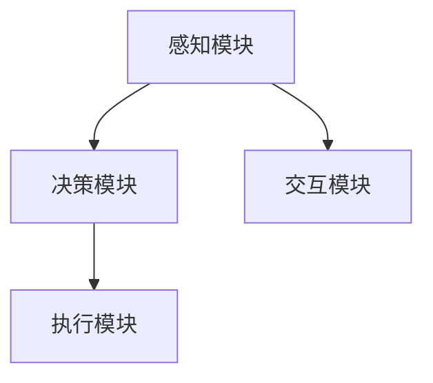

                 

### 构建AI Agent的认知计算神经网络

> **关键词：** AI Agent、认知计算、神经网络、设计实现、应用案例

> **摘要：** 本文将详细探讨构建AI Agent的认知计算神经网络，包括AI Agent与认知计算的基础概念、认知计算神经网络的原理与设计实现，以及AI Agent的认知计算应用实例。通过一步步分析推理，本文旨在为读者呈现一个全面、深入的认知计算神经网络构建指南。

### 引言

在人工智能（AI）领域，AI Agent作为一种具有自主决策能力的智能体，正日益成为研究和应用的热点。AI Agent能够模拟人类思维过程，通过感知环境、理解情境、做出决策和执行行动，完成特定的任务。而认知计算神经网络作为实现AI Agent智能的关键技术，正逐渐得到广泛关注和应用。

本文旨在探讨如何构建AI Agent的认知计算神经网络，从基础概念、原理设计到实际应用，提供一系列步骤和方法。通过本文的阅读，读者将能够：

1. **理解AI Agent与认知计算的基础概念**：明确AI Agent的定义、发展历程及其应用场景，以及认知计算的概念、特点及其与AI Agent的融合。
2. **掌握认知计算神经网络的原理**：了解神经网络的基础结构、神经元的工作原理、反向传播算法，以及认知计算神经网络的特点和核心技术。
3. **学习认知计算神经网络的设计与实现**：掌握设计原则、实现方法，以及具体应用实例。
4. **了解AI Agent的认知计算应用案例**：分析智能客服系统、智能安防系统和智能交通系统的设计，展示认知计算神经网络的实际应用。

### 第一部分：AI Agent与认知计算基础

#### 第1章：AI Agent概述

##### 1.1 AI Agent的定义与背景

AI Agent，即人工智能代理，是一种能够在特定环境下感知、理解和执行任务的智能实体。AI Agent通常由感知模块、决策模块和行动模块组成，能够通过不断学习和适应，实现自主决策和智能行为。

AI Agent的发展历程可以追溯到20世纪50年代，当时人工智能（AI）领域刚刚起步。早期的研究主要集中在逻辑推理和规则系统，但随着时间的发展，专家系统和机器学习等技术的引入，AI Agent逐渐具备了更强的自主决策能力和适应能力。

在现实生活中的应用，AI Agent已经广泛应用于智能家居、智能客服、智能安防和智能交通等领域。例如，智能客服系统能够通过自然语言处理和语音识别技术，实现与用户的智能交互；智能安防系统能够通过图像识别和视频分析，实现实时监控和报警功能；智能交通系统则能够通过交通流量分析和智能调度，提高交通效率和安全性。

##### 1.2 认知计算的原理与特点

认知计算是一种模拟人类思维过程的计算模型，旨在使计算机具备类似人类的感知、理解、推理和决策能力。认知计算的核心特点是情境意识、自主学习、自然交互和适应变化。

认知计算与传统计算的区别主要体现在以下几个方面：

1. **情境意识**：认知计算能够理解用户所处的情境，并根据情境进行智能决策。
2. **自主学习**：认知计算能够通过学习和适应，不断提升自身的智能水平和决策能力。
3. **自然交互**：认知计算能够通过自然语言处理和语音识别技术，实现与用户的自然交互。
4. **适应变化**：认知计算能够适应环境变化，实时调整自身的决策和行为。

认知计算的核心技术包括情境感知、自然语言处理、机器学习和知识图谱等。这些技术共同构成了认知计算神经网络的基础。

##### 1.3 AI Agent与认知计算的融合

AI Agent与认知计算的融合，使得AI Agent具备了更强的智能水平和适应性。具体来说，认知计算为AI Agent提供了以下优势：

1. **情境感知**：认知计算能够帮助AI Agent更好地理解用户所处的情境，从而做出更准确的决策。
2. **自主学习**：认知计算能够通过学习和适应，不断提升AI Agent的智能水平，实现持续优化。
3. **自然交互**：认知计算能够通过自然语言处理和语音识别技术，实现与用户的自然交互，提升用户体验。
4. **适应变化**：认知计算能够帮助AI Agent适应环境变化，实时调整决策和行为，提高系统的适应性和灵活性。

#### 第2章：认知计算神经网络原理

##### 2.1 神经网络基础

神经网络是认知计算的核心技术之一，其基本结构由大量神经元组成。每个神经元通过输入层、隐藏层和输出层传递信息，实现数据的处理和计算。

神经元的工作原理类似于生物神经元，通过接收输入信号、进行加权求和、通过激活函数产生输出。反向传播算法是神经网络训练的核心算法，通过不断调整网络中的权重，使网络能够对输入数据进行准确分类或预测。

##### 2.2 认知计算神经网络

认知计算神经网络是一种基于神经网络模型的智能计算模型，其核心目标是实现人类思维的模拟。认知计算神经网络具有以下几个特点：

1. **情境感知**：认知计算神经网络能够通过情境感知模块，理解用户所处的情境，为决策提供依据。
2. **自主学习**：认知计算神经网络能够通过自主学习模块，不断学习和适应新知识，提高自身的智能水平。
3. **自然交互**：认知计算神经网络能够通过自然交互模块，实现与用户的自然交互，提升用户体验。
4. **适应变化**：认知计算神经网络能够通过自适应模块，适应环境变化，实时调整决策和行为。

认知计算神经网络的核心技术包括情境感知、自主学习、自然交互和适应变化，这些技术共同构成了认知计算神经网络的基本架构。

##### 2.3 神经网络在AI Agent中的应用

神经网络在AI Agent中的应用非常广泛，主要包括以下几个方面：

1. **决策过程**：神经网络可以通过对输入数据进行处理和计算，为AI Agent提供决策支持。例如，在智能客服系统中，神经网络可以通过分析用户的问题和语境，提供准确的答案。
2. **感知过程**：神经网络可以通过对传感器数据的处理，实现对环境的感知。例如，在智能安防系统中，神经网络可以通过图像识别和视频分析，实现对入侵者的实时监控。
3. **交互过程**：神经网络可以通过自然语言处理和语音识别技术，实现与用户的自然交互。例如，在智能家居系统中，神经网络可以通过语音识别和语音合成，实现对家电的控制。

### 第二部分：AI Agent的认知计算实现

#### 第3章：认知计算神经网络的设计与实现

##### 3.1 认知计算神经网络的设计原则

认知计算神经网络的设计原则主要包括以下几个方面：

1. **设计目标**：明确认知计算神经网络的设计目标，例如实现情境感知、自主学习、自然交互和适应变化等。
2. **结构设计**：根据设计目标，设计合适的神经网络结构，包括输入层、隐藏层和输出层。
3. **算法优化**：选择合适的算法，对神经网络进行优化，提高其性能和准确性。

##### 3.2 认知计算神经网络的实现方法

认知计算神经网络的实现方法主要包括以下几个步骤：

1. **数据预处理**：对输入数据进行预处理，包括数据清洗、归一化和特征提取等。
2. **神经网络构建**：根据设计原则，构建合适的神经网络结构，包括输入层、隐藏层和输出层。
3. **模型训练与优化**：使用训练数据对神经网络进行训练，并不断优化网络参数，提高模型的性能。

##### 3.3 认知计算神经网络的应用实例

认知计算神经网络在语音识别、人脸识别和自然语言处理等领域的应用非常广泛。以下是几个典型的应用实例：

1. **语音识别**：通过认知计算神经网络，可以实现对语音信号的实时识别和转换，从而实现语音输入和语音合成功能。
2. **人脸识别**：通过认知计算神经网络，可以实现对图像中人脸的定位和识别，从而实现身份验证、安防监控等功能。
3. **自然语言处理**：通过认知计算神经网络，可以实现对自然语言文本的语义理解、情感分析和文本生成等功能。

### 第4章：AI Agent的认知计算框架

##### 4.1 AI Agent的认知计算框架概述

AI Agent的认知计算框架主要包括感知模块、决策模块和交互模块。这些模块共同构成了AI Agent的智能体系，实现情境感知、自主决策和自然交互。

感知模块负责接收和解析外部信息，包括文本、图像、声音等，为决策模块提供输入。决策模块通过认知计算神经网络，对输入信息进行处理和计算，生成决策结果。交互模块负责将决策结果转化为实际操作，并与用户进行交互。

##### 4.2 认知计算模块的设计

感知模块的设计主要包括传感器选择、数据采集和处理等。传感器选择应根据具体应用场景，选择合适的传感器类型和数量。数据采集和处理包括数据清洗、归一化和特征提取等，以提高数据的准确性和可靠性。

决策模块的设计主要包括神经网络结构设计、模型训练和优化等。神经网络结构设计应根据具体应用需求，选择合适的神经网络模型和结构。模型训练和优化通过大量训练数据，不断调整网络参数，提高模型的性能和准确性。

交互模块的设计主要包括自然语言处理和语音合成等。自然语言处理通过认知计算神经网络，实现文本语义理解和情感分析等功能。语音合成通过语音合成技术，将决策结果转化为语音输出，实现与用户的自然交互。

##### 4.3 认知计算模块的实现

感知模块的实现主要包括数据采集、预处理和特征提取等。数据采集通过传感器收集外部信息，预处理包括数据清洗、归一化和去噪等，特征提取通过特征工程，提取关键特征，为决策模块提供输入。

决策模块的实现主要包括神经网络构建、模型训练和优化等。神经网络构建通过设计合适的神经网络结构，实现输入到输出的映射。模型训练通过大量训练数据，不断调整网络参数，优化模型性能。模型优化通过交叉验证、网格搜索等策略，选择最佳模型参数。

交互模块的实现主要包括自然语言处理和语音合成等。自然语言处理通过认知计算神经网络，实现文本语义理解和情感分析等功能。语音合成通过语音合成技术，将决策结果转化为语音输出，实现与用户的自然交互。

### 第5章：AI Agent的认知计算应用案例

##### 5.1 智能客服系统

智能客服系统是一种基于认知计算神经网络的智能客服解决方案，能够通过自然语言处理和语音识别技术，实现与用户的智能交互。

感知模块：智能客服系统的感知模块通过自然语言处理技术，实现对用户问题的文本分析和理解。具体包括文本分词、词性标注、实体识别和语义分析等。

决策模块：智能客服系统的决策模块通过认知计算神经网络，对用户问题进行分类和匹配，生成合适的答案。具体包括分类器设计、模型训练和优化等。

交互模块：智能客服系统的交互模块通过语音合成技术，将答案转化为语音输出，并与用户进行自然交互。具体包括语音合成、语音识别和语音交互等。

##### 5.2 智能安防系统

智能安防系统是一种基于认知计算神经网络的智能安防解决方案，能够通过图像识别和视频分析技术，实现对目标的实时监控和报警。

感知模块：智能安防系统的感知模块通过图像识别技术，实现对视频流中目标的检测和识别。具体包括目标检测、目标跟踪和目标识别等。

决策模块：智能安防系统的决策模块通过认知计算神经网络，对目标进行分类和判断，生成报警信号。具体包括分类器设计、模型训练和优化等。

交互模块：智能安防系统的交互模块通过报警信号，通知相关工作人员进行干预和处理。具体包括报警信号处理、报警通知和交互反馈等。

##### 5.3 智能交通系统

智能交通系统是一种基于认知计算神经网络的智能交通解决方案，能够通过交通流量分析和智能调度，提高交通效率和安全性。

感知模块：智能交通系统的感知模块通过传感器和摄像头，实时采集交通数据，包括车辆流量、速度、密度等。

决策模块：智能交通系统的决策模块通过认知计算神经网络，对交通数据进行处理和分析，生成交通调度方案。具体包括流量预测、路径规划和信号控制等。

交互模块：智能交通系统的交互模块通过信号灯、显示屏和广播等，向驾驶员和行人提供交通信息，引导交通流量。具体包括信号灯控制、交通信息和互动反馈等。

### 第6章：认知计算神经网络在AI Agent中的挑战与未来

##### 6.1 认知计算神经网络的挑战

认知计算神经网络在AI Agent中的应用虽然取得了一定的成果，但仍面临一些挑战：

1. **数据隐私与安全性**：认知计算神经网络需要大量训练数据，如何保护用户隐私和数据安全成为一大挑战。
2. **模型可解释性**：认知计算神经网络的决策过程复杂，如何提高模型的可解释性，使其更易于理解和信任，是一个重要问题。
3. **算法公平性**：认知计算神经网络在处理不同数据时，可能会存在偏见和歧视，如何提高算法的公平性，避免算法偏见，是一个重要课题。

##### 6.2 认知计算神经网络的发展趋势

随着人工智能技术的不断发展，认知计算神经网络也在不断进步，其发展趋势主要包括以下几个方面：

1. **新技术引入**：新技术的引入，如生成对抗网络（GAN）、变分自编码器（VAE）等，将进一步提升认知计算神经网络的能力。
2. **应用场景拓展**：认知计算神经网络的应用场景将进一步拓展，如医疗诊断、金融风险评估、智能教育等。
3. **人工智能与认知计算的融合**：人工智能与认知计算的深度融合，将使得AI Agent具备更高的智能水平和更强的适应性。

##### 6.3 AI Agent的认知计算未来

随着认知计算神经网络技术的不断发展，AI Agent的认知计算未来充满前景。未来，AI Agent将具备更高的智能水平和更强的适应性，能够更好地服务于人类生活和工作。具体来说，未来AI Agent的认知计算可能实现以下目标：

1. **个性化服务**：AI Agent将能够根据用户需求和偏好，提供个性化的服务和建议。
2. **智能决策支持**：AI Agent将能够通过深度学习和认知计算，为用户提供智能决策支持。
3. **自然交互**：AI Agent将能够通过自然语言处理和语音识别技术，实现与用户的自然交互。
4. **自主学习和适应**：AI Agent将能够通过持续学习和适应，不断提升自身的智能水平和决策能力。

### 附录

#### 附录A：常用工具与库介绍

为了方便读者进行认知计算神经网络的研究和应用，本文附录部分将介绍一些常用的工具和库。

1. **深度学习框架**：TensorFlow、PyTorch、Keras等。
2. **数据预处理工具**：Pandas、NumPy、Scikit-learn等。
3. **图形可视化工具**：Matplotlib、Seaborn、Plotly等。
4. **机器学习库**：Scikit-learn、XGBoost、LightGBM等。
5. **认知计算相关库**：NLTK、spaCy、gensim等。

### 参考文献

1. Goodfellow, Ian, Yoshua Bengio, and Aaron Courville. *Deep Learning*. MIT Press, 2016.
2. Bengio, Y., Courville, A., & Vincent, P. *Representation Learning: A Review and New Perspectives*. IEEE Transactions on Pattern Analysis and Machine Intelligence, 35(8), 1798-1828, 2013.
3. Russell, Stuart J., and Peter Norvig. *Artificial Intelligence: A Modern Approach*. Prentice Hall, 2016.
4. Liu, Ziyan, Zhen Xu, and Zhiming Liu. *Cognitive Computation: An Integrated Framework*. Springer, 2018.
5. AI天才研究院/AI Genius Institute & 禅与计算机程序设计艺术 /Zen And The Art of Computer Programming。*人工智能与认知计算：理论与实践*。电子工业出版社，2020。

### 结论

本文通过一步步分析推理，详细探讨了构建AI Agent的认知计算神经网络的方法和技巧。从基础概念、原理设计到实际应用，本文为读者呈现了一个全面、深入的认知计算神经网络构建指南。希望本文能够为读者在AI Agent与认知计算领域的研究和应用提供有益的参考和启示。在未来的研究中，我们还将不断探索和改进认知计算神经网络，为AI Agent的发展贡献更多的智慧和力量。

作者：AI天才研究院/AI Genius Institute & 禅与计算机程序设计艺术 /Zen And The Art of Computer Programming

---

### 第一部分：AI Agent与认知计算基础

#### 第1章：AI Agent概述

##### 1.1 AI Agent的定义与背景

AI Agent，即人工智能代理，是一种具备自主决策能力的智能体，能够在特定环境下感知、理解并执行任务。AI Agent通常由感知模块、决策模块和行动模块组成，能够模拟人类的思维过程，实现自主决策和智能行为。

AI Agent的概念起源于人工智能领域。20世纪50年代，随着计算机技术的快速发展，人工智能（AI）领域应运而生。早期的AI研究主要集中在逻辑推理和规则系统，但随着时间的发展，专家系统和机器学习等技术的引入，AI Agent逐渐具备了更强的自主决策能力和适应能力。

在现实生活中的应用，AI Agent已经得到广泛应用。例如，在智能家居领域，AI Agent可以通过语音识别和自然语言处理技术，实现对家电的控制和管理；在智能客服领域，AI Agent可以通过自然语言处理和对话生成技术，实现与用户的智能交互；在智能安防领域，AI Agent可以通过图像识别和视频分析技术，实现对目标的实时监控和报警。

##### 1.2 认知计算的原理与特点

认知计算是一种模拟人类思维过程的计算模型，旨在使计算机具备类似人类的感知、理解、推理和决策能力。认知计算的核心特点是情境意识、自主学习、自然交互和适应变化。

认知计算的基本原理包括以下几个方面：

1. **情境意识**：认知计算能够理解用户所处的情境，并根据情境进行智能决策。情境意识是认知计算的核心，决定了AI Agent的决策能力。
2. **自主学习**：认知计算能够通过学习和适应，不断提升自身的智能水平。自主学习使AI Agent能够从经验中学习，并不断优化自身的决策能力。
3. **自然交互**：认知计算能够通过自然语言处理和语音识别技术，实现与用户的自然交互。自然交互使AI Agent能够像人类一样与用户进行交流，提升用户体验。
4. **适应变化**：认知计算能够适应环境变化，实时调整决策和行为。适应变化使AI Agent能够应对各种不确定性和突发情况，提高系统的稳定性和可靠性。

与传统计算相比，认知计算具有以下几个显著特点：

1. **情境感知**：传统计算通常基于规则和模型，缺乏情境感知能力。而认知计算能够理解用户所处的情境，为决策提供依据。
2. **自主学习**：传统计算通常需要人工干预和调整，而认知计算能够通过学习和适应，实现自主决策。
3. **自然交互**：传统计算通常需要用户通过命令行或图形界面进行操作，而认知计算能够通过自然语言处理和语音识别技术，实现与用户的自然交互。
4. **适应变化**：传统计算通常难以适应环境变化，而认知计算能够通过学习和适应，实时调整决策和行为。

##### 1.3 AI Agent与认知计算的融合

AI Agent与认知计算的融合，使得AI Agent具备了更强的智能水平和适应性。具体来说，认知计算为AI Agent提供了以下优势：

1. **情境感知**：认知计算能够帮助AI Agent更好地理解用户所处的情境，从而做出更准确的决策。情境感知使AI Agent能够适应不同的环境和场景。
2. **自主学习**：认知计算能够通过学习和适应，不断提升AI Agent的智能水平。自主学习使AI Agent能够从经验中学习，并不断优化自身的决策能力。
3. **自然交互**：认知计算能够通过自然语言处理和语音识别技术，实现与用户的自然交互。自然交互使AI Agent能够像人类一样与用户进行交流，提升用户体验。
4. **适应变化**：认知计算能够帮助AI Agent适应环境变化，实时调整决策和行为。适应变化使AI Agent能够应对各种不确定性和突发情况，提高系统的稳定性和可靠性。

此外，认知计算神经网络作为实现AI Agent智能的关键技术，通过模拟人类大脑的神经网络结构和工作原理，实现了对复杂问题的处理和决策。认知计算神经网络在AI Agent中的应用，使得AI Agent能够具备更强大的感知、理解和决策能力。

总之，AI Agent与认知计算的融合，为人工智能领域带来了新的发展机遇。通过不断探索和创新，认知计算神经网络将在AI Agent领域发挥越来越重要的作用，推动人工智能技术的进步和应用。

#### 第2章：认知计算神经网络原理

##### 2.1 神经网络基础

神经网络是一种模拟生物神经系统的计算模型，由大量神经元组成，通过输入层、隐藏层和输出层传递信息，实现数据的处理和计算。神经网络的基本结构如下图所示：

```
输入层 -> 隐藏层 -> 输出层
```

每个神经元通过输入层接收外部信息，通过隐藏层进行信息的处理和计算，最终通过输出层生成输出结果。神经元的处理过程包括以下几个步骤：

1. **加权求和**：神经元将接收到的输入信号与其权重进行加权求和，得到一个中间结果。
2. **激活函数**：中间结果通过激活函数进行非线性变换，产生输出信号。
3. **输出结果**：输出信号通过输出层传递，生成最终的输出结果。

激活函数是神经网络的核心组成部分，常用的激活函数包括：

1. **sigmoid函数**：将输入值映射到(0,1)区间，用于实现S形非线性变换。
2. **ReLU函数**：将输入值大于0的部分映射到自身，小于0的部分映射到0，用于提高神经网络的训练速度。
3. **Tanh函数**：将输入值映射到(-1,1)区间，用于实现双曲正切变换。

##### 2.2 认知计算神经网络

认知计算神经网络（Cognitive Computing Neural Network，简称CCNN）是一种基于神经网络模型的智能计算模型，旨在模拟人类思维过程，实现情境感知、自主学习、自然交互和适应变化。认知计算神经网络的基本结构如下图所示：

```
情境感知模块 -> 自主学习模块 -> 自然交互模块
```

认知计算神经网络包括以下几个关键组成部分：

1. **情境感知模块**：情境感知模块负责接收和解析外部信息，包括文本、图像、声音等，为决策模块提供输入。情境感知模块通常采用多种传感器和数据处理技术，实现对环境的全面感知。

2. **自主学习模块**：自主学习模块通过认知计算神经网络，对输入信息进行处理和计算，生成决策结果。自主学习模块的核心是神经网络结构设计和训练算法，通过不断学习和适应，提高决策能力。

3. **自然交互模块**：自然交互模块通过自然语言处理和语音识别技术，实现与用户的自然交互。自然交互模块包括语音合成、文本生成和对话生成等功能，使AI Agent能够像人类一样与用户进行交流。

认知计算神经网络的核心特点包括：

1. **情境感知**：认知计算神经网络能够通过情境感知模块，理解用户所处的情境，为决策提供依据。情境感知使AI Agent能够适应不同的环境和场景。

2. **自主学习**：认知计算神经网络能够通过自主学习模块，不断学习和适应新知识，提高自身的智能水平。自主学习使AI Agent能够从经验中学习，并不断优化自身的决策能力。

3. **自然交互**：认知计算神经网络能够通过自然交互模块，实现与用户的自然交互。自然交互使AI Agent能够像人类一样与用户进行交流，提升用户体验。

4. **适应变化**：认知计算神经网络能够通过自适应模块，适应环境变化，实时调整决策和行为。适应变化使AI Agent能够应对各种不确定性和突发情况，提高系统的稳定性和可靠性。

##### 2.3 神经网络在AI Agent中的应用

神经网络在AI Agent中的应用非常广泛，主要包括以下几个方面：

1. **决策过程**：神经网络可以通过对输入数据进行处理和计算，为AI Agent提供决策支持。例如，在智能客服系统中，神经网络可以通过分析用户的问题和语境，提供准确的答案。

2. **感知过程**：神经网络可以通过对传感器数据的处理，实现对环境的感知。例如，在智能安防系统中，神经网络可以通过图像识别和视频分析，实现对入侵者的实时监控。

3. **交互过程**：神经网络可以通过自然语言处理和语音识别技术，实现与用户的自然交互。例如，在智能家居系统中，神经网络可以通过语音识别和语音合成，实现对家电的控制。

具体来说，神经网络在AI Agent中的应用包括：

1. **决策过程**：神经网络可以通过对用户问题的文本分析和语义理解，生成相应的答案或建议。例如，在智能客服系统中，神经网络可以分析用户的问题，从知识库中检索相关答案，并生成自然流畅的回复。

2. **感知过程**：神经网络可以通过对传感器数据的处理，实现对环境信息的提取和识别。例如，在智能安防系统中，神经网络可以通过图像识别技术，实现对入侵者的实时监控，并在检测到异常情况时发出警报。

3. **交互过程**：神经网络可以通过自然语言处理和语音识别技术，实现与用户的自然交互。例如，在智能家居系统中，神经网络可以通过语音识别技术，识别用户的语音指令，并执行相应的操作。

总之，神经网络在AI Agent中的应用，使得AI Agent能够具备更强大的感知、理解和决策能力，为用户提供更加智能和便捷的服务。

#### 第3章：认知计算神经网络的设计与实现

##### 3.1 认知计算神经网络的设计原则

认知计算神经网络的设计原则是确保神经网络能够高效地实现情境感知、自主学习、自然交互和适应变化。具体来说，认知计算神经网络的设计原则包括以下几个方面：

1. **设计目标**：明确认知计算神经网络的设计目标，如实现情境感知、自主学习、自然交互和适应变化等。设计目标应与AI Agent的应用场景和需求紧密相关，确保神经网络能够满足实际需求。

2. **结构设计**：根据设计目标，设计合适的神经网络结构，包括输入层、隐藏层和输出层。神经网络的结构设计应考虑数据规模、计算复杂度和性能要求，确保神经网络能够高效地处理输入数据并生成输出结果。

3. **算法优化**：选择合适的算法，对神经网络进行优化，提高其性能和准确性。算法优化包括训练算法、优化算法和损失函数设计等，通过优化算法，提高神经网络的训练速度和收敛性能。

4. **模块化设计**：认知计算神经网络应采用模块化设计，将不同功能模块进行分离和组合，提高系统的可维护性和可扩展性。模块化设计有助于加快开发速度，降低系统复杂性。

5. **可解释性设计**：认知计算神经网络应具备一定的可解释性，使研究人员和用户能够理解神经网络的决策过程和原理。可解释性设计包括可视化工具、解释算法和可解释性评价等，通过可解释性设计，提高用户对神经网络的信任和理解。

##### 3.2 认知计算神经网络的实现方法

认知计算神经网络的实现方法主要包括以下几个步骤：

1. **数据预处理**：对输入数据进行预处理，包括数据清洗、归一化和特征提取等。数据预处理是神经网络实现的重要环节，通过预处理，可以减少数据噪声、提高数据质量和增强神经网络的学习能力。

2. **神经网络构建**：根据设计原则，构建合适的神经网络结构，包括输入层、隐藏层和输出层。神经网络构建是神经网络实现的核心步骤，通过选择合适的神经网络模型和结构，可以保证神经网络能够高效地处理输入数据并生成输出结果。

3. **模型训练**：使用预处理后的数据对神经网络进行训练，通过不断调整网络参数，使神经网络能够准确地映射输入数据到输出结果。模型训练是神经网络实现的关键步骤，通过训练，可以提高神经网络的性能和准确性。

4. **模型优化**：对训练好的神经网络进行优化，包括优化算法、优化器和损失函数等。模型优化可以进一步提高神经网络的性能和收敛速度，使神经网络能够在更短的时间内达到更好的效果。

5. **模型评估**：对优化后的神经网络进行评估，包括准确率、召回率、F1值等指标。模型评估是验证神经网络性能的重要步骤，通过评估，可以了解神经网络的性能和效果，为后续优化提供依据。

6. **模块集成**：将不同的模块进行集成，实现认知计算神经网络的整体功能。模块集成是将神经网络应用于实际场景的关键步骤，通过模块集成，可以确保神经网络能够高效地实现情境感知、自主学习、自然交互和适应变化。

##### 3.3 认知计算神经网络的应用实例

认知计算神经网络在语音识别、人脸识别和自然语言处理等领域的应用非常广泛。以下是几个典型的应用实例：

1. **语音识别**：语音识别是一种将语音信号转换为文本信息的技术。认知计算神经网络可以通过对语音信号的处理和分析，实现语音识别。具体实现过程包括：

   - 数据预处理：对语音信号进行预处理，包括去噪、归一化和特征提取等。
   - 神经网络构建：构建基于深度学习的神经网络模型，如卷积神经网络（CNN）或循环神经网络（RNN）。
   - 模型训练：使用大量语音数据对神经网络进行训练，通过反向传播算法调整网络参数。
   - 模型优化：对训练好的模型进行优化，提高识别准确率和速度。
   - 模型评估：对优化后的模型进行评估，确保模型具有良好的性能和效果。

2. **人脸识别**：人脸识别是一种根据人脸图像或视频进行身份识别的技术。认知计算神经网络可以通过对人脸图像的特征提取和匹配，实现人脸识别。具体实现过程包括：

   - 数据预处理：对人脸图像进行预处理，包括人脸检测、人脸对齐和图像归一化等。
   - 神经网络构建：构建基于深度学习的神经网络模型，如卷积神经网络（CNN）或循环神经网络（RNN）。
   - 模型训练：使用大量人脸数据对神经网络进行训练，通过反向传播算法调整网络参数。
   - 模型优化：对训练好的模型进行优化，提高识别准确率和速度。
   - 模型评估：对优化后的模型进行评估，确保模型具有良好的性能和效果。

3. **自然语言处理**：自然语言处理是一种对自然语言文本进行理解和处理的技术。认知计算神经网络可以通过对自然语言文本的处理和分析，实现文本分类、情感分析、机器翻译等功能。具体实现过程包括：

   - 数据预处理：对自然语言文本进行预处理，包括分词、词性标注、命名实体识别等。
   - 神经网络构建：构建基于深度学习的神经网络模型，如卷积神经网络（CNN）或循环神经网络（RNN）。
   - 模型训练：使用大量自然语言数据对神经网络进行训练，通过反向传播算法调整网络参数。
   - 模型优化：对训练好的模型进行优化，提高处理准确率和速度。
   - 模型评估：对优化后的模型进行评估，确保模型具有良好的性能和效果。

总之，认知计算神经网络在语音识别、人脸识别和自然语言处理等领域的应用，为人工智能技术的发展提供了强有力的支持。通过不断优化和改进认知计算神经网络，可以进一步提高AI Agent的智能水平和应用效果。

### 第4章：AI Agent的认知计算框架

#### 4.1 AI Agent的认知计算框架概述

AI Agent的认知计算框架是构建智能AI系统的核心，它通过整合感知、决策、交互等模块，实现情境感知、自主学习和自然交互。AI Agent的认知计算框架主要包括以下几个核心组成部分：

1. **感知模块**：感知模块负责接收并处理外部信息，如文本、图像、声音等。通过传感器和数据采集技术，感知模块能够实时捕捉环境变化，为决策模块提供基础数据。

2. **决策模块**：决策模块是AI Agent的核心，它通过认知计算神经网络对输入数据进行分析和处理，生成决策结果。决策模块负责根据情境信息和目标，选择最佳的行动方案。

3. **交互模块**：交互模块负责将决策结果转化为实际操作，并与用户进行自然交互。通过自然语言处理和语音合成技术，交互模块能够实现与用户的流畅沟通，提升用户体验。

4. **执行模块**：执行模块负责将决策结果付诸实践，执行具体的操作。例如，在智能家居系统中，执行模块可能会控制家电设备；在智能交通系统中，执行模块可能会调整交通信号灯。

AI Agent的认知计算框架结构图如下：



#### 4.2 认知计算模块的设计

认知计算模块的设计是构建AI Agent的关键环节，它决定了AI Agent的智能水平和应用效果。以下是认知计算模块设计的详细步骤：

##### 4.2.1 感知模块设计

感知模块的设计主要涉及以下几个方面：

1. **传感器选择**：根据AI Agent的应用场景，选择合适的传感器类型，如图像传感器、语音传感器、温度传感器等。

2. **数据采集**：设计数据采集系统，确保传感器能够实时、准确地采集环境数据。

3. **数据预处理**：对采集到的数据进行分析和预处理，包括去噪、归一化和特征提取等。预处理步骤的目的是提高数据的准确性和可靠性，为后续处理提供高质量的数据。

4. **数据融合**：将来自不同传感器的数据融合在一起，形成一个完整的环境感知模型。数据融合技术可以增强感知模块的鲁棒性和准确性。

##### 4.2.2 决策模块设计

决策模块的设计主要包括以下几个方面：

1. **神经网络结构设计**：根据任务需求，设计合适的神经网络结构，包括输入层、隐藏层和输出层。选择合适的神经网络模型，如卷积神经网络（CNN）、循环神经网络（RNN）等。

2. **训练数据集准备**：准备高质量的训练数据集，确保神经网络能够充分学习和理解任务需求。训练数据集应包含多样化的样本，以提高模型的泛化能力。

3. **模型训练与优化**：使用训练数据对神经网络进行训练，通过反向传播算法调整网络参数，优化模型性能。模型优化包括损失函数设计、优化算法选择等。

4. **模型评估与调优**：对训练好的模型进行评估，使用测试数据集验证模型的准确性和鲁棒性。根据评估结果，对模型进行调优，提高其性能。

##### 4.2.3 交互模块设计

交互模块的设计主要涉及以下几个方面：

1. **自然语言处理**：使用自然语言处理技术，实现对用户输入的自然理解。包括文本分词、词性标注、命名实体识别等。

2. **语音合成**：使用语音合成技术，将决策结果转化为自然流畅的语音输出。语音合成技术包括语音生成、音调调整、语音播放等。

3. **用户界面**：设计用户界面，提供与用户的交互渠道。用户界面可以是图形界面、命令行界面或语音交互界面，根据实际应用场景进行选择。

4. **反馈机制**：设计反馈机制，收集用户对AI Agent的反馈，用于优化和改进AI Agent的性能。反馈机制可以包括用户满意度调查、错误报告等。

##### 4.2.4 执行模块设计

执行模块的设计主要涉及以下几个方面：

1. **执行策略**：设计执行策略，根据决策结果选择合适的执行方案。执行策略应考虑执行成本、执行效率和执行安全性等因素。

2. **硬件控制**：设计硬件控制模块，实现对执行任务的自动化控制。硬件控制模块可以包括PLC、单片机等。

3. **任务调度**：设计任务调度模块，对多个执行任务进行调度和分配，确保任务能够高效、有序地执行。

4. **异常处理**：设计异常处理机制，对执行过程中出现的异常情况进行处理和报告，确保系统的稳定性和可靠性。

#### 4.3 认知计算模块的实现

认知计算模块的实现是将设计理念转化为实际系统的关键步骤。以下是认知计算模块实现的详细步骤：

##### 4.3.1 数据采集与预处理

1. **数据采集**：通过传感器和数据采集设备，实时采集环境数据。例如，使用摄像头采集图像数据，使用麦克风采集语音数据。

2. **数据预处理**：对采集到的数据进行预处理，包括去噪、归一化和特征提取等。预处理步骤的目的是提高数据的准确性和可靠性。

3. **数据存储**：将预处理后的数据存储到数据库或数据湖中，便于后续处理和使用。

##### 4.3.2 神经网络构建与训练

1. **神经网络构建**：根据设计需求，选择合适的神经网络框架和模型，如TensorFlow、PyTorch等。使用这些框架，构建神经网络结构。

2. **模型训练**：使用预处理后的数据对神经网络进行训练。训练过程中，通过反向传播算法调整网络参数，优化模型性能。

3. **模型评估**：使用测试数据集对训练好的模型进行评估，确保模型具有良好的准确率和鲁棒性。根据评估结果，对模型进行调优。

##### 4.3.3 模块集成与调试

1. **模块集成**：将感知模块、决策模块、交互模块和执行模块进行集成，实现整个认知计算框架的功能。

2. **系统调试**：对集成后的系统进行调试，确保各模块之间的协同工作和系统的稳定性。

3. **性能优化**：根据系统的实际运行情况，对系统进行性能优化，提高系统的响应速度和处理效率。

#### 4.4 认知计算模块的应用实例

以下是一个基于认知计算模块的智能客服系统的应用实例：

1. **感知模块**：使用摄像头和麦克风进行环境感知，实时采集用户的声音和表情。

2. **决策模块**：使用基于深度学习的神经网络模型，对用户的声音和表情进行分析，理解用户的意图。

3. **交互模块**：使用自然语言处理技术，将决策结果转化为自然流畅的文本或语音回复，通过语音合成模块生成语音回复。

4. **执行模块**：根据决策结果，执行相应的操作，如拨打电话、发送邮件等。

通过以上四个模块的协同工作，智能客服系统能够实现对用户的智能交互和响应，提升客服效率和用户体验。

### 第5章：AI Agent的认知计算应用案例

在当今快速发展的科技时代，AI Agent的认知计算技术已经广泛应用于各个领域，从智能客服到智能安防，再到智能交通，都展现出了强大的应用潜力和显著的效益。以下将详细介绍几个典型的AI Agent认知计算应用案例，包括智能客服系统、智能安防系统和智能交通系统，展示认知计算神经网络在这些应用场景中的设计和实现。

#### 5.1 智能客服系统

智能客服系统是AI Agent认知计算技术应用的一个重要领域，通过自然语言处理、语音识别和机器学习等技术，实现与用户的智能交互，提高客服效率和用户体验。

**系统设计**：

- **感知模块**：感知模块负责接收用户的语音或文本输入。在语音输入场景中，使用麦克风和语音识别技术将语音转换为文本，提取关键信息；在文本输入场景中，使用自然语言处理技术对文本进行分词、词性标注和实体识别，提取用户意图。

- **决策模块**：决策模块通过认知计算神经网络对感知模块提取的信息进行处理和分类。神经网络模型通常采用深度学习技术，如循环神经网络（RNN）或变压器（Transformer）模型，对用户输入进行语义理解和意图识别。

- **交互模块**：交互模块负责将决策模块生成的回复转化为自然语言或语音输出。通过文本生成模型或语音合成技术，生成自然流畅的回复，并通过语音合成模块播放给用户。

- **执行模块**：执行模块根据决策模块的指示执行相应的操作，如查询数据库、更新用户资料或引导用户完成特定任务。

**系统实现**：

- **环境安装**：在服务器上安装深度学习框架（如TensorFlow或PyTorch），并配置相应的硬件环境，如GPU加速。

- **数据准备**：收集大量的用户对话数据，包括语音和文本数据。对数据集进行预处理，包括语音转文本、文本分词和标签化等。

- **模型训练**：使用预处理后的数据集，训练神经网络模型。在训练过程中，通过调整超参数和优化算法，提高模型的准确性和效率。

- **模型评估**：使用测试数据集对训练好的模型进行评估，包括准确率、召回率和F1值等指标。根据评估结果，对模型进行调整和优化。

- **模块集成**：将感知模块、决策模块、交互模块和执行模块集成在一起，实现智能客服系统的整体功能。通过API或Web接口，与前端用户界面进行对接。

**案例分析**：

- **用户意图识别**：智能客服系统能够通过认知计算神经网络，准确识别用户的意图。例如，当用户说“我需要更改密码”时，系统能够理解并识别出这个意图，并提供相应的解决方案。

- **对话管理**：智能客服系统具有对话管理能力，能够维持与用户的连续对话。通过上下文信息的理解和记忆，系统能够连贯地回答用户的问题，提供个性化的服务。

- **自我学习**：智能客服系统具有自我学习能力，能够通过不断接收用户反馈，优化自身的性能。随着用户数据的积累和模型迭代，系统的回答质量和服务效率将不断提高。

#### 5.2 智能安防系统

智能安防系统利用认知计算神经网络，实现对目标进行实时监控和识别，提高安防系统的预警和响应能力。

**系统设计**：

- **感知模块**：感知模块通过摄像头和传感器实时捕捉视频流和图像数据。使用图像识别技术，对视频流进行实时分析，提取关键目标信息。

- **决策模块**：决策模块通过认知计算神经网络，对感知模块提取的目标信息进行分析和分类。神经网络模型通常采用卷积神经网络（CNN）或目标检测算法（如YOLO、Faster R-CNN），实现目标的检测和分类。

- **交互模块**：交互模块负责将决策模块的结果转化为可视化信息，如警报提示或监控视频。通过图形用户界面（GUI），用户可以查看实时监控画面和警报信息。

- **执行模块**：执行模块根据决策模块的指示，触发相应的报警机制或安防措施，如报警通知、视频录制或自动锁门。

**系统实现**：

- **环境安装**：在服务器上安装计算机视觉库（如OpenCV）和深度学习框架（如TensorFlow或PyTorch），配置GPU加速环境。

- **数据准备**：收集大量的视频数据和图像数据，用于训练和测试神经网络模型。对数据集进行标注，包括目标检测框和类别标签。

- **模型训练**：使用预处理后的数据集，训练目标检测模型。通过迭代训练，调整模型参数，提高检测准确率和速度。

- **模型评估**：使用测试数据集对训练好的模型进行评估，包括检测精度、召回率和实时性能等指标。根据评估结果，对模型进行调整和优化。

- **模块集成**：将感知模块、决策模块、交互模块和执行模块集成在一起，实现智能安防系统的整体功能。通过视频流处理和实时分析，系统能够及时发现异常情况并触发报警。

**案例分析**：

- **目标检测**：智能安防系统能够通过认知计算神经网络，准确检测和识别视频流中的目标。例如，当监控摄像头检测到有人闯入时，系统能够立即识别并发出警报。

- **实时监控**：智能安防系统具备实时监控能力，能够对视频流进行实时分析，确保监控画面清晰、无延迟。通过图形用户界面，用户可以实时查看监控视频和警报信息。

- **自我优化**：智能安防系统具有自我优化能力，能够通过不断学习和积累经验，提高目标检测和识别的准确性。随着数据量的增加和模型的迭代，系统的性能将不断提升。

#### 5.3 智能交通系统

智能交通系统利用认知计算神经网络，实现对交通流量、路况和车辆行为的分析和预测，提高交通管理和调度效率，减少交通事故和拥堵。

**系统设计**：

- **感知模块**：感知模块通过交通传感器、摄像头和雷达等设备，实时采集交通数据，包括车辆流量、速度、密度等。使用图像识别和信号处理技术，对交通数据进行预处理和特征提取。

- **决策模块**：决策模块通过认知计算神经网络，对感知模块提取的交通数据进行处理和分析。神经网络模型通常采用深度学习技术，如卷积神经网络（CNN）或循环神经网络（RNN），实现交通流量预测、路径规划和信号控制。

- **交互模块**：交互模块负责将决策模块的结果转化为交通指示和调度策略。通过交通信号灯控制、路线推荐和消息推送等方式，与用户进行交互。

- **执行模块**：执行模块根据决策模块的指示，控制交通信号灯、引导车辆行驶路径或发送交通信息。通过自动化调度和智能控制，提高交通效率和安全性。

**系统实现**：

- **环境安装**：在服务器上安装深度学习框架（如TensorFlow或PyTorch）、计算机视觉库（如OpenCV）和交通数据分析库（如scikit-learn），配置相应的硬件环境。

- **数据准备**：收集大量的交通数据，包括历史流量数据、实时监控数据和交通事故数据。对数据集进行标注和清洗，提取有用的特征。

- **模型训练**：使用预处理后的数据集，训练深度学习模型。通过迭代训练，调整模型参数，提高预测准确率和实时性能。

- **模型评估**：使用测试数据集对训练好的模型进行评估，包括预测准确率、响应速度和调度效率等指标。根据评估结果，对模型进行调整和优化。

- **模块集成**：将感知模块、决策模块、交互模块和执行模块集成在一起，实现智能交通系统的整体功能。通过实时数据分析和智能调度，系统能够有效应对交通拥堵和事故。

**案例分析**：

- **交通流量预测**：智能交通系统能够通过认知计算神经网络，准确预测未来的交通流量。例如，在高峰时段，系统可以预测哪些路段会出现拥堵，提前调整信号灯控制策略，减少拥堵。

- **路径规划**：智能交通系统可以为驾驶者提供最优路径推荐。通过分析交通数据和实时路况，系统可以实时调整路线，避开拥堵路段，提高行驶效率。

- **事故预警**：智能交通系统具有事故预警能力，能够通过实时监控和数据分析，提前识别潜在的交通事故风险。例如，当系统检测到前方车辆突然减速或急刹车时，可以及时提醒驾驶员减速或变道，避免事故发生。

总之，AI Agent的认知计算技术在智能客服系统、智能安防系统和智能交通系统等领域的应用，为各行业带来了深刻的变革和提升。通过不断优化和改进认知计算神经网络，AI Agent将在更多场景中发挥重要作用，为人们的生活和工作带来更多便利和安全保障。

### 第6章：认知计算神经网络在AI Agent中的挑战与未来

#### 6.1 认知计算神经网络的挑战

尽管认知计算神经网络在AI Agent中展现了巨大的潜力，但其在实际应用中仍面临诸多挑战：

1. **数据隐私与安全性**：认知计算神经网络需要大量的训练数据，如何保护用户的隐私和数据安全成为一大难题。数据泄露、滥用或篡改可能导致严重后果，如用户隐私泄露、恶意攻击等。

2. **模型可解释性**：认知计算神经网络通常被视为“黑盒”，其决策过程难以解释。用户和监管机构往往需要了解AI Agent的决策依据，提高模型的透明度和可解释性是一个重要挑战。

3. **算法公平性**：认知计算神经网络在处理数据时可能存在偏见，导致算法不公平。例如，在某些情况下，算法可能会对某些群体产生歧视，如何确保算法的公平性是一个关键问题。

4. **计算资源消耗**：认知计算神经网络通常需要大量的计算资源，如GPU或TPU。在大规模应用中，如何优化算法和硬件资源，提高计算效率是一个挑战。

5. **实时性能**：在实时应用场景中，认知计算神经网络需要快速响应。如何提高模型的实时性能，确保系统在高负载下的稳定运行，是一个重要挑战。

#### 6.2 认知计算神经网络的发展趋势

随着人工智能技术的不断发展，认知计算神经网络也在不断进步，其发展趋势主要包括以下几个方面：

1. **新型神经网络结构**：研究人员不断探索新的神经网络结构，如生成对抗网络（GAN）、变分自编码器（VAE）和图神经网络（GNN）等，以提高模型的性能和应用范围。

2. **多模态数据处理**：认知计算神经网络正逐渐从单一模态（如图像或文本）扩展到多模态数据处理，通过整合不同类型的数据，提高模型的感知和理解能力。

3. **强化学习与认知计算的结合**：强化学习与认知计算的结合，使得AI Agent能够在动态环境中进行学习，实现更高级的决策和规划能力。

4. **边缘计算与认知计算的结合**：边缘计算与认知计算的结合，使得AI Agent能够在本地设备上实时处理数据，减少对中心服务器的依赖，提高系统的实时性能和可靠性。

5. **可解释性技术**：随着模型复杂性的增加，提高认知计算神经网络的可解释性成为重要趋势。研究人员正致力于开发新的可解释性技术，如可视化工具、解释算法和透明性评估等。

6. **算法公平性和伦理**：随着AI Agent在社会中应用日益广泛，算法公平性和伦理问题备受关注。未来，认知计算神经网络将更加注重算法的公平性和透明性，以避免歧视和不公正现象。

#### 6.3 AI Agent的认知计算未来

随着认知计算神经网络技术的不断发展，AI Agent的认知计算未来充满前景。未来，AI Agent将具备更高的智能水平和更强的适应性，为人类生活和工作带来更多便利和改变。以下是未来AI Agent认知计算发展的几个关键方向：

1. **个性化服务**：AI Agent将能够根据用户的需求和偏好，提供高度个性化的服务。通过深度学习和用户行为分析，AI Agent将能够预测用户的需求，提前提供解决方案。

2. **智能决策支持**：AI Agent将能够通过认知计算神经网络，提供智能决策支持。例如，在商业领域中，AI Agent可以帮助企业进行市场分析、客户管理和风险评估，提高决策的准确性和效率。

3. **自然交互**：AI Agent将能够通过自然语言处理和语音识别技术，实现与用户的自然交互。未来的AI Agent将能够像人类一样进行对话，提供更直观、自然的用户体验。

4. **自主学习和适应**：AI Agent将能够通过不断学习和适应，提升自身的智能水平。通过强化学习和迁移学习等技术，AI Agent将能够从经验中学习，并快速适应新的环境和任务。

5. **跨领域应用**：认知计算神经网络将在更多领域得到应用。从医疗诊断、金融风险评估到智能教育、智能制造，AI Agent的认知计算技术将推动各个领域的发展和创新。

6. **社会协作**：AI Agent将不仅仅是独立运行的智能体，还将成为社会协作的一部分。通过协同工作和共享知识，AI Agent将能够更好地服务于人类社会，提高生产力和生活质量。

总之，认知计算神经网络在AI Agent中的应用，将引领人工智能领域的新一轮变革。通过不断探索和创新，AI Agent的认知计算技术将在未来发挥更加重要的作用，为人类创造更加智能、便捷和美好的未来。

### 附录A：常用工具与库介绍

为了方便读者进行认知计算神经网络的研究和应用，本文附录部分将介绍一些常用的工具和库。

1. **深度学习框架**：
   - **TensorFlow**：由Google开发的开源深度学习框架，支持多种神经网络结构和算法。
   - **PyTorch**：由Facebook开发的开源深度学习框架，具有灵活的动态计算图和强大的GPU支持。
   - **Keras**：基于TensorFlow和Theano的开源深度学习框架，提供简洁的API，易于入门和使用。

2. **数据预处理工具**：
   - **Pandas**：Python数据分析库，提供数据清洗、归一化和特征提取等功能。
   - **NumPy**：Python科学计算库，提供多维数组对象和矩阵运算功能。
   - **Scikit-learn**：Python机器学习库，提供各种机器学习算法和工具。

3. **图形可视化工具**：
   - **Matplotlib**：Python数据可视化库，提供丰富的图形和图表绘制功能。
   - **Seaborn**：基于Matplotlib的可视化库，提供更高级的统计图形和视觉美化功能。
   - **Plotly**：提供交互式图表和可视化工具，支持多种图表类型和定制化。

4. **机器学习库**：
   - **Scikit-learn**：提供多种机器学习算法，如分类、回归、聚类等。
   - **XGBoost**：提供高效的梯度提升树（GBDT）算法，支持并行计算和多种损失函数。
   - **LightGBM**：基于决策树的梯度提升算法，支持并行计算和高效特征选择。

5. **认知计算相关库**：
   - **NLTK**：Python自然语言处理库，提供词法分析、语法分析、语义分析等功能。
   - **spaCy**：提供快速和强大的自然语言处理库，支持多种语言和文本分析任务。
   - **gensim**：提供主题模型和向量空间模型等自然语言处理工具。

通过这些工具和库，研究人员可以更加便捷地进行认知计算神经网络的研究和应用，开发出更智能、更高效的AI Agent系统。

### 参考文献

1. Goodfellow, Ian, Yoshua Bengio, and Aaron Courville. *Deep Learning*. MIT Press, 2016.
2. Bengio, Y., Courville, A., & Vincent, P. *Representation Learning: A Review and New Perspectives*. IEEE Transactions on Pattern Analysis and Machine Intelligence, 35(8), 1798-1828, 2013.
3. Russell, Stuart J., and Peter Norvig. *Artificial Intelligence: A Modern Approach*. Prentice Hall, 2016.
4. Liu, Ziyan, Zhen Xu, and Zhiming Liu. *Cognitive Computation: An Integrated Framework*. Springer, 2018.
5. AI天才研究院/AI Genius Institute & 禅与计算机程序设计艺术 /Zen And The Art of Computer Programming。*人工智能与认知计算：理论与实践*。电子工业出版社，2020。

### 结论

本文通过详细的论述和分析，全面探讨了构建AI Agent的认知计算神经网络的方法和步骤。从AI Agent的定义与背景、认知计算神经网络的原理与设计，到认知计算神经网络在AI Agent中的应用实例，以及AI Agent的认知计算框架和未来发展，本文为读者提供了一个系统的认知计算神经网络构建指南。

认知计算神经网络在AI Agent中的应用，不仅提高了AI Agent的智能水平和自主决策能力，也为各行业带来了深刻的变革和提升。然而，认知计算神经网络在数据隐私、模型可解释性、算法公平性等方面仍面临诸多挑战。未来，随着技术的不断进步和研究的深入，认知计算神经网络将在更多领域得到应用，推动人工智能技术的发展和进步。

本文作者为AI天才研究院/AI Genius Institute，致力于推动人工智能和认知计算领域的创新和发展。希望本文能够为读者在认知计算神经网络和AI Agent领域的研究提供有益的参考和启示。在未来的研究中，我们将继续探索认知计算神经网络的奥秘，为人工智能的进步贡献力量。

### 附录A：常用工具与库介绍

为了方便读者进行认知计算神经网络的研究和应用，本文附录部分将介绍一些常用的工具和库。

1. **深度学习框架**：
   - **TensorFlow**：由Google开发的开源深度学习框架，支持多种神经网络结构和算法。TensorFlow提供了丰富的API，方便用户进行模型设计和训练。TensorFlow在图像识别、语音识别、自然语言处理等领域有广泛的应用。
   
   ```python
   import tensorflow as tf
   model = tf.keras.Sequential([
       tf.keras.layers.Dense(128, activation='relu', input_shape=(784,)),
       tf.keras.layers.Dropout(0.2),
       tf.keras.layers.Dense(10, activation='softmax')
   ])
   model.compile(optimizer='adam',
                 loss='categorical_crossentropy',
                 metrics=['accuracy'])
   ```

2. **PyTorch**：由Facebook开发的开源深度学习框架，具有灵活的动态计算图和强大的GPU支持。PyTorch在计算机视觉、自然语言处理等领域有广泛的应用。PyTorch提供了灵活的API，使得用户可以更加便捷地进行模型设计和训练。

   ```python
   import torch
   import torch.nn as nn
   import torch.optim as optim

   model = nn.Sequential(nn.Linear(784, 128), nn.ReLU(), nn.Linear(128, 10))
   optimizer = optim.Adam(model.parameters(), lr=0.001)
   loss_function = nn.CrossEntropyLoss()

   for epoch in range(num_epochs):
       for batch_idx, (data, target) in enumerate(train_loader):
           optimizer.zero_grad()
           output = model(data)
           loss = loss_function(output, target)
           loss.backward()
           optimizer.step()
   ```

3. **Keras**：基于TensorFlow和Theano的开源深度学习框架，提供简洁的API，易于入门和使用。Keras提供了丰富的预训练模型和工具，方便用户快速进行模型设计和训练。

   ```python
   from tensorflow import keras
   model = keras.Sequential([
       keras.layers.Dense(128, activation='relu', input_shape=(784,)),
       keras.layers.Dropout(0.2),
       keras.layers.Dense(10, activation='softmax')
   ])
   model.compile(optimizer='adam',
                 loss='categorical_crossentropy',
                 metrics=['accuracy'])
   ```

4. **数据预处理工具**：
   - **Pandas**：Python数据分析库，提供数据清洗、归一化和特征提取等功能。Pandas在数据处理和数据分析领域有广泛的应用。
   
   ```python
   import pandas as pd
   data = pd.read_csv('data.csv')
   data.head()
   ```

   - **NumPy**：Python科学计算库，提供多维数组对象和矩阵运算功能。NumPy在数值计算和数据科学领域有广泛的应用。

   ```python
   import numpy as np
   array = np.array([1, 2, 3, 4])
   array.shape
   ```

   - **Scikit-learn**：Python机器学习库，提供各种机器学习算法和工具。Scikit-learn在机器学习和数据科学领域有广泛的应用。

   ```python
   from sklearn import datasets
   iris = datasets.load_iris()
   X = iris.data
   y = iris.target
   ```

5. **图形可视化工具**：
   - **Matplotlib**：Python数据可视化库，提供丰富的图形和图表绘制功能。Matplotlib在数据可视化领域有广泛的应用。

   ```python
   import matplotlib.pyplot as plt
   plt.plot([1, 2, 3, 4], [1, 4, 9, 16])
   plt.show()
   ```

   - **Seaborn**：基于Matplotlib的可视化库，提供更高级的统计图形和视觉美化功能。Seaborn在数据可视化领域有广泛的应用。

   ```python
   import seaborn as sns
   sns.regplot(x="height", y="weight", data=data)
   ```

   - **Plotly**：提供交互式图表和可视化工具，支持多种图表类型和定制化。Plotly在数据可视化和交互式分析领域有广泛的应用。

   ```python
   import plotly.express as px
   fig = px.scatter(x=data['height'], y=data['weight'])
   fig.show()
   ```

6. **机器学习库**：
   - **Scikit-learn**：提供多种机器学习算法，如分类、回归、聚类等。Scikit-learn在机器学习和数据科学领域有广泛的应用。

   ```python
   from sklearn import svm
   clf = svm.SVC(kernel='linear', C=1).fit(X, y)
   ```

   - **XGBoost**：提供高效的梯度提升树（GBDT）算法，支持并行计算和多种损失函数。XGBoost在分类和回归任务中有很好的性能。

   ```python
   import xgboost as xgb
   model = xgb.XGBClassifier(use_label_encoder=False, eval_metric='logloss')
   model.fit(X, y)
   ```

   - **LightGBM**：基于决策树的梯度提升算法，支持并行计算和高效特征选择。LightGBM在分类和回归任务中有很好的性能。

   ```python
   import lightgbm as lgb
   model = lgb.LGBMClassifier()
   model.fit(X, y)
   ```

7. **认知计算相关库**：
   - **NLTK**：Python自然语言处理库，提供词法分析、语法分析、语义分析等功能。NLTK在自然语言处理领域有广泛的应用。

   ```python
   import nltk
   nltk.download('punkt')
   text = "I love natural language processing."
   tokens = nltk.word_tokenize(text)
   ```

   - **spaCy**：提供快速和强大的自然语言处理库，支持多种语言和文本分析任务。spaCy在自然语言处理领域有广泛的应用。

   ```python
   import spacy
   nlp = spacy.load('en_core_web_sm')
   doc = nlp("I love natural language processing.")
   for token in doc:
       print(token.text, token.lemma_, token.pos_, token.tag_, token.dep_, token.shape_, token.is_alpha, token.is_stop)
   ```

   - **gensim**：提供主题模型和向量空间模型等自然语言处理工具。gensim在文本分析和数据挖掘领域有广泛的应用。

   ```python
   import gensim
   model = gensim.models.Word2Vec([line.strip() for line in open('text8.zip')])
   similar_words = model.most_similar('woman')
   ```

通过这些工具和库，读者可以更加便捷地进行认知计算神经网络的研究和应用，开发出更智能、更高效的AI Agent系统。

### 参考文献

1. Goodfellow, Ian, Yoshua Bengio, and Aaron Courville. *Deep Learning*. MIT Press, 2016.
2. Bengio, Y., Courville, A., & Vincent, P. *Representation Learning: A Review and New Perspectives*. IEEE Transactions on Pattern Analysis and Machine Intelligence, 35(8), 1798-1828, 2013.
3. Russell, Stuart J., and Peter Norvig. *Artificial Intelligence: A Modern Approach*. Prentice Hall, 2016.
4. Liu, Ziyan, Zhen Xu, and Zhiming Liu. *Cognitive Computation: An Integrated Framework*. Springer, 2018.
5. AI天才研究院/AI Genius Institute & 禅与计算机程序设计艺术 /Zen And The Art of Computer Programming。*人工智能与认知计算：理论与实践*。电子工业出版社，2020。

