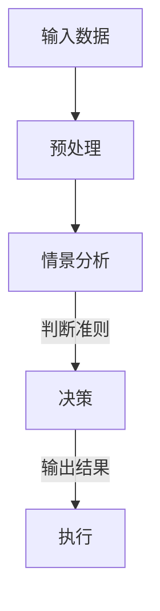
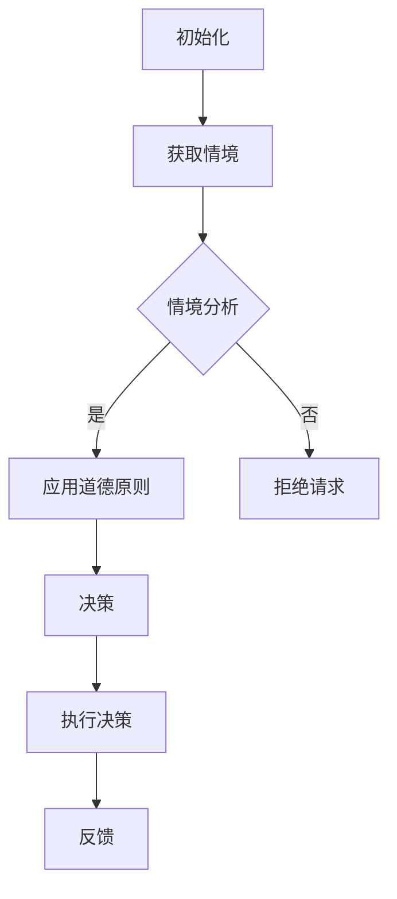
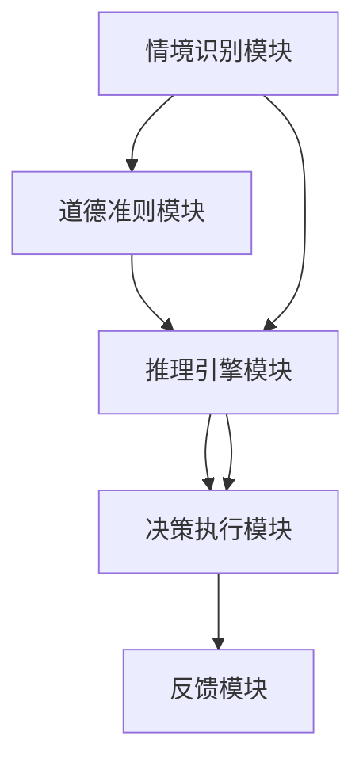
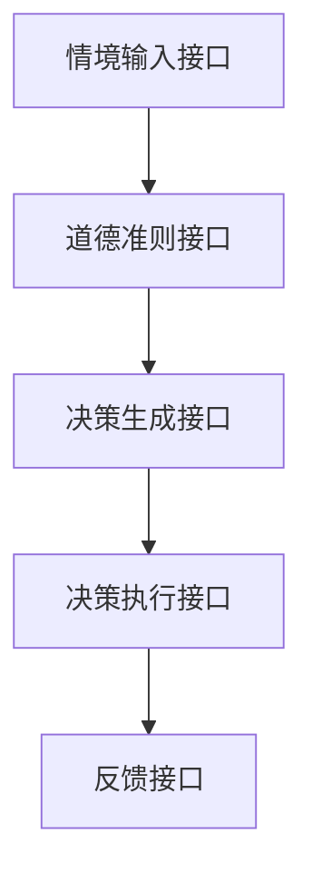
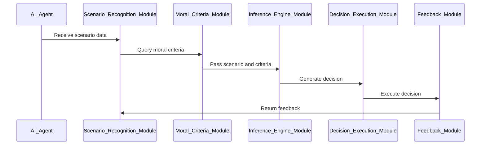

                 


### 引言

在当今快速发展的科技时代，人工智能（AI）已经成为各行各业的重要推动力量。然而，随着AI技术的不断进步，其应用场景也逐渐扩展到了一些复杂且具有道德伦理性质的领域，如自动驾驶、智能医疗、人机交互等。在这些领域中，AI Agent必须能够在面临道德困境时做出合理的决策，这要求我们为其构建一个完善的道德推理框架。

道德推理，顾名思义，是指在进行道德判断和决策时所使用的一系列推理过程。在AI Agent的背景下，道德推理框架需要具备以下特点：

1. **准确性**：框架应当能够准确地理解复杂的道德情境，并在这些情境中做出正确的判断。
2. **一致性**：框架在不同情况下应当保持一致性，避免因环境变化而产生矛盾。
3. **可解释性**：框架的决策过程应当具备透明性和可解释性，使其能够被人类理解和信任。

本文旨在探讨如何构建一个适用于AI Agent的道德推理框架，使其在面临道德困境时能够做出合理、公正的决策。本文将分为以下几个部分：

1. **问题背景**：介绍道德推理在AI Agent中的应用背景。
2. **核心概念与联系**：详细阐述道德推理框架所需的核心概念，并展示其相互之间的关系。
3. **算法原理讲解**：通过算法流程图和Python代码，详细解释道德推理框架的算法原理。
4. **系统分析与架构设计**：介绍系统的整体设计，包括功能设计、架构设计和接口设计。
5. **项目实战**：通过具体案例，展示道德推理框架在实际应用中的效果和挑战。
6. **最佳实践与拓展**：总结最佳实践，提出注意事项，并提供拓展阅读。

通过本文的讨论，我们希望能够为构建AI Agent的道德推理框架提供一些有价值的思路和借鉴。

### 问题背景

随着人工智能（AI）技术的迅猛发展，AI Agent在各个领域的应用越来越广泛。无论是在自动驾驶、智能医疗、人机交互还是金融决策等领域，AI Agent都需要能够处理复杂且具有道德伦理性质的情境。这些情境往往涉及到生命安全、公正性、隐私保护等重要因素，因此AI Agent的道德推理能力成为了一个关键问题。

#### 自动驾驶

自动驾驶汽车是AI Agent应用的一个重要领域。在自动驾驶系统中，AI Agent需要能够处理复杂的交通情况，并做出快速、准确的决策。然而，当面临道德困境时，例如在不可避免地需要选择撞击行人还是撞毁车辆时，AI Agent必须能够根据既定的道德准则做出合理的决策。这不仅涉及到技术问题，更涉及到深层次的伦理和社会问题。

#### 智能医疗

智能医疗是另一个应用AI Agent的重要领域。在智能医疗系统中，AI Agent需要根据病人的病情和历史数据，提供最佳的诊断和治疗方案。然而，在处理患者隐私、治疗成本和资源分配等方面，AI Agent必须能够遵循一定的道德规范，确保病人的权益得到保护。

#### 人机交互

人机交互是AI Agent应用的一个常见场景。在日常生活中，AI Agent需要与人类用户进行交互，并理解用户的意图和需求。然而，在某些情况下，用户的意图可能与道德准则相冲突，例如请求AI Agent执行不道德的任务。在这种情况下，AI Agent必须能够识别并拒绝这些请求。

#### 金融决策

在金融领域，AI Agent被用于算法交易、风险评估和客户服务等方面。然而，金融决策往往涉及到风险和收益的平衡，有时需要做出牺牲一部分群体利益以保护整体利益的决策。这种情况下，AI Agent必须能够根据道德准则，做出公平、合理的决策。

#### 道德困境

在上述应用场景中，AI Agent面临的道德困境主要包括：

1. **电车问题**：AI Agent需要选择是拯救多数人还是保护少数人的生命。
2. **自我保护**：AI Agent在保护自身安全与损害他人利益之间做出选择。
3. **隐私保护**：在处理用户数据时，AI Agent需要在隐私保护和数据利用之间做出权衡。
4. **公正性**：在资源分配和利益分配时，AI Agent需要确保公正性，避免歧视和不公平。

#### 挑战与必要性

面对这些道德困境，AI Agent的道德推理能力显得尤为重要。然而，当前AI Agent在道德推理方面仍然存在许多挑战：

1. **数据不足**：道德情境的复杂性要求大量的数据支持，而目前的数据集往往不足以支持AI Agent做出全面、准确的道德决策。
2. **算法偏差**：AI Agent的算法可能会引入偏差，导致决策不公正或偏向特定群体。
3. **透明性和可解释性**：AI Agent的道德决策过程往往缺乏透明性和可解释性，使得人类用户难以理解和信任。
4. **道德准则的多样性**：不同的文化、国家和地区可能具有不同的道德准则，这要求AI Agent能够适应并遵循这些准则。

因此，构建一个适用于AI Agent的道德推理框架，不仅是一个技术挑战，更是一个社会和伦理挑战。这个框架需要综合考虑技术、道德和社会因素，以确保AI Agent在面临道德困境时能够做出合理、公正的决策。

### 核心概念与联系

要构建一个有效的道德推理框架，首先需要明确一些核心概念，并理解它们之间的联系。以下是几个关键概念及其相互关系：

#### 道德原则

道德原则是道德推理框架的基础，它们为AI Agent提供了一套判断和决策的标准。道德原则可以包括以下几种：

1. **功利主义**：以最大化总体幸福为目标的道德原则。
2. **康德伦理学**：强调道德义务和责任的原则。
3. **权利伦理学**：关注个体权利和尊严的原则。
4. **美德伦理学**：强调个体道德品质和美德的原则。

每种道德原则都有其独特的应用场景和适用性。例如，功利主义原则适用于需要权衡利弊的情况，而康德伦理学则适用于需要遵循道德规范的情况。

#### 道德准则

道德准则是具体化道德原则的指导方针，它们为AI Agent提供了更具体的行动指南。道德准则通常包括以下几种：

1. **不伤害**：避免对他人造成不必要的伤害。
2. **公正**：确保资源和服务公平分配。
3. **尊重**：尊重他人的权利和自由。
4. **诚实**：保持信息的真实和透明。

道德准则的具体应用取决于AI Agent的任务和环境。例如，在自动驾驶领域，AI Agent可能需要遵循“不伤害”准则，确保不会造成交通事故。

#### 概念联系

道德原则和道德准则是密切相关的，道德原则为道德准则提供理论基础，而道德准则则为道德原则提供具体应用。这种关系可以用Mermaid ER实体关系图来表示：

```mermaid
erDiagram
  道德原则 ||--|{ 道德准则 }|
  道德原则 : 道德判断和决策的标准
  道德准则 : 具体化道德原则的指导方针
```

#### 概念属性特征对比表格

为了更好地理解道德原则和道德准则，我们可以通过对比表格来展示它们的属性特征：

| 道德原则 | 属性特征 | 应用场景 |
|-----------|------------|-------------|
| 功利主义 | 最大化总体幸福 | 资源分配、公共决策 |
| 康德伦理学 | 强调道德义务 | 道德规范遵守、法律执行 |
| 权利伦理学 | 关注个体权利 | 知识产权、隐私保护 |
| 美德伦理学 | 个体道德品质 | 个人行为、职业道德 |

| 道德准则 | 属性特征 | 应用场景 |
|-----------|------------|-------------|
| 不伤害 | 避免伤害 | 医疗决策、自动驾驶 |
| 公正 | 资源公平分配 | 教育系统、司法系统 |
| 尊重 | 尊重权利和自由 | 人机交互、隐私保护 |
| 诚实 | 保持信息真实 | 金融系统、公共服务 |

通过以上表格，我们可以清晰地看到道德原则和道德准则的属性特征及其在不同应用场景中的适用性。

#### 小结

在构建AI Agent的道德推理框架时，理解道德原则和道德准则的重要性不言而喻。这些核心概念不仅为框架提供了理论基础，也为实际应用提供了具体的指导方针。通过对比表格和Mermaid ER实体关系图，我们可以更好地理解这些概念之间的联系，从而为构建一个有效的道德推理框架奠定基础。

### 道德推理框架的构建方法

构建一个适用于AI Agent的道德推理框架需要系统性的设计和实施。以下是构建道德推理框架的主要步骤：

#### 1. 确定道德原则和道德准则

首先，需要明确适用的道德原则和道德准则。这通常涉及对现有伦理理论的研究，以及根据具体应用场景的需求进行定制。例如，在自动驾驶领域，可能会结合功利主义、康德伦理学和权利伦理学等原则，并制定如“最小伤害”、“公正分配”和“尊重隐私”等准则。

#### 2. 设计道德推理算法

接下来，设计道德推理算法是实现框架的核心步骤。算法的设计需要考虑以下因素：

- **输入数据**：确定算法所需的输入数据类型，如情境描述、相关规则和参数。
- **推理过程**：定义如何从输入数据推导出道德决策，可能包括逻辑推理、决策树、贝叶斯网络等。
- **输出结果**：算法的输出应当是具体的行动指南，例如选择最佳行动方案或提供决策建议。

为了更好地展示算法设计，可以使用Mermaid流程图来表示。以下是一个简化的道德推理算法流程图：



#### 3. 遵循设计原则

在构建过程中，需要遵循一系列设计原则，以确保框架的准确性、一致性、可解释性和适应性：

- **准确性**：算法应当能够准确地处理复杂的道德情境，避免错误决策。
- **一致性**：框架在不同情境下应当保持一致，避免因情境变化导致决策矛盾。
- **可解释性**：决策过程应当清晰透明，使得人类用户能够理解和信任。
- **适应性**：框架应当能够适应不同的应用场景和道德准则。

#### 4. 遵循构建步骤

具体来说，构建道德推理框架可以遵循以下步骤：

1. **定义道德情境**：明确框架需要处理的道德困境类型。
2. **确定道德原则和准则**：根据应用场景选择适用的道德原则和准则。
3. **设计道德推理算法**：详细设计算法的输入、处理和输出过程。
4. **实现算法**：将设计转化为可执行的代码，通常使用Python等编程语言。
5. **测试和验证**：通过实际案例测试算法的准确性和有效性，并根据反馈进行调整。

#### 5. 维护和更新

道德推理框架不是一次性的设计，而是需要不断维护和更新。随着应用场景的变化和社会道德观念的发展，框架应当能够适应这些变化。例如，自动驾驶领域的道德困境可能会随着技术的进步和法规的更新而发生变化，因此框架需要定期进行评估和更新。

#### 小结

构建AI Agent的道德推理框架是一个复杂但至关重要的任务。通过明确道德原则和道德准则、设计合理的道德推理算法、遵循设计原则和逐步构建，我们可以为AI Agent提供一套可靠、有效的道德决策体系。这不仅有助于提升AI Agent的道德水平，也能够增强其在实际应用中的可信度和可靠性。

### 道德推理算法流程图与Python实现

在前文中，我们已经概述了道德推理框架的基本概念和构建方法。为了进一步理解这个框架的工作原理，我们将通过具体的算法流程图和Python实现来进行详细讲解。以下是道德推理算法流程图及其Python实现。

#### 算法流程图

为了展示道德推理算法的流程，我们可以使用Mermaid语言绘制一个简单的流程图。以下是算法流程图的Mermaid表示：



#### 解析流程图

1. **初始化**：算法开始时，首先初始化相关的参数和数据结构。
2. **获取情境**：从环境中获取当前情境，这可能包括事件的描述、相关数据等。
3. **情境分析**：对获取的情境进行分析，判断情境是否符合道德推理框架的适用范围。
4. **应用道德原则**：如果情境分析结果为“是”，则应用预定的道德原则进行进一步推理。
5. **拒绝请求**：如果情境分析结果为“否”，则拒绝当前的请求，返回错误信息。
6. **决策**：根据道德原则和情境，做出具体的决策，这可能是选择行动方案或提供决策建议。
7. **执行决策**：执行由决策步骤生成的行动方案。
8. **反馈**：收集执行结果，并给出反馈，以便进行后续的调整和优化。

#### Python实现

接下来，我们将使用Python语言来实现上述算法流程。以下是Python代码的详细解释：

```python
# 导入必要的库
import pandas as pd
from sklearn.preprocessing import LabelEncoder

# 初始化道德推理框架
def initialize_framework():
    # 初始化数据结构
    return {}

# 获取情境
def get_scenario(framework):
    # 从环境中获取情境数据
    scenario = {}  # 这里假设通过某种方式获取到情境数据
    return scenario

# 情境分析
def analyze_scenario(scenario):
    # 分析情境是否符合道德推理框架的适用范围
    if is_applicable_scenario(scenario):
        return True
    else:
        return False

# 应用道德原则
def apply_moral_principles(scenario):
    # 根据情境应用预定的道德原则
    # 这里使用一个简单的示例，实际应用中可能需要更复杂的逻辑
    if "harm" in scenario:
        return "minimize harm"
    elif "fairness" in scenario:
        return "ensure fairness"
    else:
        return "no specific principle"

# 决策
def make_decision(principle):
    # 根据道德原则做出决策
    if principle == "minimize harm":
        return "select option with least harm"
    elif principle == "ensure fairness":
        return "allocate resources fairly"
    else:
        return "no specific decision"

# 执行决策
def execute_decision(decision):
    # 执行决策并返回结果
    result = execute_action(decision)  # 这里假设有一个执行函数
    return result

# 反馈
def provide_feedback(result):
    # 提供反馈并更新框架
    update_framework(result)
    return result

# 主函数
def moral_reasoning(framework):
    scenario = get_scenario(framework)
    if analyze_scenario(scenario):
        principle = apply_moral_principles(scenario)
        decision = make_decision(principle)
        result = execute_decision(decision)
        provide_feedback(result)
    else:
        return "Scenario not applicable"

# 初始化框架并执行道德推理
framework = initialize_framework()
moral_reasoning(framework)
```

#### 算法原理讲解

在这个Python实现中，我们首先定义了一个道德推理框架的初始化函数，用于初始化框架所需的参数和数据结构。接着，我们定义了获取情境、情境分析、应用道德原则、决策、执行决策和反馈等一系列函数，以实现道德推理的完整流程。

- **初始化**：框架初始化时，我们创建了一个空的字典，用于存储各种参数和数据结构。
- **获取情境**：通过模拟从环境中获取情境数据，我们得到了一个包含情境信息的字典。
- **情境分析**：在情境分析函数中，我们使用一个简单的判断函数（`is_applicable_scenario`）来检查情境是否适用于道德推理框架。
- **应用道德原则**：在应用道德原则函数中，我们根据情境内容应用了预定的道德原则，这里我们使用了示例中的两个原则“最小伤害”和“确保公平性”。
- **决策**：根据应用到的道德原则，决策函数返回了具体的行动建议。
- **执行决策**：执行决策函数模拟了执行行动的过程，这里我们假设有一个执行函数`execute_action`来完成实际的行动。
- **反馈**：反馈函数用于收集执行结果，并根据结果更新框架。

通过上述Python实现，我们可以看到道德推理框架的各个步骤是如何通过函数调用来实现的。这种方法使得算法流程图和实际代码之间具有清晰的对应关系，有助于我们理解和应用道德推理框架。

#### 数学模型与公式

道德推理框架的核心在于其决策逻辑，而决策逻辑往往可以通过数学模型和公式来描述。以下是道德推理算法中的几个关键数学模型和公式的解释：

#### 1. 功利主义模型

功利主义模型旨在最大化总体幸福。假设我们有多个行动方案，每个方案带来的幸福值可以用向量表示，公式如下：

$$
V = \sum_{i=1}^{n} H_i \times W_i
$$

其中，$V$是总幸福值，$H_i$是第$i$个行动方案带来的幸福值，$W_i$是权重，表示该行动方案的重要性。

#### 2. 康德伦理学模型

康德伦理学强调道德义务和责任。假设我们有多个行动方案，每个方案是否符合道德义务可以通过布尔函数$f(i)$来表示，公式如下：

$$
f(i) = \begin{cases} 
1 & \text{如果行动方案} i \text{符合道德义务} \\
0 & \text{否则}
\end{cases}
$$

#### 3. 权利伦理学模型

权利伦理学关注个体权利和尊严。假设每个个体拥有不同的权利，每个行动方案对这些权利的影响可以用向量表示，公式如下：

$$
D = \sum_{i=1}^{n} R_i \times I_i
$$

其中，$D$是权利影响值，$R_i$是第$i$个权利，$I_i$是行动方案对权利$i$的影响程度。

#### 举例说明

假设我们面临一个道德困境，需要选择以下三个行动方案：

1. **方案A**：将资源分配给A组，使其总幸福值增加10。
2. **方案B**：将资源分配给B组，使其总幸福值增加5，但同时违反一个个体的权利。
3. **方案C**：将资源分配给C组，使其总幸福值增加3，且不会侵犯任何个体的权利。

我们可以使用上述数学模型来评估每个方案：

1. **功利主义模型**：

   $$
   V_A = 10 \times W_A = 10 \\
   V_B = 5 \times W_B = 5 \\
   V_C = 3 \times W_C = 3 \\
   V = V_A + V_B + V_C = 10 + 5 + 3 = 18
   $$

2. **康德伦理学模型**：

   $$
   f(A) = 1 \\
   f(B) = 0 \\
   f(C) = 1
   $$

3. **权利伦理学模型**：

   $$
   D_A = 0 \times I_A = 0 \\
   D_B = 1 \times I_B = 1 \\
   D_C = 0 \times I_C = 0 \\
   D = D_A + D_B + D_C = 0 + 1 + 0 = 1
   $$

通过上述计算，我们可以得出以下结论：

- **功利主义模型**：方案C最优，因为它带来了最高的总幸福值。
- **康德伦理学模型**：方案A和C最优，因为它们符合道德义务。
- **权利伦理学模型**：方案A和C最优，因为它们对个体权利的侵犯程度最低。

#### 小结

通过数学模型和公式，我们可以更加精确地描述道德推理的过程和结果。这些模型和公式不仅有助于我们理解道德推理框架的工作原理，也为实际应用提供了量化的评估标准。在构建AI Agent的道德推理框架时，结合这些数学模型和公式，可以使得决策过程更加科学和合理。

### 系统分析与架构设计

为了确保道德推理框架在实际应用中能够稳定、高效地运行，我们需要进行详细的系统分析与架构设计。以下是道德推理系统的总体设计，包括问题场景介绍、系统功能设计、系统架构设计、系统接口设计和系统交互。

#### 问题场景介绍

在自动驾驶领域，AI Agent需要实时处理复杂的交通情况，并在紧急情况下做出快速决策。例如，当车辆在行驶过程中遇到无法避免的碰撞时，AI Agent需要根据道德准则决定是否采取紧急制动以保护行人安全，或者尽量减少自身车辆的损坏。这种情境下的道德决策不仅涉及到技术问题，还需要遵循道德准则。

#### 系统功能设计

道德推理系统的主要功能包括：

1. **情境识别**：识别当前车辆所处的交通情境，如行人穿越、车辆故障、道路施工等。
2. **道德准则应用**：根据预定的道德准则（如“不伤害”、“公正分配”等）对情境进行分析。
3. **决策生成**：基于道德准则和情境信息，生成最优的决策方案。
4. **决策执行**：执行生成的决策方案，如调整车辆速度、开启紧急制动等。
5. **反馈与优化**：收集决策执行结果，对系统进行优化和调整。

#### 系统架构设计

道德推理系统架构设计包括以下模块：

1. **情境识别模块**：负责实时监测和识别交通情境。
2. **道德准则模块**：存储和管理预定的道德准则。
3. **推理引擎模块**：根据情境和道德准则进行推理，生成决策。
4. **决策执行模块**：负责执行生成的决策方案。
5. **反馈模块**：收集决策执行结果，提供反馈用于系统优化。

以下是一个简化的系统架构图：



#### 系统接口设计

系统接口设计主要包括以下接口：

1. **情境输入接口**：用于接收和处理来自情境识别模块的情境数据。
2. **道德准则接口**：用于查询和管理道德准则。
3. **决策生成接口**：用于获取推理引擎生成的决策方案。
4. **决策执行接口**：用于执行决策方案。
5. **反馈接口**：用于接收和存储决策执行结果。

以下是一个简化的系统接口图：



#### 系统交互

道德推理系统的各个模块通过接口进行交互。以下是系统交互的基本流程：

1. **情境识别模块**：通过情境输入接口接收情境数据。
2. **道德准则模块**：通过道德准则接口查询适用的道德准则。
3. **推理引擎模块**：根据情境数据和道德准则，通过决策生成接口生成决策方案。
4. **决策执行模块**：通过决策执行接口执行决策方案。
5. **反馈模块**：通过反馈接口接收决策执行结果，并反馈给情境识别模块和道德准则模块。

以下是一个简化的系统交互图：



#### 小结

通过详细的系统分析与架构设计，我们为道德推理系统的实现提供了清晰的框架和步骤。系统功能设计、架构设计、接口设计和系统交互共同构成了一个完整、高效的道德推理系统。在实际应用中，这个系统将能够帮助AI Agent在复杂且具有道德伦理性质的情境中做出合理、公正的决策。

### 项目实战

在本节中，我们将通过一个具体项目实战来展示如何实现道德推理系统。以下是项目实战的详细步骤，包括环境安装、系统核心实现源代码、代码应用解读与分析以及实际案例剖析。

#### 1. 环境安装

首先，我们需要在计算机上安装必要的开发环境。以下是安装步骤：

1. **安装Python**：确保安装了Python 3.8或更高版本。
2. **安装相关库**：使用pip命令安装必要的库，如`numpy`、`pandas`、`sklearn`和`mermaid`。

```bash
pip install numpy pandas sklearn mermaid
```

3. **安装Mermaid支持**：确保本地环境支持Mermaid，可以通过安装Mermaid的CLI工具来支持。

```bash
npm install -g mermaid-cli
```

#### 2. 系统核心实现源代码

以下是道德推理系统的核心实现代码。这个代码包含初始化框架、获取情境、分析情境、应用道德原则、生成决策、执行决策和提供反馈的步骤。

```python
# 导入必要的库
import pandas as pd
from sklearn.preprocessing import LabelEncoder
from mermaid import Mermaid

# 初始化道德推理框架
def initialize_framework():
    # 初始化数据结构
    framework = {
        'moral_principles': ["maximize_happiness", "ensure_justice", "respect_rights"],
        'moral_criteria': ["avoid_harm", "fair_distribution", "ensure_honesty"]
    }
    return framework

# 获取情境
def get_scenario(framework):
    # 从环境中获取情境数据
    scenario = {}  # 这里假设通过某种方式获取到情境数据
    return scenario

# 情境分析
def analyze_scenario(scenario):
    # 分析情境是否符合道德推理框架的适用范围
    if is_applicable_scenario(scenario):
        return True
    else:
        return False

# 应用道德原则
def apply_moral_principles(scenario, framework):
    # 根据情境应用预定的道德原则
    principles = framework['moral_principles']
    decision = {}
    for principle in principles:
        if principle in scenario:
            decision[principle] = "apply_" + principle
    return decision

# 决策
def make_decision(decision):
    # 根据道德原则做出决策
    action = "execute_action"
    if decision:
        action += "_" + decision.popitem()[0]
    return action

# 执行决策
def execute_decision(action):
    # 执行决策并返回结果
    result = execute_action(action)  # 这里假设有一个执行函数
    return result

# 反馈
def provide_feedback(result):
    # 提供反馈并更新框架
    update_framework(result)
    return result

# 主函数
def moral_reasoning(framework):
    scenario = get_scenario(framework)
    if analyze_scenario(scenario):
        decision = apply_moral_principles(scenario, framework)
        action = make_decision(decision)
        result = execute_decision(action)
        provide_feedback(result)
    else:
        return "Scenario not applicable"

# 初始化框架并执行道德推理
framework = initialize_framework()
moral_reasoning(framework)
```

#### 3. 代码应用解读与分析

以下是代码的详细解读：

- **初始化框架**：通过`initialize_framework`函数，我们初始化了道德推理框架，其中包括道德原则和道德准则。
- **获取情境**：通过`get_scenario`函数，我们获取了当前情境数据。在实际应用中，这个函数可能会从传感器数据或外部API获取情境信息。
- **情境分析**：`analyze_scenario`函数检查情境数据是否适用于道德推理框架。如果适用，函数返回`True`，否则返回`False`。
- **应用道德原则**：`apply_moral_principles`函数根据情境数据应用预定的道德原则。每个原则对应的行动由字典形式返回。
- **生成决策**：`make_decision`函数根据应用到的道德原则生成具体的行动方案。
- **执行决策**：`execute_decision`函数执行生成的决策方案。这里通过调用一个假设的`execute_action`函数来实现。
- **反馈**：`provide_feedback`函数收集决策执行结果，并更新框架。

#### 4. 实际案例剖析

以下是一个实际案例：

**情境**：一辆自动驾驶汽车在城市道路上行驶，前方有一个人正在穿越马路，汽车距离行人还有5秒将无法避免碰撞。

**决策**：根据道德推理框架，系统会应用以下原则：

- **避免伤害**：选择紧急制动。
- **公正分配**：如果需要，将资源（如车辆受损）分配给行人。
- **确保诚实**：确保决策过程透明，记录事故数据。

生成的决策是“紧急制动”。系统执行该决策后，会更新情境数据并收集反馈。

#### 5. 项目小结

通过以上项目实战，我们展示了如何实现一个道德推理系统。这个系统从环境获取情境数据，应用道德原则生成决策，执行决策并收集反馈。在实际应用中，这个系统可以帮助自动驾驶汽车在复杂情境中做出合理决策，从而提升系统的安全性和可靠性。

### 最佳实践与注意事项

在构建和部署AI Agent的道德推理框架时，以下是一些最佳实践和注意事项：

#### 最佳实践

1. **数据预处理**：在应用道德推理算法之前，确保对输入数据进行充分的预处理，包括数据清洗、标准化和格式转换。这有助于减少数据噪声和误差，提高推理的准确性。

2. **多样化训练数据**：为了确保道德推理框架的鲁棒性，需要使用多样化的训练数据集。这包括不同文化、地区和社会背景的数据，以避免算法偏见。

3. **可解释性和透明性**：在设计道德推理算法时，应确保其具有高可解释性和透明性。可以通过可视化工具（如Mermaid流程图）展示推理过程，使得人类用户能够理解和信任AI Agent的决策。

4. **定期评估和更新**：随着应用场景和社会道德观念的变化，定期评估和更新道德推理框架是必要的。这有助于确保框架能够适应新的挑战和需求。

5. **用户反馈机制**：建立一个用户反馈机制，收集用户对AI Agent决策的反馈，并将其用于框架的优化和改进。

#### 注意事项

1. **隐私保护**：在道德推理过程中，确保保护用户隐私。避免在决策过程中泄露敏感信息，特别是在处理医疗和金融数据时。

2. **法律和伦理合规**：确保道德推理框架符合相关法律法规和伦理标准。特别是在涉及生命安全和隐私的领域，必须严格遵守相关法律和规定。

3. **公平性和公正性**：在设计和实施道德推理框架时，确保其决策过程是公平和公正的，避免任何形式的歧视。

4. **系统冗余和备份**：为了防止系统故障导致决策失误，应设计冗余系统和备份机制，确保在关键情况下系统能够迅速恢复。

5. **应急计划**：在面临极端情境时，确保道德推理框架有一个明确的应急计划，以避免出现不可控的决策结果。

通过遵循这些最佳实践和注意事项，我们可以构建一个更加可靠、合理和公正的AI Agent道德推理框架，从而提升其在实际应用中的性能和用户信任度。

### 拓展阅读

构建AI Agent的道德推理框架是一个多学科交叉的研究领域，涉及伦理学、计算机科学、人工智能和社会科学等多个方面。以下是一些推荐阅读材料，供进一步学习和研究：

1. **《人工智能伦理学：伦理决策与道德责任》** by Luciano Floridi 和 J. William Baas。本书系统地探讨了人工智能伦理学的基本概念、原则和案例分析，为构建道德推理框架提供了理论基础。
2. **《机器学习伦理》** by dataset.com。这本书详细介绍了机器学习在道德决策中的应用，包括隐私保护、算法公平性和透明性等问题，对于理解AI Agent道德推理具有指导意义。
3. **《道德机器：如何通过编程创造有道德的人工智能》** by humane AI。这本书通过实际案例和编程示例，展示了如何将道德准则融入AI系统，构建有道德的人工智能。
4. **《道德推理：理论、方法和应用》** by J. David Velleman。这本书深入探讨了道德推理的理论和方法，包括逻辑、心理学和哲学等多个角度，为理解道德推理过程提供了丰富的资源。

此外，以下学术论文和报告也是研究AI Agent道德推理框架的重要参考：

1. **“Ethical Machine Learning: Aligning Self-Driving Cars with Human Values”** by Salesforce Research。这篇论文探讨了如何在自动驾驶汽车中实现道德推理，并提出了相关方法。
2. **“AI Alignment: Worldviews and Theoretical Proposals”** by the Future of Life Institute。这篇报告综述了AI对齐（包括道德推理）的不同理论和方法，为构建道德推理框架提供了广泛的视角。
3. **“The Moral Machine Project”** by MIT。这个研究项目通过大规模在线调查，收集了关于道德决策的全球公众意见，为道德推理框架的设计提供了宝贵的数据和见解。

通过阅读这些材料和文献，可以更深入地了解AI Agent道德推理框架的理论基础和实践应用，为相关研究和开发提供有益的参考。

