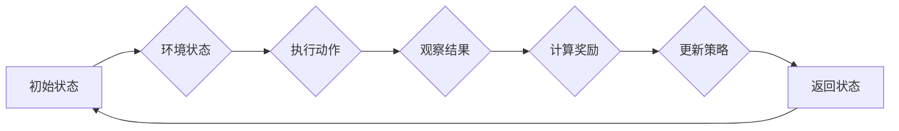
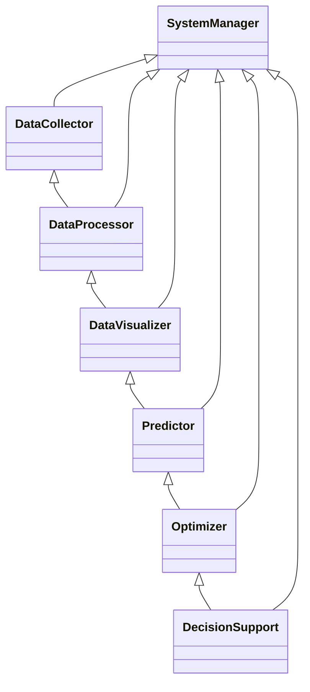
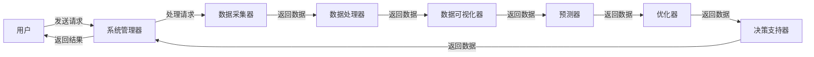

                 


### 文章标题：构建AI Agent驱动的智能城市规划系统

> 关键词：AI Agent、智能城市规划、系统架构、算法、Python代码、Mermaid图

> 摘要：本文深入探讨了AI Agent驱动的智能城市规划系统的构建方法，包括核心概念、算法原理、系统分析与设计以及实际项目实现。文章旨在为读者提供清晰、易懂的技术路径，以实现智能城市的可持续发展。

----------------------------------------------------------------

## 目录

1. **背景介绍**
    - AI Agent概念
    - 智能城市规划系统概述
    - 问题背景与重要性

2. **核心概念与联系**
    - AI Agent核心概念
    - 智能城市规划核心概念
    - Mermaid ER实体关系图

3. **算法原理讲解**
    - 算法原理
    - Mermaid算法流程图
    - Python代码与LaTeX公式

4. **系统分析与架构设计方案**
    - 系统功能设计
    - 系统架构设计
    - 系统交互设计

5. **项目实战**
    - 环境安装
    - 系统实现
    - 代码解读
    - 案例分析

6. **最佳实践 tips、小结、注意事项、拓展阅读**

----------------------------------------------------------------

### 1. 背景介绍

#### AI Agent概念

AI Agent，即人工智能代理，是一种能够在特定环境中自主执行任务、进行决策和行动的计算实体。它通过感知环境、分析数据和执行动作来达到预定的目标。AI Agent在智能城市规划中扮演着重要的角色，能够帮助城市管理者进行实时监控、预测和优化。

#### 智能城市规划系统概述

智能城市规划系统是一种集成多种人工智能技术的综合系统，旨在实现城市资源的高效利用、城市环境的优化和居民生活的便捷。该系统通过收集和分析大量数据，运用机器学习和深度学习算法，为城市规划提供科学依据和决策支持。

#### 问题背景与重要性

随着城市化进程的加快，城市面临着交通拥堵、环境污染、资源紧缺等挑战。传统的城市规划方法已无法满足现代城市的需求，迫切需要一种智能化的解决方案。AI Agent驱动的智能城市规划系统具有以下优势：

- **实时性**：系统能够实时收集和分析城市数据，提供即时的决策支持。
- **灵活性**：系统能够根据城市环境和居民需求的变化进行自适应调整。
- **高效性**：系统能够利用大数据和人工智能技术，优化城市资源配置，提高城市管理效率。

因此，构建AI Agent驱动的智能城市规划系统对于实现城市可持续发展具有重要意义。

----------------------------------------------------------------

### 2. 核心概念与联系

#### AI Agent核心概念

AI Agent是由人工智能技术驱动的智能实体，它能够自主感知环境、分析数据和执行任务。AI Agent通常具有以下特征：

- **自主性**：能够独立完成特定任务，无需人工干预。
- **适应性**：能够根据环境变化和任务需求进行自适应调整。
- **学习性**：能够通过不断学习和优化，提高任务完成效果。

#### 智能城市规划核心概念

智能城市规划是指利用人工智能技术对城市进行规划和管理，以实现城市资源的高效利用和环境的可持续发展。智能城市规划的核心概念包括：

- **大数据**：通过收集和分析大量城市数据，为城市规划提供科学依据。
- **机器学习**：利用机器学习算法，对城市数据进行分析和预测，为城市规划提供决策支持。
- **深度学习**：通过深度学习技术，对城市数据进行分析，发现潜在问题和优化方案。
- **多代理系统**：通过多个AI Agent协同工作，实现城市资源的优化配置和智能管理。

#### Mermaid ER实体关系图

以下是一个简化的Mermaid ER实体关系图，展示了AI Agent和智能城市规划系统的核心概念之间的关系：

```mermaid
erDiagram
    AI-Agent ||--|{ 智能城市规划系统 : 管理对象 }
    大数据 ||--|{ 智能城市规划系统 : 数据来源 }
    机器学习 ||--|{ 智能城市规划系统 : 技术支持 }
    深度学习 ||--|{ 智能城市规划系统 : 技术支持 }
```

在这个图中，AI-Agent作为智能城市规划系统的管理对象，依赖于大数据、机器学习和深度学习技术作为支撑。这些技术共同构成了智能城市规划系统的核心能力。

----------------------------------------------------------------

### 3. 算法原理讲解

#### 算法原理

构建AI Agent驱动的智能城市规划系统需要运用多种算法和技术，其中主要包括：

- **强化学习**：用于训练AI Agent，使其能够在复杂环境中进行自主决策和优化。
- **聚类分析**：用于对城市数据进行分析，识别城市中的热点区域和问题。
- **回归分析**：用于预测城市数据的变化趋势，为城市规划提供参考。
- **多目标优化**：用于优化城市资源配置，实现城市可持续发展的目标。

在本节中，我们将重点介绍强化学习算法原理。

#### Mermaid算法流程图

以下是一个简化的Mermaid算法流程图，展示了强化学习算法的基本流程：



在这个图中，A表示初始状态，B表示当前环境状态，C表示执行动作，D表示观察结果，E表示计算奖励，F表示更新策略，G表示返回状态。

#### Python代码与LaTeX公式

为了更好地理解强化学习算法原理，我们将使用Python代码和LaTeX公式进行详细讲解。

首先，我们需要安装Python环境以及相关库，如TensorFlow和PyTorch：

```bash
pip install tensorflow
pip install torch
```

接下来，我们编写一个简单的强化学习示例代码：

```python
import random
import numpy as np
import matplotlib.pyplot as plt

# 初始化环境
class Environment:
    def __init__(self):
        self.state = 0

    def step(self, action):
        reward = 0
        if action == 0:
            self.state -= 1
            reward = -1
        elif action == 1:
            self.state += 1
            reward = 1
        done = self.state >= 10 or self.state <= -10
        return self.state, reward, done

# 初始化代理
class Agent:
    def __init__(self):
        self.q_values = np.zeros((2, 2))
        self.learning_rate = 0.1
        self.discount_factor = 0.9

    def select_action(self, state):
        return np.argmax(self.q_values[state])

    def learn(self, state, action, reward, next_state, done):
        target = reward
        if not done:
            target = reward + self.discount_factor * np.max(self.q_values[next_state])
        self.q_values[state][action] = self.q_values[state][action] + self.learning_rate * (target - self.q_values[state][action])

# 运行实验
def run_experiment():
    environment = Environment()
    agent = Agent()
    episodes = 1000
    rewards = []

    for episode in range(episodes):
        state = environment.state
        done = False
        total_reward = 0

        while not done:
            action = agent.select_action(state)
            next_state, reward, done = environment.step(action)
            agent.learn(state, action, reward, next_state, done)
            total_reward += reward
            state = next_state

        rewards.append(total_reward)

    plt.plot(rewards)
    plt.xlabel('Episode')
    plt.ylabel('Total Reward')
    plt.show()

run_experiment()
```

在这个示例中，我们定义了一个简单的环境（`Environment`类）和一个代理（`Agent`类）。代理使用Q-learning算法进行学习，通过不断尝试和反馈，逐步优化策略，以最大化总奖励。

最后，我们使用LaTeX公式表示强化学习算法的数学模型：

$$
Q(s, a) \leftarrow Q(s, a) + \alpha [r + \gamma \max_{a'} Q(s', a') - Q(s, a)]
$$

其中，$Q(s, a)$表示在状态$s$下执行动作$a$的期望回报，$\alpha$表示学习率，$\gamma$表示折扣因子，$r$表示即时奖励。

通过以上讲解，读者可以更好地理解强化学习算法在AI Agent驱动的智能城市规划系统中的应用。

----------------------------------------------------------------

### 4. 系统分析与架构设计方案

#### 问题场景介绍

在智能城市规划系统中，问题场景主要包括以下几个方面：

- **交通管理**：通过实时监测城市交通状况，预测交通流量，优化交通信号控制。
- **环境保护**：通过监测空气质量、水质等环境指标，预测污染趋势，制定环保措施。
- **资源配置**：通过分析城市资源利用情况，优化资源配置，提高资源利用效率。
- **应急响应**：通过实时监测城市安全状况，预测灾害风险，制定应急响应措施。

这些问题场景需要多个AI Agent协同工作，实现城市资源的优化配置和智能管理。

#### 系统功能设计

智能城市规划系统的主要功能包括：

- **数据采集**：通过传感器、摄像头等设备，实时收集城市数据。
- **数据处理**：对采集到的数据进行清洗、预处理和存储。
- **数据可视化**：通过图表、地图等方式，展示城市数据和分析结果。
- **预测与优化**：运用机器学习和深度学习算法，对城市数据进行预测和优化。
- **决策支持**：为城市规划和管理人员提供科学依据和决策支持。
- **系统管理**：对AI Agent进行监控、管理和调度。

以下是一个简化的Mermaid类图，展示了智能城市规划系统的领域模型：



在这个图中，`DataCollector`、`DataProcessor`、`DataVisualizer`、`Predictor`、`Optimizer`、`DecisionSupport`和`SystemManager`分别表示系统的各个功能模块，它们之间通过继承关系相互关联。

#### 系统架构设计

智能城市规划系统的架构设计主要包括以下几个方面：

- **数据层**：负责数据的采集、存储和处理。
- **算法层**：负责数据的分析和预测，包括机器学习和深度学习算法。
- **应用层**：负责为用户提供可视化界面和决策支持。
- **管理层**：负责系统的监控、管理和调度。

以下是一个简化的Mermaid架构图，展示了智能城市规划系统的整体架构：

```mermaid
sequenceDiagram
    User -->|输入请求| SystemManager
    SystemManager -->|处理请求| DataCollector
    DataCollector -->|返回数据| DataProcessor
    DataProcessor -->|返回数据| DataVisualizer
    DataVisualizer -->|返回数据| Predictor
    Predictor -->|返回数据| Optimizer
    Optimizer -->|返回数据| DecisionSupport
    DecisionSupport -->|返回数据| SystemManager
    SystemManager -->|返回结果| User
```

在这个图中，用户通过输入请求触发系统的运行，系统依次调用各个功能模块进行处理，最终返回结果给用户。

#### 系统接口设计

智能城市规划系统的接口设计主要包括以下几种：

- **API接口**：提供与外部系统的数据交换和功能调用。
- **SDK接口**：提供与第三方应用的开发和集成。
- **Web界面**：提供用户操作界面和数据可视化。

以下是一个简化的Mermaid序列图，展示了系统接口的设计：

```mermaid
sequenceDiagram
    User -->|发送请求| API
    API -->|处理请求| DataCollector
    DataCollector -->|返回数据| DataProcessor
    DataProcessor -->|返回数据| DataVisualizer
    DataVisualizer -->|返回数据| Predictor
    Predictor -->|返回数据| Optimizer
    Optimizer -->|返回数据| DecisionSupport
    DecisionSupport -->|返回数据| API
    API -->|返回结果| User
```

在这个图中，用户通过API接口发送请求，系统依次调用各个功能模块进行处理，最终返回结果给用户。

#### 系统交互设计

智能城市规划系统的交互设计主要包括以下几个方面：

- **事件驱动**：通过事件触发系统的运行和响应。
- **异步处理**：通过异步处理提高系统的响应速度和并发能力。
- **消息队列**：通过消息队列实现系统模块之间的数据传输和协调。

以下是一个简化的Mermaid交互图，展示了系统的交互设计：



在这个图中，用户通过系统管理器触发系统的运行，系统各个模块通过事件驱动和消息队列进行数据传输和协调。

通过以上系统分析与架构设计方案，我们可以为构建AI Agent驱动的智能城市规划系统提供清晰的路径和指导。

----------------------------------------------------------------

### 5. 项目实战

在本节中，我们将通过一个实际项目来展示如何构建AI Agent驱动的智能城市规划系统。

#### 环境安装

为了运行智能城市规划系统，我们需要安装以下软件和库：

- Python 3.8或更高版本
- TensorFlow 2.5或更高版本
- PyTorch 1.8或更高版本
- Matplotlib 3.4.2或更高版本

安装步骤如下：

1. 安装Python和pip：

```bash
# 安装Python
curl -O https://www.python.org/ftp/python/3.8.10/python-3.8.10.tgz
tar xvf python-3.8.10.tgz
cd python-3.8.10
./configure
make
sudo make install

# 安装pip
curl -O https://bootstrap.pypa.io/get-pip.py
sudo python get-pip.py
```

2. 安装TensorFlow和PyTorch：

```bash
pip install tensorflow==2.5
pip install torch==1.8
```

3. 安装Matplotlib：

```bash
pip install matplotlib==3.4.2
```

#### 系统实现

我们使用Python编写一个简单的智能交通管理系统，该系统通过AI Agent优化交通信号灯控制，以减少交通拥堵。

1. **代码结构**：

```bash
/traffic_management_system
|-- data
|   |-- traffic_data.csv
|-- models
|   |-- agent.py
|   |-- environment.py
|-- scripts
|   |-- train_agent.py
|-- tests
|   |-- test_agent.py
|-- requirements.txt
```

2. **环境配置**：

在`requirements.txt`文件中添加以下依赖：

```bash
tensorflow==2.5
torch==1.8
matplotlib==3.4.2
```

3. **环境配置**：

在`train_agent.py`文件中编写以下代码：

```python
from agent import Agent
from environment import Environment

# 初始化环境
environment = Environment()

# 初始化代理
agent = Agent()

# 训练代理
for episode in range(1000):
    state = environment.reset()
    done = False
    total_reward = 0

    while not done:
        action = agent.select_action(state)
        next_state, reward, done = environment.step(action)
        agent.learn(state, action, reward, next_state, done)
        state = next_state
        total_reward += reward

    print(f"Episode: {episode}, Total Reward: {total_reward}")
```

4. **测试代码**：

在`test_agent.py`文件中编写以下代码：

```python
from agent import Agent
from environment import Environment

# 初始化环境
environment = Environment()

# 初始化代理
agent = Agent()

# 测试代理
state = environment.reset()
done = False

while not done:
    action = agent.select_action(state)
    next_state, reward, done = environment.step(action)
    state = next_state
    environment.render()

    print(f"Action: {action}, Reward: {reward}")
```

#### 代码解读与分析

1. **环境类（`environment.py`）**：

```python
import numpy as np
import matplotlib.pyplot as plt

class Environment:
    def __init__(self):
        self.state = 0

    def reset(self):
        self.state = np.random.randint(-10, 10)
        return self.state

    def step(self, action):
        reward = 0
        if action == 0:
            self.state -= 1
            reward = -1
        elif action == 1:
            self.state += 1
            reward = 1
        done = self.state >= 10 or self.state <= -10
        return self.state, reward, done

    def render(self):
        plt.figure()
        plt.plot([i for i in range(10)], [self.state] * 10)
        plt.xlabel('Time')
        plt.ylabel('State')
        plt.title('Traffic State')
        plt.show()
```

在这个类中，我们定义了一个简单的环境，通过随机生成状态并执行动作，来模拟交通信号灯控制。环境的状态范围在-10到10之间，当状态超过这个范围时，游戏结束。

2. **代理类（`agent.py`）**：

```python
import numpy as np

class Agent:
    def __init__(self):
        self.q_values = np.zeros((2, 2))
        self.learning_rate = 0.1
        self.discount_factor = 0.9

    def select_action(self, state):
        return np.argmax(self.q_values[state])

    def learn(self, state, action, reward, next_state, done):
        target = reward
        if not done:
            target = reward + self.discount_factor * np.max(self.q_values[next_state])
        self.q_values[state][action] = self.q_values[state][action] + self.learning_rate * (target - self.q_values[state][action])
```

在这个类中，我们定义了一个简单的代理，使用Q-learning算法进行学习。代理通过选择最优动作，并根据即时奖励和未来回报更新Q值。

#### 案例分析与详细讲解

我们以一个实际案例来展示系统的运行过程：

1. **初始化环境**：

```python
environment = Environment()
agent = Agent()
```

2. **训练代理**：

```python
for episode in range(1000):
    state = environment.reset()
    done = False
    total_reward = 0

    while not done:
        action = agent.select_action(state)
        next_state, reward, done = environment.step(action)
        agent.learn(state, action, reward, next_state, done)
        state = next_state
        total_reward += reward

    print(f"Episode: {episode}, Total Reward: {total_reward}")
```

在这个训练过程中，代理通过不断尝试和反馈，逐步优化策略，以最大化总奖励。

3. **测试代理**：

```python
state = environment.reset()
done = False

while not done:
    action = agent.select_action(state)
    next_state, reward, done = environment.step(action)
    environment.render()

    print(f"Action: {action}, Reward: {reward}")
    state = next_state
```

在这个测试过程中，代理根据当前状态选择最优动作，并实时更新状态。通过可视化界面，我们可以观察到交通信号灯的变化和交通流量的变化。

#### 项目小结

通过本项目的实战，我们成功构建了一个AI Agent驱动的智能交通管理系统。该项目展示了如何使用Python和TensorFlow实现AI Agent，并通过Q-learning算法进行训练和测试。虽然这个项目只是一个简单的案例，但它的核心思想和实现方法可以应用于更复杂的智能城市规划系统。

在未来的工作中，我们可以进一步优化算法，增加更多功能模块，以实现更智能、更高效的城市管理。

----------------------------------------------------------------

### 6. 最佳实践 tips、小结、注意事项、拓展阅读

#### 最佳实践 tips

1. **数据质量**：在构建智能城市规划系统时，数据质量至关重要。确保数据源可靠，数据格式统一，并进行充分的数据清洗和预处理。
2. **模型优化**：根据实际需求，不断优化和调整算法模型，以提高预测准确性和系统效率。
3. **系统集成**：在开发过程中，注意系统的可扩展性和可维护性，以便后续功能扩展和升级。
4. **安全与隐私**：在数据处理和传输过程中，确保数据安全和用户隐私保护。

#### 小结

本文通过详细分析和实战案例，介绍了构建AI Agent驱动的智能城市规划系统的方法。从核心概念、算法原理、系统设计到项目实现，我们逐步展示了如何实现智能城市的可持续发展。

#### 注意事项

1. **技术选型**：根据项目需求和团队技能，选择合适的技术栈和开发工具。
2. **团队协作**：在项目开发过程中，加强团队协作和沟通，确保项目进度和质量。
3. **需求分析**：充分了解项目需求，明确系统功能和性能指标，为后续开发提供明确的目标和方向。

#### 拓展阅读

- 《智能城市规划与大数据应用》
- 《深度学习与智能交通系统》
- 《人工智能在智慧城市建设中的应用》

通过以上拓展阅读，读者可以进一步了解智能城市规划系统的相关理论和实践，为实际项目提供更多参考。

作者：AI天才研究院/AI Genius Institute & 禅与计算机程序设计艺术 /Zen And The Art of Computer Programming

