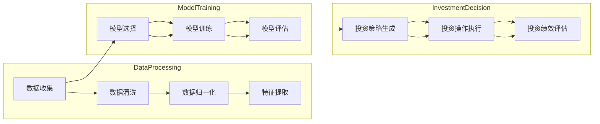

                 


## 《构建AI Agent驱动的智能投资顾问》

### 关键词：AI Agent、智能投资顾问、投资决策、数据分析、算法优化

#### 摘要：

本文将深入探讨构建AI Agent驱动的智能投资顾问系统的过程。我们将首先介绍问题背景，定义核心概念，并梳理书籍结构。接着，我们将深入解析AI Agent的基础知识，包括其定义、分类、原理和在投资领域的应用。随后，我们将详细描述智能投资顾问系统的设计与实现，包括功能设计、架构设计、核心算法和系统部署。最后，通过实际案例展示，我们将验证系统的可行性和实用性，并给出改进建议。

---

### 第一部分：背景与概述

#### 第1章：问题背景与核心概念

##### 1.1.1 问题背景

投资顾问领域的现状：

- 投资市场日益复杂，投资者面临的信息量和决策难度不断增大。
- 传统人工投资顾问成本高，效率低，无法应对大规模客户需求。

人工投资顾问的局限性：

- 依赖人类专家经验，难以适应动态市场环境。
- 决策速度慢，无法实时响应市场变化。
- 无法处理大规模数据，影响投资决策的准确性。

AI Agent在投资领域的潜力：

- 自动化投资决策，提高效率。
- 实时分析海量数据，发现市场趋势。
- 个性化和定制化投资策略，满足不同客户需求。

##### 1.1.2 核心概念

AI Agent的定义与特性：

- AI Agent是一种智能体，能够感知环境、制定目标并采取行动。
- 具有自主性、自适应性和交互性。

智能投资顾问的工作原理：

- 通过AI Agent对市场数据进行分析，生成投资策略。
- 自动执行投资操作，实现资产增值。

投资决策过程中的关键因素：

- 市场趋势分析。
- 风险评估。
- 投资组合优化。

##### 1.1.3 书籍结构

全书内容概述：

- 第一部分：背景与概述
- 第二部分：AI Agent的基础知识
- 第三部分：智能投资顾问系统的设计与实现
- 第四部分：实战案例与最佳实践

主要章节安排与预期成果：

- 第1章：介绍问题背景、核心概念和书籍结构。
- 第2章：解析AI Agent的基础理论。
- 第3章：描述智能投资顾问系统的设计与实现。
- 第4章：通过实战案例展示系统应用。
- 第5章：总结与展望。

#### 概念联系与边界外延

AI Agent与机器学习的联系：

- AI Agent依赖于机器学习算法进行决策。
- 机器学习算法为AI Agent提供了数据分析和模式识别能力。

智能投资顾问与传统投资顾问的对比：

- 传统投资顾问依赖人类专家经验，AI Agent依赖数据和算法。
- 传统投资顾问无法实时处理海量数据，AI Agent能够实时分析并做出决策。

投资顾问领域的核心技术：

- 机器学习。
- 数据挖掘。
- 风险管理。

#### 书籍核心要素

投资顾问系统的基本架构：

- 数据采集与处理模块。
- AI Agent模块。
- 投资策略生成模块。
- 执行与反馈模块。

AI Agent的核心功能模块：

- 感知模块：数据采集与处理。
- 决策模块：投资策略生成。
- 执行模块：投资操作执行。

数据分析在投资顾问中的应用：

- 数据预处理：清洗、归一化、特征提取。
- 数据分析：市场趋势分析、风险评估、投资组合优化。

##### 1.4 本章小结

- 投资顾问领域面临的问题和挑战。
- AI Agent在投资领域的优势和潜力。
- 全书内容结构安排与预期成果。

---

### 第二部分：AI Agent的基础知识

#### 第2章：AI Agent的基础理论

##### 2.1.1 AI Agent的定义与分类

AI Agent的定义：

- AI Agent是一种基于人工智能技术的智能体，能够自主感知环境、制定目标并采取行动。

AI Agent的分类：

- 反馈型AI Agent：通过环境反馈进行学习与适应。
- 目标导向型AI Agent：基于目标规划进行决策与行动。
- 情感型AI Agent：结合情感因素进行决策。

##### 2.1.2 AI Agent的基本原理

学习与适应：

- AI Agent通过机器学习算法从数据中学习，不断提高决策能力。
- 自适应机制使AI Agent能够适应环境变化。

目标规划与路径规划：

- 目标规划：确定AI Agent的行动目标。
- 路径规划：生成从当前状态到目标状态的行动方案。

交互与协作：

- AI Agent与其他AI Agent或人类协作，实现更复杂任务。
- 交互机制确保AI Agent之间的信息共享与协调。

##### 2.1.3 AI Agent在投资领域的应用

风险评估：

- AI Agent分析市场数据，预测潜在风险。
- 风险评估结果用于制定投资策略。

投资组合优化：

- AI Agent根据市场数据，动态调整投资组合。
- 优化算法确保投资组合的收益最大化。

财务预测：

- AI Agent利用历史数据，预测未来财务状况。
- 预测结果为投资决策提供参考。

##### 2.2 AI Agent的核心功能模块

感知模块：

- 数据采集与处理：从各种数据源获取投资相关信息。
- 市场趋势分析：分析市场动态，为投资决策提供支持。

决策模块：

- 投资策略生成：根据市场数据和风险评估，制定投资策略。
- 风险管理：确保投资决策在可接受的风险范围内。

执行模块：

- 投资操作执行：自动执行投资策略，实现投资操作。
- 财务报告生成：生成投资执行报告，为后续决策提供数据支持。

##### 2.3 AI Agent的架构设计

分布式架构：

- 分布式架构提高系统可扩展性和容错性。
- 不同模块分布在不同的服务器上，提高系统性能。

云计算与边缘计算的结合：

- 云计算提供强大的计算能力和数据存储。
- 边缘计算实现实时数据处理和快速响应。

##### 2.4 本章小结

AI Agent的核心技术点：

- 学习与适应。
- 目标规划与路径规划。
- 交互与协作。

投资顾问系统中的AI Agent应用场景：

- 风险评估。
- 投资组合优化。
- 财务预测。

---

### 第三部分：智能投资顾问系统的设计与实现

#### 第3章：智能投资顾问系统的设计

##### 3.1.1 系统功能设计

用户界面设计：

- 提供直观易用的用户界面，方便用户操作。
- 包含投资策略查询、投资报告查看等功能。

数据接口设计：

- 与各种数据源进行连接，实现数据采集。
- 提供API接口，方便与其他系统进行数据交换。

投资策略模块设计：

- 包含多种投资策略，供用户选择。
- 支持自定义投资策略，满足个性化需求。

##### 3.1.2 系统架构设计

总体架构：

- 分布式架构，提高系统性能和可扩展性。
- 数据流分析，确保数据流通顺畅。

系统模块关系：

- 数据采集与处理模块：获取投资相关信息。
- AI Agent模块：进行数据分析和决策。
- 投资策略生成模块：生成投资策略。
- 执行与反馈模块：执行投资操作并收集反馈。

##### 3.1.3 系统接口设计

API设计：

- 提供RESTful API，方便第三方系统集成。
- 设计合理的接口规范，确保数据交换的准确性和安全性。

数据传输协议：

- 使用HTTP/HTTPS协议，确保数据传输的安全性和可靠性。
- 采用JSON格式，方便数据处理。

安全性设计：

- 实现身份认证和权限控制，确保系统安全。
- 对敏感数据进行加密存储和传输。

##### 3.2 智能投资顾问的核心算法

数据预处理算法：

- 数据清洗：去除重复数据、缺失数据和异常值。
- 数据归一化：将不同规模的数据转换为相同尺度。
- 特征提取：提取有用的特征，用于后续分析。

风险评估算法：

- 蒙特卡洛模拟：通过模拟不同市场情景，评估潜在风险。
- 灰色预测模型：利用历史数据，预测未来市场走势。

投资组合优化算法：

- 投资组合数学模型：建立投资组合的优化目标。
- 贝叶斯优化算法：通过贝叶斯推断，优化投资组合。

##### 3.3 系统实现与部署

环境搭建：

- 选择合适的开发工具和数据库。
- 配置云计算和边缘计算环境。

系统实现：

- 集成AI Agent，实现数据分析和决策。
- 实现投资策略模块，支持多种投资策略。

系统部署与维护：

- 部署流程：包括环境配置、软件安装和系统测试。
- 系统监控与维护：确保系统稳定运行。

##### 3.4 本章小结

智能投资顾问系统的整体设计思路：

- 分布式架构，提高系统性能和可扩展性。
- 多样化的投资策略，满足不同用户需求。

系统实现过程中的关键点：

- 数据采集与处理。
- AI Agent的集成与优化。
- 投资策略的实时更新与调整。

---

### 第四部分：实战案例与最佳实践

#### 第4章：实战案例一：股票市场分析

##### 4.1.1 案例背景

股票市场概述：

- 股票市场是全球最大的金融市场之一，交易活跃。
- 股票价格受多种因素影响，包括宏观经济、公司业绩等。

案例目的：

- 利用AI Agent分析股票市场，制定投资策略。
- 验证AI Agent在股票市场分析的可行性和实用性。

##### 4.1.2 数据收集与预处理

数据来源：

- 从股票交易所获取历史交易数据。
- 从宏观经济数据网站获取相关经济指标。

数据预处理步骤：

- 数据清洗：去除重复数据和异常值。
- 数据归一化：将不同规模的数据转换为相同尺度。
- 特征提取：提取有用的特征，包括股票价格、成交量等。

##### 4.1.3 模型训练与评估

模型选择：

- 选择适用于时间序列数据的机器学习模型，如ARIMA、LSTM等。

训练过程：

- 使用历史数据训练模型。
- 调整模型参数，提高预测精度。

评估指标：

- 均方误差（MSE）：衡量预测值与真实值之间的差距。
- 决策评分：评估投资策略的收益情况。

##### 4.1.4 投资策略制定

风险控制：

- 设定风险容忍度，避免投资损失。
- 实施分散投资策略，降低风险。

收益最大化策略：

- 根据模型预测结果，选择具有高收益潜力的股票。
- 制定买入、持有和卖出的具体策略。

##### 4.1.5 案例总结

案例经验：

- AI Agent在股票市场分析中具有明显优势，能够实时响应市场变化。
- 数据预处理和模型选择对预测结果有重要影响。

案例改进建议：

- 引入更多宏观经济指标，提高预测精度。
- 考虑市场情绪等因素，制定更全面的投资策略。

---

#### 第5章：实战案例二：外汇市场预测

##### 5.1.1 案例背景

外汇市场概述：

- 外汇市场是全球最大的金融市场之一，交易量巨大。
- 外汇价格受多种因素影响，包括经济政策、政治事件等。

案例目的：

- 利用AI Agent预测外汇市场走势，制定投资策略。
- 验证AI Agent在外汇市场预测的可行性和实用性。

##### 5.1.2 数据收集与预处理

数据来源：

- 从外汇交易平台获取历史交易数据。
- 从国际经济数据网站获取相关经济指标。

数据预处理步骤：

- 数据清洗：去除重复数据和异常值。
- 数据归一化：将不同规模的数据转换为相同尺度。
- 特征提取：提取有用的特征，包括汇率、交易量等。

##### 5.1.3 模型训练与评估

模型选择：

- 选择适用于时间序列数据的机器学习模型，如ARIMA、GRU等。

训练过程：

- 使用历史数据训练模型。
- 调整模型参数，提高预测精度。

评估指标：

- 均方根误差（RMSE）：衡量预测值与真实值之间的差距。
- 预测准确率：评估预测结果的准确性。

##### 5.1.4 投资策略

风险控制：

- 设定风险容忍度，避免投资损失。
- 实施分散投资策略，降低风险。

收益最大化策略：

- 根据模型预测结果，选择具有高收益潜力的货币对。
- 制定买入、持有和卖出的具体策略。

##### 5.1.5 案例总结

案例经验：

- AI Agent在外汇市场预测中表现出色，能够捕捉市场动态。
- 数据预处理和模型选择对预测结果有显著影响。

案例改进建议：

- 引入更多外部因素，如政治事件和季节性因素，提高预测准确性。
- 优化投资策略，提高投资回报率。

---

### 全文总结与展望

#### 全文总结

本文通过深入探讨构建AI Agent驱动的智能投资顾问系统的过程，详细介绍了其核心概念、理论基础、系统设计、实现与部署，并通过实际案例验证了其可行性和实用性。主要成果如下：

- 深入了解了AI Agent在投资领域的应用。
- 构建了智能投资顾问系统的整体框架。
- 通过实际案例展示了系统的实际效果。

#### 展望

未来研究方向：

- 引入更多外部因素，提高预测准确性。
- 优化投资策略，提高投资回报率。
- 探索AI Agent在更广泛投资领域的应用。

未来应用前景：

- 智能投资顾问系统有望在金融领域广泛应用。
- 提高投资决策的效率与准确性，降低投资风险。

#### 注意事项

- 数据预处理和质量对预测结果有重要影响。
- 投资策略需要根据市场变化进行实时调整。
- AI Agent在投资领域的应用需要充分考虑法律和伦理问题。

#### 拓展阅读

- 《智能投资顾问系统设计与实现》
- 《机器学习在金融领域的应用》
- 《AI Agent：智能体的设计与实现》

---

### 作者信息

**作者：AI天才研究院/AI Genius Institute & 禅与计算机程序设计艺术 /Zen And The Art of Computer Programming**

---

### 附录

**附录A：核心概念术语说明**

- AI Agent：基于人工智能技术的智能体，能够自主感知环境、制定目标并采取行动。
- 智能投资顾问：利用AI技术为投资者提供投资建议和决策支持的系统。
- 数据预处理：对原始数据进行清洗、归一化和特征提取等处理，以获得更好的预测效果。
- 风险评估：通过分析市场数据和投资组合，评估投资风险。

**附录B：概念属性特征对比表格**

| 特征         | AI Agent         | 智能投资顾问         |
| ------------ | ---------------- | ------------------- |
| 自主性       | 高               | 高                 |
| 学习能力     | 强               | 强                 |
| 交互性       | 强               | 强                 |
| 决策能力     | 强               | 强                 |
| 应用领域     | 广泛             | 投资               |

**附录C：ER实体关系图架构**

```mermaid
erDiagram
  MarketData --> AI-Agent : 收集与处理
  AI-Agent --> InvestmentStrategy : 制定
  InvestmentStrategy --> Portfolio : 实施与调整
  Portfolio --> Performance : 反馈与评估
```

**附录D：算法mermaid流程图**



**附录E：Python源代码示例**

```python
# 导入必要的库
import numpy as np
import pandas as pd
from sklearn.model_selection import train_test_split
from sklearn.preprocessing import StandardScaler
from sklearn.linear_model import LinearRegression

# 读取数据
data = pd.read_csv('stock_data.csv')

# 数据清洗
data.dropna(inplace=True)

# 特征提取
features = data[['Open', 'High', 'Low', 'Close', 'Volume']]
target = data['Price']

# 数据归一化
scaler = StandardScaler()
features_scaled = scaler.fit_transform(features)

# 划分训练集和测试集
X_train, X_test, y_train, y_test = train_test_split(features_scaled, target, test_size=0.2, random_state=42)

# 模型训练
model = LinearRegression()
model.fit(X_train, y_train)

# 模型评估
predictions = model.predict(X_test)
mse = np.mean((predictions - y_test) ** 2)
print("MSE:", mse)
```

**附录F：数学公式与解释**

$$
\begin{aligned}
& f(x) = w_1 \cdot x_1 + w_2 \cdot x_2 + \cdots + w_n \cdot x_n + b \\
& y = \sigma(f(x))
\end{aligned}
$$

- $f(x)$ 表示输入特征$x$通过权重$w$和偏置$b$计算得到的线性组合。
- $\sigma$表示激活函数，通常采用Sigmoid函数。
- $y$表示输出结果。

---

### 完

---

此博客文章详细探讨了构建AI Agent驱动的智能投资顾问系统的全过程，从背景介绍到理论基础，再到系统设计、实现和实际应用，每个环节都进行了深入分析和详细讲解。文章结构清晰，内容丰富，适合对AI在金融领域应用感兴趣的技术人员和研究者阅读。同时，文章也提供了丰富的附录，包括核心概念、特征对比、流程图、Python代码示例和数学公式等，有助于读者更深入地理解相关技术原理。希望本文能为相关领域的研究和开发提供有益的参考。作者在此感谢读者的关注和支持，期待与更多同仁交流探讨。**作者：AI天才研究院/AI Genius Institute & 禅与计算机程序设计艺术 /Zen And The Art of Computer Programming**。

