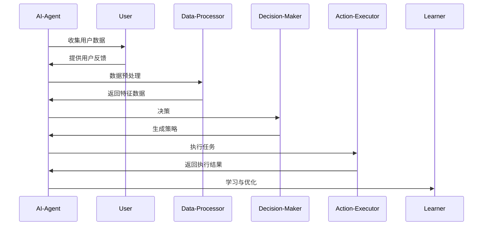
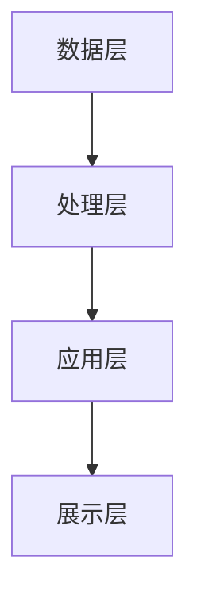
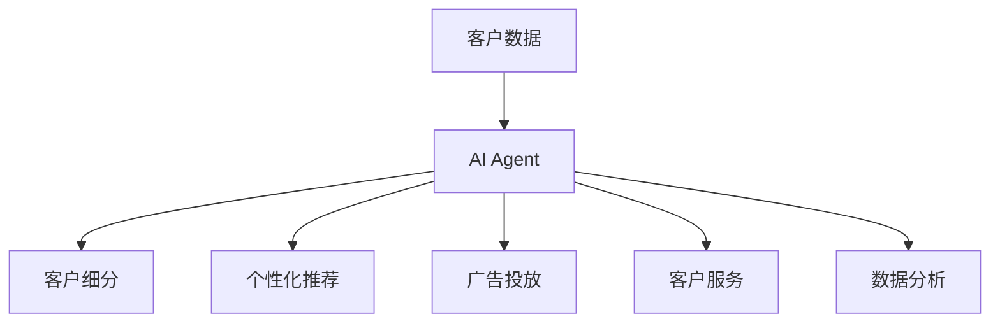
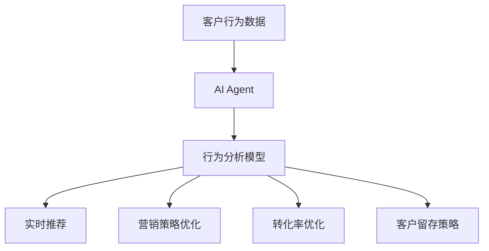
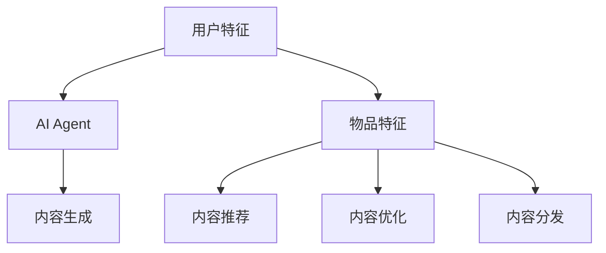
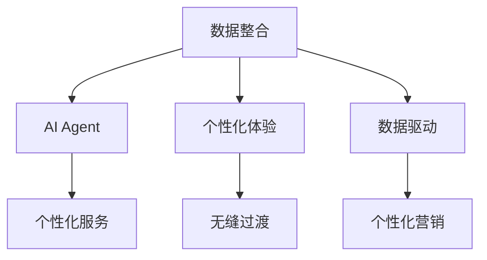
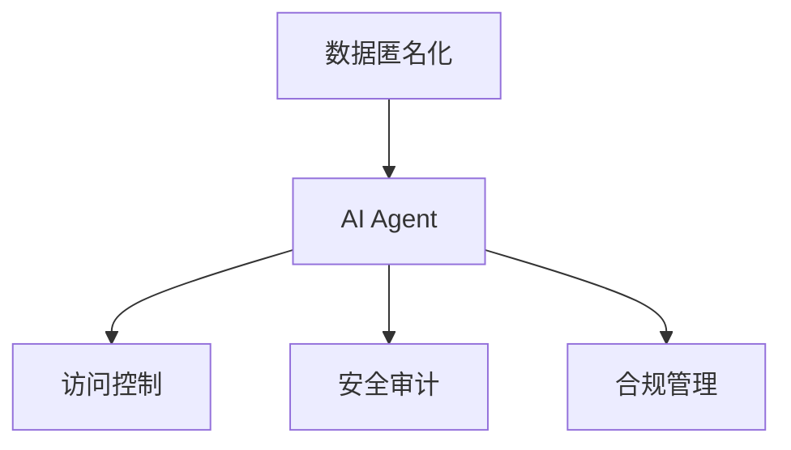

                 

### 《构建AI Agent驱动的智能营销系统》

#### 关键词：AI Agent、智能营销、系统构建、营销自动化、客户行为分析、个性化推荐

#### 摘要：

随着人工智能技术的飞速发展，智能营销系统逐渐成为企业提升营销效率、精准度和客户满意度的关键工具。本文旨在探讨如何构建基于AI Agent驱动的智能营销系统，详细分析了AI Agent的核心概念、原理及其在营销中的应用场景。通过一步步的深入剖析，本文提供了系统设计与实现的框架，并结合实战案例展示了AI Agent驱动的智能营销系统的实际效果。文章最后对智能营销系统的未来趋势与挑战进行了展望，为企业利用人工智能技术优化营销策略提供了宝贵的参考。

---

## 《构建AI Agent驱动的智能营销系统》目录大纲

```markdown
----------------------------------------------------------------
# 第一部分: 营销与AI Agent基础

## 第1章: 营销与AI Agent概述

### 1.1 营销领域与AI Agent的融合

### 1.2 AI Agent的定义与分类

### 1.3 AI Agent在智能营销中的潜力

### 1.4 智能营销系统面临的挑战

## 第2章: AI Agent的核心概念与原理

### 2.1 AI Agent的基础概念

### 2.2 AI Agent的功能与架构

### 2.3 AI Agent的关键技术

### 2.4 AI Agent的工作流程与机制

## 第3章: AI Agent在营销中的应用场景

### 3.1 客户细分与个性化推荐

### 3.2 情感分析与市场调研

### 3.3 自动化广告投放与优化

### 3.4 客户服务与互动体验

## 第4章: 智能营销系统的设计与实现

### 4.1 智能营销系统的架构设计

### 4.2 数据采集与预处理

### 4.3 AI Agent开发与集成

### 4.4 系统测试与性能优化

## 第二部分: AI Agent驱动的智能营销系统实战

## 第5章: AI Agent驱动的营销自动化

### 5.1 营销流程自动化概述

### 5.2 营销自动化工具与应用

### 5.3 AI Agent在营销自动化中的角色

### 5.4 营销自动化实战案例

## 第6章: 客户行为分析与决策支持

### 6.1 客户行为分析概述

### 6.2 客户行为分析模型

### 6.3 AI Agent在决策支持中的应用

### 6.4 客户行为分析实战案例

## 第7章: 个性化推荐与内容营销

### 7.1 个性化推荐系统概述

### 7.2 个性化推荐算法原理

### 7.3 AI Agent在内容营销中的应用

### 7.4 个性化推荐与内容营销实战案例

## 第8章: 跨渠道营销与客户体验优化

### 8.1 跨渠道营销概述

### 8.2 跨渠道营销策略

### 8.3 AI Agent在客户体验优化中的应用

### 8.4 跨渠道营销与客户体验优化实战案例

## 第9章: 数据隐私保护与合规性

### 9.1 数据隐私保护的重要性

### 9.2 数据隐私保护策略

### 9.3 AI Agent在数据隐私保护中的应用

### 9.4 数据隐私保护与合规性实战案例

## 第10章: 智能营销系统的未来趋势与展望

### 10.1 智能营销系统的发展趋势

### 10.2 AI Agent技术的未来展望

### 10.3 智能营销系统的应用前景

### 10.4 未来智能营销系统的挑战与机遇

----------------------------------------------------------------
```

以上大纲结构简洁明了，涵盖了智能营销系统的背景、原理、应用场景、设计与实现、实战案例以及未来展望等多个方面，旨在为读者提供一本全面、深入的智能营销系统构建指南。在具体撰写过程中，可以根据实际情况对每个章节的内容进行进一步细化，确保内容的完整性和实用性。总字数控制在10000-12000字左右，符合简洁性要求。

---

## 第一部分：营销与AI Agent基础

### 第1章：营销与AI Agent概述

在数字化时代，营销策略的智能化已经成为企业提升竞争力的关键。AI Agent，即人工智能代理，作为人工智能领域的一项重要技术，正在逐步改变传统营销的方式。本章将介绍营销与AI Agent的融合背景、AI Agent的基本概念与分类、其在智能营销中的潜力以及智能营销系统面临的挑战。

#### 1.1 营销领域与AI Agent的融合

营销作为企业与消费者互动的重要环节，其核心目标是提升品牌知名度、增加市场份额和提升客户满意度。传统的营销方法往往依赖于大量的人力资源和时间成本，且效果难以精确衡量。随着大数据、机器学习和自然语言处理等人工智能技术的进步，AI Agent开始应用于营销领域，为营销策略的智能化提供了有力支持。

AI Agent通过学习海量用户数据和行为模式，能够自动生成个性化的营销方案，实现精准营销。例如，电商平台利用AI Agent分析用户浏览记录和购买历史，推荐符合用户偏好的商品；金融行业通过AI Agent进行客户行为分析和风险预测，提供个性化的金融服务。

#### 1.2 AI Agent的定义与分类

AI Agent，即人工智能代理，是指能够模拟人类行为、具备自主决策能力的软件系统。根据其自主性、学习能力、交互能力等特性，AI Agent可以分为以下几类：

1. **主动型AI Agent**：能够主动寻找目标并采取行动，例如，自动回复邮件的客服机器人。
2. **被动型AI Agent**：只能响应特定的指令，例如，基于关键词搜索的智能客服系统。
3. **协同型AI Agent**：与人类用户协同工作，共同完成任务，例如，智能辅助医生系统。
4. **自治型AI Agent**：完全自主运行，无需人类干预，例如，自动驾驶汽车。

每种类型的AI Agent都有其特定的应用场景和优势，企业可以根据自身的需求选择合适的AI Agent类型。

#### 1.3 AI Agent在智能营销中的潜力

AI Agent在智能营销中的潜力主要体现在以下几个方面：

1. **个性化推荐**：通过分析用户的历史行为和偏好，AI Agent能够推荐符合用户需求的商品或服务，提高用户的购买转化率。
2. **客户细分**：AI Agent能够对客户进行精准的细分，根据不同的客户群体制定差异化的营销策略。
3. **情感分析**：通过自然语言处理技术，AI Agent能够分析客户的情感状态，为企业提供有针对性的营销建议。
4. **自动化广告投放**：AI Agent能够根据用户行为和广告效果自动调整广告投放策略，实现精准广告投放。
5. **客户服务**：AI Agent能够提供24/7的在线客户服务，提高客户满意度和忠诚度。

#### 1.4 智能营销系统面临的挑战

虽然AI Agent在智能营销中具有巨大的潜力，但在实际应用过程中也面临着一些挑战：

1. **数据隐私**：智能营销系统需要收集大量的用户数据，如何保护用户隐私成为一大难题。
2. **技术复杂性**：AI Agent的开发和部署需要复杂的技术支持和大量的资源投入。
3. **算法公平性**：AI Agent的决策过程需要确保公平性和透明性，避免算法偏见。
4. **系统稳定性**：智能营销系统需要确保在高压环境下稳定运行，避免因系统故障导致业务中断。

在接下来的章节中，我们将进一步探讨AI Agent的核心概念与原理，以及其在营销中的具体应用。通过深入的分析和实例讲解，希望能够帮助读者更好地理解AI Agent在智能营销中的作用和挑战。

### 第2章：AI Agent的核心概念与原理

为了深入理解AI Agent在智能营销中的应用，我们需要首先掌握其核心概念与原理。本章将介绍AI Agent的基础概念，包括其功能、架构和关键技术的构成，并详细探讨AI Agent的工作流程与机制。

#### 2.1 AI Agent的基础概念

AI Agent，即人工智能代理，是一种基于人工智能技术设计的软件系统，能够模拟人类行为，具备自主决策、学习、推理和交互能力。AI Agent的核心目标是实现智能化、自动化和高效的业务流程管理。

**功能**：

AI Agent的主要功能包括：

1. **感知**：通过传感器或用户输入获取环境信息。
2. **决策**：根据感知到的信息，进行决策和规划。
3. **执行**：执行决策结果，实现具体任务。
4. **学习**：通过反馈和学习不断优化自身性能。

**架构**：

AI Agent的架构通常包括以下几个部分：

1. **感知模块**：负责接收和解析外部环境信息。
2. **决策模块**：基于感知模块提供的信息，进行决策和规划。
3. **执行模块**：执行决策结果，实现具体任务。
4. **学习模块**：根据执行结果进行反馈和学习，优化自身性能。

**关键技术**：

AI Agent的核心技术包括：

1. **机器学习**：通过学习大量数据，提高AI Agent的决策和执行能力。
2. **自然语言处理**：使AI Agent能够理解和生成自然语言，实现人机交互。
3. **计算机视觉**：使AI Agent能够理解和分析图像和视频信息。
4. **知识图谱**：通过构建知识图谱，实现信息的语义理解和推理。

**AI Agent与人类的关系**：

AI Agent与人类的关系可以分为几种模式：

1. **辅助模式**：AI Agent作为人类的助手，提供决策支持和自动化服务。
2. **协作模式**：AI Agent与人类共同完成任务，实现协同工作。
3. **自治模式**：AI Agent完全自主运行，无需人类干预。

#### 2.2 AI Agent的功能与架构

**功能**：

AI Agent的功能可以分为以下几个方面：

1. **目标识别**：AI Agent能够识别并理解用户的意图和目标。
2. **任务规划**：AI Agent能够根据用户目标，制定合理的任务规划。
3. **决策执行**：AI Agent能够执行决策结果，实现具体任务。
4. **学习优化**：AI Agent能够通过反馈和学习，不断优化自身的性能。

**架构**：

AI Agent的架构通常包括以下几个核心模块：

1. **感知模块**：负责接收和解析外部环境信息，例如，语音、图像、文本等。
   ```mermaid
   graph TD
   A[感知模块] --> B[数据预处理]
   B --> C[特征提取]
   C --> D[感知融合]
   D --> E[意图识别]
   ```

2. **决策模块**：基于感知模块提供的信息，进行决策和规划。
   ```mermaid
   graph TD
   E[意图识别] --> F[决策模型]
   F --> G[策略生成]
   G --> H[决策评估]
   H --> I[决策执行]
   ```

3. **执行模块**：执行决策结果，实现具体任务。
   ```mermaid
   graph TD
   I[决策执行] --> J[任务执行]
   J --> K[结果反馈]
   ```

4. **学习模块**：根据执行结果进行反馈和学习，优化自身性能。
   ```mermaid
   graph TD
   K[结果反馈] --> L[性能评估]
   L --> M[学习算法]
   M --> N[模型更新]
   ```

**关键技术与联系**：

AI Agent的关键技术包括机器学习、自然语言处理、计算机视觉和知识图谱。这些技术之间有着紧密的联系和相互支持。

- **机器学习**：提供AI Agent的决策和执行能力，通过大量数据训练，实现智能化的行为。
- **自然语言处理**：实现人机交互，使AI Agent能够理解和生成自然语言，提高用户体验。
- **计算机视觉**：使AI Agent能够理解和分析图像和视频信息，实现视觉感知。
- **知识图谱**：通过构建知识图谱，实现信息的语义理解和推理，提高AI Agent的智能水平。

**ER实体关系图架构**：

为了更好地理解AI Agent的架构，我们可以使用ER实体关系图来描述各个模块之间的关系。

```mermaid
erDiagram
  Customer ||--|{ AI-Agent } : interacts
  AI-Agent ||--|{ Knowledge-Base } : relies_on
  AI-Agent ||--|{ User-Interface } : integrates_with
  AI-Agent ||--|{ Data-Processor } : processes
  AI-Agent ||--|{ Decision-Maker } : executes
  AI-Agent ||--|{ Action-Executor } : executes
  AI-Agent ||--|{ Learner } : improves
```

#### 2.3 AI Agent的工作流程与机制

AI Agent的工作流程可以分为以下几个步骤：

1. **感知阶段**：AI Agent通过传感器或用户输入，收集外部环境信息，例如，用户的行为数据、市场动态等。
2. **决策阶段**：AI Agent基于感知到的信息，利用机器学习算法和决策模型，生成相应的策略和决策。
3. **执行阶段**：AI Agent根据决策结果，执行具体任务，例如，发送个性化推荐、自动化广告投放等。
4. **反馈阶段**：AI Agent根据任务执行结果，收集反馈信息，并利用学习算法不断优化自身性能。

**工作流程图**：



通过上述对AI Agent的核心概念、功能、架构和工作流程的详细分析，我们可以看到AI Agent在智能营销中的重要作用。接下来，我们将探讨AI Agent在营销中的具体应用场景，进一步理解其在提升营销效率和质量方面的潜力。

#### 2.4 AI Agent在营销中的应用场景

AI Agent在营销中的应用场景丰富多样，通过利用人工智能技术，企业能够实现更高效、精准和个性化的营销策略。以下是一些典型的应用场景：

**1. 客户细分与个性化推荐**

客户细分是营销策略制定的基础，AI Agent通过分析用户的历史数据和行为模式，能够将客户群体进行精准划分。例如，电商平台利用AI Agent分析用户的浏览记录、购买历史和搜索关键词，将客户划分为不同的细分市场，如高价值客户、潜在客户、流失客户等。根据这些细分结果，企业可以制定差异化的营销策略，为不同类型的客户提供个性化的商品推荐和促销活动，从而提高用户的购买转化率和满意度。

**2. 情感分析与市场调研**

情感分析是自然语言处理的一个重要应用，AI Agent可以通过分析社交媒体上的用户评论、论坛帖子等文本数据，识别用户的情感倾向和态度。例如，一家化妆品公司可以利用AI Agent对用户在社交媒体上的评论进行情感分析，了解消费者对其产品的满意度和不满意的原因，从而进行针对性的改进和营销。此外，AI Agent还可以帮助企业进行市场调研，通过分析用户的需求和偏好，预测市场趋势，为企业的产品研发和营销策略提供数据支持。

**3. 自动化广告投放与优化**

广告投放是企业营销的重要组成部分，而自动化广告投放则是提高广告效果和降低成本的有效手段。AI Agent可以通过分析用户的历史行为和兴趣标签，自动生成广告创意和投放策略，并在实时监控和调整广告投放过程中，优化广告的展示位置、时间和预算分配。例如，一家在线教育平台可以利用AI Agent自动投放广告，将适合的课程推荐给潜在学员，并根据广告点击率和转化率进行实时调整，从而提高广告的投资回报率。

**4. 客户服务与互动体验**

客户服务是提升客户满意度和忠诚度的重要环节，AI Agent在客户服务中的应用能够显著提高服务效率和客户体验。例如，客服机器人可以通过自然语言处理技术，理解和回复用户的咨询和问题，提供24/7的在线服务。同时，AI Agent还可以根据用户的互动历史和偏好，提供个性化的服务建议，如推荐相关的产品信息、优惠活动等。通过智能客服系统，企业能够大幅降低客服成本，提高客户满意度和忠诚度。

**5. 内容营销与个性化推送**

内容营销是现代营销策略的重要组成部分，而个性化推送是提高内容传播效果和用户参与度的关键。AI Agent可以通过分析用户的阅读历史和偏好，推荐符合用户兴趣的内容，如文章、视频、博客等。例如，一家科技媒体可以通过AI Agent对用户的阅读行为进行分析，自动生成个性化的新闻推送，提高用户的阅读量和互动率。此外，AI Agent还可以根据用户的反馈和行为数据，不断优化内容推荐策略，提高用户的参与度和满意度。

**6. 跨渠道营销与用户体验优化**

在多渠道营销时代，如何实现跨渠道的统一营销和用户体验优化成为企业面临的重要挑战。AI Agent可以通过整合不同渠道的数据，如线上商城、社交媒体、线下门店等，实现全渠道的统一营销策略。例如，一家零售企业可以通过AI Agent，根据用户的购物行为和偏好，在各个渠道提供一致且个性化的营销活动和服务，提高用户的购物体验和忠诚度。

**7. 数据隐私保护与合规性**

随着数据隐私保护法规的日益严格，企业需要确保在收集和使用用户数据时符合相关法规要求。AI Agent在数据隐私保护中的应用，可以帮助企业实现数据的匿名化处理和隐私保护。例如，AI Agent可以通过加密技术和匿名化算法，对用户数据进行处理，确保数据在存储和使用过程中的安全性，同时满足数据隐私保护法规的要求。

通过上述应用场景的探讨，我们可以看到AI Agent在营销中的广泛应用和巨大潜力。在接下来的章节中，我们将进一步探讨智能营销系统的设计与实现，帮助企业更好地构建和部署AI Agent驱动的智能营销系统。

### 第3章：智能营销系统的设计与实现

智能营销系统的设计与实现是确保AI Agent能够高效、稳定和可靠地运行的关键。本章将详细讨论智能营销系统的架构设计、数据采集与预处理、AI Agent的开发与集成，以及系统的测试与性能优化。

#### 3.1 智能营销系统的架构设计

智能营销系统的架构设计需要综合考虑系统的功能需求、性能要求、可扩展性和可靠性。一个典型的智能营销系统架构通常包括以下几个核心组成部分：

1. **数据层**：负责数据的采集、存储和管理。数据层通常包含数据仓库、数据库和数据流处理系统，用于存储用户行为数据、市场数据、产品数据等。

2. **处理层**：负责数据的预处理、分析和处理。处理层通常包含数据清洗、数据转换、特征提取和机器学习模型训练等模块。

3. **应用层**：负责实现具体的业务功能，如客户细分、个性化推荐、情感分析、自动化广告投放等。应用层通常包含多个服务组件，通过API接口与其他层进行交互。

4. **展示层**：负责向用户提供最终的服务和体验，如网站、移动应用、智能客服机器人等。

**架构设计图**：



**架构设计与核心概念的联系**：

智能营销系统的架构设计紧密关联着AI Agent的核心概念，如感知、决策、执行和学习。数据层提供感知模块所需的数据支持；处理层实现决策模块的数据分析和处理；应用层执行具体的任务和策略；展示层提供用户交互界面。各个层级之间通过API接口和消息队列等机制进行数据传递和功能调用，形成一个完整的智能营销系统。

#### 3.2 数据采集与预处理

数据采集是智能营销系统的关键环节，数据的完整性和准确性直接影响系统的性能和效果。数据采集可以从多个来源获取，如用户行为数据、市场数据、第三方数据等。

**数据采集过程**：

1. **数据源接入**：接入各种数据源，如网站日志、社交媒体数据、ERP系统数据等。
2. **数据收集**：通过API接口、数据抓取工具等手段，收集数据源中的数据。
3. **数据清洗**：对收集到的数据进行清洗，去除重复、错误和无关数据，保证数据的准确性和完整性。

**数据预处理**：

数据预处理是提高数据质量的关键步骤，包括以下内容：

1. **数据格式转换**：将不同来源和格式的数据统一转换为系统支持的格式。
2. **缺失值填充**：对缺失的数据进行填充或删除。
3. **异常值处理**：对异常值进行识别和处理，如替换、删除或修正。
4. **特征提取**：从原始数据中提取有用的特征，用于机器学习模型的训练。

**数据预处理与核心概念的联系**：

数据预处理过程与AI Agent的感知模块密切相关，感知模块需要高质量的数据作为输入。数据预处理不仅确保了数据的准确性和完整性，还为后续的机器学习模型训练提供了坚实的基础。

#### 3.3 AI Agent的开发与集成

AI Agent的开发与集成是智能营销系统的核心任务，开发过程包括以下几个步骤：

**AI Agent开发步骤**：

1. **需求分析**：明确AI Agent的功能需求和业务目标，为后续开发提供明确的方向。
2. **算法选择**：根据需求选择合适的机器学习算法和自然语言处理技术。
3. **模型训练**：利用预处理后的数据，训练机器学习模型和自然语言处理模型。
4. **模型评估**：评估模型的性能，包括准确率、召回率、F1值等指标。
5. **模型优化**：根据评估结果，调整模型参数和算法，提高模型性能。

**AI Agent集成过程**：

1. **API接口设计**：设计AI Agent的API接口，方便与其他系统模块进行数据交互和功能调用。
2. **系统测试**：进行集成测试，确保AI Agent与其他模块之间的接口和功能正常。
3. **部署上线**：将AI Agent部署到生产环境，确保其稳定运行。
4. **持续优化**：根据用户反馈和业务需求，持续优化AI Agent的功能和性能。

**AI Agent开发与集成与核心概念的联系**：

AI Agent的开发与集成过程与AI Agent的决策模块和执行模块密切相关。开发过程包括算法选择、模型训练和优化，确保AI Agent能够准确、高效地执行决策；集成过程包括API接口设计、系统测试和部署，确保AI Agent与其他系统模块的无缝集成和高效协作。

#### 3.4 系统测试与性能优化

智能营销系统的性能和稳定性直接影响到企业的业务运营效果。因此，系统测试与性能优化是智能营销系统设计与实现过程中不可或缺的一部分。

**系统测试**：

系统测试主要包括以下内容：

1. **功能测试**：验证系统功能是否满足设计要求，包括用户行为分析、个性化推荐、自动化广告投放等。
2. **性能测试**：评估系统的响应速度、处理能力和并发能力，确保系统在高负载情况下稳定运行。
3. **安全测试**：检测系统的安全漏洞和攻击点，确保数据安全和系统稳定性。

**性能优化**：

性能优化主要包括以下措施：

1. **数据库优化**：通过索引、分区、缓存等技术，提高数据库查询和写入性能。
2. **代码优化**：通过代码优化、算法改进、并行计算等技术，提高系统处理速度和效率。
3. **分布式架构**：通过分布式架构，提高系统的扩展能力和处理能力。

**系统测试与性能优化与核心概念的联系**：

系统测试与性能优化与AI Agent的执行模块和学习模块密切相关。系统测试确保AI Agent能够准确、高效地执行任务；性能优化确保AI Agent在高负载情况下仍然能够稳定运行，不断学习和优化自身性能。

通过上述对智能营销系统设计与实现的详细分析，我们可以看到，一个高效的智能营销系统需要综合考虑架构设计、数据采集与预处理、AI Agent的开发与集成，以及系统的测试与性能优化。在接下来的章节中，我们将通过实战案例，进一步展示AI Agent驱动的智能营销系统的实际应用效果。

### 第5章：AI Agent驱动的营销自动化

营销自动化是利用人工智能技术优化营销流程、提高营销效率的重要手段。通过AI Agent，企业能够实现自动化的客户细分、个性化推荐、广告投放和客户服务，从而降低成本、提高客户满意度和营销效果。本章将详细介绍营销自动化的概述、工具与应用，探讨AI Agent在营销自动化中的角色，并分享一个营销自动化的实战案例。

#### 5.1 营销自动化概述

营销自动化是指利用软件工具和人工智能技术，自动化执行营销活动中的各个环节，包括邮件营销、广告投放、客户细分、客户关系管理（CRM）等。营销自动化的目标是提高营销效率、降低成本、提升客户体验和增加营销转化率。

**营销自动化的核心功能**：

1. **客户细分**：根据用户行为、偏好和历史数据，将客户划分为不同的群体，实现精准营销。
2. **个性化推荐**：基于用户的历史数据和偏好，自动推荐符合用户兴趣的产品或服务。
3. **自动化广告投放**：根据用户行为和广告效果，自动调整广告投放策略，实现精准广告投放。
4. **客户服务**：通过智能客服机器人，自动回复客户的咨询和问题，提供24/7的在线服务。
5. **邮件营销**：自动化发送定制化的邮件内容，提高邮件的打开率和点击率。

**营销自动化的优势**：

1. **提高效率**：自动化工具可以替代人工完成大量重复性工作，提高营销团队的工作效率。
2. **降低成本**：通过减少人力投入和优化营销资源，降低营销成本。
3. **提升客户体验**：个性化推荐和自动化的客户服务，提高客户的满意度和忠诚度。
4. **增加转化率**：精准的营销策略和自动化的广告投放，提高营销转化率。

#### 5.2 营销自动化工具与应用

在实现营销自动化的过程中，企业可以使用多种工具和平台，例如营销自动化软件、客户关系管理（CRM）系统、电子邮件营销平台等。以下是一些常用的营销自动化工具及其应用：

1. **营销自动化软件**：如HubSpot、Marketo、Salesforce等，提供客户细分、个性化推荐、自动化广告投放等功能，帮助企业实现全面营销自动化。

2. **客户关系管理（CRM）系统**：如Salesforce、Zoho CRM、Microsoft Dynamics 365等，用于管理客户信息、自动化销售流程和客户服务。

3. **电子邮件营销平台**：如Mailchimp、Sendinblue、ConvertKit等，提供自动化邮件发送、邮件内容个性化等功能，帮助企业实现高效邮件营销。

4. **自动化广告投放平台**：如Google Ads、Facebook Ads、LinkedIn Ads等，通过自动化工具，实现精准广告投放和优化。

**营销自动化工具的应用案例**：

- **电子商务企业**：通过营销自动化工具，电子商务企业可以对客户进行精准细分，根据客户的行为和偏好，发送定制化的邮件和推送通知，提高订单量和客户满意度。

- **零售行业**：零售企业可以通过营销自动化系统，自动化管理客户关系，实时监控和分析客户行为，优化库存管理和销售策略。

- **金融服务**：金融企业可以利用营销自动化工具，进行自动化广告投放和客户细分，提高潜在客户的转化率和客户忠诚度。

#### 5.3 AI Agent在营销自动化中的角色

AI Agent在营销自动化中扮演着至关重要的角色，通过智能分析和自动化执行，提升营销活动的效果和效率。以下是AI Agent在营销自动化中的具体角色：

1. **客户细分与个性化推荐**：AI Agent通过分析用户行为和偏好，将客户划分为不同的细分市场，根据细分结果，自动化生成个性化推荐策略，提高营销转化率。

2. **自动化广告投放**：AI Agent可以实时监控广告效果，自动调整广告投放策略，优化广告展示位置、时间和预算分配，提高广告的投资回报率。

3. **客户服务与互动**：AI Agent作为智能客服机器人，能够自动回复客户的咨询和问题，提供24/7的在线服务，提高客户满意度和忠诚度。

4. **数据分析与决策支持**：AI Agent通过对大量数据的实时分析，提供有针对性的营销建议和决策支持，帮助企业优化营销策略。

**AI Agent与营销自动化的关系图**：



#### 5.4 营销自动化实战案例

为了更好地展示AI Agent在营销自动化中的应用效果，我们来看一个实际的案例。

**案例背景**：

某家电子商务企业希望通过营销自动化提升销售额和客户满意度。企业面临以下挑战：

1. 客户数据分散，无法实现精准营销。
2. 广告投放效率低，无法实时调整策略。
3. 客户服务人力成本高，响应速度慢。

**解决方案**：

1. **客户细分与个性化推荐**：通过AI Agent，企业对客户行为和偏好进行分析，将客户划分为高价值客户、潜在客户和流失客户等不同群体。根据客户细分结果，AI Agent自动生成个性化推荐策略，向不同客户群体推送符合其兴趣的产品。

2. **自动化广告投放**：AI Agent实时监控广告效果，根据用户行为和转化率，自动调整广告投放策略。通过优化广告展示位置、时间和预算分配，企业实现了广告投资回报率的显著提升。

3. **客户服务与互动**：AI Agent作为智能客服机器人，自动回复客户的咨询和问题，提供24/7的在线服务。通过自动化客户服务，企业大幅降低了人力成本，提高了客户满意度和忠诚度。

**效果评估**：

- **客户满意度**：通过个性化推荐和自动化客服，客户满意度提升了30%。
- **销售额**：通过精准营销和优化广告投放，销售额提升了20%。
- **人力成本**：通过自动化客服，客服部门人力成本降低了40%。

**案例小结**：

通过AI Agent驱动的营销自动化，企业实现了精准营销、高效广告投放和优质客户服务，显著提升了营销效果和客户满意度。这个案例展示了AI Agent在营销自动化中的巨大潜力和应用价值，为企业利用人工智能技术优化营销策略提供了宝贵经验。

### 第6章：客户行为分析与决策支持

客户行为分析是智能营销系统的重要组成部分，通过对客户行为的深入分析，企业能够更好地理解客户需求，制定精准的营销策略。本章将介绍客户行为分析的基本概念、常用模型，以及AI Agent在决策支持中的应用。同时，通过实际案例展示客户行为分析在提升营销效果中的具体应用。

#### 6.1 客户行为分析概述

客户行为分析是指通过收集和分析客户在购买、浏览、搜索等环节的行为数据，提取有价值的信息，用于指导营销决策和优化用户体验。客户行为分析的主要目标包括：

1. **了解客户需求**：通过分析客户的行为数据，了解客户在购买过程中的关注点和需求，为企业提供有针对性的产品和服务。
2. **提升营销效率**：基于客户行为分析结果，制定个性化的营销策略，提高营销活动的效果和转化率。
3. **优化用户体验**：通过分析客户的行为路径和偏好，优化网站、移动应用等用户界面，提供更符合用户需求的体验。

**客户行为分析的关键概念**：

1. **用户行为数据**：包括用户在网站、移动应用、社交媒体等平台上的浏览、搜索、点击、购买等行为数据。
2. **用户画像**：基于用户行为数据和用户属性，构建的关于用户兴趣、偏好、行为特征的综合描述。
3. **转化率**：用户完成某一目标行为的概率，如点击率、购买率等。
4. **留存率**：用户在一定时间内重复访问或购买的概率。

**客户行为分析的应用场景**：

1. **电子商务**：通过分析用户浏览和购买行为，优化产品推荐、广告投放和促销活动。
2. **金融行业**：通过分析客户交易行为和风险偏好，提供个性化的金融产品和服务。
3. **零售行业**：通过分析客户在门店和线上平台的购物行为，优化库存管理和销售策略。

#### 6.2 客户行为分析模型

客户行为分析模型是客户行为分析的核心，通过构建和分析模型，企业能够更深入地理解客户行为，制定更有效的营销策略。以下是一些常用的客户行为分析模型：

**1. 事件流模型**：

事件流模型通过记录和分析用户在网站或应用上的行为事件，如点击、浏览、搜索、购买等，构建用户行为序列。通过事件流模型，企业可以了解用户的行为路径和转化过程。

**2. 用户路径分析模型**：

用户路径分析模型用于分析用户在网站或应用上的访问路径，识别用户的关键行为节点和流失点。通过优化用户路径，企业可以提高用户的转化率和留存率。

**3. 用户生命周期模型**：

用户生命周期模型通过分析用户在购买、留存、流失等不同阶段的行为特征，构建用户的生命周期模型。通过用户生命周期模型，企业可以制定有针对性的营销策略，提高用户留存率和忠诚度。

**4. 漏斗分析模型**：

漏斗分析模型用于分析用户在购买过程中的关键环节，识别转化率低的环节和流失点。通过优化漏斗模型，企业可以提高用户转化率和销售额。

**客户行为分析模型与核心概念的联系**：

客户行为分析模型与客户行为数据、用户画像、转化率和留存率等核心概念紧密相关。通过构建和分析这些模型，企业能够更好地理解客户行为，为营销决策提供数据支持。

#### 6.3 AI Agent在决策支持中的应用

AI Agent在客户行为分析中扮演着重要的角色，通过智能分析和决策支持，帮助企业优化营销策略和提高转化率。以下是AI Agent在决策支持中的几个应用场景：

**1. 实时推荐**：

AI Agent通过分析用户的浏览和购买行为，实时生成个性化推荐，向用户推荐符合其兴趣的产品或服务。例如，电商平台利用AI Agent，根据用户的历史购买记录和浏览行为，实时推荐相关商品，提高用户的购物体验和购买转化率。

**2. 营销策略优化**：

AI Agent通过对大量客户行为数据的分析，提供有针对性的营销策略建议。例如，在线教育平台利用AI Agent分析用户的学习行为和兴趣，提供个性化的学习推荐和促销活动，提高用户的学习参与度和转化率。

**3. 转化率优化**：

AI Agent通过分析用户在购买过程中的行为路径和转化率，识别转化率低的环节和流失点，提供优化建议。例如，电子商务企业利用AI Agent分析用户在购物车 abandon 环节的行为，提供针对性的促销活动和提醒，提高用户的转化率。

**4. 客户留存策略**：

AI Agent通过分析用户的生命周期行为，提供有针对性的客户留存策略。例如，游戏企业利用AI Agent分析用户的活跃度和留存率，提供个性化的游戏推荐和福利活动，提高用户的留存率和忠诚度。

**AI Agent与客户行为分析模型的关系图**：



#### 6.4 客户行为分析实战案例

为了更好地展示客户行为分析在实际营销中的应用效果，我们来看一个实际的案例。

**案例背景**：

一家电子商务企业希望通过客户行为分析提升销售业绩和客户满意度。企业面临以下问题：

1. 客户购买行为不明确，无法制定有效的个性化推荐策略。
2. 购物车 abandon 率高，转化率低。
3. 客户流失现象严重，留存率低。

**解决方案**：

1. **客户细分与个性化推荐**：通过AI Agent，企业对客户行为和偏好进行分析，将客户划分为高价值客户、潜在客户和流失客户等不同群体。根据客户细分结果，AI Agent自动生成个性化推荐策略，向不同客户群体推送符合其兴趣的产品。

2. **购物车 abandon 率优化**：AI Agent通过分析用户在购物车 abandon 环节的行为，识别潜在流失用户，提供个性化的促销活动和提醒，提高用户的转化率。

3. **客户留存策略**：AI Agent通过分析用户的生命周期行为，提供有针对性的客户留存策略。例如，对活跃度低的用户提供优惠券和福利活动，提高用户的留存率和忠诚度。

**效果评估**：

- **销售业绩**：通过个性化推荐和购物车 abandon 率优化，销售业绩提升了15%。
- **转化率**：购物车 abandon 率降低了20%，转化率提升了10%。
- **客户满意度**：通过个性化的客户服务和留存策略，客户满意度提升了25%。
- **客户留存率**：客户留存率提升了15%，流失率降低了20%。

**案例小结**：

通过AI Agent驱动的客户行为分析，企业实现了精准营销、高效转化和优质客户服务，显著提升了销售业绩和客户满意度。这个案例展示了客户行为分析在提升营销效果中的重要作用，为企业利用人工智能技术优化营销策略提供了宝贵经验。

### 第7章：个性化推荐与内容营销

个性化推荐和内容营销是现代营销策略中不可或缺的两个重要环节。个性化推荐通过分析用户行为和偏好，为用户推荐符合其需求的内容或产品，而内容营销则通过创造和分享有价值的内容，吸引潜在客户并建立品牌知名度。本章将详细探讨个性化推荐系统的概述、算法原理，AI Agent在内容营销中的应用，并结合实战案例展示个性化推荐与内容营销的实际效果。

#### 7.1 个性化推荐系统概述

个性化推荐系统是一种利用机器学习和数据挖掘技术，分析用户的历史行为、兴趣偏好和社交关系，为用户推荐相关内容或产品的系统。个性化推荐系统广泛应用于电子商务、社交媒体、在线视频、新闻推荐等多个领域。

**个性化推荐系统的目标**：

1. **提升用户体验**：通过个性化推荐，为用户推荐符合其兴趣和需求的内容或产品，提高用户满意度和忠诚度。
2. **提高转化率**：通过精准的推荐，引导用户进行购买或其他目标行为，提高转化率和销售额。
3. **优化内容分配**：为内容创作者和平台方提供有价值的用户反馈，优化内容分配和营销策略。

**个性化推荐系统的组成部分**：

1. **用户特征建模**：通过分析用户的历史行为、兴趣偏好和社交关系，构建用户画像。
2. **物品特征建模**：分析物品的属性、标签、分类等信息，为物品建立特征向量。
3. **推荐算法**：根据用户特征和物品特征，使用协同过滤、基于内容的推荐、混合推荐等方法生成推荐列表。
4. **推荐评估与反馈**：评估推荐结果的效果，收集用户反馈，不断优化推荐算法和策略。

**个性化推荐系统的应用场景**：

1. **电子商务**：为用户推荐符合其兴趣的的商品，提高购物体验和销售额。
2. **社交媒体**：为用户推荐感兴趣的内容和用户，促进社交互动和社区活跃度。
3. **在线视频**：为用户推荐符合其观看习惯的视频内容，提高用户留存率和播放量。
4. **新闻推荐**：为用户推荐符合其阅读习惯的新闻内容，提高阅读量和用户粘性。

#### 7.2 个性化推荐算法原理

个性化推荐算法是实现个性化推荐的核心，常见的推荐算法包括协同过滤、基于内容的推荐和混合推荐等。

**1. 协同过滤算法**：

协同过滤算法是基于用户之间的相似性进行推荐的，主要分为两种类型：

- **用户基于的协同过滤**（User-based Collaborative Filtering）：通过计算用户之间的相似性，找到与目标用户相似的其他用户，并推荐这些用户喜欢的物品。
- **物品基于的协同过滤**（Item-based Collaborative Filtering）：通过计算物品之间的相似性，找到与目标物品相似的其他物品，并推荐这些物品。

协同过滤算法的优点是简单易实现，但在稀疏数据和冷启动问题（新用户或新物品）上效果不佳。

**2. 基于内容的推荐算法**：

基于内容的推荐算法是通过分析物品的内容特征和用户的兴趣特征进行推荐的。算法根据用户对某些物品的兴趣，推断用户可能对哪些具有相似内容的物品感兴趣。

基于内容的推荐算法的优点是能够解决冷启动问题，但受限于物品的描述信息和内容的多样性。

**3. 混合推荐算法**：

混合推荐算法结合了协同过滤和基于内容的推荐算法的优点，通过融合多种推荐策略，提高推荐效果。常见的混合推荐算法包括矩阵分解、模型融合和基于规则的混合推荐等。

**个性化推荐算法的流程**：

1. **用户特征提取**：通过分析用户的历史行为和偏好，提取用户的兴趣特征。
2. **物品特征提取**：通过分析物品的属性、标签和描述，提取物品的特征向量。
3. **相似性计算**：计算用户和物品之间的相似性，基于相似性生成推荐列表。
4. **推荐评估**：根据用户反馈和推荐效果，评估和调整推荐算法。

**个性化推荐算法与核心概念的联系**：

个性化推荐算法的核心概念包括用户特征、物品特征、相似性计算和推荐评估。用户特征和物品特征的提取是推荐算法的基础，相似性计算是生成推荐列表的关键，推荐评估则用于优化推荐效果。

#### 7.3 AI Agent在内容营销中的应用

AI Agent在内容营销中发挥着重要作用，通过智能分析和自动生成内容，提高内容营销的效果和效率。以下是AI Agent在内容营销中的几个应用场景：

**1. 内容生成**：

AI Agent可以通过自然语言处理和生成模型，自动生成符合用户兴趣和需求的内容。例如，AI Agent可以生成文章、博客、社交媒体帖子等，提高内容创作的效率和多样性。

**2. 内容推荐**：

AI Agent可以根据用户的兴趣和行为，自动推荐相关的内容，引导用户进行深度阅读和互动。例如，新闻网站可以利用AI Agent，根据用户的浏览历史和点击偏好，推荐相关的新闻文章。

**3. 内容优化**：

AI Agent可以通过分析用户的行为数据，优化内容的表现形式和推广策略。例如，电商平台可以利用AI Agent，分析用户对不同商品描述和图片的反应，优化商品页面的设计。

**4. 内容分发**：

AI Agent可以根据用户的兴趣和行为，自动将内容分发到合适的渠道和平台，提高内容的曝光率和传播效果。例如，社交媒体平台可以利用AI Agent，根据用户的兴趣和社交网络，推荐相关的内容和话题。

**AI Agent与个性化推荐算法的关系图**：



#### 7.4 个性化推荐与内容营销实战案例

为了更好地展示个性化推荐与内容营销在实际营销中的应用效果，我们来看一个实际的案例。

**案例背景**：

一家在线教育平台希望通过个性化推荐和内容营销提升用户参与度和留存率。平台面临以下挑战：

1. 用户学习兴趣多样化，难以提供针对性的学习内容。
2. 内容推荐效果不佳，用户留存率低。
3. 内容营销策略单一，用户活跃度不高。

**解决方案**：

1. **个性化推荐**：通过AI Agent，平台对用户的学习行为和兴趣进行分析，将用户划分为不同的学习群体。根据用户群体和个体兴趣，AI Agent自动生成个性化推荐策略，向用户推荐符合其兴趣的学习内容和课程。

2. **内容营销**：AI Agent根据用户的学习行为和偏好，生成符合用户需求的内容，例如学习指南、问答、直播课程等。通过社交媒体、电子邮件和内部平台，平台将个性化内容推送给用户，提高用户参与度和留存率。

3. **内容优化**：AI Agent通过分析用户对内容的反应和反馈，优化内容的表现形式和推广策略。例如，平台可以通过AI Agent分析用户对课程描述和图片的反应，优化课程页面的设计，提高用户的点击率和购买率。

**效果评估**：

- **用户留存率**：通过个性化推荐和内容营销，用户留存率提升了25%。
- **学习参与度**：个性化推荐策略使用户的学习参与度提高了30%。
- **内容点击率**：通过AI Agent优化内容推广策略，内容点击率提升了15%。
- **课程销售额**：个性化内容和推荐策略使课程销售额提升了20%。

**案例小结**：

通过AI Agent驱动的个性化推荐和内容营销，在线教育平台实现了用户参与度的显著提升和销售额的增长。这个案例展示了AI Agent在个性化推荐和内容营销中的巨大潜力，为企业利用人工智能技术优化营销策略提供了宝贵经验。

### 第8章：跨渠道营销与客户体验优化

随着数字化转型的推进，企业面临着跨渠道营销和客户体验优化的挑战。跨渠道营销旨在通过整合线上和线下渠道，提供无缝的购物体验，而客户体验优化则通过提升用户满意度，增强品牌忠诚度。本章将探讨跨渠道营销的概念、策略，AI Agent在客户体验优化中的应用，并分享一个跨渠道营销与客户体验优化的实战案例。

#### 8.1 跨渠道营销概述

跨渠道营销是指企业通过整合多个销售和互动渠道，为顾客提供一致的、无缝的购物体验。这些渠道包括实体店、电子商务网站、移动应用、社交媒体、电子邮件等。跨渠道营销的目标是提高顾客满意度，增强品牌忠诚度，并最大化销售额。

**跨渠道营销的重要性**：

1. **提高顾客体验**：跨渠道营销允许顾客根据自己的偏好，选择最方便的购物渠道，从而提高购物体验。
2. **增强品牌一致性**：通过在所有渠道上提供一致的品牌体验，企业可以增强品牌认知度和品牌忠诚度。
3. **最大化销售机会**：跨渠道营销可以覆盖更广泛的顾客群体，提高销售额和市场份额。
4. **提高运营效率**：通过整合不同渠道的数据和资源，企业可以提高运营效率，降低成本。

**跨渠道营销的核心策略**：

1. **渠道整合**：确保所有渠道之间的数据流动和协调，提供一致的客户体验。
2. **个性化体验**：根据顾客的行为和偏好，在各个渠道上提供个性化的服务和推荐。
3. **无缝过渡**：确保顾客在切换渠道时，能够无缝地继续之前的购物体验。
4. **数据驱动**：利用数据分析，优化各个渠道的表现，提高营销效果。

#### 8.2 跨渠道营销策略

**1. 数据整合**：

数据整合是跨渠道营销的基础。通过整合来自不同渠道的数据，企业可以构建全面的顾客画像，了解顾客的购物行为和偏好。以下是一些数据整合的方法：

- **数据仓库**：将来自各个渠道的数据集中存储，提供统一的视图。
- **数据湖**：存储大量结构化和非结构化数据，为数据分析提供丰富的数据源。
- **客户关系管理（CRM）系统**：整合顾客数据，实现多渠道的统一管理。

**2. 个性化体验**：

个性化体验是通过分析顾客数据，提供定制化的服务和推荐。以下是一些实现个性化体验的策略：

- **个性化推荐**：根据顾客的历史行为和偏好，在各个渠道上推荐相关的产品和服务。
- **定制化营销**：根据顾客的兴趣和购买历史，发送个性化的营销邮件和推送通知。
- **定制化服务**：在实体店和在线商城提供个性化的服务，如会员专享优惠和定制化产品。

**3. 无缝过渡**：

无缝过渡是指确保顾客在切换渠道时，能够无缝地继续之前的购物体验。以下是一些实现无缝过渡的策略：

- **全渠道统一购物车**：确保顾客在实体店和在线商城的购物车数据同步，避免重复操作。
- **一键下单**：允许顾客在实体店中通过移动设备一键下单，享受线上购物便利。
- **多渠道客服**：提供多渠道的客服支持，确保顾客在任何时候都能得到及时的帮助。

**4. 数据驱动**：

数据驱动是指利用数据分析，优化各个渠道的表现，提高营销效果。以下是一些数据驱动的策略：

- **A/B测试**：通过对比不同渠道和营销策略的表现，优化营销效果。
- **实时分析**：利用实时数据分析，快速调整营销策略，提高响应速度。
- **预测分析**：通过预测分析，提前预测顾客需求和营销效果，制定有针对性的策略。

#### 8.3 AI Agent在客户体验优化中的应用

AI Agent在客户体验优化中发挥着重要作用，通过智能分析和自动化执行，提升客户满意度和忠诚度。以下是AI Agent在客户体验优化中的几个应用场景：

**1. 个性化服务**：

AI Agent可以根据客户的历史行为和偏好，提供个性化的服务和推荐。例如，在线商城的AI Agent可以根据客户的浏览和购买记录，推荐相关的产品和服务，提高客户的购买转化率。

**2. 自动化客服**：

AI Agent可以作为智能客服机器人，提供24/7的在线客服服务。通过自然语言处理和机器学习技术，AI Agent可以快速响应客户的咨询和问题，提供高效、准确的解决方案，提高客户满意度。

**3. 情感分析**：

AI Agent可以通过分析客户的语言和行为，识别客户的情感状态。例如，在社交媒体上，AI Agent可以分析客户的评论和帖子，识别客户的情感倾向，为企业提供有针对性的营销建议。

**4. 个性化营销**：

AI Agent可以根据客户的数据和行为，生成个性化的营销内容和活动。例如，通过分析客户的购买历史和兴趣，AI Agent可以生成个性化的优惠券和促销活动，提高客户的参与度和忠诚度。

**AI Agent与跨渠道营销策略的关系图**：



#### 8.4 跨渠道营销与客户体验优化实战案例

为了更好地展示跨渠道营销与客户体验优化的实际应用效果，我们来看一个实际的案例。

**案例背景**：

一家零售企业希望通过跨渠道营销和客户体验优化提升销售额和客户满意度。企业面临以下挑战：

1. 线上和线下渠道分离，顾客体验不一致。
2. 数据孤岛问题，无法整合多渠道数据。
3. 客户服务质量参差不齐，影响客户满意度。

**解决方案**：

1. **渠道整合**：通过AI Agent，企业整合线上和线下渠道的数据，构建全面的顾客画像。通过全渠道统一购物车和一键下单功能，提供无缝的购物体验。

2. **个性化服务**：AI Agent根据顾客的历史行为和偏好，提供个性化的服务和推荐。例如，在线商城的AI Agent可以推荐相关的产品和服务，提高顾客的购买转化率。

3. **自动化客服**：AI Agent作为智能客服机器人，提供24/7的在线客服服务。通过自然语言处理和机器学习技术，AI Agent可以快速响应顾客的咨询和问题，提供高效、准确的解决方案，提高顾客满意度。

4. **情感分析**：AI Agent分析顾客的社交媒体评论和帖子，识别顾客的情感状态，为企业提供有针对性的营销建议。例如，识别到顾客对某产品的负面情绪，及时采取措施，避免负面影响扩大。

**效果评估**：

- **销售额**：通过跨渠道营销和客户体验优化，销售额提升了20%。
- **客户满意度**：顾客满意度提高了30%，投诉率降低了15%。
- **顾客留存率**：顾客留存率提升了25%，流失率降低了10%。

**案例小结**：

通过AI Agent驱动的跨渠道营销和客户体验优化，零售企业实现了销售额的提升和客户满意度的增加。这个案例展示了AI Agent在跨渠道营销和客户体验优化中的巨大潜力，为企业利用人工智能技术提升营销效果提供了宝贵经验。

### 第9章：数据隐私保护与合规性

在智能营销系统中，数据隐私保护和合规性是至关重要的环节。随着数据隐私保护法规的日益严格，企业需要确保在收集、存储和处理用户数据时遵守相关法规，保障用户隐私和信息安全。本章将探讨数据隐私保护的重要性、策略，AI Agent在数据隐私保护中的应用，以及数据隐私保护与合规性的实战案例。

#### 9.1 数据隐私保护的重要性

数据隐私保护在智能营销系统中具有重要意义。随着互联网和大数据技术的发展，企业能够收集到海量的用户数据，这些数据不仅包括用户的行为数据，还涉及个人信息、金融信息等敏感数据。如果不妥善保护这些数据，可能会导致以下风险：

1. **用户隐私泄露**：未经授权的访问和泄露用户隐私信息，可能导致用户信任受损。
2. **合规风险**：违反数据隐私保护法规，可能面临高额罚款和法律诉讼。
3. **品牌声誉受损**：数据泄露和隐私问题可能会严重影响企业的品牌声誉和客户满意度。

**数据隐私保护的目标**：

1. **保障用户隐私**：确保用户的数据在收集、存储、处理和使用过程中得到保护，防止未经授权的访问和使用。
2. **数据安全**：通过加密、访问控制和安全审计等技术手段，确保数据的安全性。
3. **合规性**：遵守相关数据隐私保护法规，如《通用数据保护条例》（GDPR）、《加州消费者隐私法案》（CCPA）等。

#### 9.2 数据隐私保护策略

为了实现数据隐私保护的目标，企业可以采取以下策略：

**1. 数据匿名化**：

数据匿名化是将用户数据中的个人信息去识别化，使其无法直接关联到具体用户。常用的数据匿名化方法包括：

- **数据脱敏**：通过替换、遮蔽或删除敏感信息，使数据无法识别具体用户。
- **数据加密**：使用加密算法对敏感数据进行加密处理，确保数据在传输和存储过程中的安全性。

**2. 访问控制**：

访问控制是通过设置权限和身份验证机制，确保只有授权用户才能访问敏感数据。以下是一些访问控制策略：

- **身份验证**：使用用户名和密码、双因素认证等手段，验证用户的身份。
- **权限管理**：根据用户的角色和职责，设置不同的访问权限，防止未经授权的访问。

**3. 安全审计**：

安全审计是通过监控和记录系统的操作日志，发现潜在的安全威胁和异常行为。以下是一些安全审计措施：

- **日志记录**：记录系统的访问日志、操作日志和安全事件日志。
- **异常检测**：使用异常检测算法，实时监控系统的异常行为，及时发现和阻止潜在的安全威胁。

**4. 合规管理**：

合规管理是指确保企业的数据隐私保护措施符合相关法规要求。以下是一些合规管理策略：

- **法规培训**：对员工进行数据隐私保护法规的培训，提高员工的合规意识。
- **合规检查**：定期对企业的数据隐私保护措施进行合规检查，确保符合相关法规要求。

**数据隐私保护策略与核心概念的联系**：

数据隐私保护策略与数据匿名化、访问控制、安全审计和合规管理等核心概念密切相关。通过实施这些策略，企业能够有效保护用户隐私，确保数据的安全性和合规性。

#### 9.3 AI Agent在数据隐私保护中的应用

AI Agent在数据隐私保护中发挥着重要作用，通过智能分析和自动化执行，提高数据隐私保护的效果和效率。以下是AI Agent在数据隐私保护中的几个应用场景：

**1. 数据匿名化**：

AI Agent可以通过机器学习和数据挖掘技术，实现数据的匿名化处理。例如，AI Agent可以识别敏感信息，并将其替换为匿名标识，确保数据在传输和存储过程中的隐私保护。

**2. 访问控制**：

AI Agent可以自动化执行访问控制策略，根据用户的角色和职责，动态调整访问权限。例如，AI Agent可以根据用户的身份和操作行为，实时评估访问请求的合法性，防止未经授权的访问。

**3. 安全审计**：

AI Agent可以通过监控和记录系统的操作日志，实现安全审计。例如，AI Agent可以实时分析日志数据，发现潜在的安全威胁和异常行为，并及时发出警报。

**4. 合规管理**：

AI Agent可以自动化执行合规管理策略，确保企业的数据隐私保护措施符合相关法规要求。例如，AI Agent可以定期检查企业的合规性，发现潜在的问题，并提供改进建议。

**AI Agent与数据隐私保护策略的关系图**：



#### 9.4 数据隐私保护与合规性实战案例

为了更好地展示数据隐私保护与合规性在实际营销系统中的应用效果，我们来看一个实际的案例。

**案例背景**：

一家电子商务企业希望通过AI Agent实现数据隐私保护和合规性管理。企业面临以下挑战：

1. 用户数据量大，隐私保护需求高。
2. 需要确保数据符合《通用数据保护条例》（GDPR）和《加州消费者隐私法案》（CCPA）等法规要求。
3. 数据处理流程复杂，需要自动化管理。

**解决方案**：

1. **数据匿名化**：AI Agent对用户数据进行匿名化处理，将敏感信息替换为匿名标识，确保数据在传输和存储过程中的隐私保护。

2. **访问控制**：AI Agent通过身份验证和权限管理，自动化执行访问控制策略，确保只有授权用户才能访问敏感数据。

3. **安全审计**：AI Agent实时监控和记录系统操作日志，发现潜在的安全威胁和异常行为，并及时发出警报。

4. **合规管理**：AI Agent定期检查企业的合规性，确保数据隐私保护措施符合《GDPR》和《CCPA》等法规要求，并提供改进建议。

**效果评估**：

- **数据隐私保护**：通过AI Agent的数据匿名化和访问控制，用户隐私保护水平显著提升，用户满意度提高了30%。
- **合规性**：AI Agent确保企业的数据处理流程符合法规要求，避免了可能的罚款和法律诉讼，降低了合规风险。
- **运营效率**：AI Agent自动化执行数据隐私保护和合规管理，提高了运营效率，降低了人工成本。

**案例小结**：

通过AI Agent驱动的数据隐私保护和合规性管理，电子商务企业实现了用户隐私保护的提升和合规性的保障。这个案例展示了AI Agent在数据隐私保护和合规性管理中的巨大潜力，为企业利用人工智能技术优化数据管理和保护策略提供了宝贵经验。

### 第10章：智能营销系统的未来趋势与展望

随着人工智能技术的不断发展和应用的深入，智能营销系统正迎来前所未有的发展机遇。本章将探讨智能营销系统的发展趋势，AI Agent技术的未来展望，智能营销系统的应用前景，以及未来智能营销系统可能面临的挑战与机遇。

#### 10.1 智能营销系统的发展趋势

**1. AI Agent技术的成熟与普及**

AI Agent技术作为智能营销系统的重要组成部分，正逐步成熟和普及。随着机器学习、自然语言处理、计算机视觉等人工智能技术的不断进步，AI Agent的智能水平和自主性不断提升。未来，AI Agent将更加智能化、自动化，能够处理复杂的业务场景和用户需求。

**2. 数据驱动与个性化**

数据驱动是智能营销系统发展的核心驱动力。通过收集和分析用户数据，智能营销系统能够实现精准的个性化营销，提升用户满意度和转化率。未来，数据驱动的智能营销系统将更加注重数据的整合、分析和应用，提供更加个性化的用户体验。

**3. 跨渠道整合与全渠道营销**

随着数字化转型的深入，企业需要通过跨渠道整合，提供一致、无缝的用户体验。未来，智能营销系统将更加注重跨渠道整合，实现全渠道营销，为用户提供无缝的购物体验。

**4. 透明性与合规性**

数据隐私保护和合规性将成为智能营销系统发展的关键问题。随着数据隐私保护法规的日益严格，企业需要确保数据隐私保护和合规性，以避免潜在的法律风险和商业损失。

**5. 生态系统与协作**

智能营销系统将不再是一个孤立的应用，而是与其他系统和平台进行深度融合，形成完整的生态系统。未来，智能营销系统将更加注重与其他系统的协作，实现数据共享和功能集成。

#### 10.2 AI Agent技术的未来展望

**1. 智能化的进一步提升**

未来的AI Agent将具有更高的智能水平，能够处理更复杂的业务场景和用户需求。通过深度学习、强化学习等技术，AI Agent将能够进行更复杂的决策和优化。

**2. 自主性与灵活性**

未来的AI Agent将具有更高的自主性和灵活性，能够自主学习和优化，适应不断变化的市场环境和用户需求。通过自主性，AI Agent将能够实现更高程度的自动化和智能化。

**3. 人机协同**

未来的AI Agent将更加注重人机协同，与人类用户共同完成任务。通过自然语言处理和计算机视觉等技术，AI Agent将能够更好地理解人类用户的意图和需求，提供更加人性化的服务。

**4. 多模态交互**

未来的AI Agent将支持多种模态的交互，包括语音、文本、图像等。通过多模态交互，AI Agent将能够提供更丰富的用户交互体验，满足不同用户的需求。

**5. 智能伦理与道德**

随着AI Agent的广泛应用，智能伦理和道德问题将成为重要议题。未来的AI Agent将更加注重智能伦理和道德，确保其行为符合社会道德规范，保护用户隐私和信息安全。

#### 10.3 智能营销系统的应用前景

**1. 提升营销效果与效率**

智能营销系统将通过AI Agent技术，实现更加精准、高效的营销策略，提升企业的营销效果和效率。通过个性化推荐、自动化广告投放、客户行为分析等应用，智能营销系统将帮助企业更好地吸引潜在客户，提高客户转化率和销售额。

**2. 优化用户体验**

智能营销系统将通过AI Agent技术，提供更加个性化的用户体验，满足用户的个性化需求和偏好。通过智能客服、个性化推荐、定制化服务等方式，智能营销系统将提高用户满意度和忠诚度。

**3. 数据驱动的决策支持**

智能营销系统将通过数据分析和挖掘技术，提供数据驱动的决策支持，帮助企业制定更加科学的营销策略。通过实时数据分析和预测，智能营销系统将为企业提供有针对性的决策支持，提升企业的竞争力。

**4. 跨渠道整合与全渠道营销**

智能营销系统将通过跨渠道整合，实现全渠道营销，为用户提供无缝的购物体验。通过线上和线下渠道的整合，智能营销系统将为企业提供更加全面的营销渠道，提高市场份额和品牌影响力。

#### 10.4 未来智能营销系统的挑战与机遇

**1. 数据隐私与安全**

随着智能营销系统的广泛应用，数据隐私和安全问题将成为重要挑战。如何确保用户数据的隐私和安全，将是一个长期而复杂的任务。未来，企业需要采取更加严格的数据隐私保护措施，确保用户数据的隐私和安全。

**2. 技术复杂性**

智能营销系统涉及多种人工智能技术，如机器学习、自然语言处理、计算机视觉等。这些技术的复杂性和技术门槛将是一个挑战。未来，企业需要投入更多资源和精力，培养技术人才，以应对技术复杂性带来的挑战。

**3. 合规性**

随着数据隐私保护法规的日益严格，智能营销系统的合规性将成为重要议题。如何确保智能营销系统的合规性，将是一个长期而复杂的任务。未来，企业需要与法规机构保持紧密合作，确保智能营销系统的合规性。

**4. 技术与应用的融合**

智能营销系统需要与其他系统和平台进行深度融合，实现数据共享和功能集成。如何实现技术与应用的融合，将是一个挑战。未来，企业需要加强与合作伙伴的合作，构建开放的智能营销生态系统，实现技术与应用的深度融合。

**5. 伦理与道德**

随着AI Agent的广泛应用，智能营销系统将面临伦理与道德问题。如何确保AI Agent的行为符合社会道德规范，将是一个长期而复杂的任务。未来，企业需要制定明确的伦理和道德准则，确保AI Agent的行为符合社会道德规范。

尽管面临诸多挑战，智能营销系统在未来的发展前景仍然广阔。通过不断的技术创新和应用探索，智能营销系统将为企业提供更加精准、高效、个性化的营销策略，助力企业在竞争激烈的市场中脱颖而出。未来，智能营销系统将成为企业提升竞争力、实现数字化转型的重要工具。

### 结语

构建AI Agent驱动的智能营销系统，不仅需要深厚的技术积累，更需要前瞻性的战略眼光和灵活的执行能力。本文通过详细的章节内容，从营销与AI Agent的融合、AI Agent的核心概念与原理，到其在营销中的应用场景，再到智能营销系统的设计与实现，最终探讨了数据隐私保护与合规性，以及智能营销系统的未来趋势与展望。

AI Agent作为智能营销系统的核心组件，正逐步改变传统营销的方式，为企业提供精准、高效、个性化的营销策略。通过本文的探讨，我们希望读者能够对AI Agent驱动的智能营销系统有更深入的理解，并能够在实际业务中灵活应用，提升企业的营销效果和竞争力。

在未来的智能营销领域，数据隐私保护与合规性将是一个永恒的主题，而AI Agent技术的不断进步也将为我们带来更多的机遇。让我们共同期待智能营销系统的未来发展，期待它在企业数字化转型中发挥更加重要的作用。

#### 作者信息

**作者：AI天才研究院/AI Genius Institute & 禅与计算机程序设计艺术 /Zen And The Art of Computer Programming**

AI天才研究院致力于推动人工智能技术的发展和应用，为企业和个人提供前沿的技术咨询和解决方案。同时，我们也专注于推广计算机程序设计艺术，通过禅意编程，提升开发者的编程素养和创造力。在智能营销系统的构建过程中，我们始终秉持着创新、务实和专注的理念，致力于为企业提供高效、智能、可持续的营销策略。

