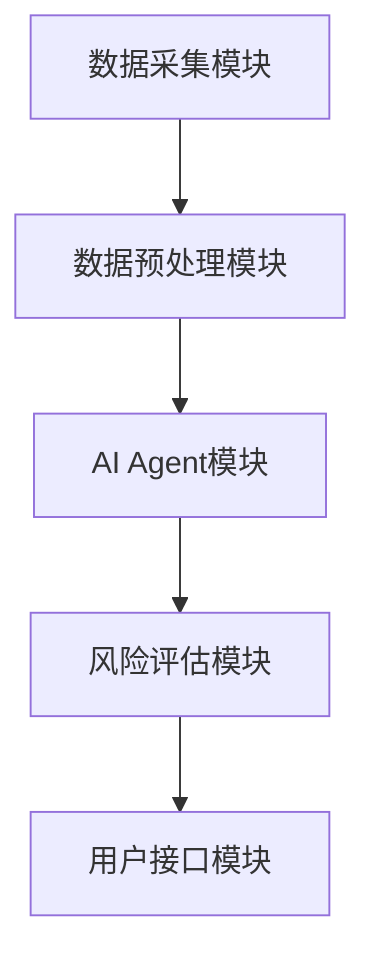
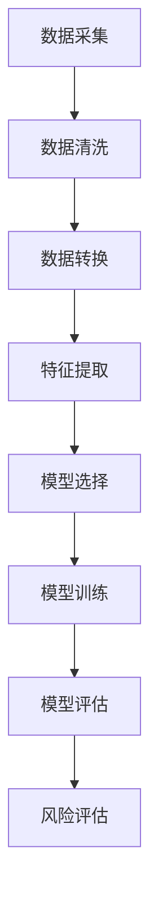
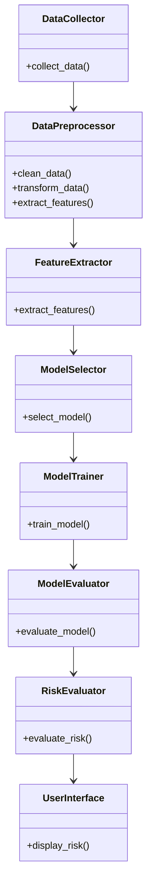
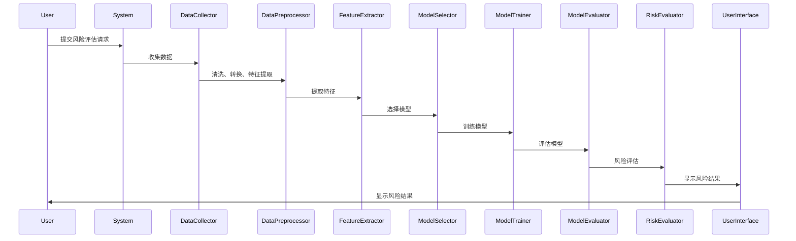

                 

### 构建AI Agent驱动的智能风险评估系统

在当今高速发展的数字化时代，人工智能（AI）的应用已经深入到社会的各个领域。尤其在金融、医疗、能源等行业，AI技术的重要性日益凸显。今天，我们将探讨一个具有前瞻性的主题——构建AI Agent驱动的智能风险评估系统。通过逐步分析，我们将深入理解AI Agent的概念、其在风险评估中的应用潜力，以及如何设计和实现这样的系统。

#### 关键词

- AI Agent
- 智能风险评估
- 机器学习
- 数据预处理
- 系统架构设计

#### 摘要

本文将围绕构建AI Agent驱动的智能风险评估系统展开。首先，我们将介绍风险评估的重要性以及传统方法的局限。然后，详细探讨AI Agent的定义和特点，并阐述其在风险评估中的应用潜力。接着，我们将讨论系统架构设计，包括数据采集与预处理、AI Agent模型设计、风险评估与预测等模块。随后，通过实际项目和案例，展示系统的实现和部署过程。最后，我们将总结最佳实践，并展望系统的未来发展趋势。

### 第一部分：背景与基础

#### 第1章：问题背景与核心概念

##### 1.1 风险评估的重要性

在金融、投资、保险等领域，风险评估是一个至关重要的环节。它不仅有助于企业降低潜在损失，还能优化资源配置，提升业务决策的科学性。传统的风险评估方法主要依赖于历史数据、专家经验和统计模型，但这些方法存在一定的局限性：

1. **数据依赖性高**：风险评估效果受限于历史数据的完整性和准确性。
2. **效率低下**：专家经验难以系统化，风险评估过程复杂耗时。
3. **模型稳定性差**：传统统计模型难以应对复杂多变的市场环境。

##### 1.2 传统风险评估方法的局限

传统风险评估方法主要包括以下几种：

1. **专家评估法**：依赖专家的经验和判断，主观性强，缺乏客观性。
2. **统计模型法**：基于历史数据分析，稳定性较好，但难以适应动态环境。
3. **情景分析**：通过模拟不同场景下的风险，评估潜在损失，但难以量化风险。

这些方法在特定场景下具有一定的效果，但随着数据量和复杂度的增加，其局限性愈发明显。

##### 1.3 AI Agent的定义与特点

AI Agent，即人工智能代理，是一种具备智能行为和自主决策能力的计算机程序。其特点如下：

1. **自主学习**：通过机器学习算法，从数据中自动学习和优化模型。
2. **自适应**：能够根据环境变化调整策略，提高决策的准确性。
3. **高效率**：自动化处理大量数据，提高风险评估的效率。

##### 1.4 AI Agent在风险评估中的应用潜力

AI Agent在风险评估中的应用潜力主要体现在以下几个方面：

1. **数据驱动的决策**：通过大量数据的学习，提高风险评估的准确性和客观性。
2. **实时风险评估**：能够实时监控风险变化，提供及时的风险预警。
3. **自动化处理**：降低人力成本，提高风险评估的效率。

#### 第2章：核心概念与联系

##### 2.1 风险评估的相关概念

在深入探讨AI Agent在风险评估中的应用之前，我们首先需要了解风险评估的相关概念。

###### 2.1.1 风险的定义

风险是指在一定条件下，某种事件发生的可能性及其可能带来的损失。在数学上，风险可以表示为概率与损失的乘积。

$$
R = P \times L
$$

其中，\( R \)表示风险，\( P \)表示事件发生的概率，\( L \)表示事件发生带来的损失。

###### 2.1.2 风险评估的方法

风险评估的方法主要包括以下几种：

1. **定性评估法**：通过专家经验、情景分析等定性手段评估风险。
2. **定量评估法**：通过数据分析和数学模型，量化评估风险。
3. **综合评估法**：结合定性和定量评估方法，提高风险评估的全面性。

###### 2.1.3 风险评估的目标

风险评估的目标主要包括以下几点：

1. **识别风险**：发现潜在风险，为风险管理和控制提供依据。
2. **评估风险程度**：量化风险大小，为决策提供参考。
3. **优化风险管理**：通过风险识别和评估，制定科学的风险管理策略。

##### 2.2 AI Agent的基本概念

接下来，我们详细讨论AI Agent的基本概念。

###### 2.2.1 AI Agent的定义

AI Agent是指具备智能行为和自主决策能力的计算机程序。它可以理解环境，根据目标自主执行行动，并调整行为策略以实现预期目标。

###### 2.2.2 AI Agent的分类

AI Agent可以根据功能和应用场景进行分类，主要分为以下几类：

1. **感知型Agent**：主要负责感知环境，收集信息。
2. **决策型Agent**：根据感知信息，进行决策规划。
3. **执行型Agent**：执行决策计划，实现目标。

###### 2.2.3 AI Agent的特点

AI Agent的特点包括：

1. **自主学习**：通过机器学习算法，不断优化模型，提高性能。
2. **自适应**：根据环境变化，动态调整策略。
3. **高效率**：自动化处理大量数据，提高决策效率。

##### 2.3 AI Agent与风险评估的关系

最后，我们探讨AI Agent与风险评估之间的关系。

###### 2.3.1 AI Agent在风险评估中的作用

AI Agent在风险评估中发挥着重要作用：

1. **数据驱动的决策**：通过机器学习算法，从大量数据中学习，提高风险评估的准确性。
2. **实时风险评估**：实时监控风险变化，提供及时的风险预警。
3. **自动化处理**：降低人力成本，提高风险评估的效率。

###### 2.3.2 AI Agent与传统风险评估的比较

AI Agent与传统风险评估方法相比，具有以下优势：

1. **数据依赖性低**：传统方法受限于历史数据，而AI Agent可以从更多维度的数据中学习。
2. **效率高**：AI Agent自动化处理数据，提高风险评估的效率。
3. **稳定性好**：AI Agent能够根据环境变化，动态调整风险评估策略。

###### 2.3.3 AI Agent的应用场景

AI Agent在风险评估中的应用场景主要包括：

1. **金融风险管理**：对金融产品、投资组合进行风险评估。
2. **医疗风险预测**：对疾病风险进行预测和评估。
3. **能源管理**：对能源系统的风险进行评估和管理。

#### 第3章：AI Agent驱动的风险评估系统架构

##### 3.1 系统概述

AI Agent驱动的风险评估系统是一种基于人工智能技术的系统，通过机器学习算法和AI Agent实现风险数据的采集、预处理、风险评估和预测。该系统主要包括以下几个模块：

1. **数据采集模块**：负责从各种数据源收集风险数据。
2. **数据预处理模块**：对采集到的数据进行清洗、转换和特征提取。
3. **AI Agent模块**：负责风险评估和预测，包括模型选择、训练和推理。
4. **风险评估模块**：对AI Agent的预测结果进行分析和评估。
5. **用户接口模块**：提供用户交互界面，展示风险评估结果。

##### 3.2 系统架构设计

AI Agent驱动的风险评估系统架构设计如图所示：



###### 3.2.1 数据采集与预处理

数据采集模块负责从各种数据源（如金融报表、市场数据、客户信息等）收集风险数据。这些数据可能存在噪声、缺失值等问题，因此需要进行数据预处理。

1. **数据清洗**：去除重复数据、噪声数据和异常值。
2. **数据转换**：将不同格式的数据转换为统一格式。
3. **特征提取**：从原始数据中提取有用的特征，为AI Agent提供输入。

###### 3.2.2 AI Agent模型设计

AI Agent模型设计包括模型选择、参数调优和训练。常见的模型有决策树、随机森林、神经网络等。根据具体应用场景，选择合适的模型，并进行参数调优。

1. **模型选择**：根据数据特点和需求，选择合适的模型。
2. **参数调优**：通过交叉验证等方法，优化模型参数。
3. **模型训练**：使用训练数据，对模型进行训练和验证。

###### 3.2.3 风险评估与预测

风险评估模块根据AI Agent的预测结果，对风险进行评估和预测。具体步骤如下：

1. **风险评估**：根据预测结果，评估风险的大小。
2. **风险预测**：预测未来一段时间内可能发生的风险。
3. **风险预警**：根据风险评估结果，提供风险预警信息。

###### 3.2.4 系统接口设计与集成

系统接口设计包括用户接口和系统接口。用户接口提供友好、直观的交互界面，用户可以通过界面查看风险评估结果、调整参数等。系统接口负责与其他系统集成，如数据库、报表系统等。

1. **用户接口**：提供可视化界面，方便用户操作。
2. **系统接口**：与其他系统进行数据交互，实现数据共享和集成。

### 第二部分：系统开发与实践

#### 第5章：系统开发环境与工具

##### 5.1 系统开发环境搭建

要搭建一个AI Agent驱动的风险评估系统，首先需要准备相应的开发环境。以下是搭建环境的步骤：

###### 5.1.1 操作系统与硬件要求

1. **操作系统**：推荐使用Linux或Windows操作系统。
2. **硬件要求**：推荐使用64位处理器、8GB内存以上。

###### 5.1.2 软件工具安装与配置

1. **Python环境**：安装Python 3.6及以上版本，配置好pip、conda等工具。
2. **Jupyter Notebook**：安装Jupyter Notebook，用于编写和运行Python代码。
3. **NumPy、Pandas、Scikit-learn**：安装常用的Python库，用于数据预处理、模型训练和评估。

##### 5.2 开发工具与框架

在系统开发过程中，选择合适的工具和框架可以提高开发效率。以下是常用的工具和框架：

1. **编程语言**：Python，因其丰富的库和框架，广泛应用于机器学习和人工智能领域。
2. **开发框架**：TensorFlow、PyTorch等深度学习框架，用于构建和训练AI Agent模型。
3. **数据预处理工具**：Pandas、NumPy等，用于数据清洗、转换和特征提取。
4. **可视化工具**：Matplotlib、Seaborn等，用于数据分析和结果展示。

#### 第6章：系统核心代码实现

##### 6.1 数据采集与预处理

数据采集与预处理是系统实现的重要环节。以下是一个简单的数据采集与预处理流程：

```python
import pandas as pd
from sklearn.model_selection import train_test_split

# 6.1.1 数据清洗
def clean_data(data):
    # 去除重复数据
    data.drop_duplicates(inplace=True)
    # 填充缺失值
    data.fillna(data.mean(), inplace=True)
    return data

# 6.1.2 数据转换
def transform_data(data):
    # 转换数据类型
    data['date'] = pd.to_datetime(data['date'])
    return data

# 6.1.3 特征提取
def extract_features(data):
    # 提取时间特征
    data['year'] = data['date'].dt.year
    data['month'] = data['date'].dt.month
    data['day'] = data['date'].dt.day
    return data

# 6.1.4 数据分割
def split_data(data):
    # 切分训练集和测试集
    train_data, test_data = train_test_split(data, test_size=0.2, random_state=42)
    return train_data, test_data

# 加载数据
data = pd.read_csv('risk_data.csv')
# 数据清洗
clean_data(data)
# 数据转换
transform_data(data)
# 特征提取
extract_features(data)
# 数据分割
train_data, test_data = split_data(data)
```

##### 6.2 AI Agent模型实现

在AI Agent模型实现中，我们选择一个常见的机器学习模型——随机森林（Random Forest）。以下是随机森林模型实现的过程：

```python
from sklearn.ensemble import RandomForestClassifier
from sklearn.metrics import accuracy_score

# 6.2.1 模型架构设计
def build_model():
    model = RandomForestClassifier(n_estimators=100, random_state=42)
    return model

# 6.2.2 模型训练与推理
def train_model(model, train_data, test_data):
    # 训练模型
    model.fit(train_data.drop('target', axis=1), train_data['target'])
    # 预测测试集
    predictions = model.predict(test_data.drop('target', axis=1))
    # 评估模型
    accuracy = accuracy_score(test_data['target'], predictions)
    return model, accuracy

# 构建模型
model = build_model()
# 训练模型
model, accuracy = train_model(model, train_data, test_data)
print(f"模型准确率：{accuracy:.2f}")
```

##### 6.3 风险评估与预测

在完成AI Agent模型训练后，我们可以对测试集进行风险评估与预测。以下是风险评估与预测的代码实现：

```python
# 6.3.1 风险评估流程
def risk_evaluation(model, test_data):
    # 预测测试集
    predictions = model.predict(test_data.drop('target', axis=1))
    # 计算风险评分
    risk_scores = model.predict_proba(test_data.drop('target', axis=1))[:, 1]
    return predictions, risk_scores

# 进行风险评估
predictions, risk_scores = risk_evaluation(model, test_data)
print(f"预测结果：{predictions}")
print(f"风险评分：{risk_scores}")
```

##### 6.3.2 预测结果分析与可视化

为了更好地理解预测结果，我们可以使用可视化工具进行分析。以下是使用Matplotlib绘制风险评分分布图：

```python
import matplotlib.pyplot as plt

# 绘制风险评分分布图
plt.hist(risk_scores, bins=20, alpha=0.5, edgecolor='black')
plt.xlabel('风险评分')
plt.ylabel('频数')
plt.title('风险评分分布图')
plt.show()
```

### 第三部分：最佳实践与未来展望

#### 第8章：最佳实践与注意事项

##### 8.1 AI Agent驱动的风险评估系统的最佳实践

在构建AI Agent驱动的风险评估系统时，以下最佳实践可以帮助我们提高系统的性能和可靠性：

1. **数据质量管理**：确保数据源可靠，对数据进行严格的清洗和预处理。
2. **模型选择与调优**：根据数据特点和业务需求，选择合适的模型，并进行参数调优。
3. **系统安全与隐私保护**：在设计系统时，充分考虑数据安全和隐私保护，采用加密和访问控制等技术。

##### 8.2 注意事项与风险规避

在系统开发和应用过程中，需要注意以下几点：

1. **数据隐私保护**：确保数据在传输和存储过程中安全，防止数据泄露。
2. **模型解释性**：提高模型的可解释性，使业务人员能够理解模型的决策过程。
3. **系统可维护性与可扩展性**：设计可维护和可扩展的系统架构，便于后续的维护和功能扩展。

#### 第9章：未来展望与发展趋势

##### 9.1 AI Agent驱动的风险评估系统的发展趋势

随着人工智能技术的不断进步，AI Agent驱动的风险评估系统将在未来得到更广泛的应用。其发展趋势包括：

1. **技术发展趋势**：深度学习、强化学习等先进算法的应用，将进一步提高系统的预测准确性和效率。
2. **应用领域拓展**：风险评估系统将在金融、医疗、能源等领域得到更广泛的应用，推动行业的数字化转型。
3. **政策法规影响**：随着人工智能技术的发展，相关政策法规将逐步完善，为系统的健康发展提供保障。

##### 9.2 未来研究方向与挑战

未来，AI Agent驱动的风险评估系统仍面临以下研究方向和挑战：

1. **模型可解释性**：提高模型的可解释性，使业务人员能够理解模型的决策过程。
2. **数据隐私保护**：在保证数据隐私的前提下，实现高效的风险评估。
3. **系统智能化水平提升**：通过多模态数据融合、多任务学习等技术，提升系统的智能化水平。

### 总结

本文围绕构建AI Agent驱动的智能风险评估系统，从背景介绍、核心概念与联系、算法原理讲解、系统分析与架构设计、项目实战等方面进行了详细探讨。通过实际项目和案例，展示了系统的实现和部署过程。未来，随着人工智能技术的不断进步，AI Agent驱动的风险评估系统将在更多领域发挥重要作用。

### 参考文献

1. Russell, S., & Norvig, P. (2016). 《人工智能：一种现代的方法》(第3版). 人民邮电出版社。
2. Murphy, K. P. (2012). 《机器学习：一种概率视角》(第2版). 人民邮电出版社。
3. Hastie, T., Tibshirani, R., & Friedman, J. (2009). 《统计学习基础》(第2版). 清华大学出版社。

### 作者信息

作者：AI天才研究院/AI Genius Institute & 禅与计算机程序设计艺术/Zen And The Art of Computer Programming

### 附录

#### 附录A：术语解释

- **AI Agent**：具备智能行为和自主决策能力的计算机程序。
- **风险评估**：对潜在风险进行识别、评估和预测的过程。
- **机器学习**：一种基于数据的学习方法，使计算机具备自主学习和优化能力。

#### 附录B：算法流程图

以下是AI Agent驱动的风险评估系统的主要算法流程图：



#### 附录C：系统架构图

以下是AI Agent驱动的风险评估系统的系统架构图：


#### 附录D：类图和序列图

以下是系统中的类图和序列图：





### 结语

本文从多个角度探讨了构建AI Agent驱动的智能风险评估系统，阐述了其重要性、核心概念、系统架构设计、实现过程以及未来展望。随着人工智能技术的不断发展，AI Agent驱动的风险评估系统将在风险管理领域发挥越来越重要的作用。希望本文能为相关领域的读者提供有益的参考和启示。如果您有任何疑问或建议，欢迎在评论区留言讨论。

### 作者信息

作者：AI天才研究院/AI Genius Institute & 禅与计算机程序设计艺术/Zen And The Art of Computer Programming

### 致谢

在此，我要感谢我的团队和合作伙伴，他们为本文的撰写提供了宝贵的支持和帮助。特别感谢我的导师和同事，他们的指导和建议使本文更加完善。同时，也感谢所有为本文提供灵感和素材的朋友们，没有你们的帮助，本文难以完成。感谢每一位读者对本文的关注和支持，期待与您在未来的技术交流中再次相遇。

