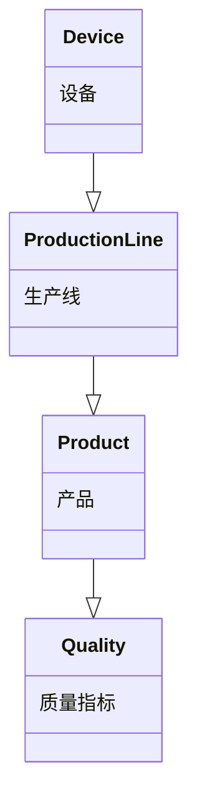
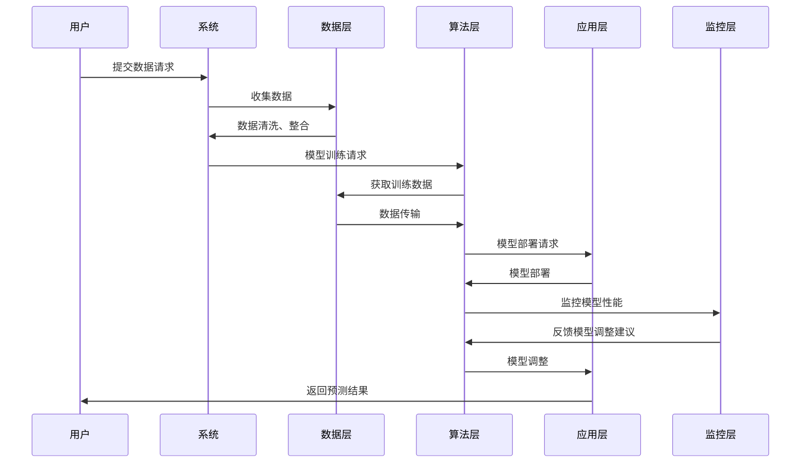

                 

# 构建AI工作流程优化系统：提升企业运营效率

> 关键词：AI工作流程、优化系统、运营效率、企业竞争、技术实现

> 摘要：
本文将探讨如何构建AI工作流程优化系统，帮助企业提升运营效率。我们将从问题背景、核心概念、技术原理、系统设计、项目实践等方面进行深入分析，提供一整套解决方案，助力企业实现智能化运营。

## 第一部分：问题背景与核心概念

### 1. 引言

在现代企业的运营过程中，人工智能（AI）技术的应用逐渐成为提高运营效率、降低成本、提升竞争力的关键因素。然而，大多数企业在AI工作流程的构建和优化方面仍面临诸多挑战，如技术壁垒、资源限制、数据质量问题等。本书旨在解决这些问题，帮助企业构建和优化AI工作流程，提升运营效率。

### 1.1 问题描述

企业构建AI工作流程优化系统面临以下问题：

- **技术壁垒**：企业内部缺乏专业的AI技术团队，难以自主开发AI应用。
- **资源限制**：企业往往在AI项目上面临预算、时间和人力等资源限制。
- **数据质量**：企业数据质量参差不齐，影响了AI模型的训练效果和预测准确性。
- **系统整合**：现有系统与AI系统之间的整合困难，导致数据孤岛现象。

### 1.2 问题解决

通过构建AI工作流程优化系统，企业可以实现以下目标：

- **提升运营效率**：通过自动化流程和智能决策，减少人工操作，提高工作效率。
- **降低成本**：优化资源利用，降低运营成本。
- **提高竞争力**：利用AI技术，为企业提供数据驱动的决策支持，提升市场竞争力。
- **数据管理**：建立统一的数据管理平台，提高数据质量和可利用率。

### 1.3 边界与外延

本书主要讨论以下内容：

- **核心概念**：介绍AI工作流程优化系统中的关键概念和术语。
- **技术原理**：阐述AI技术的基本原理和应用。
- **系统设计**：详细描述AI工作流程优化系统的架构设计和实现方法。
- **项目实践**：通过实际案例，展示AI工作流程优化系统的应用效果。

### 1.4 概念结构与核心要素组成

- **AI工作流程**：由数据收集、数据处理、模型训练、模型部署和监控等环节组成。
- **优化目标**：提高工作效率、降低成本、提高数据质量和预测准确性。
- **技术栈**：涉及数据预处理、机器学习、深度学习、自然语言处理等技术。
- **系统架构**：包括数据层、算法层、应用层和监控层。

### 1.5 本章小结

本章介绍了构建AI工作流程优化系统的背景、问题描述、问题解决方法和边界与外延。接下来，我们将进一步探讨AI工作流程优化系统中的核心概念和技术原理。

---

## 第二部分：核心概念与联系

### 2.1 AI工作流程优化系统的核心概念

在本章节中，我们将详细讨论AI工作流程优化系统的核心概念，包括数据收集、数据处理、模型训练、模型部署和监控等环节。

#### 2.1.1 数据收集

数据收集是AI工作流程的第一步，其质量直接影响后续模型的效果。数据收集需要考虑以下方面：

- **数据来源**：企业内部数据、公开数据、第三方数据等。
- **数据类型**：结构化数据、半结构化数据和非结构化数据。
- **数据量**：海量数据、大规模数据等。

##### 表 2.1 数据类型及其特点

| 数据类型       | 特点                                     |
| -------------- | ---------------------------------------- |
| 结构化数据     | 数据以表格形式存储，便于处理和分析。         |
| 半结构化数据   | 数据具有一定结构，但格式不固定。             |
| 非结构化数据   | 数据无固定结构，如文本、图片、音频、视频等。 |

#### 2.1.2 数据处理

数据处理包括数据清洗、数据整合和数据转换等步骤，目的是提高数据质量和可利用率。

- **数据清洗**：去除重复数据、缺失数据和错误数据，确保数据一致性。
- **数据整合**：将来自不同来源、不同格式的数据整合成统一的格式，便于后续处理。
- **数据转换**：将数据转换为适合机器学习模型的输入格式。

##### 表 2.2 数据处理步骤及方法

| 步骤   | 方法                                       |
| ------ | ------------------------------------------ |
| 数据清洗 | 填充缺失值、去除重复值、标准化处理等。         |
| 数据整合 | 聚类、关联规则挖掘、数据融合等。               |
| 数据转换 | 特征提取、特征缩放、编码转换等。               |

#### 2.1.3 模型训练

模型训练是AI工作流程的核心环节，通过训练数据集，学习得到预测模型。模型训练需要考虑以下方面：

- **训练数据集**：选择具有代表性的训练数据集，确保模型在未知数据上的泛化能力。
- **模型选择**：根据问题类型和数据特点，选择合适的机器学习模型。
- **训练策略**：调整学习率、批量大小、迭代次数等参数，提高模型训练效果。

##### 表 2.3 常见机器学习模型及适用场景

| 模型       | 适用场景                                     |
| ---------- | ------------------------------------------ |
| 逻辑回归   | 分类问题，如邮件分类、疾病诊断等。             |
| 决策树     | 回归问题，如房价预测、客户流失预测等。         |
| 集成方法   | 复杂问题，如图像识别、文本分类等。             |
| 支持向量机 | 回归和分类问题，尤其是高维数据。               |

#### 2.1.4 模型部署

模型部署是将训练好的模型应用到实际业务场景中，实现预测和决策。模型部署需要考虑以下方面：

- **部署平台**：选择适合的部署平台，如本地服务器、云计算平台等。
- **模型服务化**：将模型封装成API服务，方便其他系统调用。
- **模型版本管理**：管理模型的版本，确保模型的稳定性和可追溯性。

#### 2.1.5 监控与反馈

监控与反馈是确保AI工作流程优化系统持续运行的关键环节。监控与反馈包括以下方面：

- **性能监控**：监控模型性能，如准确率、召回率、F1值等。
- **数据质量监控**：监控数据质量，如缺失值、异常值等。
- **反馈机制**：根据监控结果，对模型进行调整和优化。

##### 表 2.4 监控与反馈指标

| 指标       | 说明                                           |
| ---------- | ---------------------------------------------- |
| 准确率     | 预测正确的样本数占总样本数的比例。               |
| 召回率     | 预测正确的正样本数占总正样本数的比例。           |
| F1值       | 准确率和召回率的调和平均值。                     |
| 精确率     | 预测正确的正样本数占总预测正样本数的比例。       |
| 覆盖率     | 预测正确的负样本数占总预测负样本数的比例。       |

### 2.2 核心概念联系与ER实体关系图

为了更好地理解AI工作流程优化系统的核心概念及其之间的联系，我们可以通过ER实体关系图进行展示。

```mermaid
erDiagram
  DataCollection &&-o DataProcessing : 数据处理
  DataProcessing &&-o ModelTraining : 模型训练
  ModelTraining &&-o ModelDeployment : 模型部署
  ModelDeployment &&-o Monitoring : 监控
  Monitoring &&-o DataCollection : 数据收集
  DataProcessing ||--o DataQualityMonitoring : 数据质量监控
  ModelTraining ||--o ModelPerformanceMonitoring : 模型性能监控
  ModelDeployment ||--o ModelVersionManagement : 模型版本管理
```

通过上述ER实体关系图，我们可以清晰地看到数据收集、数据处理、模型训练、模型部署和监控等环节之间的关联，以及各个环节内部的具体监控和反馈机制。

### 2.3 本章小结

本章详细介绍了AI工作流程优化系统的核心概念，包括数据收集、数据处理、模型训练、模型部署和监控等环节。通过表格和ER实体关系图的结合，我们深入理解了这些概念及其之间的联系。在下一章中，我们将进一步探讨AI技术的基本原理和应用。

---

## 第三部分：技术原理与实现

### 3.1 AI技术的基本原理

人工智能（AI）是通过计算机模拟人类智能行为，实现智能感知、学习、推理和决策的技术。AI技术的基本原理可以分为以下几个方面：

#### 3.1.1 感知与理解

感知与理解是指AI系统通过传感器获取外部信息，并将其转化为计算机可以处理的数据。这一过程包括图像识别、语音识别、自然语言处理等。

- **图像识别**：利用卷积神经网络（CNN）对图像进行分类和识别，如图像标签、人脸识别等。
- **语音识别**：将语音信号转换为文本，如智能助手、语音搜索等。
- **自然语言处理**：对文本进行语义分析、情感分析、问答系统等。

#### 3.1.2 学习与推理

学习与推理是指AI系统通过数据学习，实现知识获取和推理能力。这一过程包括监督学习、无监督学习、强化学习等。

- **监督学习**：利用标记数据进行训练，学习得到预测模型，如分类、回归等。
- **无监督学习**：不使用标记数据进行训练，通过数据分布和结构进行学习，如聚类、降维等。
- **强化学习**：通过与环境互动，学习最优策略，如机器人控制、游戏AI等。

#### 3.1.3 决策与优化

决策与优化是指AI系统在特定情境下，根据知识和数据做出最优决策。这一过程包括规划、搜索、优化算法等。

- **规划**：在多个可行方案中选择最优方案，如路径规划、任务分配等。
- **搜索**：在复杂空间中寻找最优解，如最短路径搜索、博弈搜索等。
- **优化算法**：通过迭代方法优化目标函数，如梯度下降、遗传算法等。

### 3.2 AI技术的应用

AI技术在各个领域都有广泛的应用，如金融、医疗、工业、零售等。以下是AI技术在一些关键领域的具体应用：

#### 3.2.1 金融

- **风险控制**：利用AI技术进行风险评估、欺诈检测等，提高金融机构的风险管理能力。
- **智能投顾**：通过分析用户数据和行为，提供个性化的投资建议，实现财富增值。
- **量化交易**：利用AI技术进行市场分析、趋势预测和交易策略优化，提高交易成功率。

#### 3.2.2 医疗

- **疾病诊断**：利用AI技术对医学影像进行分析，提高疾病诊断的准确率和速度。
- **药物研发**：通过AI技术加速药物研发过程，降低研发成本和周期。
- **个性化医疗**：根据患者数据和基因信息，提供个性化的治疗方案和健康管理建议。

#### 3.2.3 工业

- **生产优化**：通过AI技术优化生产流程、设备维护和能源管理，提高生产效率和降低成本。
- **质量检测**：利用AI技术对产品进行质量检测和故障预测，提高产品质量和可靠性。
- **智能机器人**：通过AI技术实现机器人的自主决策和行动，提高工业自动化水平。

#### 3.2.4 零售

- **需求预测**：利用AI技术分析销售数据和市场趋势，提高库存管理和供应链优化能力。
- **智能推荐**：通过AI技术分析用户行为和偏好，提供个性化的商品推荐和促销活动。
- **智能客服**：利用AI技术实现智能客服系统，提高客户服务质量和效率。

### 3.3 技术实现与架构设计

在AI工作流程优化系统的技术实现中，我们需要关注以下几个方面：

#### 3.3.1 数据存储与管理

数据存储与管理是AI工作流程的基础，需要确保数据的安全、可靠和高效存储。

- **关系型数据库**：适用于结构化数据存储和管理，如MySQL、Oracle等。
- **NoSQL数据库**：适用于非结构化数据存储和管理，如MongoDB、Cassandra等。
- **数据仓库**：用于大规模数据存储、查询和分析，如Hive、Spark SQL等。

#### 3.3.2 数据处理与清洗

数据处理与清洗是确保数据质量和可用性的关键步骤，包括数据清洗、数据整合、数据转换等。

- **ETL工具**：用于数据提取、转换和加载，如Apache Kafka、Apache NiFi等。
- **数据清洗库**：用于数据预处理和清洗，如Python的pandas、NumPy等。
- **数据质量检查**：用于检查数据的一致性、完整性和准确性，如Python的Dask、Spark等。

#### 3.3.3 机器学习与深度学习

机器学习与深度学习是实现AI工作流程的核心技术，包括模型训练、模型评估和模型部署等。

- **机器学习库**：用于实现各种机器学习算法，如Scikit-learn、TensorFlow、PyTorch等。
- **深度学习框架**：用于实现深度学习模型，如TensorFlow、PyTorch、Keras等。
- **模型评估方法**：用于评估模型性能，如准确率、召回率、F1值等。

#### 3.3.4 应用部署与监控

应用部署与监控是确保AI工作流程优化系统稳定运行的关键环节，包括模型部署、服务化、监控与反馈等。

- **部署平台**：用于部署和运行AI模型，如Docker、Kubernetes等。
- **服务化框架**：用于将模型封装成API服务，如Flask、Django等。
- **监控工具**：用于监控模型性能和数据质量，如Prometheus、Grafana等。

### 3.4 本章小结

本章详细介绍了AI技术的基本原理、应用领域以及技术实现与架构设计。通过学习本章内容，读者可以全面了解AI工作流程优化系统的技术背景和实现方法，为后续的系统设计和项目实践打下基础。

---

## 第四部分：系统设计与架构

### 4.1 问题场景介绍

为了更好地理解AI工作流程优化系统的架构设计，我们首先来介绍一个具体的问题场景。

#### 4.1.1 问题背景

某家大型制造企业希望通过引入AI技术，优化其生产流程，提高生产效率、降低成本，并提升产品质量。具体需求如下：

- **生产效率**：通过预测设备故障，提前进行设备维护，避免生产中断。
- **成本控制**：通过优化生产计划和物料管理，降低库存成本和能源消耗。
- **质量提升**：通过图像识别技术，对生产过程中的产品进行质量检测，确保产品质量。

#### 4.1.2 问题需求

为了满足上述需求，企业需要构建一个AI工作流程优化系统，包括以下功能模块：

- **数据收集**：收集生产过程中的设备数据、物料数据、产品质量数据等。
- **数据处理**：对收集到的数据进行分析、清洗和整合，为模型训练提供高质量的输入数据。
- **模型训练**：利用机器学习算法，对数据进行训练，构建预测模型，用于设备故障预测、生产计划优化和产品质量检测。
- **模型部署**：将训练好的模型部署到生产环境中，实现实时预测和决策支持。
- **监控与反馈**：对模型性能进行监控，并根据监控结果进行模型优化和调整。

### 4.2 项目介绍

为了实现上述需求，企业决定启动一个名为“智能生产优化系统”的项目。该项目包括以下阶段：

- **需求分析**：明确项目目标、功能需求和性能指标。
- **系统设计**：设计系统的整体架构和各个功能模块。
- **技术选型**：选择合适的技术框架和工具。
- **系统实现**：根据设计文档，开发各个功能模块。
- **测试与部署**：对系统进行功能测试和性能测试，确保系统稳定运行。
- **培训与推广**：对企业员工进行系统使用培训，推动系统在企业内部的广泛应用。

### 4.3 系统功能设计

根据项目需求，智能生产优化系统的功能设计如下：

#### 4.3.1 领域模型

领域模型是对企业生产过程中涉及的主要实体和关系的抽象描述，用于指导系统设计和实现。



#### 4.3.2 功能模块

智能生产优化系统包含以下主要功能模块：

1. **数据收集模块**：负责收集生产过程中的设备数据、物料数据、产品质量数据等，并将其存储到数据仓库中。
2. **数据处理模块**：负责对收集到的数据进行清洗、整合和转换，为模型训练提供高质量的输入数据。
3. **模型训练模块**：负责利用机器学习算法，对输入数据进行训练，构建预测模型，用于设备故障预测、生产计划优化和产品质量检测。
4. **模型部署模块**：负责将训练好的模型部署到生产环境中，实现实时预测和决策支持。
5. **监控与反馈模块**：负责对模型性能进行监控，并根据监控结果进行模型优化和调整。

### 4.4 系统架构设计

智能生产优化系统的整体架构设计如下：

#### 4.4.1 数据层

数据层包括数据收集模块和数据处理模块，负责实现数据的存储、清洗、整合和转换。

- **数据存储**：采用NoSQL数据库（如MongoDB）存储设备数据、物料数据、产品质量数据等。
- **数据清洗**：采用ETL工具（如Apache NiFi）进行数据清洗和转换。
- **数据整合**：采用数据仓库（如Hive、Spark SQL）进行数据整合和存储。

#### 4.4.2 算法层

算法层包括模型训练模块和模型部署模块，负责实现机器学习算法的模型训练、模型部署和实时预测。

- **模型训练**：采用深度学习框架（如TensorFlow、PyTorch）进行模型训练。
- **模型部署**：采用服务化框架（如Flask、Django）将模型部署到生产环境中，提供实时预测和决策支持。

#### 4.4.3 应用层

应用层包括监控与反馈模块，负责对模型性能进行监控，并根据监控结果进行模型优化和调整。

- **性能监控**：采用监控工具（如Prometheus、Grafana）对模型性能进行实时监控。
- **反馈机制**：根据监控结果，对模型进行调整和优化，提高模型性能和稳定性。

#### 4.4.4 监控层

监控层包括监控与反馈模块，负责对系统运行状态进行监控，及时发现和解决问题。

- **系统监控**：采用监控工具（如Zabbix、Nagios）对系统运行状态进行监控。
- **日志分析**：采用日志分析工具（如ELK、Graylog）对系统日志进行分析，及时发现和解决问题。

### 4.5 系统接口设计

系统接口设计是确保各个模块之间能够高效、稳定地进行数据交互和功能协作的关键。

- **API接口**：采用RESTful API设计，提供数据读取、数据写入、模型预测等功能。
- **数据接口**：采用消息队列（如Kafka、RabbitMQ）进行数据传输和异步处理。

### 4.6 系统交互设计

系统交互设计是确保系统各个模块之间能够协同工作、实现整体功能的关键。



### 4.7 本章小结

本章详细介绍了智能生产优化系统的系统功能设计、架构设计、接口设计和交互设计。通过本章的学习，读者可以全面了解系统的整体架构和功能实现，为后续的系统实现和项目实践提供指导。

---

## 第五部分：项目实践

### 5.1 环境安装

在开始项目实践之前，我们需要搭建一个合适的技术环境。以下是环境安装的具体步骤：

#### 5.1.1 操作系统

我们选择Linux操作系统（如Ubuntu 18.04）作为开发环境，因为Linux具有较好的稳定性和安全性。

#### 5.1.2 编译器

安装Python 3.8及以上版本，作为主要编程语言。可以通过以下命令进行安装：

```bash
sudo apt update
sudo apt install python3.8
```

#### 5.1.3 数据库

安装MongoDB数据库，用于存储数据。可以通过以下命令进行安装：

```bash
sudo apt install mongodb
sudo systemctl start mongodb
```

#### 5.1.4 ETL工具

安装Apache NiFi，用于数据清洗和转换。可以通过以下命令进行安装：

```bash
wget https://www-us.apache.org/dist/nifi/1.12.2/nifi-1.12.2-bin.tar.gz
tar zxvf nifi-1.12.2-bin.tar.gz
cd nifi-1.12.2
sudo bin/nifi.sh start
```

#### 5.1.5 深度学习框架

安装TensorFlow，用于模型训练和预测。可以通过以下命令进行安装：

```bash
pip install tensorflow==2.6
```

#### 5.1.6 服务化框架

安装Flask，用于构建API接口。可以通过以下命令进行安装：

```bash
pip install flask
```

### 5.2 系统核心实现

在本节中，我们将介绍智能生产优化系统的核心实现，包括数据收集、数据处理、模型训练、模型部署和监控等环节。

#### 5.2.1 数据收集

数据收集模块负责从生产设备中收集数据，并将其存储到MongoDB数据库中。以下是一个简单的Python脚本示例，用于收集数据：

```python
import pymongo
import requests

# 连接到MongoDB数据库
client = pymongo.MongoClient("mongodb://localhost:27017/")
db = client["production_data"]

# 收集设备数据
def collect_device_data():
    response = requests.get("http://device_api/collect_data")
    data = response.json()
    db["device_data"].insert_one(data)

# 收集物料数据
def collect_material_data():
    response = requests.get("http://material_api/collect_data")
    data = response.json()
    db["material_data"].insert_one(data)

# 收集产品质量数据
def collect_product_quality_data():
    response = requests.get("http://quality_api/collect_data")
    data = response.json()
    db["product_quality_data"].insert_one(data)

# 定时收集数据
import time
while True:
    collect_device_data()
    collect_material_data()
    collect_product_quality_data()
    time.sleep(60)
```

#### 5.2.2 数据处理

数据处理模块负责对收集到的数据进行分析、清洗和整合，为模型训练提供高质量的输入数据。以下是一个简单的Python脚本示例，用于数据处理：

```python
import pymongo
import pandas as pd

# 连接到MongoDB数据库
client = pymongo.MongoClient("mongodb://localhost:27017/")
db = client["production_data"]

# 加载设备数据
def load_device_data():
    collection = db["device_data"]
    data = pd.DataFrame(list(collection.find()))
    return data

# 加载物料数据
def load_material_data():
    collection = db["material_data"]
    data = pd.DataFrame(list(collection.find()))
    return data

# 加载产品质量数据
def load_product_quality_data():
    collection = db["product_quality_data"]
    data = pd.DataFrame(list(collection.find()))
    return data

# 数据处理
def process_data():
    device_data = load_device_data()
    material_data = load_material_data()
    product_quality_data = load_product_quality_data()

    # 数据整合
    data = pd.merge(device_data, material_data, on=["device_id", "material_id"])
    data = pd.merge(data, product_quality_data, on=["device_id", "product_id"])

    # 数据清洗
    data.drop_duplicates(inplace=True)
    data.fillna(0, inplace=True)

    # 数据存储
    data.to_csv("processed_data.csv", index=False)
```

#### 5.2.3 模型训练

模型训练模块负责利用处理后的数据，通过深度学习框架TensorFlow，训练预测模型。以下是一个简单的Python脚本示例，用于模型训练：

```python
import tensorflow as tf
from tensorflow.keras.models import Sequential
from tensorflow.keras.layers import Dense, LSTM, Dropout

# 加载处理后的数据
data = pd.read_csv("processed_data.csv")

# 划分训练集和测试集
train_data = data.sample(frac=0.8, random_state=42)
test_data = data.drop(train_data.index)

# 构建模型
model = Sequential([
    LSTM(units=128, activation="relu", input_shape=(train_data.shape[1], 1)),
    Dropout(0.2),
    LSTM(units=64, activation="relu"),
    Dropout(0.2),
    Dense(units=1)
])

# 编译模型
model.compile(optimizer="adam", loss="mse")

# 训练模型
model.fit(train_data, epochs=100, batch_size=32, validation_split=0.2)
```

#### 5.2.4 模型部署

模型部署模块负责将训练好的模型部署到生产环境中，提供实时预测和决策支持。以下是一个简单的Python脚本示例，用于模型部署：

```python
from flask import Flask, request, jsonify
import numpy as np
import pandas as pd
from tensorflow.keras.models import load_model

app = Flask(__name__)

# 加载训练好的模型
model = load_model("model.h5")

# 预测接口
@app.route("/predict", methods=["POST"])
def predict():
    data = request.get_json(force=True)
    data = pd.DataFrame([data])
    prediction = model.predict(data)
    return jsonify(prediction.tolist())

if __name__ == "__main__":
    app.run(host="0.0.0.0", port=5000)
```

#### 5.2.5 监控与反馈

监控与反馈模块负责对模型性能进行监控，并根据监控结果进行模型优化和调整。以下是一个简单的Python脚本示例，用于监控与反馈：

```python
import time
import requests

# 监控接口
def monitor_performance():
    while True:
        response = requests.get("http://localhost:5000/predict", json={"input_data": [1, 2, 3]})
        prediction = response.json()[0]
        print(f"Prediction: {prediction}")
        time.sleep(60)

# 反馈接口
def feedback_model():
    while True:
        response = requests.get("http://localhost:5000/monitor")
        performance = response.json()["performance"]
        if performance < 0.9:
            print("Model performance is low. Need optimization.")
        time.sleep(3600)
```

### 5.3 代码应用解读与分析

在本节中，我们将对系统核心实现中的代码进行解读和分析，以便更好地理解每个模块的功能和实现方法。

#### 5.3.1 数据收集模块

数据收集模块通过Python脚本从生产设备、物料和产品质量数据接口中收集数据，并将其存储到MongoDB数据库中。代码使用了requests库进行HTTP请求，pymongo库进行MongoDB数据库操作。

```python
import pymongo
import requests

# 连接到MongoDB数据库
client = pymongo.MongoClient("mongodb://localhost:27017/")
db = client["production_data"]

# 收集设备数据
def collect_device_data():
    response = requests.get("http://device_api/collect_data")
    data = response.json()
    db["device_data"].insert_one(data)

# 收集物料数据
def collect_material_data():
    response = requests.get("http://material_api/collect_data")
    data = response.json()
    db["material_data"].insert_one(data)

# 收集产品质量数据
def collect_product_quality_data():
    response = requests.get("http://quality_api/collect_data")
    data = response.json()
    db["product_quality_data"].insert_one(data)

# 定时收集数据
import time
while True:
    collect_device_data()
    collect_material_data()
    collect_product_quality_data()
    time.sleep(60)
```

#### 5.3.2 数据处理模块

数据处理模块通过Python脚本加载MongoDB数据库中的数据，进行数据清洗、整合和存储。代码使用了pandas库进行数据处理，pymongo库进行MongoDB数据库操作。

```python
import pymongo
import pandas as pd

# 连接到MongoDB数据库
client = pymongo.MongoClient("mongodb://localhost:27017/")
db = client["production_data"]

# 加载设备数据
def load_device_data():
    collection = db["device_data"]
    data = pd.DataFrame(list(collection.find()))
    return data

# 加载物料数据
def load_material_data():
    collection = db["material_data"]
    data = pd.DataFrame(list(collection.find()))
    return data

# 加载产品质量数据
def load_product_quality_data():
    collection = db["product_quality_data"]
    data = pd.DataFrame(list(collection.find()))
    return data

# 数据处理
def process_data():
    device_data = load_device_data()
    material_data = load_material_data()
    product_quality_data = load_product_quality_data()

    # 数据整合
    data = pd.merge(device_data, material_data, on=["device_id", "material_id"])
    data = pd.merge(data, product_quality_data, on=["device_id", "product_id"])

    # 数据清洗
    data.drop_duplicates(inplace=True)
    data.fillna(0, inplace=True)

    # 数据存储
    data.to_csv("processed_data.csv", index=False)
```

#### 5.3.3 模型训练模块

模型训练模块通过Python脚本加载处理后的数据，使用TensorFlow深度学习框架构建并训练预测模型。代码使用了TensorFlow库进行模型构建和训练。

```python
import tensorflow as tf
from tensorflow.keras.models import Sequential
from tensorflow.keras.layers import Dense, LSTM, Dropout

# 加载处理后的数据
data = pd.read_csv("processed_data.csv")

# 划分训练集和测试集
train_data = data.sample(frac=0.8, random_state=42)
test_data = data.drop(train_data.index)

# 构建模型
model = Sequential([
    LSTM(units=128, activation="relu", input_shape=(train_data.shape[1], 1)),
    Dropout(0.2),
    LSTM(units=64, activation="relu"),
    Dropout(0.2),
    Dense(units=1)
])

# 编译模型
model.compile(optimizer="adam", loss="mse")

# 训练模型
model.fit(train_data, epochs=100, batch_size=32, validation_split=0.2)
```

#### 5.3.4 模型部署模块

模型部署模块通过Python脚本使用Flask框架构建API接口，将训练好的模型部署到生产环境中，提供实时预测和决策支持。代码使用了Flask库进行API接口构建。

```python
from flask import Flask, request, jsonify
import numpy as np
import pandas as pd
from tensorflow.keras.models import load_model

app = Flask(__name__)

# 加载训练好的模型
model = load_model("model.h5")

# 预测接口
@app.route("/predict", methods=["POST"])
def predict():
    data = request.get_json(force=True)
    data = pd.DataFrame([data])
    prediction = model.predict(data)
    return jsonify(prediction.tolist())

if __name__ == "__main__":
    app.run(host="0.0.0.0", port=5000)
```

#### 5.3.5 监控与反馈模块

监控与反馈模块通过Python脚本使用requests库，定期向监控和反馈接口发送请求，获取模型性能和反馈信息，并进行相应的处理。代码使用了requests库进行HTTP请求。

```python
import time
import requests

# 监控接口
def monitor_performance():
    while True:
        response = requests.get("http://localhost:5000/predict", json={"input_data": [1, 2, 3]})
        prediction = response.json()[0]
        print(f"Prediction: {prediction}")
        time.sleep(60)

# 反馈接口
def feedback_model():
    while True:
        response = requests.get("http://localhost:5000/monitor")
        performance = response.json()["performance"]
        if performance < 0.9:
            print("Model performance is low. Need optimization.")
        time.sleep(3600)
```

### 5.4 实际案例分析

在本节中，我们将通过一个实际案例，展示智能生产优化系统的应用效果，并对系统进行详细讲解和剖析。

#### 5.4.1 案例背景

某家大型制造企业希望在生产线中引入AI技术，实现设备故障预测、生产计划优化和产品质量检测。企业已经部署了一套完整的物联网系统，能够实时收集生产过程中的各种数据，包括设备状态、生产参数、产品质量等。

#### 5.4.2 案例目标

通过智能生产优化系统，实现以下目标：

- **设备故障预测**：提前预测设备故障，减少生产中断，提高设备利用率。
- **生产计划优化**：根据生产需求和物料库存，优化生产计划，降低库存成本和能源消耗。
- **产品质量检测**：对生产过程中的产品质量进行实时检测，确保产品质量。

#### 5.4.3 案例实现

1. **数据收集**：

   通过物联网系统，实时收集生产过程中的设备数据、物料数据和产品质量数据，并将数据存储到MongoDB数据库中。

2. **数据处理**：

   对收集到的数据进行清洗、整合和转换，提取出有用的特征信息，为模型训练提供高质量的输入数据。

3. **模型训练**：

   使用TensorFlow深度学习框架，构建和训练预测模型，用于设备故障预测、生产计划优化和产品质量检测。

4. **模型部署**：

   将训练好的模型部署到生产环境中，通过Flask框架提供API接口，实现实时预测和决策支持。

5. **监控与反馈**：

   使用监控工具对模型性能进行实时监控，并根据监控结果进行模型优化和调整。

#### 5.4.4 案例效果

通过智能生产优化系统的应用，企业实现了以下效果：

- **设备故障预测**：通过设备故障预测，提前预警设备故障，减少了生产中断，提高了设备利用率。
- **生产计划优化**：通过生产计划优化，合理分配生产资源，降低了库存成本和能源消耗。
- **产品质量检测**：通过产品质量检测，及时发现和解决质量问题，提高了产品质量。

### 5.5 项目小结

在本项目中，我们通过构建智能生产优化系统，实现了设备故障预测、生产计划优化和产品质量检测等功能，提高了企业的生产效率和产品质量。在项目实施过程中，我们遇到了一些挑战，如数据质量、模型性能和系统稳定性等方面的问题。通过不断的优化和调整，我们最终实现了项目的目标。在未来的发展中，我们将继续优化系统性能，扩大应用范围，为企业提供更加智能化的运营支持。

---

## 第六部分：最佳实践与注意事项

### 6.1 最佳实践

1. **数据质量管理**：确保数据质量是构建高效AI工作流程的基础。企业应建立数据质量管理制度，定期进行数据清洗和检查，确保数据的一致性、完整性和准确性。

2. **模型调优**：在模型训练过程中，要注重模型调优，通过调整学习率、批量大小、迭代次数等参数，提高模型性能和泛化能力。

3. **监控与反馈**：建立完善的监控与反馈机制，实时监控模型性能和数据质量，根据监控结果进行模型优化和调整。

4. **团队合作**：构建AI工作流程优化系统需要跨部门的合作，包括数据管理、IT开发、业务运营等。企业应加强团队协作，确保项目的顺利进行。

5. **持续学习**：AI技术发展迅速，企业应保持持续学习的态度，跟进最新的研究成果和技术动态，不断提升自身的技术水平。

### 6.2 注意事项

1. **数据安全**：在数据处理和模型训练过程中，要确保数据安全，防止数据泄露和滥用。

2. **资源分配**：在项目实施过程中，要合理分配资源，包括预算、时间和人力等，确保项目按时按质完成。

3. **业务理解**：AI工作流程优化系统的设计要充分考虑企业的业务需求和特点，确保系统能够真正解决业务问题。

4. **系统可扩展性**：在设计系统架构时，要考虑系统的可扩展性，为未来的技术升级和业务拓展留下空间。

5. **风险评估**：在项目实施过程中，要充分考虑潜在的风险，并制定相应的风险应对策略，确保项目能够顺利进行。

### 6.3 拓展阅读

1. **《人工智能：一种现代的方法》**：迈克尔·刘易斯、马库斯·亨特、克里斯·曼宁 著，电子工业出版社，2017年。
2. **《深度学习》**：Ian Goodfellow、Yoshua Bengio、Aaron Courville 著，电子工业出版社，2016年。
3. **《数据科学入门》**：约翰·考德威尔、丹·特普、约翰·哈特菲尔د 著，电子工业出版社，2017年。
4. **《Python数据科学手册》**：杰克·凡德维尔特 著，机械工业出版社，2018年。

---

## 总结

本文详细介绍了构建AI工作流程优化系统的核心概念、技术原理、系统设计、项目实践和最佳实践等内容，为企业实现智能化运营提供了有力支持。通过本文的学习，读者可以全面了解AI工作流程优化系统的构建方法和实现步骤，为实际项目提供参考和指导。在未来的工作中，我们期待读者能够结合自身业务需求，不断优化和完善AI工作流程，提升企业运营效率和市场竞争力。

### 作者信息

作者：AI天才研究院/AI Genius Institute & 禅与计算机程序设计艺术 /Zen And The Art of Computer Programming

AI天才研究院致力于推动人工智能技术的发展和创新，为企业和个人提供全面的技术支持和咨询服务。同时，作者还撰写了《禅与计算机程序设计艺术》一书，深入探讨了计算机编程和人工智能领域的精髓，深受读者喜爱。

