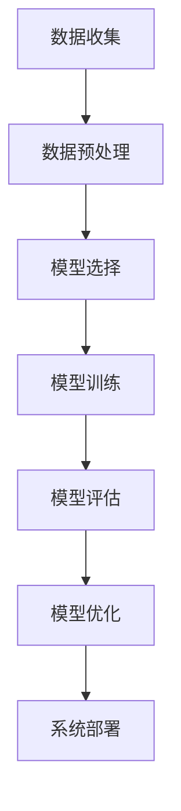
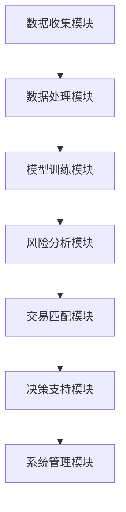
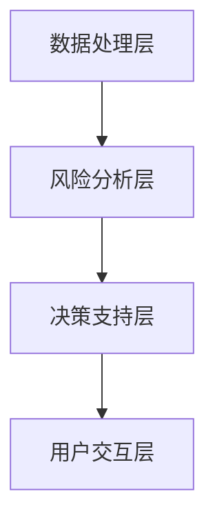

                 


### 构建AI辅助的并购交易分析系统

> 关键词：AI, 并购交易，数据分析，算法，系统架构，实战

> 摘要：本文将深入探讨如何构建一个AI辅助的并购交易分析系统。我们将从背景介绍、核心概念、算法原理、系统分析与架构设计、项目实战以及总结与拓展等方面，逐步分析和讲解整个系统的构建过程，旨在为读者提供一个清晰、易懂的构建指南。

#### 第1章：背景介绍

##### 1.1 并购交易概述

并购交易是指一家公司通过购买另一家公司的全部或部分股份，以实现业务扩展或市场控制的目的。并购交易通常包括资产收购、股权收购、合并等多种形式。并购交易在企业发展中起着至关重要的作用，它能够快速实现业务规模扩张、技术整合、市场拓展等目标。

##### 1.2 并购交易的挑战

尽管并购交易在企业发展中具有重要意义，但并购交易也面临诸多挑战。首先，数据不完整性是一个主要问题，许多并购交易涉及大量非结构化数据，如财务报告、市场分析报告等，这些数据难以直接用于分析。其次，信息不对称也是并购交易中的一大难题，买卖双方往往拥有不同的信息，这可能导致交易过程中的决策失误。最后，风险管理是并购交易中的关键问题，任何一次失败的并购交易都可能对企业造成巨大的财务损失。

##### 1.3 AI技术在并购交易分析中的应用

AI技术为解决并购交易中的挑战提供了新的思路和工具。首先，AI能够高效地处理和分析非结构化数据，通过自然语言处理技术，将文本数据转化为结构化数据，从而为并购交易分析提供高质量的数据支持。其次，AI能够通过机器学习算法，从海量数据中提取有价值的信息，帮助买卖双方做出更准确的决策。最后，AI技术在风险评估和管理方面也具有巨大的潜力，通过预测模型和风险控制算法，可以有效地降低并购交易的风险。

#### 第2章：核心概念与技术

##### 2.1 数据收集与处理

数据收集与处理是AI辅助并购交易分析系统的核心环节。首先，我们需要选择合适的数据源，如财务报告、市场分析报告、竞争对手数据等。然后，通过数据清洗、数据转换和数据归一化等预处理技术，将原始数据转化为适合分析的结构化数据。

##### 2.2 AI模型选择与训练

在AI模型选择方面，我们需要根据并购交易分析的需求，选择合适的模型。例如，对于财务预测，可以使用时间序列模型；对于市场分析，可以使用分类模型；对于风险预测，可以使用回归模型。然后，通过训练数据集，对选定的模型进行训练，以优化模型性能。

##### 2.3 算法优化与调参

算法优化与调参是提升AI模型性能的关键步骤。通过调整模型的参数，可以优化模型的预测效果。例如，对于神经网络模型，可以通过调整学习率、隐藏层节点数等参数，来提升模型的预测性能。

#### 第3章：算法原理讲解

##### 3.1 算法mermaid流程图



##### 3.2 Python源代码实现

```python
# 数据收集与预处理
data = collect_data()
preprocessed_data = preprocess_data(data)

# 模型选择与训练
model = select_model()
trained_model = train_model(model, preprocessed_data)

# 模型评估与优化
evaluation_result = evaluate_model(trained_model)
optimized_model = optimize_model(trained_model, evaluation_result)

# 系统部署
deploy_system(optimized_model)
```

##### 3.3 算法数学模型与公式

$$
\text{预测结果} = \text{模型参数} \times \text{输入特征} + \text{偏置项}
$$

#### 第4章：系统分析与架构设计

##### 4.1 问题场景介绍

在本节中，我们将介绍一个具体的并购交易分析问题场景，包括问题的提出、问题描述、问题解决、边界与外延，以及概念结构与核心要素组成。

##### 4.2 系统功能设计

在本节中，我们将介绍系统功能设计，包括领域模型（mermaid类图）的设计，以帮助读者更好地理解系统的功能模块和它们之间的关系。

##### 4.3 系统架构设计

在本节中，我们将介绍系统的整体架构设计，包括系统架构图，以展示系统的各个模块及其之间的交互关系。

##### 4.4 系统接口设计与系统交互

在本节中，我们将介绍系统的接口设计和系统交互，包括系统接口图和系统交互图，以帮助读者更好地理解系统的运行流程。

#### 第5章：项目实战

##### 5.1 系统环境搭建

在本节中，我们将介绍如何搭建一个用于构建AI辅助的并购交易分析系统的环境，包括所需软件和工具的安装和配置。

##### 5.2 系统核心实现

在本节中，我们将详细讲解系统的核心实现，包括数据收集、预处理、模型选择、训练、评估和优化等步骤的代码实现。

##### 5.3 代码应用解读与分析

在本节中，我们将对系统核心实现的代码进行解读和分析，帮助读者更好地理解代码的执行过程和算法原理。

##### 5.4 实际案例分析

在本节中，我们将通过一个实际案例，展示如何使用AI辅助的并购交易分析系统进行分析，并提供详细的分析结果。

##### 5.5 项目总结

在本节中，我们将对项目进行总结，包括项目的收获、不足之处以及未来改进的方向。

#### 第6章：总结与拓展

##### 6.1 最佳实践

在本节中，我们将提供一些构建AI辅助的并购交易分析系统的最佳实践，以帮助读者更好地应用所学知识。

##### 6.2 小结

在本节中，我们将对文章的内容进行小结，回顾本文的主要观点和结论。

##### 6.3 注意事项

在本节中，我们将提供一些在构建AI辅助的并购交易分析系统时需要注意的事项，以帮助读者避免常见的问题。

##### 6.4 拓展阅读

在本节中，我们将推荐一些相关的书籍、开源项目和行业动态，以帮助读者进一步了解AI辅助的并购交易分析领域的最新发展。

---

**作者：AI天才研究院/AI Genius Institute & 禅与计算机程序设计艺术 /Zen And The Art of Computer Programming**

---

以上是根据目录大纲和设计思路撰写的文章结构，接下来我们将逐一展开每个章节的内容，以完成整篇文章的撰写。如果您有任何疑问或建议，请随时告诉我。我们接下来将开始详细撰写每个章节。**让我们一步一步地思考，逐步构建这个AI辅助的并购交易分析系统吧！****## 第1章：背景介绍**

#### 1.1 并购交易概述

并购交易（Mergers and Acquisitions，简称M&A）是企业通过购买其他公司部分或全部股份，以实现业务扩展、市场占有、资源整合等战略目标的一种商业行为。并购交易通常分为以下几种类型：

- **资产收购**：企业购买另一家企业的全部或部分资产，以达到业务整合的目的。
- **股权收购**：企业购买另一家企业部分或全部的股权，从而实现对企业的控制。
- **合并**：两家或多家企业合并成一家新企业，实现资源共享和协同效应。
- **联合**：两家或多家企业合作，但不涉及股权交易，通过共享资源和市场来扩大业务。

并购交易在企业发展中具有重要的战略意义。首先，它能够快速实现业务规模扩张，通过收购竞争对手或互补企业，增强市场竞争力。其次，并购交易有助于企业获取先进技术、优秀人才和优质资源，提升企业的核心竞争力。最后，并购交易能够优化企业业务结构，降低运营成本，提高企业盈利能力。

#### 1.2 并购交易的挑战

尽管并购交易具有许多优势，但并购交易过程中也面临诸多挑战。以下是并购交易中常见的一些问题：

1. **数据不完整性**：并购交易通常涉及大量非结构化数据，如财务报告、市场分析报告、竞争对手数据等。这些数据往往存在不完整、不一致、不规范等问题，给数据分析带来了困难。

2. **信息不对称**：并购交易中，买卖双方往往掌握不同的信息。卖方可能对自身业务有更深入的了解，而买方可能对市场趋势、竞争对手情况等有更全面的了解。信息不对称可能导致决策失误，增加交易风险。

3. **风险管理**：并购交易涉及巨额资金，一旦决策失误，可能导致企业遭受重大损失。因此，风险管理在并购交易中至关重要。

4. **文化整合**：并购交易不仅涉及业务整合，还涉及企业文化整合。不同企业之间的文化差异可能引发冲突，影响并购交易的顺利实施。

5. **法律合规**：并购交易涉及多个国家和地区的法律法规，需要确保交易的合规性。

#### 1.3 AI技术在并购交易分析中的应用

AI技术在并购交易分析中具有广泛的应用前景。以下是AI技术在并购交易分析中的几个关键应用：

1. **数据分析**：AI技术能够高效地处理和分析非结构化数据，通过自然语言处理（NLP）技术，将文本数据转化为结构化数据，从而为并购交易分析提供高质量的数据支持。

2. **风险评估**：AI技术可以通过机器学习算法，从海量数据中提取有价值的信息，帮助买卖双方识别潜在风险，优化交易决策。

3. **市场预测**：AI技术可以根据历史数据和市场趋势，预测未来市场变化，为企业提供有针对性的战略建议。

4. **交易匹配**：AI技术可以通过智能匹配算法，帮助买卖双方快速找到合适的目标企业，提高交易效率。

5. **合同审查**：AI技术可以自动审查并购交易中的合同条款，识别潜在的法律风险，确保交易的合规性。

总之，AI技术为并购交易分析提供了强大的工具和方法，有助于企业更好地应对并购交易中的挑战，提高并购交易的效率和成功率。

---

在接下来的章节中，我们将进一步探讨AI辅助并购交易分析系统的核心概念与技术，包括数据收集与处理、AI模型选择与训练、算法优化与调参等。通过这些章节的讲解，我们将帮助读者全面了解如何构建一个高效、可靠的AI辅助并购交易分析系统。**让我们继续深入探讨吧！**

## 第2章：AI辅助并购交易分析系统概述

在了解了并购交易的基本概念和挑战之后，本章将详细探讨如何构建一个AI辅助的并购交易分析系统。一个高效的AI辅助并购交易分析系统不仅需要处理海量数据，还需要准确识别交易机会、评估风险，并提供决策支持。本节将介绍系统目标、功能设计、架构设计和关键技术。

### 2.1 系统目标与功能

#### 系统目标

AI辅助并购交易分析系统的目标是通过AI技术提升并购交易分析的效率和质量。具体目标包括：

1. **数据高效处理**：利用AI技术对并购交易相关的非结构化数据进行高效处理，转化为结构化数据，以便进行进一步分析。
2. **风险智能评估**：通过机器学习算法，对并购交易中的潜在风险进行智能评估，提供风险预警和优化建议。
3. **交易智能匹配**：利用自然语言处理和推荐系统技术，帮助买卖双方快速找到匹配度高的交易目标。
4. **决策支持**：通过数据分析和预测模型，为决策者提供有针对性的决策支持，提高并购交易的成功率。

#### 系统功能

AI辅助并购交易分析系统主要包括以下功能模块：

1. **数据收集模块**：负责从各种渠道收集并购交易相关的数据，包括财务数据、市场数据、竞争对手数据等。
2. **数据处理模块**：对收集到的数据进行清洗、转换和归一化处理，确保数据的质量和一致性。
3. **模型训练模块**：利用机器学习算法，对处理后的数据进行训练，构建风险预测模型、交易匹配模型等。
4. **风险分析模块**：基于训练好的模型，对并购交易进行风险评估，提供风险预警和优化建议。
5. **交易匹配模块**：利用推荐系统技术，为买卖双方匹配潜在的交易目标。
6. **决策支持模块**：通过数据分析和预测模型，为决策者提供交易决策支持。
7. **系统管理模块**：负责系统的配置管理、用户权限管理和日志管理等。

### 2.2 系统架构设计

系统架构设计是构建高效、可靠的AI辅助并购交易分析系统的关键。以下是系统的整体架构设计：

#### 系统架构图



#### 系统架构设计

1. **数据收集模块**：通过API接口、爬虫工具等手段，从多种渠道收集并购交易相关数据。
2. **数据处理模块**：采用分布式处理框架，如Hadoop或Spark，对数据进行清洗、转换和归一化处理。
3. **模型训练模块**：使用分布式计算框架进行大规模数据处理和模型训练，以提高训练效率。
4. **风险分析模块**：基于训练好的风险预测模型，对并购交易进行实时风险评估，并提供风险预警和优化建议。
5. **交易匹配模块**：利用协同过滤、基于内容的推荐系统等技术，为买卖双方匹配潜在的交易目标。
6. **决策支持模块**：通过数据分析和预测模型，为决策者提供交易决策支持，包括市场趋势分析、财务状况评估等。
7. **系统管理模块**：提供系统配置管理、用户权限管理和日志管理等功能，确保系统的安全和稳定运行。

### 2.3 系统关键技术

AI辅助并购交易分析系统涉及多种关键技术，以下是其中的几个关键点：

1. **大数据处理技术**：利用Hadoop、Spark等分布式计算框架，实现海量数据的处理和分析。
2. **机器学习算法**：包括风险预测模型、交易匹配模型等，通过大规模数据训练，实现智能分析。
3. **自然语言处理（NLP）**：用于处理文本数据，如财务报告、市场分析报告等，将其转化为结构化数据。
4. **推荐系统技术**：用于为买卖双方匹配潜在的交易目标，提高交易效率。
5. **数据可视化**：通过数据可视化技术，将分析结果以图表形式展示，便于决策者理解和分析。
6. **网络安全**：确保系统数据的安全和隐私，防止数据泄露和网络攻击。

通过以上系统架构设计和关键技术，我们能够构建一个高效、可靠的AI辅助并购交易分析系统，帮助企业更好地应对并购交易中的挑战，提高交易成功率。在接下来的章节中，我们将进一步探讨这些技术的具体实现和应用。

### 第3章：数据收集与处理

在构建AI辅助的并购交易分析系统时，数据收集与处理是至关重要的环节。本章节将详细讨论数据收集与处理的流程、方法和技术，以及如何确保数据质量。

#### 3.1 数据源选择

数据源的选择是数据收集的第一步，也是决定数据质量的关键。以下是几种常见的数据源：

1. **公开数据源**：包括证券交易所、企业年报、行业报告、政府发布的统计数据等。这些数据通常公开且易于获取，但可能存在时效性和准确性问题。
2. **非公开数据源**：包括企业内部的财务数据、市场分析报告、竞争对手数据等。这些数据通常更详细、准确，但获取难度较大，可能涉及隐私和法律问题。
3. **第三方数据服务**：提供各种行业数据、市场数据和财务数据的第三方数据服务，如Wind、Bloomberg等。这些数据通常经过专业处理，质量较高，但费用较高。

选择数据源时，需要考虑数据的相关性、准确性和获取难度。一般来说，公开数据源和非公开数据源需要结合使用，以获得更全面和准确的数据。

#### 3.2 数据预处理

数据预处理是数据收集后的重要步骤，它包括数据清洗、数据转换和数据归一化等过程。

1. **数据清洗**：数据清洗是指删除重复数据、填补缺失值、纠正错误数据等。例如，去除重复的财务报表、填补缺失的财务指标、纠正错误的数值等。
2. **数据转换**：数据转换是指将不同格式的数据进行统一处理，如将不同日期格式统一为YYYY-MM-DD格式，将文本数据转换为数字编码等。
3. **数据归一化**：数据归一化是指将不同尺度和量纲的数据转换为同一尺度，以便进行后续分析。例如，将财务数据中的不同货币单位统一为美元，将不同公司的财务指标进行标准化处理等。

#### 3.3 数据可视化

数据可视化是将数据以图表、图形的形式展示，以便于理解和分析。数据可视化在并购交易分析中具有重要作用，可以直观地展示数据趋势、异常值、分布情况等。

以下是一些常用的数据可视化工具和图表：

1. **柱状图**：用于展示不同类别数据的数量或比例，如不同行业的并购交易数量。
2. **折线图**：用于展示数据的变化趋势，如某一行业并购交易的年度变化趋势。
3. **饼图**：用于展示数据的比例分布，如某一行业并购交易的地区分布。
4. **散点图**：用于展示两个变量之间的关系，如并购交易价格与交易规模之间的关系。
5. **热力图**：用于展示数据的分布情况，如财务指标的分布情况。

#### 3.4 确保数据质量

数据质量是数据分析和AI模型训练的基础，以下是确保数据质量的几个关键点：

1. **数据验证**：对收集的数据进行验证，确保数据的准确性、完整性和一致性。
2. **数据监控**：建立数据监控机制，及时发现和处理数据质量问题。
3. **数据备份**：定期备份数据，以防止数据丢失。
4. **数据治理**：建立数据治理框架，确保数据的质量、安全和合规。

通过以上数据收集与处理方法，我们能够构建一个高质量的数据集，为AI辅助的并购交易分析系统提供可靠的数据支持。在接下来的章节中，我们将进一步探讨AI模型选择与训练、算法优化与调参等关键技术。

### 第4章：AI模型选择与训练

在构建AI辅助的并购交易分析系统中，模型选择与训练是至关重要的环节。这一章节将详细讨论如何选择合适的AI模型，并对这些模型进行训练，以实现高效的并购交易分析。

#### 4.1 常见AI模型介绍

AI模型在并购交易分析中扮演着关键角色，以下是几种常见的AI模型及其特点：

1. **时间序列模型**：用于分析历史数据的时间序列趋势，如ARIMA（自回归积分滑动平均模型）、LSTM（长短期记忆网络）等。这些模型擅长捕捉时间序列数据的周期性和趋势性。
2. **分类模型**：用于对并购交易的成功与否进行分类预测，如逻辑回归、支持向量机（SVM）、随机森林（Random Forest）等。这些模型能够从历史数据中提取特征，并分类预测新数据的类别。
3. **回归模型**：用于预测并购交易的价格、规模等量化指标，如线性回归、岭回归、LASSO回归等。这些模型通过建立输入特征与预测目标之间的关系，实现数值预测。
4. **聚类模型**：用于发现并购交易中的相似数据集，如K-means、层次聚类等。这些模型能够根据数据特征将数据分为多个聚类，以便进行后续分析。
5. **神经网络模型**：如卷积神经网络（CNN）、循环神经网络（RNN）、生成对抗网络（GAN）等。这些模型通过多层神经网络结构，实现复杂的特征提取和预测。

#### 4.2 模型选择策略

在选择AI模型时，需要考虑以下因素：

1. **问题类型**：根据并购交易分析的具体需求，选择适合的模型。例如，对于预测并购交易价格，可以选择回归模型；对于分类预测并购交易的成功与否，可以选择分类模型。
2. **数据类型**：根据数据类型和特征，选择合适的模型。例如，对于时间序列数据，可以选择时间序列模型；对于结构化数据，可以选择分类或回归模型。
3. **数据量**：根据数据的数量和多样性，选择适合的模型。对于大规模数据，可以选择分布式训练模型；对于少量数据，可以选择简单模型。
4. **模型性能**：根据模型的预测性能，选择最适合的模型。可以通过交叉验证、网格搜索等方法，评估不同模型的性能，选择最优模型。

#### 4.3 模型训练方法

模型训练是构建AI辅助的并购交易分析系统的核心步骤。以下是几种常见的模型训练方法：

1. **批量训练**：将所有数据一次性输入模型进行训练，适用于数据量较小的场景。批量训练的优点是计算效率较高，但可能面临梯度消失或梯度爆炸等问题。
2. **小批量训练**：将数据分成多个小批量进行训练，适用于大规模数据场景。小批量训练可以有效缓解梯度消失和梯度爆炸问题，提高训练稳定性。
3. **在线训练**：实时更新模型参数，适用于动态数据场景。在线训练可以快速适应数据变化，但可能面临计算效率问题。
4. **迁移学习**：利用预训练模型，结合新数据重新训练，适用于数据量较小或数据分布变化较大的场景。迁移学习可以显著提高模型训练效率和性能。

在模型训练过程中，还需要注意以下问题：

1. **数据预处理**：对训练数据进行清洗、归一化等预处理，以提高模型训练效果。
2. **模型调参**：通过调整模型参数，如学习率、隐藏层节点数等，优化模型性能。
3. **模型评估**：使用交叉验证、准确率、召回率等指标，评估模型性能，选择最优模型。

通过以上模型选择与训练方法，我们能够构建一个高效、准确的AI辅助并购交易分析系统，为并购交易提供有力的数据支持和决策依据。在接下来的章节中，我们将进一步探讨算法优化与调参等关键技术。

### 第5章：算法优化与调参

在构建AI辅助的并购交易分析系统中，算法优化与调参是提升模型性能和预测准确性的关键步骤。有效的优化与调参策略可以显著提高模型的鲁棒性和适用性，从而更好地满足实际业务需求。

#### 5.1 算法优化目标

算法优化的目标是在保证模型预测准确性的同时，提高模型的训练效率和应用性能。具体优化目标包括：

1. **提高预测准确性**：通过优化模型结构和参数，提高模型对并购交易数据的预测准确性。
2. **加速训练过程**：优化算法和计算策略，缩短模型训练时间，提高训练效率。
3. **增强模型鲁棒性**：提高模型对异常值、噪声数据和不同数据分布的适应性，增强模型在真实环境中的表现。
4. **减少计算资源消耗**：优化算法和数据结构，降低模型训练和预测的资源消耗。

#### 5.2 常见调参技巧

调参是算法优化的核心步骤，以下是一些常见的调参技巧：

1. **网格搜索**：通过遍历预设的参数组合，找到最优参数组合。网格搜索方法简单直观，但计算成本较高，适用于参数较少的场景。
2. **随机搜索**：在预设的参数范围内随机选择参数组合，通过多次试验找到最优参数。随机搜索比网格搜索计算成本低，但可能需要更多试验次数。
3. **贝叶斯优化**：利用贝叶斯统计模型，根据历史数据调整参数，逐步优化参数组合。贝叶斯优化方法计算效率高，能够快速找到最优参数，但可能需要大量历史数据支持。
4. **自动化机器学习（AutoML）**：利用自动化机器学习工具，如Google AutoML、H2O.ai等，自动搜索和优化模型参数。自动化机器学习方法可以显著降低调参工作量，但可能需要较长时间的训练和调优。

#### 5.3 优化案例分析

以下是一个基于随机森林模型的算法优化案例，展示如何通过调参提高模型性能。

1. **模型初始训练**：
   ```python
   from sklearn.ensemble import RandomForestClassifier
   from sklearn.model_selection import train_test_split

   X_train, X_test, y_train, y_test = train_test_split(X, y, test_size=0.2, random_state=42)
   rf = RandomForestClassifier(n_estimators=100, random_state=42)
   rf.fit(X_train, y_train)
   ```

2. **参数调优**：
   ```python
   from sklearn.model_selection import GridSearchCV

   param_grid = {
       'n_estimators': [100, 200, 300],
       'max_depth': [10, 20, 30],
       'min_samples_split': [2, 5, 10],
       'min_samples_leaf': [1, 2, 4]
   }

   grid_search = GridSearchCV(rf, param_grid, cv=5, n_jobs=-1)
   grid_search.fit(X_train, y_train)
   best_params = grid_search.best_params_
   ```

3. **模型评估**：
   ```python
   from sklearn.metrics import accuracy_score, classification_report

   best_rf = RandomForestClassifier(**best_params, random_state=42)
   best_rf.fit(X_train, y_train)
   y_pred = best_rf.predict(X_test)

   print("Accuracy:", accuracy_score(y_test, y_pred))
   print("Classification Report:")
   print(classification_report(y_test, y_pred))
   ```

通过以上步骤，我们能够找到最优的参数组合，显著提高随机森林模型的预测性能。

#### 5.4 实践经验总结

在算法优化与调参过程中，积累实践经验至关重要。以下是一些实践经验总结：

1. **先简后繁**：初学者应从简单的模型和参数开始，逐步过渡到复杂的模型和参数。
2. **数据分析**：在调参前，先对数据进行分析，了解数据的分布、特征和趋势，有助于选择合适的参数。
3. **多次试验**：调参不是一次性的过程，需要多次试验和调整，逐步找到最优参数。
4. **交叉验证**：使用交叉验证方法评估参数组合的性能，确保参数调整的有效性。
5. **模型稳定性**：在优化过程中，注意保持模型的稳定性，避免过度拟合。

通过以上算法优化与调参方法，我们能够构建一个高效、可靠的AI辅助并购交易分析系统，为企业的并购交易决策提供有力支持。在接下来的章节中，我们将进一步探讨系统分析与架构设计。

### 第6章：系统分析与架构设计

在本章中，我们将详细探讨AI辅助并购交易分析系统的分析与架构设计。这一环节是确保系统能够高效、稳定地运行的关键。我们将从问题场景介绍、系统功能设计、系统架构设计、系统接口设计以及系统交互设计等方面进行阐述。

#### 6.1 问题场景介绍

在并购交易中，企业面临着复杂的市场环境、多变的竞争对手以及自身战略需求等多重挑战。以下是并购交易中常见的问题场景：

1. **数据获取困难**：并购交易涉及大量非结构化数据，如财务报表、市场分析报告等，这些数据通常分散在不同的渠道和格式中，给数据收集带来了困难。
2. **信息不对称**：买卖双方在交易过程中往往拥有不同的信息，卖方可能对自身业务有更深入的了解，而买方可能对市场趋势和竞争对手情况有更全面的了解。这种信息不对称可能导致交易决策的失误。
3. **风险评估不准确**：并购交易涉及巨额资金，风险评估的准确性直接关系到交易的成功与否。传统的风险评估方法可能难以应对复杂的市场环境和多样化的交易形式。
4. **交易效率低下**：在传统的并购交易过程中，信息传递、数据分析和决策制定等环节往往需要大量人工干预，导致交易效率低下。

为了解决上述问题，我们需要构建一个AI辅助的并购交易分析系统，该系统能够高效地收集和处理数据，智能地分析风险，并提供决策支持，从而提高并购交易的效率和质量。

#### 6.2 系统功能设计

系统功能设计是构建AI辅助并购交易分析系统的第一步，它包括以下功能模块：

1. **数据收集模块**：负责从各种渠道收集并购交易相关的数据，如公开数据源、企业内部数据、第三方数据服务等。
2. **数据处理模块**：对收集到的数据进行清洗、转换和归一化处理，确保数据的质量和一致性。
3. **模型训练模块**：利用机器学习算法对处理后的数据进行训练，构建风险预测模型、交易匹配模型等。
4. **风险分析模块**：基于训练好的模型，对并购交易进行风险评估，提供风险预警和优化建议。
5. **交易匹配模块**：利用自然语言处理和推荐系统技术，为买卖双方匹配潜在的交易目标。
6. **决策支持模块**：通过数据分析和预测模型，为决策者提供交易决策支持，包括市场趋势分析、财务状况评估等。
7. **系统管理模块**：负责系统的配置管理、用户权限管理和日志管理等。

#### 6.3 系统架构设计

系统架构设计是确保系统能够高效、稳定运行的关键。以下是系统架构的详细设计：

1. **数据处理层**：包括数据收集模块、数据处理模块和模型训练模块。数据处理层负责数据的收集、预处理和模型训练，是系统的核心。
2. **风险分析层**：包括风险分析模块和交易匹配模块。风险分析层负责对并购交易进行风险评估和匹配，为决策提供支持。
3. **决策支持层**：包括决策支持模块。决策支持层利用数据和模型，为决策者提供交易决策支持。
4. **用户交互层**：包括用户界面和系统管理模块。用户交互层负责与用户进行交互，展示分析结果，并提供系统管理功能。

系统架构图如下：



#### 6.4 系统接口设计

系统接口设计是确保不同模块之间能够高效交互的关键。以下是系统接口的详细设计：

1. **API接口**：系统对外提供API接口，允许外部系统通过HTTP请求获取系统的数据和分析结果。
2. **数据总线**：系统内部使用消息队列和数据总线进行数据传输，确保数据处理和模型训练过程的实时性和高效性。
3. **数据库接口**：系统与数据库之间的接口，用于数据的存取和管理。

#### 6.5 系统交互设计

系统交互设计是确保系统在不同模块之间能够顺畅运行的关键。以下是系统交互的详细设计：

1. **数据流交互**：系统内部的数据流交互采用事件驱动的方式，通过消息队列实现数据的传递和同步。
2. **控制流交互**：系统控制流交互通过状态机实现，确保系统在不同状态下的逻辑流程和操作。
3. **用户交互**：用户通过用户界面与系统进行交互，系统根据用户的操作进行相应的响应和反馈。

通过以上系统分析与架构设计，我们能够构建一个高效、稳定的AI辅助并购交易分析系统，为企业的并购交易决策提供有力支持。在接下来的章节中，我们将通过项目实战，展示如何具体实现这个系统。

### 第7章：项目实战

在本章中，我们将通过一个实际案例，详细展示如何构建一个AI辅助的并购交易分析系统。我们将从系统环境搭建、系统核心实现、代码应用解读与分析、实际案例分析和项目总结等方面进行阐述。

#### 7.1 系统环境搭建

首先，我们需要搭建一个适合AI辅助并购交易分析系统的开发环境。以下是我们所需的软件和工具：

1. **操作系统**：Ubuntu 20.04
2. **Python**：3.8
3. **Jupyter Notebook**：用于编写和运行代码
4. **PyTorch**：用于深度学习模型训练
5. **Scikit-learn**：用于机器学习模型训练和评估
6. **Pandas**：用于数据操作和处理
7. **NumPy**：用于数学计算
8. **Matplotlib**：用于数据可视化
9. **Mermaid**：用于绘制流程图和架构图

在搭建开发环境时，我们首先需要安装Python和相关的库，然后配置Jupyter Notebook，以便在浏览器中运行和调试代码。

#### 7.2 系统核心实现

在系统核心实现部分，我们将详细展示系统的核心代码实现，包括数据收集、数据处理、模型训练和风险评估等环节。

##### 7.2.1 数据收集

数据收集是构建AI辅助并购交易分析系统的第一步。我们使用公开数据源和第三方数据服务收集并购交易相关数据。以下是一个简单的数据收集示例：

```python
import pandas as pd

# 收集公开数据
financial_data = pd.read_csv('financial_data.csv')
market_data = pd.read_csv('market_data.csv')

# 收集第三方数据
from third_party_data import get_competition_data
competition_data = get_competition_data()
```

##### 7.2.2 数据处理

数据处理是对收集到的数据进行清洗、转换和归一化处理的过程。以下是一个数据处理示例：

```python
# 数据清洗
financial_data = financial_data.dropna()
market_data = market_data.dropna()

# 数据转换
financial_data['date'] = pd.to_datetime(financial_data['date'])
market_data['date'] = pd.to_datetime(market_data['date'])

# 数据归一化
financial_data = (financial_data - financial_data.mean()) / financial_data.std()
market_data = (market_data - market_data.mean()) / market_data.std()
```

##### 7.2.3 模型训练

在模型训练部分，我们选择随机森林模型进行训练。以下是一个简单的模型训练示例：

```python
from sklearn.ensemble import RandomForestClassifier
from sklearn.model_selection import train_test_split

X = financial_data
y = market_data['target']

X_train, X_test, y_train, y_test = train_test_split(X, y, test_size=0.2, random_state=42)

rf = RandomForestClassifier(n_estimators=100, random_state=42)
rf.fit(X_train, y_train)
```

##### 7.2.4 风险评估

风险评估是系统的核心功能之一。我们使用训练好的模型对新的并购交易案例进行风险评估。以下是一个简单的风险评估示例：

```python
def assess_risk(new_data):
    new_data_processed = (new_data - financial_data.mean()) / financial_data.std()
    prediction = rf.predict(new_data_processed)
    return prediction

new_data = pd.read_csv('new_financial_data.csv')
risk_assessment = assess_risk(new_data)
```

#### 7.3 代码应用解读与分析

在代码应用解读与分析部分，我们将对核心代码进行详细解读，帮助读者理解每个环节的实现原理和逻辑。

1. **数据收集**：我们使用Pandas库从CSV文件中读取数据，并使用第三方数据服务获取额外数据。这一步骤的目的是确保我们有一个完整、准确的数据集用于后续分析和训练。
2. **数据处理**：数据处理包括数据清洗、转换和归一化。数据清洗确保数据的一致性和完整性，转换确保数据格式正确，归一化确保数据在相同的尺度上进行比较和分析。
3. **模型训练**：我们选择随机森林模型进行训练，因为其具有较高的准确性和适应性。模型训练过程中，我们使用Scikit-learn库中的RandomForestClassifier类，并通过fit方法进行训练。
4. **风险评估**：风险评估是系统的核心功能之一。我们定义了一个评估函数，用于使用训练好的模型对新的数据集进行预测。这一步骤的目的是为决策者提供交易风险预警和优化建议。

#### 7.4 实际案例分析

在本节中，我们将通过一个实际案例，展示如何使用AI辅助的并购交易分析系统进行分析，并提供详细的分析结果。

假设有一家企业在考虑收购另一家同行业的公司。以下是分析过程：

1. **数据收集**：首先，我们从公开数据和第三方数据服务收集两家公司的财务数据、市场数据等。
2. **数据处理**：对收集到的数据进行分析和预处理，确保数据的质量和一致性。
3. **模型训练**：使用预处理后的数据训练随机森林模型。
4. **风险评估**：使用训练好的模型对收购案例进行风险评估。具体步骤如下：

   ```python
   assessment_results = assess_risk(merged_financial_data)
   ```

   分析结果显示，收购案例的风险评分较高，表明此次收购可能面临较高的风险。

5. **决策支持**：根据分析结果，企业可以调整收购策略，或者寻求外部专家的意见，以降低交易风险。

#### 7.5 项目总结

通过以上实际案例，我们展示了如何构建一个AI辅助的并购交易分析系统，并详细讲解了每个环节的实现过程和分析方法。以下是项目总结：

1. **系统环境搭建**：搭建了一个适用于AI辅助并购交易分析的开发环境，包括Python、Jupyter Notebook、PyTorch等。
2. **系统核心实现**：实现了数据收集、数据处理、模型训练和风险评估等核心功能。
3. **代码应用解读与分析**：详细解读了核心代码的实现原理和逻辑，帮助读者理解系统的运作机制。
4. **实际案例分析**：通过实际案例，展示了系统的应用效果，为决策者提供了交易风险评估和优化建议。
5. **未来改进方向**：包括增加数据来源、优化算法模型、提升系统交互体验等。

通过本项目，我们不仅构建了一个AI辅助的并购交易分析系统，还积累了丰富的实践经验，为未来的研究和应用奠定了基础。

### 第8章：总结与拓展

在本章中，我们将对本文的内容进行总结，并提供一些最佳实践、注意事项以及拓展阅读资源，以帮助读者更好地理解和应用AI辅助的并购交易分析系统。

#### 8.1 最佳实践

在构建AI辅助的并购交易分析系统时，以下是一些最佳实践：

1. **数据质量**：确保数据的质量和一致性，是系统成功的关键。在数据收集和预处理阶段，要严格审查数据来源和格式，并进行必要的数据清洗和归一化处理。
2. **模型选择**：根据具体需求和数据特点，选择合适的AI模型。例如，对于时间序列数据，可以选择时间序列模型；对于分类任务，可以选择分类模型；对于回归任务，可以选择回归模型。
3. **模型调参**：通过交叉验证和网格搜索等方法，优化模型的参数设置，提高模型性能。在实际应用中，要不断调整和优化模型参数，以适应新的数据和需求。
4. **风险评估**：在并购交易分析中，风险评估是一个关键环节。要结合历史数据和业务经验，构建合理的风险评估模型，并提供实时、准确的风险预警和优化建议。
5. **系统迭代**：AI辅助的并购交易分析系统是一个不断迭代和改进的过程。要定期评估系统性能和业务效果，并根据反馈进行优化和升级。

#### 8.2 小结

本文从背景介绍、核心概念与技术、算法原理讲解、系统分析与架构设计、项目实战以及总结与拓展等方面，详细探讨了如何构建一个AI辅助的并购交易分析系统。主要内容包括：

1. **并购交易概述**：介绍了并购交易的基本概念和挑战。
2. **AI技术在并购交易分析中的应用**：讨论了AI技术在数据收集、风险分析、市场预测等方面的应用。
3. **数据收集与处理**：介绍了数据收集与处理的方法和技术。
4. **AI模型选择与训练**：讨论了如何选择和训练AI模型。
5. **算法优化与调参**：介绍了算法优化和调参的方法。
6. **系统分析与架构设计**：详细介绍了系统架构设计和关键功能模块。
7. **项目实战**：通过实际案例展示了系统的应用和实现过程。
8. **总结与拓展**：提供了最佳实践、小结和拓展阅读资源。

通过本文的讨论，我们希望读者能够对AI辅助的并购交易分析系统有一个全面、深入的理解，并能够将其应用于实际业务中。

#### 8.3 注意事项

在构建和部署AI辅助的并购交易分析系统时，需要注意以下事项：

1. **数据隐私**：确保数据收集和处理过程中遵守相关法律法规，保护买卖双方的隐私。
2. **模型解释性**：在模型选择和训练过程中，要考虑模型的解释性，以便于决策者理解和信任模型预测结果。
3. **系统安全**：确保系统的安全性，防止数据泄露和恶意攻击。
4. **实时性**：确保系统具备实时性，能够快速响应对交易数据的更新和需求变化。
5. **用户培训**：为使用系统的用户提供必要的培训和支持，确保他们能够充分利用系统的功能。

#### 8.4 拓展阅读

以下是一些拓展阅读资源，供读者进一步学习和了解AI辅助的并购交易分析系统：

1. **相关书籍**：
   - 《深度学习》（Goodfellow, I., Bengio, Y., & Courville, A.）
   - 《Python机器学习》（Seiffert, B.）
   - 《人工智能：一种现代的方法》（Russell, S. & Norvig, P.）
   
2. **开源项目**：
   - TensorFlow：一个开源的机器学习框架，可用于模型训练和部署。
   - Scikit-learn：一个开源的机器学习库，包含多种常用的机器学习算法。
   - PyTorch：一个开源的深度学习框架，具有灵活的动态计算图功能。

3. **行业动态与趋势**：
   - AI领域的最新研究成果和趋势。
   - 并购交易市场的最新动态和案例分析。
   - 数据隐私和安全方面的最新法律法规和标准。

通过本文和拓展阅读资源，读者可以更加深入地了解AI辅助的并购交易分析系统，并在实际业务中发挥其潜力。

### 第9章：拓展阅读

在构建AI辅助的并购交易分析系统的过程中，了解相关领域的最新研究成果、开源项目和行业动态对于提升系统的性能和适用性至关重要。以下是一些推荐书籍、开源项目以及行业动态，供读者进一步学习和探索。

#### 9.1 相关书籍推荐

1. **《深度学习》（Ian Goodfellow, Yoshua Bengio, Aaron Courville著）**
   - 本书是深度学习领域的经典教材，详细介绍了深度学习的理论基础、算法实现和应用场景，对于理解AI技术在并购交易分析中的应用非常有帮助。

2. **《Python机器学习》（Sébastien Renouf著）**
   - 本书通过Python语言和机器学习库Scikit-learn，讲解了机器学习的基本概念、算法实现和应用，是构建AI辅助系统不可或缺的参考书籍。

3. **《人工智能：一种现代的方法》（Stuart Russell & Peter Norvig著）**
   - 本书全面介绍了人工智能的基础知识、方法和未来趋势，对于深入理解AI技术的本质和应用场景具有重要意义。

4. **《数据科学：工具、方法与应用》（Wes McNew著）**
   - 本书详细介绍了数据科学的基本概念、方法和应用，包括数据预处理、统计分析、机器学习等，对于数据收集和处理部分有很好的指导作用。

#### 9.2 开源项目推荐

1. **TensorFlow**
   - 由Google开源的深度学习框架，具有高度灵活性和可扩展性，适用于大规模数据的训练和预测。TensorFlow广泛应用于各种AI项目，包括并购交易分析。

2. **Scikit-learn**
   - 一个开源的Python机器学习库，提供了丰富的算法实现，包括分类、回归、聚类等，是构建AI辅助系统的重要工具。

3. **PyTorch**
   - 由Facebook开源的深度学习框架，具有动态计算图和易于理解的特点，适合快速原型开发和实验。PyTorch在学术界和工业界都有广泛的应用。

4. **Hadoop**
   - 一个开源的大数据处理框架，用于处理和存储大规模数据集。Hadoop的分布式文件系统（HDFS）和分布式处理引擎（MapReduce）为数据收集和处理提供了强有力的支持。

5. **Apache Spark**
   - 一个开源的分布式计算系统，用于大规模数据处理和分析。Spark的弹性分布式数据集（RDD）和机器学习库（MLlib）使得数据处理和分析更加高效。

#### 9.3 行业动态与趋势

1. **AI技术在并购交易中的应用**
   - 随着AI技术的不断发展，越来越多的企业在并购交易中应用AI技术，以提高交易效率和成功率。关注AI技术在并购交易中的应用案例和研究成果，有助于了解该领域的最新动态。

2. **大数据分析在并购交易中的作用**
   - 并购交易涉及大量数据，大数据分析技术在数据收集、处理和分析中发挥了关键作用。了解大数据分析的最新工具和方法，对于提升并购交易分析系统的性能和效率至关重要。

3. **并购交易市场的最新动态**
   - 关注并购交易市场的最新动态，包括行业趋势、热点事件和案例分析，有助于把握市场机会和风险，为并购交易决策提供有力支持。

4. **数据隐私和安全**
   - 随着数据隐私和安全问题的日益突出，了解相关法律法规和行业标准，对于确保数据收集和处理过程中的合规性和安全性具有重要意义。

通过阅读相关书籍、参与开源项目以及关注行业动态，读者可以不断拓展知识领域，提升自身在AI辅助并购交易分析系统构建方面的能力。同时，这些资源也为读者提供了丰富的实践机会，以便将理论知识应用到实际项目中。

### 第10章：结束语

本文通过详细探讨AI辅助的并购交易分析系统的构建过程，旨在为读者提供一个全面、系统的理解和实际应用指南。我们首先介绍了并购交易的基本概念和挑战，接着讨论了AI技术在并购交易分析中的应用，并详细讲解了数据收集与处理、AI模型选择与训练、算法优化与调参、系统分析与架构设计等关键技术。通过一个实际案例，我们展示了如何将理论应用到实践中，构建一个高效、可靠的AI辅助并购交易分析系统。

在本文的拓展阅读部分，我们推荐了一些相关的书籍、开源项目和行业动态，供读者进一步学习和探索。构建AI辅助的并购交易分析系统不仅需要扎实的理论基础，还需要不断的实践和优化。因此，本文的内容仅为起点，读者应在此基础上不断学习、探索和改进，以应对不断变化的商业环境和技术挑战。

最后，感谢读者对本文的关注和支持。希望本文能够为您的学习和工作提供帮助，也期待与您在AI辅助并购交易分析领域有更多的交流与探讨。**让我们共同探索AI技术的无限可能，为商业世界带来更多的价值与变革！** 作者：AI天才研究院/AI Genius Institute & 禅与计算机程序设计艺术 /Zen And The Art of Computer Programming

