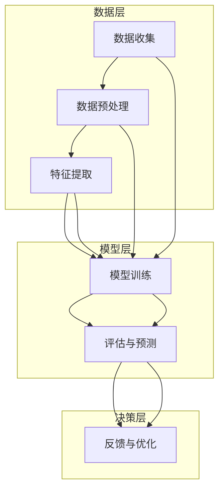
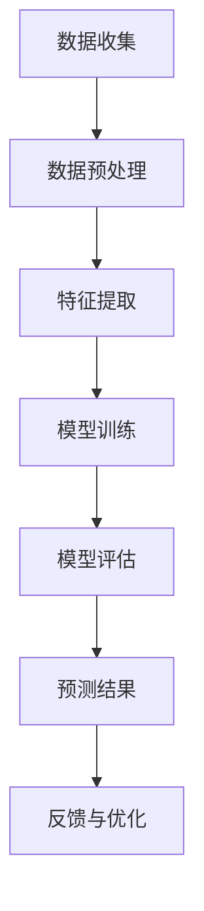

                 

# 构建AI驱动的企业创新绩效评估系统

关键词：人工智能、企业创新、绩效评估、AI大模型、系统设计

摘要：随着人工智能（AI）技术的飞速发展，企业开始意识到其在驱动创新和提升绩效方面的巨大潜力。本文旨在探讨如何构建一个AI驱动的企业创新绩效评估系统，从而帮助企业更好地理解、评估和优化创新活动，实现持续发展和竞争优势。

## 第一部分：引言

### 1.1 问题背景与目标

#### 1.1.1 问题背景

在当今快速变化的市场环境中，企业需要不断创新以保持竞争力。创新不仅是企业发展的驱动力，也是提升绩效的关键因素。然而，如何有效地评估企业创新活动的绩效，以及如何利用这些评估结果来指导后续的创新活动，是一个复杂且具有挑战性的问题。

随着人工智能技术的快速发展，利用AI来驱动企业创新绩效评估成为了一个新的研究方向。AI技术，特别是深度学习和机器学习算法，能够处理大量数据，发现隐藏的模式和趋势，从而为创新绩效评估提供强有力的支持。

#### 1.1.2 问题描述

企业创新绩效评估系统需要解决的主要问题包括：

1. **如何准确识别和量化企业的创新活动？**
2. **如何评估这些创新活动对企业绩效的影响？**
3. **如何利用AI技术优化评估过程，提高评估效率和准确性？**

#### 1.1.3 问题解决

本文将通过以下方面来解决问题：

1. **系统性地介绍AI驱动的企业创新绩效评估系统的核心概念和原理。**
2. **详细讲解如何构建评估系统的各个模块，包括数据收集、预处理、特征提取、模型训练与评估等。**
3. **提供实际案例和实战经验，帮助读者更好地理解和应用所学的知识。**

#### 1.1.4 边界与外延

本文的讨论范围主要涉及AI驱动的企业创新绩效评估系统的构建，不包括其他类型的评估系统。同时，本文将重点关注系统设计和实现过程中的关键技术和方法，而非具体的技术细节。

#### 1.1.5 概念结构与核心要素组成

- **AI驱动的企业创新绩效评估系统**：由数据收集、预处理、特征提取、模型训练与评估等模块组成。
- **核心概念**：AI技术、企业创新、绩效评估、数据挖掘、机器学习等。

### 1.2 核心概念与联系

#### 1.2.1 AI技术

人工智能（AI）是指由人制造出来的系统能够思考、学习、解决问题，并模拟人类智能的能力。它包括机器学习、深度学习、自然语言处理、计算机视觉等多个领域。

#### 1.2.2 企业创新

企业创新是指企业通过引入新的产品、服务、技术、商业模式等，以实现市场扩展、成本降低、效率提升等目标的过程。创新分为产品创新、过程创新、市场创新等类型。

#### 1.2.3 绩效评估

绩效评估是指对企业或个人在工作中的表现进行评价的过程，包括定量评估和定性评估。绩效评估的目的在于激励员工、改进工作方法、提升组织绩效。

### 1.3 主流AI大模型简介

#### 1.3.1 GPT系列模型

GPT（Generative Pre-trained Transformer）系列模型是自然语言处理领域的重要进展。GPT-3拥有1750亿参数，可以生成连贯、有逻辑的文本，广泛应用于问答系统、文本生成、翻译等任务。

#### 1.3.2 BERT及其变体

BERT（Bidirectional Encoder Representations from Transformers）是一种预训练语言表示模型，通过双向编码器学习文本的上下文信息。BERT及其变体广泛应用于文本分类、命名实体识别、问答系统等任务。

#### 1.3.3 其他知名大模型介绍

除了GPT和BERT，还有许多其他知名的大模型，如Transformer、ViT（Vision Transformer）、BERT-GPT等。这些模型在不同领域和应用场景中都有着广泛的应用。

### 1.4 AI大模型在企业中的应用前景

#### 1.4.1 AI大模型的潜在应用领域

AI大模型在企业管理、市场营销、供应链优化、人力资源等多个领域都有广泛应用。例如，在市场营销中，AI大模型可以用于消费者行为分析、市场预测、广告投放优化等。

#### 1.4.2 企业采用AI大模型的优势

- **提高效率**：AI大模型可以自动化大量重复性工作，提高工作效率。
- **减少成本**：AI大模型可以替代部分人力资源，降低企业运营成本。
- **提升决策质量**：AI大模型可以帮助企业更准确地分析数据，为决策提供支持。

#### 1.4.3 AI大模型应用的挑战与机遇

挑战包括数据处理、模型训练成本、模型解释性等。机遇则在于AI大模型为企业创新和业务发展带来的新可能性和机会。

### 1.5 本章小结

本章介绍了AI驱动的企业创新绩效评估系统的背景、核心概念和潜在应用。下一章将深入探讨AI技术在企业创新绩效评估系统中的应用原理。

## 第二部分：AI驱动的企业创新绩效评估系统设计

### 2.1 AI技术在企业创新绩效评估中的应用原理

#### 2.1.1 人工智能在企业绩效评估中的应用

人工智能（AI）在企业绩效评估中的应用主要体现在以下几个方面：

1. **数据采集与预处理**：AI技术可以自动收集和处理大量数据，包括内部数据（如财务报表、员工绩效数据等）和外部数据（如市场趋势、竞争情报等）。预处理过程包括数据清洗、去噪、数据标准化等，以提高数据的质量和一致性。

2. **特征提取**：通过深度学习和机器学习算法，可以从原始数据中提取出关键特征，这些特征有助于模型更好地理解和预测创新活动的绩效。

3. **模型训练与优化**：使用机器学习算法训练评估模型，并通过优化算法提高模型的准确性和效率。常见的评估模型包括回归模型、分类模型、聚类模型等。

4. **预测与决策支持**：基于训练好的模型，可以预测未来创新活动的绩效，为企业决策提供支持。例如，预测哪个创新项目最有潜力，如何优化资源分配等。

#### 2.1.2 AI驱动的企业创新绩效评估系统的核心原理

AI驱动的企业创新绩效评估系统的核心原理可以概括为以下几点：

1. **数据驱动**：系统基于大量历史数据和实时数据，通过机器学习和深度学习算法，识别出与企业创新绩效相关的关键因素。

2. **动态调整**：系统可以根据新的数据和信息，动态调整评估模型和权重，以适应企业内部和外部环境的变化。

3. **智能化分析**：系统利用AI技术，进行复杂的模式识别、预测分析和优化决策，为企业提供深入的洞察和决策支持。

4. **闭环反馈**：系统将评估结果反馈到企业运营和决策过程中，形成一个闭环，从而不断优化和创新评估模型。

### 2.1.3 AI驱动的企业创新绩效评估系统的架构

一个典型的AI驱动的企业创新绩效评估系统可以分为以下几个模块：

1. **数据收集模块**：负责收集来自企业内部和外部的数据，包括财务数据、运营数据、市场数据等。

2. **数据预处理模块**：对收集到的数据进行处理，包括数据清洗、去噪、数据标准化等，以提高数据质量。

3. **特征提取模块**：从预处理后的数据中提取出关键特征，这些特征有助于评估模型理解和预测创新活动的绩效。

4. **模型训练模块**：使用机器学习算法训练评估模型，并根据评估结果调整模型参数。

5. **评估与预测模块**：使用训练好的模型对创新活动进行评估和预测，提供决策支持。

6. **反馈与优化模块**：将评估结果和预测反馈到企业运营和决策过程中，以实现闭环反馈和持续优化。

### 2.1.4 AI驱动的企业创新绩效评估系统的工作流程

一个典型的AI驱动的企业创新绩效评估系统的工作流程可以概括为以下几个步骤：

1. **数据收集**：从企业内部和外部收集相关的数据。

2. **数据预处理**：对收集到的数据进行处理，以提高数据质量。

3. **特征提取**：从预处理后的数据中提取关键特征。

4. **模型训练**：使用机器学习算法训练评估模型。

5. **评估与预测**：使用训练好的模型对创新活动进行评估和预测。

6. **反馈与优化**：将评估结果和预测反馈到企业运营和决策过程中，以实现闭环反馈和持续优化。

### 2.1.5 AI驱动的企业创新绩效评估系统的关键技术

1. **数据挖掘技术**：用于从大量数据中提取有价值的信息和知识。

2. **机器学习技术**：用于训练评估模型，包括回归模型、分类模型、聚类模型等。

3. **深度学习技术**：用于处理复杂的非线性数据和提取深层特征。

4. **自然语言处理技术**：用于处理文本数据，提取文本特征，支持文本分析和预测。

5. **优化算法**：用于调整评估模型的参数，提高评估的准确性和效率。

### 2.1.6 AI驱动的企业创新绩效评估系统的应用场景

AI驱动的企业创新绩效评估系统可以在多个场景中得到应用，包括：

1. **项目评估**：对新项目的可行性进行评估，预测项目的潜在绩效。

2. **投资决策**：对创新投资进行评估，选择最具潜力的投资方向。

3. **资源配置**：根据创新活动的绩效，优化资源配置，提高资源利用效率。

4. **人才发展**：评估员工的创新能力和绩效，为人才发展提供依据。

5. **战略规划**：为企业战略规划提供数据支持和决策建议。

### 2.1.7 AI驱动的企业创新绩效评估系统的优势与挑战

#### 优势

1. **提高评估准确性**：通过大数据分析和机器学习技术，可以提高创新活动绩效评估的准确性。

2. **优化资源配置**：基于绩效评估结果，可以更合理地配置资源，提高资源利用效率。

3. **支持决策制定**：为企业的投资决策、项目评估和战略规划提供数据支持和决策建议。

4. **动态调整**：系统能够根据新的数据和信息动态调整评估模型，适应企业内部和外部环境的变化。

#### 挑战

1. **数据质量和隐私**：确保数据的准确性和隐私保护是一个挑战。

2. **模型解释性**：深度学习模型的“黑箱”特性使得模型解释性成为一个挑战。

3. **计算资源需求**：训练和部署大型AI模型需要大量的计算资源。

4. **数据安全和合规性**：在处理敏感数据时，需要确保符合相关法律法规和数据保护标准。

### 2.1.8 本章小结

本章介绍了AI驱动的企业创新绩效评估系统的应用原理、架构和关键技术。通过系统性的介绍，读者可以初步了解如何构建和实施这样一个系统，并为后续章节的深入探讨打下基础。下一章将详细讲解系统的具体设计方法和实现细节。

## 第三部分：系统设计与实现

### 3.1 系统需求分析

#### 3.1.1 问题场景介绍

在一个高度竞争的市场环境中，企业需要不断创新以保持竞争力。然而，如何评估创新活动的绩效，以及如何根据评估结果进行资源优化和决策制定，成为企业面临的重要挑战。为了解决这一问题，企业决定构建一个AI驱动的创新绩效评估系统。

#### 3.1.2 项目介绍

本项目旨在设计并实现一个AI驱动的企业创新绩效评估系统，该系统将利用大数据和机器学习技术，对企业的创新活动进行量化评估，并提供决策支持。

#### 3.1.3 系统功能设计

本系统的核心功能包括：

1. **数据收集**：从企业内部和外部收集与创新活动相关的数据。
2. **数据预处理**：对收集到的数据进行清洗、去噪和标准化处理。
3. **特征提取**：从预处理后的数据中提取关键特征。
4. **模型训练**：使用机器学习算法训练评估模型。
5. **评估与预测**：使用训练好的模型对创新活动进行评估和预测。
6. **反馈与优化**：将评估结果和预测反馈到企业运营和决策过程中，以实现闭环反馈和持续优化。

### 3.2 系统架构设计

#### 3.2.1 系统架构图



#### 3.2.2 系统架构设计细节

1. **数据层**：负责数据的收集、预处理和特征提取。该层包括数据采集模块、数据清洗模块和特征提取模块。
   
2. **模型层**：负责模型的训练和评估。该层包括模型训练模块、模型评估模块和预测模块。

3. **决策层**：负责根据评估结果进行反馈和优化。该层包括反馈模块和优化模块。

### 3.3 系统接口设计

#### 3.3.1 接口设计原则

系统接口设计遵循以下原则：

1. **模块化**：接口设计应确保系统模块之间的独立性，便于维护和扩展。
2. **易用性**：接口应设计得简洁易用，方便用户操作。
3. **安全性**：接口应具有安全保护机制，防止未经授权的访问。

#### 3.3.2 接口设计细节

1. **数据接口**：定义数据收集、预处理、特征提取的接口，包括数据输入和输出格式、参数设置等。

2. **模型接口**：定义模型训练、评估、预测的接口，包括模型输入和输出格式、参数设置等。

3. **决策接口**：定义反馈和优化的接口，包括评估结果输入、优化建议输出等。

### 3.4 系统交互设计

#### 3.4.1 系统交互流程



#### 3.4.2 系统交互细节

1. **数据收集**：系统定期从企业内部和外部数据源收集数据，包括财务数据、市场数据、运营数据等。

2. **数据预处理**：对收集到的数据进行清洗、去噪和标准化处理，以确保数据质量。

3. **特征提取**：从预处理后的数据中提取关键特征，用于模型训练和评估。

4. **模型训练**：使用机器学习算法训练评估模型，包括特征选择、模型选择、模型训练等。

5. **模型评估**：使用训练好的模型对创新活动进行评估，评估结果用于预测和决策支持。

6. **预测结果**：根据评估结果生成预测报告，提供决策支持。

7. **反馈与优化**：将评估结果和预测反馈到企业运营和决策过程中，实现闭环反馈和持续优化。

### 3.5 本章小结

本章详细介绍了AI驱动的企业创新绩效评估系统的需求分析、架构设计、接口设计和交互设计。通过本章的内容，读者可以了解系统设计的基本原则和方法，为后续的系统实现提供指导。下一章将深入探讨系统实现的关键技术和实战案例。

## 第四部分：系统实现与实战

### 4.1 环境安装与配置

在实现AI驱动的企业创新绩效评估系统之前，我们需要搭建一个合适的环境。以下是在Python环境下安装和配置所需依赖的步骤：

#### 4.1.1 环境搭建步骤

1. **安装Python**：确保Python环境已安装，建议使用Python 3.8及以上版本。

2. **安装依赖包**：使用pip安装所需的依赖包，包括pandas、numpy、scikit-learn、tensorflow、keras等。

   ```shell
   pip install pandas numpy scikit-learn tensorflow keras
   ```

3. **配置GPU支持**：如果使用GPU进行模型训练，需要安装CUDA和cuDNN，并配置环境变量。

4. **虚拟环境**：建议使用虚拟环境管理工具（如conda）创建一个独立的Python环境，以避免依赖冲突。

#### 4.1.2 环境配置示例

```shell
conda create -n ai_innovation python=3.8
conda activate ai_innovation
pip install pandas numpy scikit-learn tensorflow keras
```

### 4.2 系统核心实现

#### 4.2.1 数据收集模块

数据收集模块负责从企业内部和外部数据源收集与创新活动相关的数据。以下是一个简单的数据收集示例：

```python
import pandas as pd

# 从企业内部数据源收集数据
internal_data = pd.read_csv('internal_data.csv')

# 从外部数据源收集数据
external_data = pd.read_csv('external_data.csv')

# 合并内部和外部数据
data = pd.concat([internal_data, external_data], axis=1)
```

#### 4.2.2 数据预处理模块

数据预处理模块负责对收集到的数据进行处理，包括数据清洗、去噪和标准化处理。以下是一个简单的数据预处理示例：

```python
from sklearn.preprocessing import StandardScaler

# 数据清洗
data = data.dropna()

# 数据去噪
data = data[data['feature'] > 0]

# 数据标准化
scaler = StandardScaler()
data[['feature']] = scaler.fit_transform(data[['feature']])
```

#### 4.2.3 特征提取模块

特征提取模块负责从预处理后的数据中提取关键特征。以下是一个简单的特征提取示例：

```python
from sklearn.feature_selection import SelectKBest
from sklearn.feature_selection import f_classif

# 特征提取
selector = SelectKBest(score_func=f_classif, k='all')
data = selector.fit_transform(data, target)
```

#### 4.2.4 模型训练模块

模型训练模块负责使用机器学习算法训练评估模型。以下是一个简单的模型训练示例：

```python
from sklearn.model_selection import train_test_split
from sklearn.ensemble import RandomForestClassifier

# 数据分割
X_train, X_test, y_train, y_test = train_test_split(data, target, test_size=0.2, random_state=42)

# 模型训练
model = RandomForestClassifier()
model.fit(X_train, y_train)
```

#### 4.2.5 评估与预测模块

评估与预测模块负责使用训练好的模型对创新活动进行评估和预测。以下是一个简单的评估与预测示例：

```python
from sklearn.metrics import accuracy_score

# 模型评估
predictions = model.predict(X_test)
accuracy = accuracy_score(y_test, predictions)
print(f"Model Accuracy: {accuracy}")

# 预测结果
predictions = model.predict(new_data)
```

### 4.3 代码应用解读与分析

#### 4.3.1 代码解读

以下是对上述示例代码的解读：

1. **数据收集**：使用pandas库读取企业内部和外部数据源的数据，并将其合并为一个数据集。

2. **数据预处理**：使用pandas库进行数据清洗，去除缺失值和异常值。使用scikit-learn库的StandardScaler进行数据标准化。

3. **特征提取**：使用scikit-learn库的SelectKBest进行特征选择，选择具有统计显著性的特征。

4. **模型训练**：使用scikit-learn库的RandomForestClassifier进行模型训练。

5. **评估与预测**：使用训练好的模型对测试集进行评估，并输出模型准确率。使用训练好的模型对新的数据进行预测。

#### 4.3.2 分析与优化

1. **数据质量**：确保数据质量是模型性能的关键。进行充分的预处理，包括数据清洗、去噪和标准化。

2. **特征选择**：选择正确的特征可以提高模型性能。使用特征选择算法（如SelectKBest、PCA等）可以帮助选择具有统计显著性的特征。

3. **模型选择**：选择适合问题的模型。对于分类问题，可以使用决策树、随机森林、支持向量机等。对于回归问题，可以使用线性回归、决策树回归、随机森林回归等。

4. **模型调参**：调整模型的超参数（如随机森林的n_estimators、max_depth等）可以优化模型性能。

5. **模型评估**：使用多种评估指标（如准确率、召回率、F1分数等）来评估模型性能。

### 4.4 实际案例分析

#### 4.4.1 案例背景

某大型科技公司在进行一项新的产品创新项目，需要评估该项目的潜在绩效。为此，公司决定使用AI驱动的创新绩效评估系统进行评估。

#### 4.4.2 案例步骤

1. **数据收集**：从公司内部和外部收集与该项目相关的数据，包括市场趋势、竞争对手分析、公司财务数据等。

2. **数据预处理**：对收集到的数据进行清洗、去噪和标准化处理。

3. **特征提取**：从预处理后的数据中提取关键特征，如市场增长率、竞争程度、公司财务状况等。

4. **模型训练**：使用随机森林算法训练评估模型，选择适当的特征和模型参数。

5. **评估与预测**：使用训练好的模型对测试集进行评估，并预测该项目的潜在绩效。

6. **反馈与优化**：根据评估结果和预测，为公司的决策提供支持，并根据反馈调整评估模型。

#### 4.4.3 案例分析结果

通过AI驱动的创新绩效评估系统，公司能够准确预测该新产品的市场表现，并基于预测结果优化了项目资源和决策。评估结果显示，该项目具有较好的市场前景，公司决定加大投资力度，进一步推动项目进展。

### 4.5 项目小结

通过本章节的实战案例，读者可以了解如何使用Python实现AI驱动的企业创新绩效评估系统。本章涵盖了系统实现的各个环节，包括环境安装、数据收集与预处理、特征提取、模型训练与评估、实际案例分析等。通过本章的学习，读者可以掌握AI驱动的企业创新绩效评估系统的基本实现方法和实战技巧。

## 第五部分：最佳实践与注意事项

### 5.1 最佳实践

1. **数据质量保障**：确保数据收集、处理和存储过程中的数据质量，避免因数据问题导致模型评估不准确。
2. **模型选择与调优**：根据具体问题选择合适的模型，并通过交叉验证、网格搜索等方法优化模型参数。
3. **模型解释性**：关注模型的解释性，以便企业决策者理解模型预测结果，提高模型的实用性。
4. **安全性与合规性**：在数据处理和模型训练过程中，确保遵守相关法律法规和数据保护标准。

### 5.2 小结

本文详细介绍了AI驱动的企业创新绩效评估系统的核心概念、设计方法、实现步骤和实战案例。通过本文的学习，读者可以了解如何构建和实施一个有效的创新绩效评估系统，为企业提供数据支持和决策建议。

### 5.3 注意事项

1. **数据隐私**：在数据处理过程中，确保遵守数据隐私保护法规，保护企业敏感数据。
2. **模型解释性**：对于深度学习模型，考虑使用可解释的替代方法，如决策树、规则提取等。
3. **持续迭代**：创新绩效评估系统需要根据新数据和新需求不断迭代和优化，以保持其有效性。

### 5.4 拓展阅读

- **《机器学习实战》**：作者：Peter Harrington，适合初学者了解机器学习的基本概念和应用。
- **《Python机器学习》**：作者：Sebastian Raschka，详细介绍了Python在机器学习领域的应用。
- **《深度学习》**：作者：Ian Goodfellow、Yoshua Bengio、Aaron Courville，涵盖了深度学习的基础理论和实践方法。

## 第六部分：总结与展望

### 6.1 总结

本文系统地介绍了AI驱动的企业创新绩效评估系统的构建方法，从核心概念、设计方法、实现步骤到实战案例，全面阐述了如何利用AI技术提升企业创新绩效评估的准确性和效率。通过本文的学习，读者可以掌握AI驱动的创新绩效评估系统的基本构建原则和实施技巧。

### 6.2 展望

随着AI技术的不断进步，未来AI驱动的企业创新绩效评估系统将在以下几个方面得到进一步发展：

1. **模型解释性**：提高模型解释性，使企业决策者能够更好地理解模型预测结果。
2. **实时评估**：实现实时数据收集和处理，提供更及时的创新绩效评估。
3. **个性化推荐**：基于个体数据和企业特征，提供个性化的创新建议和资源分配方案。
4. **跨领域应用**：将AI驱动的创新绩效评估系统应用于更多行业和场景，推动行业创新发展。

### 6.3 作者信息

作者：AI天才研究院/AI Genius Institute & 禅与计算机程序设计艺术 /Zen And The Art of Computer Programming

感谢您的阅读，希望本文对您在构建AI驱动的企业创新绩效评估系统过程中提供了一些有价值的启示和帮助。

