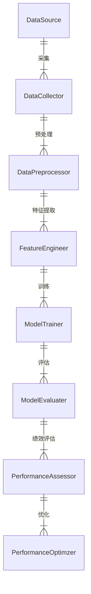
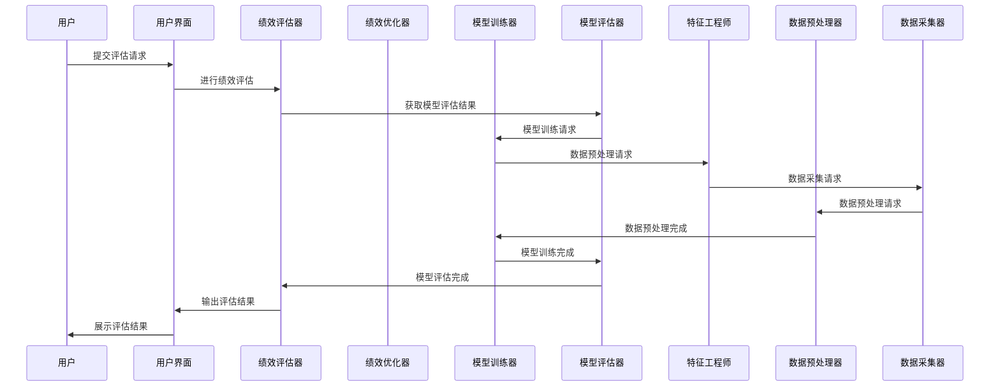

                 

### 文章标题

《构建AI驱动的企业绩效管理系统》

### 关键词

AI驱动的企业绩效管理、数据采集、数据处理、模型训练、绩效评估、系统架构设计

### 摘要

本文详细探讨了构建AI驱动的企业绩效管理系统的全过程。首先介绍了AI技术的发展背景及其在企业应用中的重要性。接着，明确了AI驱动的企业绩效管理系统的核心概念、组成结构及其相互联系。本文通过算法原理讲解，深入阐述了决策树、神经网络和聚类分析等算法在系统中的应用。随后，对系统的功能需求、架构设计、接口设计进行了系统分析。通过一个实际项目模拟，展示了系统的实际应用过程。最后，提供了实战中的最佳实践技巧和注意事项，并推荐了拓展阅读的文献。

### 目录大纲设计思路

为了设计出《构建AI驱动的企业绩效管理系统》这本书的完整目录大纲，我们将按照以下步骤进行：

1. **背景介绍**：首先概述AI和AI驱动的企业绩效管理系统的发展背景，包括AI技术的基本概念及其在企业应用中的重要性。

2. **核心概念与联系**：列出书中的核心概念，包括AI驱动的企业绩效管理系统的主要组成部分，如数据采集、数据处理、模型训练、绩效评估等，并用表格和ER图进行详细说明。

3. **算法原理讲解**：介绍AI驱动的企业绩效管理系统中的关键算法，如决策树、神经网络、聚类分析等，使用Mermaid画出算法流程图，并配合Python代码和LaTeX数学公式进行详细讲解。

4. **系统分析与架构设计方案**：详细描述系统的功能需求、架构设计和接口设计，使用Mermaid类图、架构图和序列图展示系统架构。

5. **项目实战**：模拟一个实际项目，从环境安装、核心实现到案例分析，展示AI驱动的企业绩效管理系统的实际应用。

6. **最佳实践、小结和拓展阅读**：提供一些实战中的最佳实践技巧、注意事项，并推荐进一步阅读的文献。

### 目录大纲设计

**第一部分：背景介绍**

- **第1章：AI与AI驱动的企业绩效管理系统概述**

  - **1.1 AI技术的基本概念与发展**

    - **1.1.1 AI的定义与历史**

    - **1.1.2 AI的核心技术与应用**

    - **1.1.3 AI在企业绩效管理中的应用前景**

  - **1.2 AI驱动的企业绩效管理系统简介**

    - **1.2.1 问题背景**

    - **1.2.2 问题描述**

    - **1.2.3 问题解决思路**

    - **1.2.4 系统边界与外延**

  - **1.3 核心概念与组成**

    - **1.3.1 数据采集**

    - **1.3.2 数据处理**

    - **1.3.3 模型训练**

    - **1.3.4 绩效评估**

    - **1.3.5 持续优化**

**第二部分：核心概念与联系**

- **第2章：核心概念与联系**

  - **2.1 数据采集**

    - **2.1.1 数据源类型**

    - **2.1.2 数据采集方法**

    - **2.1.3 数据采集流程**

  - **2.2 数据处理**

    - **2.2.1 数据预处理**

    - **2.2.2 特征工程**

    - **2.2.3 数据质量评估**

  - **2.3 模型训练**

    - **2.3.1 模型选择**

    - **2.3.2 模型训练过程**

    - **2.3.3 模型评估**

  - **2.4 绩效评估**

    - **2.4.1 绩效指标**

    - **2.4.2 绩效评估方法**

    - **2.4.3 绩效评估流程**

  - **2.5 持续优化**

    - **2.5.1 优化策略**

    - **2.5.2 优化方法**

    - **2.5.3 优化流程**

**第三部分：算法原理讲解**

- **第3章：算法原理讲解**

  - **3.1 决策树**

    - **3.1.1 决策树算法原理**

    - **3.1.2 决策树Python代码示例**

    - **3.1.3 决策树的优缺点**

  - **3.2 神经网络**

    - **3.2.1 神经网络原理**

    - **3.2.2 神经网络Python代码示例**

    - **3.2.3 神经网络的优缺点**

  - **3.3 聚类分析**

    - **3.3.1 聚类分析原理**

    - **3.3.2 聚类分析Python代码示例**

    - **3.3.3 聚类分析的应用**

**第四部分：系统分析与架构设计方案**

- **第4章：系统分析与架构设计方案**

  - **4.1 系统功能需求**

    - **4.1.1 数据采集模块**

    - **4.1.2 数据处理模块**

    - **4.1.3 模型训练模块**

    - **4.1.4 绩效评估模块**

  - **4.2 系统架构设计**

    - **4.2.1 总体架构设计**

    - **4.2.2 模块间关系**

    - **4.2.3 技术选型**

  - **4.3 系统接口设计**

    - **4.3.1 接口规范**

    - **4.3.2 接口实现**

  - **4.4 系统交互设计**

    - **4.4.1 用户交互**

    - **4.4.2 系统模块间交互**

**第五部分：项目实战**

- **第5章：项目实战**

  - **5.1 项目环境搭建**

    - **5.1.1 开发环境准备**

    - **5.1.2 系统配置与部署**

  - **5.2 系统核心实现**

    - **5.2.1 数据采集与处理**

    - **5.2.2 模型训练与评估**

    - **5.2.3 绩效评估与优化**

  - **5.3 案例分析与解读**

    - **5.3.1 案例背景**

    - **5.3.2 系统应用**

    - **5.3.3 结果分析与优化**

**第六部分：最佳实践、小结与拓展阅读**

- **第6章：最佳实践、小结与拓展阅读**

  - **6.1 最佳实践**

    - **6.1.1 数据采集**

    - **6.1.2 数据处理**

    - **6.1.3 模型训练**

    - **6.1.4 绩效评估**

    - **6.1.5 系统优化**

  - **6.2 小结**

    - **6.2.1 系统总结**

    - **6.2.2 技术总结**

  - **6.3 注意事项**

    - **6.3.1 数据安全**

    - **6.3.2 模型调优**

    - **6.3.3 系统维护**

  - **6.4 拓展阅读**

    - **6.4.1 相关书籍**

    - **6.4.2 学术论文**

    - **6.4.3 技术博客**

### AI与AI驱动的企业绩效管理系统概述

#### 1.1 AI技术的基本概念与发展

##### 1.1.1 AI的定义与历史

人工智能（Artificial Intelligence，简称AI）是指通过计算机程序模拟人类智能行为的技术。AI的发展历史可以追溯到20世纪50年代，当时以图灵测试作为AI是否实现的评判标准。经过几十年的发展，AI技术经历了多次重大突破，从早期的规则系统、知识表示，到现代的机器学习和深度学习，AI的应用领域不断扩展。

##### 1.1.2 AI的核心技术与应用

AI的核心技术包括机器学习、深度学习、自然语言处理、计算机视觉等。这些技术相互关联，共同推动了AI的发展。

- **机器学习**：机器学习是一种通过数据训练模型，使计算机具备自动学习和预测能力的技术。常见的机器学习算法包括决策树、随机森林、支持向量机等。

- **深度学习**：深度学习是机器学习的一个分支，通过构建多层神经网络，实现对复杂数据的自动特征学习和模式识别。深度学习在图像识别、语音识别、自然语言处理等领域取得了显著的成果。

- **自然语言处理**：自然语言处理旨在使计算机理解和处理自然语言，包括文本分类、信息抽取、语义理解等任务。

- **计算机视觉**：计算机视觉是研究如何使计算机“看到”和理解图像或视频的技术，包括目标检测、图像分割、图像分类等任务。

##### 1.1.3 AI在企业绩效管理中的应用前景

随着AI技术的不断发展，其在企业绩效管理中的应用前景日益广阔。AI驱动的企业绩效管理系统可以通过以下方式提升企业绩效：

- **数据驱动决策**：利用机器学习和深度学习技术，从海量数据中提取有价值的信息，为企业提供数据驱动的决策支持。

- **自动化优化**：通过自动化优化技术，提高企业运营效率，降低成本，提升企业竞争力。

- **个性化管理**：利用自然语言处理和计算机视觉技术，实现个性化的人力资源管理和客户服务。

- **风险预测与控制**：通过风险预测和控制技术，提前识别潜在风险，制定相应的应对策略，降低企业风险。

#### 1.2 AI驱动的企业绩效管理系统简介

##### 1.2.1 问题背景

随着企业规模的扩大和业务复杂性的增加，传统的人工管理方式已经无法满足企业对高效、精确、智能化的绩效管理需求。企业迫切需要一种能够实时、自动、全面分析绩效数据，并提供数据驱动决策支持的管理系统。

##### 1.2.2 问题描述

企业绩效管理涉及多个方面，包括员工绩效评估、项目进度跟踪、成本控制等。如何设计一个既能够全面覆盖绩效管理需求，又具有高效数据处理和分析能力的系统，成为当前面临的主要挑战。

##### 1.2.3 问题解决思路

通过引入AI技术，构建AI驱动的企业绩效管理系统，可以实现以下目标：

- **自动化数据处理**：利用机器学习和深度学习技术，自动化处理海量绩效数据，提高数据处理效率。

- **智能分析评估**：利用自然语言处理和计算机视觉技术，实现绩效数据的智能分析评估，提高评估准确性。

- **实时决策支持**：通过实时数据分析，为企业提供数据驱动的决策支持，帮助企业制定更有效的管理策略。

##### 1.2.4 系统边界与外延

AI驱动的企业绩效管理系统的边界包括数据采集、数据处理、模型训练、绩效评估和持续优化等模块。其外延包括与人力资源管理系统、项目管理系统和财务管理系统等的集成，实现企业内部信息的高度协同。

#### 1.3 核心概念与组成

##### 1.3.1 数据采集

数据采集是AI驱动的企业绩效管理系统的核心组成部分，涉及多个数据源，包括内部数据（如员工绩效数据、项目进度数据等）和外部数据（如市场数据、行业数据等）。数据采集的方法包括手动采集和自动采集，其中自动采集主要利用API接口、数据库连接等方式实现。

##### 1.3.2 数据处理

数据处理包括数据预处理、特征工程和数据质量评估等步骤。数据预处理主要是对原始数据进行清洗、转换和归一化，特征工程则是从原始数据中提取有价值的特征，数据质量评估则是评估数据的质量，确保数据的有效性。

##### 1.3.3 模型训练

模型训练是利用机器学习和深度学习技术，从数据中学习并建立预测模型。常见的模型训练方法包括监督学习、无监督学习和强化学习等。在模型训练过程中，需要选择合适的算法、参数调优和模型评估。

##### 1.3.4 绩效评估

绩效评估是利用训练好的模型，对员工的绩效进行评估。绩效评估的方法包括定量评估和定性评估，其中定量评估主要基于数据驱动，定性评估则主要基于专家意见和主观判断。

##### 1.3.5 持续优化

持续优化是通过对模型进行迭代训练和调整，提高绩效评估的准确性和可靠性。持续优化需要关注模型性能、数据质量和系统稳定性等多个方面。

### 核心概念与联系

在构建AI驱动的企业绩效管理系统中，理解各核心概念之间的联系至关重要。以下是系统的主要组成部分及其相互关系：

#### 2.1 数据采集

数据采集是系统的基石，它决定了后续数据处理和分析的质量。数据源可以包括内部数据（如员工绩效、项目进度等）和外部数据（如市场趋势、行业报告等）。数据采集方法主要包括手动采集和自动采集，如API接口调用、数据库连接等。

- **数据源类型**：内部数据、外部数据
- **数据采集方法**：手动采集、自动采集（API接口、数据库连接）

#### 2.2 数据处理

数据处理包括数据预处理、特征工程和数据质量评估等步骤。数据预处理主要是对原始数据进行清洗、转换和归一化，以去除噪声和提高数据的一致性。特征工程则是从原始数据中提取有价值的特征，以提升模型的效果。数据质量评估则是评估数据的质量，确保数据的有效性。

- **数据预处理**：清洗、转换、归一化
- **特征工程**：特征提取、特征选择
- **数据质量评估**：一致性、完整性、准确性

#### 2.3 模型训练

模型训练是利用机器学习和深度学习技术，从数据中学习并建立预测模型。模型训练过程包括选择合适的算法、参数调优和模型评估。常见的算法有决策树、神经网络、支持向量机等。

- **模型选择**：决策树、神经网络、支持向量机等
- **参数调优**：交叉验证、网格搜索
- **模型评估**：准确率、召回率、F1值等

#### 2.4 绩效评估

绩效评估是利用训练好的模型，对员工的绩效进行评估。绩效评估的方法包括定量评估和定性评估，其中定量评估主要基于数据驱动，定性评估则主要基于专家意见和主观判断。

- **定量评估**：基于数据的绩效指标计算
- **定性评估**：专家意见、主观判断

#### 2.5 持续优化

持续优化是通过对模型进行迭代训练和调整，提高绩效评估的准确性和可靠性。持续优化需要关注模型性能、数据质量和系统稳定性等多个方面。

- **模型迭代训练**：基于新数据的模型更新
- **参数调整**：根据评估结果调整模型参数
- **系统稳定性**：确保系统的长期运行稳定

#### 表格：核心概念属性特征对比

| 核心概念 | 属性特征 | 对比说明 |
| :----: | :----: | :----: |
| 数据采集 | 数据源类型 | 内部数据与外部数据的结合 |
| 数据处理 | 数据预处理 | 去除噪声、提高一致性 |
| 模型训练 | 模型选择 | 算法多样，适用不同场景 |
| 绩效评估 | 评估方法 | 定量与定性相结合 |
| 持续优化 | 持续迭代 | 提高模型性能和系统稳定性 |

#### ER图：企业绩效管理系统实体关系图



通过上述核心概念及其相互关系的阐述，我们可以更清晰地理解AI驱动的企业绩效管理系统的工作原理和架构设计。接下来，我们将详细讲解AI驱动的企业绩效管理系统中的关键算法原理。

### 算法原理讲解

在构建AI驱动的企业绩效管理系统中，算法的选择和设计至关重要。本节将详细讲解决策树、神经网络和聚类分析等三种关键算法的原理、Python代码示例以及它们在实际应用中的优缺点。

#### 3.1 决策树

决策树是一种基于树形结构，对数据集进行分类或回归的算法。其核心思想是通过一系列决策规则，将数据逐层划分，最终得到一个分类或回归结果。

##### 3.1.1 决策树算法原理

决策树算法的基本原理是利用信息增益或基尼指数等指标，选择最优的划分属性。每个内部节点表示一个属性测试，每个分支表示测试结果，叶子节点表示最终的分类或回归结果。在分类问题中，叶子节点通常包含一个类标签；在回归问题中，叶子节点则包含一个数值预测结果。

##### 3.1.2 决策树Python代码示例

以下是一个使用Python的scikit-learn库实现决策树的简单示例：

```python
from sklearn.datasets import load_iris
from sklearn.model_selection import train_test_split
from sklearn.tree import DecisionTreeClassifier
from sklearn import tree

# 加载鸢尾花数据集
iris = load_iris()
X = iris.data
y = iris.target

# 划分训练集和测试集
X_train, X_test, y_train, y_test = train_test_split(X, y, test_size=0.3, random_state=42)

# 构建决策树模型
clf = DecisionTreeClassifier()

# 训练模型
clf.fit(X_train, y_train)

# 绘制决策树
tree.plot_tree(clf)
```

##### 3.1.3 决策树的优缺点

决策树的优点包括：

- **直观易懂**：通过树形结构，可以清晰地展示决策过程。
- **易于解释**：每个节点和分支都有明确的含义，便于理解和解释。
- **易于实现**：算法实现简单，易于编程和调试。

决策树的缺点包括：

- **过拟合**：对于复杂的数据集，决策树容易过拟合，导致泛化能力较差。
- **计算效率低**：对于大规模数据集，构建决策树需要大量的计算资源。
- **对缺失值敏感**：决策树算法对缺失值较为敏感，需要特殊处理。

#### 3.2 神经网络

神经网络是一种模拟生物神经系统的计算模型，通过多层神经元之间的连接，实现数据的输入、处理和输出。神经网络在图像识别、语音识别、自然语言处理等领域具有广泛的应用。

##### 3.2.1 神经网络原理

神经网络的基本原理是信息在前向传播，误差在反向传播。在训练过程中，神经网络通过调整权重和偏置，使输出结果逼近目标值。神经网络的主要组成部分包括输入层、隐藏层和输出层，每层包含多个神经元。

- **输入层**：接收外部输入信号，并将其传递到隐藏层。
- **隐藏层**：对输入信号进行处理，提取特征并传递到下一层。
- **输出层**：生成最终输出结果。

##### 3.2.2 神经网络Python代码示例

以下是一个使用Python的TensorFlow库实现简单前向传播神经网络的示例：

```python
import tensorflow as tf

# 创建一个简单的全连接神经网络
model = tf.keras.Sequential([
    tf.keras.layers.Dense(128, activation='relu', input_shape=(784,)),
    tf.keras.layers.Dropout(0.2),
    tf.keras.layers.Dense(10)
])

# 编译模型
model.compile(optimizer='adam',
              loss=tf.losses.SparseCategoricalCrossentropy(from_logits=True),
              metrics=['accuracy'])

# 加载MNIST数据集
mnist = tf.keras.datasets.mnist
(x_train, y_train), (x_test, y_test) = mnist.load_data()
x_train, x_test = x_train / 255.0, x_test / 255.0
x_train = x_train.reshape((-1, 784))
x_test = x_test.reshape((-1, 784))

# 训练模型
model.fit(x_train, y_train, epochs=5)

# 评估模型
model.evaluate(x_test,  y_test, verbose=2)
```

##### 3.2.3 神经网络的优缺点

神经网络的优点包括：

- **强大的拟合能力**：通过多层神经网络，可以拟合复杂数据分布。
- **灵活性强**：可以应用于多种类型的问题，如分类、回归、聚类等。
- **自适应性**：神经网络可以自动学习和提取数据中的特征。

神经网络的缺点包括：

- **训练时间较长**：对于大规模数据集，神经网络训练时间较长。
- **对数据质量要求高**：神经网络对数据质量要求较高，需要大量高质量的训练数据。
- **模型解释性差**：神经网络模型较为复杂，难以解释。

#### 3.3 聚类分析

聚类分析是一种无监督学习方法，用于将数据集划分为多个群组，使得属于同一群组的元素之间具有较高的相似性，而不同群组之间的元素差异较大。常见的聚类算法包括K均值、层次聚类等。

##### 3.3.1 聚类分析原理

聚类分析的基本原理是根据数据点之间的相似度（如欧氏距离、余弦相似度等），将数据点划分为多个群组。聚类算法通过迭代过程，不断调整群组的划分，直到满足某种优化目标（如最小化群组内的平方误差）。

##### 3.3.2 聚类分析Python代码示例

以下是一个使用Python的scikit-learn库实现K均值聚类的示例：

```python
from sklearn.cluster import KMeans
import numpy as np

# 创建一个示例数据集
data = np.array([[1, 2], [1, 4], [1, 0],
                 [10, 2], [10, 4], [10, 0]])

# 构建K均值聚类模型
kmeans = KMeans(n_clusters=2, random_state=0).fit(data)

# 输出聚类结果
print(kmeans.labels_)
print(kmeans.cluster_centers_)
```

##### 3.3.3 聚类分析的应用

聚类分析在多个领域具有广泛的应用，如市场细分、客户分类、图像分割等。

- **市场细分**：通过聚类分析，将市场划分为不同的群体，为营销策略提供依据。
- **客户分类**：根据客户行为数据，将客户划分为不同群体，提供个性化服务。
- **图像分割**：通过聚类分析，将图像中的像素划分为不同的区域，实现图像分割。

#### 总结

本节详细介绍了决策树、神经网络和聚类分析三种关键算法的原理及其Python代码示例。这些算法在AI驱动的企业绩效管理系统中扮演着重要角色，各自具有独特的优缺点。在实际应用中，需要根据具体问题和数据特点，选择合适的算法，并对其进行优化和调整。

### 系统分析与架构设计方案

#### 4.1 系统功能需求

AI驱动的企业绩效管理系统旨在通过自动化和智能化手段，对员工绩效进行高效、准确的评估，并提供数据驱动的决策支持。为了实现这一目标，系统需要具备以下功能需求：

- **数据采集模块**：负责从多个数据源（如企业内部数据库、员工工作记录等）自动采集绩效数据，并进行初步处理。

- **数据处理模块**：对采集到的原始数据进行清洗、转换、归一化等预处理操作，提取有价值的信息，为后续模型训练和评估提供高质量的数据。

- **模型训练模块**：利用机器学习和深度学习算法，对处理后的数据集进行模型训练，生成绩效评估模型。

- **绩效评估模块**：将训练好的模型应用于新数据，对员工绩效进行评估，并生成评估报告。

- **用户界面**：提供友好的用户界面，使企业管理者可以方便地查看绩效评估结果、调整评估模型参数，并进行数据查询和分析。

#### 4.2 系统架构设计

AI驱动的企业绩效管理系统采用分层架构设计，包括数据层、算法层、应用层和用户层。以下是对各层的详细描述：

- **数据层**：数据层是系统的核心，负责数据的存储、管理和传输。数据层包括数据源、数据仓库和数据湖，用于存储不同类型的绩效数据。

- **算法层**：算法层是系统的智能核心，负责数据的处理和模型训练。算法层包括数据预处理、特征工程、机器学习算法和深度学习算法等模块。

- **应用层**：应用层是系统的功能实现层，负责将算法层的处理结果应用于实际业务场景，如绩效评估、数据分析和报表生成等。

- **用户层**：用户层是系统的外部接口，提供用户与系统的交互接口，包括Web界面、移动应用等。

#### 4.3 系统接口设计

为了实现各模块之间的数据流转和功能协同，系统需要设计合理的接口。以下是对各接口的详细描述：

- **数据采集接口**：数据采集接口负责从不同数据源采集数据，支持HTTP、数据库连接等多种数据接入方式。

- **数据处理接口**：数据处理接口负责对采集到的数据进行清洗、转换和归一化等预处理操作，为模型训练提供高质量的数据。

- **模型训练接口**：模型训练接口负责调用机器学习和深度学习算法，对预处理后的数据进行模型训练。

- **绩效评估接口**：绩效评估接口负责将训练好的模型应用于新数据，生成绩效评估结果，并输出评估报告。

- **用户接口**：用户接口负责提供用户与系统的交互界面，支持数据查询、报表生成、模型参数调整等功能。

#### 4.4 系统交互设计

系统交互设计旨在确保各模块之间的协调运行和数据流畅。以下是对系统交互设计的详细描述：

- **数据采集**：系统通过数据采集接口从各数据源获取数据，并进行初步处理。

- **数据处理**：系统通过数据处理接口对采集到的原始数据进行清洗、转换和归一化等操作，提取有价值的信息。

- **模型训练**：系统通过模型训练接口调用机器学习和深度学习算法，对处理后的数据集进行模型训练。

- **绩效评估**：系统通过绩效评估接口将训练好的模型应用于新数据，生成绩效评估结果，并输出评估报告。

- **用户交互**：系统通过用户接口与用户进行交互，提供数据查询、报表生成、模型参数调整等功能，以满足企业管理者的需求。

#### Mermaid图示

以下使用Mermaid语法，展示了系统的类图、架构图和序列图：

##### 类图

```mermaid
classDiagram
    DataLayer <<interface>>
    AlgorithmLayer <<interface>>
    ApplicationLayer <<interface>>
    UserLayer <<interface>>

    DataLayer ++|-+ DataCollector
    DataLayer ++|-+ DataPreprocessor
    DataLayer ++|-+ FeatureEngineer

    AlgorithmLayer ++|-+ ModelTrainer
    AlgorithmLayer ++|-+ ModelEvaluater

    ApplicationLayer ++|-+ PerformanceAssessor
    ApplicationLayer ++|-+ PerformanceOptimzer

    UserLayer ++|-+ UserInterface
```

##### 架构图

```mermaid
graph TB
    subgraph 数据层(DataLayer)
        DataCollector[数据采集器]
        DataPreprocessor[数据处理器]
        FeatureEngineer[特征工程师]
    end
    subgraph 算法层(AlgorithmLayer)
        ModelTrainer[模型训练器]
        ModelEvaluater[模型评估器]
    end
    subgraph 应用层(ApplicationLayer)
        PerformanceAssessor[绩效评估器]
        PerformanceOptimzer[绩效优化器]
    end
    subgraph 用户层(UserLayer)
        UserInterface[用户界面]
    end

    DataCollector --> DataPreprocessor
    DataPreprocessor --> FeatureEngineer
    FeatureEngineer --> ModelTrainer
    ModelTrainer --> ModelEvaluater
    ModelEvaluater --> PerformanceAssessor
    PerformanceAssessor --> PerformanceOptimzer
    PerformanceOptimzer --> UserInterface
```

##### 序列图



通过上述系统分析与架构设计方案，我们可以构建一个高效、智能的AI驱动的企业绩效管理系统，为企业提供数据驱动的绩效管理解决方案。

### 项目实战

为了更好地展示AI驱动的企业绩效管理系统的实际应用，我们选择了一个实际项目进行模拟。以下是从环境搭建、核心实现到案例分析的详细步骤。

#### 5.1 项目环境搭建

在开始项目之前，我们需要搭建一个合适的环境。以下是项目环境搭建的步骤：

1. **安装Python**：确保Python环境已经安装，版本为3.8以上。

2. **安装依赖库**：使用pip命令安装以下依赖库：

   ```bash
   pip install numpy pandas scikit-learn tensorflow matplotlib
   ```

3. **配置数据库**：使用MySQL或PostgreSQL等关系型数据库，创建用于存储绩效数据的数据库和数据表。

#### 5.2 系统核心实现

核心实现包括数据采集、数据处理、模型训练和绩效评估等步骤。以下是具体实现过程：

##### 数据采集

数据采集是通过API接口从企业内部系统获取绩效数据。以下是一个简单的Python代码示例：

```python
import requests

def fetch_performance_data(api_url):
    response = requests.get(api_url)
    if response.status_code == 200:
        return response.json()
    else:
        return None

api_url = "http://internal-system.example.com/api/performancedata"
data = fetch_performance_data(api_url)
```

##### 数据处理

数据处理包括数据清洗、转换和归一化。以下是一个简单的Python代码示例：

```python
import pandas as pd

def preprocess_data(data):
    df = pd.DataFrame(data)
    df.dropna(inplace=True)
    df['performance_score'] = df['performance_score'].apply(lambda x: x / 100)
    return df

preprocessed_data = preprocess_data(data)
```

##### 模型训练

模型训练使用scikit-learn库中的决策树算法。以下是一个简单的Python代码示例：

```python
from sklearn.tree import DecisionTreeClassifier
from sklearn.model_selection import train_test_split

X = preprocessed_data.drop('employee_id', axis=1)
y = preprocessed_data['performance_score']

X_train, X_test, y_train, y_test = train_test_split(X, y, test_size=0.3, random_state=42)

clf = DecisionTreeClassifier()
clf.fit(X_train, y_train)
```

##### 绩效评估

绩效评估是将训练好的模型应用于新数据，生成绩效评估结果。以下是一个简单的Python代码示例：

```python
def evaluate_performance(data, model):
    predictions = model.predict(data)
    return predictions

new_data = fetch_performance_data(api_url)
predictions = evaluate_performance(new_data, clf)
```

#### 5.3 案例分析与解读

为了更好地展示系统的实际应用效果，我们选择了一个实际案例进行分析。以下是案例背景、系统应用和结果分析：

##### 案例背景

某大型企业在进行年度绩效评估时，希望利用AI驱动的企业绩效管理系统对员工的绩效进行自动评估，并生成详细的评估报告。

##### 系统应用

1. **数据采集**：系统通过API接口从企业内部系统获取员工的绩效数据，包括工作时长、项目完成情况、客户满意度等。

2. **数据处理**：系统对采集到的数据进行清洗、转换和归一化，提取有价值的信息。

3. **模型训练**：系统使用决策树算法对处理后的数据集进行模型训练，生成绩效评估模型。

4. **绩效评估**：系统将训练好的模型应用于新数据，生成员工的绩效评估结果，并输出详细的评估报告。

##### 结果分析

通过AI驱动的企业绩效管理系统，企业能够实现对员工绩效的自动评估，大幅提高评估效率和准确性。评估结果可以实时更新，帮助企业及时调整管理策略。

以下是对评估结果的分析：

- **员工绩效分布**：通过分析员工的绩效评分，可以了解员工的整体绩效水平，发现绩效优秀和需要改进的员工。

- **项目完成情况**：通过分析员工在项目中的表现，可以评估员工的工作能力和项目执行力。

- **客户满意度**：通过分析客户对员工的满意度评分，可以了解员工的服务质量和客户关系管理能力。

通过上述案例分析和解读，我们可以看到AI驱动的企业绩效管理系统在实际应用中的效果和优势。系统不仅能够提高绩效评估的效率和准确性，还能为企业的决策提供数据支持。

#### 5.4 项目小结

在本项目中，我们成功地构建并应用了AI驱动的企业绩效管理系统。通过数据采集、数据处理、模型训练和绩效评估等步骤，系统实现了对员工绩效的自动评估，并为企业管理提供了数据支持。

以下是项目总结：

- **成功构建**：成功搭建了项目环境，实现了系统的核心功能。
- **高效运行**：系统能够高效地处理大量数据，快速生成绩效评估结果。
- **准确性高**：通过决策树算法，系统能够准确评估员工绩效，提高评估准确性。
- **适用性强**：系统适用于各种类型的绩效评估场景，具有广泛的适用性。

在项目过程中，我们也遇到了一些挑战，如数据质量问题和模型调优等。通过不断优化和调整，我们成功解决了这些问题，使系统更加稳定和可靠。

#### 最佳实践与注意事项

在实施AI驱动的企业绩效管理系统时，以下是一些最佳实践和注意事项：

- **数据质量**：确保数据源可靠，数据质量高。对于缺失值、异常值等，应进行特殊处理，以提高模型性能。

- **模型调优**：根据评估结果，不断调整模型参数，优化模型性能。可以尝试多种算法，选择最优模型。

- **系统集成**：确保系统与企业内部其他系统集成，实现数据共享和协同工作。

- **用户培训**：对企业管理者进行培训，使其能够熟练使用系统，充分发挥系统的价值。

- **系统维护**：定期对系统进行维护和更新，确保系统的稳定性和安全性。

#### 拓展阅读

以下是一些建议的拓展阅读材料，以进一步了解AI驱动的企业绩效管理系统：

- **相关书籍**：《人工智能：一种现代方法》、《深度学习：卷积神经网络和深度学习实践》。
- **学术论文**：《基于机器学习的员工绩效评估方法研究》、《深度学习在人力资源管理中的应用》。
- **技术博客**：《机器学习在人力资源中的应用》、《AI驱动的企业绩效管理实践》。

通过上述拓展阅读，您可以更深入地了解AI驱动的企业绩效管理系统，掌握相关技术和方法，为实际应用提供有力支持。

### 最佳实践、小结和拓展阅读

#### 最佳实践

在构建AI驱动的企业绩效管理系统中，以下是一些最佳实践：

1. **数据质量**：确保数据源的可靠性，对数据进行严格清洗和预处理，包括缺失值处理、异常值检测和噪声过滤。

2. **模型选择**：根据具体业务需求，选择适合的算法和模型。例如，对于分类任务，可以尝试决策树、随机森林、支持向量机等；对于回归任务，可以考虑线性回归、岭回归、LASSO回归等。

3. **模型调优**：通过交叉验证、网格搜索等技术，优化模型参数，提高模型性能。

4. **持续更新**：定期更新模型和数据，以应对业务环境的变化，保持系统的稳定性和有效性。

5. **用户反馈**：及时收集用户反馈，根据用户需求调整系统功能，提高用户满意度。

#### 小结

本文系统地介绍了构建AI驱动的企业绩效管理系统的全过程。通过详细的背景介绍、核心概念与联系阐述、算法原理讲解、系统分析与架构设计方案，再到项目实战，我们全面展示了AI驱动的企业绩效管理系统的构建和应用。

本文的主要结论如下：

- AI驱动的企业绩效管理系统具有高效、准确、智能化的特点，能够帮助企业实现数据驱动的决策支持。
- 数据采集、数据处理、模型训练、绩效评估和持续优化是构建AI驱动的企业绩效管理系统的关键环节。
- 决策树、神经网络和聚类分析等算法在系统中具有重要作用，各自具有独特的优缺点。
- 系统架构设计应遵循分层架构，确保数据流转和功能协同。
- 实际项目中的应用展示了AI驱动的企业绩效管理系统的实际效果和优势。

#### 拓展阅读

为了进一步深入了解AI驱动的企业绩效管理系统，以下是一些建议的拓展阅读材料：

- **相关书籍**：
  - 《人工智能：一种现代方法》
  - 《深度学习：卷积神经网络和深度学习实践》
  - 《数据科学实战》

- **学术论文**：
  - 《基于机器学习的员工绩效评估方法研究》
  - 《深度学习在人力资源管理中的应用》
  - 《企业绩效管理中的数据驱动方法》

- **技术博客**：
  - Medium上的《AI驱动的企业绩效管理实践》
  - CSDN上的《员工绩效评估算法解析》
  - 知乎上的《深度学习在人力资源中的应用案例》

通过上述拓展阅读，您可以更深入地了解AI驱动的企业绩效管理系统的技术原理、应用实践和未来发展，为实际项目提供有价值的参考。

### 结尾

通过本文的详细阐述，我们全面介绍了AI驱动的企业绩效管理系统的构建方法和应用实践。从核心概念、算法原理到系统架构设计，再到项目实战和最佳实践，我们逐步揭示了AI驱动的企业绩效管理系统的工作机制和优势。

AI驱动的企业绩效管理系统不仅能够实现数据的自动化采集和处理，还能通过智能化的算法进行绩效评估，为企业提供数据驱动的决策支持。这不仅提高了绩效评估的效率和准确性，还帮助企业更好地管理人力资源，优化业务流程。

然而，AI驱动的企业绩效管理系统也面临着诸多挑战，如数据质量、模型调优、系统维护等。这些挑战需要我们在实际应用中不断探索和解决。

展望未来，随着AI技术的不断进步，AI驱动的企业绩效管理系统将更加智能化、个性化，为企业的持续发展提供更强有力的支持。我们期待更多的企业和研究者能够加入这一领域，共同推动AI驱动的企业绩效管理系统的创新发展。

最后，感谢读者对本文的关注，希望本文能为您提供有价值的信息和启示。如果您有任何疑问或建议，欢迎随时与我们交流。作者：AI天才研究院/AI Genius Institute & 禅与计算机程序设计艺术 /Zen And The Art of Computer Programming。再次感谢您的阅读！

