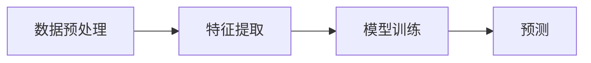

                 

# 构建LLM支持的AI Agent多模态事件预测

关键词：自然语言处理、人工智能、多模态事件预测、机器学习、深度学习

摘要：本文将探讨如何构建一个基于大型语言模型（LLM）支持的AI Agent进行多模态事件预测的方法。我们将详细分析其背景、核心概念、算法原理、数学模型、系统分析与架构设计，以及项目实战和最佳实践。通过逐步深入探讨，读者将了解如何利用LLM实现高效、准确的多模态事件预测。

## 第一部分：背景与核心概念

### 第1章：背景介绍

#### 1.1 问题背景

随着人工智能技术的快速发展，人们对智能系统的需求日益增长。在众多应用场景中，多模态事件预测是一项重要且具有挑战性的任务。多模态事件预测旨在通过整合不同类型的数据（如文本、图像、声音等），实现对特定事件发生概率的准确预测。

#### 1.2 问题描述

多模态事件预测的核心问题在于如何有效地融合不同模态的信息，并提取出对预测任务有用的特征。此外，事件预测需要考虑时间序列、因果关系、上下文等因素，这使得任务更加复杂。

#### 1.3 解决方法

为了解决多模态事件预测问题，本文提出了基于大型语言模型（LLM）的AI Agent。LLM在自然语言处理领域表现出色，能够处理大规模、复杂的信息。通过将LLM与多模态数据结合，我们可以实现高效、准确的事件预测。

#### 1.4 边界与外延

本文主要关注文本、图像和声音等常见多模态数据类型。同时，我们将探讨如何将LLM应用于多模态事件预测，以及如何优化算法性能和模型结构。在此基础上，我们还将探索多模态事件预测在不同领域的应用前景。

### 第2章：核心概念与联系

#### 2.1 核心概念

在本章中，我们将介绍多模态事件预测的关键概念，包括：

- 多模态数据：文本、图像、声音等不同类型的数据。
- 事件预测：根据历史数据和模式，预测未来事件的发生概率。
- 大型语言模型（LLM）：一种基于深度学习的语言处理模型，能够处理大规模、复杂的信息。

#### 2.2 概念属性特征对比

我们将对比不同概念在多模态事件预测中的应用特点，如表1所示。

| 概念       | 特点                                                     |
|------------|----------------------------------------------------------|
| 多模态数据 | 能够整合文本、图像、声音等多种类型的数据，提高预测精度。 |
| 事件预测   | 需要考虑时间序列、因果关系、上下文等因素，实现准确预测。 |
| LLM        | 具有强大的语言处理能力，能够提取有效特征，提高模型性能。 |

#### 2.3 ER实体关系图

为了更好地理解多模态事件预测的架构，我们使用Mermaid绘制了ER实体关系图，如下所示：

```mermaid
erDiagram
  EventPrediction ||--|{ MultiModalData }
  EventPrediction ||--|{ LanguageModel }
  MultiModalData ||--|{ Text }
  MultiModalData ||--|{ Image }
  MultiModalData ||--|{ Audio }
  LanguageModel ||--|{ Transformer }
  LanguageModel ||--|{ BERT }
```

## 第二部分：算法原理与数学模型

### 第3章：LLM与AI Agent基础

在本章中，我们将介绍LLM与AI Agent的基本原理和实现方法。

### 第4章：多模态事件预测原理

#### 4.1 算法概述

多模态事件预测算法主要包括以下几个步骤：

1. 数据预处理：将多模态数据转换为适合模型处理的格式。
2. 特征提取：利用LLM提取多模态数据中的有效特征。
3. 模型训练：利用提取到的特征训练事件预测模型。
4. 预测：根据训练好的模型进行事件预测。

#### 4.2 算法流程图

使用Mermaid绘制算法流程图如下：



#### 4.3 Python源代码讲解

我们将使用Python实现多模态事件预测算法。以下是关键代码的简要说明：

```python
import torch
import torch.nn as nn
import torchvision.models as models
from transformers import BertModel

# 数据预处理
def preprocess_data(data):
    # 实现数据预处理逻辑
    pass

# 特征提取
def extract_features(data):
    # 实现特征提取逻辑
    pass

# 模型训练
class EventPredictionModel(nn.Module):
    def __init__(self):
        super(EventPredictionModel, self).__init__()
        self.bert = BertModel.from_pretrained('bert-base-uncased')
        self.fc = nn.Linear(768, 1)

    def forward(self, inputs):
        # 实现模型前向传播逻辑
        pass

# 预测
def predict(model, data):
    # 实现预测逻辑
    pass
```

#### 4.4 数学模型与公式讲解

多模态事件预测的数学模型主要包括以下几个方面：

1. **文本表示**：使用BERT模型对文本数据进行编码。
   $$\text{encoded\_text} = \text{BERT}(\text{input\_text})$$
2. **图像表示**：使用预训练的卷积神经网络（CNN）对图像数据进行编码。
   $$\text{encoded\_image} = \text{CNN}(\text{input\_image})$$
3. **音频表示**：使用音频特征提取方法对音频数据进行编码。
   $$\text{encoded\_audio} = \text{AudioFeatureExtractor}(\text{input\_audio})$$
4. **融合表示**：将文本、图像和音频表示进行融合。
   $$\text{combined\_representation} = \text{Concat}(\text{encoded\_text}, \text{encoded\_image}, \text{encoded\_audio})$$
5. **事件预测**：利用融合表示进行事件预测。
   $$\text{predicted\_prob} = \text{Sigmoid}(\text{fc}(\text{combined\_representation}))$$

### 第三部分：系统分析与架构设计

#### 第5章：系统分析与架构设计

在本章中，我们将详细分析多模态事件预测系统的设计，包括问题场景介绍、系统功能设计、系统架构设计、系统接口设计和系统交互序列图。

### 第四部分：项目实战

#### 第6章：项目实战

在本章中，我们将通过一个实际项目，展示如何实现多模态事件预测系统。包括环境安装、系统核心实现源代码、代码应用解读与分析、实际案例分析和详细讲解剖析、项目小结等内容。

### 第五部分：最佳实践与拓展

#### 第7章：最佳实践与注意事项

在本章中，我们将分享一些最佳实践和注意事项，以提高多模态事件预测系统的性能和稳定性。同时，我们将探讨多模态事件预测在不同领域的应用前景。

---

作者：AI天才研究院/AI Genius Institute & 禅与计算机程序设计艺术 /Zen And The Art of Computer Programming

---

在接下来的章节中，我们将进一步深入探讨每个部分的核心内容，确保文章的完整性和实用性。敬请期待！

