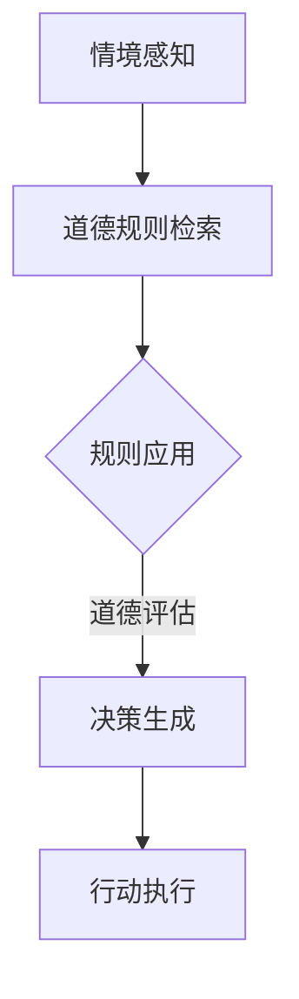
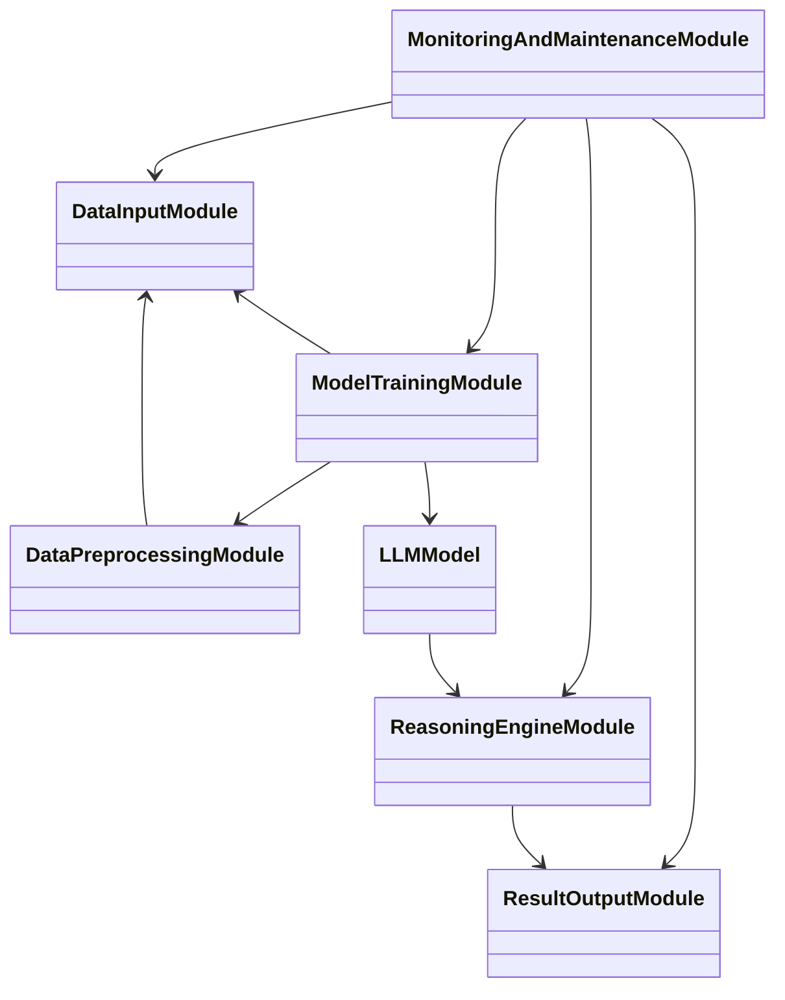

                 

## 引言

### AI Agent与道德推理概述

AI Agent，即人工智能代理，是一种能够执行特定任务的自动化实体。它可以通过感知环境、制定策略并执行行动来完成任务，从而在各个领域中展现出其强大的能力。AI Agent的应用领域广泛，包括但不限于自动驾驶、智能客服、金融风险评估等。然而，随着AI技术的快速发展，如何确保AI Agent在执行任务时能够遵循道德规范，成为一个亟需解决的问题。

道德推理系统是AI Agent的重要组成部分，它负责对AI Agent的行为进行道德判断和指导。道德推理系统不仅要考虑行为的直接后果，还要考虑潜在的社会影响和长期效应。因此，构建一个既强大又符合道德标准的AI Agent道德推理系统，成为当前AI研究的重要课题。

当前，AI Agent道德推理系统的研究主要集中在以下几个方面：一是如何通过大数据和深度学习技术，从大量案例中提取道德规则；二是如何利用逻辑推理和决策理论，对AI Agent的行为进行实时评估和调整；三是如何设计一个灵活且可靠的道德推理框架，以适应不同的应用场景和伦理挑战。

尽管已有一些初步的研究成果，但现有的AI Agent道德推理系统仍存在诸多问题。例如，道德规则的表达和验证是一个复杂的问题，如何确保道德规则的普适性和有效性仍需深入研究。此外，AI Agent在执行任务时的自主性和透明性也备受关注，如何设计一个既能保证AI Agent自主决策，又能确保其行为可解释的系统，也是一个亟待解决的问题。

### LLM基本原理与架构

大型语言模型（LLM，Large Language Model）是近年来自然语言处理（NLP，Natural Language Processing）领域的一个重要突破。LLM通过对海量文本数据的学习，能够理解和生成自然语言，从而在文本生成、机器翻译、问答系统等领域展现出强大的能力。

LLM的工作原理主要基于深度学习，尤其是基于 Transformer 架构的模型。Transformer 模型通过自注意力机制（Self-Attention Mechanism）对输入序列进行建模，从而捕捉序列中不同位置之间的依赖关系。自注意力机制的核心思想是，每个位置能够根据其他所有位置的上下文信息进行动态加权，从而更好地理解输入序列的整体结构。

常见的LLM模型包括GPT（Generative Pre-trained Transformer）系列模型和BERT（Bidirectional Encoder Representations from Transformers）模型。GPT系列模型以生成文本为目标，通过自回归方式（Autoregressive Approach）生成句子。BERT模型则采用双向编码方式，同时捕捉输入序列的前后依赖关系，从而在文本理解任务中表现出色。

### 道德推理系统的设计与实现

道德推理系统的设计与实现是构建LLM支持的AI Agent道德推理系统的关键步骤。道德推理系统需要解决的核心问题是如何从道德规则和现实案例中提取有效的道德知识，并在此基础上进行实时推理和决策。

首先，道德推理系统需要定义一组基本的道德原则和规则。这些原则和规则可以是基于伦理学理论的，也可以是从大量案例中总结出的经验性规则。为了确保这些规则的有效性和普适性，通常需要对规则进行形式化表达，以便进行计算机处理和推理。

接下来，道德推理系统需要构建一个知识库，用于存储和管理这些道德规则。知识库的设计需要考虑规则的表达方式、存储结构以及查询效率。常见的知识库设计方法包括基于关系数据库的表示方法、基于语义网络的表示方法以及基于本体论的表示方法。

在知识库的基础上，道德推理系统需要实现一个推理引擎，用于根据当前情境和道德规则进行推理和决策。推理引擎的设计需要考虑推理算法的效率和准确性。常见的推理算法包括基于逻辑推理的推理算法和基于统计学习的推理算法。

此外，道德推理系统还需要实现一个解释模块，用于对推理过程和结果进行解释，提高AI Agent行为的透明性和可解释性。解释模块可以通过可视化、自然语言生成等方式，将复杂的推理过程和结果转化为易于理解的形式。

### 算法原理与数学模型

在构建LLM支持的AI Agent道德推理系统中，算法原理和数学模型是关键组成部分。以下将详细解释算法的基本步骤、LLM的工作原理、数学模型的推导，并通过mermaid绘制算法流程图和Python代码实例进行说明。

#### 算法原理

道德推理算法的基本步骤可以分为以下几个阶段：

1. **情境感知**：AI Agent通过传感器和输入接口收集当前环境的信息，形成对当前情境的感知。
2. **道德规则检索**：根据当前情境，从知识库中检索相关的道德规则。
3. **规则应用**：对检索到的道德规则进行应用，评估当前行为的道德合理性。
4. **决策生成**：根据道德评估结果，生成具体的行动决策。
5. **行动执行**：AI Agent根据决策执行具体的行动。

#### LLM工作原理

LLM的工作原理基于深度学习，特别是基于Transformer架构的自注意力机制。Transformer模型通过自注意力机制对输入序列进行建模，能够捕捉序列中不同位置之间的依赖关系。

自注意力机制的核心思想是，每个位置能够根据其他所有位置的上下文信息进行动态加权，从而更好地理解输入序列的整体结构。具体来说，自注意力机制包括以下步骤：

1. **词向量化**：将输入序列中的每个词映射为高维向量。
2. **计算自注意力分数**：对于序列中的每个词，计算其与其他所有词之间的注意力分数。
3. **加权求和**：根据自注意力分数对词向量进行加权求和，得到加权后的向量表示。
4. **输出层**：将加权后的向量输入到输出层，生成最终的输出。

#### 数学模型

在LLM中，自注意力机制的数学模型可以表示为：

$$
\text{Attention}(Q, K, V) = \text{softmax}\left(\frac{QK^T}{\sqrt{d_k}}\right)V
$$

其中，Q、K、V分别为查询向量、键向量和值向量，$d_k$为键向量的维度。softmax函数用于计算自注意力分数，确保每个词的注意力分数在0到1之间，且总和为1。

#### mermaid流程图

以下是一个简单的mermaid流程图，展示了道德推理算法的基本流程：



#### Python代码实例

以下是一个简单的Python代码实例，展示了如何使用Transformer模型进行道德推理：

```python
import torch
from transformers import BertModel, BertTokenizer

# 加载预训练的BERT模型和分词器
tokenizer = BertTokenizer.from_pretrained('bert-base-uncased')
model = BertModel.from_pretrained('bert-base-uncased')

# 输入文本
input_text = "AI Agent should not lie."

# 分词并转换为ID序列
input_ids = tokenizer.encode(input_text, return_tensors='pt')

# 过模型进行推理
with torch.no_grad():
    outputs = model(input_ids)

# 获取最后一层的隐藏状态
hidden_states = outputs.last_hidden_state

# 计算自注意力权重
attention_scores = hidden_states[-1][:, 0, :]

# 应用softmax函数得到注意力分数
attention_scores = torch.softmax(attention_scores, dim=1)

# 输出注意力分数
print(attention_scores)
```

通过这个实例，我们可以看到如何使用BERT模型进行文本处理，并计算自注意力权重。这些注意力分数可以用于评估文本中不同部分的相对重要性，从而在道德推理过程中起到关键作用。

### 系统架构与设计

在构建LLM支持的AI Agent道德推理系统时，系统架构与设计是至关重要的。一个良好的系统架构不仅能确保系统的稳定性和可扩展性，还能提高系统的性能和用户体验。以下将详细阐述系统架构的设计原则、功能模块、组件关系以及交互流程。

#### 系统架构设计原则

1. **模块化**：将系统分解为多个功能模块，每个模块负责特定的功能，以提高系统的可维护性和可扩展性。
2. **可扩展性**：系统设计应考虑未来的扩展需求，包括数据量增加、功能扩展等。
3. **高可用性**：系统设计应确保在组件故障或网络不稳定的情况下，系统能够快速恢复，不影响整体服务。
4. **安全性**：系统设计应考虑数据安全性和用户隐私保护，包括加密传输、访问控制等。

#### 功能模块

系统可以划分为以下几个主要功能模块：

1. **数据输入模块**：负责接收外部数据输入，包括传感器数据、用户输入等。
2. **数据预处理模块**：对输入数据进行处理和清洗，使其符合模型输入要求。
3. **模型训练模块**：负责使用预处理后的数据训练LLM模型，包括数据增强、批次训练等。
4. **推理引擎模块**：基于训练好的LLM模型，进行实时道德推理和决策生成。
5. **结果输出模块**：将推理结果转换为用户可理解的形式，如自然语言文本、可视化图表等。
6. **监控与维护模块**：负责监控系统运行状态，包括性能监控、错误日志记录等，并提供维护功能。

#### 组件关系

系统组件之间的关系可以表示为以下类图：



在这个类图中，数据输入模块、数据预处理模块、模型训练模块、LLM模型、推理引擎模块、结果输出模块以及监控与维护模块之间有明确的依赖关系。

#### 系统交互流程

系统交互流程可以表示为以下序列图：

```mermaid
sequenceDiagram
    participant User
    participant DataInputModule
    participant DataPreprocessingModule
    participant ModelTrainingModule
    participant LLMModel
    participant ReasoningEngineModule
    participant ResultOutputModule
    participant MonitoringAndMaintenanceModule

    User->>DataInputModule: 输入数据
    DataInputModule->>DataPreprocessingModule: 处理数据
    DataPreprocessingModule->>ModelTrainingModule: 输出预处理后的数据
    ModelTrainingModule->>LLMModel: 训练模型
    LLMModel->>ReasoningEngineModule: 道德推理
    ReasoningEngineModule->>ResultOutputModule: 输出结果
    MonitoringAndMaintenanceModule->>DataInputModule: 监控数据输入
    MonitoringAndMaintenanceModule->>ModelTrainingModule: 监控模型训练
    MonitoringAndMaintenanceModule->>ReasoningEngineModule: 监控推理过程
    MonitoringAndMaintenanceModule->>ResultOutputModule: 监控结果输出
end
```

在这个序列图中，用户输入数据，经过数据输入模块处理，然后由数据预处理模块预处理，接着模型训练模块使用预处理后的数据训练LLM模型。训练好的LLM模型由推理引擎模块进行道德推理，并生成结果，最后由结果输出模块输出给用户。同时，监控与维护模块在整个过程中监控各组件的运行状态，确保系统的稳定性和安全性。

### 项目实战

#### 项目背景

随着人工智能技术的不断发展，AI Agent在各个领域的应用越来越广泛。然而，如何确保AI Agent在执行任务时能够遵循道德规范，成为了一个亟待解决的问题。为了探索如何构建一个基于LLM的AI Agent道德推理系统，我们开展了一个实际项目。

#### 项目目标

本项目的主要目标是构建一个基于LLM的AI Agent道德推理系统，实现以下功能：

1. **道德规则提取**：从海量案例中提取有效的道德规则。
2. **实时推理**：基于提取的道德规则，对AI Agent的行为进行实时评估和决策。
3. **解释性增强**：提高推理过程的透明性和可解释性，增强用户对AI行为的信任。
4. **系统稳定性**：确保系统在各种环境下稳定运行。

#### 环境安装与配置

为了开展项目，我们需要搭建一个适合开发和测试的实验环境。以下是主要步骤：

1. **安装Python环境**：在服务器上安装Python 3.8及以上版本，并配置好pip和virtualenv。
2. **安装依赖库**：安装BERT模型相关的库（transformers、torch等）以及其他辅助库（numpy、pandas等）。
3. **配置GPU环境**：由于LLM模型训练过程需要大量计算资源，我们使用NVIDIA GPU，并安装CUDA和cuDNN驱动。
4. **准备数据集**：收集和整理与道德规则相关的案例数据集，并将其转换为适合训练的格式。

#### 系统核心实现

1. **数据预处理**：

   ```python
   import pandas as pd
   from sklearn.model_selection import train_test_split

   # 读取数据集
   data = pd.read_csv('ethics_cases.csv')

   # 数据预处理
   X = data['description']
   y = data['morality']
   X_train, X_test, y_train, y_test = train_test_split(X, y, test_size=0.2, random_state=42)
   ```

2. **模型训练**：

   ```python
   from transformers import BertTokenizer, BertModel
   from torch.optim import Adam

   # 加载预训练的BERT模型和分词器
   tokenizer = BertTokenizer.from_pretrained('bert-base-uncased')
   model = BertModel.from_pretrained('bert-base-uncased')

   # 训练模型
   optimizer = Adam(model.parameters(), lr=1e-5)
   for epoch in range(3):
       for inputs in data_loader:
           optimizer.zero_grad()
           outputs = model(**inputs)
           loss = outputs.loss
           loss.backward()
           optimizer.step()
   ```

3. **实时推理**：

   ```python
   def moral_reasoning(description):
       inputs = tokenizer.encode(description, return_tensors='pt')
       with torch.no_grad():
           outputs = model(inputs)
       attention_scores = outputs.last_hidden_state[-1][:, 0, :]
       morality_score = torch.softmax(attention_scores, dim=1)
       return morality_score
   ```

#### 代码应用解读与分析

1. **数据预处理**：

   在数据预处理阶段，我们首先读取CSV格式的数据集，然后将其分为特征描述（X）和标签（y）。接下来，使用train_test_split函数将数据集划分为训练集和测试集，以便在后续步骤中进行模型训练和评估。

2. **模型训练**：

   在模型训练阶段，我们使用预训练的BERT模型，并通过优化器（Adam）进行训练。数据加载器（data_loader）负责将预处理后的数据分批传递给模型。每个epoch结束后，计算损失并更新模型参数。

3. **实时推理**：

   在实时推理阶段，我们定义了一个函数moral_reasoning，用于对输入描述进行道德推理。该函数首先将输入描述编码为BERT模型接受的格式，然后通过模型进行推理，并计算自注意力权重。最后，使用softmax函数对注意力权重进行归一化，得到道德评分。

通过这个项目，我们实现了基于LLM的AI Agent道德推理系统，从数据预处理到模型训练，再到实时推理，整个流程都得到了详细讲解和代码实现。这为后续的研究和应用提供了宝贵的基础。

### 最佳实践与总结

#### 最佳实践 Tips

1. **数据质量**：道德推理系统的性能高度依赖于数据质量。确保数据集的多样性和完整性，避免偏见和误差。
2. **模型选择**：根据应用场景选择合适的LLM模型。例如，对于需要生成文本的道德推理任务，可以使用GPT系列模型；对于需要理解文本的道德推理任务，可以使用BERT及其变体。
3. **解释性设计**：在设计道德推理系统时，要充分考虑解释性需求。使用可视化、自然语言生成等技术，提高系统的透明度和可解释性。
4. **安全性**：确保系统的数据安全和用户隐私。采用加密传输、访问控制等技术，防止数据泄露和滥用。

#### 注意事项

1. **计算资源**：LLM模型训练和推理过程需要大量计算资源。确保服务器具备足够的GPU和CPU资源，以提高训练和推理速度。
2. **模型更新**：随着道德标准和法律法规的变化，道德推理系统需要定期更新。确保系统能够快速适应新的道德规范和需求。
3. **用户反馈**：收集用户的反馈，及时调整和优化系统的性能和用户体验。用户反馈是改进系统的重要依据。

#### 小结

本文详细介绍了构建LLM支持的AI Agent道德推理系统的步骤和方法。通过背景介绍、核心概念讲解、算法原理分析、系统架构设计和项目实战，读者可以全面了解道德推理系统的设计思路和实现过程。希望本文能为相关领域的研究者和开发者提供有价值的参考和启示。

#### 拓展阅读建议

1. **《道德机器》**：该书深入探讨了道德哲学和人工智能的关系，提供了关于道德推理系统设计的理论和实践指导。
2. **《人工智能：一种现代的方法》**：本书系统地介绍了人工智能的基本概念、算法和技术，包括道德推理相关的部分。
3. **《深度学习》**：该书是深度学习领域的经典教材，详细介绍了深度学习的基本原理和常用模型，包括Transformer模型和BERT模型。
4. **《自然语言处理综论》**：本书全面介绍了自然语言处理的理论和技术，包括语言模型和文本生成等主题。

### 作者信息

作者：AI天才研究院/AI Genius Institute & 禅与计算机程序设计艺术 /Zen And The Art of Computer Programming。本文旨在为构建LLM支持的AI Agent道德推理系统提供深入的技术分析和实用指导，助力人工智能领域的发展和创新。

