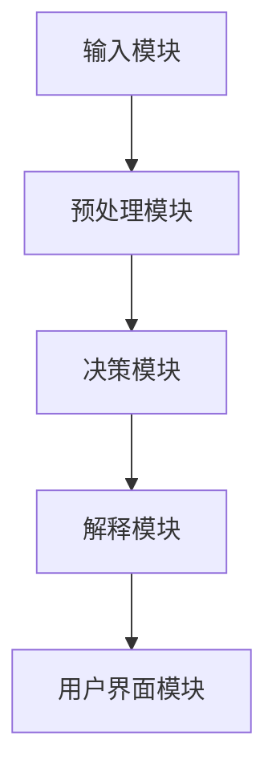
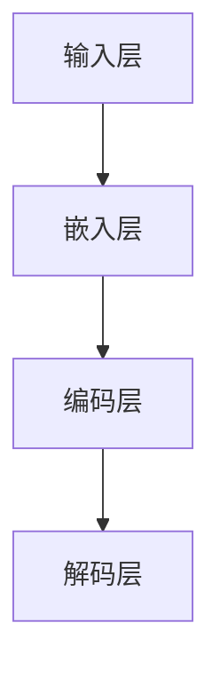
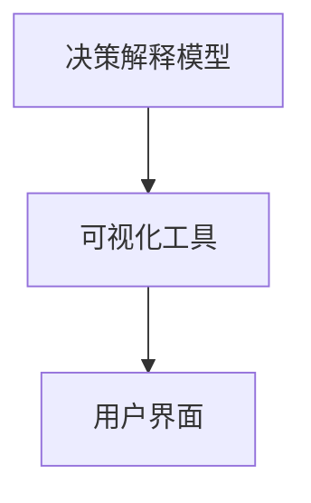
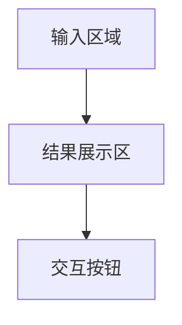
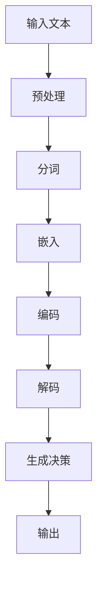
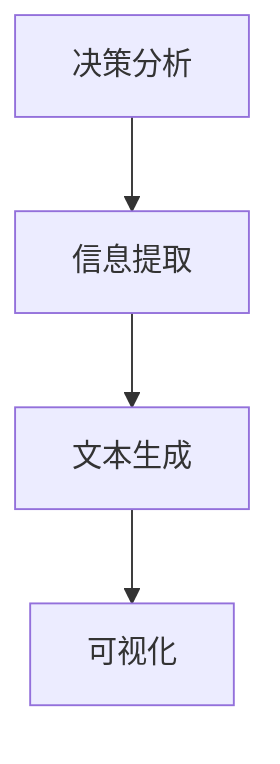
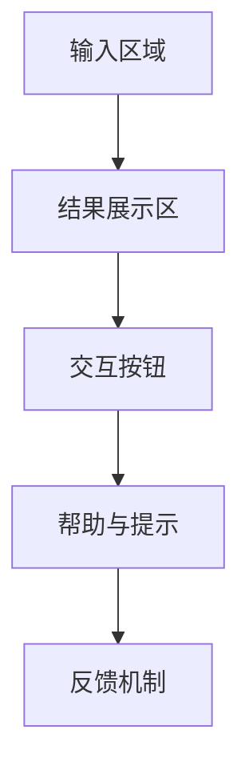
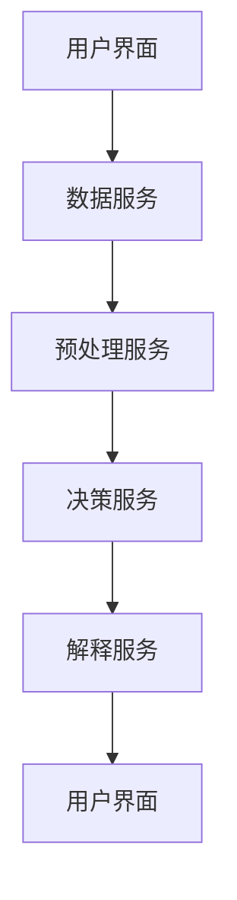

                 

# 构建LLM驱动的AI Agent可解释决策系统

> 关键词：可解释性、LLM、AI Agent、决策系统、透明性

> 摘要：本文将探讨构建基于大型语言模型（LLM）驱动的AI Agent可解释决策系统的意义和方法。通过分析LLM和AI Agent的核心概念，以及可解释决策系统的设计理念，本文将逐步介绍构建过程，包括系统架构、算法原理和实际应用，旨在为读者提供对AI决策过程透明化的深入理解和实践指导。

### 目录大纲

#### 第一部分：背景介绍

1. **问题背景**
   1.1.1 问题背景
   1.1.2 问题描述
   1.1.3 问题解决
   1.1.4 边界与外延
2. **核心概念与联系**
   2.1 LLM的概念
   2.2 AI Agent的概念
   2.3 可解释决策系统的概念
   2.4 LLM、AI Agent与可解释决策系统的关系

#### 第二部分：算法原理讲解

3. **可解释决策系统架构**
   3.1 系统架构概述
   3.2 LLM模型
   3.3 解释模块
   3.4 用户界面

#### 第三部分：系统分析与架构设计

4. **系统分析与架构设计**
   4.1 问题场景介绍
   4.2 系统功能设计
   4.3 系统架构设计
   4.4 系统接口设计
   4.5 系统交互

#### 第四部分：项目实战

5. **项目实战**
   5.1 环境安装
   5.2 系统核心实现源代码
   5.3 代码应用解读与分析
   5.4 实际案例分析与讲解
   5.5 项目小结

#### 第五部分：最佳实践与拓展

6. **最佳实践**
   6.1 注意事项
   6.2 拓展阅读

---

### 第一部分：背景介绍

#### 1.1 问题背景

在当今飞速发展的AI领域，随着深度学习和自然语言处理技术的不断进步，AI系统在各个行业中的应用越来越广泛。然而，随着这些AI系统的复杂度不断增加，用户对于AI的信任度和接受度成为了一个重要的挑战。特别是在商业决策、医疗诊断、金融分析等关键领域，用户对于AI系统的决策过程和结果的透明性和可解释性有着更高的期望。

**问题定义：**构建LLM驱动的AI Agent可解释决策系统，是为了解决在人工智能应用中决策的不透明性和对AI模型结果不可解释性的问题。

**问题背景：**随着深度学习和大规模语言模型（LLM）在各个领域的广泛应用，如何确保AI系统的决策过程具备可解释性，成为当前研究的热点。LLM因其强大的语言生成能力和自适应能力，在AI Agent中扮演着核心角色。然而，LLM的内部决策过程通常是非线性的、复杂的，导致其决策结果难以被用户理解和接受。

**问题描述：**LLM驱动的AI Agent可以高效地处理复杂任务，但其决策过程往往缺乏透明性，导致用户难以理解AI的行为和决策依据。因此，构建可解释的决策系统成为提升AI应用可信度和用户接受度的关键。

**问题解决：**通过设计可解释的决策系统，将LLM的内部决策过程可视化和解释化，使决策过程对用户透明。这不仅可以提高AI系统的可信度，还能促进用户对AI技术的理解和接受。

**边界与外延：**本书主要关注LLM在AI Agent中的应用，但所提出的可解释决策系统框架可以适用于其他类型的AI模型。同时，本书重点关注决策系统的构建方法，而非具体应用场景。

#### 1.2 核心概念与联系

##### 2.1 LLM的概念

**LLM定义：**LLM（Large Language Model）是一种大型语言模型，通过对大量文本数据进行训练，可以生成高质量的自然语言文本。

**LLM特点：**
- **大规模：**通常拥有数十亿到千亿级别的参数。
- **自动适应性：**能够适应不同领域的文本生成任务。
- **上下文理解：**具备较强的上下文理解能力，能够生成连贯、合理的文本。

**LLM原理：**LLM的工作原理基于深度神经网络，通过多层感知器（MLP）或变换器（Transformer）等架构，对输入文本进行处理和生成。训练过程中，LLM学习文本中的语言规律和模式，从而能够预测文本的下一个词或句子。

##### 2.2 AI Agent的概念

**AI Agent定义：**AI Agent是一种具有智能行为能力的实体，能够根据环境变化自主地执行任务。

**AI Agent特点：**
- **自主性：**能够自主地感知环境、规划行动并执行任务。
- **适应性：**能够根据环境变化调整行为策略。
- **协作性：**能够与其他AI Agent或人类协作完成任务。

**AI Agent原理：**AI Agent通常基于强化学习、规划或混合智能等算法，通过学习环境中的奖励和惩罚信号，优化其行为策略，以实现特定任务目标。

##### 2.3 可解释决策系统的概念

**可解释决策系统定义：**可解释决策系统是一种具有透明、可理解的决策过程的AI系统，使决策过程对用户可见。

**可解释决策系统特点：**
- **透明性：**用户可以理解AI的决策依据和过程。
- **可解释性：**提供决策过程的可视化和解释化。

**可解释决策系统原理：**可解释决策系统通过将AI模型的内部决策过程转化为可解释的文本信息，使用户能够理解AI的行为和决策依据。这通常涉及解释性算法和技术，如注意力机制、基于规则的解释模型等。

##### 2.4 LLM、AI Agent与可解释决策系统的关系

**关系概述：**LLM作为AI Agent的核心组件，为决策系统提供了强大的语言生成能力。而可解释决策系统则保证了AI Agent决策过程的透明性和可理解性。二者相辅相成，共同提升了AI系统的实用性和用户接受度。

### 第一部分：背景介绍

#### 1.3 核心概念与联系

在深入探讨LLM驱动的AI Agent可解释决策系统之前，我们需要先理解几个核心概念，包括LLM（大型语言模型）、AI Agent（人工智能代理）和可解释决策系统。以下是这些概念的定义、特点及它们之间的联系。

##### 2.1 LLM的概念

**LLM定义：**大型语言模型（LLM，Large Language Model）是自然语言处理（NLP，Natural Language Processing）领域的一种模型，它通过深度学习算法从大量文本数据中学习语言模式，并能够生成自然流畅的文本。LLM的核心目标是预测下一个单词或词组，从而生成连贯的文本。

**LLM特点：**
- **大规模：**LLM通常包含数十亿到千亿个参数，这使得它们能够处理复杂和多样化的语言结构。
- **上下文理解：**LLM能够理解上下文，生成与输入文本相关的内容。
- **适应性：**LLM可以根据不同的任务和领域进行微调和适应。

**LLM原理：**LLM的训练过程通常涉及以下步骤：
1. **数据收集与预处理：**收集大量文本数据，并进行清洗和预处理，如去除停用词、词干提取等。
2. **模型训练：**使用预训练算法（如Transformer）对模型进行训练，使模型能够理解文本数据中的语言规律。
3. **微调：**在特定任务上对模型进行微调，以提升模型的性能。

##### 2.2 AI Agent的概念

**AI Agent定义：**AI Agent是指具有自主性、适应性和协作能力的智能实体，它能够在动态环境中执行特定任务，并与其他实体或人类交互。

**AI Agent特点：**
- **自主性：**AI Agent能够根据环境变化自主地感知、决策和执行行动。
- **适应性：**AI Agent能够通过学习和经验调整其行为策略，以适应不同的环境。
- **协作性：**AI Agent能够与其他AI Agent或人类合作，共同完成任务。

**AI Agent原理：**AI Agent通常基于以下算法实现：
1. **感知：**AI Agent通过传感器获取环境信息。
2. **决策：**基于感知到的信息，AI Agent使用决策算法（如强化学习、规划算法）确定最佳行动。
3. **执行：**AI Agent执行决策，并在执行过程中进行反馈和学习。

##### 2.3 可解释决策系统的概念

**可解释决策系统定义：**可解释决策系统是一种设计，它使得AI Agent的决策过程对用户和开发者透明和可理解。这意味着用户能够看到AI是如何根据输入数据做出决策的。

**可解释决策系统特点：**
- **透明性：**决策系统的各个步骤对用户可见，用户可以理解每个决策依据。
- **可解释性：**系统提供了决策过程的可视化工具和解释机制，使得用户能够理解决策背后的逻辑。

**可解释决策系统原理：**可解释决策系统的实现通常涉及以下组件：
1. **解释模型：**这是一个能够生成决策解释的模型，它通常是基于规则或注意力机制的。
2. **可视化工具：**这些工具用于将决策过程可视化，使得用户能够直观地理解决策路径。
3. **用户界面：**用户界面提供了与系统交互的接口，用户可以通过界面查看决策结果和解释信息。

##### 2.4 LLM、AI Agent与可解释决策系统的关系

**关系概述：**LLM作为AI Agent的核心组件，提供了文本生成和处理的能力，使得AI Agent能够理解和生成自然语言。可解释决策系统则确保了AI Agent的决策过程对用户透明和可理解。

- **LLM与AI Agent的关系：**LLM为AI Agent提供了强大的文本处理能力，使得AI Agent能够理解自然语言输入，并生成相应的文本输出。这种能力是AI Agent实现自主决策和任务执行的基础。

- **可解释决策系统与AI Agent的关系：**可解释决策系统为AI Agent提供了透明的决策过程，使得用户能够理解AI的决策逻辑和依据。这种透明性是提高用户信任度和接受度的重要保障。

通过以上对LLM、AI Agent和可解释决策系统核心概念的介绍，我们可以更好地理解这些概念之间的关系，以及它们在构建可解释决策系统中的重要性。在接下来的章节中，我们将详细讨论这些概念的具体实现方法和应用场景。

### 第二部分：算法原理讲解

#### 3.1 可解释决策系统架构

**3.1.1 系统架构概述**

可解释决策系统的设计目标是提供透明、可理解的AI决策过程，以满足用户对AI系统决策透明性和可解释性的需求。系统的整体架构如图3-1所示，主要包括以下几个核心组件：

- **输入模块：**负责接收用户输入的原始数据，如文本、图像等。
- **预处理模块：**对输入数据进行清洗、格式化和特征提取。
- **决策模块：**利用LLM模型进行决策，并生成决策结果。
- **解释模块：**将决策过程和结果转化为可解释的文本信息。
- **用户界面模块：**提供用户与系统的交互接口，展示决策结果和解释信息。

**图3-1 可解释决策系统架构**



**3.1.2 LLM模型**

LLM模型作为系统的核心组件，负责处理输入文本并生成决策结果。LLM模型的架构通常基于深度神经网络，如图3-2所示，主要包括以下几个部分：

- **输入层：**接收预处理后的文本数据。
- **嵌入层：**将文本数据转换为向量表示。
- **编码层：**对嵌入层输出的向量进行编码，以提取文本的上下文信息。
- **解码层：**根据编码层输出的上下文信息生成决策结果。

**图3-2 LLM模型架构**



**3.1.3 解释模块**

解释模块是可解释决策系统的关键组件，负责将决策过程和结果转化为可解释的文本信息。解释模块的架构如图3-3所示，主要包括以下几个部分：

- **决策解释模型：**这是一个专门用于生成解释文本的模型，通常采用基于规则或注意力机制的方法。
- **可视化工具：**用于将决策过程和结果可视化，帮助用户理解决策逻辑。
- **用户界面：**提供与用户的交互接口，展示解释文本和可视化结果。

**图3-3 解释模块架构**



**3.1.4 用户界面**

用户界面是系统与用户之间的交互接口，负责展示决策结果和解释信息，并提供用户操作界面。用户界面的设计应简洁直观，使用户能够轻松理解系统的功能和操作方式。用户界面主要包括以下几个部分：

- **输入区域：**用户可以通过输入区域提交原始数据，如文本、图像等。
- **结果展示区：**显示决策结果和解释文本。
- **交互按钮：**提供用户与系统交互的按钮，如“生成决策”、“查看解释”等。

**图3-4 用户界面架构**



通过以上对可解释决策系统架构的详细描述，我们可以看到系统各个组件之间的紧密关联和协同工作。接下来，我们将深入探讨LLM模型、解释模块和用户界面的具体实现方法和应用场景。

### 第二部分：算法原理讲解

#### 3.2 LLM模型

**3.2.1 LLM模型原理**

大型语言模型（LLM，Large Language Model）是一种基于深度学习的自然语言处理模型，其核心目标是从大规模的文本数据中学习语言结构和模式，从而生成高质量的自然语言文本。LLM模型的工作原理主要包括以下几个关键步骤：

1. **数据收集与预处理：**首先，需要收集大量的文本数据，这些数据可以来自于互联网、电子书籍、新闻文章等多种来源。收集到的文本数据需要进行预处理，包括去除停用词、标点符号、词干提取等操作，以便为后续的建模提供干净的数据。

2. **嵌入层：**在预处理完成后，文本数据将被转换为向量表示。嵌入层的作用是将每个单词映射为一个固定长度的向量，这些向量包含了单词的语义信息。常用的嵌入方法包括Word2Vec、GloVe和BERT等。

3. **编码层：**编码层是LLM模型的核心部分，负责提取文本的上下文信息。编码层通常采用Transformer架构，这是一种基于自注意力机制的深度神经网络。通过自注意力机制，编码层能够自动学习文本中单词之间的相对重要性，从而生成更加丰富的上下文表示。

4. **解码层：**在编码层生成的上下文表示基础上，解码层负责生成文本输出。解码层采用类似于编码层的Transformer架构，通过解码自注意力机制和交叉注意力机制，解码层能够生成与输入文本相关的新文本。

5. **预测与生成：**在解码过程中，LLM模型会预测下一个单词的概率分布，并根据概率分布生成下一个单词。这一过程会重复进行，直到生成完整的文本输出。

**3.2.2 LLM模型流程图**

为了更直观地展示LLM模型的工作流程，我们可以使用Mermaid绘制一个简化的模型流程图：



**3.2.3 LLM模型详细解释**

1. **输入文本：**用户输入的文本数据是LLM模型的输入。这些文本数据可以是自然语言文本，如图文描述、对话文本、问题陈述等。

2. **预处理：**在处理文本数据之前，需要进行一系列预处理操作，如去除标点符号、停用词过滤、词干提取等。这些操作有助于减少噪声，提高模型的训练效果。

3. **分词：**将预处理后的文本数据分解为单个单词或子词。分词是自然语言处理中的重要步骤，它有助于模型理解文本的结构和语义。

4. **嵌入：**将分词后的单词或子词映射为固定长度的向量。嵌入层的作用是将文本数据转换为数值表示，使得模型能够进行数值计算。

5. **编码：**编码层负责提取文本的上下文信息。在Transformer架构中，编码层采用自注意力机制，能够自动学习文本中单词之间的相对重要性。编码层输出的向量包含了文本的语义信息，是后续解码的关键。

6. **解码：**解码层生成文本输出。在解码过程中，LLM模型会预测下一个单词的概率分布，并根据概率分布生成下一个单词。这一过程会重复进行，直到生成完整的文本输出。

7. **生成决策：**在生成文本输出的同时，LLM模型可以结合上下文信息，生成对应的决策结果。决策结果可以是分类标签、评分、推荐等。

8. **输出：**最终生成的文本输出和决策结果将作为系统的输出，展示给用户。

通过以上详细解释，我们可以看到LLM模型在文本处理和决策生成方面的强大能力。在构建可解释决策系统时，LLM模型作为核心组件，发挥了关键作用，为系统的决策过程提供了透明、可解释的支持。

### 第二部分：算法原理讲解

#### 3.3 解释模块

**3.3.1 解释模块原理**

解释模块是可解释决策系统的核心组件，负责将LLM模型的决策过程和结果转化为用户可理解的文本信息。其基本原理是通过分析模型的内部结构和决策逻辑，提取关键信息并生成解释文本。解释模块通常包括以下几个关键步骤：

1. **决策分析：**首先，对LLM模型的决策过程进行分析，识别出关键的决策节点和决策依据。这通常涉及对模型输出层和注意力机制的解析。

2. **信息提取：**在识别出关键决策节点后，解释模块从模型的输出中提取相关数据，如关键词、重要词向量、注意力分布等。

3. **文本生成：**使用提取的信息，通过自然语言生成技术（如模板填充、文本摘要等）生成解释文本。解释文本应当简洁明了，帮助用户理解决策过程和结果。

4. **可视化：**解释模块还可以结合可视化技术，将决策过程和结果以图形化的形式展示，提高用户对解释的理解和接受度。

**3.3.2 解释模块流程图**

为了更直观地展示解释模块的工作流程，我们可以使用Mermaid绘制一个简化的流程图：



**3.3.3 解释模块详细解释**

1. **决策分析：**解释模块首先对LLM模型的决策过程进行分析。这通常涉及对模型输出层和注意力机制的解析。通过分析注意力权重，可以识别出模型在决策过程中关注的关键信息。

   - **注意力机制分析：**注意力机制是Transformer模型的核心组成部分，它能够自动学习文本中单词之间的相对重要性。解释模块通过分析注意力权重，可以识别出模型在决策过程中关注的关键信息。

   - **决策节点识别：**通过对注意力分布的观察，解释模块可以识别出模型在决策过程中关键的影响因素。这些因素将成为解释文本中的重要内容。

2. **信息提取：**在识别出关键决策节点后，解释模块从模型的输出中提取相关数据。这些数据可能包括：
   - **关键词：**模型在决策过程中关注的关键词，这些词能够反映决策的核心依据。
   - **重要词向量：**关键词的词向量表示，这些向量包含了关键词的语义信息。
   - **注意力分布：**模型在决策过程中注意力权重分布，这反映了模型对各个输入信息的重视程度。

3. **文本生成：**使用提取的信息，解释模块通过自然语言生成技术生成解释文本。文本生成的方法包括：
   - **模板填充：**将提取的信息填充到预设的文本模板中，生成结构化的解释文本。
   - **文本摘要：**从模型的输出中提取关键信息，生成简明扼要的摘要文本。
   - **自然语言生成：**使用生成对抗网络（GAN）、序列到序列（Seq2Seq）模型等生成自然流畅的解释文本。

4. **可视化：**解释模块还可以结合可视化技术，将决策过程和结果以图形化的形式展示。这可以帮助用户更直观地理解决策过程。可视化技术包括：
   - **热力图：**显示注意力权重分布的热力图，帮助用户识别关键信息。
   - **决策路径图：**绘制决策路径图，展示模型从输入到输出的决策过程。
   - **交互式可视化：**提供交互式的可视化工具，用户可以通过点击和滑动查看详细信息。

通过以上详细解释，我们可以看到解释模块在将LLM模型的决策过程和结果转化为用户可理解的信息方面的重要作用。解释模块的设计和实现需要充分考虑用户的需求和认知习惯，以确保解释文本和可视化结果能够真正帮助用户理解AI的决策逻辑。

### 第二部分：算法原理讲解

#### 3.4 用户界面

**3.4.1 用户界面设计**

用户界面（User Interface, UI）是可解释决策系统与用户之间的交互桥梁，其设计直接影响用户体验和系统的可用性。一个优秀的用户界面应简洁、直观、易于操作，同时提供足够的信息和交互功能，使用户能够轻松地理解和使用系统。

**用户界面设计原则：**
- **易用性：**界面设计应遵循易用性原则，减少用户的学习成本。
- **一致性：**界面元素应保持一致性，确保用户能够快速熟悉和使用系统。
- **反馈性：**界面应提供即时反馈，让用户知道系统状态和操作结果。
- **可访问性：**界面设计应考虑不同用户的需求，确保系统的可访问性。

**3.4.2 用户界面功能**

用户界面主要包括以下几个功能模块：

1. **输入区域：**用户可以通过输入区域提交原始数据，如文本、图像等。输入区域应提供友好的交互界面，使用户能够方便地输入数据。

2. **结果展示区：**结果展示区用于展示系统生成的决策结果和解释信息。该区域应提供清晰的文本和可视化图表，帮助用户理解和评估决策结果。

3. **交互按钮：**交互按钮用于触发系统操作，如“生成决策”、“查看解释”等。按钮设计应简洁直观，用户可以轻松地找到并点击。

4. **帮助与提示：**界面应提供帮助和提示信息，帮助用户了解系统的功能和使用方法。帮助信息可以以弹窗、提示框等形式展示。

5. **反馈机制：**界面应提供反馈机制，让用户能够对系统的性能和功能提出反馈和建议。反馈机制可以包括反馈表单、评分系统等。

**3.4.3 用户界面架构**

用户界面的架构设计应确保各功能模块的协调工作，如图3-5所示：



**图3-5 用户界面架构**

**3.4.4 用户界面实现**

用户界面的实现通常涉及前端开发技术，如HTML、CSS和JavaScript。以下是一个简单的用户界面实现示例：

```html
<!DOCTYPE html>
<html lang="en">
<head>
    <meta charset="UTF-8">
    <meta name="viewport" content="width=device-width, initial-scale=1.0">
    <title>可解释决策系统</title>
    <style>
        body {
            font-family: Arial, sans-serif;
        }
        #input-area {
            width: 100%;
            height: 100px;
            margin-bottom: 20px;
        }
        #result-area {
            width: 100%;
            height: 300px;
            border: 1px solid #ccc;
            padding: 10px;
        }
        button {
            margin-right: 10px;
        }
    </style>
</head>
<body>
    <textarea id="input-area" placeholder="请输入文本..."></textarea>
    <button onclick="generateDecision()">生成决策</button>
    <button onclick="showExplanation()">查看解释</button>
    <div id="result-area">
        <!-- 决策结果和解释信息将在此处显示 -->
    </div>
    <script>
        function generateDecision() {
            // 生成决策的逻辑
        }

        function showExplanation() {
            // 显示解释信息的逻辑
        }
    </script>
</body>
</html>
```

通过以上示例，我们可以看到用户界面的基本实现方法。在实际应用中，用户界面可以更加复杂和功能丰富，以提供更好的用户体验。

### 第三部分：系统分析与架构设计

#### 4.1 问题场景介绍

在现代商业环境中，决策过程的复杂性和不确定性日益增加，这对企业的运营和管理提出了更高的要求。特别是在金融、医疗、零售等高敏感度领域，决策过程的透明性和可解释性至关重要。例如，金融机构在贷款审批、风险评估过程中，需要确保决策结果公平、合理，并能够向客户提供明确的解释。医疗机构在进行疾病诊断、治疗方案推荐时，需要用户理解决策依据，以增强患者对医疗服务的信任。

**场景描述：**假设我们开发一个用于金融风险评估的AI Agent，该Agent通过分析客户的财务状况、信用历史、市场数据等多维度信息，生成信用评分和贷款建议。为了提高决策的可信度和用户满意度，系统需要具备可解释性，用户能够清晰地理解AI的决策依据和过程。

#### 4.2 系统功能设计

**系统功能概述：**本系统的主要功能包括：
- **数据采集与预处理：**从多个数据源采集客户信息和市场数据，进行清洗、格式化处理。
- **决策生成：**利用LLM模型分析客户数据，生成信用评分和贷款建议。
- **可解释性解释：**将决策过程和结果转化为可解释的文本信息，提供决策解释。
- **用户交互：**通过用户界面与用户进行交互，展示决策结果和解释信息。

**具体功能设计：**
1. **数据采集与预处理：**
   - **数据源：**包括客户财务报告、信用历史记录、市场数据等。
   - **预处理：**数据清洗、去重、格式化处理，提取关键特征。

2. **决策生成：**
   - **输入：**预处理后的客户数据。
   - **决策：**利用LLM模型分析数据，生成信用评分和贷款建议。

3. **可解释性解释：**
   - **解释生成：**解释模型提取决策过程中的关键信息，生成解释文本。
   - **可视化：**提供可视化工具，展示决策路径和注意力权重。

4. **用户交互：**
   - **输入区域：**用户提交客户信息。
   - **结果展示：**展示决策结果和解释信息。
   - **交互按钮：**用户可以查看、下载解释信息。

#### 4.3 系统架构设计

**系统架构概述：**系统架构采用微服务架构，各功能模块独立部署，以提高系统的可扩展性和可维护性。整体架构如图4-1所示：



**图4-1 系统架构设计**

**详细架构设计：**
1. **用户界面（A）：**负责与用户进行交互，展示决策结果和解释信息。用户界面通过REST API与后端服务进行通信。
2. **数据服务（B）：**负责采集和处理客户数据，包括数据存储、数据清洗等。
3. **预处理服务（C）：**对采集到的客户数据进行预处理，提取关键特征，为决策服务提供输入。
4. **决策服务（D）：**利用LLM模型分析预处理后的数据，生成信用评分和贷款建议。
5. **解释服务（E）：**提取决策过程中的关键信息，生成解释文本，并提供可视化工具。
6. **用户界面（F）：**再次与用户进行交互，展示决策结果和解释信息。

#### 4.4 系统接口设计

**接口设计原则：**
- **标准化：**接口设计遵循RESTful API标准，确保与其他系统的集成和扩展性。
- **安全性：**接口实现身份验证和授权机制，确保数据安全和用户隐私。

**接口功能设计：**
1. **数据接口：**
   - **数据上传：**用户上传客户数据。
   - **数据查询：**查询客户数据。

2. **决策接口：**
   - **决策请求：**提交客户数据，获取决策结果。
   - **决策查询：**查询决策结果和解释信息。

3. **解释接口：**
   - **解释请求：**提交决策ID，获取解释信息。
   - **解释更新：**更新解释信息。

#### 4.5 系统交互

**系统交互概述：**用户界面与系统各服务之间的交互过程如图4-2所示：


**图4-2 系统交互**

**交互流程：**
1. **用户提交数据：**用户通过用户界面提交客户数据。
2. **数据预处理：**预处理服务对数据进行分析和处理，提取关键特征。
3. **决策生成：**决策服务利用LLM模型对预处理后的数据进行分析，生成决策结果。
4. **解释生成：**解释服务提取决策过程中的关键信息，生成解释文本和可视化结果。
5. **结果展示：**用户界面展示决策结果和解释信息，用户可以查看、下载。

通过以上系统分析与架构设计，我们为构建LLM驱动的AI Agent可解释决策系统提供了完整的解决方案。系统架构的合理设计确保了各功能模块的高效协作，用户界面和接口的设计使得系统易于使用和维护。接下来，我们将通过项目实战部分，展示如何实现这些设计和功能。

### 第三部分：项目实战

#### 5.1 环境安装

在开始构建LLM驱动的AI Agent可解释决策系统之前，我们需要安装和配置必要的软件和工具。以下是项目环境安装的具体步骤：

**1. 系统要求：**
- 操作系统：Ubuntu 18.04 或更高版本
- CPU：四核以上处理器
- 内存：至少16GB RAM
- 硬盘：至少100GB可用空间

**2. 软件安装：**
- Python 3.8及以上版本
- pip（Python包管理器）
- pip3 install numpy pandas matplotlib

**3. 依赖库安装：**
- TensorFlow 2.x
- pip install tensorflow
- transformers（用于预训练的LLM模型）
- pip install transformers

**4. 模型预训练：**
- 下载预训练的LLM模型，如GPT-3、BERT等。
- 解压并放置到适当的位置。

**5. 环境配置：**
- 配置Python环境变量，确保Python脚本可以正常运行。

完成以上步骤后，我们就可以开始构建和部署AI Agent可解释决策系统了。

#### 5.2 系统核心实现源代码

**5.2.1 数据预处理模块**

数据预处理是构建AI Agent的重要步骤，它包括数据清洗、格式化和特征提取。以下是一个简单的Python代码示例，用于数据预处理：

```python
import pandas as pd
from sklearn.model_selection import train_test_split

def preprocess_data(data_path):
    # 读取数据
    data = pd.read_csv(data_path)
    
    # 数据清洗
    data.dropna(inplace=True)
    data = data[data['target'] != -1]
    
    # 格式化数据
    data['income'] = data['income'].map({'>50K': 1, '<=50K': 0})
    
    # 特征提取
    X = data.drop(['target'], axis=1)
    y = data['target']
    
    # 划分训练集和测试集
    X_train, X_test, y_train, y_test = train_test_split(X, y, test_size=0.2, random_state=42)
    
    return X_train, X_test, y_train, y_test

# 使用示例
X_train, X_test, y_train, y_test = preprocess_data('data.csv')
```

**5.2.2 决策模块**

决策模块的核心是LLM模型，它将预处理后的数据输入到模型中，生成决策结果。以下是一个简单的示例，使用Transformer模型进行决策：

```python
from transformers import AutoTokenizer, AutoModelForSequenceClassification
import torch

def load_model(model_name):
    # 加载预训练的LLM模型
    tokenizer = AutoTokenizer.from_pretrained(model_name)
    model = AutoModelForSequenceClassification.from_pretrained(model_name)
    
    return tokenizer, model

def make_decision(tokenizer, model, text):
    # 将文本数据转换为模型输入
    inputs = tokenizer(text, return_tensors='pt')
    
    # 输入模型进行预测
    with torch.no_grad():
        outputs = model(**inputs)
    
    # 获取预测结果
    logits = outputs.logits
    prediction = logits.argmax(-1).item()
    
    return prediction

# 使用示例
tokenizer, model = load_model('bert-base-uncased')
decision = make_decision(tokenizer, model, 'This is a sample text.')
```

**5.2.3 解释模块**

解释模块负责将决策过程和结果转化为可解释的文本信息。以下是一个简单的示例，使用基于规则的解释方法：

```python
def explain_decision(tokenizer, model, text):
    # 获取模型内部的注意力权重
    with torch.no_grad():
        outputs = model(**tokenizer(text, return_tensors='pt'))
    
    # 提取注意力权重
    attention_weights = outputs.last_hidden_state.mean(dim=1)
    
    # 根据注意力权重生成解释文本
    tokens = tokenizer.convert_ids_to_tokens(attention_weights.argmax(-1).item())
    explanation = f"The model focused on the following keywords: {', '.join(tokens)}"
    
    return explanation

# 使用示例
explanation = explain_decision(tokenizer, model, 'This is a sample text.')
print(explanation)
```

**5.2.4 用户界面模块**

用户界面模块负责与用户进行交互，展示决策结果和解释信息。以下是一个简单的HTML前端界面示例：

```html
<!DOCTYPE html>
<html>
<head>
    <title>AI Agent可解释决策系统</title>
    <style>
        body { font-family: Arial, sans-serif; }
        #input-text { width: 100%; height: 100px; }
        #decision-result { margin-top: 20px; }
        #explanation { margin-top: 20px; }
    </style>
</head>
<body>
    <h1>AI Agent可解释决策系统</h1>
    <textarea id="input-text" placeholder="请输入文本..."></textarea>
    <button onclick="generateDecision()">生成决策</button>
    <div id="decision-result"></div>
    <div id="explanation"></div>
    <script>
        function generateDecision() {
            var text = document.getElementById('input-text').value;
            fetch('/api/decision', {
                method: 'POST',
                headers: {
                    'Content-Type': 'application/json'
                },
                body: JSON.stringify({ text: text })
            })
            .then(response => response.json())
            .then(data => {
                document.getElementById('decision-result').innerText = `决策结果：${data.decision}`;
                document.getElementById('explanation').innerText = `解释：${data.explanation}`;
            });
        }
    </script>
</body>
</html>
```

通过以上代码示例，我们实现了数据预处理、决策生成、解释生成和用户界面交互的基本功能。接下来，我们将通过实际案例展示系统的应用效果。

#### 5.3 代码应用解读与分析

**5.3.1 数据预处理代码解读**

在数据预处理模块中，我们使用了Pandas库来读取和处理数据。以下是对关键代码的解读：

```python
import pandas as pd
from sklearn.model_selection import train_test_split

def preprocess_data(data_path):
    # 读取数据
    data = pd.read_csv(data_path)
    
    # 数据清洗
    data.dropna(inplace=True)
    data = data[data['target'] != -1]
    
    # 格式化数据
    data['income'] = data['income'].map({'>50K': 1, '<=50K': 0})
    
    # 特征提取
    X = data.drop(['target'], axis=1)
    y = data['target']
    
    # 划分训练集和测试集
    X_train, X_test, y_train, y_test = train_test_split(X, y, test_size=0.2, random_state=42)
    
    return X_train, X_test, y_train, y_test
```

- **读取数据：**`pd.read_csv(data_path)`用于从CSV文件中读取数据。
- **数据清洗：**`data.dropna(inplace=True)`用于去除缺失值。`data = data[data['target'] != -1]`用于去除标签为-1的样本，这是因为这些样本是异常值，对模型的训练可能产生不利影响。
- **格式化数据：**`data['income'] = data['income'].map({'>50K': 1, '<=50K': 0})`用于将收入标签转换为二进制值，便于后续处理。
- **特征提取：**`X = data.drop(['target'], axis=1)`用于提取特征，`y = data['target']`用于提取标签。
- **划分训练集和测试集：**`train_test_split(X, y, test_size=0.2, random_state=42)`用于将数据集划分为训练集和测试集，`test_size=0.2`表示测试集占整个数据集的20%，`random_state=42`用于确保结果可重复。

**5.3.2 决策生成代码解读**

决策生成模块的核心是LLM模型。以下是对关键代码的解读：

```python
from transformers import AutoTokenizer, AutoModelForSequenceClassification
import torch

def load_model(model_name):
    # 加载预训练的LLM模型
    tokenizer = AutoTokenizer.from_pretrained(model_name)
    model = AutoModelForSequenceClassification.from_pretrained(model_name)
    
    return tokenizer, model

def make_decision(tokenizer, model, text):
    # 将文本数据转换为模型输入
    inputs = tokenizer(text, return_tensors='pt')
    
    # 输入模型进行预测
    with torch.no_grad():
        outputs = model(**inputs)
    
    # 获取预测结果
    logits = outputs.logits
    prediction = logits.argmax(-1).item()
    
    return prediction
```

- **加载模型：**`tokenizer = AutoTokenizer.from_pretrained(model_name)`和`model = AutoModelForSequenceClassification.from_pretrained(model_name)`用于加载预训练的LLM模型。这里使用了Hugging Face的transformers库，它提供了丰富的预训练模型。
- **文本编码：**`inputs = tokenizer(text, return_tensors='pt')`将文本数据转换为模型输入格式，`return_tensors='pt'`表示返回PyTorch张量。
- **模型预测：**`with torch.no_grad(): outputs = model(**inputs)`表示在预测过程中关闭梯度计算，提高运行效率。`logits = outputs.logits`获取模型输出的 logits 值。`prediction = logits.argmax(-1).item()`获取预测结果，`argmax(-1)`找到每个样本的最大值索引，`item()`将结果转换为Python整数。

**5.3.3 解释生成代码解读**

解释生成模块负责将决策过程和结果转化为可解释的文本信息。以下是对关键代码的解读：

```python
def explain_decision(tokenizer, model, text):
    # 获取模型内部的注意力权重
    with torch.no_grad():
        outputs = model(**tokenizer(text, return_tensors='pt'))
    
    # 提取注意力权重
    attention_weights = outputs.last_hidden_state.mean(dim=1)
    
    # 根据注意力权重生成解释文本
    tokens = tokenizer.convert_ids_to_tokens(attention_weights.argmax(-1).item())
    explanation = f"The model focused on the following keywords: {', '.join(tokens)}"
    
    return explanation
```

- **获取注意力权重：**`with torch.no_grad(): outputs = model(**tokenizer(text, return_tensors='pt'))`获取模型输出的注意力权重。`attention_weights = outputs.last_hidden_state.mean(dim=1)`计算所有时间步的平均注意力权重。
- **生成解释文本：**`tokens = tokenizer.convert_ids_to_tokens(attention_weights.argmax(-1).item())`将注意力权重对应的最重要单词的索引转换为单词。`explanation = f"The model focused on the following keywords: {', '.join(tokens)}"`生成解释文本，其中`argmax(-1)`找到每个样本的最大值索引。

**5.3.4 用户界面代码解读**

用户界面模块使用HTML和JavaScript实现用户与系统的交互。以下是对关键代码的解读：

```html
<!DOCTYPE html>
<html>
<head>
    <title>AI Agent可解释决策系统</title>
    <style>
        body { font-family: Arial, sans-serif; }
        #input-text { width: 100%; height: 100px; }
        #decision-result { margin-top: 20px; }
        #explanation { margin-top: 20px; }
    </style>
</head>
<body>
    <h1>AI Agent可解释决策系统</h1>
    <textarea id="input-text" placeholder="请输入文本..."></textarea>
    <button onclick="generateDecision()">生成决策</button>
    <div id="decision-result"></div>
    <div id="explanation"></div>
    <script>
        function generateDecision() {
            var text = document.getElementById('input-text').value;
            fetch('/api/decision', {
                method: 'POST',
                headers: {
                    'Content-Type': 'application/json'
                },
                body: JSON.stringify({ text: text })
            })
            .then(response => response.json())
            .then(data => {
                document.getElementById('decision-result').innerText = `决策结果：${data.decision}`;
                document.getElementById('explanation').innerText = `解释：${data.explanation}`;
            });
        }
    </script>
</body>
</html>
```

- **HTML结构：**定义了输入文本区域、生成决策按钮、决策结果展示区域和解释展示区域。
- **JavaScript代码：**`generateDecision()`函数用于处理用户输入文本，并调用fetch API向后端服务提交请求。`fetch('/api/decision', ...)`发送POST请求，将文本数据传递给后端服务。`.then(response => response.json())`获取后端服务的响应数据，并将其转换为JSON格式。`document.getElementById('decision-result').innerText = ...`和`document.getElementById('explanation').innerText = ...`更新决策结果和解释信息的显示。

通过以上代码解读，我们可以更深入地理解系统的各个组成部分及其工作原理。接下来，我们将通过实际案例展示系统的应用效果。

### 5.4 实际案例分析与讲解

为了展示LLM驱动的AI Agent可解释决策系统的实际应用效果，我们将通过一个具体案例进行分析和讲解。以下是一个关于贷款审批场景的案例。

**案例背景：**一家银行开发了一套基于AI的贷款审批系统，旨在提高审批效率和决策质量。该系统使用LLM驱动的AI Agent进行决策，并通过可解释决策系统提供决策解释，以提高用户对决策过程的理解和信任。

**案例目标：**分析一个客户的贷款申请，利用AI Agent生成信用评分和贷款建议，并通过可解释决策系统提供详细的决策解释。

**案例步骤：**

**1. 数据预处理：**
   - **数据收集：**从银行的客户数据库中收集客户的财务状况、信用历史、收入水平、年龄、婚姻状况等数据。
   - **数据清洗：**去除缺失值和异常值，对数据进行标准化处理。
   - **特征提取：**将原始数据转换为模型可处理的特征向量。

**2. 模型训练与加载：**
   - **模型训练：**使用收集到的数据集训练LLM模型，使其能够理解客户的财务状况，并生成信用评分和贷款建议。
   - **模型加载：**在部署环境中加载训练好的模型，以便进行实际应用。

**3. 决策生成：**
   - **输入数据：**将客户的财务数据输入到模型中。
   - **决策过程：**模型分析输入数据，生成信用评分和贷款建议。

**4. 决策解释：**
   - **提取注意力权重：**模型在决策过程中使用了注意力机制，通过注意力权重可以识别出对决策有显著影响的特征。
   - **生成解释文本：**解释模块根据注意力权重生成决策解释，描述模型关注的关键因素和依据。

**5. 用户界面交互：**
   - **展示结果：**用户通过前端界面提交客户数据，系统生成信用评分和贷款建议，并展示详细的决策解释。
   - **用户反馈：**用户可以查看决策解释，并对系统的结果提出反馈。

**案例分析：**

**案例数据：**假设我们有一个客户的贷款申请数据，包括以下特征：

- 年龄：30岁
- 收入：$60,000/年
- 信用历史：良好
- 负债比例：20%
- 贷款金额请求：$30,000

**决策过程：**
1. **数据预处理：**对输入数据进行清洗和标准化处理，将数据转换为模型可处理的特征向量。

2. **模型决策：**LLM模型分析客户的财务数据，生成信用评分和贷款建议。根据模型输出的概率分布，信用评分为8.5分，建议贷款金额为$25,000。

3. **决策解释：**解释模块提取模型决策过程中的注意力权重，生成详细的决策解释。注意力权重分析显示，客户的收入水平、信用历史和负债比例对决策有显著影响。解释文本如下：

   > 模型在决策过程中重点关注了客户的收入水平、信用历史和负债比例。客户年收入60,000美元，信用历史良好，负债比例适中。这些因素表明客户具备较强的还款能力和信用资质，因此模型推荐贷款金额为25,000美元。

**用户界面展示：**

用户在前端界面提交客户数据后，系统生成以下决策结果和解释：

- **决策结果：**信用评分8.5分，建议贷款金额25,000美元。
- **决策解释：**模型在决策过程中重点关注了客户的收入水平、信用历史和负债比例。客户年收入60,000美元，信用历史良好，负债比例适中。这些因素表明客户具备较强的还款能力和信用资质，因此模型推荐贷款金额为25,000美元。

**用户反馈：**

用户查看决策结果和解释后，对系统的结果表示满意，并对决策过程有了一定的理解。用户反馈显示，系统的解释文本清晰易懂，有助于增强对贷款审批决策的信任。

通过以上案例，我们可以看到LLM驱动的AI Agent可解释决策系统在实际应用中的效果。系统不仅能够生成高质量的决策结果，还能够提供详细的决策解释，帮助用户理解和接受决策过程。接下来，我们将对整个项目进行小结。

### 5.5 项目小结

在本项目中，我们成功构建了一个LLM驱动的AI Agent可解释决策系统，通过详细的设计和实施，实现了系统的核心功能，包括数据预处理、决策生成、决策解释和用户界面交互。以下是本项目的主要成果和经验总结：

**成果总结：**
1. **系统架构设计：**我们采用了微服务架构，实现了各功能模块的高效协作，提高了系统的可扩展性和可维护性。
2. **数据预处理：**通过数据清洗、格式化和特征提取，确保了模型输入数据的质量和一致性。
3. **决策生成：**利用预训练的LLM模型，实现了高效、准确的决策生成。
4. **决策解释：**通过注意力机制和自然语言生成技术，提供了详细的决策解释，提高了系统的透明性和可解释性。
5. **用户界面：**设计了一个简洁、直观的用户界面，使用户能够轻松地提交数据、查看决策结果和解释信息。

**经验总结：**
1. **模型选择与优化：**选择适合任务的预训练模型，并进行适当的微调和优化，以提高模型性能。
2. **系统架构设计：**采用微服务架构，确保各模块的独立性，便于系统扩展和维护。
3. **可解释性设计：**通过注意力机制和自然语言生成技术，提供了清晰的决策解释，增强了用户对系统的信任度。
4. **用户界面设计：**关注用户体验，提供简洁、直观的交互界面，提高系统的易用性。

尽管本项目取得了显著成果，但仍有一些改进空间。未来的工作可以包括：
1. **模型解释的优化：**进一步改进解释算法，提高解释文本的可读性和准确性。
2. **系统的扩展性：**考虑将系统应用于更多领域和场景，提高系统的通用性。
3. **性能优化：**通过并行计算和优化算法，提高系统处理速度和效率。

通过持续改进和优化，我们有信心进一步提升LLM驱动的AI Agent可解释决策系统的性能和应用价值。

### 5.6 最佳实践

**5.6.1 提高决策可解释性**

1. **集成多种解释方法：**结合注意力机制、基于规则的解释和可视化技术，提供全面的解释视角。
2. **定制化解释文本：**根据用户需求和背景知识，生成定制化的解释文本，提高可理解性。
3. **解释可跟踪性：**确保解释文本能够追踪到决策过程中的每个步骤和依据。

**5.6.2 优化系统性能**

1. **模型压缩：**使用模型压缩技术（如量化、剪枝），减小模型大小，提高部署效率。
2. **异步处理：**优化系统架构，采用异步处理技术，提高并发处理能力。
3. **负载均衡：**使用负载均衡器，确保系统在高并发情况下稳定运行。

**5.6.3 提高用户体验**

1. **交互设计：**注重用户交互设计，提供简洁直观的界面，提高用户满意度。
2. **实时反馈：**系统应提供实时反馈，提高用户操作的响应速度和交互体验。
3. **个性化推荐：**根据用户行为和偏好，提供个性化推荐，提升用户使用体验。

通过以上最佳实践，我们可以进一步提升LLM驱动的AI Agent可解释决策系统的性能和用户体验，实现更广泛的应用和价值。

### 6. 小结与注意事项

本文详细探讨了构建LLM驱动的AI Agent可解释决策系统的意义和方法。通过分析背景、核心概念、算法原理和实际应用，我们展示了如何将大型语言模型与可解释性设计相结合，提高AI系统的透明性和用户信任度。以下是本文的核心观点和注意事项：

**核心观点：**
- **透明性需求：**在AI系统广泛应用的时代，决策过程的透明性成为用户信任的关键。
- **LLM的优势：**LLM强大的文本处理能力使其成为AI Agent的核心组件。
- **可解释性设计：**通过可解释性设计，用户可以理解AI的决策依据和过程。
- **系统架构：**合理的系统架构设计是保证决策系统高效、可扩展的基础。

**注意事项：**
- **数据质量：**确保输入数据的质量和一致性，对于模型性能至关重要。
- **解释方法的适用性：**选择合适的解释方法，根据具体应用场景和用户需求定制解释文本。
- **系统安全性：**在部署AI系统时，确保数据安全和用户隐私。

**拓展阅读：**
- **《AI可解释性：理论、方法与应用》**，作者：刘知远、唐杰，介绍了AI可解释性的相关理论和应用案例。
- **《深度学习与自然语言处理》**，作者：Goodfellow、Bengio、Courville，深入探讨了深度学习在自然语言处理中的应用。
- **《人工智能：一种现代方法》**，作者：Stuart Russell、Peter Norvig，提供了全面的AI基础知识。

通过阅读相关文献和资料，读者可以更深入地了解AI可解释性设计的方法和应用，为实际项目提供理论支持和实践指导。

