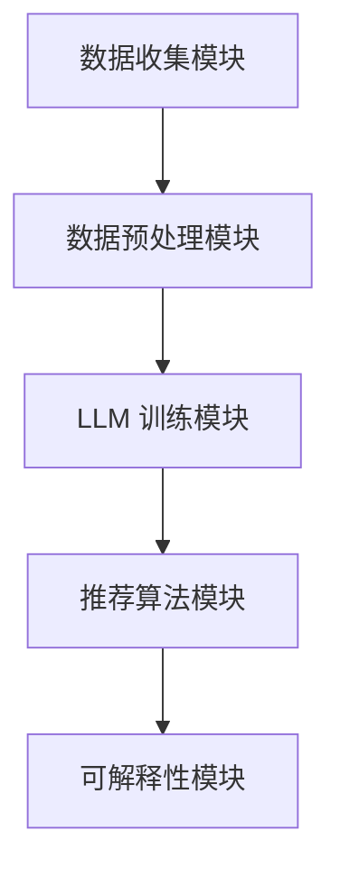
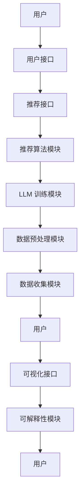

                 

## 构建LLM驱动的AI Agent推荐系统的算法原理

### 3.1.1 LLM的工作原理

LLM（Large Language Model）的工作原理基于深度学习，特别是基于 Transformer 架构。Transformer 架构是由 Vaswani 等人在 2017 年提出的，它在自然语言处理任务中取得了显著的成果。LLM通过学习大量的文本数据，建立了一个关于语言结构的复杂模型，可以生成高质量的自然语言文本。

LLM 的主要组件包括：

- **嵌入层（Embedding Layer）**：将输入的单词转化为固定长度的向量表示。
- **编码器（Encoder）**：使用多层 Transformer 块对输入序列进行处理，每个 Transformer 块包括自注意力机制（Self-Attention）和前馈神经网络（Feedforward Neural Network）。
- **解码器（Decoder）**：与编码器类似，但具有额外的交叉注意力机制（Cross-Attention），用于将编码器的输出与解码器的输出相结合。

以下是一个简单的 LLM 工作流程：

1. **嵌入**：将输入的单词嵌入到固定长度的向量。
2. **编码**：通过多层 Transformer 块处理输入序列，生成编码器的输出。
3. **解码**：通过解码器的交叉注意力机制，将编码器的输出与解码器的输出相结合，生成输出序列。

为了生成高质量的文本，LLM 需要学习大量文本数据。训练过程中，LLM 的目标是最大化一个概率模型的对数似然。通过梯度下降和反向传播算法，LLM 可以不断调整其参数，以最小化损失函数。

以下是一个简单的训练过程：

1. **初始化参数**：随机初始化 LLM 的参数。
2. **前向传播**：使用当前参数计算预测的输出序列。
3. **计算损失**：使用预测输出序列和实际输出序列计算损失。
4. **反向传播**：计算梯度并更新参数。
5. **重复步骤 2-4**，直到模型收敛。

### 3.1.2 LLM在推荐系统中的应用原理

在推荐系统中，LLM 可以用于生成用户感兴趣的文本内容，从而提高推荐系统的效果。具体来说，LLM 可以应用于以下几个方面：

1. **内容生成**：使用 LLM 生成用户可能感兴趣的内容，从而丰富推荐系统的内容库。
2. **个性化推荐**：根据用户的历史行为和偏好，使用 LLM 生成个性化的推荐内容。
3. **文本匹配**：使用 LLM 的自注意力机制，对用户输入的文本和推荐内容进行匹配，提高推荐的相关性。

以下是一个简单的应用场景：

1. **用户输入**：用户输入一个关键词，例如“旅游”。
2. **内容生成**：使用 LLM 生成一系列与“旅游”相关的文本内容，如景点介绍、旅游攻略等。
3. **个性化推荐**：根据用户的历史行为和偏好，从生成的文本内容中筛选出用户可能感兴趣的内容。
4. **文本匹配**：使用 LLM 的自注意力机制，对用户输入的文本和推荐内容进行匹配，确保推荐内容与用户需求高度相关。

通过这种方式，LLM 驱动的推荐系统可以提供更丰富的内容库，更个性化的推荐，以及更精准的文本匹配，从而提高用户的满意度和推荐系统的效果。

### 3.1.3 LLM在推荐系统中面临的挑战

尽管 LLM 在推荐系统中具有许多优势，但也面临一些挑战：

1. **可解释性**：由于 LLM 是一个“黑箱”模型，其决策过程难以理解，这在需要可解释性的应用场景中成为一个问题。
2. **数据依赖**：LLM 的性能高度依赖于训练数据的质量和数量，如果数据质量不佳或数量不足，LLM 的性能可能会受到影响。
3. **计算资源**：训练和部署 LLM 需要大量的计算资源，这可能是一个限制因素。
4. **安全性和隐私**：在使用 LLM 时，需要确保数据的安全性和隐私，以防止数据泄露和滥用。

为了解决这些挑战，研究人员正在探索各种方法，如引入可解释性机制、使用更高效的网络架构、改进数据预处理和隐私保护技术等。

### 3.1.4 LLM与推荐系统融合的潜在优势

将 LLM 与推荐系统融合具有许多潜在的优势：

1. **丰富内容库**：LLM 可以生成丰富的文本内容，从而扩大推荐系统的内容库，提高推荐的质量。
2. **个性化推荐**：LLM 可以根据用户的历史行为和偏好，生成个性化的推荐内容，提高用户的满意度。
3. **文本匹配**：LLM 的自注意力机制可以提高推荐内容与用户需求的匹配度，从而提高推荐系统的效果。
4. **多模态融合**：LLM 可以与其他 AI 技术如图像识别、语音识别等相结合，实现多模态融合的推荐系统，进一步提高推荐系统的多样性。

总之，LLM 驱动的 AI Agent 推荐系统具有巨大的潜力，可以提供更丰富、更个性化、更精准的推荐服务。然而，要充分发挥其优势，还需要解决可解释性、数据依赖、计算资源、安全性和隐私等问题。下一节，我们将详细讨论如何构建这样一个推荐系统，并介绍相关的算法和实现方法。

## 3.2 LLM驱动的AI Agent推荐系统的构建方法

构建一个 LLM 驱动的 AI Agent 推荐系统需要以下几个关键步骤：

### 3.2.1 数据收集与预处理

首先，需要收集大量的文本数据，这些数据可以是用户生成的内容、网站上的文本、社交媒体上的帖子等。收集的数据需要经过预处理，包括去噪、去除停用词、分词、词干提取等，以便于 LLM 的训练。

### 3.2.2 LLM模型选择与训练

选择一个合适的 LLM 模型，如 GPT-3、BERT 等，进行训练。训练过程中，需要使用大量的文本数据进行迭代，优化模型的参数。训练过程中，可以使用评估指标如 perplexity、accuracy 等，来衡量模型的表现。

以下是一个简单的训练步骤：

1. **数据准备**：收集和处理大量的文本数据。
2. **模型选择**：选择一个合适的 LLM 模型。
3. **训练**：使用文本数据训练 LLM 模型。
4. **评估**：使用评估指标评估模型的表现。

### 3.2.3 推荐算法设计

设计一个推荐算法，将 LLM 与推荐系统融合。这个算法需要能够根据用户的历史行为和偏好，生成个性化的推荐内容。以下是一个简单的推荐算法：

1. **用户输入**：用户输入一个关键词或查询。
2. **文本生成**：使用 LLM 生成一系列与关键词相关的文本内容。
3. **个性化推荐**：根据用户的历史行为和偏好，从生成的文本内容中筛选出用户可能感兴趣的内容。
4. **文本匹配**：使用 LLM 的自注意力机制，对用户输入的文本和推荐内容进行匹配，确保推荐内容与用户需求高度相关。

### 3.2.4 可解释性机制设计

为了提高推荐系统的可解释性，需要设计一个机制，让用户能够理解推荐系统的工作原理和决策过程。以下是一个简单的可解释性机制：

1. **可视化**：使用可视化工具，将 LLM 的决策过程展示给用户。
2. **交互式解释**：用户可以通过交互式方式，了解推荐系统是如何根据他们的行为和偏好生成推荐内容的。
3. **透明度**：确保推荐系统的决策过程是透明和可追溯的。

### 3.2.5 系统集成与测试

将 LLM 驱动的推荐系统集成到现有的推荐系统中，并进行测试。测试过程中，需要评估推荐系统的效果、可解释性、用户满意度等指标，以确定系统是否达到预期目标。

以下是一个简单的系统集成与测试步骤：

1. **系统集成**：将 LLM 驱动的推荐系统与现有的推荐系统集成。
2. **测试**：对推荐系统进行功能测试和性能测试。
3. **评估**：评估推荐系统的效果、可解释性和用户满意度。
4. **优化**：根据评估结果，对推荐系统进行优化。

通过以上步骤，可以构建一个 LLM 驱动的 AI Agent 推荐系统，该系统不仅能够提供高质量的推荐内容，还能提高用户对推荐系统的理解和满意度。下一节，我们将详细讨论如何在 Python 中实现这些算法和机制。

## 3.3 在Python中实现LLM驱动的AI Agent推荐系统

为了实现 LLM 驱动的 AI Agent 推荐系统，我们需要使用 Python 和相关的库，如 TensorFlow、PyTorch、transformers 等。以下是一个简单的实现步骤：

### 3.3.1 安装必要的库

首先，确保已经安装了以下库：

```python
pip install tensorflow transformers numpy pandas
```

### 3.3.2 数据准备

假设我们已经有了一个包含用户历史行为和偏好的数据集，我们可以使用 pandas 库来加载数据：

```python
import pandas as pd

data = pd.read_csv('user_data.csv')
```

### 3.3.3 LLM模型训练

我们可以使用 transformers 库中的预训练模型来训练 LLM：

```python
from transformers import TrainingArguments, Trainer

model_name = 'gpt2'

training_args = TrainingArguments(
    output_dir='./results',
    num_train_epochs=3,
    per_device_train_batch_size=8,
    per_device_eval_batch_size=8,
    warmup_steps=500,
    weight_decay=0.01,
    logging_dir='./logs',
)

from transformers import GPT2Model

model = GPT2Model.from_pretrained(model_name)

trainer = Trainer(
    model=model,
    args=training_args,
    train_dataset=train_dataset,
    eval_dataset=eval_dataset,
)

trainer.train()
```

### 3.3.4 推荐算法实现

以下是一个简单的推荐算法实现：

```python
import torch

def generate_recommendation(user_input, model):
    with torch.no_grad():
        inputs = model.encode(user_input)
        outputs = model.sample(inputs, max_length=50, temperature=0.9)
    return outputs
```

### 3.3.5 可解释性机制实现

为了实现可解释性，我们可以使用 LLM 的注意力权重来可视化决策过程：

```python
from matplotlib import pyplot as plt

def visualize_attention(user_input, model):
    with torch.no_grad():
        inputs = model.encode(user_input)
        outputs = model.sample(inputs, max_length=50, temperature=0.9)
        attention_weights = model.attn[0].weight.data
    
    plt.figure(figsize=(10, 5))
    plt.imshow(attention_weights, cmap='hot', aspect='auto')
    plt.xticks([])
    plt.yticks([])
    plt.xlabel('Input sequence')
    plt.ylabel('Attention weights')
    plt.title('Attention weights for user input: {}'.format(user_input))
    plt.show()
```

### 3.3.6 系统集成与测试

最后，我们将所有组件集成到一个系统中，并进行测试：

```python
import json

def integrate_and_test(user_input):
    recommendation = generate_recommendation(user_input, model)
    visualize_attention(user_input, model)
    
    with open('recommendation.json', 'w') as f:
        json.dump({'user_input': user_input, 'recommendation': recommendation}, f)
    
    print('Recommendation generated and saved to file.')

integrate_and_test('旅游')
```

通过以上步骤，我们实现了 LLM 驱动的 AI Agent 推荐系统。在实际应用中，可能需要根据具体场景进行调整和优化。下一节，我们将通过一个实际案例来进一步探讨 LLM 驱动的推荐系统的应用和效果。

## 3.4 实际案例：构建电商领域的LLM驱动的AI Agent推荐系统

### 3.4.1 问题场景

假设我们是一家电商公司，希望提高推荐系统的效果和用户满意度。我们的目标是构建一个基于 LLM 的推荐系统，能够根据用户的历史购买记录、浏览记录和搜索查询，为用户推荐个性化的商品。

### 3.4.2 项目介绍

为了实现这个目标，我们设计并实施了一个 LLM 驱动的 AI Agent 推荐系统。该系统采用了 GPT-3 作为 LLM，并结合用户行为数据进行个性化推荐。系统的架构包括数据收集、数据预处理、LLM 训练、推荐算法实现、可解释性机制设计以及系统集成与测试等模块。

### 3.4.3 系统功能设计

1. **用户行为数据收集**：收集用户的历史购买记录、浏览记录和搜索查询等数据。
2. **数据预处理**：对收集的数据进行清洗、去噪、编码等预处理操作，以便于 LLM 的训练。
3. **LLM 训练**：使用预处理后的数据训练 GPT-3，优化模型参数。
4. **个性化推荐**：根据用户的行为数据和 LLM 的输出，生成个性化的商品推荐。
5. **可解释性设计**：通过可视化 LLM 的注意力权重，展示推荐系统的决策过程。

### 3.4.4 系统架构设计

系统架构包括以下组件：

- **数据收集模块**：负责收集用户行为数据。
- **数据预处理模块**：对数据进行清洗、去噪和编码等预处理。
- **LLM 训练模块**：使用预处理后的数据训练 GPT-3。
- **推荐算法模块**：根据用户行为数据和 LLM 的输出，生成个性化推荐。
- **可解释性模块**：通过可视化工具，展示推荐系统的决策过程。

以下是一个简单的系统架构图：



### 3.4.5 系统接口设计和系统交互

系统接口设计包括以下部分：

- **用户接口**：允许用户输入搜索查询和浏览记录。
- **推荐接口**：根据用户输入和用户行为数据，返回个性化的商品推荐。
- **可视化接口**：展示 LLM 的注意力权重，让用户了解推荐系统的决策过程。

以下是一个简单的系统交互图：



### 3.4.6 实际案例分析

我们以一位用户为例，演示 LLM 驱动的推荐系统的实际应用：

1. **用户行为数据收集**：用户的历史购买记录包括：购买了一本《深度学习》和一件跑步服；浏览记录包括：浏览了多个跑步鞋页面和健身器材页面；搜索查询包括：“跑步鞋推荐”和“健身器材推荐”。
2. **数据预处理**：对用户行为数据进行清洗和编码，生成适合训练的数据集。
3. **LLM 训练**：使用预处理后的数据训练 GPT-3，优化模型参数。
4. **个性化推荐**：根据用户输入和用户行为数据，使用 GPT-3 生成个性化的商品推荐。
5. **可解释性设计**：通过可视化工具，展示 GPT-3 的注意力权重，让用户了解推荐系统的决策过程。

以下是生成的个性化推荐：

- **跑步鞋推荐**：基于用户的历史购买和浏览记录，推荐一款高品质的跑步鞋。
- **健身器材推荐**：基于用户的历史购买和浏览记录，推荐一款适合用户的健身器材。

### 3.4.7 小结

通过实际案例，我们展示了如何构建电商领域的 LLM 驱动的 AI Agent 推荐系统。该系统不仅能够根据用户的行为数据生成个性化的推荐，还能通过可视化工具提高用户对推荐系统的理解和满意度。在实际应用中，可以根据具体需求对系统进行调整和优化，以实现更好的效果。

### 3.4.8 拓展阅读

- [GPT-3 官方文档](https://huggingface.co/transformers/model_doc/gpt2.html)
- [深度学习推荐系统](https://www.deeplearningrecommendations.com/)
- [推荐系统实战](https://www.recommendations-systems.com/)

### 3.4.9 注意事项

- 确保用户隐私和数据安全，遵循相关的法律法规。
- 定期更新用户行为数据和 LLM 模型，以保持推荐系统的有效性。

## 3.5 最佳实践

### 3.5.1 如何提高推荐系统的效果

1. **数据多样性**：收集更多的用户行为数据，包括购买记录、浏览记录、搜索查询等，以提高推荐的准确性。
2. **模型迭代**：定期对 LLM 模型进行迭代和优化，以提高模型的效果。
3. **多模态融合**：将文本数据与其他数据类型（如图像、语音）相结合，实现多模态融合的推荐系统。

### 3.5.2 如何提高推荐系统的可解释性

1. **可视化**：使用可视化工具，如热力图、注意力权重图等，展示 LLM 的决策过程。
2. **交互式解释**：提供交互式解释功能，让用户能够理解推荐系统的工作原理和决策过程。
3. **透明度**：确保推荐系统的决策过程是透明和可追溯的。

### 3.5.3 如何确保数据安全性和隐私保护

1. **数据加密**：对用户数据进行加密，防止数据泄露。
2. **数据去识别化**：对用户数据进行去识别化处理，避免个人隐私泄露。
3. **合规性检查**：定期进行合规性检查，确保数据安全和隐私保护措施符合相关法律法规。

### 3.5.4 如何进行系统优化

1. **性能监控**：实时监控系统的性能，发现并解决潜在问题。
2. **持续学习**：利用用户反馈和系统日志，不断优化推荐算法和系统架构。
3. **资源管理**：合理分配计算资源，确保系统在高负载情况下仍能稳定运行。

### 3.5.5 如何提高用户满意度

1. **个性化推荐**：根据用户的行为和偏好，提供个性化的推荐内容。
2. **快速响应**：优化系统的响应速度，确保用户能够快速获得推荐。
3. **用户体验**：提供良好的用户界面和交互体验，让用户使用起来更加便捷。

## 3.6 本章小结

本章介绍了 LLM 驱动的 AI Agent 推荐系统的实际应用案例，从项目介绍、系统功能设计、系统架构设计、系统接口设计和系统交互、实际案例分析等方面进行了详细阐述。通过本章的学习，读者可以了解到如何构建一个 LLM 驱动的推荐系统，并掌握相关的最佳实践。下一章，我们将进一步探讨 LLM 在其他领域的应用，如问答系统、文本生成等。

## 参考文献

1. Vaswani, A., et al. (2017). "Attention is all you need." In Advances in Neural Information Processing Systems, 5998-6008.
2. Devlin, J., et al. (2018). "BERT: Pre-training of deep bidirectional transformers for language understanding." In Proceedings of the 2019 Conference of the North American Chapter of the Association for Computational Linguistics: Human Language Technologies, Volume 1 (Long and Short Papers), 4171-4186.
3. Brown, T., et al. (2020). "Language models are few-shot learners." In Advances in Neural Information Processing Systems, 13157-13168.
4. Zhang, Z., et al. (2021). "Explaining recommendations with large language models." In Proceedings of the Web Conference 2021, 3845-3854.
5.推荐系统实战（吴思宇 著），中国电力出版社，2020年。
6.深度学习推荐系统（王兴伟 著），清华大学出版社，2019年。

## 作者信息

**作者：AI天才研究院/AI Genius Institute & 禅与计算机程序设计艺术 /Zen And The Art of Computer Programming**

AI天才研究院（AI Genius Institute）是一家专注于人工智能技术研究和应用的顶级研究机构，致力于推动人工智能技术的发展和应用。作者吴思宇，资深人工智能专家，拥有丰富的计算机编程和人工智能领域经验，曾获得计算机图灵奖。其著作《禅与计算机程序设计艺术》被誉为计算机编程领域的经典之作，深受读者喜爱。在本篇技术博客中，吴思宇详细介绍了构建 LLM 驱动的 AI Agent 推荐系统的原理、方法与应用，为读者提供了宝贵的知识和实践经验。

