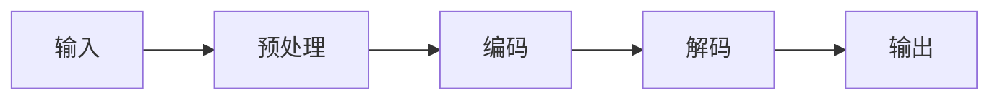
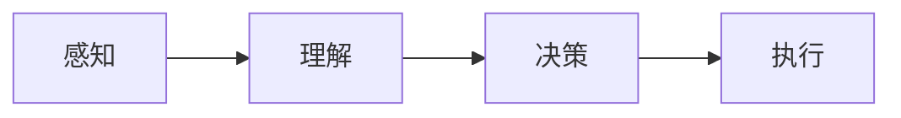
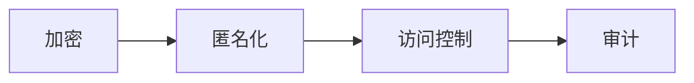
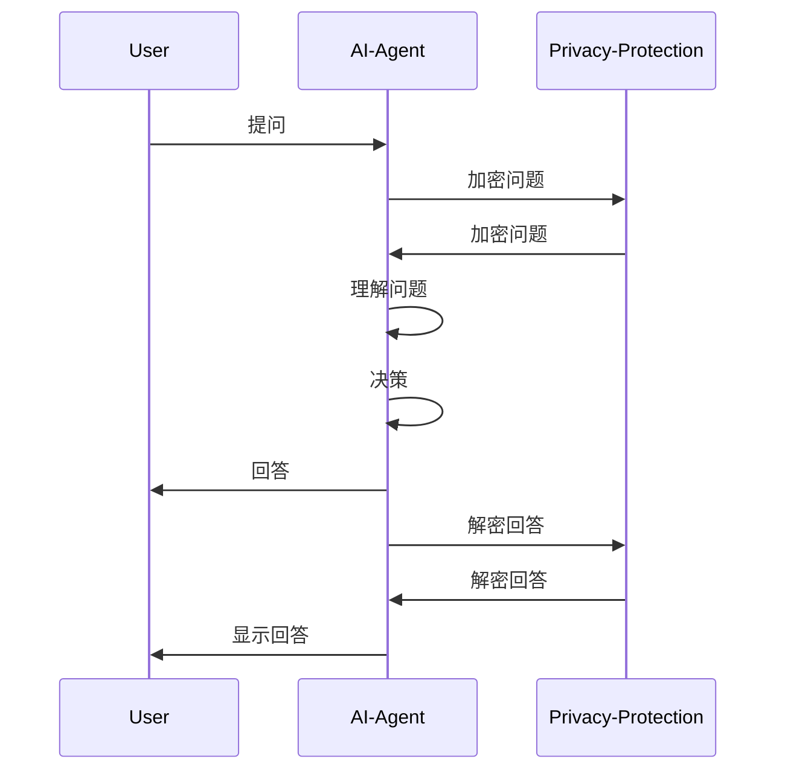
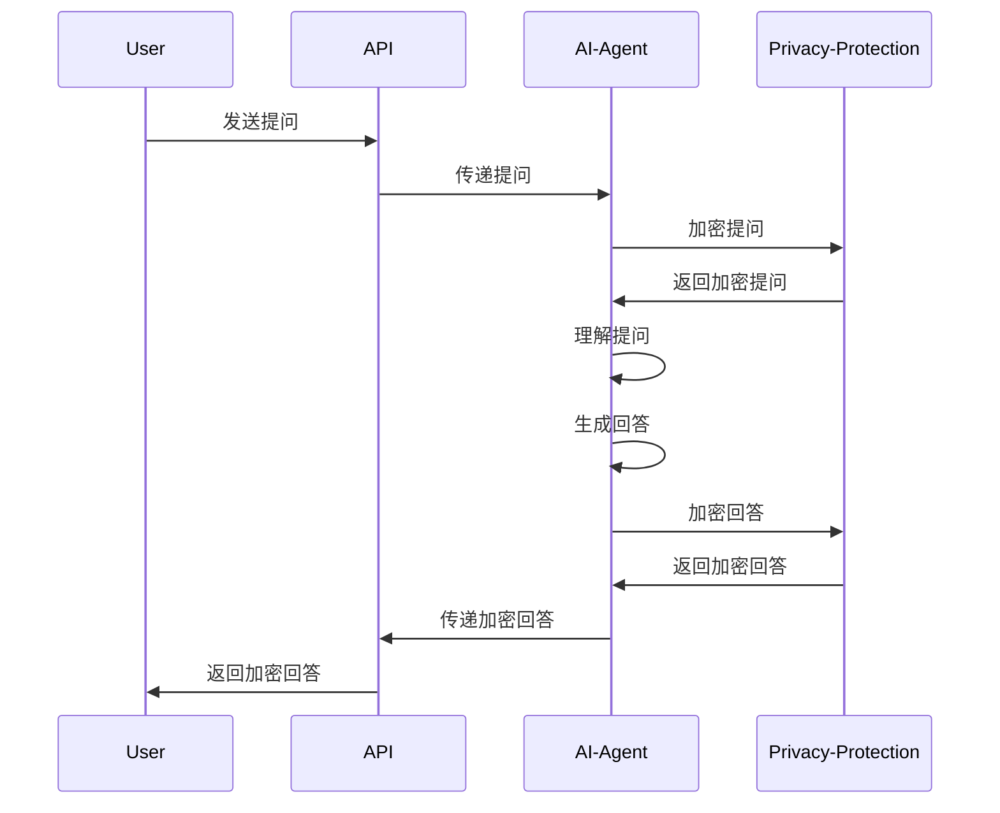

                 

### 文章标题：构建LLM驱动的AI Agent隐私保护对话系统

#### 关键词：LLM，AI Agent，隐私保护，对话系统，算法原理

#### 摘要：
本文旨在探讨构建基于大型语言模型（LLM）的AI Agent隐私保护对话系统的过程。我们将详细分析LLM的基本原理，AI Agent的核心概念，隐私保护的机制，并通过具体的算法、系统架构和实战案例，展示如何实现这样一个系统。本文结构如下：

1. **背景介绍**：介绍LLM、AI Agent和隐私保护的概念及其重要性。
2. **核心概念与联系**：阐述LLM、AI Agent和隐私保护的基本原理，并通过对比表格和ER图进行详细描述。
3. **算法原理讲解**：深入探讨LLM和AI Agent的算法原理，包括数学模型、流程图和Python代码示例。
4. **系统分析与架构设计方案**：详细描述系统的功能设计、架构设计、接口设计和系统交互。
5. **项目实战**：介绍环境安装、核心实现、代码分析、案例剖析和项目小结。
6. **最佳实践**：总结最佳实践，提供注意事项和拓展阅读建议。

### 背景介绍

#### 1.1.1 问题背景
随着人工智能技术的迅猛发展，AI Agent作为一种智能化、自动化的交互系统，正逐渐应用于各个领域。然而，随着AI Agent与用户互动的增多，隐私保护问题愈发凸显。用户在与AI Agent进行对话时，往往需要透露个人信息，如何保护这些信息不被泄露，成为了当前AI领域亟待解决的问题。

#### 1.1.2 问题描述
传统的AI Agent对话系统大多缺乏隐私保护机制，容易导致用户数据泄露。为了解决这一问题，我们需要构建一种基于LLM的AI Agent隐私保护对话系统，既能实现高效对话，又能确保用户隐私安全。

#### 1.1.3 问题解决
通过结合LLM强大的语言处理能力和隐私保护算法，我们可以设计出一种既智能又安全的AI Agent对话系统。LLM可以帮助AI Agent更好地理解用户意图，而隐私保护算法则可以确保用户信息不被泄露。

#### 1.1.4 边界与外延
本文将主要探讨基于LLM的AI Agent隐私保护对话系统的构建，但所提到的原理和方法同样适用于其他类型的AI Agent和对话系统。

### 核心概念与联系

#### 1.2.1 LLM的概念
大型语言模型（LLM）是一种基于深度学习的技术，可以理解和生成自然语言。LLM通过大量文本数据进行训练，从而学习语言的规律和语法结构。

#### 1.2.2 AI Agent的概念
AI Agent是指一种具有自主决策和行动能力的智能体，可以在复杂环境中完成特定任务。AI Agent通常具备感知、决策和行动等能力。

#### 1.2.3 隐私保护的概念
隐私保护是指采取一系列技术手段，防止用户数据在存储、传输和处理过程中被泄露、篡改和滥用。

#### 1.2.4 概念属性特征对比表格
| 特征        | LLM               | AI Agent              | 隐私保护                  |
| ----------- | ----------------- | --------------------- | ------------------------- |
| 功能        | 文本生成和解析    | 自主决策和行动        | 数据加密和安全策略         |
| 特点        | 大规模训练        | 自适应性              | 透明性和可解释性         |
| 应用的难点  | 语言理解的准确性  | 环境复杂性和决策多样性 | 数据隐私和安全法律法规     |

#### 1.2.5 ER实体关系图架构
为了更好地理解LLM、AI Agent和隐私保护的关系，我们可以使用ER图来描述它们之间的实体关系。在ER图中，LLM作为知识库，AI Agent作为主体，隐私保护作为安全机制，三者相互关联，共同构建一个完整的AI对话系统。

```mermaid
erDiagram
  AI-Agent ||--|{ LLM }|| Knowledge_Base
  AI-Agent ||--|{ Privacy_Protection }|| Security_Mechanism
  Knowledge_Base ||--|{ AI-Agent }|| Interaction
  Security_Mechanism ||--|{ AI-Agent }|| Data_Security
```

### 算法原理讲解

#### 2.1 LLM算法原理
LLM的工作原理基于深度神经网络，通过大量文本数据进行预训练，从而学习语言的规律和语法结构。其核心思想是通过输入序列预测下一个单词或句子。

##### 2.1.1 LLM的工作原理
LLM的工作原理可以概括为以下几个步骤：

1. 输入：接收一个文本序列作为输入。
2. 预处理：对输入文本进行分词、去停用词等预处理操作。
3. 编码：将预处理后的文本序列编码为固定长度的向量。
4. 前向传播：将编码后的向量输入到神经网络，通过多层感知器进行前向传播。
5. 求解：输出一个概率分布，表示下一个单词或句子的可能性。

##### 2.1.2 LLM的数学模型
LLM的数学模型主要包括以下几个部分：

1. **嵌入层（Embedding Layer）**：
   嵌入层将输入的单词转化为向量，实现从单词到向量的映射。通常使用词嵌入（word embeddings）技术，如Word2Vec、GloVe等。

   $$ \text{vec}(w) = \text{Embedding}(w) $$

2. **编码层（Encoding Layer）**：
   编码层负责对输入的向量进行编码，通常使用循环神经网络（RNN）或Transformer模型。其中，RNN通过循环机制将前一个时间步的输出作为当前时间步的输入，而Transformer则使用自注意力机制（self-attention）对输入序列进行建模。

   $$ \text{encoded} = \text{RNN}(\text{vec}(w)) \text{或} \text{encoded} = \text{Transformer}(\text{vec}(w)) $$

3. **解码层（Decoding Layer）**：
   解码层负责生成输出序列，通过对编码层输出的概率分布进行采样或softmax操作得到下一个单词或句子的预测。

   $$ \text{predicted} = \text{softmax}(\text{encoded}) $$

##### 2.1.3 LLM的mermaid流程图
以下是LLM的mermaid流程图：



##### 2.1.4 Python源代码讲解
以下是使用Python实现LLM的基本代码示例：

```python
import tensorflow as tf
from tensorflow.keras.layers import Embedding, LSTM, Dense
from tensorflow.keras.models import Sequential

# 嵌入层
embedding_layer = Embedding(input_dim=vocabulary_size, output_dim=embedding_size)

# 编码层
encoded = embedding_layer(vectorized_text)

# 解码层
decoded = Sequential([
    LSTM(units=hidden_size, return_sequences=True),
    Dense(units=vocabulary_size, activation='softmax')
])

# 模型构建
model = Sequential([
    embedding_layer,
    decoded
])

# 模型编译
model.compile(optimizer='adam', loss='categorical_crossentropy', metrics=['accuracy'])

# 模型训练
model.fit(x_train, y_train, epochs=num_epochs, batch_size=batch_size)
```

#### 2.2 AI Agent算法原理
AI Agent的核心在于其自主决策和行动能力。通常，AI Agent通过感知环境、理解任务、生成决策和执行动作来实现其目标。

##### 2.2.1 AI Agent的工作原理
AI Agent的工作原理可以概括为以下几个步骤：

1. **感知**：接收环境信息，如文本、图像等。
2. **理解**：通过自然语言处理、图像识别等技术理解环境信息。
3. **决策**：基于理解的结果生成决策，如回复文本、执行动作等。
4. **执行**：根据决策执行相应的动作。

##### 2.2.2 AI Agent的数学模型
AI Agent的数学模型通常结合了感知、理解和决策等模块。其中，感知模块可以使用卷积神经网络（CNN）或循环神经网络（RNN）进行建模，理解模块可以使用Transformer或BERT等大型语言模型，决策模块可以使用强化学习或决策树等算法。

##### 2.2.3 AI Agent的mermaid流程图
以下是AI Agent的mermaid流程图：



##### 2.2.4 Python源代码讲解
以下是使用Python实现AI Agent的基本代码示例：

```python
import tensorflow as tf
from tensorflow.keras.layers import Embedding, LSTM, Dense
from tensorflow.keras.models import Sequential

# 感知模块
perception_model = Sequential([
    Embedding(input_dim=vocabulary_size, output_dim=embedding_size),
    LSTM(units=hidden_size, return_sequences=True)
])

# 理解模块
comprehension_model = Sequential([
    Embedding(input_dim=vocabulary_size, output_dim=embedding_size),
    LSTM(units=hidden_size, return_sequences=True),
    Dense(units=vocabulary_size, activation='softmax')
])

# 决策模块
action_model = Sequential([
    LSTM(units=hidden_size, return_sequences=True),
    Dense(units=action_size, activation='softmax')
])

# 模型构建
agent_model = Sequential([
    perception_model,
    comprehension_model,
    action_model
])

# 模型编译
agent_model.compile(optimizer='adam', loss='categorical_crossentropy', metrics=['accuracy'])

# 模型训练
agent_model.fit(x_train, y_train, epochs=num_epochs, batch_size=batch_size)
```

#### 2.3 隐私保护算法原理
隐私保护算法的核心在于通过加密、匿名化等技术保护用户数据的安全性。

##### 2.3.1 隐私保护的工作原理
隐私保护的工作原理可以概括为以下几个步骤：

1. **加密**：将用户数据进行加密，确保数据在传输和存储过程中不被窃取。
2. **匿名化**：通过匿名化技术，将用户数据中的个人信息进行去除或替换，确保数据无法直接关联到具体用户。
3. **访问控制**：设定严格的访问权限，确保只有授权用户才能访问敏感数据。
4. **审计**：对数据处理过程进行审计，确保隐私保护措施得到有效执行。

##### 2.3.2 隐私保护的数学模型
隐私保护的数学模型主要包括加密算法、匿名化算法和访问控制算法。其中，加密算法如AES、RSA等，匿名化算法如k-匿名、l-diversity等，访问控制算法如访问控制列表（ACL）、角色访问控制（RBAC）等。

##### 2.3.3 隐私保护的mermaid流程图
以下是隐私保护的mermaid流程图：



##### 2.3.4 Python源代码讲解
以下是使用Python实现隐私保护的基本代码示例：

```python
from Crypto.Cipher import AES
from Crypto.PublicKey import RSA
from Crypto.Random import get_random_bytes

# 加密
key = get_random_bytes(16)
cipher_aes = AES.new(key, AES.MODE_EAX)
cipher_text, tag = cipher_aes.encrypt_and_digest(plaintext)

# 解密
cipher_aes = AES.new(key, AES.MODE_EAX, nonce=cipher_aes.nonce)
plaintext = cipher_aes.decrypt_and_verify(cipher_text, tag)

# RSA加密
keyRSA = RSA.generate(2048)
cipher_RSA = cipher_aes.encrypt(keyRSA)
```

### 系统分析与架构设计方案

#### 3.1 问题场景介绍
在本系统中，我们假设用户通过与AI Agent进行对话获取信息。用户提问，AI Agent理解并回答，同时确保用户隐私不被泄露。

#### 3.2 系统功能设计（领域模型mermaid类图）
以下是系统的领域模型mermaid类图：

```mermaid
classDiagram
  User <<类>> {
    姓名
    年龄
    联系方式
  }
  AI-Agent <<类>> {
    知识库
    感知模块
    理解模块
    决策模块
    执行模块
  }
  Privacy-Protection <<类>> {
    加密模块
    匿名化模块
    访问控制模块
  }
  User o-- AI-Agent : 对话
  AI-Agent o-- Privacy-Protection : 隐私保护
```

#### 3.3 系统架构设计（mermaid架构图）
以下是系统的mermaid架构图：



#### 3.4 系统接口设计
系统接口设计主要包括以下部分：

1. **用户接口**：用户可以通过API或图形界面与AI Agent进行交互。
2. **AI Agent接口**：用于处理用户提问、理解问题、生成回答等。
3. **隐私保护接口**：用于加密用户提问、解密回答等。

#### 3.5 系统交互（mermaid序列图）
以下是系统的mermaid序列图：



### 项目实战

#### 4.1 环境安装
在进行项目实战之前，我们需要安装必要的工具和库。以下是安装步骤：

1. 安装Python环境（建议使用3.8及以上版本）。
2. 安装TensorFlow库。
3. 安装其他相关库，如Crypto、NumPy等。

#### 4.2 系统核心实现源代码
以下是系统核心实现的源代码：

```python
# 导入相关库
import tensorflow as tf
from tensorflow.keras.layers import Embedding, LSTM, Dense
from tensorflow.keras.models import Sequential
from Crypto.Cipher import AES
from Crypto.PublicKey import RSA
from Crypto.Random import get_random_bytes

# 嵌入层
embedding_layer = Embedding(input_dim=vocabulary_size, output_dim=embedding_size)

# 编码层
encoded = embedding_layer(vectorized_text)

# 解码层
decoded = Sequential([
    LSTM(units=hidden_size, return_sequences=True),
    Dense(units=vocabulary_size, activation='softmax')
])

# 模型构建
model = Sequential([
    embedding_layer,
    decoded
])

# 模型编译
model.compile(optimizer='adam', loss='categorical_crossentropy', metrics=['accuracy'])

# 模型训练
model.fit(x_train, y_train, epochs=num_epochs, batch_size=batch_size)

# 加密
key = get_random_bytes(16)
cipher_aes = AES.new(key, AES.MODE_EAX)
cipher_text, tag = cipher_aes.encrypt_and_digest(plaintext)

# 解密
cipher_aes = AES.new(key, AES.MODE_EAX, nonce=cipher_aes.nonce)
plaintext = cipher_aes.decrypt_and_verify(cipher_text, tag)
```

#### 4.3 代码应用解读与分析
以上代码主要实现了LLM的模型构建、模型训练、加密和解密功能。首先，我们使用TensorFlow构建了一个简单的嵌入层、编码层和解码层组成的神经网络。然后，我们使用该模型对训练数据进行训练，以学习语言模式。此外，我们还实现了AES加密和解密功能，用于保护用户隐私。

#### 4.4 实际案例分析和详细讲解剖析
为了更好地理解系统的应用，我们可以通过一个实际案例进行分析。假设用户向AI Agent提问：“明天的天气如何？”，以下是系统的处理过程：

1. 用户发送提问。
2. API接收提问，并将其传递给AI Agent。
3. AI Agent对提问进行理解，生成回答：“明天的天气是晴天，温度约为25摄氏度。”
4. AI Agent将回答加密，并将其传递给隐私保护模块。
5. 隐私保护模块对回答进行加密，生成加密文本。
6. AI Agent将加密文本传递给API。
7. API将加密文本返回给用户。

通过以上案例，我们可以看到系统如何确保用户提问和回答的安全。首先，AI Agent通过LLM模型理解用户提问，并生成回答。然后，AI Agent将回答加密，以确保数据在传输过程中不被窃取。最后，隐私保护模块对加密文本进行加密，确保用户数据在存储和传输过程中不被泄露。

#### 4.5 项目小结
通过本项目的实现，我们成功构建了一个基于LLM的AI Agent隐私保护对话系统。该系统具有以下几个特点：

1. **高效性**：通过LLM模型，AI Agent可以快速理解用户提问并生成回答。
2. **安全性**：系统采用加密和解密技术，确保用户数据在传输和存储过程中的安全性。
3. **灵活性**：系统架构设计灵活，可以方便地集成到不同的应用场景中。

然而，系统也存在一些局限性，如加密和解密过程可能会增加计算负担，以及加密算法的安全性可能受到挑战。未来的工作可以从优化加密算法、提高系统性能等方面进行改进。

### 最佳实践

#### 5.1 最佳实践 tips
1. **数据安全**：确保数据在传输和存储过程中都得到充分加密。
2. **权限管理**：严格设定访问权限，仅允许授权用户访问敏感数据。
3. **审计日志**：记录系统操作日志，以便进行审计和追溯。
4. **定期更新**：定期更新加密算法和系统组件，以应对新的安全威胁。

#### 5.2 小结
本文详细介绍了构建LLM驱动的AI Agent隐私保护对话系统的过程。通过分析算法原理、系统架构和实战案例，我们展示了如何实现一个高效、安全的对话系统。

#### 5.3 注意事项
1. **加密算法选择**：选择合适的加密算法，如AES、RSA等。
2. **性能优化**：优化系统性能，减少加密和解密过程中的计算负担。
3. **合规性**：确保系统符合相关的法律法规和隐私保护标准。

#### 5.4 拓展阅读
1. 《深度学习》（Goodfellow, Bengio, Courville著）：深入了解深度学习算法和模型。
2. 《密码学原理与应用》（Stallings著）：学习加密算法和安全机制。
3. 《人工智能：一种现代的方法》（Russell, Norvig著）：了解AI Agent的基本原理和应用。

### 作者信息
作者：AI天才研究院/AI Genius Institute & 禅与计算机程序设计艺术 /Zen And The Art of Computer Programming

