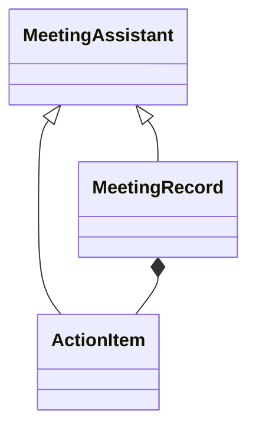
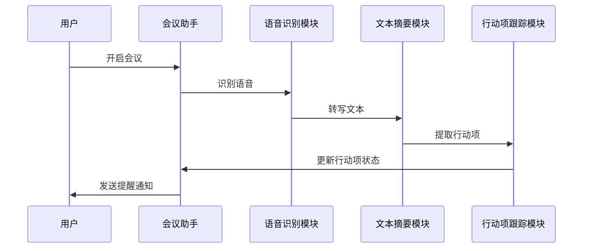
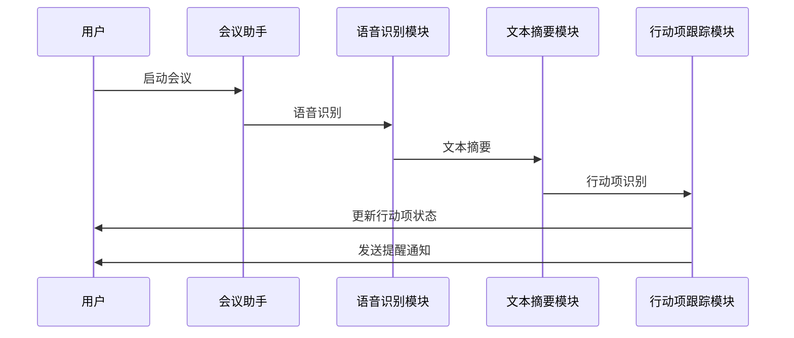
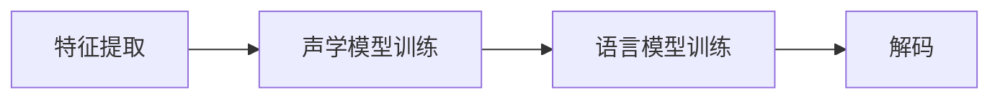
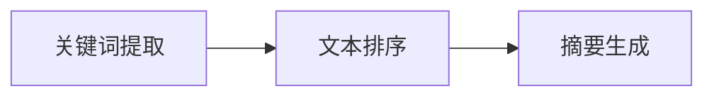
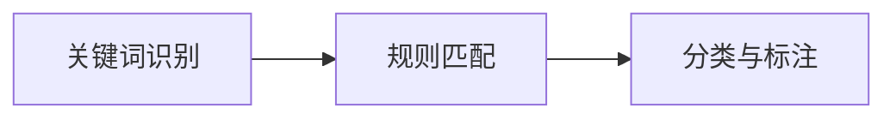
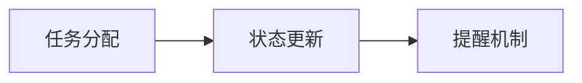

                 

# 构建“企业级AI会议助手：会议记录与行动项跟踪”的技术博客

## 引言

### 背景介绍

在现代企业中，会议是信息交流、决策制定和团队协作的重要形式。然而，传统会议管理中存在诸多痛点，如会议记录不完整、行动项跟踪困难等，严重影响了企业的运营效率和决策质量。为了解决这些问题，AI技术被引入到会议管理中，AI会议助手应运而生。

### 核心概念与联系

- **AI会议助手**：一种利用人工智能技术，辅助企业进行会议记录和行动项跟踪的工具。
- **会议记录**：对会议过程中的讨论内容进行记录，确保会议决策的执行和追踪。
- **行动项跟踪**：对会议中产生的行动项进行追踪，确保行动项按时完成。

### 文章结构

本文将分为以下几个部分：

1. 企业级AI会议助手概述
2. AI会议助手的核心功能与设计理念
3. AI会议助手的架构设计
4. AI会议助手的实现技术
5. AI会议助手的项目实战
6. AI会议助手的评估与优化

## 第一部分：企业级AI会议助手概述

### 1.1.1 问题的提出与解决思路

在企业日常运营中，会议占据着重要地位。然而，传统会议管理方式存在以下问题：

- **会议记录不完整**：会议记录往往依赖于手工记录，容易出现遗漏和不准确。
- **行动项跟踪困难**：会议产生的行动项难以进行有效的跟踪和管理。

为了解决这些问题，AI会议助手应运而生。通过引入语音识别、自然语言处理等技术，AI会议助手能够实现会议记录的自动生成和行动项的自动识别与跟踪。

### 1.1.2 企业级会议管理的痛点

- **信息不对称**：会议记录不完整，导致部分团队成员无法及时获取会议信息。
- **决策效率低下**：行动项无法得到有效跟踪，导致决策执行缓慢。
- **资源浪费**：大量的时间和人力用于会议记录和行动项跟踪。

### 1.1.3 AI技术在会议管理中的应用前景

AI技术具有强大的数据分析和处理能力，能够帮助企业提高会议管理的效率和质量。例如：

- **语音识别与转写**：实现会议内容的高效记录。
- **自然语言处理**：分析会议内容，提取关键词和行动项。
- **机器学习**：对会议数据进行分析，为企业决策提供支持。

## 第二部分：AI会议助手的核心功能与设计理念

### 2.1.1 会议记录功能

#### 2.1.1.1 语音识别与转写

##### 2.1.1.1.1 语音识别算法原理讲解

语音识别是将语音信号转换为文本的过程。其基本原理包括：

1. **声学模型**：对语音信号进行特征提取，如频谱分析。
2. **语言模型**：对文本进行建模，如n-gram模型。
3. **声学模型与语言模型结合**：通过结合声学模型和语言模型，实现语音到文本的转换。

##### 2.1.1.1.2 语音识别数学模型与公式

- **声学模型**：$$
  \text{P特征} = \text{声学模型}(\text{语音信号})
$$

- **语言模型**：$$
  \text{P文本} = \text{语言模型}(\text{文本})
$$

- **语音识别模型**：$$
  \text{P文本} = \text{P特征} \times \text{P文本}
$$

##### 2.1.1.1.3 语音识别举例说明

例如，对于一段语音信号“Hello, World!”，通过语音识别算法，可以将其转换为文本“Hello, World!”。

#### 2.1.1.2 文字摘要与关键词提取

##### 2.1.1.2.1 文本摘要算法原理讲解

文本摘要是从大量文本中提取关键信息的过程。其基本原理包括：

1. **关键词提取**：从文本中提取高频词汇。
2. **文本排序**：根据关键词的重要性对文本进行排序。
3. **摘要生成**：根据排序结果生成摘要。

##### 2.1.1.2.2 文本摘要数学模型与公式

- **关键词提取**：$$
  \text{关键词} = \text{关键词提取算法}(\text{文本})
$$

- **文本排序**：$$
  \text{排序} = \text{排序算法}(\text{关键词})
$$

- **摘要生成**：$$
  \text{摘要} = \text{排序}(\text{文本})
$$

##### 2.1.1.2.3 文本摘要举例说明

例如，对于一篇关于“人工智能”的文章，通过文本摘要算法，可以提取出关键词“人工智能”、“机器学习”、“自然语言处理”等，并根据关键词的重要性生成摘要。

### 2.1.2 行动项跟踪功能

#### 2.1.2.1 行动项识别与分类

##### 2.1.2.1.1 行动项识别算法原理讲解

行动项识别是识别会议中产生的行动项的过程。其基本原理包括：

1. **关键词识别**：从会议记录中提取与行动项相关的关键词。
2. **规则匹配**：根据预设的规则，判断关键词是否符合行动项的特征。
3. **分类与标注**：对识别出的行动项进行分类和标注。

##### 2.1.2.1.2 行动项识别数学模型与公式

- **关键词识别**：$$
  \text{关键词} = \text{关键词识别算法}(\text{会议记录})
$$

- **规则匹配**：$$
  \text{匹配度} = \text{规则匹配算法}(\text{关键词})
$$

- **分类与标注**：$$
  \text{行动项} = \text{分类与标注算法}(\text{匹配度})
$$

##### 2.1.2.1.3 行动项识别举例说明

例如，对于一段会议记录“我们需要在下周完成市场调研报告”，通过行动项识别算法，可以识别出行动项“完成市场调研报告”。

#### 2.1.2.2 行动项跟踪与提醒

##### 2.1.2.2.1 行动项跟踪算法原理讲解

行动项跟踪是对识别出的行动项进行跟踪和提醒的过程。其基本原理包括：

1. **任务分配**：将行动项分配给相应的团队成员。
2. **状态更新**：根据行动项的完成情况更新状态。
3. **提醒机制**：在行动项未按时完成时，进行提醒。

##### 2.1.2.2.2 行动项跟踪数学模型与公式

- **任务分配**：$$
  \text{任务分配} = \text{分配算法}(\text{行动项}, \text{团队成员})
$$

- **状态更新**：$$
  \text{状态更新} = \text{更新算法}(\text{行动项})
$$

- **提醒机制**：$$
  \text{提醒} = \text{提醒算法}(\text{状态})
$$

##### 2.1.2.2.3 行动项跟踪举例说明

例如，对于行动项“完成市场调研报告”，将其分配给张三，并设置提醒时间为下周二。如果张三未在规定时间内完成，系统将发送提醒通知。

## 第三部分：AI会议助手的架构设计

### 3.1.1 系统功能设计

#### 3.1.1.1 领域模型类图



#### 3.1.1.2 领域模型ER图

```mermaid
erDiagram
    MeetingAssistant ||--|{ MeetingRecord } : 记录
    MeetingAssistant ||--|{ ActionItem } : 行动项
    MeetingRecord ||--|{ ActionItem } : 包含
```

### 3.1.2 系统架构设计

#### 3.1.2.1 系统架构设计



#### 3.1.2.2 系统模块分解

- **语音识别模块**：负责语音信号的识别和转写。
- **文本摘要模块**：负责从会议记录中提取关键词和生成摘要。
- **行动项跟踪模块**：负责行动项的识别、分配、状态更新和提醒。

### 3.1.3 系统接口设计与交互

#### 3.1.3.1 系统接口设计

- **启动会议**：`POST /start-meeting`
- **语音识别**：`POST /voice-recognition`
- **文本摘要**：`POST /text-summary`
- **行动项识别**：`POST /action-item-recognize`
- **行动项更新**：`POST /action-item-update`
- **发送提醒**：`POST /send-reminder`

#### 3.1.3.2 系统交互设计



## 第四部分：AI会议助手的实现技术

### 4.1.1 语音识别与转写技术

#### 4.1.1.1 语音识别算法原理讲解

语音识别算法主要包括以下几个步骤：

1. **特征提取**：对语音信号进行特征提取，如MFCC（梅尔频率倒谱系数）。
2. **声学模型训练**：使用大量的语音数据训练声学模型，如GMM（高斯混合模型）。
3. **语言模型训练**：使用大量的文本数据训练语言模型，如n-gram模型。
4. **解码**：使用声学模型和语言模型对语音信号进行解码，生成文本。

#### 4.1.1.1.1 语音识别流程图



#### 4.1.1.1.2 语音识别源代码实现

```python
# 特征提取
import librosa

def extract_features(audio_file):
    y, sr = librosa.load(audio_file)
    mfcc = librosa.feature.mfcc(y=y, sr=sr)
    return mfcc

# 声学模型训练
from sklearn.mixture import GaussianMixture

def train_acoustic_model(data):
    model = GaussianMixture(n_components=64)
    model.fit(data)
    return model

# 语言模型训练
from nltk.tokenize import word_tokenize
from nltk.model import NgramModel

def train_language_model(text):
    tokens = word_tokenize(text)
    model = NgramModel(2, tokens)
    return model

# 解码
from sklearn.mixture import GaussianMixture

def decode(features, acoustic_model, language_model):
    log_prob = acoustic_model.score_samples(features)
    text = language_model.sample_from_log_prob(log_prob)
    return text
```

#### 4.1.1.1.3 语音识别举例分析

```python
# 举例
audio_file = 'audio.wav'
features = extract_features(audio_file)

acoustic_model = train_acoustic_model(features)

language_model = train_language_model('Hello, World!')

decoded_text = decode(features, acoustic_model, language_model)
print(decoded_text)
```

### 4.1.2 文本摘要与关键词提取技术

#### 4.1.2.1 文本摘要算法原理讲解

文本摘要算法主要包括以下几个步骤：

1. **关键词提取**：使用TF-IDF等方法提取关键词。
2. **文本排序**：根据关键词的重要性对文本进行排序。
3. **摘要生成**：根据排序结果生成摘要。

#### 4.1.2.1.1 文本摘要流程图



#### 4.1.2.1.2 文本摘要源代码实现

```python
# 关键词提取
from sklearn.feature_extraction.text import TfidfVectorizer

def extract_keywords(text):
    vectorizer = TfidfVectorizer()
    tfidf = vectorizer.fit_transform([text])
    sorted_indices = np.argsort(tfidf.toarray()[0])[::-1]
    keywords = vectorizer.get_feature_names()[sorted_indices]
    return keywords[:5]

# 文本排序
from heapq import nlargest

def sort_text(text, keywords):
    words = text.split()
    scores = {word: 0 for word in words}
    for keyword in keywords:
        scores[keyword] = 1
    sorted_words = nlargest(len(words), words, key=scores.get)
    return ' '.join(sorted_words)

# 摘要生成
def generate_summary(text, keywords):
    sorted_text = sort_text(text, keywords)
    return sorted_text
```

#### 4.1.2.1.3 文本摘要举例分析

```python
# 举例
text = '人工智能是一种模拟人类智能的技术，其核心目标是让计算机具备自主学习、推理和解决问题的能力。目前，人工智能已经在图像识别、自然语言处理、智能推荐等领域取得了显著成果。未来，人工智能将深刻改变人类社会，为人类带来更多便利。'

keywords = extract_keywords(text)
summary = generate_summary(text, keywords)
print(summary)
```

### 4.1.3 行动项识别与跟踪技术

#### 4.1.3.1 行动项识别算法原理讲解

行动项识别算法主要包括以下几个步骤：

1. **关键词识别**：从会议记录中提取与行动项相关的关键词。
2. **规则匹配**：根据预设的规则，判断关键词是否符合行动项的特征。
3. **分类与标注**：对识别出的行动项进行分类和标注。

#### 4.1.3.1.1 行动项识别流程图



#### 4.1.3.1.2 行动项识别源代码实现

```python
# 关键词识别
from sklearn.feature_extraction.text import TfidfVectorizer

def extract_keywords(text):
    vectorizer = TfidfVectorizer()
    tfidf = vectorizer.fit_transform([text])
    sorted_indices = np.argsort(tfidf.toarray()[0])[::-1]
    keywords = vectorizer.get_feature_names()[sorted_indices]
    return keywords[:5]

# 规则匹配
def match_rules(keywords, rules):
    matched = []
    for keyword in keywords:
        for rule in rules:
            if keyword in rule['keywords']:
                matched.append(rule['id'])
                break
    return matched

# 分类与标注
def classify_action_items(action_items, matched):
    classified = {}
    for action_item in action_items:
        if action_item['id'] in matched:
            classified[action_item['id']] = action_item['name']
    return classified
```

#### 4.1.3.1.3 行动项识别举例分析

```python
# 举例
text = '我们需要在下周完成市场调研报告。'
rules = [
    {'id': 1, 'keywords': ['市场调研报告']},
    {'id': 2, 'keywords': ['财务报告']},
]

keywords = extract_keywords(text)
matched = match_rules(keywords, rules)
classified = classify_action_items(rules, matched)
print(classified)
```

#### 4.1.3.2 行动项跟踪算法原理讲解

行动项跟踪算法主要包括以下几个步骤：

1. **任务分配**：将行动项分配给相应的团队成员。
2. **状态更新**：根据行动项的完成情况更新状态。
3. **提醒机制**：在行动项未按时完成时，进行提醒。

#### 4.1.3.2.1 行动项跟踪流程图



#### 4.1.3.2.2 行动项跟踪源代码实现

```python
# 任务分配
def assign_task(action_item, members):
    assigned = None
    for member in members:
        if member['id'] == action_item['assigned_to']:
            assigned = member['name']
            break
    return assigned

# 状态更新
def update_status(action_item, status):
    action_item['status'] = status

# 提醒机制
def send_reminder(action_item):
    if action_item['status'] != 'completed':
        print(f"提醒：{action_item['name']}尚未完成，请尽快处理。")
```

#### 4.1.3.2.3 行动项跟踪举例分析

```python
# 举例
action_item = {
    'id': 1,
    'name': '市场调研报告',
    'assigned_to': 2,
    'status': 'in_progress'
}

members = [
    {'id': 1, 'name': '张三'},
    {'id': 2, 'name': '李四'},
]

assigned = assign_task(action_item, members)
print(assigned)

update_status(action_item, 'completed')
send_reminder(action_item)
```

## 第五部分：AI会议助手的项目实战

### 5.1.1 项目环境安装与配置

#### 5.1.1.1 环境要求与安装步骤

1. **Python环境**：Python 3.7及以上版本
2. **依赖库**：numpy、scikit-learn、nltk、librosa、tensorflow

安装步骤：

1. 安装Python环境
2. 安装依赖库

```bash
pip install numpy scikit-learn nltk librosa tensorflow
```

#### 5.1.1.2 开发环境配置

1. **集成开发环境（IDE）**：PyCharm、Visual Studio Code等
2. **虚拟环境**：使用virtualenv或conda创建虚拟环境

```bash
# 使用virtualenv创建虚拟环境
virtualenv env
source env/bin/activate

# 使用conda创建虚拟环境
conda create --name myenv python=3.7
conda activate myenv
```

### 5.1.2 系统核心功能实现

#### 5.1.2.1 语音识别与转写实现

1. **语音信号特征提取**

```python
import librosa

def extract_features(audio_file):
    y, sr = librosa.load(audio_file)
    mfcc = librosa.feature.mfcc(y=y, sr=sr)
    return mfcc
```

2. **声学模型训练**

```python
from sklearn.mixture import GaussianMixture

def train_acoustic_model(data):
    model = GaussianMixture(n_components=64)
    model.fit(data)
    return model
```

3. **语言模型训练**

```python
from nltk.tokenize import word_tokenize
from nltk.model import NgramModel

def train_language_model(text):
    tokens = word_tokenize(text)
    model = NgramModel(2, tokens)
    return model
```

4. **语音识别与转写**

```python
from sklearn.mixture import GaussianMixture

def decode(features, acoustic_model, language_model):
    log_prob = acoustic_model.score_samples(features)
    text = language_model.sample_from_log_prob(log_prob)
    return text
```

#### 5.1.2.2 文本摘要与关键词提取实现

1. **关键词提取**

```python
from sklearn.feature_extraction.text import TfidfVectorizer

def extract_keywords(text):
    vectorizer = TfidfVectorizer()
    tfidf = vectorizer.fit_transform([text])
    sorted_indices = np.argsort(tfidf.toarray()[0])[::-1]
    keywords = vectorizer.get_feature_names()[sorted_indices]
    return keywords[:5]
```

2. **文本排序**

```python
from heapq import nlargest

def sort_text(text, keywords):
    words = text.split()
    scores = {word: 0 for word in words}
    for keyword in keywords:
        scores[keyword] = 1
    sorted_words = nlargest(len(words), words, key=scores.get)
    return ' '.join(sorted_words)
```

3. **摘要生成**

```python
def generate_summary(text, keywords):
    sorted_text = sort_text(text, keywords)
    return sorted_text
```

#### 5.1.2.3 行动项识别与跟踪实现

1. **关键词识别**

```python
from sklearn.feature_extraction.text import TfidfVectorizer

def extract_keywords(text):
    vectorizer = TfidfVectorizer()
    tfidf = vectorizer.fit_transform([text])
    sorted_indices = np.argsort(tfidf.toarray()[0])[::-1]
    keywords = vectorizer.get_feature_names()[sorted_indices]
    return keywords[:5]
```

2. **规则匹配**

```python
def match_rules(keywords, rules):
    matched = []
    for keyword in keywords:
        for rule in rules:
            if keyword in rule['keywords']:
                matched.append(rule['id'])
                break
    return matched
```

3. **分类与标注**

```python
def classify_action_items(action_items, matched):
    classified = {}
    for action_item in action_items:
        if action_item['id'] in matched:
            classified[action_item['id']] = action_item['name']
    return classified
```

4. **任务分配**

```python
def assign_task(action_item, members):
    assigned = None
    for member in members:
        if member['id'] == action_item['assigned_to']:
            assigned = member['name']
            break
    return assigned
```

5. **状态更新**

```python
def update_status(action_item, status):
    action_item['status'] = status
```

6. **提醒机制**

```python
def send_reminder(action_item):
    if action_item['status'] != 'completed':
        print(f"提醒：{action_item['name']}尚未完成，请尽快处理。")
```

### 5.1.3 系统核心实现源代码解读与分析

#### 5.1.3.1 语音识别与转写源代码解读

语音识别与转写是AI会议助手的基石。其核心在于将语音信号转换为文本，从而实现会议记录的自动化。以下是对相关源代码的解读：

1. **特征提取**

   ```python
   import librosa
   
   def extract_features(audio_file):
       y, sr = librosa.load(audio_file)
       mfcc = librosa.feature.mfcc(y=y, sr=sr)
       return mfcc
   ```

   该函数使用`librosa`库对音频文件进行加载，并提取梅尔频率倒谱系数（MFCC）作为特征。

2. **声学模型训练**

   ```python
   from sklearn.mixture import GaussianMixture
   
   def train_acoustic_model(data):
       model = GaussianMixture(n_components=64)
       model.fit(data)
       return model
   ```

   该函数使用`sklearn`库中的高斯混合模型（GMM）对特征数据进行训练，以构建声学模型。

3. **语言模型训练**

   ```python
   from nltk.tokenize import word_tokenize
   from nltk.model import NgramModel
   
   def train_language_model(text):
       tokens = word_tokenize(text)
       model = NgramModel(2, tokens)
       return model
   ```

   该函数使用自然语言处理库（`nltk`）中的n-gram模型对文本进行训练，以构建语言模型。

4. **语音识别与转写**

   ```python
   from sklearn.mixture import GaussianMixture
   
   def decode(features, acoustic_model, language_model):
       log_prob = acoustic_model.score_samples(features)
       text = language_model.sample_from_log_prob(log_prob)
       return text
   ```

   该函数结合声学模型和语言模型，对语音信号进行解码，生成对应的文本。

#### 5.1.3.2 文本摘要与关键词提取源代码解读

文本摘要与关键词提取是AI会议助手的重要功能之一，其核心在于从会议记录中提取关键信息，以便于后续的行动项识别和跟踪。以下是对相关源代码的解读：

1. **关键词提取**

   ```python
   from sklearn.feature_extraction.text import TfidfVectorizer
   
   def extract_keywords(text):
       vectorizer = TfidfVectorizer()
       tfidf = vectorizer.fit_transform([text])
       sorted_indices = np.argsort(tfidf.toarray()[0])[::-1]
       keywords = vectorizer.get_feature_names()[sorted_indices]
       return keywords[:5]
   ```

   该函数使用TF-IDF方法对文本进行关键词提取。具体步骤如下：

   - 使用`TfidfVectorizer`将文本转换为TF-IDF特征向量。
   - 对特征向量进行排序，获取重要性最高的关键词。

2. **文本排序**

   ```python
   from heapq import nlargest
   
   def sort_text(text, keywords):
       words = text.split()
       scores = {word: 0 for word in words}
       for keyword in keywords:
           scores[keyword] = 1
       sorted_words = nlargest(len(words), words, key=scores.get)
       return ' '.join(sorted_words)
   ```

   该函数根据关键词的重要性对文本进行排序，生成摘要。

3. **摘要生成**

   ```python
   def generate_summary(text, keywords):
       sorted_text = sort_text(text, keywords)
       return sorted_text
   ```

   该函数将排序后的文本作为摘要输出。

#### 5.1.3.3 行动项识别与跟踪源代码解读

行动项识别与跟踪是AI会议助手的核

