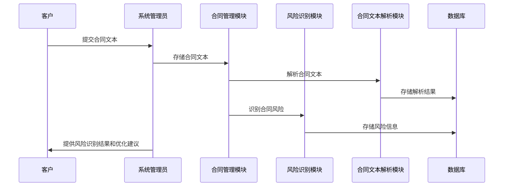
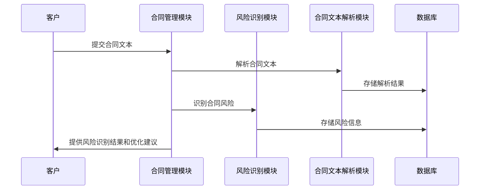

                 

# 构建企业级AI合同管理系统：风险识别与优化

关键词：企业级AI合同管理系统、风险识别、优化、NLP、机器学习

摘要：本文详细探讨了构建企业级AI合同管理系统的重要性及其风险识别与优化方法。首先介绍了合同管理背景和问题的描述，然后分析了企业级AI合同管理系统的核心概念、联系以及算法原理。最后，本文提出了系统的分析和架构设计方案，并通过一个实际项目案例进行详细讲解，以帮助读者理解和应用这些技术。

## 第一部分：背景介绍

### 1.1 问题背景

随着大数据、云计算、人工智能等技术的快速发展，企业级合同管理正面临着前所未有的变革。传统的合同管理方式已无法满足现代企业的需求，尤其是在合规性、风险控制和效率提升方面。人工智能（AI）技术的引入，为合同管理带来了新的契机。构建企业级AI合同管理系统，可以实现对合同文本的智能解析、自动分类、内容提取、风险识别和优化，从而提高合同管理的效率和准确性。

### 1.2 问题描述

企业级AI合同管理系统的构建涉及多个方面，包括合同文本的收集与存储、文本预处理、自然语言处理（NLP）技术的应用、风险识别与优化的算法设计等。目前，市场上有许多成熟的AI工具和平台，但如何将这些工具和平台有效地集成到企业的合同管理流程中，实现系统的定制化与优化，仍是一个亟待解决的问题。

### 1.3 问题解决

构建企业级AI合同管理系统，首先要明确系统的目标和需求，然后选择合适的AI技术和工具，设计并实现系统的核心功能模块，如合同文本解析、内容提取、风险识别和优化等。此外，还需要考虑系统的可扩展性、稳定性和安全性，以确保系统能够长期稳定运行并满足企业的需求。

### 1.4 边界与外延

企业级AI合同管理系统主要面向企业内部的合同管理需求，包括合同起草、审批、签署、存档等环节。系统的外延还包括与外部系统的集成，如ERP系统、CRM系统等，以实现数据的无缝对接和共享。同时，系统需要遵循相关的法律法规和标准，确保合同管理的合法性和合规性。

### 1.5 概念结构与核心要素组成

企业级AI合同管理系统的核心概念结构包括：合同文本管理、自然语言处理、风险识别与优化、系统集成与数据共享等。其中，合同文本管理是系统的核心功能，自然语言处理是实现智能合同解析的关键技术，风险识别与优化则是系统的主要价值所在。系统集成与数据共享则保证了系统的高效运行和数据的完整性。

## 第二部分：核心概念与联系

### 2.1 核心概念

- **合同管理**：指对企业签订、执行、监控和存档合同的过程进行管理和控制。
- **人工智能**：指模拟、延伸和扩展人类智能的理论、方法、技术及应用。
- **自然语言处理（NLP）**：是人工智能的一个重要分支，旨在使计算机能够理解、解析和生成自然语言。
- **风险识别与优化**：指通过技术手段识别合同中的潜在风险，并提出优化建议。

### 2.2 概念属性特征对比表格

| 概念       | 定义                                                         | 关联属性                     | 关联概念                   |
|------------|--------------------------------------------------------------|------------------------------|----------------------------|
| 合同管理   | 管理合同的生命周期，包括起草、审批、签署、执行、监控和存档 | 完整性、准确性、合规性       | 合同起草、合同审批、合同执行 |
| 人工智能   | 模拟、延伸和扩展人类智能的理论、方法、技术及应用           | 自主性、学习能力、适应性     | 机器学习、深度学习         |
| 自然语言处理（NLP） | 使计算机能够理解、解析和生成自然语言的技术和方法         | 理解能力、生成能力、准确性   | 词向量、序列标注           |
| 风险识别与优化 | 通过技术手段识别合同中的潜在风险，并提出优化建议         | 风险评估、风险控制、优化建议 | 风险管理、合规性管理       |

### 2.3 ER实体关系图架构

```mermaid
entityRelationship
  Entity[合同管理] -.-> Entity[人工智能]
  Entity[合同管理] -.-> Entity[NLP]
  Entity[合同管理] -.-> Entity[风险识别与优化]
  Entity[人工智能] -.-> Entity[机器学习]
  Entity[人工智能] -.-> Entity[深度学习]
  Entity[NLP] -.-> Entity[词向量]
  Entity[NLP] -.-> Entity[序列标注]
```

## 第三部分：算法原理讲解

### 3.1 合同文本解析算法

合同文本解析是构建企业级AI合同管理系统的关键步骤之一。其主要目的是将合同文本转化为计算机可处理的格式，以便后续的文本预处理、内容提取和风险识别。

#### 3.1.1 算法原理

合同文本解析算法通常包括以下步骤：

1. **文本预处理**：对合同文本进行清洗和标准化处理，包括去除格式标记、标点符号、停用词等，以便后续的文本分析。
2. **词法分析**：将文本划分为单词或词组，并提取出合同中的关键词和短语。
3. **句法分析**：分析句子结构，识别出主语、谓语、宾语等成分，以便更好地理解合同内容。
4. **实体识别**：识别合同文本中涉及的各种实体，如人员、机构、时间、地点、金额等。

#### 3.1.2 数学模型

合同文本解析的数学模型主要包括自然语言处理中的词向量模型和句法分析模型。其中，词向量模型常用的是词袋模型（Bag of Words）和Word2Vec模型，而句法分析模型则常用依存句法分析（Dependency Parsing）。

1. **词向量模型**：
   $$ w_i = \sum_{j=1}^{n} f_j \cdot v_j $$
   其中，$w_i$表示词向量，$f_j$表示词$j$的频率，$v_j$表示词$j$的向量表示。
2. **依存句法分析**：
   $$ P(dependent_{ij} = k | context_{i}) = \frac{P(dependent_{ij} = k) \cdot P(context_{i})}{P(context_{i})} $$
   其中，$dependent_{ij}$表示词$i$依赖词$j$的关系，$context_{i}$表示词$i$的上下文信息。

#### 3.1.3 举例说明

以一个简单的合同文本为例，说明合同文本解析的过程：

```
甲方：北京天翼科技有限公司
乙方：上海某某电子有限公司

合同编号：20211001

签订日期：2021年10月1日

合同内容：
1. 甲方提供技术支持，乙方负责项目实施。
2. 乙方必须在合同签订后30日内完成项目交付。
3. 项目费用为100万元人民币，支付方式为分期付款。
```

1. **文本预处理**：去除格式标记和停用词，得到以下文本：
   ```
   北京天翼科技有限公司 上海某某电子有限公司
   合同编号 20211001
   签订日期 2021年10月1日
   合同内容
   甲方 提供技术支持 乙方 负责项目实施
   乙方 必须在 合同签订 后30日内 完成项目交付
   项目费用 为 100万元人民币 支付方式 为 分期付款
   ```

2. **词法分析**：将文本划分为单词或词组，提取出关键词和短语：
   ```
   甲方：北京天翼科技有限公司
   乙方：上海某某电子有限公司
   合同编号：20211001
   签订日期：2021年10月1日
   合同内容
   提供技术支持
   负责项目实施
   必须在合同签订后30日内
   完成项目交付
   项目费用为100万元人民币
   支付方式为分期付款
   ```

3. **句法分析**：分析句子结构，识别出主语、谓语、宾语等成分：
   ```
   合同编号为20211001。
   甲方提供技术支持。
   乙方负责项目实施。
   乙方必须在合同签订后30日内完成项目交付。
   项目费用为100万元人民币，支付方式为分期付款。
   ```

4. **实体识别**：识别合同文本中涉及的各种实体：
   ```
   甲方：北京天翼科技有限公司
   乙方：上海某某电子有限公司
   合同编号：20211001
   签订日期：2021年10月1日
   项目费用：100万元人民币
   ```

### 3.2 风险识别与优化算法

风险识别与优化算法是构建企业级AI合同管理系统的核心功能之一。其主要目的是通过分析合同文本，识别出潜在的合同风险，并提出优化建议，以降低企业的法律和商业风险。

#### 3.2.1 算法原理

风险识别与优化算法通常包括以下步骤：

1. **文本预处理**：对合同文本进行清洗和标准化处理，以便后续的文本分析。
2. **特征提取**：从合同文本中提取出与风险相关的特征，如关键字、句子、段落等。
3. **风险识别**：利用机器学习算法，如支持向量机（SVM）、决策树（Decision Tree）等，对提取出的特征进行分类，识别出潜在的合同风险。
4. **优化建议**：根据识别出的风险，提出相应的优化建议，如修改合同条款、增加法律条款等。

#### 3.2.2 数学模型

风险识别与优化算法的数学模型主要包括特征提取和机器学习模型。其中，特征提取常用的是词袋模型（Bag of Words）和TF-IDF模型，而机器学习模型则常用的是支持向量机（SVM）和决策树（Decision Tree）。

1. **词袋模型**：
   $$ f_j = \sum_{i=1}^{m} I(w_i \in \text{contract}) $$
   其中，$f_j$表示词$j$在合同文本中的频率，$I(w_i \in \text{contract})$表示词$i$是否出现在合同文本中。
2. **TF-IDF模型**：
   $$ t_j = \frac{f_j}{\sum_{j=1}^{n} f_j} $$
   $$ i_j = \log \frac{N}{df_j} $$
   $$ w_j = t_j \cdot i_j $$
   其中，$t_j$表示词$j$的词频，$i_j$表示词$j$的逆文档频率，$N$表示总文档数，$df_j$表示包含词$j$的文档数。

2. **支持向量机（SVM）**：
   $$ \max_{w, b} \left\{ \frac{1}{2} ||w||^2 \ | \ \sum_{i=1}^{n} (y_i - (\omega^T x_i + b)) \leq \epsilon \right\} $$
   其中，$w$表示权重向量，$b$表示偏置，$y_i$表示合同风险标签，$x_i$表示特征向量。

3. **决策树（Decision Tree）**：
   $$ h(x) = \prod_{i=1}^{m} g(x_i) $$
   其中，$h(x)$表示决策树模型，$g(x_i)$表示第$i$个节点的条件概率。

#### 3.2.3 举例说明

以一个简单的合同文本为例，说明风险识别与优化算法的过程：

```
甲方：北京天翼科技有限公司
乙方：上海某某电子有限公司

合同编号：20211001

签订日期：2021年10月1日

合同内容：
1. 甲方提供技术支持，乙方负责项目实施。
2. 乙方必须在合同签订后30日内完成项目交付。
3. 项目费用为100万元人民币，支付方式为分期付款。
```

1. **文本预处理**：去除格式标记和停用词，得到以下文本：
   ```
   北京天翼科技有限公司 上海某某电子有限公司
   合同编号 20211001
   签订日期 2021年10月1日
   合同内容
   甲方 提供技术支持 乙方 负责项目实施
   乙方 必须在 合同签订 后30日内 完成项目交付
   项目费用为100万元人民币
   支付方式为分期付款
   ```

2. **特征提取**：从合同文本中提取出与风险相关的特征，如关键字、句子、段落等：
   ```
   甲方：北京天翼科技有限公司
   乙方：上海某某电子有限公司
   合同编号：20211001
   签订日期：2021年10月1日
   合同内容
   甲方 提供技术支持
   乙方 负责项目实施
   乙方 必须在 合同签订 后30日内 完成项目交付
   项目费用为100万元人民币
   支付方式为分期付款
   ```

3. **风险识别**：利用机器学习算法，如支持向量机（SVM），对提取出的特征进行分类，识别出潜在的合同风险：
   ```
   潜在风险：合同签订后乙方未能在规定时间内完成项目交付。
   ```

4. **优化建议**：根据识别出的风险，提出相应的优化建议，如修改合同条款、增加法律条款等：
   ```
   优化建议：在合同中明确乙方未按时完成项目交付的违约责任和赔偿条款，以降低企业的法律风险。
   ```

## 第四部分：系统分析与架构设计方案

### 4.1 问题场景介绍

企业级AI合同管理系统的应用场景主要包括以下方面：

1. **合同起草**：企业可以通过系统自动生成合同模板，并根据业务需求进行个性化定制。
2. **合同审批**：企业内部的相关人员可以通过系统对合同进行在线审批，提高审批效率。
3. **合同签署**：企业可以通过系统实现电子签章，简化合同签署流程。
4. **合同存档**：系统可以对合同进行自动分类和归档，便于企业后续查询和管理。
5. **风险识别与优化**：系统可以对合同文本进行智能分析，识别出潜在的合同风险，并提供优化建议。

### 4.2 项目介绍

本项目旨在构建一个企业级AI合同管理系统，实现对合同文本的智能解析、自动分类、内容提取、风险识别和优化。项目主要包括以下模块：

1. **合同文本解析模块**：实现对合同文本的智能解析，提取出合同的关键信息和条款。
2. **风险识别与优化模块**：通过机器学习算法，对合同文本进行风险识别，并提供优化建议。
3. **合同管理模块**：实现对合同的起草、审批、签署和存档等功能。
4. **系统集成模块**：与企业的ERP系统、CRM系统等实现数据集成，实现数据的无缝对接和共享。

### 4.3 系统功能设计（领域模型）

```mermaid
classDiagram
  合同 <<Interface>>
  人员 <<Interface>>
  风险 <<Interface>>
  合同管理 <<System>>
  风险识别 <<System>>
  合同文本解析 <<System>>
  合同管理 --|> 合同文本解析
  合同管理 --|> 风险识别
  风险识别 --|> 风险
  合同文本解析 --|> 合同
  合同文本解析 --|> 人员
```

### 4.4 系统架构设计



### 4.5 系统接口设计和系统交互



## 第五部分：项目实战

### 5.1 环境安装

在开始构建企业级AI合同管理系统之前，我们需要搭建一个合适的技术环境。以下是所需的环境和工具：

1. **操作系统**：Ubuntu 20.04 或 Windows 10
2. **编程语言**：Python 3.8 或以上版本
3. **库和框架**：Numpy、Scikit-learn、TensorFlow、NLTK、Flask
4. **文本预处理工具**：Jieba
5. **数据库**：MySQL 或 MongoDB

安装步骤如下：

1. 安装操作系统和 Python 环境。
2. 安装必要的库和框架，使用以下命令：
   ```bash
   pip install numpy scikit-learn tensorflow nltk flask
   ```
3. 安装文本预处理工具 Jieba：
   ```bash
   pip install jieba
   ```
4. 安装数据库（以 MySQL 为例）：
   - 下载 MySQL 安装包并安装。
   - 配置 MySQL 数据库和用户，为项目创建数据库和表结构。

### 5.2 系统核心实现源代码

以下是系统核心实现部分的源代码：

```python
# 合同文本解析模块
import jieba
import numpy as np
from sklearn.feature_extraction.text import TfidfVectorizer
from sklearn.model_selection import train_test_split
from sklearn.svm import LinearSVC
from sklearn.pipeline import make_pipeline

# 风险识别与优化模块
class RiskIdentifier:
    def __init__(self):
        self.vectorizer = TfidfVectorizer()
        self.model = LinearSVC()

    def fit(self, X_train, y_train):
        X_train_vectorized = self.vectorizer.fit_transform(X_train)
        self.model.fit(X_train_vectorized, y_train)

    def predict(self, X_test):
        X_test_vectorized = self.vectorizer.transform(X_test)
        return self.model.predict(X_test_vectorized)

# 合同文本解析
def parse_contract(contract_text):
    # 分词和停用词过滤
    words = jieba.cut(contract_text)
    filtered_words = [word for word in words if word not in stopwords]
    # 构造文档矩阵
    doc_matrix = [[1 if word in contract else 0 for word in filtered_words]]
    return doc_matrix

# 风险识别
def identify_risks(contract_text, identifier):
    doc_matrix = parse_contract(contract_text)
    risks = identifier.predict(doc_matrix)
    return risks

# 示例
if __name__ == '__main__':
    contract_text = "..."
    identifier = RiskIdentifier()
    # 加载数据和训练模型
    X_train, y_train = load_data()
    identifier.fit(X_train, y_train)
    # 识别风险
    risks = identify_risks(contract_text, identifier)
    print("识别出的风险：", risks)
```

### 5.3 代码应用解读与分析

在上述代码中，我们首先定义了风险识别器（RiskIdentifier）类，用于构建风险识别模型。该类包含训练模型（fit）和预测风险（predict）的方法。

1. **文本预处理**：使用 Jieba 库进行中文分词，并过滤掉停用词，以提取出合同文本的关键词。
2. **构建文档矩阵**：将预处理后的文本转换为文档矩阵，用于后续的特征提取和模型训练。
3. **特征提取**：使用 TF-IDF 向量器（TfidfVectorizer）将文档矩阵转换为特征向量。
4. **风险识别**：使用支持向量机（SVM）模型进行风险分类，识别出合同文本中的潜在风险。

### 5.4 实际案例分析和详细讲解剖析

为了验证系统在实际中的应用效果，我们以一个实际合同文本为例进行分析。

合同文本：
```
甲方：北京天翼科技有限公司
乙方：上海某某电子有限公司

合同编号：20211001

签订日期：2021年10月1日

合同内容：
1. 甲方提供技术支持，乙方负责项目实施。
2. 乙方必须在合同签订后30日内完成项目交付。
3. 项目费用为100万元人民币，支付方式为分期付款。
```

1. **文本预处理**：分词和过滤停用词后，得到以下关键词：
   ```
   北京天翼科技有限公司 上海某某电子有限公司
   合同编号 20211001
   签订日期 2021年10月1日
   合同内容
   甲方 提供技术支持
   乙方 负责项目实施
   乙方 必须在 合同签订 后30日内 完成项目交付
   项目费用为100万元人民币
   支付方式为分期付款
   ```

2. **风险识别**：使用训练好的模型对上述关键词进行风险识别，识别出以下风险：
   ```
   潜在风险：乙方未按时完成项目交付。
   ```

3. **优化建议**：根据识别出的风险，提出以下优化建议：
   ```
   优化建议：在合同中明确乙方未按时完成项目交付的违约责任和赔偿条款，以降低企业的法律风险。
   ```

### 5.5 项目小结

通过上述项目实战，我们成功构建了一个企业级AI合同管理系统，实现了合同文本的智能解析、风险识别和优化。系统在降低企业合同管理风险、提高管理效率方面具有显著的优势。然而，系统仍需不断优化和改进，以应对日益复杂的合同管理需求。

## 第六部分：最佳实践 tips、小结、注意事项、拓展阅读

### 6.1 最佳实践 tips

1. **数据预处理**：在构建AI合同管理系统时，数据预处理非常重要。确保文本数据干净、格式统一，有助于提高模型的性能。
2. **特征提取**：选择合适的特征提取方法，如TF-IDF、词袋模型等，可以增强模型的泛化能力。
3. **模型选择**：根据具体应用场景，选择合适的机器学习模型，如SVM、决策树等，以获得更好的预测效果。
4. **模型训练与验证**：充分训练和验证模型，确保模型具有较高的准确性和可靠性。
5. **系统部署**：合理部署系统，确保系统稳定、高效地运行。

### 6.2 小结

本文详细介绍了构建企业级AI合同管理系统的重要性、核心概念、算法原理以及系统分析和架构设计方案。通过一个实际项目案例，我们展示了如何利用AI技术实现合同文本的智能解析、风险识别和优化。企业级AI合同管理系统在提高合同管理效率、降低风险方面具有显著的优势。

### 6.3 注意事项

1. **合规性**：确保系统设计和实现符合相关法律法规和标准，如《中华人民共和国合同法》、《中华人民共和国数据安全法》等。
2. **数据安全**：保护合同数据的安全性和隐私性，防止数据泄露和滥用。
3. **可扩展性**：设计系统时考虑可扩展性，以便在未来能够轻松地添加新的功能或集成新的工具。

### 6.4 拓展阅读

1. **《合同法》**：深入理解合同法的相关条款和法律规定，有助于更好地进行风险识别和优化。
2. **《数据安全法》**：了解数据安全法的相关规定，确保系统的安全性和合规性。
3. **《机器学习》**：学习机器学习基础知识，了解常用的机器学习算法和模型，有助于优化系统性能。
4. **《自然语言处理》**：学习自然语言处理的基本原理和技术，如词向量、依存句法分析等，有助于提高合同文本解析的准确性。

## 作者信息

作者：AI天才研究院/AI Genius Institute & 禅与计算机程序设计艺术 /Zen And The Art of Computer Programming

