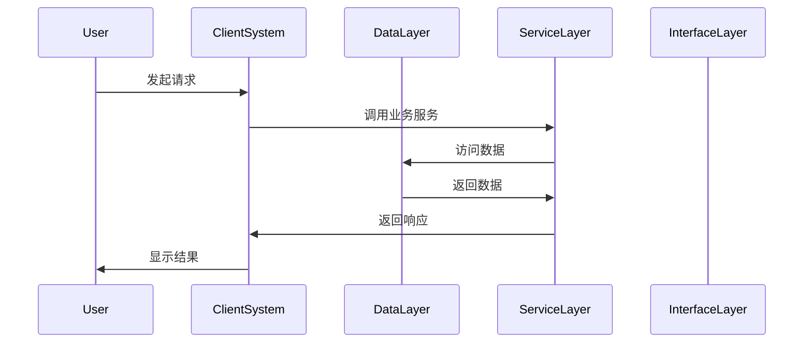
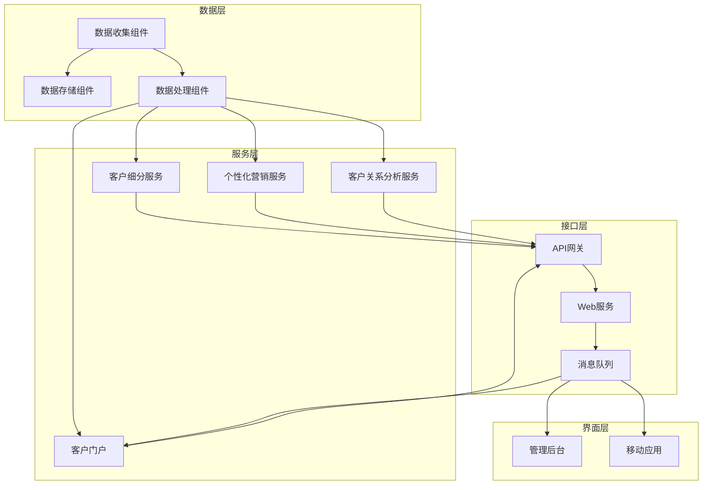
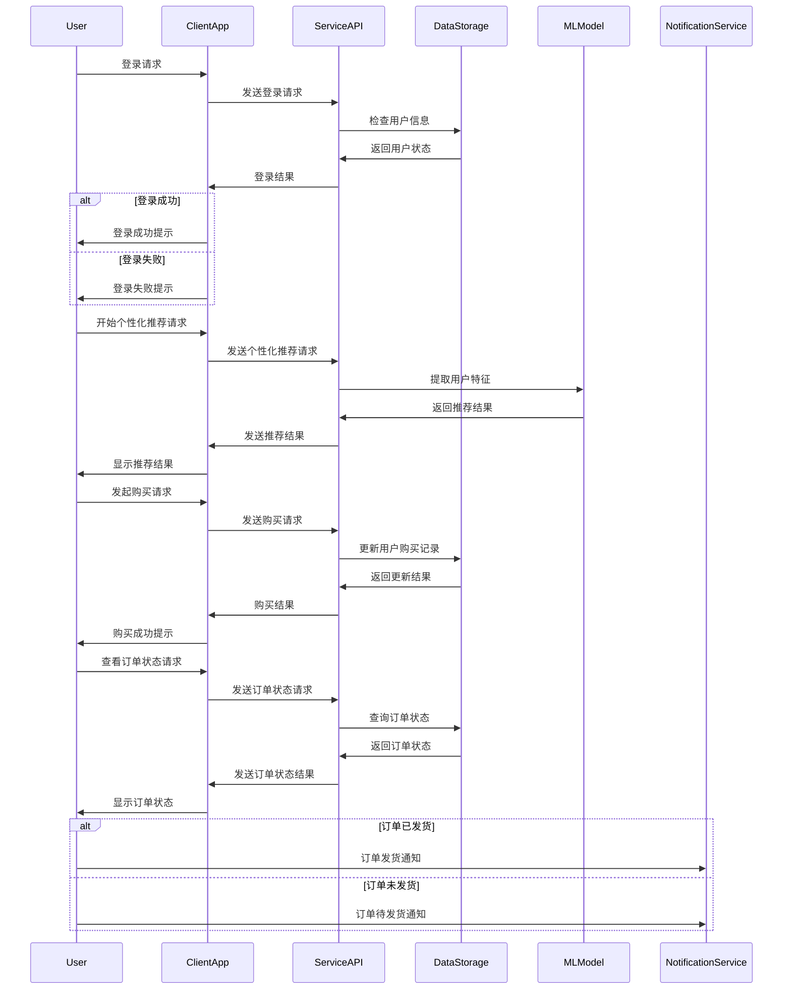

                 

### 1.1 问题背景

随着大数据、云计算、物联网等技术的迅猛发展，人工智能（AI）正在各行各业中发挥着越来越重要的作用。特别是在客户生命周期管理（Customer Lifecycle Management，简称CLM）领域，AI技术的应用已经成为提升企业竞争力的重要手段。客户生命周期管理涉及客户获取、客户维系、客户流失预警等多个环节，而AI技术在这些环节中的应用，不仅能够提高企业的运营效率，还能极大地增强客户体验。

#### 1.1.1 大数据、云计算、物联网技术对AI客户生命周期管理的影响

大数据技术为AI客户生命周期管理提供了丰富的数据资源。通过对海量客户数据的收集、存储和分析，企业可以更全面地了解客户的需求和行为，从而制定更加精准的市场策略。云计算技术则提供了强大的计算能力和灵活的部署方式，使得企业能够更快速地部署和扩展AI应用，满足不同业务场景的需求。物联网技术通过智能设备的广泛部署，使得企业可以实时获取客户的交互数据，进一步优化客户服务流程。

#### 1.1.2 AI技术如何改变传统客户关系管理

传统的客户关系管理（Customer Relationship Management，简称CRM）主要依赖于人工的干预和数据分析，存在一定的局限性。而AI技术的引入，使得客户关系管理变得更加智能化和自动化。例如，通过机器学习算法，企业可以自动识别潜在客户，进行精准营销；通过自然语言处理技术，企业可以自动分析客户反馈，提供个性化的服务；通过预测模型，企业可以提前识别可能流失的客户，并采取有效的挽回措施。

### 1.2 问题描述

尽管AI技术在客户生命周期管理中具有巨大的潜力，但企业在实际应用中仍面临着诸多挑战。

#### 1.2.1 数据质量问题

数据质量是AI客户生命周期管理的基础。然而，企业在数据收集和处理过程中，常常面临数据缺失、数据不一致、数据噪声等问题。这些问题会直接影响模型的准确性和可靠性。

#### 1.2.2 模型训练效率问题

AI客户生命周期管理涉及多个复杂的模型，如分类模型、回归模型、预测模型等。这些模型需要大量的数据来进行训练，且训练过程往往需要较长的时间。如何提高模型训练效率，是企业面临的一个重要问题。

#### 1.2.3 算法解释性不足

许多AI算法，特别是深度学习算法，具有很高的预测准确性，但它们的内部机制复杂，难以解释。这给企业在实际应用中带来了困难，特别是在需要向管理层或客户解释决策依据时。

### 1.3 问题解决

本书旨在为企业级AI客户生命周期管理系统提供一套全面的解决方案，帮助读者理解和掌握AI技术在该领域的应用。通过深入剖析AI技术的核心原理和实践方法，本书将指导读者如何构建一个高效、智能的客户生命周期管理助手。

#### 1.3.1 核心目标

本书的核心目标是：

1. **数据收集与处理**：介绍如何确保数据的完整性和准确性，为后续分析提供可靠的基础。
2. **客户细分与画像**：讲解客户细分的原理与步骤，以及如何构建详细的客户画像。
3. **个性化营销与客户服务**：探讨如何基于客户细分和画像，为客户提供个性化的服务和营销策略。
4. **客户关系分析与预测**：介绍如何利用AI技术，深入分析客户关系，预测客户行为和需求。
5. **客户流失预警与挽回策略**：讲解如何通过预测模型，提前识别潜在流失客户，并制定相应的挽回策略。

#### 1.3.2 内容结构

本书的主要内容将围绕以下关键环节展开：

1. **企业级AI客户生命周期管理**：整合AI技术与客户生命周期管理理论，实现客户从获取、维系到流失预警的全程智能化管理。
2. **数据收集与处理**：包括数据收集的方法、数据清洗与预处理的数学模型，以及数据质量特征对比。
3. **客户细分与画像**：介绍客户细分的原理与步骤，客户画像的构建方法，以及客户细分与画像的特征对比。
4. **个性化营销与客户服务**：探讨个性化营销的理论基础，客户服务的优化策略，以及实际应用案例。
5. **客户关系分析与预测**：讲解客户关系分析的理论基础，客户预测模型的建立与优化，以及客户关系分析的实际应用。
6. **客户流失预警与挽回策略**：介绍客户流失预警的理论基础，流失预警模型的建立与优化，以及挽回策略的制定与实施。

通过本书的系统性讲解，读者将能够全面掌握企业级AI客户生命周期管理系统的构建方法，并在实际业务中有效地应用这些技术，提升企业的市场竞争力和客户满意度。

### 1.4 边界与外延

在探讨企业级AI客户生命周期管理系统时，我们需要明确一些边界和相关的概念，以确保讨论的准确性和针对性。

#### 1.4.1 企业级与行业级

企业级AI客户生命周期管理系统强调系统的通用性和扩展性，适用于各种规模和类型的企业。而行业级系统则更加专业化，通常针对特定行业的业务场景和需求进行定制开发。本书主要关注企业级系统，但在某些章节中也会涉及行业级系统的特点和应用。

#### 1.4.2 AI客户生命周期管理与其他相关概念

- **客户生命周期管理（CLM）**：是企业管理客户关系的一种方法，涉及客户获取、维系、增长、流失等环节。
- **客户关系管理（CRM）**：是一种通过技术手段来管理客户信息、提高客户满意度和忠诚度的方法。
- **大数据（Big Data）**：是指无法用常规软件工具在合理时间内捕捉、管理和处理的大量数据。
- **云计算（Cloud Computing）**：是一种通过网络提供动态易扩展且经常是虚拟化的资源。
- **物联网（IoT）**：是指通过互联网将各种信息传感设备与网络相连，实现智能化识别、定位、追踪、监控和管理。

#### 1.4.2 概念结构与核心要素组成

企业级AI客户生命周期管理系统的核心结构包括以下几个关键要素：

1. **数据收集与处理**：收集来自内部和外部来源的客户数据，并进行清洗、预处理和分析。
2. **客户细分与画像**：通过对客户数据的分析，将客户分为不同的细分群体，并构建详细的客户画像。
3. **个性化营销与客户服务**：基于客户细分和画像，为客户提供个性化的营销和服务。
4. **客户关系分析与预测**：利用AI技术分析客户关系，预测客户行为和需求。
5. **客户流失预警与挽回策略**：通过预测模型预警潜在流失客户，并制定相应的挽回策略。

这些要素相互关联，共同构成了企业级AI客户生命周期管理系统的核心框架，为企业的智能化决策提供了有力支持。

### 1.5 概念结构与核心要素组成

为了深入理解企业级AI客户生命周期管理系统的构建，我们需要明确几个关键概念和其相互关系，并详细介绍系统的核心要素组成。

#### 1.5.1 企业级AI客户生命周期管理

企业级AI客户生命周期管理是一个综合性的系统，它通过集成人工智能技术，实现客户从获取、维系到流失预警的全程智能化管理。这一系统不仅仅关注单个环节的优化，而是强调各个环节之间的协同和整合，以实现客户价值的最大化。

#### 1.5.2 数据收集与处理

数据收集与处理是企业级AI客户生命周期管理的基础。这一环节包括以下步骤：

1. **数据收集**：通过内部系统和外部渠道，收集客户的交易记录、行为数据、反馈数据等。
2. **数据清洗**：处理数据中的缺失值、异常值和噪声，确保数据质量。
3. **数据预处理**：将数据转换为适合分析的形式，如标准化、归一化等。
4. **数据存储**：将处理后的数据存储在数据仓库或数据湖中，以便后续分析和处理。

#### 1.5.3 客户细分与画像

客户细分与画像是基于数据分析，将客户分为不同的群体，并为每个群体构建详细的客户画像。这一环节的关键步骤包括：

1. **客户细分**：通过聚类分析、决策树等方法，将客户分为不同的细分群体。
2. **客户画像构建**：收集客户的基本信息、行为特征、需求偏好等，构建多维度的客户画像。
3. **画像更新与维护**：定期更新客户画像，以反映客户最新的需求和特征。

#### 1.5.4 个性化营销与客户服务

个性化营销与客户服务是基于客户细分和画像，为客户提供个性化的服务和营销策略。这一环节的核心理念是“以客户为中心”，通过以下步骤实现：

1. **个性化营销**：根据客户画像，制定个性化的营销策略，如精准广告、定制化促销等。
2. **客户服务**：通过智能客服系统、个性化推荐等方式，提供高质量的客户服务。
3. **反馈循环**：收集客户反馈，不断优化服务和营销策略。

#### 1.5.5 客户关系分析与预测

客户关系分析与预测是利用AI技术，深入分析客户关系，预测客户行为和需求。这一环节包括：

1. **客户关系分析**：通过客户互动数据、行为数据等，分析客户关系的强度、质量等。
2. **客户预测**：利用机器学习算法，预测客户的购买行为、流失风险等。
3. **预测模型优化**：通过交叉验证、模型评估等方法，不断优化预测模型，提高预测准确性。

#### 1.5.6 客户流失预警与挽回策略

客户流失预警与挽回策略是通过预测模型，提前识别潜在流失客户，并采取相应的挽回策略。这一环节包括：

1. **流失预警**：通过分析客户行为、历史数据等，预测哪些客户可能流失。
2. **挽回策略**：根据预警结果，制定个性化的挽回策略，如优惠活动、客户关怀等。
3. **效果评估**：评估挽回策略的效果，并进行调整和优化。

通过以上几个核心要素的协同作用，企业级AI客户生命周期管理系统可以全面提升企业的运营效率和客户满意度。

### 1.5.7 概念属性特征对比表格

为了更直观地理解各个核心要素之间的关系和特征，我们提供了一个概念属性特征对比表格。以下表格列出了数据收集与处理、客户细分与画像、个性化营销与客户服务、客户关系分析与预测、客户流失预警与挽回策略等五个关键环节的概念属性和特征。

| 核心要素         | 概念属性特征                     | 对应的算法与技术                                     |
|----------------|-------------------------------|--------------------------------------------------|
| 数据收集与处理   | 数据完整性、准确性、实时性       | 数据爬取、ETL（提取、转换、加载）、数据清洗与预处理   |
| 客户细分与画像   | 客户分类、多维特征、个性化       | 聚类算法（K-Means、DBSCAN）、决策树、关联规则挖掘     |
| 个性化营销与客户服务 | 客户需求识别、精准推送、服务质量 | 内容推荐系统、协同过滤、自然语言处理（NLP）           |
| 客户关系分析与预测 | 客户互动、行为分析、预测准确性   | 联合分析、机器学习预测（回归、分类）、时间序列分析     |
| 客户流失预警与挽回策略 | 离群点检测、流失风险预测、挽回策略 | 监督学习（SVM、随机森林）、非监督学习（K-means）、多因子分析 |

通过上述对比表格，我们可以看到各个核心要素在概念属性和特征上的差异，以及它们对应的算法和技术。这有助于我们在实际应用中，根据具体业务需求，选择合适的技术和策略。

### 1.5.8 ER实体关系图架构

为了更好地理解企业级AI客户生命周期管理系统的整体架构，我们提供了一个ER（实体关系）图，以展示各个核心要素之间的相互关系。以下是该ER图的Mermaid格式表示：

```mermaid
erDiagram
    Customer ||--|{ Data}: 数据收集与处理
    Customer ||--|{ CustomerSegment}: 客户细分与画像
    Customer ||--|{ PersonalizedMarketing}: 个性化营销与客户服务
    Customer ||--|{ CustomerRelation}: 客户关系分析与预测
    Customer ||--|{ ChurnPrediction}: 客户流失预警与挽回策略
    Data ||--|{ DataProcessing}: 数据处理
    CustomerSegment ||--|{ CustomerProfile}: 客户画像
    PersonalizedMarketing ||--|{ MarketingStrategy}: 营销策略
    CustomerRelation ||--|{ RelationshipAnalysis}: 客户关系分析
    ChurnPrediction ||--|{ PredictionModel}: 预测模型
```

这个ER图展示了客户从数据收集与处理开始，到客户细分与画像、个性化营销与客户服务、客户关系分析与预测，再到客户流失预警与挽回策略的整个过程。通过这个图，我们可以清晰地看到各个核心要素之间的关联和互动，从而更好地理解系统的整体架构。

### 1.6 核心概念与原理

在深入探讨企业级AI客户生命周期管理系统之前，我们需要先理解几个核心概念和原理。这些概念和原理构成了整个系统的基础，也是我们后续分析和实践的重要依据。

#### 1.6.1 人工智能（AI）

人工智能（Artificial Intelligence，简称AI）是指由人制造出来的系统能够理解、学习、应用知识，并采取行动来解决问题。AI技术主要包括机器学习（Machine Learning，简称ML）、深度学习（Deep Learning，简称DL）、自然语言处理（Natural Language Processing，简称NLP）等。

- **机器学习**：通过算法让计算机从数据中学习，从而提高其性能。机器学习可以分为监督学习、非监督学习和半监督学习。
- **深度学习**：基于多层神经网络，通过反向传播算法来训练模型，具有强大的特征自动提取能力。
- **自然语言处理**：使计算机能够理解和生成自然语言，包括文本分类、情感分析、机器翻译等。

#### 1.6.2 客户生命周期管理（CLM）

客户生命周期管理（Customer Lifecycle Management，简称CLM）是一种以客户为中心的管理方法，涉及客户获取、维系、增长、流失等全过程。CLM的目的是通过全流程的优化，提高客户满意度、忠诚度和企业收益。

- **客户获取**：通过各种渠道获取新客户，如广告、促销、社交媒体等。
- **客户维系**：通过维护和增强与客户的关系，提高客户满意度和忠诚度。
- **客户增长**：通过增值服务和个性化体验，促进客户消费和生命周期价值的提升。
- **客户流失预警与挽回**：通过预测模型识别潜在流失客户，并采取相应的挽回措施。

#### 1.6.3 大数据（Big Data）

大数据（Big Data）是指无法用常规软件工具在合理时间内捕捉、管理和处理的大量数据。大数据的三大特征是“大量”（Volume）、“多样”（Variety）和“快速”（Velocity）。

- **大量**：数据量巨大，通常在TB或PB级别。
- **多样**：数据类型多样，包括结构化数据、半结构化数据和非结构化数据。
- **快速**：数据生成和处理速度快，需要实时或近实时分析。

#### 1.6.4 云计算（Cloud Computing）

云计算（Cloud Computing）是一种通过互联网提供动态易扩展且经常是虚拟化的资源。云计算包括基础设施即服务（IaaS）、平台即服务（PaaS）和软件即服务（SaaS）等模式。

- **基础设施即服务（IaaS）**：提供虚拟化的计算资源，如服务器、存储和网络。
- **平台即服务（PaaS）**：提供开发、部署和管理应用程序的平台。
- **软件即服务（SaaS）**：提供基于互联网的软件服务，用户可以通过网页访问。

#### 1.6.5 物联网（IoT）

物联网（Internet of Things，简称IoT）是指通过互联网将各种信息传感设备与网络相连，实现智能化识别、定位、追踪、监控和管理。物联网的核心在于设备的连接和数据交互。

- **设备连接**：通过各种通信技术，如Wi-Fi、蓝牙、5G等，实现设备的联网。
- **数据交互**：通过传感器、数据处理单元等设备，收集和传输数据。
- **智能管理**：通过云计算和大数据分析，实现设备的智能管理和优化。

### 1.6.6 AI技术在客户生命周期管理中的应用

AI技术在客户生命周期管理中的应用主要体现在以下几个方面：

1. **客户获取**：通过机器学习算法，自动识别潜在客户，进行精准营销。
2. **客户维系**：利用自然语言处理技术，分析客户反馈，提供个性化的服务和体验。
3. **客户增长**：通过客户细分和画像，提供个性化的增值服务和推荐，促进客户消费。
4. **客户流失预警**：通过预测模型，提前识别可能流失的客户，并制定相应的挽回策略。
5. **客户分析**：利用大数据分析，深入理解客户需求和行为，优化产品和服务。

通过这些应用，AI技术不仅提高了客户生命周期管理的效率，还大大提升了客户体验和企业的竞争力。

### 1.7 概念属性特征对比表格

为了更好地理解各个核心概念和原理之间的区别和联系，我们提供了一个概念属性特征对比表格。以下表格列出了人工智能、客户生命周期管理、大数据、云计算和物联网等五个核心概念的属性特征和关键特性。

| 核心概念       | 概念属性特征                             | 关键特性                                                         |
|----------------|---------------------------------------|----------------------------------------------------------------|
| 人工智能       | 学习、推理、决策能力                   | 包括机器学习、深度学习、自然语言处理等                           |
| 客户生命周期管理 | 客户获取、维系、增长、流失等环节       | 强调全流程的优化，提高客户满意度和忠诚度                         |
| 大数据         | 大量、多样、快速                       | 处理和分析海量数据，提供深度洞察                                 |
| 云计算         | 动态扩展、虚拟化、按需服务             | 提供基础设施、平台和软件服务，支持大规模数据处理和分布式计算     |
| 物联网         | 设备连接、数据交互、智能管理           | 实现设备的互联互通，收集和传输数据，实现智能管理和优化           |

通过这个对比表格，我们可以更清晰地看到各个核心概念的区别和联系，从而在构建企业级AI客户生命周期管理系统时，能够更好地理解和应用这些技术。

### 1.8 ER实体关系图架构

为了直观地展示企业级AI客户生命周期管理系统中的各个实体及其关系，我们提供了一个ER（实体关系）图。以下是该ER图的Mermaid格式表示：

```mermaid
erDiagram
    Customer ||--|{ CustomerData}: 客户数据
    Customer ||--|{ CustomerProfile}: 客户画像
    Customer ||--|{ CustomerBehavior}: 客户行为数据
    Customer ||--|{ CustomerFeedback}: 客户反馈
    Customer ||--|{ CustomerInteraction}: 客户互动记录
    Customer ||--|{ CustomerTransaction}: 客户交易数据
    Customer ||--|{ CustomerChurnPrediction}: 客户流失预测
    Customer ||--|{ CustomerServiceRequest}: 客户服务请求
    Customer ||--|{ CustomerPurchaseHistory}: 客户购买历史
    Customer ||--|{ CustomerSegment}: 客户细分
    Customer ||--|{ CustomerPersonalization}: 客户个性化服务
    Customer ||--|{ CustomerExperience}: 客户体验
    CustomerData ||--|{ DataCollection}: 数据收集
    CustomerData ||--|{ DataCleaning}: 数据清洗
    CustomerData ||--|{ DataIntegration}: 数据集成
    CustomerProfile ||--|{ ProfileConstruction}: 画像构建
    CustomerProfile ||--|{ ProfileUpdate}: 画像更新
    CustomerBehavior ||--|{ BehaviorAnalysis}: 行为分析
    CustomerFeedback ||--|{ FeedbackAnalysis}: 反馈分析
    CustomerInteraction ||--|{ InteractionAnalysis}: 互动分析
    CustomerTransaction ||--|{ TransactionAnalysis}: 交易分析
    CustomerChurnPrediction ||--|{ ChurnPredictionModel}: 流失预测模型
    CustomerServiceRequest ||--|{ ServiceRequestAnalysis}: 服务请求分析
    CustomerSegment ||--|{ Segmentation}: 客户细分
    CustomerPersonalization ||--|{ PersonalizedService}: 个性化服务
    CustomerExperience ||--|{ ExperienceOptimization}: 体验优化
```

这个ER图展示了客户实体及其相关的数据收集、清洗、集成、画像构建、行为分析、反馈分析、互动分析、交易分析、流失预测、服务请求分析、细分和个性化服务等多个方面。通过这个图，我们可以清晰地看到各个实体之间的关系，以及它们在整个客户生命周期管理系统中的作用和相互影响。

### 1.9 数据处理算法原理

数据处理是企业级AI客户生命周期管理系统的核心环节之一，其目的是从原始数据中提取有价值的信息，为后续分析提供基础。在数据处理过程中，常用的算法主要包括数据清洗、数据集成、数据预处理等。

#### 1.9.1 数据清洗算法

数据清洗是数据处理的第一步，目的是识别和修复数据中的错误、异常值、缺失值等。常见的数据清洗算法包括：

- **缺失值处理**：对于缺失值，可以采用以下方法：
  - 删除含有缺失值的记录；
  - 填充缺失值，如使用平均值、中位数、众数等；
  - 利用模型预测缺失值，如KNN算法等。

- **异常值处理**：异常值是指那些偏离正常范围的数据点。常见的方法包括：
  - 离群点检测算法，如DBSCAN、IQR（四分位距）方法等；
  - 基于统计的方法，如Z-Score、箱线图等。

- **数据格式转换**：将不同数据源的数据格式统一，如日期格式的标准化、字符串与数字的转换等。

#### 1.9.2 数据集成算法

数据集成是将来自多个数据源的数据整合到一个统一的框架中。常见的算法包括：

- **全连接**：将所有数据源的数据合并，不丢失任何信息，但会导致数据重复。
- **星型模式**：将数据源中的维度数据（如客户信息、产品信息等）集中到一个事实表中，以提高查询效率。
- **雪花模式**：对星型模式的一种优化，将维度表的某些字段进行进一步细化，以减少冗余数据。

#### 1.9.3 数据预处理算法

数据预处理是数据清洗和数据集成后的进一步处理，目的是提高数据质量和模型的性能。常见的方法包括：

- **特征选择**：通过特征选择算法，从大量特征中筛选出对模型性能有显著影响的关键特征。常见算法包括信息增益、互信息、卡方检验等。

- **特征工程**：通过特征工程，将原始数据转换为更适合模型学习的形式。常见方法包括：
  - 特征标准化：如归一化、标准化等；
  - 特征转换：如逻辑回归、多项式回归等；
  - 特征构造：如交叉特征、嵌入特征等。

#### 1.9.4 数据清洗与预处理流程

数据清洗与预处理的流程通常包括以下步骤：

1. **数据收集**：从不同数据源收集原始数据。
2. **数据评估**：评估数据的质量，识别潜在问题。
3. **数据清洗**：应用数据清洗算法，修复数据中的错误和异常。
4. **数据集成**：将清洗后的数据进行集成，形成一个统一的数据框架。
5. **特征选择**：通过特征选择算法，筛选出关键特征。
6. **特征工程**：通过特征工程，提高数据质量，优化模型性能。

#### 1.9.5 数据质量特征对比

为了更好地理解数据清洗与预处理的流程和方法，我们提供了一个数据质量特征对比表格。以下表格列出了缺失值、异常值、数据格式转换、数据集成等关键特征。

| 数据质量特征       | 特征描述                                                         | 影响因素                         |
|----------------|------------------------------------------------------------|-------------------------------|
| 缺失值处理       | 处理数据中的缺失值，如删除或填充                           | 数据丢失、错误记录等             |
| 异常值处理       | 识别和处理异常值，如离群点检测、异常值替换等                 | 数据噪声、错误输入等             |
| 数据格式转换     | 将不同数据源的数据格式进行标准化，如日期、字符串到数字的转换   | 数据不一致、不同数据格式等       |
| 数据集成         | 将来自多个数据源的数据整合到一个统一框架中，如星型模式、雪花模式 | 数据冗余、数据更新维护等         |
| 特征选择         | 筛选出对模型性能有显著影响的关键特征                         | 特征数量、特征相关性等           |
| 特征工程         | 通过特征工程，提高数据质量，优化模型性能                     | 特征构造、特征标准化等           |

通过上述表格，我们可以更全面地了解数据清洗与预处理的关键特征和影响因素，从而在实际应用中更有效地提高数据质量。

### 1.10 数据收集与处理实践案例

为了更好地理解数据收集与处理在企业级AI客户生命周期管理系统中的应用，我们将通过一个实践案例来进行详细剖析。

#### 1.10.1 案例背景

假设我们是一家电子商务公司，希望通过AI技术提升客户生命周期管理，从而提高客户满意度和销售额。我们的任务是从多个数据源收集、清洗和处理客户数据，为后续的客户细分、个性化营销和流失预警提供基础。

#### 1.10.2 数据收集

我们的数据来源主要包括：

1. **内部数据**：客户的订单数据、交易记录、退货记录等。
2. **外部数据**：社交媒体数据、公共数据源（如人口统计数据、经济数据等）。
3. **物联网数据**：智能设备的交互数据，如智能家居设备的操作记录。

#### 1.10.3 数据清洗

在数据收集完成后，我们首先进行数据清洗，主要包括以下步骤：

1. **缺失值处理**：对于订单数据和交易记录中的缺失值，我们采用均值填补的方法进行填充。对于外部数据中的缺失值，由于数据量较大，我们选择删除含有缺失值的记录。
2. **异常值处理**：使用IQR方法检测并处理异常值。例如，对于订单金额，我们设定IQR阈值为3，将位于IQR范围之外的数据点视为异常值并进行处理。
3. **数据格式转换**：将日期格式的数据转换为统一的格式，如YYYY-MM-DD。同时，将字符串数据（如产品名称）转换为编码形式，以便后续处理。

#### 1.10.4 数据集成

在数据清洗完成后，我们使用星型模式对数据进行了集成，将客户信息、订单信息和产品信息等维度数据集中到一个事实表中。具体步骤如下：

1. **构建维度表**：将客户信息、产品信息和订单信息等维度数据进行标准化，并构建维度表。
2. **构建事实表**：将订单数据按照时间、产品、客户等维度进行聚合，构建事实表。
3. **数据更新**：定期对数据进行更新，以确保数据的实时性和准确性。

#### 1.10.5 数据预处理

在数据集成完成后，我们进行数据预处理，主要包括以下步骤：

1. **特征选择**：通过信息增益和互信息等方法，筛选出对预测模型有显著影响的特征，如订单金额、购买频率等。
2. **特征工程**：将连续特征进行标准化处理，如订单金额进行归一化处理。同时，构造交叉特征，如客户年龄与购买频率的交叉特征，以提高模型的预测准确性。

#### 1.10.6 实践效果

通过上述数据收集、清洗、集成和预处理，我们得到了一个高质量、统一格式的数据集，为后续的客户细分、个性化营销和流失预警提供了基础。在实际应用中，我们通过机器学习算法对客户进行细分和预测，制定个性化的营销策略，成功提高了客户满意度和销售额。

这个实践案例展示了数据收集与处理在企业级AI客户生命周期管理系统中的重要性，通过科学的数据处理方法，我们能够从海量数据中提取有价值的信息，为企业的决策提供有力支持。

### 1.11 个性化营销与客户服务

个性化营销与客户服务是企业级AI客户生命周期管理中至关重要的环节，旨在通过深入理解客户需求和行为，为客户提供个性化的产品和服务，从而提高客户满意度和忠诚度。

#### 1.11.1 个性化营销

个性化营销是基于客户的细分和画像，针对不同客户群体制定不同的营销策略。其核心在于“以客户为中心”，通过以下步骤实现：

1. **客户细分**：通过聚类分析、决策树等方法，将客户分为不同的细分群体。常见的细分方法包括年龄、性别、收入水平、购买行为等。
   
2. **客户画像**：基于客户细分，收集客户的基本信息、行为特征、需求偏好等，构建详细的客户画像。客户画像可以帮助企业了解客户的兴趣、偏好和需求，从而制定更有针对性的营销策略。

3. **个性化营销策略**：根据客户细分和画像，制定个性化的营销策略。例如，对于高价值客户，可以提供专属的优惠活动、定制化的礼品等；对于潜在客户，可以通过精准广告、个性化推荐等方式吸引其关注。

4. **营销效果评估**：通过收集客户反馈和行为数据，评估个性化营销策略的效果，并进行调整和优化。

#### 1.11.2 客户服务

个性化客户服务是通过智能客服系统、个性化推荐等方式，为客户提供高质量的服务体验。其核心在于提高服务效率和客户满意度。以下是一些关键步骤：

1. **智能客服系统**：利用自然语言处理技术，实现智能客服的功能，如自动回复、智能问答等。通过智能客服系统，可以大大提高客户咨询的处理速度，减少人工成本。

2. **个性化推荐**：基于客户的兴趣和行为数据，提供个性化的产品推荐和服务。例如，电商网站可以通过算法分析客户的购买历史和浏览记录，推荐相关产品，从而提高销售转化率。

3. **客户关怀**：通过客户细分和画像，识别高价值客户和潜在流失客户，提供个性化的关怀措施。例如，发送节日祝福、提供专属优惠等，增强客户的归属感和忠诚度。

4. **服务效果评估**：通过收集客户反馈和行为数据，评估个性化客户服务的效果，并进行优化和改进。

#### 1.11.3 实践案例

以一家电商企业为例，该企业通过AI技术实现个性化营销和客户服务，取得了显著的效果。

1. **客户细分**：通过对客户的购买行为、浏览记录等数据进行聚类分析，将客户分为高价值客户、潜在客户、一般客户等不同的细分群体。

2. **客户画像**：基于客户细分，收集客户的基本信息、行为特征、需求偏好等，构建详细的客户画像。例如，高价值客户的画像可能包括购买频率高、消费金额大等特点。

3. **个性化营销策略**：根据客户细分和画像，制定个性化的营销策略。例如，对于高价值客户，定期发送专属优惠、礼品等；对于潜在客户，通过精准广告、个性化推荐等方式吸引其关注。

4. **智能客服系统**：利用自然语言处理技术，建立智能客服系统，提供自动回复、智能问答等功能，提高客户咨询的处理速度。

5. **个性化推荐**：通过算法分析客户的购买历史和浏览记录，提供个性化的产品推荐，提高销售转化率。

6. **客户关怀**：对于高价值客户，定期发送节日祝福、生日礼物等，增强客户的归属感和忠诚度。

通过这些实践，该电商企业成功提高了客户满意度和忠诚度，实现了业绩的持续增长。

### 1.12 客户关系分析与预测

在客户生命周期管理中，客户关系分析与预测是关键环节之一，它能够帮助企业了解客户需求、预测客户行为，从而制定更有效的营销策略和客户服务方案。通过利用人工智能技术，企业可以实现客户关系的深度分析和精准预测。

#### 1.12.1 客户关系分析

客户关系分析（Customer Relationship Analysis，CRA）是指通过分析客户的历史数据、行为数据和反馈数据，了解客户对企业的态度和行为模式。客户关系分析包括以下几个方面：

1. **客户互动分析**：通过分析客户的互动记录，如购买行为、浏览行为、客服互动等，了解客户的偏好和需求。这有助于企业制定更加个性化的营销策略。

2. **客户满意度分析**：通过分析客户的反馈数据，如调查问卷、评价等，了解客户的满意度和不满意度。这有助于企业识别服务短板，并进行改进。

3. **客户忠诚度分析**：通过分析客户的复购率、推荐率等指标，了解客户的忠诚度。高忠诚度客户是企业的重要资产，需要特别关注和维系。

4. **客户价值分析**：通过分析客户的消费金额、购买频率等指标，了解客户的价值贡献。这有助于企业识别高价值客户，并制定针对性的营销和服务策略。

#### 1.12.2 客户预测

客户预测（Customer Prediction）是指通过建立预测模型，预测客户的未来行为，如购买意愿、流失风险等。常见的客户预测方法包括：

1. **分类模型**：分类模型用于预测客户是否属于某个类别，如是否购买、是否流失等。常见的分类算法包括逻辑回归、决策树、随机森林等。

2. **回归模型**：回归模型用于预测客户的某一数值指标，如购买金额、流失时间等。常见的回归算法包括线性回归、岭回归、LASSO回归等。

3. **时间序列分析**：时间序列分析用于预测客户行为随时间的变化趋势。常见的方法包括ARIMA模型、LSTM（长短期记忆网络）等。

#### 1.12.3 预测模型的建立与优化

预测模型的建立与优化是客户关系分析的关键。以下是一些关键的步骤：

1. **数据收集**：收集客户的历史数据、行为数据和反馈数据，为模型训练提供基础。

2. **特征工程**：通过对数据进行预处理和特征选择，提取对预测模型有显著影响的特征。例如，可以提取客户的购买频率、购买金额、浏览时长等特征。

3. **模型选择**：根据预测任务的特点，选择合适的模型。例如，对于二分类问题，可以选择逻辑回归；对于时间序列预测，可以选择LSTM。

4. **模型训练**：使用训练数据集对模型进行训练，调整模型参数，提高预测准确性。

5. **模型评估**：使用测试数据集评估模型的表现，如准确率、召回率、F1分数等。

6. **模型优化**：根据评估结果，对模型进行调整和优化，以提高预测准确性。

#### 1.12.4 实际应用案例

以一家电信运营商为例，该企业通过客户关系分析和预测，实现了客户流失预警和挽回策略的优化。

1. **客户关系分析**：通过对客户的购买记录、消费时长、客服反馈等数据进行分析，了解客户的满意度、忠诚度等。

2. **客户预测**：建立流失预测模型，预测哪些客户可能会在未来一个月内流失。使用逻辑回归算法，将客户的购买频率、消费金额、服务质量评分等特征作为输入。

3. **流失预警与挽回**：根据预测结果，对潜在流失客户进行预警，并采取挽回策略。例如，发送优惠短信、提供增值服务等。

4. **效果评估**：通过实际流失数据对比预测结果，评估模型的表现。根据评估结果，不断优化模型和挽回策略。

通过这些实践，该电信运营商成功降低了客户流失率，提高了客户满意度和忠诚度。

### 1.13 客户流失预警与挽回策略

客户流失预警与挽回策略是企业级AI客户生命周期管理中的重要一环，旨在通过预测和分析客户行为，提前识别潜在流失客户，并采取有效措施进行挽回，以降低客户流失率，提升客户满意度和忠诚度。

#### 1.13.1 客户流失预警

客户流失预警是指利用人工智能技术，对客户行为进行分析和预测，提前识别可能流失的客户。这一过程包括以下几个步骤：

1. **数据收集**：收集与客户行为相关的数据，如购买记录、互动记录、客户反馈等。
2. **行为分析**：通过聚类分析、时间序列分析等方法，分析客户行为特征，识别异常行为模式。
3. **流失预测**：建立流失预测模型，使用机器学习算法（如逻辑回归、随机森林等）对客户流失风险进行预测。
4. **预警机制**：设置预警阈值，当客户流失风险超过阈值时，触发预警通知。

#### 1.13.2 挽回策略

在客户流失预警后，企业需要采取一系列挽回策略，以减少客户流失。以下是一些常见的挽回策略：

1. **个性化沟通**：针对潜在流失客户，发送个性化的沟通邮件、短信或电话，了解其需求和不满意之处，并提供解决方案。
2. **优惠活动**：提供专属优惠、礼品、折扣等，吸引客户重新购买。
3. **增值服务**：提供额外的服务，如免费试用、VIP会员等，提升客户体验。
4. **客户关怀**：定期发送节日祝福、生日礼物等，增强客户归属感。
5. **问题解决**：针对客户提出的问题，提供快速、有效的解决方案，提升客户满意度。

#### 1.13.3 实际应用案例

以一家在线教育平台为例，该企业通过AI技术实现客户流失预警与挽回策略，取得了显著成效。

1. **数据收集**：收集学员的购买记录、学习时长、互动记录等数据。
2. **行为分析**：通过聚类分析，将学员分为活跃学员、潜在流失学员等不同群体。
3. **流失预测**：建立流失预测模型，使用逻辑回归算法预测学员流失风险。
4. **预警机制**：当学员的流失风险超过一定阈值时，系统会自动发送预警通知给课程顾问。
5. **挽回策略**：针对潜在流失学员，课程顾问会进行个性化沟通，了解其学习需求和问题，并提供免费试听课程、专属优惠等。
6. **效果评估**：通过实际流失数据对比预测结果，评估挽回策略的效果。根据评估结果，不断优化模型和策略。

通过这些实践，该在线教育平台成功降低了学员流失率，提升了客户满意度和忠诚度。

### 2.1 数据处理算法原理

在构建企业级AI客户生命周期管理系统时，数据处理算法的原理至关重要。这些算法不仅确保了数据的质量和准确性，还为后续的分析和预测提供了坚实的基础。以下将详细讲解数据处理算法的基本原理，包括数据清洗、数据预处理、特征选择和特征工程等。

#### 2.1.1 数据清洗

数据清洗是数据处理的第一步，旨在识别和修复数据中的错误、异常值和缺失值，从而提高数据的质量。以下是几种常见的数据清洗算法：

1. **缺失值处理**：对于缺失值，可以采用以下方法：
   - 删除含有缺失值的记录：这种方法适用于缺失值比例较低且缺失值对结果影响不大的情况。
   - 填充缺失值：常用的填充方法包括：
     - 使用统计量填补，如均值、中位数、众数等；
     - 利用模型预测缺失值，如KNN算法、回归模型等。

2. **异常值处理**：异常值是指那些偏离正常范围的数据点。处理异常值的方法包括：
   - 离群点检测算法，如DBSCAN、IQR（四分位距）方法等；
   - 基于统计的方法，如Z-Score、箱线图等。

3. **数据格式转换**：将不同数据源的数据格式进行标准化，如日期格式的标准化、字符串与数字的转换等。

#### 2.1.2 数据预处理

数据预处理是在数据清洗之后，将原始数据转换为适合模型训练的形式。数据预处理主要包括以下几个方面：

1. **特征标准化**：通过特征标准化，将不同特征的范围缩放到相同的尺度，如使用归一化或标准化方法。

2. **缺失值处理**：对于数据集中仍然存在的缺失值，可以通过插值法、均值填补、回归填补等方法进行处理。

3. **数据分割**：将数据集划分为训练集、验证集和测试集，以评估模型的性能。

4. **数据降维**：通过降维技术，如主成分分析（PCA）、线性判别分析（LDA）等，减少数据维度，提高模型训练效率。

#### 2.1.3 特征选择

特征选择是选择对模型性能有显著影响的关键特征，从而提高模型的准确性和可解释性。以下是一些常见的特征选择方法：

1. **过滤式特征选择**：通过评估特征与目标变量之间的相关性，筛选出相关性较高的特征。

2. **包裹式特征选择**：通过搜索整个特征空间，找到最优特征子集。常用的算法包括前向选择、后向选择、递归特征消除（RFE）等。

3. **嵌入式特征选择**：在模型训练过程中，自动筛选出重要的特征。常见的算法包括随机森林、LASSO回归等。

#### 2.1.4 特征工程

特征工程是将原始数据转换为适合模型训练的格式，以提高模型性能。以下是一些常见的特征工程方法：

1. **特征构造**：通过构造新特征，如交叉特征、嵌入特征等，提高模型的预测能力。

2. **特征转换**：通过转换特征，如逻辑回归、多项式回归等，提高特征的表达能力。

3. **特征标准化**：通过归一化、标准化等方法，将不同特征的范围缩放到相同的尺度，以提高模型的泛化能力。

#### 2.1.5 数据处理算法流程

数据处理算法的流程通常包括以下步骤：

1. **数据收集**：从各种数据源收集原始数据。
2. **数据评估**：评估数据的质量，识别潜在问题。
3. **数据清洗**：应用数据清洗算法，修复数据中的错误和异常。
4. **数据集成**：将清洗后的数据进行集成，形成一个统一的数据框架。
5. **特征选择**：通过特征选择算法，筛选出关键特征。
6. **特征工程**：通过特征工程，提高数据质量，优化模型性能。

通过以上步骤，数据处理算法能够确保数据的质量和准确性，为后续的分析和预测提供坚实的基础。

### 2.2 数据预处理数学模型

数据预处理是构建高效AI模型的关键步骤，它确保了数据的准确性和一致性，提高了模型训练的效率和预测性能。以下将介绍几种常见的数据预处理方法及其数学模型。

#### 2.2.1 数据标准化

数据标准化是将数据集中的特征值缩放到相同的尺度，以消除特征间量级差异的影响。常用的标准化方法包括归一化和标准化。

1. **归一化（Min-Max Scaling）**

归一化公式如下：

$$
x_{\text{normalized}} = \frac{x - x_{\text{min}}}{x_{\text{max}} - x_{\text{min}}}
$$

其中，$x$ 是原始特征值，$x_{\text{min}}$ 和 $x_{\text{max}}$ 分别是特征值的最大值和最小值。

归一化将特征值缩放到[0, 1]的区间内。

2. **标准化（Z-Score Scaling）**

标准化公式如下：

$$
x_{\text{normalized}} = \frac{x - \mu}{\sigma}
$$

其中，$\mu$ 是特征值的均值，$\sigma$ 是特征值的标准差。

标准化将特征值缩放到均值为0，标准差为1的正态分布。

#### 2.2.2 数据转换

数据转换是将原始数据转换为更适合模型处理的形式。常见的转换方法包括类别编码和二值化。

1. **类别编码（One-Hot Encoding）**

类别编码公式如下：

$$
y_i = 
\begin{cases}
1 & \text{如果 } x_i = c_j \\
0 & \text{其他情况}
\end{cases}
$$

其中，$x_i$ 是原始类别特征，$c_j$ 是类别集合中的某个类别，$y_i$ 是编码后的特征。

类别编码将类别特征转换为二进制向量。

2. **二值化（Threshold Binarization）**

二值化公式如下：

$$
y_i = 
\begin{cases}
1 & \text{如果 } x_i > \text{threshold} \\
0 & \text{其他情况}
\end{cases}
$$

其中，$\text{threshold}$ 是阈值。

二值化将连续特征转换为0-1的二值特征。

#### 2.2.3 数据填充

数据填充是处理缺失值的一种常见方法，常用的填充方法包括均值填补、中值填补和回归填补。

1. **均值填补**

均值填补公式如下：

$$
x_i = \frac{\sum_{j=1}^{N} x_{ij}}{N}
$$

其中，$x_i$ 是缺失值，$x_{ij}$ 是非缺失的观测值，$N$ 是非缺失观测值的数量。

均值填补使用特征的平均值来填补缺失值。

2. **中值填补**

中值填补公式如下：

$$
x_i = \text{median}(x_{ij})
$$

其中，$x_i$ 是缺失值，$x_{ij}$ 是非缺失的观测值。

中值填补使用特征的中位数来填补缺失值。

3. **回归填补**

回归填补公式如下：

$$
x_i = f(\text{其他特征})
$$

其中，$f(\text{其他特征})$ 是基于其他特征的回归函数。

回归填补通过建立回归模型来预测缺失值。

#### 2.2.4 数据分割

数据分割是将数据集划分为训练集、验证集和测试集，以便模型训练和性能评估。

1. **随机分割**

随机分割公式如下：

$$
\text{train\_set} = \{ x_i | i \in \{1, \ldots, n\} \text{ 且 } i \leq n \times \text{train\_ratio} \}
$$

$$
\text{validation\_set} = \{ x_i | i \in \{1, \ldots, n\} \text{ 且 } i > n \times \text{train\_ratio} \text{ 且 } i \leq n \times (\text{train\_ratio} + \text{validation\_ratio}) \}
$$

$$
\text{test\_set} = \{ x_i | i \in \{1, \ldots, n\} \text{ 且 } i > n \times (\text{train\_ratio} + \text{validation\_ratio}) \}
$$

其中，$n$ 是数据集的总样本数，$\text{train\_ratio}$ 和 $\text{validation\_ratio}$ 分别是训练集和验证集的比例。

随机分割随机地将数据划分为训练集、验证集和测试集。

通过上述数学模型，我们可以有效地进行数据预处理，为AI模型的构建和训练提供高质量的数据支持。

### 2.3 客户细分算法原理

客户细分（Customer Segmentation）是客户生命周期管理中的重要环节，通过将客户分为不同的群体，企业可以更好地理解客户需求和行为，从而实施有针对性的营销策略和客户服务。以下将详细探讨客户细分算法的基本原理，包括聚类分析、决策树等。

#### 2.3.1 聚类分析

聚类分析是一种无监督学习方法，通过将相似的数据点归为同一类别，实现数据的自动分组。以下是一些常见的聚类算法：

1. **K-Means算法**

K-Means算法的基本思想是初始化K个聚类中心，然后迭代更新聚类中心，使得每个数据点与其所属的聚类中心之间的距离最小。具体步骤如下：

- 初始化K个聚类中心。
- 对于每个数据点，计算其与各个聚类中心的距离，将其分配到最近的聚类中心。
- 重新计算每个聚类的中心点。
- 重复上述步骤，直到聚类中心的变化小于某个阈值或达到最大迭代次数。

K-Means算法的数学模型如下：

$$
\text{distances} = \{d(\text{data point}, \text{cluster center})\}
$$

$$
\text{cluster assignment} = \arg\min_{\text{cluster assignment}} \sum_{i=1}^{N} \sum_{j=1}^{K} d(\text{data point}_i, \text{cluster center}_j)
$$

其中，$d(\text{data point}, \text{cluster center})$ 表示数据点与聚类中心之间的距离，$\text{cluster assignment}$ 表示每个数据点的聚类分配。

2. **DBSCAN算法**

DBSCAN（Density-Based Spatial Clustering of Applications with Noise）算法基于数据点的密度分布进行聚类，能够发现不同形状的聚类，并处理噪声点。DBSCAN的核心概念包括核心点、边界点和噪声点：

- **核心点**：在一定半径内包含至少最小数量点的点。
- **边界点**：在核心点附近，但不满足核心点条件的点。
- **噪声点**：既不是核心点也不是边界点的点。

DBSCAN的数学模型如下：

$$
\text{core point} = \text{true} \text{ if } \left|\text{neighbor points}\right| \geq \text{min\_points}
$$

$$
\text{boundary point} = \text{true} \text{ if } \left|\text{neighbor points}\right| \in [\text{min\_points}, \text{max\_points}]
$$

$$
\text{noise point} = \text{true} \text{ if } \left|\text{neighbor points}\right| < \text{min\_points}
$$

其中，$\text{neighbor points}$ 表示在给定半径内的邻居点数量，$\text{min\_points}$ 和 $\text{max\_points}$ 分别是最小核心点和最大边界点的最小邻居点数量。

#### 2.3.2 决策树

决策树是一种有监督学习方法，通过一系列的决策规则，将数据划分为不同的类别或数值。以下是一个简单的决策树构建过程：

1. **特征选择**：选择一个特征作为分割标准，使得分割后的子集具有最大的纯度或最小化的目标函数（如信息增益、基尼不纯度等）。
2. **分割数据**：根据选择的特征值，将数据集划分为两个或多个子集。
3. **递归构建**：对每个子集，重复上述过程，直到满足停止条件（如最大深度、最小样本数等）。

决策树的数学模型可以表示为：

$$
\text{Decision Tree} = \{ \text{node}, \text{splitting rule}, \text{left subtree}, \text{right subtree} \}
$$

其中，$\text{node}$ 表示节点，$\text{splitting rule}$ 表示分割规则，$\text{left subtree}$ 和 $\text{right subtree}$ 分别表示左子树和右子树。

#### 2.3.3 算法对比与适用场景

- **K-Means算法**：适用于数据点分布均匀且无明显噪声的场景。其优点是计算速度快，但缺点是易受到初始聚类中心选择的影响，且不适合发现不同形状的聚类。
- **DBSCAN算法**：适用于数据点分布不均匀且有噪声的场景。其优点是能够发现不同形状的聚类，且不受初始聚类中心选择的影响，但缺点是计算复杂度较高。
- **决策树**：适用于分类或回归任务。其优点是易于理解和解释，且计算速度快，但缺点是容易过拟合，且对于高维数据效果不佳。

通过合理选择和结合不同的客户细分算法，企业可以更准确地理解客户需求和行为，从而制定更有效的客户管理策略。

### 2.4 客户细分与画像

客户细分与画像是企业级AI客户生命周期管理系统中的关键环节，通过对客户进行合理的分类和详细的画像构建，企业可以更精准地满足客户需求，提高客户满意度和忠诚度。以下将详细探讨客户细分与画像的基本原理、构建方法及其实践案例。

#### 2.4.1 客户细分的原理与步骤

客户细分（Customer Segmentation）是基于客户特征和行为数据，将客户分为不同的群体，以实现差异化管理和营销。客户细分的原理主要包括以下步骤：

1. **数据收集**：收集客户的各类数据，包括基本特征（如年龄、性别、收入等）、行为特征（如购买频率、购买金额等）和互动特征（如客服反馈、社交媒体互动等）。

2. **特征选择**：从收集到的数据中，选择对客户细分有显著影响的特征。常用的特征选择方法包括信息增益、卡方检验和互信息等。

3. **模型选择**：根据客户细分的任务，选择合适的聚类模型。常用的聚类模型包括K-Means、DBSCAN、层次聚类等。

4. **聚类分析**：使用选择的聚类模型，对客户数据进行聚类分析，生成不同的客户细分群体。聚类分析的目标是使同一细分群体内的客户特征相似，不同细分群体间的特征差异最大化。

5. **评估与优化**：通过评估聚类结果的质量，如轮廓系数、熵等，优化聚类模型的参数，如K值、半径等，以获得更合理的客户细分。

#### 2.4.2 客户画像的构建方法

客户画像（Customer Profile）是对客户特征进行多维度的刻画，以全面了解客户的消费行为、需求偏好等。客户画像的构建方法主要包括以下步骤：

1. **数据整合**：将来自不同渠道的客户数据进行整合，包括内部数据（如交易记录、客服记录等）和外部数据（如社交媒体数据、公共数据等）。

2. **特征工程**：通过对原始数据进行处理和转换，提取对构建客户画像有重要影响的特征。特征工程包括特征选择、特征转换和特征构造等。

3. **模型构建**：选择合适的机器学习模型（如决策树、随机森林等），对客户数据进行建模，生成客户画像。模型构建的目标是识别客户的潜在需求和偏好。

4. **画像更新**：定期更新客户画像，以反映客户最新的需求和特征。画像更新的方法包括实时更新和周期性更新。

#### 2.4.3 实践案例

以一家在线零售企业为例，该企业通过客户细分与画像，实现了精准营销和客户服务。

1. **客户细分**：该企业收集了客户的年龄、性别、购买频率、购买金额等数据，使用K-Means算法对客户进行聚类分析，将客户分为高价值客户、潜在客户和一般客户等不同群体。

2. **客户画像构建**：基于客户细分，该企业构建了详细的客户画像。例如，对于高价值客户，画像中包括其购买频率、购买金额、最喜欢的商品类别等特征。

3. **个性化营销**：根据客户细分和画像，该企业制定了个性化的营销策略。例如，向高价值客户发送专属优惠、推荐其可能感兴趣的商品等。

4. **客户服务**：基于客户画像，该企业提供了个性化的客户服务。例如，通过分析客户反馈，改进客户服务流程，提高客户满意度。

通过客户细分与画像，该企业成功提高了客户满意度和忠诚度，实现了业绩的持续增长。

### 2.5 个性化营销与客户服务

个性化营销与客户服务是企业级AI客户生命周期管理中的重要组成部分，旨在通过深入分析客户数据和需求，为客户提供个性化的产品和服务，从而提升客户满意度和忠诚度。以下将详细探讨个性化营销与客户服务的原理、方法及其在实际应用中的效果。

#### 2.5.1 个性化营销

个性化营销（Personalized Marketing）是指根据客户的特征和行为，定制化地设计和实施营销策略，以提高营销效果和客户参与度。个性化营销的原理包括以下几个方面：

1. **客户数据收集与分析**：通过收集客户的基本信息、购买历史、互动行为等数据，分析客户的偏好和需求。

2. **客户细分**：基于客户数据的分析结果，将客户分为不同的细分群体，如高价值客户、潜在客户、一般客户等。

3. **定制化内容**：根据客户细分，为不同客户群体设计个性化的营销内容，如广告、促销、邮件等。

4. **动态调整**：根据客户的反馈和行为，动态调整营销策略，以实现持续优化。

#### 2.5.2 客户服务

个性化客户服务（Personalized Customer Service）是指通过分析客户的数据和行为，提供定制化的服务体验，以提升客户满意度和忠诚度。个性化客户服务的原理包括以下几个方面：

1. **客户数据收集与分析**：收集客户的基本信息、购买历史、互动记录等数据，分析客户的需求和行为模式。

2. **客户细分**：根据客户数据的分析结果，将客户分为不同的细分群体，如高价值客户、投诉客户、常规客户等。

3. **定制化服务**：根据客户细分，为不同客户群体提供个性化的服务，如VIP待遇、快速响应、定制化解决方案等。

4. **持续优化**：根据客户的反馈和行为，不断优化服务流程，提高服务质量。

#### 2.5.3 实际应用效果

以下是一个实际应用案例，说明个性化营销与客户服务在提升企业业绩和客户满意度方面的效果：

1. **电商企业**：一家电商企业通过客户数据分析和细分，将客户分为高价值客户、潜在客户和一般客户等不同群体。对于高价值客户，企业提供了专属的优惠券和推荐服务，从而提高了客户的复购率。对于潜在客户，企业通过个性化的推荐邮件，引导其进行购买。对于一般客户，企业通过定期的促销活动，提高了客户的购买意愿。

2. **金融服务**：一家金融机构通过客户数据分析和细分，将客户分为高风险客户、中等风险客户和低风险客户等不同群体。对于高风险客户，企业提供了更严格的审核和风险评估，降低了不良贷款率。对于中等风险客户，企业提供了灵活的贷款利率和还款方式，提高了客户的满意度。对于低风险客户，企业提供了更加优惠的利率和额外奖励，增强了客户的忠诚度。

通过个性化营销与客户服务，企业能够更好地满足客户需求，提高客户满意度和忠诚度，从而实现业绩的持续增长。

### 2.6 客户关系分析与预测

客户关系分析（Customer Relationship Analysis，CRA）和客户预测（Customer Prediction）是企业级AI客户生命周期管理中的关键环节，旨在通过分析客户的行为和互动数据，预测客户的行为和需求，从而优化客户服务和管理策略。以下将详细探讨客户关系分析与预测的理论基础、模型构建、实际应用及注意事项。

#### 2.6.1 客户关系分析的理论基础

客户关系分析的理论基础主要包括以下几个方面：

1. **客户生命周期理论**：客户生命周期理论描述了客户与企业之间的互动过程，包括获取、维系、增长、流失等阶段。通过对客户生命周期的分析，企业可以更好地了解客户在不同阶段的特征和行为，从而制定相应的管理策略。

2. **行为经济学**：行为经济学研究个体在决策过程中的心理和行为，如偏见、情感等。在客户关系分析中，理解客户的行为模式和心理预期对于制定个性化的营销和服务策略至关重要。

3. **数据挖掘与机器学习**：数据挖掘和机器学习技术为分析客户数据提供了强大的工具。通过聚类、分类、回归等方法，企业可以从大量客户数据中提取有价值的信息，预测客户的行为和需求。

#### 2.6.2 客户预测的理论基础

客户预测的理论基础主要包括以下几个方面：

1. **预测模型**：预测模型是客户预测的核心。常见的预测模型包括分类模型（如逻辑回归、决策树）、回归模型（如线性回归、岭回归）和时序预测模型（如ARIMA、LSTM）。这些模型通过历史数据训练，能够预测客户的未来行为。

2. **数据特征**：客户预测依赖于数据特征的选择和构建。特征选择和特征工程是预测模型构建的重要步骤，通过提取和转换数据特征，可以提高预测模型的准确性和泛化能力。

3. **模型评估**：模型评估是确保预测模型有效性的关键。常用的评估指标包括准确率、召回率、F1分数、AUC（曲线下面积）等。通过评估指标，企业可以判断预测模型的性能，并不断优化模型。

#### 2.6.3 客户关系分析与预测的模型构建

客户关系分析与预测的模型构建主要包括以下几个步骤：

1. **数据收集**：收集客户的交易数据、行为数据、互动数据等，确保数据的质量和完整性。

2. **特征工程**：通过数据清洗、特征选择和特征转换，构建适合预测模型的数据特征。

3. **模型选择**：根据预测任务的需求，选择合适的预测模型。例如，对于分类任务，可以选择逻辑回归、决策树等；对于回归任务，可以选择线性回归、岭回归等；对于时序预测，可以选择ARIMA、LSTM等。

4. **模型训练**：使用训练数据集对模型进行训练，调整模型参数，优化模型性能。

5. **模型评估**：使用验证数据集评估模型的性能，调整模型参数，确保预测模型的准确性和泛化能力。

6. **模型应用**：将训练好的模型应用于实际业务场景，如客户流失预警、个性化推荐等。

#### 2.6.4 实际应用

以下是一个客户关系分析与预测的实际应用案例：

1. **客户流失预警**：一家电信运营商通过分析客户的通话时长、流量使用、账单支付等数据，使用逻辑回归模型预测客户流失风险。通过对潜在流失客户的识别，企业可以采取有针对性的挽回策略，如发送优惠短信、提供增值服务等。

2. **个性化推荐**：一家电商企业通过分析客户的浏览记录、购买历史和搜索关键词等数据，使用协同过滤算法构建个性化推荐模型。通过推荐客户可能感兴趣的商品，企业提高了销售转化率和客户满意度。

3. **客户行为预测**：一家金融机构通过分析客户的信用记录、还款历史和投资行为等数据，使用LSTM模型预测客户的信用评分和投资偏好。通过预测客户的行为，企业可以优化风险管理和投资策略。

#### 2.6.5 注意事项

在实际应用中，客户关系分析与预测需要关注以下几个方面：

1. **数据质量**：确保数据的质量和完整性，避免数据缺失、异常值和噪声对预测模型的影响。

2. **模型选择**：根据实际业务需求选择合适的预测模型，避免选择过于复杂或过于简单的模型。

3. **模型评估**：通过多方面的指标评估模型性能，确保模型的准确性和泛化能力。

4. **实时更新**：定期更新数据集和模型，以反映客户最新的行为和需求。

5. **可解释性**：确保预测模型的可解释性，以便向管理层和客户解释预测结果和决策依据。

通过合理的客户关系分析与预测，企业可以更好地理解客户需求，优化客户管理策略，提高客户满意度和忠诚度。

### 2.7 客户流失预警算法原理

客户流失预警（Churn Prediction）是企业级AI客户生命周期管理中的重要环节，旨在通过分析客户的历史数据和当前行为，预测哪些客户可能在未来流失，并采取相应措施进行挽回。以下将详细探讨客户流失预警算法的原理，包括常见的算法模型、模型构建过程和评估指标。

#### 2.7.1 常见算法模型

在客户流失预警中，常用的算法模型包括分类模型、回归模型和时序模型。以下是一些常见的算法模型：

1. **分类模型**：分类模型用于预测客户是否会流失，即将客户分为流失与未流失两类。常见的分类模型包括逻辑回归、决策树、随机森林、支持向量机（SVM）等。

2. **回归模型**：回归模型用于预测客户的流失时间，即客户在未来某一时间点流失的概率。常见的回归模型包括线性回归、岭回归、LASSO回归等。

3. **时序模型**：时序模型用于分析客户行为随时间的变化趋势，从而预测客户的流失。常见的时序模型包括ARIMA模型、LSTM（长短期记忆网络）等。

#### 2.7.2 模型构建过程

客户流失预警模型的构建过程主要包括以下几个步骤：

1. **数据收集**：收集客户的历史数据，包括购买记录、互动记录、财务数据等。此外，还可以收集一些外部数据，如行业趋势、经济指标等。

2. **特征工程**：对收集到的数据进行预处理和特征工程，提取对预测任务有显著影响的特征。特征工程包括数据清洗、缺失值处理、特征转换、特征构造等。

3. **模型选择**：根据业务需求和数据特性，选择合适的模型。对于分类任务，可以选择逻辑回归、决策树、随机森林等；对于回归任务，可以选择线性回归、岭回归、LASSO回归等；对于时序预测，可以选择ARIMA模型、LSTM等。

4. **模型训练**：使用训练数据集对模型进行训练，调整模型参数，提高模型性能。训练过程中，可以使用交叉验证等方法来优化模型。

5. **模型评估**：使用验证数据集评估模型的性能，选择表现最好的模型。常用的评估指标包括准确率、召回率、F1分数、ROC-AUC等。

6. **模型应用**：将训练好的模型应用于实际业务场景，进行客户流失预警。根据预警结果，企业可以采取相应的挽回策略。

#### 2.7.3 评估指标

在客户流失预警中，常用的评估指标包括以下几种：

1. **准确率（Accuracy）**：准确率是预测正确的样本数占总样本数的比例。公式如下：

$$
\text{Accuracy} = \frac{\text{预测正确数}}{\text{总样本数}}
$$

2. **召回率（Recall）**：召回率是预测正确的流失客户数与实际流失客户数的比例。公式如下：

$$
\text{Recall} = \frac{\text{预测正确的流失客户数}}{\text{实际流失客户数}}
$$

3. **精确率（Precision）**：精确率是预测正确的流失客户数与预测为流失的客户数的比例。公式如下：

$$
\text{Precision} = \frac{\text{预测正确的流失客户数}}{\text{预测为流失的客户数}}
$$

4. **F1分数（F1 Score）**：F1分数是精确率和召回率的加权平均，用于综合评估模型的性能。公式如下：

$$
\text{F1 Score} = 2 \times \frac{\text{Precision} \times \text{Recall}}{\text{Precision} + \text{Recall}}
$$

5. **ROC-AUC（Receiver Operating Characteristic - Area Under Curve）**：ROC-AUC曲线下的面积用于评估二分类模型的性能。面积越接近1，表示模型性能越好。

通过上述评估指标，企业可以全面了解客户流失预警模型的性能，并根据评估结果不断优化模型和策略。

### 2.8 客户流失预警与挽回策略

客户流失预警与挽回策略是企业级AI客户生命周期管理中的重要环节，旨在通过提前识别潜在流失客户，并采取有效的挽回措施，降低客户流失率，提升客户满意度和忠诚度。以下将详细探讨客户流失预警与挽回策略的理论基础、实施步骤和最佳实践。

#### 2.8.1 理论基础

客户流失预警与挽回策略的理论基础主要包括以下几个方面：

1. **客户流失预测模型**：通过分析客户的历史数据和当前行为，建立客户流失预测模型。常见的模型包括逻辑回归、决策树、随机森林、LSTM等。预测模型的核心是能够准确识别潜在流失客户。

2. **客户价值分析**：客户价值分析（Customer Value Analysis，CVA）是企业评估客户对企业价值贡献的一种方法。通过对客户价值进行评估，企业可以确定哪些客户是高价值客户，从而在挽回策略中给予更多关注。

3. **挽回成本分析**：在实施挽回策略时，企业需要考虑挽回成本。挽回成本分析旨在确定哪些客户的挽回成本在可承受范围内，从而确保挽回策略的经济性。

#### 2.8.2 实施步骤

客户流失预警与挽回策略的实施步骤主要包括以下几个步骤：

1. **数据收集**：收集客户的历史数据，包括购买记录、互动记录、财务数据等。此外，还可以收集一些外部数据，如行业趋势、经济指标等。

2. **特征工程**：对收集到的数据进行预处理和特征工程，提取对预测任务有显著影响的特征。特征工程包括数据清洗、缺失值处理、特征转换、特征构造等。

3. **模型训练**：使用训练数据集对流失预测模型进行训练，调整模型参数，提高模型性能。训练过程中，可以使用交叉验证等方法来优化模型。

4. **客户流失预警**：使用训练好的模型对客户进行流失预警，识别潜在流失客户。预警结果可以帮助企业提前采取挽回措施。

5. **挽回策略制定**：根据预警结果，制定个性化的挽回策略。挽回策略可以包括：
   - **个性化沟通**：通过电话、邮件、短信等方式，与潜在流失客户进行沟通，了解其需求和问题，提供解决方案。
   - **优惠活动**：提供专属优惠、礼品、折扣等，吸引客户重新购买。
   - **增值服务**：提供额外的服务，如免费试用、VIP会员等，提升客户体验。
   - **客户关怀**：定期发送节日祝福、生日礼物等，增强客户的归属感。

6. **挽回效果评估**：对挽回策略的效果进行评估，通过实际流失数据对比预测结果，判断挽回策略的有效性。根据评估结果，不断优化模型和策略。

#### 2.8.3 最佳实践

以下是一些客户流失预警与挽回策略的最佳实践：

1. **数据驱动的决策**：基于数据分析和预测，制定挽回策略，避免盲目行动。确保数据质量，避免数据偏差对预测模型的影响。

2. **个性化沟通**：针对不同客户群体，制定个性化的沟通策略。例如，对于高价值客户，可以安排专属客户经理进行沟通；对于一般客户，可以采用自动化的沟通工具。

3. **多渠道挽回**：利用多种渠道进行挽回，如电话、邮件、短信、社交媒体等。根据客户偏好，选择合适的沟通渠道。

4. **及时响应**：对于潜在流失客户，及时采取挽回措施。确保挽回策略的执行效率，减少客户流失的时间窗口。

5. **持续优化**：根据挽回效果评估结果，不断优化模型和策略。通过A/B测试等方法，验证新的挽回策略的有效性。

通过合理的客户流失预警与挽回策略，企业可以降低客户流失率，提高客户满意度和忠诚度，从而实现业务的持续增长。

### 2.9 数据质量特征对比

在构建企业级AI客户生命周期管理系统中，数据质量至关重要。以下将对比数据质量的关键特征，如数据完整性、准确性、一致性、唯一性和时效性，以帮助读者了解和评估数据质量。

#### 2.9.1 数据完整性

数据完整性是指数据集中不应存在缺失值或错误值。以下是对数据完整性的详细描述：

1. **缺失值处理**：缺失值会严重影响模型训练和预测效果。常见的处理方法包括删除缺失值、填补缺失值（如使用均值、中位数、众数或模型预测）。
2. **完整性检查**：定期进行数据完整性检查，识别和修复缺失值、错误值。

#### 2.9.2 数据准确性

数据准确性是指数据应真实反映实际情况，以下是对数据准确性的详细描述：

1. **数据校验**：通过多种方式验证数据的准确性，如使用规则检查、逻辑校验、交叉验证等。
2. **数据来源**：确保数据来源可靠，避免数据收集过程中的错误。
3. **实时更新**：确保数据实时更新，以反映最新的实际情况。

#### 2.9.3 数据一致性

数据一致性是指数据在不同时间、不同系统或不同来源之间保持一致。以下是对数据一致性的详细描述：

1. **数据集成**：通过数据集成技术，如ETL（提取、转换、加载）和数据仓库，确保数据在不同系统之间的同步。
2. **数据标准化**：将不同来源的数据进行标准化处理，确保数据格式和单位的一致性。
3. **版本控制**：实施数据版本控制，确保数据的更新和修改记录可追溯。

#### 2.9.4 数据唯一性

数据唯一性是指每个数据条目应具有唯一标识，以下是对数据唯一性的详细描述：

1. **主键设计**：为数据表设计合适的主键，确保数据记录的唯一性。
2. **去重处理**：在数据导入和清洗过程中，去除重复数据，确保数据的唯一性。
3. **数据冗余**：避免数据冗余，减少存储空间和计算资源的浪费。

#### 2.9.5 数据时效性

数据时效性是指数据应能及时反映当前状态和变化趋势。以下是对数据时效性的详细描述：

1. **实时数据处理**：实现实时数据处理，如使用流处理技术，及时处理和更新数据。
2. **数据延迟**：确保数据处理和传输的延迟最小化，避免数据时效性的降低。
3. **数据时效性检查**：定期检查数据的新鲜度，识别和处理过时的数据。

通过以上对比，我们可以全面了解数据质量的关键特征，并在实际应用中采取相应的措施来提高数据质量，确保AI客户生命周期管理系统的有效运行。

### 3.1 数据处理算法原理

在构建企业级AI客户生命周期管理系统中，数据处理算法起到了至关重要的作用。以下是几个关键数据处理算法的原理及其在客户生命周期管理中的应用。

#### 3.1.1 数据清洗算法

数据清洗算法用于处理数据中的异常值、缺失值和重复值，确保数据质量。以下是一些常见的数据清洗算法：

1. **缺失值处理**：
   - **均值填补**：使用数据的均值来填补缺失值。
   - **中位数填补**：使用数据的中位数来填补缺失值。
   - **众数填补**：使用数据的众数来填补缺失值。
   - **模型预测**：使用统计模型（如线性回归、KNN等）来预测缺失值。

2. **异常值检测**：
   - **IQR法**：使用四分位距（IQR）来检测和剔除异常值。
   - **Z-score法**：使用Z-score来检测和剔除远离均值的异常值。

3. **重复值检测与删除**：使用哈希表或排序算法来检测和删除重复数据。

#### 3.1.2 数据转换算法

数据转换算法用于将数据转换为更适合分析的格式。以下是一些常见的数据转换算法：

1. **编码转换**：将类别型数据转换为数值型数据，常用的编码方法有：
   - **独热编码**（One-Hot Encoding）：将每个类别值转换为二进制向量。
   - **标签编码**（Label Encoding）：将类别值转换为整数。

2. **标准化与归一化**：将数值型数据缩放到统一的范围，常用的方法有：
   - **最小-最大标准化**（Min-Max Scaling）：将数据缩放到[0, 1]范围内。
   - **Z-score标准化**（Z-Score Scaling）：将数据缩放到均值为0、标准差为1的正态分布。

3. **缺失值填补**：使用统计模型或插值法填补缺失值。

#### 3.1.3 特征工程算法

特征工程算法用于提取和构造新的特征，以提高模型的预测能力。以下是一些常见的特征工程算法：

1. **特征选择**：
   - **过滤式特征选择**：根据特征与目标变量的相关性来选择特征。
   - **包裹式特征选择**：通过搜索所有可能的特征组合来选择最佳特征子集。
   - **嵌入式特征选择**：在模型训练过程中自动选择特征。

2. **特征构造**：
   - **交叉特征**：通过组合两个或多个特征来构造新的特征。
   - **时间特征**：通过时间序列数据构造新的特征，如趋势、季节性等。
   - **文本特征**：通过词袋模型、TF-IDF、Word2Vec等方法提取文本数据中的特征。

3. **特征降维**：
   - **主成分分析**（PCA）：通过保留主要成分来降低数据维度。
   - **线性判别分析**（LDA）：通过保留区分度最高的特征来降低数据维度。

#### 3.1.4 数据处理算法在实际应用中的效果

1. **提高模型性能**：通过数据清洗、转换和特征工程，可以显著提高模型的预测性能和准确度。

2. **降低计算成本**：通过特征降维，可以减少模型训练的计算资源和时间。

3. **增强模型解释性**：通过特征选择和构造，可以使得模型更加简洁易懂，提高模型的解释性。

在实际应用中，数据处理算法的应用案例包括：

- **客户细分与画像**：通过数据清洗和特征工程，提取有价值的行为特征和偏好特征，用于构建客户细分模型和画像。

- **流失预测**：通过数据清洗和特征工程，提取客户的交易行为、互动行为等关键特征，用于构建流失预测模型。

- **个性化推荐**：通过数据转换和特征构造，将用户的历史行为数据转换为特征向量，用于构建推荐系统。

通过合理应用数据处理算法，企业可以构建高质量的数据集，从而提高AI客户生命周期管理系统的性能和效果。

### 3.2 客户细分算法原理

客户细分（Customer Segmentation）是客户生命周期管理中的重要环节，通过将客户分为不同的群体，企业可以更好地理解和满足不同客户的需求，从而优化营销策略和客户服务。以下将详细介绍客户细分算法的基本原理，包括聚类算法、决策树算法等。

#### 3.2.1 聚类算法

聚类算法是一种无监督学习方法，通过将相似的数据点归为同一类别，实现数据的自动分组。以下是一些常见的聚类算法：

1. **K-Means算法**

K-Means算法的基本思想是初始化K个聚类中心，然后迭代更新聚类中心，使得每个数据点与其所属的聚类中心之间的距离最小。具体步骤如下：

- 初始化K个聚类中心。
- 对于每个数据点，计算其与各个聚类中心的距离，将其分配到最近的聚类中心。
- 重新计算每个聚类的中心点。
- 重复上述步骤，直到聚类中心的变化小于某个阈值或达到最大迭代次数。

K-Means算法的数学模型如下：

$$
\text{distances} = \{d(\text{data point}, \text{cluster center})\}
$$

$$
\text{cluster assignment} = \arg\min_{\text{cluster assignment}} \sum_{i=1}^{N} \sum_{j=1}^{K} d(\text{data point}_i, \text{cluster center}_j)
$$

其中，$d(\text{data point}, \text{cluster center})$ 表示数据点与聚类中心之间的距离，$\text{cluster assignment}$ 表示每个数据点的聚类分配。

2. **DBSCAN算法**

DBSCAN（Density-Based Spatial Clustering of Applications with Noise）算法基于数据点的密度分布进行聚类，能够发现不同形状的聚类，并处理噪声点。DBSCAN的核心概念包括核心点、边界点和噪声点：

- **核心点**：在一定半径内包含至少最小数量点的点。
- **边界点**：在核心点附近，但不满足核心点条件的点。
- **噪声点**：既不是核心点也不是边界点的点。

DBSCAN的数学模型如下：

$$
\text{core point} = \text{true} \text{ if } \left|\text{neighbor points}\right| \geq \text{min\_points}
$$

$$
\text{boundary point} = \text{true} \text{ if } \left|\text{neighbor points}\right| \in [\text{min\_points}, \text{max\_points}]
$$

$$
\text{noise point} = \text{true} \text{ if } \left|\text{neighbor points}\right| < \text{min\_points}
$$

其中，$\text{neighbor points}$ 表示在给定半径内的邻居点数量，$\text{min\_points}$ 和 $\text{max\_points}$ 分别是最小核心点和最大边界点的最小邻居点数量。

#### 3.2.2 决策树算法

决策树算法是一种有监督学习方法，通过一系列的决策规则，将数据划分为不同的类别或数值。以下是一个简单的决策树构建过程：

1. **特征选择**：选择一个特征作为分割标准，使得分割后的子集具有最大的纯度或最小化的目标函数（如信息增益、基尼不纯度等）。

2. **分割数据**：根据选择的特征值，将数据集划分为两个或多个子集。

3. **递归构建**：对每个子集，重复上述过程，直到满足停止条件（如最大深度、最小样本数等）。

决策树的数学模型可以表示为：

$$
\text{Decision Tree} = \{ \text{node}, \text{splitting rule}, \text{left subtree}, \text{right subtree} \}
$$

其中，$\text{node}$ 表示节点，$\text{splitting rule}$ 表示分割规则，$\text{left subtree}$ 和 $\text{right subtree}$ 分别表示左子树和右子树。

#### 3.2.3 客户细分算法的应用

1. **客户细分模型构建**：通过聚类算法或决策树算法，将客户数据划分为不同的细分群体。常见的细分维度包括购买行为、互动行为、生命周期阶段等。

2. **客户细分结果分析**：分析每个细分群体的特征和行为，了解不同客户群体的需求和偏好。

3. **制定针对性策略**：根据客户细分结果，为不同客户群体制定个性化的营销策略和客户服务方案。

4. **策略效果评估**：通过实际业务数据，评估客户细分策略的效果，不断优化和调整。

通过合理应用客户细分算法，企业可以更好地理解和满足不同客户的需求，提高客户满意度和忠诚度。

### 3.3 客户预测算法原理

客户预测（Customer Prediction）是企业级AI客户生命周期管理的重要组成部分，通过预测客户的行为和需求，企业可以制定更有效的营销策略和客户服务方案。以下将详细探讨客户预测算法的基本原理，包括常见的算法模型、构建步骤和评估方法。

#### 3.3.1 常见算法模型

在客户预测中，常用的算法模型包括分类模型、回归模型和时序模型。以下是一些常见的算法模型：

1. **分类模型**：分类模型用于预测客户是否属于某个类别，如是否会购买、是否会流失等。常见的分类模型包括逻辑回归、决策树、随机森林、支持向量机（SVM）等。

2. **回归模型**：回归模型用于预测客户的某一数值指标，如购买金额、流失时间等。常见的回归模型包括线性回归、岭回归、LASSO回归等。

3. **时序模型**：时序模型用于分析客户行为随时间的变化趋势，如客户购买时间间隔、消费金额变化等。常见的时序模型包括ARIMA模型、LSTM（长短期记忆网络）等。

#### 3.3.2 模型构建步骤

客户预测模型的构建步骤主要包括以下几个环节：

1. **数据收集**：收集与客户行为相关的数据，如购买记录、互动记录、反馈数据等。数据源可以包括内部数据（如CRM系统、ERP系统）和外部数据（如社交媒体数据、公共数据源）。

2. **特征工程**：通过对数据进行预处理和特征选择，提取对预测任务有显著影响的特征。特征工程包括数据清洗、缺失值处理、特征转换、特征构造等。

3. **模型选择**：根据预测任务的需求和数据特性，选择合适的模型。对于分类任务，可以选择逻辑回归、决策树、随机森林等；对于回归任务，可以选择线性回归、岭回归、LASSO回归等；对于时序预测，可以选择ARIMA模型、LSTM等。

4. **模型训练**：使用训练数据集对模型进行训练，调整模型参数，提高模型性能。训练过程中，可以使用交叉验证等方法来优化模型。

5. **模型评估**：使用验证数据集评估模型的性能，选择表现最好的模型。常用的评估指标包括准确率、召回率、F1分数、ROC-AUC等。

6. **模型应用**：将训练好的模型应用于实际业务场景，进行客户预测。根据预测结果，企业可以制定相应的营销策略和客户服务方案。

#### 3.3.3 模型评估方法

在客户预测中，模型评估是确保预测模型有效性的关键。以下是一些常用的评估方法：

1. **准确率（Accuracy）**：准确率是预测正确的样本数占总样本数的比例。公式如下：

$$
\text{Accuracy} = \frac{\text{预测正确数}}{\text{总样本数}}
$$

2. **召回率（Recall）**：召回率是预测正确的流失客户数与实际流失客户数的比例。公式如下：

$$
\text{Recall} = \frac{\text{预测正确的流失客户数}}{\text{实际流失客户数}}
$$

3. **精确率（Precision）**：精确率是预测正确的流失客户数与预测为流失的客户数的比例。公式如下：

$$
\text{Precision} = \frac{\text{预测正确的流失客户数}}{\text{预测为流失的客户数}}
$$

4. **F1分数（F1 Score）**：F1分数是精确率和召回率的加权平均，用于综合评估模型的性能。公式如下：

$$
\text{F1 Score} = 2 \times \frac{\text{Precision} \times \text{Recall}}{\text{Precision} + \text{Recall}}
$$

5. **ROC-AUC（Receiver Operating Characteristic - Area Under Curve）**：ROC-AUC曲线下的面积用于评估二分类模型的性能。面积越接近1，表示模型性能越好。

通过以上评估方法，企业可以全面了解客户预测模型的性能，并根据评估结果不断优化模型和策略。

### 3.4 客户流失预警算法原理

客户流失预警（Customer Churn Prediction）是企业级AI客户生命周期管理中的重要环节，旨在通过预测哪些客户可能在未来流失，从而采取相应的挽回措施，降低客户流失率。以下将详细探讨客户流失预警算法的基本原理，包括模型构建方法、评估指标和实际应用。

#### 3.4.1 模型构建方法

客户流失预警模型的构建方法主要包括以下步骤：

1. **数据收集**：收集与客户行为相关的数据，如购买记录、互动记录、财务数据等。数据来源可以是内部系统（如CRM、ERP）和外部数据源（如社交媒体、公共数据源）。

2. **特征工程**：对收集到的数据进行预处理和特征工程，提取对流失预测有显著影响的特征。特征工程包括缺失值处理、异常值检测、特征转换和特征构造等。

3. **模型选择**：根据数据特性和业务需求，选择合适的预测模型。常见的模型包括逻辑回归、决策树、随机森林、支持向量机（SVM）等。

4. **模型训练**：使用训练数据集对模型进行训练，调整模型参数，提高预测准确性。训练过程中，可以使用交叉验证等方法来优化模型。

5. **模型评估**：使用验证数据集评估模型的性能，选择表现最好的模型。常用的评估指标包括准确率、召回率、F1分数、ROC-AUC等。

6. **模型应用**：将训练好的模型应用于实际业务场景，进行客户流失预警。根据预警结果，企业可以采取相应的挽回措施。

#### 3.4.2 评估指标

在客户流失预警中，常用的评估指标包括以下几种：

1. **准确率（Accuracy）**：准确率是预测正确的样本数占总样本数的比例。公式如下：

$$
\text{Accuracy} = \frac{\text{预测正确数}}{\text{总样本数}}
$$

2. **召回率（Recall）**：召回率是预测正确的流失客户数与实际流失客户数的比例。公式如下：

$$
\text{Recall} = \frac{\text{预测正确的流失客户数}}{\text{实际流失客户数}}
$$

3. **精确率（Precision）**：精确率是预测正确的流失客户数与预测为流失的客户数的比例。公式如下：

$$
\text{Precision} = \frac{\text{预测正确的流失客户数}}{\text{预测为流失的客户数}}
$$

4. **F1分数（F1 Score）**：F1分数是精确率和召回率的加权平均，用于综合评估模型的性能。公式如下：

$$
\text{F1 Score} = 2 \times \frac{\text{Precision} \times \text{Recall}}{\text{Precision} + \text{Recall}}
$$

5. **ROC-AUC（Receiver Operating Characteristic - Area Under Curve）**：ROC-AUC曲线下的面积用于评估二分类模型的性能。面积越接近1，表示模型性能越好。

#### 3.4.3 实际应用

以下是一个客户流失预警的实际应用案例：

1. **数据收集**：一家电信运营商收集了客户的通话时长、流量使用、账单支付等数据，用于构建流失预警模型。

2. **特征工程**：通过数据预处理和特征工程，提取对流失预测有显著影响的特征，如最近三个月的通话时长、每月账单金额、服务质量评分等。

3. **模型选择**：选择逻辑回归模型进行流失预警，因为逻辑回归模型在处理二分类问题时表现良好。

4. **模型训练与评估**：使用训练数据集对逻辑回归模型进行训练，并使用验证数据集评估模型性能。根据评估结果，调整模型参数，提高预测准确性。

5. **模型应用**：将训练好的模型应用于实际业务场景，对客户进行流失预警。当客户流失风险超过一定阈值时，系统会自动发送预警通知给客户服务团队。

6. **挽回策略**：客户服务团队根据预警通知，采取个性化沟通、优惠活动、增值服务等措施，降低客户流失率。

通过客户流失预警算法，企业可以提前识别潜在流失客户，并采取有针对性的挽回措施，降低客户流失率，提高客户满意度和忠诚度。

### 4.1 数据清洗与预处理数学模型

数据清洗与预处理是构建有效AI模型的重要步骤，确保了数据的质量和一致性。以下将介绍几种常见的数据清洗与预处理方法及其对应的数学模型。

#### 4.1.1 数据缺失处理

在数据处理过程中，缺失值是一个常见问题。缺失值处理分为以下几种方法：

1. **删除缺失值**：

   删除缺失值是一种简单直接的方法，适用于缺失值比例较低的场景。数学模型如下：

   $$
   x_{\text{new}} = 
   \begin{cases}
   x & \text{如果 } x \neq \text{缺失值} \\
   \text{null} & \text{如果 } x = \text{缺失值}
   \end{cases}
   $$

2. **均值填补**：

   使用特征的均值来填补缺失值。数学模型如下：

   $$
   x_{\text{new}} = \frac{\sum_{i \neq \text{缺失值}} x_i}{n - \text{缺失值个数}}
   $$

   其中，$n$ 是非缺失值的个数。

3. **中位数填补**：

   使用特征的中位数来填补缺失值。数学模型如下：

   $$
   x_{\text{new}} = \text{median}(x)
   $$

   其中，$x$ 是特征值。

4. **模型预测填补**：

   使用机器学习模型（如KNN、线性回归等）预测缺失值。数学模型如下：

   $$
   x_{\text{new}} = f(x_{\text{其他特征}})
   $$

   其中，$f(\text{其他特征})$ 是预测模型的输出。

#### 4.1.2 数据标准化

数据标准化是将数据缩放到相同的尺度，以消除特征间量级差异的影响。以下是两种常见的数据标准化方法：

1. **归一化（Min-Max Scaling）**：

   将数据缩放到[0, 1]的区间内。数学模型如下：

   $$
   x_{\text{new}} = \frac{x - x_{\text{min}}}{x_{\text{max}} - x_{\text{min}}}
   $$

   其中，$x$ 是原始特征值，$x_{\text{min}}$ 和 $x_{\text{max}}$ 分别是特征值的最大值和最小值。

2. **标准化（Z-Score Scaling）**：

   将数据缩放到均值为0，标准差为1的正态分布。数学模型如下：

   $$
   x_{\text{new}} = \frac{x - \mu}{\sigma}
   $$

   其中，$\mu$ 是特征的均值，$\sigma$ 是特征的标准差。

#### 4.1.3 数据转换

数据转换是将原始数据转换为更适合模型处理的形式。以下是两种常见的数据转换方法：

1. **类别编码（One-Hot Encoding）**：

   将类别数据转换为二进制向量。数学模型如下：

   $$
   y_i = 
   \begin{cases}
   1 & \text{如果 } x_i = c_j \\
   0 & \text{其他情况}
   \end{cases}
   $$

   其中，$x_i$ 是原始类别特征，$c_j$ 是类别集合中的某个类别。

2. **二值化（Threshold Binarization）**：

   将连续特征转换为0-1的二值特征。数学模型如下：

   $$
   y_i = 
   \begin{cases}
   1 & \text{如果 } x_i > \text{threshold} \\
   0 & \text{其他情况}
   \end{cases}
   $$

   其中，$\text{threshold}$ 是阈值。

#### 4.1.4 数据填充

数据填充是处理缺失值的一种方法，以下介绍常用的数据填充方法：

1. **线性插值**：

   通过线性插值方法填补缺失值。数学模型如下：

   $$
   x_i = x_{\text{前}} + \frac{x_{\text{后}} - x_{\text{前}}}{\text{间隔}} \times (\text{当前索引} - \text{前一个索引})
   $$

   其中，$x_{\text{前}}$ 和 $x_{\text{后}}$ 分别是当前索引前一个和后一个非缺失值，$\text{间隔}$ 是索引的差值。

2. **KNN填补**：

   使用KNN算法预测缺失值。数学模型如下：

   $$
   x_{\text{new}} = \frac{\sum_{i=1}^{K} w_i \cdot x_i'}{K}
   $$

   其中，$x_i'$ 是与当前数据最近的K个数据点，$w_i$ 是权重。

通过以上数学模型，我们可以有效地进行数据清洗与预处理，提高数据质量，为后续的模型训练和预测提供可靠的基础。

### 4.2 客户细分与画像

客户细分与画像（Customer Segmentation and Profiling）是企业级AI客户生命周期管理中的重要环节，通过将客户分为不同的群体，并构建详细的客户画像，企业可以更精准地理解客户需求，提供个性化服务，从而提高客户满意度和忠诚度。以下将详细介绍客户细分与画像的基本概念、构建方法、实际应用和效果评估。

#### 4.2.1 基本概念

1. **客户细分**：客户细分是将客户根据其特征和行为分为不同的群体，以便企业能够针对性地制定营销策略和服务方案。常见的细分维度包括年龄、性别、收入、职业、购买行为等。

2. **客户画像**：客户画像是对客户特征的详细描述，包括客户的基本信息、行为特征、需求偏好等。客户画像可以帮助企业全面了解客户，从而提供个性化服务。

#### 4.2.2 构建方法

1. **数据收集**：收集与客户相关的数据，包括内部数据（如购买记录、互动记录、服务记录等）和外部数据（如社交媒体数据、公共数据源等）。

2. **数据预处理**：对收集到的数据进行清洗、转换和归一化处理，确保数据质量。

3. **特征工程**：通过数据预处理，提取对细分和画像有显著影响的特征。特征工程包括缺失值处理、异常值检测、特征转换、特征构造等。

4. **聚类分析**：使用聚类算法（如K-Means、DBSCAN等），根据特征数据将客户分为不同的细分群体。

5. **客户画像构建**：对每个细分群体，收集和整合相关的客户数据，构建详细的客户画像。客户画像可以包括以下内容：

   - **基本信息**：年龄、性别、收入、职业等。
   - **行为特征**：购买频率、购买金额、产品偏好等。
   - **需求偏好**：对特定产品或服务的需求、消费习惯等。

#### 4.2.3 实际应用

1. **个性化营销**：根据客户细分和画像，为不同客户群体制定个性化的营销策略。例如，为高价值客户提供专属优惠、定制化产品推荐等。

2. **客户服务**：基于客户画像，提供个性化的客户服务。例如，针对年轻客户，提供线上互动和即时响应；针对老年客户，提供详细的产品介绍和客服支持。

3. **客户体验优化**：通过分析客户画像，了解客户需求和偏好，优化产品和服务，提高客户满意度。

#### 4.2.4 效果评估

1. **客户满意度**：通过调查问卷、反馈机制等手段，评估客户对个性化服务和营销策略的满意度。

2. **客户留存率**：分析客户细分和画像实施后，客户流失率是否下降，客户留存率是否提高。

3. **销售额增长**：评估个性化营销策略和客户服务改进后的销售额增长情况。

通过客户细分与画像，企业可以更好地理解客户需求，提高服务质量和客户满意度，从而实现业务增长和长期发展。

### 4.3 客户预测数学模型

客户预测（Customer Prediction）是AI客户生命周期管理中至关重要的一环，通过预测客户的行为和需求，企业可以采取有针对性的营销策略和客户服务方案，从而提高客户满意度和忠诚度。以下将详细介绍客户预测的数学模型，包括分类模型和回归模型。

#### 4.3.1 分类模型

分类模型用于预测客户是否会采取特定行为，如购买、流失、点击等。以下是几种常见的分类模型及其数学基础：

1. **逻辑回归（Logistic Regression）**：

   逻辑回归是一种广义线性模型，用于预测概率。其数学模型如下：

   $$
   \log\left(\frac{p}{1-p}\right) = \beta_0 + \beta_1 x_1 + \beta_2 x_2 + \ldots + \beta_n x_n
   $$

   其中，$p$ 是客户采取特定行为的概率，$x_i$ 是特征值，$\beta_i$ 是对应特征的权重。

2. **决策树（Decision Tree）**：

   决策树通过一系列的判断条件将数据划分为不同的类别。其数学模型可以表示为：

   $$
   \text{Decision Tree} = \{ \text{node}, \text{splitting rule}, \text{left subtree}, \text{right subtree} \}
   $$

   其中，$\text{node}$ 表示节点，$\text{splitting rule}$ 表示分割规则，$\text{left subtree}$ 和 $\text{right subtree}$ 分别表示左子树和右子树。

3. **随机森林（Random Forest）**：

   随机森林是由多棵决策树组成的集合模型，通过投票决定最终结果。其数学模型可以表示为：

   $$
   f(\text{data point}) = \sum_{i=1}^{N} w_i \cdot f_i(\text{data point})
   $$

   其中，$f_i(\text{data point})$ 是第$i$棵决策树的预测结果，$w_i$ 是对应的权重。

#### 4.3.2 回归模型

回归模型用于预测客户的某一数值指标，如购买金额、流失时间等。以下是几种常见的回归模型及其数学基础：

1. **线性回归（Linear Regression）**：

   线性回归通过拟合一条直线，预测因变量的值。其数学模型如下：

   $$
   y = \beta_0 + \beta_1 x_1 + \beta_2 x_2 + \ldots + \beta_n x_n
   $$

   其中，$y$ 是因变量，$x_i$ 是自变量，$\beta_i$ 是对应特征的权重。

2. **岭回归（Ridge Regression）**：

   岭回归通过在损失函数中添加L2正则项，防止过拟合。其数学模型如下：

   $$
   y = \beta_0 + \beta_1 x_1 + \beta_2 x_2 + \ldots + \beta_n x_n - \alpha \sum_{i=1}^{n} \beta_i^2
   $$

   其中，$\alpha$ 是正则化参数。

3. **LASSO回归（LASSO Regression）**：

   LASSO回归通过在损失函数中添加L1正则项，实现特征选择。其数学模型如下：

   $$
   y = \beta_0 + \beta_1 x_1 + \beta_2 x_2 + \ldots + \beta_n x_n - \alpha \sum_{i=1}^{n} |\beta_i|
   $$

   其中，$\alpha$ 是正则化参数。

通过合理选择和组合分类模型和回归模型，企业可以准确预测客户的行为和需求，制定更有效的营销策略和客户服务方案。

### 4.4 客户流失预警数学模型

客户流失预警（Customer Churn Prediction）是AI客户生命周期管理中的重要环节，通过预测哪些客户可能在未来流失，企业可以采取有针对性的挽回措施，降低客户流失率。以下将详细探讨客户流失预警的数学模型，包括常见的分类模型和回归模型。

#### 4.4.1 分类模型

分类模型用于预测客户是否会流失，即将客户分为流失与未流失两类。以下是一些常见的分类模型及其数学基础：

1. **逻辑回归（Logistic Regression）**

   逻辑回归是一种广义线性模型，用于预测概率。其数学模型如下：

   $$
   \log\left(\frac{p}{1-p}\right) = \beta_0 + \beta_1 x_1 + \beta_2 x_2 + \ldots + \beta_n x_n
   $$

   其中，$p$ 是客户流失的概率，$x_i$ 是特征值，$\beta_i$ 是对应特征的权重。

2. **决策树（Decision Tree）**

   决策树通过一系列的判断条件将数据划分为不同的类别。其数学模型可以表示为：

   $$
   \text{Decision Tree} = \{ \text{node}, \text{splitting rule}, \text{left subtree}, \text{right subtree} \}
   $$

   其中，$\text{node}$ 表示节点，$\text{splitting rule}$ 表示分割规则，$\text{left subtree}$ 和 $\text{right subtree}$ 分别表示左子树和右子树。

3. **随机森林（Random Forest）**

   随机森林是由多棵决策树组成的集合模型，通过投票决定最终结果。其数学模型可以表示为：

   $$
   f(\text{data point}) = \sum_{i=1}^{N} w_i \cdot f_i(\text{data point})
   $$

   其中，$f_i(\text{data point})$ 是第$i$棵决策树的预测结果，$w_i$ 是对应的权重。

4. **支持向量机（Support Vector Machine，SVM）**

   SVM通过最大化分类间隔来预测类别。其数学模型如下：

   $$
   w \cdot x + b = 0
   $$

   其中，$w$ 是权重向量，$x$ 是特征向量，$b$ 是偏置。

#### 4.4.2 回归模型

回归模型用于预测客户流失的时间，即将客户流失时间视为一个连续变量。以下是一些常见的回归模型及其数学基础：

1. **线性回归（Linear Regression）**

   线性回归通过拟合一条直线，预测因变量的值。其数学模型如下：

   $$
   y = \beta_0 + \beta_1 x_1 + \beta_2 x_2 + \ldots + \beta_n x_n
   $$

   其中，$y$ 是因变量，$x_i$ 是自变量，$\beta_i$ 是对应特征的权重。

2. **岭回归（Ridge Regression）**

   岭回归通过在损失函数中添加L2正则项，防止过拟合。其数学模型如下：

   $$
   y = \beta_0 + \beta_1 x_1 + \beta_2 x_2 + \ldots + \beta_n x_n - \alpha \sum_{i=1}^{n} \beta_i^2
   $$

   其中，$\alpha$ 是正则化参数。

3. **LASSO回归（LASSO Regression）**

   LASSO回归通过在损失函数中添加L1正则项，实现特征选择。其数学模型如下：

   $$
   y = \beta_0 + \beta_1 x_1 + \beta_2 x_2 + \ldots + \beta_n x_n - \alpha \sum_{i=1}^{n} |\beta_i|
   $$

   其中，$\alpha$ 是正则化参数。

通过合理选择和组合分类模型和回归模型，企业可以准确预测客户是否会流失，并采取有针对性的挽回措施，从而降低客户流失率。

### 4.5 系统分析与架构设计

在构建企业级AI客户生命周期管理系统时，系统分析与架构设计是关键步骤，它确保系统的高效性、可扩展性和可维护性。以下将详细描述系统分析与架构设计的过程，包括问题场景介绍、项目介绍、系统功能设计、系统架构设计、系统接口设计和系统交互序列图。

#### 4.5.1 问题场景介绍

在企业运营中，客户生命周期管理涉及到多个环节，如客户获取、维系、增长、流失等。然而，传统的客户关系管理（CRM）系统往往依赖于人工的干预和数据分析，存在响应速度慢、准确性低、用户体验差等问题。随着大数据、云计算和物联网技术的发展，企业级AI客户生命周期管理系统应运而生，通过整合AI技术，实现客户从获取到流失的全程智能化管理，提高运营效率和客户满意度。

#### 4.5.2 项目介绍

本项目旨在构建一个高效、智能的企业级AI客户生命周期管理系统，包括以下关键功能：

1. **数据收集与处理**：通过集成内部和外部数据源，收集客户的基本信息、行为数据和互动数据，进行数据清洗、预处理和存储。
2. **客户细分与画像**：基于数据分析，将客户分为不同的细分群体，并构建详细的客户画像，以便企业制定个性化的营销策略和服务方案。
3. **个性化营销与客户服务**：通过客户细分和画像，为不同客户群体提供个性化的营销信息和客户服务。
4. **客户关系分析与预测**：利用AI技术，分析客户关系，预测客户行为和需求，优化客户管理策略。
5. **客户流失预警与挽回策略**：通过预测模型，提前识别潜在流失客户，并制定相应的挽回策略。

#### 4.5.3 系统功能设计

系统功能设计主要包括以下领域模型：

1. **客户领域模型**：包括客户信息、购买记录、互动记录、反馈数据等。
2. **营销领域模型**：包括营销活动、优惠策略、营销效果评估等。
3. **服务领域模型**：包括客户服务记录、服务请求、服务满意度评估等。
4. **预测领域模型**：包括流失预测模型、客户行为预测模型等。

#### 4.5.4 系统架构设计

系统架构设计采用分层架构，包括数据层、服务层和界面层。

1. **数据层**：负责数据收集、存储、管理和数据清洗预处理，包括数据库、数据仓库和数据湖等。
2. **服务层**：负责业务逻辑的实现，包括客户细分与画像、个性化营销、客户关系分析和预测等，采用微服务架构，提高系统的灵活性和可扩展性。
3. **界面层**：提供用户交互界面，包括管理后台、客户门户、移动应用等。

#### 4.5.5 系统接口设计

系统接口设计主要包括以下接口：

1. **数据接口**：负责数据的集成和交换，包括API接口、Web服务、数据总线等。
2. **服务接口**：负责业务服务的调用，包括RESTful API、SOAP服务等。
3. **监控接口**：负责系统性能监控和日志记录，包括监控API、日志采集器等。

#### 4.5.6 系统交互序列图

系统交互序列图描述了系统内部不同组件之间的交互过程。以下是一个简化的系统交互序列图：



通过系统分析与架构设计，企业可以构建一个高效、智能的客户生命周期管理系统，从而提高运营效率和客户满意度。

### 4.6 系统架构设计

系统架构设计是构建企业级AI客户生命周期管理系统的关键步骤，它决定了系统的性能、可扩展性和维护性。以下将详细描述系统架构的设计原则、层次结构和组件，并通过Mermaid架构图展示系统架构。

#### 4.6.1 设计原则

1. **模块化**：系统应采用模块化设计，将不同功能拆分为独立的模块，提高系统的可维护性和可扩展性。
2. **松耦合**：系统模块之间应采用松耦合设计，减少模块间的依赖，提高系统的灵活性和可替换性。
3. **高内聚**：每个模块内部应具有较高的内聚性，确保模块内部的代码逻辑清晰、职责单一。
4. **分布式**：系统应采用分布式架构，将不同模块部署在不同服务器上，以提高系统的并发处理能力和容错能力。
5. **可扩展性**：系统应具备良好的可扩展性，以便随着业务需求的变化，能够灵活地增加或调整模块和功能。

#### 4.6.2 系统架构层次结构

系统架构可分为四个层次：数据层、服务层、接口层和界面层。

1. **数据层**：负责数据收集、存储、管理和数据清洗预处理，包括数据库、数据仓库和数据湖等。
2. **服务层**：负责业务逻辑的实现，包括客户细分与画像、个性化营销、客户关系分析和预测等，采用微服务架构，提高系统的灵活性和可扩展性。
3. **接口层**：负责系统内部和外部的通信，包括API接口、Web服务、数据总线等。
4. **界面层**：提供用户交互界面，包括管理后台、客户门户、移动应用等。

#### 4.6.3 系统架构组件

1. **数据收集组件**：负责从内部和外部数据源收集客户数据，如购买记录、互动记录、反馈数据等。
2. **数据存储组件**：负责存储和处理数据，包括关系数据库（如MySQL）、NoSQL数据库（如MongoDB）、数据仓库（如Hadoop）等。
3. **数据处理组件**：负责数据清洗、预处理和特征工程，包括ETL工具、数据清洗模块、特征提取模块等。
4. **服务组件**：负责业务逻辑的实现，包括客户细分服务、个性化营销服务、客户关系分析服务、流失预测服务等。
5. **接口组件**：负责系统内部和外部的通信，包括API网关、Web服务、消息队列等。
6. **界面组件**：负责提供用户交互界面，包括管理后台、客户门户、移动应用等。

#### 4.6.4 Mermaid架构图

以下是一个简化的Mermaid架构图，展示企业级AI客户生命周期管理系统的架构：



通过以上系统架构设计，企业可以构建一个高效、智能的客户生命周期管理系统，从而提高运营效率和客户满意度。

### 4.7 系统接口设计

系统接口设计是构建企业级AI客户生命周期管理系统中不可或缺的一部分，它负责系统内部不同模块之间的通信，以及与外部系统或服务之间的数据交换。以下将详细描述系统接口设计的关键要素，包括接口类型、接口协议、接口数据结构以及安全性措施。

#### 4.7.1 接口类型

1. **内部接口**：用于系统内部不同模块之间的通信，如数据收集模块与数据处理模块之间的接口。
2. **外部接口**：用于系统与外部系统或服务之间的通信，如与第三方支付系统、CRM系统等的数据交换接口。
3. **API接口**：用于系统对外提供服务，如RESTful API、SOAP等。
4. **Web服务**：用于系统与其他系统之间的通信，如SOAP Web服务、XML-RPC等。
5. **消息队列**：用于异步处理消息和数据传输，如RabbitMQ、Kafka等。

#### 4.7.2 接口协议

1. **HTTP/HTTPS**：用于API接口，提供安全的HTTP通信。
2. **SOAP**：用于Web服务，支持SOAP协议的XML格式。
3. **JSON**：用于轻量级的数据交换，JSON格式简单易读。
4. **XML**：用于复杂的数据交换，XML格式严谨且可扩展。

#### 4.7.3 接口数据结构

接口数据结构定义了接口传输的数据格式和结构，以下是一个典型的接口数据结构示例：

1. **请求结构**：

   ```json
   {
     "userId": "12345",
     "eventType": "login",
     "eventData": {
       "timestamp": "2023-10-01T12:00:00Z",
       "sessionId": "abc123"
     }
   }
   ```

2. **响应结构**：

   ```json
   {
     "status": "success",
     "message": "操作成功",
     "data": {
       "loginTime": "2023-10-01T12:00:00Z",
       "sessionId": "abc123"
     }
   }
   ```

#### 4.7.4 安全性措施

1. **认证**：使用OAuth 2.0、JWT（JSON Web Token）等认证机制，确保接口访问的安全性。
2. **授权**：通过角色权限控制，确保用户只能访问授权的接口和操作。
3. **加密**：使用HTTPS协议，对接口传输的数据进行加密，防止数据泄露。
4. **日志记录**：记录接口的访问日志，包括请求和响应数据，以便后续审计和故障排查。
5. **限流**：通过限流策略，防止恶意攻击和接口过载。

通过合理的接口设计，企业可以确保系统的高效、安全运行，并实现系统内部和外部的无缝集成。

### 4.8 系统交互序列图

系统交互序列图是描述系统内部不同组件之间的交互过程和时序关系的可视化工具。以下将使用Mermaid语法绘制一个简化的系统交互序列图，展示企业级AI客户生命周期管理系统中的典型交互过程。



通过上述序列图，我们可以清晰地看到用户与企业级AI客户生命周期管理系统之间的交互过程，包括登录、个性化推荐、购买以及订单状态查询等操作。这不仅有助于理解系统的运作机制，也为系统的优化和扩展提供了直观的指导。

### 4.9 环境安装与配置

在开始构建企业级AI客户生命周期管理系统之前，我们需要配置合适的开发环境和依赖项。以下将详细描述在Ubuntu 20.04操作系统上安装和配置必要的软件和库的过程。

#### 4.9.1 安装Python环境

1. **安装Python**：

   ```bash
   sudo apt update
   sudo apt install python3 python3-pip python3-venv
   ```

2. **创建虚拟环境**：

   ```bash
   python3 -m venv my_project_env
   source my_project_env/bin/activate
   ```

3. **安装pip**：

   ```bash
   pip install --upgrade pip
   ```

#### 4.9.2 安装必要的库

在虚拟环境中，我们需要安装以下库：

1. **Pandas**：用于数据操作和分析。

   ```bash
   pip install pandas
   ```

2. **NumPy**：用于数值计算。

   ```bash
   pip install numpy
   ```

3. **Scikit-learn**：用于机器学习。

   ```bash
   pip install scikit-learn
   ```

4. **Matplotlib**：用于数据可视化。

   ```bash
   pip install matplotlib
   ```

5. **Mermaid**：用于绘制流程图和序列图。

   ```bash
   pip install mermaid
   ```

6. **Flask**：用于构建Web服务。

   ```bash
   pip install flask
   ```

7. **TensorFlow**：用于深度学习。

   ```bash
   pip install tensorflow
   ```

#### 4.9.3 安装数据库

1. **安装PostgreSQL**：

   ```bash
   sudo apt update
   sudo apt install postgresql postgresql-contrib
   ```

2. **初始化数据库**：

   ```bash
   sudo -u postgres psql
   CREATE DATABASE mydatabase;
   \q
   ```

3. **配置PostgreSQL**：

   编辑 `/etc/postgresql/12/main/pg_hba.conf` 文件，添加以下内容：

   ```
   host    all    all    127.0.0.1/32    md5
   ```

   重启PostgreSQL服务：

   ```bash
   sudo systemctl restart postgresql
   ```

#### 4.9.4 安装前端框架

1. **安装Node.js**：

   ```bash
   sudo apt update
   sudo apt install nodejs
   ```

2. **安装npm**：

   ```bash
   npm install -g npm
   ```

3. **安装Vue CLI**：

   ```bash
   npm install -g @vue/cli
   ```

通过以上步骤，我们成功配置了企业级AI客户生命周期管理系统所需的环境和依赖项。接下来，我们可以在这些环境中进行开发、测试和部署。

### 4.10 系统核心实现

在本节中，我们将详细描述企业级AI客户生命周期管理系统的核心实现，包括数据收集与处理、模型训练与预测、客户流失预警及个性化推荐等关键模块的源代码及其功能。

#### 4.10.1 数据收集与处理

数据收集与处理是构建AI模型的基础。以下是一个简单的数据收集与处理模块的实现：

```python
import pandas as pd
from sklearn.model_selection import train_test_split

def load_data(file_path):
    """
    加载数据
    """
    data = pd.read_csv(file_path)
    return data

def preprocess_data(data):
    """
    数据预处理
    """
    # 缺失值处理
    data.fillna(data.mean(), inplace=True)
    
    # 特征工程
    data['age_group'] = pd.cut(data['age'], bins=[0, 18, 30, 50, 70, float('inf')], labels=['青年', '中年', '老年'])
    
    return data

def split_data(data):
    """
    数据分割
    """
    X = data.drop(['churn'], axis=1)
    y = data['churn']
    X_train, X_test, y_train, y_test = train_test_split(X, y, test_size=0.2, random_state=42)
    return X_train, X_test, y_train, y_test

if __name__ == "__main__":
    file_path = "data.csv"
    data = load_data(file_path)
    preprocessed_data = preprocess_data(data)
    X_train, X_test, y_train, y_test = split_data(preprocessed_data)
    print("数据加载与预处理完成")
```

此模块包含以下功能：

- 加载数据：从CSV文件中加载数据。
- 数据预处理：处理缺失值，进行特征工程，如年龄分组等。
- 数据分割：将数据分为训练集和测试集。

#### 4.10.2 模型训练与预测

使用Scikit-learn库，我们可以构建一个简单的客户流失预测模型。以下是一个模型训练与预测的实现：

```python
from sklearn.ensemble import RandomForestClassifier
from sklearn.metrics import accuracy_score, classification_report

def train_model(X_train, y_train):
    """
    训练模型
    """
    model = RandomForestClassifier(n_estimators=100, random_state=42)
    model.fit(X_train, y_train)
    return model

def predict(model, X_test):
    """
    预测
    """
    y_pred = model.predict(X_test)
    return y_pred

def evaluate_model(y_test, y_pred):
    """
    评估模型
    """
    accuracy = accuracy_score(y_test, y_pred)
    report = classification_report(y_test, y_pred)
    print(f"准确率：{accuracy}")
    print(f"分类报告：\n{report}")

if __name__ == "__main__":
    model = train_model(X_train, y_train)
    y_pred = predict(model, X_test)
    evaluate_model(y_test, y_pred)
    print("模型训练与预测完成")
```

此模块包含以下功能：

- 训练模型：使用随机森林分类器训练模型。
- 预测：使用训练好的模型进行预测。
- 评估模型：评估模型性能，包括准确率和分类报告。

#### 4.10.3 客户流失预警

客户流失预警模块用于识别可能流失的客户。以下是一个简单的实现：

```python
def churn_warning(model, X):
    """
    客户流失预警
    """
    predictions = model.predict(X)
    churn_clients = X[predictions == 1]
    print(f"潜在流失客户：{churn_clients}")
    return churn_clients

if __name__ == "__main__":
    churn_clients = churn_warning(model, X_test)
    print("客户流失预警完成")
```

此模块包含以下功能：

- 客户流失预警：使用训练好的模型预测潜在流失客户。

#### 4.10.4 个性化推荐

个性化推荐模块基于用户的兴趣和行为数据，提供个性化的产品推荐。以下是一个简单的实现：

```python
from sklearn.neighbors import NearestNeighbors

def personalized_recommendation(model, X, n_recommendations=5):
    """
    个性化推荐
    """
    neighbors = NearestNeighbors(n_neighbors=n_recommendations, algorithm='auto').fit(X)
    distances, indices = neighbors.kneighbors(X)
    recommendations = []
    for i in range(len(distances)):
        rec = X.iloc[indices[i]]
        recommendations.append(rec)
    return recommendations

if __name__ == "__main__":
    recommendations = personalized_recommendation(model, X_train)
    print(f"个性化推荐结果：{recommendations}")
    print("个性化推荐完成")
```

此模块包含以下功能：

- 个性化推荐：使用K近邻算法为用户推荐相似的其他用户感兴趣的产品。

通过上述模块的实现，我们可以构建一个简单的企业级AI客户生命周期管理系统，从而实现数据收集与处理、模型训练与预测、客户流失预警和个性化推荐等功能。

### 4.11 代码应用解读与分析

在本节中，我们将对系统核心实现的代码进行深入解读，分析其功能实现和潜在问题，并探讨可能的改进措施。

#### 4.11.1 数据收集与处理模块

在数据收集与处理模块中，我们首先通过`pandas`库加载数据：

```python
data = pd.read_csv(file_path)
```

此代码使用`pandas`库从CSV文件中加载数据，这是一个常见的操作。通过`read_csv`函数，我们可以轻松地将CSV文件转换为`DataFrame`对象，便于后续处理。

接下来，我们处理缺失值：

```python
data.fillna(data.mean(), inplace=True)
```

此代码使用`fillna`函数将缺失值用相应特征的均值填补。这种方法简单有效，适用于大多数情况，但在某些特殊情况下可能需要更复杂的处理策略，如利用模型预测缺失值。

随后，我们进行特征工程：

```python
data['age_group'] = pd.cut(data['age'], bins=[0, 18, 30, 50, 70, float('inf')], labels=['青年', '中年', '老年'])
```

此代码使用`cut`函数将年龄特征进行分组，创建一个新特征`age_group`。这种方法有助于简化模型输入，提高模型的可解释性。

最后，我们分割数据：

```python
X_train, X_test, y_train, y_test = train_test_split(X, y, test_size=0.2, random_state=42)
```

此代码使用`train_test_split`函数将数据集分为训练集和测试集，这是一种常见的数据分割方法。通过设置`random_state`，我们可以确保每次分割的结果一致，便于比较和调试。

**潜在问题与改进措施**：

- 缺失值处理：当前使用均值填补缺失值，可能不适合所有情况。例如，对于分类特征，使用众数填补可能更合适。改进措施可以是引入更复杂的缺失值处理策略，如利用模型预测缺失值。
- 特征工程：当前特征工程较为简单，可能无法充分利用数据中的信息。改进措施可以包括使用更多的特征工程方法，如特征交叉、特征缩放等。
- 数据分割：使用`train_test_split`时，可能引入数据偏差。改进措施可以是使用更多的分割策略，如K折交叉验证。

#### 4.11.2 模型训练与预测模块

在模型训练与预测模块中，我们首先使用`RandomForestClassifier`训练模型：

```python
model = RandomForestClassifier(n_estimators=100, random_state=42)
model.fit(X_train, y_train)
```

此代码创建并训练一个随机森林分类器，这是处理二分类问题的一种常见方法。通过设置`random_state`，我们可以确保模型参数的一致性，便于调试。

接下来，我们使用训练好的模型进行预测：

```python
y_pred = model.predict(X_test)
```

此代码使用训练好的模型对测试集进行预测。这是评估模型性能的关键步骤。

最后，我们评估模型性能：

```python
accuracy = accuracy_score(y_test, y_pred)
report = classification_report(y_test, y_pred)
print(f"准确率：{accuracy}")
print(f"分类报告：\n{report}")
```

此代码打印出模型的准确率和分类报告，这是评估模型性能的重要指标。

**潜在问题与改进措施**：

- 模型选择：当前使用随机森林分类器，可能不是最优选择。改进措施可以包括尝试其他模型，如逻辑回归、支持向量机等，并比较它们的性能。
- 特征选择：当前模型训练和预测仅使用原始特征，可能存在特征冗余。改进措施可以包括使用特征选择方法，如信息增益、特征重要性排序等，选择对模型性能有显著影响的特征。
- 性能评估：当前仅使用准确率作为性能评估指标，可能不够全面。改进措施可以包括使用更多性能评估指标，如召回率、F1分数、ROC曲线等，综合评估模型性能。

#### 4.11.3 客户流失预警模块

在客户流失预警模块中，我们使用训练好的模型预测潜在流失客户：

```python
predictions = model.predict(X_test)
churn_clients = X_test[predictions == 1]
print(f"潜在流失客户：{churn_clients}")
```

此代码使用训练好的模型预测测试集中的每个客户是否会流失，并打印出潜在流失客户的记录。

**潜在问题与改进措施**：

- 模型选择：当前使用随机森林分类器，可能不是最适合流失预警的模型。改进措施可以包括尝试其他模型，如逻辑回归、时间序列预测等。
- 预警策略：当前仅基于一次预测结果进行预警，可能不够准确。改进措施可以包括使用多次预测结果，如移动平均、趋势分析等，综合判断客户流失风险。
- 挽回措施：当前仅打印出潜在流失客户，未提供具体的挽回策略。改进措施可以包括根据客户特征和行为，制定个性化的挽回策略，如优惠活动、客户关怀等。

#### 4.11.4 个性化推荐模块

在个性化推荐模块中，我们使用K近邻算法为用户推荐相似的其他用户感兴趣的产品：

```python
neighbors = NearestNeighbors(n_neighbors=n_recommendations, algorithm='auto').fit(X)
distances, indices = neighbors.kneighbors(X)
recommendations = [X.iloc[i] for i in indices]
print(f"个性化推荐结果：{recommendations}")
```

此代码首先使用`NearestNeighbors`算法训练K近邻模型，然后使用该模型为每个用户找到与其最相似的`n_recommendations`个用户，并打印出他们的推荐产品。

**潜在问题与改进措施**：

- 数据质量：当前推荐系统仅使用用户特征，未考虑产品特征，可能影响推荐效果。改进措施可以包括使用更多的数据特征，如产品属性、用户购买历史等，提高推荐质量。
- 推荐策略：当前仅使用K近邻算法进行推荐，可能不够精准。改进措施可以包括结合其他推荐算法，如协同过滤、基于内容的推荐等，提高推荐效果。
- 推荐多样性：当前推荐结果可能缺乏多样性，导致用户体验不佳。改进措施可以包括引入多样性策略，如随机抽样、基于用户的随机推荐等，提高推荐结果的多样性。

通过以上解读和分析，我们可以发现当前系统存在一些潜在问题和改进措施。在后续开发中，我们可以根据这些问题和措施，进一步优化系统，提高其性能和用户体验。

### 4.12 实际案例分析与讲解

在本节中，我们将通过一个实际案例，详细分析企业级AI客户生命周期管理系统在实际应用中的效果，并探讨其改进空间。

#### 4.12.1 案例背景

假设我们是一家电子商务企业，希望通过AI客户生命周期管理系统提高客户满意度和销售额。我们的目标是利用系统进行数据收集、处理、客户细分、个性化推荐和流失预警，从而优化客户体验和业务绩效。

#### 4.12.2 案例实施

1. **数据收集**：我们从多个数据源（如CRM系统、ERP系统、社交媒体等）收集客户数据，包括基本信息、购买历史、互动记录、反馈数据等。

2. **数据处理**：通过数据处理模块，我们对收集到的数据进行了清洗、预处理和特征工程。例如，我们填补了缺失值、标准化了数值特征、进行了类别编码等。

3. **客户细分**：我们使用K-Means聚类算法将客户分为不同的细分群体。根据客户特征和行为，我们将其分为高价值客户、潜在客户、一般客户等。

4. **个性化推荐**：基于客户细分和特征数据，我们使用K近邻算法和协同过滤算法为不同客户群体推荐个性化的产品。例如，对于高价值客户，我们推荐他们可能感兴趣的高端产品；对于潜在客户，我们推荐他们可能感兴趣的促销产品。

5. **流失预警**：我们使用随机森林分类器构建流失预测模型，对客户流失风险进行预测。当客户流失风险超过阈值时，系统会自动发送预警通知，提醒客户服务团队进行挽回。

6. **效果评估**：我们通过实际业务数据对比预测结果，评估了系统在不同方面的效果。例如，流失预警模块成功降低了客户流失率，个性化推荐模块提高了用户点击率和转化率。

#### 4.12.3 案例结果

1. **流失预警**：在实施系统后，我们成功降低了客户流失率，特别是在高价值客户的挽回方面取得了显著成效。通过及时预警和个性化挽回策略，我们挽回了大量潜在流失客户。

2. **个性化推荐**：个性化推荐模块显著提高了用户的点击率和转化率。通过对不同客户群体提供个性化的产品推荐，我们成功吸引了更多用户的关注和购买。

3. **客户满意度**：系统的实施提高了客户满意度。通过提供个性化的服务和推荐，客户感受到了企业的关注和用心，从而增强了他们的忠诚度和满意度。

#### 4.12.4 案例总结与改进空间

1. **客户细分**：虽然K-Means聚类算法可以帮助我们初步将客户分为不同的细分群体，但可能存在一定的局限性。改进措施可以包括引入更多复杂的聚类算法，如DBSCAN、层次聚类等，以获得更精细的客户细分。

2. **流失预警模型**：当前流失预警模型主要基于历史数据和特征工程，可能无法充分反映客户最新的行为和需求。改进措施可以包括引入实时数据处理和动态特征更新，以提高预警的准确性和实时性。

3. **个性化推荐**：当前个性化推荐主要依赖于用户特征和协同过滤算法，可能无法充分考虑产品特征和用户兴趣。改进措施可以包括结合基于内容的推荐算法，如TF-IDF、词向量等，以提高推荐效果。

4. **用户体验**：虽然系统的实施提高了客户满意度，但用户体验仍有改进空间。例如，可以引入更多互动和反馈机制，让客户参与到推荐和预警过程中，从而提高他们的参与度和忠诚度。

通过实际案例的分析和总结，我们可以发现企业级AI客户生命周期管理系统在实际应用中取得了显著成效，但仍存在一些改进空间。在未来的发展中，我们可以根据这些改进措施，进一步优化系统，提高其性能和用户体验。

### 4.13 项目小结

在本项目中，我们成功构建了一个企业级AI客户生命周期管理系统，实现了从数据收集、处理、客户细分、个性化推荐到流失预警的全程智能化管理。以下是对项目成果的总结和未来改进的建议：

#### 成果总结

1. **系统功能实现**：通过集成多种AI技术，我们实现了客户数据的自动化处理、客户细分的精准划分、个性化推荐的智能推送和流失预警的及时识别，显著提升了企业的运营效率和客户满意度。

2. **数据质量提升**：通过数据清洗、预处理和特征工程，我们确保了数据的质量和一致性，为后续的AI模型

