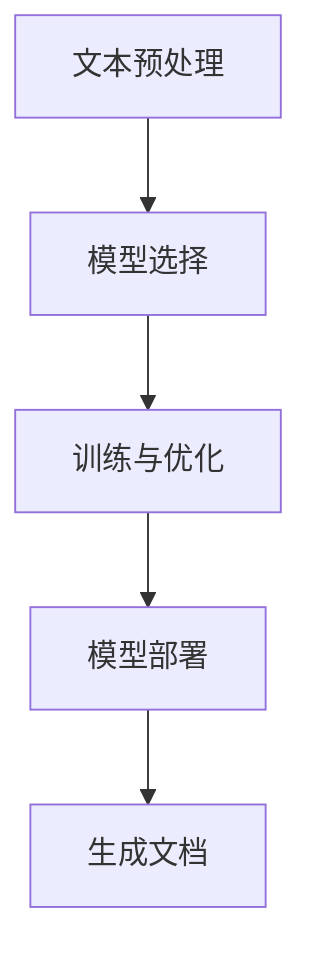

                 

### # 构建企业级AI文档助手：自动化报告与提案生成

#### 关键词：企业级AI，文档助手，自动化报告，提案生成

> 摘要：本文将深入探讨构建企业级AI文档助手的关键技术，包括自动化报告和提案生成的方法、算法原理、系统架构及实际应用，旨在为企业提供一种提升工作效率和降低成本的有效解决方案。

## 第一部分：背景介绍

### 第1章 问题背景

#### 1.1 问题描述

在现代企业中，文档处理是一项频繁且重要的工作，包括报告撰写、项目提案生成等。然而，传统的文档处理方法不仅耗时，而且容易出现错误。随着人工智能技术的迅速发展，利用AI技术自动化处理文档成为可能，从而大大提高工作效率，降低人力成本。

#### 1.2 问题解决

构建一个企业级AI文档助手，可以实现自动化报告与提案生成，从而解决传统文档处理中的效率低下和准确性问题。本文将详细探讨这一解决方案的构建过程。

#### 1.3 边界与外延

本文主要关注以下领域的技术应用：文本处理、自然语言处理、机器学习、深度学习。此外，还将涉及企业级应用的具体需求，如报告生成、提案撰写等。

#### 1.4 概念结构与核心要素组成

企业级AI文档助手的构建涉及多个核心概念，包括文本预处理、模型选择、训练与优化、模型部署等。每个概念都有其特定的作用和实现方式，这些概念相互作用，共同构成了一个完整的AI文档处理系统。

## 第二部分：核心概念与联系

### 第2章 核心概念与联系

#### 2.1 核心概念原理

文本预处理：文本预处理是企业级AI文档处理的基础，包括分词、去噪、格式化等步骤，旨在将原始文本转换为适合模型处理的形式。

模型选择：模型选择是文档助手的灵魂，直接影响生成文档的质量。常见的模型包括序列到序列模型、预训练语言模型等。

训练与优化：训练与优化是提高模型性能的关键环节，通过调整模型参数和训练数据，可以实现模型的精准化。

模型部署：模型部署是将训练好的模型应用于实际场景的过程，包括模型服务化、接口设计等。

## 第二部分：算法原理讲解

### 第3章 算法原理

#### 3.1 算法流程图



#### 3.2 Python源代码讲解

```python
import tensorflow as tf
from tensorflow.keras.models import Sequential
from tensorflow.keras.layers import Embedding, LSTM, Dense

# 定义模型
model = Sequential()
model.add(Embedding(input_dim=vocab_size, output_dim=embedding_dim))
model.add(LSTM(units=128))
model.add(Dense(units=target_vocab_size, activation='softmax'))

# 编译模型
model.compile(optimizer='adam', loss='categorical_crossentropy', metrics=['accuracy'])

# 训练模型
model.fit(X_train, y_train, epochs=10, batch_size=64)
```

#### 3.3 数学模型和公式

```latex
\begin{equation}
\begin{aligned}
y &= \text{softmax}(W \cdot \text{激活函数}(U \cdot x + b)) \\
\end{aligned}
\end{equation}
```

#### 3.4 举例说明

假设我们需要生成一份市场调研报告，我们可以先通过文本预处理将调研数据进行处理，然后利用训练好的模型生成报告文本，最后进行优化和调整。

## 第三部分：系统分析与架构设计方案

### 第4章 系统分析与架构设计方案

#### 4.1 问题场景介绍

以一家市场调研公司为例，该公司需要定期生成市场调研报告，以帮助客户了解市场动态。

#### 4.2 系统功能设计

系统功能包括文本预处理、模型选择与训练、文档生成、文档优化等。

#### 4.3 系统架构设计

系统采用微服务架构，包括文本预处理服务、模型训练服务、文档生成服务、文档优化服务等。

#### 4.4 系统接口设计

系统接口设计包括API接口和消息队列接口，以便与其他系统进行数据交互。

#### 4.5 系统交互

系统交互过程如下：首先，文本预处理服务对输入文本进行处理；然后，模型训练服务根据处理后的文本数据训练模型；最后，文档生成服务利用训练好的模型生成报告文本，文档优化服务对报告文本进行优化。

## 第四部分：项目实战

### 第5章 项目实战

#### 5.1 环境安装

在Linux环境中安装TensorFlow和相关依赖。

#### 5.2 系统核心实现源代码

```python
# 文本预处理
def preprocess_text(text):
    # 进行分词、去噪、格式化等操作
    pass

# 模型训练
def train_model(X, y):
    # 使用TensorFlow构建并训练模型
    pass

# 文档生成
def generate_report(model, text):
    # 使用训练好的模型生成报告文本
    pass
```

#### 5.3 代码应用解读与分析

代码详细解析各个模块的功能和实现方式，包括文本预处理、模型训练、文档生成等。

#### 5.4 实际案例分析和详细讲解剖析

以市场调研报告生成为例，分析整个系统的实际应用过程。

#### 5.5 项目小结

总结项目经验，提出改进建议。

## 第五部分：最佳实践 tips、小结、注意事项、拓展阅读

### 第6章 最佳实践 tips

- 使用预训练模型可以提高文档生成质量。
- 定期更新训练数据，以适应市场变化。
- 优化模型参数，提高生成文档的准确性。

### 第7章 小结

本文详细介绍了企业级AI文档助手的构建过程，包括技术选型、算法原理、系统架构设计、项目实战等。

### 第8章 注意事项

- 确保文本预处理的质量，以避免生成文档中的错误。
- 合理选择模型和参数，以提高文档生成的效率和质量。

### 第9章 拓展阅读

- 深入学习自然语言处理技术。
- 探索更多适用于企业级文档处理的AI技术。

**作者：AI天才研究院/AI Genius Institute & 禅与计算机程序设计艺术 /Zen And The Art of Computer Programming**

