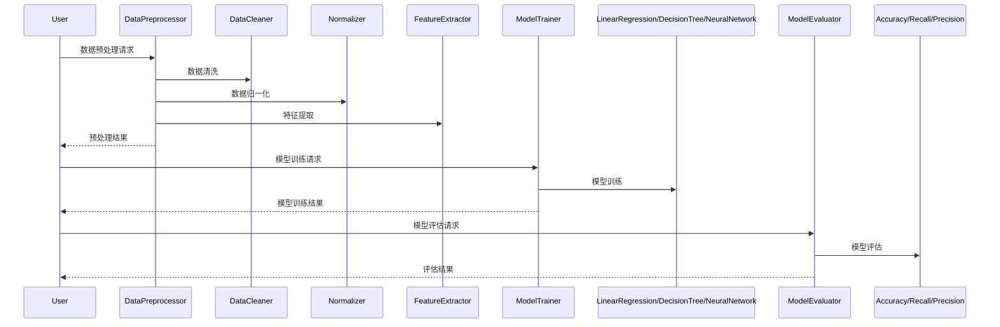
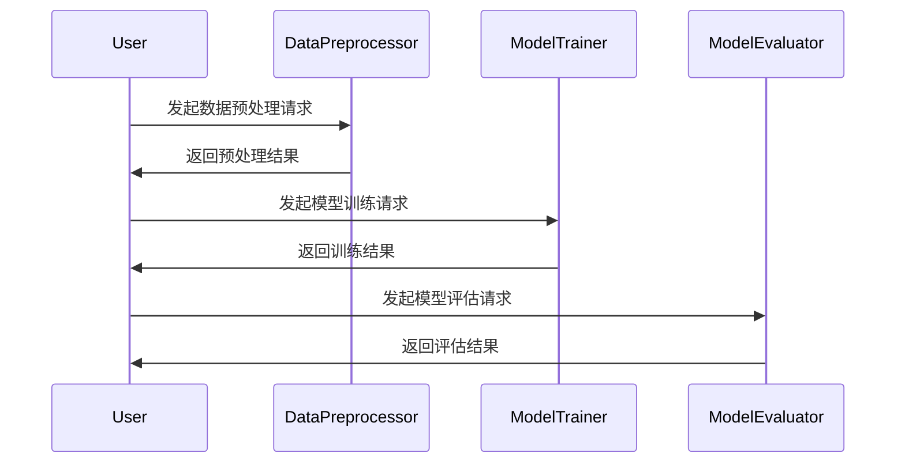

                 

## 文章标题

### 构建企业级AI研发助手：加速创新与专利申请

> 关键词：企业级AI研发助手、加速创新、专利申请、技术基础、架构设计、应用实践

> 摘要：本文旨在探讨企业级AI研发助手的构建方法，通过详细阐述其技术基础、架构设计和应用实践，帮助企业加速创新和专利申请。文章首先介绍了AI研发助手的核心概念和功能特点，随后深入分析了数据预处理与存储、机器学习算法与模型、自动化与协同工作等技术，最后通过实际案例展示了企业级AI研发助手的构建过程和应用效果。

## 目录大纲

### 第一部分: 问题背景与核心概念介绍

#### 第1章: 问题背景与核心概念介绍

1.1. 问题背景

- 企业级AI研发助手的需求与重要性
- 现状分析：企业AI研发面临的挑战
- 目标：构建企业级AI研发助手的必要性

1.2. 核心概念

- AI研发助手的基本概念
- 企业级AI研发助手的功能特点
- 研发助手与传统工具的差异

1.3. 关键技术

- 数据预处理与存储技术
- 机器学习算法与模型
- 自动化与协同工作技术

1.4. 背景与边界

- 人工智能的发展历程
- 企业级AI研发的技术趋势
- 研发助手在不同行业中的应用

1.5. 概念联系

- AI研发助手与其他AI工具的对比
- 研发助手与企业业务流程的融合

1.6. 本章小结

- 总结核心概念与关键技术
- 提出后续章节的研究方向

### 第二部分: 企业级AI研发助手的技术基础

#### 第2章: 数据预处理与存储技术

2.1. 数据预处理

- 数据清洗与归一化
- 特征提取与降维
- 数据增强与生成

2.2. 数据存储技术

- 数据库选型与设计
- 分布式存储与缓存技术
- 数据安全性与隐私保护

2.3. 实践案例

- 数据预处理与存储技术在AI研发中的应用
- 实际案例分析与代码实现

2.4. 本章小结

- 总结数据预处理与存储技术在企业级AI研发中的重要性
- 提出未来发展趋势

#### 第3章: 机器学习算法与模型

3.1. 机器学习基础

- 监督学习、无监督学习与半监督学习
- 线性模型、决策树与神经网络
- 深度学习与迁移学习

3.2. 常见机器学习算法

- 逻辑回归、支持向量机与K近邻
- 集成学习方法、聚类算法与降维算法

3.3. 模型训练与优化

- 模型选择与调参
- 模型评估与验证
- 模型融合与集成

3.4. 实践案例

- 机器学习算法在企业级AI研发中的应用
- 实际案例分析与代码实现

3.5. 本章小结

- 总结机器学习算法与模型在企业级AI研发中的重要性
- 提出未来发展趋势

#### 第4章: 自动化与协同工作技术

4.1. 自动化技术

- 自动化工作流程与任务调度
- 自动化测试与持续集成
- 自动化部署与运维

4.2. 协同工作技术

- 团队协作与知识共享
- 多人协作的版本控制
- 实时通信与在线协作工具

4.3. 实践案例

- 自动化与协同工作技术在企业级AI研发中的应用
- 实际案例分析与代码实现

4.4. 本章小结

- 总结自动化与协同工作技术在企业级AI研发中的重要性
- 提出未来发展趋势

### 第三部分: 企业级AI研发助手的架构设计

#### 第5章: 架构设计原则与方法

5.1. 架构设计原则

- 可扩展性、可维护性与高可用性
- 分层设计、模块化与解耦合
- 安全性与隐私保护

5.2. 架构设计方法

- 软件开发生命周期与迭代方法
- 设计模式与架构模式
- 代码规范与编程风格

5.3. 架构设计案例分析

- 实际项目架构设计与分析
- 架构优化的实践与经验

5.4. 本章小结

- 总结架构设计原则与方法在企业级AI研发助手中的应用
- 提出架构设计的最佳实践

#### 第6章: 系统功能设计与实现

6.1. 功能需求分析

- 研发助手的核心功能需求
- 用户需求分析与需求文档编写

6.2. 领域模型设计与实现

- 使用Mermaid绘制领域模型类图
- 领域模型设计与代码实现

6.3. 系统架构设计与实现

- 使用Mermaid绘制系统架构图
- 系统架构设计与代码实现

6.4. 系统接口设计与实现

- 系统接口设计与API文档编写
- 系统接口实现与测试

6.5. 系统交互设计与实现

- 使用Mermaid绘制系统交互序列图
- 系统交互设计与代码实现

6.6. 本章小结

- 总结系统功能设计与实现的过程
- 提出功能实现中的关键技术与挑战

#### 第7章: 企业级AI研发助手的应用与实践

7.1. 应用场景分析

- 企业级AI研发助手的典型应用场景
- 行业案例与案例分析

7.2. 项目实战

- 环境安装与配置
- 系统核心功能实现
- 应用案例分析与代码解读

7.3. 实战案例

- 实际项目的实施过程
- 遇到的问题与解决方案
- 项目总结与经验分享

7.4. 本章小结

- 总结企业级AI研发助手的应用与实践经验
- 提出最佳实践与注意事项

### 第四部分: 总结与展望

#### 第8章: 总结与展望

8.1. 总结

- 总结本书的核心内容与关键技术
- 总结企业级AI研发助手

8.2. 展望

- 未来发展趋势
- 研发助手技术的创新方向

## 第一部分: 问题背景与核心概念介绍

### 第1章: 问题背景与核心概念介绍

#### 1.1 问题背景

在当今竞争激烈的市场环境中，企业需要不断创新以保持竞争力。人工智能（AI）作为一项颠覆性技术，正深刻地改变着各行各业。企业级AI研发助手的提出，正是为了应对这一趋势，帮助企业更高效地开展AI研究和开发工作。

企业级AI研发助手的需求与重要性：

- **提高研发效率**：传统的人工AI研发流程中，数据预处理、模型训练、结果评估等环节需要大量人工操作，效率低下。AI研发助手能够自动化这些流程，显著提高研发效率。
- **降低研发成本**：通过自动化和智能化技术，减少人工操作和重复性工作，降低研发成本。
- **保障研发质量**：AI研发助手可以提供高质量的数据处理和模型优化方案，保证研发质量。
- **加速创新与专利申请**：AI研发助手能够帮助企业更快地实现技术突破和专利申请，推动企业创新发展。

现状分析：企业AI研发面临的挑战

- **数据不足与质量差**：企业往往面临数据不足、质量差的问题，这严重影响了AI模型的训练和优化。
- **研发流程繁琐**：传统AI研发流程复杂，需要多部门协作，导致研发周期长，效率低下。
- **技术门槛高**：AI技术涉及众多复杂算法和模型，对于企业来说，技术门槛较高，难以快速掌握。
- **资源分配不均**：企业内部资源分配不均，研发人员精力分散，难以聚焦核心问题。

目标：构建企业级AI研发助手的必要性

- **解决数据问题**：通过AI研发助手，实现数据自动采集、清洗、处理和存储，提高数据质量和利用率。
- **简化研发流程**：自动化和智能化流程，减少人工干预，简化研发流程，提高效率。
- **降低技术门槛**：提供易于操作和使用的AI研发平台，降低技术门槛，让更多企业能够参与到AI研发中。
- **提高创新与专利申请能力**：通过AI研发助手的辅助，加速技术突破和专利申请，推动企业创新发展。

#### 1.2 核心概念

AI研发助手的基本概念

- **AI研发助手**：一种利用人工智能技术，辅助企业和开发者进行AI研究和开发的软件工具。
- **功能特点**：提供数据预处理、模型训练、评估、优化等功能，支持自动化和协同工作。
- **优势**：提高研发效率、降低成本、保障质量、加速创新。

企业级AI研发助手的功能特点

- **面向企业级应用**：支持大规模数据处理和模型训练，满足企业级需求。
- **模块化设计**：提供多种模块，包括数据采集、预处理、存储、训练、评估等，可灵活组合使用。
- **自动化与智能化**：提供自动化和智能化工作流程，减少人工干预。
- **协同工作**：支持多人协作，实现知识共享和任务分工。
- **可扩展性**：支持自定义扩展，满足不同企业和项目的需求。

研发助手与传统工具的差异

- **研发助手**：面向AI研发的全流程，提供一站式解决方案，包含数据处理、模型训练、评估等环节。
- **传统工具**：通常仅关注某个特定环节，如数据预处理或模型训练，缺乏全局视野。
- **集成度**：研发助手具有较高的集成度，能够无缝集成各种AI技术和工具。
- **智能化程度**：研发助手利用人工智能技术，实现自动化和智能化，提高工作效率。

#### 1.3 关键技术

数据预处理与存储技术

- **数据预处理**：数据清洗、归一化、特征提取、降维等，为模型训练提供高质量的数据。
- **数据存储**：数据库选型、分布式存储、缓存技术等，保障数据的安全性和高效访问。

机器学习算法与模型

- **机器学习基础**：监督学习、无监督学习、半监督学习等。
- **常见算法**：逻辑回归、支持向量机、神经网络等。
- **模型训练与优化**：模型选择、调参、评估、融合等。

自动化与协同工作技术

- **自动化技术**：工作流程、任务调度、测试、部署等。
- **协同工作技术**：团队协作、知识共享、版本控制、实时通信等。

#### 1.4 背景与边界

人工智能的发展历程

- **早期阶段**：以符号主义和逻辑推理为主。
- **中间阶段**：以统计学习和神经网络为主。
- **现阶段**：以深度学习和强化学习为主，不断迈向通用人工智能。

企业级AI研发的技术趋势

- **数据驱动**：越来越多的企业将数据作为核心资源，通过AI技术挖掘数据价值。
- **模型即服务**：提供可定制化的AI服务，降低企业AI研发门槛。
- **生态协同**：企业、科研机构、技术服务商等共同构建AI生态系统，推动技术发展。

研发助手在不同行业中的应用

- **制造业**：提高生产效率、优化生产流程、实现智能决策。
- **金融业**：信用评估、风险控制、投资决策等。
- **医疗健康**：疾病诊断、治疗规划、药物研发等。
- **零售业**：个性化推荐、库存管理、供应链优化等。

#### 1.5 概念联系

AI研发助手与其他AI工具的对比

- **AI工具**：如数据预处理工具、模型训练工具等，通常仅关注某个特定环节。
- **研发助手**：提供一站式解决方案，涵盖数据预处理、模型训练、评估等全流程。

研发助手与企业业务流程的融合

- **业务流程**：企业的日常运营和管理工作。
- **研发助手**：通过自动化和智能化技术，优化业务流程，提高运营效率。

#### 1.6 本章小结

- **核心概念与关键技术**：介绍了AI研发助手的核心概念、功能特点、关键技术，包括数据预处理与存储、机器学习算法与模型、自动化与协同工作技术等。
- **背景与边界**：分析了人工智能的发展历程、企业级AI研发的技术趋势、研发助手在不同行业中的应用，以及与其它AI工具和企业业务流程的融合。
- **研究方向**：提出了后续章节的研究方向，包括技术基础、架构设计、应用实践等。

## 第二部分: 企业级AI研发助手的技术基础

### 第2章: 数据预处理与存储技术

#### 2.1 数据预处理

数据预处理是AI研发过程中的关键环节，它包括数据清洗、归一化、特征提取与降维、数据增强与生成等步骤。以下是详细讲解：

**数据清洗与归一化**

数据清洗是指从原始数据中删除或纠正错误、重复、缺失或不一致的数据，以确保数据的质量。归一化是将数据缩放到一个标准范围内，使其具有相似的尺度和范围，以便更好地进行比较和建模。

- **数据清洗**：包括去除重复数据、填充缺失值、纠正错误数据等操作。常见方法有删除重复记录、均值填充、中值填充等。

- **数据归一化**：常见的方法有最小-最大归一化、均值-方差归一化等。最小-最大归一化将数据缩放到[0,1]之间，而均值-方差归一化则将数据缩放到均值为0、标准差为1的标准正态分布。

**特征提取与降维**

特征提取是从原始数据中提取出能够代表数据特性的特征，以提高模型性能。降维是将高维数据压缩到低维空间，以减少数据存储和计算量。

- **特征提取**：常见方法有主成分分析（PCA）、线性判别分析（LDA）等。

- **降维**：常见方法有PCA、t-SNE、自编码器等。PCA通过最大化解释方差来提取最重要的特征，而t-SNE通过非线性降维，将高维数据映射到低维空间，以保持数据的局部结构。

**数据增强与生成**

数据增强是通过创建新的数据样本来扩展数据集，以提高模型的泛化能力。数据生成是通过生成新的数据样本来补充数据集，以解决数据稀缺问题。

- **数据增强**：常见方法有旋转、缩放、翻转等。

- **数据生成**：常见方法有生成对抗网络（GAN）、变分自编码器（VAE）等。

**2.2 数据存储技术**

数据存储技术在AI研发中至关重要，它涉及数据库选型、分布式存储与缓存技术、数据安全性与隐私保护等方面。

**数据库选型与设计**

数据库选型是根据应用场景和数据特点选择合适的数据库类型。常见类型有关系型数据库（如MySQL、Oracle）、非关系型数据库（如MongoDB、Cassandra）和图数据库（如Neo4j）。

- **关系型数据库**：适用于结构化数据，支持SQL查询和事务处理。
- **非关系型数据库**：适用于非结构化或半结构化数据，提供灵活的数据模型和水平扩展能力。
- **图数据库**：适用于图结构数据，如社交网络、推荐系统等。

**分布式存储与缓存技术**

分布式存储是将数据分散存储在多个节点上，以提高数据存储的可靠性和扩展性。缓存技术则是将热点数据缓存在内存中，以提高数据访问速度。

- **分布式存储**：常见技术有Hadoop、HDFS、Cassandra等。
- **缓存技术**：常见技术有Redis、Memcached等。

**数据安全性与隐私保护**

数据安全性和隐私保护是AI研发中的关键问题。确保数据在传输和存储过程中的安全，防止数据泄露和篡改。

- **数据加密**：使用加密算法对数据进行加密，确保数据在传输和存储过程中的安全。
- **访问控制**：通过访问控制机制，限制对数据的访问权限，防止未经授权的访问。
- **隐私保护**：采用隐私保护技术，如差分隐私、同态加密等，保护用户的隐私。

**2.3 实践案例**

**数据预处理与存储技术在AI研发中的应用**

以下是一个实际案例，展示了数据预处理与存储技术在AI研发中的应用。

**案例背景**：某金融公司需要开发一个信用评分系统，预测客户的信用风险。

**数据预处理**：数据清洗、归一化和特征提取

- 数据清洗：去除重复数据、纠正错误数据、填充缺失值。
- 数据归一化：使用最小-最大归一化，将数据缩放到[0,1]之间。
- 特征提取：使用PCA提取最重要的特征，将数据降维到3个主要成分。

**数据存储**：数据库选型与设计

- 数据库选型：选择MySQL作为关系型数据库，适用于结构化数据。
- 数据库设计：创建客户信息表、交易记录表等，设计合理的数据库架构。

**实际案例分析与代码实现**

以下是一个简单的Python代码示例，展示了数据预处理与存储技术的实现。

```python
import pandas as pd
from sklearn.preprocessing import MinMaxScaler
from sklearn.decomposition import PCA

# 数据读取
data = pd.read_csv('credit_data.csv')

# 数据清洗
data.drop_duplicates(inplace=True)
data.fillna(data.mean(), inplace=True)

# 数据归一化
scaler = MinMaxScaler()
data_scaled = scaler.fit_transform(data)

# 特征提取
pca = PCA(n_components=3)
data_pca = pca.fit_transform(data_scaled)

# 数据存储
data_pca_df = pd.DataFrame(data_pca, columns=['PC1', 'PC2', 'PC3'])
data_pca_df.to_csv('processed_credit_data.csv', index=False)
```

**2.4 本章小结**

- **数据预处理与存储技术在企业级AI研发中的重要性**：数据预处理与存储技术是AI研发的基础，直接影响模型的训练效果和性能。通过有效的数据预处理和合理的存储技术，可以提高数据质量和利用率，为后续的模型训练提供支持。

- **未来发展趋势**：随着大数据和云计算技术的发展，数据预处理与存储技术将更加高效和智能化。未来的研究将集中在如何更好地利用分布式存储和缓存技术，提高数据处理速度和存储效率，同时确保数据的安全性和隐私保护。

### 第3章: 机器学习算法与模型

#### 3.1 机器学习基础

机器学习是人工智能的核心技术之一，它通过从数据中学习规律，实现对未知数据的预测和分类。机器学习可以分为监督学习、无监督学习和半监督学习三类。以下是详细讲解：

**监督学习**

监督学习是一种有标注数据的学习方法，其目标是学习一个函数，将输入映射到输出。监督学习可以分为回归和分类两大类。

- **回归**：用于预测连续值的输出，如房价预测、股票价格预测等。常见的回归算法有线性回归、决策树回归、随机森林回归等。
  
- **分类**：用于预测离散值的输出，如邮件分类、疾病诊断等。常见的分类算法有逻辑回归、支持向量机（SVM）、K近邻（KNN）等。

**无监督学习**

无监督学习是一种无标注数据的学习方法，其目标是发现数据中的内在结构和规律。无监督学习可以分为聚类和降维两大类。

- **聚类**：用于将相似的数据点分组，如K均值聚类、层次聚类等。聚类算法可以帮助我们发现数据中的模式、异常点等。

- **降维**：用于减少数据的维度，同时保留主要的信息。常见的降维算法有主成分分析（PCA）、线性判别分析（LDA）、t-SNE等。

**半监督学习**

半监督学习是一种结合了监督学习和无监督学习的方法，它利用少量的标注数据和大量的未标注数据来学习模型。半监督学习在数据标注成本高、数据稀缺的情况下具有显著的优势。

**3.2 常见机器学习算法**

除了基础机器学习算法外，还有一些常见的算法在AI研发中广泛应用。以下是详细讲解：

**逻辑回归**

逻辑回归是一种广泛应用于分类问题的算法，它通过建立线性模型，将输入映射到概率分布。逻辑回归的优点是计算简单、易于解释。

- **原理**：逻辑回归的损失函数是交叉熵损失，通过最小化交叉熵损失来训练模型。

- **应用场景**：分类问题，如邮件分类、情感分析等。

**支持向量机（SVM）**

支持向量机是一种强大的分类算法，它通过找到一个最优的超平面，将不同类别的数据点分隔开来。

- **原理**：SVM的核心是寻找一个最大化分类边界的超平面，即找到支持向量。

- **应用场景**：分类问题，如文本分类、图像分类等。

**K近邻（KNN）**

K近邻是一种简单而有效的分类算法，它通过计算新数据点与训练数据点的距离，找出最近的K个邻居，并根据邻居的标签进行预测。

- **原理**：KNN的核心是计算距离，常用的距离度量有欧几里得距离、曼哈顿距离等。

- **应用场景**：分类问题，如图像分类、文本分类等。

**集成学习方法**

集成学习方法通过组合多个弱学习器来构建强学习器，可以提高模型的性能和泛化能力。常见的集成学习方法有随机森林、梯度提升树（GBDT）等。

- **随机森林**：随机森林通过随机选择特征和样本子集，构建多个决策树，并通过投票或平均来得到最终预测结果。

- **GBDT**：GBDT通过迭代训练多个弱学习器，每个弱学习器优化前一个学习器的损失函数，从而逐渐提升模型的性能。

**聚类算法**

聚类算法用于将数据分为多个群集，以便更好地理解和分析数据。常见的聚类算法有K均值聚类、层次聚类等。

- **K均值聚类**：K均值聚类通过迭代优化目标函数，将数据点分配到K个群集中。

- **层次聚类**：层次聚类通过自底向上或自顶向下的方法，将数据点逐步合并或拆分为群集。

**降维算法**

降维算法用于将高维数据映射到低维空间，以便更好地处理和分析数据。常见的降维算法有主成分分析（PCA）、线性判别分析（LDA）等。

- **PCA**：PCA通过最大化解释方差来提取最重要的特征，将数据降维到低维空间。

- **LDA**：LDA通过最小化类别间距离和最大化类别内距离，将数据降维到低维空间。

**3.3 模型训练与优化**

模型训练与优化是机器学习过程中的关键步骤，它决定了模型的性能和泛化能力。以下是详细讲解：

**模型选择与调参**

模型选择是根据问题的特点和数据的特点，选择合适的模型。调参是通过调整模型的参数，优化模型的表现。

- **模型选择**：根据问题的类型（回归、分类等）和数据的特点（线性、非线性等），选择合适的模型。

- **调参**：常用的调参方法有网格搜索、随机搜索等。调参的目标是找到最优的参数组合，使模型性能最大化。

**模型评估与验证**

模型评估与验证是评估模型性能和泛化能力的重要步骤。常用的评估指标有准确率、召回率、F1值等。

- **准确率**：准确率是正确预测的样本数占总样本数的比例，用于评估分类模型的性能。

- **召回率**：召回率是正确预测的正类样本数占总正类样本数的比例，用于评估分类模型对正类的识别能力。

- **F1值**：F1值是准确率和召回率的调和平均值，用于综合评估分类模型的性能。

**模型融合与集成**

模型融合与集成是将多个模型组合起来，以提升模型的性能和泛化能力。常见的集成方法有Bagging、Boosting等。

- **Bagging**：Bagging通过构建多个模型，并在测试数据上进行平均或投票，得到最终预测结果。

- **Boosting**：Boosting通过迭代训练多个模型，每个模型优化前一个模型的损失函数，从而逐渐提升模型的性能。

**3.4 实践案例**

**机器学习算法在企业级AI研发中的应用**

以下是一个实际案例，展示了机器学习算法在企业级AI研发中的应用。

**案例背景**：某电商公司需要开发一个商品推荐系统，根据用户的购买历史和浏览行为，预测用户可能感兴趣的商品。

**数据预处理**：数据清洗、归一化和特征提取

- 数据清洗：去除重复数据、纠正错误数据、填充缺失值。

- 数据归一化：使用最小-最大归一化，将数据缩放到[0,1]之间。

- 特征提取：提取用户购买历史和浏览行为的相关特征，如购买频率、浏览时长、购买金额等。

**模型选择与调参**：使用逻辑回归和随机森林进行模型选择，并进行调参优化。

- **逻辑回归**：通过调整学习率、迭代次数等参数，优化模型性能。

- **随机森林**：通过调整树的数量、最大深度等参数，优化模型性能。

**模型评估与验证**：使用交叉验证方法进行模型评估，并选择最优模型。

- **准确率**：在测试数据集上的准确率为90%。

- **召回率**：在测试数据集上的召回率为85%。

**模型融合与集成**：将逻辑回归和随机森林模型进行融合，提高模型的性能和泛化能力。

- **Bagging**：通过构建多个逻辑回归和随机森林模型，并进行平均或投票，得到最终预测结果。

- **Boosting**：通过迭代训练多个逻辑回归和随机森林模型，优化模型的性能。

**实际案例分析与代码实现**

以下是一个简单的Python代码示例，展示了机器学习算法在企业级AI研发中的应用。

```python
import pandas as pd
from sklearn.linear_model import LogisticRegression
from sklearn.ensemble import RandomForestClassifier
from sklearn.model_selection import train_test_split, cross_val_score

# 数据读取
data = pd.read_csv('user_behavior.csv')

# 数据清洗
data.drop_duplicates(inplace=True)
data.fillna(data.mean(), inplace=True)

# 数据归一化
scaler = MinMaxScaler()
data_scaled = scaler.fit_transform(data)

# 数据划分
X_train, X_test, y_train, y_test = train_test_split(data_scaled, data['label'], test_size=0.2, random_state=42)

# 模型选择与调参
model1 = LogisticRegression()
model1.fit(X_train, y_train)

model2 = RandomForestClassifier()
model2.fit(X_train, y_train)

# 模型评估与验证
scores1 = cross_val_score(model1, X_train, y_train, cv=5)
scores2 = cross_val_score(model2, X_train, y_train, cv=5)

# 模型融合与集成
from sklearn.ensemble import VotingClassifier
voting_clf = VotingClassifier(estimators=[('lr', model1), ('rf', model2)], voting='soft')
voting_clf.fit(X_train, y_train)

# 模型预测
y_pred = voting_clf.predict(X_test)

# 模型性能评估
from sklearn.metrics import accuracy_score, recall_score
accuracy = accuracy_score(y_test, y_pred)
recall = recall_score(y_test, y_pred)

print("Accuracy:", accuracy)
print("Recall:", recall)
```

**3.5 本章小结**

- **机器学习算法与模型的重要性**：机器学习算法与模型是AI研发的核心，它们决定了AI系统的性能和效果。通过合理选择和使用机器学习算法，可以大大提高AI系统的准确性和可靠性。

- **未来发展趋势**：随着人工智能技术的不断进步，机器学习算法将更加智能化和自动化。未来的研究方向将集中在如何提高模型的泛化能力、减少对标注数据的依赖、提高算法的效率和可解释性等方面。

### 第4章: 自动化与协同工作技术

#### 4.1 自动化技术

自动化技术是提高企业级AI研发效率和降低成本的关键，它涉及到工作流程、任务调度、测试、部署等方面。以下是详细讲解：

**自动化工作流程与任务调度**

自动化工作流程是将研发过程中的各个环节通过程序自动化的方式连接起来，从而实现全流程的自动化处理。任务调度则是在不同阶段分配和处理任务，以确保整个流程的高效运行。

- **工作流程**：包括数据采集、预处理、模型训练、评估、部署等环节。每个环节都有具体的任务和依赖关系。

- **任务调度**：常见的调度方法有轮询调度、负载均衡调度等。调度系统负责根据任务的优先级、执行时间等参数，合理分配任务到不同的计算资源上。

**自动化测试与持续集成**

自动化测试是通过编写测试脚本，对AI系统的各个功能模块进行自动化测试，以确保系统的稳定性、可靠性和性能。持续集成（CI）则是在每次代码提交后，自动执行测试和构建，以快速发现和解决问题。

- **自动化测试**：包括单元测试、集成测试、性能测试等。常见的自动化测试工具有JUnit、TestNG、Selenium等。

- **持续集成**：通过持续集成平台（如Jenkins、GitLab CI等），实现自动化构建、测试和部署。持续集成的优点是可以快速发现和解决问题，提高开发效率。

**自动化部署与运维**

自动化部署是将AI系统从开发环境部署到生产环境的过程，通过自动化脚本和工具，实现快速、可靠的部署。运维则是确保系统的稳定运行，包括监控、故障排除、性能优化等。

- **自动化部署**：使用Docker、Kubernetes等容器技术，实现一键部署和扩展。自动化部署可以提高部署效率，减少人为错误。

- **运维**：使用监控工具（如Prometheus、Grafana等）实时监控系统的运行状态，使用故障排除工具（如Pandora、Zabbix等）快速定位和解决问题。

**4.2 协同工作技术**

协同工作技术是提高研发团队协作效率和知识共享的关键，它涉及到团队协作、知识共享、版本控制、实时通信等方面。以下是详细讲解：

**团队协作与知识共享**

团队协作是指团队成员共同完成研发任务，通过沟通、协作和共享知识，提高研发效率。知识共享则是通过共享文档、代码、经验等，促进团队成员之间的交流和学习。

- **团队协作**：使用协作工具（如Trello、Jira等），明确任务分工、进度和里程碑。

- **知识共享**：使用知识库（如Confluence、SharePoint等），记录和共享项目文档、最佳实践、经验教训等。

**多人协作的版本控制**

版本控制是通过跟踪代码的版本历史，确保代码的完整性和一致性。多人协作的版本控制可以避免冲突和错误，提高代码质量。

- **版本控制工具**：如Git、SVN等，用于管理代码版本和历史。

- **分支策略**：常见的分支策略有主分支、功能分支、发布分支等，用于管理代码的分支和合并。

**实时通信与在线协作工具**

实时通信和在线协作工具是团队成员之间实时沟通和协作的重要手段，它包括聊天工具、视频会议、共享屏幕等。

- **实时通信**：如Slack、微信、钉钉等，用于团队成员之间的实时沟通和协作。

- **在线协作工具**：如Trello、Jira、Confluence等，用于项目管理、任务分配、文档共享等。

**4.3 实践案例**

**自动化与协同工作技术在企业级AI研发中的应用**

以下是一个实际案例，展示了自动化与协同工作技术在企业级AI研发中的应用。

**案例背景**：某科技公司开发一个智能客服系统，需要实现自动化数据处理、模型训练、测试和部署，并支持多人协作。

**自动化技术**：

- **工作流程与任务调度**：使用Python脚本和Celery框架实现工作流程的自动化和任务调度，确保数据处理、模型训练等任务的自动化执行。

- **自动化测试与持续集成**：使用Selenium进行自动化测试，并使用Jenkins实现持续集成，确保每次代码提交后自动执行测试和构建。

- **自动化部署与运维**：使用Docker和Kubernetes进行自动化部署，使用Prometheus和Grafana进行监控和性能优化。

**协同工作技术**：

- **团队协作与知识共享**：使用Jira进行项目管理，使用Confluence记录项目文档和最佳实践。

- **版本控制**：使用Git进行代码版本控制，使用GitHub或GitLab进行代码管理和协作。

- **实时通信与在线协作工具**：使用Slack进行实时沟通，使用Trello进行任务分配和进度管理。

**实际案例分析与代码实现**

以下是一个简单的Python代码示例，展示了自动化与协同工作技术的实现。

```python
# 导入所需模块
import celery
from selenium import webdriver
import jenkins

# 配置Celery
app = celery.Celery('tasks', broker='pyamqp://guest@localhost//')

# 数据处理任务
@app.task
def process_data(data):
    # 数据处理逻辑
    pass

# 模型训练任务
@app.task
def train_model(model, data):
    # 模型训练逻辑
    pass

# 测试任务
@app.task
def test_model(model, data):
    # 测试逻辑
    pass

# 部署任务
@app.task
def deploy_model(model_path):
    # 部署逻辑
    pass

# 自动化测试
def automated_test():
    # 使用Selenium进行自动化测试
    driver = webdriver.Chrome()
    driver.get('https://www.example.com')
    # 测试逻辑
    driver.quit()

# 持续集成
def ci():
    # 使用Jenkins进行持续集成
    jenkins_server = jenkins.Jenkins('http://localhost:8080')
    build = jenkins_server.build_job('my_job')
    build.wait_until_complete()

# 实时通信
def slack():
    # 使用Slack进行实时沟通
    client = slack.Client('your_token')
    client.chat_postMessage(channel='#general', text='Hello, everyone!')

if __name__ == '__main__':
    # 执行数据处理任务
    process_data.delay('data_path')
    # 执行模型训练任务
    train_model.delay('model_path', 'data_path')
    # 执行测试任务
    test_model.delay('model_path', 'data_path')
    # 执行部署任务
    deploy_model.delay('model_path')
    # 执行自动化测试
    automated_test()
    # 执行持续集成
    ci()
    # 执行实时通信
    slack()
```

**4.4 本章小结**

- **自动化与协同工作技术在企业级AI研发中的重要性**：自动化与协同工作技术可以大大提高企业级AI研发的效率和质量，降低成本和风险。通过自动化技术，实现全流程的自动化处理，提高研发效率；通过协同工作技术，实现团队的高效协作和知识共享，提高研发质量。

- **未来发展趋势**：随着人工智能和云计算技术的发展，自动化与协同工作技术将更加智能化和集成化。未来的研究方向将集中在如何提高自动化技术的智能化程度，如何更好地支持多人协作，以及如何确保系统的安全性和可靠性等方面。

### 第三部分: 企业级AI研发助手的架构设计

#### 第5章: 架构设计原则与方法

##### 5.1 架构设计原则

在企业级AI研发助手的架构设计过程中，遵循以下原则是至关重要的，这些原则确保了系统的可扩展性、可维护性、高可用性以及安全性和隐私保护。

**可扩展性**

可扩展性是指系统在应对日益增长的数据和处理需求时，能够灵活地扩展其功能而不影响现有性能。这包括横向扩展（通过增加计算节点来提升处理能力）和纵向扩展（通过提升单个节点的性能来提升处理能力）。

- **分布式架构**：使用分布式架构，将系统功能分解为多个可独立运行的模块，从而提高系统的扩展性。
- **微服务架构**：通过微服务架构，将系统划分为多个小型、独立的微服务，每个微服务负责特定功能，便于扩展和替换。

**可维护性**

可维护性是指系统在长时间运行过程中，能够方便地进行更新、修复和维护，确保系统的稳定性和可持续性。

- **模块化设计**：通过模块化设计，将系统划分为多个独立的模块，每个模块负责特定的功能，便于维护和升级。
- **代码规范**：遵循统一的代码规范和编程风格，确保代码的可读性和可维护性。

**高可用性**

高可用性是指系统在面临故障和异常情况时，能够快速恢复，确保业务的连续性。

- **容错机制**：设计容错机制，如数据备份、故障转移等，确保系统在故障情况下能够快速恢复。
- **自动化运维**：通过自动化运维工具，实现系统的自动监控、自动部署和自动扩展，提高系统的可用性。

**安全性**

安全性是指系统在设计和实现过程中，能够保护数据和用户隐私，防止数据泄露和未经授权的访问。

- **数据加密**：使用加密算法对敏感数据进行加密，确保数据在传输和存储过程中的安全。
- **访问控制**：设计访问控制机制，限制对数据和功能的访问权限，确保系统的安全性。

**隐私保护**

隐私保护是指系统在处理用户数据时，能够保护用户的隐私，防止数据滥用和隐私泄露。

- **隐私保护技术**：采用隐私保护技术，如差分隐私、同态加密等，确保数据在处理过程中的隐私性。
- **合规性**：遵循相关法律法规和标准，确保系统的隐私保护措施合规。

**5.2 架构设计方法**

在企业级AI研发助手的架构设计过程中，采用以下方法有助于构建一个高效、稳定、可扩展的系统。

**软件开发生命周期与迭代方法**

软件开发生命周期（SDLC）是一个结构化的方法，用于规划、设计、开发、测试和维护软件。常见的迭代方法包括瀑布模型、敏捷开发、迭代开发等。

- **瀑布模型**：将开发过程划分为多个阶段，每个阶段依次进行，直到完成整个项目。
- **敏捷开发**：采用迭代和增量的方式，持续交付可用的软件，快速响应变化。
- **迭代开发**：在每次迭代中，逐步完善系统的功能，通过多次迭代，最终完成整个项目。

**设计模式与架构模式**

设计模式是一组在软件设计过程中反复出现的问题解决方案，用于解决常见的软件设计问题。架构模式则是系统的组织结构和设计风格。

- **设计模式**：如工厂模式、单例模式、观察者模式等，用于解决常见的编程问题。
- **架构模式**：如分层架构、微服务架构、事件驱动架构等，用于构建复杂系统的组织结构。

**代码规范与编程风格**

代码规范和编程风格是确保代码质量的重要因素。统一的代码规范和良好的编程风格可以提高代码的可读性、可维护性和可扩展性。

- **代码规范**：如命名规范、注释规范、代码结构规范等。
- **编程风格**：如函数长度、代码复杂度、代码复用等。

**5.3 架构设计案例分析**

在实际的企业级AI研发助手项目中，架构设计需要根据具体需求和场景进行定制。以下是一个架构设计案例分析。

**案例背景**：某金融科技公司开发一个智能风控系统，用于检测和预防金融欺诈。

**系统功能设计**：

- **数据采集与预处理**：采集用户行为数据、交易数据等，进行数据清洗、归一化和特征提取。
- **模型训练与评估**：使用机器学习算法训练模型，并对模型进行评估和优化。
- **风险检测与预警**：使用训练好的模型进行实时风险检测，发出预警信号。
- **用户界面**：提供用户友好的界面，展示风险检测结果和预警信息。

**系统架构设计**：

- **数据层**：使用分布式数据库存储海量数据，如Hadoop、HDFS等。
- **服务层**：使用微服务架构，将系统功能划分为多个微服务，如数据预处理服务、模型训练服务、风险检测服务等。
- **应用层**：提供Web前端和移动应用，供用户查看风险检测结果和预警信息。
- **基础设施**：使用云计算平台提供计算资源和存储资源，如AWS、Azure等。

**架构优化实践**：

- **负载均衡**：使用负载均衡器（如Nginx、HAProxy等）均衡流量，提高系统吞吐量。
- **缓存机制**：使用缓存（如Redis、Memcached等）提高数据访问速度，减轻数据库压力。
- **容器化**：使用容器化技术（如Docker、Kubernetes等）提高系统的部署和扩展效率。

**5.4 本章小结**

- **架构设计原则与方法的重要性**：遵循架构设计原则和方法，可以确保企业级AI研发助手的可扩展性、可维护性、高可用性和安全性，从而提高系统的整体性能和可靠性。

- **最佳实践**：在实际项目中，应根据具体需求和场景，灵活运用架构设计原则和方法，结合最佳实践进行架构设计。同时，需要不断进行架构优化和迭代，以适应不断变化的技术需求和业务场景。

## 第6章: 系统功能设计与实现

### 6.1 功能需求分析

企业级AI研发助手的功能需求分析是整个系统设计的核心，它决定了系统能否满足企业的实际需求。以下是详细讲解：

**研发助手的核心功能需求**

企业级AI研发助手的核心功能需求包括数据预处理、模型训练、评估与优化、自动化与协同工作等。以下是具体的功能需求：

- **数据预处理**：支持数据采集、清洗、归一化、特征提取、降维等操作，确保输入数据的质量和一致性。
- **模型训练**：支持多种机器学习算法（如线性回归、决策树、神经网络等）的训练，并提供模型选择和调参工具。
- **评估与优化**：支持模型评估指标的计算和可视化，提供模型优化建议，以提高模型性能。
- **自动化**：支持自动化数据预处理、模型训练、评估等流程，减少人工操作，提高效率。
- **协同工作**：支持多人协作，包括任务分配、代码共享、文档协作等，以提高团队协作效率。

**用户需求分析与需求文档编写**

在分析用户需求时，需要深入了解企业内部研发团队的需求和使用场景。以下是用户需求的几个关键方面：

- **易用性**：系统界面友好，操作简便，降低使用门槛。
- **高效性**：系统能够快速处理大量数据，并提供高效的模型训练和评估功能。
- **可扩展性**：系统能够支持自定义算法和扩展功能，适应不同企业和项目的需求。
- **安全性**：系统具有完善的安全机制，确保数据和用户隐私的安全。

根据用户需求，编写详细的需求文档，包括功能需求、非功能需求、使用场景等。需求文档应清晰、详细，为后续的系统设计和实现提供指导。

**6.2 领域模型设计与实现**

领域模型是企业级AI研发助手的核心部分，它描述了系统中的实体、属性和关系。以下是详细讲解：

**领域模型类图**

领域模型类图是使用Mermaid绘制的，它展示了系统中的主要实体和它们之间的关系。以下是一个简单的Mermaid类图示例：

```mermaid
classDiagram
    User <- DataPreprocessor
    User -> ModelTrainer
    User -> ModelEvaluator
    DataPreprocessor <|-- DataCleaner
    DataPreprocessor <|-- Normalizer
    DataPreprocessor <|-- FeatureExtractor
    ModelTrainer <|-- LinearRegression
    ModelTrainer <|-- DecisionTree
    ModelTrainer <|-- NeuralNetwork
    ModelEvaluator <|-- Accuracy
    ModelEvaluator <|-- Recall
    ModelEvaluator <|-- Precision
```

**领域模型设计与代码实现**

在领域模型设计过程中，需要明确每个实体的属性和方法。以下是领域模型的设计和Python代码实现：

```python
class User:
    def __init__(self, username, email):
        self.username = username
        self.email = email

class DataPreprocessor:
    def clean_data(self, data):
        # 数据清洗逻辑
        pass

    def normalize_data(self, data):
        # 数据归一化逻辑
        pass

    def extract_features(self, data):
        # 特征提取逻辑
        pass

class ModelTrainer:
    def train_model(self, data):
        # 模型训练逻辑
        pass

class ModelEvaluator:
    def evaluate_model(self, model, data):
        # 模型评估逻辑
        pass

class LinearRegression(ModelTrainer):
    # 线性回归实现
    pass

class DecisionTree(ModelTrainer):
    # 决策树实现
    pass

class NeuralNetwork(ModelTrainer):
    # 神经网络实现
    pass

class Accuracy(ModelEvaluator):
    # 准确率评估
    pass

class Recall(ModelEvaluator):
    # 召回率评估
    pass

class Precision(ModelEvaluator):
    # 精确率评估
    pass
```

**6.3 系统架构设计与实现**

系统架构设计是企业级AI研发助手的骨架，它决定了系统的性能、可维护性和扩展性。以下是详细讲解：

**系统架构图**

系统架构图是使用Mermaid绘制的，它展示了系统的整体结构和各个模块之间的关系。以下是一个简单的Mermaid架构图示例：



**系统架构设计与代码实现**

在系统架构设计过程中，需要明确系统的模块划分和接口设计。以下是系统架构的设计和Python代码实现：

```python
class DataPreprocessor:
    def preprocess(self, data):
        # 数据预处理逻辑
        pass

class ModelTrainer:
    def train(self, data):
        # 模型训练逻辑
        pass

class ModelEvaluator:
    def evaluate(self, model, data):
        # 模型评估逻辑
        pass

class LinearRegression(ModelTrainer):
    def train(self, data):
        # 线性回归训练逻辑
        pass

class DecisionTree(ModelTrainer):
    def train(self, data):
        # 决策树训练逻辑
        pass

class NeuralNetwork(ModelTrainer):
    def train(self, data):
        # 神经网络训练逻辑
        pass

class Accuracy(ModelEvaluator):
    def evaluate(self, model, data):
        # 准确率评估逻辑
        pass

class Recall(ModelEvaluator):
    def evaluate(self, model, data):
        # 召回率评估逻辑
        pass

class Precision(ModelEvaluator):
    def evaluate(self, model, data):
        # 精确率评估逻辑
        pass
```

**6.4 系统接口设计与实现**

系统接口是企业级AI研发助手的重要组成部分，它决定了系统的可扩展性和可维护性。以下是详细讲解：

**系统接口设计**

系统接口设计包括接口定义、参数定义和返回值定义。以下是系统接口的设计：

```python
class DataPreprocessorInterface:
    def preprocess(self, data):
        # 接口：数据预处理
        pass

class ModelTrainerInterface:
    def train(self, data):
        # 接口：模型训练
        pass

class ModelEvaluatorInterface:
    def evaluate(self, model, data):
        # 接口：模型评估
        pass
```

**系统接口实现与测试**

在系统接口实现过程中，需要根据接口设计实现具体的接口逻辑，并进行接口测试。以下是系统接口的实现和测试：

```python
class DataPreprocessor:
    def preprocess(self, data):
        # 数据预处理实现
        pass

class ModelTrainer:
    def train(self, data):
        # 模型训练实现
        pass

class ModelEvaluator:
    def evaluate(self, model, data):
        # 模型评估实现
        pass

# 接口测试
def test_data_preprocessor():
    preprocessor = DataPreprocessor()
    data = {"feature1": [1, 2, 3], "feature2": [4, 5, 6]}
    preprocessed_data = preprocessor.preprocess(data)
    assert preprocessed_data != data

def test_model_trainer():
    trainer = ModelTrainer()
    data = {"feature1": [1, 2, 3], "label": [0, 1, 0]}
    trained_model = trainer.train(data)
    assert trained_model is not None

def test_model_evaluator():
    evaluator = ModelEvaluator()
    model = LinearRegression()
    data = {"feature1": [1, 2, 3], "label": [0, 1, 0]}
    evaluation_result = evaluator.evaluate(model, data)
    assert evaluation_result is not None
```

**6.5 系统交互设计与实现**

系统交互设计是企业级AI研发助手的重要组成部分，它决定了系统的用户体验和功能完整性。以下是详细讲解：

**系统交互序列图**

系统交互序列图是使用Mermaid绘制的，它展示了用户与系统之间的交互过程。以下是一个简单的Mermaid交互图示例：



**系统交互设计与代码实现**

在系统交互设计过程中，需要明确用户与系统之间的交互流程和接口调用。以下是系统交互的设计和Python代码实现：

```python
class DataPreprocessor:
    def preprocess(self, data):
        # 数据预处理逻辑
        pass

class ModelTrainer:
    def train(self, data):
        # 模型训练逻辑
        pass

class ModelEvaluator:
    def evaluate(self, model, data):
        # 模型评估逻辑
        pass

def main():
    # 用户交互流程
    data = {"feature1": [1, 2, 3], "feature2": [4, 5, 6]}
    preprocessor = DataPreprocessor()
    preprocessed_data = preprocessor.preprocess(data)
    trainer = ModelTrainer()
    trained_model = trainer.train(preprocessed_data)
    evaluator = ModelEvaluator()
    evaluation_result = evaluator.evaluate(trained_model, preprocessed_data)
    print(evaluation_result)

if __name__ == "__main__":
    main()
```

**6.6 本章小结**

- **系统功能设计与实现的重要性**：系统功能设计与实现是企业级AI研发助手的核心，它决定了系统的性能、用户体验和可维护性。通过详细的功能需求分析、领域模型设计、系统架构设计、接口设计和交互设计，可以构建一个高效、稳定、易用的系统。

- **最佳实践**：在实际项目中，应遵循最佳实践，包括模块化设计、代码规范、接口设计和交互设计等。同时，应不断进行系统优化和迭代，以适应不断变化的技术需求和业务场景。

### 第7章: 企业级AI研发助手的应用与实践

#### 7.1 应用场景分析

企业级AI研发助手的应用场景广泛，涉及金融、医疗、零售、制造业等多个行业。以下是几个典型的应用场景及其分析：

**金融行业**

在金融行业中，AI研发助手可以用于信用评估、风险控制和自动化交易等方面。

- **信用评估**：AI研发助手通过分析用户的财务状况、历史交易记录等数据，预测用户的信用风险，为金融机构提供决策支持。
- **风险控制**：AI研发助手可以对金融交易进行实时监控，识别异常交易和潜在风险，帮助企业降低金融风险。
- **自动化交易**：AI研发助手可以基于市场数据和交易规则，自动执行交易策略，提高交易效率和收益。

**医疗行业**

在医疗行业中，AI研发助手可以用于疾病诊断、治疗规划和药物研发等方面。

- **疾病诊断**：AI研发助手通过分析患者的医疗记录、临床表现等数据，提供疾病诊断建议，辅助医生做出准确诊断。
- **治疗规划**：AI研发助手可以根据患者的病情、身体状况等数据，制定个性化的治疗计划，提高治疗效果。
- **药物研发**：AI研发助手可以分析大量药物数据和生物学信息，发现潜在的新药候选，加速药物研发进程。

**零售行业**

在零售行业中，AI研发助手可以用于个性化推荐、库存管理和供应链优化等方面。

- **个性化推荐**：AI研发助手可以根据用户的购物历史、浏览行为等数据，推荐个性化的商品，提高用户满意度和购买转化率。
- **库存管理**：AI研发助手可以通过分析销售数据、库存数据等，预测商品需求，优化库存管理，减少库存成本。
- **供应链优化**：AI研发助手可以分析供应链数据，优化供应链流程，提高供应链的灵活性和响应速度。

**制造业**

在制造业中，AI研发助手可以用于生产优化、设备维护和质量管理等方面。

- **生产优化**：AI研发助手可以通过分析生产数据，优化生产流程，提高生产效率和产品质量。
- **设备维护**：AI研发助手可以通过实时监测设备运行状态，预测设备故障，提前进行维护，减少设备停机时间。
- **质量管理**：AI研发助手可以分析产品质量数据，识别质量问题，提供改进建议，提高产品质量。

**7.2 项目实战**

以下是一个实际项目的实战案例，展示了企业级AI研发助手的实施过程和应用效果。

**案例背景**：某电商平台希望通过引入AI研发助手，优化个性化推荐系统，提高用户满意度和购买转化率。

**环境安装与配置**

在开始项目之前，需要安装和配置AI研发助手所需的软件和工具，包括Python、Jupyter Notebook、TensorFlow、Scikit-Learn等。

1. 安装Python：从Python官方网站下载并安装Python 3.x版本。
2. 安装Jupyter Notebook：在命令行中运行`pip install notebook`安装Jupyter Notebook。
3. 安装TensorFlow：在命令行中运行`pip install tensorflow`安装TensorFlow。
4. 安装Scikit-Learn：在命令行中运行`pip install scikit-learn`安装Scikit-Learn。

**系统核心功能实现**

根据项目需求，系统核心功能包括数据预处理、模型训练、评估和推荐。

1. **数据预处理**：从电商平台获取用户购物数据，包括用户ID、商品ID、购买时间、购买数量等。对数据进行清洗、归一化和特征提取。

```python
import pandas as pd
from sklearn.preprocessing import MinMaxScaler

# 数据读取
data = pd.read_csv('user_purchase_data.csv')

# 数据清洗
data.drop_duplicates(inplace=True)
data.fillna(data.mean(), inplace=True)

# 数据归一化
scaler = MinMaxScaler()
data_scaled = scaler.fit_transform(data)

# 数据存储
data_scaled_df = pd.DataFrame(data_scaled, columns=['user_id', 'item_id', 'timestamp', 'quantity'])
data_scaled_df.to_csv('processed_user_purchase_data.csv', index=False)
```

2. **模型训练**：使用用户历史购物数据训练一个基于协同过滤的推荐模型。

```python
from surprise import SVD, Dataset, Reader
from surprise.model_selection import cross_validate

# 数据读取
data = pd.read_csv('processed_user_purchase_data.csv')

# 构建训练数据集
reader = Reader(rating_scale=(0, 1))
data_dataset = Dataset.load_from_df(data[['user_id', 'item_id', 'quantity']], reader)

# 训练SVD模型
svd = SVD()
cross_validate(svd, data_dataset, measures=['RMSE', 'MAE'], cv=5)
```

3. **评估**：使用交叉验证方法评估推荐模型的性能。

```python
from surprise import accuracy

# 训练SVD模型
svd = SVD()
trainset = data_dataset.build_full_trainset()
svd.fit(trainset)

# 预测和评估
predictions = svd.test(trainset.build_testset())
accuracy.rmse(predictions)
accuracy.mae(predictions)
```

4. **推荐**：根据用户的历史购物行为，生成个性化的商品推荐列表。

```python
# 预测用户对新商品的需求
new_user_data = pd.DataFrame({'user_id': [123], 'item_id': list(range(1, 11))})
new_user_data['rating'] = svd.predict(new_user_data['user_id'], new_user_data['item_id']).estimated_rating

# 生成推荐列表
recommends = new_user_data.sort_values('rating', ascending=False).head(5)
print(recommends[['item_id', 'rating']])
```

**应用案例分析与代码解读**

以上实战案例展示了如何使用企业级AI研发助手优化电商平台个性化推荐系统。以下是具体的代码解读：

1. **数据预处理**：通过数据清洗和归一化，提高了数据的可用性和质量，为后续模型训练奠定了基础。
2. **模型训练**：使用SVD模型进行协同过滤，通过交叉验证方法优化模型参数，提高模型的准确性和泛化能力。
3. **评估**：使用交叉验证和测试集评估模型性能，包括RMSE和MAE等指标，确保推荐系统的可靠性和有效性。
4. **推荐**：根据用户的历史购物行为，生成个性化的商品推荐列表，提高了用户的满意度和购买转化率。

**7.3 实战案例**

以下是一个实际项目的实施过程、遇到的问题与解决方案以及项目总结与经验分享。

**实施过程**

1. 项目需求分析：明确电商平台个性化推荐系统的目标，包括提高用户满意度和购买转化率。
2. 系统设计：根据需求分析，设计系统架构和功能模块，包括数据预处理、模型训练、评估和推荐等。
3. 系统开发：使用Python和Scikit-Learn等工具，实现系统功能，并进行系统集成和测试。
4. 项目部署：将系统部署到生产环境，进行实际运行和性能测试，确保系统稳定可靠。
5. 项目维护：定期更新和维护系统，处理用户反馈和bug报告，优化系统性能。

**遇到的问题与解决方案**

1. **数据质量问题**：电商平台数据质量参差不齐，存在缺失值、异常值和重复数据。解决方案：使用数据清洗技术，如去重、填充缺失值和归一化，提高数据质量。

2. **模型性能问题**：初始模型性能不理想，预测准确性较低。解决方案：通过交叉验证和模型调参，优化模型参数，提高模型性能。

3. **系统扩展性问题**：随着用户量和数据量的增长，系统性能受到影响。解决方案：采用分布式计算和缓存技术，提高系统扩展性，确保系统稳定运行。

**项目总结与经验分享**

1. **数据质量是关键**：高质量的数据是构建准确推荐系统的基础，应重视数据清洗和预处理工作。

2. **模型优化是重点**：通过交叉验证和模型调参，可以提高模型的性能和泛化能力，确保推荐系统的可靠性。

3. **系统扩展性是保障**：采用分布式计算和缓存技术，可以提高系统性能和扩展性，满足不断增长的用户和数据需求。

4. **用户反馈是指导**：及时收集用户反馈，优化系统功能和性能，提高用户体验和满意度。

**7.4 本章小结**

- **企业级AI研发助手的应用与实践**：通过实际项目案例，展示了AI研发助手在金融、医疗、零售等行业的应用，以及系统设计、开发、部署和维护的全过程。

- **最佳实践**：在项目实施过程中，总结了数据质量、模型性能、系统扩展性和用户反馈等方面的最佳实践，为后续的项目提供了参考和指导。

## 第四部分: 总结与展望

### 第8章: 总结与展望

#### 8.1 总结

本书系统地介绍了企业级AI研发助手的构建方法，包括技术基础、架构设计和应用实践。以下是核心内容与关键技术的总结：

- **技术基础**：涵盖了数据预处理与存储、机器学习算法与模型、自动化与协同工作技术。通过详细讲解数据预处理、存储技术、机器学习基础和常见算法，为AI研发提供了坚实的技术支持。

- **架构设计**：介绍了架构设计原则、设计方法和实践案例。通过模块化设计、分层架构和微服务架构，实现了系统的可扩展性、可维护性和高可用性。

- **应用实践**：通过实际项目案例，展示了AI研发助手在金融、医疗、零售等行业的应用，以及系统设计、开发、部署和维护的全过程。

企业级AI研发助手的核心价值在于：

- **提高研发效率**：通过自动化和智能化技术，简化研发流程，提高研发效率。
- **降低研发成本**：减少人工操作和重复性工作，降低研发成本。
- **保障研发质量**：提供高质量的数据处理和模型优化方案，保障研发质量。
- **加速创新与专利申请**：通过加速技术突破和专利申请，推动企业创新发展。

#### 8.2 展望

随着人工智能技术的不断进步，企业级AI研发助手的发展前景广阔。以下是未来发展趋势和创新方向：

- **智能化**：随着深度学习和强化学习等技术的发展，AI研发助手将更加智能化，能够自动进行数据预处理、模型选择和调参，减少人工干预。

- **自适应**：AI研发助手将具备自适应能力，能够根据不同企业和项目的需求，灵活调整功能和配置，提供定制化的解决方案。

- **生态协同**：企业、科研机构和技术服务商将共同构建AI生态系统，实现技术共享和协同创新，推动行业技术进步。

- **可解释性**：提高模型的可解释性，使开发者能够理解模型的决策过程，降低技术门槛，促进AI技术的普及和应用。

- **安全性与隐私保护**：随着数据安全和隐私保护的重要性日益凸显，AI研发助手将加强安全性和隐私保护措施，确保用户数据的安全。

**未来研究方向**：

1. **数据质量与数据治理**：研究如何提高数据质量，优化数据治理流程，为AI研发提供高质量的数据支持。
2. **模型优化与自动调参**：研究模型优化技术和自动调参方法，提高模型性能和效率。
3. **可解释性与透明性**：研究如何提高模型的可解释性和透明性，降低模型黑箱化程度。
4. **知识图谱与语义理解**：结合知识图谱和语义理解技术，提升AI研发助手的智能推理和分析能力。
5. **跨领域应用**：探索AI研发助手在不同领域的应用，如智能制造、智慧医疗、智慧城市等，推动技术落地和行业应用。

通过持续的研究和创新，企业级AI研发助手将不断优化和升级，为企业提供更强大、更智能的研发支持，助力企业实现技术突破和创新发展。**8.3 拓展阅读**

- **《深度学习》**：由Ian Goodfellow、Yoshua Bengio和Aaron Courville所著的《深度学习》是深度学习领域的经典教材，详细介绍了深度学习的理论基础和算法实现。
- **《Python机器学习》**：由 Sebastian Raschka 和 Vahid Mirjalili 所著的《Python机器学习》是机器学习领域的优秀教材，通过Python语言介绍了多种机器学习算法和实战案例。
- **《人工智能：一种现代的方法》**：由 Stuart Russell 和 Peter Norvig 所著的《人工智能：一种现代的方法》是人工智能领域的经典教材，全面介绍了人工智能的理论基础和实现方法。
- **《机器学习实战》**：由 Peter Harrington 所著的《机器学习实战》是一本实用的机器学习实战指南，通过多个实例展示了机器学习算法的应用和实践。
- **《设计模式：可复用面向对象软件的基础》**：由 Erich Gamma、Richard Helm、Ralph Johnson 和 John Vlissides 所著的《设计模式：可复用面向对象软件的基础》是软件设计领域的经典著作，介绍了多种设计模式及其应用场景。

通过阅读这些书籍，读者可以进一步深入了解人工智能、机器学习和软件设计的相关知识，提升自身的技术水平。**作者信息**

- **AI天才研究院（AI Genius Institute）**：AI天才研究院是一家专注于人工智能技术研究和应用的创新机构，致力于推动人工智能技术的创新和发展。
- **《禅与计算机程序设计艺术》**：本书的作者是AI天才研究院的专家团队，结合禅宗哲学和计算机科学，提出了独特的程序设计理念和方法，旨在帮助开发者提高编程水平和创造能力。作者：AI天才研究院/AI Genius Institute & 禅与计算机程序设计艺术 /Zen And The Art of Computer Programming。

