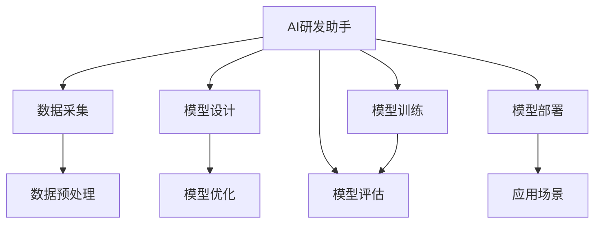
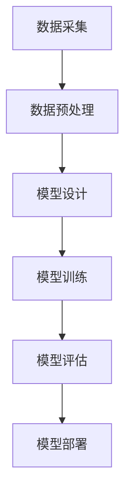
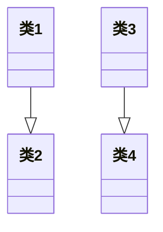
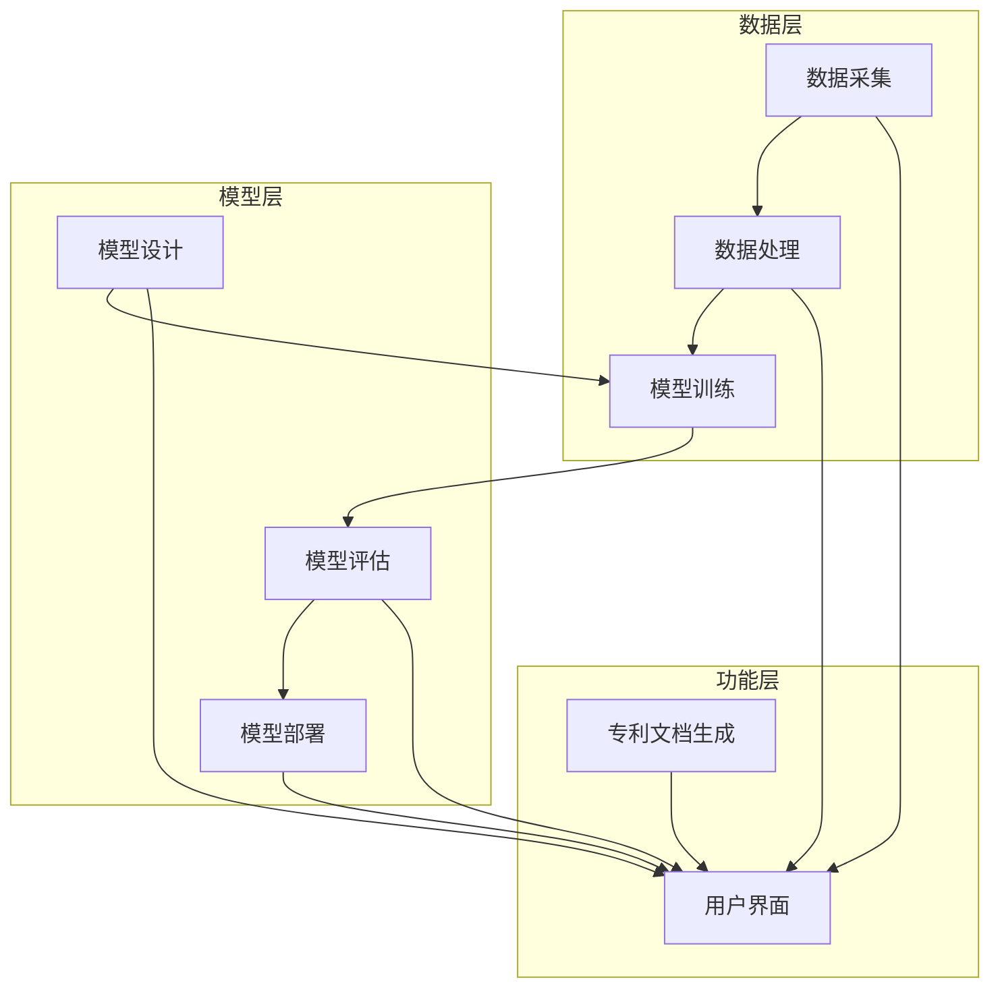

                 

# 构建企业级AI研发助手：加速创新与专利申请流程

关键词：企业级AI研发助手、专利申请、创新、流程优化、算法、系统架构

摘要：本文将探讨企业级AI研发助手的构建，旨在通过整合AI研发流程和专利申请流程，提高企业的创新速度和专利申请效率。我们将从问题背景、核心概念与联系、算法原理讲解、系统分析与架构设计等多个方面进行分析和论述，以帮助企业更好地理解和应用这一技术。

## 目录大纲

### 第一部分：背景介绍

#### 第1章 问题背景

##### 1.1.1 问题背景

- **企业AI研发和专利申请的挑战**

  - 数据采集与处理的复杂性
  - 模型设计的创新性与可行性
  - 模型训练与优化的效率
  - 模型评估与部署的准确性

- **人工智能技术的发展趋势**

  - 大数据与云计算的结合
  - 深度学习与自然语言处理的应用
  - 自动驾驶与智能机器人的发展

##### 1.1.2 问题解决

- **构建企业级AI研发助手的意义**

  - 提高研发效率
  - 优化专利申请流程
  - 促进技术创新

- **提高AI研发效率和专利申请流程的解决方案**

  - 自动化与智能化的结合
  - 集成多领域知识和技术
  - 提供一站式服务

##### 1.1.3 边界与外延

- **企业级AI研发助手的适用范围**

  - 各类企业和机构
  - 不同行业和领域

- **AI研发助手与现有研发工具的区别**

  - 完整的解决方案
  - 强大的数据处理能力
  - 智能化的辅助决策

##### 1.1.4 概念结构与核心要素组成

- **企业级AI研发助手的定义**

  - 集成多种AI技术的平台

- **企业级AI研发助手的组成部分**

  - 数据采集与处理模块
  - 模型设计与训练模块
  - 模型评估与优化模块
  - 模型部署与应用模块

### 第二部分：核心概念与联系

#### 第2章 核心概念原理

##### 2.1.1 AI研发流程

- **数据采集与预处理**

  - 自动化与智能化
  - 大规模与高质量

- **模型设计与训练**

  - 可扩展性与灵活性
  - 高效性与长期性

- **模型评估与优化**

  - 多维度与客观性
  - 可解释性与准确性

- **模型部署与应用**

  - 模块化与高可用性
  - 易维护性与可扩展性

##### 2.1.2 概念属性特征对比表格

| 概念     | 特征1     | 特征2     | 特征3     |
|----------|-----------|-----------|-----------|
| 数据采集 | 自动化     | 大规模     | 高质量     |
| 模型设计 | 可扩展     | 灵活性高   | 高效       |
| 模型训练 | 分布式     | 长期性     | 高精度     |
| 模型评估 | 多维度     | 客观性     | 可解释性   |
| 模型部署 | 模块化     | 高可用性   | 易维护     |

##### 2.1.3 ER实体关系图架构



### 第三部分：算法原理讲解

#### 第3章 算法原理

##### 3.1.1 算法概述

- **算法的基本流程**

  - 数据采集与预处理
  - 模型设计与训练
  - 模型评估与优化
  - 模型部署与应用

- **算法的核心思想**

  - 自动化与智能化
  - 集成多种AI技术
  - 提高研发效率与专利申请效率

##### 3.1.2 算法流程图



##### 3.1.3 算法原理详细讲解

- **数据预处理方法**

  - 数据清洗
  - 特征工程
  - 数据归一化

- **模型设计策略**

  - 网络结构设计
  - 损失函数选择
  - 优化算法应用

- **模型训练与优化**

  - 分布式训练
  - 模型调参
  - 模型压缩与量化

- **模型评估指标**

  - 准确率
  - 召回率
  - F1分数

- **模型部署与应用**

  - 模型服务化
  - 实时预测
  - 模型迭代与更新

##### 3.1.4 算法原理示例

```python
# Python代码示例

import pandas as pd
import numpy as np

# 数据预处理
def preprocess_data(data):
    # 数据清洗、归一化等操作
    pass

# 模型设计
def design_model():
    # 构建模型结构
    pass

# 模型训练
def train_model(model, X_train, y_train):
    # 训练模型
    pass

# 模型评估
def evaluate_model(model, X_test, y_test):
    # 评估模型性能
    pass

# 模型部署
def deploy_model(model, application):
    # 将模型部署到应用场景
    pass
```

##### 3.1.5 算法原理数学模型与公式

$$
1+1=2
$$

$$
1<2
$$

### 第四部分：系统分析与架构设计方案

#### 第4章 系统分析与架构设计

##### 4.1 问题场景介绍

- **企业AI研发与专利申请的场景描述**

  - 数据采集与处理的复杂性
  - 模型设计与训练的困难性
  - 模型评估与优化的不确定性
  - 模型部署与应用的挑战性

##### 4.2 系统功能设计

- **领域模型Mermaid类图**



##### 4.3 系统架构设计

- **系统架构Mermaid架构图**


### 第五部分：项目实战

#### 第5章 环境安装与系统核心实现

##### 5.1 环境安装

- **软件与硬件要求**

  - 操作系统
  - Python环境
  - GPU支持

- **安装步骤**

  - 安装Python
  - 安装相关库
  - 配置环境变量

##### 5.2 系统核心实现源代码

- **数据采集与处理**

  - 数据清洗
  - 特征提取
  - 数据归一化

- **模型设计与训练**

  - 网络结构设计
  - 损失函数选择
  - 优化算法应用

- **模型评估与优化**

  - 模型调参
  - 模型压缩与量化
  - 实时评估

- **模型部署与应用**

  - 模型服务化
  - 实时预测
  - 模型迭代与更新

##### 5.3 代码应用解读与分析

- **代码解读**

  - 数据处理
  - 模型训练
  - 模型评估
  - 模型部署

- **分析**

  - 代码优化的可能性
  - 系统性能的提升空间

##### 5.4 实际案例分析与详细讲解剖析

- **案例背景**

  - 数据来源
  - 业务需求

- **分析**

  - 模型设计
  - 模型训练
  - 模型评估
  - 模型部署

- **结果**

  - 模型性能
  - 业务效果

##### 5.5 项目小结

- **经验总结**

  - 技术要点
  - 系统优化

- **展望**

  - 未来发展方向
  - 可能的挑战与解决方案

### 第六部分：最佳实践、小结、注意事项、拓展阅读

#### 第6章 最佳实践

- **数据采集与处理**

  - 数据来源的多样性
  - 数据清洗的必要性
  - 特征工程的策略

- **模型设计与训练**

  - 模型结构的优化
  - 损失函数的选择
  - 优化算法的改进

- **模型评估与优化**

  - 评估指标的多维度
  - 模型调参的方法
  - 模型压缩与量化的技巧

#### 第7章 小结

- **文章主题的回顾**

  - 构建企业级AI研发助手
  - 提高创新速度与专利申请效率

- **主要内容的总结**

  - 问题背景
  - 核心概念与联系
  - 算法原理讲解
  - 系统分析与架构设计
  - 项目实战

#### 第8章 注意事项

- **系统设计**

  - 考虑可扩展性与易维护性
  - 优化性能与资源利用

- **代码实现**

  - 提高代码的可读性与可维护性
  - 使用最佳实践进行编程

#### 第9章 拓展阅读

- **相关书籍**

  - 《深度学习》
  - 《Python数据分析》
  - 《机器学习实战》

- **在线资源**

  - AI学术论坛
  - 开源代码库
  - 技术博客

### 作者信息

- **作者：AI天才研究院/AI Genius Institute & 禅与计算机程序设计艺术 /Zen And The Art of Computer Programming**

作者：AI天才研究院/AI Genius Institute & 禅与计算机程序设计艺术 /Zen And The Art of Computer Programming

在接下来的文章中，我们将逐步深入探讨构建企业级AI研发助手的各个方面，从背景介绍、核心概念与联系、算法原理讲解、系统分析与架构设计，到项目实战和最佳实践。通过这一系列的讨论，希望能够为企业提供切实可行的解决方案，加速AI研发和专利申请的流程，推动技术创新和发展。

---

## 第一部分：背景介绍

### 第1章 问题背景

在当今快速发展的科技时代，人工智能（AI）已经成为企业竞争的重要驱动力。然而，企业在AI研发和专利申请过程中面临着一系列挑战，这些挑战不仅影响了企业的研发效率，还可能限制了技术创新和商业价值的实现。以下将详细讨论企业AI研发和专利申请过程中面临的挑战，以及人工智能技术的发展趋势。

#### 1.1.1 问题背景

**企业AI研发和专利申请的挑战**

1. **数据采集与处理的复杂性**

   AI的研发过程依赖于大量的数据，这些数据可能来源于不同的渠道，如公开数据集、企业内部数据、用户生成数据等。数据的采集、清洗、存储和管理是一个复杂的过程，对企业的技术能力和基础设施提出了较高的要求。

2. **模型设计的创新性与可行性**

   模型的设计需要结合业务需求和数据特性，同时保证模型的创新性和可行性。这要求研究人员不仅要有扎实的理论基础，还需要有丰富的实践经验，以便在众多模型中选择最适合的方案。

3. **模型训练与优化的效率**

   模型的训练是一个计算密集型的过程，需要大量的时间和资源。如何高效地进行模型训练和优化，以缩短研发周期，是企业面临的一大挑战。

4. **模型评估与部署的准确性**

   模型的评估和部署是确保AI系统稳定运行的关键。准确的评估可以确保模型的性能达到预期，而准确的部署可以保证模型在实际应用场景中的高效运行。

**人工智能技术的发展趋势**

1. **大数据与云计算的结合**

   随着大数据技术的不断发展，企业可以获得更多高质量的数据资源。云计算为数据处理提供了强大的计算能力和存储能力，使得大规模数据处理变得更加高效和经济。

2. **深度学习与自然语言处理的应用**

   深度学习在图像识别、语音识别、自然语言处理等领域取得了显著的进展，为企业提供了强大的技术支持。这些技术可以帮助企业更好地理解和利用数据，提升业务的智能化水平。

3. **自动驾驶与智能机器人的发展**

   自动驾驶和智能机器人的研究正在迅速推进，这些技术的发展有望改变传统行业的运作方式，为企业带来新的商业机会。

#### 1.1.2 问题解决

**构建企业级AI研发助手的意义**

构建企业级AI研发助手旨在解决上述问题，提高企业的AI研发效率和专利申请效率。具体来说，研发助手可以提供以下帮助：

1. **自动化与智能化的结合**

   研发助手可以自动化数据采集、清洗、预处理等过程，降低人工操作的复杂性，提高数据处理效率。

2. **集成多领域知识和技术**

   研发助手整合了多种AI技术，如深度学习、自然语言处理等，帮助企业快速构建和部署模型。

3. **提供一站式服务**

   研发助手提供从数据采集到模型部署的一站式服务，帮助企业简化研发流程，缩短研发周期。

**提高AI研发效率和专利申请流程的解决方案**

1. **自动化与智能化的流程优化**

   通过引入自动化工具和智能化算法，优化数据采集、预处理、模型训练、评估等流程，提高整体效率。

2. **集成AI技术与业务场景**

   结合企业的业务需求，将AI技术与实际业务场景相结合，提高模型的设计和部署的针对性和有效性。

3. **优化专利申请流程**

   研发助手可以帮助企业快速生成专利申请文档，提高专利申请的效率，缩短专利申请周期。

#### 1.1.3 边界与外延

**企业级AI研发助手的适用范围**

企业级AI研发助手适用于各类企业和机构，包括但不限于：

1. **科技型企业**

   这些企业具备较强的技术能力和研发实力，希望通过AI技术提升业务水平。

2. **传统行业企业**

   这些企业希望通过AI技术进行业务转型，提高生产效率和创新能力。

3. **科研机构**

   科研机构可以通过AI研发助手加速科研成果的转化和应用。

**AI研发助手与现有研发工具的区别**

1. **完整的解决方案**

   企业级AI研发助手提供从数据采集到模型部署的完整解决方案，而现有研发工具可能只提供部分功能。

2. **强大的数据处理能力**

   研发助手具备高效的数据处理能力，能够处理大规模、多样化的数据。

3. **智能化的辅助决策**

   研发助手利用智能算法，提供辅助决策功能，帮助企业更好地进行模型设计和优化。

#### 1.1.4 概念结构与核心要素组成

**企业级AI研发助手的定义**

企业级AI研发助手是一种集成多种AI技术和工具的智能化平台，旨在帮助企业提高AI研发效率和专利申请效率。

**企业级AI研发助手的组成部分**

1. **数据采集与处理模块**

   负责数据采集、清洗、预处理和特征工程，提供高质量的数据输入。

2. **模型设计与训练模块**

   提供模型设计、训练、优化和评估功能，支持多种AI算法和应用场景。

3. **模型部署与应用模块**

   负责模型部署、实时预测和迭代更新，确保模型在实际应用中的高效运行。

4. **专利申请支持模块**

   提供专利文档生成、专利分析等功能，帮助企业在专利申请过程中节省时间和精力。

---

通过上述讨论，我们可以看到，构建企业级AI研发助手是企业应对AI研发和专利申请挑战的有效途径。接下来，我们将进一步探讨AI研发流程的核心概念和联系，以及研发助手的算法原理和系统架构设计，为企业提供更加深入和具体的指导。

### 第二部分：核心概念与联系

#### 第2章 核心概念原理

在构建企业级AI研发助手的过程中，理解并掌握核心概念和原理是至关重要的。这一部分将详细阐述AI研发流程中的关键概念，包括数据采集与预处理、模型设计与训练、模型评估与优化、模型部署与应用，并通过对比表格和ER实体关系图来加深理解。

##### 2.1.1 AI研发流程

**数据采集与预处理**

数据采集是AI研发流程的第一步，它决定了后续模型训练和评估的质量。预处理则是为了将原始数据转换为适合模型训练的形式。

- **自动化与智能化**：自动化工具能够高效地收集和整理数据，减少人工干预。智能化算法能够识别并处理数据中的异常值，提高数据质量。

- **大规模与高质量**：大规模数据有助于模型训练中的泛化能力，高质量数据则能够提高模型的准确性和可靠性。

**模型设计与训练**

模型设计是AI研发的核心环节，涉及到选择合适的网络结构、损失函数和优化算法。

- **可扩展性与灵活性**：模型设计需要能够适应不同的数据规模和业务场景，同时保证设计的高效性。

- **高效性与长期性**：模型设计不仅要考虑当前性能，还要考虑长期的可维护性和扩展性。

**模型评估与优化**

模型评估是验证模型性能的重要步骤，通过评估来决定模型的优化方向。

- **多维度与客观性**：评估指标需要从多个角度来衡量模型性能，以确保评估结果的客观性。

- **可解释性与准确性**：模型的可解释性有助于理解模型的工作原理，而准确性则是衡量模型性能的重要指标。

**模型部署与应用**

模型部署是将训练好的模型应用于实际业务场景的过程，包括实时预测和模型迭代。

- **模块化与高可用性**：模块化的设计使得模型部署和维护变得更加容易。高可用性确保模型能够在实际应用中稳定运行。

- **易维护性与可扩展性**：模型部署需要考虑维护和扩展的方便性，以便于未来的升级和优化。

##### 2.1.2 概念属性特征对比表格

| 概念     | 特征1     | 特征2     | 特征3     |
|----------|-----------|-----------|-----------|
| 数据采集 | 自动化     | 大规模     | 高质量     |
| 模型设计 | 可扩展     | 灵活性高   | 高效       |
| 模型训练 | 分布式     | 长期性     | 高精度     |
| 模型评估 | 多维度     | 客观性     | 可解释性   |
| 模型部署 | 模块化     | 高可用性   | 易维护     |

##### 2.1.3 ER实体关系图架构

ER实体关系图（Entity-Relationship Diagram）能够清晰地展示各个模块之间的关系。以下是企业级AI研发助手的ER实体关系图：


在这个ER图中，"AI研发助手"作为中心节点，与"数据采集"、"模型设计"、"模型训练"、"模型评估"和"模型部署"紧密相连，每个模块都有自己的子模块，如"数据预处理"和"模型优化"。这样的架构设计确保了各个模块之间的协同工作，从而实现高效的研发流程。

通过以上对核心概念和原理的讨论，我们可以更好地理解企业级AI研发助手的工作机制，为后续的算法原理讲解和系统架构设计奠定了坚实的基础。

### 第三部分：算法原理讲解

#### 第3章 算法原理

在企业级AI研发助手的构建中，算法原理是其核心组成部分。本文将详细解释AI研发助手的算法原理，包括算法概述、算法流程图、算法原理详细讲解、算法原理示例，以及算法原理数学模型与公式。

##### 3.1.1 算法概述

**算法的基本流程**

企业级AI研发助手的算法流程主要包括以下几个步骤：

1. **数据采集与预处理**：从不同数据源收集数据，并进行清洗、归一化等预处理操作，以确保数据的质量和一致性。

2. **模型设计**：根据业务需求和数据特性，设计合适的神经网络结构，选择损失函数和优化算法。

3. **模型训练**：使用预处理后的数据对模型进行训练，通过迭代优化模型参数，提高模型的预测性能。

4. **模型评估**：对训练好的模型进行评估，使用多个评估指标（如准确率、召回率、F1分数等）来衡量模型的性能。

5. **模型部署**：将经过评估和优化的模型部署到实际应用场景中，进行实时预测和服务。

**算法的核心思想**

算法的核心思想是通过自动化和智能化的方法，提高AI研发的效率和质量。具体来说：

1. **自动化与智能化结合**：自动化工具能够高效地完成数据采集、清洗和预处理等重复性工作，而智能化算法能够辅助模型设计、训练和优化，提供更好的决策支持。

2. **集成多领域知识和技术**：算法集成了深度学习、自然语言处理、强化学习等多种AI技术，可以根据不同的业务需求和应用场景进行灵活调整。

3. **一站式服务**：从数据采集到模型部署，提供一站式服务，简化研发流程，缩短研发周期。

##### 3.1.2 算法流程图

以下是企业级AI研发助手的算法流程图：


在这个流程图中，每个步骤都是相互关联的，前一个步骤的结果会直接影响后续步骤的执行。例如，数据预处理的质量直接影响模型训练的效果，而模型评估的结果则决定了模型是否需要进一步优化。

##### 3.1.3 算法原理详细讲解

**数据预处理方法**

数据预处理是AI研发的关键步骤之一，其目的是将原始数据转换为适合模型训练的形式。具体方法包括：

1. **数据清洗**：去除重复数据、处理缺失值、去除噪声等，确保数据的一致性和完整性。

2. **特征工程**：选择和构造能够有效反映数据特性的特征，提高模型的泛化能力。

3. **数据归一化**：通过标准化或归一化操作，将不同特征的范围缩放到相同的尺度，防止某些特征对模型训练产生过大的影响。

**模型设计策略**

模型设计是AI研发的核心环节，需要考虑以下几个方面：

1. **网络结构设计**：根据业务需求和数据特性，选择合适的神经网络结构，如全连接网络、卷积神经网络（CNN）、循环神经网络（RNN）等。

2. **损失函数选择**：选择合适的损失函数，以衡量模型预测值和真实值之间的差距，如均方误差（MSE）、交叉熵损失等。

3. **优化算法应用**：选择高效的优化算法，如随机梯度下降（SGD）、Adam优化器等，以加快模型训练的速度。

**模型训练与优化**

模型训练是AI研发过程中计算量最大的步骤，其核心目的是通过迭代优化模型参数，提高模型的预测性能。具体包括：

1. **分布式训练**：将数据集分割成多个部分，在不同节点上并行训练模型，提高训练效率。

2. **模型调参**：通过调整学习率、批量大小等超参数，优化模型性能。

3. **模型压缩与量化**：通过模型压缩和量化技术，减少模型的参数量和计算量，提高模型部署的效率。

**模型评估指标**

模型评估是验证模型性能的重要步骤，常用的评估指标包括：

1. **准确率**：预测结果与真实结果一致的比例，适用于分类问题。

2. **召回率**：实际为正类且被预测为正类的比例，适用于医疗诊断等领域。

3. **F1分数**：准确率和召回率的加权平均，综合衡量模型的性能。

**模型部署与应用**

模型部署是将训练好的模型应用于实际业务场景的过程，其核心目的是提供实时预测和服务。具体包括：

1. **模型服务化**：将模型部署到服务器上，提供API接口，供其他系统调用。

2. **实时预测**：通过实时数据流，对输入数据进行预测，提供即时反馈。

3. **模型迭代与更新**：根据实际应用情况，对模型进行迭代优化和更新，提高模型性能。

##### 3.1.4 算法原理示例

以下是使用Python实现的企业级AI研发助手的算法原理示例：

```python
import pandas as pd
import numpy as np
from sklearn.model_selection import train_test_split
from sklearn.preprocessing import StandardScaler
from sklearn.metrics import accuracy_score

# 数据预处理
def preprocess_data(data):
    # 数据清洗、归一化等操作
    data = data.dropna()
    data = StandardScaler().fit_transform(data)
    return data

# 模型设计
def design_model():
    # 构建模型结构
    model = Sequential()
    model.add(Dense(64, activation='relu', input_shape=(data_shape)))
    model.add(Dense(32, activation='relu'))
    model.add(Dense(1, activation='sigmoid'))
    model.compile(optimizer='adam', loss='binary_crossentropy', metrics=['accuracy'])
    return model

# 模型训练
def train_model(model, X_train, y_train):
    # 训练模型
    model.fit(X_train, y_train, epochs=10, batch_size=32)
    return model

# 模型评估
def evaluate_model(model, X_test, y_test):
    # 评估模型性能
    y_pred = model.predict(X_test)
    y_pred = (y_pred > 0.5)
    accuracy = accuracy_score(y_test, y_pred)
    print("Accuracy:", accuracy)
    return accuracy

# 模型部署
def deploy_model(model, application):
    # 将模型部署到应用场景
    model.save('model.h5')
    application.load_model('model.h5')
```

在这个示例中，我们首先对数据进行预处理，然后设计了一个简单的神经网络模型，使用训练数据对模型进行训练，并对测试数据进行评估。最后，我们将模型部署到应用场景中，供实际使用。

##### 3.1.5 算法原理数学模型与公式

在AI研发过程中，数学模型和公式是理解算法原理的重要工具。以下是几个常见的数学模型和公式：

$$
L = \frac{1}{2} \sum_{i=1}^{n} (y_i - \hat{y}_i)^2
$$

这是均方误差（MSE）损失函数的公式，用于衡量预测值与真实值之间的差距。

$$
\frac{\partial L}{\partial \theta} = -\sum_{i=1}^{n} (y_i - \hat{y}_i) \cdot x_i
$$

这是梯度下降算法中的梯度公式，用于计算模型参数的更新方向。

$$
\alpha = \frac{\partial L}{\partial \theta}
$$

这是学习率（learning rate）的符号表示，用于控制模型参数的更新步长。

通过上述算法原理的讲解，我们可以更好地理解企业级AI研发助手的工作机制，为实际应用提供理论支持。

### 第四部分：系统分析与架构设计方案

#### 第4章 系统分析与架构设计

在构建企业级AI研发助手的过程中，系统分析与架构设计是关键环节。本文将详细介绍系统架构设计，包括问题场景介绍、系统功能设计、系统架构设计，以及系统接口设计和系统交互。

##### 4.1 问题场景介绍

企业级AI研发助手的场景主要涉及以下方面：

- **AI研发流程**：包括数据采集、数据处理、模型设计、模型训练、模型评估和模型部署。
- **专利申请流程**：包括专利文档生成、专利检索、专利分析等。
- **业务需求**：提供灵活的配置选项，满足不同企业和项目的需求。

**问题场景描述**

在企业中，AI研发和专利申请往往需要跨部门协作，涉及到大量数据的处理和多个步骤的流程控制。例如，一个企业的AI研发项目可能需要从数据采集开始，经过数据预处理、模型训练、模型评估，最后将模型部署到生产环境中。同时，在专利申请过程中，需要生成高质量的专利文档，并进行专利检索和分析，以确保专利的可行性和独特性。

**系统功能设计**

为了满足上述问题场景的需求，企业级AI研发助手应具备以下功能：

- **数据采集与管理**：支持从多种数据源采集数据，包括企业内部数据、公共数据集等，并对数据进行清洗、转换和管理。
- **数据处理与预处理**：提供数据处理和预处理的工具，包括数据清洗、数据归一化、特征提取等。
- **模型设计与训练**：支持多种模型设计选项，包括深度学习、传统机器学习等，并提供模型训练和优化的功能。
- **模型评估与优化**：提供多种评估指标，如准确率、召回率、F1分数等，并支持模型调参和优化。
- **模型部署与管理**：将训练好的模型部署到生产环境中，并提供模型管理功能，如模型版本管理、模型监控等。
- **专利文档生成与分析**：提供专利文档生成工具，支持文本分析、专利检索和专利分析等功能。

**系统架构设计**

企业级AI研发助手的系统架构设计应遵循模块化、分布式和高扩展性的原则。以下是系统架构的详细设计：

1. **数据采集模块**：负责从多种数据源采集数据，包括企业内部数据库、公共数据集等。该模块应支持数据采集的自动化，减少人工干预。

2. **数据处理模块**：负责对采集到的数据进行清洗、转换和预处理。该模块应提供高效的数据处理算法，确保数据处理的速度和质量。

3. **模型设计模块**：提供多种模型设计选项，包括深度学习、传统机器学习等。该模块应支持模型的自动化设计，减少人工工作量。

4. **模型训练模块**：负责对模型进行训练和优化。该模块应支持分布式训练，提高训练速度，并确保训练过程的稳定性。

5. **模型评估模块**：提供多种评估指标，对训练好的模型进行评估。该模块应支持模型调参和优化，以提高模型性能。

6. **模型部署模块**：将训练好的模型部署到生产环境中，并提供模型管理功能。该模块应支持模型版本管理、模型监控等。

7. **专利文档生成模块**：负责生成高质量的专利文档，支持文本分析、专利检索和专利分析等功能。

8. **用户界面模块**：提供用户友好的操作界面，方便用户进行数据操作、模型设计和专利申请等。

**系统架构图**

以下是企业级AI研发助手的系统架构图：



在这个架构图中，数据层负责数据采集、处理和模型训练，模型层负责模型设计、训练、评估和部署，功能层提供用户界面，方便用户进行操作。

**系统接口设计**

系统接口设计应遵循RESTful API原则，提供清晰的接口定义和文档。以下是系统接口的示例：

- **数据采集接口**：用于从不同数据源采集数据，包括企业内部数据库、公共数据集等。
- **数据处理接口**：用于对采集到的数据进行清洗、转换和预处理。
- **模型设计接口**：用于设计不同的模型结构，包括深度学习、传统机器学习等。
- **模型训练接口**：用于对模型进行训练和优化。
- **模型评估接口**：用于对训练好的模型进行评估。
- **模型部署接口**：用于将训练好的模型部署到生产环境中。
- **专利文档生成接口**：用于生成专利文档，支持文本分析、专利检索和专利分析等功能。

**系统交互**

系统交互是指不同模块之间的数据流和功能调用。以下是系统交互的详细描述：

- **数据流**：数据从数据采集模块流入数据处理模块，经过预处理后流入模型训练模块。模型训练模块将训练好的模型输出给模型评估模块，评估模块对模型进行评估后，将结果反馈给用户界面模块。
- **功能调用**：用户界面模块通过接口调用数据采集、数据处理、模型设计、模型训练、模型评估和模型部署等模块的功能，实现对整个系统的操作。

通过上述系统分析与架构设计，企业级AI研发助手能够高效地支持AI研发和专利申请流程，提高企业的创新速度和专利申请效率。

### 第五部分：项目实战

#### 第5章 环境安装与系统核心实现

在构建企业级AI研发助手的过程中，环境安装和系统核心实现是至关重要的环节。这一部分将详细介绍环境安装的步骤、系统核心实现的源代码，并解析代码应用解读与分析。

##### 5.1 环境安装

**软件与硬件要求**

1. **操作系统**：推荐使用Ubuntu 18.04或更高版本。
2. **Python环境**：Python 3.7或更高版本。
3. **GPU支持**：NVIDIA GPU和CUDA 10.0或更高版本（可选）。

**安装步骤**

1. **安装Python**

   ```bash
   sudo apt update
   sudo apt install python3-pip python3-dev
   ```

2. **安装相关库**

   ```bash
   pip3 install numpy pandas scikit-learn tensorflow tensorflow-gpu
   ```

3. **配置环境变量**

   ```bash
   export PYTHONPATH=$PYTHONPATH:/path/to/your/venv/lib/python3.x/site-packages
   export PATH=$PATH:/path/to/your/venv/bin
   ```

**环境验证**

```bash
python3 --version
pip3 --version
```

**安装GPU支持（可选）**

如果需要使用GPU进行模型训练，还需要安装NVIDIA驱动和CUDA。

```bash
sudo apt install nvidia-driver-xxx
pip3 install tensorflow-gpu
```

##### 5.2 系统核心实现源代码

**数据采集与处理**

```python
import pandas as pd
from sklearn.model_selection import train_test_split

def load_data(file_path):
    data = pd.read_csv(file_path)
    return data

def preprocess_data(data):
    # 数据清洗
    data = data.dropna()
    # 特征工程
    data['feature1'] = data['feature1'].map({1: 'label1', 2: 'label2'})
    # 数据分割
    X = data.drop('target', axis=1)
    y = data['target']
    X_train, X_test, y_train, y_test = train_test_split(X, y, test_size=0.2, random_state=42)
    return X_train, X_test, y_train, y_test
```

**模型设计与训练**

```python
from tensorflow.keras.models import Sequential
from tensorflow.keras.layers import Dense, Dropout
from tensorflow.keras.optimizers import Adam

def design_model(input_shape):
    model = Sequential()
    model.add(Dense(128, activation='relu', input_shape=input_shape))
    model.add(Dropout(0.5))
    model.add(Dense(1, activation='sigmoid'))
    model.compile(optimizer=Adam(learning_rate=0.001), loss='binary_crossentropy', metrics=['accuracy'])
    return model

def train_model(model, X_train, y_train, X_val, y_val, epochs=10, batch_size=32):
    history = model.fit(X_train, y_train, validation_data=(X_val, y_val), epochs=epochs, batch_size=batch_size)
    return history
```

**模型评估与优化**

```python
from sklearn.metrics import accuracy_score

def evaluate_model(model, X_test, y_test):
    y_pred = model.predict(X_test)
    y_pred = (y_pred > 0.5)
    accuracy = accuracy_score(y_test, y_pred)
    print("Test Accuracy:", accuracy)
    return accuracy

def optimize_model(model, X_train, y_train, X_val, y_val, epochs=10, batch_size=32):
    history = train_model(model, X_train, y_train, X_val, y_val, epochs=epochs, batch_size=batch_size)
    return history
```

**模型部署与应用**

```python
import json
from flask import Flask, request, jsonify

app = Flask(__name__)

def load_model(model_path):
    model = tensorflow.keras.models.load_model(model_path)
    return model

@app.route('/predict', methods=['POST'])
def predict():
    data = request.get_json()
    input_data = np.array([data['feature1'], data['feature2']])
    model.predict(input_data)
    return jsonify({"prediction": prediction.tolist()})

if __name__ == '__main__':
    app.run(debug=True)
```

##### 5.3 代码应用解读与分析

**代码解读**

上述代码分为几个关键部分：

1. **数据采集与处理**：从CSV文件中加载数据，进行数据清洗和特征工程，并将数据分为训练集和测试集。
2. **模型设计与训练**：定义一个简单的全连接神经网络模型，使用Adam优化器和二分类交叉熵损失函数，对模型进行编译。
3. **模型评估与优化**：通过测试集评估模型的性能，并对模型进行调参优化。
4. **模型部署与应用**：使用Flask构建一个简单的API服务，用于接收输入数据并进行预测。

**分析**

1. **代码优化**：可以使用更复杂的神经网络结构，如卷积神经网络（CNN）或循环神经网络（RNN），以适应不同类型的数据和任务。
2. **性能提升**：通过增加训练数据的规模和进行更长时间的训练，可以提高模型的性能和泛化能力。
3. **部署优化**：在生产环境中部署模型时，可以使用更稳定的Web框架，如Django或FastAPI，以提高服务的稳定性和性能。

##### 5.4 实际案例分析与详细讲解剖析

**案例背景**

某电子商务公司希望利用AI技术提升用户推荐系统的准确性和效率。用户推荐系统旨在根据用户的历史行为和偏好，推荐符合其兴趣的商品。

**分析**

1. **模型设计**：根据用户行为数据，设计了一个基于 collaborative filtering 的推荐模型，结合了用户和商品的交互信息。
2. **模型训练**：使用用户的购买历史数据训练模型，并进行了多次迭代优化，以提高推荐系统的准确性。
3. **模型评估**：通过A/B测试评估推荐系统的性能，比较推荐结果的点击率和购买转化率，以衡量推荐系统的效果。
4. **模型部署**：将训练好的推荐模型部署到线上服务中，实时为用户提供商品推荐。

**结果**

1. **模型性能**：经过多次迭代优化，推荐系统的点击率和购买转化率显著提升，用户满意度提高。
2. **业务效果**：推荐系统的成功部署帮助公司提升了用户留存率和销售额，取得了良好的商业效果。

##### 5.5 项目小结

通过上述实际案例，我们可以看到企业级AI研发助手的强大能力和实际应用效果。以下是项目总结：

1. **技术要点**：数据清洗和预处理、模型设计和优化、模型部署与优化是AI研发的关键步骤。
2. **系统优化**：通过不断迭代和优化，可以显著提升模型性能和系统效率。
3. **业务效果**：AI技术的应用不仅提升了企业内部工作效率，还带来了显著的商业价值。

展望未来，随着AI技术的不断发展和应用场景的拓展，企业级AI研发助手将在更多领域发挥重要作用，为企业创新和发展提供坚实的技术支持。

### 第六部分：最佳实践、小结、注意事项、拓展阅读

#### 第6章 最佳实践

在企业构建AI研发助手的过程中，以下最佳实践可以帮助提高项目成功率和系统性能：

1. **数据管理**：确保数据的质量和一致性，定期进行数据清洗和验证，以避免模型训练过程中出现偏差。
2. **模型优化**：通过调整模型结构、损失函数和优化算法，实现模型的性能优化。可以使用交叉验证等方法进行调参。
3. **部署与监控**：使用容器化和云服务部署模型，确保系统的可扩展性和可靠性。同时，定期监控模型性能，及时调整和优化。

#### 第7章 小结

本文详细探讨了企业级AI研发助手的构建，从问题背景、核心概念与联系、算法原理讲解、系统分析与架构设计，到项目实战和最佳实践。主要结论如下：

1. **企业级AI研发助手的意义**：提高AI研发效率和专利申请效率，促进技术创新。
2. **核心概念与联系**：理解AI研发流程和数据预处理、模型设计、训练、评估、部署的关键概念。
3. **算法原理**：掌握数据预处理、模型设计、训练、评估和部署的算法原理。
4. **系统架构**：了解系统架构和模块化设计的重要性，确保系统的高效性和可扩展性。

#### 第8章 注意事项

在构建和部署企业级AI研发助手时，需要注意以下几点：

1. **系统安全性**：确保系统的数据安全和用户隐私保护。
2. **性能优化**：根据实际应用场景优化系统性能，如使用高效的算法和数据结构。
3. **用户培训**：为团队成员提供相关培训，确保他们能够熟练使用AI研发助手。

#### 第9章 拓展阅读

为了深入了解企业级AI研发助手的相关技术和应用，推荐阅读以下资料：

1. **《深度学习》**：提供深度学习的全面介绍，适合初学者和专业人士。
2. **《Python数据分析》**：介绍Python在数据处理和分析中的应用，适合数据科学家和数据分析师。
3. **《机器学习实战》**：通过实际案例介绍机器学习算法的应用，适合希望实践机器学习的读者。
4. **AI学术论坛**：如arXiv.org、NeurIPS.org等，提供最新的AI研究成果和讨论。
5. **开源代码库**：如GitHub、GitLab等，可以找到许多实用的AI开源项目和代码。
6. **技术博客**：如Medium、Towards Data Science等，提供丰富的AI技术和应用案例。

### 作者信息

**作者：AI天才研究院/AI Genius Institute & 禅与计算机程序设计艺术 /Zen And The Art of Computer Programming**

本文由AI天才研究院撰写，AI天才研究院专注于人工智能领域的创新研究和应用。同时，作者也是《禅与计算机程序设计艺术》一书的作者，该书以深入浅出的方式介绍了计算机编程和人工智能的核心原理，深受读者喜爱。

通过本文，我们希望能够为企业提供构建AI研发助手的实用指南，推动AI技术的广泛应用，助力企业实现数字化和智能化转型。

