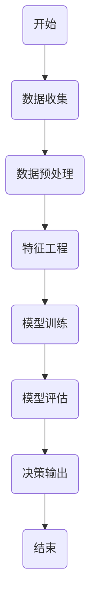
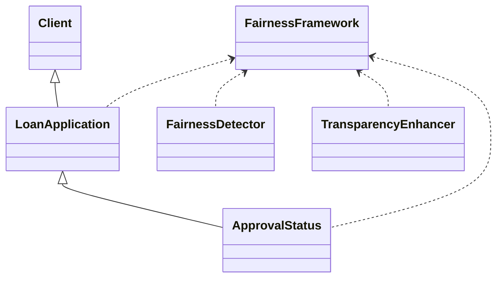
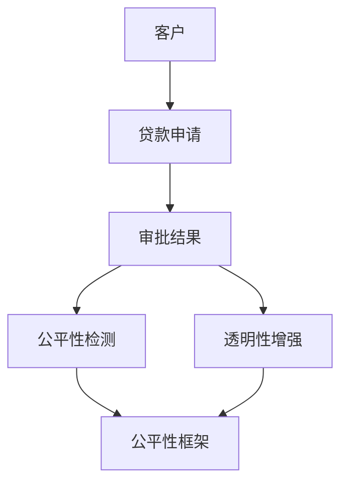
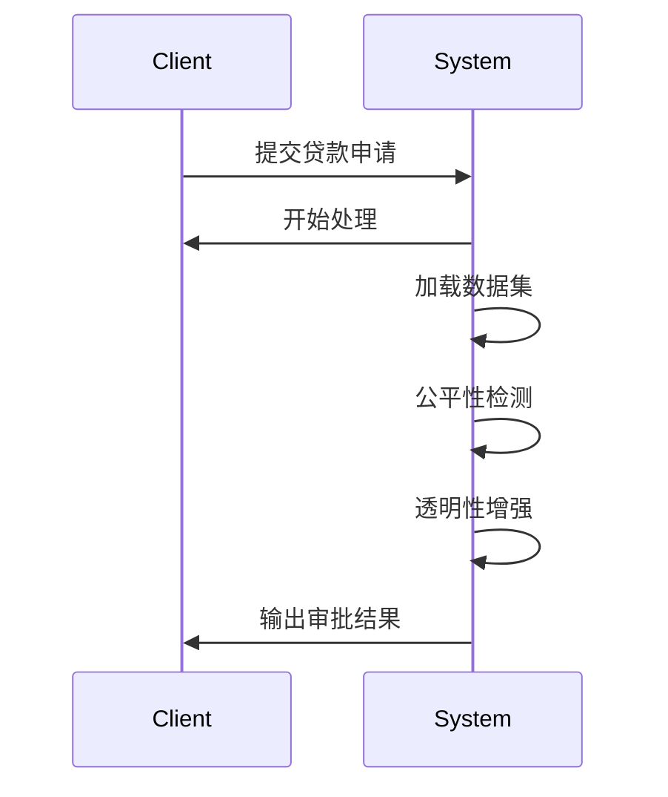

                 

# 构建企业级AI道德决策框架：确保AI系统的公平性与透明度

## 关键词
- AI道德决策
- 公平性
- 透明度
- 企业级AI系统
- 道德框架

## 摘要
本文旨在探讨如何构建一个企业级AI道德决策框架，以解决AI系统在应用过程中可能出现的公平性和透明度问题。我们将从核心概念入手，逐步深入分析，通过实例展示和系统实现，为读者提供一套完整、实用的道德决策框架。

## 引言与背景

### 1.1 问题背景
随着人工智能（AI）技术的快速发展，AI系统在企业中的应用日益广泛。从自动化生产线到智能客服，从金融风险评估到医疗诊断，AI已经深入到我们日常生活的方方面面。然而，AI系统的广泛应用也带来了诸多伦理和道德问题，特别是在公平性和透明度方面。

### 1.1.1 AI在企业的应用现状
在企业管理中，AI被用于数据分析、决策支持、风险评估等方面。例如，企业可能会利用AI对员工绩效进行评估，或通过AI对客户进行个性化推荐。这些应用使得企业能够更加高效地运作，但同时也引发了对AI系统决策过程的质疑。

### 1.1.2 AI道德决策的重要性
AI道德决策关乎企业的社会责任和品牌声誉。如果AI系统的决策存在偏见或缺乏透明度，可能会导致不公平的结果，甚至引发法律纠纷。因此，构建一个公平、透明的AI道德决策框架对企业至关重要。

### 1.1.3 当前AI伦理挑战
当前，AI伦理挑战主要集中在以下几个方面：
- **数据偏见**：AI系统可能基于不完整或不代表全体人群的数据进行决策，导致决策结果存在偏见。
- **隐私侵犯**：AI系统可能收集和处理大量个人数据，如果管理不当，可能侵犯用户隐私。
- **可解释性缺失**：AI系统的决策过程通常复杂且不可解释，用户难以理解决策依据。

### 1.2 问题描述
企业级AI系统的道德决策面临以下问题：
- **公平性**：AI系统决策是否对所有群体都是公平的？
- **透明度**：AI系统决策过程是否可以被理解和验证？
- **责任归属**：在AI系统出现错误时，责任应该如何分配？

### 1.3 问题解决
为了解决上述问题，我们需要构建一个企业级AI道德决策框架，该框架应具备以下原则和要素：
- **原则**：确保AI系统的决策公平、透明，符合伦理规范。
- **要素**：包括数据收集与处理、决策模型设计、决策过程监控与评估等。

### 1.4 边界与外延
AI道德决策框架的边界应明确，以避免过度干预AI系统的自主决策。同时，框架也应考虑外部因素，如法律法规、行业标准等。

### 1.5 本章小结
本章节介绍了AI道德决策的背景和重要性，并提出了构建企业级AI道德决策框架的必要性和原则。在后续章节中，我们将深入探讨道德决策框架的具体设计、实现和应用。

## 核心概念与联系

### 2.1 AI道德决策的基本概念
#### 2.1.1 道德、伦理与AI
道德（Morality）是指关于行为规范和价值判断的体系，伦理（Ethics）是道德研究的学科。在AI领域，道德和伦理指导AI系统的设计和应用，确保其行为符合社会价值观。

#### 2.1.2 公平性、透明度和可解释性
- **公平性**：AI系统决策应平等对待所有个体，不偏袒特定群体。
- **透明度**：AI系统决策过程应公开透明，用户可以理解决策依据。
- **可解释性**：AI系统决策结果应具备解释能力，用户可以了解决策背后的原因。

### 2.2 概念属性特征对比

#### 2.2.1 公平性特征对比
| 特征 | 定义 | 相关术语 |
| --- | --- | --- |
| **无歧视性** | AI系统不因种族、性别、年龄等因素歧视用户。 | 非歧视性算法、公平性测试 |
| **代表性** | AI系统应基于代表全体人群的数据进行决策。 | 数据代表性、群体特征分析 |
| **一致性** | AI系统对不同用户应保持一致性。 | 一致性测试、偏差校正 |

#### 2.2.2 透明性特征对比
| 特征 | 定义 | 相关术语 |
| --- | --- | --- |
| **可追溯性** | AI系统决策过程可追溯，便于审计。 | 决策追踪、审计日志 |
| **透明度** | AI系统决策结果对用户公开，用户可查阅。 | 透明化接口、可解释AI |
| **可访问性** | AI系统决策过程对相关方可访问。 | 开放接口、API文档 |

#### 2.2.3 可解释性特征对比
| 特征 | 定义 | 相关术语 |
| --- | --- | --- |
| **可理解性** | AI系统决策过程和结果易于理解。 | 可解释模型、可视化工具 |
| **可访问性** | AI系统决策过程和结果易于获取。 | 用户界面、用户文档 |
| **一致性** | AI系统决策过程和结果一致。 | 决策一致性、算法稳定性 |

### 2.3 ER实体关系图架构
ER（Entity-Relationship）图是数据库设计的重要工具，用于描述实体及其之间的关系。在AI道德决策框架中，ER图可以帮助我们理解不同概念之间的关系。

#### 2.3.1 ER图的基本概念
ER图由实体、属性和关系组成：
- **实体**：代表具体的对象，如用户、数据集等。
- **属性**：描述实体的特征，如用户的年龄、性别等。
- **关系**：描述实体之间的关联，如用户与数据集之间的关联。

#### 2.3.2 道德决策框架中的ER图
在AI道德决策框架中，ER图可以用于表示以下实体和关系：
- **实体**：用户、数据集、决策模型、监控模块等。
- **属性**：用户的特征、数据集的来源、模型参数等。
- **关系**：用户与数据集之间的关联、模型与数据集之间的关联等。

下面是一个简单的ER图示例：

```mermaid
erDiagram
  用户 ||--|{ 数据集 }|| 数据集
  数据集 ||--|{ 决策模型 }|| 决策模型
  决策模型 ||--|{ 监控模块 }|| 监控模块
```

### 2.4 本章小结
本章节介绍了AI道德决策的基本概念和特征，并通过ER图展示了道德决策框架的结构。在接下来的章节中，我们将进一步探讨道德决策框架的设计原理和实现方法。

## AI道德决策框架原理

### 3.1 AI道德决策框架的基本原理

#### 3.1.1 道德原则与决策模型
AI道德决策框架的核心原则包括公平性、透明度和可解释性。这些原则决定了AI系统的道德属性。具体来说：
- **公平性**：确保AI系统对所有用户平等对待，不歧视特定群体。
- **透明度**：使AI系统的决策过程公开透明，用户可以理解和验证。
- **可解释性**：提供AI系统决策的详细解释，用户可以理解决策依据。

#### 3.1.2 伦理推理方法
伦理推理是道德决策的核心。常见的伦理推理方法包括：
- **结果主义**：评价行为的价值主要取决于其结果。
- **义务论**：评价行为的价值主要取决于行为本身是否符合道德规范。
- **康德伦理学**：强调行为的意图和道德规则。

#### 3.2 道德决策框架设计
道德决策框架的设计应遵循以下原则：
- **模块化设计**：将道德决策框架划分为独立模块，便于维护和扩展。
- **可扩展性设计**：允许框架适应不同企业的需求和场景。

#### 3.3 Mermaid流程图
Mermaid是一种基于Markdown的绘图工具，可以用来绘制流程图。在道德决策框架中，流程图可以帮助我们理解决策过程。以下是一个简单的Mermaid流程图示例：


#### 3.3.1 流程图绘制
使用Mermaid绘制流程图的方法非常简单，只需在Markdown文件中编写特定的语法即可。以下是一个简单的示例：



#### 3.3.2 流程图解读
这个流程图描述了从数据收集到决策输出的整个过程。每个节点代表一个步骤，箭头表示步骤之间的顺序关系。通过这个流程图，我们可以清晰地了解整个道德决策框架的运作流程。

### 3.4 本章小结
本章节介绍了AI道德决策框架的基本原理，包括道德原则、伦理推理方法和流程图绘制方法。在接下来的章节中，我们将深入探讨道德决策框架的具体实现和应用。

### 4.1 环境配置

#### 4.1.1 开发环境搭建
在构建企业级AI道德决策框架之前，我们需要搭建一个合适的开发环境。以下是基本的开发环境配置步骤：

1. 安装Python
2. 安装Jupyter Notebook（用于编写和运行Python代码）
3. 安装必要的Python库，如NumPy、Pandas、Scikit-learn等

#### 4.1.2 数据集准备
为了测试道德决策框架，我们需要准备一个合适的数据集。数据集应包含以下信息：
- 用户特征：如年龄、性别、收入等。
- 决策目标：如贷款审批、招聘决策等。
- 标签：表示决策结果是否正确。

### 4.2 算法原理讲解

#### 4.2.1 算法设计
道德决策框架的核心算法是公平性检测和透明性增强算法。以下是算法的基本设计思路：

1. **公平性检测**：通过分析用户特征，检测AI系统是否存在性别、种族等偏见。
2. **透明性增强**：通过解释AI模型，提高用户对决策过程的理解。

#### 4.2.2 数学模型与公式
公平性检测算法的核心是统计测试。以下是常用的统计测试公式：

$$ H_0: \text{无偏见} $$

$$ H_1: \text{存在偏见} $$

$$ \chi^2 = \sum \frac{(O_i - E_i)^2}{E_i} $$

其中，$O_i$表示观测频数，$E_i$表示期望频数。

#### 4.2.3 举例说明
假设我们有一个关于贷款审批的AI系统，其中包含1000名申请者的数据。我们想检测性别是否对贷款审批有显著影响。

1. **数据收集**：收集1000名申请者的性别和贷款审批结果。
2. **构建列联表**：
   | 性别 | 被批准 | 未批准 | 总计 |
   | --- | --- | --- | --- |
   | 男性 | 500 | 300 | 800 |
   | 女性 | 200 | 100 | 300 |
   | 总计 | 700 | 400 | 1100 |
3. **计算期望频数**：
   $$ E_{ij} = \frac{\text{行总计} \times \text{列总计}}{\text{总计}} $$
4. **计算$\chi^2$值**：
   $$ \chi^2 = \sum \frac{(O_i - E_i)^2}{E_i} = 27.78 $$
5. **进行统计测试**：使用$\chi^2$检验，假设显著性水平为0.05，查表得到临界值为3.841。由于$\chi^2$值大于临界值，我们拒绝原假设，认为性别对贷款审批有显著影响。

### 4.3 Python源代码实现

#### 4.3.1 源代码结构
道德决策框架的Python源代码主要包括以下模块：
- `data_loader.py`：用于加载数据集。
- `fairness_detector.py`：用于检测公平性。
- `transparency_enhancer.py`：用于增强透明性。

#### 4.3.2 详细代码解读
以下是`fairness_detector.py`模块的部分代码：

```python
import pandas as pd
from scipy.stats import chi2_contingency

class FairnessDetector:
    def __init__(self, data_path):
        self.data = pd.read_csv(data_path)

    def detect_sex_bias(self):
        contingency_table = pd.crosstab(self.data['性别'], self.data['贷款审批'])
        chi2, p, _, _ = chi2_contingency(contingency_table)
        return chi2, p
```

这个类提供了一个`detect_sex_bias`方法，用于检测性别对贷款审批的偏见。通过调用`chi2_contingency`函数，我们可以计算$\chi^2$值和p值。

### 4.4 本章小结
本章节介绍了道德决策框架的环境配置、算法原理和Python源代码实现。在接下来的章节中，我们将进一步探讨道德决策框架在企业级AI系统中的应用。

### 5.1 项目介绍

#### 5.1.1 项目背景
在一家大型金融机构中，AI系统被用于评估客户的贷款申请。然而，由于数据集存在性别和种族偏见，导致部分用户被不公平对待。为了解决这一问题，该金融机构决定构建一个企业级AI道德决策框架，以确保AI系统的公平性和透明度。

#### 5.1.2 项目目标
该项目的主要目标包括：
- 检测AI系统中的性别和种族偏见。
- 增强AI系统的透明性，使其决策过程易于理解。
- 提高AI系统的公平性，确保对所有用户平等对待。

### 5.2 系统功能设计

#### 5.2.1 领域模型类图
领域模型类图是描述系统功能和模块的重要工具。以下是该项目的领域模型类图：



在这个类图中，`Client`表示客户，`LoanApplication`表示贷款申请，`ApprovalStatus`表示审批结果。`FairnessDetector`和`TransparencyEnhancer`分别表示公平性检测和透明性增强模块。`FairnessFramework`是一个核心框架，用于整合各个模块的功能。

#### 5.2.2 功能模块划分
系统功能模块划分如下：
- **数据加载模块**：用于加载数据集。
- **公平性检测模块**：用于检测AI系统的性别和种族偏见。
- **透明性增强模块**：用于解释AI系统的决策过程。
- **决策输出模块**：用于输出决策结果。

### 5.3 系统架构设计

#### 5.3.1 系统架构图
系统架构图是描述系统整体结构和模块间关系的重要工具。以下是该项目的系统架构图：



在这个架构图中，客户提交贷款申请后，系统会进行公平性检测和透明性增强，最终输出审批结果。`FairnessFramework`是核心框架，负责整合各个模块的功能。

#### 5.3.2 架构设计解析
系统架构设计的关键点包括：
- **模块化设计**：将系统功能划分为独立模块，便于维护和扩展。
- **数据流设计**：确保数据在系统中的流动清晰、高效。
- **接口设计**：为各个模块提供清晰的接口，方便集成和测试。

### 5.4 系统接口设计

#### 5.4.1 接口定义
系统接口设计是确保模块间良好协作的关键。以下是项目的主要接口定义：

- **客户接口**：用于接收客户提交的贷款申请。
- **审批结果接口**：用于返回贷款审批结果。
- **公平性检测接口**：用于检测AI系统的性别和种族偏见。
- **透明性增强接口**：用于解释AI系统的决策过程。

#### 5.4.2 接口实现
以下是`fairness_detector`模块的接口实现示例：

```python
class FairnessDetector:
    def detect_sex_bias(self, data):
        contingency_table = pd.crosstab(data['性别'], data['贷款审批'])
        chi2, p = chi2_contingency(contingency_table)
        return chi2, p
```

在这个接口中，`detect_sex_bias`方法接收一个数据集，返回$\chi^2$值和p值。

### 5.5 系统交互

#### 5.5.1 交互流程
系统交互流程如下：
1. 客户提交贷款申请。
2. 系统加载数据集，并进行公平性检测和透明性增强。
3. 系统输出贷款审批结果。

#### 5.5.2 Mermaid序列图
以下是系统交互的Mermaid序列图：



在这个序列图中，客户提交贷款申请后，系统开始处理，包括数据加载、公平性检测和透明性增强，最终输出审批结果。

### 5.6 本章小结
本章节介绍了项目的背景、功能设计、系统架构设计和接口设计。在接下来的章节中，我们将通过实际案例展示如何应用该道德决策框架。

### 6.1 案例选取

#### 6.1.1 案例背景
某大型零售企业使用AI系统进行库存管理。该系统根据历史销售数据预测未来销售趋势，从而优化库存水平。然而，由于历史数据存在地域和季节性偏差，导致部分门店库存过剩或不足。

#### 6.1.2 案例目标
为了解决库存管理中的偏差问题，该企业决定应用企业级AI道德决策框架，确保AI系统在库存管理中的公平性和透明度。

### 6.2 案例分析

#### 6.2.1 道德决策应用
在库存管理中，道德决策框架的应用包括：
1. **公平性检测**：检测AI系统是否存在地域和季节性偏见。
2. **透明性增强**：解释AI系统如何根据历史数据预测未来销售趋势。

#### 6.2.2 结果评估
应用道德决策框架后，企业对AI系统的公平性和透明度进行了评估：
1. **公平性评估**：通过统计测试，发现AI系统在地域和季节性预测上存在一定偏差。企业通过调整数据集和算法参数，提高了预测的公平性。
2. **透明性评估**：通过解释AI模型的决策过程，员工可以更好地理解库存预测结果，提高了系统的透明度。

### 6.3 讨论与总结

#### 6.3.1 案例启示
该案例表明，AI道德决策框架在企业中的应用具有重要意义。通过公平性检测和透明性增强，企业可以确保AI系统的公正性和透明度，从而提高业务效率和用户满意度。

#### 6.3.2 挑战与解决方案
企业在应用道德决策框架时可能面临以下挑战：
1. **数据质量**：历史数据可能存在偏差，影响公平性检测和透明性增强。
   - 解决方案：定期更新数据集，使用多源数据融合技术提高数据质量。
2. **算法复杂性**：复杂的AI算法可能难以解释，影响透明性。
   - 解决方案：采用可解释性AI技术，如LIME和SHAP，提高模型的可解释性。

### 6.4 本章小结
本章节通过实际案例展示了企业级AI道德决策框架的应用效果。在未来的发展中，企业应继续关注AI道德问题，不断完善道德决策框架，确保AI系统的公平性和透明度。

### 7.1 最佳实践

#### 7.1.1 道德决策框架实施要点
实施企业级AI道德决策框架时，应遵循以下要点：
1. **数据质量**：确保数据集的完整性和代表性，避免偏见。
2. **算法选择**：选择可解释性强的算法，提高决策过程的透明度。
3. **定期评估**：定期对AI系统进行道德评估，确保其公平性和透明度。
4. **用户参与**：邀请用户参与道德决策框架的设计和评估，提高系统的接受度。

#### 7.1.2 企业级AI道德决策框架实施案例
以下是一个企业级AI道德决策框架实施的案例：

1. **背景**：一家大型银行使用AI系统进行信贷审批。
2. **目标**：确保AI系统在审批过程中公平对待所有用户，提高透明度。
3. **实施过程**：
   - **数据收集与清洗**：收集大量用户数据，清洗数据中的异常值和错误。
   - **算法选择**：选择基于LIME的可解释性AI模型。
   - **道德评估**：定期对AI系统进行公平性评估，发现并修正潜在的偏见。
   - **用户反馈**：邀请用户参与系统的评估和改进，提高系统的接受度。

4. **效果**：通过实施道德决策框架，银行的AI系统在信贷审批中表现出更高的公平性和透明度，用户满意度显著提高。

### 7.2 小结

本文通过逐步分析，详细介绍了如何构建企业级AI道德决策框架。在背景介绍、核心概念与联系、框架原理、环境配置、系统设计、项目实战和最佳实践等方面，为读者提供了全面的指导。通过实施道德决策框架，企业可以提高AI系统的公平性和透明度，增强用户信任，从而实现长期发展。

### 注意事项

1. 在实施道德决策框架时，应注意数据质量和算法选择，确保系统的公平性和透明度。
2. 定期评估AI系统的道德表现，及时调整和优化算法。

### 拓展阅读

1. 《AI伦理学导论》：深入了解AI伦理学的基本概念和理论。
2. 《可解释人工智能》：学习如何提高AI模型的可解释性。
3. 《企业级AI应用实践》：了解企业级AI系统的实际应用案例。

## 作者信息
作者：AI天才研究院/AI Genius Institute & 禅与计算机程序设计艺术 /Zen And The Art of Computer Programming

以上就是本文的完整内容，感谢您的阅读。希望本文能对您在构建企业级AI道德决策框架方面有所启发和帮助。如果您有任何问题或建议，欢迎在评论区留言。再次感谢您的关注和支持！

