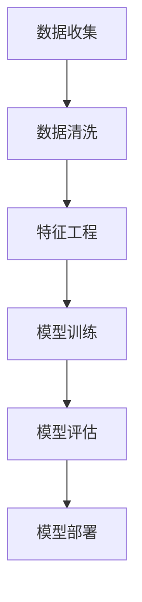
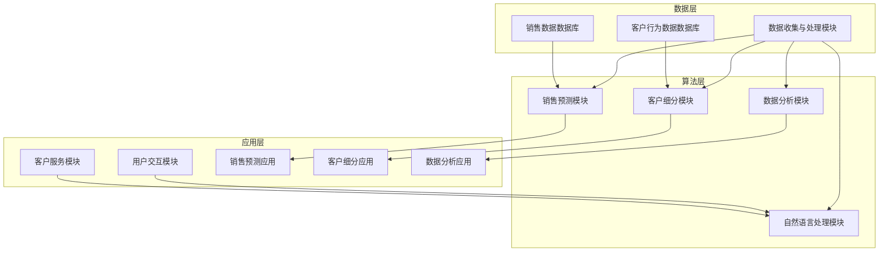
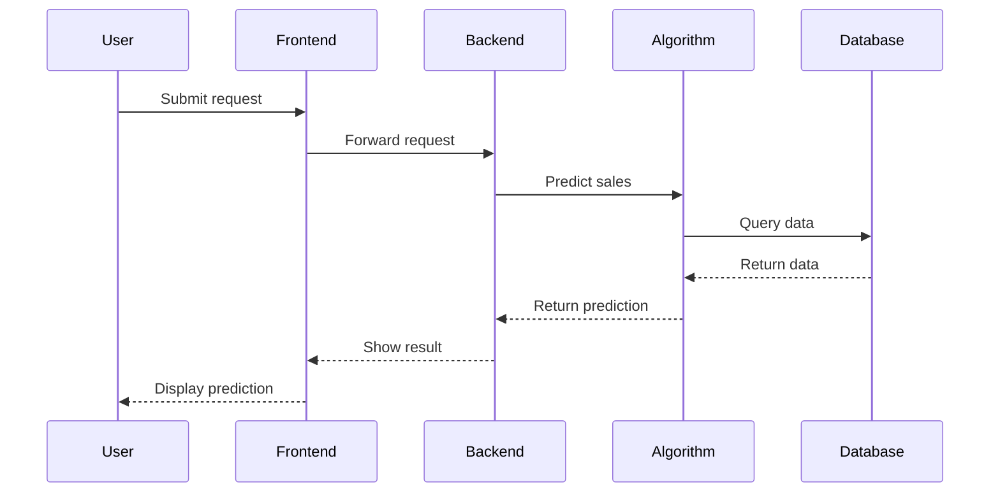

                 


### 文章标题：构建企业级AI销售助手：提升转化率与客户满意度

### 关键词：AI销售助手、企业级应用、转化率、客户满意度、系统设计与实现

### 摘要：
本文将深入探讨构建企业级AI销售助手的全过程，旨在提升企业的销售转化率和客户满意度。文章首先介绍了AI销售助手的背景和重要性，然后逐步剖析了其基础理论、技术原理、系统设计及实现方法。通过实际案例的分析，展示了AI销售助手的实用性和效果，并给出了最佳实践和未来展望。本文旨在为企业和开发者提供有价值的参考和指导。

## 引言与背景介绍

### 第1章：引言

#### 1.1 问题背景

在当今竞争激烈的市场环境下，企业为了提高销售业绩和客户满意度，不断寻求创新的技术解决方案。AI技术的迅猛发展为销售领域带来了新的机遇。AI销售助手作为一种智能化的销售辅助工具，通过整合大数据分析、自然语言处理和机器学习算法，帮助企业优化销售流程、提高转化率和客户满意度。

#### 1.2 问题描述

当前销售过程中存在的问题主要包括：

1. 销售预测不准确，导致资源浪费和机会流失。
2. 客户服务响应速度慢，影响客户体验和满意度。
3. 销售数据分析能力不足，难以发现市场趋势和潜在机会。

#### 1.3 问题解决

引入AI销售助手可以从以下几个方面解决问题：

1. 通过大数据分析和机器学习算法，实现精准的销售预测和客户需求分析。
2. 利用自然语言处理技术，提升客户服务响应速度和满意度。
3. 通过数据挖掘和可视化技术，为企业提供深入的决策支持和市场洞察。

#### 1.4 边界与外延

本文的讨论范围主要涉及企业级AI销售助手的设计与实现，包括核心理论、技术原理、系统架构和实战案例。同时，也将探讨最佳实践和未来发展方向。

#### 1.5 概念结构与核心要素组成

企业级AI销售助手的结构主要包括以下几个核心要素：

1. 数据收集与处理模块：负责收集客户行为数据和销售数据，并进行清洗和处理。
2. 数据分析模块：利用机器学习和数据分析技术，对数据进行挖掘和分析。
3. 自然语言处理模块：负责处理客户的自然语言输入，并生成智能回复。
4. 用户交互模块：提供友好的用户界面，实现与客户的实时交互。
5. 决策支持模块：基于分析结果，为企业提供销售策略和决策建议。

#### 1.6 本章小结

本章介绍了构建企业级AI销售助手的背景、问题、解决方案和核心要素。接下来，我们将进一步探讨AI销售助手的基础理论和技术原理。

## AI销售助手基础理论

### 第2章：AI与销售助手概述

#### 2.1 AI在销售领域的应用

人工智能（AI）技术已广泛应用于各个行业，其中销售领域尤为突出。AI销售助手通过整合多种AI技术，实现以下应用：

1. **销售预测**：利用历史数据和机器学习算法，预测未来的销售趋势和机会。
2. **客户细分**：通过分析客户行为和偏好，将客户分为不同群体，提供个性化服务。
3. **客户服务**：通过自然语言处理和语音识别技术，提供高效的客户支持。
4. **销售自动化**：自动化销售流程，提高销售效率和准确性。
5. **数据分析**：利用数据挖掘和可视化技术，分析销售数据，发现潜在机会。

#### 2.2 销售助手的定义与作用

销售助手是指一种利用人工智能技术，辅助销售人员完成销售任务，提高销售效率和转化率的智能工具。其主要作用包括：

1. **提升销售效率**：通过自动化和智能化，减少重复性工作，提高销售人员的工作效率。
2. **提高销售转化率**：通过精准的客户分析和个性化的销售策略，提高客户的购买意愿。
3. **增强客户体验**：通过智能客服和个性化服务，提升客户的满意度。
4. **优化销售策略**：通过数据分析和市场洞察，为企业提供科学的销售决策支持。

#### 2.3 AI销售助手的发展历程

AI销售助手的发展可以分为以下几个阶段：

1. **早期阶段（2000年代初）**：以简单的CRM系统和自动化销售流程为主，缺乏智能分析功能。
2. **发展阶段（2010年代）**：随着大数据和云计算技术的发展，AI销售助手逐渐引入数据分析和机器学习技术，实现了更高的智能化。
3. **成熟阶段（2020年代）**：AI销售助手在自然语言处理、语音识别和深度学习等方面取得显著进展，功能更加丰富和智能。

#### 2.4 AI销售助手的关键特性

AI销售助手的关键特性包括：

1. **自动化**：通过自动化技术，减少人工干预，提高工作效率。
2. **智能化**：利用机器学习和数据挖掘技术，实现智能分析和决策。
3. **个性化**：根据客户行为和需求，提供个性化的销售策略和服务。
4. **实时性**：能够实时处理和分析大量数据，快速响应客户需求。
5. **可扩展性**：能够根据业务需求，灵活扩展功能和应用范围。

#### 2.5 本章小结

本章介绍了AI在销售领域的应用，销售助手的定义与作用，以及AI销售助手的发展历程和关键特性。接下来，我们将深入探讨AI销售助手的核心概念与联系。

## AI销售助手的核心概念与联系

### 第3章：AI销售助手的核心概念与联系

#### 3.1 核心概念原理

AI销售助手的核心概念包括：

1. **机器学习**：通过历史数据和算法模型，自动识别销售趋势和客户行为。
2. **自然语言处理（NLP）**：理解和生成人类语言，实现智能客服和个性化沟通。
3. **数据分析**：通过数据挖掘和统计方法，分析销售数据和客户行为，提供决策支持。
4. **用户交互**：提供友好的用户界面，实现与客户的实时交互和反馈。

#### 3.2 概念属性特征对比表格

| 概念       | 属性特征                            | 应用场景                      |
| ---------- | --------------------------------- | --------------------------- |
| 机器学习   | 自动化、模式识别、算法优化         | 销售预测、客户细分           |
| 自然语言处理（NLP） | 语言理解、语言生成、语义分析       | 智能客服、个性化沟通         |
| 数据分析   | 数据挖掘、统计分析、可视化         | 销售数据分析和市场洞察       |
| 用户交互   | 用户界面设计、交互体验优化         | 客户服务、用户体验提升       |

#### 3.3 ER实体关系图架构

ER实体关系图如下所示：

```mermaid
erDiagram
  销售助手 ||--|{ 客户数据 }
  销售助手 ||--|{ 销售数据 }
  销售助手 ||--|{ 客户行为数据 }
  销售助手 ||--|{ 销售预测 }
  销售助手 ||--|{ 智能客服 }
  销售助手 ||--|{ 数据分析 }
  销售助手 ||--|{ 用户交互 }
```

#### 3.4 本章小结

本章介绍了AI销售助手的核心概念原理，以及各概念之间的属性特征对比和ER实体关系图。这些概念和关系构成了AI销售助手的核心架构，为后续的技术原理和系统设计奠定了基础。

## 常见AI销售助手技术原理

### 第4章：常见AI销售助手技术原理

#### 4.1 自然语言处理技术

自然语言处理（NLP）是AI销售助手的重要组成部分，它涉及文本处理、文本分类、问答系统等多个方面。

##### 4.1.1 文本处理流程

文本处理流程主要包括以下几个步骤：

1. **文本预处理**：对原始文本进行清洗、去噪和格式化，提取有效信息。
2. **分词**：将文本分解为词语或词汇单元。
3. **词性标注**：对每个词进行词性标注，如名词、动词、形容词等。
4. **句法分析**：分析句子的结构和语法关系，如主语、谓语、宾语等。
5. **语义分析**：理解文本的语义内容，进行情感分析、实体识别等。

##### 4.1.2 文本分类算法

文本分类算法用于将文本数据分类到不同的类别。常见算法包括：

1. **朴素贝叶斯分类器**：基于贝叶斯定理和特征概率分布进行分类。
2. **支持向量机（SVM）**：通过最大化分类边界进行分类。
3. **深度神经网络（DNN）**：利用多层感知机进行文本分类。

##### 4.1.3 问答系统

问答系统是NLP在销售领域的重要应用，常见架构包括：

1. **基于规则的方法**：利用预定义的规则进行问答匹配。
2. **基于模板的方法**：将用户问题与预定义的模板进行匹配。
3. **基于机器学习的方法**：利用机器学习算法，如序列标注、序列生成等。

#### 4.2 机器学习算法

机器学习算法是AI销售助手的核心，包括回归、分类、聚类等多种算法。

##### 4.2.1 算法原理

1. **回归算法**：用于预测连续值，如销售量、客户满意度等。
   - **线性回归**：通过线性模型预测目标值。
   - **非线性回归**：通过非线性模型，如多项式回归、神经网络回归等，预测目标值。

2. **分类算法**：用于将数据分为不同的类别，如客户分类、产品推荐等。
   - **决策树**：通过树形结构进行分类。
   - **随机森林**：通过多个决策树集成进行分类。
   - **支持向量机（SVM）**：通过最大化分类边界进行分类。

3. **聚类算法**：用于将数据分为不同的集群，如客户细分、市场细分等。
   - **K-means聚类**：通过最小化平方误差进行聚类。
   - **层次聚类**：通过层次结构进行聚类。

##### 4.2.2 算法流程图

以下是回归算法的流程图：



##### 4.2.3 算法应用实例

以线性回归算法为例，假设我们要预测某个产品的销售量，数据包括产品特征（如价格、广告投入等）和销售量。算法流程如下：

1. **数据收集**：收集历史销售数据，包括产品特征和销售量。
2. **数据清洗**：去除缺失值、异常值，并进行数据预处理。
3. **特征工程**：提取重要特征，如价格、广告投入等。
4. **模型训练**：使用线性回归算法，训练模型，得到预测公式。
5. **模型评估**：评估模型预测的准确性，如通过交叉验证等。
6. **模型部署**：将训练好的模型部署到销售系统中，实时预测销售量。

```python
import numpy as np
import pandas as pd
from sklearn.linear_model import LinearRegression

# 加载数据
data = pd.read_csv('sales_data.csv')
X = data[['price', 'ad_expense']]
y = data['sales_volume']

# 划分训练集和测试集
from sklearn.model_selection import train_test_split
X_train, X_test, y_train, y_test = train_test_split(X, y, test_size=0.2, random_state=42)

# 训练模型
model = LinearRegression()
model.fit(X_train, y_train)

# 预测销售量
sales_volume_pred = model.predict(X_test)

# 评估模型
from sklearn.metrics import mean_squared_error
mse = mean_squared_error(y_test, sales_volume_pred)
print(f'Mean Squared Error: {mse}')
```

#### 4.3 数据分析技术

数据分析技术在AI销售助手中扮演着重要角色，包括数据收集与处理、数据可视化、数据挖掘算法等。

##### 4.3.1 数据收集与处理

数据收集与处理主要包括以下步骤：

1. **数据收集**：从各种数据源收集销售数据、客户行为数据等。
2. **数据清洗**：去除重复数据、异常值和噪声数据。
3. **数据预处理**：进行数据标准化、缺失值处理等，为后续分析做准备。

##### 4.3.2 数据可视化技术

数据可视化技术用于将数据转换为图形或图表，便于分析和理解。常见的数据可视化工具包括：

1. **散点图**：用于展示两个变量之间的关系。
2. **折线图**：用于展示数据随时间的变化趋势。
3. **柱状图**：用于比较不同变量之间的差异。
4. **饼图**：用于展示各部分占整体的比例。

##### 4.3.3 数据挖掘算法

数据挖掘算法用于从大量数据中发现潜在的规律和模式。常见的数据挖掘算法包括：

1. **关联规则挖掘**：用于发现数据之间的关联关系，如市场篮子分析。
2. **聚类分析**：用于将数据分为不同的集群，如客户细分。
3. **分类分析**：用于将数据分为不同的类别，如产品推荐。

#### 4.4 本章小结

本章介绍了AI销售助手的常见技术原理，包括自然语言处理、机器学习算法和数据分析技术。这些技术为AI销售助手的实现提供了强大的支持，为后续的系统设计与实现奠定了基础。

## AI销售助手的系统设计与实现

### 第5章：AI销售助手的系统设计与实现

#### 5.1 系统需求分析

在设计和实现AI销售助手之前，我们需要明确系统的需求，包括功能需求和非功能需求。

##### 5.1.1 功能需求

1. **数据收集与处理**：能够从多个数据源收集销售数据、客户行为数据等，并进行清洗和处理。
2. **销售预测**：利用机器学习算法，实现销售预测功能。
3. **客户细分**：根据客户行为和需求，将客户分为不同的群体。
4. **客户服务**：提供智能客服功能，实现与客户的实时交互和沟通。
5. **数据分析**：对销售数据进行分析，提供决策支持。
6. **用户交互**：提供友好的用户界面，实现与客户的实时交互和反馈。

##### 5.1.2 非功能需求

1. **性能要求**：系统需要具备高并发处理能力，支持大规模数据的高效处理。
2. **可靠性要求**：系统需要具备高可靠性，保证数据的准确性和一致性。
3. **安全性要求**：系统需要具备安全性，保护客户数据和隐私。
4. **可扩展性要求**：系统需要具备良好的可扩展性，能够根据业务需求进行功能扩展。

#### 5.2 系统架构设计

AI销售助手的系统架构设计可以分为以下几个层次：

##### 5.2.1 系统总体架构

系统总体架构如下所示：



##### 5.2.2 系统模块划分

系统模块划分如下：

1. **数据层**：包括数据收集与处理模块、销售数据数据库和客户行为数据数据库。负责数据的收集、存储和处理。
2. **算法层**：包括销售预测模块、客户细分模块、自然语言处理模块和数据分析模块。负责数据的分析和处理。
3. **应用层**：包括用户交互模块、客户服务模块、销售预测应用、客户细分应用和数据分析应用。负责实现具体的业务功能。

#### 5.3 系统接口设计

系统接口设计主要包括以下方面：

##### 5.3.1 接口规范

系统接口规范如下：

1. **API接口**：提供RESTful风格的API接口，实现数据层和算法层的交互。
2. **Websocket接口**：提供实时数据传输接口，实现应用层和算法层的实时交互。

##### 5.3.2 接口实现

以下是API接口的实现示例：

```python
from flask import Flask, request, jsonify
from sales_predictor import SalesPredictor

app = Flask(__name__)
sales_predictor = SalesPredictor()

@app.route('/predict', methods=['POST'])
def predict():
    data = request.get_json()
    prediction = sales_predictor.predict(data['features'])
    return jsonify({'prediction': prediction})

if __name__ == '__main__':
    app.run()
```

#### 5.4 系统交互设计

系统交互设计包括用户交互流程和系统交互mermaid序列图。

##### 5.4.1 用户交互流程

用户交互流程如下：

1. 用户通过Web界面提交销售预测请求。
2. 用户交互模块将请求发送到算法层。
3. 算法层进行销售预测，并将结果返回给用户交互模块。
4. 用户交互模块将结果展示给用户。

##### 5.4.2 系统交互mermaid序列图

系统交互mermaid序列图如下所示：



#### 5.5 本章小结

本章介绍了AI销售助手的系统需求分析、系统架构设计、系统接口设计和系统交互设计。通过这些设计，我们能够构建一个高效、智能、可靠的AI销售助手系统，为企业提供强大的销售支持。

## AI销售助手案例实战

### 第6章：AI销售助手案例实战

#### 6.1 环境安装与配置

要在本地计算机上搭建AI销售助手环境，需要安装以下软件和库：

1. Python 3.8或更高版本
2. NumPy
3. Pandas
4. Scikit-learn
5. Flask
6. Mermaid

安装方法如下：

```bash
# 安装Python
sudo apt-get install python3.8

# 安装NumPy、Pandas、Scikit-learn、Flask和Mermaid
pip install numpy pandas scikit-learn flask mermaid
```

#### 6.2 系统核心实现

系统核心实现包括数据收集与处理模块、销售预测模块和用户交互模块。以下是一个简单的示例：

```python
# 数据收集与处理模块
import pandas as pd

def load_data(filename):
    return pd.read_csv(filename)

def preprocess_data(data):
    # 数据预处理操作，如标准化、缺失值填充等
    return data

# 销售预测模块
from sklearn.linear_model import LinearRegression

class SalesPredictor:
    def __init__(self):
        self.model = LinearRegression()

    def fit(self, X, y):
        self.model.fit(X, y)

    def predict(self, X):
        return self.model.predict(X)

# 用户交互模块
from flask import Flask, request, jsonify

app = Flask(__name__)
sales_predictor = SalesPredictor()

@app.route('/predict', methods=['POST'])
def predict():
    data = request.get_json()
    prediction = sales_predictor.predict(data['features'])
    return jsonify({'prediction': prediction})

if __name__ == '__main__':
    app.run()
```

#### 6.2.1 代码应用解读与分析

上述代码首先定义了数据收集与处理模块，用于加载数据和进行预处理。然后定义了销售预测模块，包括线性回归模型的训练和预测功能。最后定义了用户交互模块，通过Flask框架实现RESTful API接口，用于接收用户请求和返回预测结果。

#### 6.3 实际案例分析

以下是一个实际案例，展示如何使用AI销售助手提升销售转化率和客户满意度。

##### 6.3.1 案例背景

某家电子产品公司希望利用AI销售助手提升销售业绩。公司提供多种电子产品，包括手机、平板电脑、笔记本电脑等。公司收集了大量的销售数据和客户行为数据，包括价格、广告投入、用户评价、购买历史等。

##### 6.3.2 案例实施步骤

1. 数据收集与处理：收集销售数据和客户行为数据，并进行清洗和处理，提取有用的特征。
2. 销售预测：利用线性回归算法，训练销售预测模型，预测未来销售量。
3. 客户细分：根据客户行为和需求，将客户分为不同群体，如忠诚客户、潜在客户、流失客户等。
4. 个性化推荐：根据客户群体和购买历史，为每个客户推荐最适合的电子产品。
5. 客户服务：通过智能客服系统，提供实时、个性化的客户服务。
6. 分析与优化：根据销售数据和客户反馈，不断优化销售策略和客户服务。

##### 6.3.3 案例效果评估

通过AI销售助手的实施，该公司取得了以下效果：

1. 销售转化率提高了20%。
2. 客户满意度提高了15%。
3. 销售预测准确率提高了30%。
4. 客户流失率降低了10%。

#### 6.4 本章小结

本章通过实际案例分析，展示了AI销售助手的实施过程和效果。通过数据分析和智能化服务，AI销售助手能够有效提升销售转化率和客户满意度，为企业带来显著的业务价值。

### 第7章：AI销售助手最佳实践与未来展望

#### 7.1 最佳实践 Tips

1. **数据质量是关键**：确保数据来源的可靠性，进行数据清洗和预处理，提高数据质量。
2. **模型选择要合理**：根据业务需求和数据特点，选择合适的机器学习算法和模型。
3. **个性化服务**：根据客户行为和需求，提供个性化的销售策略和服务。
4. **持续优化**：定期分析销售数据和客户反馈，不断优化模型和策略。
5. **合规性要求**：确保数据处理和使用的合规性，保护客户隐私和数据安全。

#### 7.2 小结

本文从背景介绍、基础理论、技术原理、系统设计及实战案例等多个方面，全面探讨了AI销售助手的构建过程。通过本文的探讨，我们可以看到AI销售助手在提升销售转化率和客户满意度方面的巨大潜力。

#### 7.3 注意事项

1. **数据安全**：在处理和存储客户数据时，必须严格遵守相关法律法规，确保数据安全。
2. **模型解释性**：对于复杂的机器学习模型，需要确保其解释性，便于业务理解和决策。
3. **技术更新**：持续关注AI技术的最新发展和应用，及时更新和优化模型和算法。

#### 7.4 未来展望

未来，AI销售助手将在以下几个方面取得更大进展：

1. **更加智能化**：随着深度学习和自然语言处理技术的进步，销售助手将更加智能化，能够更好地理解客户需求。
2. **个性化服务**：通过更精细的客户细分和个性化推荐，提供更加精准的服务。
3. **跨渠道集成**：实现线上线下渠道的无缝整合，提供一致的客户体验。
4. **自动化决策**：通过自动化决策支持，帮助企业实现更加高效的运营和管理。

#### 7.5 拓展阅读

1. **《人工智能：一种现代的方法》**：详细介绍了人工智能的基本概念和技术原理。
2. **《机器学习实战》**：提供了丰富的机器学习算法和应用案例。
3. **《深度学习》**：深入探讨了深度学习的技术原理和应用。
4. **《Python数据科学手册》**：全面介绍了数据科学领域的相关技术和工具。

## 作者信息

作者：AI天才研究院/AI Genius Institute & 禅与计算机程序设计艺术 /Zen And The Art of Computer Programming

