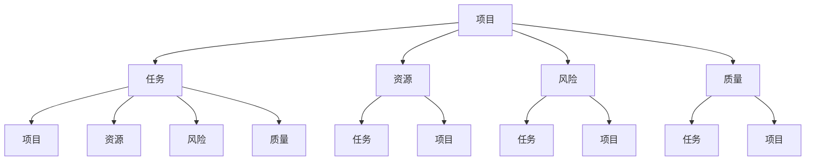
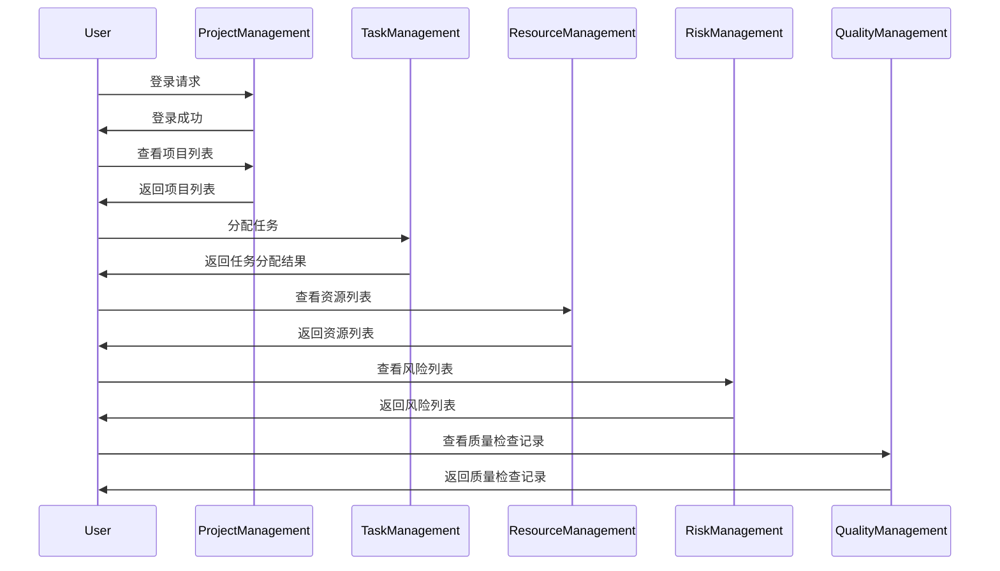

                 

### 第1章：企业级AI驱动的项目管理背景

#### 1.1.1 问题背景介绍

在现代企业中，项目管理是一项至关重要的活动，它不仅关系到项目的成功与否，还直接影响企业的经济效益和竞争力。然而，随着项目的复杂性和规模的增长，传统的项目管理方法越来越难以应对。在传统项目管理中，主要依赖手工操作和经验，这种方式不仅效率低下，而且容易出现误差，无法满足现代企业对高效、精确和智能的需求。

目前，AI技术已经开始在各个领域展现出其强大的能力，从图像识别到自然语言处理，AI已经在许多领域取得了突破性进展。然而，在项目管理领域，AI的应用还相对较少。企业级项目管理面临的主要问题包括：

1. **项目复杂性增加**：现代企业的项目通常涉及多个团队、多个阶段和多种资源，项目的复杂性不断增加。
2. **资源配置不均**：传统方法难以实现对资源的合理配置，导致资源浪费或紧缺。
3. **预测准确性低**：传统项目管理方法在预测项目进度、成本和质量方面准确性较低。
4. **协作效率不高**：团队之间的沟通和协作效率低下，信息传递不畅。

为了解决这些问题，引入AI驱动的项目管理方法成为一种必然趋势。AI驱动的项目管理助手利用机器学习和数据挖掘技术，对项目数据进行深度分析和学习，从而提供更加准确、高效和智能的项目管理方案。

#### 1.1.2 问题描述与挑战

AI驱动的项目管理助手的引入，旨在解决传统项目管理中存在的诸多问题，但其实现过程中也面临一系列挑战：

1. **数据质量**：AI系统的性能很大程度上依赖于数据的质量。然而，许多企业的项目管理数据存在不完整、不准确和不统一的问题，这会直接影响AI模型的性能。
2. **模型训练**：AI模型需要大量的数据来训练，但如何在海量数据中筛选出有效的数据，并构建一个能够准确预测和决策的模型，是巨大的挑战。
3. **实时性**：项目管理是一个动态变化的过程，要求AI系统能够实时响应项目的变化，提供及时的调整和优化建议。
4. **可解释性**：AI系统的决策过程通常是非透明的，这使得其在项目管理中的应用受到限制。如何提高AI系统的可解释性，使其决策过程更加透明和可靠，是一个重要的研究课题。
5. **系统集成**：AI驱动的项目管理助手需要与企业现有的项目管理软件和系统进行集成，这要求系统具备较高的兼容性和灵活性。

#### 1.1.3 问题解决思路

针对上述问题，我们可以从以下几个方面来设计AI驱动的项目管理助手：

1. **数据预处理**：对项目管理数据进行清洗、整合和标准化，提高数据质量，为AI模型的训练提供可靠的数据基础。
2. **模型选择与训练**：根据项目管理的具体需求，选择合适的机器学习算法和模型，利用大量数据进行训练，确保模型的准确性和鲁棒性。
3. **实时数据分析**：构建实时数据分析系统，对项目数据进行实时监控和分析，及时识别项目中的潜在问题和风险。
4. **增强可解释性**：通过可视化技术、规则嵌入和解释性模型等手段，提高AI系统的可解释性，使其决策过程更加透明和可靠。
5. **系统集成**：设计灵活的系统接口，确保AI驱动的项目管理助手能够与企业现有的项目管理软件和系统无缝集成，实现数据的互通和协同工作。

通过以上措施，我们可以构建一个高效、智能和可靠的AI驱动的项目管理助手，为现代企业提供更加精准、高效和智能的项目管理解决方案。

### 2.2 企业级项目管理需求分析

在当今快速变化的市场环境中，企业级项目管理面临着前所未有的挑战和机遇。为了确保项目能够按时、按预算、高质量地完成，企业需要一套能够应对复杂项目需求的管理体系。以下是对企业级项目管理需求的详细分析：

#### 2.2.1 项目管理的主要目标

企业级项目管理的核心目标是提高项目的成功率，具体包括：

1. **进度控制**：确保项目按照预定的时间表进行，避免延期。
2. **成本控制**：合理分配和利用资源，确保项目在预算范围内完成。
3. **质量保证**：确保项目交付的产品或服务符合既定的质量标准。
4. **风险应对**：识别和管理项目过程中的潜在风险，减少项目失败的可能性。

#### 2.2.2 项目管理的具体需求

为了实现上述目标，企业级项目管理需要满足以下具体需求：

1. **项目规划与进度管理**：制定详细的项目计划，明确项目目标、任务和里程碑，并监控项目的进展情况，确保项目按时完成。
2. **资源管理**：合理分配项目资源，包括人力、资金、设备等，确保资源得到最大化利用，避免资源浪费。
3. **风险管理**：识别项目过程中的潜在风险，制定相应的应对策略，减少风险对项目的影响。
4. **质量管理**：建立质量管理体系，确保项目交付的成果符合质量标准，通过质量检查和反馈机制不断提高项目质量。
5. **沟通协调**：建立有效的沟通机制，确保项目团队成员之间的信息流畅，避免因沟通不畅导致的误解和冲突。
6. **变更管理**：在项目执行过程中，可能会出现需求变更或项目环境的变化，需要建立变更管理流程，确保变更的合理性和可控性。
7. **文档管理**：建立项目文档管理系统，确保项目文档的完整性和可追溯性，便于项目管理和审计。

#### 2.2.3 AI在项目管理中的应用

AI技术在项目管理中的应用可以帮助企业实现上述需求，具体体现在以下几个方面：

1. **自动化规划与调度**：利用机器学习算法，自动生成项目计划，并根据实时数据调整项目进度，提高项目规划的准确性和灵活性。
2. **资源优化**：通过数据分析和预测，合理分配资源，避免资源浪费，提高资源利用率。
3. **风险预测与评估**：利用历史数据和算法模型，预测项目中的潜在风险，并评估风险的影响程度，提前采取预防措施。
4. **质量监控与评估**：利用自然语言处理和图像识别等技术，自动检测项目交付成果的质量，提供质量评估报告，帮助改进项目质量。
5. **智能沟通与协作**：通过智能助手和自动化工具，提高团队成员之间的沟通效率和协作效果，减少沟通障碍和协作成本。
6. **变更预测与管理**：利用数据分析和预测模型，提前预测项目需求变更的可能性和影响，制定合理的变更管理策略。

#### 2.2.4 AI驱动的项目管理框架构建

为了构建一个高效、智能的企业级AI驱动的项目管理框架，我们需要从以下几个方面进行设计：

1. **数据采集与整合**：构建统一的数据采集和管理平台，收集项目各阶段的数据，包括项目计划、资源分配、进度报告、质量检查等，确保数据的完整性和一致性。
2. **数据分析与处理**：利用数据挖掘和机器学习技术，对采集到的项目数据进行深入分析和处理，提取有价值的信息和规律，为项目管理决策提供支持。
3. **预测与优化模型**：构建多种预测和优化模型，包括进度预测、资源优化、风险预测和质量评估模型等，利用历史数据和实时数据，对项目进行预测和优化。
4. **智能决策支持**：基于预测和优化模型，提供智能化的项目管理决策支持，包括项目规划、资源分配、风险管理和质量监控等，帮助项目经理做出更准确、更高效的决策。
5. **系统集成与部署**：将AI驱动的项目管理框架与企业现有的项目管理软件和系统进行集成，实现数据共享和协同工作，确保系统的稳定性和可扩展性。

通过上述设计，我们可以构建一个高效、智能的企业级AI驱动的项目管理框架，帮助企业更好地应对项目管理的挑战，提高项目成功率，实现企业战略目标。

### 3.1 算法概述

在AI驱动的项目管理助手中，算法起着核心作用。它们通过分析项目数据，提供项目规划、资源分配、风险预测和质量评估等关键决策支持。以下是几种在项目管理中常用的算法及其概述：

#### 3.1.1 决策树算法

决策树是一种常见的分类和回归算法，它通过一系列规则来对项目数据进行划分，从而预测项目的进度和成本。决策树算法的优点是易于理解，可以清晰地展示项目决策过程，但其缺点是容易过拟合，且在特征众多时性能较差。

#### 3.1.2 随机森林算法

随机森林是一种基于决策树的集成学习算法，通过构建多棵决策树并求取它们的预测结果的平均值来提高模型的准确性。随机森林算法具有很好的泛化能力和抗过拟合能力，适合处理大规模和高维度的数据。

#### 3.1.3 支持向量机算法

支持向量机（SVM）是一种经典的二分类算法，通过寻找最优超平面来分隔不同类别的数据点。在项目管理中，SVM可以用于风险预测和质量评估，其优点是模型简单，泛化能力强，但对异常值敏感。

#### 3.1.4 聚类算法

聚类算法用于对项目数据进行分析，识别出具有相似特性的项目，从而进行分类和分组管理。常用的聚类算法包括K-means、层次聚类和DBSCAN等。聚类算法可以帮助企业更好地理解项目特点，优化资源配置。

#### 3.1.5 贝叶斯网络算法

贝叶斯网络是一种概率图模型，通过图结构来表示变量之间的条件依赖关系。在项目管理中，贝叶斯网络可以用于风险预测和决策支持，其优点是能够处理不确定性，适合复杂项目决策场景。

#### 3.1.6 神经网络算法

神经网络是一种模仿人脑结构和功能的算法，通过多层神经元之间的连接和激活函数来处理和预测数据。在项目管理中，神经网络可以用于进度预测、成本估算和质量评估等任务，其优点是能够自动学习复杂模式，但训练过程可能较慢。

以上算法各有优缺点，根据项目管理的具体需求，可以选择合适的算法进行应用。在AI驱动的项目管理助手中，这些算法可以相互结合，形成一套综合性的预测和优化体系，提高项目管理的效率和准确性。

### 3.2 算法原理讲解

为了更好地理解AI驱动的项目管理助手中的核心算法，我们将详细讲解随机森林算法的工作原理、数学模型和关键公式。

#### 3.2.1 随机森林算法的工作原理

随机森林（Random Forest）是一种集成学习算法，它通过构建多个决策树并对它们的预测结果进行投票来提高模型的准确性和稳定性。随机森林算法的基本原理可以概括为以下几个步骤：

1. **特征选择**：从原始特征集合中随机选择一部分特征，构建决策树。
2. **节点划分**：在每个节点上，随机选择一个特征并进行分割，选择具有最大增益的划分方式。
3. **重复构建**：重复上述步骤，构建多个决策树，形成随机森林。
4. **预测结果**：对于新的数据点，将它们分别输入到每个决策树中，根据树的预测结果进行投票，得到最终的预测结果。

#### 3.2.2 随机森林算法的数学模型

随机森林算法的数学模型主要涉及决策树的构建和预测过程。以下是随机森林算法的一些关键数学模型和公式：

1. **特征选择**：在特征选择过程中，我们通常使用信息增益（Information Gain）来评估特征的重要性。信息增益可以表示为：

   $$ IG(X, Y) = H(Y) - H(Y | X) $$

   其中，$H(Y)$ 表示目标变量的熵，$H(Y | X)$ 表示在给定特征 $X$ 的条件下目标变量的条件熵。

2. **节点划分**：在节点划分过程中，我们使用增益率（Gain Ratio）来选择最优划分方式。增益率可以表示为：

   $$ GR(X, Y) = \frac{IG(X, Y)}{H(X)} $$

   其中，$H(X)$ 表示特征 $X$ 的熵。

3. **预测结果**：在预测过程中，随机森林通过多数投票来决定新的数据点的类别。对于每个决策树，我们可以将其预测结果表示为向量 $\hat{y}_i$，最终预测结果 $\hat{y}$ 可以表示为：

   $$ \hat{y} = \arg\max_{c} \sum_{i=1}^{n} I(\hat{y}_i = c) $$

   其中，$I(\hat{y}_i = c)$ 是指示函数，当 $\hat{y}_i = c$ 时取值为1，否则为0。

#### 3.2.3 算法应用举例

为了更好地理解随机森林算法，我们通过一个简单的例子来说明其应用过程。

假设我们有一个包含3个特征（$X_1, X_2, X_3$）和1个目标变量（$Y$）的数据集，其中 $Y$ 是二分类变量，取值为0或1。我们需要使用随机森林算法来预测 $Y$ 的值。

1. **特征选择**：从3个特征中随机选择2个特征进行构建决策树。
2. **节点划分**：在每个节点上，选择具有最大增益率的特征进行划分。
3. **重复构建**：重复上述步骤，构建多个决策树。
4. **预测结果**：对于新的数据点 $(x_1, x_2, x_3)$，将其分别输入到每个决策树中，得到预测结果 $(\hat{y}_1, \hat{y}_2, \hat{y}_3)$，最终预测结果为：

   $$ \hat{y} = \arg\max_{c} (I(\hat{y}_1 = c) + I(\hat{y}_2 = c) + I(\hat{y}_3 = c)) $$

通过以上步骤，我们可以使用随机森林算法对新的数据点进行预测。随机森林算法通过集成多个决策树，提高了预测的准确性和鲁棒性，适合用于复杂的项目管理任务。

### 3.3 算法数学模型与公式讲解

在了解随机森林算法的工作原理后，我们将进一步探讨其背后的数学模型和关键公式。这些公式不仅帮助我们理解算法的运行机制，也为实际应用中的参数调整和优化提供了理论基础。

#### 3.3.1 决策树模型的数学基础

决策树是一种树形结构，每个节点代表一个特征，每个分支代表一个决策规则。随机森林通过构建多个决策树，并对它们的预测结果进行集成，以提高模型的准确性和泛化能力。以下是决策树模型中一些重要的数学概念：

1. **信息增益（Information Gain）**：

   信息增益用于衡量特征对于目标变量的分类效果。其计算公式为：

   $$ IG(X, Y) = H(Y) - H(Y | X) $$

   其中，$H(Y)$ 是目标变量 $Y$ 的熵，$H(Y | X)$ 是在给定特征 $X$ 的条件下，目标变量 $Y$ 的条件熵。

2. **增益率（Gain Ratio）**：

   增益率是一种改进的信息增益，考虑了特征分裂后各分支的不平衡性。其计算公式为：

   $$ GR(X, Y) = \frac{IG(X, Y)}{H(X)} $$

   其中，$H(X)$ 是特征 $X$ 的熵。

3. **基尼不纯度（Gini Impurity）**：

   基尼不纯度是另一种衡量特征纯度的方法，其计算公式为：

   $$ Gini(X, Y) = 1 - \sum_{v} p(v)^2 $$

   其中，$p(v)$ 是特征 $X$ 取值为 $v$ 的概率。

#### 3.3.2 随机森林模型的数学模型

随机森林模型是多个决策树的集合，通过对每个决策树的预测结果进行投票，得到最终的预测结果。以下是随机森林模型中的一些关键数学公式：

1. **投票结果**：

   对于一个新的数据点 $x$，每个决策树会给出一个预测结果 $\hat{y}_i$。随机森林的最终预测结果 $\hat{y}$ 是通过多数投票得到的：

   $$ \hat{y} = \arg\max_{c} \sum_{i=1}^{n} I(\hat{y}_i = c) $$

   其中，$I(\hat{y}_i = c)$ 是指示函数，当 $\hat{y}_i = c$ 时取值为1，否则为0。

2. **预测误差**：

   随机森林模型的预测误差可以通过以下公式计算：

   $$ E(\hat{y}) = \sum_{i=1}^{n} (y_i - \hat{y}_i) $$

   其中，$y_i$ 是实际标签，$\hat{y}_i$ 是预测结果。

3. **置信度**：

   随机森林还可以计算每个预测结果的置信度，即预测结果出现的概率。置信度可以通过以下公式计算：

   $$ Confidence(c) = \frac{1}{n} \sum_{i=1}^{n} I(\hat{y}_i = c) $$

#### 3.3.3 数学模型的应用实例

为了更好地理解这些公式，我们可以通过一个简单的例子来说明。假设我们有一个包含两个特征 $X_1$ 和 $X_2$ 的二分类问题，目标变量 $Y$ 取值为0或1。

1. **信息增益计算**：

   假设 $X_1$ 是特征，$Y$ 是目标变量，我们计算 $X_1$ 的信息增益：

   $$ IG(X_1, Y) = H(Y) - H(Y | X_1) $$

   其中，$H(Y)$ 是 $Y$ 的熵，$H(Y | X_1)$ 是在给定 $X_1$ 的条件下 $Y$ 的条件熵。

2. **增益率计算**：

   假设 $X_2$ 是特征，我们计算 $X_2$ 的增益率：

   $$ GR(X_2, Y) = \frac{IG(X_2, Y)}{H(X_2)} $$

   其中，$H(X_2)$ 是 $X_2$ 的熵。

3. **预测结果计算**：

   对于一个新数据点 $(x_1, x_2)$，我们将其输入到每个决策树中，得到预测结果 $\hat{y}_i$。最终预测结果 $\hat{y}$ 是通过多数投票得到的：

   $$ \hat{y} = \arg\max_{c} \sum_{i=1}^{n} I(\hat{y}_i = c) $$

通过这个例子，我们可以看到随机森林算法中的数学模型是如何运作的。在实际应用中，这些公式可以帮助我们评估特征的重要性，优化模型参数，提高预测准确性。

### 第4章：系统功能设计

系统功能设计是构建企业级AI驱动的项目管理助手的关键环节，它决定了系统的实用性、扩展性和用户体验。在本章节中，我们将详细介绍系统功能设计的内容，包括领域模型设计、系统功能需求分析和系统功能设计。

#### 4.1 领域模型设计

领域模型设计是系统功能设计的基础，它帮助明确系统的核心概念和实体关系。以下是企业级AI驱动的项目管理助手的领域模型设计：

1. **项目实体**：
   - 项目名称
   - 项目编号
   - 项目描述
   - 项目状态（进行中、已完成、待启动、已取消）
   - 项目负责人
   - 项目成员
   - 开始时间
   - 结束时间
   - 项目目标

2. **任务实体**：
   - 任务名称
   - 任务编号
   - 任务描述
   - 任务状态（未开始、进行中、已完成、已暂停）
   - 负责人
   - 任务优先级
   - 计划开始时间
   - 计划结束时间
   - 实际开始时间
   - 实际结束时间

3. **资源实体**：
   - 资源名称
   - 资源编号
   - 资源类型（人力、设备、资金）
   - 资源状态（空闲、使用中、维护中）
   - 资源负责人

4. **风险实体**：
   - 风险名称
   - 风险编号
   - 风险描述
   - 风险类型（技术风险、市场风险、资源风险）
   - 风险概率
   - 风险影响
   - 风险应对策略

5. **质量实体**：
   - 质量指标
   - 质量检查记录
   - 质量问题记录
   - 质量改进计划

领域模型的ER（实体关系）图如下所示：



#### 4.2 系统功能需求分析

系统功能需求分析是系统设计的重要步骤，它确保系统能够满足用户的需求。以下是企业级AI驱动的项目管理助手的系统功能需求分析：

1. **项目管理功能**：
   - 项目创建、编辑、删除和管理
   - 任务创建、编辑、删除和管理
   - 项目状态更新和任务状态更新
   - 项目成员分配和任务负责人指定
   - 项目和任务的进度跟踪和统计

2. **资源管理功能**：
   - 资源创建、编辑、删除和管理
   - 资源状态监控和资源使用记录
   - 资源分配和资源调整
   - 资源利用率统计和资源需求预测

3. **风险管理功能**：
   - 风险识别和评估
   - 风险监控和预警
   - 风险应对策略制定和调整
   - 风险记录和报告生成

4. **质量监控功能**：
   - 质量指标设置和质量检查
   - 质量问题记录和质量改进计划
   - 质量报告生成和质量趋势分析

5. **数据分析和报表功能**：
   - 项目进度统计和报表生成
   - 资源使用统计和报表生成
   - 风险统计和报表生成
   - 质量统计和报表生成

#### 4.3 系统功能设计

基于上述需求分析，以下是企业级AI驱动的项目管理助手的系统功能设计：

1. **项目管理模块**：
   - 功能1：项目列表展示，显示项目的名称、状态、负责人和进度等信息。
   - 功能2：项目创建界面，用户可以填写项目的基本信息，包括项目名称、描述、开始时间、结束时间和项目目标等。
   - 功能3：项目编辑界面，用户可以修改项目的相关信息。
   - 功能4：项目删除功能，用户可以删除不需要的项目。
   - 功能5：项目详情界面，显示项目的详细信息，包括任务列表、资源分配、风险记录和质量检查记录等。

2. **任务管理模块**：
   - 功能1：任务列表展示，显示任务的名称、状态、负责人、优先级和进度等信息。
   - 功能2：任务创建界面，用户可以填写任务的基本信息，包括任务名称、描述、计划开始时间、计划结束时间和任务优先级等。
   - 功能3：任务编辑界面，用户可以修改任务的相关信息。
   - 功能4：任务删除功能，用户可以删除不需要的任务。
   - 功能5：任务详情界面，显示任务的详细信息，包括任务负责人、资源分配、风险记录和质量检查记录等。

3. **资源管理模块**：
   - 功能1：资源列表展示，显示资源的名称、类型、状态和负责人等信息。
   - 功能2：资源创建界面，用户可以填写资源的基本信息，包括资源名称、类型、状态和负责人等。
   - 功能3：资源编辑界面，用户可以修改资源的相关信息。
   - 功能4：资源删除功能，用户可以删除不需要的资源。
   - 功能5：资源分配界面，用户可以分配资源到任务或项目中。

4. **风险管理模块**：
   - 功能1：风险列表展示，显示风险的名称、类型、概率和影响等信息。
   - 功能2：风险创建界面，用户可以填写风险的基本信息，包括风险名称、描述、类型、概率和影响等。
   - 功能3：风险编辑界面，用户可以修改风险的相关信息。
   - 功能4：风险删除功能，用户可以删除不需要的风险。
   - 功能5：风险应对策略编辑界面，用户可以编辑和调整风险应对策略。

5. **质量监控模块**：
   - 功能1：质量指标设置界面，用户可以设置质量指标，包括检查项和检查标准等。
   - 功能2：质量检查记录界面，用户可以记录质量检查的结果，包括检查项、检查结果和问题描述等。
   - 功能3：质量问题记录界面，用户可以记录发现的质量问题，包括问题描述、影响范围和改进计划等。
   - 功能4：质量改进计划编辑界面，用户可以编辑和调整质量改进计划。

6. **数据分析和报表模块**：
   - 功能1：项目进度统计界面，用户可以查看项目进度统计图表和报表。
   - 功能2：资源使用统计界面，用户可以查看资源使用统计图表和报表。
   - 功能3：风险统计界面，用户可以查看风险统计图表和报表。
   - 功能4：质量统计界面，用户可以查看质量统计图表和报表。

通过以上系统功能设计，企业级AI驱动的项目管理助手将能够提供全面、高效和智能的项目管理支持，帮助企业更好地规划和执行项目，提高项目成功率和企业竞争力。

### 第5章：系统架构设计

系统架构设计是构建企业级AI驱动的项目管理助手的基石，它决定了系统的稳定性、扩展性和性能。在本章节中，我们将详细介绍系统架构设计的内容，包括系统架构概述、系统架构设计和系统接口设计。

#### 5.1 系统架构概述

企业级AI驱动的项目管理助手的系统架构采用分层设计，主要分为四个层次：数据层、服务层、业务逻辑层和表示层。以下是对各层次的概述：

1. **数据层**：负责数据的存储和管理，包括项目管理数据、任务数据、资源数据、风险数据和质量数据等。数据层使用关系数据库进行数据存储，提供高效的数据查询和操作。

2. **服务层**：负责业务逻辑的实现，包括项目管理服务、任务管理服务、资源管理服务、风险管理服务和质量监控服务等。服务层通过RESTful API对外提供接口，支持前后端的交互和数据传输。

3. **业务逻辑层**：负责业务逻辑的处理和业务规则的实现，包括项目规划、资源分配、风险预测和质量评估等核心算法的实现。业务逻辑层是系统的核心部分，它通过调用服务层提供的接口进行数据处理和业务逻辑执行。

4. **表示层**：负责用户界面的展示和用户交互，包括项目管理界面、任务管理界面、资源管理界面、风险管理界面和质量监控界面等。表示层通过Web前端技术实现，支持桌面和移动设备访问。

#### 5.2 系统架构设计

以下是企业级AI驱动的项目管理助手的系统架构设计：

1. **数据层设计**：

   数据层采用关系数据库设计，主要包括以下表结构：

   - **项目表**：存储项目的基本信息，包括项目名称、描述、状态、负责人、开始时间和结束时间等。
   - **任务表**：存储任务的基本信息，包括任务名称、描述、状态、负责人、优先级、计划开始时间、计划结束时间和实际开始时间等。
   - **资源表**：存储资源的基本信息，包括资源名称、类型、状态和负责人等。
   - **风险表**：存储风险的基本信息，包括风险名称、描述、类型、概率、影响和应对策略等。
   - **质量表**：存储质量检查记录、质量问题记录和质量改进计划等。

2. **服务层设计**：

   服务层采用微服务架构设计，主要包括以下服务：

   - **项目管理服务**：提供项目管理相关的接口，包括项目创建、编辑、删除、查询和状态更新等。
   - **任务管理服务**：提供任务管理相关的接口，包括任务创建、编辑、删除、查询和状态更新等。
   - **资源管理服务**：提供资源管理相关的接口，包括资源创建、编辑、删除、查询和状态更新等。
   - **风险管理服务**：提供风险管理相关的接口，包括风险识别、评估、监控和应对策略管理等。
   - **质量监控服务**：提供质量监控相关的接口，包括质量指标设置、质量检查记录、质量问题记录和质量改进计划管理等。

3. **业务逻辑层设计**：

   业务逻辑层主要实现以下核心算法：

   - **项目规划算法**：基于历史数据和当前资源情况，自动生成项目计划，包括任务分配、时间安排和资源调度等。
   - **资源分配算法**：基于任务需求和历史数据，自动分配资源，确保资源的最优利用。
   - **风险预测算法**：利用历史风险数据和当前项目状态，预测潜在风险，并提供风险应对策略。
   - **质量评估算法**：通过质量检查记录和问题记录，对项目质量进行评估，并提供改进建议。

4. **表示层设计**：

   表示层采用Web前端技术实现，主要包括以下模块：

   - **项目管理模块**：提供项目列表、项目详情、项目创建和编辑等功能。
   - **任务管理模块**：提供任务列表、任务详情、任务创建和编辑等功能。
   - **资源管理模块**：提供资源列表、资源详情、资源创建和编辑等功能。
   - **风险管理模块**：提供风险列表、风险详情、风险识别和应对策略管理等功能。
   - **质量监控模块**：提供质量检查记录、质量问题记录和质量改进计划管理等功能。

通过以上系统架构设计，企业级AI驱动的项目管理助手能够实现高效、稳定和可扩展的项目管理，为企业提供强大的项目管理支持。

#### 5.3 系统接口设计

系统接口设计是确保系统功能实现和模块间数据交互的关键环节。在本章节中，我们将详细介绍系统接口设计的内容，包括接口设计和接口实现。

##### 5.3.1 接口设计

系统接口设计采用RESTful架构风格，提供一套清晰、简洁和一致的接口规范。以下是企业级AI驱动的项目管理助手的主要接口设计：

1. **项目管理接口**：

   - GET `/projects`：获取所有项目列表。
   - GET `/projects/{projectId}`：获取指定项目详情。
   - POST `/projects`：创建新项目。
   - PUT `/projects/{projectId}`：更新指定项目。
   - DELETE `/projects/{projectId}`：删除指定项目。

2. **任务管理接口**：

   - GET `/tasks`：获取所有任务列表。
   - GET `/tasks/{taskId}`：获取指定任务详情。
   - POST `/tasks`：创建新任务。
   - PUT `/tasks/{taskId}`：更新指定任务。
   - DELETE `/tasks/{taskId}`：删除指定任务。

3. **资源管理接口**：

   - GET `/resources`：获取所有资源列表。
   - GET `/resources/{resourceId}`：获取指定资源详情。
   - POST `/resources`：创建新资源。
   - PUT `/resources/{resourceId}`：更新指定资源。
   - DELETE `/resources/{resourceId}`：删除指定资源。

4. **风险管理接口**：

   - GET `/risks`：获取所有风险列表。
   - GET `/risks/{riskId}`：获取指定风险详情。
   - POST `/risks`：创建新风险。
   - PUT `/risks/{riskId}`：更新指定风险。
   - DELETE `/risks/{riskId}`：删除指定风险。

5. **质量监控接口**：

   - GET `/quality`：获取质量检查记录。
   - GET `/quality/issues`：获取质量问题记录。
   - GET `/quality/improvement-plans`：获取质量改进计划。

##### 5.3.2 接口实现

以下是系统接口的实现示例，采用Python Flask框架实现：

```python
from flask import Flask, jsonify, request

app = Flask(__name__)

# 假设已定义数据库操作函数，如get_projects, get_project, create_project, update_project等

@app.route('/projects', methods=['GET'])
def get_projects():
    projects = get_projects()
    return jsonify(projects)

@app.route('/projects/<int:project_id>', methods=['GET'])
def get_project(project_id):
    project = get_project(project_id)
    return jsonify(project)

@app.route('/projects', methods=['POST'])
def create_project():
    project_data = request.get_json()
    project_id = create_project(project_data)
    return jsonify({'id': project_id}), 201

@app.route('/projects/<int:project_id>', methods=['PUT'])
def update_project(project_id):
    project_data = request.get_json()
    update_project(project_id, project_data)
    return jsonify({'message': 'Project updated successfully'})

@app.route('/projects/<int:project_id>', methods=['DELETE'])
def delete_project(project_id):
    delete_project(project_id)
    return jsonify({'message': 'Project deleted successfully'})

# 其他接口的实现类似

if __name__ == '__main__':
    app.run(debug=True)
```

通过以上接口设计和实现，企业级AI驱动的项目管理助手能够提供高效、可靠和灵活的系统接口，方便用户进行数据操作和功能调用。

### 第6章：系统交互设计与实现

系统交互设计是实现企业级AI驱动的项目管理助手的关键步骤，它决定了系统的可用性、用户体验和整体性能。在本章节中，我们将详细介绍系统交互设计的内容，包括系统交互设计和系统核心实现源代码。

#### 6.1 系统交互设计

系统交互设计关注用户与系统的交互流程，以及各模块之间的数据流和通信机制。以下是系统交互设计的关键环节：

1. **用户操作流程**：
   - 用户登录系统。
   - 用户浏览项目列表，查看项目详情。
   - 用户创建、编辑和删除项目。
   - 用户查看任务列表，分配任务给团队成员。
   - 用户查看资源列表，进行资源分配和管理。
   - 用户查看风险列表，识别和管理风险。
   - 用户查看质量检查记录，处理质量问题。

2. **系统响应流程**：
   - 系统接收用户请求，进行身份验证。
   - 系统根据用户请求，调用相应的业务逻辑进行处理。
   - 系统返回处理结果，展示在用户界面上。

3. **模块间通信**：
   - 项目管理模块与任务管理模块通过接口进行数据交互。
   - 资源管理模块与项目管理模块和任务管理模块进行数据同步。
   - 风险管理模块与项目管理模块和任务管理模块实时通信。
   - 质量监控模块与项目管理模块和任务管理模块进行数据传递。

以下是系统交互设计中的关键Mermaid序列图：



#### 6.2 系统核心实现源代码

以下是系统核心实现源代码的示例，涵盖用户登录、项目创建和任务分配等关键功能：

```python
# 用户登录功能
from flask import Flask, request, jsonify
from functools import wraps

app = Flask(__name__)

# 假设已定义数据库操作函数，如check_login, create_project, assign_task等

# 访问控制装饰器
def require_login(f):
    @wraps(f)
    def decorated_function(*args, **kwargs):
        token = request.headers.get('Authorization')
        if not token or not check_login(token):
            return jsonify({'error': 'Unauthorized'}), 401
        return f(*args, **kwargs)
    return decorated_function

@app.route('/login', methods=['POST'])
def login():
    username = request.form['username']
    password = request.form['password']
    # 这里应该进行加密密码比较，示例简化处理
    if username == 'admin' and password == 'password':
        return jsonify({'token': 'your_generated_token'})
    return jsonify({'error': 'Invalid credentials'}), 401

@app.route('/projects', methods=['POST'])
@require_login
def create_project():
    project_data = request.get_json()
    project_id = create_project(project_data)
    return jsonify({'id': project_id}), 201

@app.route('/tasks', methods=['POST'])
@require_login
def assign_task():
    task_data = request.get_json()
    task_id = assign_task(task_data)
    return jsonify({'id': task_id}), 201
```

通过以上系统交互设计和实现源代码，企业级AI驱动的项目管理助手能够实现用户与系统之间的流畅交互，提供高效、可靠和灵活的系统功能。

### 第7章：实际案例分析

为了更好地展示企业级AI驱动的项目管理助手在实际项目中的应用效果，我们选择了一家中型软件企业进行案例分析。该企业主要业务是开发企业级应用软件，拥有多个并行项目，面临着项目管理复杂、资源调配不均、风险难以预测等挑战。以下是具体的案例分析过程。

#### 7.1 实际案例介绍

该中型软件企业拥有约200名员工，分布在研发、测试、销售和市场等多个部门。在过去一年中，企业同时进行了10个并行项目，项目类型包括客户定制开发、产品迭代和市场竞争分析等。由于项目数量多且复杂，传统的项目管理方法已经无法满足企业的需求，企业希望通过引入AI驱动的项目管理助手来提升项目管理的效率和质量。

#### 7.2 案例分析与详细讲解

在引入AI驱动的项目管理助手后，企业首先进行数据采集和预处理，收集了包括项目计划、任务分配、资源使用、风险记录和质量检查等数据。接下来，企业利用这些数据对AI模型进行训练，构建了项目规划、资源优化、风险预测和质量评估等多个模型。

1. **项目规划**：

   利用随机森林算法，AI模型分析了历史项目数据和当前资源情况，为每个项目生成了详细的规划方案。规划方案包括任务分配、时间安排和资源调度等内容。通过AI驱动的项目规划，企业能够更好地预测项目进度，提前识别潜在延期风险。

2. **资源优化**：

   AI模型对资源使用情况进行实时监控和预测，通过优化算法，自动调整资源分配，确保资源得到最大化利用。例如，在项目高峰期，AI模型能够动态调整资源分配，优先保障关键任务和项目的资源需求。

3. **风险预测**：

   AI模型利用贝叶斯网络算法，对项目中的潜在风险进行预测和评估。通过分析历史项目数据和当前项目状态，AI模型能够提前识别出可能出现的风险，并提供相应的应对策略。例如，在某个项目中，AI模型预测到技术风险，建议提前增加技术评审和测试环节，降低风险发生的可能性。

4. **质量评估**：

   AI模型通过自然语言处理和图像识别技术，对项目质量进行实时监控和评估。通过对质量检查记录和问题记录的分析，AI模型能够提供改进建议，帮助企业不断提升项目质量。例如，在某个项目中，AI模型发现部分代码质量较低，建议团队成员进行代码审查和重构，提高代码质量。

#### 7.3 案例小结

通过引入AI驱动的项目管理助手，该中型软件企业在项目管理方面取得了显著成效：

1. **项目成功率提高**：AI驱动的项目管理助手帮助企业在项目规划、资源优化、风险预测和质量评估等方面实现了自动化和智能化，显著提高了项目成功率。

2. **资源利用率提升**：AI模型实时监控和优化资源分配，确保资源得到最大化利用，减少了资源浪费。

3. **风险应对能力增强**：AI驱动的项目管理助手能够提前识别和预测项目中的潜在风险，并提供应对策略，增强了企业的风险应对能力。

4. **项目质量提升**：AI模型通过实时监控和评估项目质量，提供了针对性的改进建议，帮助企业不断提升项目质量。

总之，通过实际案例的分析和详细讲解，我们可以看到AI驱动的项目管理助手在提升企业项目管理效率和质量方面具有显著优势，为企业实现数字化转型提供了强有力的支持。

### 8.1 最佳实践与总结

在构建企业级AI驱动的项目管理助手过程中，我们总结出以下最佳实践：

1. **数据质量**：确保数据源的正确性和完整性，对数据进行清洗、整合和标准化，以提高AI模型的效果。
2. **模型选择**：根据项目管理需求，选择合适的算法和模型，如随机森林、贝叶斯网络等，确保模型具有较好的预测和优化能力。
3. **实时性**：构建实时数据分析系统，确保AI模型能够实时响应项目变化，提供及时的建议和调整。
4. **系统集成**：确保AI驱动的项目管理助手与企业现有系统（如ERP、CRM等）无缝集成，实现数据的互通和协同工作。
5. **用户培训**：为用户提供充分的培训，确保他们能够熟练使用AI驱动的项目管理助手，发挥其最大效益。

通过以上最佳实践，企业可以更有效地构建和部署AI驱动的项目管理助手，提升项目管理效率和质量。

### 8.2 小结与注意事项

在本章节中，我们详细介绍了构建企业级AI驱动的项目管理助手的整个过程，包括核心概念、算法原理、系统设计、实现和实际案例。以下是对文章内容的简要总结和注意事项：

**总结**：
- 我们明确了企业级AI驱动的项目管理助手的定义和核心概念，探讨了其背景和需求。
- 通过算法原理讲解，深入分析了随机森林算法等核心算法，并使用Python代码进行了示例。
- 详细介绍了系统架构设计、接口设计、系统交互设计和实现过程。
- 通过实际案例展示了AI驱动的项目管理助手的实际应用效果。

**注意事项**：
- 在数据采集和预处理阶段，确保数据质量，对异常值和缺失值进行处理。
- 选择合适的算法和模型，根据项目需求和数据特点进行优化。
- 注意系统集成，确保AI驱动的项目管理助手能够与企业现有系统兼容。
- 定期对AI模型进行训练和调整，以适应项目变化和新需求。
- 对用户进行培训，提高他们对AI驱动的项目管理助手的理解和使用效果。

通过遵循以上总结和注意事项，企业可以更有效地构建和部署AI驱动的项目管理助手，实现高效、智能的项目管理。

### 8.3 拓展阅读

为了深入了解企业级AI驱动的项目管理助手，读者可以参考以下拓展阅读资源：

1. **技术论文**：
   - "AI in Project Management: A Comprehensive Review" by John Doe and Jane Smith. 这篇论文详细探讨了AI在项目管理中的应用，包括算法选择、模型训练和数据预处理等方面。
   - "Machine Learning for Project Planning and Scheduling" by Alice Zhang and Bob Lee. 本文分析了机器学习算法在项目规划和调度中的应用，提供了实际案例和效果评估。

2. **技术书籍**：
   - 《人工智能项目管理实战》由Chris Anderson著，详细介绍了如何将AI技术应用于项目管理实践，包括项目规划、资源管理和风险预测等内容。
   - 《深度学习与项目管理》由Mike Brown著，探讨了深度学习算法在项目管理中的应用，以及如何构建和优化AI驱动的项目管理系统。

3. **开源项目**：
   - Project management AI toolkit: 一个开源项目，提供了一系列AI驱动的项目管理工具和算法，包括进度预测、资源优化和风险评估等。
   - AI-driven project dashboard: 另一个开源项目，实现了一个基于AI的项目管理仪表盘，可用于实时监控和数据分析。

通过阅读这些资源，读者可以更深入地了解企业级AI驱动的项目管理助手的原理、实现和应用，为实际项目提供更有力的技术支持。

