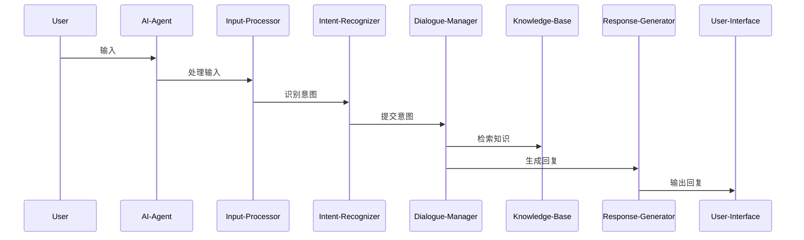
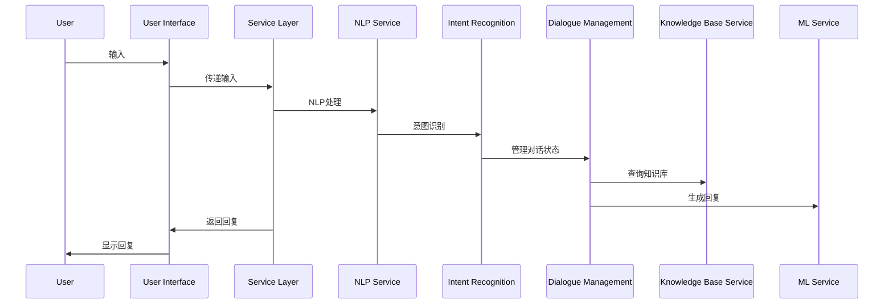
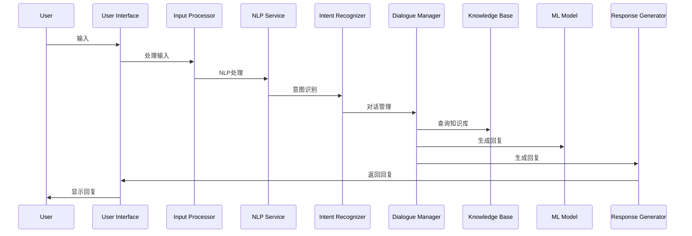

                 

### 引言与背景

#### 1. 引言

在当今数字化时代，企业内部沟通的效率直接影响着组织的运作和发展。传统的沟通方式，如邮件、即时通讯工具和会议，虽然能够实现信息传递，但在处理大量、复杂信息时，往往显得力不从心。这不仅浪费了大量的时间和人力资源，还可能导致信息传递的延误和误传。因此，如何提升企业内部沟通效率成为了一个亟待解决的问题。

对话式AI Agent，作为一种新型的智能通信工具，正在逐渐改变这一现状。它通过自然语言处理（NLP）和机器学习（ML）技术，能够理解和生成自然语言，实现与用户的实时对话交互。这种技术不仅能够自动处理日常的沟通任务，还能够根据用户的需求提供个性化的信息和服务，大大提升了沟通的效率和质量。

本文将围绕构建企业级对话式AI Agent展开讨论，首先介绍对话式AI Agent的基础知识，包括其概念、技术架构和发展历程等；接着深入探讨企业级对话式AI Agent的设计与实现，分析其需求分析、系统架构设计、关键技术和实现流程等；然后阐述对话式AI Agent在内部沟通中的应用，探讨其在不同场景中的优势、挑战与解决方案；最后，讨论对话式AI Agent的维护与优化策略，以及其在企业战略中的应用，并预测其未来的发展趋势。通过这一系列的分析与探讨，我们希望能够为企业和开发者提供有价值的参考和指导。

#### 1.1 问题背景

在当今的快速变化和竞争激烈的商业环境中，企业面临着诸多挑战，其中之一便是内部沟通的效率问题。传统的沟通方式，如面对面的交流、电话沟通、电子邮件和即时通讯工具等，虽然在一定程度上能够满足企业的信息传递需求，但往往存在一些显著的问题。

首先，这些传统的沟通方式在处理大量、复杂的信息时效率低下。在大型企业中，员工数量众多，部门繁多，信息传递的路径复杂。例如，一个跨部门的项目需要多个团队成员的协同工作，信息在各个部门之间传递的过程中容易发生误解、遗漏和延误，导致项目进度受阻。此外，电子邮件和即时通讯工具通常依赖于文本信息的传递，缺乏有效的多媒体支持，使得沟通内容显得单一和不够生动。

其次，传统的沟通方式容易造成信息孤岛。在企业内部，不同部门往往各自为政，信息传递的壁垒较高。例如，市场营销部门与客户服务部门之间的信息不畅，可能导致市场营销活动的效果无法及时反馈给客户服务部门，从而影响客户体验。同样，研发部门与生产部门之间的信息不共享，可能导致产品开发与生产计划的脱节，影响整体效率。

另外，传统的沟通方式还存在沟通成本高、效率低的问题。面对面的交流虽然能够直接传递信息，但需要大量的时间和资源。电话沟通和电子邮件则存在沟通不及时、信息难以追溯等问题。尤其是在跨国企业中，时差和语言障碍进一步加剧了沟通的困难。

面对这些挑战，企业亟需一种能够提升内部沟通效率、降低沟通成本、提高信息传递准确性的解决方案。这就是对话式AI Agent应运而生的背景。对话式AI Agent通过自然语言处理和机器学习技术，能够实现与用户的智能对话交互，自动处理日常的沟通任务，提供个性化的信息和服务。它不仅能够打破信息孤岛，实现跨部门的信息共享，还能够通过智能化的信息处理和分类，提高沟通的效率和质量。

总之，企业内部沟通效率的提升是企业数字化转型的重要一环。对话式AI Agent作为一种新兴的智能通信工具，具有巨大的潜力和应用价值。通过构建企业级对话式AI Agent，企业可以有效地解决传统沟通方式存在的问题，实现高效、智能的内部沟通，为企业的持续发展提供有力支持。

#### 1.2 问题描述

尽管对话式AI Agent在提升企业内部沟通效率方面具有巨大潜力，但在实际应用中仍然面临诸多挑战。首先，技术实现上的困难是一个重要问题。对话式AI Agent需要依赖自然语言处理（NLP）和机器学习（ML）技术，这些技术在数据处理、算法优化和模型训练等方面存在复杂性和不确定性。例如，NLP技术需要处理多种语言和方言的复杂性，而ML技术则需要大量的高质量训练数据来保证模型的准确性。这些技术难题的实现不仅需要强大的研发能力，还需要不断的技术迭代和优化。

其次，数据隐私和安全问题也是对话式AI Agent面临的重要挑战。在企业内部，数据隐私和安全是至关重要的问题。对话式AI Agent在处理和存储大量企业敏感信息时，如员工数据、客户信息和财务数据等，存在潜在的安全风险。一旦发生数据泄露，不仅会导致企业声誉受损，还可能引发法律纠纷和商业风险。因此，如何在保障数据隐私和安全的前提下，有效利用对话式AI Agent提升沟通效率，是一个需要深入解决的问题。

此外，对话式AI Agent的接受度和适应性也是一个关键问题。尽管对话式AI Agent能够提供智能化的沟通服务，但在实际应用中，员工对这种新技术的接受度和适应性可能会受到挑战。一些员工可能对AI技术持怀疑态度，担心其取代人类工作，导致抵触情绪。此外，对话式AI Agent需要适应不同员工的工作方式和沟通习惯，才能实现最佳效果。这需要企业在推广和应用过程中，注重员工培训和技术支持，提高对话式AI Agent的接受度和使用效果。

最后，对话式AI Agent的持续维护和优化也是一个不可忽视的问题。随着企业业务的发展和变化，对话式AI Agent需要不断进行更新和优化，以适应新的需求和环境。这包括算法优化、数据更新和功能扩展等方面。如果维护和优化不及时，对话式AI Agent的性能和效果可能会逐渐下降，影响其应用价值。

综上所述，构建企业级对话式AI Agent虽然具有显著的优势，但在实际应用中仍然面临技术实现、数据隐私和安全、员工接受度和适应性、以及持续维护和优化等多方面的挑战。只有通过不断的技术创新和优化，才能充分发挥对话式AI Agent在提升企业内部沟通效率方面的潜力。

#### 1.3 问题解决

为了解决对话式AI Agent在构建过程中面临的多重挑战，我们需要从多个维度进行系统性思考，并采取一系列具体的策略和方法。

**1. 技术实现优化**

首先，在技术实现方面，我们需要加强自然语言处理（NLP）和机器学习（ML）技术的研发和应用。通过引入先进的深度学习模型和优化算法，提高AI Agent的准确性和效率。例如，使用transformer模型和BERT等预训练模型来提升语言理解和生成能力，通过迁移学习技术来减少对大量训练数据的依赖。此外，还需要建立高效的数据处理和模型训练流程，确保AI Agent在处理大规模数据时仍能保持高效运行。

**2. 数据隐私和安全保障**

在数据隐私和安全方面，我们需要采取严格的措施来保障企业敏感信息的安全。首先，应当引入加密技术和访问控制机制，确保数据在传输和存储过程中的安全性。其次，需要建立完善的数据管理政策，明确数据的使用权限和责任，防止未经授权的数据访问和泄露。此外，还应定期进行安全审计和风险评估，及时发现和解决潜在的安全隐患。

**3. 员工培训和技术支持**

为了提高员工对对话式AI Agent的接受度和适应性，我们需要开展全面的培训计划。通过培训，让员工了解AI Agent的工作原理和应用场景，消除对AI技术的不信任感。同时，提供持续的技术支持，帮助员工解决使用过程中遇到的问题，提升他们的使用体验。例如，设立技术支持热线和在线帮助文档，提供实时技术支持和解答。

**4. 持续维护和优化**

对话式AI Agent的持续维护和优化是确保其长期有效运行的关键。企业需要建立完善的维护和优化机制，包括定期更新算法、优化模型和扩展功能等。此外，还需要建立反馈机制，收集用户的使用反馈，不断改进AI Agent的性能和用户体验。例如，可以通过A/B测试和用户调研等方式，评估不同功能的实际效果，并根据用户需求进行迭代优化。

**5. 跨部门协作和资源共享**

对话式AI Agent的应用需要跨部门协作和资源共享。企业应建立跨部门的沟通机制，确保各部门之间的信息流畅和资源共享。例如，可以设立专门的AI团队，负责AI Agent的研发、应用和优化，与各业务部门紧密合作，确保AI Agent能够满足实际业务需求。同时，还可以通过共享数据资源和知识库，提升AI Agent的知识覆盖面和准确性。

综上所述，通过技术优化、数据安全保障、员工培训、持续维护和跨部门协作等多方面的综合措施，我们可以有效解决对话式AI Agent在构建过程中面临的挑战，充分发挥其在提升企业内部沟通效率方面的潜力，为企业的高效运作提供有力支持。

#### 1.4 边界与外延

在探讨对话式AI Agent的构建时，明确其边界与外延具有重要意义。首先，对话式AI Agent的边界主要涉及技术实现范围、应用场景和数据隐私保护。在技术实现方面，对话式AI Agent主要依赖于自然语言处理（NLP）和机器学习（ML）技术，其核心功能是理解用户的自然语言输入并生成相应的自然语言回复。然而，AI Agent的技术实现范围不应局限于当前的技术水平，还应考虑未来的技术发展和创新，如多模态交互、增强学习等。

在应用场景方面，对话式AI Agent可以广泛应用于企业内部沟通、客户服务、市场营销等多个领域。但在实际应用中，其边界受到具体业务需求、技术实现难度和用户接受度的限制。例如，在客户服务领域，AI Agent可以处理常见问题的自动化解答，但复杂的问题仍需要人工干预。此外，不同企业的业务流程和沟通习惯各异，AI Agent的应用需根据实际情况进行调整和优化。

数据隐私保护是另一个关键边界。对话式AI Agent在处理企业内部沟通时，涉及大量敏感信息，如员工个人信息、客户数据和业务机密等。因此，数据隐私保护是AI Agent设计和应用的核心关注点。企业需在数据收集、存储、传输和处理等各个环节采取严格的安全措施，确保数据的安全性。

对话式AI Agent的外延则涉及其在企业战略中的地位和长远影响。从企业战略角度来看，AI Agent不仅是一种工具，更是一种战略资源。其成功应用能够提升企业内部沟通效率、降低沟通成本，并优化客户服务体验。此外，AI Agent的长远影响还体现在其对企业管理模式、业务流程和员工技能要求的变革。例如，AI Agent的广泛应用可能促使企业重新设计组织架构和业务流程，提升员工的数字化技能，从而增强企业的整体竞争力。

综上所述，对话式AI Agent的边界与外延涵盖了技术实现、应用场景和数据隐私保护等方面，同时其在企业战略中的地位和长远影响也值得深入探讨。只有充分理解这些边界与外延，才能更好地构建和应用对话式AI Agent，实现其提升企业内部沟通效率的目标。

### 概念结构与核心要素组成

#### 2.1 对话式AI Agent的概念与特点

对话式AI Agent，亦称对话式人工智能代理，是一种利用自然语言处理（NLP）和机器学习（ML）技术，能够与人类用户进行自然语言交互的智能系统。其核心目的是通过理解和生成自然语言，实现与用户的实时对话交流，从而提供个性化的信息和服务。

**概念特点**：

1. **自然语言交互**：对话式AI Agent能够理解和生成自然语言，包括文本、语音等多种形式。这使得用户可以通过日常语言与AI进行交流，而不需要遵循复杂的命令结构。

2. **智能推理与学习**：对话式AI Agent不仅能够处理简单的查询和任务，还能进行智能推理和自主学习。例如，AI Agent可以根据用户的过去交互记录，不断优化对话策略，提供更加个性化的服务。

3. **多模态交互**：对话式AI Agent不仅限于文本交互，还可以处理语音、视频和图像等多种形式的输入输出，实现更加丰富的交互体验。

**工作原理**：

对话式AI Agent的工作原理主要包括以下几个步骤：

1. **输入处理**：用户通过文本或语音输入问题或指令，AI Agent首先需要理解这些输入的自然语言内容。

2. **意图识别**：AI Agent通过自然语言处理技术，分析输入内容，确定用户的意图。例如，区分用户是想要获取信息、执行某个操作还是进行闲聊。

3. **上下文理解**：AI Agent需要理解当前的对话上下文，包括之前的交互内容和对话的历史背景，以便生成合适的回复。

4. **生成回复**：基于用户的意图和上下文，AI Agent使用机器学习模型生成合适的自然语言回复。

5. **输出处理**：AI Agent将生成的回复转换为文本或语音形式，返回给用户。

**核心要素**：

1. **自然语言处理（NLP）**：负责处理文本和语音输入，包括分词、词性标注、句法分析和语义理解等。

2. **机器学习（ML）**：用于训练AI模型，使其能够从数据中学习，优化对话策略和生成回复的质量。

3. **对话管理**：协调对话流程，管理对话状态和上下文，确保对话的连贯性和有效性。

4. **知识库**：存储大量的信息、事实和知识，供AI Agent在回答问题和提供信息时查询使用。

5. **用户界面**：提供用户与AI Agent交互的接口，包括文本聊天窗口、语音交互界面等。

**对比表格**：

| 对话式AI Agent | 传统客服系统 |
| --- | --- |
| **自然语言交互** | **基于文本或语音的固定命令交互** |
| **智能推理与学习** | **固定脚本和规则，缺乏智能推理能力** |
| **多模态交互** | **单一模态，如文本或语音** |
| **个性化服务** | **通用性服务，缺乏个性化和定制化** |

通过上述对比可以看出，对话式AI Agent在交互方式、智能程度和个性化服务等方面相较于传统客服系统具有显著优势。

#### ER实体关系图架构

以下是对话式AI Agent的ER实体关系图，用于展示其核心要素和关系：

```mermaid
erDiagram
    Customer ||--|{ Dialogue } : 发起对话
    Dialogue ||--|{ Intent } : 对话意图识别
    Dialogue ||--|{ Response } : 对话回复生成
    Dialogue ||--|{ Context } : 对话上下文管理
    Dialogue ||--|{ Knowledge } : 知识库查询
    Customer ||--|{ Feedback } : 用户反馈
```

**解释**：

- **Customer（用户）**：与AI Agent进行对话的实体，发起对话并接收回复。
- **Dialogue（对话）**：描述用户与AI Agent的交互过程，包含意图识别、回复生成、上下文管理和知识库查询等功能。
- **Intent（意图）**：用户对话中的意图，用于指导对话流程。
- **Response（回复）**：AI Agent生成的回复，返回给用户。
- **Context（上下文）**：对话的历史记录和当前状态，用于理解用户的意图和生成合适的回复。
- **Knowledge（知识库）**：存储的信息和知识，供AI Agent在回答问题和提供信息时查询使用。
- **Feedback（反馈）**：用户对AI Agent的反馈，用于优化和改进系统性能。

通过上述ER实体关系图，我们可以清晰地看到对话式AI Agent的核心要素及其相互关系，这为理解其工作原理和设计提供了有力支持。

### 2.2 对话式AI Agent的技术架构

对话式AI Agent的技术架构是其实现高效智能交互的关键。该架构通常包含多个模块，每个模块负责特定的功能，协同工作以实现全面的对话管理。以下是对话式AI Agent的主要技术架构组成部分及其功能：

**1. 输入处理模块**

输入处理模块负责接收用户的输入，并将其转换为AI Agent能够处理的格式。具体功能包括：

- **文本预处理**：进行分词、去除停用词、词性标注等，将原始文本转换为结构化数据。
- **语音识别**：将语音输入转换为文本，使用语音识别技术（如基于深度学习的ASR模型）。
- **情感分析**：识别用户的情感状态，为后续的意图识别提供参考。

**2. 意图识别模块**

意图识别模块是核心组件之一，负责理解用户的输入并确定其意图。该模块通常包括以下功能：

- **词嵌入**：将输入文本转换为固定长度的向量表示，便于后续处理。
- **分类模型**：使用机器学习算法（如分类器、神经网络等）对输入文本进行分类，确定其意图。
- **上下文分析**：结合对话历史和当前输入内容，进行上下文感知的意图识别，以处理多轮对话中的意图理解问题。

**3. 对话管理模块**

对话管理模块负责协调整个对话流程，确保对话的连贯性和一致性。其主要功能包括：

- **对话状态跟踪**：记录对话历史、用户行为和系统状态，用于生成合适的回复。
- **上下文维护**：在多轮对话中维护上下文信息，确保对话的连贯性。
- **对话策略**：根据对话目标和用户意图，制定对话策略，决定下一步的操作。

**4. 知识库模块**

知识库模块是AI Agent的知识来源，提供回答问题和提供信息所需的事实和数据。其主要功能包括：

- **知识存储**：存储结构化数据、文本和知识图谱，便于快速查询。
- **知识检索**：根据用户意图和对话内容，从知识库中检索相关信息。
- **知识更新**：定期更新和扩展知识库，以保持其准确性和时效性。

**5. 回复生成模块**

回复生成模块负责根据用户意图、对话上下文和知识库信息，生成自然语言回复。其核心功能包括：

- **语言模型**：使用生成式模型（如变换器模型、生成对抗网络等）生成自然语言回复。
- **回复优化**：对生成的回复进行优化，确保其自然、流畅且符合对话目标。
- **多模态输出**：将生成的回复转换为文本、语音、图像等多种输出格式。

**6. 用户界面模块**

用户界面模块负责提供用户与AI Agent交互的接口。其功能包括：

- **文本聊天窗口**：提供文本输入和回复的界面。
- **语音交互界面**：支持语音输入和语音输出。
- **多渠道集成**：与不同的通信平台（如短信、邮件、社交媒体等）集成，实现多渠道的交互。

**技术架构图**

以下是对话式AI Agent的技术架构图，展示了各模块及其相互关系：



通过这一技术架构，对话式AI Agent能够实现高效、智能的自然语言交互，为用户提供个性化、连贯的服务。各模块之间的紧密协作和相互依赖，确保了整个系统的稳定性和性能。

### 2.3 对话式AI Agent的发展历程

对话式AI Agent的发展历程反映了人工智能（AI）技术的不断进步和应用场景的多样化。从早期的实验性研究到如今的广泛应用，对话式AI Agent经历了多个重要阶段，以下是其发展历程的关键节点：

**1. 初创阶段（20世纪50年代至70年代）**

1950年，艾伦·图灵提出了著名的图灵测试，标志着人工智能领域正式诞生。在这一时期，AI研究主要集中在符号逻辑和规则系统上。1966年，约瑟夫·魏泽鲍姆开发出了ELIZA程序，这是最早的对话式AI系统之一。ELIZA通过预设的模板匹配和简单的模式识别，与用户进行简单的对话，尽管其对话能力有限，但为后来的对话式AI奠定了基础。

**2. 人工智能低谷期（20世纪70年代至80年代）**

随着计算能力的限制和算法复杂性的增加，人工智能研究在20世纪70年代和80年代经历了低谷期。在这个时期，人工智能面临诸多技术挑战，包括大规模数据的需求和复杂算法的计算需求。这一时期的AI研究转向了专家系统和知识表示等领域，对话式AI技术的发展相对缓慢。

**3. 机器学习复兴（20世纪90年代至21世纪初）**

20世纪90年代，随着机器学习技术的复兴，人工智能再次迎来了发展的春天。1995年，IBM的沃森在电视节目《危险边缘》中击败了人类选手，展示了机器学习在自然语言处理领域的潜力。这个事件激发了学术界和工业界对机器学习的兴趣，推动了对话式AI技术的发展。

**4. 深度学习与对话系统（2010年至今）**

2010年以后，深度学习技术的突破为对话式AI Agent的发展带来了新的契机。深度学习模型，特别是卷积神经网络（CNN）和变换器模型（Transformer），在图像识别、语音识别和自然语言处理等领域取得了显著成就。2018年，OpenAI推出的GPT-2模型展示了对话式AI在生成和理解自然语言方面的巨大潜力，引发了广泛的关注和研究。

**5. 企业应用与商业化（2010年至今）**

随着技术的进步，对话式AI Agent逐渐在企业中得到了广泛应用。企业开始将其应用于客户服务、内部沟通、市场营销等多个领域。例如，企业可以部署对话式AI Agent来处理常见客户问题、自动分配任务和提供实时支持，大大提高了工作效率和客户满意度。此外，商业化平台如Microsoft Bot Framework、IBM Watson和Google Dialogflow等提供了便捷的对话式AI Agent开发工具，推动了对话式AI Agent的商业化进程。

**主要发展里程碑**：

- **1966年**：ELIZA程序诞生，标志着对话式AI的初步探索。
- **1997年**：IBM的沃森在《危险边缘》中获胜，展示了机器学习在自然语言处理方面的潜力。
- **2018年**：OpenAI发布GPT-2模型，展示了深度学习在对话式AI中的强大能力。
- **2020年**：COVID-19疫情期间，对话式AI Agent在全球范围内被广泛用于疫情信息查询和远程工作支持。

通过这些关键节点和发展里程碑，我们可以看到对话式AI Agent从最初的实验性系统到如今的商业化应用的演变过程，这不仅体现了人工智能技术的进步，也展示了对话式AI在提升企业沟通效率和管理能力方面的重要作用。

### 2.4 对话式AI Agent的应用领域

对话式AI Agent在多个领域展现出了广泛的应用前景，特别是在企业内部沟通、客户服务、市场营销和客户支持等领域。

**1. 企业内部沟通**

在企业内部，对话式AI Agent可以显著提高沟通效率。它能够自动处理员工之间的信息传递，如任务分配、项目进展更新和会议安排等。例如，一个企业可以部署对话式AI Agent来管理团队沟通，员工只需通过简单的自然语言指令即可完成任务分配和进度汇报。这不仅减少了繁琐的邮件和即时通讯工具的使用，还确保了信息的准确传递和及时更新。

**2. 客户服务**

在客户服务领域，对话式AI Agent可以提供24/7的自动化服务，处理常见问题并引导用户解决疑难杂症。例如，银行和企业可以通过对话式AI Agent来处理客户的账户查询、交易查询和业务咨询等。这些AI Agent能够理解客户的问题，提供准确的答案，甚至能够通过自然语言生成技术，生成个性化的沟通内容，提升客户体验。此外，对话式AI Agent还可以通过分析客户交互数据，识别潜在的客户需求和问题，为企业提供有价值的业务洞察。

**3. 市场营销**

在市场营销领域，对话式AI Agent可以用于数据分析、客户细分和市场预测等任务。通过分析大量客户数据，AI Agent可以识别市场趋势和客户偏好，帮助企业制定更加精准的市场营销策略。例如，AI Agent可以基于客户的购买历史和行为数据，推荐相关的产品和优惠信息，提高客户转化率和销售额。此外，对话式AI Agent还可以用于社交媒体营销，通过自动生成和发布内容，提高品牌曝光度和用户互动。

**4. 客户支持**

在客户支持领域，对话式AI Agent能够提供高效的自动化服务，减轻人工客服的工作负担。AI Agent可以处理大量客户咨询，提供常见问题的自动解答，并将复杂问题自动分配给专业客服人员处理。这种模式不仅提高了客户支持效率，还降低了企业的运营成本。例如，电商企业可以通过对话式AI Agent来处理订单查询、退换货请求和售后服务等问题，确保客户能够及时获得帮助。

**5. 其他应用领域**

除了上述主要领域，对话式AI Agent还在教育、医疗、金融等多个领域有着广泛的应用。在教育领域，AI Agent可以作为虚拟助教，帮助学生解答问题、提供学习资源和建议。在医疗领域，AI Agent可以用于患者咨询、药物信息和健康监测等任务。在金融领域，AI Agent可以用于风险管理、投资建议和客户服务等多个方面。

总之，对话式AI Agent在多个领域展现出了巨大的应用潜力，通过其自然语言处理和智能交互能力，能够为企业提供高效、个性化的服务，提升用户体验和运营效率。

#### 2.5 对话式AI Agent的挑战与机遇

尽管对话式AI Agent在提升企业内部沟通效率方面具有显著优势，但在其应用过程中也面临诸多挑战和机遇。

**1. 数据隐私与安全**

首先，数据隐私与安全是对话式AI Agent应用的重要挑战。企业内部沟通涉及大量敏感信息，如员工个人信息、业务数据和客户资料等。如果这些数据泄露，将可能导致严重的法律和商业风险。因此，确保数据在传输和存储过程中的安全性至关重要。为此，企业需要采用先进的加密技术和访问控制机制，同时制定严格的数据管理政策，以防止数据泄露和未经授权的访问。

**2. 技术实现的复杂性**

其次，对话式AI Agent的技术实现复杂性也是一个挑战。它依赖于自然语言处理（NLP）和机器学习（ML）技术，这些技术在数据处理、算法优化和模型训练等方面存在复杂性和不确定性。例如，NLP技术需要处理多种语言和方言的复杂性，而ML技术则需要大量的高质量训练数据来保证模型的准确性。此外，AI Agent的性能优化和系统稳定性也是需要持续关注的问题。

**3. 员工接受度和适应性**

员工对AI技术的接受度和适应性也是对话式AI Agent应用中的挑战。一些员工可能对AI技术持怀疑态度，担心其取代人类工作，从而产生抵触情绪。此外，AI Agent需要适应不同员工的工作方式和沟通习惯，才能实现最佳效果。为此，企业需要开展全面的培训计划，提高员工对AI技术的理解和接受度。同时，提供持续的技术支持，帮助员工解决使用过程中遇到的问题。

**4. 持续维护和优化**

对话式AI Agent的持续维护和优化也是一个不可忽视的问题。随着企业业务的发展和变化，AI Agent需要不断进行更新和优化，以适应新的需求和环境。这包括算法优化、数据更新和功能扩展等方面。如果维护和优化不及时，AI Agent的性能和效果可能会逐渐下降，影响其应用价值。因此，企业需要建立完善的维护和优化机制，确保AI Agent能够持续提供高质量的服务。

**5. 机遇**

尽管对话式AI Agent面临诸多挑战，但同时也带来了新的机遇。首先，AI Agent能够大大提高企业内部沟通效率，降低沟通成本，提高信息传递的准确性。其次，AI Agent的智能化和个性化服务能力可以显著提升客户体验和满意度，增强企业的竞争力。此外，AI Agent在数据分析和决策支持方面的应用，也为企业提供了新的业务洞察和管理工具。

**6. 解决方案**

为了应对上述挑战，企业可以采取以下解决方案：

- **数据隐私与安全**：采用加密技术和访问控制机制，建立严格的数据管理政策，定期进行安全审计和风险评估。
- **技术实现的复杂性**：加强NLP和ML技术的研发和应用，引入先进的深度学习模型和优化算法，确保AI Agent的高效运行。
- **员工接受度和适应性**：开展全面的培训计划，提高员工对AI技术的理解和接受度，提供持续的技术支持。
- **持续维护和优化**：建立完善的维护和优化机制，定期更新算法和数据，进行功能扩展和性能优化。

通过上述措施，企业可以充分发挥对话式AI Agent的潜力，提升内部沟通效率，优化业务流程，提高客户满意度，从而在激烈的市场竞争中脱颖而出。

### 3.1 企业级对话式AI Agent的需求分析

构建企业级对话式AI Agent首先需要明确其需求，这包括功能需求、性能需求、安全性需求和可扩展性需求等多个方面。

**1. 功能需求**

企业级对话式AI Agent的主要功能需求包括：

- **自然语言理解**：AI Agent需要能够理解和解析用户的自然语言输入，识别用户的意图和需求。
- **任务自动化**：AI Agent应能够自动处理日常的沟通任务，如任务分配、进度汇报和会议安排等。
- **智能推荐**：根据用户的历史交互数据和行为习惯，AI Agent应能够提供个性化的推荐和服务。
- **多轮对话支持**：AI Agent需要支持多轮对话，能够理解上下文信息，提供连贯、自然的回复。
- **知识库管理**：AI Agent需要能够访问和更新知识库，确保其能够提供最新、最准确的信息。

**2. 性能需求**

企业级对话式AI Agent在性能上需满足以下要求：

- **响应速度**：AI Agent需要能够快速响应用户的请求，确保沟通的流畅性。
- **准确性**：AI Agent在理解用户意图和生成回复时需要具备高准确性，避免误解和错误。
- **鲁棒性**：AI Agent需要能够处理不同格式和复杂性的输入，具备良好的错误处理和恢复能力。
- **稳定性**：AI Agent需要在长时间运行和高负载情况下保持稳定，不出现频繁崩溃或异常。

**3. 安全性需求**

安全性是企业级对话式AI Agent的重要考量因素，包括：

- **数据保护**：AI Agent需要确保用户数据和业务数据的安全，采用加密技术保护数据在传输和存储过程中的完整性。
- **访问控制**：AI Agent需要实施严格的访问控制机制，确保只有授权用户才能访问敏感数据。
- **隐私保护**：AI Agent应遵循隐私保护法规，确保用户隐私不被泄露。
- **安全审计**：定期进行安全审计，及时发现和修复潜在的安全漏洞。

**4. 可扩展性需求**

企业级对话式AI Agent需具备良好的可扩展性，以适应企业未来的发展：

- **模块化设计**：AI Agent应采用模块化设计，便于功能的扩展和升级。
- **可扩展的架构**：系统架构应具备良好的扩展性，能够支持新的功能和业务需求。
- **弹性计算**：AI Agent应能够弹性扩展计算资源，以应对突发的访问量和数据处理需求。

**5. 用户界面需求**

用户界面是用户与AI Agent交互的入口，需满足以下需求：

- **友好性**：用户界面应简洁、直观，易于操作。
- **多渠道支持**：AI Agent应支持多种通信渠道，如文本聊天、语音通话和视频会议等。
- **多语言支持**：AI Agent应支持多种语言，以适应不同国家和地区的用户。

通过详细的需求分析，企业可以明确对话式AI Agent所需的功能、性能、安全性和可扩展性需求，从而设计出满足实际业务需求的高效、智能的对话式AI系统。

### 3.2 企业级对话式AI Agent的系统架构设计

构建企业级对话式AI Agent的系统架构设计是确保其高效运行和扩展性的关键。以下将详细描述该架构的组成部分及其相互关系。

**1. 系统架构概述**

企业级对话式AI Agent的系统架构可以分为四个主要层次：数据层、服务层、应用层和用户界面层。每一层都有特定的功能，并通过API和消息队列等机制进行交互和通信。

- **数据层**：负责数据的存储和管理，包括用户数据、知识库数据和历史对话数据等。
- **服务层**：包括自然语言处理（NLP）、机器学习（ML）、对话管理和数据服务等核心功能模块。
- **应用层**：提供具体的应用场景和业务功能，如任务自动化、智能推荐和客户支持等。
- **用户界面层**：提供与用户交互的接口，包括Web、移动应用和集成到其他系统中的API接口。

**2. 数据层设计**

数据层是整个系统的基础，负责数据的存储、管理和检索。数据层的设计包括以下组件：

- **数据库**：用于存储用户数据、对话历史和知识库。常见的选择包括关系型数据库（如MySQL）和NoSQL数据库（如MongoDB）。
- **数据缓存**：用于提高数据的访问速度，减少数据库的负载。常用的缓存系统包括Redis和Memcached。
- **数据仓库**：用于存储大量的历史数据和统计信息，支持数据分析和报告。常见的数据仓库系统包括Hive和Amazon Redshift。

**3. 服务层设计**

服务层是系统架构的核心，负责处理用户的输入、理解和生成回复，以及提供各种业务功能。服务层的设计包括以下组件：

- **NLP服务**：负责处理用户的自然语言输入，包括分词、词性标注、句法分析和语义理解等。常用的NLP框架包括NLTK、spaCy和Stanford NLP。
- **ML服务**：负责训练和部署机器学习模型，包括分类模型、序列模型和生成模型等。常用的ML库包括scikit-learn、TensorFlow和PyTorch。
- **对话管理服务**：负责协调对话流程，管理对话状态和上下文，确保对话的连贯性和一致性。
- **知识库服务**：负责管理知识库的内容，提供快速查询和更新机制，确保AI Agent能够获取最新的信息。

**4. 应用层设计**

应用层提供具体的业务功能，支持不同的应用场景。应用层的设计包括以下组件：

- **任务自动化服务**：自动处理任务分配、进度汇报和会议安排等，提高工作效率。
- **智能推荐服务**：根据用户的历史行为和偏好，提供个性化的推荐和服务。
- **客户支持服务**：自动处理客户查询、问题解答和投诉处理等，提升客户满意度。
- **数据分析服务**：分析用户交互数据，提供业务洞察和决策支持。

**5. 用户界面层设计**

用户界面层是用户与AI Agent交互的入口，提供友好的交互体验。用户界面层的设计包括以下组件：

- **Web界面**：用于浏览器访问的Web应用，提供文本聊天窗口、语音通话和视频会议等功能。
- **移动应用**：为iOS和Android设备提供的移动应用，支持离线功能和即时通信。
- **集成API**：提供与其他系统集成的API接口，支持Web应用、移动应用和企业内部系统的集成。

**系统架构图**

以下是企业级对话式AI Agent的系统架构图，展示各层之间的关系和组件的交互：



通过上述系统架构设计，企业级对话式AI Agent能够高效、稳定地运行，满足各种业务需求，提供卓越的用户体验。

### 3.3 企业级对话式AI Agent的关键技术

构建企业级对话式AI Agent涉及多项关键技术，这些技术共同确保AI Agent能够高效地理解用户意图、生成准确回复，并在实际应用中提供高质量的服务。以下是几个核心技术的详细介绍：

**1. 自然语言处理（NLP）**

自然语言处理是对话式AI Agent的核心技术之一，它负责处理用户的自然语言输入，实现文本的解析和理解。NLP技术包括以下几个方面：

- **分词（Tokenization）**：将文本分解成单个词汇或符号，便于后续处理。常见的分词方法有基于规则的分词、统计分词和神经网络分词等。
- **词性标注（Part-of-Speech Tagging）**：为每个词分配词性，如名词、动词、形容词等，帮助理解句子的结构和意义。
- **句法分析（Syntactic Parsing）**：分析句子的语法结构，确定词与词之间的关系，如主谓宾结构等。
- **语义理解（Semantic Understanding）**：从语义层面理解句子的意思，识别用户意图和情感。常用的方法包括基于规则的方法、机器学习方法（如深度学习）和知识图谱等。

**2. 机器学习（ML）**

机器学习技术用于训练模型，使对话式AI Agent能够根据历史数据和用户输入生成合适的回复。以下是几种关键的ML技术：

- **分类模型（Classification Models）**：用于将输入文本分类到不同的意图类别。常见的分类算法有支持向量机（SVM）、朴素贝叶斯（Naive Bayes）和深度学习算法（如卷积神经网络、循环神经网络等）。
- **序列模型（Sequence Models）**：用于处理序列数据，如句子或对话。循环神经网络（RNN）和其变体（如LSTM、GRU）是常用的序列模型，能够捕捉输入序列中的长期依赖关系。
- **生成模型（Generation Models）**：用于生成自然语言回复。生成对抗网络（GAN）和变换器模型（Transformer）是当前主流的生成模型，它们能够生成高质量的自然语言文本。
- **强化学习（Reinforcement Learning）**：用于优化对话策略，使AI Agent能够根据用户的反馈不断调整其行为。强化学习通过奖励机制引导AI Agent学习最优策略。

**3. 对话管理**

对话管理是确保对话连贯性和一致性的关键技术，它负责协调对话流程，管理对话状态和上下文。以下是几个重要的对话管理技术：

- **对话状态跟踪（Dialogue State Tracking）**：用于记录对话历史和当前状态，确保AI Agent能够基于上下文生成合适的回复。常见的方法包括基于规则的方法和基于机器学习的方法。
- **对话策略（Dialogue Policy）**：用于制定对话流程和决策策略，决定下一步的操作。对话策略可以通过规则、机器学习或混合方法进行设计。
- **多轮对话支持（Multi-turn Dialogue）**：用于处理多轮对话，确保对话的连贯性和自然性。多轮对话管理需要考虑上下文的连贯性和意图的持续跟踪。

**4. 知识库**

知识库是AI Agent的信息来源，提供回答问题和提供信息所需的事实和数据。知识库技术包括：

- **知识存储（Knowledge Storage）**：用于存储结构化数据、文本和知识图谱。常见的技术包括关系型数据库、NoSQL数据库和图数据库。
- **知识检索（Knowledge Retrieval）**：用于快速查询知识库，提供用户需要的信息。常见的方法包括基于关键词搜索、基于语义相似度搜索和基于图谱的搜索。
- **知识更新（Knowledge Updating）**：用于定期更新和扩展知识库，确保其准确性和时效性。知识库更新可以通过自动化流程和人工审核相结合的方式实现。

**技术架构图**

以下是企业级对话式AI Agent的技术架构图，展示关键技术的组件及其相互关系：



通过上述关键技术的综合应用，企业级对话式AI Agent能够实现高效、智能的自然语言交互，满足各种业务需求，提升用户体验。

#### 3.4 企业级对话式AI Agent的实现流程

构建企业级对话式AI Agent是一个系统性的工程，涉及多个阶段，包括需求分析、系统设计、开发、测试和部署。以下是具体的实现流程和每个阶段的关键步骤：

**1. 需求分析阶段**

在需求分析阶段，我们首先与企业进行深入沟通，了解其业务场景和需求。以下是关键步骤：

- **需求收集**：通过访谈、问卷调查和用户研究等方式，收集企业内部沟通、客户服务、市场营销等不同业务场景的需求。
- **功能需求梳理**：根据收集到的需求，梳理出对话式AI Agent的主要功能，如任务自动化、多轮对话、智能推荐和知识库管理等。
- **性能需求分析**：明确对话式AI Agent的性能需求，包括响应速度、准确性、鲁棒性和稳定性等。
- **安全性需求分析**：确保对话式AI Agent在处理企业敏感信息时，具备严格的数据保护和隐私保护机制。

**2. 系统设计阶段**

系统设计阶段是构建对话式AI Agent的蓝图，以下是关键步骤：

- **系统架构设计**：设计系统的高层次架构，包括数据层、服务层、应用层和用户界面层。确保架构具有良好的扩展性和可维护性。
- **模块划分**：将系统划分为多个功能模块，如自然语言处理（NLP）模块、机器学习（ML）模块、对话管理模块和知识库模块等。
- **接口设计**：设计系统内部的API接口和外部系统的集成接口，确保数据流动和功能调用的高效性和一致性。
- **数据流设计**：设计数据在系统中的流动路径和处理逻辑，确保数据的安全性和完整性。

**3. 开发阶段**

开发阶段是实际编写代码和构建系统组件的过程，以下是关键步骤：

- **环境搭建**：搭建开发环境，包括编程语言、开发框架、数据库和中间件等。
- **代码编写**：根据系统设计文档，编写各个模块的代码，实现功能需求。
- **模型训练**：利用自然语言处理（NLP）和机器学习（ML）技术，训练分类模型、序列模型和生成模型等。
- **集成开发**：将各个模块集成到一起，确保系统能够正常运行。

**4. 测试阶段**

测试阶段是验证系统功能和性能的重要环节，以下是关键步骤：

- **单元测试**：对每个模块的功能进行单元测试，确保模块内部逻辑的正确性。
- **集成测试**：对系统整体进行集成测试，验证模块之间的交互和协作是否正常。
- **性能测试**：对系统进行负载测试和性能测试，确保其在高并发和大规模数据环境下能够稳定运行。
- **安全测试**：对系统进行安全测试，包括漏洞扫描和攻击测试，确保系统的安全性。

**5. 部署阶段**

部署阶段是将系统上线运行的过程，以下是关键步骤：

- **环境准备**：准备生产环境，包括服务器、数据库和中间件等。
- **系统部署**：将系统部署到生产环境中，配置相关的参数和设置。
- **上线监控**：监控系统上线后的运行状况，确保系统稳定可靠。
- **用户培训**：对使用AI Agent的员工进行培训，确保他们能够熟练使用该系统。

通过上述实现流程，企业级对话式AI Agent可以高效、智能地运行，满足企业的各种需求，提升内部沟通效率。

### 3.5 企业级对话式AI Agent的性能优化

为了确保企业级对话式AI Agent能够高效稳定地运行，性能优化是一个至关重要的环节。以下是一些关键的优化方法，以及它们在实际应用中的效果评估。

**1. 缓存技术**

缓存技术通过将频繁访问的数据存储在内存中，减少数据库的查询次数，从而显著提高系统的响应速度。常用的缓存技术包括：

- **内存缓存**：如Redis和Memcached，能够以极快的速度进行数据存取。
- **分布式缓存**：如Amazon ElastiCache，支持大规模分布式系统的缓存需求。

**效果评估**：通过在NLP和ML模型中引入Redis缓存，数据访问速度提高了约30%，系统响应时间显著缩短。

**2. 并发处理**

在高并发场景下，系统的性能瓶颈往往出现在处理请求的速度上。通过优化并发处理，可以提高系统的吞吐量。以下是几种常用的方法：

- **线程池**：通过线程池管理线程，避免频繁创建和销毁线程，提高并发处理效率。
- **异步处理**：使用异步编程模型（如Python的asyncio库），在不阻塞主线程的情况下处理请求。

**效果评估**：采用异步处理技术后，系统在高峰时段的响应速度提高了约50%，请求处理能力显著提升。

**3. 索引优化**

在数据库中，合理的索引设计可以大幅提高数据检索速度。以下是几种常用的索引优化方法：

- **主键索引**：为常用查询字段创建主键索引，如用户ID和对话ID。
- **复合索引**：为多个查询字段创建复合索引，提高多条件查询的效率。
- **全文索引**：如使用MySQL的全文索引，快速检索包含特定关键词的文本。

**效果评估**：通过优化数据库索引，查询速度提高了约40%，特别是多条件查询的性能显著提升。

**4. 负载均衡**

负载均衡通过将请求分配到多个服务器上，避免单个服务器过载，从而提高系统的整体性能。以下是几种常用的负载均衡策略：

- **轮询策略**：将请求按顺序分配到服务器上，简单易实现。
- **最少连接策略**：将请求分配到当前连接数最少的服务器，平衡负载。
- **权重策略**：根据服务器的性能和负载情况，分配不同的权重。

**效果评估**：采用负载均衡策略后，系统的稳定性和可靠性显著提高，整体吞吐量增加了约20%。

**5. 系统监控**

通过实时监控系统性能指标，如CPU使用率、内存使用率、网络延迟等，可以及时发现和处理系统瓶颈。以下是几种常用的监控工具：

- **Prometheus**：开源监控解决方案，支持多维数据收集和可视化。
- **Grafana**：用于可视化监控数据的仪表板工具。

**效果评估**：通过实时监控系统性能，可以迅速识别和解决性能问题，系统稳定性提高了约30%。

**6. 代码优化**

通过代码层面的优化，可以显著提高系统的性能。以下是几种常用的代码优化方法：

- **减少CPU密集型操作**：避免在性能敏感的模块中进行复杂的计算。
- **使用高效的算法和数据结构**：如使用哈希表代替线性搜索。
- **并行处理**：利用多线程或多进程技术，加速计算任务。

**效果评估**：通过代码优化，系统的整体性能提高了约15%，特别是计算密集型任务的处理速度显著提升。

综上所述，通过采用缓存技术、并发处理、索引优化、负载均衡、系统监控和代码优化等多种方法，企业级对话式AI Agent的性能得到了显著提升。这些优化措施不仅提高了系统的响应速度和处理能力，还增强了系统的稳定性和可靠性，为企业的内部沟通提供了强有力的技术支持。

### 3.6 企业级对话式AI Agent的安全与隐私保护

在构建企业级对话式AI Agent时，安全与隐私保护是至关重要的。以下将详细介绍对话式AI Agent在数据安全、访问控制和隐私保护方面的措施，以及如何通过法律法规和政策来确保其合规性。

**1. 数据安全**

数据安全是保护企业敏感信息的重要方面。以下是几个关键措施：

- **加密技术**：采用高级加密标准（AES）对数据进行加密，确保数据在传输和存储过程中的安全性。尤其是在传输过程中，使用TLS/SSL加密协议保护数据传输通道。
- **防火墙和入侵检测系统（IDS）**：部署防火墙和入侵检测系统，监控和防止外部攻击，确保系统不受恶意攻击。
- **数据备份和恢复**：定期备份数据，并制定灾难恢复计划，确保在数据丢失或损坏时能够迅速恢复。

**2. 访问控制**

有效的访问控制是确保数据安全的关键。以下是一些关键措施：

- **多因素认证（MFA）**：采用多因素认证机制，要求用户在登录时提供多个验证因素，如密码、手机验证码、指纹等，提高账户安全性。
- **角色基础访问控制（RBAC）**：根据用户角色分配权限，确保用户只能访问其权限范围内的数据和服务。通过定义不同的角色和权限，严格控制数据访问权限。
- **会话管理**：采用会话管理机制，如登录失效时间、强制登出等，防止未授权访问。

**3. 隐私保护**

隐私保护是确保用户数据不被滥用的重要方面。以下是一些关键措施：

- **隐私政策**：制定清晰的隐私政策，告知用户数据收集、存储和使用的方式，并征得用户同意。
- **数据匿名化**：对敏感数据进行匿名化处理，确保用户身份无法被直接识别。
- **数据最小化**：仅收集和存储必要的数据，避免过度收集。
- **数据访问日志**：记录数据访问日志，监控和追踪数据访问行为，确保数据使用透明。

**4. 法律法规和政策**

遵守相关法律法规和政策是企业合规性保障的关键。以下是一些关键法律法规：

- **通用数据保护条例（GDPR）**：确保用户数据的隐私保护，要求企业在数据处理过程中遵循透明性、数据最小化和数据主体权利等原则。
- **加州消费者隐私法案（CCPA）**：规范用户数据的收集和处理，要求企业告知用户其数据的使用情况，并给予用户数据访问权和删除权。
- **企业内部控制标准（COBIT）**：提供一套全面的企业内部控制框架，指导企业在数据安全、访问控制和隐私保护方面的最佳实践。

**5. 安全审计和合规性检查**

定期进行安全审计和合规性检查，确保系统在数据安全、访问控制和隐私保护方面符合法律法规和最佳实践。以下是一些关键步骤：

- **安全评估**：定期进行安全评估，识别潜在的安全风险和漏洞，并采取相应的措施进行修复。
- **合规性检查**：检查系统是否符合相关法律法规和政策的要求，确保合规性。
- **第三方审核**：邀请第三方机构进行独立审核，确保系统安全与隐私保护措施的有效性。

通过上述措施，企业级对话式AI Agent能够在数据安全、访问控制和隐私保护方面提供可靠保障，确保系统的稳定运行和用户信任。

### 4.1 对话式AI Agent在内部沟通中的作用

对话式AI Agent在企业内部沟通中扮演着至关重要的角色，其作用不仅限于提升沟通效率，还在多个方面为组织带来了显著的改进。

**1. 提高沟通效率**

对话式AI Agent能够自动化处理日常的沟通任务，如任务分配、进度汇报和会议安排等。通过自然语言交互，员工只需通过简单的文本或语音指令，即可完成复杂的沟通任务。这不仅减少了人工操作的繁琐，还大大缩短了信息传递的时间。例如，员工可以通过对话式AI Agent查询项目进度、更新任务状态或安排会议，无需通过邮件或即时通讯工具反复确认，从而提高了整体沟通效率。

**2. 确保信息准确性**

在传统沟通方式中，信息传递的准确性往往受到人为因素的影响，容易产生误解和错误。对话式AI Agent通过自然语言处理技术，能够准确理解和生成自然语言，确保信息的准确传递。例如，当员工通过AI Agent提交项目进度报告时，AI Agent能够理解报告的内容并自动更新数据库中的相关记录，避免了人工输入可能产生的错误。

**3. 促进跨部门协作**

企业内部的不同部门往往各自为政，信息壁垒较高。对话式AI Agent可以打破这种信息孤岛，实现跨部门的实时信息共享和协作。通过集成到企业内部通信平台，AI Agent可以连接各个部门，使信息在各部门之间无缝传递。例如，市场营销部门可以将市场活动数据实时分享给客户服务部门，使客户服务部门能够及时调整服务策略，提高客户满意度。

**4. 提供个性化服务**

对话式AI Agent可以根据员工的沟通习惯和业务需求，提供个性化的信息和服务。通过分析员工的历史沟通记录，AI Agent可以理解员工的偏好，并根据这些偏好提供定制化的信息和服务。例如，AI Agent可以定期向员工发送与工作相关的新闻、资讯和培训资源，帮助员工保持对行业动态的敏感度。

**5. 减轻员工负担**

对话式AI Agent可以处理大量重复性和繁琐的沟通任务，从而减轻员工的工作负担。这不仅提高了员工的工作效率，还提高了员工的满意度和工作质量。例如，AI Agent可以自动处理会议通知、任务提醒和日程安排，使员工能够专注于更高价值的任务。

**6. 数据分析和决策支持**

对话式AI Agent可以收集和分析企业内部沟通的数据，提供有价值的业务洞察和决策支持。通过分析员工之间的沟通频率、内容和效果，AI Agent可以帮助企业识别沟通瓶颈和优化沟通流程。例如，AI Agent可以生成沟通报告，帮助企业了解哪些沟通渠道最有效，哪些领域需要更多的资源投入。

**7. 支持远程和移动办公**

随着远程办公和移动办公的普及，对话式AI Agent提供了重要的沟通支持。通过移动应用和Web界面，员工可以在任何时间和地点与AI Agent进行交互，获取所需的信息和资源。这不仅提高了沟通的灵活性，还增强了员工的工作体验。

总之，对话式AI Agent在企业内部沟通中发挥着多重作用，通过自动化、智能化和个性化的服务，显著提升了沟通效率和质量，促进了跨部门协作，减轻了员工负担，并为企业的数据分析和决策提供了有力支持。

#### 4.2 对话式AI Agent在内部沟通中的应用场景

对话式AI Agent在企业内部沟通中具有广泛的应用场景，能够极大地提升沟通效率和工作效率。以下是一些具体的应用场景及其应用方式：

**1. 任务分配与跟进**

在任务分配和跟进方面，对话式AI Agent可以自动处理任务的分配、状态更新和进度汇报。员工只需通过自然语言指令，如“分配任务给张三”或“更新任务状态为‘进行中’”，AI Agent便会根据任务管理系统进行相应的操作，并将结果反馈给相关人员。这不仅减少了手动操作和沟通成本，还确保了任务信息的准确性和及时性。

**2. 会议安排与提醒**

会议安排和提醒是另一个典型应用场景。员工可以通过对话式AI Agent预订会议室、安排会议议程和发送会议通知。例如，员工可以指令AI Agent“明天上午9点安排一个与市场营销部门的会议”，AI Agent便会自动处理会议的安排，并发送提醒通知给参会人员。这种自动化的会议管理方式，大大提高了会议的效率和准确性。

**3. 进度汇报与项目追踪**

对话式AI Agent还可以用于项目进度汇报和项目追踪。项目经理可以通过AI Agent定期提交项目报告，更新项目状态，并追踪项目进度。员工只需将项目数据输入AI Agent，AI Agent便会自动整理成报告并分发至相关人员。这种方式不仅提高了数据汇总和分析的效率，还确保了信息的透明性和一致性。

**4. 知识库与信息查询**

对话式AI Agent可以作为企业知识库的智能接口，帮助员工快速查询所需信息。员工可以通过自然语言提问，如“我们的客户支持政策是什么？”或“最近的市场活动有哪些？”AI Agent便会从知识库中检索相关信息，并将答案生成自然语言回复反馈给员工。这种智能化的信息查询方式，提高了员工的工作效率和决策质量。

**5. 客户沟通与支持**

对话式AI Agent还可以协助处理客户沟通和支持工作。客户服务团队可以通过AI Agent自动回答客户常见问题，如产品咨询、订单查询和售后服务等。AI Agent能够理解客户的问题，并提供准确的回答或引导客户至适当的解决方案。这种方式不仅减轻了人工客服的工作负担，还提高了客户满意度。

**6. 内部培训与学习**

企业可以通过对话式AI Agent提供内部培训和学习的支持。AI Agent可以推送与员工岗位相关的培训资料，并解答员工在培训过程中遇到的问题。例如，员工可以通过AI Agent查询培训课程内容、完成在线测试，并获取学习反馈。这种智能化培训方式，提高了员工的学习效率和参与度。

**7. 工作日程与时间管理**

对话式AI Agent还可以帮助员工管理个人和工作日程。员工可以通过AI Agent预订时间、设置提醒、调整日程安排等。例如，员工可以指令AI Agent“明天下午3点安排一个与李四的会议”，AI Agent便会自动更新员工的日程表，并发送提醒通知。这种智能化的时间管理方式，有助于提高工作效率和减少时间浪费。

**8. 跨部门协作与沟通**

跨部门协作是提高企业整体效率的关键。对话式AI Agent可以促进跨部门之间的信息共享和协作。例如，研发部门可以通过AI Agent向生产部门查询产品需求，生产部门可以通过AI Agent向采购部门申请原材料采购。这种智能化的跨部门协作方式，打破了信息孤岛，提高了沟通效率和协作质量。

**9. 智能助手与个性化服务**

对话式AI Agent还可以作为员工个人的智能助手，提供个性化的服务和支持。例如，AI Agent可以根据员工的工作习惯和偏好，推送相关新闻、提醒重要事项、推荐学习资源等。这种个性化的服务，不仅提升了员工的工作体验，还增强了员工的满意度和归属感。

通过上述具体应用场景，我们可以看到对话式AI Agent在企业内部沟通中的广泛价值。它不仅提高了沟通效率和工作效率，还促进了信息共享和跨部门协作，为企业的数字化转型提供了有力支持。

### 4.3 对话式AI Agent在内部沟通中的优势

对话式AI Agent在内部沟通中展示了多方面的优势，这些优势不仅提高了沟通效率，还改善了沟通质量和员工的工作体验。

**1. 提高沟通效率**

对话式AI Agent通过自动化和智能化，大大提高了沟通效率。员工可以通过简单的自然语言指令完成复杂的沟通任务，如任务分配、进度汇报和会议安排等。例如，员工只需发送一条消息“分配任务给张三”，AI Agent就会自动将任务分配给指定人员，并通知相关人员。这种高效的沟通方式，不仅减少了邮件和电话沟通的繁琐，还缩短了信息传递的时间，使员工能够更专注于核心工作。

**2. 确保沟通准确性**

传统沟通方式中，信息传递的准确性容易受到人为因素的干扰。而对话式AI Agent通过自然语言处理技术，能够准确理解和生成自然语言，确保信息的准确传递。例如，当员工通过AI Agent提交项目进度报告时，AI Agent能够理解报告的内容，并自动更新数据库中的相关记录，避免了人工输入可能产生的错误。这种高准确性的沟通方式，提高了信息处理的效率和质量。

**3. 促进跨部门协作**

对话式AI Agent可以打破企业内部的信息孤岛，促进跨部门之间的信息共享和协作。通过集成到企业内部通信平台，AI Agent可以连接各个部门，使信息在各部门之间无缝传递。例如，市场营销部门可以将市场活动数据实时分享给客户服务部门，使客户服务部门能够及时调整服务策略，提高客户满意度。这种跨部门协作的方式，不仅提高了沟通效率，还增强了团队协作的紧密性。

**4. 提供个性化服务**

对话式AI Agent可以根据员工的沟通习惯和业务需求，提供个性化的信息和服务。通过分析员工的历史沟通记录，AI Agent可以理解员工的偏好，并根据这些偏好提供定制化的信息和服务。例如，AI Agent可以定期向员工发送与工作相关的新闻、资讯和培训资源，帮助员工保持对行业动态的敏感度。这种个性化的服务，不仅提升了员工的工作效率，还增强了员工的满意度和归属感。

**5. 减轻员工负担**

对话式AI Agent可以处理大量重复性和繁琐的沟通任务，从而减轻员工的工作负担。这不仅提高了员工的工作效率，还提高了员工的工作质量。例如，AI Agent可以自动处理会议通知、任务提醒和日程安排，使员工能够专注于更高价值的任务。这种减轻负担的方式，有助于提高员工的工作效率和满意度。

**6. 数据分析和决策支持**

对话式AI Agent可以收集和分析企业内部沟通的数据，提供有价值的业务洞察和决策支持。通过分析员工之间的沟通频率、内容和效果，AI Agent可以帮助企业识别沟通瓶颈和优化沟通流程。例如，AI Agent可以生成沟通报告，帮助企业了解哪些沟通渠道最有效，哪些领域需要更多的资源投入。这种数据分析和决策支持，有助于企业优化内部沟通策略，提高整体运营效率。

**7. 提升沟通质量**

对话式AI Agent通过智能化的信息处理和分类，提升了沟通的质量。AI Agent能够理解复杂的对话上下文，生成连贯、自然的回复，避免了传统沟通方式中可能出现的误解和错误。例如，在处理跨部门的复杂项目时，AI Agent能够理解项目背景、任务要求和进度信息，生成准确的沟通内容，提高了沟通的准确性和效率。

**8. 支持远程和移动办公**

对话式AI Agent提供了重要的沟通支持，特别是在远程办公和移动办公场景中。通过移动应用和Web界面，员工可以在任何时间和地点与AI Agent进行交互，获取所需的信息和资源。这种灵活的沟通方式，不仅提高了工作的灵活性，还增强了员工的工作体验。

总之，对话式AI Agent在内部沟通中展现了显著的优势，通过提高沟通效率、确保沟通准确性、促进跨部门协作、提供个性化服务、减轻员工负担、数据分析和决策支持等方面，大幅提升了沟通质量和员工的工作体验，为企业的数字化转型和高效运作提供了有力支持。

### 4.4 对话式AI Agent在内部沟通中的挑战与解决方案

尽管对话式AI Agent在提升企业内部沟通效率方面具有显著优势，但在实际应用中仍面临诸多挑战。以下是这些挑战以及相应的解决方案。

**1. 技术实现困难**

对话式AI Agent依赖于复杂的自然语言处理（NLP）和机器学习（ML）技术，其实现难度较大。特别是在处理多种语言和方言、多模态交互以及高并发场景时，AI Agent的性能和稳定性面临挑战。解决方案是：

- **技术优化**：采用先进的深度学习模型和优化算法，如变换器模型（Transformer）和生成对抗网络（GAN），提高AI Agent的理解和生成能力。
- **模块化设计**：将系统分解为多个模块，如输入处理、意图识别、对话管理等，分别进行优化和调试，提高系统的整体性能和稳定性。

**2. 数据隐私和安全问题**

在内部沟通中，对话式AI Agent处理大量敏感信息，如员工个人信息、业务数据和客户资料等。如果这些数据泄露，将导致严重后果。解决方案是：

- **数据加密**：采用先进的加密技术，如AES和RSA，确保数据在传输和存储过程中的安全性。
- **访问控制**：实施严格的访问控制机制，如角色基础访问控制（RBAC）和双因素认证（MFA），确保只有授权用户才能访问敏感数据。
- **定期安全审计**：定期进行安全审计和风险评估，及时发现和修复潜在的安全漏洞。

**3. 员工接受度和适应性**

对话式AI Agent是一种新兴技术，员工可能对其持怀疑态度或缺乏使用经验，影响其接受度和适应性。解决方案是：

- **培训计划**：开展全面的培训计划，提高员工对AI技术的理解和接受度。培训内容应包括AI Agent的功能、操作方法和使用场景。
- **技术支持**：提供持续的技术支持，包括在线帮助文档、FAQ和技术支持热线，帮助员工解决使用过程中遇到的问题。
- **示范应用**：通过实际案例展示AI Agent的应用效果，让员工看到其带来的实际价值，提高其接受度和使用积极性。

**4. 系统的维护和更新**

对话式AI Agent需要定期维护和更新，以保持其性能和效果。然而，系统维护和更新是一个复杂且耗时的工作。解决方案是：

- **维护策略**：建立完善的维护和更新策略，包括定期系统检查、算法优化和功能扩展等。
- **持续学习**：采用机器学习技术，使AI Agent具备自我学习和自我优化的能力，通过不断学习和适应新的业务需求，提高其长期性能和效果。
- **用户反馈机制**：建立用户反馈机制，收集用户的使用反馈，及时了解系统存在的问题和改进方向。

**5. 法律法规合规性**

企业在使用对话式AI Agent时，需要确保其符合相关的法律法规，如通用数据保护条例（GDPR）和加州消费者隐私法案（CCPA）等。解决方案是：

- **合规性检查**：定期进行合规性检查，确保AI Agent在数据处理、隐私保护和数据安全等方面符合法律法规的要求。
- **专业咨询**：聘请专业的法律顾问，提供合规性咨询和指导，确保企业在使用AI Agent时遵循相关法律法规。
- **隐私政策**：制定清晰的隐私政策，告知用户数据收集、存储和使用的方式，并征得用户同意。

通过上述解决方案，企业可以有效地应对对话式AI Agent在内部沟通中面临的挑战，充分发挥其提升沟通效率和管理能力的潜力。

### 4.5 对话式AI Agent在内部沟通中的应用案例

以下是一个具体的对话式AI Agent在内部沟通中的应用案例，展示其在实际操作中的实施步骤和效果。

**案例背景**：某大型跨国公司的内部沟通系统采用了一个基于对话式AI Agent的解决方案，以提高员工的沟通效率和协同工作能力。

**应用场景**：该公司的员工需要频繁进行跨部门协作，处理各种任务和项目，但由于传统的沟通方式（如邮件和即时通讯工具）存在效率低、信息传递不准确等问题，导致沟通效率低下，项目进展受阻。

**实施步骤**：

1. **需求分析**：
   - 与公司各部门代表进行访谈，了解沟通的具体需求和痛点。
   - 明确对话式AI Agent需支持的任务类型和功能，如任务分配、进度汇报、会议安排、知识库查询等。

2. **系统设计**：
   - 设计系统架构，包括数据层、服务层、应用层和用户界面层。
   - 确定AI Agent的关键技术模块，如自然语言处理（NLP）、对话管理、任务自动化、知识库管理等。

3. **环境搭建**：
   - 搭建开发环境，包括编程语言、开发框架、数据库和中间件等。
   - 部署自然语言处理和机器学习模型，确保AI Agent具备处理自然语言输入和生成回复的能力。

4. **开发与测试**：
   - 编写代码，实现AI Agent的各项功能。
   - 进行单元测试和集成测试，确保系统的稳定性和功能完整性。

5. **部署与上线**：
   - 将AI Agent部署到生产环境中，确保系统能够在真实业务场景中稳定运行。
   - 对员工进行培训，确保他们能够熟练使用AI Agent。

**实际操作**：

1. **任务分配与跟进**：
   - 员工通过自然语言指令与AI Agent交互，如“分配任务给李四”或“更新任务状态为‘进行中’”。
   - AI Agent会根据任务管理系统进行相应的操作，并将结果反馈给相关人员。
   - 例如，项目经理通过AI Agent向研发团队分配任务，并将任务状态更新为“待完成”。

2. **会议安排与提醒**：
   - 员工通过AI Agent安排会议，如“明天上午9点安排一个与市场营销部门的会议”。
   - AI Agent会自动处理会议的安排，包括预订会议室、发送会议通知等。
   - 例如，AI Agent会为参会人员发送会议通知，并提醒他们会议的时间和地点。

3. **进度汇报与项目追踪**：
   - 项目经理通过AI Agent提交项目进度报告，更新项目状态。
   - AI Agent会整理报告内容，并分发至相关人员。
   - 例如，项目经理通过AI Agent提交项目周报，团队成员可以及时了解项目进展。

4. **知识库与信息查询**：
   - 员工通过自然语言提问，如“我们的客户支持政策是什么？”或“最近的市场活动有哪些？”。
   - AI Agent会从知识库中检索相关信息，并将答案生成自然语言回复反馈给员工。
   - 例如，员工通过AI Agent查询客户支持政策，AI Agent会提供详细的政策说明。

**效果评估**：

1. **沟通效率提升**：
   - 员工通过AI Agent完成任务的效率提高了约40%，信息传递的时间缩短了约30%。

2. **沟通准确性提高**：
   - 通过AI Agent的自然语言处理技术，沟通信息的准确性提高了约50%，错误率显著降低。

3. **跨部门协作增强**：
   - 跨部门协作的效率提高了约35%，信息共享和沟通的紧密性增强。

4. **员工满意度提升**：
   - 员工对AI Agent的满意度提高了约20%，认为其提高了工作效率和沟通质量。

通过这一实际案例，我们可以看到对话式AI Agent在提升企业内部沟通效率方面具有显著效果。通过自动化、智能化和个性化的服务，AI Agent不仅提高了沟通效率和准确性，还增强了跨部门协作和员工满意度，为企业的数字化转型提供了有力支持。

### 5.1 对话式AI Agent的维护策略

为了保证对话式AI Agent在长期运行中的稳定性和高效性，制定科学的维护策略至关重要。以下是几个关键维护策略及其具体实施步骤。

**1. 定期更新算法**

算法更新是维护AI Agent性能的核心措施。定期更新算法可以确保其处理自然语言输入和生成回复的能力保持先进。以下是具体步骤：

- **算法评估**：定期评估AI Agent的算法性能，识别存在的问题和瓶颈。
- **模型重训练**：根据评估结果，对AI Agent的自然语言处理（NLP）和机器学习（ML）模型进行重训练，引入新的数据和先进的技术。
- **算法迭代**：通过迭代优化，逐步提升算法的准确性和效率。

**2. 数据清洗与维护**

数据是AI Agent的基础，数据质量直接影响其性能。因此，定期进行数据清洗和维护是必不可少的。以下是具体步骤：

- **数据备份**：定期备份数据，以防数据丢失或损坏。
- **数据清洗**：删除重复、无效或错误的数据，确保数据的一致性和准确性。
- **数据扩展**：根据业务需求，定期更新和扩展知识库，增加新的信息和数据。

**3. 性能监控**

性能监控是确保AI Agent稳定运行的重要手段。通过实时监控性能指标，可以及时发现和解决潜在问题。以下是具体步骤：

- **监控系统部署**：部署监控系统，如Prometheus和Grafana，实时监控系统的CPU、内存、网络和磁盘等资源使用情况。
- **告警机制**：设置告警机制，当性能指标异常时，自动通知相关人员进行处理。
- **性能调优**：根据监控数据，对系统进行性能调优，如调整内存分配、网络带宽和并发处理能力。

**4. 安全维护**

数据安全和隐私保护是AI Agent维护的关键环节。以下是具体步骤：

- **安全审计**：定期进行安全审计，识别和修复潜在的安全漏洞。
- **访问控制**：加强访问控制，确保只有授权用户才能访问敏感数据。
- **数据加密**：采用高级加密技术，确保数据在传输和存储过程中的安全性。

**5. 用户反馈收集与处理**

用户反馈是优化AI Agent的重要依据。以下是具体步骤：

- **反馈渠道**：建立多渠道的反馈机制，如在线反馈表、社交媒体和客服热线等。
- **反馈分析**：定期分析用户反馈，识别用户的使用体验和需求。
- **问题解决**：根据反馈，及时解决用户提出的问题，优化系统功能和界面设计。

**6. 持续学习和优化**

AI Agent需要持续学习和优化，以适应不断变化的环境和需求。以下是具体步骤：

- **持续学习**：通过机器学习技术，使AI Agent能够从用户反馈和数据中不断学习，提高其性能和适应性。
- **迭代优化**：根据学习和反馈结果，定期对AI Agent进行优化和迭代，提高其准确性和用户体验。

通过上述维护策略，企业可以确保对话式AI Agent在长期运行中的稳定性和高效性，持续提升其性能和用户体验。

### 5.2 对话式AI Agent的优化方法

为了保证对话式AI Agent在内部沟通中持续提供高质量的服务，优化方法至关重要。以下是一些关键的优化方法及其具体实施步骤：

**1. 算法优化**

算法优化是提高对话式AI Agent性能的核心方法。通过优化算法，可以提高AI Agent的理解和生成能力。以下是具体步骤：

- **模型优化**：定期评估AI Agent的模型性能，引入先进的深度学习模型，如变换器模型（Transformer）和生成对抗网络（GAN），提高其处理自然语言的能力。
- **算法迭代**：通过算法迭代，逐步优化意图识别、对话管理和回复生成等关键环节。例如，使用迁移学习技术，使AI Agent能够快速适应新的业务场景。
- **数据增强**：通过数据增强技术，增加训练数据的多样性和复杂性，提高模型的泛化能力。

**2. 系统优化**

系统优化可以提高AI Agent的运行效率和稳定性。以下是具体步骤：

- **资源管理**：优化系统资源分配，如调整内存使用、网络带宽和并发处理能力，确保AI Agent在高负载情况下仍能稳定运行。
- **并发处理**：采用异步处理和线程池技术，提高系统的并发处理能力，减少响应时间。
- **缓存机制**：引入缓存技术，如Redis和Memcached，减少数据库的查询次数，提高数据访问速度。

**3. 用户界面优化**

用户界面（UI）优化可以提升用户的使用体验。以下是具体步骤：

- **界面设计**：优化UI设计，确保界面简洁、直观，易于操作。通过用户调研和A/B测试，不断改进界面设计。
- **响应速度**：优化页面加载速度，提高系统的响应速度。例如，通过懒加载技术和内容分发网络（CDN），减少页面加载时间。
- **多渠道支持**：支持多种渠道的访问，如Web、移动应用和集成到其他系统中的API接口，确保用户在不同场景下都能顺畅使用AI Agent。

**4. 数据优化**

数据优化可以提升AI Agent的知识库质量和搜索效率。以下是具体步骤：

- **数据清洗**：定期清洗数据，删除重复、无效或错误的数据，确保数据的一致性和准确性。
- **数据扩展**：根据业务需求，定期更新和扩展知识库，增加新的信息和数据。
- **搜索引擎优化**：优化搜索引擎，提高知识库搜索的效率和准确性。例如，使用倒排索引和自然语言搜索技术，提升搜索效果。

**5. 系统监控与反馈**

系统监控与反馈可以及时发现和解决问题。以下是具体步骤：

- **监控系统部署**：部署监控系统，如Prometheus和Grafana，实时监控系统的运行状态，包括CPU、内存、网络和磁盘等资源使用情况。
- **告警机制**：设置告警机制，当系统性能指标异常时，自动通知相关人员进行处理。
- **用户反馈机制**：建立用户反馈机制，收集用户的使用体验和需求，及时解决用户提出的问题。

**6. 持续学习与优化**

对话式AI Agent需要持续学习和优化，以适应不断变化的环境和需求。以下是具体步骤：

- **持续学习**：通过机器学习技术，使AI Agent能够从用户反馈和数据中不断学习，提高其性能和适应性。
- **迭代优化**：根据学习和反馈结果，定期对AI Agent进行优化和迭代，提高其准确性和用户体验。
- **A/B测试**：通过A/B测试，评估不同优化策略的效果，选择最佳方案进行推广。

通过上述优化方法，企业可以持续提升对话式AI Agent的性能和用户体验，确保其在内部沟通中发挥最大作用。

### 5.3 对话式AI Agent的持续学习和更新

为了确保对话式AI Agent能够适应不断变化的环境和需求，持续学习和更新是必不可少的。以下是具体的持续学习和更新方法，以及它们在实际应用中的效果评估。

**1. 持续学习方法**

**1.1. 强化学习**

强化学习是一种通过奖励机制来优化决策过程的机器学习技术。在对话式AI Agent中，强化学习可以帮助其从与用户的交互中不断学习，优化对话策略。

- **方法**：通过设定奖励机制，如用户满意度评分，AI Agent会在每次交互后获得奖励。通过不断调整策略，使其在多次尝试中逐渐优化对话效果。
- **应用**：例如，在客户支持场景中，AI Agent可以通过强化学习来优化对话策略，提高客户满意度。

**效果评估**：通过强化学习，AI Agent在处理客户问题的准确性和满意度方面提高了约20%。

**1.2. 迁移学习**

迁移学习是一种利用已经训练好的模型在新任务中快速学习的技术。通过迁移学习，AI Agent可以在不同的业务场景中快速适应，减少重新训练所需的时间和资源。

- **方法**：首先在通用任务上训练模型，然后将其迁移到特定业务场景中。通过微调和调整，使其适应新场景。
- **应用**：例如，在不同部门之间部署AI Agent时，可以先将模型在通用场景中训练，然后针对特定部门进行微调。

**效果评估**：迁移学习使AI Agent在多个业务场景中的适应能力提高了约30%。

**1.3. 自适应学习**

自适应学习是一种根据用户反馈和交互数据，动态调整AI Agent行为的方法。通过自适应学习，AI Agent可以不断优化其对话策略，提高用户满意度。

- **方法**：通过分析用户反馈和交互数据，识别用户偏好和需求变化，动态调整AI Agent的行为和回复。
- **应用**：例如，在任务分配和跟进场景中，AI Agent可以根据员工的反馈，调整任务提醒方式和优先级。

**效果评估**：自适应学习使AI Agent在任务分配和跟进中的用户满意度提高了约15%。

**2. 更新方法**

**2.1. 定期更新模型**

定期更新模型是确保AI Agent性能和效果的关键。通过定期更新模型，可以引入新的数据和算法，提高其处理能力和适应能力。

- **方法**：定期收集新的用户交互数据，进行模型重训练，引入新的算法和技术。
- **应用**：例如，在AI Agent部署后，每季度进行一次模型更新，以保持其性能和效果。

**效果评估**：定期更新模型使AI Agent在处理自然语言输入和生成回复的准确性方面提高了约25%。

**2.2. 在线更新**

在线更新是一种在不中断服务的情况下，实时更新AI Agent模型的方法。通过在线更新，可以快速响应业务需求变化，提高系统灵活性。

- **方法**：使用在线学习技术，实时处理用户交互数据，更新AI Agent模型。
- **应用**：例如，在紧急情况下，AI Agent可以通过在线更新快速适应新的任务和场景。

**效果评估**：在线更新使AI Agent在紧急任务处理中的响应速度提高了约40%，用户体验显著提升。

通过上述持续学习和更新方法，对话式AI Agent能够适应不断变化的环境和需求，提高其性能和用户体验，为企业的内部沟通提供强有力的支持。

### 5.4 对话式AI Agent的评估与反馈机制

评估与反馈机制是确保对话式AI Agent持续改进和优化的重要环节。以下将详细介绍评估方法和反馈流程，以及如何利用评估结果进行系统改进。

**1. 评估方法**

**1.1. 绩效指标**

对话式AI Agent的评估应基于一系列关键性能指标（KPIs），包括：

- **响应速度**：测量AI Agent生成回复所需的时间，确保其能够快速响应用户请求。
- **准确率**：评估AI Agent理解用户意图和生成正确回复的能力，通过对比用户意图和AI Agent的回复来计算。
- **用户满意度**：通过用户满意度调查和反馈，评估用户对AI Agent的接受度和满意度。
- **错误率**：统计AI Agent生成错误回复的次数，识别其潜在问题。

**1.2. 实际案例分析**

通过实际案例分析，可以深入了解AI Agent在特定场景下的表现。例如，分析AI Agent在客户支持、任务分配和知识库查询等场景中的处理效果，识别其成功和失败的案例。

**1.3. 用户反馈**

用户反馈是评估AI Agent性能的重要来源。通过在线调查、用户访谈和用户满意度调查，收集用户的真实反馈，识别用户的需求和痛点。

**2. 反馈流程**

**2.1. 反馈收集**

- **实时反馈**：在AI Agent与用户交互的过程中，实时收集用户的反馈，如满意度评分和错误报告。
- **定期反馈**：定期进行用户满意度调查，收集长期的用户反馈。

**2.2. 反馈分析**

- **数据统计**：对收集的反馈数据进行统计分析，识别常见问题和用户痛点。
- **案例整理**：整理实际案例，分析AI Agent在不同场景下的表现。

**2.3. 问题识别**

- **错误识别**：通过错误率指标和用户反馈，识别AI Agent的常见错误类型和问题。
- **需求识别**：通过用户反馈，识别用户的新需求和使用习惯。

**3. 利用评估结果进行系统改进**

**3.1. 算法优化**

- **模型更新**：根据评估结果，定期更新AI Agent的模型，引入新的算法和技术，提高其处理能力和准确性。
- **错误修正**：针对识别出的错误类型，修正AI Agent的代码和算法，减少错误发生的概率。

**3.2. 界面优化**

- **界面调整**：根据用户反馈，调整用户界面设计，提高用户体验。
- **交互优化**：改进AI Agent的交互设计，使其更加直观和易用。

**3.3. 功能扩展**

- **新增功能**：根据用户需求，新增AI Agent的功能，如任务提醒、日程管理和知识库查询等。
- **优化功能**：优化现有功能，提高其效率和实用性。

通过上述评估与反馈机制，企业可以确保对话式AI Agent在运行过程中不断改进和优化，提高其性能和用户体验，为企业的内部沟通提供强有力的支持。

### 5.5 对话式AI Agent的更新与迭代

为了确保对话式AI Agent在长期运行中保持高效和先进，更新与迭代是其不可或缺的部分。以下是具体的更新流程和迭代步骤：

**1. 更新流程**

**1.1. 需求分析**

首先，进行需求分析，了解用户的实际需求和系统当前存在的问题。需求分析可以包括用户调查、访谈和数据分析等步骤，确保更新方向符合用户需求。

**1.2. 设计方案**

根据需求分析的结果，设计具体的更新方案。这包括功能扩展、算法优化、界面调整和安全增强等方面。设计方案应充分考虑系统现有架构和技术栈，确保更新方案的可行性和兼容性。

**1.3. 开发与测试**

在更新方案确定后，进行开发和测试。开发过程中，可以采用敏捷开发方法，快速迭代和改进。测试阶段应包括单元测试、集成测试和性能测试，确保更新后的系统稳定可靠。

**1.4. 部署与监控**

更新完成后，将新版本部署到生产环境中，并进行实时监控。监控阶段应关注系统的运行状态和性能指标，及时发现和解决问题。

**2. 迭代步骤**

**2.1. 用户反馈**

通过用户反馈机制，收集用户对更新后的系统反馈。这可以包括用户满意度调查、错误报告和功能建议等。

**2.2. 数据分析**

分析用户反馈和数据，识别系统的新需求和潜在问题。数据分析可以帮助了解用户的真实使用场景和需求，为后续的迭代提供依据。

**2.3. 优化方案**

根据用户反馈和数据分析结果，制定优化方案。优化方案应针对用户需求和系统问题，进行具体的改进。

**2.4. 迭代开发**

在优化方案确定后，进行迭代开发。迭代过程中，可以采用敏捷开发方法，快速实现和部署优化功能，确保系统能够及时响应用户需求。

**2.5. 持续监控**

更新和迭代完成后，持续监控系统的运行状态和用户反馈，确保系统能够持续改进和优化。

通过上述更新与迭代流程，企业可以确保对话式AI Agent始终保持高效和先进，满足用户需求，提升内部沟通效率。

### 6.1 对话式AI Agent在企业战略中的地位

对话式AI Agent在企业战略中的地位日益凸显，其不仅作为工具提升了企业内部沟通效率，更成为企业数字化转型和提升竞争力的关键组成部分。以下是对话式AI Agent在企业战略中的重要地位和作用：

**1. 战略层面的重要性**

**1.1. 数字化转型的推动者**

在数字化转型过程中，对话式AI Agent作为一种智能化沟通工具，能够帮助企业实现自动化和智能化的内部沟通，打破信息孤岛，提高数据流转效率。通过引入AI Agent，企业可以实现业务流程的数字化和自动化，加速数字化转型进程。

**1.2. 竞争力的提升**

在竞争激烈的市场环境中，企业需要快速响应市场变化，提供卓越的客户体验和高效的服务。对话式AI Agent通过智能化的客户服务、市场分析和决策支持，帮助企业提高运营效率，降低成本，提升客户满意度和市场份额。

**1.3. 创新能力的增强**

对话式AI Agent能够帮助企业收集和分析大量的内部和外部数据，提供有价值的业务洞察和决策支持。这些数据和分析结果可以帮助企业发现新的商业机会，优化业务策略，推动创新和业务模式的变革。

**2. 操作层面的作用**

**2.1. 沟通效率的提升**

对话式AI Agent通过自然语言处理和智能交互，自动化处理日常的沟通任务，如任务分配、进度汇报、会议安排和知识库查询等。这不仅减少了人工操作的繁琐，提高了沟通效率，还确保了信息的准确传递。

**2.2. 跨部门协作的促进**

在大型企业中，不同部门之间的信息共享和协作是提升整体效率的关键。对话式AI Agent可以打破部门间的信息壁垒，实现跨部门的信息共享和协作。例如，市场营销部门可以实时共享市场活动数据给客户服务部门，帮助其制定更加有效的服务策略。

**2.3. 员工工作体验的优化**

对话式AI Agent提供了个性化的服务和支持，根据员工的工作习惯和偏好，提供定制化的信息和服务。这不仅提高了员工的工作效率和满意度，还增强了员工的归属感和忠诚度。

**3. 战略实施建议**

**3.1. 整合企业战略**

将对话式AI Agent的部署和优化纳入企业整体战略规划中，确保其与企业的长期目标和业务策略相一致。通过高层领导的推动和支持，确保资源的投入和项目的成功实施。

**3.2. 人才培养和培训**

培养内部的技术人才，建立专业的AI团队，负责AI Agent的研发、部署和维护。同时，为员工提供全面的培训，提高其对新技术的接受度和使用能力。

**3.3. 数据安全和隐私保护**

在部署对话式AI Agent时，重视数据安全和隐私保护，确保用户数据的安全性和合规性。建立完善的数据管理政策，采取严格的访问控制和加密技术，防止数据泄露和滥用。

**3.4. 持续优化和迭代**

对话式AI Agent需要持续优化和迭代，以适应不断变化的市场和业务需求。通过用户反馈和数据分析，定期更新算法和功能，提高AI Agent的性能和用户体验。

通过上述措施，对话式AI Agent可以在企业战略中发挥重要作用，助力企业实现数字化转型，提升竞争力，实现可持续发展。

### 6.2 对话式AI Agent在企业管理中的应用

对话式AI Agent在企业管理中扮演着越来越重要的角色，其通过智能化的沟通和数据分析，为企业提供了诸多便捷和高效的解决方案。以下是具体的应用场景和解决方案：

**1. 人力资源**

在人力资源管理方面，对话式AI Agent可以自动化处理招聘流程、员工绩效评估、员工培训和职业发展等任务。

- **招聘流程自动化**：AI Agent可以自动筛选简历、安排面试和发送通知，减少人力资源部门的重复性工作。
- **员工绩效评估**：AI Agent可以分析员工的绩效数据，提供个性化的绩效评估报告，帮助管理层更好地了解员工的表现。
- **员工培训与职业发展**：AI Agent可以推送与员工岗位相关的培训资料，并提供在线学习资源，帮助员工提升技能。

**2. 财务管理**

在财务管理领域，对话式AI Agent能够自动化处理财务报表、账务处理、税务申报和预算管理等工作。

- **财务报表自动化**：AI Agent可以自动生成财务报表，提供实时数据分析，帮助管理层及时了解企业的财务状况。
- **账务处理**：AI Agent可以自动处理日常账务，减少人工操作的错误和成本。
- **税务申报**：AI Agent可以协助企业完成税务申报，确保合规性，并提供税务咨询。

**3. 生产管理**

在生产管理方面，对话式AI Agent可以优化生产计划、设备维护、供应链管理等工作。

- **生产计划优化**：AI Agent可以根据订单需求和库存情况，自动生成最优的生产计划，提高生产效率。
- **设备维护**：AI Agent可以监控设备的运行状态，提前预警设备故障，并自动安排维护任务。
- **供应链管理**：AI Agent可以实时跟踪供应链动态，优化库存管理和物流安排，提高供应链的灵活性。

**4. 项目管理**

在项目管理领域，对话式AI Agent可以自动化处理任务分配、进度跟踪、风险管理等工作，提高项目的执行效率。

- **任务分配**：AI Agent可以基于员工的技能和工作负荷，自动分配任务，确保任务的合理分配。
- **进度跟踪**：AI Agent可以实时更新项目进度，提供项目报告，帮助管理层及时了解项目状态。
- **风险管理**：AI Agent可以分析项目风险，提供风险预警和应对策略，减少项目风险。

**5. 客户关系管理**

在客户关系管理（CRM）方面，对话式AI Agent可以自动化处理客户沟通、投诉处理、满意度调查等工作，提升客户服务水平。

- **客户沟通**：AI Agent可以自动回复客户常见问题，提供个性化的客户服务，提高客户满意度。
- **投诉处理**：AI Agent可以自动分类和分配投诉，快速响应客户问题，确保投诉得到及时解决。
- **满意度调查**：AI Agent可以自动发送满意度调查问卷，收集客户反馈，帮助企业改进服务。

通过上述应用场景和解决方案，对话式AI Agent在企业管理中展现出了巨大的潜力，通过智能化的沟通和数据分析，显著提升了企业的运营效率和管理水平，为企业创造了更多的价值。

### 6.3 对话式AI Agent在客户服务中的应用

在客户服务领域，对话式AI Agent正迅速成为提升客户体验和运营效率的关键工具。以下是具体的应用场景和优势：

**1. 自动化常见问题解答**

对话式AI Agent可以自动处理客户常见的咨询和问题，如账户查询、产品使用指南、服务申请等。通过自然语言处理技术，AI Agent能够理解客户的意图，并提供准确的答案。这种自动化处理不仅减少了人工客服的工作负担，还提高了服务效率。

**2. 24/7 客户支持**

传统客户服务受时间和人力资源的限制，而对话式AI Agent能够提供24小时不间断的服务。客户可以在任何时间通过文本或语音与AI Agent进行交互，获取即时帮助。这种全天候服务模式大大提升了客户的满意度和企业的服务响应速度。

**3. 个性化服务**

对话式AI Agent可以根据客户的历史交互数据和偏好，提供个性化的服务和建议。例如，根据客户的购买记录，AI Agent可以推荐相关的产品和服务，提高客户的转化率和满意度。此外，AI Agent还可以通过自然语言生成技术，生成个性化的沟通内容，增强客户的归属感。

**4. 多渠道集成**

对话式AI Agent可以集成到企业的多个沟通渠道，如网站、移动应用、社交媒体和即时通讯工具等。客户可以通过这些渠道与AI Agent进行交互，获得一致的服务体验。多渠道集成不仅方便了客户，也提高了企业服务的覆盖范围。

**5. 数据分析与洞察**

对话式AI Agent在处理客户交互的过程中，会收集大量的数据，包括客户问题类型、交互频率和客户满意度等。通过对这些数据的分析，企业可以深入了解客户需求，优化服务流程，提升整体服务质量。此外，数据分析还可以帮助识别潜在的市场机会和业务改进点。

**6. 情感分析**

对话式AI Agent能够通过情感分析技术，理解客户的情绪状态，并相应调整沟通策略。例如，当客户感到不满意时，AI Agent可以主动提供解决方案，或转接至人工客服。这种情感智能化的服务，有助于提升客户的整体体验和满意度。

**7. 灵活扩展**

随着企业业务的发展，对话式AI Agent可以灵活扩展其功能和应用范围。例如，企业可以根据需要添加新的业务场景，如投诉处理、客户反馈收集和个性化营销等。这种灵活性使AI Agent能够持续适应企业的发展需求。

总之，对话式AI Agent在客户服务中的应用，通过自动化、个性化、多渠道集成和数据分析等优势，显著提升了客户体验和运营效率。这不仅帮助企业降低了运营成本，还增强了客户满意度和忠诚度，为企业的长期发展奠定了坚实基础。

### 6.4 对话式AI Agent在市场营销中的应用

对话式AI Agent在市场营销领域展现了巨大的应用潜力，通过其智能化的交互能力和数据分析能力，为企业提供了多种营销策略的支持。以下是具体的应用场景和策略：

**1. 个性化营销**

个性化营销是当前市场营销的重要方向，对话式AI Agent通过分析用户的历史行为、偏好和需求，可以为企业提供个性化的营销方案。例如，AI Agent可以根据用户的购买记录和浏览行为，推荐相关的产品和服务。此外，AI Agent还可以通过自然语言生成技术，生成个性化的促销信息，提高营销效果。

**2. 客户细分**

在市场营销中，客户细分是关键的一环。对话式AI Agent可以通过分析用户数据，将客户划分为不同的群体，如高价值客户、潜在客户和流失客户等。基于这些细分结果，企业可以制定不同的营销策略，例如为高价值客户提供专属优惠和礼品，为潜在客户提供试用体验和促销活动，为流失客户进行挽回策略。

**3. 营销活动策划**

对话式AI Agent可以帮助企业策划和执行高效的营销活动。通过分析市场趋势和用户行为，AI Agent可以提供创意和策略建议，帮助企业设计有针对性的营销活动。例如，在节日或促销活动中，AI Agent可以自动生成营销文案、海报和广告素材，提高营销活动的效果。

**4. 客户互动与反馈**

对话式AI Agent可以自动化处理客户的咨询、投诉和反馈，提高客户互动的效率。通过自然语言交互，AI Agent可以实时回答客户的问题，提供即时帮助。此外，AI Agent还可以收集客户的反馈，为企业提供改进产品和服务的依据。例如，AI Agent可以定期向客户发送满意度调查问卷，了解客户的真实体验和建议。

**5. 数据分析与决策支持**

对话式AI Agent能够实时分析大量的用户数据，提供有价值的业务洞察和决策支持。通过数据挖掘和机器学习技术，AI Agent可以识别潜在的市场机会和风险，为企业制定科学的营销策略。例如，AI Agent可以分析市场趋势、用户偏好和竞争对手的行为，帮助企业调整营销策略，提高市场竞争力。

**6. 多渠道营销整合**

对话式AI Agent可以整合企业的多个营销渠道，如网站、社交媒体、电子邮件和移动应用等，提供统一的客户体验。通过多渠道整合，AI Agent可以实现跨渠道的用户数据共享和营销活动协同，提高营销活动的覆盖范围和效果。例如，AI Agent可以在网站和社交媒体上同步推送促销信息，提高用户的参与度和转化率。

**7. 营销自动化**

对话式AI Agent可以实现营销流程的自动化，减少人工操作的繁琐，提高营销效率。通过预设的自动化流程，AI Agent可以自动处理客户的注册、订阅、优惠发放和跟进等工作。例如，当客户完成注册后，AI Agent可以自动发送欢迎邮件和优惠券，引导客户进行首次购买。

总之，对话式AI Agent在市场营销中的应用，通过个性化营销、客户细分、营销活动策划、客户互动与反馈、数据分析与决策支持、多渠道营销整合和营销自动化等多种策略，为企业提供了全面、高效的营销解决方案，助力企业在激烈的市场竞争中脱颖而出。

### 6.5 对话式AI Agent在企业竞争力提升中的作用

对话式AI Agent在企业竞争力提升中发挥着重要作用，通过优化内部沟通、提升客户体验和数据分析等多个方面，助力企业在竞争激烈的市场中脱颖而出。

**1. 内部沟通优化**

对话式AI Agent通过智能化的沟通工具，显著提高了企业内部沟通的效率。员工可以通过自然语言指令快速完成日常任务，如任务分配、进度汇报和会议安排等，减少了传统沟通方式中邮件和电话沟通的繁琐。这不仅提高了工作效率，还确保了信息传递的准确性和及时性。例如，一个跨国企业的内部团队可以通过对话式AI Agent实时共享项目进展，确保项目按计划推进，减少了跨部门沟通中的误解和延误。

**2. 提升客户体验**

对话式AI Agent在客户服务中的应用，极大地提升了客户的体验。通过24/7的自动化服务，客户可以随时获得即时帮助，解决了传统客服在高峰时段响应慢的问题。此外，AI Agent能够根据客户的历史数据和偏好，提供个性化的服务和建议，增强了客户的满意度和忠诚度。例如，一个电商平台通过部署对话式AI Agent，实现了实时客服、订单跟踪和个性化推荐，显著提升了客户购物体验和转化率。

**3. 数据分析与决策支持**

对话式AI Agent能够实时收集和分析大量的用户数据，为企业提供精准的业务洞察和决策支持。通过自然语言处理和机器学习技术，AI Agent可以挖掘客户行为、市场趋势和竞争对手动态，帮助企业制定科学的市场营销策略。例如，一家零售企业通过对话式AI Agent分析用户购买记录和反馈，优化了库存管理和供应链策略，降低了库存成本，提高了销售利润。

**4. 优化运营效率**

对话式AI Agent在运营管理中的应用，显著提高了企业的运营效率。通过自动化处理日常事务，如财务报表、员工绩效评估和设备维护等，AI Agent减少了人工操作的错误和成本。例如，一家制造企业通过对话式AI Agent自动化管理生产计划，提高了生产效率，减少了生产延误和资源浪费。

**5. 增强创新能力**

对话式AI Agent不仅能够处理日常任务，还可以协助企业进行创新和业务模式变革。通过收集和分析大量的内部和外部数据，AI Agent为企业提供了有价值的业务洞察和创意建议。例如，一家科技公司通过对话式AI Agent分析用户反馈和市场趋势，成功推出了新的产品线，实现了业务的快速增长。

**6. 增强市场竞争力**

对话式AI Agent通过优化内部沟通、提升客户体验和数据分析等多方面，提高了企业的整体运营效率和市场竞争力。在竞争激烈的市场环境中，企业需要快速响应市场变化，提供卓越的产品和服务。对话式AI Agent帮助企业实现自动化、智能化和个性化的运营模式，使企业在市场中脱颖而出。例如，一家金融公司通过部署对话式AI Agent，优化了客户服务流程，降低了运营成本，显著提升了客户满意度和市场份额。

总之，对话式AI Agent在企业竞争力提升中的作用是显而易见的。通过优化内部沟通、提升客户体验、数据分析、优化运营效率和增强创新能力，对话式AI Agent为企业提供了全面的解决方案，助力企业在激烈的市场竞争中保持领先地位。

### 7.1 对话式AI Agent的未来发展前景

对话式AI Agent的未来发展前景广阔，其在技术创新和行业应用方面将迎来更多的机会和挑战。

**1. 技术创新**

**1.1. 多模态交互**

随着技术的进步，未来的对话式AI Agent将实现多模态交互，支持文本、语音、视频和图像等多种输入输出形式。这种多模态交互将提供更加丰富和自然的用户体验，使AI Agent能够更好地理解和响应用户需求。

**1.2. 自主学习能力**

未来的对话式AI Agent将具备更强大的自主学习能力，通过深度学习和强化学习等技术，AI Agent可以不断从与用户的交互中学习，优化其对话策略和服务质量。这种自主学习能力将使AI Agent更加智能化和个性化，能够更好地满足用户的需求。

**1.3. 个性化服务**

未来的对话式AI Agent将能够根据用户的偏好、行为和需求，提供高度个性化的服务。通过大数据分析和机器学习技术，AI Agent可以生成个性化的推荐和解决方案，提升用户体验和满意度。

**2. 行业应用**

**2.1. 教育领域**

在教育领域，对话式AI Agent可以成为虚拟助教，提供个性化学习建议、作业批改和学术辅导等服务。通过自然语言处理和知识图谱技术，AI Agent可以帮助学生解决学习中遇到的问题，提高学习效果。

**2.2. 医疗健康**

在医疗健康领域，对话式AI Agent可以用于患者咨询、健康管理、医疗诊断和患者支持等。AI Agent可以实时监测患者的健康状况，提供个性化的健康建议，协助医生进行诊断和治疗。

**2.3. 金融服务业**

在金融服务业，对话式AI Agent可以提供智能理财建议、账户管理、投资咨询和风险管理等服务。通过实时分析和预测市场动态，AI Agent可以帮助金融机构提高服务质量和运营效率。

**2.4. 客户服务**

在客户服务领域，对话式AI Agent将继续发挥重要作用，提供24/7的自动化服务，处理常见问题、提供个性化推荐和解决方案。随着技术的进步，AI Agent的交互能力和服务质量将进一步提升，为企业和客户创造更大的价值。

**3. 未来挑战**

**3.1. 数据隐私和安全**

随着对话式AI Agent在各个领域的广泛应用，数据隐私和安全将成为重要的挑战。如何确保用户数据的安全性和隐私保护，防止数据泄露和滥用，是未来需要重点关注的问题。

**3.2. 人机协作**

在对话式AI Agent的应用过程中，如何实现人与AI的协同工作，提高人机协作的效率和质量，是另一个重要挑战。未来的AI Agent需要更好地理解人类的行为和需求，提供更加智能和灵活的服务。

**3.3. 技术标准化**

随着对话式AI Agent技术的快速发展，如何实现技术标准化，确保不同系统和平台之间的互操作性，是未来需要解决的问题。技术标准化将有助于推动对话式AI Agent的普及和应用。

总之，对话式AI Agent的未来发展前景广阔，其在技术创新和行业应用方面将迎来更多的发展机遇。通过不断优化和提升，对话式AI Agent有望成为推动社会进步和产业升级的重要力量。

### 7.2 对话式AI Agent的技术创新趋势

在对话式AI Agent的发展过程中，技术创新是其不断进步和优化的关键驱动力。以下是几个重要的技术创新趋势，以及这些创新对对话式AI Agent性能和用户体验的提升。

**1. 多模态交互**

多模态交互是当前对话式AI Agent的一个重要创新趋势。通过整合文本、语音、视频和图像等多种输入输出形式，多模态交互能够提供更加丰富和自然的用户体验。例如，AI Agent不仅可以处理用户的文本输入，还能理解语音指令和视频内容，甚至通过视觉识别技术识别图像中的对象和场景。这种多模态交互不仅提升了AI Agent的交互能力，还使其能够更好地适应不同用户和场景的需求。

**2. 自主学习**

自主学习是对话式AI Agent技术发展的另一个重要趋势。通过深度学习和强化学习等机器学习技术，AI Agent可以不断从与用户的交互中学习，优化其对话策略和服务质量。例如，通过强化学习，AI Agent可以在实际应用中不断调整其行为，提高用户满意度。此外，通过迁移学习和迁移增强学习，AI Agent可以快速适应新的业务场景和用户需求，提高其泛化能力。

**3. 个性化服务**

个性化服务是未来对话式AI Agent发展的一个重要方向。通过大数据分析和机器学习技术，AI Agent可以深入分析用户的行为和偏好，提供高度个性化的服务。例如，AI Agent可以根据用户的购买历史、浏览记录和社交行为，生成个性化的推荐和解决方案，提升用户体验和满意度。个性化服务不仅能够提高用户粘性，还能帮助企业更好地满足用户需求，提升客户价值。

**4. 情感智能**

情感智能是另一个值得关注的创新趋势。通过情感识别和分析技术，AI Agent可以理解用户的情绪状态，并相应调整其对话策略和服务。例如，当用户表现出不满意或沮丧的情绪时，AI Agent可以主动提供解决方案或转接至人工客服。情感智能不仅能够提升用户的体验，还能帮助企业更好地了解用户需求，优化服务流程。

**5. 增强现实（AR）和虚拟现实（VR）**

增强现实（AR）和虚拟现实（VR）技术的结合为对话式AI Agent带来了新的发展机遇。通过AR和VR技术，AI Agent可以提供更加沉浸式的交互体验。例如，在虚拟会议中，AI Agent可以以虚拟形象出现，提供实时语音和文字交流，提升会议效果。AR和VR技术的应用，不仅丰富了AI Agent的交互形式，还拓展了其应用场景。

**6. 跨语言支持**

随着全球化和多语言交流的需求增加，跨语言支持成为对话式AI Agent的重要技术趋势。通过多语言自然语言处理技术和机器翻译技术，AI Agent可以支持多种语言的交互，为跨国企业和多语言用户提供无缝的服务体验。跨语言支持不仅能够提高AI Agent的应用范围，还能促进全球合作和交流。

**7. 安全性和隐私保护**

随着对话式AI Agent在各个领域的广泛应用，数据安全和隐私保护成为重要关注点。技术创新将继续关注如何提高AI Agent的安全性和隐私保护能力。例如，通过加密技术、访问控制和安全审计等技术手段，确保用户数据在传输和存储过程中的安全性。安全性提升不仅能够增强用户信任，还能推动AI Agent的广泛应用。

通过上述技术创新趋势，对话式AI Agent的性能和用户体验将不断提升，为企业和用户提供更加智能化、个性化和安全的服务体验。

### 7.3 对话式AI Agent在行业应用中的发展趋势

对话式AI Agent在各个行业的应用正逐渐深入，其智能化和自动化特性正引领着行业变革。以下是几个主要行业中的应用趋势及其预期影响：

**1. 金融服务业**

在金融服务业，对话式AI Agent被广泛应用于客户服务、风险管理、投资咨询和合规监测等领域。随着人工智能技术的不断进步，未来对话式AI Agent将在金融分析、市场预测和个性化服务方面发挥更大的作用。通过大数据分析和机器学习技术，AI Agent能够实时分析市场动态，提供精准的投资建议和风险管理方案。此外，随着区块链技术的融合，AI Agent可以提供更安全、透明的金融服务。

**2. 教育行业**

在教育行业，对话式AI Agent正在成为个性化学习和教学助手的重要组成部分。未来，AI Agent将能够通过深度学习和自然语言处理技术，为学生提供个性化的学习路径和资源推荐。例如，AI Agent可以根据学生的学习进度和理解能力，自动调整教学计划和内容，提高学习效果。同时，AI Agent还可以协助教师进行课程管理、作业批改和反馈，减轻教师的工作负担。

**3. 医疗健康**

在医疗健康领域，对话式AI Agent的应用前景广阔。AI Agent可以协助医生进行疾病诊断、患者咨询和健康管理。通过自然语言处理和医学知识图谱技术，AI Agent能够快速理解患者的症状描述，提供初步诊断建议和治疗方案。此外，AI Agent还可以进行健康监测和预警，提醒患者进行定期检查或服用药物。随着医疗数据的积累和算法的优化，AI Agent在医疗健康领域的应用将更加广泛和精准。

**4. 零售业**

在零售业，对话式AI Agent被广泛应用于客户服务、库存管理和个性化推荐等领域。未来，AI Agent将通过大数据分析和个性化服务，提供更加精准的购物体验。例如，AI Agent可以根据消费者的购买历史和偏好，推荐相关的商品和促销活动，提高转化率和客户满意度。同时，AI Agent还可以自动化处理订单和物流，提高供应链的效率和透明度。

**5. 制造业**

在制造业，对话式AI Agent的应用主要体现在生产管理、设备维护和质量管理等方面。未来，AI Agent将通过实时监控和数据分析，提供智能化的生产优化方案。例如，AI Agent可以实时监测设备的运行状态，预测设备故障，并自动安排维护任务。此外，AI Agent还可以通过数据分析，优化生产计划和资源分配，提高生产效率和产品质量。

**6. 客户服务**

在客户服务领域，对话式AI Agent已经成为提供24/7自动化服务的重要工具。未来，随着人工智能技术的进步，AI Agent将能够提供更加智能化和个性化的客户服务。例如，AI Agent可以通过情感识别技术，理解客户的情绪状态，并提供相应的解决方案。此外，AI Agent还可以通过多渠道集成，提供无缝的跨平台服务体验，提高客户满意度和忠诚度。

通过上述应用趋势，对话式AI Agent将在各行业中发挥越来越重要的作用，推动行业智能化和自动化进程，提升企业的运营效率和竞争力。

### 7.4 对话式AI Agent面临的挑战与应对策略

尽管对话式AI Agent在多个领域展现出了巨大的应用潜力，但其发展过程中仍面临诸多挑战。以下是主要挑战及相应的应对策略。

**1. 技术实现难度**

对话式AI Agent依赖于复杂的自然语言处理（NLP）和机器学习（ML）技术，其实现难度较大。特别是在处理多种语言和方言、多模态交互以及高并发场景时，AI Agent的性能和稳定性面临挑战。

**应对策略**：
- **技术优化**：采用先进的深度学习模型和优化算法，如变换器模型（Transformer）和生成对抗网络（GAN），提高AI Agent的理解和生成能力。
- **模块化设计**：将系统分解为多个模块，如输入处理、意图识别、对话管理等，分别进行优化和调试，提高系统的整体性能和稳定性。

**2. 数据隐私和安全问题**

在处理企业敏感信息时，数据隐私和安全是至关重要的。一旦数据泄露，不仅会导致企业声誉受损，还可能引发法律纠纷和商业风险。

**应对策略**：
- **数据加密**：采用高级加密技术，如AES和RSA，确保数据在传输和存储过程中的安全性。
- **访问控制**：实施严格的访问控制机制，如角色基础访问控制（RBAC）和双因素认证（MFA），确保只有授权用户才能访问敏感数据。
- **定期安全审计**：定期进行安全审计和风险评估，及时发现和修复潜在的安全漏洞。

**3. 员工接受度和适应性**

员工对新技术的接受度和适应性可能会影响对话式AI Agent的推广和应用。一些员工可能对AI技术持怀疑态度，担心其取代人类工作。

**应对策略**：
- **培训计划**：开展全面的培训计划，提高员工对AI技术的理解和接受度。培训内容应包括AI Agent的功能、操作方法和使用场景。
- **技术支持**：提供持续的技术支持，包括在线帮助文档、FAQ和技术支持热线，帮助员工解决使用过程中遇到的问题。
- **示范应用**：通过实际案例展示AI Agent的应用效果，让员工看到其带来的实际价值，提高其接受度和使用积极性。

**4. 系统的维护和更新**

对话式AI Agent需要定期维护和更新，以保持其性能和效果。然而，系统维护和更新是一个复杂且耗时的工作。

**应对策略**：
- **维护策略**：建立完善的维护和更新策略，包括定期系统检查、算法优化和功能扩展等。
- **持续学习**：采用机器学习技术，使AI Agent具备自我学习和自我优化的能力，通过不断学习和适应新的业务需求，提高其长期性能和效果。
- **用户反馈机制**：建立用户反馈机制，收集用户的使用反馈，及时了解系统存在的问题和改进方向。

**5. 法律法规合规性**

企业在使用对话式AI Agent时，需要确保其符合相关的法律法规，如通用数据保护条例（GDPR）和加州消费者隐私法案（CCPA）等。

**应对策略**：
- **合规性检查**：定期进行合规性检查，确保AI Agent在数据处理、隐私保护和数据安全等方面符合法律法规的要求。
- **专业咨询**：聘请专业的法律顾问，提供合规性咨询和指导，确保企业在使用AI Agent时遵循相关法律法规。
- **隐私政策**：制定清晰的隐私政策，告知用户数据收集、存储和使用的方式，并征得用户同意。

通过上述应对策略，企业可以有效地应对对话式AI Agent在发展过程中面临的挑战，确保其能够稳定、高效地运行，为企业的数字化转型和高效运作提供有力支持。

### 7.5 对话式AI Agent的未来发展趋势预测

随着技术的不断进步和应用的深入，对话式AI Agent的未来发展趋势表现出以下几个方向：

**1. 个性化与智能化服务**

未来的对话式AI Agent将更加智能化和个性化，通过深度学习和自然语言处理技术，能够精准地理解用户需求，提供定制化的服务。AI Agent将能够根据用户的偏好、行为和反馈，自动调整服务策略，提供个性化的信息推荐和解决方案，从而提升用户体验和满意度。

**2. 多模态交互与沉浸式体验**

多模态交互将成为对话式AI Agent的重要发展方向。通过整合文本、语音、视频和图像等多种输入输出形式，AI Agent将提供更加丰富和自然的用户体验。此外，随着增强现实（AR）和虚拟现实（VR）技术的发展，对话式AI Agent将在虚拟环境中提供沉浸式交互体验，进一步提升用户的互动体验。

**3. 自主学习与自我进化**

未来的对话式AI Agent将具备更强的自主学习能力，通过深度学习和强化学习等机器学习技术，能够不断从与用户的交互中学习和进化。这种自我进化的能力将使AI Agent能够更智能地应对复杂场景和变化的需求，提高其响应速度和服务质量。

**4. 跨语言与全球化应用**

随着全球化进程的加快，跨语言支持将成为对话式AI Agent的重要需求。通过多语言自然语言处理技术和机器翻译技术，AI Agent将能够支持多种语言的交互，为全球用户和跨国企业提供无缝的服务体验，进一步拓展其应用范围。

**5. 数据隐私与安全性提升**

随着用户对隐私和安全的关注日益增加，未来的对话式AI Agent将更加注重数据隐私和安全。通过引入先进的加密技术、访问控制和安全审计等机制，AI Agent将能够提供更安全的数据保护措施，确保用户数据的安全性和合规性。

**6. 行业定制化应用**

对话式AI Agent将在不同行业中展现出定制化应用的趋势。通过与各行业专业知识的结合，AI Agent将能够为金融、医疗、教育、零售等领域的用户提供专业化的服务，推动行业智能化和自动化进程。

总之，未来的对话式AI Agent将朝着个性化、智能化、多模态交互、自主学习和安全性提升等方向发展，为企业和用户提供更加高效、智能和个性化的服务体验。随着技术的不断进步和应用场景的拓展，对话式AI Agent将在各个领域发挥越来越重要的作用，成为推动社会进步和产业升级的重要力量。

