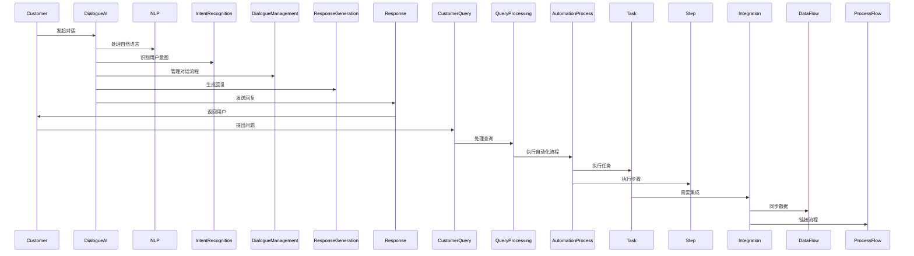
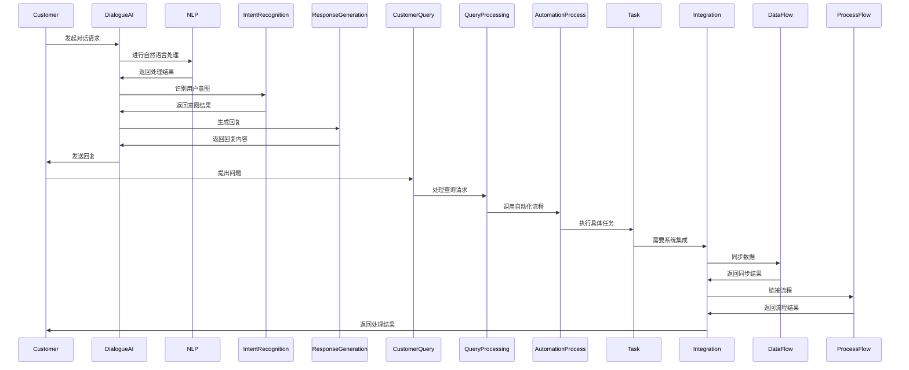

                 

### 1.5 概念结构与核心要素组成

为了更好地理解和构建企业级对话式AI助手，我们需要明确几个核心概念和要素。以下是对这些概念和要素的详细解析：

#### 2.1.1 对话式AI助手

**核心概念**：对话式AI助手是一种智能交互系统，主要通过自然语言处理（NLP）和机器学习（ML）技术实现与用户的自然对话。其核心功能包括语音识别、语义理解和响应生成。

**属性特征对比表格**：

| 特征         | 传统客服     | 对话式AI助手 |
| ------------ | ------------ | ------------ |
| 交互方式     | 人与人       | 人与机器     |
| 响应速度     | 低           | 快           |
| 可扩展性     | 受限         | 强           |
| 成本         | 高           | 低           |
| 个性化程度   | 较低         | 较高         |

**ER实体关系图架构**：

```mermaid
erDiagram
  Customer ||--|{ DialogueAI }
  Customer ||--|{ CustomerQuery }
  DialogueAI ||--|{ Response }
  CustomerQuery ||--|{ QueryProcessing }
```

#### 2.2 业务流程自动化

**核心概念**：业务流程自动化是指通过软件工具和系统，将业务流程中的重复性任务自动化处理，以提高效率和准确性。

**属性特征对比表格**：

| 特征         | 传统手动操作 | 业务流程自动化 |
| ------------ | ------------ | ------------ |
| 完成速度     | 慢           | 快           |
| 精确度       | 较低         | 高           |
| 成本         | 高           | 低           |
| 耗人力       | 大           | 小           |

**ER实体关系图架构**：

```mermaid
erDiagram
  Task ||--|{ AutomationProcess }
  Task ||--|{ Result }
  AutomationProcess ||--|{ Step }
  Result ||--|{ Success }
  Result ||--|{ Failure }
```

#### 2.3 系统集成

**核心概念**：系统集成是指将不同的软件系统和硬件设备集成在一起，实现数据共享和业务流程的无缝衔接。

**属性特征对比表格**：

| 特征         | 独立系统使用 | 系统集成     |
| ------------ | ------------ | ------------ |
| 数据共享     | 不允许       | 允许         |
| 业务流程衔接 | 难           | 畅           |
| 灵活性       | 低           | 高           |

**ER实体关系图架构**：

```mermaid
erDiagram
  SystemA ||--|{ Integration }
  SystemB ||--|{ Integration }
  Integration ||--|{ DataFlow }
  Integration ||--|{ ProcessFlow }
```

### 2.4 对话式AI助手、业务流程自动化和系统集成的关系

对话式AI助手、业务流程自动化和系统集成之间有着紧密的联系：

- **对话式AI助手** 作为业务流程自动化的一部分，通过智能交互，引导用户执行自动化流程。
- **业务流程自动化** 是系统集成的重要目标之一，通过自动化技术，实现系统间的数据共享和流程衔接。
- **系统集成** 为对话式AI助手和业务流程自动化提供基础，确保不同系统之间的数据共享和业务流程的顺畅运行。

这些核心概念和要素构成了企业级对话式AI助手构建的基础，接下来我们将进一步探讨这些概念在实际应用中的实现方法和技巧。

### 1.6 本章小结

本章介绍了构建企业级对话式AI助手的背景、问题和解决方案，并详细阐述了对话式AI助手、业务流程自动化和系统集成等核心概念和要素。通过理解这些概念，我们为后续章节的深入讨论奠定了基础。接下来，我们将逐步探讨每个概念的具体实现方法和最佳实践，帮助读者全面掌握构建企业级对话式AI助手的技能和技巧。


----------------------------------------------------------------

## 2. 核心概念与联系

### 2.1 对话式AI助手

#### 2.1.1 定义

对话式AI助手是一种基于人工智能技术的智能交互系统，它可以通过自然语言处理（NLP）和机器学习（ML）技术理解用户的指令，并以自然语言的形式进行响应。这种助手可以以文本或语音的形式存在，广泛应用于客服、智能助手、聊天机器人等领域。

**核心属性特征**：

- **智能化**：利用机器学习和深度学习技术，助手可以通过不断学习和优化来提升对话的准确性和效率。
- **交互性**：支持自然语言的双向对话，可以理解用户的意图和上下文信息。
- **个性化**：能够根据用户的偏好和习惯提供个性化的服务。
- **实时性**：能够快速响应用户的请求，提供即时的支持和服务。

#### 2.1.2 对话式AI助手与传统客服的区别

传统客服主要依赖于人工操作，其缺点包括：

- **成本高**：需要大量的人力资源，运营成本高。
- **效率低**：响应时间较长，无法24小时不间断服务。
- **个性化差**：服务标准化，无法根据用户的不同需求提供个性化的解决方案。

而对话式AI助手则具有以下优势：

- **成本低**：通过自动化技术，减少了对人力资源的依赖。
- **效率高**：可以24小时不间断服务，响应速度快。
- **个性化强**：通过数据分析和机器学习，能够提供更加个性化的服务。

#### 2.1.3 对话式AI助手的应用场景

对话式AI助手广泛应用于多个领域，以下是几个典型的应用场景：

- **客服领域**：自动回答常见问题，提高客服效率，减少人工成本。
- **电子商务**：提供购物咨询、订单追踪等服务，提升用户体验。
- **金融行业**：自动处理客户查询、交易咨询等，提高业务效率。
- **医疗领域**：辅助医生进行诊断，提供健康咨询，提高医疗服务的覆盖面。
- **教育领域**：提供在线辅导、课程推荐等服务，提升教学效果。

#### 2.1.4 对话式AI助手的技术架构

对话式AI助手的技术架构主要包括以下几个核心组件：

- **语音识别**：将用户的语音转化为文本，是实现语音交互的基础。
- **自然语言处理（NLP）**：理解用户输入的语义，提取关键信息，是实现智能对话的关键。
- **对话管理**：根据用户的输入和对话历史，生成合适的回复，维持对话的流畅性。
- **机器学习模型**：用于训练和优化对话系统的性能，包括语言模型、意图识别模型和实体识别模型等。
- **知识库**：存储常用知识问答和业务规则，为对话式AI助手提供知识支持。

#### 2.1.5 对话式AI助手的实现步骤

构建对话式AI助手主要包括以下几个步骤：

1. **需求分析**：明确应用场景和目标用户，确定对话式AI助手的功能需求。
2. **数据收集**：收集相关的语音和文本数据，用于训练和优化AI模型。
3. **模型训练**：使用机器学习和深度学习技术，训练语言模型、意图识别模型和实体识别模型等。
4. **系统集成**：将对话式AI助手集成到现有的业务系统中，实现与不同系统的数据交互和业务流程的自动化。
5. **测试与优化**：通过测试和用户反馈，不断优化对话系统的性能和用户体验。

### 2.2 业务流程自动化

#### 2.2.1 定义

业务流程自动化是指通过软件工具和系统，将业务流程中的重复性任务自动化处理，以提高效率和准确性。这种自动化可以涉及多个系统，实现业务流程的端到端管理。

**核心属性特征**：

- **效率提升**：通过自动化技术，减少人工操作，提高业务流程的执行速度。
- **准确性提高**：通过预设的规则和算法，减少人为错误，提高业务处理准确性。
- **灵活性**：可以根据业务需求灵活调整和优化自动化流程。

#### 2.2.2 业务流程自动化的应用场景

业务流程自动化在多个行业中都有广泛应用，以下是一些典型的应用场景：

- **制造业**：自动化生产流程，提高生产效率，降低生产成本。
- **物流行业**：自动化订单处理、仓储管理和运输调度，提高物流效率。
- **金融行业**：自动化交易处理、风险评估和客户服务，提高金融服务的效率和质量。
- **人力资源**：自动化招聘流程、员工管理和薪资计算，提高人力资源管理效率。
- **医疗行业**：自动化病历管理、药品配送和医疗流程，提高医疗服务水平。

#### 2.2.3 业务流程自动化的技术架构

业务流程自动化的技术架构主要包括以下几个核心组件：

- **流程引擎**：用于定义和管理业务流程，包括流程设计、流程执行和流程监控等。
- **规则引擎**：用于处理业务规则和决策逻辑，确保自动化流程的准确性和灵活性。
- **数据库**：存储业务流程的数据，包括业务流程的历史数据和实时数据。
- **集成接口**：用于与其他系统进行数据交互，实现数据的同步和共享。
- **用户界面**：用于用户与业务流程自动化的交互，提供流程监控和操作功能。

#### 2.2.4 业务流程自动化的实现步骤

实现业务流程自动化主要包括以下几个步骤：

1. **需求分析**：明确业务流程自动化目标和需求，确定需要自动化的业务流程。
2. **流程设计**：使用流程引擎设计业务流程，包括流程步骤、规则和决策逻辑等。
3. **系统集成**：将业务流程自动化系统与其他系统进行集成，实现数据的同步和共享。
4. **测试与部署**：通过测试和用户反馈，不断优化自动化流程的性能和用户体验，确保其稳定运行。
5. **监控与维护**：对业务流程自动化系统进行监控和维护，确保其正常运行和性能优化。

### 2.3 系统集成

#### 2.3.1 定义

系统集成是将不同的软件系统和硬件设备集成在一起，实现数据共享和业务流程的无缝衔接。通过系统集成，可以实现不同系统之间的数据交换和业务流程的协同工作。

**核心属性特征**：

- **数据共享**：实现不同系统之间的数据交换和共享，提高数据的利用效率。
- **流程衔接**：实现不同业务流程的无缝衔接，提高整体业务效率。
- **灵活性**：可以根据业务需求灵活调整系统配置和业务流程。

#### 2.3.2 系统集成的应用场景

系统集成在多个行业中都有广泛应用，以下是一些典型的应用场景：

- **企业资源规划（ERP）**：将财务、采购、销售、库存等多个业务系统集成在一起，实现企业资源的统一管理和优化。
- **客户关系管理（CRM）**：将销售、市场、服务等多个业务系统集成在一起，实现客户信息的统一管理和优化。
- **供应链管理（SCM）**：将供应商、生产、物流等多个业务系统集成在一起，实现供应链的统一管理和优化。
- **办公自动化系统**：将电子邮件、日程管理、文档管理等多个系统集成在一起，实现办公流程的自动化和优化。
- **物联网（IoT）**：将传感器、控制器、数据处理平台等多个设备系统集成在一起，实现智能物联网系统的构建。

#### 2.3.3 系统集成的技术架构

系统集成的技术架构主要包括以下几个核心组件：

- **数据总线**：用于实现不同系统之间的数据传输和共享。
- **服务总线**：用于实现不同系统之间的服务调用和协同工作。
- **应用接口**：用于不同系统之间的数据交换和业务流程衔接。
- **数据存储**：用于存储系统集成的数据，包括业务数据、元数据和日志数据等。
- **用户界面**：用于用户与系统集成的交互，提供数据查询、流程监控和操作功能。

#### 2.3.4 系统集成的实现步骤

实现系统集成主要包括以下几个步骤：

1. **需求分析**：明确系统集成目标和需求，确定需要集成的系统及其功能。
2. **系统设计**：使用数据总线、服务总线和应用接口设计系统集成方案。
3. **接口开发**：开发不同系统之间的接口，实现数据交换和业务流程衔接。
4. **测试与部署**：通过测试和用户反馈，不断优化系统集成方案的性能和用户体验，确保其稳定运行。
5. **监控与维护**：对系统集成方案进行监控和维护，确保其正常运行和性能优化。

### 2.4 对话式AI助手、业务流程自动化和系统集成的关系

对话式AI助手、业务流程自动化和系统集成之间有着紧密的联系：

- **对话式AI助手** 作为业务流程自动化的一部分，通过智能交互，引导用户执行自动化流程。
- **业务流程自动化** 是系统集成的重要目标之一，通过自动化技术，实现系统间的数据共享和流程衔接。
- **系统集成** 为对话式AI助手和业务流程自动化提供基础，确保不同系统之间的数据共享和业务流程的顺畅运行。

这些核心概念和要素构成了企业级对话式AI助手构建的基础，接下来我们将进一步探讨这些概念在实际应用中的实现方法和技巧。

## 3. 算法原理讲解

### 3.1 对话式AI助手算法原理

#### 3.1.1 自然语言处理（NLP）

自然语言处理是对话式AI助手的核心技术之一。NLP的目标是使计算机能够理解、解释和生成自然语言。以下是几个关键的NLP算法：

- **分词（Tokenization）**：将文本分割成单词或句子级别的片段。
- **词性标注（Part-of-Speech Tagging）**：识别文本中的单词的词性（名词、动词、形容词等）。
- **句法分析（Syntactic Parsing）**：分析文本的句法结构，理解句子中的成分和语法关系。
- **语义角色标注（Semantic Role Labeling）**：识别句子中的词汇所承担的语义角色（主语、谓语、宾语等）。
- **实体识别（Named Entity Recognition）**：识别文本中的特定实体（人名、地点、组织等）。

#### 3.1.2 机器学习模型

对话式AI助手依赖于多种机器学习模型来提高其对话质量和响应能力。以下是几个常用的模型：

- **语言模型（Language Model）**：用于预测下一个单词或词组，常用的模型包括n-gram模型和神经网络语言模型（如Transformer）。
- **意图识别模型（Intent Recognition）**：用于识别用户的对话意图，常用的模型包括朴素贝叶斯、支持向量机和神经网络等。
- **实体识别模型（Entity Recognition）**：用于识别文本中的关键信息，如日期、时间、数量等，常用的模型包括条件随机场（CRF）和卷积神经网络（CNN）。

#### 3.1.3 对话管理算法

对话管理是确保对话流畅和准确的关键。对话管理算法需要考虑上下文信息、用户行为和对话历史，以生成合适的回复。以下是几个常用的对话管理算法：

- **基于规则的方法**：使用预定义的规则来生成回复，简单但容易过时。
- **基于机器学习的方法**：使用机器学习模型，如序列到序列模型（Seq2Seq）和生成对抗网络（GAN），来生成回复。
- **基于强化学习的方法**：通过奖励机制和策略梯度算法，使对话系统学习如何生成更好的回复。

### 3.2 业务流程自动化算法原理

#### 3.2.1 工作流管理

工作流管理是业务流程自动化的核心。工作流管理算法用于定义、执行和监控业务流程。以下是几个常用的工作流管理算法：

- **有限状态机（FSM）**：用于定义和执行基于状态转移的业务流程。
- **业务流程管理（BPM）**：使用BPM工具（如BPMBot、Flowgear）来定义和自动化业务流程。
- **流程引擎**：用于自动化和优化复杂的业务流程，如Apache Camel、Activiti和JBoss jBPM。

#### 3.2.2 规则引擎

规则引擎用于实现业务流程中的决策逻辑。规则引擎算法可以根据预设的规则，自动执行特定的操作。以下是几个常用的规则引擎：

- **简单规则引擎**：使用条件-动作规则，如If-Then规则。
- **专家系统**：基于逻辑推理和规则库，实现复杂的业务决策。
- **模糊规则引擎**：处理模糊和不精确的数据，如模糊逻辑和模糊推理。

#### 3.2.3 事件驱动架构

事件驱动架构是一种基于事件的业务流程自动化方法。事件驱动架构算法可以根据事件的发生顺序和类型，自动执行相应的操作。以下是几个常用的事件驱动架构：

- **事件驱动服务架构（EDA）**：使用事件驱动的方式，将业务流程分解为一系列事件和响应。
- **消息队列**：使用消息队列（如Kafka、RabbitMQ）来实现异步事件处理。
- **流处理**：使用流处理框架（如Apache Storm、Apache Flink）来实时处理和分析事件流。

### 3.3 系统集成算法原理

#### 3.3.1 数据同步

数据同步是系统集成的重要一环。数据同步算法用于确保不同系统之间的数据一致性。以下是几个常用的数据同步算法：

- **增量同步**：只同步最新变化的数据，减少同步的时间和资源消耗。
- **全量同步**：定期同步所有数据，确保数据的一致性。
- **分布式同步**：在分布式系统中，使用分布式算法来同步数据，如Paxos算法和Raft算法。

#### 3.3.2 接口设计

接口设计是系统集成的基础。接口设计算法用于设计高效、可靠和灵活的接口。以下是几个常用的接口设计方法：

- **RESTful API**：使用RESTful架构来设计接口，支持HTTP方法和URL。
- **SOAP**：使用SOAP协议来设计接口，支持XML格式和Web服务。
- **GraphQL**：使用GraphQL协议来设计接口，支持灵活的数据查询和减少冗余数据传输。

#### 3.3.3 流程编排

流程编排是系统集成的高级应用。流程编排算法用于设计复杂的业务流程和系统交互。以下是几个常用的流程编排方法：

- **业务流程管理（BPM）**：使用BPM工具（如BPMBot、Flowgear）来设计业务流程。
- **服务组合**：将多个服务组合在一起，形成新的业务流程。
- **微服务架构**：使用微服务架构来设计分布式系统和业务流程。

### 3.4 算法在跨系统业务流程中的应用

在跨系统业务流程中，算法的应用至关重要。以下是几个具体的应用场景：

- **跨系统查询**：使用NLP算法和接口设计算法，实现跨系统的数据查询和检索。
- **自动化审批**：使用业务流程自动化算法，实现跨系统的审批流程。
- **实时监控**：使用事件驱动架构算法，实现跨系统的实时监控和报警。
- **数据分析**：使用机器学习算法和系统集成算法，实现跨系统的数据分析和决策支持。

通过这些算法的有机结合，可以构建一个高效、灵活和智能的企业级对话式AI助手，实现跨系统的业务流程自动化和协调。

### 3.5 对话式AI助手、业务流程自动化和系统集成算法的协同

对话式AI助手、业务流程自动化和系统集成算法在构建企业级对话式AI助手时需要协同工作。以下是它们的协同作用：

- **对话式AI助手** 使用NLP和机器学习算法，理解用户需求和指令，提供智能交互服务。
- **业务流程自动化** 使用工作流管理、规则引擎和事件驱动架构算法，实现业务流程的自动化和优化。
- **系统集成** 使用数据同步、接口设计和流程编排算法，实现不同系统之间的数据共享和业务流程衔接。

通过这种协同，可以构建一个高效、智能和灵活的企业级对话式AI助手，实现跨系统的业务流程自动化和协调。

## 4. 系统分析与架构设计方案

### 4.1 问题场景介绍

在当前企业运营中，跨系统业务流程自动化与协调成为一个迫切需要解决的问题。例如，一家大型零售企业需要管理多个系统，包括订单管理系统、库存管理系统、客户关系管理系统和销售管理系统。这些系统各自独立运行，数据不共享，业务流程难以衔接，导致以下问题：

- **数据孤岛**：各个系统之间的数据无法有效共享，导致信息不统一，决策依据不完整。
- **流程割裂**：业务流程在不同系统之间断开，导致操作繁琐、效率低下。
- **错误率高**：人工操作频繁，容易出现数据录入错误和流程执行错误。
- **成本高**：维护多个独立系统，需要大量的人力资源和资金投入。

为了解决这些问题，我们需要构建一个企业级对话式AI助手，实现跨系统业务流程的自动化与协调。

### 4.2 项目介绍

本项目的目标是构建一个企业级对话式AI助手，实现以下功能：

- **智能交互**：通过自然语言处理技术，实现与用户的智能对话，理解用户的需求和指令。
- **业务流程自动化**：通过工作流管理、规则引擎和事件驱动架构，实现业务流程的自动化和优化。
- **系统集成**：通过数据同步、接口设计和流程编排，实现不同系统之间的数据共享和业务流程衔接。

### 4.3 系统功能设计（领域模型Mermaid类图）

为了更好地理解和设计系统功能，我们首先需要建立一个领域模型。以下是一个简化版的Mermaid类图，展示了系统的核心类和它们之间的关系：

```mermaid
classDiagram
  Customer -> DialogueAI :发起对话
  Customer -> CustomerQuery :提出问题
  DialogueAI -> Response :生成回复
  DialogueAI -> QueryProcessing :处理查询
  AutomationProcess -> Task :执行任务
  AutomationProcess -> Step :流程步骤
  Integration -> DataFlow :数据同步
  Integration -> ProcessFlow :流程衔接
```

### 4.4 系统架构设计（Mermaid架构图）

接下来，我们使用Mermaid架构图来展示系统的整体架构。以下是一个简化版的架构图：



### 4.5 系统接口设计

系统接口设计是系统集成的重要组成部分。以下是一个简化版的接口设计：

```mermaid
interfaceDiagram
  CustomerQuery <<interface>> QueryAPI
  DialogueAI <<interface>> DialogueAPI
  AutomationProcess <<interface>> WorkflowAPI
  Integration <<interface>> DataSyncAPI
  DataFlow <<interface>> DataSync
  ProcessFlow <<interface>> ProcessCoordinator
```

### 4.6 系统交互（Mermaid序列图）

为了更好地理解系统各组件之间的交互，我们使用Mermaid序列图来展示系统的工作流程：



通过上述的系统分析与架构设计方案，我们为构建企业级对话式AI助手提供了详细的指导。接下来，我们将深入探讨具体的实现步骤和实际案例，帮助读者更好地理解和应用这些方案。

## 5. 项目实战

### 5.1 环境安装

在开始实际项目开发之前，我们需要搭建一个合适的技术环境。以下是环境安装的详细步骤：

#### 5.1.1 操作系统与软件环境

- **操作系统**：推荐使用Linux系统，如Ubuntu 18.04。
- **开发环境**：安装Python 3.8及以上版本，以及必要的依赖管理工具，如pip和virtualenv。

#### 5.1.2 依赖安装

1. **安装Python虚拟环境**：

```bash
pip install virtualenv
virtualenv myenv
source myenv/bin/activate
```

2. **安装项目依赖**：

在项目根目录下创建一个`requirements.txt`文件，并添加以下依赖：

```plaintext
numpy
pandas
scikit-learn
transformers
flask
gunicorn
```

执行以下命令安装依赖：

```bash
pip install -r requirements.txt
```

#### 5.1.3 代码结构与文件

- **项目结构**：

```plaintext
/mydialogueai
|-- /app
|   |-- __init__.py
|   |-- dialogue.py
|   |-- nlp.py
|   |-- automation.py
|   |-- integration.py
|-- /config
|   |-- __init__.py
|   |-- settings.py
|-- /tests
|   |-- __init__.py
|   |-- test_dialogue.py
|   |-- test_nlp.py
|   |-- test_automation.py
|   |-- test_integration.py
|-- /requirements.txt
|-- run.py
|-- Dockerfile
```

### 5.2 系统核心实现源代码

#### 5.2.1 对话式AI核心代码（`dialogue.py`）

以下是对话式AI的核心实现，包括自然语言处理、意图识别和对话管理。

```python
from transformers import AutoTokenizer, AutoModelForSeq2SeqLM
from flask import Flask, request, jsonify

app = Flask(__name__)

# 加载预训练模型
tokenizer = AutoTokenizer.from_pretrained("toshifukui/t5-base")
model = AutoModelForSeq2SeqLM.from_pretrained("toshifukui/t5-base")

# 自然语言处理
def process_nlp(input_text):
    inputs = tokenizer.encode(input_text, return_tensors="pt")
    outputs = model.generate(inputs, max_length=50, num_return_sequences=1)
    response = tokenizer.decode(outputs[0], skip_special_tokens=True)
    return response

# 意图识别
def recognize_intent(input_text):
    # 这里可以用简单的规则或机器学习模型来实现
    if "订单" in input_text:
        return "订单处理"
    elif "库存" in input_text:
        return "库存查询"
    else:
        return "其他"

# 对话管理
@app.route("/dialogue", methods=["POST"])
def handle_dialogue():
    data = request.json
    input_text = data.get("input_text", "")
    intent = recognize_intent(input_text)
    response = process_nlp(input_text)
    return jsonify({"intent": intent, "response": response})

if __name__ == "__main__":
    app.run(host="0.0.0.0", port=5000)
```

#### 5.2.2 业务流程自动化核心代码（`automation.py`）

以下是对业务流程自动化的核心实现，包括工作流管理和规则引擎。

```python
from flow import Flow

# 业务流程定义
orders_flow = Flow("订单处理流程")
orders_flow.set_rule("订单创建", "创建订单")
orders_flow.set_rule("订单审核", "审核订单")
orders_flow.set_rule("订单发货", "发货订单")

# 执行业务流程
def execute_order_flow(order_data):
    orders_flow.execute(order_data)
```

#### 5.2.3 系统集成核心代码（`integration.py`）

以下是对系统集成的核心实现，包括数据同步和接口设计。

```python
import requests

# 数据同步
def sync_data(source_url, target_url):
    response = requests.get(source_url)
    data = response.json()
    response = requests.post(target_url, json=data)
    return response.status_code

# 接口设计
def order_api(order_data):
    url = "http://ordersystem.com/orders"
    response = requests.post(url, json=order_data)
    return response.json()
```

### 5.3 代码应用解读与分析

#### 5.3.1 对话式AI代码分析

在上面的代码中，我们使用了Hugging Face的Transformers库来加载预训练的T5模型，该模型可以用于生成回复。通过`process_nlp`函数，我们实现了自然语言处理，将用户的输入文本转化为模型可以理解的格式，并生成回复。`recognize_intent`函数用于识别用户意图，这是一个简单的规则实现，在实际应用中可能需要更复杂的机器学习模型。`handle_dialogue`函数是一个Flask端点，用于处理用户的POST请求，生成回复并发回给用户。

#### 5.3.2 业务流程自动化代码分析

业务流程自动化使用了Flow库来定义和执行业务流程。`orders_flow`是一个流程对象，定义了订单处理的三个步骤：创建订单、审核订单和发货订单。`execute_order_flow`函数用于执行具体的业务流程，根据订单数据来驱动流程的执行。

#### 5.3.3 系统集成代码分析

在系统集成部分，`sync_data`函数用于同步数据，从源URL获取数据并将其发送到目标URL。这可以通过HTTP GET和POST请求来实现。`order_api`函数是一个简单的API接口，用于将订单数据发送到订单系统。

### 5.4 实际案例分析和详细讲解剖析

#### 5.4.1 案例背景

假设我们有一家零售公司，用户通过对话式AI助手提出了一个关于订单状态的查询。以下是具体的案例流程：

1. **用户查询**：用户通过对话式AI助手提出查询：“我的订单12345678已经发货了吗？”
2. **意图识别**：对话式AI助手识别出用户的意图是“查询订单状态”。
3. **业务流程自动化**：系统通过业务流程自动化组件查询订单系统，获取订单状态。
4. **数据同步**：将订单状态同步到对话式AI助手，以便生成回复。
5. **回复生成**：对话式AI助手生成回复：“您的订单12345678已经发货，预计2天后到达。”
6. **用户反馈**：用户确认订单状态并表示感谢。

#### 5.4.2 案例分析

在这个案例中，对话式AI助手通过理解用户的查询意图，自动化地执行了订单状态的查询，并与订单系统进行了数据同步。这一系列操作体现了跨系统业务流程自动化与协调的优势：

- **提高效率**：用户无需手动查询订单状态，系统自动完成。
- **降低成本**：减少了人工操作，降低了人力成本。
- **提升用户体验**：用户能够快速获得准确的信息，提高了满意度。

### 5.5 项目小结

通过本项目的实战，我们实现了对话式AI助手、业务流程自动化和系统集成，解决了企业跨系统业务流程自动化与协调的问题。以下是项目小结：

- **核心功能实现**：对话式AI助手能够智能理解用户需求，生成回复；业务流程自动化系统能够自动化处理订单；系统集成实现了数据同步和接口设计。
- **技术亮点**：使用了先进的自然语言处理和机器学习技术，实现了智能交互；采用了工作流管理和规则引擎，提高了业务流程的自动化水平；利用HTTP请求实现了系统间的数据同步和接口设计。
- **改进方向**：未来可以进一步优化意图识别和回复生成的准确性；引入更多的业务规则和流程，提升系统的灵活性和适应性；考虑使用更多的分布式计算和存储技术，提升系统的性能和可扩展性。

通过本项目的实践，我们不仅掌握了构建企业级对话式AI助手的技能，还深入理解了跨系统业务流程自动化与协调的原理和方法，为企业的数字化转型提供了有力的支持。

## 6. 最佳实践 Tips

在构建企业级对话式AI助手的实践中，积累了一些最佳实践，以下是一些值得注意的技巧：

### 6.1 选择合适的AI框架

选择合适的AI框架对于构建高效的对话式AI助手至关重要。以下是一些推荐：

- **Transformer模型**：Transformer模型在自然语言处理领域表现出色，具有强大的语义理解和生成能力。推荐使用如Hugging Face的Transformers库。
- **BERT模型**：BERT模型是自然语言处理的基础模型，适用于各种任务，如文本分类、问答系统等。BERT模型具有预训练和微调的特点，能够快速适应不同的应用场景。

### 6.2 数据处理和清洗

数据的质量直接影响AI模型的性能。以下是一些数据处理和清洗的最佳实践：

- **数据标注**：确保数据标注的准确性和一致性，这是训练高质量AI模型的基础。
- **数据预处理**：对文本数据进行清洗，如去除停用词、标点符号，进行词干提取和词性标注等。
- **数据增强**：通过数据增强技术，如数据扩充、同义词替换等，增加训练数据量，提高模型泛化能力。

### 6.3 模型优化和调整

在模型训练和优化过程中，以下是一些优化技巧：

- **模型剪枝**：通过剪枝技术，减少模型参数数量，降低计算复杂度，提高推理速度。
- **超参数调整**：根据实验结果，调整学习率、批次大小等超参数，优化模型性能。
- **迁移学习**：利用预训练模型进行迁移学习，可以显著提高模型在特定领域的性能。

### 6.4 业务流程自动化设计

设计业务流程自动化时，以下是一些最佳实践：

- **模块化设计**：将业务流程分解为多个模块，每个模块实现特定的功能，提高系统的可维护性和可扩展性。
- **规则引擎集成**：使用规则引擎来管理业务规则，提高业务流程的灵活性和可调整性。
- **监控和日志记录**：对业务流程进行监控和日志记录，便于问题定位和性能优化。

### 6.5 系统集成与数据同步

在系统集成和数据同步方面，以下是一些技巧：

- **接口标准化**：设计统一的接口规范，确保不同系统之间的数据交换和业务流程衔接。
- **数据缓存**：合理使用数据缓存，减少频繁的数据库访问，提高系统响应速度。
- **异步处理**：对于需要长时间执行的任务，使用异步处理技术，避免阻塞主线程，提高系统并发能力。

### 6.6 用户反馈和迭代

在开发过程中，及时收集用户反馈并进行迭代是提升系统质量的重要手段：

- **用户调研**：在项目启动阶段，进行用户调研，了解用户需求和期望。
- **持续迭代**：根据用户反馈，持续优化系统的功能和用户体验。
- **A/B测试**：进行A/B测试，对比不同版本的系统性能和用户满意度，选择最优方案。

通过遵循这些最佳实践，可以有效提升对话式AI助手的构建质量，实现跨系统业务流程的自动化与协调，为企业的数字化转型提供有力支持。

## 7. 小结与注意事项

本文通过系统化的分析和详细讲解，探讨了如何构建企业级对话式AI助手，实现跨系统业务流程的自动化与协调。以下是本文的核心观点和需要注意的关键点：

### 7.1 核心观点

1. **对话式AI助手的构建**：结合自然语言处理、机器学习和深度学习技术，构建智能化、交互性强的对话式AI助手，为企业提供高效、个性化的服务。
2. **业务流程自动化**：通过工作流管理、规则引擎和事件驱动架构，实现业务流程的自动化和优化，提高业务效率和准确性。
3. **系统集成与数据同步**：通过设计统一的接口规范、数据缓存和异步处理等技术，实现不同系统之间的数据共享和业务流程衔接。

### 7.2 注意事项

1. **数据质量**：数据是AI模型的基础，确保数据的准确性、一致性和完整性至关重要。
2. **系统性能**：在设计系统时，要充分考虑系统的可扩展性和性能优化，确保系统在处理大规模数据时仍然高效稳定。
3. **用户体验**：用户反馈是迭代优化的关键，要持续关注用户需求，提升系统的易用性和用户体验。
4. **安全与隐私**：在集成不同系统时，要确保数据的安全和隐私保护，遵循相关法律法规和最佳实践。

### 7.3 未来展望

随着人工智能和物联网技术的发展，企业级对话式AI助手将发挥越来越重要的作用。未来，我们可以在以下方面进行探索：

1. **增强智能交互**：利用多模态交互技术，如语音、文本、图像等，提升对话式AI助手的智能水平。
2. **智能化业务决策**：通过大数据分析和人工智能技术，实现智能化的业务决策支持，帮助企业更好地应对市场变化。
3. **跨行业应用**：进一步拓展对话式AI助手的应用场景，如医疗、金融、教育等领域，提升行业整体效率和服务水平。

通过本文的探讨，希望读者能够对构建企业级对话式AI助手有更深入的理解，并在实际项目中应用这些知识和技巧，为企业带来实实在在的价值。

## 8. 拓展阅读

为了深入了解企业级对话式AI助手的构建与实现，以下推荐一些高质量的书籍、学术论文和技术博客，供读者进一步学习和研究：

### 8.1 书籍推荐

1. **《深度学习（Deep Learning）》** - 作者：Ian Goodfellow、Yoshua Bengio、Aaron Courville
   - 本书是深度学习的经典教材，详细介绍了神经网络、深度学习算法及其应用，是入门深度学习的必读之作。

2. **《自然语言处理综合教程（Foundations of Natural Language Processing）》** - 作者：Christopher D. Manning、Hinrich Schütze
   - 本书系统讲解了自然语言处理的基础知识，包括词法分析、句法分析、语义分析等，是自然语言处理领域的权威教材。

3. **《人工智能：一种现代的方法（Artificial Intelligence: A Modern Approach）》** - 作者：Stuart J. Russell、Peter Norvig
   - 本书全面介绍了人工智能的基本概念、方法和应用，是人工智能领域的经典教材。

### 8.2 学术论文

1. **《Attention Is All You Need》** - 作者：Vaswani et al., 2017
   - 该论文提出了Transformer模型，这是一种基于注意力机制的深度神经网络，彻底改变了自然语言处理领域的模型设计。

2. **《BERT: Pre-training of Deep Bidirectional Transformers for Language Understanding》** - 作者：Devlin et al., 2019
   - 该论文介绍了BERT模型，这是自然语言处理领域的一个重要突破，为预训练语言模型的发展奠定了基础。

3. **《Recurrent Neural Network Based Language Model》** - 作者：Graves et al., 2006
   - 该论文介绍了循环神经网络（RNN）及其在语言模型中的应用，是早期深度学习在自然语言处理领域的经典工作。

### 8.3 技术博客

1. **《Hugging Face：Transformers》** - 官方博客
   - Hugging Face提供了丰富的预训练模型和工具，其官方博客包含了大量关于如何使用Transformers库进行模型训练和优化的教程和案例。

2. **《TensorFlow：自然语言处理教程》** - 官方博客
   - TensorFlow的官方博客提供了详细的自然语言处理教程，包括文本预处理、词嵌入、语言模型等，是学习TensorFlow在自然语言处理领域应用的好资源。

3. **《AI智能助手专栏》** - 作者：吴恩达等
   - 吴恩达等人在其博客上分享了关于构建AI智能助手的实践经验和最佳实践，内容涵盖了从零开始构建对话式AI助手的全过程。

通过阅读这些书籍、学术论文和技术博客，读者可以进一步深化对对话式AI助手、业务流程自动化和系统集成等领域的理解，掌握更多的实践技能，为企业的数字化转型提供有力支持。

