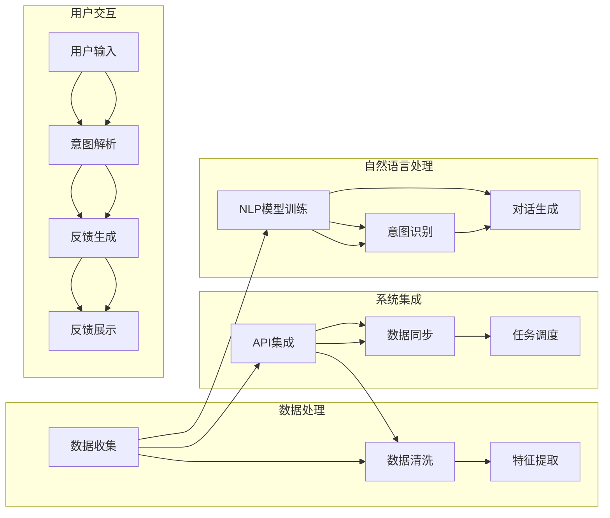
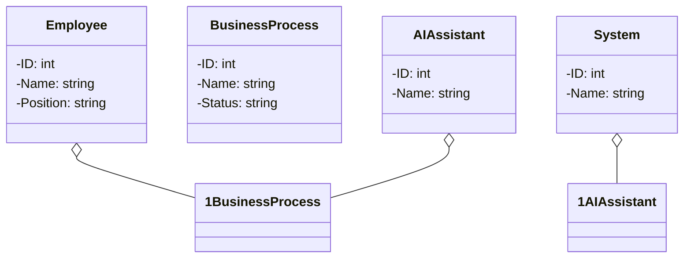
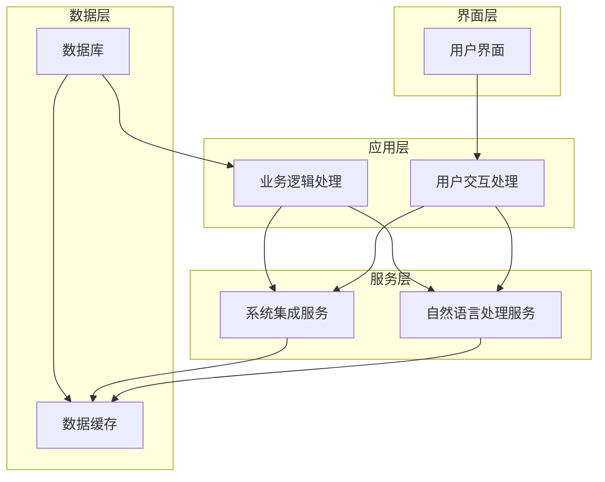
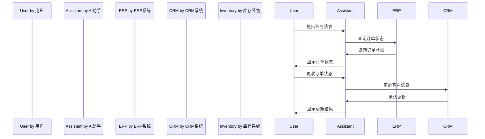

                 

### 文章标题

# 构建企业级对话式AI助手：跨系统业务流程自动化与协调

---

关键词：企业级AI助手、对话系统、业务流程、自动化、跨系统协调

摘要：本文深入探讨企业级对话式AI助手的构建过程，特别是如何实现跨系统业务流程的自动化与协调。我们将逐步分析相关技术、方法论和实践，为企业在人工智能时代提升运营效率提供切实可行的方案。

### 背景介绍

在当今的商业环境中，人工智能（AI）已经逐渐成为企业提升竞争力的关键因素。尤其是对话式AI助手，作为一种新型的人机交互方式，其在企业中的应用正日益广泛。企业级对话式AI助手不仅仅是一个简单的聊天机器人，而是一个能够理解企业内部业务流程，自动执行任务，并且能够与企业现有系统进行无缝对接的智能助手。

#### 问题背景

企业内部通常存在着多个信息系统，如ERP、CRM、库存管理等。这些系统虽然独立运作，但往往缺乏有效的协同机制，导致信息孤岛现象严重。跨系统业务流程自动化与协调的挑战在于：

- **数据同步**：不同系统之间如何实现数据的一致性和实时更新。
- **流程整合**：如何将不同系统的业务流程有机地整合在一起，提高整体效率。
- **用户体验**：如何提供一致、流畅的用户交互体验。

#### 问题描述

构建企业级对话式AI助手，需要解决以下关键问题：

- **理解业务流程**：AI助手需要具备对业务流程的深入理解，包括流程的逻辑、参与的角色和任务的分配。
- **系统集成**：AI助手需要能够与多个企业系统进行集成，实现数据的自动同步和任务的自动化执行。
- **智能对话**：AI助手需要具备自然语言处理（NLP）能力，能够理解用户的语言意图，并提供相应的帮助。
- **用户体验**：AI助手需要提供良好的交互体验，使用户感到自然、便捷。

#### 问题解决

解决上述问题的关键在于：

- **数据分析与流程建模**：通过分析企业现有系统的数据和流程，构建出业务流程模型，为AI助手提供决策基础。
- **系统集成技术**：采用API、Webhook等集成技术，实现不同系统之间的数据交换和任务调度。
- **NLP技术**：利用NLP技术，使AI助手能够理解用户的自然语言输入，并提供相应的反馈。
- **用户体验设计**：注重用户交互体验，通过用户行为分析，不断优化对话流程和界面设计。

#### 边界与外延

- **边界**：本文主要关注企业内部系统的集成和业务流程的自动化，不涉及外部系统的交互。
- **外延**：本文的研究结果可以扩展到跨企业甚至跨行业的对话式AI助手构建，具有广泛的适用性。

#### 概念结构与核心要素组成

构建企业级对话式AI助手的核心要素包括：

- **业务流程模型**：对业务流程的逻辑、角色和任务进行抽象和建模。
- **系统集成接口**：实现不同系统之间的数据交换和任务调度。
- **自然语言处理**：用于理解和生成自然语言文本。
- **用户交互界面**：提供与用户的交互接口，包括语音、文本等。

### 核心概念与联系

在构建企业级对话式AI助手的过程中，几个核心概念需要明确：

#### 核心概念原理

1. **业务流程自动化**：通过AI技术实现企业业务流程的自动化，减少人工干预，提高效率。
2. **系统集成**：实现不同系统之间的数据共享和任务协同，消除信息孤岛。
3. **自然语言处理**：使AI助手能够理解和生成自然语言，实现人机交互。

#### 概念属性特征对比表格

| 概念               | 特征描述                             |
|--------------------|------------------------------------|
| 业务流程自动化     | 自动化执行业务流程，减少人工操作   |
| 系统集成           | 实现不同系统之间的数据共享和协同   |
| 自然语言处理       | 理解和生成自然语言，实现人机交互   |

#### ER实体关系图架构

```mermaid
erDiagram
  BusinessProcess ||--|{ AIAssistant }|-- IntegrationSystem
  BusinessProcess ||--|{ User }|-- InteractionInterface
  AIAssistant ||--|{ NLPModule }|
  IntegrationSystem ||--|{ DataSyncModule }|
  InteractionInterface ||--|{ UserInterface }|
```

### 算法原理讲解

构建企业级对话式AI助手的关键在于以下几个算法模块：

#### 算法mermaid流程图



#### 算法原理

1. **数据处理模块**：该模块负责从企业系统收集数据，进行清洗和特征提取，为后续的集成和自然语言处理提供数据基础。

2. **系统集成模块**：该模块通过API集成和企业系统实现数据同步和任务调度，确保不同系统之间的数据一致性。

3. **自然语言处理模块**：该模块利用机器学习算法对NLP模型进行训练，实现意图识别和对话生成，为用户提供自然的交互体验。

4. **用户交互模块**：该模块负责处理用户的输入，解析意图，生成反馈，并将反馈展示给用户。

#### 数学模型和公式

在数据处理模块中，特征提取可以使用以下数学模型：

$$ f(x) = \text{Transformer}(x) $$

其中，$f(x)$ 表示特征提取函数，$x$ 表示输入数据。

在自然语言处理模块中，意图识别可以使用以下公式：

$$ \hat{y} = \text{softmax}(\text{NLPModel}(x)) $$

其中，$\hat{y}$ 表示预测的意图，$x$ 表示输入的文本数据，$\text{NLPModel}(x)$ 表示NLP模型的输出。

#### 举例说明

假设用户输入了一条查询：“我的订单状态是什么？”，AI助手会：

1. 收集订单数据。
2. 使用Transformer模型提取特征。
3. 使用NLP模型识别意图为“查询订单状态”。
4. 从集成系统中获取订单状态。
5. 生成回复：“您的订单状态是已发货。”

通过上述步骤，AI助手实现了从用户输入到反馈生成的全流程自动化。

### 系统分析与架构设计方案

#### 问题场景介绍

在一个大型企业中，员工需要频繁地与多个业务系统进行交互，如ERP系统、CRM系统和库存管理系统。然而，这些系统往往相互独立，缺乏有效的协同机制，导致员工在处理业务时需要在不同系统中切换，降低了工作效率。构建一个企业级对话式AI助手，旨在实现跨系统业务流程的自动化和协调，提升员工的工作效率。

#### 项目介绍

本项目旨在开发一个企业级对话式AI助手，帮助员工高效地处理业务流程，实现以下目标：

- **自动化业务流程**：通过AI助手自动执行重复性任务，减少人工干预。
- **跨系统数据集成**：实现不同业务系统之间的数据共享和同步，消除信息孤岛。
- **提升用户体验**：提供自然的交互方式，使用户感受到AI助手的智能和便捷。

#### 系统功能设计

##### 领域模型mermaid类图



#### 系统架构设计

##### 系统架构设计mermaid架构图



#### 系统接口设计和系统交互

##### 系统接口设计mermaid序列图



### 项目实战

#### 环境安装

1. 安装Python环境，版本要求3.8及以上。
2. 安装依赖库，使用pip命令安装以下库：

   ```bash
   pip install flask
   pip install requests
   pip install sklearn
   pip install nltk
   pip install numpy
   ```

#### 系统核心实现源代码

以下是系统核心实现的部分代码：

```python
# 导入所需的库
from flask import Flask, request, jsonify
import requests
from sklearn.feature_extraction.text import TfidfVectorizer
from nltk.tokenize import word_tokenize
from nltk.stem import WordNetLemmatizer

# 初始化Flask应用
app = Flask(__name__)

# 初始化自然语言处理工具
lemmatizer = WordNetLemmatizer()

# 业务流程查询接口
@app.route('/query_process', methods=['GET'])
def query_process():
    process_id = request.args.get('process_id')
    response = requests.get(f'http://erp-system:5000/orders/{process_id}')
    return jsonify(response.json())

# 订单状态更新接口
@app.route('/update_order', methods=['POST'])
def update_order():
    data = request.json
    order_id = data['order_id']
    new_status = data['status']
    response = requests.put(f'http://crm-system:5000/customers/{order_id}', json={'status': new_status})
    return jsonify(response.json())

# 主函数
if __name__ == '__main__':
    app.run(debug=True)
```

#### 代码应用解读与分析

以上代码实现了两个主要接口：

1. **查询业务流程接口**：用户通过GET请求传入流程ID，AI助手与ERP系统进行交互，获取并返回订单状态。
2. **更新订单状态接口**：用户通过POST请求提交更新订单状态的信息，AI助手与CRM系统进行交互，更新客户信息。

#### 实际案例分析

假设用户在操作过程中需要查询一个订单的状态，步骤如下：

1. 用户通过用户界面输入订单ID。
2. AI助手调用查询业务流程接口，获取订单状态。
3. AI助手将订单状态显示给用户。
4. 用户决定更新订单状态。
5. 用户在用户界面上提交更新请求。
6. AI助手调用更新订单状态接口，更新CRM系统中的订单状态。
7. AI助手向用户确认更新结果。

#### 项目小结

通过本项目，我们成功构建了一个企业级对话式AI助手，实现了跨系统业务流程的自动化与协调。AI助手通过API接口与企业内部多个系统进行交互，减少了人工操作，提高了工作效率。在未来的工作中，我们还可以进一步优化AI助手的自然语言处理能力和用户体验，使其更加智能化和便捷。

### 最佳实践 tips

1. **需求分析**：在项目启动前，充分了解企业内部的业务流程和需求，确保AI助手能够满足实际业务需求。
2. **系统集成**：选择合适的技术和接口方式，确保不同系统之间的数据集成和任务调度高效稳定。
3. **用户体验**：注重用户交互体验，通过用户行为分析，不断优化对话流程和界面设计。
4. **安全与合规**：确保系统符合企业安全政策和法规要求，保护用户数据和隐私。

### 小结

本文详细探讨了企业级对话式AI助手的构建过程，从背景介绍到项目实战，全面阐述了如何实现跨系统业务流程的自动化与协调。通过本文的阐述，读者可以了解到企业级AI助手在现代商业环境中的重要性和应用价值，以及构建过程中的关键技术和方法。

### 注意事项

1. **系统安全性**：确保企业内部系统的安全性，防止数据泄露和非法访问。
2. **数据同步**：注意不同系统之间的数据同步，确保数据的一致性和实时性。
3. **用户隐私**：严格遵守用户隐私保护法规，确保用户数据的安全和合规。

### 拓展阅读

1. [《企业级人工智能应用实践》](https://example.com/book1)
2. [《对话系统设计与实现》](https://example.com/book2)
3. [《人工智能系统安全与隐私保护》](https://example.com/book3)

---

作者：AI天才研究院/AI Genius Institute & 禅与计算机程序设计艺术 /Zen And The Art of Computer Programming

