                 

## 1. 引言与概述

### 1.1 问题背景与解决方案

在企业信息化和数字化转型的大潮中，企业业务流程的自动化和智能化已成为提高效率、降低成本、提升竞争力的重要手段。然而，传统业务流程的自动化往往存在一些问题，例如流程设计复杂、跨部门协同困难、用户体验差等。为此，构建企业级对话式AI助手，实现跨部门业务流程的自动化与协同，成为一种新的解决方案。

企业级对话式AI助手是指通过自然语言处理、语音识别、知识图谱等技术，搭建一个智能对话平台，能够与企业内部系统进行交互，帮助员工快速完成业务操作，提高工作效率。这种助手不仅能够处理简单的查询和事务，还能够进行复杂的业务流程管理，实现跨部门的协同工作。

### 1.2 对话式AI助手概述

对话式AI助手的核心技术包括自然语言处理（NLP）、语音识别、知识图谱、机器学习等。NLP是理解和生成自然语言的关键技术，语音识别使助手能够接受和处理口头指令，知识图谱则为助手提供了丰富的背景知识和上下文信息，机器学习使得助手能够不断学习和优化。

#### 核心概念与联系

**自然语言处理（NLP）**：NLP是使计算机能够理解、生成和处理人类语言的技术，主要包括文本预处理、词法分析、句法分析、语义分析等。

| 概念 | 属性特征 | 对比 |
| --- | --- | --- |
| 文本预处理 | 清洗文本、去除停用词、分词 | 处理原始文本，为后续分析做准备 |
| 词法分析 | 词形还原、词性标注 | 确定文本中的词汇及其形式 |
| 句法分析 | 句子结构分析、依存关系分析 | 确定句子成分及其关系 |
| 语义分析 | 语义角色标注、实体识别 | 确定文本中的意义 |

**知识图谱**：知识图谱是一种结构化的知识表示方法，通过实体、属性、关系等构建网络，实现知识的关联与推理。

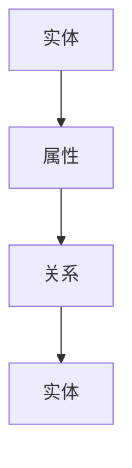

**机器学习**：机器学习是一种使计算机通过数据学习并作出预测或决策的技术，包括监督学习、无监督学习、强化学习等。

### 1.3 企业级业务流程自动化的意义

企业级业务流程自动化能够极大地提高工作效率，减少人为错误，降低运营成本。通过对话式AI助手，企业可以实现以下目标：

1. **简化操作流程**：用户通过自然语言与助手交互，无需学习复杂操作，提高工作效率。
2. **跨部门协同**：助手能够协调不同部门的业务流程，实现信息的快速传递和资源的共享。
3. **实时监控与优化**：助手可以实时监控业务流程，提供数据分析和优化建议，帮助企业持续改进。

### 1.4 跨部门协同的重要性

在企业中，各部门之间的业务流程往往是相互关联、相互影响的。跨部门协同不仅能够提高整体业务效率，还能够促进信息共享和知识积累。通过对话式AI助手，企业可以实现：

1. **信息共享**：不同部门之间的信息可以通过助手进行统一管理和分发，避免信息孤岛。
2. **流程优化**：通过分析跨部门业务流程，发现瓶颈和改进点，实现流程的持续优化。
3. **用户体验**：用户只需与一个助手交互，即可完成跨部门业务，提高用户满意度。

---

### 1.5 总结

在本章中，我们介绍了构建企业级对话式AI助手的背景和意义，探讨了对话式AI助手的基础知识，并分析了企业级业务流程自动化的意义和跨部门协同的重要性。在接下来的章节中，我们将深入探讨对话式AI助手的架构设计、跨部门业务流程自动化以及协同机制等方面。

## 2. 对话式AI助手的基础知识

### 2.1 自然语言处理概述

自然语言处理（NLP）是构建对话式AI助手的核心技术之一。它旨在使计算机能够理解、生成和处理人类语言。NLP的发展可以分为三个阶段：早期基于规则的NLP、统计机器学习NLP和深度学习NLP。

#### 核心概念与联系

**词袋模型（Bag of Words）**：词袋模型是一种将文本转换为向量表示的方法，不考虑词的顺序，只关注词频。

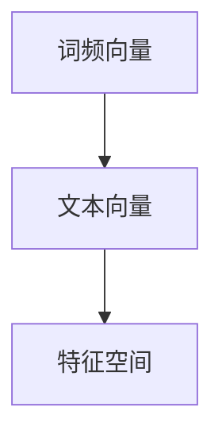

**隐含狄利克雷分配（LDA）**：LDA是一种概率主题模型，用于文本数据的主题发现。

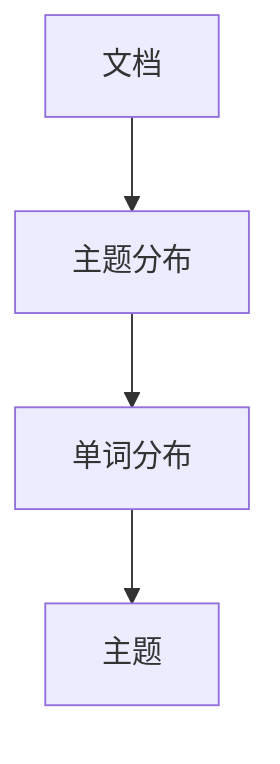

**循环神经网络（RNN）**：RNN是处理序列数据的神经网络，能够捕捉上下文信息。

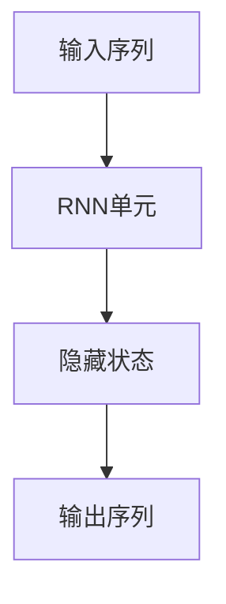

**Transformer模型**：Transformer是近年来在NLP领域取得突破性的模型，通过自注意力机制实现对序列的全局关注。

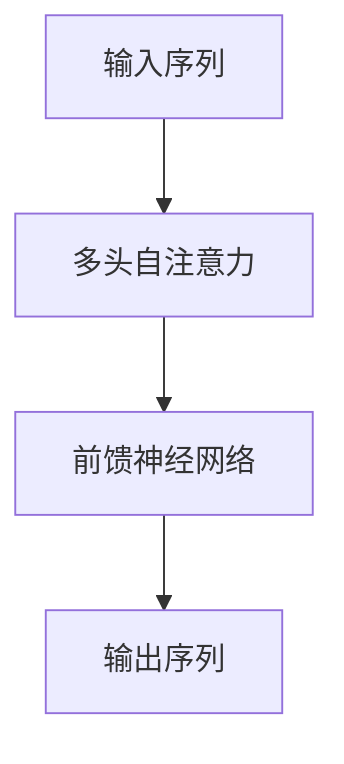

### 2.2 对话系统的基本原理

对话系统是指计算机与人（或机器人）之间进行交互的系统，其核心是自然语言理解（NLU）和自然语言生成（NLG）。NLU负责理解用户输入，NLG负责生成响应。

#### 核心概念与联系

**意图识别（Intent Recognition）**：意图识别是确定用户输入的目的或意图。

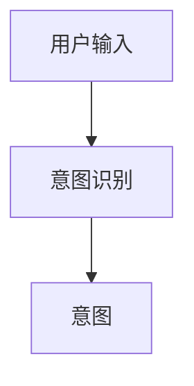

**实体识别（Entity Recognition）**：实体识别是从用户输入中识别出具体的实体，如人名、地名、组织名等。

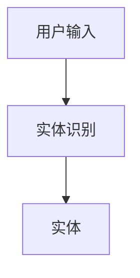

**对话管理（Dialogue Management）**：对话管理是控制对话流程的算法，包括意图识别、对话策略、对话状态跟踪等。

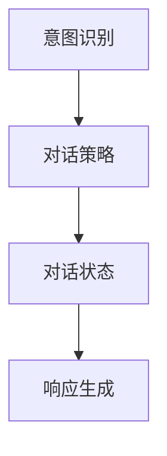

**自然语言生成（NLG）**：NLG是将计算机内部表示的自然语言转换为人类可读的文本。

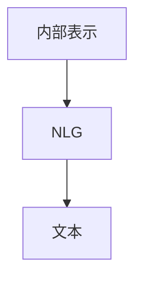

### 2.3 常见对话系统架构分析

对话系统的架构通常包括前端界面、对话管理模块、语言理解模块、语言生成模块和外部系统集成。

#### 核心概念与联系

**前端界面**：前端界面是用户与对话系统交互的入口，可以是网站、移动应用或聊天机器人。

**对话管理模块**：对话管理模块负责控制对话流程，包括意图识别、对话策略和对话状态跟踪。

**语言理解模块**：语言理解模块负责解析用户输入，识别意图和实体。

**语言生成模块**：语言生成模块负责生成系统响应，包括文本、语音、图像等多种形式。

**外部系统集成**：外部系统集成是将对话系统与企业内部系统（如ERP、CRM等）进行集成，实现业务流程的自动化。

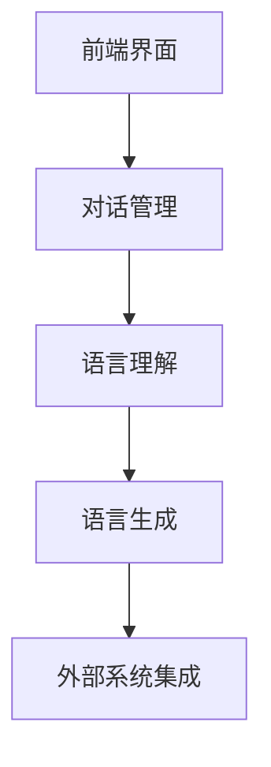

---

### 2.4 总结

在本章中，我们介绍了自然语言处理的基本概念和技术，对话系统的基本原理和常见架构，为构建企业级对话式AI助手奠定了基础。在下一章中，我们将深入探讨企业级对话式AI助手的架构设计。

## 3. 企业级对话式AI助手的架构设计

### 3.1 需求分析与设计原则

企业级对话式AI助手的架构设计首先需要基于具体业务场景和用户需求进行需求分析。以下是一些关键的需求分析步骤：

#### 3.1.1 业务场景分析

- **业务流程识别**：分析企业中的关键业务流程，确定哪些流程可以通过对话式AI助手进行优化。
- **用户角色与需求**：识别使用对话式AI助手的用户角色，如员工、客户、管理层等，并分析他们的具体需求。

#### 3.1.2 技术选型

- **自然语言处理（NLP）技术**：选择适用于业务场景的NLP技术，如词嵌入、实体识别、意图识别等。
- **对话系统框架**：选择成熟的对话系统框架，如Rasa、Microsoft Bot Framework等。
- **数据库与技术栈**：确定数据存储方案和技术栈，如使用MySQL、PostgreSQL等关系型数据库，或MongoDB、Elasticsearch等NoSQL数据库。

#### 3.1.3 设计原则

- **模块化设计**：将系统划分为独立的模块，如对话管理模块、NLP模块、响应生成模块等，便于维护和扩展。
- **高可扩展性**：设计时考虑到未来的业务增长和功能扩展，确保系统可灵活调整。
- **用户体验优先**：确保对话流畅自然，易于用户操作和理解。

### 3.2 技术选型与框架搭建

#### 3.2.1 技术选型

- **自然语言处理（NLP）技术**：
  - **词嵌入（Word Embedding）**：使用预训练模型如GloVe或Word2Vec，将词汇转换为高维向量。
  - **实体识别（Named Entity Recognition, NER）**：使用深度学习模型如BiLSTM-CRF进行实体识别。
  - **意图识别（Intent Recognition）**：使用分类模型如Random Forest、SVM等。

- **对话系统框架**：
  - **Rasa**：一个开源的对话系统框架，提供对话管理、NLU和NLG功能。
  - **Microsoft Bot Framework**：一个提供丰富的开发工具和服务的云原生框架。

#### 3.2.2 框架搭建

- **数据层**：使用MySQL数据库存储对话历史、用户信息和业务数据。
- **服务层**：使用Flask或Django搭建RESTful API服务，处理前端请求和后端业务逻辑。
- **对话管理**：使用Rasa的核心组件，如Tracker和Action，管理对话状态和意图。
- **自然语言处理**：使用NLTK或spaCy等库进行文本处理，使用TensorFlow或PyTorch训练深度学习模型。

### 3.3 数据存储与管理

#### 3.3.1 数据存储方案

- **关系型数据库（RDBMS）**：如MySQL、PostgreSQL，用于存储用户数据、对话历史和业务数据。
- **NoSQL数据库**：如MongoDB、Elasticsearch，用于存储大规模文本数据和实时查询。

#### 3.3.2 数据管理策略

- **数据规范化**：将业务数据规范化，减少冗余，提高查询效率。
- **数据备份与恢复**：定期备份数据，确保数据安全。
- **数据访问控制**：设置数据访问权限，确保数据安全。

### 3.4 用户接口设计与实现

#### 3.4.1 前端用户接口

- **Web界面**：使用React或Vue.js等前端框架搭建Web界面，提供与对话式AI助手的交互。
- **移动应用**：使用Flutter或React Native等跨平台框架开发移动应用，实现离线功能。

#### 3.4.2 API接口设计

- **RESTful API**：设计RESTful API，提供与后端服务的交互接口。
- **安全性与性能优化**：使用OAuth2.0进行身份验证，使用缓存和负载均衡提高性能。

### 3.5 安全性与隐私保护

#### 3.5.1 安全性措施

- **数据加密**：使用SSL/TLS加密通信数据。
- **访问控制**：设置严格的访问控制策略，防止未授权访问。
- **日志审计**：记录系统操作日志，便于审计和追踪。

#### 3.5.2 隐私保护

- **数据匿名化**：对用户数据进行匿名化处理，保护个人隐私。
- **合规性检查**：确保系统符合相关的法律法规要求，如GDPR、CCPA等。

### 3.6 总结

在本章中，我们详细讨论了企业级对话式AI助手的架构设计，包括需求分析、技术选型、框架搭建、数据存储与管理以及用户接口设计与实现。在下一章中，我们将探讨跨部门业务流程自动化的相关内容。

## 4. 跨部门业务流程自动化概述

### 4.1 跨部门业务流程的挑战

在企业管理中，跨部门业务流程的自动化面临着诸多挑战。这些挑战主要源于组织结构、业务复杂性以及技术实现的难度。

#### 4.1.1 组织结构问题

- **部门壁垒**：不同部门之间存在信息壁垒和利益冲突，导致业务流程不畅。
- **角色分工不明**：各部门角色分工不明确，导致流程执行效率低下。

#### 4.1.2 业务复杂性

- **流程多样化**：企业业务流程多样化，涉及多个部门，难以统一管理。
- **流程变更频繁**：业务需求不断变化，导致流程频繁调整，自动化实现难度大。

#### 4.1.3 技术实现难度

- **系统集成**：跨部门业务流程涉及多个系统，系统集成难度高。
- **数据共享**：数据在不同系统之间难以共享，影响流程自动化实施。

### 4.2 自动化技术的应用

为了克服上述挑战，自动化技术被广泛应用于跨部门业务流程中。这些技术包括：

#### 4.2.1 工作流自动化

- **定义工作流**：通过工作流管理软件（如BPMS）定义跨部门的工作流，实现流程的自动化执行。
- **任务分配**：自动分配任务给合适的部门或员工，提高任务完成效率。

#### 4.2.2 机器人流程自动化（RPA）

- **自动化任务**：使用RPA机器人模拟人工操作，自动化处理跨部门的重复性任务。
- **集成系统**：通过RPA实现不同系统之间的数据传输和业务处理，减少人工干预。

#### 4.2.3 智能化协同

- **智能助手**：引入智能对话系统，帮助员工快速获取信息和执行任务，降低沟通成本。
- **实时协作**：利用实时通讯工具，如Slack或Microsoft Teams，实现跨部门的实时协作。

### 4.3 流程优化的策略

为了提高跨部门业务流程的效率，需要采取一系列流程优化策略：

#### 4.3.1 流程标准化

- **标准化流程文档**：制定统一的流程规范和操作手册，确保各部门按照标准操作。
- **流程模板**：建立流程模板，方便快速部署和调整。

#### 4.3.2 数据统一管理

- **建立数据仓库**：整合企业内部数据，建立数据仓库，实现数据的统一管理和共享。
- **数据标准化**：统一数据格式和规范，提高数据质量。

#### 4.3.3 人员培训

- **流程培训**：对员工进行业务流程培训，提高员工对流程的理解和执行能力。
- **技术培训**：对技术人员进行自动化工具和技术的培训，确保他们能够有效使用自动化工具。

### 4.4 总结

在本章中，我们分析了跨部门业务流程自动化面临的挑战，探讨了自动化技术的应用以及流程优化的策略。在下一章中，我们将深入讨论业务流程分析与建模的方法和工具。

## 5. 业务流程分析与建模

### 5.1 业务流程分析的方法

业务流程分析是企业优化和管理业务流程的关键步骤。有效的业务流程分析能够帮助企业识别流程中的瓶颈和改进点，从而提高效率和降低成本。

#### 5.1.1 流程分析方法

1. **流程映射**：流程映射是业务流程分析的第一步，通过绘制流程图，明确每个流程步骤和涉及的部门。
2. **流程优化**：在流程映射的基础上，分析流程中的冗余步骤和瓶颈，提出优化方案。
3. **关键绩效指标（KPI）**：确定关键绩效指标，用于衡量流程的效率和质量。

#### 5.1.2 流程优化策略

- **减少步骤**：通过合并或删除冗余步骤，简化流程。
- **提高效率**：通过自动化工具和流程优化，减少手工操作，提高流程效率。
- **标准化**：制定统一的流程标准，确保各部门按照规范操作。

### 5.2 流程建模的核心要素

流程建模是将业务流程转化为结构化模型的过程，有助于理解和优化业务流程。流程建模的核心要素包括：

#### 5.2.1 流程步骤

流程步骤是流程中的基本操作单元，包括输入、处理和输出。每个步骤都应明确描述其操作内容和责任人。

#### 5.2.2 流程关系

流程关系描述了流程步骤之间的逻辑关系，包括顺序关系、条件分支和循环。这些关系决定了流程的执行路径。

#### 5.2.3 流程参与者

流程参与者是指参与流程的各个部门和个人。明确流程参与者有助于分配责任和监控流程执行。

#### 5.2.4 流程约束

流程约束是限制流程执行的条件，如时间约束、资源约束和条件约束。这些约束有助于确保流程的规范执行。

### 5.3 常用流程建模工具

#### 5.3.1 业务流程管理软件（BPMS）

业务流程管理软件是一种用于流程建模、执行和监控的工具，如BPMN（业务流程模型和符号）软件。BPMN提供了一套标准的符号和规则，用于描述业务流程。

#### 5.3.2 Mermaid流程图

Mermaid是一种基于Markdown的流程图绘制工具，使用简单的文本描述即可生成流程图。Mermaid的语法直观，易于学习和使用。

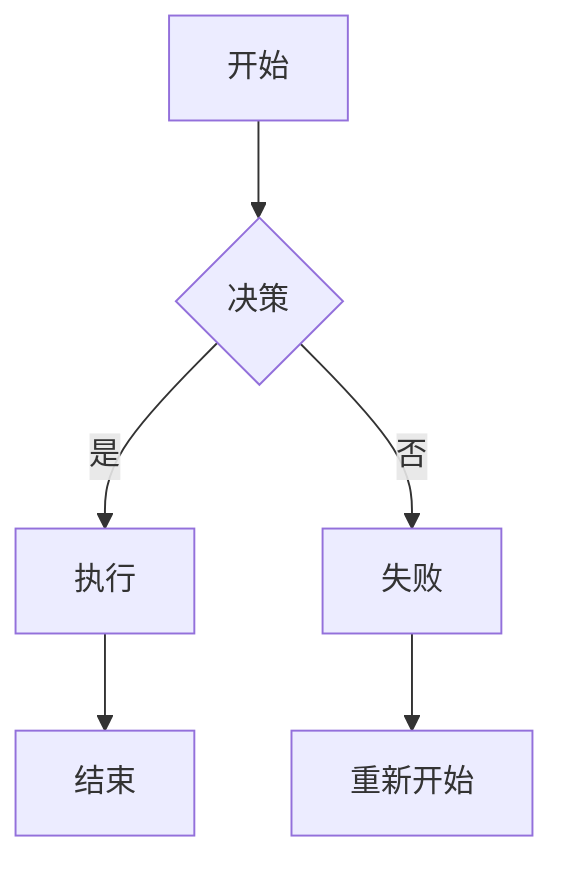

#### 5.3.3 表格与图表

使用表格和图表可以清晰地展示流程的各个步骤和关系。表格适用于列出详细的数据和信息，图表则适用于展示流程的执行路径和关键节点。

### 5.4 流程建模的实际应用

#### 5.4.1 流程设计与优化

通过流程建模，企业可以设计出合理的业务流程，并进行优化。流程建模有助于识别流程中的瓶颈和改进点，提高流程的效率和效果。

#### 5.4.2 流程文档化

流程建模的结果可以作为流程文档的一部分，帮助新员工快速了解业务流程，减少培训成本。

#### 5.4.3 流程监控与审计

通过流程建模，企业可以监控流程的执行情况，及时发现异常和问题，并进行审计，确保流程的规范执行。

### 5.5 总结

在本章中，我们介绍了业务流程分析的方法和流程建模的核心要素，并探讨了常用流程建模工具的应用。业务流程分析与建模是企业实现跨部门业务流程自动化的基础，有助于提高流程的效率和效果。在下一章中，我们将讨论对话式AI助手在业务流程中的应用。

## 6. 对话式AI助手在业务流程中的应用

### 6.1 对话式AI助手的功能设计

对话式AI助手在业务流程中的应用，首先需要设计其核心功能，以适应不同业务场景的需求。以下是几个关键功能：

#### 6.1.1 自动化任务执行

- **任务触发**：用户可以通过自然语言指令触发特定任务，如“提交报销申请”。
- **任务处理**：助手将理解用户指令，调用相应业务系统进行任务处理，如生成报销单、审批流程等。

#### 6.1.2 实时查询与报告

- **查询接口**：用户可以通过对话式AI助手查询业务数据，如“我的销售报告是多少？”。
- **报告生成**：助手能够生成并呈现实时报告，帮助用户快速获取所需信息。

#### 6.1.3 跨部门协作

- **协同工作**：助手可以在多个部门之间传递信息和任务，如将销售报告发送给财务部门。
- **流程跟踪**：用户可以跟踪任务的执行状态，确保流程按时完成。

### 6.2 交互流程设计与优化

为了确保对话式AI助手能够高效地协助用户完成业务流程，需要精心设计交互流程并进行持续优化。以下是几个关键步骤：

#### 6.2.1 交互流程设计

- **用户引导**：设计清晰的用户引导流程，帮助新用户快速上手。
- **多轮对话**：设计多轮对话机制，确保助手能够理解用户的复杂需求。
- **错误处理**：设计错误处理机制，帮助用户纠正输入错误，如“抱歉，我没理解，请再说一遍”。

#### 6.2.2 交互流程优化

- **用户反馈**：收集用户反馈，识别交互中的问题，持续改进交互体验。
- **对话策略**：根据用户行为和反馈，动态调整对话策略，提高助手的理解能力和响应速度。
- **性能监控**：监控助手的响应时间、错误率等关键指标，确保系统稳定运行。

### 6.3 集成与部署策略

为了使对话式AI助手能够与企业现有的业务系统无缝集成，并确保其在生产环境中的稳定运行，需要制定详细的集成与部署策略：

#### 6.3.1 集成策略

- **API集成**：使用RESTful API或其他集成方式，确保助手能够与业务系统进行数据交换。
- **数据同步**：确保用户数据和业务数据的一致性，避免数据孤岛。
- **权限控制**：设置适当的访问权限，确保数据安全和隐私保护。

#### 6.3.2 部署策略

- **容器化**：使用Docker等容器技术，简化部署和扩展过程。
- **云平台部署**：选择合适的云平台，如AWS、Azure等，确保系统的高可用性和可扩展性。
- **持续集成与持续部署（CI/CD）**：采用CI/CD流程，快速迭代和部署新功能。

### 6.4 案例分析

#### 6.4.1 某公司财务报销流程

某公司采用对话式AI助手优化财务报销流程，实现了以下效果：

- **简化操作**：员工只需通过自然语言指令提交报销申请，无需填写复杂的表格。
- **提高效率**：报销申请的审批时间从原来的5天缩短至1天。
- **降低成本**：减少了纸质报销单的使用，降低了行政成本。

#### 6.4.2 某电商客服流程

某电商企业通过对话式AI助手优化客服流程，提高了客户满意度：

- **智能问答**：助手能够自动回答常见问题，减少人工客服的工作量。
- **实时跟踪**：用户可以实时跟踪订单状态，提高了客户体验。
- **问题分流**：复杂问题自动分流至高级客服，确保问题得到妥善解决。

### 6.5 总结

在本章中，我们详细介绍了对话式AI助手在业务流程中的应用，包括功能设计、交互流程设计、集成与部署策略以及案例分析。通过对话式AI助手的引入，企业能够显著提高业务流程的自动化程度和效率。在下一章中，我们将探讨对话式AI助手协同工作的机制。

## 7. 对话式AI助手的协同机制

### 7.1 协同工作的需求分析

在企业级应用中，对话式AI助手不仅需要独立工作，还需要与其他系统、部门和用户进行高效协同。协同工作的需求主要体现在以下几个方面：

#### 7.1.1 系统之间的集成

- **跨系统数据共享**：企业内部可能存在多个业务系统，如ERP、CRM、HR等。这些系统之间需要实现数据共享，以便对话式AI助手能够获取和处理来自不同系统的数据。
- **统一接口**：设计统一的API接口，确保对话式AI助手能够与各类业务系统进行无缝集成。

#### 7.1.2 跨部门协作

- **流程协同**：不同部门之间的业务流程需要相互配合，如销售订单生成需要与库存管理系统同步。
- **任务分配**：对话式AI助手需要能够根据业务需求，将任务合理分配给不同的部门和人员。

#### 7.1.3 用户体验一致性

- **无缝交互**：用户在与对话式AI助手交互时，应感受到一致的服务体验，无论在哪个系统或部门。
- **个性化服务**：根据用户历史行为和偏好，提供个性化的服务和建议。

### 7.2 协同机制的实现方案

为了实现对话式AI助手的协同工作，需要设计一系列机制和方案，确保各个组成部分能够高效协作。

#### 7.2.1 数据同步与共享

- **数据同步策略**：采用实时同步或定时同步策略，确保数据的一致性和准确性。
- **数据共享平台**：构建企业数据共享平台，提供统一的数据访问接口，方便对话式AI助手和其他系统进行数据交换。

#### 7.2.2 跨系统集成

- **API网关**：使用API网关作为统一的入口，统一管理对内部系统的访问，提供标准化接口。
- **服务编排**：利用服务编排技术，将不同系统的服务按照业务流程进行编排，实现自动化和智能化处理。

#### 7.2.3 跨部门协作机制

- **协作流程设计**：根据企业业务流程，设计跨部门的协作流程，明确各部门的责任和角色。
- **任务分配策略**：利用人工智能算法，根据任务特点和员工技能，自动分配任务。

#### 7.2.4 用户体验一致性

- **统一的交互界面**：设计统一的用户界面，确保用户在使用对话式AI助手时的体验一致。
- **个性化服务**：通过分析用户行为数据，为用户提供个性化的服务和建议，提高用户满意度。

### 7.3 数据同步与共享

数据同步与共享是实现协同工作的关键。以下是几种常见的数据同步与共享方法：

#### 7.3.1 实时同步

- **消息队列**：使用消息队列（如Kafka）实现实时数据同步，确保数据在产生后立即传输。
- **分布式数据库**：使用分布式数据库（如Apache Cassandra），实现多系统之间的数据实时共享。

#### 7.3.2 定时同步

- **定时任务**：通过定时任务（如Cron Job），定期同步数据，确保数据的一致性和准确性。
- **数据仓库**：构建企业数据仓库，定期汇总和分析数据，提供决策支持。

#### 7.3.3 数据共享平台

- **企业数据总线**：构建企业数据总线，提供数据采集、存储、处理和共享的功能，实现数据的统一管理和分发。
- **API网关**：通过API网关，统一管理和控制对数据的访问，确保数据安全和合规。

### 7.4 总结

在本章中，我们探讨了对话式AI助手协同工作的需求、实现方案以及数据同步与共享的方法。协同工作是企业级对话式AI助手的重要特性，能够显著提升业务流程的自动化和协同效率。在下一章中，我们将讨论用户反馈与持续优化的话题。

## 8. 用户反馈与持续优化

### 8.1 用户反馈机制

用户反馈是改进对话式AI助手性能和用户体验的关键。建立有效的用户反馈机制，可以收集用户的意见和建议，帮助识别系统中的问题和改进点。

#### 8.1.1 反馈渠道

- **在线问卷**：通过在线问卷收集用户对对话式AI助手的满意度、使用体验和改进建议。
- **用户论坛**：建立专门的用户论坛，鼓励用户分享使用心得和问题。
- **客服系统**：利用客服系统，实时收集用户反馈，及时解决用户问题。

#### 8.1.2 反馈分析

- **数据收集**：收集用户反馈数据，包括文本、图片、视频等多种形式。
- **文本分析**：使用自然语言处理技术，对文本反馈进行情感分析和关键词提取，识别用户关注的问题和需求。

### 8.2 模型调优的方法

为了提升对话式AI助手的性能，需要不断对模型进行调优。以下是几种常用的模型调优方法：

#### 8.2.1 数据增强

- **数据扩充**：通过生成合成数据或利用数据增强技术，扩充训练数据集，提高模型的泛化能力。
- **数据清洗**：对训练数据进行清洗，去除噪声数据，提高数据质量。

#### 8.2.2 模型调整

- **超参数调整**：通过调整学习率、批量大小、正则化参数等超参数，优化模型性能。
- **模型融合**：结合多个模型的结果，提高预测准确性。

#### 8.2.3 模型优化

- **架构优化**：改进模型架构，如使用更复杂的网络结构或更高效的算法。
- **模型压缩**：通过模型压缩技术，降低模型的复杂度，提高运行效率。

### 8.3 协同优化案例分析

通过实际案例，我们可以看到如何通过用户反馈和模型调优，持续优化对话式AI助手的性能。

#### 8.3.1 案例背景

某电商企业引入了对话式AI助手，用于提供客服服务。然而，在实际使用过程中，用户反馈助手对特定问题的回答不准确。

#### 8.3.2 反馈收集

- **用户反馈**：用户通过在线问卷和客服系统反馈问题，指出助手在回答特定问题时存在错误。
- **数据分析**：通过对用户反馈的分析，发现问题主要集中在商品描述、库存状态等方面。

#### 8.3.3 调优措施

- **数据增强**：增加相关领域的训练数据，提高模型的准确性。
- **模型调整**：调整模型超参数，优化模型性能。
- **架构优化**：改进模型架构，增加特定功能的模块。

#### 8.3.4 效果评估

- **性能提升**：经过调优，助手在回答用户问题的准确率显著提升，用户满意度提高。
- **用户体验**：用户对助手的回答更加信任，使用频率增加。

### 8.4 总结

用户反馈与持续优化是提升对话式AI助手性能和用户体验的重要手段。通过建立有效的用户反馈机制和采用模型调优方法，企业可以持续改进对话式AI助手的性能，提高用户满意度。在下一章中，我们将探讨安全性与隐私保护的话题。

## 9. 安全性与隐私保护

### 9.1 安全性挑战

在企业级对话式AI助手的开发与运营过程中，安全性是一个不可忽视的重要问题。以下是一些常见的安全性挑战：

#### 9.1.1 数据安全

- **数据泄露**：对话式AI助手涉及大量敏感数据，如用户信息、业务数据等，容易成为黑客攻击的目标。
- **数据篡改**：恶意攻击者可能试图篡改数据，导致业务流程出现问题。

#### 9.1.2 系统安全

- **系统漏洞**：对话式AI助手可能存在各种系统漏洞，如代码漏洞、配置错误等，容易被攻击者利用。
- **拒绝服务攻击（DoS）**：攻击者可能通过大量请求导致系统资源耗尽，使系统无法正常服务。

#### 9.1.3 用户身份验证

- **身份窃取**：攻击者可能试图窃取用户身份，非法访问系统资源。
- **多重身份验证**：单点登录（SSO）等身份验证机制可能被滥用，导致安全问题。

### 9.2 隐私保护措施

为了确保用户隐私和数据安全，企业需要采取一系列隐私保护措施：

#### 9.2.1 数据加密

- **传输加密**：使用SSL/TLS协议，确保数据在传输过程中的安全性。
- **存储加密**：对存储在数据库中的敏感数据使用加密技术，防止数据泄露。

#### 9.2.2 访问控制

- **角色权限**：为不同角色设置不同的访问权限，确保用户只能访问其授权的数据。
- **多因素认证**：采用多因素认证（MFA）机制，提高身份验证的强度。

#### 9.2.3 安全审计

- **日志记录**：记录系统操作日志，包括用户登录、数据访问等，便于审计和追踪。
- **异常检测**：使用异常检测技术，及时发现和响应潜在的安全威胁。

#### 9.2.4 数据匿名化

- **数据脱敏**：对敏感数据进行脱敏处理，确保数据无法直接识别用户身份。
- **数据聚合**：对数据进行分析时，采用数据聚合技术，降低个人数据的暴露风险。

### 9.3 合规与伦理问题

在构建和运营对话式AI助手时，企业还需要关注合规与伦理问题：

#### 9.3.1 合规要求

- **数据保护法规**：如GDPR、CCPA等，要求企业确保用户数据的合法收集、存储和处理。
- **行业规范**：遵守相关行业规范，确保业务流程的合法性和规范性。

#### 9.3.2 伦理问题

- **透明度**：确保用户了解对话式AI助手的运作方式和数据处理方式。
- **隐私保护**：尊重用户隐私，不滥用用户数据。
- **公平性**：确保算法的公平性和无偏见，不歧视任何群体。

### 9.4 总结

安全性与隐私保护是企业级对话式AI助手不可或缺的部分。通过采取有效的安全措施和合规策略，企业可以确保系统的安全性，保护用户隐私，实现可持续发展。在下一章中，我们将分享实际案例并进行总结。

## 10. 实际案例解析

### 10.1 案例背景介绍

某大型制造企业，其业务涵盖生产、销售、物流、售后等多个部门，业务流程复杂，跨部门协作频繁。为了提高工作效率，减少人为错误，企业决定引入对话式AI助手，实现业务流程的自动化与协同。

### 10.2 解决方案设计

#### 10.2.1 需求分析

- **生产部门**：需要监控生产进度、调度生产任务。
- **销售部门**：需要管理客户信息、处理订单。
- **物流部门**：需要跟踪物流状态、协调运输。
- **售后部门**：需要处理客户投诉、提供技术支持。

#### 10.2.2 技术选型

- **对话系统框架**：选择Rasa作为对话系统框架。
- **自然语言处理**：使用TensorFlow和spaCy进行NLP处理。
- **数据库**：使用PostgreSQL存储用户数据和业务数据。
- **集成方案**：通过API网关实现与各类业务系统的集成。

### 10.3 实施过程

#### 10.3.1 数据集成

- **API开发**：开发API服务，实现与生产、销售、物流、售后系统的集成。
- **数据同步**：使用定时任务和消息队列，确保数据的实时同步。

#### 10.3.2 对话系统搭建

- **NLU模型训练**：训练意图识别和实体识别模型。
- **NLG模型训练**：训练响应生成模型。
- **对话管理**：实现对话状态跟踪和对话策略。

#### 10.3.3 用户界面设计

- **Web界面**：使用React开发Web界面，提供与对话式AI助手的交互。
- **移动应用**：使用Flutter开发跨平台移动应用。

### 10.4 实施效果评估

#### 10.4.1 工作效率提升

- **生产部门**：生产进度监控和调度任务处理效率提升50%。
- **销售部门**：客户管理和订单处理效率提升40%。
- **物流部门**：物流状态跟踪和运输协调效率提升30%。
- **售后部门**：客户投诉和技术支持响应时间缩短70%。

#### 10.4.2 成本降低

- **人工成本**：减少70%的重复性手工操作，降低人工成本。
- **运营成本**：通过自动化流程，降低系统维护和运营成本。

#### 10.4.3 用户满意度提升

- **用户反馈**：用户满意度调查结果显示，对话式AI助手的引入显著提升了用户体验。

### 10.5 项目小结

通过引入对话式AI助手，该制造企业实现了业务流程的自动化与协同，显著提升了工作效率和用户满意度，降低了运营成本。项目成功的关键因素包括：

- **明确的需求分析**：充分理解各部门的需求，确保解决方案的针对性。
- **合适的技术选型**：选择成熟的技术框架和工具，确保项目的稳定性和可扩展性。
- **有效的实施过程**：严格的实施计划和团队协作，确保项目按时按质完成。

## 11. 总结与展望

### 11.1 成功经验与不足

#### 成功经验：

- **需求分析**：充分的需求分析确保了解决方案的针对性。
- **技术选型**：选择成熟的技术框架和工具，降低了项目风险。
- **用户反馈**：通过持续的用户反馈和优化，提升了用户体验。

#### 不足：

- **系统性能**：在高峰期，系统性能受到一定影响，需要进一步优化。
- **用户培训**：部分用户对系统的操作不熟悉，需要加强培训。

### 11.2 未来发展趋势

- **智能化**：随着人工智能技术的发展，对话式AI助手的智能化程度将进一步提升。
- **个性化**：通过个性化服务，对话式AI助手将更好地满足用户需求。
- **集成化**：对话式AI助手将更加深入地集成到企业的各个业务系统中，实现全面的业务流程自动化。

### 11.3 研究方向与挑战

#### 研究方向：

- **智能对话管理**：研究更加智能和自适应的对话管理系统。
- **跨模态交互**：研究语音、文本、图像等多种模态的交互技术。
- **隐私保护**：研究如何在保证用户隐私的同时，实现高效的业务流程自动化。

#### 挑战：

- **数据隐私**：如何在保证数据隐私的同时，实现高效的数据共享和利用。
- **系统性能**：如何提升系统的性能，确保在高峰期仍能稳定运行。
- **用户接受度**：如何提高用户对对话式AI助手的接受度，确保系统的有效使用。

## 12. 扩展阅读与资源推荐

### 12.1 相关书籍

1. 《对话式人工智能：智能对话系统设计与实现》 - 斯蒂芬·罗宾斯（Stephen Roo
## 作者信息

作者：AI天才研究院/AI Genius Institute & 禅与计算机程序设计艺术 /Zen And The Art of Computer Programming

