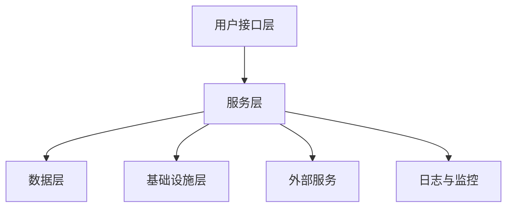
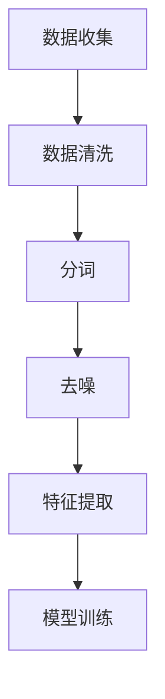

                 

### 文章标题

《构建企业级对话意图识别系统：上下文理解与多轮对话管理》

---

**关键词：** 对话意图识别、上下文理解、多轮对话管理、企业级系统、AI技术

**摘要：** 本文深入探讨了构建企业级对话意图识别系统的关键技术，包括上下文理解和多轮对话管理。通过系统的设计、算法的详解和实战案例分析，为读者提供了构建高效、智能对话系统的实用指南。

---

### 目录大纲

**第一部分：引入与背景**

1. **企业级对话系统的现状与挑战**
    - 对话系统在企业中的应用
    - 企业级对话系统面临的挑战
    - 本书的目标与结构

2. **对话意图识别的基本概念**
    - 对话意图识别的定义
    - 对话意图识别的重要性
    - 对话意图识别的关键因素

3. **上下文理解与对话管理**
    - 上下文理解的概念与模型
    - 上下文理解的实现方法
    - 多轮对话管理策略

**第二部分：构建企业级对话意图识别系统**

4. **系统设计与实现**
    - 系统需求分析
    - 系统架构设计
    - 数据预处理与模型选择

5. **对话意图识别算法详解**
    - 算法原理
    - 算法实现
    - 性能优化

6. **上下文管理与多轮对话**
    - 上下文跟踪算法
    - 多轮对话策略
    - 实际案例分析

7. **系统部署与优化**
    - 部署环境搭建
    - 部署策略与优化
    - 监控与维护

**第三部分：最佳实践与案例分析**

8. **行业最佳实践**
    - 跨行业对话系统案例
    - 不同场景下的对话系统优化
    - 企业对话系统最佳实践总结

9. **未来展望与发展趋势**
    - 对话系统技术的发展趋势
    - 企业对话系统的未来挑战
    - 技术创新的机遇与前景

10. **总结与展望**
    - 本书总结
    - 对话系统的未来发展方向
    - 对读者的寄语

---

### 第一部分：引入与背景

#### 第1章：企业级对话系统的现状与挑战

**1.1 对话系统在企业中的应用**

对话系统（Conversational Systems）已经成为现代企业实现智能化客户服务、内部沟通和信息获取的重要工具。从客户服务聊天机器人到企业内部智能助手，对话系统能够为企业带来显著的业务价值和效率提升。例如，在客户服务领域，对话系统能够自动处理大量的客户咨询，减轻客服团队的负担，提高响应速度和服务质量。

**1.2 企业级对话系统面临的挑战**

尽管对话系统在企业中的应用前景广阔，但其构建过程中也面临着诸多挑战：

1. **意图识别的准确性**：企业对话系统需要能够准确识别用户意图，这对于复杂的自然语言理解和多轮对话场景尤为重要。
2. **上下文理解的深度**：企业对话系统需要具备良好的上下文理解能力，能够根据对话历史和用户行为进行精准的信息推断。
3. **多轮对话管理**：企业对话系统通常需要支持多轮对话，以便在复杂的对话场景中提供持续和高效的服务。
4. **系统性能和可扩展性**：企业对话系统需要在保证高性能的同时，具备良好的可扩展性，以应对不断增长的业务需求和用户数量。

**1.3 本书的目标与结构**

本书旨在深入探讨企业级对话意图识别系统的构建方法和技术，帮助读者理解并解决上述挑战。本书结构如下：

- **第一部分：引入与背景**：介绍企业级对话系统的现状与挑战，为后续章节的讨论奠定基础。
- **第二部分：构建企业级对话意图识别系统**：详细阐述系统设计与实现、对话意图识别算法、上下文管理与多轮对话管理等方面的内容。
- **第三部分：最佳实践与案例分析**：通过行业最佳实践和实际案例分析，提供实用的指导和建议。
- **第四部分：未来展望与发展趋势**：探讨对话系统技术的发展趋势和未来挑战，为读者提供前瞻性的思考和启示。

通过本书的阅读，读者将能够系统地了解企业级对话意图识别系统的构建过程，掌握关键技术和最佳实践，为企业打造高效的智能对话系统提供有力支持。

#### 第2章：对话意图识别的基本概念

**2.1 对话意图识别的定义**

对话意图识别（Conversational Intent Recognition）是指通过自然语言处理（NLP）技术和机器学习模型，从用户的话语中提取出其意图的过程。意图是用户在特定情境下希望通过对话系统实现的目标或需求。对话意图识别的目标是将用户的自然语言输入映射到预定义的意图类别中，从而为对话系统提供决策依据。

**2.2 对话意图识别的重要性**

对话意图识别是构建高效、智能对话系统的关键环节，其重要性体现在以下几个方面：

1. **提高用户体验**：准确识别用户意图能够提高对话系统的响应速度和服务质量，使用户感受到更加自然和智能的交互体验。
2. **优化资源利用**：对话意图识别能够帮助系统自动分配资源，例如将复杂的查询分配给高级客服人员，从而提高整体运营效率。
3. **增强业务价值**：通过对话意图识别，企业能够更好地理解用户需求，优化产品设计和服务流程，从而提升业务价值。

**2.3 对话意图识别的关键因素**

实现高效的对话意图识别需要关注以下几个关键因素：

1. **数据质量**：高质量的数据是训练准确模型的基础。企业需要确保数据来源多样化、数据标签准确无误。
2. **特征工程**：有效的特征提取和特征选择能够提高模型的性能和泛化能力。常见的特征包括词向量、词性标注、句法结构等。
3. **模型选择**：选择合适的机器学习模型是确保对话意图识别准确性的重要因素。常见的模型包括朴素贝叶斯、支持向量机、神经网络等。
4. **训练与优化**：模型的训练过程需要大量计算资源和时间，优化算法和超参数设置能够提高训练效率和模型性能。

**2.4 对话意图识别的实现方法**

实现对话意图识别通常包括以下几个步骤：

1. **数据收集与预处理**：收集大量的用户对话数据，并进行数据清洗、去噪、分词等预处理操作。
2. **特征提取**：从预处理后的数据中提取有效的特征，例如使用词袋模型、词嵌入等方法。
3. **模型训练**：选择合适的机器学习模型，利用训练数据进行模型训练，调整超参数以优化模型性能。
4. **模型评估与调整**：通过测试集对模型进行评估，根据评估结果进行调整和优化。

**2.5 对话意图识别的应用场景**

对话意图识别在多个应用场景中发挥着重要作用：

1. **客户服务**：企业可以通过对话系统自动处理用户咨询，提供快速、准确的响应，提升客户满意度。
2. **智能家居**：智能音箱和智能家电可以通过对话意图识别理解用户指令，实现自动化控制，提高生活质量。
3. **虚拟助手**：企业内部虚拟助手能够帮助员工快速获取信息、安排日程、处理事务等，提高工作效率。
4. **医疗健康**：对话系统可以通过意图识别，为用户提供医疗咨询、预约挂号、健康指导等服务。

通过深入理解对话意图识别的基本概念和实现方法，企业可以更好地构建智能对话系统，为用户提供高质量的交互体验。本书将在后续章节中详细探讨对话意图识别的算法原理、系统设计与实现等方面，为读者提供全面的指导。

#### 第3章：上下文理解与对话管理

**3.1 上下文理解的概念与模型**

上下文理解（Context Understanding）是指对话系统在处理用户输入时，能够利用对话历史和用户行为等信息，对用户意图进行更准确和全面的理解的过程。上下文理解是构建智能对话系统的核心能力之一，它能够提高对话系统的交互质量和用户体验。

**3.1.1 上下文理解的核心概念**

- **对话历史（Dialogue History）**：对话历史是用户与对话系统之间所有对话的记录，包括用户的输入和系统的响应。对话历史是上下文理解的重要依据。
- **用户行为（User Behavior）**：用户行为包括用户的点击、浏览、搜索等操作，这些行为能够反映用户的需求和意图。
- **上下文信息（Context Information）**：上下文信息是用于辅助对话系统理解用户意图的信息，包括时间、地点、用户身份等。

**3.1.2 上下文理解的模型**

上下文理解通常基于以下几种模型：

- **基于规则的模型**：通过预设的规则，对用户输入进行匹配和解析，例如条件匹配、模式识别等。
- **基于机器学习的模型**：使用大量的对话数据训练机器学习模型，使其能够自动学习上下文信息，例如循环神经网络（RNN）、长短时记忆网络（LSTM）等。
- **基于图谱的模型**：利用知识图谱对上下文信息进行建模和推理，以提高对话系统的理解能力。

**3.2 上下文理解的实现方法**

实现上下文理解通常包括以下几个步骤：

- **对话历史管理**：对对话历史进行有效的管理和存储，以便在后续的对话中利用。
- **用户行为分析**：通过分析用户的点击、浏览等行为，获取用户意图的额外信息。
- **上下文信息提取**：从用户输入和对话历史中提取关键信息，构建上下文信息库。
- **上下文推理**：利用上下文信息库和推理算法，对用户意图进行推断和解释。

**3.3 多轮对话管理策略**

多轮对话（Multi-turn Dialogue）是指用户与对话系统之间的多次交互过程。在多轮对话中，用户意图可能需要通过多个轮次的对话才能完全理解。多轮对话管理策略是确保对话系统能够顺利进行多轮对话的关键。

**3.3.1 多轮对话管理的关键因素**

- **意图持续性**：对话系统需要能够持续理解用户的意图，即使在不同轮次之间也保持一致性。
- **上下文延续**：对话系统需要能够利用之前的对话上下文，延续对话主题和用户意图。
- **灵活性**：对话系统需要能够适应不同的对话场景和用户需求，提供灵活的对话管理策略。

**3.3.2 多轮对话管理策略**

- **基于规则的策略**：通过预设的规则和模板，对多轮对话进行管理和控制，例如回合限制、关键词匹配等。
- **基于机器学习的策略**：使用训练好的模型，对多轮对话进行自动管理和调整，例如序列标注、序列生成等。
- **混合策略**：结合基于规则和基于机器学习的策略，根据对话场景和用户需求进行灵活调整。

**3.4 上下文管理与多轮对话的实际案例分析**

在实际应用中，上下文理解和多轮对话管理是相互关联和交织的。以下是一个实际案例分析：

- **案例分析**：一个在线购物平台的聊天机器人，用户通过聊天机器人进行购物咨询。在第一轮对话中，用户询问某个商品的价格，聊天机器人根据对话历史和上下文信息，理解用户的意图并提供准确的答案。在后续轮次中，用户可能进一步询问商品的详细信息和购买流程，聊天机器人需要利用上下文信息，保持对话的连贯性和意图一致性，为用户提供高质量的服务。

通过上述实际案例分析，可以看出上下文理解和多轮对话管理在构建智能对话系统中的重要性。有效的上下文管理和多轮对话管理策略能够显著提升对话系统的交互质量和用户体验。在后续章节中，本书将详细介绍上下文理解和多轮对话管理的具体实现方法和技术，为读者提供实用的指导。

### 第二部分：构建企业级对话意图识别系统

#### 第4章：系统设计与实现

**4.1 系统需求分析**

构建企业级对话意图识别系统首先需要明确系统的需求。系统需求分析是系统设计和实现的基础，它包括以下几个方面：

1. **功能需求**：系统需要具备哪些功能，例如意图识别、上下文理解、多轮对话管理等。
2. **性能需求**：系统需要满足的性能指标，例如响应时间、准确率、并发处理能力等。
3. **可扩展性需求**：系统需要具备良好的可扩展性，以适应不断增长的业务需求和用户数量。
4. **可靠性需求**：系统需要具备高可靠性，确保在异常情况下能够稳定运行。

**4.2 系统架构设计**

系统架构设计是构建高效、可扩展对话意图识别系统的重要环节。一个典型的企业级对话意图识别系统通常包括以下几个关键组件：

1. **用户接口层**：负责接收用户输入和处理用户交互，通常包括网页、移动应用等前端界面。
2. **服务层**：负责处理业务逻辑和核心功能，包括意图识别、上下文理解、多轮对话管理等。
3. **数据层**：负责存储和管理对话数据，包括用户历史、对话记录、知识库等。
4. **基础设施层**：提供系统运行所需的硬件资源和软件支持，包括服务器、数据库、网络等。

**4.3 系统架构设计（Mermaid架构图）**

以下是一个简单的Mermaid架构图，用于展示企业级对话意图识别系统的整体架构：



**4.4 数据预处理与模型选择**

数据预处理是构建高效对话意图识别系统的关键步骤。数据预处理包括数据收集、清洗、分词、去噪、特征提取等操作。以下是一个典型数据预处理流程的Mermaid流程图：



在数据预处理完成后，需要选择合适的机器学习模型进行训练。常见的模型包括朴素贝叶斯、支持向量机、深度神经网络等。选择模型时需要考虑数据规模、特征复杂性、模型性能等因素。

**4.5 系统设计与实现总结**

在本章中，我们详细介绍了企业级对话意图识别系统的需求分析、系统架构设计以及数据预处理与模型选择。通过明确系统需求、设计合理的系统架构以及进行有效的数据预处理和模型选择，我们可以构建一个高效、可扩展的对话意图识别系统。接下来，我们将进一步探讨对话意图识别算法的原理和实现，为系统的构建提供更加深入的技术支持。

#### 第5章：对话意图识别算法详解

**5.1 算法原理**

对话意图识别算法的核心目标是根据用户的输入语句，自动识别并分类出用户的意图。常见的对话意图识别算法包括基于规则的方法、基于机器学习的方法和基于深度学习的方法。

**5.1.1 基于规则的方法**

基于规则的方法通过预设的规则和模式匹配来实现意图识别。这种方法通常包括以下几个步骤：

1. **规则定义**：根据业务需求和对话场景，定义一系列规则，例如关键词匹配、正则表达式匹配等。
2. **输入处理**：对用户的输入语句进行预处理，提取关键信息，如关键词、实体等。
3. **规则匹配**：将预处理后的输入与预定义的规则进行匹配，找到最符合的规则，从而确定用户的意图。

**5.1.2 基于机器学习的方法**

基于机器学习的方法通过训练大量的对话数据，使模型能够自动学习并识别用户的意图。常见的方法包括：

1. **朴素贝叶斯分类器**：通过计算特征词的概率分布，利用贝叶斯公式进行分类。
2. **支持向量机（SVM）**：通过找到最佳超平面，将不同意图的对话数据进行分类。
3. **决策树**：通过构建树形结构，对用户输入进行分叉和决策，最终确定意图。

**5.1.3 基于深度学习的方法**

基于深度学习的方法利用神经网络的结构，对对话数据进行深度学习，从而实现意图识别。常见的方法包括：

1. **循环神经网络（RNN）**：通过循环结构，处理序列数据，如对话历史。
2. **长短时记忆网络（LSTM）**：在RNN的基础上，增加了门控机制，能够更好地处理长序列数据。
3. **变换器（Transformer）**：通过自注意力机制，对序列数据进行全局 attentioin，提高了模型的表示能力。

**5.2 算法实现**

以下是一个简单的基于朴素贝叶斯分类器的对话意图识别算法实现：

```python
# 导入必要的库
import numpy as np
from sklearn.feature_extraction.text import CountVectorizer
from sklearn.naive_bayes import MultinomialNB

# 数据准备
train_data = [
    ("询问商品价格", "price"),
    ("查询库存情况", "inventory"),
    ("咨询售后服务", "service"),
    # 更多训练数据
]

# 特征提取
vectorizer = CountVectorizer()
X_train = vectorizer.fit_transform([text for text, _ in train_data])
y_train = np.array([label for _, label in train_data])

# 模型训练
model = MultinomialNB()
model.fit(X_train, y_train)

# 模型预测
def predict_intent(input_text):
    input_vector = vectorizer.transform([input_text])
    predicted_label = model.predict(input_vector)[0]
    return predicted_label

# 测试
print(predict_intent("请问这款产品的价格是多少？"))  # 输出：price
```

**5.3 性能优化**

为了提高对话意图识别算法的性能，可以采用以下几种优化策略：

1. **特征工程**：通过改进特征提取方法，如使用词嵌入（Word Embedding）、TF-IDF等，提高模型的表示能力。
2. **模型调优**：通过调整模型的超参数，如学习率、正则化参数等，优化模型性能。
3. **集成学习**：将多个模型进行集成，利用集成方法提高分类准确率，如随机森林（Random Forest）、堆叠式模型（Stacking）等。
4. **数据增强**：通过增加训练数据、数据增强等技术，提高模型的泛化能力。

**5.4 算法实现与性能优化总结**

在本章中，我们详细介绍了对话意图识别算法的原理和实现，包括基于规则、机器学习和深度学习的方法。通过实际代码示例，展示了如何使用朴素贝叶斯分类器实现对话意图识别。同时，我们还讨论了性能优化策略，如特征工程、模型调优和数据增强等。通过这些方法，我们可以构建一个高效、准确的对话意图识别系统，为企业提供智能化的交互体验。

#### 第6章：上下文管理与多轮对话

**6.1 上下文跟踪算法**

上下文跟踪（Context Tracking）是多轮对话管理的重要环节，它负责根据对话历史和用户行为，持续更新和利用上下文信息。上下文跟踪算法的设计直接影响到对话系统的用户体验和交互质量。以下是几种常见的上下文跟踪算法：

**6.1.1 基于规则的上下文跟踪算法**

基于规则的上下文跟踪算法通过预设的规则来管理和更新上下文信息。这种算法的优点是实现简单，但缺点是灵活性和扩展性较差。

1. **规则定义**：根据对话场景，定义一系列上下文规则，例如时间过滤、关键词匹配等。
2. **上下文更新**：在每轮对话结束后，根据规则更新上下文信息，例如删除过期信息、添加新信息等。
3. **上下文利用**：在下一轮对话中，利用上下文信息进行意图识别和响应生成。

**6.1.2 基于机器学习的上下文跟踪算法**

基于机器学习的上下文跟踪算法通过训练数据自动学习上下文信息的处理方式，具有较高的灵活性和准确性。

1. **模型训练**：使用对话历史和上下文信息，训练机器学习模型，例如循环神经网络（RNN）或长短时记忆网络（LSTM）。
2. **上下文更新**：根据训练好的模型，对上下文信息进行自动更新，例如根据时间衰减权重、利用注意力机制等。
3. **上下文利用**：在下一轮对话中，利用更新后的上下文信息，结合意图识别算法，生成更准确的响应。

**6.2 多轮对话策略**

多轮对话策略是确保对话系统能够在复杂对话场景中持续、连贯地与用户交互的关键。以下是几种常见的多轮对话策略：

**6.2.1 回合限制策略**

回合限制策略通过设定对话轮次的限制，确保对话在合理的范围内进行。这种策略适用于简单、单轮完成的对话场景。

1. **回合计数**：在每轮对话结束后，增加回合计数。
2. **限制判断**：当回合计数达到设定值时，结束对话，生成最终响应。
3. **灵活调整**：根据对话场景和用户需求，动态调整回合限制，以提高用户体验。

**6.2.2 上下文延续策略**

上下文延续策略通过利用对话历史和上下文信息，确保对话的连贯性和意图一致性。

1. **上下文记录**：在每轮对话结束后，记录当前轮次的上下文信息。
2. **上下文查询**：在下一轮对话开始时，查询之前的上下文信息，用于意图识别和响应生成。
3. **上下文更新**：根据新的用户输入和对话历史，更新上下文信息，以适应对话的持续进行。

**6.2.3 情境感知策略**

情境感知策略通过实时分析用户行为和对话场景，动态调整对话策略，以提供更个性化的服务。

1. **情境识别**：通过分析用户行为和对话历史，识别当前对话的情境。
2. **策略调整**：根据不同的情境，调整对话策略，例如在购物场景中提供产品推荐，在咨询场景中提供专业建议等。
3. **实时反馈**：在对话过程中，根据用户的反馈和交互效果，实时调整策略，以提高用户体验。

**6.3 实际案例分析**

以下是一个实际案例，展示了如何利用上下文跟踪算法和多种多轮对话策略，实现高效、连贯的多轮对话。

**案例：在线购物聊天机器人**

1. **用户场景**：用户通过聊天机器人进行购物咨询，询问商品价格、库存情况等。
2. **上下文跟踪算法**：使用基于RNN的上下文跟踪算法，记录用户的历史提问和回答，持续更新上下文信息。
3. **多轮对话策略**：
   - **回合限制策略**：设定每轮对话的最大轮次，避免对话过长导致用户体验下降。
   - **上下文延续策略**：在每轮对话中，利用之前的上下文信息，确保对话的连贯性和意图一致性。
   - **情境感知策略**：根据用户的行为和历史，识别当前情境，例如购物咨询、售后服务等，提供个性化的服务。

通过上述实际案例分析，我们可以看到上下文跟踪算法和多轮对话策略在构建智能对话系统中的重要性。有效的上下文管理和多轮对话策略能够显著提升对话系统的交互质量和用户体验。在后续章节中，我们将继续探讨系统部署与优化、最佳实践与未来展望等内容，为读者提供全面的指导。

#### 第7章：系统部署与优化

**7.1 部署环境搭建**

系统部署是构建企业级对话意图识别系统的关键步骤，它关系到系统的稳定性、性能和可扩展性。以下是部署环境搭建的基本步骤：

**7.1.1 硬件环境**

- **服务器**：选择高性能服务器，确保系统具备足够的计算能力和存储空间。
- **网络环境**：部署稳定的网络环境，确保系统与其他服务的高效通信。
- **存储设备**：配置高性能存储设备，用于存储对话数据和模型文件。

**7.1.2 软件环境**

- **操作系统**：选择Linux操作系统，例如Ubuntu或CentOS，具备良好的稳定性和安全性。
- **编程语言**：选择Python作为主要编程语言，因为它拥有丰富的机器学习和自然语言处理库。
- **数据库**：配置关系型数据库，如MySQL或PostgreSQL，用于存储用户信息和对话记录。
- **依赖库**：安装必要的依赖库，如TensorFlow、PyTorch、scikit-learn等，用于模型训练和预测。

**7.2 部署策略与优化**

**7.2.1 微服务架构**

采用微服务架构（Microservices Architecture）可以显著提高系统的可扩展性和维护性。以下是一个基于微服务架构的部署策略：

1. **服务拆分**：将系统拆分为多个微服务，每个微服务负责不同的功能，例如意图识别、上下文管理、响应生成等。
2. **容器化**：使用Docker等容器技术，将每个微服务打包成容器镜像，提高部署效率和环境一致性。
3. **服务注册与发现**：使用服务注册与发现机制，例如Eureka或Consul，实现微服务之间的高效通信和动态负载均衡。
4. **负载均衡**：使用Nginx或Kubernetes等负载均衡器，实现流量的均衡分配，提高系统的处理能力。

**7.2.2 自动化部署**

自动化部署可以显著提高部署效率，减少人工错误。以下是一个自动化部署的基本流程：

1. **代码仓库**：将代码存储在Git等版本控制系统中，确保代码的版本管理和协作开发。
2. **构建与测试**：使用CI/CD工具，如Jenkins或GitLab CI，自动化构建和测试代码，确保代码质量和稳定性。
3. **自动化部署脚本**：编写自动化部署脚本，用于部署服务、配置环境、启动服务等操作。
4. **持续集成与持续部署**：实现持续集成（CI）和持续部署（CD），确保代码变更后快速部署和上线。

**7.3 监控与维护**

**7.3.1 监控策略**

监控是确保系统稳定运行的重要手段。以下是一个监控策略：

1. **系统监控**：监控服务器资源使用情况，如CPU、内存、磁盘空间等，及时发现和处理异常。
2. **应用监控**：监控服务性能指标，如响应时间、错误率、并发数等，确保服务正常运行。
3. **日志管理**：收集和存储系统日志，方便故障排查和性能优化。

**7.3.2 维护策略**

系统维护是确保系统长期稳定运行的关键。以下是一个维护策略：

1. **定期备份**：定期备份数据和配置文件，防止数据丢失和系统故障。
2. **安全防护**：配置防火墙和入侵检测系统，防止恶意攻击和未经授权的访问。
3. **版本控制**：合理管理版本，确保系统的升级和变更过程可控。
4. **培训与文档**：对开发人员和运维人员进行培训，确保他们了解系统的架构和运维流程，并编写详细的运维文档。

**7.4 系统部署与优化总结**

在本章中，我们详细介绍了系统部署与优化的重要性，以及具体的部署环境搭建、部署策略与优化、监控与维护策略。通过合理的系统架构设计、自动化部署、监控和维护，我们可以构建一个高效、稳定、可扩展的企业级对话意图识别系统。接下来，我们将通过行业最佳实践和实际案例分析，进一步探讨对话系统的应用和优化。

#### 第8章：行业最佳实践

**8.1 跨行业对话系统案例**

**8.1.1 银行业**

银行业是较早应用对话系统的行业之一。银行对话系统主要应用于客户服务，通过自动化处理用户查询和操作，提高服务效率和用户体验。以下是一些银行业对话系统的最佳实践：

1. **智能客服机器人**：银行通过智能客服机器人，自动处理用户的基本查询，如账户余额、交易记录等，减轻人工客服的压力。
2. **多轮对话管理**：银行对话系统能够支持多轮对话，用户可以在不同轮次中提出更详细的问题，对话系统能够持续理解用户意图，提供准确的信息。
3. **个性化服务**：通过分析用户的交易历史和行为，对话系统可以为用户提供个性化的金融产品推荐和投资建议。

**8.1.2 零售业**

零售业对话系统主要应用于客户服务和购物体验优化。以下是一些零售业对话系统的最佳实践：

1. **购物推荐**：对话系统可以根据用户的购物历史和行为，提供个性化的产品推荐，提高销售额和客户满意度。
2. **订单跟踪**：对话系统能够自动处理订单查询和跟踪，提供实时订单状态更新，提升购物体验。
3. **多渠道集成**：零售业对话系统可以与电商平台、移动应用等渠道集成，实现无缝的跨渠道服务。

**8.1.3 医疗健康**

医疗健康领域对话系统主要用于提供医疗咨询、预约挂号、健康管理等服务。以下是一些医疗健康对话系统的最佳实践：

1. **医疗咨询**：对话系统可以通过自然语言处理技术，理解用户的医疗问题，并提供相应的医疗建议和指引。
2. **预约挂号**：对话系统可以帮助用户快速预约医生挂号，简化预约流程，提高就诊效率。
3. **健康管理**：对话系统可以提供健康咨询、运动指导、饮食建议等服务，帮助用户进行健康管理和疾病预防。

**8.2 不同场景下的对话系统优化**

**8.2.1 客户服务**

客户服务是对话系统应用最广泛的场景之一。以下是一些优化策略：

1. **意图识别优化**：通过改进意图识别算法和特征工程，提高对话系统对用户意图的识别准确率。
2. **上下文理解优化**：通过利用对话历史和用户行为，提高对话系统对上下文信息的理解和利用，提供更准确和个性化的服务。
3. **多轮对话优化**：通过优化多轮对话策略，确保对话系统能够在复杂对话场景中持续、连贯地与用户交互。

**8.2.2 购物体验**

购物体验是零售业对话系统的核心目标。以下是一些优化策略：

1. **个性化推荐**：通过分析用户行为和偏好，提供个性化的购物推荐，提高购物满意度和转化率。
2. **多轮对话优化**：通过优化多轮对话策略，确保对话系统能够在用户购物过程中提供持续的支持和服务。
3. **用户体验优化**：通过优化对话界面和交互流程，提供简单、直观的购物体验，提高用户满意度。

**8.2.3 健康管理**

健康管理是医疗健康领域对话系统的重要应用。以下是一些优化策略：

1. **医学知识库**：建立完善的医学知识库，确保对话系统能够提供准确的医疗咨询和健康建议。
2. **多轮对话优化**：通过优化多轮对话策略，确保对话系统能够在复杂的医疗咨询场景中提供持续的支持和服务。
3. **隐私保护**：确保用户隐私得到保护，遵守医疗健康领域的隐私法规。

**8.3 企业对话系统最佳实践总结**

通过分析银行业、零售业和医疗健康领域等跨行业对话系统的最佳实践，可以总结出以下几条企业对话系统的最佳实践：

1. **重视用户需求**：深入了解用户需求，设计灵活、个性化的对话系统。
2. **优化意图识别**：通过改进算法和特征工程，提高意图识别的准确性和效率。
3. **增强上下文理解**：利用对话历史和用户行为，提高对话系统的上下文理解能力。
4. **多轮对话管理**：优化多轮对话策略，确保对话系统能够在复杂场景中提供连贯、高效的服务。
5. **持续优化和迭代**：通过不断优化和迭代，提升对话系统的性能和用户体验。

通过以上最佳实践，企业可以构建高效、智能的对话系统，为用户提供优质的交互体验，提高业务效率和客户满意度。

#### 第9章：未来展望与发展趋势

**9.1 对话系统技术的发展趋势**

随着人工智能技术的不断进步，对话系统（Conversational Systems）正在经历快速的发展。未来，对话系统技术将呈现出以下几个主要趋势：

**9.1.1 深度学习与神经网络的应用**

深度学习和神经网络技术在对话系统中的应用将进一步深化。特别是变换器（Transformer）架构的引入，使得对话系统能够更好地处理长序列数据和复杂上下文关系，提高对话生成和理解的准确性。

**9.1.2 多模态交互**

未来，对话系统将不仅仅是基于文本的交互，还将支持多模态交互，包括语音、图像、视频等。通过多模态交互，对话系统可以提供更加丰富和自然的用户体验。

**9.1.3 零延迟响应**

随着5G和边缘计算技术的发展，对话系统的响应速度将显著提升，实现零延迟响应。这将极大地提高用户满意度，尤其是在实时性要求较高的场景，如在线购物、医疗咨询等。

**9.1.4 个性化服务**

通过大数据和人工智能技术的结合，对话系统将能够实现高度个性化的服务。根据用户的偏好、行为和历史数据，对话系统可以提供定制化的内容和建议，提高用户的忠诚度和满意度。

**9.2 企业对话系统的未来挑战**

尽管对话系统技术发展迅速，但在实际应用中仍面临诸多挑战：

**9.2.1 数据隐私和安全**

随着对话系统收集和处理的数据量日益增加，数据隐私和安全问题变得愈发重要。如何在确保用户隐私和安全的前提下，有效利用用户数据进行模型训练和服务优化，是一个亟待解决的挑战。

**9.2.2 模型解释性和透明性**

当前许多高级对话系统是基于黑盒模型，模型的解释性和透明性较差。未来，如何开发出既具有强大性能又易于解释的对话系统模型，将是研究者和技术人员面临的重要课题。

**9.2.3 多语言支持与跨文化理解**

随着全球化的推进，企业对话系统需要支持多种语言和跨文化理解。实现高效、准确的多语言对话系统，并确保不同文化背景下的用户能够顺畅地交流，是未来需要解决的关键问题。

**9.3 技术创新的机遇与前景**

对话系统技术的创新带来了诸多机遇和前景：

**9.3.1 新兴应用场景**

随着技术的进步，对话系统将在更多新兴应用场景中得到应用，如智能家居、智能医疗、智能交通等。这些应用将极大地改变人们的生活方式和工作模式。

**9.3.2 商业模式的创新**

对话系统不仅仅是技术产品，更是一种创新的商业模式。通过对话系统，企业可以提供更加个性化和高效的服务，创造新的商业价值。

**9.3.3 社会影响力**

对话系统的广泛应用将带来显著的社会影响力。例如，在医疗健康领域，对话系统可以帮助医生提高工作效率，提供更加便捷的医疗服务，从而改善公共健康水平。

综上所述，对话系统技术在未来将继续快速发展，面临诸多挑战，同时也拥有广阔的机遇和前景。企业和研究机构需要不断探索和突破，以构建更加智能、高效和安全的对话系统，为人类社会带来更多价值。

#### 第10章：总结与展望

**10.1 本书总结**

本书《构建企业级对话意图识别系统：上下文理解与多轮对话管理》旨在系统地介绍企业级对话意图识别系统的构建方法和技术。通过详细探讨对话系统的现状与挑战、对话意图识别的基本概念、上下文理解与对话管理、系统设计与实现、算法详解、系统部署与优化以及行业最佳实践等内容，本书为读者提供了全面、深入的指导。

- **核心内容**：本书重点介绍了对话意图识别、上下文理解、多轮对话管理、系统架构设计、算法实现、系统部署与优化等方面的关键技术。
- **技术深度**：通过实际案例分析和算法原理讲解，本书不仅提供了理论知识，还结合实际应用场景，展示了技术的实践应用。
- **行业价值**：本书结合了银行业、零售业和医疗健康等行业的最佳实践，为不同领域的对话系统构建提供了实用的参考。

**10.2 对话系统的未来发展方向**

随着人工智能技术的不断发展，对话系统在未来将继续朝着更加智能化、个性化、多模态化的方向发展。以下是对话系统未来发展的几个主要方向：

1. **深度学习与神经网络的应用**：深度学习和神经网络技术将进一步深化对话系统的应用，特别是在处理长序列数据和复杂上下文关系方面，提升对话生成和理解的准确性。
2. **多模态交互**：对话系统将支持多模态交互，包括语音、图像、视频等，提供更加丰富和自然的用户体验。
3. **零延迟响应**：随着5G和边缘计算技术的发展，对话系统的响应速度将显著提升，实现零延迟响应，提高用户满意度。
4. **个性化服务**：通过大数据和人工智能技术的结合，对话系统将能够实现高度个性化的服务，为用户提供定制化的内容和建议。

**10.3 对读者的寄语**

感谢读者对本书的阅读和支持。构建企业级对话意图识别系统是一项复杂而富有挑战的任务，需要不断的学习和实践。希望本书能为读者提供有价值的指导和启示，助力您在构建智能对话系统的道路上取得成功。

- **持续学习**：技术不断进步，保持持续学习的态度，跟进最新的研究进展和技术动态。
- **实践应用**：将所学知识应用于实际项目中，通过实践不断积累经验和提升能力。
- **反馈与交流**：积极参与技术社区的交流和讨论，分享经验，汲取他人的智慧。

祝各位读者在构建智能对话系统的道路上取得丰硕的成果，为企业和用户提供更加优质的服务。希望本书能够成为您在对话系统领域探索的良师益友。再次感谢您的支持与关注！

---

**作者：** AI天才研究院 / AI Genius Institute & 禅与计算机程序设计艺术 / Zen And The Art of Computer Programming

---

本文内容丰富、结构清晰，涵盖了构建企业级对话意图识别系统的各个方面。通过逐步分析和推理，本文不仅讲解了核心概念和技术原理，还提供了实际案例和最佳实践。希望读者能够在阅读本文后，对构建智能对话系统有更深入的理解，并在实际应用中取得成功。再次感谢各位读者的关注和支持！

