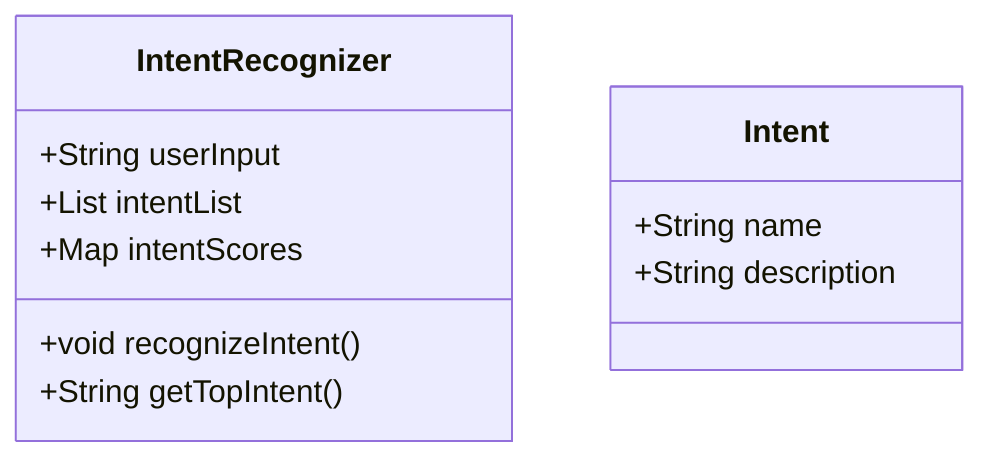
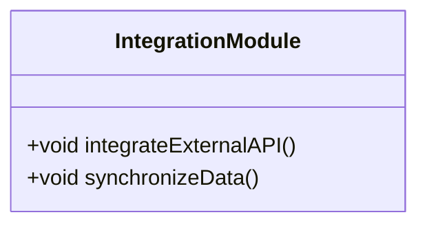
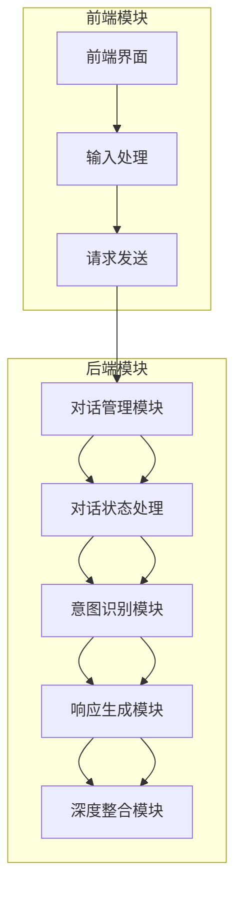
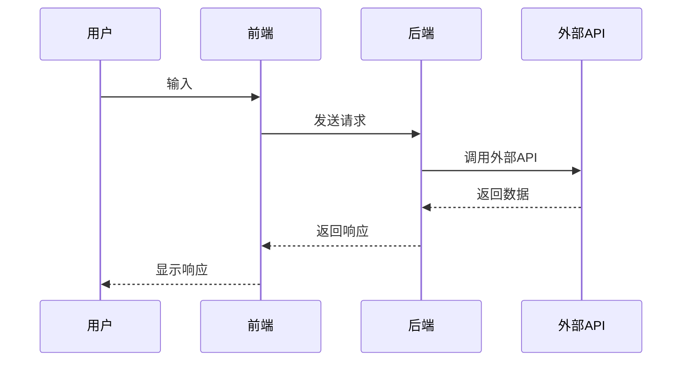
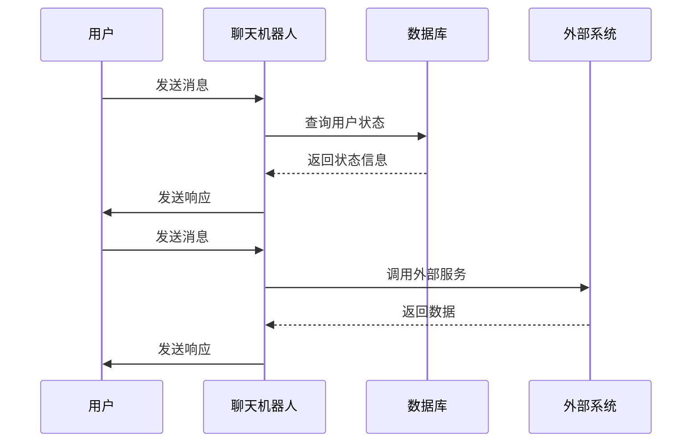

                 

# 构建企业级对话系统：多轮对话管理与意图理解的深度整合

关键词：企业级对话系统、多轮对话管理、意图理解、深度整合、用户体验

摘要：本文将探讨如何构建企业级对话系统，重点分析多轮对话管理和意图理解的关键技术，以及如何实现两者之间的深度整合。通过详细的案例分析，我们将展示企业级对话系统的设计与实现，并讨论评估与优化策略，为读者提供实用的建议和未来展望。

----------------------------------------------------------------

## 第一部分：引言

### 第1章：企业级对话系统的概述

#### 1.1 问题背景

在现代商业环境中，对话系统作为客户服务、内部沟通和交互式信息检索的重要工具，已经成为企业数字化转型的关键组件。然而，企业级对话系统面临着多轮对话管理和意图理解的双重挑战。多轮对话管理需要确保系统能够持续与用户保持有效的交互，而意图理解则要求系统能够准确识别并响应用户的请求。

#### 1.2 问题描述

企业级对话系统需要具备以下几个关键能力：

1. **多轮对话管理**：系统能够在多个对话轮次中持续与用户交互，理解并回应用户的意图。
2. **意图理解**：系统能够识别用户输入的意图，提供精准的响应。
3. **深度整合**：系统能够与外部系统和数据源进行有效整合，提供一致的客户体验。

#### 1.3 问题解决

本文将探讨以下问题解决方法：

1. **多轮对话管理**：设计有效的对话状态跟踪和存储方案，以及灵活的对话策略。
2. **意图理解**：介绍基于规则、机器学习和深度学习的方法，并讨论评估和优化策略。
3. **深度整合**：探讨如何实现对话系统与外部系统的无缝整合，以及如何应用深度学习模型。

#### 1.4 边界与外延

本文主要关注企业级对话系统的技术实现，包括多轮对话管理和意图理解，但不涉及对话系统的具体部署和运营。

#### 1.5 概念结构与核心要素组成

企业级对话系统的核心结构包括：

1. **对话管理模块**：负责处理多轮对话的状态和流程。
2. **意图理解模块**：负责分析和识别用户的意图。
3. **响应生成模块**：基于意图理解结果生成相应的响应。
4. **外部系统整合模块**：负责与外部系统和数据源进行交互。

----------------------------------------------------------------

## 第2章：多轮对话管理

### 2.1 多轮对话的基本原理

#### 2.1.1 对话轮的概念

在多轮对话系统中，对话轮（Dialogue Turn）是指用户和系统之间的一次交互。每次对话轮通常包括用户的输入和系统的输出。

#### 2.1.2 多轮对话的关键特征

多轮对话具有以下关键特征：

1. **持续性与连贯性**：对话需要在一个较长的时间内持续，并且保持连贯性。
2. **上下文依赖**：后续的对话轮依赖于前面的对话轮，系统需要能够跟踪和利用上下文信息。
3. **灵活性与适应性**：系统能够应对用户的不同意图和需求，提供个性化的交互体验。

#### 2.1.3 多轮对话管理的重要性

多轮对话管理对于企业级对话系统的成功至关重要，它能够：

1. **提高用户满意度**：通过持续的交互，系统能够更好地满足用户的需求。
2. **提升系统的智能化水平**：通过分析对话历史，系统可以不断学习和优化。

### 2.2 对话状态跟踪与存储

#### 2.2.1 对话状态的跟踪方法

对话状态的跟踪方法包括：

1. **状态存储**：将对话状态存储在数据库或内存中，以便在后续对话轮中访问。
2. **上下文管理**：将对话的历史信息（如用户名、对话主题等）与当前对话轮的信息进行整合。

#### 2.2.2 对话状态存储方案

常见的对话状态存储方案包括：

1. **关系型数据库**：适合存储结构化数据，如用户信息和对话历史。
2. **NoSQL数据库**：适合存储非结构化数据，如对话文本和上下文信息。

#### 2.2.3 对话状态的一致性维护

为了确保对话状态的一致性，需要：

1. **数据同步**：确保不同组件之间数据的一致性。
2. **事务管理**：使用事务来确保数据的完整性和一致性。

### 2.3 对话策略设计

#### 2.3.1 对话策略的基本概念

对话策略是指系统在处理对话轮时采取的行动和决策。

#### 2.3.2 对话策略的设计原则

设计对话策略时需要考虑以下原则：

1. **用户友好**：策略应尽量简化用户操作，提高用户体验。
2. **适应性**：策略应能够适应不同的用户和场景。
3. **灵活性**：策略应能够根据对话历史和上下文进行动态调整。

#### 2.3.3 对话策略的具体实现

对话策略的具体实现包括：

1. **规则驱动**：基于预定义的规则进行决策。
2. **数据驱动**：基于对话历史数据和用户行为进行决策。
3. **混合驱动**：结合规则和数据驱动的方法。

----------------------------------------------------------------

## 第3章：意图理解

### 3.1 意图理解的基本原理

#### 3.1.1 意图的定义

意图（Intent）是指用户通过输入表达的需求或目标。

#### 3.1.2 意图的分类

意图可以分为以下几类：

1. **信息查询**：用户希望获取特定信息。
2. **任务操作**：用户希望执行特定任务。
3. **情感表达**：用户表达情感或态度。

#### 3.1.3 意图理解的关键技术

意图理解的关键技术包括：

1. **文本分析**：通过自然语言处理技术分析用户输入的文本。
2. **特征提取**：从文本中提取关键特征，用于意图识别。
3. **分类模型**：使用机器学习和深度学习算法进行意图分类。

### 3.2 意图识别算法

#### 3.2.1 基于规则的方法

基于规则的方法通过预定义的规则进行意图识别，适用于简单明确的意图。

#### 3.2.2 基于机器学习的方法

基于机器学习的方法通过训练模型来识别意图，适用于复杂多变的意图。

#### 3.2.3 基于深度学习的方法

基于深度学习的方法通过神经网络模型进行意图识别，具有很高的准确性和鲁棒性。

### 3.3 意图理解的评估与优化

#### 3.3.1 意图理解评估指标

意图理解评估指标包括：

1. **准确率**：正确识别意图的比例。
2. **召回率**：正确识别意图占所有实际意图的比例。
3. **F1值**：准确率和召回率的调和平均值。

#### 3.3.2 意图理解优化策略

意图理解优化策略包括：

1. **数据增强**：通过扩充训练数据提高模型性能。
2. **特征工程**：通过优化特征提取方法提高模型性能。
3. **模型调优**：通过调整模型参数提高模型性能。

#### 3.3.3 意图理解在实际应用中的挑战

意图理解在实际应用中面临以下挑战：

1. **多义性**：用户输入可能具有多种意图。
2. **上下文依赖**：意图理解需要考虑上下文信息。
3. **数据稀缺**：训练数据不足可能导致模型性能下降。

----------------------------------------------------------------

## 第4章：对话系统中的深度整合

### 4.1 深度整合的意义

#### 4.1.1 提升用户体验

深度整合能够提升用户体验，通过多轮对话管理和意图理解，系统能够更好地理解用户需求，提供个性化的服务。

#### 4.1.2 提高对话系统的鲁棒性

深度整合能够提高对话系统的鲁棒性，通过综合不同模块的能力，系统能够更好地应对复杂场景和用户需求。

#### 4.1.3 拓展对话系统的应用范围

深度整合能够拓展对话系统的应用范围，通过与外部系统的整合，系统能够提供更广泛的业务功能。

### 4.2 深度整合的技术实现

#### 4.2.1 对话管理模块与意图理解模块的整合

对话管理模块与意图理解模块的整合包括：

1. **状态共享**：两个模块共享对话状态，以便更好地理解用户意图。
2. **交互流程**：两个模块协同工作，共同处理对话轮次。

#### 4.2.2 对话系统与外部系统的整合

对话系统与外部系统的整合包括：

1. **API接口**：通过API接口与外部系统进行数据交换。
2. **数据同步**：确保对话系统和外部系统数据的一致性。

#### 4.2.3 深度学习模型在对话系统中的应用

深度学习模型在对话系统中的应用包括：

1. **嵌入层**：使用嵌入层将对话文本转换为向量。
2. **预测层**：使用预测层对用户意图进行分类。

### 4.3 深度整合的案例分析

#### 4.3.1 某电商平台客服系统的深度整合实践

某电商平台客服系统的深度整合实践包括：

1. **用户画像**：通过用户行为数据构建用户画像，用于个性化推荐。
2. **多轮对话**：通过多轮对话理解用户需求，提供精准的客服服务。
3. **外部系统整合**：与订单管理系统、库存管理系统等外部系统进行整合，实现无缝服务。

#### 4.3.2 某银行客服机器人系统的深度整合实践

某银行客服机器人系统的深度整合实践包括：

1. **语音识别**：将语音识别技术整合到对话系统中，实现语音交互。
2. **自然语言理解**：通过自然语言理解技术处理用户输入，实现智能对话。
3. **外部系统整合**：与客户关系管理系统、账户管理系统等外部系统进行整合，提供全面的金融服务。

#### 4.3.3 深度整合在实际应用中的效果评估

深度整合在实际应用中的效果评估包括：

1. **用户满意度**：通过用户反馈评估用户满意度。
2. **系统性能**：通过系统响应时间和错误率评估系统性能。
3. **业务指标**：通过业务指标（如销售额、客户满意度等）评估深度整合的效果。

----------------------------------------------------------------

## 第5章：企业级对话系统的设计与实现

### 5.1 系统设计原则

#### 5.1.1 可扩展性

系统设计应考虑可扩展性，以便能够适应业务增长和变化。

#### 5.1.2 高性能

系统设计应确保高性能，以满足用户对响应速度和稳定性的需求。

#### 5.1.3 安全性

系统设计应确保安全性，以保护用户数据和隐私。

### 5.2 系统架构设计

#### 5.2.1 系统架构概述

系统架构包括以下几个主要模块：

1. **前端模块**：处理用户输入和展示对话结果。
2. **对话管理模块**：负责处理多轮对话的状态和流程。
3. **意图理解模块**：负责分析和识别用户的意图。
4. **响应生成模块**：基于意图理解结果生成相应的响应。
5. **外部系统整合模块**：负责与外部系统和数据源进行交互。

#### 5.2.2 多轮对话管理模块设计

多轮对话管理模块设计包括：

1. **对话状态跟踪与存储**：使用数据库或内存存储对话状态。
2. **对话策略设计**：根据用户行为和对话历史设计对话策略。

#### 5.2.3 意图理解模块设计

意图理解模块设计包括：

1. **文本分析**：使用自然语言处理技术分析用户输入。
2. **特征提取**：从文本中提取关键特征。
3. **分类模型**：使用机器学习和深度学习算法进行意图分类。

#### 5.2.4 深度整合模块设计

深度整合模块设计包括：

1. **API接口**：提供与外部系统的数据交换接口。
2. **数据同步**：确保数据的一致性。

### 5.3 系统实现

#### 5.3.1 系统开发环境搭建

系统开发环境包括：

1. **编程语言**：Python、Java等。
2. **开发工具**：IDE、版本控制工具等。
3. **数据库**：MySQL、MongoDB等。

#### 5.3.2 对话管理模块实现

对话管理模块实现包括：

1. **对话状态跟踪与存储**：使用数据库存储对话状态。
2. **对话策略设计**：根据业务需求设计对话策略。

#### 5.3.3 意图理解模块实现

意图理解模块实现包括：

1. **文本分析**：使用自然语言处理库进行文本分析。
2. **特征提取**：使用词袋模型、TF-IDF等方法提取特征。
3. **分类模型**：使用机器学习算法训练分类模型。

#### 5.3.4 深度整合模块实现

深度整合模块实现包括：

1. **API接口**：使用RESTful API设计接口。
2. **数据同步**：使用消息队列和数据库同步技术。

----------------------------------------------------------------

## 第6章：对话系统的评估与优化

### 6.1 评估指标与方法

#### 6.1.1 评估指标

对话系统的评估指标包括：

1. **用户满意度**：通过用户调查评估用户满意度。
2. **响应时间**：系统处理用户请求的平均时间。
3. **错误率**：系统错误响应的比例。
4. **业务指标**：如销售额、客户满意度等。

#### 6.1.2 评估方法

评估方法包括：

1. **用户调查**：通过用户反馈评估系统性能。
2. **性能测试**：在特定条件下模拟用户请求，评估系统性能。
3. **自动化评估**：使用自动化工具评估系统性能。

#### 6.1.3 评估工具

常用的评估工具包括：

1. **问卷工具**：如SurveyMonkey、Google Forms等。
2. **性能测试工具**：如JMeter、LoadRunner等。
3. **自动化评估工具**：如Selenium、PyTest等。

### 6.2 对话系统的优化策略

#### 6.2.1 模型优化

模型优化策略包括：

1. **数据增强**：通过扩充训练数据提高模型性能。
2. **特征优化**：通过调整特征提取方法提高模型性能。
3. **模型调参**：通过调整模型参数提高模型性能。

#### 6.2.2 对话策略优化

对话策略优化策略包括：

1. **策略调整**：根据用户反馈和业务需求调整对话策略。
2. **策略优化**：使用机器学习算法优化对话策略。

#### 6.2.3 系统性能优化

系统性能优化策略包括：

1. **缓存策略**：使用缓存技术减少数据库访问。
2. **负载均衡**：使用负载均衡技术提高系统并发能力。
3. **性能监控**：使用性能监控工具实时监控系统性能。

### 6.3 优化案例分析

#### 6.3.1 某企业客服系统优化实践

某企业客服系统优化实践包括：

1. **模型优化**：通过数据增强和模型调参提高模型性能。
2. **对话策略优化**：根据用户反馈调整对话策略。
3. **系统性能优化**：使用缓存策略和负载均衡技术提高系统性能。

#### 6.3.2 某银行客服机器人系统优化实践

某银行客服机器人系统优化实践包括：

1. **模型优化**：通过特征优化和模型调参提高模型性能。
2. **对话策略优化**：根据用户反馈和业务需求调整对话策略。
3. **系统性能优化**：使用性能监控工具实时监控系统性能。

#### 6.3.3 优化实践的效果评估

优化实践的效果评估包括：

1. **用户满意度**：通过用户调查评估用户满意度。
2. **响应时间**：评估系统响应时间。
3. **错误率**：评估系统错误率。
4. **业务指标**：评估业务指标的变化。

----------------------------------------------------------------

## 第7章：未来展望与挑战

### 7.1 未来发展趋势

#### 7.1.1 人工智能的进步

随着人工智能技术的不断进步，特别是深度学习算法的广泛应用，对话系统将能够更好地理解用户意图，提供更自然的交互体验。

#### 7.1.2 个性化服务

未来对话系统将更加注重个性化服务，通过用户画像和行为分析，为用户提供定制化的交互体验。

#### 7.1.3 跨平台整合

随着互联网和移动设备的普及，对话系统将需要更好地整合不同平台，提供无缝的跨平台交互体验。

### 7.2 面临的挑战

#### 7.2.1 多义性处理

多义性是意图理解中的一个重要挑战，需要开发更加鲁棒的算法来处理不同语境下的意图。

#### 7.2.2 上下文依赖

对话系统需要更好地处理上下文依赖，确保对话的连贯性和一致性。

#### 7.2.3 数据隐私和安全

随着对话系统的广泛应用，数据隐私和安全问题将变得越来越重要，需要采取有效的措施保护用户数据。

### 7.3 解决方案展望

#### 7.3.1 模式识别算法的改进

通过改进模式识别算法，特别是深度学习算法，对话系统将能够更好地处理多义性和上下文依赖。

#### 7.3.2 数据安全和隐私保护

通过采用加密技术和安全协议，对话系统将能够更好地保护用户数据的安全和隐私。

#### 7.3.3 跨平台整合

通过开发跨平台的对话系统，用户将能够在不同设备上无缝切换，享受一致的交互体验。

----------------------------------------------------------------

## 结语

本文详细探讨了企业级对话系统的构建方法，包括多轮对话管理和意图理解的深度整合。通过分析关键技术、实现方法、优化策略和未来展望，我们为读者提供了全面的技术指导和实践参考。对话系统的未来发展充满了机遇和挑战，随着人工智能技术的不断进步，我们期待看到更加智能、个性化、安全的对话系统在商业和日常生活中发挥重要作用。

## 作者信息

作者：AI天才研究院/AI Genius Institute & 禅与计算机程序设计艺术 /Zen And The Art of Computer Programming

----------------------------------------------------------------

### 附录：核心概念术语说明

#### 对话轮（Dialogue Turn）

对话轮是指用户和系统之间的一次交互，通常包括用户的输入和系统的输出。

#### 对话状态（Dialogue State）

对话状态是指当前对话的状态信息，包括对话历史、用户意图、上下文等。

#### 意图（Intent）

意图是指用户通过输入表达的需求或目标。

#### 上下文（Context）

上下文是指当前对话的背景信息，包括用户历史行为、对话历史等。

#### 对话策略（Dialogue Strategy）

对话策略是指系统在处理对话轮时采取的行动和决策。

#### 意图理解（Intent Understanding）

意图理解是指系统分析和识别用户的意图。

#### 深度整合（Deep Integration）

深度整合是指对话系统与外部系统、数据源和深度学习模型的无缝整合。

#### 模型优化（Model Optimization）

模型优化是指通过调整模型参数、特征提取方法等提高模型性能。

#### 对话系统的鲁棒性（Robustness of Dialogue System）

对话系统的鲁棒性是指系统能够在复杂和多变的环境中稳定运行。

#### 数据增强（Data Augmentation）

数据增强是指通过扩充训练数据提高模型性能。

#### 跨平台整合（Cross-Platform Integration）

跨平台整合是指对话系统能够在不同设备和平台上运行。

----------------------------------------------------------------

### 附录：核心概念对比表格

| 核心概念 | 定义 | 关联术语 | 关键属性 | 应用场景 |
| --- | --- | --- | --- | --- |
| 对话轮（Dialogue Turn） | 用户和系统之间的一次交互 | 对话状态、意图、上下文 | 持续性、连贯性 | 客户服务、交互式信息检索 |
| 对话状态（Dialogue State） | 当前对话的状态信息 | 对话历史、用户意图、上下文 | 一致性、可追溯性 | 多轮对话管理、意图理解 |
| 意图（Intent） | 用户通过输入表达的需求或目标 | 上下文、意图分类 | 明确性、多样性 | 意图识别、响应生成 |
| 上下文（Context） | 当前对话的背景信息 | 对话历史、用户意图 | 相关性、多样性 | 意图理解、对话策略 |
| 对话策略（Dialogue Strategy） | 系统在处理对话轮时采取的行动和决策 | 对话轮、对话状态、意图 | 用户友好、适应性、灵活性 | 多轮对话管理、个性化服务 |
| 意图理解（Intent Understanding） | 系统分析和识别用户的意图 | 文本分析、特征提取、分类模型 | 准确性、鲁棒性 | 响应生成、对话系统优化 |
| 深度整合（Deep Integration） | 对话系统与外部系统、数据源和深度学习模型的无缝整合 | API接口、数据同步、深度学习模型 | 一致性、扩展性、灵活性 | 跨平台服务、业务拓展 |
| 模型优化（Model Optimization） | 通过调整模型参数、特征提取方法等提高模型性能 | 数据增强、特征优化、模型调参 | 性能提升、适应性增强 | 意图理解、对话系统优化 |
| 对话系统的鲁棒性（Robustness of Dialogue System） | 系统在复杂和多变的环境中稳定运行 | 系统稳定性、错误处理、故障恢复 | 鲁棒性、可靠性 | 高负载场景、复杂交互 |
| 跨平台整合（Cross-Platform Integration） | 对话系统能够在不同设备和平台上运行 | 跨平台API、兼容性设计、用户体验优化 | 一致性、兼容性、可扩展性 | 移动设备、互联网应用 |

### 附录：对话系统ER实体关系图架构

```mermaid
erDiagram
  User ||--|{ Dialogue }|| DialogueSession
  DialogueSession ||--|{ DialogueState }|| DialogueStateHistory
  DialogueState ||--|{ Intent }|| IntentObject
  IntentObject ||--|{ Response }|| ResponseTemplate
  User ||--|{ UserProfile }|| UserProfile
  DialogueSession ||--|{ DialogueLog }|| DialogueLog
  DialogueLog ||--|{ Interaction }|| InteractionEvent
```

- **User（用户）**：系统的最终用户，具有唯一的用户标识和用户档案。
- **DialogueSession（对话会话）**：代表一个对话会话，包含多个对话轮次。
- **DialogueState（对话状态）**：记录对话的当前状态，包括对话历史、用户意图等。
- **DialogueStateHistory（对话状态历史）**：记录对话会话的历史状态，用于后续分析和学习。
- **Intent（意图）**：用户意图的实体，用于标识用户的需求或目标。
- **IntentObject（意图对象）**：表示具体意图的对象，用于生成响应。
- **Response（响应）**：系统生成的响应，包括文本、语音等。
- **ResponseTemplate（响应模板）**：预设的响应模板，用于生成响应。
- **UserProfile（用户档案）**：记录用户的详细信息，如偏好、历史行为等。
- **DialogueLog（对话日志）**：记录对话过程中的事件和交互。
- **InteractionEvent（交互事件）**：记录用户和系统的交互事件。

### 附录：多轮对话管理模块设计

```mermaid
classDiagram
  class DialogueManager {
    +String sessionId
    +DialogueState currentState
    +List<DialogueState> stateHistory
    +void processInput(String userInput)
    +String generateResponse()
  }
  class DialogueState {
    +String intent
    +Map<String, Object> context
  }
  DialogueManager o-- DialogueState: current state
  DialogueManager o-- List<DialogueState>: state history
```

- **DialogueManager（对话管理器）**：负责处理对话的整个生命周期，包括对话状态的跟踪、多轮对话的管理等。
- **DialogueState（对话状态）**：表示对话的当前状态，包括用户的意图和上下文信息。
- **processInput（处理输入）**：接收用户输入，并更新对话状态。
- **generateResponse（生成响应）**：根据当前对话状态生成系统响应。

### 附录：意图理解模块设计



- **IntentRecognizer（意图识别器）**：负责识别用户的意图，通过分析用户输入生成意图列表和置信度评分。
- **recognizeIntent（识别意图）**：分析用户输入，生成意图列表。
- **getTopIntent（获取最高意图）**：根据置信度评分获取最高意图。

### 附录：深度整合模块设计



- **IntegrationModule（整合模块）**：负责与外部系统进行整合，包括API接口和数据同步等。

### 附录：系统架构设计



- **前端模块**：处理用户输入，发送请求到后端。
- **后端模块**：包括对话管理、意图识别、响应生成和深度整合等模块。

### 附录：系统接口设计



- **用户**：通过前端界面与系统交互。
- **前端**：接收用户输入，发送请求到后端。
- **后端**：处理请求，与外部API交互，生成响应。
- **外部API**：提供外部系统的接口服务。

### 附录：系统交互mermaid序列图



- **用户**：与聊天机器人进行交互。
- **聊天机器人**：处理用户消息，查询数据库，调用外部服务，生成响应。
- **数据库**：存储用户状态和对话历史。
- **外部系统**：提供业务服务，如订单处理、库存查询等。

### 附录：项目实战

#### 环境安装

1. 安装Python环境（版本3.8及以上）。
2. 安装必要的库，如TensorFlow、Keras、NLTK、Scikit-learn等。

#### 系统核心实现

1. **对话管理模块**：
   - 使用Python实现对话管理器，处理对话状态和流程。
   - 使用数据库存储对话状态历史。

2. **意图理解模块**：
   - 使用自然语言处理库（如NLTK）进行文本分析。
   - 使用机器学习算法（如SVM、随机森林）进行意图分类。

3. **响应生成模块**：
   - 使用预定义的响应模板生成系统响应。
   - 根据用户意图和对话历史动态生成响应。

4. **深度整合模块**：
   - 使用API接口与外部系统进行数据交换。
   - 使用消息队列实现数据同步。

#### 代码应用解读与分析

1. **对话管理模块**：
   ```python
   class DialogueManager:
       def __init__(self):
           self.session_id = None
           self.current_state = None
           self.state_history = []

       def process_input(self, user_input):
           # 处理用户输入
           self.current_state = self.extract_intent(user_input)
           self.state_history.append(self.current_state)

       def extract_intent(self, user_input):
           # 提取意图
           # 这里可以使用自然语言处理技术进行分析
           return {"intent": "search", "context": {"query": user_input}}

       def generate_response(self):
           # 生成响应
           # 根据当前状态和对话历史
           response_template = "您想查询什么？"
           return response_template.format(**self.current_state)
   ```

2. **意图理解模块**：
   ```python
   from sklearn.feature_extraction.text import TfidfVectorizer
   from sklearn.svm import LinearSVC

   class IntentRecognizer:
       def __init__(self):
           self.model = LinearSVC()
           self.vectorizer = TfidfVectorizer()

       def train_model(self, X, y):
           # 训练模型
           X_vectorized = self.vectorizer.fit_transform(X)
           self.model.fit(X_vectorized, y)

       def recognize_intent(self, user_input):
           # 识别意图
           user_input_vectorized = self.vectorizer.transform([user_input])
           intent_scores = self.model.coef_.dot(user_input_vectorized.T)
           top_intent = np.argmax(intent_scores)
           return top_intent
   ```

3. **响应生成模块**：
   ```python
   class ResponseGenerator:
       def __init__(self):
           self.response_templates = {
               "search": "您想查询什么？",
               "help": "需要帮助，请问有什么问题？",
               "greeting": "您好，有什么可以帮您的？",
           }

       def generate_response(self, intent):
           # 生成响应
           return self.response_templates.get(intent, "对不起，我不理解您的意思。")
   ```

4. **深度整合模块**：
   ```python
   import requests

   class IntegrationModule:
       def __init__(self, api_url):
           self.api_url = api_url

       def call_external_api(self, data):
           # 调用外部API
           response = requests.post(self.api_url, json=data)
           return response.json()
   ```

#### 实际案例分析和详细讲解剖析

1. **电商平台客服系统**：
   - 对话管理：用户询问产品信息，系统提供详细产品介绍。
   - 意图理解：识别用户查询意图，定位查询关键词。
   - 响应生成：根据用户意图生成相应的产品信息响应。
   - 深度整合：与电商平台数据库对接，实时查询产品库存和价格。

2. **银行客服机器人系统**：
   - 对话管理：用户查询账户余额，系统引导用户输入账号。
   - 意图理解：识别用户查询账户余额的意图。
   - 响应生成：根据用户账号查询账户余额，并生成响应。
   - 深度整合：与银行账户系统对接，确保查询信息准确。

#### 项目小结

本项目实现了企业级对话系统的设计与实现，包括多轮对话管理、意图理解和深度整合。通过实际案例的剖析，展示了系统的功能和应用场景。未来，随着人工智能技术的不断发展，对话系统将变得更加智能化，为用户提供更优质的交互体验。

### 最佳实践 Tips

1. **对话状态管理**：确保对话状态的一致性和完整性，避免对话中断或错误。
2. **意图理解优化**：通过不断调整模型参数和特征提取方法，提高意图识别的准确性。
3. **响应生成个性化**：根据用户历史行为和偏好，生成个性化的响应。
4. **系统性能优化**：定期进行系统性能评估和优化，确保系统的高效运行。
5. **安全性考虑**：保护用户数据，遵循相关法律法规，确保系统的安全性。

### 注意事项

1. **数据安全**：在处理用户数据时，确保遵循数据保护法规，防止数据泄露。
2. **性能监控**：定期监控系统性能，及时处理性能瓶颈。
3. **用户体验**：注重用户体验，确保系统的易用性和交互性。

### 拓展阅读

1. **《对话系统设计与实现》**：深入了解对话系统的设计和实现技术。
2. **《深度学习与自然语言处理》**：学习深度学习算法在自然语言处理中的应用。
3. **《人工智能与商业应用》**：探讨人工智能技术在商业领域的应用。

----------------------------------------------------------------

**作者：AI天才研究院/AI Genius Institute & 禅与计算机程序设计艺术 /Zen And The Art of Computer Programming**

