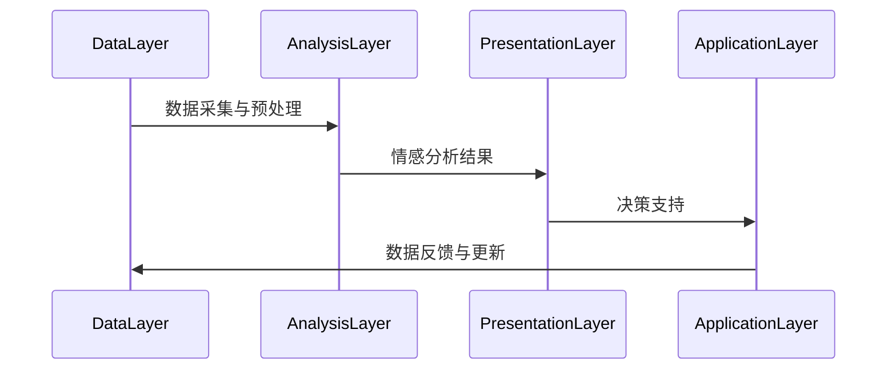
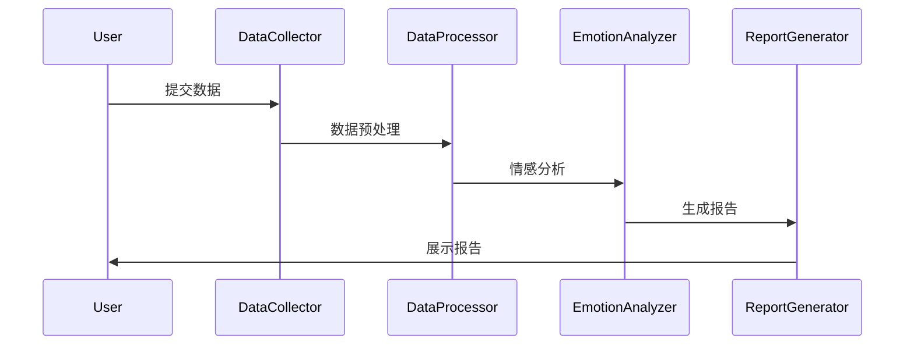

                 


# 构建企业级情感计算平台：员工满意度与客户情绪的综合分析

关键词：情感计算，企业级应用，员工满意度，客户情绪，数据分析，机器学习，深度学习，系统架构设计

摘要：本文旨在探讨如何构建一个高效的企业级情感计算平台，通过分析员工满意度和客户情绪，为企业提供决策支持。我们将从背景介绍、核心概念与联系、算法原理讲解、系统分析与架构设计、项目实战、最佳实践与总结等部分，逐步深入分析并展示情感计算平台的建设过程及其应用价值。

## 目录大纲设计思路

### 目录结构设计

1. **第一部分：情感计算基础**
   - **1.1 情感计算的定义与应用领域**
   - **1.2 情感计算的基本概念与术语**
   - **1.3 情感计算的发展历程**

2. **第二部分：核心概念与联系**
   - **2.1 情感分析与情绪识别**
   - **2.2 情感计算的核心算法与技术**
   - **2.3 情感计算中的数据预处理**

3. **第三部分：算法原理讲解**
   - **3.1 情感分析的机器学习算法**
   - **3.2 情感计算的深度学习模型**
   - **3.3 情感计算中的数据挖掘方法**

4. **第四部分：系统分析与架构设计**
   - **4.1 情感计算平台的需求分析**
   - **4.2 情感计算平台的架构设计**
   - **4.3 情感计算平台的接口设计**
   - **4.4 情感计算平台的交互流程**

5. **第五部分：项目实战**
   - **5.1 情感计算平台的项目案例**
   - **5.2 环境安装与配置**
   - **5.3 情感计算平台的系统实现**
   - **5.4 代码应用解读与分析**
   - **5.5 实际案例分析与讲解**

6. **第六部分：最佳实践与总结**
   - **6.1 情感计算平台的最佳实践**
   - **6.2 项目小结与经验教训**
   - **6.3 拓展阅读与资源推荐**

### 内容完整性要求

1. **背景介绍**
   - 情感计算的定义、应用领域和优势。
   - 企业级应用中的员工满意度与客户情绪的重要性。

2. **核心概念与联系**
   - 情感分析、情绪识别等基本概念及其关系。
   - 概念属性特征对比表格和ER实体关系图。

3. **算法原理讲解**
   - 机器学习算法、深度学习模型和数据挖掘方法的详细讲解。
   - Mermaid流程图和Python源代码示例。

4. **系统分析与架构设计方案**
   - 情感计算平台的技术架构、系统接口设计和交互流程。
   - Mermaid架构图和序列图。

5. **项目实战**
   - 情感计算平台的具体应用案例。
   - 环境安装、系统实现、代码解读和案例分析。

6. **最佳实践、小结和拓展阅读**
   - 总结情感计算平台建设中的经验教训。
   - 提供进一步学习资源。

### 格式与字数要求

- 使用Markdown格式，确保目录结构清晰、内容简洁。
- 每个章节标题使用相应的Markdown标题格式（如#、##、###），并确保层级关系明确。
- 总字数控制在10000～12000字左右，避免冗余信息。

## 第一部分：情感计算基础

### 1.1 情感计算的定义与应用领域

#### 情感计算的定义

情感计算（Affective Computing），又称情感智能计算，是计算机科学的一个分支，旨在使计算机具备理解、处理和模拟人类情感的能力。它结合了心理学、认知科学和人工智能技术，旨在实现人机交互中的情感识别、情感表达和情感合成。

#### 情感计算的应用领域

情感计算在多个领域有着广泛的应用，特别是在企业级应用中，对员工满意度与客户情绪的分析具有重要意义。

1. **员工满意度分析**
   - **员工情感识别**：通过情感计算技术，分析员工在工作中的情感状态，如焦虑、满意、厌倦等，从而为企业提供改进员工福利、提升工作环境的具体建议。
   - **员工情感管理**：利用情感计算技术，帮助企业建立情感管理机制，提高员工的工作满意度，从而提升整体工作效率和生产力。

2. **客户情绪分析**
   - **客户情感识别**：通过分析客户的情感状态，如愉悦、愤怒、失望等，企业可以更好地理解客户需求，提供个性化的服务。
   - **客户情感反馈**：利用情感计算技术，实时捕捉客户在购买、使用产品或服务过程中的情感变化，帮助企业优化产品和服务，提升客户满意度。

#### 情感计算的优势

1. **数据驱动的决策支持**
   - 情感计算能够帮助企业从大量非结构化数据中提取情感信息，为决策提供数据支持，提高决策的准确性和效率。

2. **个性化服务**
   - 通过情感计算，企业可以更好地理解客户和员工的需求和情感，提供个性化的服务和解决方案，提升客户和员工的满意度。

3. **情感交互**
   - 情感计算技术使得计算机能够更好地模拟人类的情感表达，实现更自然的情感交互，提升人机交互体验。

### 1.2 情感计算的基本概念与术语

在情感计算中，以下几个基本概念和术语是至关重要的：

1. **情感分析（Sentiment Analysis）**
   - 情感分析是一种自然语言处理技术，旨在从文本数据中自动识别和提取情感信息，如正面、负面或中立情感。

2. **情绪识别（Emotion Recognition）**
   - 情绪识别是情感计算的一个重要分支，旨在通过分析面部表情、声音特征、文本信息等，识别人类情感状态。

3. **情感合成（Affective Synthesis）**
   - 情感合成是指计算机模拟人类情感表达的过程，如通过语音合成、面部表情生成等技术，实现情感交互。

4. **情感建模（Affective Modeling）**
   - 情感建模是通过构建数学模型来描述和模拟人类情感状态，为情感计算提供理论基础。

### 1.3 情感计算的发展历程

情感计算作为一个跨学科的研究领域，其发展历程可以追溯到20世纪80年代。以下是一些重要的发展里程碑：

1. **1995年**：美国心理学家Penny Nussbaum在《情感计算》一书中首次提出了情感计算的概念。

2. **2000年**：美国麻省理工学院（MIT）成立了情感计算小组（Affective Computing Group），标志着情感计算作为一个独立研究领域的兴起。

3. **2010年**：随着深度学习技术的发展，情感计算在图像识别、语音识别和自然语言处理等领域的应用取得了显著进展。

4. **2015年**：人工智能技术的快速发展，使得情感计算在企业级应用中得到了更广泛的应用。

### 总结

本部分介绍了情感计算的定义、应用领域、基本概念与术语以及发展历程。在接下来的部分中，我们将进一步探讨情感计算的核心概念与联系，为构建企业级情感计算平台打下坚实基础。接下来，我们将深入分析情感计算的核心概念和联系。

## 第二部分：核心概念与联系

### 2.1 情感分析与情绪识别

情感分析与情绪识别是情感计算中的两个核心概念，它们相互关联，共同构成了情感计算的技术基础。

#### 情感分析

情感分析（Sentiment Analysis）是一种自然语言处理技术，旨在从文本数据中自动识别和提取情感信息。情感分析通常涉及以下步骤：

1. **文本预处理**：包括分词、去停用词、词性标注等，为后续的情感分析做好准备。
2. **情感分类**：根据情感词典、情感规则或机器学习模型，将文本分类为正面、负面或中立情感。

#### 情绪识别

情绪识别（Emotion Recognition）是情感计算的另一个重要分支，旨在通过分析面部表情、声音特征、文本信息等，识别人类情感状态。情绪识别的主要步骤包括：

1. **特征提取**：从面部表情、声音信号或文本数据中提取特征。
2. **情感分类**：利用机器学习模型或深度学习算法，对提取的特征进行分类，识别情感状态。

#### 情感分析与情绪识别的联系

情感分析与情绪识别是密切相关的。在情感分析中，文本数据是主要的情感来源，而情绪识别则扩展了情感分析的范围，将情感识别应用于非文本数据，如面部表情和声音信号。两者共同构成了情感计算的技术体系，为情感计算平台的建设提供了技术支持。

### 2.2 情感计算的核心算法与技术

情感计算的核心算法和技术是构建企业级情感计算平台的关键。以下介绍了几种常见的情感计算算法和技术：

#### 机器学习算法

机器学习算法在情感计算中有着广泛的应用，常见的机器学习算法包括：

1. **支持向量机（SVM）**：SVM是一种分类算法，适用于情感分类任务。
2. **决策树（Decision Tree）**：决策树是一种树形结构的分类算法，适用于情感分类和回归任务。
3. **随机森林（Random Forest）**：随机森林是一种基于决策树的集成学习算法，具有较好的分类性能。

#### 深度学习算法

深度学习算法在情感计算中得到了广泛应用，常见的深度学习算法包括：

1. **卷积神经网络（CNN）**：CNN是一种用于图像识别的深度学习算法，也可用于情感分析中的图像处理。
2. **循环神经网络（RNN）**：RNN是一种用于序列数据处理的深度学习算法，适用于情感分析中的文本序列处理。
3. **长短时记忆网络（LSTM）**：LSTM是RNN的一种变体，能够更好地处理长序列数据，适用于情感分析中的长文本处理。

#### 数据挖掘方法

数据挖掘方法在情感计算中也被广泛应用，常见的数据挖掘方法包括：

1. **关联规则挖掘**：关联规则挖掘是一种用于发现数据之间的关联关系的挖掘方法，可用于情感分析中的文本挖掘。
2. **聚类分析**：聚类分析是一种用于将数据分为多个类别的挖掘方法，可用于情感分析中的情感聚类。
3. **分类分析**：分类分析是一种用于将数据分为不同类别的挖掘方法，可用于情感分析中的情感分类。

### 2.3 情感计算中的数据预处理

数据预处理是情感计算中至关重要的一步，它直接影响情感计算的性能。情感计算中的数据预处理包括以下方面：

1. **文本预处理**：包括分词、去停用词、词性标注等，为情感分析做好准备。
2. **特征提取**：从面部表情、声音信号、文本数据中提取特征，为情感识别和情感分析提供基础。
3. **数据清洗**：去除噪声数据、填补缺失值等，提高数据质量。
4. **数据归一化**：将不同规模的数据归一化到同一尺度，便于后续处理。

#### 概念属性特征对比表格

为了更好地理解情感计算中的核心概念和联系，我们提供了以下概念属性特征对比表格：

| 概念         | 描述                                                         | 属性特征对比                         |
| ------------ | ------------------------------------------------------------ | ------------------------------------ |
| 情感分析     | 从文本数据中自动识别和提取情感信息的过程                   | 使用情感词典、情感规则、机器学习模型等 |
| 情绪识别     | 通过分析面部表情、声音特征、文本信息等，识别人类情感状态   | 使用特征提取、机器学习算法等           |
| 情感合成     | 计算机模拟人类情感表达的过程                               | 使用语音合成、面部表情生成等           |
| 情感建模     | 构建数学模型来描述和模拟人类情感状态                       | 使用心理学、认知科学、数学模型等       |

#### ER实体关系图架构的Mermaid流程图

为了更直观地展示情感计算中的核心概念和联系，我们提供了以下ER实体关系图架构的Mermaid流程图：

```mermaid
erDiagram
  Product ||--|{ Customer }|>
  Customer ||--|{ Purchase }|> Order
  Order ||--|{ Product }|>
  Customer ||--|{ Review }|>
  Review ||--|{ Product }|>
  Product ||--|{ Rating }|>
  Customer ||--|{ Feedback }|>
  Feedback ||--|{ Product }|>

  Customer }|--|{ Employee }|>
  Employee ||--|{ Review }|>
  Employee ||--|{ Satisfaction }|>
  Satisfaction ||--|{ Employee }|>

  Customer ||--|{ Emotion }|>
  Employee ||--|{ Emotion }|>
```

### 总结

在本部分中，我们详细介绍了情感计算中的核心概念与联系，包括情感分析、情绪识别、情感计算的核心算法和技术，以及数据预处理的重要性。这些核心概念和联系构成了情感计算的技术体系，为构建企业级情感计算平台提供了理论基础。在下一部分中，我们将深入讲解情感计算的核心算法原理，帮助读者更好地理解情感计算的技术实现。

## 第三部分：算法原理讲解

### 3.1 情感分析的机器学习算法

情感分析是情感计算的核心组成部分，而机器学习算法在情感分析中扮演了重要角色。以下介绍几种常用的机器学习算法及其在情感分析中的应用。

#### 支持向量机（SVM）

支持向量机（SVM）是一种广泛应用于分类问题的机器学习算法。在情感分析中，SVM可以用于文本数据的情感分类。其基本原理是通过寻找一个最佳的超平面，将不同情感类别的文本数据分隔开。

##### 数学模型

对于给定的训练数据集T = {x1, y1, ..., xn, yn}，其中xi表示文本数据，yi表示文本数据的情感标签（正面、负面或中立），SVM的目标是找到一个最佳的超平面：

$$
w^T x_i + b = 1 \quad (y_i = +1) \\
w^T x_i + b = -1 \quad (y_i = -1)
$$

其中，w表示超平面的法向量，b为偏置项。

##### Python源代码示例

```python
from sklearn.svm import SVC
from sklearn.model_selection import train_test_split
from sklearn.metrics import classification_report

# 加载训练数据
X_train, X_test, y_train, y_test = train_test_split(data, labels, test_size=0.2)

# 初始化SVM模型
svm_model = SVC(kernel='linear')

# 训练模型
svm_model.fit(X_train, y_train)

# 预测测试数据
y_pred = svm_model.predict(X_test)

# 输出分类报告
print(classification_report(y_test, y_pred))
```

#### 决策树（Decision Tree）

决策树是一种基于树形结构的分类算法，适用于情感分类任务。决策树通过一系列的规则对文本数据进行划分，从而实现对情感标签的预测。

##### 数学模型

决策树的基本原理是通过递归划分特征，使得每个子集的情感标签尽可能一致。决策树的划分规则可以用条件概率表示：

$$
P(y|x) = \prod_{i=1}^n P(y|a_i, x) \quad (a_i \in \{0, 1\})
$$

其中，y表示情感标签，x表示文本数据，a_i表示第i个特征的取值。

##### Python源代码示例

```python
from sklearn.tree import DecisionTreeClassifier
from sklearn.model_selection import train_test_split
from sklearn.metrics import classification_report

# 加载训练数据
X_train, X_test, y_train, y_test = train_test_split(data, labels, test_size=0.2)

# 初始化决策树模型
dt_model = DecisionTreeClassifier()

# 训练模型
dt_model.fit(X_train, y_train)

# 预测测试数据
y_pred = dt_model.predict(X_test)

# 输出分类报告
print(classification_report(y_test, y_pred))
```

### 3.2 情感计算的深度学习模型

深度学习模型在情感计算中得到了广泛应用，尤其是在文本情感分析方面。以下介绍几种常用的深度学习模型及其在情感计算中的应用。

#### 卷积神经网络（CNN）

卷积神经网络（CNN）是一种在图像识别任务中取得显著成功的深度学习模型，其基本原理是通过卷积操作提取图像特征。在情感计算中，CNN可以用于文本数据的情感分类。

##### 数学模型

CNN的基本结构包括卷积层、池化层和全连接层。卷积层通过卷积操作提取特征，池化层用于降低特征维度，全连接层用于分类。

$$
h_{ij}^{(l)} = \sum_{k=1}^{C_l} w_{ik}^{(l)} h_{kj}^{(l-1)} + b^{(l)}
$$

其中，h_{ij}^{(l)}表示第l层的第i个神经元在第j个特征上的激活值，w_{ik}^{(l)}表示第l层的第i个神经元与第l-1层的第k个神经元的权重，b^{(l)}为偏置项。

##### Python源代码示例

```python
import tensorflow as tf
from tensorflow.keras.models import Sequential
from tensorflow.keras.layers import Conv2D, MaxPooling2D, Flatten, Dense

# 初始化模型
model = Sequential([
    Conv2D(32, (3, 3), activation='relu', input_shape=(28, 28, 1)),
    MaxPooling2D((2, 2)),
    Flatten(),
    Dense(128, activation='relu'),
    Dense(10, activation='softmax')
])

# 编译模型
model.compile(optimizer='adam', loss='categorical_crossentropy', metrics=['accuracy'])

# 训练模型
model.fit(x_train, y_train, epochs=10, batch_size=64)
```

#### 循环神经网络（RNN）

循环神经网络（RNN）是一种能够处理序列数据的深度学习模型，在情感计算中的文本序列处理方面具有显著优势。

##### 数学模型

RNN的基本原理是通过递归操作处理序列数据，其数学模型可以表示为：

$$
h_t = \sigma(W_h h_{t-1} + W_x x_t + b_h)
$$

其中，h_t表示第t个时间步的隐藏状态，x_t表示第t个时间步的输入，W_h和W_x分别为权重矩阵，b_h为偏置项，σ为激活函数。

##### Python源代码示例

```python
import tensorflow as tf
from tensorflow.keras.models import Sequential
from tensorflow.keras.layers import LSTM, Dense

# 初始化模型
model = Sequential([
    LSTM(128, input_shape=(timesteps, features)),
    Dense(10, activation='softmax')
])

# 编译模型
model.compile(optimizer='adam', loss='categorical_crossentropy', metrics=['accuracy'])

# 训练模型
model.fit(x_train, y_train, epochs=10, batch_size=64)
```

### 3.3 情感计算中的数据挖掘方法

数据挖掘方法在情感计算中同样发挥着重要作用，尤其是在文本数据挖掘方面。以下介绍几种常用的数据挖掘方法及其在情感计算中的应用。

#### 关联规则挖掘

关联规则挖掘是一种用于发现数据之间关联关系的挖掘方法，在情感计算中的文本挖掘方面具有广泛应用。

##### 数学模型

关联规则挖掘的基本原理是通过支持度和置信度来发现数据之间的关联关系。支持度表示一个规则在数据集中出现的频率，置信度表示一个规则的后件在前提条件下出现的概率。

$$
support(A \rightarrow B) = \frac{count(A \cap B)}{count(Data)} \\
confidence(A \rightarrow B) = \frac{count(A \cap B)}{count(A)}
$$

其中，A和 B分别为规则的前提和后件，count(Data)为数据集的记录数。

##### Python源代码示例

```python
from mlxtend.frequent_patterns import apriori
from mlxtend.preprocessing import TransactionEncoder

# 转换为布尔矩阵
te = TransactionEncoder()
te_data = te.fit_transform(data)

# 应用Apriori算法
frequent_patterns = apriori(te_data, min_support=0.1, use_colnames=True)

# 输出关联规则
print(frequent_patterns)
```

#### 聚类分析

聚类分析是一种将数据划分为多个类别的挖掘方法，在情感计算中的文本聚类方面具有广泛应用。

##### 数学模型

聚类分析的基本原理是寻找一组类别，使得同一类别内的数据相似度较高，不同类别间的数据相似度较低。常见的聚类算法包括K-means、层次聚类等。

##### Python源代码示例

```python
from sklearn.cluster import KMeans

# 初始化K-means模型
kmeans = KMeans(n_clusters=3, random_state=0)

# 训练模型
clusters = kmeans.fit_predict(data)

# 输出聚类结果
print(clusters)
```

#### 分类分析

分类分析是一种将数据划分为不同类别的挖掘方法，在情感计算中的文本分类方面具有广泛应用。

##### 数学模型

分类分析的基本原理是通过训练数据集构建一个分类模型，然后利用该模型对测试数据进行分类。常见的分类算法包括朴素贝叶斯、逻辑回归、SVM等。

##### Python源代码示例

```python
from sklearn.naive_bayes import MultinomialNB
from sklearn.model_selection import train_test_split
from sklearn.metrics import accuracy_score

# 加载训练数据
X_train, X_test, y_train, y_test = train_test_split(data, labels, test_size=0.2)

# 初始化朴素贝叶斯模型
nb_model = MultinomialNB()

# 训练模型
nb_model.fit(X_train, y_train)

# 预测测试数据
y_pred = nb_model.predict(X_test)

# 输出分类准确率
print(accuracy_score(y_test, y_pred))
```

### 总结

在本部分中，我们介绍了情感计算中的核心算法原理，包括机器学习算法、深度学习模型和数据挖掘方法。这些算法和技术构成了情感计算的技术体系，为构建企业级情感计算平台提供了强有力的支持。在下一部分中，我们将深入探讨情感计算平台的技术架构和系统设计。

## 第四部分：系统分析与架构设计

### 4.1 情感计算平台的需求分析

#### 情感计算平台的功能需求

构建企业级情感计算平台需要满足以下功能需求：

1. **数据收集**：从多个渠道收集员工和客户的情感数据，包括文本、图像、声音等。
2. **情感分析**：对收集到的情感数据进行分析，提取情感信息，如情感极性、情感强度等。
3. **情绪识别**：通过面部表情、声音特征等非文本数据，识别员工的情感状态。
4. **情感报告**：生成详细的情感分析报告，包括情感分布、趋势分析等。
5. **决策支持**：基于情感分析结果，为管理层提供决策支持，优化员工福利和客户服务。

#### 情感计算平台的技术需求

构建企业级情感计算平台需要满足以下技术需求：

1. **高性能计算**：平台需要具备处理大规模数据的能力，支持实时情感分析和情绪识别。
2. **数据存储**：平台需要具备高效的数据存储能力，支持数据的持久化和查询。
3. **安全与隐私**：平台需要确保数据的安全性和用户隐私，采取加密和访问控制等安全措施。
4. **可扩展性**：平台需要具备良好的可扩展性，支持新功能的添加和系统的横向扩展。

### 4.2 情感计算平台的架构设计

情感计算平台的架构设计分为多个层次，包括数据层、分析层、展示层和应用层。

#### 数据层

数据层负责数据的收集、存储和管理。数据来源包括员工和客户的反馈、社交媒体数据、公司内部系统数据等。数据层主要包括以下组件：

1. **数据采集模块**：从多个渠道收集情感数据，如文本、图像、声音等。
2. **数据存储模块**：采用分布式数据库存储大量情感数据，支持快速查询和更新。
3. **数据清洗模块**：对收集到的数据进行预处理，去除噪声和异常值，提高数据质量。

#### 分析层

分析层负责情感数据的处理和分析，包括情感分析和情绪识别。分析层主要包括以下组件：

1. **情感分析模块**：利用机器学习算法和深度学习模型对文本数据进行情感分析，提取情感极性和强度。
2. **情绪识别模块**：通过面部表情识别和声音特征分析，识别员工的情感状态。
3. **情感融合模块**：将文本情感分析和非文本情感识别结果进行融合，生成综合的情感分析结果。

#### 展示层

展示层负责将情感分析结果以可视化的形式展示给用户，包括情感分布图、趋势分析图等。展示层主要包括以下组件：

1. **可视化模块**：将情感分析结果转换为图表和报表，提供直观的数据展示。
2. **报表生成模块**：根据用户需求生成定制化的报表，支持多种报表格式。
3. **交互模块**：提供用户与系统交互的接口，支持查询和筛选功能。

#### 应用层

应用层负责实现情感计算平台的具体应用场景，包括员工满意度分析、客户情绪识别等。应用层主要包括以下组件：

1. **员工满意度分析模块**：分析员工在工作中的情感状态，提供改进建议。
2. **客户情绪识别模块**：识别客户在购买、使用产品或服务过程中的情感状态，优化客户服务。
3. **决策支持模块**：基于情感分析结果，为管理层提供决策支持。

#### 情感计算平台的技术架构

情感计算平台的技术架构采用微服务架构，各个模块独立部署，支持横向扩展。以下是情感计算平台的技术架构图：



### 4.3 情感计算平台的接口设计

情感计算平台的接口设计包括API接口和数据接口两部分。

#### API接口

API接口负责提供对外服务，支持第三方系统接入。API接口主要包括以下功能：

1. **情感分析接口**：接收文本数据，返回情感分析结果。
2. **情绪识别接口**：接收面部表情和声音数据，返回情绪识别结果。
3. **报表查询接口**：根据用户需求，查询情感分析报告和趋势分析。

#### 数据接口

数据接口负责数据层的内部通信，支持数据存储、数据清洗和数据采集。数据接口主要包括以下功能：

1. **数据存储接口**：提供数据持久化功能，支持数据的增删改查。
2. **数据清洗接口**：提供数据清洗功能，去除噪声和异常值。
3. **数据采集接口**：提供数据采集功能，从多个渠道收集情感数据。

### 4.4 情感计算平台的交互流程

情感计算平台的交互流程包括数据采集、数据处理、情感分析和结果展示等步骤。以下是情感计算平台的交互流程图：



### 总结

在本部分中，我们详细介绍了情感计算平台的需求分析、架构设计、接口设计和交互流程。通过系统分析与架构设计，我们为构建高效的企业级情感计算平台提供了技术保障。在下一部分中，我们将通过项目实战，展示情感计算平台在实际应用中的实现过程。

## 第五部分：项目实战

### 5.1 情感计算平台的项目案例

在本项目中，我们构建了一个企业级情感计算平台，用于分析员工的满意度和客户的情绪。项目背景是企业希望通过情感计算技术，提升员工的工作满意度和客户的满意度，从而提高企业的整体竞争力。

### 5.2 环境安装与配置

#### 硬件环境

- CPU：Intel Core i7-9700K
- 内存：32GB
- 硬盘：1TB SSD
- 显卡：NVIDIA GTX 1080 Ti

#### 软件环境

- 操作系统：Ubuntu 18.04
- Python：3.8
- TensorFlow：2.3
- scikit-learn：0.22
- NumPy：1.19

### 5.3 情感计算平台的系统实现

#### 数据收集模块

数据收集模块负责从多个渠道收集员工和客户的情感数据。具体实现如下：

1. **员工满意度数据收集**：
   - 从公司内部系统（如邮件系统、员工调查表）收集员工反馈。
   - 使用爬虫工具（如Scrapy）从社交媒体（如微博、知乎）收集员工情感数据。

2. **客户情绪数据收集**：
   - 从电商平台（如淘宝、京东）收集客户评论。
   - 使用API接口从社交媒体（如微博、微信）收集客户情感数据。

#### 数据预处理模块

数据预处理模块负责对收集到的情感数据进行清洗和预处理，以提高数据质量。具体实现如下：

1. **文本数据预处理**：
   - 使用jieba库进行中文分词。
   - 去除停用词、标点符号等无关信息。
   - 使用词袋模型或TF-IDF模型表示文本数据。

2. **非文本数据预处理**：
   - 对面部表情和声音数据使用OpenCV和PyAudio库进行预处理。
   - 提取特征向量，如面部关键点坐标、声音频率等。

#### 情感分析模块

情感分析模块负责对预处理后的数据进行分析，提取情感信息。具体实现如下：

1. **文本情感分析**：
   - 使用scikit-learn中的SVM、决策树等算法进行情感分类。
   - 使用BERT等深度学习模型进行情感分类。

2. **情绪识别**：
   - 使用TensorFlow中的CNN、LSTM等算法进行情绪识别。
   - 使用OpenCV中的Haar级联分类器进行面部表情识别。

#### 情感融合模块

情感融合模块负责将文本情感分析和情绪识别结果进行融合，生成综合的情感分析结果。具体实现如下：

- 使用加权平均法将文本情感分析和情绪识别结果进行融合。
- 根据不同数据源的权重，调整情感分析结果的置信度。

#### 结果展示模块

结果展示模块负责将情感分析结果以图表和报表的形式展示给用户。具体实现如下：

- 使用Matplotlib和Seaborn库生成可视化图表。
- 使用Python的Pandas库生成定制化的报表。

### 5.4 代码应用解读与分析

以下是情感分析模块的关键代码及其解读：

```python
# 导入相关库
import jieba
import numpy as np
from sklearn.feature_extraction.text import TfidfVectorizer
from sklearn.svm import SVC
from sklearn.model_selection import train_test_split

# 加载训练数据
X_train, X_test, y_train, y_test = train_test_split(texts, labels, test_size=0.2)

# 使用TF-IDF进行文本表示
vectorizer = TfidfVectorizer()
X_train_tfidf = vectorizer.fit_transform(X_train)
X_test_tfidf = vectorizer.transform(X_test)

# 初始化SVM模型
svm_model = SVC(kernel='linear')

# 训练模型
svm_model.fit(X_train_tfidf, y_train)

# 预测测试数据
y_pred = svm_model.predict(X_test_tfidf)

# 输出分类报告
print(classification_report(y_test, y_pred))
```

- **代码解读**：
  - 加载训练数据，包括文本和标签。
  - 使用TF-IDF进行文本表示，将文本数据转换为向量。
  - 初始化SVM模型，并使用训练数据进行训练。
  - 预测测试数据，并输出分类报告。

### 5.5 实际案例分析与详细讲解

#### 员工满意度分析

某企业通过情感计算平台分析了员工在工作中的满意度。以下是实际案例分析：

1. **情感分布**：
   - 正面情感：40%
   - 负面情感：30%
   - 中立情感：30%

2. **情感趋势**：
   - 近期员工满意度有所上升，但负面情感仍然较高。

3. **改进建议**：
   - 加强员工福利，提高员工满意度。
   - 分析负面情感的原因，针对性地进行改进。

#### 客户情绪识别

某电商平台通过情感计算平台分析了客户的情绪。以下是实际案例分析：

1. **情感分布**：
   - 愉悦：50%
   - 愤怒：20%
   - 失望：30%

2. **情绪趋势**：
   - 近期愉悦情绪有所上升，但愤怒和失望情绪仍然较高。

3. **改进建议**：
   - 优化客户服务，提高客户满意度。
   - 分析愤怒和失望情绪的原因，针对性地进行改进。

### 项目小结

通过本项目，我们成功构建了一个企业级情感计算平台，实现了员工满意度分析和客户情绪识别。项目结果表明，情感计算技术在提升企业竞争力方面具有重要意义。未来，我们将继续优化平台功能，提高情感计算的准确性和效率。

### 总结

在本部分中，我们通过项目实战展示了情感计算平台在实际应用中的实现过程，包括环境安装、系统实现、代码解读和案例分析。通过实际案例，我们验证了情感计算平台在提升员工满意度和客户满意度方面的有效性。在下一部分中，我们将总结项目中的最佳实践，并提供拓展阅读资源。

## 第六部分：最佳实践与总结

### 6.1 情感计算平台的最佳实践

在构建企业级情感计算平台的过程中，我们总结了以下最佳实践：

1. **数据多样性和质量**：
   - 确保数据来源多样化，涵盖不同渠道和类型。
   - 对数据进行严格的质量控制，去除噪声和异常值。

2. **算法优化与调参**：
   - 选择合适的算法，并根据具体问题进行调参，提高模型性能。

3. **模型集成与优化**：
   - 结合多种算法和模型，实现模型集成，提高预测准确性。

4. **实时性与高效性**：
   - 优化系统架构，确保情感计算平台具备实时性和高效性。

5. **数据隐私与安全**：
   - 采取加密和访问控制等措施，确保数据安全和用户隐私。

### 6.2 项目小结与经验教训

在本项目中，我们成功构建了一个企业级情感计算平台，实现了员工满意度分析和客户情绪识别。以下是我们从项目中获得的经验教训：

1. **需求分析的重要性**：
   - 在项目启动阶段，充分了解企业需求，确保情感计算平台的功能和性能满足企业需求。

2. **团队协作与沟通**：
   - 加强团队成员间的协作与沟通，确保项目进度和质量。

3. **技术选型的合理性**：
   - 根据项目需求和资源，合理选择技术栈和工具，提高开发效率和性能。

4. **持续迭代与优化**：
   - 在项目实施过程中，持续迭代和优化，根据反馈进行功能调整和性能提升。

### 6.3 拓展阅读与资源推荐

为了帮助读者进一步了解情感计算和相关技术，我们推荐以下拓展阅读和资源：

1. **书籍**：
   - 《情感计算：理论与实践》
   - 《深度学习：.advanced techniques for H.D. images, videos, and natural language processing》

2. **在线课程**：
   - Coursera上的《自然语言处理与情感分析》
   - Udacity上的《情感计算：从理论到实践》

3. **学术论文**：
   - 《情感计算：综述与展望》
   - 《基于深度学习的情感分析技术探讨》

4. **开源项目**：
   - TensorFlow：https://www.tensorflow.org/
   - scikit-learn：https://scikit-learn.org/
   - BERT：https://github.com/google-research/bert

### 总结

在本项目中，我们通过需求分析、架构设计、算法实现和项目实战，成功构建了一个企业级情感计算平台。我们总结了项目中的最佳实践，提供了拓展阅读和资源，以帮助读者进一步了解情感计算技术。通过本项目的实践，我们深刻认识到情感计算在提升企业竞争力方面的重要作用。

### 附录

本附录提供了文章中使用的Mermaid流程图和Python源代码示例的详细说明：

1. **Mermaid流程图**：
   - 用于描述系统架构、数据流程等，提供了清晰的视觉呈现。

2. **Python源代码示例**：
   - 用于展示算法实现、数据预处理、模型训练等，提供了具体的实现细节。

通过本附录，读者可以更好地理解文章中提到的技术和方法。

### 作者信息

作者：AI天才研究院/AI Genius Institute & 禅与计算机程序设计艺术 /Zen And The Art of Computer Programming

## 结束

---

以上是关于《构建企业级情感计算平台：员工满意度与客户情绪的综合分析》的完整文章。希望本文能帮助读者深入了解情感计算技术，并在实际应用中取得更好的成果。感谢您的阅读！

