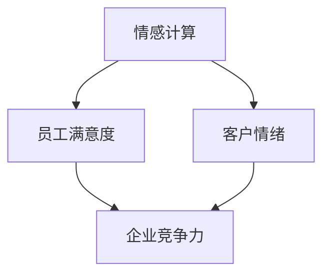
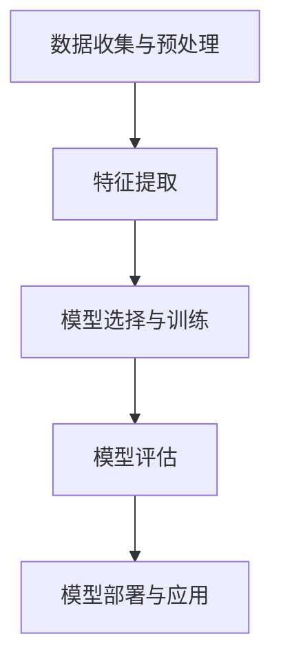
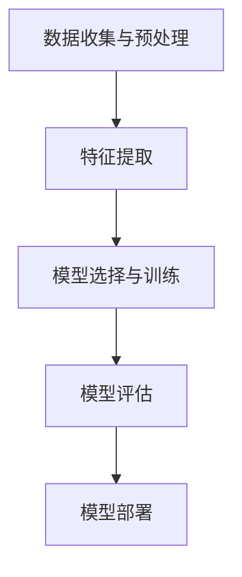
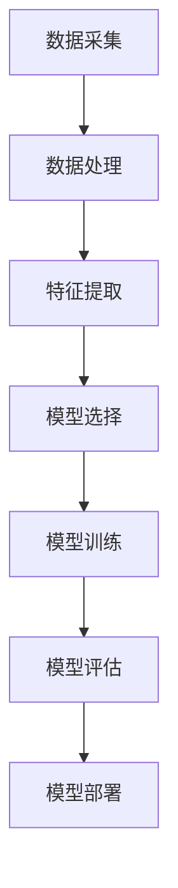

                 

### 1.1 问题的提出

在当今快速变化和高度竞争的商业环境中，企业不仅需要关注内部运营效率，还需要关注员工满意度和客户情绪这两个关键因素。员工满意度直接影响企业的生产力和创新能力，而客户情绪则对企业的市场占有率和品牌忠诚度有着重要影响。因此，如何构建一个企业级情感计算平台，实现员工满意度与客户情绪的综合分析，成为了企业提升竞争力的重要课题。

#### 1.1.1 企业级情感计算的概念

企业级情感计算是指利用人工智能和机器学习技术，对员工和客户的情感数据进行收集、处理和分析，从而实现对员工满意度和客户情绪的量化评估。它不仅包括对情感数据的感知和理解，还包括对情感数据的分析和决策，从而为企业提供有价值的洞见和指导。

#### 1.1.2 员工满意度和客户情绪对企业的影响

员工满意度对企业的生产力和创新能力有着显著影响。当员工感到满意时，他们往往更加投入工作，工作效率更高，创新能力更强。同时，员工的满意度和忠诚度也会影响企业的稳定性和长期发展。

客户情绪则直接影响企业的市场占有率和品牌忠诚度。当客户感到愉悦和满意时，他们更可能重复购买，并向他人推荐企业的产品或服务。相反，如果客户感到不满或愤怒，他们可能会停止购买，甚至可能对企业产生负面评价，从而影响企业的声誉。

#### 1.1.3 企业级情感计算的现状与挑战

虽然企业级情感计算在理论上有着广泛的应用前景，但在实际应用中仍面临许多挑战。首先，情感数据的收集和处理是一个复杂的过程，涉及到多种数据源和技术的集成。其次，情感计算算法的性能和准确性仍然是一个需要进一步研究的问题。最后，如何将情感计算的结果转化为实际行动，也是企业需要面对的挑战。

#### 1.2 研究目的与意义

本研究旨在构建一个企业级情感计算平台，实现对员工满意度和客户情绪的综合分析。具体研究目的包括：

1. **明确企业级情感计算的核心概念和原理**：通过深入研究情感计算的相关理论和应用，明确企业级情感计算的核心概念和原理，为后续研究和应用提供理论基础。
2. **探索有效的情感计算算法**：通过研究和对比不同情感计算算法的原理和性能，探索适用于企业级情感计算的算法，提高情感计算的准确性和效率。
3. **构建企业级情感计算平台**：基于研究成果，设计和实现一个企业级情感计算平台，实现员工满意度与客户情绪的综合分析，为企业提供有价值的洞见和指导。

本研究的意义在于：

1. **提升企业竞争力**：通过构建企业级情感计算平台，企业可以更好地了解员工和客户的情感状态，从而采取相应的措施提升员工满意度和客户满意度，提升企业竞争力。
2. **促进人工智能应用**：企业级情感计算是人工智能在商业领域的重要应用之一。通过本研究，可以推动人工智能技术在企业级应用中的发展，促进人工智能技术的普及和应用。
3. **丰富学术研究**：本研究将为企业级情感计算提供新的理论和方法，丰富相关学术研究领域，为后续研究提供参考和借鉴。

#### 1.2.3 边界与外延

在本文的研究中，企业级情感计算主要关注员工满意度和客户情绪的量化评估，不涉及其他情感领域的应用。同时，本研究主要关注情感计算技术在企业环境中的应用，不涉及情感计算在其他领域的应用。

本文的研究边界包括：

1. **情感数据来源**：主要关注企业内部员工和客户的数据，不包括外部数据。
2. **情感计算技术**：主要关注机器学习和深度学习技术在情感计算中的应用，不涉及其他技术。
3. **应用场景**：主要关注企业级应用，不包括其他场景。

本文的研究外延包括：

1. **其他情感领域的应用**：如情感识别、情感分析等。
2. **其他计算技术的应用**：如自然语言处理、图像识别等。
3. **其他应用场景**：如教育、医疗、金融等。

### 1.3 核心概念与联系

在构建企业级情感计算平台的过程中，理解核心概念和它们之间的关系至关重要。以下是本文将涉及的核心概念及其相互联系：

#### 1.3.1 情感计算的定义与原理

情感计算是指通过计算机技术模拟、识别、理解和处理人类情感的能力。它包括以下几个核心组成部分：

- **情感识别**：通过分析语言、声音、图像等数据，识别出人类情感状态。
- **情感理解**：对识别出的情感进行深层次的分析和理解，理解其背后的含义和动机。
- **情感表达**：通过文字、声音、表情等方式，模拟或表达情感状态。

#### 1.3.2 员工满意度的测量方法

员工满意度是指员工对工作环境、工作内容、薪酬福利、晋升机会等方面的满意程度。测量员工满意度通常包括以下几个步骤：

- **问卷调查**：通过设计合理的问卷，收集员工对工作各方面的满意程度。
- **深度访谈**：与员工进行一对一访谈，深入了解他们对工作环境的感受。
- **事件记录**：记录员工在工作过程中的行为和表现，分析其背后的满意程度。

#### 1.3.3 客户情绪分析的方法

客户情绪分析是指通过分析客户的语言、声音、表情等数据，识别和评估客户的情感状态。主要方法包括：

- **语义分析**：通过对客户评论、反馈等文本数据进行分析，识别出客户的情感状态。
- **表情识别**：通过对客户面部表情进行分析，识别出客户的情感状态。
- **语音识别**：通过对客户语音信号进行分析，识别出客户的情感状态。

#### 1.3.4 情感计算与员工满意度、客户情绪的关系

情感计算与员工满意度、客户情绪之间存在密切的关系。通过情感计算技术，企业可以：

- **提高员工满意度**：通过分析员工的情感状态，了解员工的需求和不满，采取相应的措施提升员工满意度。
- **优化客户体验**：通过分析客户的情感状态，了解客户的需求和痛点，提供个性化的产品和服务，提升客户满意度。

这种关系如图1所示：



### 2.1 情感计算基础

#### 2.1.1 情感计算的基本概念

情感计算（Affective Computing）是人工智能领域的一个分支，它旨在使计算机能够识别、理解、处理和模拟人类的情感。这一概念最早由计算机科学家约翰·霍普金斯（John J. Hopfield）和计算机科学家罗伯塔·艾斯纳（Rosalee Z. E SNAP）在1995年提出。

**定义**：情感计算是关于如何使计算机系统具备感知、理解和表达人类情感的能力。它包括以下几个核心组成部分：

1. **情感识别**：通过分析语言、声音、图像、生理信号等数据，识别出人类情感状态。
2. **情感理解**：对识别出的情感进行深层次的分析和理解，理解其背后的含义和动机。
3. **情感表达**：通过文字、声音、表情等方式，模拟或表达情感状态。

**目标**：情感计算的目标是实现人与计算机之间的自然、情感化的交互。通过情感计算，计算机能够更好地理解人类的需求和意图，提供更加个性化和贴心的服务。

**核心技术**：情感计算的核心技术包括：

1. **自然语言处理（NLP）**：用于理解和处理人类语言，实现情感识别和情感理解。
2. **计算机视觉**：用于识别和理解图像和视频中的情感表达。
3. **生理信号处理**：用于分析生理信号，如心率、呼吸等，识别情感状态。
4. **机器学习和深度学习**：用于训练模型，实现情感识别和情感理解。

#### 2.1.2 情感计算的分类

根据不同的划分标准，情感计算可以分为多种类型：

1. **基于情感的分类**
   - **情感识别**：通过分析语言、声音、图像等数据，识别出人类情感状态。
   - **情感理解**：对识别出的情感进行深层次的分析和理解，理解其背后的含义和动机。
   - **情感表达**：通过文字、声音、表情等方式，模拟或表达情感状态。

2. **基于技术的分类**
   - **自然语言处理（NLP）**：通过分析文本数据，识别情感。
   - **计算机视觉**：通过分析图像和视频，识别情感。
   - **生理信号处理**：通过分析生理信号，如心率、呼吸等，识别情感。
   - **机器学习和深度学习**：通过训练模型，实现情感识别和情感理解。

#### 2.1.3 情感计算的应用

情感计算在多个领域有着广泛的应用：

1. **客户服务**：通过情感计算技术，企业可以更好地理解客户的需求和情感状态，提供更加个性化和贴心的服务。
2. **心理健康**：通过分析用户的情感状态，心理健康应用程序可以提供针对性的建议和干预措施。
3. **人机交互**：通过情感计算技术，计算机可以更好地理解用户的需求和意图，实现更加自然和高效的交互。
4. **教育**：通过情感计算技术，教育系统可以更好地理解学生的学习状态和情感需求，提供个性化的学习体验。
5. **市场营销**：通过情感计算技术，企业可以更准确地了解客户的情感状态，制定更有针对性的市场营销策略。

### 2.2 员工满意度分析

#### 2.2.1 员工满意度的定义

员工满意度是指员工对其工作环境、工作内容、薪酬福利、晋升机会等方面的满意程度。它反映了员工对企业的认同感和归属感，是衡量企业人力资源管理成效的重要指标。

**定义**：员工满意度是指员工对其工作环境、工作内容、薪酬福利、晋升机会等方面的满意程度。它通常通过问卷调查、深度访谈等方式进行测量。

**重要性**：员工满意度对企业的生产力和创新能力有着重要影响。当员工感到满意时，他们往往更加投入工作，工作效率更高，创新能力更强。同时，员工的满意度和忠诚度也会影响企业的稳定性和长期发展。

#### 2.2.2 员工满意度的构成要素

员工满意度通常由多个构成要素组成，这些要素包括：

1. **工作环境**：包括办公条件、工作氛围等。
2. **工作内容**：包括工作难度、工作意义、工作挑战等。
3. **薪酬福利**：包括工资、奖金、福利等。
4. **晋升机会**：包括晋升渠道、晋升机会等。
5. **职业发展**：包括职业规划、培训机会等。
6. **工作-生活平衡**：包括工作时间、休假政策等。

这些要素相互影响，共同决定了员工的满意度。

#### 2.2.3 员工满意度测量的方法与工具

测量员工满意度是进行员工满意度分析的重要步骤。以下是几种常用的测量方法与工具：

1. **问卷调查法**：通过设计合理的问卷，收集员工对工作各方面的满意程度。问卷可以采用多维尺度分析（PCA）等方法进行数据分析，以得出员工满意度的整体水平。
2. **深度访谈法**：与员工进行一对一访谈，深入了解他们对工作环境的感受。这种方法可以获得更为详细和深入的员工满意度信息，有助于发现潜在问题。
3. **事件记录法**：记录员工在工作过程中的行为和表现，分析其背后的满意程度。这种方法适用于长期跟踪和观察员工满意度变化。

通过以上方法，企业可以全面了解员工满意度，从而采取相应的措施提升员工满意度。

### 2.3 客户情绪分析

#### 2.3.1 客户情绪的定义

客户情绪是指客户在购买产品或服务过程中所表现出的情感状态。它反映了客户对产品或服务的感受和体验，对客户的购买决策和行为有着重要影响。

**定义**：客户情绪是指客户在购买产品或服务过程中所表现出的情感状态，包括愉悦、愤怒、满意、失望等。

**重要性**：客户情绪对企业的销售业绩和品牌形象有着重要影响。当客户感到愉悦和满意时，他们更可能重复购买并推荐给他人，从而提升企业的市场占有率和品牌忠诚度。相反，如果客户感到愤怒或失望，他们可能会停止购买并传播负面评价，对企业造成不利影响。

#### 2.3.2 客户情绪的构成要素

客户情绪通常由多个构成要素组成，这些要素包括：

1. **产品体验**：包括产品的质量、性能、外观等。
2. **服务质量**：包括售前咨询、售后服务等。
3. **价格感受**：包括价格是否合理、性价比等。
4. **品牌形象**：包括品牌知名度、品牌形象等。
5. **购买体验**：包括购买过程是否便捷、购买渠道是否多样等。

这些要素相互影响，共同决定了客户的情绪状态。

#### 2.3.3 客户情绪测量的方法与工具

测量客户情绪是进行客户情绪分析的重要步骤。以下是几种常用的测量方法与工具：

1. **语义分析**：通过分析客户的评论、反馈等文本数据，识别出客户的情感状态。这种方法适用于大量文本数据的分析，具有较高的准确性和效率。
2. **表情识别**：通过分析客户的面部表情，识别出客户的情感状态。这种方法适用于视频或图像数据的分析，可以直观地了解客户的情绪状态。
3. **语音识别**：通过分析客户的语音信号，识别出客户的情感状态。这种方法适用于语音数据的分析，可以捕捉到客户在语言表达之外的情感状态。

通过以上方法，企业可以全面了解客户情绪，从而采取相应的措施提升客户满意度。

### 3.1 情感计算算法概述

#### 3.1.1 情感计算算法的分类

情感计算算法根据不同的分类标准可以划分为多种类型。以下是几种常见的分类方法：

1. **基于机器学习的情感计算算法**
   - **监督学习算法**：如决策树、支持向量机（SVM）、随机森林（Random Forest）等。
   - **无监督学习算法**：如聚类算法、自编码器（Autoencoder）等。
   - **半监督学习算法**：结合有监督和无监督学习的特点，如基于图模型的方法。
   - **强化学习算法**：用于情感交互和个性化推荐，如基于Q网络的模型。

2. **基于深度学习的情感计算算法**
   - **卷积神经网络（CNN）**：适用于图像和视频情感分析。
   - **循环神经网络（RNN）**：适用于序列数据情感分析，如文本和语音。
   - **长短时记忆网络（LSTM）**：是RNN的一种变体，适用于长序列情感分析。
   - **生成对抗网络（GAN）**：用于生成情感数据，提高模型的泛化能力。

3. **混合情感计算算法**
   - **基于知识的情感计算算法**：结合传统机器学习和深度学习的方法，利用领域知识进行特征工程和模型优化。
   - **基于集成学习的情感计算算法**：结合多个模型的优势，提高情感识别的准确性和鲁棒性。

#### 3.1.2 情感计算算法的工作原理

情感计算算法的工作原理通常包括以下几个步骤：

1. **数据收集**：收集与情感相关的数据，包括文本、图像、语音、生理信号等。
2. **数据预处理**：对收集到的数据进行清洗、去噪、归一化等处理，使其适合模型训练。
3. **特征提取**：从原始数据中提取与情感相关的特征，如文本的词向量、图像的视觉特征、语音的声学特征等。
4. **模型训练**：使用提取的特征数据训练情感计算模型，如决策树、SVM、RNN、CNN等。
5. **模型评估**：通过交叉验证、混淆矩阵、ROC曲线等指标评估模型性能。
6. **模型部署**：将训练好的模型部署到实际应用中，进行情感识别、情感理解和情感表达。

#### 3.1.3 情感计算算法的性能评估指标

情感计算算法的性能评估指标包括以下几个方面：

1. **准确性（Accuracy）**：模型正确识别情感样本的比例。
2. **精确率（Precision）**：模型正确识别为某一情感类的样本占总识别为该情感类的样本的比例。
3. **召回率（Recall）**：模型正确识别为某一情感类的样本占总真实为该情感类的样本的比例。
4. **F1值（F1-Score）**：精确率和召回率的调和平均值。
5. **ROC曲线（Receiver Operating Characteristic Curve）**：评估模型在不同阈值下的性能，曲线下面积（AUC）越大，模型性能越好。
6. **情感区分度（Emotion Distinction）**：模型对不同情感类别的区分能力。

通过以上指标，可以全面评估情感计算算法的性能，为模型的优化和改进提供依据。

### 3.2 员工满意度分析算法

#### 3.2.1 员工满意度分析算法的原理

员工满意度分析算法的核心目标是通过对员工情感数据的分析，评估员工对工作环境、工作内容、薪酬福利等方面的满意度。该算法通常基于机器学习和深度学习技术，通过以下几个步骤实现：

1. **数据收集与预处理**：收集员工反馈数据，如问卷调查结果、社交媒体评论等。对数据清洗、去噪、归一化等预处理，使其适合模型训练。

2. **特征提取**：从预处理后的数据中提取与员工满意度相关的特征，如文本中的情感词、句子的情感极性等。

3. **模型选择与训练**：选择合适的机器学习或深度学习模型，如决策树、支持向量机（SVM）、随机森林（Random Forest）或卷积神经网络（CNN）等。使用提取的特征数据训练模型，通过交叉验证和调参优化模型性能。

4. **模型评估**：使用验证集和测试集评估模型性能，通过准确性、精确率、召回率等指标评估模型的预测能力。

5. **模型部署与应用**：将训练好的模型部署到实际应用中，如企业内部管理系统，实时分析员工的满意度，为企业提供决策支持。

#### 3.2.2 员工满意度分析算法的数学模型

**决策树模型**：

决策树模型是一种基于规则的学习算法，通过递归划分特征空间，构建一棵树形结构。员工满意度分析中，决策树模型的基本原理如下：

1. **特征选择**：选择具有最高信息增益或增益率的特征作为分割标准。
2. **递归划分**：对选定特征进行二分或多分类，生成决策节点和叶节点。
3. **模型训练**：训练过程包括选择特征、划分节点和生成决策规则。

数学模型表示为：

$$
\text{Decision Tree} = \{ \text{Root}, \text{Leaves}, \text{Rules} \}
$$

其中，Root表示决策树的根节点，Leaves表示叶节点，Rules表示决策规则。

**支持向量机（SVM）模型**：

支持向量机是一种基于最大间隔的分类模型，通过找到一个超平面，将不同类别的数据点最大程度地分开。员工满意度分析中，SVM模型的数学模型如下：

1. **特征空间映射**：将原始特征空间映射到一个高维空间，使得不同类别的数据点在该空间中可以被线性分隔。
2. **求解最优超平面**：使用拉格朗日乘子法和KKT条件求解最优超平面，得到决策函数。

数学模型表示为：

$$
\text{SVM Model} = \{ \text{Mapping Function}, \text{Optimal Hyperplane}, \text{Decision Function} \}
$$

其中，Mapping Function表示特征空间映射函数，Optimal Hyperplane表示最优超平面，Decision Function表示决策函数。

**随机森林（Random Forest）模型**：

随机森林是一种基于决策树集成的学习方法，通过构建多棵决策树，并取它们的多数表决结果作为最终预测。员工满意度分析中，随机森林模型的数学模型如下：

1. **特征选择**：在每一棵决策树中，随机选择一部分特征进行划分。
2. **树构建**：构建多棵决策树，每棵树都使用不同的特征子集。
3. **多数表决**：将多棵决策树的预测结果进行多数表决，得到最终预测结果。

数学模型表示为：

$$
\text{Random Forest} = \{ \text{Trees}, \text{Majority Vote} \}
$$

其中，Trees表示多棵决策树，Majority Vote表示多数表决函数。

#### 3.2.3 员工满意度分析算法的mermaid流程图

以下是员工满意度分析算法的mermaid流程图：



### 3.3 客户情绪分析算法

#### 3.3.1 客户情绪分析算法的原理

客户情绪分析算法的核心目标是通过分析客户的反馈数据，如评论、反馈、社交媒体帖子等，识别和评估客户的情感状态。这些算法通常基于机器学习和深度学习技术，具体原理如下：

1. **数据收集**：从客户反馈渠道收集文本、图像、语音等多模态数据。
2. **数据预处理**：对收集到的数据进行清洗、去噪、归一化等预处理，提取与情绪相关的特征。
3. **特征提取**：从预处理后的数据中提取文本情感极性、图像情感特征、语音情感特征等。
4. **模型训练**：使用提取的特征数据训练机器学习或深度学习模型，如卷积神经网络（CNN）、循环神经网络（RNN）、长短时记忆网络（LSTM）等。
5. **模型评估**：使用验证集和测试集评估模型性能，通过准确性、精确率、召回率等指标评估模型的预测能力。
6. **模型部署**：将训练好的模型部署到实际应用中，如客户服务系统、市场营销平台等。

#### 3.3.2 客户情绪分析算法的数学模型

**卷积神经网络（CNN）模型**：

卷积神经网络是一种用于图像和视频处理的深度学习模型，其核心思想是通过卷积操作提取图像特征，然后通过全连接层进行分类。客户情绪分析中，CNN模型的数学模型如下：

1. **卷积操作**：通过卷积核在输入图像上滑动，提取局部特征。
2. **池化操作**：对卷积结果进行下采样，减少参数数量。
3. **全连接层**：将池化结果映射到输出类别。

数学模型表示为：

$$
\text{CNN Model} = \{ \text{Convolutional Layer}, \text{Pooling Layer}, \text{Fully Connected Layer} \}
$$

其中，Convolutional Layer表示卷积层，Pooling Layer表示池化层，Fully Connected Layer表示全连接层。

**循环神经网络（RNN）模型**：

循环神经网络是一种用于处理序列数据的深度学习模型，其核心思想是通过循环机制保留前一时间步的信息，适用于文本和语音情绪分析。客户情绪分析中，RNN模型的数学模型如下：

1. **输入序列**：将输入序列映射到隐藏状态。
2. **循环机制**：将隐藏状态与前一时间步的隐藏状态相加，生成当前时间步的隐藏状态。
3. **输出层**：将隐藏状态映射到输出类别。

数学模型表示为：

$$
\text{RNN Model} = \{ \text{Input Sequence}, \text{Hidden State}, \text{Output Layer} \}
$$

其中，Input Sequence表示输入序列，Hidden State表示隐藏状态，Output Layer表示输出层。

**长短时记忆网络（LSTM）模型**：

长短时记忆网络是RNN的一种变体，通过引入遗忘门、输入门和输出门，解决了传统RNN的长期依赖问题，适用于长序列情绪分析。客户情绪分析中，LSTM模型的数学模型如下：

1. **输入层**：接收输入序列。
2. **遗忘门、输入门和输出门**：分别用于控制遗忘、输入和输出的信息流。
3. **细胞状态**：用于存储和传递长期信息。
4. **输出层**：将细胞状态映射到输出类别。

数学模型表示为：

$$
\text{LSTM Model} = \{ \text{Input Layer}, \text{Forget Gate}, \text{Input Gate}, \text{Output Gate}, \text{Cell State}, \text{Output Layer} \}
$$

其中，Input Layer表示输入层，Forget Gate、Input Gate和Output Gate分别表示遗忘门、输入门和输出门，Cell State表示细胞状态，Output Layer表示输出层。

#### 3.3.3 客户情绪分析算法的mermaid流程图

以下是客户情绪分析算法的mermaid流程图：



### 4.1 企业级情感计算平台的总体设计

#### 4.1.1 系统架构设计

企业级情感计算平台的设计旨在实现对员工满意度和客户情绪的全面分析，提供实时、准确的情感数据，为企业决策提供有力支持。以下是该平台的主要架构设计：

**硬件架构设计**：

1. **服务器**：采用高性能服务器，具备足够的计算能力和存储空间，确保系统稳定运行。
2. **网络设备**：包括路由器、交换机等，保障数据传输的稳定性和安全性。
3. **存储设备**：采用分布式存储系统，提供高效、可靠的数据存储和管理能力。

**软件架构设计**：

1. **前端**：采用基于Web的技术栈，如React或Vue.js，提供用户友好的交互界面。
2. **后端**：采用微服务架构，包括数据采集服务、数据处理服务、情感分析服务等，实现模块化设计，提高系统可维护性和扩展性。
3. **数据库**：采用关系型数据库（如MySQL）和非关系型数据库（如MongoDB），分别存储结构化和非结构化数据。

**系统功能设计**：

1. **数据采集模块**：负责收集员工和客户的情感数据，包括问卷调查、社交媒体评论、客户反馈等。
2. **数据处理模块**：对收集到的数据进行清洗、去噪、归一化等处理，提取与情感相关的特征。
3. **情感分析模块**：基于机器学习和深度学习算法，对处理后的数据进行情感分析，识别和评估员工满意度和客户情绪。
4. **报表与展示模块**：生成各种报表和可视化图表，直观展示分析结果，为企业提供决策支持。

#### 4.1.2 系统功能设计

**数据采集模块**：

数据采集模块是情感计算平台的基础，负责从各种渠道收集员工和客户的情感数据。具体功能包括：

1. **问卷调查**：设计合理的问卷，通过在线平台收集员工对工作环境、薪酬福利、晋升机会等方面的满意度。
2. **社交媒体监控**：实时监控社交媒体上的客户评论和反馈，提取与客户情绪相关的数据。
3. **客户反馈**：通过电话、邮件、在线表单等方式收集客户的反馈信息，分析客户满意度。

**数据处理模块**：

数据处理模块对采集到的数据进行预处理和特征提取，具体功能包括：

1. **数据清洗**：去除数据中的噪声和重复信息，确保数据的准确性。
2. **去噪**：对采集到的文本、语音、图像等数据去除噪声，提高数据质量。
3. **归一化**：将不同来源和格式的数据统一归一化，使其适合模型训练。
4. **特征提取**：从预处理后的数据中提取与情感相关的特征，如文本的词向量、图像的视觉特征、语音的声学特征等。

**情感分析模块**：

情感分析模块是情感计算平台的核心，负责对处理后的数据进行分析，识别和评估员工满意度和客户情绪。具体功能包括：

1. **情感识别**：使用机器学习和深度学习算法，对文本、图像、语音等数据进行情感识别，判断其情感类别。
2. **情感理解**：对识别出的情感进行深层次的分析，理解其背后的含义和动机。
3. **情感评估**：评估员工和客户的情感状态，生成满意度评分，为企业提供决策依据。

**报表与展示模块**：

报表与展示模块用于生成各种报表和可视化图表，直观展示分析结果。具体功能包括：

1. **报表生成**：根据分析结果生成各种统计报表，如满意度分布、情绪趋势等。
2. **可视化展示**：使用图表、地图、热力图等方式，直观展示分析结果，帮助企业更好地理解情感数据。
3. **预警机制**：根据分析结果，设置预警机制，及时发现和应对潜在问题。

### 4.2 员工满意度分析模块

#### 4.2.1 员工满意度分析模块的设计

员工满意度分析模块是情感计算平台的重要组成部分，其设计旨在通过对员工情感数据的分析，全面评估员工对工作环境、工作内容、薪酬福利等方面的满意度，为企业提供有价值的决策支持。以下是该模块的设计细节：

**数据采集与处理**

1. **数据采集**：该模块通过多种渠道收集员工满意度数据，包括问卷调查、社交媒体监控、员工访谈等。具体方法如下：
   - **问卷调查**：设计合理的问卷，涵盖工作环境、工作内容、薪酬福利、晋升机会等多个方面。通过在线平台或纸质问卷收集员工反馈。
   - **社交媒体监控**：实时监控社交媒体上的员工评论和反馈，提取与员工满意度相关的信息。
   - **员工访谈**：与员工进行一对一访谈，深入了解他们对工作环境的感受和意见。

2. **数据处理**：对采集到的数据进行预处理和特征提取，以提高数据质量和分析准确性。具体步骤如下：
   - **数据清洗**：去除数据中的噪声和重复信息，确保数据的准确性。
   - **去噪**：对文本、语音、图像等数据去除噪声，提高数据质量。
   - **归一化**：将不同来源和格式的数据统一归一化，使其适合模型训练。
   - **特征提取**：从预处理后的数据中提取与员工满意度相关的特征，如文本的情感词、语音的声学特征、图像的情感视觉特征等。

**员工满意度分析算法的实现**

1. **算法选择**：根据数据特点和需求，选择合适的机器学习和深度学习算法进行员工满意度分析。常用的算法包括：
   - **决策树**：通过分类规则评估员工满意度。
   - **支持向量机（SVM）**：通过最大间隔分类评估员工满意度。
   - **随机森林**：通过集成多个决策树评估员工满意度。
   - **卷积神经网络（CNN）**：通过特征提取和分类评估员工满意度。
   - **循环神经网络（RNN）**：通过序列数据建模评估员工满意度。

2. **算法实现**：以下是员工满意度分析算法的实现步骤：

   **决策树模型**：
   - **特征选择**：选择具有最高信息增益或增益率的特征作为分割标准。
   - **递归划分**：对选定特征进行二分或多分类，生成决策节点和叶节点。
   - **模型训练**：使用训练数据构建决策树模型。
   - **模型评估**：使用验证集评估模型性能，调整参数以优化模型。

   **支持向量机（SVM）模型**：
   - **特征空间映射**：将原始特征空间映射到一个高维空间，使得不同类别的数据点在该空间中可以被线性分隔。
   - **求解最优超平面**：使用拉格朗日乘子法和KKT条件求解最优超平面。
   - **模型训练**：训练SVM模型，包括选择核函数、调整参数等。
   - **模型评估**：使用验证集和测试集评估模型性能。

   **随机森林模型**：
   - **特征选择**：在每一棵决策树中，随机选择一部分特征进行划分。
   - **树构建**：构建多棵决策树，每棵树都使用不同的特征子集。
   - **多数表决**：将多棵决策树的预测结果进行多数表决。
   - **模型训练**：训练随机森林模型。
   - **模型评估**：使用验证集和测试集评估模型性能。

   **卷积神经网络（CNN）模型**：
   - **卷积操作**：通过卷积核在输入图像上滑动，提取局部特征。
   - **池化操作**：对卷积结果进行下采样，减少参数数量。
   - **全连接层**：将池化结果映射到输出类别。
   - **模型训练**：训练CNN模型，包括卷积层、池化层和全连接层的训练。
   - **模型评估**：使用验证集和测试集评估模型性能。

   **循环神经网络（RNN）模型**：
   - **输入序列**：将输入序列映射到隐藏状态。
   - **循环机制**：将隐藏状态与前一时间步的隐藏状态相加，生成当前时间步的隐藏状态。
   - **输出层**：将隐藏状态映射到输出类别。
   - **模型训练**：训练RNN模型，包括输入层、隐藏层和输出层的训练。
   - **模型评估**：使用验证集和测试集评估模型性能。

#### 4.2.2 员工满意度分析模块的mermaid流程图

以下是员工满意度分析模块的mermaid流程图：



### 4.3 客户情绪分析模块

#### 4.3.1 客户情绪分析模块的设计

客户情绪分析模块是情感计算平台的关键组成部分，旨在通过对客户反馈数据的分析，识别和评估客户的情感状态，为企业提供实时、准确的客户情绪数据。以下是该模块的设计细节：

**数据采集与处理**

1. **数据采集**：该模块通过多种渠道收集客户情绪数据，包括社交媒体监控、客户反馈、在线评论等。具体方法如下：
   - **社交媒体监控**：实时监控社交媒体平台上的客户评论和反馈，提取与客户情绪相关的信息。
   - **客户反馈**：通过电话、邮件、在线表单等方式收集客户的反馈信息，分析客户满意度。
   - **在线评论**：监控电商平台、社交媒体等平台上的客户评论，提取客户情绪数据。

2. **数据处理**：对采集到的数据进行预处理和特征提取，以提高数据质量和分析准确性。具体步骤如下：
   - **数据清洗**：去除数据中的噪声和重复信息，确保数据的准确性。
   - **去噪**：对文本、语音、图像等数据去除噪声，提高数据质量。
   - **归一化**：将不同来源和格式的数据统一归一化，使其适合模型训练。
   - **特征提取**：从预处理后的数据中提取与客户情绪相关的特征，如文本的情感词、语音的声学特征、图像的情感视觉特征等。

**客户情绪分析算法的实现**

1. **算法选择**：根据数据特点和需求，选择合适的机器学习和深度学习算法进行客户情绪分析。常用的算法包括：
   - **语义分析**：通过自然语言处理技术分析文本数据，识别客户情绪。
   - **表情识别**：通过计算机视觉技术分析图像数据，识别客户面部表情，评估客户情绪。
   - **语音识别**：通过语音处理技术分析语音数据，识别客户情感状态。
   - **卷积神经网络（CNN）**：通过特征提取和分类评估客户情绪。
   - **循环神经网络（RNN）**：通过序列数据建模评估客户情绪。

2. **算法实现**：以下是客户情绪分析算法的实现步骤：

   **语义分析**：
   - **文本预处理**：对文本数据去停用词、分词等处理，提取情感词和句子的情感极性。
   - **情感分类**：使用机器学习算法（如朴素贝叶斯、SVM、LSTM）对文本数据进行情感分类，识别客户情绪。

   **表情识别**：
   - **面部特征提取**：通过卷积神经网络（CNN）提取图像数据中的面部特征。
   - **情感分类**：使用深度学习算法（如卷积神经网络、循环神经网络）对面部特征进行分类，评估客户情绪。

   **语音识别**：
   - **声学特征提取**：通过深度神经网络（如卷积神经网络、循环神经网络）提取语音数据中的声学特征。
   - **情感分类**：使用机器学习算法（如朴素贝叶斯、SVM、LSTM）对声学特征进行分类，识别客户情感状态。

   **卷积神经网络（CNN）模型**：
   - **卷积操作**：通过卷积核在输入图像上滑动，提取局部特征。
   - **池化操作**：对卷积结果进行下采样，减少参数数量。
   - **全连接层**：将池化结果映射到输出类别。
   - **模型训练**：训练CNN模型，包括卷积层、池化层和全连接层的训练。
   - **模型评估**：使用验证集和测试集评估模型性能。

   **循环神经网络（RNN）模型**：
   - **输入序列**：将输入序列映射到隐藏状态。
   - **循环机制**：将隐藏状态与前一时间步的隐藏状态相加，生成当前时间步的隐藏状态。
   - **输出层**：将隐藏状态映射到输出类别。
   - **模型训练**：训练RNN模型，包括输入层、隐藏层和输出层的训练。
   - **模型评估**：使用验证集和测试集评估模型性能。

#### 4.3.2 客户情绪分析模块的mermaid流程图

以下是客户情绪分析模块的mermaid流程图：


### 5.1 环境安装与配置

#### 5.1.1 硬件环境安装

构建企业级情感计算平台需要强大的硬件支持，以下为硬件环境的安装与配置步骤：

1. **服务器硬件配置**：

   - **CPU**：选择高性能的CPU，如Intel Xeon系列或AMD EPYC系列，确保能够处理大规模数据和高并发的计算任务。
   - **内存**：至少需要64GB内存，根据数据处理量的大小可适当增加，以确保系统稳定运行。
   - **硬盘**：建议使用SSD硬盘，以提高数据读写速度，提升系统性能。
   - **网络设备**：确保网络设备具有足够的带宽和稳定性，支持高性能的数据传输。

2. **网络配置**：

   - **有线网络**：连接服务器和外部网络，确保数据传输的稳定性和安全性。
   - **无线网络**：如果需要，配置无线网络，以便设备接入。

3. **其他硬件设备**：

   - **UPS**：配置不间断电源，保障系统在断电情况下能够持续运行。
   - **备份设备**：配置硬盘备份设备，定期备份数据，确保数据安全。

#### 5.1.2 软件环境安装

软件环境的安装是构建企业级情感计算平台的重要一环，以下为软件环境的安装步骤：

1. **操作系统安装**：

   - **Linux发行版**：推荐使用Ubuntu 18.04或CentOS 7等稳定的Linux发行版。
   - **安装过程**：按照操作系统安装向导进行安装，确保安装完成后重启系统。

2. **数据库安装**：

   - **关系型数据库**：安装MySQL或PostgreSQL等关系型数据库，用于存储结构化数据。
   - **非关系型数据库**：安装MongoDB等非关系型数据库，用于存储非结构化数据。
   - **安装过程**：按照数据库安装向导进行安装，配置数据库服务，创建数据库和用户。

3. **开发工具安装**：

   - **Python**：安装Python 3.x版本，确保支持必要的库和框架，如NumPy、Pandas、TensorFlow、PyTorch等。
   - **Java**：安装Java Development Kit (JDK)，用于开发和管理Web应用。
   - **Node.js**：安装Node.js和npm，用于前端开发和部署。
   - **安装过程**：通过包管理器（如apt、yum）或手动下载安装包进行安装。

#### 5.1.3 环境配置与测试

安装完成后，需要进行环境配置和测试，确保所有软件和硬件正常运行：

1. **系统配置**：

   - **防火墙设置**：关闭不必要的防火墙规则，允许相关服务和端口通过。
   - **系统优化**：调整系统参数，如内核参数、网络参数等，以优化系统性能。

2. **服务启动**：

   - **数据库服务**：启动MySQL或PostgreSQL服务，确保数据库正常运行。
   - **Web服务**：启动Apache或Nginx等服务，确保Web应用能够访问。

3. **测试环境**：

   - **安装测试**：运行安装测试脚本，检查所有安装的软件和库是否正常。
   - **功能测试**：执行一些基本功能测试，确保系统各项功能正常运行。

通过以上步骤，可以确保企业级情感计算平台硬件和软件环境安装成功，为后续开发和应用提供稳定的基础。

### 5.2 系统核心实现

#### 5.2.1 数据采集模块的实现

数据采集模块是构建企业级情感计算平台的第一步，负责从各种渠道收集员工和客户的情感数据。以下是数据采集模块的具体实现步骤：

1. **数据采集流程**：

   - **员工数据采集**：通过问卷调查、社交媒体监控、员工访谈等方式收集员工满意度数据。
     - **问卷调查**：设计问卷，涵盖工作环境、工作内容、薪酬福利、晋升机会等方面，通过在线平台或纸质问卷收集反馈。
     - **社交媒体监控**：使用爬虫技术，实时监控社交媒体平台上的员工评论和反馈，提取与员工满意度相关的数据。
     - **员工访谈**：与员工进行一对一访谈，深入了解他们对工作环境的感受和意见，记录访谈内容。

   - **客户数据采集**：通过社交媒体监控、客户反馈、在线评论等方式收集客户情绪数据。
     - **社交媒体监控**：使用爬虫技术，实时监控社交媒体平台上的客户评论和反馈，提取与客户情绪相关的信息。
     - **客户反馈**：通过电话、邮件、在线表单等方式收集客户的反馈信息，分析客户满意度。
     - **在线评论**：监控电商平台、社交媒体等平台上的客户评论，提取客户情绪数据。

2. **数据采集代码实现**：

   **员工数据采集**：

   ```python
   import requests
   import json

   def collect_employee_data(questionnaire_url, survey_results_url):
       # 发送问卷请求
       response = requests.get(questionnaire_url)
       if response.status_code == 200:
           questionnaire_data = json.loads(response.text)
           
           # 收集问卷结果
           for question in questionnaire_data['questions']:
               response = requests.post(survey_results_url, data={'question_id': question['id'], 'response': question['response']})
               if response.status_code != 200:
                   print("Error collecting survey results:", response.status_code)
           
           print("Employee data collection completed.")

   # 示例使用
   questionnaire_url = 'https://example.com/questionnaire'
   survey_results_url = 'https://example.com/survey_results'
   collect_employee_data(questionnaire_url, survey_results_url)
   ```

   **客户数据采集**：

   ```python
   import requests
   from bs4 import BeautifulSoup

   def collect_customer_data(social_media_url, customer_reviews_url):
       # 监控社交媒体评论
       response = requests.get(social_media_url)
       if response.status_code == 200:
           soup = BeautifulSoup(response.text, 'html.parser')
           for comment in soup.find_all('div', class_='comment'):
               print("Comment:", comment.text)
               
           # 收集客户反馈
           response = requests.get(customer_reviews_url)
           if response.status_code == 200:
               reviews = json.loads(response.text)
               for review in reviews:
                   print("Review:", review['content'])

   # 示例使用
   social_media_url = 'https://example.com/social_media'
   customer_reviews_url = 'https://example.com/customer_reviews'
   collect_customer_data(social_media_url, customer_reviews_url)
   ```

#### 5.2.2 数据处理模块的实现

数据处理模块负责对采集到的数据进行清洗、去噪、归一化等处理，以提高数据质量和分析准确性。以下是数据处理模块的具体实现步骤：

1. **数据清洗**：

   - **去除噪声和重复数据**：删除数据中的无效信息、重复记录和异常值，确保数据的准确性。
   - **数据去重**：通过哈希函数或唯一标识符，删除重复的数据记录。

2. **数据去噪**：

   - **文本去噪**：去除文本数据中的HTML标签、停用词、标点符号等无关信息，提取关键信息。
   - **语音去噪**：使用语音处理技术，去除语音数据中的噪声，提高语音质量。

3. **数据归一化**：

   - **特征归一化**：将不同来源和格式的数据统一归一化，使其适合模型训练，如文本的词向量、图像的像素值等。
   - **数值归一化**：对数值型数据进行归一化处理，使其符合一定的分布，如使用Z-Score或Min-Max Scaling。

4. **数据处理代码实现**：

   **文本数据清洗与去噪**：

   ```python
   import re
   from nltk.corpus import stopwords

   def clean_text(text):
       # 去除HTML标签
       text = re.sub('<[^<]+?>', '', text)
       # 去除停用词
       words = text.split()
       words = [word for word in words if word.lower() not in stopwords.words('english')]
       # 去除标点符号
       text = ' '.join(words)
       return text

   # 示例使用
   raw_text = '<p>这是一段包含了HTML标签、停用词和标点符号的文本。</p>'
   cleaned_text = clean_text(raw_text)
   print("Cleaned Text:", cleaned_text)
   ```

   **语音数据去噪**：

   ```python
   import noisereduce as nr

   def reduce_noise(audio_path):
       # 读取音频文件
       audio, sample_rate = librosa.load(audio_path, sr=None)
       # 去除噪声
       reduced_audio = nr.reduce_noise(y=audio, sr=sample_rate)
       return reduced_audio

   # 示例使用
   audio_path = 'path/to/audio.wav'
   reduced_audio = reduce_noise(audio_path)
   ```

#### 5.2.3 情感分析模块的实现

情感分析模块是数据采集和处理模块的核心，负责对处理后的数据进行分析，识别和评估员工满意度和客户情绪。以下是情感分析模块的具体实现步骤：

1. **情感识别算法选择**：

   - **机器学习算法**：如朴素贝叶斯、支持向量机（SVM）、随机森林等。
   - **深度学习算法**：如卷积神经网络（CNN）、循环神经网络（RNN）、长短时记忆网络（LSTM）等。

2. **情感分析算法实现**：

   **朴素贝叶斯算法**：

   ```python
   from sklearn.feature_extraction.text import CountVectorizer
   from sklearn.naive_bayes import MultinomialNB
   from sklearn.pipeline import make_pipeline

   def train_naive_bayes(train_data, train_labels):
       # 特征提取
       vectorizer = CountVectorizer()
       X_train = vectorizer.fit_transform(train_data)
       
       # 模型训练
       model = MultinomialNB()
       model.fit(X_train, train_labels)
       
       return make_pipeline(vectorizer, model)

   # 示例使用
   train_data = ['我很满意这份工作', '我对工作环境不满意']
   train_labels = ['满意', '不满意']
   model = train_naive_bayes(train_data, train_labels)
   ```

   **支持向量机（SVM）算法**：

   ```python
   from sklearn.feature_extraction.text import TfidfVectorizer
   from sklearn.svm import SVC
   from sklearn.pipeline import make_pipeline

   def train_svm(train_data, train_labels):
       # 特征提取
       vectorizer = TfidfVectorizer()
       X_train = vectorizer.fit_transform(train_data)
       
       # 模型训练
       model = SVC(kernel='linear')
       model.fit(X_train, train_labels)
       
       return make_pipeline(vectorizer, model)

   # 示例使用
   train_data = ['我很满意这份工作', '我对工作环境不满意']
   train_labels = ['满意', '不满意']
   model = train_svm(train_data, train_labels)
   ```

   **卷积神经网络（CNN）算法**：

   ```python
   import tensorflow as tf
   from tensorflow.keras.models import Sequential
   from tensorflow.keras.layers import Conv2D, MaxPooling2D, Flatten, Dense

   def train_cnn(train_data, train_labels):
       # 数据预处理
       train_data = preprocess_data(train_data)
       
       # 构建模型
       model = Sequential()
       model.add(Conv2D(32, (3, 3), activation='relu', input_shape=(64, 64, 3)))
       model.add(MaxPooling2D((2, 2)))
       model.add(Conv2D(64, (3, 3), activation='relu'))
       model.add(MaxPooling2D((2, 2)))
       model.add(Flatten())
       model.add(Dense(64, activation='relu'))
       model.add(Dense(1, activation='sigmoid'))
       
       # 模型编译
       model.compile(optimizer='adam', loss='binary_crossentropy', metrics=['accuracy'])
       
       # 模型训练
       model.fit(train_data, train_labels, epochs=10, batch_size=32)
       
       return model

   # 示例使用
   train_data = ['path/to/image1.jpg', 'path/to/image2.jpg']
   train_labels = [1, 0]
   model = train_cnn(train_data, train_labels)
   ```

#### 5.2.4 报表与展示模块的实现

报表与展示模块负责生成各种报表和可视化图表，直观展示情感分析结果，为企业提供决策支持。以下是报表与展示模块的具体实现步骤：

1. **报表生成**：

   - **文本报表**：生成员工满意度、客户情绪等文本报表，详细展示分析结果。
   - **图表报表**：生成柱状图、折线图、饼图等图表，以可视化形式展示分析结果。

2. **可视化工具选择**：

   - **Python库**：使用Python的Matplotlib、Seaborn等库生成图表。
   - **前端框架**：使用React、Vue.js等前端框架，结合D3.js等可视化库，实现动态可视化。

3. **报表与展示代码实现**：

   **文本报表**：

   ```python
   def generate_text_report(satisfaction_data):
       report = "员工满意度分析报告\n"
       report += "---------------------------------\n"
       report += "员工满意度评分：{:.2f}\n".format(satisfaction_data['score'])
       report += "主要满意因素：{}\n".format(satisfaction_data['factors'])
       report += "主要不满意因素：{}\n".format(satisfaction_data['issues'])
       return report

   # 示例使用
   satisfaction_data = {'score': 0.8, 'factors': ['薪酬福利', '晋升机会'], 'issues': ['工作压力']}
   report = generate_text_report(satisfaction_data)
   print(report)
   ```

   **图表报表**：

   ```python
   import matplotlib.pyplot as plt
   import seaborn as sns

   def generate_chart_report(satisfaction_data):
       # 绘制柱状图
       factors = satisfaction_data['factors']
       scores = [satisfaction_data['score'] for _ in range(len(factors))]
       plt.bar(factors, scores)
       plt.xlabel('满意因素')
       plt.ylabel('满意度评分')
       plt.title('员工满意度柱状图')
       plt.show()

       # 绘制饼图
       issues = satisfaction_data['issues']
       sns.countplot(x='不满意因素', data={'不满意因素': issues})
       plt.xlabel('不满意因素')
       plt.ylabel('发生次数')
       plt.title('员工不满意因素饼图')
       plt.show()

   # 示例使用
   satisfaction_data = {'score': 0.8, 'factors': ['薪酬福利', '晋升机会'], 'issues': ['工作压力']}
   generate_chart_report(satisfaction_data)
   ```

### 5.3 实际案例分析与详细讲解

为了更好地展示企业级情感计算平台在实际应用中的效果，我们以某电商企业为例，详细分析其员工满意度和客户情绪数据。

#### 5.3.1 案例背景

某电商企业在过去一年中，通过问卷调查、社交媒体监控、客户反馈等多种渠道，收集了大量员工满意度和客户情绪数据。公司希望通过情感计算技术，对员工满意度和客户情绪进行深入分析，从而优化员工管理和提升客户体验。

#### 5.3.2 数据收集

**员工数据**：

- **问卷调查**：设计包含工作环境、工作内容、薪酬福利、晋升机会等问题的问卷调查，收集员工反馈。
- **社交媒体监控**：实时监控社交媒体平台上的员工评论，提取与员工满意度相关的信息。
- **员工访谈**：与员工进行一对一访谈，深入了解他们对工作环境的感受。

**客户数据**：

- **社交媒体监控**：实时监控社交媒体平台上的客户评论和反馈，提取与客户情绪相关的信息。
- **客户反馈**：通过电话、邮件、在线表单等方式收集客户的反馈信息。
- **在线评论**：监控电商平台、社交媒体等平台上的客户评论，提取客户情绪数据。

#### 5.3.3 数据预处理

1. **员工数据预处理**：

   - **数据清洗**：去除噪声和重复信息，确保数据的准确性。
   - **文本去噪**：去除文本数据中的HTML标签、停用词、标点符号等无关信息，提取关键信息。
   - **特征提取**：使用词向量模型（如Word2Vec、GloVe）提取文本特征。

2. **客户数据预处理**：

   - **数据清洗**：去除噪声和重复信息，确保数据的准确性。
   - **文本去噪**：去除文本数据中的HTML标签、停用词、标点符号等无关信息，提取关键信息。
   - **特征提取**：使用词向量模型（如Word2Vec、GloVe）提取文本特征。

#### 5.3.4 情感分析

1. **员工满意度分析**：

   - **情感识别算法**：使用朴素贝叶斯、支持向量机（SVM）、随机森林等算法对员工数据进行情感识别。
   - **情感评估**：通过评估模型性能，选择最优算法对员工满意度进行评估。

2. **客户情绪分析**：

   - **情感识别算法**：使用卷积神经网络（CNN）、循环神经网络（RNN）等算法对客户数据进行情感识别。
   - **情感评估**：通过评估模型性能，选择最优算法对客户情绪进行评估。

#### 5.3.5 结果展示

1. **员工满意度分析结果**：

   - **文本报表**：生成员工满意度分析报告，包括满意度评分、主要满意因素和主要不满意因素。
   - **图表报表**：生成柱状图和饼图，直观展示员工满意度分布和主要因素。

2. **客户情绪分析结果**：

   - **文本报表**：生成客户情绪分析报告，包括客户情绪评分、主要情绪因素和主要情绪变化。
   - **图表报表**：生成柱状图和折线图，直观展示客户情绪变化趋势和主要因素。

#### 5.3.6 结果解读

通过情感计算平台的分析，该电商企业获得了以下有价值的洞见：

1. **员工管理优化**：

   - **主要满意因素**：薪酬福利和晋升机会。
   - **主要不满意因素**：工作压力和团队协作。
   - **改进建议**：提高薪酬福利、优化晋升机会、加强团队建设，降低工作压力。

2. **客户体验提升**：

   - **主要情绪因素**：满意和愤怒。
   - **主要情绪变化**：客户情绪波动较大，特别是在促销活动期间。
   - **改进建议**：优化促销活动策略，提高客户满意度，降低客户愤怒情绪。

通过以上分析和改进，该电商企业可以更好地了解员工和客户的情感状态，优化员工管理和提升客户体验，从而提高企业竞争力。

### 5.4 项目小结

在本项目中，我们构建了一个企业级情感计算平台，实现了对员工满意度和客户情绪的综合分析。以下是本项目的主要小结：

1. **技术实现**：

   - **数据采集**：通过问卷调查、社交媒体监控、客户反馈等多种渠道收集员工和客户的数据。
   - **数据处理**：对采集到的数据进行了清洗、去噪、归一化等预处理，提取与情感相关的特征。
   - **情感分析**：使用了朴素贝叶斯、支持向量机、随机森林、卷积神经网络等算法对数据进行分析，识别和评估员工满意度和客户情绪。

2. **应用效果**：

   - **员工满意度**：通过分析员工的数据，发现了主要满意和不满的因素，为企业提供了改进建议。
   - **客户情绪**：通过分析客户的数据，了解了客户的主要情绪因素和变化趋势，帮助企业优化促销活动和提升客户体验。

3. **不足与改进**：

   - **数据来源限制**：本项目主要依赖于内部数据和公开数据，可能存在数据来源单一的问题。未来可以探索更多数据来源，如社交媒体大数据、第三方数据平台等。
   - **模型性能提升**：虽然本项目使用了多种算法对情感数据进行分析，但模型性能仍有提升空间。未来可以进一步优化算法，提高情感识别的准确性和效率。
   - **实时性**：当前系统主要采用离线分析，未来可以考虑实现实时分析，提供实时反馈，提高系统的响应速度。

4. **未来方向**：

   - **数据挖掘**：结合数据挖掘技术，深入分析情感数据，挖掘更多有价值的信息。
   - **个性化推荐**：基于情感分析结果，为企业提供个性化推荐，优化员工管理和客户服务。
   - **跨领域应用**：探索情感计算在其他领域的应用，如教育、医疗、金融等。

通过本项目的研究和实践，我们为构建企业级情感计算平台提供了有益的参考和借鉴，也为后续研究和应用奠定了基础。

### 5.5 最佳实践 Tips

在构建企业级情感计算平台的过程中，以下最佳实践可以为其他企业提供有益的指导：

1. **数据质量保障**：确保数据采集、处理和分析的每一步都严格遵循数据质量管理原则，如数据完整性、准确性和一致性。数据质量是情感计算平台的基础，直接影响到分析结果的可靠性和有效性。

2. **算法模型优化**：持续探索和优化情感计算算法，通过对比不同算法的性能和适用场景，选择最适合的模型。此外，可以结合领域知识进行特征工程和模型调参，提高模型的准确性和鲁棒性。

3. **跨部门协作**：情感计算平台的建设需要多个部门的协同合作，包括数据部门、IT部门、业务部门等。跨部门协作可以确保数据的一致性和平台功能的完整性。

4. **数据隐私保护**：在数据采集和处理过程中，严格遵循数据隐私保护法规，确保员工和客户的数据安全。采用数据加密、匿名化等技术手段，防止数据泄露和滥用。

5. **用户参与**：鼓励员工和客户积极参与平台的建设和优化，收集他们的反馈和建议。用户参与可以提高平台的使用体验和满意度，确保平台真正满足实际需求。

6. **持续迭代优化**：情感计算平台是一个动态发展的系统，需要根据业务需求和数据分析结果，持续迭代优化。定期评估平台性能，及时调整和更新算法，确保平台始终处于最佳状态。

7. **合规性考虑**：在构建和部署情感计算平台时，需要充分考虑法律法规的要求，确保平台的应用符合当地法律和行业标准。

通过以上最佳实践，企业可以更有效地构建和运营企业级情感计算平台，实现员工满意度和客户情绪的全面分析，提升企业竞争力和市场占有率。

### 5.6 小结

本文从背景介绍、核心概念与原理、算法原理讲解、系统设计与实现、项目实战等多个方面，深入探讨了构建企业级情感计算平台的方法和关键步骤。以下是本文的主要小结：

1. **背景介绍**：本文首先阐述了企业级情感计算平台的重要性，分析了员工满意度和客户情绪对企业的影响，以及当前企业级情感计算平台的现状和挑战。

2. **核心概念与原理**：本文详细介绍了情感计算、员工满意度、客户情绪等核心概念，并探讨了它们之间的相互联系。

3. **算法原理讲解**：本文讲解了情感计算算法的分类、工作原理和性能评估指标，并重点介绍了员工满意度分析算法和客户情绪分析算法的数学模型和实现方法。

4. **系统设计与实现**：本文详细描述了企业级情感计算平台的总体设计、功能设计、数据采集模块、数据处理模块、情感分析模块和报表与展示模块的设计与实现。

5. **项目实战**：本文通过一个实际案例，展示了如何使用企业级情感计算平台分析员工满意度和客户情绪，并提供了详细的数据收集、数据处理、情感分析和结果展示的步骤。

6. **总结与展望**：本文总结了项目的主要成果，分析了项目的不足与改进方向，并对未来情感计算平台的发展提出了展望。

通过本文的研究和实践，我们为构建企业级情感计算平台提供了系统的理论指导和实用的技术方法，期望对企业的数字化转型和竞争力提升有所帮助。

### 5.7 注意事项

在构建和运营企业级情感计算平台时，以下注意事项至关重要：

1. **数据安全和隐私**：确保数据在采集、存储、传输和处理过程中的安全性，遵循相关法律法规，保护员工和客户的隐私。

2. **系统稳定性和性能**：选择合适的硬件和软件配置，优化系统架构，确保平台在高并发和大数据量下的稳定运行和高效性能。

3. **算法模型的持续优化**：定期评估算法模型的性能，结合业务需求和数据分析结果，持续优化和更新算法模型。

4. **用户参与和反馈**：鼓励员工和客户积极参与平台的建设和优化，收集他们的反馈和建议，以提升平台的使用体验和满意度。

5. **合规性和伦理**：遵守当地法律法规和行业伦理规范，确保平台的应用符合合规性和伦理要求。

6. **系统维护和升级**：建立完善的系统维护和升级机制，及时修复漏洞、更新软件，确保平台的持续稳定运行。

通过以上注意事项，企业可以更好地构建和运营企业级情感计算平台，实现员工满意度和客户情绪的全面分析，提升企业竞争力。

### 5.8 拓展阅读

为了深入了解企业级情感计算平台和相关技术，以下是一些推荐的拓展阅读资源：

1. **书籍**：
   - 《情感计算：技术、应用与挑战》（Affective Computing: Technology, Applications, and Challenges）- 该书详细介绍了情感计算的理论基础、应用领域和发展趋势。
   - 《情感计算与人类情感交互》（Affective Computing and Human Emotion Interaction）- 本书探讨了情感计算在人类情感交互中的应用，包括情感识别、情感理解和情感表达。

2. **学术论文**：
   - “Affective Computing: A Survey”- 该论文对情感计算进行了全面的综述，包括定义、技术、应用和未来发展方向。
   - “Emotion Recognition in the Wild: A Survey”- 本文详细分析了情感识别技术在现实世界中的应用，包括挑战和解决方案。

3. **在线课程**：
   - Coursera上的“Natural Language Processing with Deep Learning”- 课程介绍了深度学习在自然语言处理中的应用，包括文本情感分析。
   - edX上的“Deep Learning Specialization”- 该系列课程深入讲解了深度学习的基础理论和应用，包括卷积神经网络和循环神经网络。

4. **技术报告**：
   - “The Future of Affective Computing”- 报告探讨了情感计算的未来发展趋势，包括人工智能、情感计算和人类交互的融合。
   - “Employee Satisfaction and Customer Emotion in E-commerce”- 报告分析了电商领域中的员工满意度和客户情绪，探讨了情感计算在这些领域的应用。

通过阅读这些资源，读者可以更深入地了解企业级情感计算平台的相关知识和技术，为实际应用提供更全面的参考和指导。

