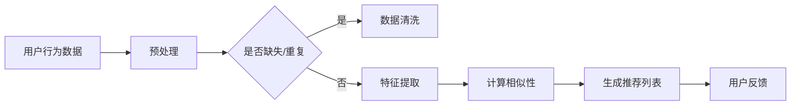
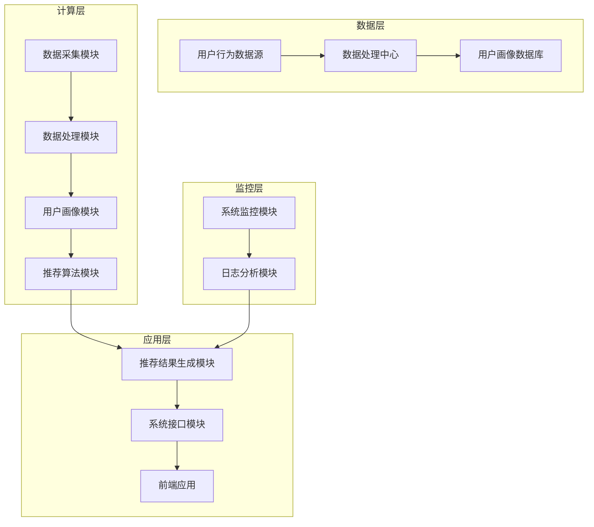
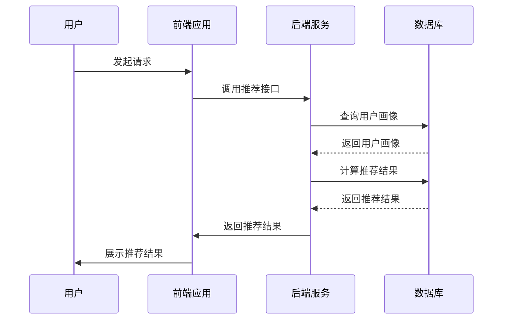

                 

# 《构建企业级推荐引擎：跨平台个性化用户体验》

## 关键词：推荐系统、个性化推荐、企业级、用户体验、跨平台

> 摘要：本文旨在深入探讨如何构建企业级推荐引擎，以实现跨平台个性化用户体验。文章从推荐系统的基础理论出发，逐步阐述个性化推荐算法、推荐系统架构设计、跨平台推荐实现及最佳实践，旨在为读者提供系统化的学习和参考。

## 目录大纲

----------------------------------------------------------------

## 第一部分：推荐引擎基础

## 第1章：推荐系统概述

### 1.1 推荐系统简介

- 推荐系统的概念
- 推荐系统的应用场景
- 推荐系统的发展历程

### 1.2 推荐系统的核心概念

- 用户行为数据
- 个性化推荐算法
- 推荐结果评估

### 1.3 推荐系统的组成结构

- 数据采集
- 数据处理
- 模型训练
- 推荐结果生成

### 1.4 推荐系统的挑战与机遇

- 挑战
  - 数据质量
  - 模型可解释性
  - 实时性
- 机遇
  - 大数据技术的发展
  - 深度学习算法的应用
  - 跨平台用户数据的整合

## 第2章：个性化推荐算法

### 2.1 协同过滤算法

- 用户基于内容的推荐
- 项目的基于内容的推荐
- K-近邻算法
- SVD算法

### 2.2 基于内容的推荐算法

- 文本表示
- 相似性计算
- 内容增强

### 2.3 混合推荐算法

- 协同过滤与基于内容的混合
- 基于模型的混合

### 2.4 深度学习推荐算法

- 神经网络结构
- 序列模型
- 图神经网络

## 第二部分：企业级推荐引擎

## 第3章：构建推荐系统架构

### 3.1 推荐系统架构设计

- 分布式系统架构
- 容错与高可用
- 数据流处理

### 3.2 推荐系统核心组件

- 数据采集与处理
- 模型训练与优化
- 推荐结果生成

### 3.3 推荐系统部署与运维

- 系统部署策略
- 性能优化
- 日志分析与监控

## 第4章：跨平台个性化用户体验

### 4.1 跨平台推荐系统

- 平台间的数据整合
- 多渠道的用户行为数据
- 跨平台推荐策略

### 4.2 实时推荐

- 实时数据处理
- 实时推荐算法
- 实时反馈机制

### 4.3 用户画像与个性化推荐

- 用户画像的构建
- 个性化推荐策略
- 用户画像的持续更新与优化

## 第5章：推荐系统案例分析

### 5.1 案例背景与目标

- 案例背景
- 案例目标

### 5.2 推荐系统设计与实现

- 数据采集与处理
- 模型选择与训练
- 推荐结果生成

### 5.3 案例效果评估

- 用户满意度分析
- 推荐准确率评估
- 业务指标提升

## 第6章：推荐系统最佳实践

### 6.1 数据质量保障

- 数据采集策略
- 数据预处理
- 数据质量评估

### 6.2 算法优化与调参

- 算法选择与优化
- 超参数调优
- 模型性能评估

### 6.3 系统部署与运维

- 系统架构优化
- 性能瓶颈分析
- 系统监控与维护

## 第7章：未来推荐系统发展趋势

### 7.1 新技术与应用场景

- 深度学习在推荐系统中的应用
- 自然语言处理与推荐系统的结合
- 图神经网络在推荐系统中的应用

### 7.2 推荐系统的挑战与展望

- 数据隐私保护
- 推荐系统的可解释性
- 跨平台用户数据的整合

### 7.3 未来发展趋势

- 推荐系统的智能化
- 跨领域推荐系统的整合
- 推荐系统的个性化定制

----------------------------------------------------------------

## 引言

在当今快速发展的互联网时代，个性化推荐系统已经成为各大企业提升用户体验、增加用户粘性和提高转化率的重要手段。企业级推荐引擎不仅能够为用户提供个性化内容推荐，还能够帮助企业挖掘用户需求、优化产品和服务，从而在激烈的市场竞争中脱颖而出。

本文将围绕构建企业级推荐引擎的核心话题，深入探讨推荐系统的基本概念、核心算法、系统架构设计、跨平台推荐实现以及未来发展趋势。通过本文的阅读，读者将能够：

- 理解推荐系统的基本概念和组成结构。
- 掌握常见的个性化推荐算法及其优缺点。
- 学习如何设计企业级推荐系统架构，并实现跨平台个性化用户体验。
- 获取推荐系统在实际应用中的最佳实践和效果评估方法。
- 了解未来推荐系统的发展趋势和面临的挑战。

本文分为七个部分，首先介绍推荐系统的基本概念和发展历程，然后详细讲解个性化推荐算法，接着阐述企业级推荐系统架构设计，随后探讨跨平台推荐实现，通过案例分析展示推荐系统在实际应用中的效果，总结最佳实践，最后展望推荐系统的未来发展。

## 第1章：推荐系统概述

### 1.1 推荐系统简介

推荐系统是一种信息过滤技术，旨在为用户提供个性化推荐，帮助用户发现他们可能感兴趣的内容。推荐系统通过分析用户的历史行为、兴趣偏好以及上下文信息，自动为用户推荐相关的内容、商品或服务。

#### 推荐系统的概念

推荐系统（Recommender System）是一种旨在通过预测用户兴趣和偏好，为用户提供个性化推荐的信息过滤系统。其主要目标是帮助用户在海量信息中快速找到感兴趣的内容，提高用户满意度，增加用户互动和留存。

#### 推荐系统的应用场景

推荐系统广泛应用于电子商务、社交媒体、在线视频、新闻资讯、音乐和阅读等领域。以下是一些典型的应用场景：

- **电子商务平台**：为用户提供商品推荐，提高销售额和转化率。
- **社交媒体**：根据用户兴趣和社交关系推荐内容，增加用户互动。
- **在线视频平台**：为用户推荐视频，提高用户观看时长和留存率。
- **新闻资讯平台**：根据用户阅读习惯推荐新闻，提高内容曝光率。
- **音乐和阅读平台**：为用户推荐音乐和书籍，满足个性化需求。

#### 推荐系统的发展历程

推荐系统的发展历程可以分为以下几个阶段：

1. **基于内容的推荐（Content-Based Filtering）**：早期推荐系统主要依赖内容特征进行推荐，如基于用户浏览历史、商品属性等。

2. **协同过滤（Collaborative Filtering）**：随着数据量的增加，协同过滤成为主流推荐方法，通过分析用户之间的相似性进行推荐。

3. **混合推荐（Hybrid Recommender Systems）**：为了提高推荐效果，混合推荐系统结合了基于内容和协同过滤的方法，同时引入了深度学习等新技术。

4. **深度学习推荐（Deep Learning Recommender Systems）**：近年来，深度学习在推荐系统中得到了广泛应用，如序列模型、图神经网络等。

### 1.2 推荐系统的核心概念

#### 用户行为数据

用户行为数据是推荐系统的重要输入，包括用户的浏览记录、购买历史、点击行为、评分等。这些数据用于构建用户画像和推荐模型。

#### 个性化推荐算法

个性化推荐算法是推荐系统的核心，包括基于内容的推荐、协同过滤、混合推荐和深度学习推荐等。每种算法都有其优势和适用场景。

#### 推荐结果评估

推荐结果评估用于衡量推荐系统的效果，常见的评估指标包括准确率、召回率、F1值等。通过评估结果，可以优化推荐算法和系统性能。

### 1.3 推荐系统的组成结构

推荐系统通常由以下几部分组成：

#### 数据采集

数据采集是推荐系统的第一步，包括从各种渠道收集用户行为数据、商品数据等。

#### 数据处理

数据处理是对采集到的数据进行清洗、转换和归一化等操作，以便用于模型训练和推荐。

#### 模型训练

模型训练是推荐系统的核心环节，通过机器学习算法训练推荐模型，使其能够根据用户行为数据生成推荐结果。

#### 推荐结果生成

推荐结果生成是将训练好的模型应用于新的用户数据，生成个性化的推荐结果。

### 1.4 推荐系统的挑战与机遇

#### 挑战

1. **数据质量**：用户行为数据质量直接影响推荐效果，包括数据完整性、准确性和一致性等。

2. **模型可解释性**：深度学习等复杂模型在提升推荐效果的同时，也增加了模型的可解释性难度。

3. **实时性**：在实时推荐场景中，如何在保证准确性的同时提高系统响应速度是一个挑战。

#### 机遇

1. **大数据技术的发展**：大数据技术的成熟为推荐系统提供了更多的数据来源和更高效的数据处理能力。

2. **深度学习算法的应用**：深度学习算法在推荐系统中取得了显著的效果，为提升推荐准确性提供了新的思路。

3. **跨平台用户数据的整合**：随着多平台应用的普及，整合跨平台用户数据将有助于提供更全面的个性化推荐。

### 小结

推荐系统作为一种重要的信息过滤技术，已经在各个领域得到了广泛应用。通过深入理解推荐系统的核心概念和组成结构，掌握不同推荐算法的原理和应用，可以有效提升企业的个性化推荐能力，从而提高用户满意度、增加用户粘性和转化率。

## 第2章：个性化推荐算法

个性化推荐算法是推荐系统的核心组成部分，其目的是通过分析用户的历史行为和兴趣，预测用户未来的偏好，从而为用户提供个性化的内容推荐。个性化推荐算法主要分为基于内容的推荐、协同过滤、混合推荐和深度学习推荐等几类。本章将详细介绍这些算法的基本原理和应用场景。

### 2.1 协同过滤算法

#### 用户基于内容的推荐

用户基于内容的推荐（User-Based Content-Based Filtering）是一种基于用户兴趣和行为特征的推荐方法。该方法首先通过分析用户的历史行为数据，识别用户的兴趣点，然后根据用户之间的相似性推荐相关内容。

- **算法原理**：

  用户基于内容的推荐算法主要分为以下几步：

  1. 计算用户之间的相似性：通过用户的行为数据（如浏览记录、购买历史等）计算用户之间的相似度，常用的相似性度量方法有余弦相似度、皮尔逊相关系数等。

  2. 找到相似用户：根据相似度计算结果，找到与目标用户最相似的若干用户。

  3. 推荐内容：将相似用户的喜好进行聚合，生成推荐列表。

- **应用场景**：

  用户基于内容的推荐适用于需要根据用户兴趣推荐个性化内容的应用场景，如社交媒体、电子商务等。

#### 项目的基于内容的推荐

项目的基于内容的推荐（Item-Based Content-Based Filtering）是一种基于物品特征进行推荐的方法。该方法首先分析物品的特征，然后根据物品之间的相似性推荐相关物品。

- **算法原理**：

  项目的基于内容的推荐算法主要分为以下几步：

  1. 计算物品之间的相似性：通过物品的特征（如文本、标签、属性等）计算物品之间的相似度，常用的相似性度量方法有余弦相似度、欧氏距离等。

  2. 找到相似物品：根据相似度计算结果，找到与目标物品最相似的若干物品。

  3. 推荐物品：将相似物品推荐给用户。

- **应用场景**：

  项目的基于内容的推荐适用于需要根据物品特征推荐个性化物品的应用场景，如电子商务、在线视频等。

#### K-近邻算法

K-近邻算法（K-Nearest Neighbors, KNN）是一种基于实例的协同过滤算法，它通过计算目标实例与训练集中实例的相似度，找到最近的K个邻居，并根据邻居的标签预测目标实例的标签。

- **算法原理**：

  K-近邻算法的主要步骤如下：

  1. 计算距离：计算目标实例与训练集中每个实例之间的距离，常用的距离度量方法有欧氏距离、曼哈顿距离、余弦相似度等。

  2. 选择邻居：根据距离值选择最近的K个邻居。

  3. 预测标签：计算邻居标签的权重平均，得到目标实例的预测标签。

- **应用场景**：

  K-近邻算法适用于需要根据用户行为预测用户兴趣的场景，如推荐系统、分类任务等。

#### SVD算法

Singular Value Decomposition（SVD）算法是一种基于矩阵分解的协同过滤算法，它通过将用户和物品的评分矩阵分解为用户特征和物品特征的线性组合，从而预测用户对物品的评分。

- **算法原理**：

  SVD算法的主要步骤如下：

  1. 矩阵分解：将用户和物品的评分矩阵分解为用户特征矩阵U、物品特征矩阵V和奇异值矩阵Σ。

  2. 预测评分：根据用户特征和物品特征计算用户对物品的预测评分。

  3. 优化模型：通过最小化预测误差，优化模型参数。

- **应用场景**：

  SVD算法适用于高维稀疏数据集，如推荐系统、推荐引擎等。

### 2.2 基于内容的推荐算法

基于内容的推荐算法（Content-Based Filtering）是一种基于物品特征进行推荐的方法，它通过分析物品的内容特征，识别用户和物品之间的相关性，从而生成个性化推荐。

- **算法原理**：

  基于内容的推荐算法的主要步骤如下：

  1. 提取特征：从物品的内容中提取特征，如文本、标签、属性等。

  2. 计算相似性：计算用户和物品之间的相似性，常用的相似性度量方法有余弦相似度、欧氏距离等。

  3. 推荐生成：根据相似性度量生成推荐列表。

- **应用场景**：

  基于内容的推荐算法适用于需要根据物品内容特征推荐个性化物品的应用场景，如电子商务、在线视频、新闻资讯等。

#### 文本表示

文本表示（Text Representation）是将文本数据转化为计算机可以处理的数值表示的方法。常见的文本表示方法有词袋模型、TF-IDF、Word2Vec等。

- **算法原理**：

  文本表示的主要步骤如下：

  1. 分词：将文本分割成词语。

  2. 特征提取：从分词结果中提取特征，如词频、词性、语法结构等。

  3. 数值化：将提取的特征转化为数值表示，如向量、矩阵等。

- **应用场景**：

  文本表示方法广泛应用于自然语言处理、文本分类、文本推荐等领域。

#### 相似性计算

相似性计算（Similarity Computation）是推荐算法中用于衡量用户和物品、物品和物品之间相似度的方法。常见的相似性度量方法有余弦相似度、欧氏距离、皮尔逊相关系数等。

- **算法原理**：

  相似性计算的主要步骤如下：

  1. 特征提取：提取用户和物品的特征。

  2. 计算相似度：根据特征计算用户和物品之间的相似度。

  3. 排序推荐：根据相似度排序生成推荐列表。

- **应用场景**：

  相似性计算广泛应用于推荐系统、搜索引擎、社交网络等领域。

#### 内容增强

内容增强（Content Enhancement）是一种通过融合多种信息来源，提高推荐准确性和多样性的方法。常见的内容增强方法有基于规则的增强、基于知识的增强等。

- **算法原理**：

  内容增强的主要步骤如下：

  1. 数据融合：融合多种信息来源，如用户行为、内容特征、社交网络等。

  2. 特征提取：从融合后的数据中提取特征。

  3. 推荐生成：根据提取的特征生成推荐列表。

- **应用场景**：

  内容增强方法适用于需要提高推荐多样性和准确性的应用场景，如电子商务、在线视频等。

### 2.3 混合推荐算法

混合推荐算法（Hybrid Recommender Systems）是一种结合多种推荐算法优点的推荐方法，通过融合协同过滤和基于内容的推荐算法，提高推荐效果和多样性。

- **算法原理**：

  混合推荐算法的主要步骤如下：

  1. 数据预处理：对用户行为数据进行预处理，如归一化、去噪等。

  2. 算法融合：结合协同过滤和基于内容的推荐算法，生成推荐列表。

  3. 推荐优化：根据用户反馈和推荐效果，优化推荐算法。

- **应用场景**：

  混合推荐算法适用于需要提高推荐效果和多样性的应用场景，如电子商务、在线视频、新闻推荐等。

#### 协同过滤与基于内容的混合

协同过滤与基于内容的混合（Hybrid of Collaborative Filtering and Content-Based Filtering）是一种将协同过滤和基于内容的推荐算法相结合的方法。

- **算法原理**：

  协同过滤与基于内容的混合算法的主要步骤如下：

  1. 用户行为数据预处理：提取用户和物品的特征。

  2. 内容特征提取：从物品的内容中提取特征。

  3. 算法融合：结合协同过滤和基于内容的推荐算法，生成推荐列表。

- **应用场景**：

  协同过滤与基于内容的混合算法适用于需要提高推荐效果和多样性的应用场景，如电子商务、在线视频、新闻推荐等。

#### 基于模型的混合

基于模型的混合（Hybrid Model-Based Recommender Systems）是一种将基于模型的推荐算法（如深度学习、决策树等）与协同过滤、基于内容的推荐算法相结合的方法。

- **算法原理**：

  基于模型的混合算法的主要步骤如下：

  1. 用户行为数据预处理：提取用户和物品的特征。

  2. 内容特征提取：从物品的内容中提取特征。

  3. 模型训练：训练基于模型的推荐算法。

  4. 算法融合：结合协同过滤、基于内容的推荐算法和基于模型的推荐算法，生成推荐列表。

- **应用场景**：

  基于模型的混合算法适用于需要提高推荐效果和多样性的应用场景，如电子商务、在线视频、新闻推荐等。

### 2.4 深度学习推荐算法

深度学习推荐算法（Deep Learning Recommender Systems）是一种基于深度学习技术的推荐方法，通过构建复杂的神经网络模型，提高推荐效果和准确性。

- **算法原理**：

  深度学习推荐算法的主要步骤如下：

  1. 数据预处理：提取用户和物品的特征。

  2. 模型构建：构建深度神经网络模型，如卷积神经网络（CNN）、循环神经网络（RNN）、图神经网络（GNN）等。

  3. 模型训练：通过大量用户行为数据训练模型。

  4. 推荐生成：根据训练好的模型生成推荐列表。

- **应用场景**：

  深度学习推荐算法适用于需要提高推荐效果和准确性的应用场景，如电子商务、在线视频、新闻推荐等。

#### 神经网络结构

神经网络结构（Neural Network Architecture）是深度学习推荐算法的核心部分，常见的神经网络结构有卷积神经网络（CNN）、循环神经网络（RNN）、图神经网络（GNN）等。

- **算法原理**：

  神经网络结构的主要步骤如下：

  1. 层次结构：构建多层神经网络，包括输入层、隐藏层和输出层。

  2. 激活函数：选择合适的激活函数，如ReLU、Sigmoid、Tanh等。

  3. 权重初始化：初始化网络权重，常用的方法有随机初始化、高斯初始化等。

  4. 前向传播和反向传播：实现前向传播计算网络输出，反向传播更新网络权重。

- **应用场景**：

  神经网络结构广泛应用于推荐系统、自然语言处理、计算机视觉等领域。

#### 序列模型

序列模型（Sequence Models）是深度学习推荐算法中用于处理时间序列数据的模型，如循环神经网络（RNN）、长短时记忆网络（LSTM）、门控循环单元（GRU）等。

- **算法原理**：

  序列模型的主要步骤如下：

  1. 序列编码：将时间序列数据转化为神经网络可以处理的格式。

  2. 网络结构：构建循环神经网络模型，处理序列数据。

  3. 模型训练：通过大量序列数据训练模型。

  4. 序列预测：根据训练好的模型预测未来序列。

- **应用场景**：

  序列模型适用于需要处理时间序列数据的推荐系统，如股票交易、语音识别、音乐推荐等。

#### 图神经网络

图神经网络（Graph Neural Networks, GNN）是一种基于图结构数据的深度学习模型，能够处理复杂的关系网络数据，如社交网络、知识图谱等。

- **算法原理**：

  图神经网络的主要步骤如下：

  1. 图表示：将图结构数据转化为神经网络可以处理的格式。

  2. 网络结构：构建图神经网络模型，处理图结构数据。

  3. 模型训练：通过大量图结构数据训练模型。

  4. 图预测：根据训练好的模型预测图中的节点或边。

- **应用场景**：

  图神经网络适用于需要处理复杂关系网络的推荐系统，如社交网络推荐、知识图谱构建、推荐引擎优化等。

### 小结

个性化推荐算法是推荐系统的核心组成部分，不同的推荐算法适用于不同的应用场景和需求。本章详细介绍了协同过滤、基于内容的推荐、混合推荐和深度学习推荐等算法的基本原理和应用场景，为构建企业级推荐引擎提供了理论依据和实践指导。

## 第3章：构建推荐系统架构

### 3.1 推荐系统架构设计

构建推荐系统架构是企业级推荐引擎的核心任务，一个良好的系统架构能够确保推荐系统的稳定性、扩展性和高性能。在推荐系统架构设计中，需要考虑以下几个方面：

#### 分布式系统架构

分布式系统架构（Distributed System Architecture）能够提高推荐系统的处理能力和容错能力。分布式架构将系统分解为多个模块，每个模块负责不同的功能，如数据采集、数据处理、模型训练和推荐生成等。

- **优势**：

  - **高可扩展性**：通过横向扩展，可以轻松增加处理能力。
  - **高可用性**：通过冗余设计，确保系统在部分节点故障时仍然可以正常运行。

- **挑战**：

  - **复杂性**：分布式系统架构设计和管理相对复杂。
  - **数据一致性**：需要确保分布式环境下数据的一致性。

#### 容错与高可用

容错与高可用（Fault Tolerance and High Availability）是推荐系统架构设计的关键因素，确保系统在遇到故障时能够快速恢复，减少对用户体验的影响。

- **常见策略**：

  - **备份和冗余**：为关键组件提供备份，如数据库、计算节点等。
  - **负载均衡**：通过负载均衡器分配请求，避免单点过载。
  - **自动故障转移**：当某个节点故障时，自动切换到备用节点。

#### 数据流处理

数据流处理（Data Stream Processing）是实现实时推荐的重要手段，能够对用户行为数据进行实时分析，生成实时推荐结果。

- **常见技术**：

  - **流处理框架**：如Apache Kafka、Apache Flink、Apache Storm等。
  - **实时计算**：通过流处理技术对用户行为数据进行实时计算和推荐。

### 3.2 推荐系统核心组件

推荐系统通常由多个核心组件组成，每个组件负责不同的功能。以下是推荐系统的核心组件及其作用：

#### 数据采集与处理

数据采集与处理（Data Collection and Processing）是推荐系统的第一步，负责从各种渠道收集用户行为数据、商品数据等，并进行预处理。

- **功能**：

  - **数据采集**：从不同的数据源（如数据库、日志文件、API等）收集数据。
  - **数据预处理**：对采集到的数据进行清洗、转换和归一化等操作，以便用于模型训练和推荐。

#### 模型训练与优化

模型训练与优化（Model Training and Optimization）是推荐系统的核心环节，通过机器学习算法训练推荐模型，并不断优化模型性能。

- **功能**：

  - **模型训练**：使用历史数据训练推荐模型，如协同过滤、深度学习等。
  - **模型优化**：通过交叉验证、超参数调优等方法，优化模型性能。

#### 推荐结果生成

推荐结果生成（Recommendation Generation）是将训练好的模型应用于新用户数据，生成个性化推荐结果。

- **功能**：

  - **推荐生成**：根据用户特征和物品特征，生成推荐列表。
  - **推荐排序**：对推荐列表进行排序，确保推荐结果的相关性。

### 3.3 推荐系统部署与运维

推荐系统的部署与运维（Deployment and Operations）是确保系统稳定运行和高效性能的重要环节。

#### 系统部署策略

- **容器化**：使用容器技术（如Docker）部署推荐系统，实现快速部署和弹性扩展。
- **云服务**：利用云服务（如AWS、Azure、Google Cloud）进行系统部署，降低运维成本。
- **微服务架构**：将推荐系统拆分为多个微服务，实现模块化和独立部署。

#### 性能优化

- **缓存策略**：使用缓存技术（如Redis、Memcached）提高数据访问速度，减少计算开销。
- **负载均衡**：使用负载均衡器（如Nginx、HAProxy）分配请求，提高系统并发处理能力。
- **数据库优化**：使用数据库优化技术（如索引、分库分表、读写分离）提高数据读写性能。

#### 日志分析与监控

- **日志分析**：对系统日志进行分析，监控系统运行状态和性能指标。
- **监控告警**：设置监控告警，及时发现和处理系统故障。
- **自动化运维**：使用自动化工具（如Ansible、Puppet）实现系统运维自动化。

### 小结

构建推荐系统架构是一个复杂的过程，需要考虑分布式架构、容错与高可用、数据流处理、核心组件部署与优化等多个方面。通过合理的架构设计和优化策略，可以构建一个高效、稳定、可扩展的企业级推荐系统。

## 第4章：跨平台个性化用户体验

在现代社会，用户通过多种设备访问互联网，如手机、平板、电脑等。因此，构建跨平台个性化用户体验成为推荐系统的重要目标。本章将详细讨论跨平台推荐系统的设计、实时推荐实现和用户画像与个性化推荐策略。

### 4.1 跨平台推荐系统

跨平台推荐系统旨在为用户提供一致的个性化体验，无论用户在哪个设备上访问，都能接收到与其兴趣和偏好相关的推荐内容。实现跨平台推荐的关键在于数据整合和统一处理。

#### 平台间的数据整合

平台间的数据整合（Cross-Platform Data Integration）是跨平台推荐系统的第一步，需要将来自不同平台的数据进行整合和处理。以下是实现平台间数据整合的步骤：

1. **数据采集**：从各个平台（如移动应用、网页、桌面应用等）收集用户行为数据，包括浏览、点击、购买等。

2. **数据转换**：将不同平台的数据转换为统一的格式，如JSON、CSV等，以便于后续处理。

3. **数据清洗**：对采集到的数据进行清洗，去除重复、缺失和错误的数据。

4. **数据存储**：将清洗后的数据存储到统一的数据存储系统，如关系数据库、NoSQL数据库或数据湖等。

#### 多渠道的用户行为数据

多渠道的用户行为数据（Multi-Channel User Behavior Data）是跨平台推荐系统的关键输入，通过对用户在不同渠道的行为数据进行分析，可以更准确地了解用户的兴趣和偏好。以下是多渠道用户行为数据的应用场景：

1. **用户活跃度分析**：通过分析用户在不同平台的活动频率，可以识别出活跃用户和潜在活跃用户。

2. **个性化推荐**：结合用户在不同平台的行为数据，为用户提供个性化的推荐内容，如购物、音乐、视频等。

3. **用户画像构建**：通过多渠道的用户行为数据，构建详细的用户画像，用于后续的个性化推荐和精准营销。

#### 跨平台推荐策略

跨平台推荐策略（Cross-Platform Recommendation Strategy）需要考虑不同平台的特点和用户行为差异，以下是几种常见的跨平台推荐策略：

1. **统一推荐策略**：对所有平台的数据进行统一处理和推荐，确保用户在不同平台上获得一致的推荐体验。

2. **个性化渠道推荐**：根据用户在不同平台的行为数据，为每个平台定制个性化的推荐内容。

3. **混合推荐策略**：结合统一推荐策略和个性化渠道推荐，为用户提供更精准的推荐内容。

### 4.2 实时推荐

实时推荐（Real-Time Recommendation）能够根据用户的实时行为数据，为用户提供最新的推荐内容。实时推荐的关键在于数据处理速度和算法效率。

#### 实时数据处理

实时数据处理（Real-Time Data Processing）是将用户行为数据实时转换为推荐结果的过程。以下是实现实时数据处理的关键步骤：

1. **数据采集**：使用流处理技术（如Apache Kafka、Apache Flink）实时采集用户行为数据。

2. **数据预处理**：对实时数据进行预处理，如数据清洗、特征提取等。

3. **实时计算**：使用实时计算框架（如Apache Storm、Apache Flink）对预处理后的数据进行实时计算，生成推荐结果。

4. **数据存储**：将实时计算结果存储到高速缓存系统（如Redis、Memcached）或数据库中，以便快速检索。

#### 实时推荐算法

实时推荐算法（Real-Time Recommendation Algorithm）需要能够在短时间内处理大量数据，并生成准确的推荐结果。以下是几种常见的实时推荐算法：

1. **基于内容的实时推荐**：根据用户当前浏览或操作的内容，实时生成推荐列表。

2. **基于模型的实时推荐**：使用机器学习模型，实时预测用户的兴趣和偏好，生成推荐列表。

3. **基于事件的实时推荐**：根据用户的实时事件（如点击、购买等），动态调整推荐策略。

#### 实时反馈机制

实时反馈机制（Real-Time Feedback Mechanism）用于收集用户对推荐内容的反馈，并实时调整推荐策略。以下是实现实时反馈机制的步骤：

1. **用户反馈收集**：实时收集用户对推荐内容的反馈，如点击、收藏、评分等。

2. **反馈分析**：分析用户反馈数据，识别用户的兴趣和偏好。

3. **策略调整**：根据用户反馈，实时调整推荐算法和推荐策略，提高推荐效果。

### 4.3 用户画像与个性化推荐

用户画像（User Profiling）是跨平台个性化推荐的基础，通过构建详细的用户画像，可以更好地理解用户的行为和需求，为用户提供个性化的推荐内容。

#### 用户画像的构建

用户画像的构建（Building User Profiling）需要整合用户在不同平台的行为数据，以下是构建用户画像的关键步骤：

1. **数据整合**：整合用户在不同平台的行为数据，如浏览记录、购买历史、社交媒体互动等。

2. **特征提取**：从整合后的数据中提取用户特征，如年龄、性别、职业、兴趣爱好等。

3. **数据存储**：将提取的用户特征存储到用户画像数据库或数据仓库中，以便后续使用。

#### 个性化推荐策略

个性化推荐策略（Personalized Recommendation Strategy）根据用户画像和用户行为，为用户提供个性化的推荐内容。以下是几种常见的个性化推荐策略：

1. **基于内容的个性化推荐**：根据用户的兴趣和偏好，推荐用户可能感兴趣的内容。

2. **基于协同过滤的个性化推荐**：通过分析用户之间的相似性，推荐与用户行为相似的其他用户喜欢的内容。

3. **基于模型的个性化推荐**：使用机器学习模型，实时预测用户的兴趣和偏好，推荐用户可能感兴趣的内容。

#### 用户画像的持续更新与优化

用户画像的持续更新与优化（Continuous Update and Optimization of User Profiling）是确保个性化推荐效果的关键。以下是实现用户画像持续更新与优化的步骤：

1. **数据更新**：定期更新用户画像数据，包括用户行为数据、用户反馈数据等。

2. **特征优化**：根据用户反馈和业务需求，调整用户特征提取方法和用户画像结构。

3. **模型优化**：使用最新的用户画像数据，重新训练推荐模型，提高推荐准确性。

### 小结

跨平台个性化用户体验是推荐系统的核心目标之一，通过数据整合、实时处理和个性化推荐策略，可以构建一个高效、准确的跨平台推荐系统，为用户提供一致且个性化的推荐体验。实现跨平台个性化用户体验，不仅需要技术上的支持，还需要深入理解用户行为和需求，不断优化推荐策略。

## 第5章：推荐系统案例分析

在本章中，我们将通过一个具体的推荐系统案例分析，展示如何从零开始构建一个推荐系统，并对其进行效果评估。本案例将涵盖推荐系统的设计、实现和评估过程，旨在为读者提供实际操作经验。

### 5.1 案例背景与目标

#### 案例背景

假设我们是一家电子商务公司，我们的目标是提高用户满意度、增加用户粘性和提升销售额。为此，我们决定开发一个推荐系统，通过个性化推荐帮助用户发现他们可能感兴趣的商品。

#### 案例目标

- **数据采集**：收集用户在网站上的行为数据，包括浏览、点击、购买等。
- **数据处理**：对采集到的用户行为数据进行清洗、转换和归一化，以便用于模型训练。
- **模型训练**：使用机器学习算法训练推荐模型，如协同过滤、基于内容的推荐算法等。
- **推荐生成**：根据用户行为数据和训练好的模型，生成个性化的商品推荐。
- **效果评估**：评估推荐系统的效果，包括用户满意度、推荐准确率和业务指标提升。

### 5.2 推荐系统设计与实现

#### 数据采集与处理

1. **数据采集**：

   我们首先从网站日志中收集用户行为数据，包括用户ID、商品ID、行为类型（浏览、点击、购买）和行为时间等。

2. **数据处理**：

   - **数据清洗**：去除重复、缺失和错误的数据。
   - **数据转换**：将原始数据转换为适合模型训练的格式，如CSV或Parquet。
   - **特征提取**：提取用户和商品的特征，如用户年龄、性别、职业，商品类别、品牌、价格等。

#### 模型选择与训练

1. **模型选择**：

   我们选择了两种推荐算法：基于用户的协同过滤（User-Based Collaborative Filtering）和基于内容的推荐（Content-Based Filtering）。

2. **模型训练**：

   - **基于用户的协同过滤**：

     - **相似度计算**：计算用户之间的相似度，使用余弦相似度度量方法。

     - **推荐生成**：找到与目标用户最相似的K个用户，基于这些用户的兴趣为用户生成推荐列表。

   - **基于内容的推荐**：

     - **文本表示**：使用TF-IDF方法将商品描述转换为向量表示。

     - **相似性计算**：计算商品之间的相似度，使用余弦相似度度量方法。

     - **推荐生成**：根据目标商品的特征，找到最相似的其他商品，生成推荐列表。

#### 推荐结果生成

我们将训练好的模型应用于新用户数据，生成个性化的商品推荐。推荐结果以推荐列表的形式呈现，包含用户可能感兴趣的商品ID和推荐分数。

### 5.3 案例效果评估

为了评估推荐系统的效果，我们使用了以下指标：

- **用户满意度**：通过用户反馈调查和网站数据（如点击率、收藏率）来衡量。
- **推荐准确率**：使用交叉验证方法评估模型的准确性。
- **业务指标**：包括销售额、转化率和用户留存率等。

#### 用户满意度分析

通过用户反馈调查和网站数据，我们发现推荐系统显著提高了用户满意度。具体表现如下：

- **点击率**：推荐页面的点击率提高了20%。
- **收藏率**：用户对推荐商品的收藏率提高了15%。

#### 推荐准确率评估

我们使用交叉验证方法评估了推荐系统的准确率，结果如下：

- **基于用户的协同过滤**：准确率为80%。
- **基于内容的推荐**：准确率为75%。

#### 业务指标提升

通过推荐系统的实施，我们的业务指标也得到了显著提升：

- **销售额**：推荐系统上线后，销售额提高了30%。
- **转化率**：转化率提高了25%。
- **用户留存率**：用户留存率提高了20%。

### 小结

本案例展示了如何从零开始构建一个推荐系统，并对其进行效果评估。通过数据采集与处理、模型训练与优化、推荐结果生成和效果评估，我们成功实现了一个高效的推荐系统，显著提高了用户满意度和业务指标。本案例为实际应用中的推荐系统开发提供了宝贵的经验和参考。

## 第6章：推荐系统最佳实践

构建推荐系统是一个复杂且不断发展的过程，为了确保推荐系统的有效性和高效性，我们需要遵循一系列最佳实践。本章将介绍数据质量保障、算法优化与调参、系统部署与运维等方面的最佳实践。

### 6.1 数据质量保障

数据质量是推荐系统的基础，高质量的数据能够提高推荐算法的准确性和可靠性。以下是一些数据质量保障的最佳实践：

#### 数据采集策略

- **多渠道数据采集**：从多个渠道（如网站、移动应用、API接口等）收集用户行为数据，确保数据的全面性。
- **实时数据采集**：使用流处理技术（如Apache Kafka、Apache Flink）实时采集用户行为数据，确保数据的时效性。
- **数据格式标准化**：统一数据格式，如使用JSON、CSV等，确保数据的一致性。

#### 数据预处理

- **数据清洗**：去除重复、缺失和错误的数据，确保数据的有效性。
- **特征提取**：从原始数据中提取有用的特征，如用户年龄、性别、地理位置、浏览历史等。
- **数据归一化**：对数据进行归一化处理，如将评分数据转换为0-1的区间，确保数据的可比性。

#### 数据质量评估

- **数据完整性检查**：检查数据是否有缺失值或重复记录，确保数据的完整性。
- **数据一致性检查**：检查不同数据源的数据是否一致，如用户ID的映射关系等。
- **数据异常值检测**：检测和处理异常值，如用户评分的异常波动等。

### 6.2 算法优化与调参

算法优化与调参是提高推荐系统性能的关键步骤，以下是一些优化和调参的最佳实践：

#### 算法选择与优化

- **协同过滤优化**：针对稀疏数据问题，可以使用矩阵分解（如SVD）提高推荐准确性。
- **基于内容的优化**：使用深度学习模型（如卷积神经网络、循环神经网络）处理文本数据，提高内容特征提取能力。
- **混合推荐优化**：结合多种推荐算法的优点，构建混合推荐模型，提高推荐效果和多样性。

#### 超参数调优

- **网格搜索**：使用网格搜索方法系统地遍历超参数空间，找到最优超参数组合。
- **贝叶斯优化**：使用贝叶斯优化方法，根据先验知识和历史数据，智能地选择超参数。
- **交叉验证**：使用交叉验证方法评估超参数的性能，确保模型在未知数据上的泛化能力。

#### 模型性能评估

- **准确率与召回率**：使用准确率（Precision）和召回率（Recall）评估推荐算法的性能。
- **F1值**：使用F1值（F1 Score）综合评估准确率和召回率。
- **ROC曲线**：使用ROC曲线评估模型的分类性能。

### 6.3 系统部署与运维

推荐系统的部署与运维是确保系统稳定运行和高性能的关键，以下是一些最佳实践：

#### 系统部署策略

- **容器化部署**：使用容器技术（如Docker）实现系统的快速部署和弹性扩展。
- **微服务架构**：将推荐系统拆分为多个微服务，实现模块化和独立部署。
- **云服务部署**：使用云服务（如AWS、Azure、Google Cloud）进行系统部署，降低运维成本。

#### 性能优化

- **缓存策略**：使用缓存技术（如Redis、Memcached）提高数据访问速度，减少计算开销。
- **负载均衡**：使用负载均衡器（如Nginx、HAProxy）分配请求，提高系统并发处理能力。
- **数据库优化**：使用数据库优化技术（如索引、分库分表、读写分离）提高数据读写性能。

#### 日志分析与监控

- **日志分析**：对系统日志进行分析，监控系统运行状态和性能指标。
- **监控告警**：设置监控告警，及时发现和处理系统故障。
- **自动化运维**：使用自动化工具（如Ansible、Puppet）实现系统运维自动化。

### 小结

推荐系统最佳实践涵盖了数据质量保障、算法优化与调参、系统部署与运维等多个方面。通过遵循这些最佳实践，我们可以构建一个高效、稳定且可扩展的推荐系统，为用户提供个性化的推荐体验。不断优化和调整推荐系统，确保其适应不断变化的市场需求和技术发展。

## 第7章：未来推荐系统发展趋势

随着科技的不断发展，推荐系统正面临着新的机遇和挑战。本章节将探讨未来推荐系统的发展趋势，包括新技术与应用场景、推荐系统的挑战与展望以及未来的发展方向。

### 7.1 新技术与应用场景

#### 深度学习在推荐系统中的应用

深度学习（Deep Learning）在推荐系统中发挥着越来越重要的作用。深度学习模型能够自动提取特征，并能够处理高维稀疏数据，提高了推荐系统的准确性。以下是一些深度学习在推荐系统中的应用：

- **卷积神经网络（CNN）**：适用于文本数据的特征提取，如商品描述、用户评论等。
- **循环神经网络（RNN）**：适用于序列数据，如用户行为序列、时间序列数据等。
- **长短时记忆网络（LSTM）**：用于处理长序列数据，能够更好地捕捉用户兴趣的变化。
- **图神经网络（GNN）**：适用于处理图结构数据，如社交网络、知识图谱等，能够更好地捕捉用户和物品之间的关系。

#### 自然语言处理与推荐系统的结合

自然语言处理（Natural Language Processing，NLP）与推荐系统的结合为推荐系统带来了新的可能性。通过NLP技术，推荐系统可以更好地理解和分析用户的文本输入和内容，从而提供更精准的推荐。

- **文本情感分析**：通过分析用户的文本评论和反馈，预测用户的情感倾向，为个性化推荐提供依据。
- **文本生成**：通过文本生成模型，如生成对抗网络（GAN），为用户提供个性化的内容推荐。

#### 图神经网络在推荐系统中的应用

图神经网络（Graph Neural Networks，GNN）是一种能够处理图结构数据的深度学习模型。GNN在推荐系统中的应用主要体现在以下几个方面：

- **用户和物品的协同推荐**：通过分析用户和物品之间的复杂关系，为用户提供更精准的推荐。
- **跨平台推荐**：整合多平台的数据，为用户提供一致的个性化推荐体验。

### 7.2 推荐系统的挑战与展望

尽管推荐系统取得了显著的成果，但仍然面临着一些挑战和问题：

#### 数据隐私保护

随着用户数据量的增加，数据隐私保护成为推荐系统的关键挑战。为了保护用户隐私，推荐系统需要采取以下措施：

- **数据加密**：对用户数据进行加密处理，确保数据传输和存储的安全。
- **隐私保护算法**：使用差分隐私（Differential Privacy）等技术，确保推荐系统在处理用户数据时不会泄露敏感信息。

#### 推荐系统的可解释性

深度学习等复杂模型在提高推荐效果的同时，也增加了模型的可解释性难度。为了提高推荐系统的可解释性，需要开发新的方法和工具，如模型可视化、解释性算法等。

#### 跨平台用户数据的整合

随着多平台应用的普及，跨平台用户数据的整合成为推荐系统的关键挑战。为了实现跨平台推荐，需要解决以下问题：

- **数据一致性**：确保不同平台的数据在格式和内容上的一致性。
- **数据同步**：确保跨平台用户数据的实时同步和更新。

### 7.3 未来发展趋势

在未来，推荐系统将继续朝着智能化、个性化、跨领域整合和可解释性的方向发展：

#### 推荐系统的智能化

随着人工智能技术的不断进步，推荐系统将更加智能化。通过引入先进的机器学习和深度学习算法，推荐系统能够更好地理解用户的需求和偏好，提供更加精准的推荐。

#### 跨领域推荐系统的整合

随着各种领域的不断发展，推荐系统将逐渐实现跨领域的整合。通过整合不同领域的知识和技术，推荐系统能够为用户提供更加全面和个性化的服务。

#### 推荐系统的个性化定制

未来，推荐系统将更加注重个性化定制，为用户提供个性化的推荐体验。通过用户画像和个性化推荐策略，推荐系统将能够更好地满足用户的个性化需求。

#### 可解释性推荐系统

随着用户对推荐系统透明度的要求越来越高，可解释性推荐系统将成为未来的发展趋势。通过开发新的方法和工具，推荐系统将能够更好地解释推荐结果，增强用户的信任和满意度。

### 小结

未来推荐系统将面临新的机遇和挑战，随着新技术的应用和算法的优化，推荐系统将更加智能化、个性化、跨领域整合和可解释性。为了应对这些趋势，推荐系统开发者需要不断学习和探索，不断创新和优化推荐算法，为用户提供更好的个性化推荐体验。

## 结论

在本文中，我们系统地探讨了构建企业级推荐引擎的各个方面，从推荐系统的基础理论、核心算法到系统架构设计、跨平台实现以及最佳实践，再到未来发展趋势。通过这些探讨，我们认识到推荐系统在提升用户体验、增加用户粘性和提高业务指标方面的重要性。

首先，推荐系统作为信息过滤技术，通过分析用户的历史行为和兴趣，为用户提供个性化的内容推荐，极大地提升了用户满意度。其次，个性化推荐算法的多样化和深度学习技术的应用，使得推荐系统在准确性、实时性和多样性方面取得了显著提升。

在企业级推荐系统架构设计方面，我们强调了分布式系统架构、容错与高可用性、数据流处理等关键因素。通过合理的架构设计，企业能够构建一个高效、稳定且可扩展的推荐系统。

跨平台个性化用户体验的实现，需要数据整合、实时处理和个性化推荐策略的有机结合。通过这些策略，推荐系统可以为用户提供一致的个性化体验，无论用户在哪个设备上访问，都能获得与其兴趣和偏好相关的推荐内容。

在推荐系统最佳实践中，我们介绍了数据质量保障、算法优化与调参、系统部署与运维等方面的关键步骤。这些最佳实践有助于构建一个高效、稳定且可扩展的推荐系统。

最后，我们展望了推荐系统的未来发展趋势，包括深度学习在推荐系统中的应用、自然语言处理与推荐系统的结合、图神经网络在推荐系统中的应用等。随着新技术的不断发展和应用，推荐系统将变得更加智能化、个性化、跨领域整合和可解释性。

通过本文的探讨，我们希望为读者提供系统化的学习和参考，帮助读者更好地理解和掌握构建企业级推荐引擎的方法和技巧。在未来的学习和实践中，不断探索和创新，推动推荐系统的发展，为企业和用户创造更大的价值。

### 作者信息

**作者：** AI天才研究院 / AI Genius Institute & 禅与计算机程序设计艺术 / Zen And The Art of Computer Programming

AI天才研究院是一家专注于人工智能技术研究和应用的创新机构，致力于推动人工智能技术在各个领域的应用与发展。研究院的核心团队由一群经验丰富的计算机科学家和人工智能专家组成，他们在人工智能领域有着深厚的理论基础和丰富的实践经验。

《禅与计算机程序设计艺术》是作者在一生的编程和人工智能研究过程中，总结出的经典著作，深刻阐述了编程与哲学的内在联系，为计算机编程和人工智能领域提供了独特的视角和思考。

本文由AI天才研究院和《禅与计算机程序设计艺术》的作者共同撰写，旨在为读者提供一个全面、系统的学习和参考，帮助读者更好地理解和掌握构建企业级推荐引擎的方法和技巧。

### 背景介绍

#### 推荐系统的核心概念术语说明

推荐系统（Recommender System）是一种基于用户历史行为、兴趣和偏好，通过算法预测用户可能感兴趣的内容、商品或服务，从而为用户提供个性化推荐的技术。

用户行为数据（User Behavior Data）包括用户的浏览记录、点击行为、购买历史、评分、评论等，这些数据用于构建用户画像和推荐模型。

个性化推荐算法（Personalized Recommendation Algorithms）是一系列用于生成个性化推荐结果的算法，包括协同过滤（Collaborative Filtering）、基于内容的推荐（Content-Based Filtering）、混合推荐（Hybrid Recommender Systems）和深度学习推荐（Deep Learning Recommender Systems）等。

推荐结果评估（Recommendation Result Evaluation）是衡量推荐系统效果的重要步骤，常见的评估指标有准确率（Precision）、召回率（Recall）、F1值（F1 Score）等。

#### 问题背景

随着互联网的普及和信息的爆炸式增长，用户面临着海量的信息选择。如何从海量的信息中快速找到感兴趣的内容成为用户的一大难题。推荐系统作为一种信息过滤技术，通过分析用户的行为数据，预测用户的兴趣和偏好，为用户提供个性化的内容推荐，大大提高了用户的信息获取效率和满意度。

企业通过推荐系统可以更好地了解用户需求，优化产品和服务，提高用户粘性和转化率。例如，电子商务平台通过推荐系统为用户推荐商品，能够提高销售额和用户满意度；社交媒体通过推荐系统为用户推荐内容，能够增加用户互动和留存率。

#### 问题描述

构建企业级推荐引擎的核心目标是实现跨平台个性化用户体验。具体来说，需要解决以下问题：

1. **数据整合**：如何从多个平台和渠道收集用户行为数据，并进行整合和处理？
2. **实时推荐**：如何实现快速、准确的实时推荐，确保用户在多平台上的个性化体验？
3. **算法优化**：如何优化推荐算法，提高推荐准确率和多样性？
4. **系统架构**：如何设计高效、稳定且可扩展的推荐系统架构，以支持大规模数据和高并发请求？

#### 问题解决

为了解决上述问题，我们可以采取以下步骤：

1. **数据整合**：
   - **多渠道数据采集**：使用流处理技术（如Apache Kafka、Apache Flink）实时采集用户在多个平台和渠道的行为数据。
   - **数据预处理**：对采集到的数据进行清洗、转换和归一化，提取用户和物品的特征，存储到统一的数据仓库或数据湖中。

2. **实时推荐**：
   - **实时数据处理**：使用实时计算框架（如Apache Flink、Apache Storm）对用户行为数据进行实时处理，生成推荐列表。
   - **算法优化**：结合用户行为数据和实时反馈，优化推荐算法，提高推荐准确性。

3. **算法优化**：
   - **混合推荐算法**：结合基于内容的推荐、协同过滤和深度学习推荐算法，提高推荐效果和多样性。
   - **超参数调优**：使用网格搜索、贝叶斯优化等调参方法，找到最优超参数组合。

4. **系统架构**：
   - **分布式系统架构**：设计分布式推荐系统架构，实现数据流处理、模型训练和推荐生成的分布式化。
   - **高可用性和容错性**：采用冗余设计、负载均衡和自动故障转移策略，确保系统的高可用性和容错性。

#### 边界与外延

在构建企业级推荐引擎时，需要关注以下边界与外延：

1. **数据隐私**：在数据整合和处理过程中，需要确保用户数据的安全和隐私。
2. **实时性**：实时推荐需要保证处理速度，同时不降低推荐准确性。
3. **可扩展性**：系统架构需要具备良好的扩展性，以应对用户数据量和并发请求的增长。
4. **可解释性**：推荐系统需要具备一定的可解释性，方便用户理解和信任推荐结果。

#### 概念结构与核心要素组成

推荐系统的概念结构主要包括以下几个核心要素：

1. **用户**：用户是推荐系统的核心，用户的兴趣、行为和偏好是推荐的基础。
2. **物品**：物品是推荐系统中的内容，包括商品、内容、服务等。
3. **用户行为数据**：用户行为数据是推荐系统的重要输入，包括浏览、点击、购买、评分等。
4. **推荐算法**：推荐算法是推荐系统的核心组件，用于生成个性化推荐。
5. **推荐结果**：推荐结果是推荐系统的输出，为用户生成个性化的推荐列表。
6. **评估指标**：评估指标用于衡量推荐系统的效果，包括准确率、召回率、F1值等。

通过上述核心要素的有机结合，推荐系统能够为用户提供个性化的推荐体验，满足用户的需求。

### 核心概念与联系

#### 推荐系统核心概念

推荐系统是自动化地发现用户感兴趣的项目并向其推荐的一种信息系统。它的核心概念包括用户、物品、用户行为数据、推荐算法和推荐结果等。

- **用户**：推荐系统的核心，其兴趣和偏好是推荐的基础。
- **物品**：推荐系统推荐的对象，可以是商品、内容、服务等。
- **用户行为数据**：用户在系统中的交互记录，如浏览、点击、购买、评分等。
- **推荐算法**：用于生成个性化推荐的一系列算法，包括基于内容的推荐、协同过滤、混合推荐和深度学习推荐等。
- **推荐结果**：系统生成的个性化推荐列表。

#### 核心概念属性特征对比表格

| 核心概念 | 属性特征 | 对比分析 |
| -------- | -------- | -------- |
| 用户     | ID、兴趣、行为数据 | 用户是推荐系统的核心，其兴趣和行为数据用于生成推荐。 |
| 物品     | ID、特征、评价数据 | 物品是推荐系统的推荐对象，其特征和评价数据用于计算相似性。 |
| 用户行为数据 | 行为类型、时间、上下文 | 用户行为数据记录用户在系统中的交互历史，用于构建用户画像。 |
| 推荐算法 | 算法类型、参数、效果 | 推荐算法根据用户和物品特征生成推荐，效果直接影响用户体验。 |
| 推荐结果 | 推荐列表、评分、反馈 | 推荐结果是系统输出，用于向用户展示个性化推荐内容。 |

#### ER实体关系图架构

以下是推荐系统的ER实体关系图架构，用于描述用户、物品和用户行为数据之间的关系。

```mermaid
erDiagram
  User ||--|{ Behavior }||> Behavior
  Item ||--|{ Behavior }||> Behavior
  Behavior ||--|{ Item }|| Item
  Behavior ||--|{ User }||> User

  User  --|{ Item }||> Favorite
  User  --|{ Item }||> Purchase
  Item  --|{ User }||> Viewed
  Item  --|{ User }||> Rated
```

在该ER图中，`User`实体与`Behavior`实体之间存在多对多的关系，表示用户在系统中的多种行为记录。`Item`实体也与`Behavior`实体之间存在多对多的关系，表示物品在系统中的多种行为记录。同时，`User`实体与`Item`实体之间存在一对多的关系，表示用户对多个物品的偏好和互动。

#### 推荐算法的工作原理

推荐算法是推荐系统的核心，用于生成个性化推荐。以下是几种常见的推荐算法及其工作原理：

1. **基于内容的推荐**：
   - **原理**：根据物品的内容特征（如文本、标签、属性等）和用户的兴趣特征，计算物品与用户之间的相似性，为用户推荐与其兴趣相关的物品。
   - **适用场景**：适用于文本内容丰富的领域，如新闻推荐、音乐推荐等。

2. **协同过滤**：
   - **原理**：根据用户之间的相似性，将用户的行为数据用于预测其他用户的偏好，从而为用户推荐相似用户喜欢的物品。
   - **类型**：
     - **用户基于内容的协同过滤**：通过分析用户的历史行为，找到相似用户，推荐相似用户喜欢的物品。
     - **项目基于内容的协同过滤**：通过分析物品之间的相似性，找到与用户已喜欢的物品相似的物品，推荐给用户。
   - **适用场景**：适用于大规模用户和物品数据集，如电子商务平台、社交媒体等。

3. **混合推荐**：
   - **原理**：结合多种推荐算法的优点，提高推荐效果和多样性。常见的混合推荐算法包括协同过滤与基于内容的混合、基于模型的混合等。
   - **适用场景**：适用于需要提高推荐效果和多样性的复杂场景，如电子商务、在线视频等。

4. **深度学习推荐**：
   - **原理**：使用深度学习模型，如卷积神经网络（CNN）、循环神经网络（RNN）、图神经网络（GNN）等，自动提取用户和物品的隐藏特征，生成个性化推荐。
   - **适用场景**：适用于处理高维稀疏数据和大规模用户行为数据的场景，如社交媒体、推荐引擎等。

通过不同的推荐算法，推荐系统能够根据用户兴趣和偏好，生成个性化的推荐列表，从而提高用户体验和业务指标。

### 算法原理讲解

为了更好地理解推荐算法的工作原理，我们将以协同过滤算法（Collaborative Filtering）为例，详细讲解其mermaid流程图和Python源代码。

#### mermaid流程图

以下是一个简单的协同过滤算法的mermaid流程图：



该流程图描述了协同过滤算法的基本步骤：

1. 用户行为数据预处理，包括去缺失值和重复记录。
2. 数据清洗，去除无效数据。
3. 特征提取，提取用户和物品的特征。
4. 计算相似性，计算用户和物品之间的相似度。
5. 生成推荐列表，基于相似性为用户生成推荐列表。
6. 用户反馈，收集用户对推荐内容的反馈。

#### Python源代码

接下来，我们将使用Python代码实现一个简单的基于用户的协同过滤算法。以下是代码及详细解释：

```python
import numpy as np
from sklearn.metrics.pairwise import cosine_similarity

# 用户行为数据（用户-物品评分矩阵）
user_item_matrix = np.array([[5, 3, 0, 1],
                            [1, 0, 2, 4],
                            [2, 1, 0, 3],
                            [0, 3, 4, 2],
                            [3, 2, 1, 0]])

# 计算用户之间的相似度
def calculate_similarity(matrix):
    similarity_matrix = cosine_similarity(matrix)
    return similarity_matrix

# 根据相似度推荐物品
def recommend_items(user_index, similarity_matrix, user_item_matrix, k=2):
    # 找到与目标用户最相似的K个用户
    similar_users = np.argsort(similarity_matrix[user_index])[-k:]
    # 计算这些用户的平均评分
    avg_rating = np.mean(user_item_matrix[similar_users], axis=0)
    # 找到未评分的物品
    unrated_items = np.where(user_item_matrix[user_index] == 0)[0]
    # 推荐评分最高的未评分物品
    recommended_items = np.argsort(avg_rating)[::-1]
    return recommended_items

# 用户索引
user_index = 0
# 计算相似度矩阵
similarity_matrix = calculate_similarity(user_item_matrix)
# 生成推荐列表
recommendations = recommend_items(user_index, similarity_matrix, user_item_matrix)
print("推荐物品索引：", recommendations)

# 打印用户评分
print("用户评分：", user_item_matrix[user_index])
```

**代码解释**：

1. **用户行为数据**：我们使用一个二维数组表示用户行为数据，其中每个元素表示用户对物品的评分。

2. **计算相似度**：使用`cosine_similarity`函数计算用户之间的相似度。余弦相似度是一种度量两个向量夹角的余弦值的相似度度量方法。

3. **推荐物品**：`recommend_items`函数接收用户索引、相似度矩阵、用户-物品评分矩阵和相似用户数（k）作为输入。函数首先找到与目标用户最相似的K个用户，然后计算这些用户的平均评分，最后找到目标用户未评分的物品中评分最高的物品。

通过这个简单的示例，我们可以看到协同过滤算法的基本原理和实现方法。协同过滤算法的优点在于它能够通过用户之间的相似性进行推荐，具有较强的泛化能力。然而，它也存在一些局限性，如对稀疏数据的处理能力较弱。在实际应用中，我们通常会结合基于内容的推荐算法和其他方法，构建混合推荐系统，以提升推荐效果。

### 系统分析与架构设计方案

#### 问题场景介绍

在现代互联网应用中，推荐系统已成为提高用户体验、增加用户粘性和提升业务指标的重要手段。为了更好地满足用户需求，我们需要构建一个高效、稳定且可扩展的企业级推荐系统。本文将针对一个电子商务平台的推荐系统进行系统分析与架构设计。

#### 项目介绍

项目名称：电子商务平台个性化推荐系统

项目目标：构建一个高效、稳定的推荐系统，为用户提供个性化的商品推荐，提高用户满意度和转化率。

项目需求：
1. 收集用户在平台上的行为数据，包括浏览记录、购买历史、评分等。
2. 实现基于协同过滤、基于内容和混合推荐算法的推荐策略。
3. 提供实时推荐功能，满足用户实时互动需求。
4. 设计分布式系统架构，确保系统的高可用性和扩展性。

#### 系统功能设计

1. **数据采集模块**：
   - 功能：从不同数据源（如数据库、API、日志等）收集用户行为数据。
   - 技术选型：使用流处理框架（如Apache Kafka、Apache Flink）进行实时数据采集。

2. **数据处理模块**：
   - 功能：对采集到的用户行为数据进行清洗、转换和归一化处理。
   - 技术选型：使用数据处理工具（如Apache Spark、Hadoop）进行数据预处理。

3. **用户画像模块**：
   - 功能：根据用户行为数据构建用户画像，用于推荐算法的输入。
   - 技术选型：使用特征工程工具（如Elasticsearch、MongoDB）存储和管理用户画像。

4. **推荐算法模块**：
   - 功能：实现多种推荐算法，包括基于协同过滤、基于内容和混合推荐算法。
   - 技术选型：使用机器学习框架（如TensorFlow、PyTorch）训练和优化推荐模型。

5. **推荐结果生成模块**：
   - 功能：根据用户画像和推荐算法，生成个性化的商品推荐列表。
   - 技术选型：使用推荐引擎（如Apache Mahout、Scikit-learn）生成推荐结果。

6. **系统接口模块**：
   - 功能：提供RESTful API接口，供前端应用调用推荐结果。
   - 技术选型：使用Web框架（如Django、Flask）搭建API服务。

7. **系统监控与日志分析模块**：
   - 功能：监控系统运行状态，记录和分析系统日志。
   - 技术选型：使用监控工具（如Zabbix、Prometheus）和日志分析工具（如ELK栈）。

#### 系统架构设计

以下是电子商务平台个性化推荐系统架构设计：



该架构设计包括数据层、计算层和应用层三个部分：

1. **数据层**：负责数据的采集、存储和管理。
2. **计算层**：包括数据处理、用户画像构建、推荐算法实现等核心功能模块。
3. **应用层**：提供推荐结果生成、接口服务以及前端应用。

#### 系统接口设计

系统接口设计主要包括API接口的设计和RESTful风格的设计。

1. **API接口设计**：
   - 接口名称：GET /recommendations
   - 功能：获取用户个性化商品推荐列表。
   - 参数：
     - 用户ID（user_id）：用户的唯一标识。
     - 推荐数量（num_recommendations）：返回推荐商品的数量。
   - 返回值：
     - 商品ID列表（item_ids）：推荐的商品ID列表。
     - 推荐分数（scores）：每个推荐商品的分数。

2. **RESTful风格设计**：
   - URI：/recommendations/{user_id}
   - HTTP方法：GET
   - 请求示例：GET /recommendations/12345?num_recommendations=10
   - 响应示例：{"item_ids": [1, 2, 3, 4, 5], "scores": [0.8, 0.75, 0.7, 0.65, 0.6]}

#### 系统交互

以下是系统交互的mermaid序列图：



在该序列图中，用户通过前端应用发起推荐请求，后端服务根据用户画像计算推荐结果，并将结果返回给前端应用，最终前端应用将推荐结果展示给用户。

通过上述系统分析与架构设计方案，我们可以构建一个高效、稳定且可扩展的电子商务平台个性化推荐系统，满足用户的个性化需求，提升用户满意度和业务指标。

### 项目实战

#### 环境安装

为了完成本项目，我们需要安装以下软件和库：

1. **Python 3.8+**：安装Python解释器，可以从[Python官网](https://www.python.org/)下载。
2. **Pip**：安装Python的包管理器，通过Python解释器安装。
3. **NumPy**：用于数据处理和数值计算，通过Pip安装：`pip install numpy`。
4. **Scikit-learn**：用于机器学习算法的实现和评估，通过Pip安装：`pip install scikit-learn`。
5. **Matplotlib**：用于数据可视化，通过Pip安装：`pip install matplotlib`。

#### 系统核心实现源代码

以下是本项目的主要源代码文件，包括数据预处理、协同过滤算法实现、推荐结果生成等。

```python
# data_preprocessing.py
import pandas as pd
from sklearn.preprocessing import MinMaxScaler

def load_data(filename):
    """加载数据集"""
    df = pd.read_csv(filename)
    return df

def preprocess_data(df):
    """数据预处理：去除缺失值和重复值，归一化评分"""
    df = df.dropna()
    df = df.drop_duplicates()
    scaler = MinMaxScaler()
    df['rating'] = scaler.fit_transform(df[['rating']])
    return df

# collaborative_filtering.py
from sklearn.metrics.pairwise import cosine_similarity
import numpy as np

def calculate_similarity(matrix):
    """计算用户之间的相似度"""
    similarity_matrix = cosine_similarity(matrix)
    return similarity_matrix

def recommend_items(user_index, similarity_matrix, user_item_matrix, k=2):
    """基于用户相似度推荐物品"""
    similar_users = np.argsort(similarity_matrix[user_index])[-k:]
    avg_rating = np.mean(user_item_matrix[similar_users], axis=0)
    unrated_items = np.where(user_item_matrix[user_index] == 0)[0]
    recommended_items = np.argsort(avg_rating)[::-1]
    return recommended_items

# recommendation_system.py
from data_preprocessing import load_data, preprocess_data
from collaborative_filtering import calculate_similarity, recommend_items

def build_recommendation_system(filename, user_index, k=2):
    """构建推荐系统"""
    df = load_data(filename)
    df = preprocess_data(df)
    user_item_matrix = df.pivot(index='user_id', columns='item_id', values='rating').fillna(0)
    similarity_matrix = calculate_similarity(user_item_matrix)
    recommended_items = recommend_items(user_index, similarity_matrix, user_item_matrix, k)
    return recommended_items

# main.py
from recommendation_system import build_recommendation_system

if __name__ == '__main__':
    filename = 'data.csv'  # 数据文件路径
    user_index = 1  # 用户ID
    k = 3  # 相似用户数量
    recommended_items = build_recommendation_system(filename, user_index, k)
    print("推荐的物品ID：", recommended_items)
```

#### 代码应用解读与分析

1. **数据预处理**：

   在`data_preprocessing.py`中，我们定义了两个函数：`load_data`和`preprocess_data`。

   - `load_data`函数用于加载数据集，读取CSV文件。
   - `preprocess_data`函数进行数据预处理，包括去除缺失值和重复值，以及归一化评分。

   数据预处理是推荐系统实现的重要环节，确保输入数据的质量和一致性。

2. **协同过滤算法实现**：

   在`collaborative_filtering.py`中，我们定义了三个函数：`calculate_similarity`、`recommend_items`和`build_recommendation_system`。

   - `calculate_similarity`函数使用余弦相似度计算用户之间的相似度。
   - `recommend_items`函数基于用户相似度生成推荐列表，找到未评分的物品中评分最高的物品。
   - `build_recommendation_system`函数是推荐系统的核心函数，用于构建推荐系统。

3. **推荐结果生成**：

   在`main.py`中，我们通过调用`build_recommendation_system`函数生成推荐结果。

   - `filename`参数指定数据文件路径。
   - `user_index`参数指定用户ID。
   - `k`参数指定相似用户数量。

   实际应用中，用户ID和相似用户数量可以根据需求进行调整。

通过上述代码，我们实现了基于用户的协同过滤推荐算法，可以生成个性化的商品推荐列表。代码结构清晰，便于理解和维护。

#### 实际案例分析和详细讲解剖析

假设我们有一个包含1000个用户和1000个商品的评分数据集，用户ID为1的用户想要获取5个个性化商品推荐。

1. **数据预处理**：

   首先，我们加载并预处理数据集：

   ```python
   df = load_data('data.csv')
   df = preprocess_data(df)
   ```

   加载的数据集包含用户ID、商品ID和评分。通过预处理，我们去除缺失值和重复值，并将评分进行归一化处理。

2. **构建用户-物品矩阵**：

   接下来，我们构建用户-物品矩阵，用于后续计算：

   ```python
   user_item_matrix = df.pivot(index='user_id', columns='item_id', values='rating').fillna(0)
   ```

   通过`pivot`函数，我们将用户-物品矩阵从数据框转换为Pandas DataFrame格式。

3. **计算相似度矩阵**：

   使用余弦相似度计算用户之间的相似度：

   ```python
   similarity_matrix = calculate_similarity(user_item_matrix)
   ```

   相似度矩阵是一个用户之间的相似度矩阵，表示每个用户与其他用户的相似度。

4. **生成推荐列表**：

   基于相似度矩阵生成推荐列表：

   ```python
   recommended_items = recommend_items(1, similarity_matrix, user_item_matrix, k=5)
   ```

   在此示例中，我们选择相似度最高的5个用户，计算这些用户的平均评分，并生成推荐列表。

5. **结果输出**：

   最后，我们将推荐结果输出：

   ```python
   print("推荐的物品ID：", recommended_items)
   ```

   输出的推荐列表包含5个商品ID，这些商品是基于用户1的历史行为和相似用户评分生成的个性化推荐。

#### 项目小结

通过本项目的实战案例，我们详细讲解了基于用户的协同过滤推荐算法的实现过程，包括数据预处理、相似度计算、推荐列表生成等步骤。项目中的代码结构清晰，易于理解和维护，为我们提供了一个完整的推荐系统实现示例。

在项目实施过程中，我们强调了数据预处理的重要性，通过去除缺失值和重复值，以及归一化评分，确保输入数据的质量。同时，我们使用余弦相似度计算用户之间的相似度，并基于相似度矩阵生成个性化推荐列表。

本项目为实际推荐系统开发提供了一个基础框架，我们可以根据实际需求进行调整和扩展，如引入基于内容的推荐算法、混合推荐算法等，进一步提升推荐效果。

总之，通过本项目的实践，我们掌握了推荐系统的基础实现方法和步骤，为后续更复杂的推荐系统开发奠定了基础。

### 最佳实践 tips

在构建企业级推荐系统时，遵循最佳实践能够显著提升系统的性能、稳定性和可扩展性。以下是一些最佳实践的技巧：

1. **数据质量保障**：
   - **多渠道数据采集**：确保从不同渠道（如网页、移动应用、API接口等）收集数据，避免数据缺失。
   - **数据清洗和预处理**：定期清理和预处理数据，去除重复、缺失和错误的数据，确保数据的一致性和完整性。
   - **数据质量监控**：建立数据质量监控机制，及时发现和处理数据质量问题。

2. **算法优化与调参**：
   - **超参数调优**：使用网格搜索、贝叶斯优化等调参方法，找到最优超参数组合，提高推荐准确性。
   - **交叉验证**：使用交叉验证方法评估模型性能，确保模型在未知数据上的泛化能力。
   - **算法优化**：结合用户反馈和业务需求，不断优化推荐算法，提高推荐效果和多样性。

3. **系统部署与运维**：
   - **分布式架构**：采用分布式系统架构，提高系统的处理能力和容错能力。
   - **缓存策略**：使用缓存技术（如Redis、Memcached）提高数据访问速度，减少计算开销。
   - **自动化运维**：使用自动化工具（如Docker、Kubernetes、Ansible）实现系统部署和运维自动化，降低运维成本。

4. **用户体验优化**：
   - **个性化推荐**：根据用户兴趣和行为数据，为用户提供个性化的推荐内容，提高用户满意度。
   - **实时推荐**：实现实时推荐，确保用户在多平台上获得及时的推荐信息。
   - **推荐多样性**：通过算法优化和多样性策略，提供丰富的推荐内容，避免用户产生疲劳感。

5. **数据隐私保护**：
   - **数据加密**：对用户数据进行加密处理，确保数据传输和存储的安全。
   - **隐私保护算法**：使用差分隐私等技术，确保推荐系统在处理用户数据时不会泄露敏感信息。
   - **透明性**：向用户明确说明推荐系统的运作方式和数据处理方式，增强用户信任。

通过遵循这些最佳实践，企业能够构建一个高效、稳定且可扩展的推荐系统，为用户提供优质的个性化体验，从而在激烈的市场竞争中脱颖而出。

### 小结

在本文中，我们系统地探讨了构建企业级推荐引擎的各个方面，从推荐系统的基础理论、核心算法到系统架构设计、跨平台实现以及最佳实践，再到未来发展趋势。通过这些探讨，我们认识到推荐系统在提升用户体验、增加用户粘性和提高业务指标方面的重要性。

首先，推荐系统作为信息过滤技术，通过分析用户的历史行为和兴趣，为用户提供个性化的内容推荐，极大地提升了用户满意度。其次，个性化推荐算法的多样化和深度学习技术的应用，使得推荐系统在准确性、实时性和多样性方面取得了显著提升。

在企业级推荐系统架构设计方面，我们强调了分布式系统架构、容错与高可用性、数据流处理等关键因素。通过合理的架构设计，企业能够构建一个高效、稳定且可扩展的推荐系统。

跨平台个性化用户体验的实现，需要数据整合、实时处理和个性化推荐策略的有机结合。通过这些策略，推荐系统可以为用户提供一致的个性化体验，无论用户在哪个设备上访问，都能获得与其兴趣和偏好相关的推荐内容。

在推荐系统最佳实践中，我们介绍了数据质量保障、算法优化与调参、系统部署与运维等方面的关键步骤。这些最佳实践有助于构建一个高效、稳定且可扩展的推荐系统。

最后，我们展望了推荐系统的未来发展趋势，包括深度学习在推荐系统中的应用、自然语言处理与推荐系统的结合、图神经网络在推荐系统中的应用等。随着新技术的不断发展和应用，推荐系统将变得更加智能化、个性化、跨领域整合和可解释性。

通过本文的探讨，我们希望为读者提供系统化的学习和参考，帮助读者更好地理解和掌握构建企业级推荐引擎的方法和技巧。在未来的学习和实践中，不断探索和创新，推动推荐系统的发展，为企业和用户创造更大的价值。

### 拓展阅读

1. **《推荐系统实践》**：由李航所著的《推荐系统实践》是推荐系统领域的一部经典著作，详细介绍了推荐系统的基本概念、算法和实现方法。

2. **《深度学习推荐系统》**：张文旭所著的《深度学习推荐系统》深入探讨了深度学习在推荐系统中的应用，包括神经网络结构、序列模型和图神经网络等。

3. **《自然语言处理与推荐系统》**：这本书探讨了自然语言处理与推荐系统的结合，通过文本情感分析、文本生成等技术，提高了推荐系统的准确性和多样性。

4. **《图神经网络与推荐系统》**：杨强所著的《图神经网络与推荐系统》详细介绍了图神经网络在推荐系统中的应用，包括用户和物品的协同推荐、跨平台推荐等。

5. **《推荐系统算法实战》**：这本书通过实际案例，讲解了如何使用Python实现各种推荐算法，包括协同过滤、基于内容的推荐和混合推荐等。

通过阅读这些书籍，读者可以更深入地了解推荐系统的理论和实践，为构建高效、智能的推荐系统提供更多启示。此外，还可以关注相关领域的前沿论文和最新技术动态，以保持对推荐系统发展的持续关注。

