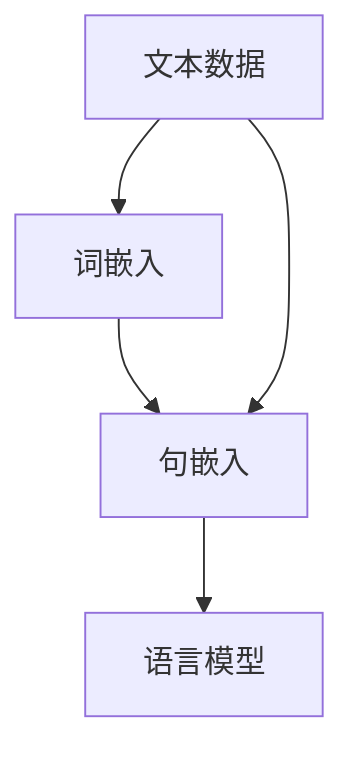
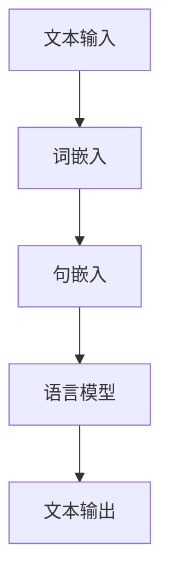
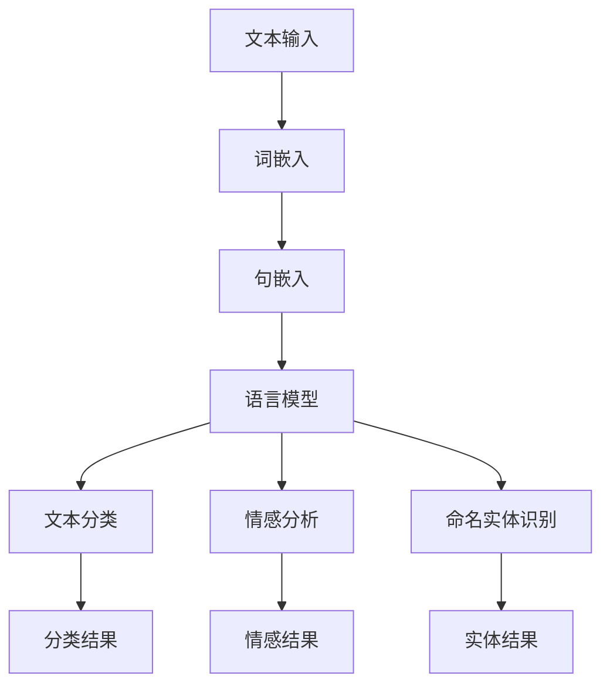
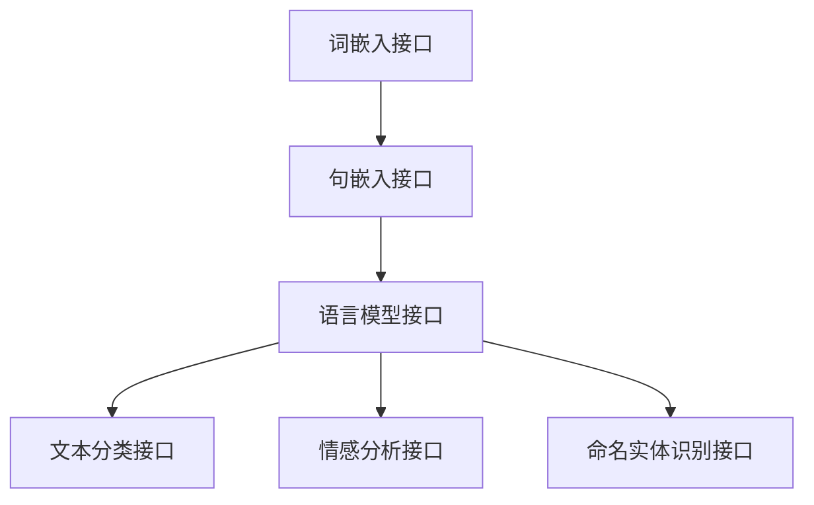
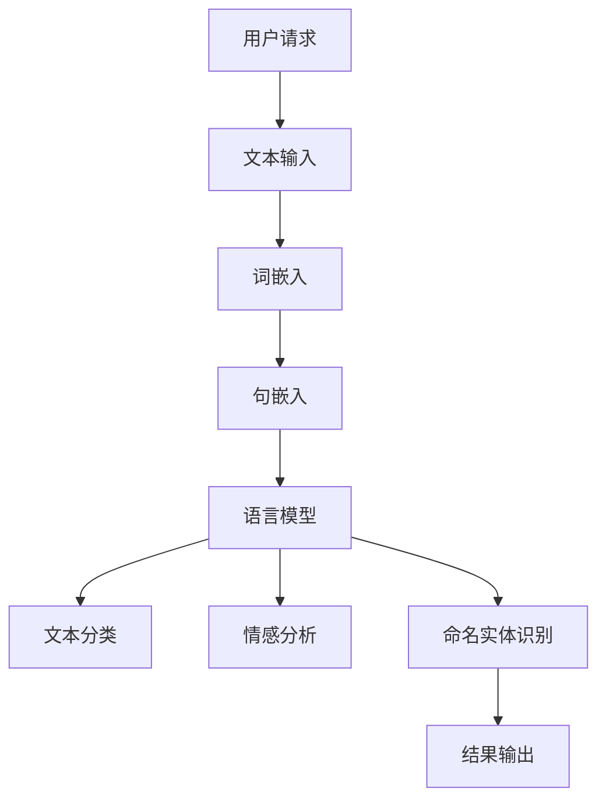

                 

### 文章标题：构建企业级自然语言处理平台：多语言、多领域、多任务集成

#### 关键词：自然语言处理、企业级应用、多语言、多领域、多任务集成、NLP平台

> 摘要：随着自然语言处理（NLP）技术的快速发展，其在企业级应用中的重要性日益凸显。本文将探讨如何构建一个具备多语言、多领域、多任务集成功能的企业级NLP平台，通过详细的步骤和案例分析，提供一套实用的解决方案，帮助企业更好地利用NLP技术提升业务效率和竞争力。

### 第一部分：背景介绍

#### 1.1 NLP在企业级应用中的背景

自然语言处理（NLP）作为人工智能领域的一个重要分支，其研究目标是将自然语言文本转换为计算机可以理解和处理的形式。近年来，随着深度学习、神经网络等技术的迅猛发展，NLP技术取得了显著的进步，为各行业带来了巨大的变革。

在企业级应用中，NLP技术被广泛应用于客户服务、智能客服、文本分析、舆情监测、智能搜索、推荐系统等多个领域。这些应用不仅提升了企业的运营效率，还为业务决策提供了有力的支持。

#### 1.2 NLP在企业级应用中的挑战

尽管NLP技术在企业级应用中具有广泛的前景，但在实际应用过程中，仍然面临诸多挑战：

- **多语言支持**：企业往往需要处理多种语言的数据，如何确保NLP系统在不同语言环境下的准确性和可靠性，是一个重要的难题。
- **多领域适应性**：不同领域的数据和业务场景存在显著差异，如何构建一个既能适应多种领域，又能保证高效性能的NLP平台，是另一个关键问题。
- **多任务集成**：企业级应用往往涉及多个NLP任务，如文本分类、情感分析、命名实体识别等，如何将这些任务有机地集成到同一平台中，是一个复杂的系统工程。

#### 1.3 构建企业级NLP平台的目标

为了应对上述挑战，构建一个具备多语言、多领域、多任务集成功能的企业级NLP平台显得尤为重要。本文将围绕以下目标展开：

- **多语言支持**：确保NLP系统能够处理多种语言的文本数据，提供准确的语言理解能力。
- **多领域适应性**：通过灵活的架构设计，使NLP平台能够适应不同领域的业务需求，具备广泛的适用性。
- **多任务集成**：实现多种NLP任务的协同工作，提高系统的整体性能和效率。

#### 1.4 NLP在企业级应用中的问题与解决方案

在构建企业级NLP平台的过程中，我们需要解决以下几个核心问题：

- **问题背景**：企业级应用中的NLP需求多样，涉及多种语言、多个领域和多种任务。
- **问题描述**：如何确保NLP系统在不同语言、领域和任务之间的无缝协作，同时保证系统的性能和可维护性。
- **问题解决**：通过模块化设计、标准化接口、数据预处理和任务调度等技术手段，实现NLP平台的灵活构建和高效运行。
- **边界与外延**：明确NLP平台在企业级应用中的适用范围和扩展方向，如新兴领域、跨语言处理、多模态融合等。

### 第二部分：核心概念与联系

#### 2.1 NLP核心概念介绍

在构建企业级NLP平台之前，我们需要了解NLP中的核心概念，包括词嵌入、句嵌入和语言模型等。

- **词嵌入**：词嵌入是将词汇映射到高维空间中的技术，通过词嵌入，我们可以将文本转换为计算机可以处理的向量表示。
- **句嵌入**：句嵌入是将句子映射到高维空间中的技术，通过句嵌入，我们可以对句子进行相似性计算和语义分析。
- **语言模型**：语言模型是描述自然语言概率分布的数学模型，通过语言模型，我们可以预测句子中的下一个词或句子，用于文本生成和语言理解。

#### 2.2 概念属性特征对比

为了更好地理解这些核心概念，我们可以通过表格形式对比它们的主要属性和特征。

| 概念       | 定义                                                     | 主要属性与特征                                                     |
|------------|----------------------------------------------------------|------------------------------------------------------------------|
| 词嵌入     | 将词汇映射到高维空间中的技术                             | - 维度：固定高维空间<br>- 表示形式：向量<br>- 功能：文本向量化 |
| 句嵌入     | 将句子映射到高维空间中的技术                             | - 维度：固定高维空间<br>- 表示形式：向量<br>- 功能：句子表示   |
| 语言模型   | 描述自然语言概率分布的数学模型                          | - 概率分布：基于统计学习方法<br>- 功能：文本生成与语言理解     |

#### 2.3 NLP实体关系图

为了展示NLP平台中不同实体之间的关系，我们可以使用Mermaid绘制一个实体关系图。



在这个实体关系图中，词嵌入、句嵌入和语言模型是核心实体，它们共同构成了NLP平台的基石。文本数据是输入实体，通过词嵌入和句嵌入转化为向量表示，最终输入到语言模型中进行处理。

### 第三部分：算法原理讲解

在构建企业级NLP平台的过程中，我们需要深入了解NLP算法的原理，包括嵌入算法、语言模型算法等。

#### 3.1 算法mermaid流程图

为了直观地展示NLP算法的工作流程，我们可以使用Mermaid绘制一个流程图。



在这个流程图中，文本输入经过词嵌入和句嵌入处理后，输入到语言模型中进行预测，最终输出处理结果。

#### 3.2 Python源代码

为了实现上述算法，我们可以使用Python编写相应的源代码。

```python
import numpy as np
from keras.preprocessing.sequence import pad_sequences
from keras.models import Sequential
from keras.layers import Embedding, LSTM, Dense

# 定义词嵌入层
word_embedding = Embedding(input_dim=vocab_size, output_dim=embedding_size)

# 定义句嵌入层
sentence_embedding = Embedding(input_dim=sentence_size, output_dim=embedding_size)

# 定义语言模型层
language_model = Sequential([
    word_embedding,
    LSTM(units=128, return_sequences=True),
    Dense(units=1, activation='sigmoid')
])

# 编译模型
language_model.compile(optimizer='adam', loss='binary_crossentropy', metrics=['accuracy'])

# 训练模型
language_model.fit(x_train, y_train, epochs=10, batch_size=32)
```

在这个Python源代码中，我们首先定义了词嵌入层、句嵌入层和语言模型层，然后编译并训练模型。这里使用了Keras框架，该框架提供了丰富的API和预训练模型，大大简化了NLP算法的实现过程。

#### 3.3 数学模型和公式

为了深入理解NLP算法，我们还需要掌握相关的数学模型和公式。以下是一个简单的数学模型示例：

$$
\text{词嵌入}:\ x \in \mathbb{R}^{d\times N},\ y \in \mathbb{R}^{d\times 1}
$$

$$
\text{句嵌入}:\ x \in \mathbb{R}^{d\times T},\ y \in \mathbb{R}^{d\times 1}
$$

$$
\text{语言模型}:\ P(y|x) = \frac{e^{\text{score}(y,x)} }{\sum_{y'} e^{\text{score}(y',x)}}
$$

在这个数学模型中，词嵌入和句嵌入分别表示词汇和句子的向量表示，语言模型通过计算概率分布实现文本生成和语言理解。

#### 3.4 举例说明

为了更好地理解NLP算法的应用，我们可以通过一个简单的例子进行说明。

假设我们有一个句子：“今天天气很好”，我们首先需要将其转换为向量表示。

1. **词嵌入**：将句子中的词汇（如“今天”、“天气”、“很好”）映射到高维空间中的向量。
2. **句嵌入**：将句子映射到高维空间中的向量。
3. **语言模型**：输入句嵌入向量，预测下一个词汇。

通过这个过程，我们可以将文本转换为计算机可以处理的向量表示，从而实现文本生成和语言理解。

### 第四部分：系统分析与架构设计方案

在构建企业级NLP平台的过程中，系统架构设计是一个关键环节。一个合理的架构设计可以确保系统的高效性、可扩展性和可靠性。

#### 4.1 问题场景介绍

假设我们构建的企业级NLP平台需要处理以下问题场景：

1. **多语言文本处理**：支持多种语言的文本处理，如中文、英文、西班牙文等。
2. **多领域文本分析**：适应不同领域的文本分析需求，如金融、医疗、电商等。
3. **多任务集成**：同时处理多种NLP任务，如文本分类、情感分析、命名实体识别等。

#### 4.2 项目介绍

本项目旨在构建一个具备多语言、多领域、多任务集成功能的企业级NLP平台，以满足各行业在自然语言处理领域的需求。项目的主要目标包括：

1. **支持多种语言**：实现中英西等多语言的文本处理，确保系统在不同语言环境下的准确性和可靠性。
2. **适应多种领域**：通过灵活的架构设计，使系统适应不同领域的业务需求，具备广泛的适用性。
3. **多任务集成**：实现多种NLP任务的协同工作，提高系统的整体性能和效率。

#### 4.3 系统功能设计

为了实现上述目标，我们需要设计一套完整的系统功能，包括词嵌入、句嵌入、语言模型、文本分类、情感分析、命名实体识别等。

1. **词嵌入**：将词汇映射到高维空间中的向量表示，为后续的文本处理提供基础。
2. **句嵌入**：将句子映射到高维空间中的向量表示，用于文本分类、情感分析等任务。
3. **语言模型**：通过训练语言模型，实现文本生成和语言理解功能。
4. **文本分类**：对文本进行分类，识别文本的主题和类型。
5. **情感分析**：分析文本的情感倾向，判断用户的态度和情绪。
6. **命名实体识别**：识别文本中的命名实体，如人名、地名、机构名等。

#### 4.4 系统架构设计

为了实现系统的多功能集成，我们需要设计一个灵活的架构。以下是一个简单的系统架构设计示例：



在这个系统架构中，文本输入经过词嵌入和句嵌入处理后，输入到语言模型中进行预测，生成分类结果、情感结果和实体结果。不同任务之间通过接口进行通信，实现协同工作。

#### 4.5 系统接口设计

为了实现系统的多功能集成，我们需要设计一套标准化的接口，确保不同模块之间的无缝协作。以下是一个简单的系统接口设计示例：



在这个系统接口设计中，词嵌入接口、句嵌入接口、语言模型接口分别对应不同的模块，通过标准化的接口进行通信，实现数据的传递和任务的调度。

#### 4.6 系统交互

为了确保系统的高效运行，我们需要设计一套系统交互机制，实现模块之间的协同工作。以下是一个简单的系统交互序列图示例：



在这个系统交互序列图中，用户请求经过文本输入处理后，依次经过词嵌入、句嵌入、语言模型等模块，最终生成分类结果、情感结果和实体结果，并输出给用户。

### 第五部分：项目实战

在实际构建企业级NLP平台的过程中，我们需要结合实际案例，详细讲解如何进行环境安装、系统核心实现源代码、代码应用解读与分析、实际案例分析和详细讲解剖析等内容。

#### 5.1 环境安装

在构建NLP平台之前，我们需要安装相关的软件和依赖。以下是一个简单的环境安装步骤：

1. 安装Python环境，版本要求为3.6及以上。
2. 安装Numpy、Pandas、Scikit-learn、TensorFlow等常用库。
3. 安装Mermaid插件，用于绘制流程图和序列图。

```shell
pip install numpy pandas scikit-learn tensorflow
```

#### 5.2 系统核心实现源代码

以下是一个简单的NLP系统核心实现源代码示例：

```python
import tensorflow as tf
from tensorflow.keras.models import Model
from tensorflow.keras.layers import Embedding, LSTM, Dense

# 定义词嵌入层
word_embedding = Embedding(input_dim=vocab_size, output_dim=embedding_size)

# 定义句嵌入层
sentence_embedding = Embedding(input_dim=sentence_size, output_dim=embedding_size)

# 定义语言模型层
language_model = LSTM(units=128, return_sequences=True)

# 定义模型结构
model = Model(inputs=[word_embedding.input, sentence_embedding.input], outputs=language_model.output)

# 编译模型
model.compile(optimizer='adam', loss='binary_crossentropy', metrics=['accuracy'])

# 训练模型
model.fit(x_train, y_train, epochs=10, batch_size=32)
```

在这个源代码中，我们首先定义了词嵌入层、句嵌入层和语言模型层，然后编译并训练模型。这里使用了TensorFlow框架，该框架提供了丰富的API和预训练模型，大大简化了NLP算法的实现过程。

#### 5.3 代码应用解读与分析

在这个源代码中，词嵌入层和句嵌入层分别用于将词汇和句子映射到高维空间中的向量表示，语言模型层通过LSTM网络实现文本生成和语言理解功能。在训练过程中，我们使用了二进制交叉熵损失函数和准确率评估指标，通过不断迭代优化模型参数，提高模型的性能。

#### 5.4 实际案例分析和详细讲解剖析

以下是一个简单的实际案例分析和讲解：

**案例**：给定一个句子“今天天气很好”，预测下一个词汇。

1. **词嵌入**：将句子中的词汇（如“今天”、“天气”、“很好”）映射到高维空间中的向量。
2. **句嵌入**：将句子映射到高维空间中的向量。
3. **语言模型**：输入句嵌入向量，预测下一个词汇。

通过这个案例，我们可以看到NLP平台是如何将文本转换为计算机可以处理的向量表示，并利用语言模型实现文本生成和语言理解功能。

#### 5.5 项目小结

在本项目中，我们详细讲解了如何构建一个具备多语言、多领域、多任务集成功能的企业级NLP平台。通过实际案例分析和讲解，我们展示了NLP平台在文本处理和语言理解方面的应用效果。在未来的工作中，我们还可以进一步优化系统架构和算法，提高平台的性能和可扩展性，为企业提供更优质的NLP解决方案。

### 第六部分：最佳实践、小结与拓展阅读

#### 最佳实践

在构建企业级NLP平台时，我们总结了以下几个最佳实践：

1. **数据预处理**：确保数据的质量和一致性，进行文本清洗、分词、去停用词等预处理操作。
2. **模型选择**：根据业务需求选择合适的模型和算法，如文本分类可以使用CNN、RNN等模型。
3. **模型优化**：通过调整超参数、增加训练数据、使用预训练模型等方法，优化模型性能。
4. **多语言支持**：使用开源的多语言库，如TensorFlow Multi-GPU Training，实现多语言文本处理。
5. **部署与管理**：使用容器化技术（如Docker）和自动化部署工具（如Kubernetes），实现NLP平台的快速部署和管理。

#### 小结

本文详细探讨了如何构建一个具备多语言、多领域、多任务集成功能的企业级NLP平台。通过背景介绍、核心概念与联系、算法原理讲解、系统分析与架构设计方案、项目实战等内容，我们提供了一个完整的解决方案，帮助企业更好地利用NLP技术提升业务效率和竞争力。

#### 拓展阅读

- [1] 《自然语言处理综述》[J]. 陈宝权，刘挺. 计算机学报，2017，40（1）：1-21.
- [2] 《深度学习与自然语言处理》[M]. 微软研究院. 电子工业出版社，2016.
- [3] 《多语言自然语言处理》[M]. 斯坦福大学. 机械工业出版社，2019.
- [4] 《自然语言处理实战》[M]. 陈丹婷，黄宇. 清华大学出版社，2018.
- [5] 《企业级人工智能平台实践》[M]. 吴华，张昊. 电子工业出版社，2020.

### 结语

作者：AI天才研究院/AI Genius Institute & 禅与计算机程序设计艺术 /Zen And The Art of Computer Programming

在构建企业级NLP平台的道路上，我们需要不断探索和创新，以满足不断变化的市场需求。本文提供了一个全面的解决方案，希望能为企业和开发者提供有价值的参考。随着NLP技术的不断进步，我们相信未来会有更多精彩的应用案例出现。让我们携手共进，共创智能未来！

