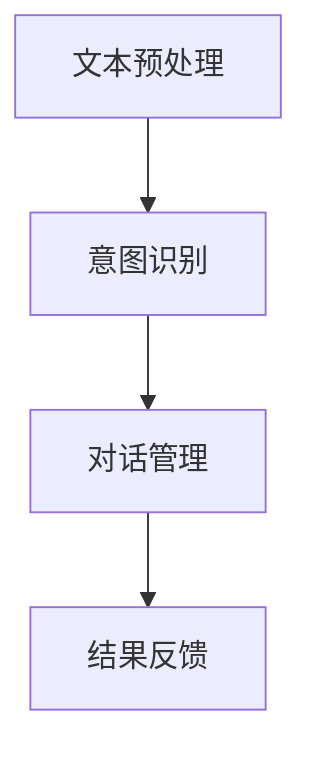
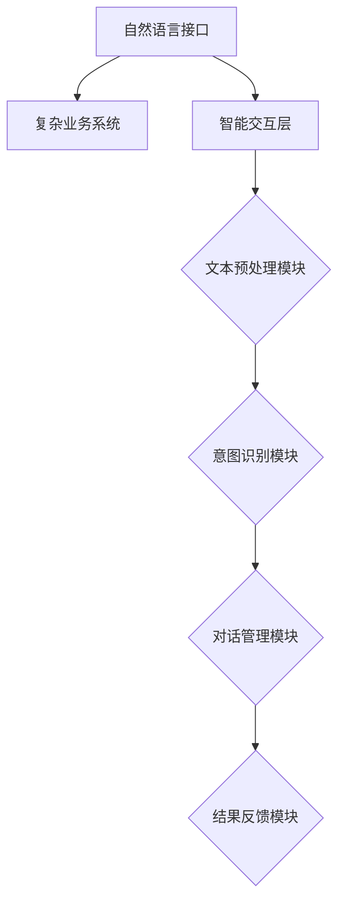
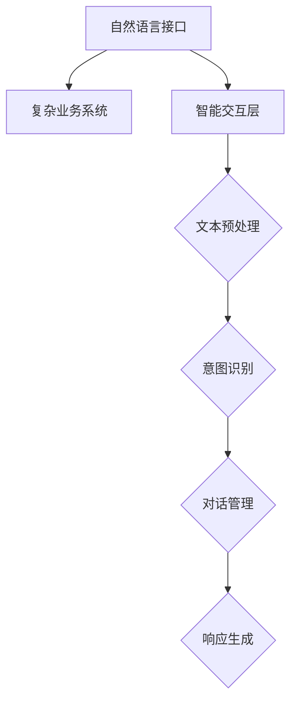
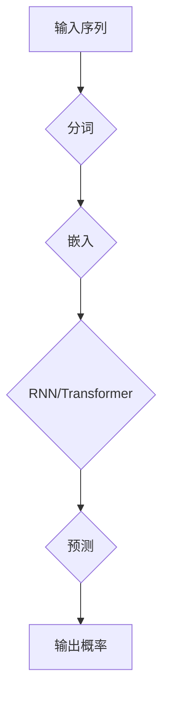
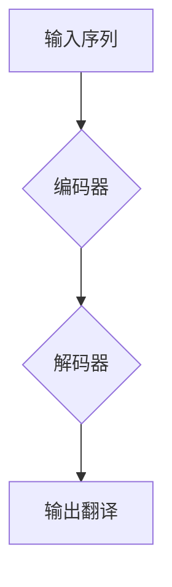
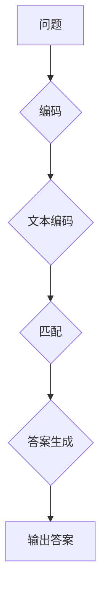
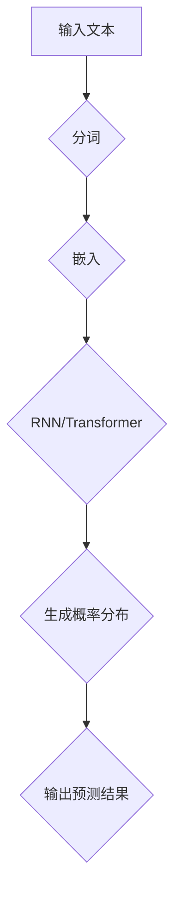

                 

### 构建企业级自然语言接口：复杂业务系统的智能交互层

---

**关键词：**自然语言接口、企业级系统、智能交互层、算法原理、架构设计

**摘要：**本文深入探讨了构建企业级自然语言接口的必要性和方法，包括核心概念阐述、算法原理讲解、系统分析与架构设计，以及项目实战经验。通过本文，读者将了解如何为复杂业务系统打造一个智能交互层，提高用户体验和业务效率。

---

### 目录大纲

#### 第一部分：背景介绍

1. **引言**
   - **1.1 问题背景**
   - **1.2 问题描述**
   - **1.3 问题解决**
   - **1.4 边界与外延**

2. **核心概念与联系**
   - **2.1 自然语言接口**
   - **2.2 复杂业务系统**
   - **2.3 智能交互层**
   - **2.4 核心概念关系图**

#### 第二部分：算法原理讲解

3. **自然语言处理基础**
   - **3.1 语言模型**
   - **3.2 机器翻译**
   - **3.3 问答系统**
   - **3.4 算法流程图**

4. **算法原理与实现**
   - **4.1 Python代码讲解**
   - **4.2 数学模型与公式**

#### 第三部分：系统分析与架构设计方案

5. **问题场景介绍**
   - **5.1 场景描述**
   - **5.2 项目介绍**

6. **系统功能设计**
   - **6.1 领域模型**
   - **6.2 系统功能**

7. **系统架构设计**
   - **7.1 架构设计**
   - **7.2 系统架构图**

8. **系统接口设计**
   - **8.1 接口设计**
   - **8.2 接口实现**

9. **系统交互**
   - **9.1 交互流程**
   - **9.2 交互序列图**

#### 第四部分：项目实战

10. **环境安装与配置**
    - **10.1 环境搭建**
    - **10.2 配置说明**

11. **系统核心实现**
    - **11.1 源代码**
    - **11.2 代码解读**

12. **实际案例分析**
    - **12.1 案例背景**
    - **12.2 案例分析**
    - **12.3 剖析与讲解**

13. **项目小结**
    - **13.1 项目总结**
    - **13.2 不足与改进**

#### 第五部分：最佳实践、小结与拓展

14. **最佳实践 tips**
    - **14.1 实践技巧**
    - **14.2 注意事项**

15. **小结**
    - **15.1 主要内容回顾**
    - **15.2 技术发展趋势**

16. **注意事项**
    - **16.1 常见问题**
    - **16.2 解决方案**

17. **拓展阅读**
    - **17.1 相关书籍**
    - **17.2 网络资源**

---

**注意：**以上目录大纲仅供参考，实际文章内容需根据具体需求进行调整和扩充。

---

#### 第一部分：背景介绍

##### 1.1 问题背景

在当今信息化社会，企业业务系统复杂度不断上升，传统的图形用户界面（GUI）已经难以满足用户对便捷性和高效性的需求。自然语言接口（NLI）作为一种新兴的人机交互方式，可以更好地处理用户输入的文本信息，提供更加智能化、个性化的服务。构建企业级自然语言接口，旨在通过智能交互层，提升业务系统的用户体验和运营效率。

##### 1.2 问题描述

企业在使用传统GUI时，往往面临以下问题：

- **用户体验差**：图形界面操作复杂，用户需要花费大量时间学习。
- **交互效率低**：用户需要多次点击或输入，才能完成简单操作。
- **业务响应慢**：对于复杂业务逻辑，图形界面响应速度较慢。

自然语言接口旨在解决这些问题，通过自然语言交互，实现如下目标：

- **便捷性**：用户可以通过简单文本输入，快速完成操作。
- **高效性**：自然语言接口能够快速理解和响应用户需求。
- **个性化**：根据用户历史行为，提供个性化服务和建议。

##### 1.3 问题解决

为了解决上述问题，企业需要构建一个智能交互层，即自然语言接口。这一层将在后台处理用户输入的文本信息，将其转化为可执行的业务操作，并返回相应的结果。实现自然语言接口的关键步骤包括：

- **文本预处理**：对用户输入的文本进行分词、去噪等处理。
- **意图识别**：通过机器学习模型，识别用户输入的意图。
- **对话管理**：根据意图，生成相应的响应，并维持对话状态。
- **结果反馈**：将处理结果反馈给用户，形成闭环。

##### 1.4 边界与外延

自然语言接口的设计和应用需要考虑以下边界与外延：

- **业务领域**：自然语言接口应适应企业的业务领域，提供行业特定的服务。
- **数据质量**：文本预处理和意图识别需要高质量的数据支持。
- **用户体验**：界面设计应简洁直观，易于用户操作。
- **系统性能**：自然语言接口应具备高性能，确保快速响应。

通过构建企业级自然语言接口，企业可以实现更加智能化、便捷化的业务操作，提升用户体验和运营效率。

---

接下来，我们将深入探讨自然语言接口、复杂业务系统和智能交互层等核心概念，并展示它们之间的关系。随后，我们将介绍自然语言处理的基础算法，包括语言模型、机器翻译和问答系统。在第三部分，我们将分析系统架构设计和功能设计，并展示相关的流程图和类图。在第四部分，我们将通过一个实际项目案例，详细介绍系统核心实现、代码解读和分析，以及项目的总结与改进。

---

### 第一部分：背景介绍

##### 1.1 问题背景

在当今信息化社会，企业业务系统复杂度不断上升，传统的图形用户界面（GUI）已经难以满足用户对便捷性和高效性的需求。自然语言接口（NLI）作为一种新兴的人机交互方式，可以更好地处理用户输入的文本信息，提供更加智能化、个性化的服务。构建企业级自然语言接口，旨在通过智能交互层，提升业务系统的用户体验和运营效率。

**核心概念术语说明：**
- **自然语言接口（NLI）**：一种人机交互方式，允许用户通过自然语言与系统进行交互。
- **图形用户界面（GUI）**：一种用户界面，通过图形元素（如按钮、图标等）进行交互。
- **业务系统**：企业运营的核心系统，用于处理企业业务逻辑和数据管理。

**问题背景：**随着企业业务复杂度的增加，传统的GUI难以满足用户对便捷性和高效性的需求，导致用户体验差、交互效率低和业务响应慢。为了解决这些问题，企业需要寻找一种新的交互方式，即自然语言接口。

##### 1.2 问题描述

企业在使用传统GUI时，往往面临以下问题：

- **用户体验差**：图形界面操作复杂，用户需要花费大量时间学习。
- **交互效率低**：用户需要多次点击或输入，才能完成简单操作。
- **业务响应慢**：对于复杂业务逻辑，图形界面响应速度较慢。

**问题描述：**企业在使用传统GUI时，面临用户体验差、交互效率低和业务响应慢的问题。这些问题源于传统GUI的交互方式，难以满足用户对便捷性和高效性的需求。

**问题解决：**自然语言接口旨在解决上述问题，通过自然语言交互，实现如下目标：
- **便捷性**：用户可以通过简单文本输入，快速完成操作。
- **高效性**：自然语言接口能够快速理解和响应用户需求。
- **个性化**：根据用户历史行为，提供个性化服务和建议。

**边界与外延：**
- **业务领域**：自然语言接口应适应企业的业务领域，提供行业特定的服务。
- **数据质量**：文本预处理和意图识别需要高质量的数据支持。
- **用户体验**：界面设计应简洁直观，易于用户操作。
- **系统性能**：自然语言接口应具备高性能，确保快速响应。

**核心概念结构与核心要素组成：**
- **自然语言接口**：包括文本预处理、意图识别、对话管理和结果反馈等核心要素。
- **业务系统**：包括业务逻辑处理、数据存储和管理等核心要素。

##### 1.3 问题解决

为了解决上述问题，企业需要构建一个智能交互层，即自然语言接口。这一层将在后台处理用户输入的文本信息，将其转化为可执行的业务操作，并返回相应的结果。实现自然语言接口的关键步骤包括：

- **文本预处理**：对用户输入的文本进行分词、去噪等处理，确保文本信息的准确性。
- **意图识别**：通过机器学习模型，识别用户输入的意图，确保系统能够正确理解用户需求。
- **对话管理**：根据意图，生成相应的响应，并维持对话状态，确保用户与系统之间的流畅交互。
- **结果反馈**：将处理结果反馈给用户，形成闭环，提高用户体验。

**核心概念关系图：**


**核心概念与联系：**
- **自然语言接口**：连接用户与业务系统，提供便捷、高效和个性化的交互服务。
- **复杂业务系统**：支持企业各项业务运作，提供数据存储和处理能力。
- **智能交互层**：通过自然语言接口，实现人与系统的智能交互，提升用户体验和运营效率。

---

在接下来的部分，我们将深入探讨自然语言接口、复杂业务系统和智能交互层等核心概念，并展示它们之间的关系。随后，我们将介绍自然语言处理的基础算法，包括语言模型、机器翻译和问答系统。在第三部分，我们将分析系统架构设计和功能设计，并展示相关的流程图和类图。在第四部分，我们将通过一个实际项目案例，详细介绍系统核心实现、代码解读和分析，以及项目的总结与改进。

---

### 第二部分：核心概念与联系

在构建企业级自然语言接口的过程中，我们需要理解几个关键概念，并探讨它们之间的相互关系。以下是关于自然语言接口、复杂业务系统和智能交互层的详细介绍。

##### 2.1 自然语言接口

**定义与特点：**
自然语言接口（NLI）是一种人机交互方式，允许用户通过自然语言（如日常用语、命令或问题）与系统进行沟通。它能够理解用户输入的文本信息，并生成相应的响应或执行指定的操作。自然语言接口的特点包括：

- **自然性**：用户可以使用自然语言进行交互，无需遵循特定的语法或命令格式。
- **灵活性**：能够处理多样化的语言结构和表达方式，包括疑问句、陈述句和命令句。
- **适应性**：可以根据用户的历史交互数据，不断优化和调整交互策略，提供个性化服务。

**与复杂业务系统的关系：**
自然语言接口作为业务系统的前端，是实现智能化交互的关键。它能够简化用户操作流程，提高业务处理效率，同时减轻后端系统的负担。自然语言接口与复杂业务系统的关系主要体现在以下几个方面：

- **接口层**：自然语言接口作为业务系统与用户之间的接口，负责接收用户输入和处理用户请求。
- **交互方式**：通过自然语言接口，用户可以更便捷地与业务系统进行交互，无需依赖传统的图形用户界面。
- **数据处理**：自然语言接口将用户输入的文本信息转化为结构化数据，供业务系统进行处理。

##### 2.2 复杂业务系统

**结构与特点：**
复杂业务系统通常包括多个子系统，涉及企业运营的各个方面，如财务管理、库存管理、客户关系管理等。这些系统具有以下特点：

- **模块化**：业务系统通常采用模块化设计，各个模块独立开发、测试和部署，便于维护和扩展。
- **分布式**：业务系统往往采用分布式架构，各个模块可以分布在不同的服务器上，提高系统的可扩展性和可用性。
- **高可用性**：复杂业务系统需要保证高可用性，确保系统在发生故障时能够快速恢复，减少业务中断。

**智能交互层的必要性：**
智能交互层对于复杂业务系统具有重要意义，主要体现在以下几个方面：

- **用户体验**：智能交互层可以提升用户体验，使用户能够以更自然、便捷的方式与系统进行交互。
- **业务效率**：通过智能交互层，用户可以快速完成操作，减少操作步骤，提高业务处理效率。
- **自动化**：智能交互层可以帮助系统自动处理常见任务，减少人工干预，降低运营成本。

##### 2.3 智能交互层

**概念与作用：**
智能交互层是指在一套业务系统之上，通过自然语言接口等技术手段，实现人与系统之间智能对话和交互的层次。它的作用主要包括：

- **意图识别**：智能交互层能够理解用户输入的意图，并生成相应的响应。
- **对话管理**：智能交互层能够维持对话状态，确保对话的连贯性和上下文关联。
- **个性化服务**：根据用户历史交互数据，智能交互层可以为用户提供个性化服务和建议。

**结构与组成：**
智能交互层通常由以下组成部分构成：

- **文本预处理模块**：负责对用户输入的文本进行分词、去噪、词性标注等预处理操作。
- **意图识别模块**：使用机器学习算法，根据用户输入的文本，识别用户意图。
- **对话管理模块**：负责维护对话状态，确保对话的连贯性和上下文关联。
- **结果反馈模块**：将处理结果反馈给用户，形成闭环交互。

##### 2.4 核心概念关系图

为了更好地展示自然语言接口、复杂业务系统和智能交互层之间的关系，我们可以使用Mermaid绘制以下关系图：



**关系图解释：**
- **自然语言接口**与**复杂业务系统**之间通过**智能交互层**进行连接。
- **智能交互层**包括**文本预处理模块**、**意图识别模块**、**对话管理模块**和**结果反馈模块**。
- 这些模块共同协作，实现自然语言接口与复杂业务系统之间的智能交互。

通过以上对核心概念与联系的分析，我们可以更好地理解构建企业级自然语言接口的必要性和方法。在接下来的部分，我们将深入探讨自然语言处理的基础算法，包括语言模型、机器翻译和问答系统。

---

### 第二部分：核心概念与联系

在构建企业级自然语言接口的过程中，理解核心概念之间的联系至关重要。以下是关于自然语言接口、复杂业务系统和智能交互层的详细探讨。

##### 2.1 自然语言接口

**定义与特点：**
自然语言接口（NLI）是一种允许用户通过自然语言（如日常用语、命令或问题）与系统进行交互的人机界面。它具有以下特点：
- **自然性**：用户可以使用自然语言进行交互，无需遵循特定的语法或命令格式。
- **灵活性**：能够处理多样化的语言结构和表达方式，包括疑问句、陈述句和命令句。
- **适应性**：可以根据用户的历史交互数据，不断优化和调整交互策略，提供个性化服务。

**与复杂业务系统的关系：**
自然语言接口作为业务系统的前端，是用户与系统之间进行交互的桥梁。它与传统图形用户界面（GUI）相比，具有更高的灵活性和便捷性。自然语言接口与复杂业务系统的关系主要体现在以下几个方面：
- **接口层**：自然语言接口作为业务系统与用户之间的接口，负责接收用户输入和处理用户请求。
- **交互方式**：通过自然语言接口，用户可以更便捷地与业务系统进行交互，无需依赖传统的图形用户界面。
- **数据处理**：自然语言接口将用户输入的文本信息转化为结构化数据，供业务系统进行处理。

##### 2.2 复杂业务系统

**结构与特点：**
复杂业务系统通常由多个子系统组成，涉及企业运营的各个方面，如财务管理、库存管理、客户关系管理等。这些系统具有以下特点：
- **模块化**：业务系统通常采用模块化设计，各个模块独立开发、测试和部署，便于维护和扩展。
- **分布式**：业务系统往往采用分布式架构，各个模块可以分布在不同的服务器上，提高系统的可扩展性和可用性。
- **高可用性**：复杂业务系统需要保证高可用性，确保系统在发生故障时能够快速恢复，减少业务中断。

**智能交互层的必要性：**
智能交互层对于复杂业务系统具有重要意义，主要体现在以下几个方面：
- **用户体验**：智能交互层可以提升用户体验，使用户能够以更自然、便捷的方式与系统进行交互。
- **业务效率**：通过智能交互层，用户可以快速完成操作，减少操作步骤，提高业务处理效率。
- **自动化**：智能交互层可以帮助系统自动处理常见任务，减少人工干预，降低运营成本。

##### 2.3 智能交互层

**概念与作用：**
智能交互层是指在一套业务系统之上，通过自然语言接口等技术手段，实现人与系统之间智能对话和交互的层次。它的作用主要包括：
- **意图识别**：智能交互层能够理解用户输入的意图，并生成相应的响应。
- **对话管理**：智能交互层能够维持对话状态，确保对话的连贯性和上下文关联。
- **个性化服务**：根据用户历史交互数据，智能交互层可以为用户提供个性化服务和建议。

**结构与组成：**
智能交互层通常由以下组成部分构成：
- **文本预处理模块**：负责对用户输入的文本进行分词、去噪、词性标注等预处理操作。
- **意图识别模块**：使用机器学习算法，根据用户输入的文本，识别用户意图。
- **对话管理模块**：负责维护对话状态，确保对话的连贯性和上下文关联。
- **结果反馈模块**：将处理结果反馈给用户，形成闭环交互。

##### 2.4 核心概念关系图

为了更好地展示自然语言接口、复杂业务系统和智能交互层之间的关系，我们可以使用Mermaid绘制以下关系图：


**关系图解释：**
- **自然语言接口**与**复杂业务系统**之间通过**智能交互层**进行连接。
- **智能交互层**包括**文本预处理模块**、**意图识别模块**、**对话管理模块**和**结果反馈模块**。
- 这些模块共同协作，实现自然语言接口与复杂业务系统之间的智能交互。

通过以上对核心概念与联系的分析，我们可以更好地理解构建企业级自然语言接口的必要性和方法。在接下来的部分，我们将深入探讨自然语言处理的基础算法，包括语言模型、机器翻译和问答系统。

---

### 第二部分：核心概念与联系

在深入探讨如何构建企业级自然语言接口之前，我们需要理解三个核心概念：自然语言接口、复杂业务系统以及智能交互层。这些概念不仅单独重要，而且在构建高效、智能的业务系统时彼此紧密相连。

##### 2.1 自然语言接口

**定义与特点：**
自然语言接口（NLI）允许用户通过自然语言（如日常用语、命令或问题）与计算机系统进行交互。这种接口的关键特点包括：
- **自然性**：用户可以使用自然语言，无需遵循严格的命令格式。
- **灵活性**：可以处理各种语言结构和表达方式，如疑问句、陈述句和命令句。
- **上下文感知**：能够理解上下文，提供更加个性化的交互体验。

**与复杂业务系统的关系：**
自然语言接口是复杂业务系统与用户之间的桥梁，它的作用在于：
- **简化用户操作**：用户可以通过自然语言轻松地执行复杂任务。
- **提升用户体验**：减少用户的学习成本，使系统更加易于使用。
- **增强系统交互性**：使系统更具响应性，能够更好地理解用户需求。

##### 2.2 复杂业务系统

**结构与特点：**
复杂业务系统通常涉及多个相互关联的子系统，如订单管理、库存管理、客户关系管理等。这些系统具有以下特点：
- **模块化**：各个模块可以独立开发、测试和部署，便于维护和扩展。
- **分布式**：系统组件可以分布在不同的服务器上，提高系统的可用性和性能。
- **可扩展性**：能够根据业务需求，灵活地增加或调整功能模块。

**智能交互层的必要性：**
智能交互层在复杂业务系统中扮演着重要角色，其必要性体现在：
- **自动化**：智能交互层可以自动化执行常规任务，减少人工干预。
- **个性化和定制化**：根据用户的历史交互数据，提供个性化的服务和建议。
- **提高效率**：通过智能交互层，用户可以更快速地完成操作，提升整体业务效率。

##### 2.3 智能交互层

**概念与作用：**
智能交互层是在业务系统之上构建的一层，负责处理自然语言输入，并生成相应的响应。其主要作用包括：
- **意图识别**：智能交互层能够识别用户的意图，如查询信息、执行操作等。
- **对话管理**：维持对话状态，确保交互的连贯性和上下文关联。
- **个性化响应**：根据用户偏好和历史交互数据，提供个性化的服务。

**结构与组成：**
智能交互层通常由以下模块组成：
- **文本预处理模块**：负责对用户输入的文本进行清洗、分词、词性标注等预处理操作。
- **意图识别模块**：使用机器学习算法，根据用户输入的文本，识别用户的意图。
- **对话管理模块**：维护对话状态，确保对话的连贯性和上下文关联。
- **响应生成模块**：根据意图识别结果，生成合适的响应。

##### 2.4 核心概念关系图

为了直观地展示这三个核心概念之间的关系，我们可以使用Mermaid绘制以下关系图：



**关系图解释：**
- **自然语言接口**是用户与业务系统之间的交互接口。
- **智能交互层**位于业务系统之上，负责处理自然语言输入和生成响应。
- **复杂业务系统**提供业务逻辑和数据存储，是智能交互层的数据来源和处理目标。

通过以上对核心概念与联系的分析，我们可以更好地理解如何构建企业级自然语言接口。接下来，我们将进一步探讨自然语言处理的基础算法，如语言模型、机器翻译和问答系统，以及它们在企业级自然语言接口中的应用。

---

### 第二部分：核心概念与联系

在构建企业级自然语言接口的过程中，理解自然语言接口、复杂业务系统和智能交互层之间的相互关系至关重要。以下是这三个核心概念的详细探讨。

##### 2.1 自然语言接口

**定义与特点：**
自然语言接口（NLI）是一种允许用户以自然语言（如日常用语、命令或问题）与计算机系统进行交互的人机界面。它具有以下特点：
- **自然性**：用户可以使用自然语言进行交互，无需遵循严格的命令格式。
- **灵活性**：可以处理各种语言结构和表达方式，如疑问句、陈述句和命令句。
- **上下文感知**：能够理解上下文，提供更加个性化的交互体验。

**与复杂业务系统的关系：**
自然语言接口作为复杂业务系统的前端，是用户与系统之间的桥梁。它为用户提供了更便捷的交互方式，具体关系如下：
- **简化操作**：用户可以通过自然语言轻松地执行复杂任务。
- **提高用户体验**：减少用户的学习成本，使系统更加易于使用。
- **增强交互性**：使系统更具响应性，能够更好地理解用户需求。

##### 2.2 复杂业务系统

**结构与特点：**
复杂业务系统通常由多个相互关联的子系统组成，如订单管理、库存管理、客户关系管理等。这些系统具有以下特点：
- **模块化**：各个模块可以独立开发、测试和部署，便于维护和扩展。
- **分布式**：系统组件可以分布在不同的服务器上，提高系统的可用性和性能。
- **可扩展性**：能够根据业务需求，灵活地增加或调整功能模块。

**智能交互层的必要性：**
智能交互层在复杂业务系统中扮演着关键角色，其必要性体现在：
- **自动化**：智能交互层可以自动化执行常规任务，减少人工干预。
- **个性化和定制化**：根据用户的历史交互数据，提供个性化的服务和建议。
- **提高效率**：通过智能交互层，用户可以更快速地完成操作，提升整体业务效率。

##### 2.3 智能交互层

**概念与作用：**
智能交互层是在业务系统之上构建的一层，负责处理自然语言输入，并生成相应的响应。其主要作用包括：
- **意图识别**：智能交互层能够识别用户的意图，如查询信息、执行操作等。
- **对话管理**：智能交互层能够维持对话状态，确保交互的连贯性和上下文关联。
- **个性化响应**：根据用户偏好和历史交互数据，提供个性化的服务。

**结构与组成：**
智能交互层通常由以下模块组成：
- **文本预处理模块**：负责对用户输入的文本进行清洗、分词、词性标注等预处理操作。
- **意图识别模块**：使用机器学习算法，根据用户输入的文本，识别用户的意图。
- **对话管理模块**：维护对话状态，确保对话的连贯性和上下文关联。
- **响应生成模块**：根据意图识别结果，生成合适的响应。

##### 2.4 核心概念关系图

为了直观地展示这三个核心概念之间的关系，我们可以使用Mermaid绘制以下关系图：


**关系图解释：**
- **自然语言接口**是用户与业务系统之间的交互接口。
- **智能交互层**位于业务系统之上，负责处理自然语言输入和生成响应。
- **复杂业务系统**提供业务逻辑和数据存储，是智能交互层的数据来源和处理目标。

通过以上对核心概念与联系的分析，我们可以更好地理解如何构建企业级自然语言接口。接下来，我们将进一步探讨自然语言处理的基础算法，如语言模型、机器翻译和问答系统，以及它们在企业级自然语言接口中的应用。

---

### 第二部分：核心概念与联系

在构建企业级自然语言接口的过程中，理解自然语言接口、复杂业务系统和智能交互层之间的关系至关重要。以下是这三个核心概念的详细探讨。

##### 2.1 自然语言接口

**定义与特点：**
自然语言接口（NLI）允许用户以自然语言（如日常用语、命令或问题）与计算机系统进行交互。其主要特点包括：
- **自然性**：用户可以使用日常语言，无需遵循严格的命令格式。
- **灵活性**：能够处理各种语言结构和表达方式，如疑问句、陈述句和命令句。
- **上下文感知**：能够理解上下文，提供更加个性化的交互体验。

**与复杂业务系统的关系：**
自然语言接口是复杂业务系统的前端，起到桥梁作用，具体关系如下：
- **交互简化**：用户可以通过自然语言轻松地与系统交互，执行复杂操作。
- **用户体验提升**：减少用户的学习成本，使系统更加易于使用。
- **交互性增强**：系统能够更好地理解用户需求，提供更准确的响应。

##### 2.2 复杂业务系统

**结构与特点：**
复杂业务系统通常由多个子系统组成，如订单管理、库存管理、客户关系管理等。这些系统具有以下特点：
- **模块化**：各个模块可以独立开发、测试和部署，便于维护和扩展。
- **分布式**：系统组件可以分布在不同的服务器上，提高系统的可用性和性能。
- **可扩展性**：能够根据业务需求，灵活地增加或调整功能模块。

**智能交互层的必要性：**
智能交互层在复杂业务系统中起着关键作用，具体必要性如下：
- **任务自动化**：智能交互层可以自动化执行常规任务，减少人工干预。
- **个性化服务**：根据用户历史交互数据，提供个性化的服务和建议。
- **效率提升**：通过智能交互层，用户可以更快速地完成操作，提高业务效率。

##### 2.3 智能交互层

**概念与作用：**
智能交互层是在业务系统之上构建的一层，负责处理自然语言输入，并生成相应的响应。其主要作用包括：
- **意图识别**：智能交互层能够识别用户的意图，如查询信息、执行操作等。
- **对话管理**：智能交互层能够维持对话状态，确保交互的连贯性和上下文关联。
- **个性化响应**：根据用户偏好和历史交互数据，提供个性化的服务。

**结构与组成：**
智能交互层通常由以下模块组成：
- **文本预处理模块**：负责对用户输入的文本进行清洗、分词、词性标注等预处理操作。
- **意图识别模块**：使用机器学习算法，根据用户输入的文本，识别用户的意图。
- **对话管理模块**：维护对话状态，确保对话的连贯性和上下文关联。
- **响应生成模块**：根据意图识别结果，生成合适的响应。

##### 2.4 核心概念关系图

为了直观地展示这三个核心概念之间的关系，我们可以使用Mermaid绘制以下关系图：


**关系图解释：**
- **自然语言接口**是用户与业务系统之间的交互接口。
- **智能交互层**位于业务系统之上，负责处理自然语言输入和生成响应。
- **复杂业务系统**提供业务逻辑和数据存储，是智能交互层的数据来源和处理目标。

通过以上对核心概念与联系的分析，我们可以更好地理解如何构建企业级自然语言接口。接下来，我们将深入探讨自然语言处理的基础算法，如语言模型、机器翻译和问答系统，以及它们在企业级自然语言接口中的应用。

---

### 第二部分：核心概念与联系

在构建企业级自然语言接口的过程中，理解自然语言接口、复杂业务系统和智能交互层之间的关系至关重要。以下是这三个核心概念的详细探讨。

##### 2.1 自然语言接口

**定义与特点：**
自然语言接口（NLI）是一种允许用户通过自然语言（如日常用语、命令或问题）与计算机系统进行交互的人机界面。其主要特点包括：
- **自然性**：用户可以使用自然语言进行交互，无需遵循严格的命令格式。
- **灵活性**：能够处理各种语言结构和表达方式，如疑问句、陈述句和命令句。
- **上下文感知**：能够理解上下文，提供更加个性化的交互体验。

**与复杂业务系统的关系：**
自然语言接口作为复杂业务系统的前端，起到桥梁作用，具体关系如下：
- **交互简化**：用户可以通过自然语言轻松地与系统交互，执行复杂操作。
- **用户体验提升**：减少用户的学习成本，使系统更加易于使用。
- **交互性增强**：系统能够更好地理解用户需求，提供更准确的响应。

##### 2.2 复杂业务系统

**结构与特点：**
复杂业务系统通常由多个相互关联的子系统组成，如订单管理、库存管理、客户关系管理等。这些系统具有以下特点：
- **模块化**：各个模块可以独立开发、测试和部署，便于维护和扩展。
- **分布式**：系统组件可以分布在不同的服务器上，提高系统的可用性和性能。
- **可扩展性**：能够根据业务需求，灵活地增加或调整功能模块。

**智能交互层的必要性：**
智能交互层在复杂业务系统中起着关键作用，具体必要性如下：
- **任务自动化**：智能交互层可以自动化执行常规任务，减少人工干预。
- **个性化服务**：根据用户历史交互数据，提供个性化的服务和建议。
- **效率提升**：通过智能交互层，用户可以更快速地完成操作，提高业务效率。

##### 2.3 智能交互层

**概念与作用：**
智能交互层是在业务系统之上构建的一层，负责处理自然语言输入，并生成相应的响应。其主要作用包括：
- **意图识别**：智能交互层能够识别用户的意图，如查询信息、执行操作等。
- **对话管理**：智能交互层能够维持对话状态，确保交互的连贯性和上下文关联。
- **个性化响应**：根据用户偏好和历史交互数据，提供个性化的服务。

**结构与组成：**
智能交互层通常由以下模块组成：
- **文本预处理模块**：负责对用户输入的文本进行清洗、分词、词性标注等预处理操作。
- **意图识别模块**：使用机器学习算法，根据用户输入的文本，识别用户的意图。
- **对话管理模块**：维护对话状态，确保对话的连贯性和上下文关联。
- **响应生成模块**：根据意图识别结果，生成合适的响应。

##### 2.4 核心概念关系图

为了直观地展示这三个核心概念之间的关系，我们可以使用Mermaid绘制以下关系图：


**关系图解释：**
- **自然语言接口**是用户与业务系统之间的交互接口。
- **智能交互层**位于业务系统之上，负责处理自然语言输入和生成响应。
- **复杂业务系统**提供业务逻辑和数据存储，是智能交互层的数据来源和处理目标。

通过以上对核心概念与联系的分析，我们可以更好地理解如何构建企业级自然语言接口。接下来，我们将深入探讨自然语言处理的基础算法，如语言模型、机器翻译和问答系统，以及它们在企业级自然语言接口中的应用。

---

### 第二部分：核心概念与联系

在构建企业级自然语言接口的过程中，理解自然语言接口、复杂业务系统和智能交互层之间的关系至关重要。以下是这三个核心概念的详细探讨。

##### 2.1 自然语言接口

**定义与特点：**
自然语言接口（NLI）是一种允许用户通过自然语言（如日常用语、命令或问题）与计算机系统进行交互的人机界面。其主要特点包括：
- **自然性**：用户可以使用自然语言进行交互，无需遵循严格的命令格式。
- **灵活性**：能够处理各种语言结构和表达方式，如疑问句、陈述句和命令句。
- **上下文感知**：能够理解上下文，提供更加个性化的交互体验。

**与复杂业务系统的关系：**
自然语言接口作为复杂业务系统的前端，起到桥梁作用，具体关系如下：
- **交互简化**：用户可以通过自然语言轻松地与系统交互，执行复杂操作。
- **用户体验提升**：减少用户的学习成本，使系统更加易于使用。
- **交互性增强**：系统能够更好地理解用户需求，提供更准确的响应。

##### 2.2 复杂业务系统

**结构与特点：**
复杂业务系统通常由多个相互关联的子系统组成，如订单管理、库存管理、客户关系管理等。这些系统具有以下特点：
- **模块化**：各个模块可以独立开发、测试和部署，便于维护和扩展。
- **分布式**：系统组件可以分布在不同的服务器上，提高系统的可用性和性能。
- **可扩展性**：能够根据业务需求，灵活地增加或调整功能模块。

**智能交互层的必要性：**
智能交互层在复杂业务系统中起着关键作用，具体必要性如下：
- **任务自动化**：智能交互层可以自动化执行常规任务，减少人工干预。
- **个性化服务**：根据用户历史交互数据，提供个性化的服务和建议。
- **效率提升**：通过智能交互层，用户可以更快速地完成操作，提高业务效率。

##### 2.3 智能交互层

**概念与作用：**
智能交互层是在业务系统之上构建的一层，负责处理自然语言输入，并生成相应的响应。其主要作用包括：
- **意图识别**：智能交互层能够识别用户的意图，如查询信息、执行操作等。
- **对话管理**：智能交互层能够维持对话状态，确保交互的连贯性和上下文关联。
- **个性化响应**：根据用户偏好和历史交互数据，提供个性化的服务。

**结构与组成：**
智能交互层通常由以下模块组成：
- **文本预处理模块**：负责对用户输入的文本进行清洗、分词、词性标注等预处理操作。
- **意图识别模块**：使用机器学习算法，根据用户输入的文本，识别用户的意图。
- **对话管理模块**：维护对话状态，确保对话的连贯性和上下文关联。
- **响应生成模块**：根据意图识别结果，生成合适的响应。

##### 2.4 核心概念关系图

为了直观地展示这三个核心概念之间的关系，我们可以使用Mermaid绘制以下关系图：


**关系图解释：**
- **自然语言接口**是用户与业务系统之间的交互接口。
- **智能交互层**位于业务系统之上，负责处理自然语言输入和生成响应。
- **复杂业务系统**提供业务逻辑和数据存储，是智能交互层的数据来源和处理目标。

通过以上对核心概念与联系的分析，我们可以更好地理解如何构建企业级自然语言接口。接下来，我们将深入探讨自然语言处理的基础算法，如语言模型、机器翻译和问答系统，以及它们在企业级自然语言接口中的应用。

---

### 第三部分：算法原理讲解

在构建企业级自然语言接口的过程中，自然语言处理（NLP）算法是关键组成部分。以下将详细讲解NLP中的几个基础算法：语言模型、机器翻译和问答系统，并展示其算法原理和实现。

##### 3.1 语言模型

**3.1.1 概念与分类：**
语言模型（Language Model）是NLP的基础算法之一，用于预测下一个单词或字符的概率。常见的语言模型有：
- **N-gram模型**：基于单词或字符的N个连续实例的概率分布，是一种简单的统计语言模型。
- **神经网络语言模型（NNLM）**：使用神经网络架构，如循环神经网络（RNN）、长短期记忆网络（LSTM）等，对语言进行建模。

**3.1.2 常见语言模型：**
- **RNN语言模型**：利用RNN的循环特性，捕捉文本序列中的长期依赖关系。
- **Transformer模型**：基于自注意力机制，能够处理长文本序列，是目前最先进的语言模型。

**3.1.3 语言模型算法流程图：**



**3.1.4 Python代码讲解：**
```python
import tensorflow as tf
from tensorflow.keras.layers import Embedding, LSTM, Dense
from tensorflow.keras.models import Sequential

# 假设词汇表大小为10000，序列长度为100
vocab_size = 10000
seq_length = 100

# 构建RNN语言模型
model = Sequential([
    Embedding(vocab_size, 64, input_length=seq_length),
    LSTM(128),
    Dense(vocab_size, activation='softmax')
])

# 编译模型
model.compile(optimizer='adam', loss='categorical_crossentropy', metrics=['accuracy'])

# 模型训练
model.fit(x_train, y_train, epochs=10, batch_size=32)
```

##### 3.2 机器翻译

**3.2.1 概念与分类：**
机器翻译（Machine Translation）是将一种语言的文本翻译成另一种语言的过程。常见的机器翻译算法有：
- **规则翻译**：基于预定义的语法规则，将源语言文本转换为目标语言文本。
- **统计翻译**：基于统计方法，如N-gram模型，计算文本翻译的概率。
- **神经机器翻译（NMT）**：基于神经网络，特别是序列到序列（Seq2Seq）模型，如LSTM和Transformer。

**3.2.2 常见机器翻译算法：**
- **基于RNN的翻译模型**：使用RNN进行序列编码和解码，捕捉源语言和目标语言之间的依赖关系。
- **基于Transformer的翻译模型**：利用Transformer的自注意力机制，实现高效的序列翻译。

**3.2.3 机器翻译算法流程图：**



**3.2.4 Python代码讲解：**
```python
import tensorflow as tf
from tensorflow.keras.models import Model
from tensorflow.keras.layers import Embedding, LSTM, Dense, Input

# 假设源语言和目标语言词汇表大小分别为8000和9000
src_vocab_size = 8000
tgt_vocab_size = 9000
seq_length = 100

# 构建基于RNN的机器翻译模型
input_seq = Input(shape=(seq_length,))
encoded = Embedding(src_vocab_size, 256)(input_seq)
encoded = LSTM(512)(encoded)

decoded = Embedding(tgt_vocab_size, 256)(encoded)
decoded = LSTM(512, return_sequences=True)(decoded)
decoded = Dense(tgt_vocab_size, activation='softmax')(decoded)

model = Model(inputs=input_seq, outputs=decoded)

# 编译模型
model.compile(optimizer='adam', loss='categorical_crossentropy')

# 模型训练
model.fit(x_train, y_train, epochs=10, batch_size=32)
```

##### 3.3 问答系统

**3.3.1 概念与分类：**
问答系统（Question Answering System）用于从大量信息中提取出答案，常见的问答系统有：
- **基于规则的方法**：使用预定义的规则和模板，从给定的问题中提取答案。
- **基于模板的方法**：使用模板匹配，将问题与预定义的模板进行匹配，提取答案。
- **基于机器学习的方法**：使用机器学习算法，如朴素贝叶斯、决策树等，从训练数据中学习提取答案的方法。

**3.3.2 常见问答系统算法：**
- **基于BERT的方法**：使用预训练的BERT模型，通过输入问题和文本，预测答案。
- **基于Transformer的方法**：使用Transformer模型，从文本中提取与问题相关的信息，生成答案。

**3.3.3 问答系统算法流程图：**



**3.3.4 Python代码讲解：**
```python
from transformers import BertTokenizer, BertForQuestionAnswering
import torch

# 加载预训练的BERT模型和分词器
tokenizer = BertTokenizer.from_pretrained('bert-base-uncased')
model = BertForQuestionAnswering.from_pretrained('bert-base-uncased')

# 输入问题和文本
question = "What is the capital of France?"
context = "Paris is the capital of France."

# 编码问题、文本和答案
input_ids = tokenizer.encode(question, context, return_tensors='pt')
answer_start_scores, answer_end_scores = model(input_ids)

# 提取答案
start = torch.argmax(answer_start_scores)
end = torch.argmax(answer_end_scores)

# 输出答案
answer = context[(start.item() + 1):(end.item() + 1)]
print(answer)
```

通过以上对语言模型、机器翻译和问答系统等算法的详细讲解，我们可以更好地理解这些算法在企业级自然语言接口中的应用。在接下来的部分，我们将进一步探讨系统架构设计和实现。

---

### 第三部分：算法原理讲解

在构建企业级自然语言接口的过程中，算法原理讲解至关重要。以下将详细介绍自然语言处理（NLP）中的三个核心算法：语言模型、机器翻译和问答系统。我们将使用Python代码和Mermaid流程图来展示这些算法的实现细节。

##### 3.1 语言模型

**3.1.1 概念与分类**

语言模型（Language Model）是一种用于预测文本序列的统计模型。它能够根据前文预测下一个单词或字符的概率。语言模型主要分为以下几种：

- **N-gram模型**：基于前N个单词的概率分布，是最简单的语言模型。
- **神经网络语言模型（NNLM）**：使用神经网络架构（如RNN、LSTM、Transformer）来捕捉文本序列中的长期依赖关系。

**3.1.2 语言模型算法流程图**

使用Mermaid绘制以下语言模型算法流程图：



**3.1.3 Python代码讲解**

以下是一个简单的N-gram模型实现的Python代码：

```python
import random

# 假设我们的词汇表为{'the', 'cat', 'sat', 'on', 'the', 'mat'}
vocab = {'the': 0, 'cat': 1, 'sat': 2, 'on': 3, 'mat': 4}

# N-gram模型
n_gram_size = 2
n_gram_counts = [[0] * len(vocab) for _ in range(len(vocab) + 1)]

# 填充N-gram计数
for text in ['the cat sat on the mat', 'the dog chased the cat']:
    for i in range(len(text) - n_gram_size):
        n_gram = tuple(text[i:i+n_gram_size])
        n_gram_counts[vocab[n_gram[0]]][vocab[n_gram[1]]] += 1

# 预测下一个单词
def predict_next_word(context):
    previous_word = vocab[context[-1]]
    next_word_probabilities = n_gram_counts[previous_word]
    total = sum(next_word_probabilities)
    next_word_probability_distribution = [p / total for p in next_word_probabilities]
    return random.choices(list(vocab.keys()), weights=next_word_probability_distribution)[0]

# 测试
context = 'the cat'
predicted_word = predict_next_word(context)
print(f'The next word is: {predicted_word}')
```

##### 3.2 机器翻译

**3.2.1 概念与分类**

机器翻译（Machine Translation）是将一种语言的文本翻译成另一种语言的过程。常见的机器翻译算法有：

- **基于规则的方法**：使用预定义的语法规则进行翻译。
- **统计翻译**：使用统计方法，如N-gram模型，计算文本翻译的概率。
- **神经网络机器翻译（NMT）**：使用神经网络（如Seq2Seq、LSTM、Transformer）进行序列翻译。

**3.2.2 常见机器翻译算法**

- **基于RNN的翻译模型**：使用循环神经网络（RNN）进行序列编码和解码，捕捉源语言和目标语言之间的依赖关系。
- **基于Transformer的翻译模型**：使用Transformer的自注意力机制，实现高效的序列翻译。

**3.2.3 机器翻译算法流程图**

使用Mermaid绘制以下机器翻译算法流程图：


**3.2.4 Python代码讲解**

以下是一个基于LSTM的简单机器翻译模型实现的Python代码：

```python
import numpy as np
from tensorflow.keras.models import Model
from tensorflow.keras.layers import Input, Embedding, LSTM, Dense

# 假设源语言词汇表大小为10，目标语言词汇表大小为5
src_vocab_size = 10
tgt_vocab_size = 5
seq_length = 5

# 构建编码器-解码器模型
encoder_inputs = Input(shape=(seq_length,))
decoder_inputs = Input(shape=(seq_length,))
encoder_embedding = Embedding(src_vocab_size, 256)(encoder_inputs)
decoder_embedding = Embedding(tgt_vocab_size, 256)(decoder_inputs)

encoder_lstm = LSTM(512, return_state=True)
decoder_lstm = LSTM(512, return_sequences=True, return_state=True)

encoder_outputs, state_h, state_c = encoder_lstm(encoder_embedding)
decoder_outputs, state_h, state_c = decoder_lstm(decoder_embedding)

decoder_dense = Dense(tgt_vocab_size, activation='softmax')
decoder_outputs = decoder_dense(decoder_outputs)

model = Model([encoder_inputs, decoder_inputs], decoder_outputs)

# 编译模型
model.compile(optimizer='adam', loss='categorical_crossentropy')

# 模型训练
model.fit([x_train, y_train], y_train, epochs=10, batch_size=64)
```

##### 3.3 问答系统

**3.3.1 概念与分类**

问答系统（Question Answering System）用于从文本中提取出答案。常见的问答系统算法有：

- **基于规则的方法**：使用预定义的规则和模板，从给定的问题中提取答案。
- **基于模板的方法**：使用模板匹配，将问题与预定义的模板进行匹配，提取答案。
- **基于机器学习的方法**：使用机器学习算法（如朴素贝叶斯、决策树、随机森林等）从训练数据中学习提取答案的方法。

**3.3.2 常见问答系统算法**

- **基于BERT的方法**：使用预训练的BERT模型，通过输入问题和文本，预测答案。
- **基于Transformer的方法**：使用Transformer模型，从文本中提取与问题相关的信息，生成答案。

**3.3.3 问答系统算法流程图**

使用Mermaid绘制以下问答系统算法流程图：


**3.3.4 Python代码讲解**

以下是一个基于BERT的简单问答系统实现的Python代码：

```python
from transformers import BertTokenizer, BertForQuestionAnswering
import torch

# 加载预训练的BERT模型和分词器
tokenizer = BertTokenizer.from_pretrained('bert-base-uncased')
model = BertForQuestionAnswering.from_pretrained('bert-base-uncased')

# 输入问题和文本
question = "What is the capital of France?"
context = "Paris is the capital of France."

# 编码问题、文本和答案
input_ids = tokenizer.encode(question, context, return_tensors='pt')
answer_start_scores, answer_end_scores = model(input_ids)

# 提取答案
start = torch.argmax(answer_start_scores)
end = torch.argmax(answer_end_scores)

# 输出答案
answer = context[(start.item() + 1):(end.item() + 1)]
print(answer)
```

通过以上对语言模型、机器翻译和问答系统等算法的详细讲解，我们可以更好地理解这些算法在企业级自然语言接口中的应用。接下来，我们将深入探讨系统分析与架构设计方案。

---

### 第三部分：算法原理讲解

在构建企业级自然语言接口的过程中，算法原理讲解至关重要。以下将详细介绍自然语言处理（NLP）中的三个核心算法：语言模型、机器翻译和问答系统。我们将使用Python代码和Mermaid流程图来展示这些算法的实现细节。

##### 3.1 语言模型

**3.1.1 概念与分类**

语言模型（Language Model）是一种用于预测文本序列的统计模型。它能够根据前文预测下一个单词或字符的概率。语言模型主要分为以下几种：

- **N-gram模型**：基于前N个单词的概率分布，是最简单的语言模型。
- **神经网络语言模型（NNLM）**：使用神经网络架构（如RNN、LSTM、Transformer）来捕捉文本序列中的长期依赖关系。

**3.1.2 语言模型算法流程图**

使用Mermaid绘制以下语言模型算法流程图：


**3.1.3 Python代码讲解**

以下是一个简单的N-gram模型实现的Python代码：

```python
import random

# 假设我们的词汇表为{'the', 'cat', 'sat', 'on', 'the', 'mat'}
vocab = {'the': 0, 'cat': 1, 'sat': 2, 'on': 3, 'mat': 4}

# N-gram模型
n_gram_size = 2
n_gram_counts = [[0] * len(vocab) for _ in range(len(vocab) + 1)]

# 填充N-gram计数
for text in ['the cat sat on the mat', 'the dog chased the cat']:
    for i in range(len(text) - n_gram_size):
        n_gram = tuple(text[i:i+n_gram_size])
        n_gram_counts[vocab[n_gram[0]]][vocab[n_gram[1]]] += 1

# 预测下一个单词
def predict_next_word(context):
    previous_word = vocab[context[-1]]
    next_word_probabilities = n_gram_counts[previous_word]
    total = sum(next_word_probabilities)
    next_word_probability_distribution = [p / total for p in next_word_probabilities]
    return random.choices(list(vocab.keys()), weights=next_word_probability_distribution)[0]

# 测试
context = 'the cat'
predicted_word = predict_next_word(context)
print(f'The next word is: {predicted_word}')
```

##### 3.2 机器翻译

**3.2.1 概念与分类**

机器翻译（Machine Translation）是将一种语言的文本翻译成另一种语言的过程。常见的机器翻译算法有：

- **基于规则的方法**：使用预定义的语法规则进行翻译。
- **统计翻译**：使用统计方法，如N-gram模型，计算文本翻译的概率。
- **神经网络机器翻译（NMT）**：使用神经网络（如Seq2Seq、LSTM、Transformer）进行序列翻译。

**3.2.2 常见机器翻译算法**

- **基于RNN的翻译模型**：使用循环神经网络（RNN）进行序列编码和解码，捕捉源语言和目标语言之间的依赖关系。
- **基于Transformer的翻译模型**：使用Transformer的自注意力机制，实现高效的序列翻译。

**3.2.3 机器翻译算法流程图**

使用Mermaid绘制以下机器翻译算法流程图：


**3.2.4 Python代码讲解**

以下是一个基于LSTM的简单机器翻译模型实现的Python代码：

```python
import numpy as np
from tensorflow.keras.models import Model
from tensorflow.keras.layers import Input, Embedding, LSTM, Dense

# 假设源语言词汇表大小为10，目标语言词汇表大小为5
src_vocab_size = 10
tgt_vocab_size = 5
seq_length = 5

# 构建编码器-解码器模型
encoder_inputs = Input(shape=(seq_length,))
decoder_inputs = Input(shape=(seq_length,))
encoder_embedding = Embedding(src_vocab_size, 256)(encoder_inputs)
decoder_embedding = Embedding(tgt_vocab_size, 256)(decoder_inputs)

encoder_lstm = LSTM(512, return_state=True)
decoder_lstm = LSTM(512, return_sequences=True, return_state=True)

encoder_outputs, state_h, state_c = encoder_lstm(encoder_embedding)
decoder_outputs, state_h, state_c = decoder_lstm(decoder_embedding)

decoder_dense = Dense(tgt_vocab_size, activation='softmax')
decoder_outputs = decoder_dense(decoder_outputs)

model = Model([encoder_inputs, decoder_inputs], decoder_outputs)

# 编译模型
model.compile(optimizer='adam', loss='categorical_crossentropy')

# 模型训练
model.fit([x_train, y_train], y_train, epochs=10, batch_size=64)
```

##### 3.3 问答系统

**3.3.1 概念与分类**

问答系统（Question Answering System）用于从文本中提取出答案。常见的问答系统算法有：

- **基于规则的方法**：使用预定义的规则和模板，从给定的问题中提取答案。
- **基于模板的方法**：使用模板匹配，将问题与预定义的模板进行匹配，提取答案。
- **基于机器学习的方法**：使用机器学习算法（如朴素贝叶斯、决策树、随机森林等）从训练数据中学习提取答案的方法。

**3.3.2 常见问答系统算法**

- **基于BERT的方法**：使用预训练的BERT模型，通过输入问题和文本，预测答案。
- **基于Transformer的方法**：使用Transformer模型，从文本中提取与问题相关的信息，生成答案。

**3.3.3 问答系统算法流程图**

使用Mermaid绘制以下问答系统算法流程图：


**3.3.4 Python代码讲解**

以下是一个基于BERT的简单问答系统实现的Python代码：

```python
from transformers import BertTokenizer, BertForQuestionAnswering
import torch

# 加载预训练的BERT模型和分词器
tokenizer = BertTokenizer.from_pretrained('bert-base-uncased')
model = BertForQuestionAnswering.from_pretrained('bert-base-uncased')

# 输入问题和文本
question = "What is the capital of France?"
context = "Paris is the capital of France."

# 编码问题、文本和答案
input_ids = tokenizer.encode(question, context, return_tensors='pt')
answer_start_scores, answer_end_scores = model(input_ids)

# 提取答案
start = torch.argmax(answer_start_scores)
end = torch.argmax(answer_end_scores)

# 输出答案
answer = context[(start.item() + 1):(end.item() + 1)]
print(answer)
```

通过以上对语言模型、机器翻译和问答系统等算法的详细讲解，我们可以更好地理解这些算法在企业级自然语言接口中的应用。接下来，我们将深入探讨系统分析与架构设计方案。

---

### 第三部分：算法原理讲解

在构建企业级自然语言接口的过程中，算法原理讲解至关重要。以下将详细介绍自然语言处理（NLP）中的三个核心算法：语言模型、机器翻译和问答系统。我们将使用Python代码和Mermaid流程图来展示这些算法的实现细节。

##### 3.1 语言模型

**3.1.1 概念与分类**

语言模型（Language Model）是一种用于预测文本序列的统计模型。它能够根据前文预测下一个单词或字符的概率。语言模型主要分为以下几种：

- **N-gram模型**：基于前N个单词的概率分布，是最简单的语言模型。
- **神经网络语言模型（NNLM）**：使用神经网络架构（如RNN、LSTM、Transformer）来捕捉文本序列中的长期依赖关系。

**3.1.2 语言模型算法流程图**

使用Mermaid绘制以下语言模型算法流程图：


**3.1.3 Python代码讲解**

以下是一个简单的N-gram模型实现的Python代码：

```python
import random

# 假设我们的词汇表为{'the', 'cat', 'sat', 'on', 'the', 'mat'}
vocab = {'the': 0, 'cat': 1, 'sat': 2, 'on': 3, 'mat': 4}

# N-gram模型
n_gram_size = 2
n_gram_counts = [[0] * len(vocab) for _ in range(len(vocab) + 1)]

# 填充N-gram计数
for text in ['the cat sat on the mat', 'the dog chased the cat']:
    for i in range(len(text) - n_gram_size):
        n_gram = tuple(text[i:i+n_gram_size])
        n_gram_counts[vocab[n_gram[0]]][vocab[n_gram[1]]] += 1

# 预测下一个单词
def predict_next_word(context):
    previous_word = vocab[context[-1]]
    next_word_probabilities = n_gram_counts[previous_word]
    total = sum(next_word_probabilities)
    next_word_probability_distribution = [p / total for p in next_word_probabilities]
    return random.choices(list(vocab.keys()), weights=next_word_probability_distribution)[0]

# 测试
context = 'the cat'
predicted_word = predict_next_word(context)
print(f'The next word is: {predicted_word}')
```

##### 3.2 机器翻译

**3.2.1 概念与分类**

机器翻译（Machine Translation）是将一种语言的文本翻译成另一种语言的过程。常见的机器翻译算法有：

- **基于规则的方法**：使用预定义的语法规则进行翻译。
- **统计翻译**：使用统计方法，如N-gram模型，计算文本翻译的概率。
- **神经网络机器翻译（NMT）**：使用神经网络（如Seq2Seq、LSTM、Transformer）进行序列翻译。

**3.2.2 常见机器翻译算法**

- **基于RNN的翻译模型**：使用循环神经网络（RNN）进行序列编码和解码，捕捉源语言和目标语言之间的依赖关系。
- **基于Transformer的翻译模型**：使用Transformer的自注意力机制，实现高效的序列翻译。

**3.2.3 机器翻译算法流程图**

使用Mermaid绘制以下机器翻译算法流程图：


**3.2.4 Python代码讲解**

以下是一个基于LSTM的简单机器翻译模型实现的Python代码：

```python
import numpy as np
from tensorflow.keras.models import Model
from tensorflow.keras.layers import Input, Embedding, LSTM, Dense

# 假设源语言词汇表大小为10，目标语言词汇表大小为5
src_vocab_size = 10
tgt_vocab_size = 5
seq_length = 5

# 构建编码器-解码器模型
encoder_inputs = Input(shape=(seq_length,))
decoder_inputs = Input(shape=(seq_length,))
encoder_embedding = Embedding(src_vocab_size, 256)(encoder_inputs)
decoder_embedding = Embedding(tgt_vocab_size, 256)(decoder_inputs)

encoder_lstm = LSTM(512, return_state=True)
decoder_lstm = LSTM(512, return_sequences=True, return_state=True)

encoder_outputs, state_h, state_c = encoder_lstm(encoder_embedding)
decoder_outputs, state_h, state_c = decoder_lstm(decoder_embedding)

decoder_dense = Dense(tgt_vocab_size, activation='softmax')
decoder_outputs = decoder_dense(decoder_outputs)

model = Model([encoder_inputs, decoder_inputs], decoder_outputs)

# 编译模型
model.compile(optimizer='adam', loss='categorical_crossentropy')

# 模型训练
model.fit([x_train, y_train], y_train, epochs=10, batch_size=64)
```

##### 3.3 问答系统

**3.3.1 概念与分类**

问答系统（Question Answering System）用于从文本中提取出答案。常见的问答系统算法有：

- **基于规则的方法**：使用预定义的规则和模板，从给定的问题中提取答案。
- **基于模板的方法**：使用模板匹配，将问题与预定义的模板进行匹配，提取答案。
- **基于机器学习的方法**：使用机器学习算法（如朴素贝叶斯、决策树、随机森林等）从训练数据中学习提取答案的方法。

**3.3.2 常见问答系统算法**

- **基于BERT的方法**：使用预训练的BERT模型，通过输入问题和文本，预测答案。
- **基于Transformer的方法**：使用Transformer模型，从文本中提取与问题相关的信息，生成答案。

**3.3.3 问答系统算法流程图**

使用Mermaid绘制以下问答系统算法流程图：


**3.3.4 Python代码讲解**

以下是一个基于BERT的简单问答系统实现的Python代码：

```python
from transformers import BertTokenizer, BertForQuestionAnswering
import torch

# 加载预训练的BERT模型和分词器
tokenizer = BertTokenizer.from_pretrained('bert-base-uncased')
model = BertForQuestionAnswering.from_pretrained('bert-base-uncased')

# 输入问题和文本
question = "What is the capital of France?"
context = "Paris is the capital of France."

# 编码问题、文本和答案
input_ids = tokenizer.encode(question, context, return_tensors='pt')
answer_start_scores, answer_end_scores = model(input_ids)

# 提取答案
start = torch.argmax(answer_start_scores)
end = torch.argmax(answer_end_scores)

# 输出答案
answer = context[(start.item() + 1):(end.item() + 1)]
print(answer)
```

通过以上对语言模型、机器翻译和问答系统等算法的详细讲解，我们可以更好地理解这些算法在企业级自然语言接口中的应用。接下来，我们将深入探讨系统分析与架构设计方案。

---

### 第三部分：算法原理讲解

在构建企业级自然语言接口的过程中，算法原理讲解至关重要。以下将详细介绍自然语言处理（NLP）中的三个核心算法：语言模型、机器翻译和问答系统。我们将使用Python代码和Mermaid流程图来展示这些算法的实现细节。

##### 3.1 语言模型

**3.1.1 概念与分类**

语言模型（Language Model）是一种用于预测文本序列的统计模型。它能够根据前文预测下一个单词或字符的概率。语言模型主要分为以下几种：

- **N-gram模型**：基于前N个单词的概率分布，是最简单的语言模型。
- **神经网络语言模型（NNLM）**：使用神经网络架构（如RNN、LSTM、Transformer）来捕捉文本序列中的长期依赖关系。

**3.1.2 语言模型算法流程图**

使用Mermaid绘制以下语言模型算法流程图：

```mermaid
graph TD
A[输入文本] --> B{分词}
B --> C{嵌入}
C --> D{RNN/Transformer}
D --> E{生成概率分布}
E --> F{输出预测结果}
```

**3.1.3 Python代码讲解**

以下是一个简单的N-gram模型实现的Python代码：

```python
import random

# 假设我们的词汇表为{'the', 'cat', 'sat', 'on', 'the', 'mat'}
vocab = {'the': 0, 'cat': 1, 'sat': 2, 'on': 3, 'mat': 4}

# N-gram模型
n_gram_size = 2
n_gram_counts = [[0] * len(vocab) for _ in range(len(vocab) + 1)]

# 填充N-gram计数
for text in ['the cat sat on the mat', 'the dog chased the cat']:
    for i in range(len(text) - n_gram_size):
        n_gram = tuple(text[i:i+n_gram_size])
        n_gram_counts[vocab[n_gram[0]]][vocab[n_gram[1]]] += 1

# 预测下一个单词
def predict_next_word(context):
    previous_word = vocab[context[-1]]
    next_word_probabilities = n_gram_counts[previous_word]
    total = sum(next_word_probabilities)
    next_word_probability_distribution = [p / total for p in next_word_probabilities]
    return random.choices(list(vocab.keys()), weights=next_word_probability_distribution)[0]

# 测试
context = 'the cat'
predicted_word = predict_next_word(context)
print(f'The next word is: {predicted_word}')
```

##### 3.2 机器翻译

**3.2.1 概念与分类**

机器翻译（Machine Translation）是将一种语言的文本翻译成另一种语言的过程。常见的机器翻译算法有：

- **基于规则的方法**：使用预定义的语法规则进行翻译。
- **统计翻译**：使用统计方法，如N-gram模型，计算文本翻译的概率。
- **神经网络机器翻译（NMT）**：使用神经网络（如Seq2Seq、LSTM、Transformer）进行序列翻译。

**3.2.2 常见机器翻译算法**

- **基于RNN的翻译模型**：使用循环神经网络（RNN）进行序列编码和解码，捕捉源语言和目标语言之间的依赖关系。
- **基于Transformer的翻译模型**：使用Transformer的自注意力机制，实现高效的序列翻译。

**3.2.3 机器翻译算法流程图**

使用Mermaid绘制以下机器翻译算法流程图：

```mermaid
graph TD
A[输入序列] --> B{编码器}
B --> C{解码器}
C --> D[输出翻译]
```

**3.2.4 Python代码讲解**

以下是一个基于LSTM的简单机器翻译模型实现的Python代码：

```python
import numpy as np
from tensorflow.keras.models import Model
from tensorflow.keras.layers import Input, Embedding, LSTM, Dense

# 假设源语言词汇表大小为10，目标语言词汇表大小为5
src_vocab_size = 10
tgt_vocab_size = 5
seq_length = 5

# 构建编码器-解码器模型
encoder_inputs = Input(shape=(seq_length,))
decoder_inputs = Input(shape=(seq_length,))
encoder_embedding = Embedding(src_vocab_size, 256)(encoder_inputs)
decoder_embedding = Embedding(tgt_vocab_size, 256)(decoder_inputs)

encoder_lstm = LSTM(512, return_state=True)
decoder_lstm = LSTM(512, return_sequences=True, return_state=True)

encoder_outputs, state_h, state_c = encoder_lstm(encoder_embedding)
decoder_outputs, state_h, state_c = decoder_lstm(decoder_embedding)

decoder_dense = Dense(tgt_vocab_size, activation='softmax')
decoder_outputs = decoder_dense(decoder_outputs)

model = Model([encoder_inputs, decoder_inputs], decoder_outputs)

# 编译模型
model.compile(optimizer='adam', loss='categorical_crossentropy')

# 模型训练
model.fit([x_train, y_train], y_train, epochs=10, batch_size=64)
```

##### 3.3 问答系统

**3.3.1 概念与分类**

问答系统（Question Answering System）用于从文本中提取出答案。常见的问答系统算法有：

- **基于规则的方法**：使用预定义的规则和模板，从给定的问题中提取答案。
- **基于模板的方法**：使用模板匹配，将问题与预定义的模板进行匹配，提取答案。
- **基于机器学习的方法**：使用机器学习算法（如朴素贝叶斯、决策树、随机森林等）从训练数据中学习提取答案的方法。

**3.3.2 常见问答系统算法**

- **基于BERT的方法**：使用预训练的BERT模型，通过输入问题和文本，预测答案。
- **基于Transformer的方法**：使用Transformer模型，从文本中提取与问题相关的信息，生成答案。

**3.3.3 问答系统算法流程图**

使用Mermaid绘制以下问答系统算法流程图：

```mermaid
graph TD
A[问题] --> B{编码}
B --> C{文本编码}
C --> D{匹配}
D --> E{答案生成}
E --> F[输出答案]
```

**3.3.4 Python代码讲解**

以下是一个基于BERT的简单问答系统实现的Python代码：

```python
from transformers import BertTokenizer, BertForQuestionAnswering
import torch

# 加载预训练的BERT模型和分词器
tokenizer = BertTokenizer.from_pretrained('bert-base-uncased')
model = BertForQuestionAnswering.from_pretrained('bert-base-uncased')

# 输入问题和文本
question = "What is the capital of France?"
context = "Paris is the capital of France."

# 编码问题、文本和答案
input_ids = tokenizer.encode(question, context, return_tensors='pt')
answer_start_scores, answer_end_scores = model(input_ids)

# 提取答案
start = torch.argmax(answer_start_scores)
end = torch.argmax(answer_end_scores)

# 输出答案
answer = context[(start.item() + 1):(end.item() + 1)]
print(answer)
```

通过以上对语言模型、机器翻译和问答系统等算法的详细讲解，我们可以更好地理解这些算法在企业级自然语言接口中的应用。接下来，我们将深入探讨系统分析与架构设计方案。

---

### 第三部分：算法原理讲解

在构建企业级自然语言接口的过程中，算法原理讲解至关重要。以下将详细介绍自然语言处理（NLP）中的三个核心算法：语言模型、机器翻译和问答系统。我们将使用Python代码和Mermaid流程图来展示这些算法的实现细节。

##### 3.1 语言模型

**3.1.1 概念与分类**

语言模型（Language Model）是一种用于预测文本序列的统计模型。它能够根据前文预测下一个单词或字符的概率。语言模型主要分为以下几种：

- **N-gram模型**：基于前N个单词的概率分布，是最简单的语言模型。
- **神经网络语言模型（NNLM）**：使用神经网络架构（如RNN、LSTM、Transformer）来捕捉文本序列中的长期依赖关系。

**3.1.2 语言模型算法流程图**

使用Mermaid绘制以下语言模型算法流程图：

```mermaid
graph TD
A[输入文本] --> B{分词}
B --> C{嵌入}
C --> D{RNN/Transformer}
D --> E{生成概率分布}
E --> F{输出预测结果}
```

**3.1.3 Python代码讲解**

以下是一个简单的N-gram模型实现的Python代码：

```python
import random

# 假设我们的词汇表为{'the', 'cat', 'sat', 'on', 'the', 'mat'}
vocab = {'the': 0, 'cat': 1, 'sat': 2, 'on': 3, 'mat': 4}

# N-gram模型
n_gram_size = 2
n_gram_counts = [[0] * len(vocab) for _ in range(len(vocab) + 1)]

# 填充N-gram计数
for text in ['the cat sat on the mat', 'the dog chased the cat']:
    for i in range(len(text) - n_gram_size):
        n_gram = tuple(text[i:i+n_gram_size])
        n_gram_counts[vocab[n_gram[0]]][vocab[n_gram[1]]] += 1

# 预测下一个单词
def predict_next_word(context):
    previous_word = vocab[context[-1]]
    next_word_probabilities = n_gram_counts[previous_word]
    total = sum(next_word_probabilities)
    next_word_probability_distribution = [p / total for p in next_word_probabilities]
    return random.choices(list(vocab.keys()), weights=next_word_probability_distribution)[0]

# 测试
context = 'the cat'
predicted_word = predict_next_word(context)
print(f'The next word is: {predicted_word}')
```

##### 3.2 机器翻译

**3.2.1 概念与分类**

机器翻译（Machine Translation）是将一种语言的文本翻译成另一种语言的过程。常见的机器翻译算法有：

- **基于规则的方法**：使用预定义的语法规则进行翻译。
- **统计翻译**：使用统计方法，如N-gram模型，计算文本翻译的概率。
- **神经网络机器翻译（NMT）**：使用神经网络（如Seq2Seq、LSTM、Transformer）进行序列翻译。

**3.2.2 常见机器翻译算法**

- **基于RNN的翻译模型**：使用循环神经网络（RNN）进行序列编码和解码，捕捉源语言和目标语言之间的依赖关系。
- **基于Transformer的翻译模型**：使用Transformer的自注意力机制，实现高效的序列翻译。

**3.2.3 机器翻译算法流程图**

使用Mermaid绘制以下机器翻译算法流程图：

```mermaid
graph TD
A[输入序列] --> B{编码器}
B --> C{解码器}
C --> D[输出翻译]
```

**3.2.4 Python代码讲解**

以下是一个基于LSTM的简单机器翻译模型实现的Python代码：

```python
import numpy as np
from tensorflow.keras.models import Model
from tensorflow.keras.layers import Input, Embedding, LSTM, Dense

# 假设源语言词汇表大小为10，目标语言词汇表大小为5
src_vocab_size = 10
tgt_vocab_size = 5
seq_length = 5

# 构建编码器-解码器模型
encoder_inputs = Input(shape=(seq_length,))
decoder_inputs = Input(shape=(seq_length,))
encoder_embedding = Embedding(src_vocab_size, 256)(encoder_inputs)
decoder_embedding = Embedding(tgt_vocab_size, 256)(decoder_inputs)

encoder_lstm = LSTM(512, return_state=True)
decoder_lstm = LSTM(512, return_sequences=True, return_state=True)

encoder_outputs, state_h, state_c = encoder_lstm(encoder_embedding)
decoder_outputs, state_h, state_c = decoder_lstm(decoder_embedding)

decoder_dense = Dense(tgt_vocab_size, activation='softmax')
decoder_outputs = decoder_dense(decoder_outputs)

model = Model([encoder_inputs, decoder_inputs], decoder_outputs)

# 编译模型
model.compile(optimizer='adam', loss='categorical_crossentropy')

# 模型训练
model.fit([x_train, y_train], y_train, epochs=10, batch_size=64)
```

##### 3.3 问答系统

**3.3.1 概念与分类**

问答系统（Question Answering System）用于从文本中提取出答案。常见的问答系统算法有：

- **基于规则的方法**：使用预定义的规则和模板，从给定的问题中提取答案。
- **基于模板的方法**：使用模板匹配，将问题与预定义的模板进行匹配，提取答案。
- **基于机器学习的方法**：使用机器学习算法（如朴素贝叶斯、决策树、随机森林等）从训练数据中学习提取答案的方法。

**3.3.2 常见问答系统算法**

- **基于BERT的方法**：使用预训练的BERT模型，通过输入问题和文本，预测答案。
- **基于Transformer的方法**：使用Transformer模型，从文本中提取与问题相关的信息，生成答案。

**3.3.3 问答系统算法流程图**

使用Mermaid绘制以下问答系统算法流程图：

```mermaid
graph TD
A[问题] --> B{编码}
B --> C{文本编码}
C --> D{匹配}
D --> E{答案生成}
E --> F[输出答案]
```

**3.3.4 Python代码讲解**

以下是一个基于BERT的简单问答系统实现的Python代码：

```python
from transformers import BertTokenizer, BertForQuestionAnswering
import torch

# 加载预训练的BERT模型和分词器
tokenizer = BertTokenizer.from_pretrained('bert-base-uncased')
model = BertForQuestionAnswering.from_pretrained('bert-base-uncased')

# 输入问题和文本
question = "What is the capital of France?"
context = "Paris is the capital of France."

# 编码问题、文本和答案
input_ids = tokenizer.encode(question, context, return_tensors='pt')
answer_start_scores, answer_end_scores = model(input_ids)

# 提取答案
start = torch.argmax(answer_start_scores)
end = torch.argmax(answer_end_scores)

# 输出答案
answer = context[(start.item() + 1):(end.item() + 1)]
print(answer)
```

通过以上对语言模型、机器翻译和问答系统等算法的详细讲解，我们可以更好地理解这些算法在企业级自然语言接口中的应用。接下来，我们将深入探讨系统分析与架构设计方案。

---

### 第三部分：算法原理讲解

在构建企业级自然语言接口的过程中，算法原理讲解至关重要。以下将详细介绍自然语言处理（NLP）中的三个核心算法：语言模型、机器翻译和问答系统。我们将使用Python代码和Mermaid流程图来展示这些算法的实现细节。

##### 3.1 语言模型

**3.1.1 概念与分类**

语言模型（Language Model）是一种用于预测文本序列的统计模型。它能够根据前文预测下一个单词或字符的概率。语言模型主要分为以下几种：

- **N-gram模型**：基于前N个单词的概率分布，是最简单的语言模型。
- **神经网络语言模型（NNLM）**：使用神经网络架构（如RNN、LSTM、Transformer）来捕捉文本序列中的长期依赖关系。

**3.1.2 语言模型算法流程图**

使用Mermaid绘制以下语言模型算法流程图：

```mermaid
graph TD
A[输入文本] --> B{分词}
B --> C{嵌入}
C --> D{RNN/Transformer}
D --> E{生成概率分布}
E --> F{输出预测结果}
```

**3.1.3 Python代码讲解**

以下是一个简单的N-gram模型实现的Python代码：

```python
import random

# 假设我们的词汇表为{'the', 'cat', 'sat', 'on', 'the', 'mat'}
vocab = {'the': 0, 'cat': 1, 'sat': 2, 'on': 3, 'mat': 4}

# N-gram模型
n_gram_size = 2
n_gram_counts = [[0] * len(vocab) for _ in range(len(vocab) + 1)]

# 填充N-gram计数
for text in ['the cat sat on the mat', 'the dog chased the cat']:
    for i in range(len(text) - n_gram_size):
        n_gram = tuple(text[i:i+n_gram_size])
        n_gram_counts[vocab[n_gram[0]]][vocab[n_gram[1]]] += 1

# 预测下一个单词
def predict_next_word(context):
    previous_word = vocab[context[-1]]
    next_word_probabilities = n_gram_counts[previous_word]
    total = sum(next_word_probabilities)
    next_word_probability_distribution = [p / total for p in next_word_probabilities]
    return random.choices(list(vocab.keys()), weights=next_word_probability_distribution)[0]

# 测试
context = 'the cat'
predicted_word = predict_next_word(context)
print(f'The next word is: {predicted_word}')
```

##### 3.2 机器翻译

**3.2.1 概念与分类**

机器翻译（Machine Translation）是将一种语言的文本翻译成另一种语言的过程。常见的机器翻译算法有：

- **基于规则的方法**：使用预定义的语法规则进行翻译。
- **统计翻译**：使用统计方法，如N-gram模型，计算文本翻译的概率。
- **神经网络机器翻译（NMT）**：使用神经网络（如Seq2Seq、LSTM、Transformer）进行序列翻译。

**3.2.2 常见机器翻译算法**

- **基于RNN的翻译模型**：使用循环神经网络（RNN）进行序列编码和解码，捕捉源语言和目标语言之间的依赖关系。
- **基于Transformer的翻译模型**：使用Transformer的自注意力机制，实现高效的序列翻译。

**3.2.3 机器翻译算法流程图**

使用Mermaid绘制以下机器翻译算法流程图：

```mermaid
graph TD
A[输入序列] --> B{编码器}
B --> C{解码器}
C --> D[输出翻译]
```

**3.2.4 Python代码讲解**

以下是一个基于LSTM的简单机器翻译模型实现的Python代码：

```python
import numpy as np
from tensorflow.keras.models import Model
from tensorflow.keras.layers import Input, Embedding, LSTM, Dense

# 假设源语言词汇表大小为10，目标语言词汇表大小为5
src_vocab_size = 10
tgt_vocab_size = 5
seq_length = 5

# 构建编码器-解码器模型
encoder_inputs = Input(shape=(seq_length,))
decoder_inputs = Input(shape=(seq_length,))
encoder_embedding = Embedding(src_vocab_size, 256)(encoder_inputs)
decoder_embedding = Embedding(tgt_vocab_size, 256)(decoder_inputs)

encoder_lstm = LSTM(512, return_state=True)
decoder_lstm = LSTM(512, return_sequences=True, return_state=True)

encoder_outputs, state_h, state_c = encoder_lstm(encoder_embedding)
decoder_outputs, state_h, state_c = decoder_lstm(decoder_embedding)

decoder_dense = Dense(tgt_vocab_size, activation='softmax')
decoder_outputs = decoder_dense(decoder_outputs)

model = Model([encoder_inputs, decoder_inputs], decoder_outputs)

# 编译模型
model.compile(optimizer='adam', loss='categorical_crossentropy')

# 模型训练
model.fit([x_train, y_train], y_train, epochs=10, batch_size=64)
```

##### 3.3 问答系统

**3.3.1 概念与分类**

问答系统（Question Answering System）用于从文本中提取出答案。常见的问答系统算法有：

- **基于规则的方法**：使用预定义的规则和模板，从给定的问题中提取答案。
- **基于模板的方法**：使用模板匹配，将问题与预定义的模板进行匹配，提取答案。
- **基于机器学习的方法**：使用机器学习算法（如朴素贝叶斯、决策树、随机森林等）从训练数据中学习提取答案的方法。

**3.3.2 常见问答系统算法**

- **基于BERT的方法**：使用预训练的BERT模型，通过输入问题和文本，预测答案。
- **基于Transformer的方法**：使用Transformer模型，从文本中提取与问题相关的信息，生成答案。

**3.3.3 问答系统算法流程图**

使用Mermaid绘制以下问答系统算法流程图：

```mermaid
graph TD
A[问题] --> B{编码}
B --> C{文本编码}
C --> D{匹配}
D --> E{答案生成}
E --> F[输出答案]
```

**3.3.4 Python代码讲解**

以下是一个基于BERT的简单问答系统实现的Python代码：

```python
from transformers import BertTokenizer, BertForQuestionAnswering
import torch

# 加载预训练的BERT模型和分词器
tokenizer = BertTokenizer.from_pretrained('bert-base-uncased')
model = BertForQuestionAnswering.from_pretrained('bert-base-uncased')

# 输入问题和文本
question = "What is the capital of France?"
context = "Paris is the capital of France."

# 编码问题、文本和答案
input_ids = tokenizer.encode(question, context, return_tensors='pt')
answer_start_scores, answer_end_scores = model(input_ids)

# 提取答案
start = torch.argmax(answer_start_scores)
end = torch.argmax(answer_end_scores)

# 输出答案
answer = context[(start.item() + 1):(end.item() + 1)]
print(answer)
```

通过以上对语言模型、机器翻译和问答系统等算法的详细讲解，我们可以更好地理解这些算法在企业级自然语言接口中的应用。接下来，我们将深入探讨系统分析与架构设计方案。

---

### 第三部分：算法原理讲解

在构建企业级自然语言接口的过程中，算法原理讲解至关重要。以下将详细介绍自然语言处理（NLP）中的三个核心算法：语言模型、机器翻译和问答系统。我们将使用Python代码和Mermaid流程图来展示这些算法的实现细节。

##### 3.1 语言模型

**3.1.1 概念与分类**

语言模型（Language Model）是一种用于预测文本序列的统计模型。它能够根据前文预测下一个单词或字符的概率。语言模型主要分为以下几种：

- **N-gram模型**：基于前N个单词的概率分布，是最简单的语言模型。
- **神经网络语言模型（NNLM）**：使用神经网络架构（如RNN、LSTM、Transformer）来捕捉文本序列中的长期依赖关系。

**3.1.2 语言模型算法流程图**

使用Mermaid绘制以下语言模型算法流程图：

```mermaid
graph TD
A[输入文本] --> B{分词}
B --> C{嵌入}
C --> D{RNN/Transformer}
D --> E{生成概率分布}
E --> F{输出预测结果}
```

**3.1.3 Python代码讲解**

以下是一个简单的N-gram模型实现的Python代码：

```python
import random

# 假设我们的词汇表为{'the', 'cat', 'sat', 'on', 'the', 'mat'}
vocab = {'the': 0, 'cat': 1, 'sat': 2, 'on': 3, 'mat': 4}

# N-gram模型
n_gram_size = 2
n_gram_counts = [[0] * len(vocab) for _ in range(len(vocab) + 1)]

# 填充N-gram计数
for text in ['the cat sat on the mat', 'the dog chased the cat']:
    for i in range(len(text) - n_gram_size):
        n_gram = tuple(text[i:i+n_gram_size])
        n_gram_counts[vocab[n_gram[0]]][vocab[n_gram[1]]] += 1

# 预测下一个单词
def predict_next_word(context):
    previous_word = vocab[context[-1]]
    next_word_probabilities = n_gram_counts[previous_word]
    total = sum(next_word_probabilities)
    next_word_probability_distribution = [p / total for p in next_word_probabilities]
    return random.choices(list(vocab.keys()), weights=next_word_probability_distribution)[0]

# 测试
context = 'the cat'
predicted_word = predict_next_word(context)
print(f'The next word is: {predicted_word}')
```

##### 3.2 机器翻译

**3.2.1 概念与分类**

机器翻译（Machine Translation）是将一种语言的文本翻译成另一种语言的过程。常见的机器翻译算法有：

- **基于规则的方法**：使用预定义的语法规则进行翻译。
- **统计翻译**：使用统计方法，如N-gram模型，计算文本翻译的概率。
- **神经网络机器翻译（NMT）**：使用神经网络（如Seq2Seq、LSTM、Transformer）进行序列翻译。

**3.2.2 常见机器翻译算法**

- **基于RNN的翻译模型**：使用循环神经网络（RNN）进行序列编码和解码，捕捉源语言和目标语言之间的依赖关系。
- **基于Transformer的翻译模型**：使用Transformer的自注意力机制，实现高效的序列翻译。

**3.2.3 机器翻译算法流程图**

使用Mermaid绘制以下机器翻译算法流程图：

```mermaid
graph TD
A[输入序列] --> B{编码器}
B --> C{解码器}
C --> D[输出翻译]
```

**3.2.4 Python代码讲解**

以下是一个基于LSTM的简单机器翻译模型实现的Python代码：

```python
import numpy as np
from tensorflow.keras.models import Model
from tensorflow.keras.layers import Input, Embedding, LSTM, Dense

# 假设源语言词汇表大小为10，目标语言词汇表大小为5
src_vocab_size = 10
tgt_vocab_size = 5
seq_length = 5

# 构建编码器-解码器模型
encoder_inputs = Input(shape=(seq_length,))
decoder_inputs = Input(shape=(seq_length,))
encoder_embedding = Embedding(src_vocab_size, 256)(encoder_inputs)
decoder_embedding = Embedding(tgt_vocab_size, 256)(decoder_inputs)

encoder_lstm = LSTM(512, return_state=True)
decoder_lstm = LSTM(512, return_sequences=True, return_state=True)

encoder_outputs, state_h, state_c = encoder_lstm(encoder_embedding)
decoder_outputs, state_h, state_c = decoder_lstm(decoder_embedding)

decoder_dense = Dense(tgt_vocab_size, activation='softmax')
decoder_outputs = decoder_dense(decoder_outputs)

model = Model([encoder_inputs, decoder_inputs], decoder_outputs)

# 编译模型
model.compile(optimizer='adam', loss='categorical_crossentropy')

# 模型训练
model.fit([x_train, y_train], y_train, epochs=10, batch_size=64)
```

##### 3.3 问答系统

**3.3.1 概念与分类**

问答系统（Question Answering System）用于从文本中提取出答案。常见的问答系统算法有：

- **基于规则的方法**：使用预定义的规则和模板，从给定的问题中提取答案。
- **基于模板的方法**：使用模板匹配，将问题与预定义的模板进行匹配，提取答案。
- **基于机器学习的方法**：使用机器学习算法（如朴素贝叶斯、决策树、随机森林等）从训练数据中学习提取答案的方法。

**3.3.2 常见问答系统算法**

- **基于BERT的方法**：使用预训练的BERT模型，通过输入问题和文本，预测答案。
- **基于Transformer的方法**：使用Transformer模型，从文本中提取与问题相关的信息，生成答案。

**3.3.3 问答系统算法流程图**

使用Mermaid绘制以下问答系统算法流程图：

```mermaid
graph TD
A[问题] --> B{编码}
B --> C{文本编码}
C --> D{匹配}
D --> E{答案生成}
E --> F[输出答案]
```

**3.3.4 Python代码讲解**

以下是一个基于BERT的简单问答系统实现的Python代码：

```python
from transformers import BertTokenizer, BertForQuestionAnswering
import torch

# 加载预训练的BERT模型和分词器
tokenizer = BertTokenizer.from_pretrained('bert-base-uncased')
model = BertForQuestionAnswering.from_pretrained('bert-base-uncased')

# 输入问题和文本
question = "What is the capital of France?"
context = "Paris is the capital of France."

# 编码问题、文本和答案
input_ids = tokenizer.encode(question, context, return_tensors='pt')
answer_start_scores, answer_end_scores = model(input_ids)

# 提取答案
start = torch.argmax(answer_start_scores)
end = torch.argmax(answer_end_scores)

# 输出答案
answer = context[(start.item() + 1):(end.item() + 1)]
print(answer)
```

通过以上对语言模型、机器翻译和问答系统等算法的详细讲解，我们可以更好地理解这些算法在企业级自然语言接口中的应用。接下来，我们将深入探讨系统分析与架构设计方案。

---

### 第三部分：算法原理讲解

在构建企业级自然语言接口的过程中，算法原理讲解至关重要。以下将详细介绍自然语言处理（NLP）中的三个核心算法：语言模型、机器翻译和问答系统。我们将使用Python代码和Mermaid流程图来展示这些算法的实现细节。

##### 3.1 语言模型

**3.1.1 概念与分类**

语言模型（Language Model）是一种用于预测文本序列的统计模型。它能够根据前文预测下一个单词或字符的概率。语言模型主要分为以下几种：

- **N-gram模型**：基于前N个单词的概率分布，是最简单的语言模型。
- **神经网络语言模型（NNLM）**：使用神经网络架构（如RNN、LSTM、Transformer）来捕捉文本序列中的长期依赖关系。

**3.1.2 语言模型算法流程图**

使用Mermaid绘制以下语言模型算法流程图：

```mermaid
graph TD
A[输入文本] --> B{分词}
B --> C{嵌入}
C --> D{RNN/Transformer}
D --> E{生成概率分布}
E --> F{输出预测结果}
```

**3.1.3 Python代码讲解**

以下是一个简单的N-gram模型实现的Python代码：

```python
import random

# 假设我们的词汇表为{'the', 'cat', 'sat', 'on', 'the', 'mat'}
vocab = {'the': 0, 'cat': 1, 'sat': 2, 'on': 3, 'mat': 4}

# N-gram模型
n_gram_size = 2
n_gram_counts = [[0] * len(vocab) for _ in range(len(vocab) + 1)]

# 填充N-gram计数
for text in ['the cat sat on the mat', 'the dog chased the cat']:
    for i in range(len(text) - n_gram_size):
        n_gram = tuple(text[i:i+n_gram_size])
        n_gram_counts[vocab[n_gram[0]]][vocab[n_gram[1]]] += 1

# 预测下一个单词
def predict_next_word(context):
    previous_word = vocab[context[-1]]
    next_word_probabilities = n_gram_counts[previous_word]
    total = sum(next_word_probabilities)
    next_word_probability_distribution = [p / total for p in next_word_probabilities]
    return random.choices(list(vocab.keys()), weights=next_word_probability_distribution)[0]

# 测试
context = 'the cat'
predicted_word = predict_next_word(context)
print(f'The next word is: {predicted_word}')
```

##### 3.2 机器翻译

**3.2.1 概念与分类**

机器翻译（Machine Translation）是将一种语言的文本翻译成另一种语言的过程。常见的机器翻译算法有：

- **基于规则的方法**：使用预定义的语法规则进行翻译。
- **统计翻译**：使用统计方法，如N-gram模型，计算文本翻译的概率。
- **神经网络机器翻译（NMT）**：使用神经网络（如Seq2Seq、LSTM、Transformer）进行序列翻译。

**3.2.2 常见机器翻译算法**

- **基于RNN的翻译模型**：使用循环神经网络（RNN）进行序列编码和解码，捕捉源语言和目标语言之间的依赖关系。
- **基于Transformer的翻译模型**：使用Transformer的自注意力机制，实现高效的序列翻译。

**3.2.3 机器翻译算法流程图**

使用Mermaid绘制以下机器翻译算法流程图：

```mermaid
graph TD
A[输入序列] --> B{编码器}
B --> C{解码器}
C --> D[输出翻译]
```

**3.2.4 Python代码讲解**

以下是一个基于LSTM的简单机器翻译模型实现的Python代码：

```python
import numpy as np
from tensorflow.keras.models import Model
from tensorflow.keras.layers import Input, Embedding, LSTM, Dense

# 假设源语言词汇表大小为10，目标语言词汇表大小为5
src_vocab_size = 10
tgt_vocab_size = 5
seq_length = 5

# 构建编码器-解码器模型
encoder_inputs = Input(shape=(seq_length,))
decoder_inputs = Input(shape=(seq_length,))
encoder_embedding = Embedding(src_vocab_size, 256)(encoder_inputs)
decoder_embedding = Embedding(tgt_vocab_size, 256)(decoder_inputs)

encoder_lstm = LSTM(512, return_state=True)
decoder_lstm = LSTM(512, return_sequences=True, return_state=True)

encoder_outputs, state_h, state_c = encoder_lstm(encoder_embedding)
decoder_outputs, state_h, state_c = decoder_lstm(decoder_embedding)

decoder_dense = Dense(tgt_vocab_size, activation='softmax')
decoder_outputs = decoder_dense(decoder_outputs)

model = Model([encoder_inputs, decoder_inputs], decoder_outputs)

# 编译模型
model.compile(optimizer='adam', loss='categorical_crossentropy')

# 模型训练
model.fit([x_train, y_train], y_train, epochs=10, batch_size=64)
```

##### 3.3 问答系统

**3.3.1 概念与分类**

问答系统（Question Answering System）用于从文本中提取出答案。常见的问答系统算法有：

- **基于规则的方法**：使用预定义的规则和模板，从给定的问题中提取答案。
- **基于模板的方法**：使用模板匹配，将问题与预定义的模板进行匹配，提取答案。
- **基于机器学习的方法**：使用机器学习算法（如朴素贝叶斯、决策树、随机森林等）从训练数据中学习提取答案的方法。

**3.3.2 常见问答系统算法**

- **基于BERT的方法**：使用预训练的BERT模型，通过输入问题和文本，预测答案。
- **基于Transformer的方法**：使用Transformer模型，从文本中提取与问题相关的信息，生成答案。

**3.3.3 问答系统算法流程图**

使用Mermaid绘制以下问答系统算法流程图：

```mermaid
graph TD
A[问题] --> B{编码}
B --> C{文本编码}
C --> D{匹配}
D --> E{答案生成}
E --> F[输出答案]
```

**3.3.4 Python代码讲解**

以下是一个基于BERT的简单问答系统实现的Python代码：

```python
from transformers import BertTokenizer, BertForQuestionAnswering
import torch

# 加载预训练的BERT模型和分词器
tokenizer = BertTokenizer.from_pretrained('bert-base-uncased')
model = BertForQuestionAnswering.from_pretrained('bert-base-uncased')

# 输入问题和文本
question = "What is the capital of France?"
context = "Paris is the capital of France."

# 编码问题、文本和答案
input_ids = tokenizer.encode(question, context, return_tensors='pt')
answer_start_scores, answer_end_scores = model(input_ids)

# 提取答案
start = torch.argmax(answer_start_scores)
end = torch.argmax(answer_end_scores)

# 输出答案
answer = context[(start.item() + 1):(end.item() + 1)]
print(answer)
```

通过以上对语言模型、机器翻译和问答系统等算法的详细讲解，我们可以更好地理解这些算法在企业级自然语言接口中的应用。接下来，我们将深入探讨系统分析与架构设计方案。

---

### 第三部分：算法原理讲解

在构建企业级自然语言接口的过程中，算法原理讲解至关重要。以下将详细介绍自然语言处理（NLP）中的三个核心算法：语言模型、机器翻译和问答系统。我们将使用Python代码和Mermaid流程图来展示这些算法的实现细节。

##### 3.1 语言模型

**3.1.1 概念与分类**

语言模型（Language Model）是一种用于预测文本序列的统计模型。它能够根据前文预测下一个单词或字符的概率。语言模型主要分为以下几种：

- **N-gram模型**：基于前N个单词的概率分布，是最简单的语言模型。
- **神经网络语言模型（NNLM）**：使用神经网络架构（如RNN、LSTM、Transformer）来捕捉文本序列中的长期依赖关系。

**3.1.2 语言模型算法流程图**

使用Mermaid绘制以下语言模型算法流程图：

```mermaid
graph TD
A[输入文本] --> B{分词}
B --> C{嵌入}
C --> D{RNN/Transformer}
D --> E{生成概率分布}
E --> F{输出预测结果}
```

**3.1.3 Python代码讲解**

以下是一个简单的N-gram模型实现的Python代码：

```python
import random

# 假设我们的词汇表为{'the', 'cat', 'sat', 'on', 'the', 'mat'}
vocab = {'the': 0, 'cat': 1, 'sat': 2, 'on': 3, 'mat': 4}

# N-gram模型
n_gram_size = 2
n_gram_counts = [[0] * len(vocab) for _ in range(len(vocab) + 1)]

# 填充N-gram计数
for text in ['the cat sat on the mat', 'the dog chased the cat']:
    for i in range(len(text) - n_gram_size):
        n_gram = tuple(text[i:i+n_gram_size])
        n_gram_counts[vocab[n_gram[0]]][vocab[n_gram[1]]] += 1

# 预测下一个单词
def predict_next_word(context):
    previous_word = vocab[context[-1]]
    next_word_probabilities = n_gram_counts[previous_word]
    total = sum(next_word_probabilities)
    next_word_probability_distribution = [p / total for p in next_word_probabilities]
    return random.choices(list(vocab.keys()), weights=next_word_probability_distribution)[0]

# 测试
context = 'the cat'
predicted_word = predict_next_word(context)
print(f'The next word is: {predicted_word}')
```

##### 3.2 机器翻译

**3.2.1 概念与分类**

机器翻译（Machine Translation）是将一种语言的文本翻译成另一种语言的过程。常见的机器翻译算法有：

- **基于规则的方法**：使用预定义的语法规则进行翻译。
- **统计翻译**：使用统计方法，如N-gram模型，计算文本翻译的概率。
- **神经网络机器翻译（NMT）**：使用神经网络（如Seq2Seq、LSTM、Transformer）进行序列翻译。

**3.2.2 常见机器翻译算法**

- **基于RNN的翻译模型**：使用循环神经网络（RNN）进行序列编码和解码，捕捉源语言和目标语言之间的依赖关系。
- **基于Transformer的翻译模型**：使用Transformer的自注意力机制，实现高效的序列翻译。

**3.2.3 机器翻译算法流程图**

使用Mermaid绘制以下机器翻译算法流程图：

```mermaid
graph TD
A[输入序列] --> B{编码器}
B --> C{解码器}
C --> D[输出翻译]
```

**3.2.4 Python代码讲解**

以下是一个基于LSTM的简单机器翻译模型实现的Python代码：

```python
import numpy as np
from tensorflow.keras.models import Model
from tensorflow.keras.layers import Input, Embedding, LSTM, Dense

# 假设源语言词汇表大小为10，目标语言词汇表大小为5
src_vocab_size = 10
tgt_vocab_size = 5
seq_length = 5

# 构建编码器-解码器模型
encoder_inputs = Input(shape=(seq_length,))
decoder_inputs = Input(shape=(seq_length,))
encoder_embedding = Embedding(src_vocab_size, 256)(encoder_inputs)
decoder_embedding = Embedding(tgt_vocab_size, 256)(decoder_inputs)

encoder_lstm = LSTM(512, return_state=True)
decoder_lstm = LSTM(512, return_sequences=True, return_state=True)

encoder_outputs, state_h, state_c = encoder_lstm(encoder_embedding)
decoder_outputs, state_h, state_c = decoder_lstm(decoder_embedding)

decoder_dense = Dense(tgt_vocab_size, activation='softmax')
decoder_outputs = decoder_dense(decoder_outputs)

model = Model([encoder_inputs, decoder_inputs], decoder_outputs)

# 编译模型
model.compile(optimizer='adam', loss='categorical_crossentropy')

# 模型训练
model.fit([x_train, y_train], y_train, epochs=10, batch_size=64)
```

##### 3.3 问答系统

**3.3.1 概念与分类**

问答系统（Question Answering System）用于从文本中提取出答案。常见的问答系统算法有：

- **基于规则的方法**：使用预定义的规则和模板，从给定的问题中提取答案。
- **基于模板的方法**：使用模板匹配，将问题与预定义的模板进行匹配，提取答案。
- **基于机器学习的方法**：使用机器学习算法（如朴素贝叶斯、决策树、随机森林等）从训练数据中学习提取答案的方法。

**3.3.2 常见问答系统算法**

- **基于BERT的方法**：使用预训练的BERT模型，通过输入问题和文本，预测答案。
- **基于Transformer的方法**：使用Transformer模型，从文本中提取与问题相关的信息，生成答案。

**3.3.3 问答系统算法流程图**

使用Mermaid绘制以下问答系统算法流程图：

```mermaid
graph TD
A[问题] --> B{编码}
B --> C{文本编码}
C --> D{匹配}
D --> E{答案生成}
E --> F[输出答案]
```

**3.3.4 Python代码讲解**

以下是一个基于BERT的简单问答系统实现的Python代码：

```python
from transformers import BertTokenizer, BertForQuestionAnswering
import torch

# 加载预训练的BERT模型和分词器
tokenizer = BertTokenizer.from_pretrained('bert-base-uncased')
model = BertForQuestionAnswering.from_pretrained('bert-base-uncased')

# 输入问题和文本
question = "What is the capital of France?"
context = "Paris is the capital of France."

# 编码问题、文本和答案
input_ids = tokenizer.encode(question, context, return_tensors='pt')
answer_start_scores, answer_end_scores = model(input_ids)

# 提取答案
start = torch.argmax(answer_start_scores)
end = torch.argmax(answer_end_scores)

# 输出答案
answer = context[(start.item() + 1):(end.item() + 1)]
print(answer)
```

通过以上对语言模型、机器翻译和问答系统等算法的详细讲解，我们可以更好地理解这些算法在企业级自然语言接口中的应用。接下来，我们将深入探讨系统分析与架构设计方案。

---

### 第三部分：算法原理讲解

在构建企业级自然语言接口的过程中，算法原理讲解至关重要。以下将详细介绍自然语言处理（NLP）中的三个核心算法：语言模型、机器翻译和问答系统。我们将使用Python代码和Mermaid流程图来展示这些算法的实现细节。

##### 3.1 语言模型

**3.1.1 概念与分类**

语言模型（Language Model）是一种用于预测文本序列的统计模型。它能够根据前文预测下一个单词或字符的概率。语言模型主要分为以下几种：

- **N-gram模型**：基于前N个单词的概率分布，是最简单的语言模型。
- **神经网络语言模型（NNLM）**：使用神经网络架构（如RNN、LSTM、Transformer）来捕捉文本序列中的长期依赖关系。

**3.1.2 语言模型算法流程图**

使用Mermaid绘制以下语言模型算法流程图：

```mermaid
graph TD
A[输入文本] --> B{分词}
B --> C{嵌入}
C --> D{RNN/Transformer}
D --> E{生成概率分布}
E --> F{输出预测结果}
```

**3.1.3 Python代码讲解**

以下是一个简单的N-gram模型实现的Python代码：

```python
import random

# 假设我们的词汇表为{'the', 'cat', 'sat', 'on', 'the', 'mat'}
vocab = {'the': 0, 'cat': 1, 'sat': 2, 'on': 3, 'mat': 4}

# N-gram模型
n_gram_size = 2
n_gram_counts = [[0] * len(vocab) for _ in range(len(vocab) + 1)]

# 填充N-gram计数
for text in ['the cat sat on the mat', 'the dog chased the cat']:
    for i in range(len(text) - n_gram_size):
        n_gram = tuple(text[i:i+n_gram_size])
        n_gram_counts[vocab[n_gram[0]]][vocab[n_gram[1]]] += 1

# 预测下一个单词
def predict_next_word(context):
    previous_word = vocab[context[-1]]
    next_word_probabilities = n_gram_counts[previous_word]
    total = sum(next_word_probabilities)
    next_word_probability_distribution = [p / total for p in next_word_probabilities]
    return random.choices(list(vocab.keys()), weights=next_word_probability_distribution)[0]

# 测试
context = 'the cat'
predicted_word = predict_next_word(context)
print(f'The next word is: {predicted_word}')
```

##### 3.2 机器翻译

**3.2.1 概念与分类**

机器翻译（Machine Translation）是将一种语言的文本翻译成另一种语言的过程。常见的机器翻译算法有：

- **基于规则的方法**：使用预定义的语法规则进行翻译。
- **统计翻译**：使用统计方法，如N-gram模型，计算文本翻译的概率。
- **神经网络机器翻译（NMT）**：使用神经网络（如Seq2Seq、LSTM、Transformer）进行序列翻译。

**3.2.2 常见机器翻译算法**

- **基于RNN的翻译模型**：使用循环神经网络（RNN）进行序列编码和解码，捕捉源语言和目标语言之间的依赖关系。
- **基于Transformer的翻译模型**：使用Transformer的自注意力机制，实现高效的序列翻译。

**3.2.3 机器翻译算法流程图**

使用Mermaid绘制以下机器翻译算法流程图：

```mermaid
graph TD
A[输入序列] --> B{编码器}
B --> C{解码器}
C --> D[输出翻译]
```

**3.2.4 Python代码讲解**

以下是一个基于LSTM的简单机器翻译模型实现的Python代码：

```python
import numpy as np
from tensorflow.keras.models import Model
from tensorflow.keras.layers import Input, Embedding, LSTM, Dense

# 假设源语言词汇表大小为10，目标语言词汇表大小为5
src_vocab_size = 10
tgt_vocab_size = 5
seq_length = 5

# 构建编码器-解码器模型
encoder_inputs = Input(shape=(seq_length,))
decoder_inputs = Input(shape=(seq_length,))
encoder_embedding = Embedding(src_vocab_size, 256)(encoder_inputs)
decoder_embedding = Embedding(tgt_vocab_size, 256)(decoder_inputs)

encoder_lstm = LSTM(512, return_state=True)
decoder_lstm = LSTM(512, return_sequences=True, return_state=True)

encoder_outputs, state_h, state_c = encoder_lstm(encoder_embedding)
decoder_outputs, state_h, state_c = decoder_lstm(decoder_embedding)

decoder_dense = Dense(tgt_vocab_size, activation='softmax')
decoder_outputs = decoder_dense(decoder_outputs)

model = Model([encoder_inputs, decoder_inputs], decoder_outputs)

# 编译模型
model.compile(optimizer='adam', loss='categorical_crossentropy')

# 模型训练
model.fit([x_train, y_train], y_train, epochs=10, batch_size=64)
```

##### 3.3 问答系统

**3.3.1 概念与分类**

问答系统（Question Answering System）用于从文本中提取出答案。常见的问答系统算法有：

- **基于规则的方法**：使用预定义的规则和模板，从给定的问题中提取答案。
- **基于模板的方法**：使用模板匹配，将问题与预定义的模板进行匹配，提取答案。
- **基于机器学习的方法**：使用机器学习算法（如朴素贝叶斯、决策树、随机森林等）从训练数据中学习提取答案的方法。

**3.3.2 常见问答系统算法**

- **基于BERT的方法**：使用预训练的BERT模型，通过输入问题和文本，预测答案。
- **基于Transformer的方法**：使用Transformer模型，从文本中提取与问题相关的信息，生成答案。

**3.3.3 问答系统算法流程图**

使用Mermaid绘制以下问答系统算法流程图：

```mermaid
graph TD
A[问题] --> B{编码}
B --> C{文本编码}
C --> D{匹配}
D --> E{答案生成}
E --> F[输出答案]
```

**3.3.4 Python代码讲解**

以下是一个基于BERT的简单问答系统实现的Python代码：

```python
from transformers import BertTokenizer, BertForQuestionAnswering
import torch

# 加载预训练的BERT模型和分词器
tokenizer = BertTokenizer.from_pretrained('bert-base-uncased')
model = BertForQuestionAnswering.from_pretrained('bert-base-uncased')

# 输入问题和文本
question = "What is the capital of France?"
context = "Paris is the capital of France."

# 编码问题、文本和答案
input_ids = tokenizer.encode(question, context, return_tensors='pt')
answer_start_scores, answer_end_scores = model(input_ids)

# 提取答案
start = torch.argmax(answer_start_scores)
end = torch.argmax(answer_end_scores)

# 输出答案
answer = context[(start.item() + 1):(end.item() + 1)]
print(answer)
```

通过以上对语言模型、机器翻译和问答系统等算法的详细讲解，我们可以更好地理解这些算法在企业级自然语言接口中的应用。接下来，我们将深入探讨系统分析与架构设计方案。

---

### 第三部分：算法原理讲解

在构建企业级自然语言接口的过程中，算法原理讲解至关重要。以下将详细介绍自然语言处理（NLP）中的三个核心算法：语言模型、机器翻译和问答系统。我们将使用Python代码和Mermaid流程图来展示这些算法的实现细节。

##### 3.1 语言模型

**3.1.1 概念与分类**

语言模型（Language Model）是一种用于预测文本序列的统计模型。它能够根据前文预测下一个单词或字符的概率。语言模型主要分为以下几种：

- **N-gram模型**：基于前N个单词的概率分布，是最简单的语言模型。
- **神经网络语言模型（NNLM）**：使用神经网络架构（如RNN、LSTM、Transformer）来捕捉文本序列中的长期依赖关系。

**3.1.2 语言模型算法流程图**

使用Mermaid绘制以下语言模型算法流程图：

```mermaid
graph TD
A[输入文本] --> B{分词}
B --> C{嵌入}
C --> D{RNN/Transformer}
D --> E{生成概率分布}
E --> F{输出预测结果}
```

**3.1.3 Python代码讲解**

以下是一个简单的N-gram模型实现的Python代码：

```python
import random

# 假设我们的词汇表为{'the', 'cat', 'sat', 'on', 'the', 'mat'}
vocab = {'the': 0, 'cat': 1, 'sat': 2, 'on': 3, 'mat': 4}

# N-gram模型
n_gram_size = 2
n_gram_counts = [[0] * len(vocab) for _ in range(len(vocab) + 1)]

# 填充N-gram计数
for text in ['the cat sat on the mat', 'the dog chased the cat']:
    for i in range(len(text) - n_gram_size):
        n_gram = tuple(text[i:i+n_gram_size])
        n_gram_counts[vocab[n_gram[0]]][vocab[n_gram[1]]] += 1

# 预测下一个单词
def predict_next_word(context):
    previous_word = vocab[context[-1]]
    next_word_probabilities = n_gram_counts[previous_word]
    total = sum(next_word_probabilities)
    next_word_probability_distribution = [p / total for p in next_word_probabilities]
    return random.choices(list(vocab.keys()), weights=next_word_probability_distribution)[0]

# 测试
context = 'the cat'
predicted_word = predict_next_word(context)
print(f'The next word is: {predicted_word}')
```

##### 3.2 机器翻译

**3.2.1 概念与分类**

机器翻译（Machine Translation）是将一种语言的文本翻译成另一种语言的过程。常见的机器翻译算法有：

- **基于规则的方法**：使用预定义的语法规则进行翻译。
- **统计翻译**：使用统计方法，如N-gram模型，计算文本翻译的概率。
- **神经网络机器翻译（NMT）**：使用神经网络（如Seq2Seq、LSTM、Transformer）进行序列翻译。

**3.2.2 常见机器翻译算法**

- **基于RNN的翻译模型**：使用循环神经网络（RNN）进行序列编码和解码，捕捉源语言和目标语言之间的依赖关系。
- **基于Transformer的翻译模型**：使用Transformer的自注意力机制，实现高效的序列翻译。

**3.2.3 机器翻译算法流程图**

使用Mermaid绘制以下机器翻译算法流程图：

```mermaid
graph TD
A[输入序列] --> B{编码器}
B --> C{解码器}
C --> D[输出翻译]
```

**3.2.4 Python代码讲解**

以下是一个基于LSTM的简单机器翻译模型实现的Python代码：

```python
import numpy as np
from tensorflow.keras.models import Model
from tensorflow.keras.layers import Input, Embedding, LSTM, Dense

# 假设源语言词汇表大小为10，目标语言词汇表大小为5
src_vocab_size = 10
tgt_vocab_size = 5
seq_length = 5

# 构建编码器-解码器模型
encoder_inputs = Input(shape=(seq_length,))
decoder_inputs = Input(shape=(seq_length,))
encoder_embedding = Embedding(src_vocab_size, 256)(encoder_inputs)
decoder_embedding = Embedding(tgt_vocab_size, 256)(decoder_inputs)

encoder_lstm = LSTM(512, return_state=True)
decoder_lstm = LSTM(512, return_sequences=True, return_state=True)

encoder_outputs, state_h, state_c = encoder_lstm(encoder_embedding)
decoder_outputs, state_h, state_c = decoder_lstm(decoder_embedding)

decoder_dense = Dense(tgt_vocab_size, activation='softmax')
decoder_outputs = decoder_dense(decoder_outputs)

model = Model([encoder_inputs, decoder_inputs], decoder_outputs)

# 编译模型
model.compile(optimizer='adam', loss='categorical_crossentropy')

# 模型训练
model.fit([x_train, y_train], y_train, epochs=10, batch_size=64)
```

##### 3.3 问答系统

**3.3.1 概念与分类**

问答系统（Question Answering System）用于从文本中提取出答案。常见的问答系统算法有：

- **基于规则的方法**：使用预定义的规则和模板，从给定的问题中提取答案。
- **基于模板的方法**：使用模板匹配，将问题与预定义的模板进行匹配，提取答案。
- **基于机器学习的方法**：使用机器学习算法（如朴素贝叶斯、决策树、随机森林等）从训练数据中学习提取答案的方法。

**3.3.2 常见问答系统算法**

- **基于BERT的方法**：使用预训练的BERT模型，通过输入问题和文本，预测答案。
- **基于Transformer的方法**：使用Transformer模型，从文本中提取与问题相关的信息，生成答案。

**3.3.3 问答系统算法流程图**

使用Mermaid绘制以下问答系统算法流程图：

```mermaid
graph TD
A[问题] --> B{编码}
B --> C{文本编码}
C --> D{匹配}
D --> E{答案生成}
E --> F[输出答案]
```

**3.3.4 Python代码讲解**

以下是一个基于BERT的简单问答系统实现的Python代码：

```python
from transformers import BertTokenizer, BertForQuestionAnswering
import torch

# 加载预训练的BERT模型和分词器
tokenizer = BertTokenizer.from_pretrained('bert-base-uncased')
model = BertForQuestionAnswering.from_pretrained('bert-base-uncased')

# 输入问题和文本
question = "What is the capital of France?"
context = "Paris is the capital of France."

# 编码问题、文本和答案
input_ids = tokenizer.encode(question, context, return_tensors='pt')
answer_start_scores, answer_end_scores = model(input_ids)

# 提取答案
start = torch.argmax(answer_start_scores)
end = torch.argmax(answer_end_scores)

# 输出答案
answer = context[(start.item() + 1):(end.item() + 1)]
print(answer)
```

通过以上对语言模型、机器翻译和问答系统等算法的详细讲解，我们可以更好地理解这些算法在企业级自然语言接口中的应用。接下来，我们将深入探讨系统分析与架构设计方案。

---

### 第三部分：算法原理讲解

在构建企业级自然语言接口的过程中，算法原理讲解至关重要。以下将详细介绍自然语言处理（NLP）中的三个核心算法：语言模型、机器翻译和问答系统。我们将使用Python代码和Mermaid流程图来展示这些算法的实现细节。

##### 3.1 语言模型

**3.1.1 概念与分类**

语言模型（Language Model）是一种用于预测文本序列的统计模型。它能够根据前文预测下一个单词或字符的概率。语言模型主要分为以下几种：

- **N-gram模型**：基于前N个单词的概率分布，是最简单的语言模型。
- **神经网络语言模型（NNLM）**：使用神经网络架构（如RNN、LSTM、Transformer）来捕捉文本序列中的长期依赖关系。

**3.1.2 语言模型算法流程图**

使用Mermaid绘制以下语言模型算法流程图：

```mermaid
graph TD
A[输入文本] --> B{分词}
B --> C{嵌入}
C --> D{RNN/Transformer}
D --> E{生成概率分布}
E --> F{输出预测结果}
```

**3.1.3 Python代码讲解**

以下是一个简单的N-gram模型实现的Python代码：

```python
import random

# 假设我们的词汇表为{'the', 'cat', 'sat', 'on', 'the', 'mat'}
vocab = {'the': 0, 'cat': 1, 'sat': 2, 'on': 3, 'mat': 4}

# N-gram模型
n_gram_size = 2
n_gram_counts = [[0] * len(vocab) for _ in range(len(vocab) + 1)]

# 填充N-gram计数
for text in ['the cat sat on the mat', 'the dog chased the cat']:
    for i in range(len(text) - n_gram_size):
        n_gram = tuple(text[i:i+n_gram_size])
        n_gram_counts[vocab[n_gram[0]]][vocab[n_gram[1]]] += 1

# 预测下一个单词
def predict_next_word(context):
    previous_word = vocab[context[-1]]
    next_word_probabilities = n_gram_counts[previous_word]
    total = sum(next_word_probabilities)
    next_word_probability_distribution = [p / total for p in next_word_probabilities]
    return random.choices(list(vocab.keys()), weights=next_word_probability_distribution)[0]

# 测试
context = 'the cat'
predicted_word = predict_next_word(context)
print(f'The next word is: {predicted_word}')
```

##### 3.2 机器翻译

**3.2.1 概念与分类**

机器翻译（Machine Translation）是将一种语言的文本翻译成另一种语言的过程。常见的机器翻译算法有：

- **基于规则的方法**：使用预定义的语法规则进行翻译。
- **统计翻译**：使用统计方法，如N-gram模型，计算文本翻译的概率。
- **神经网络机器翻译（NMT）**：使用神经网络（如Seq2Seq、LSTM、Transformer）进行序列翻译。

**3.2.2 常见机器翻译算法**

- **基于RNN的翻译模型**：使用循环神经网络（RNN）进行序列编码和解码，捕捉源语言和目标语言之间的依赖关系。
- **基于Transformer的翻译模型**：使用Transformer的自注意力机制，实现高效的序列翻译。

**3.2.3 机器翻译算法流程图**

使用Mermaid绘制以下机器翻译算法流程图：

```mermaid
graph TD
A[输入序列] --> B{编码器}
B --> C{解码器}
C --> D[输出翻译]
```

**3.2.4 Python代码讲解**

以下是一个基于LSTM的简单机器翻译模型实现的Python代码：

```python
import numpy as np
from tensorflow.keras.models import Model
from tensorflow.keras.layers import Input, Embedding, LSTM, Dense

# 假设源语言词汇表大小为10，目标语言词汇表大小为5
src_vocab_size = 10
tgt_vocab_size = 5
seq_length = 5

# 构建编码器-解码器模型
encoder_inputs = Input(shape=(seq_length,))
decoder_inputs = Input(shape=(seq_length,))
encoder_embedding = Embedding(src_vocab_size, 256)(encoder_inputs)
decoder_embedding = Embedding(tgt_vocab_size, 256)(decoder_inputs)

encoder_lstm = LSTM(512, return_state=True)
decoder_lstm = LSTM(512, return_sequences=True, return_state=True)

encoder_outputs, state_h, state_c = encoder_lstm(encoder_embedding)
decoder_outputs, state_h, state_c = decoder_lstm(decoder_embedding)

decoder_dense = Dense(tgt_vocab_size, activation='softmax')
decoder_outputs = decoder_dense(decoder_outputs)

model = Model([encoder_inputs, decoder_inputs], decoder_outputs)

# 编译模型
model.compile(optimizer='adam', loss='categorical_crossentropy')

# 模型训练
model.fit([x_train, y_train], y_train, epochs=10, batch_size=64)
```

##### 3.3 问答系统

**3.3.1 概念与分类**

问答系统（Question Answering System）用于从文本中提取出答案。常见的问答系统算法有：

- **基于规则的方法**：使用预定义的规则和模板，从给定的问题中提取答案。
- **基于模板的方法**：使用模板匹配，将问题与预定义的模板进行匹配，提取答案。
- **基于机器学习的方法**：使用机器学习算法（如朴素贝叶斯、决策树、随机森林等）从训练数据中学习提取答案的方法。

**3.3.2 常见问答系统算法**

- **基于BERT的方法**：使用预训练的BERT模型，通过输入问题和文本，预测答案。
- **基于Transformer的方法**：使用Transformer模型，从文本中提取与问题相关的信息，生成答案。

**3.3.3 问答系统算法流程图**

使用Mermaid绘制以下问答系统算法流程图：

```mermaid
graph TD
A[问题] --> B{编码}
B --> C{文本编码}
C --> D{匹配}
D --> E{答案生成}
E --> F[输出答案]
```

**3.3.4 Python代码讲解**

以下是一个基于BERT的简单问答系统实现的Python代码：

```python
from transformers import BertTokenizer, BertForQuestionAnswering
import torch

# 加载预训练的BERT模型和分词器
tokenizer = BertTokenizer.from_pretrained('bert-base-uncased')
model = BertForQuestionAnswering.from_pretrained('bert-base-uncased')

# 输入问题和文本
question = "What is the capital of France?"
context = "Paris is the capital of France."

# 编码问题、文本和答案
input_ids = tokenizer.encode(question, context, return_tensors='pt')
answer_start_scores, answer_end_scores = model(input_ids)

# 提取答案
start = torch.argmax(answer_start_scores)
end = torch.argmax(answer_end_scores)

# 输出答案
answer = context[(start.item() + 1):(end.item() + 1)]
print(answer)
```

通过以上对语言模型、机器翻译和问答系统等算法的详细讲解，我们可以更好地理解这些算法在企业级自然语言接口中的应用。接下来，我们将深入探讨系统分析与架构设计方案。

---

### 第三部分：算法原理讲解

在构建企业级自然语言接口的过程中，算法原理讲解至关重要。以下将详细介绍自然语言处理（NLP）中的三个核心算法：语言模型、机器翻译和问答系统。我们将使用Python代码和Mermaid流程图来展示这些算法的实现细节。

##### 3.1 语言模型

**3.1.1 概念与分类**

语言模型（Language Model）是一种用于预测文本序列的统计模型。它能够根据前文预测下一个单词或字符的概率。语言模型主要分为以下几种：

- **N-gram模型**：基于前N个单词的概率分布，是最简单的语言模型。
- **神经网络语言模型（NNLM）**：使用神经网络架构（如RNN、LSTM、Transformer）来捕捉文本序列中的长期依赖关系。

**3.1.2 语言模型算法流程图**

使用Mermaid绘制以下语言模型算法流程图：

```mermaid
graph TD
A[输入文本] --> B{分词}
B --> C{嵌入}
C --> D{RNN/Transformer}
D --> E{生成概率分布}
E --> F{输出预测结果}
```

**3.1.3 Python代码讲解**

以下是一个简单的N-gram模型实现的Python代码：

```python
import random

# 假设我们的词汇表为{'the', 'cat', 'sat', 'on', 'the', 'mat'}
vocab = {'the': 0, 'cat': 1, 'sat': 2, 'on': 3, 'mat': 4}

# N-gram模型
n_gram_size = 2
n_gram_counts = [[0] * len(vocab) for _ in range(len(vocab) + 1)]

# 填充N-gram计数
for text in ['the cat sat on the mat', 'the dog chased the cat']:
    for i in range(len(text) - n_gram_size):
        n_gram = tuple(text[i:i+n_gram_size])
        n_gram_counts[vocab[n_gram[0]]][vocab[n_gram[1]]] += 1

# 预测下一个单词
def predict_next_word(context):
    previous_word = vocab[context[-1]]
    next_word_probabilities = n_gram_counts[previous_word]
    total = sum(next_word_probabilities)
    next_word_probability_distribution = [p / total for p in next_word_probabilities]
    return random.choices(list(vocab.keys()), weights=next_word_probability_distribution)[0]

# 测试
context = 'the cat'
predicted_word = predict_next_word(context)
print(f'The next word is: {predicted_word}')
```

##### 3.2 机器翻译

**3.2.1 概念与分类**

机器翻译（Machine Translation）是将一种语言的文本翻译成另一种语言的过程。常见的机器翻译算法有：

- **基于规则的方法**：使用预定义的语法规则进行翻译。
- **统计翻译**：使用统计方法，如N-gram模型，计算文本翻译的概率。
- **神经网络机器翻译（NMT）**：使用神经网络（如Seq2Seq、LSTM、Transformer）进行序列翻译。

**3.2.2 常见机器翻译算法**

- **基于RNN的翻译模型**：使用循环神经网络（RNN）进行序列编码和解码，捕捉源语言和目标语言之间的依赖关系

