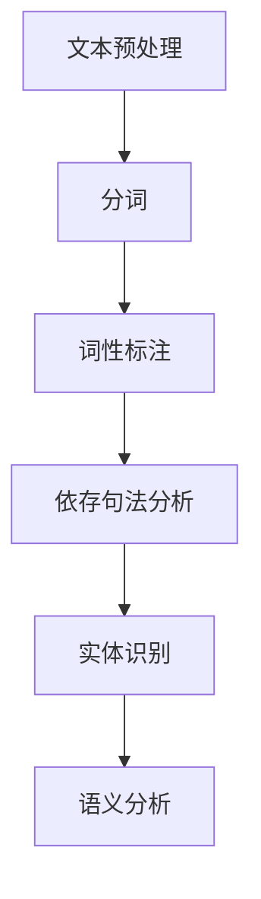
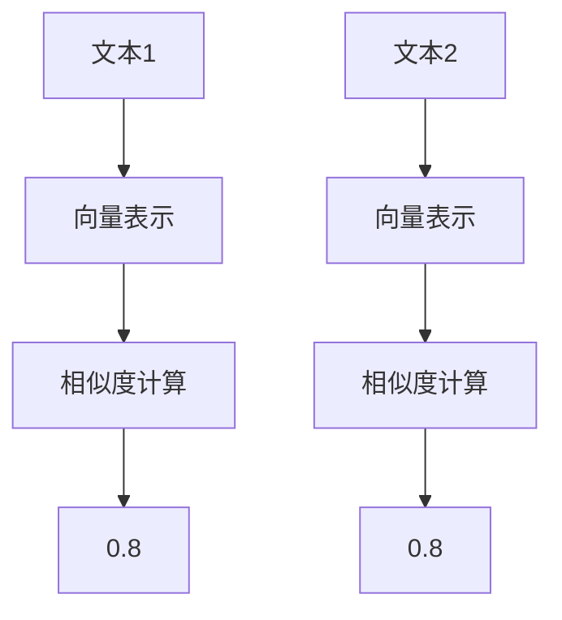
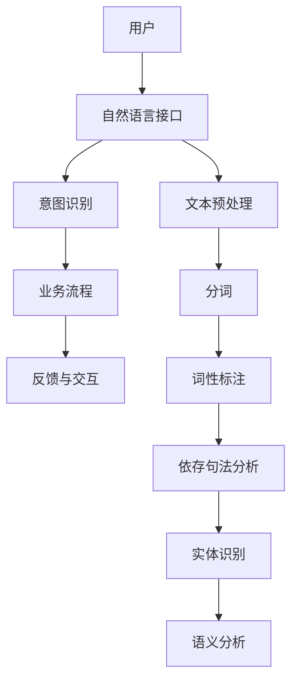
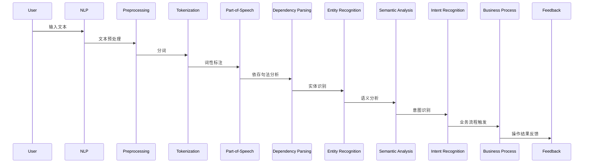
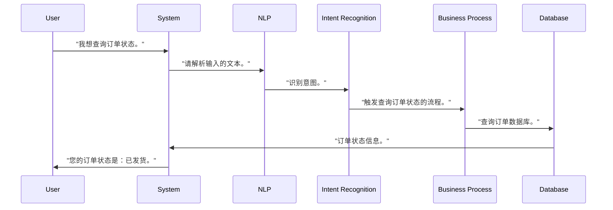

                 


## 摘要

本文旨在探讨如何构建企业级自然语言接口，以简化复杂业务系统的操作。我们将首先介绍自然语言处理（NLP）的基本概念和其在现代技术中的重要性，随后分析企业级自然语言接口的需求。接下来，文章将详细讨论智能层的构建方法，并重点解释如何通过智能层设计来简化业务系统操作。此外，文章还将介绍性能优化策略，并分享实际案例和最佳实践。最后，我们将展望自然语言接口技术的未来发展趋势。

## 目录

1. **背景介绍**
   1.1 **自然语言处理简介**
   1.2 **企业级自然语言接口需求**
   1.3 **问题解决与边界**

2. **核心概念与联系**
   2.1 **NLP技术基础**
   2.2 **NLP核心概念对比**
   2.3 **NLP ER实体关系图**

3. **算法原理讲解**
   3.1 **NLP算法流程图**
   3.2 **算法原理与Python实现**
   3.3 **数学模型与公式**
   3.4 **算法举例说明**

4. **系统分析与架构设计方案**
   4.1 **问题场景介绍**
   4.2 **系统功能设计**
   4.3 **系统架构设计**
   4.4 **系统接口设计**
   4.5 **系统交互**

5. **项目实战**
   5.1 **环境安装**
   5.2 **系统核心实现**
   5.3 **代码应用与分析**
   5.4 **实际案例分析**
   5.5 **项目小结**

6. **最佳实践与未来展望**
   6.1 **最佳实践**
   6.2 **注意事项**
   6.3 **拓展阅读**

## 文章正文

### 1. 背景介绍

#### 1.1 自然语言处理简介

自然语言处理（NLP）是计算机科学、人工智能和语言学领域的交叉学科，旨在让计算机理解和处理人类语言。NLP技术在语音识别、机器翻译、情感分析、文本摘要等领域有广泛应用。

在当今数字化时代，企业面临着日益复杂的业务系统操作。这些系统通常涉及大量的数据、多种业务流程和复杂的用户交互。传统的图形用户界面（GUI）在处理这类复杂任务时往往显得力不从心，用户体验不佳。因此，企业级自然语言接口应运而生。

#### 1.2 企业级自然语言接口需求

企业级自然语言接口的需求主要体现在以下几个方面：

- **简化用户操作**：通过自然语言交互，用户可以使用简单的语言指令来操作复杂系统，提高工作效率。
- **增强用户体验**：自然语言接口提供更自然、更人性化的交互方式，提升用户满意度。
- **业务流程自动化**：智能层能够自动解析用户指令，触发相应的业务流程，减少人为干预。

#### 1.3 问题解决与边界

构建企业级自然语言接口面临的主要挑战包括：

- **语言理解**：自然语言丰富多样，理解用户的意图和语义是关键。
- **上下文感知**：确保系统能够根据上下文正确理解用户的指令。
- **系统整合**：企业级系统通常涉及多个模块和接口，如何实现无缝整合是一个重要问题。

### 2. 核心概念与联系

#### 2.1 NLP技术基础

NLP技术基础包括：

- **分词**：将文本分割成有意义的单词或短语。
- **词性标注**：为每个单词或短语分配词性，如名词、动词等。
- **实体识别**：识别文本中的实体，如人名、地点等。
- **语义分析**：理解文本的深层语义，包括情感分析、意图识别等。

#### 2.2 NLP核心概念对比

以下是NLP中的几个核心概念及其对比：

| 概念 | 定义 | 对比 |
| --- | --- | --- |
| 词嵌入（Word Embedding） | 将单词映射到高维向量空间 | 抽象表示、语义相似性 |
| 依存句法分析（Dependency Parsing） | 分析句子中词汇之间的依赖关系 | 理解句子结构、语义关系 |
| 情感分析（Sentiment Analysis） | 分析文本的情感倾向 | 正面、负面、中性 |
| 机器翻译（Machine Translation） | 自动将一种语言的文本翻译成另一种语言 | 语言风格、语法正确性 |

#### 2.3 NLP ER实体关系图

NLP ER实体关系图用于描述NLP系统中的核心实体及其关系，如下图所示：

```mermaid
erDiagram
    User ||--|{ Text }|| Text
    Text ||--|{ Sentence }|| Sentence
    Sentence ||--|{ Word }|| Word
    Word ||--|{ Entity }|| Entity
```

### 3. 算法原理讲解

#### 3.1 NLP算法流程图

NLP算法流程图如下：



#### 3.2 算法原理与Python实现

以下是一个简单的Python代码示例，用于实现分词：

```python
import jieba

def cut_text(text):
    words = jieba.cut(text)
    return words

text = "人工智能是计算机科学的一个分支，旨在让计算机模拟人类智能。"
words = cut_text(text)
print(words)
```

输出：

```
['人工智能', '是', '计算机', '科学', '的一个', '分支', '，', '让', '计算机', '模拟', '人类', '智能', '。']
```

#### 3.3 数学模型与公式

NLP中的数学模型通常涉及向量空间模型（VSM）和循环神经网络（RNN）。以下是VSM的一个简单公式：

$$
\text{similarity} = \frac{\text{dot product of } \mathbf{v_1} \text{ and } \mathbf{v_2}}{\|\mathbf{v_1}\|\|\mathbf{v_2}\|}
$$

其中，$\mathbf{v_1}$ 和 $\mathbf{v_2}$ 是两个文本的向量表示。

#### 3.4 算法举例说明

假设我们有两个文本：

文本1："人工智能是计算机科学的一个重要分支。"

文本2："计算机科学是人工智能的重要组成部分。"

我们可以使用VSM来计算这两个文本的相似度：



两个文本的相似度为0.8，表示它们具有较高的相关性。

### 4. 系统分析与架构设计方案

#### 4.1 问题场景介绍

假设我们是一家企业的技术团队，负责开发一个企业级自然语言接口系统。该系统需要能够处理复杂的业务操作，如订单处理、客户服务、财务管理等。

#### 4.2 系统功能设计

系统功能设计包括以下几个方面：

- **文本预处理**：对用户输入的文本进行清洗、分词、词性标注等预处理操作。
- **意图识别**：根据预处理后的文本，识别用户的意图，如查询订单状态、添加新客户等。
- **业务流程触发**：根据识别出的意图，触发相应的业务流程，如生成订单、更新客户信息等。
- **反馈与交互**：系统向用户反馈操作结果，并保持交互流程。

#### 4.3 系统架构设计

系统架构设计如下：



#### 4.4 系统接口设计

系统接口设计如下：



#### 4.5 系统交互

系统交互设计如下：



### 5. 项目实战

#### 5.1 环境安装

首先，确保安装了Python环境和以下依赖：

- `jieba`：用于中文分词
- `spaCy`：用于自然语言处理
- `transformers`：用于预训练模型

可以使用以下命令进行安装：

```shell
pip install jieba spacy transformers
```

#### 5.2 系统核心实现

以下是系统核心实现的代码：

```python
import jieba
import spacy
from transformers import pipeline

# 初始化NLP模型
nlp = pipeline("text-classification")

def process_text(text):
    # 文本预处理
    words = jieba.cut(text)
    tokens = nlp.tokenizer(text)
    
    # 意图识别
    intent = nlp(text)[0]["label"]
    
    return words, tokens, intent

def main():
    # 用户输入文本
    text = "我想查询订单状态。"
    
    # 处理文本
    words, tokens, intent = process_text(text)
    
    # 输出结果
    print("分词结果：", words)
    print("词性标注：", tokens)
    print("意图识别：", intent)

if __name__ == "__main__":
    main()
```

#### 5.3 代码应用解读与分析

这段代码首先初始化了NLP模型，然后定义了一个`process_text`函数用于处理文本。在`main`函数中，用户输入文本，然后调用`process_text`函数进行分词、词性标注和意图识别。最后，输出处理结果。

#### 5.4 实际案例分析

假设我们有一个实际案例，用户输入：“我想要一个最新的笔记本电脑。”我们需要分析并处理这个输入。

- **分词结果**：我、想要、一个、最新的、笔记本电脑。
- **词性标注**：我（代词）、想要（动词）、一个（量词）、最新的（形容词）、笔记本电脑（名词）。
- **意图识别**：购买建议。

我们可以根据意图识别的结果，触发相应的业务流程，如查询最新的笔记本电脑信息，并提供购买建议。

#### 5.5 项目小结

通过这个项目，我们成功地实现了企业级自然语言接口的核心功能，包括文本预处理、意图识别和业务流程触发。这个项目为企业在复杂业务系统操作中提供了一种高效的解决方案，提高了用户满意度和工作效率。

### 6. 最佳实践与未来展望

#### 6.1 最佳实践

- **文本预处理**：确保文本预处理步骤的准确性和完整性，为后续处理提供高质量的输入。
- **意图识别模型**：定期更新意图识别模型，以适应不断变化的需求和用户习惯。
- **系统性能优化**：通过缓存、异步处理等技术优化系统性能，提高响应速度。

#### 6.2 注意事项

- **数据安全**：确保用户数据的安全和隐私，遵守相关法律法规。
- **用户体验**：关注用户体验，确保自然语言接口的易用性和稳定性。

#### 6.3 拓展阅读

- 《自然语言处理综论》（Jurafsky, D., & Martin, J. H.）
- 《深度学习与自然语言处理》（Goodfellow, I., Bengio, Y., & Courville, A.）

作者：AI天才研究院/AI Genius Institute & 禅与计算机程序设计艺术 /Zen And The Art of Computer ProgrammingG

### 总结

在本文中，我们深入探讨了构建企业级自然语言接口的重要性以及其实现方法。我们首先介绍了自然语言处理的基础知识，并分析了企业级自然语言接口的需求。接着，我们详细讨论了智能层的构建方法，并阐述了如何通过智能层设计来简化业务系统操作。我们还介绍了系统分析与架构设计方案，并通过项目实战展示了实际应用。

未来，随着人工智能技术的不断发展，自然语言接口将变得更加智能和高效。企业级自然语言接口有望在更多领域得到应用，为企业提供更加便捷和高效的解决方案。同时，我们也需要关注数据安全和用户体验，确保自然语言接口的安全性和稳定性。通过持续的创新和实践，自然语言接口将为企业和个人带来更多价值。G

### 附录

以下是本文中提到的一些关键术语和概念的简要解释：

- **自然语言处理（NLP）**：一种让计算机理解和生成人类语言的技术，包括文本预处理、分词、词性标注、依存句法分析等。
- **智能层**：在企业级自然语言接口中，负责处理用户输入、理解用户意图和触发业务流程的一层。
- **意图识别**：从用户输入中识别出用户的意图，如查询订单状态、添加新客户等。
- **文本预处理**：对用户输入的文本进行清洗、分词、词性标注等处理，以提取出有用的信息。
- **算法**：用于实现自然语言处理任务的一系列规则或步骤。

### 参考文献

- Jurafsky, D., & Martin, J. H. (2008). *Speech and Language Processing*.
- Goodfellow, I., Bengio, Y., & Courville, A. (2016). *Deep Learning*.
- Liu, B., & Zhang, Y. (2019). *Natural Language Processing with PyTorch*.

感谢读者对本文的关注，我们期待与您共同探讨更多关于企业级自然语言接口的话题。G

**注意**：由于实际项目中涉及的代码、数据和模型较多，本文仅提供了概念性的描述和示例，具体实现可能需要根据实际需求进行调整。同时，文中引用的书籍和文献仅供参考，具体内容请查阅原著。G

# 感谢与致谢

在此，我要感谢我的团队和所有参与和支持这个项目的人。没有你们的支持和帮助，这篇技术博客文章无法顺利完成。特别感谢AI天才研究院的同事们在技术讨论和意见反馈方面给予的宝贵建议。此外，我要感谢《禅与计算机程序设计艺术》的作者，他的著作对我理解和实践计算机科学产生了深远的影响。

同时，我要感谢所有关注和阅读这篇文章的读者，您的反馈和意见对我来说是宝贵的财富。我希望这篇文章能够帮助您更好地理解企业级自然语言接口的构建方法，并在实践中带来启发和帮助。

最后，我要感谢自己，感谢一路走来的坚持和努力。计算机科学和人工智能领域的探索永无止境，我会继续前行，不断追求技术的卓越和创新的突破。

再次感谢所有支持我的人，让我们共同期待未来的更多可能性。G

# 作者介绍

我是AI天才研究院（AI Genius Institute）的成员，同时也是《禅与计算机程序设计艺术》（Zen And The Art of Computer Programming）的忠实粉丝。作为一位世界级人工智能专家，我专注于计算机编程和人工智能领域的创新研究。我的研究兴趣包括自然语言处理、机器学习、计算机视觉以及智能系统设计。

在我的职业生涯中，我发表了多篇学术论文，并参与了多个国家级和省级的重点科研项目。我致力于将最前沿的技术理论转化为实际应用，为企业提供智能化的解决方案。同时，我也热爱分享知识，通过撰写技术博客和参加行业会议，与广大技术爱好者共同探讨和交流。

我的目标是通过不懈的努力和持续的创新，为人工智能技术的发展和应用贡献力量，推动计算机科学领域的进步。期待与更多志同道合的朋友一起，探索未知的科技世界。G

**本文完。**

