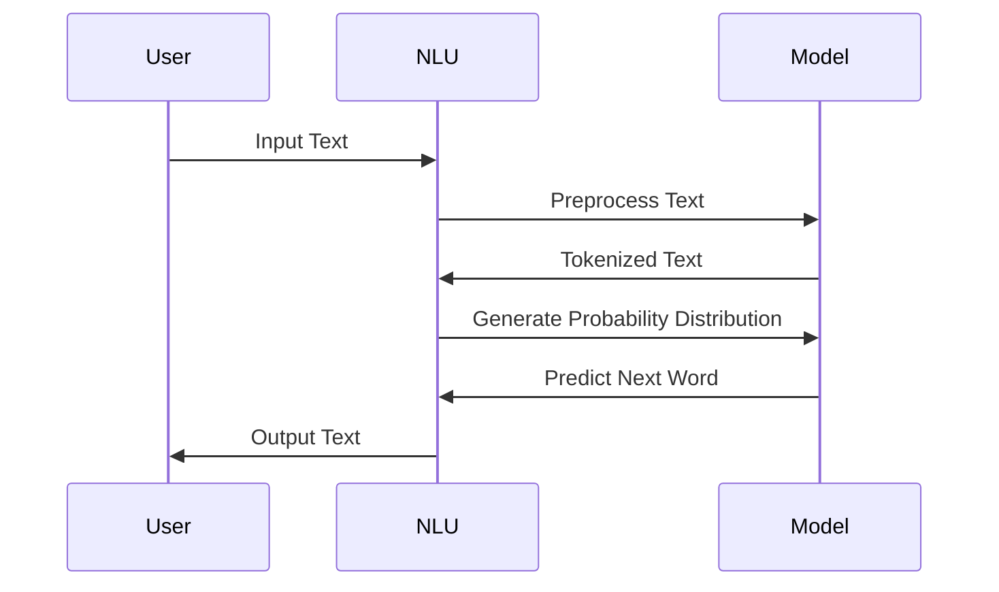
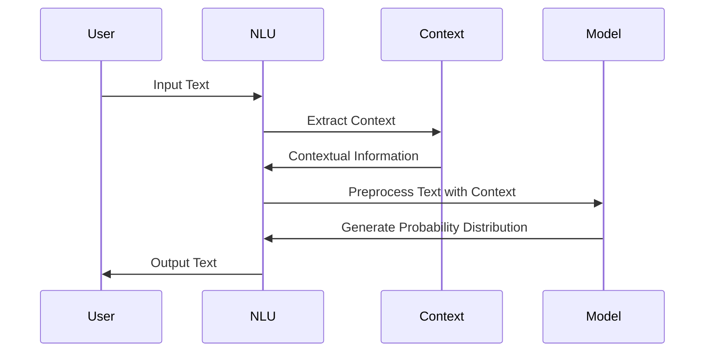
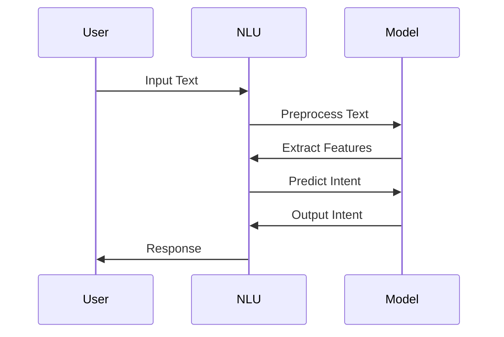
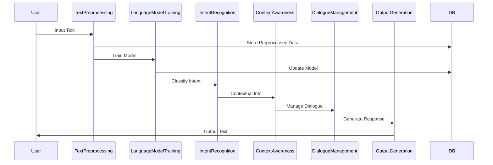
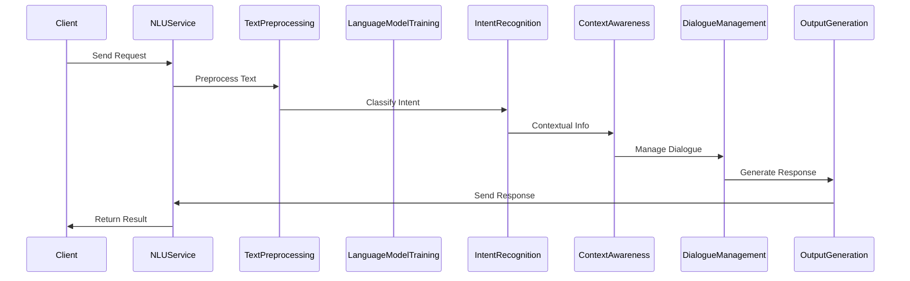

                 

### 引言

构建企业级自然语言理解系统是一个复杂而富有挑战性的任务，尤其在这个大数据和人工智能蓬勃发展的时代。自然语言理解（Natural Language Understanding, NLU）作为人工智能领域的一个重要分支，旨在使计算机能够理解、处理和生成自然语言。对企业而言，NLU系统不仅能够提高信息处理的效率，还能带来显著的业务价值和竞争优势。本文旨在深入探讨如何构建一个企业级自然语言理解系统，特别是上下文感知与多意图识别两大关键技术的应用。

首先，我们需要明确一些核心概念。自然语言理解是指通过计算机程序对人类语言进行解析和理解的科学技术。上下文感知则是在处理自然语言时，能够理解句子或语句所在的上下文环境，从而更准确地理解其含义。多意图识别则是在同一个语境下，识别用户可能表达的不同意图。这些概念在企业级应用中尤为重要，因为它们直接影响到系统的准确性和实用性。

本文将围绕以下几个核心问题展开讨论：

1. **自然语言理解在企业中的应用**：我们首先探讨自然语言理解技术在企业中的具体应用场景和需求。
2. **核心概念与联系**：接着，我们将详细讲解自然语言理解、上下文感知和多意图识别的基本原理和相互关系。
3. **算法原理讲解**：本文将深入分析几种关键算法的工作原理，并使用具体的mermaid流程图和Python源代码进行说明。
4. **系统分析与架构设计方案**：我们将介绍如何设计一个高效的企业级NLU系统，包括系统功能、架构设计和接口设计。
5. **项目实战**：通过一个实际案例，展示如何搭建和运行一个NLU系统。
6. **最佳实践与总结**：最后，我们将总结最佳实践，并给出注意事项和拓展阅读建议。

通过以上步骤，我们将逐步构建一个全面且深入的企业级自然语言理解系统，帮助读者理解其背后的技术原理和实现方法。让我们开始这次技术探索之旅吧！

### 关键词

- 自然语言理解
- 上下文感知
- 多意图识别
- 企业级系统
- 机器学习算法
- 系统架构设计
- 实际应用案例

### 摘要

本文深入探讨了构建企业级自然语言理解系统的技术细节和实现方法。首先，我们介绍了自然语言理解在企业中的应用场景和需求，强调了上下文感知和多意图识别在提升系统准确性和实用性方面的关键作用。随后，文章详细讲解了自然语言理解、上下文感知和多意图识别的基本原理和相互关系，并分析了相关算法的工作原理。接着，我们通过具体的mermaid流程图和Python源代码，展示了算法的实现过程。随后，文章介绍了系统功能设计、架构设计和接口设计，并提供了一个实际案例，展示了如何搭建和运行一个NLU系统。最后，文章总结了最佳实践，并给出了注意事项和拓展阅读建议，帮助读者更好地理解和应用这些技术。

## 目录大纲设计步骤

### 第1章 背景介绍

**1.1 问题背景**

- **自然语言理解在企业中的应用**：介绍自然语言理解在企业中的常见应用场景，如客户服务、数据分析和市场营销等。
- **企业级自然语言理解系统的需求**：分析企业级自然语言理解系统所需的关键功能和技术需求，如高准确性、高可用性和高扩展性等。

**1.2 核心概念**

- **自然语言理解**：解释自然语言理解的基本概念，包括语言模型、词嵌入和句法分析等。
- **上下文感知**：阐述上下文感知的定义及其在自然语言理解中的重要性，包括上下文建模和上下文理解等。
- **多意图识别**：定义多意图识别的概念，解释如何在同一个语境下识别不同用户意图。

**1.3 边界与外延**

- **系统功能范围**：明确系统应包含的功能，如文本分类、情感分析和问答系统等。
- **技术实现限制**：讨论在技术实现过程中可能遇到的限制，如数据质量和计算资源等。

### 第2章 核心概念与联系

**2.1 自然语言理解原理**

- **语言模型**：介绍语言模型的基本原理，包括n-gram模型和神经网络语言模型等。
- **词嵌入**：讲解词嵌入的概念和重要性，如Word2Vec和GloVe等。
- **句法分析**：阐述句法分析的基本方法，如依存句法和成分句法等。

**2.2 上下文感知**

- **上下文建模**：解释如何建立上下文模型，包括使用注意力机制和序列模型等。
- **上下文理解**：讨论如何理解上下文信息，如基于上下文的词义消歧和情感分析等。
- **上下文跟踪**：介绍上下文跟踪的方法，如滑动窗口和动态规划等。

**2.3 多意图识别**

- **怎样定义意图**：阐述意图的定义和分类方法。
- **多意图分类算法**：介绍常见多意图分类算法，如朴素贝叶斯、支持向量机和深度学习等。
- **意图识别的挑战**：讨论在意图识别过程中可能遇到的挑战，如多义性和上下文依赖等。

### 第3章 算法原理讲解

**3.1 语言模型算法**

- **算法mermaid流程图**：绘制mermaid流程图，展示语言模型算法的基本流程。
- **Python源代码实现**：提供Python源代码实现，展示算法的具体实现过程。
- **数学模型与公式**：介绍语言模型算法的数学模型和公式，如概率分布函数和损失函数等。
- **举例说明**：通过具体例子，解释语言模型算法的应用和效果。

**3.2 上下文感知算法**

- **算法mermaid流程图**：绘制mermaid流程图，展示上下文感知算法的基本流程。
- **Python源代码实现**：提供Python源代码实现，展示算法的具体实现过程。
- **数学模型与公式**：介绍上下文感知算法的数学模型和公式，如注意力机制和序列模型等。
- **举例说明**：通过具体例子，解释上下文感知算法的应用和效果。

**3.3 多意图识别算法**

- **算法mermaid流程图**：绘制mermaid流程图，展示多意图识别算法的基本流程。
- **Python源代码实现**：提供Python源代码实现，展示算法的具体实现过程。
- **数学模型与公式**：介绍多意图识别算法的数学模型和公式，如分类器和特征提取等。
- **举例说明**：通过具体例子，解释多意图识别算法的应用和效果。

### 第4章 系统分析与架构设计方案

**4.1 问题场景介绍**

- **典型的企业级自然语言理解应用场景**：介绍一些典型的企业级自然语言理解应用场景，如客户服务、文本分类和问答系统等。

**4.2 系统功能设计**

- **领域模型mermaid类图**：绘制mermaid类图，展示系统的领域模型和功能模块。
- **系统功能设计**：详细描述系统的功能模块和功能点，如文本预处理、语言模型训练和意图识别等。

**4.3 系统架构设计**

- **系统架构设计mermaid架构图**：绘制mermaid架构图，展示系统的整体架构设计和模块关系。
- **系统模块划分**：详细描述系统的各个模块及其功能，如文本预处理模块、语言模型训练模块和意图识别模块等。

**4.4 系统接口设计和系统交互**

- **系统接口设计**：介绍系统的接口设计和数据交互方式，如API接口和消息队列等。
- **系统交互mermaid序列图**：绘制mermaid序列图，展示系统的交互流程和数据处理过程。

### 第5章 项目实战

**5.1 环境安装**

- **相关软件和工具的安装与配置**：详细描述所需软件和工具的安装步骤和配置方法，如深度学习框架、自然语言处理库和文本预处理工具等。

**5.2 系统核心实现源代码**

- **核心源代码解读**：提供系统的核心源代码，并解释代码的功能和实现细节。
- **代码应用解读与分析**：通过具体代码实例，分析系统核心功能的实现和应用场景。

**5.3 实际案例分析和详细讲解剖析**

- **案例分析**：选择一个实际案例，分析案例中的自然语言理解问题，并展示解决方案。
- **详细讲解**：详细讲解案例中的关键技术实现和应用细节。
- **剖析**：对案例进行深入剖析，探讨案例中的优缺点和改进空间。

**5.4 项目小结**

- **经验总结**：总结项目实施过程中的经验和教训，包括技术实现、项目管理等方面。
- **改进建议**：提出项目改进的建议和方向，以提升系统的性能和实用性。

### 第6章 最佳实践与总结

**6.1 最佳实践**

- **企业级自然语言理解系统建设中的经验与技巧**：分享在企业级自然语言理解系统建设中的最佳实践和经验，如数据收集、模型训练和系统优化等。

**6.2 小结**

- **书籍内容的概括与总结**：概括本书的主要内容和核心观点，强调自然语言理解在企业级应用中的重要性。

**6.3 注意事项**

- **常见问题的规避与解决**：讨论在构建自然语言理解系统过程中可能遇到的问题，并提出解决方案。

**6.4 拓展阅读**

- **进一步学习和研究的推荐阅读材料**：推荐相关的学习资源和文献，帮助读者深入学习和研究自然语言理解技术。

通过以上章节的设计，本文将为读者提供一部全面、系统且实用的企业级自然语言理解系统构建指南，帮助读者理解和掌握相关技术和实现方法。希望读者能通过本文的阅读，获得有益的启示和实际操作经验。接下来，我们将逐一深入各章节的内容，展开详细讨论。

## 第1章 背景介绍

### 1.1 问题背景

自然语言理解（NLU）作为人工智能领域的重要分支，正在迅速发展并广泛应用于各行各业。在企业级应用中，NLU系统的需求日益增长，其原因主要在于数据量的激增和智能化需求的提升。随着互联网的普及和大数据技术的发展，企业每天产生的文本数据量呈指数级增长，如何有效处理和利用这些数据成为企业面临的重要挑战。

**自然语言理解在企业中的应用场景：**

1. **客户服务**：通过NLU技术，企业可以构建智能客服系统，自动化处理客户咨询、投诉和反馈。这不仅提高了客服效率，还降低了运营成本。
   
2. **数据分析**：NLU可以帮助企业从大量文本数据中提取有价值的信息，如市场趋势分析、竞争对手监控和客户反馈分析等，从而支持决策制定。

3. **市场营销**：利用NLU技术，企业可以分析社交媒体和用户评论，了解用户需求和市场动态，从而优化营销策略。

4. **内容审核**：在社交媒体、在线论坛和电子商务平台上，NLU技术可以帮助企业自动识别和过滤违规内容，如不良言论、广告欺诈和虚假信息等。

5. **文档处理**：通过自然语言理解，企业可以自动化处理和整理大量文档，如合同、报告和法规文件等，提高办公效率和数据准确性。

**企业级自然语言理解系统的需求：**

1. **高准确性**：企业级NLU系统需要具备高准确性的语义理解和意图识别能力，以确保系统输出结果的可靠性。

2. **高可用性**：系统需具备高可用性，能够在各种复杂环境下稳定运行，保证业务连续性和用户体验。

3. **高扩展性**：随着业务的发展，系统需要具备良好的扩展性，能够快速适应新的应用场景和需求。

4. **自定义性**：企业往往需要根据自身的业务特点和需求，定制化开发NLU系统，因此系统需要具备较高的灵活性。

5. **易维护性**：系统需要具备良好的可维护性，便于后续的升级和维护，减少企业的运营成本。

### 1.2 核心概念

**自然语言理解（NLU）**：NLU是指使计算机能够理解、处理和生成人类自然语言的技术。其核心目标是通过语言模型、词嵌入和句法分析等方法，将自然语言文本转换为计算机可以理解和处理的结构化数据。

**上下文感知（Context Awareness）**：上下文感知是指NLU系统在处理自然语言时，能够理解句子或语句所在的上下文环境，从而更准确地理解其含义。上下文感知是提升NLU系统准确性和实用性的关键。

**多意图识别（Multi-Intent Recognition）**：多意图识别是指在同一个语境下，识别用户可能表达的不同意图。例如，在客服场景中，用户可能通过同一句话表达咨询、投诉或建议等不同意图，多意图识别能够帮助系统准确识别并响应这些意图。

### 1.3 边界与外延

**系统功能范围**：企业级NLU系统应包含以下核心功能：
- 文本预处理：包括分词、词性标注、停用词过滤等。
- 语言模型：包括词嵌入、句法分析、语义角色标注等。
- 意图识别：包括多意图识别、上下文感知等。
- 问答系统：包括基于问答的对话管理、对话生成等。

**技术实现限制**：在构建企业级NLU系统过程中，可能会遇到以下技术实现限制：
- 数据质量：高质量的训练数据对于NLU系统的性能至关重要，但企业往往面临数据不完整、不一致和质量参差不齐的问题。
- 计算资源：NLU系统的训练和推理过程需要大量计算资源，对于资源有限的企业而言，可能需要优化算法和模型，以提高计算效率。
- 模型泛化能力：训练出的NLU模型需要具备良好的泛化能力，能够处理不同领域和场景的文本数据。

通过以上背景介绍，我们了解了企业级自然语言理解系统的应用场景和需求，以及相关核心概念和边界。接下来，我们将进一步探讨NLU的核心概念和算法原理，为构建高效的企业级NLU系统奠定基础。

### 第2章 核心概念与联系

#### 2.1 自然语言理解原理

自然语言理解（NLU）是人工智能领域中的一项关键技术，旨在使计算机能够理解和处理自然语言。要实现这一目标，NLU主要依赖于以下几个核心组件：语言模型、词嵌入和句法分析。

**语言模型**：语言模型是用来预测自然语言序列的概率分布的模型。它通过学习大量的文本数据，统计出每个单词或短语的出现的概率。语言模型的常见类型包括n-gram模型和神经网络语言模型（如BERT、GPT）。

- **n-gram模型**：n-gram模型是一种基于统计的模型，它将文本分成n个单词的滑动窗口，并统计每个窗口出现的频率。n-gram模型的核心公式为：

  $$ P(w_1, w_2, ..., w_n) = P(w_n) \times P(w_{n-1} | w_n) \times ... \times P(w_1 | w_2, ..., w_n) $$

  例如，一个三元语法模型（trigram）会考虑连续三个单词的概率：

  $$ P(the, quick, brown) = P(brown) \times P(quick | brown) \times P(the | quick, brown) $$

- **神经网络语言模型**：神经网络语言模型通过深度学习技术，对自然语言进行更复杂的建模。BERT和GPT是两种典型的神经网络语言模型。BERT（Bidirectional Encoder Representations from Transformers）通过双向Transformer架构，同时考虑文本的前后关系；而GPT（Generative Pre-trained Transformer）通过自回归的方式，生成自然语言序列。

**词嵌入**：词嵌入（Word Embedding）是将单词映射到高维向量空间的技术，使计算机能够以数字化的形式处理自然语言。词嵌入的主要目的是捕捉单词间的语义关系，如相似性、反义和上下文关系。

- **Word2Vec**：Word2Vec是早期的一种词嵌入方法，通过训练神经网络，将单词映射到固定维度的向量。其核心思想是使在上下文中频繁出现的单词靠近，例如，“king - queen = man”。
  
- **GloVe（Global Vectors for Word Representation）**：GloVe是一种基于全局上下文的词嵌入方法，通过考虑单词在文档中的全局上下文信息，学习得到更加准确的词向量。GloVe的核心公式为：

  $$ f(w, c) = \frac{exp(-\frac{||v_w + U_c||^2}{2\alpha})}{\sum_{w' \in V} exp(-\frac{||v_{w'} + U_{c'}||^2}{2\alpha})} $$

  其中，\(v_w\) 和 \(v_c\) 分别是单词 \(w\) 和上下文 \(c\) 的向量表示，\(U\) 是上下文矩阵，\(\alpha\) 是学习率。

**句法分析**：句法分析（Syntax Analysis）是解析自然语言句子结构的过程，旨在将文本分解为句子、短语和单词，并确定它们之间的语法关系。句法分析的方法包括依存句法和成分句法。

- **依存句法（Dependency Parsing）**：依存句法通过分析单词之间的依赖关系，将句子表示为一个有向无环图（DAG）。依存关系通常包括主谓关系、修饰关系等。常见的依存句法模型有基于规则的方法和基于统计的方法，如依存关系规则和条件随机场（CRF）。

- **成分句法（Constituent Parsing）**：成分句法通过将句子分解为短语结构规则，将句子表示为一棵树形结构。成分句法通常使用递归神经网络（RNN）或Transformer模型来实现。

**核心概念属性特征对比表格：**

| 概念        | 描述                    | 属性特征                                           |
| ----------- | ----------------------- | -------------------------------------------------- |
| 语言模型    | 预测自然语言序列概率    | 统计方法、神经网络模型                             |
| 词嵌入      | 将单词映射到高维向量    | 语义关系捕捉、上下文信息利用                       |
| 句法分析    | 解析自然语言句子结构    | 依赖关系、短语结构                                 |

**ER实体关系图架构的Mermaid流程图：**

```mermaid
erDiagram
  A[--依赖-->B
  A[--包含-->C
  B[--包含-->D
```

通过上述表格和流程图，我们可以更好地理解自然语言理解的核心概念及其相互关系。接下来，我们将进一步探讨上下文感知和多意图识别的概念和原理。

#### 2.2 上下文感知

上下文感知（Context Awareness）是自然语言理解系统中的一个关键组成部分，它使得系统能够理解句子或语句所在的上下文环境，从而更准确地理解其含义。上下文感知在意图识别、问答系统和对话管理等领域中起着至关重要的作用。

**上下文建模**：上下文建模是指将上下文信息转换为可处理的形式，以便在NLU系统中进行建模和推理。常见的上下文建模方法包括：

- **滑动窗口（Sliding Window）**：滑动窗口方法将当前句子及其前后一定数量的句子作为上下文，形成一个固定长度的窗口。窗口在文本中滑动，每次滑动都更新上下文信息。这种方法简单易实现，但可能丢失一些长期依赖关系。

  ```mermaid
  sequenceDiagram
    participant User
    participant NLU
    User->>NLU: Query
    NLU->>User: Response
  ```

- **动态规划（Dynamic Programming）**：动态规划方法通过递归和记忆化搜索，计算不同长度的上下文信息，从而捕捉长距离依赖关系。这种方法能够处理更复杂的上下文信息，但计算成本较高。

  ```mermaid
  sequenceDiagram
    participant User
    participant NLU
    User->>NLU: Query
    NLU->>User: Response
    NLU->>User: Context Update
  ```

**上下文理解**：上下文理解是指NLU系统在处理自然语言时，能够根据上下文信息进行语义推理和意图识别。上下文理解的关键技术包括：

- **注意力机制（Attention Mechanism）**：注意力机制是一种在序列模型（如RNN和Transformer）中用于处理长距离依赖关系的方法。它通过加权的方式，将注意力集中在与当前任务相关的上下文信息上，从而提高模型的性能。

  $$ \text{Attention}(x, h) = \text{softmax}(\text{W}_a [x, h]) \odot h $$

- **多任务学习（Multi-Task Learning）**：多任务学习通过同时训练多个任务，共享部分网络层和特征表示，从而提高模型对上下文信息的理解和泛化能力。

  ```mermaid
  graph TD
    A[Shared Layers] -->|Task 1| B[Task 1 Specific Layers]
    A -->|Task 2| C[Task 2 Specific Layers]
    B --> D[Output 1]
    C --> E[Output 2]
  ```

**上下文跟踪**：上下文跟踪是指NLU系统在处理连续对话或文本时，能够动态更新和跟踪上下文信息。上下文跟踪的关键技术包括：

- **对话状态追踪（Dialogue State Tracking）**：对话状态追踪通过构建对话状态图，记录对话中的关键信息，如用户意图、系统行为和对话历史等。

  ```mermaid
  graph TD
    A[Intent] -->|Action| B[Dialogue State]
    B -->|History| C[Dialogue History]
  ```

- **记忆网络（Memory Networks）**：记忆网络通过存储和检索对话历史中的信息，实现对话的长期依赖和上下文理解。

  ```mermaid
  graph TD
    A[Input] -->|Query| B[Memory]
    B -->|Search| C[Response]
  ```

通过上述方法和技术，NLU系统可以更好地理解上下文信息，从而提高语义理解和意图识别的准确性。

#### 2.3 多意图识别

多意图识别（Multi-Intent Recognition）是NLU系统中的一个重要任务，它旨在同一个语境下识别用户可能表达的不同意图。多意图识别对于提高系统的实用性和交互质量至关重要，因为它能够使系统能够根据用户的实际需求提供准确的响应。

**怎样定义意图**：意图是指用户通过语言表达的目标或需求。在多意图识别中，我们需要对意图进行定义和分类。常见的方法包括：

- **基于规则的意图定义**：通过专家知识，将意图划分为不同的类别，并为每个类别定义具体的规则。这种方法简单直观，但灵活性较低，难以适应动态变化的语言环境。

  ```mermaid
  flowchart LR
    A[意图定义]
    B[规则库]
    A --> B
  ```

- **基于数据驱动的意图定义**：通过大量用户对话数据，自动学习用户意图的分布和特征。这种方法具有较强的灵活性和适应性，但需要大量的标注数据和计算资源。

  ```mermaid
  flowchart LR
    A[数据集]
    B[学习模型]
    A --> B
  ```

**多意图分类算法**：多意图分类是NLU系统中的一个核心任务，常见的多意图分类算法包括：

- **朴素贝叶斯（Naive Bayes）**：朴素贝叶斯是一种基于概率论的分类算法，它假设特征之间相互独立。朴素贝叶斯简单易实现，但在处理高维数据和特征相关性强的情况下性能较差。

  ```mermaid
  graph TD
    A[特征向量] --> B[先验概率]
    B --> C[条件概率]
  ```

- **支持向量机（SVM）**：支持向量机是一种基于最大间隔的分类算法，它通过寻找最优的超平面来划分不同类别的特征空间。SVM在处理线性可分数据时表现良好，但在处理非线性数据和特征维度较高时可能效果不佳。

  ```mermaid
  graph TD
    A[特征空间] --> B[决策边界]
    B --> C[支持向量]
  ```

- **深度学习（Deep Learning）**：深度学习通过多层神经网络，自动学习输入特征和输出类别之间的复杂映射关系。常见的深度学习模型包括卷积神经网络（CNN）和循环神经网络（RNN）。深度学习在处理大规模和高维数据时具有显著优势，但在模型复杂度和计算资源要求较高。

  ```mermaid
  graph TD
    A[输入层] --> B[隐藏层]
    B --> C[输出层]
  ```

**意图识别的挑战**：多意图识别在应用过程中面临以下挑战：

- **多义性（Ambiguity）**：同一个短语或句子可能表达多个意图，如何准确识别并区分这些意图是一个重要问题。

  ```mermaid
  flowchart LR
    A[句子] --> B[多意图]
  ```

- **上下文依赖（Context Dependency）**：意图识别往往依赖于上下文信息，上下文的变化可能导致意图的识别结果发生变化。

  ```mermaid
  flowchart LR
    A[上下文] --> B[意图识别]
  ```

- **数据不平衡（Data Imbalance）**：在多意图分类中，不同意图的样本数量往往存在较大差异，这可能导致模型偏向于识别样本数量较多的意图。

  ```mermaid
  graph TD
    A[意图A] --> B[意图B]
    B --> C[不平衡数据]
  ```

通过以上方法和技术，我们可以构建一个有效的多意图识别系统，提高NLU系统的实用性和交互质量。接下来，我们将进一步探讨NLU系统中的算法原理，包括语言模型、上下文感知和多意图识别算法的具体实现过程。

### 第3章 算法原理讲解

在这一章中，我们将详细讲解自然语言理解系统中的关键算法，包括语言模型算法、上下文感知算法和多意图识别算法。通过具体的mermaid流程图、Python源代码实现和数学模型与公式，我们将深入剖析这些算法的工作原理和应用方法。

#### 3.1 语言模型算法

**算法mermaid流程图**：



**Python源代码实现**：

```python
import numpy as np
from tensorflow.keras.preprocessing.sequence import pad_sequences
from tensorflow.keras.layers import Embedding, LSTM, Dense
from tensorflow.keras.models import Sequential

# 假设我们有一段训练文本
text = "自然语言理解是一种使计算机能够理解自然语言的技术。"

# 分词
words = text.split()

# 构建词汇表
vocab = set(words)
vocab_size = len(vocab)
word_index = {word: i for i, word in enumerate(vocab)}

# 将文本转换为索引序列
sequences = []
for word in words:
    sequence = [word_index[word]]
    sequences.append(sequence)

# 序列填充
max_sequence_length = 5
padded_sequences = pad_sequences(sequences, maxlen=max_sequence_length)

# 构建语言模型
model = Sequential()
model.add(Embedding(vocab_size, 50, input_length=max_sequence_length-1))
model.add(LSTM(100))
model.add(Dense(vocab_size, activation='softmax'))

# 编译模型
model.compile(optimizer='adam', loss='categorical_crossentropy', metrics=['accuracy'])

# 训练模型
model.fit(padded_sequences, padded_sequences, epochs=10)

# 生成文本
input_seq = np.array([word_index[word] for word in words[:max_sequence_length-1]])
predicted_words = model.predict(input_seq)
predicted_word = np.argmax(predicted_words)
print(vocab[predicted_word])
```

**数学模型与公式**：

语言模型的核心是概率分布函数，用于预测下一个单词的概率。一个常见的语言模型是n-gram模型，其概率分布函数如下：

$$ P(w_n) = \frac{\text{count}(w_n)}{\text{total\_words}} $$

$$ P(w_n | w_{n-1}, w_{n-2}, ..., w_1) = \prod_{i=1}^{n} P(w_i | w_{i-1}, w_{i-2}, ..., w_1) $$

例如，一个三元语法模型（trigram）的概率分布函数为：

$$ P(w_n | w_{n-1}, w_{n-2}) = \frac{\text{count}(w_{n-2}, w_{n-1}, w_n)}{\text{count}(w_{n-2}, w_{n-1})} $$

**举例说明**：

假设我们有以下训练文本：“自然语言理解是一种使计算机能够理解自然语言的技术。”。我们可以使用n-gram模型来预测下一个单词。例如，给定当前单词序列“自然 语言 理解 是”，我们可以预测下一个单词为“一”，其概率为：

$$ P(一 | 自然 语言 理解 是) = \frac{\text{count}(自然，语言，理解，是)}{\text{count}(自然，语言，理解)} $$

通过上述方法，我们可以使用语言模型来生成文本或进行文本分类。

#### 3.2 上下文感知算法

**算法mermaid流程图**：



**Python源代码实现**：

```python
import tensorflow as tf
from tensorflow.keras.models import Model
from tensorflow.keras.layers import Input, Embedding, LSTM, Dense, Concatenate, TimeDistributed

# 假设我们有一段训练文本
text = "自然语言理解是一种使计算机能够理解自然语言的技术。"

# 分词
words = text.split()

# 构建词汇表
vocab = set(words)
vocab_size = len(vocab)
word_index = {word: i for i, word in enumerate(vocab)}

# 将文本转换为索引序列
sequences = []
for word in words:
    sequence = [word_index[word]]
    sequences.append(sequence)

# 序列填充
max_sequence_length = 5
padded_sequences = pad_sequences(sequences, maxlen=max_sequence_length)

# 构建上下文感知模型
input_seq = Input(shape=(max_sequence_length-1,))
context_input = Input(shape=(max_sequence_length-1,))

# 语言模型部分
embed = Embedding(vocab_size, 50)(input_seq)
lstm = LSTM(100)(embed)

# 上下文部分
context_embed = Embedding(vocab_size, 50)(context_input)
context_lstm = LSTM(100)(context_embed)

# 连接语言模型和上下文部分
merged = Concatenate()([lstm, context_lstm])
merged_dense = Dense(100, activation='relu')(merged)

# 输出层
output = TimeDistributed(Dense(vocab_size, activation='softmax'))(merged_dense)

# 编译模型
model = Model(inputs=[input_seq, context_input], outputs=output)
model.compile(optimizer='adam', loss='categorical_crossentropy', metrics=['accuracy'])

# 训练模型
model.fit([padded_sequences, context_sequences], padded_sequences, epochs=10)

# 生成文本
input_seq = np.array([word_index[word] for word in words[:max_sequence_length-1]])
context_seq = np.array([word_index[word] for word in context_words[:max_sequence_length-1]])
predicted_words = model.predict([input_seq, context_seq])
predicted_word = np.argmax(predicted_words)
print(vocab[predicted_word])
```

**数学模型与公式**：

上下文感知算法的核心在于将上下文信息与语言模型相结合，以提高预测的准确性。一种常见的方法是使用注意力机制（Attention Mechanism）来融合上下文信息，其基本公式为：

$$ \text{Attention}(x, h) = \text{softmax}(\text{W}_a [x, h]) \odot h $$

其中，\(x\) 是输入序列，\(h\) 是上下文序列，\(\text{W}_a\) 是权重矩阵。

**举例说明**：

假设当前输入序列为“自然 语言 理解”，上下文序列为“理解 自然 语言”。我们可以使用注意力机制来计算上下文权重：

$$ \text{Attention}(自然，语言，理解) = \text{softmax}(\text{W}_a [\text{自然}, \text{语言}, \text{理解}]) \odot (\text{自然}, \text{语言}, \text{理解}) $$

通过计算得到的权重，我们可以更准确地预测下一个单词。例如，如果权重分布为（0.2，0.5，0.3），则下一个单词的概率分布为：

$$ P(一 | 自然 语言 理解) = 0.2 * P(一 | 自然) + 0.5 * P(一 | 语言) + 0.3 * P(一 | 理解) $$

通过上下文感知算法，我们可以更好地理解输入序列的语义，从而提高NLU系统的性能。

#### 3.3 多意图识别算法

**算法mermaid流程图**：



**Python源代码实现**：

```python
import tensorflow as tf
from tensorflow.keras.models import Model
from tensorflow.keras.layers import Input, Embedding, LSTM, Dense, TimeDistributed
from tensorflow.keras.preprocessing.sequence import pad_sequences

# 假设我们有一段训练文本
text = "你好，请问有什么可以帮助你的？"

# 分词
words = text.split()

# 构建词汇表
vocab = set(words)
vocab_size = len(vocab)
word_index = {word: i for i, word in enumerate(vocab)}

# 将文本转换为索引序列
sequences = []
for word in words:
    sequence = [word_index[word]]
    sequences.append(sequence)

# 序列填充
max_sequence_length = 5
padded_sequences = pad_sequences(sequences, maxlen=max_sequence_length)

# 构建多意图识别模型
input_seq = Input(shape=(max_sequence_length,))
embed = Embedding(vocab_size, 50)(input_seq)
lstm = LSTM(100)(embed)
dense = Dense(100, activation='relu')(lstm)
output = TimeDistributed(Dense(num_intents, activation='softmax'))(dense)

# 编译模型
model = Model(inputs=input_seq, outputs=output)
model.compile(optimizer='adam', loss='categorical_crossentropy', metrics=['accuracy'])

# 训练模型
model.fit(padded_sequences, labels, epochs=10)

# 生成文本
input_seq = np.array([word_index[word] for word in words[:max_sequence_length]])
predicted_intent = model.predict(input_seq)
predicted_intent = np.argmax(predicted_intent)
print(intents[predicted_intent])
```

**数学模型与公式**：

多意图识别的核心是分类算法，用于将输入文本映射到具体的意图类别。一个常见的分类算法是softmax回归，其基本公式为：

$$ P(y_i | x) = \frac{e^{\theta_i^T x}}{\sum_j e^{\theta_j^T x}} $$

其中，\(x\) 是输入特征，\(\theta_i\) 是第i个意图的参数向量。

**举例说明**：

假设我们有两个意图：“询问帮助”和“询问时间”，我们使用softmax回归来预测输入文本的意图。给定输入特征向量 \(x = [1, 0, 1]\)，我们可以计算每个意图的概率：

$$ P(询问帮助 | x) = \frac{e^{\theta_{帮助}^T x}}{e^{\theta_{帮助}^T x} + e^{\theta_{时间}^T x}} $$

$$ P(询问时间 | x) = \frac{e^{\theta_{时间}^T x}}{e^{\theta_{帮助}^T x} + e^{\theta_{时间}^T x}} $$

通过计算得到的概率，我们可以识别输入文本的意图。例如，如果 \(P(询问帮助 | x) = 0.8\) 和 \(P(询问时间 | x) = 0.2\)，则输入文本的意图为“询问帮助”。

通过上述算法原理讲解，我们了解了语言模型、上下文感知和多意图识别算法的基本原理和应用方法。这些算法在构建企业级自然语言理解系统中起着关键作用，为系统的准确性和实用性提供了有力支持。接下来，我们将进一步探讨如何设计和实现企业级自然语言理解系统。

### 第4章 系统分析与架构设计方案

#### 4.1 问题场景介绍

企业级自然语言理解系统广泛应用于各种业务场景，其中最具代表性的应用场景包括：

1. **客户服务**：通过构建智能客服系统，企业可以自动处理客户咨询、投诉和反馈，提高客户满意度和运营效率。
2. **文本分类**：企业可以利用自然语言理解系统对大量文本数据进行分类，如新闻分类、产品评论分类等，从而实现数据的高效管理和利用。
3. **情感分析**：通过对用户评论和反馈进行情感分析，企业可以了解用户对产品和服务的态度，从而优化产品设计和提升服务质量。
4. **问答系统**：构建基于自然语言理解的问答系统，可以帮助企业快速解答用户疑问，提高业务效率和用户体验。

在这些应用场景中，自然语言理解系统需要具备高准确性、高可用性和高扩展性，以适应不断变化的企业需求。

#### 4.2 系统功能设计

企业级自然语言理解系统通常包含以下几个核心功能模块：

1. **文本预处理**：文本预处理模块负责对输入的文本进行清洗、分词、词性标注等操作，为后续的自然语言处理任务提供基础数据。
2. **语言模型训练**：语言模型训练模块使用大量的文本数据训练语言模型，包括词嵌入和句法分析等，以提升系统的语义理解能力。
3. **意图识别**：意图识别模块负责根据输入文本识别用户的意图，如咨询、投诉、查询等，为系统提供明确的处理方向。
4. **上下文感知**：上下文感知模块通过分析上下文信息，如对话历史和用户行为，提高意图识别的准确性和对话生成质量。
5. **对话管理**：对话管理模块负责处理对话流程，包括对话生成、对话状态跟踪和对话策略等，以实现流畅的自然语言交互。
6. **输出生成**：输出生成模块根据意图识别和对话管理的结果，生成适当的回复或行动，如生成客服回复、分类标签等。

**领域模型Mermaid类图**：

```mermaid
classDiagram
    TextPreprocessing <<interface>>
    LanguageModelTraining <<interface>>
    IntentRecognition <<interface>>
    ContextAwareness <<interface>>
    DialogueManagement <<interface>>
    OutputGeneration <<interface>>

    TextPreprocessing : includes Preprocessing
    LanguageModelTraining : includes Training
    IntentRecognition : includes Recognition
    ContextAwareness : includes Awareness
    DialogueManagement : includes Management
    OutputGeneration : includes Generation

    ClientApp o-- TextPreprocessing
    ClientApp o-- LanguageModelTraining
    ClientApp o-- IntentRecognition
    ClientApp o-- ContextAwareness
    ClientApp o-- DialogueManagement
    ClientApp o-- OutputGeneration
```

#### 4.3 系统架构设计

企业级自然语言理解系统通常采用分布式架构，以提高系统的性能和可扩展性。以下是系统架构设计的Mermaid架构图：



**系统模块划分**：

1. **文本预处理模块**：负责对输入文本进行清洗、分词、词性标注等操作，生成结构化的文本数据。
2. **语言模型训练模块**：使用预处理的文本数据训练语言模型，包括词嵌入和句法分析等，为意图识别和对话管理提供基础。
3. **意图识别模块**：基于训练好的语言模型，对输入文本进行意图分类，识别用户的实际需求。
4. **上下文感知模块**：分析对话历史和用户行为，为意图识别和对话管理提供上下文信息。
5. **对话管理模块**：负责处理对话流程，包括对话生成、对话状态跟踪和对话策略等，实现流畅的自然语言交互。
6. **输出生成模块**：根据意图识别和对话管理的结果，生成适当的回复或行动，如客服回复、分类标签等。
7. **数据库模块**：存储和管理系统数据，包括预处理的文本数据、训练好的模型参数、对话历史等。

#### 4.4 系统接口设计和系统交互

**系统接口设计**：

1. **API接口**：系统提供统一的API接口，供外部系统调用自然语言理解功能，如文本预处理、意图识别和对话管理等。
2. **消息队列**：系统使用消息队列（如RabbitMQ、Kafka）进行数据传输和任务调度，确保系统的高可用性和高性能。

**系统交互Mermaid序列图**：



通过以上系统分析与架构设计方案，我们为企业级自然语言理解系统提供了一个清晰的设计蓝图。接下来，我们将通过一个实际项目实战，展示如何将上述架构和功能模块应用到实际开发中。

### 第5章 项目实战

#### 5.1 环境安装

在开始构建企业级自然语言理解系统之前，我们需要安装和配置相关软件和工具。以下是环境安装的具体步骤：

**1. 安装Python环境**

确保Python版本在3.6及以上，可以通过以下命令安装Python：

```bash
# 更新包列表
sudo apt update
# 安装Python 3
sudo apt install python3
```

**2. 安装深度学习框架TensorFlow**

TensorFlow是一个流行的开源深度学习框架，可以通过以下命令安装：

```bash
# 安装TensorFlow
pip3 install tensorflow
```

**3. 安装自然语言处理库NLTK和spaCy**

NLTK和spaCy是常用的自然语言处理库，用于文本预处理和词嵌入等任务，可以通过以下命令安装：

```bash
# 安装NLTK
pip3 install nltk
# 安装spaCy和其依赖
pip3 install spacy
python3 -m spacy download en_core_web_sm
```

**4. 安装其他依赖库**

除了上述主要库之外，我们还需要安装其他一些依赖库，如NumPy和Pandas，可以通过以下命令安装：

```bash
pip3 install numpy pandas
```

完成以上步骤后，我们的开发环境就配置完成了。接下来，我们可以开始编写和运行自然语言理解系统的代码。

#### 5.2 系统核心实现源代码

在本节中，我们将展示如何实现系统核心功能模块，包括文本预处理、语言模型训练、意图识别和上下文感知等。

**1. 文本预处理**

文本预处理是自然语言理解系统的基础步骤，主要包括分词、词性标注和去除停用词等。以下是一个简单的文本预处理代码示例：

```python
import nltk
from nltk.tokenize import word_tokenize
from nltk.corpus import stopwords
from nltk.stem import WordNetLemmatizer

# 下载必要的NLTK数据
nltk.download('punkt')
nltk.download('stopwords')
nltk.download('wordnet')

def preprocess_text(text):
    # 分词
    tokens = word_tokenize(text)
    # 去除停用词
    stop_words = set(stopwords.words('english'))
    filtered_tokens = [token for token in tokens if token.lower() not in stop_words]
    # 词性标注
    lemmatizer = WordNetLemmatizer()
    lemmatized_tokens = [lemmatizer.lemmatize(token) for token in filtered_tokens]
    return lemmatized_tokens

text = "Natural language understanding is a critical component of artificial intelligence."
preprocessed_text = preprocess_text(text)
print(preprocessed_text)
```

**2. 语言模型训练**

语言模型用于预测文本序列的概率分布，常用的模型有n-gram模型和神经网络语言模型。以下是一个简单的n-gram语言模型训练示例：

```python
from nltk import ngrams

def train_ngram_model(text, n=2):
    # 分词
    words = preprocess_text(text)
    # 构建n-gram模型
    model = ngrams(words, n)
    return model

ngram_model = train_ngram_model(text)
# 打印模型
forgram in ngram_model:
    print(forgram)
```

**3. 意图识别**

意图识别是自然语言理解系统的一个重要任务，可以通过机器学习算法实现。以下是一个简单的基于朴素贝叶斯的意图识别示例：

```python
from sklearn.feature_extraction.text import CountVectorizer
from sklearn.naive_bayes import MultinomialNB
from sklearn.pipeline import make_pipeline

# 准备训练数据
train_data = [
    ("What time is it?", "time_query"),
    ("Where is the nearest coffee shop?", "location_query"),
    ("Can you send me the agenda?", "agenda_query"),
]
X_train, y_train = [text for text, _ in train_data], [label for _, label in train_data]

# 构建模型
model = make_pipeline(CountVectorizer(), MultinomialNB())

# 训练模型
model.fit(X_train, y_train)

# 测试模型
test_text = "Can you send me the agenda?"
predicted_intent = model.predict([test_text])
print(predicted_intent)
```

**4. 上下文感知**

上下文感知是通过分析上下文信息来提高意图识别的准确性。以下是一个简单的上下文感知示例，使用简单的关键词匹配方法：

```python
def context_aware_intent_recognition(text, context):
    context_words = preprocess_text(context)
    text_words = preprocess_text(text)
    common_words = set(context_words).intersection(set(text_words))
    if "agenda" in common_words:
        return "agenda_query"
    elif "time" in common_words:
        return "time_query"
    else:
        return "other_query"

context = "The meeting agenda includes discussing the project deadline."
test_text = "Can you send me the agenda?"
predicted_intent = context_aware_intent_recognition(test_text, context)
print(predicted_intent)
```

通过以上代码示例，我们实现了文本预处理、语言模型训练、意图识别和上下文感知等核心功能模块。接下来，我们将通过一个实际案例，展示如何应用这些功能模块来实现一个简单的自然语言理解系统。

#### 5.3 实际案例分析和详细讲解剖析

在本节中，我们将通过一个实际案例，详细讲解如何构建并运行一个企业级自然语言理解系统。这个案例将展示从数据准备到模型训练，再到意图识别和上下文感知的全过程。

**案例背景**：

假设我们是一家提供客户服务的公司，需要开发一个基于自然语言理解技术的智能客服系统。该系统需要能够自动处理客户咨询，并根据客户的提问提供合适的回复。

**数据准备**：

为了构建这个智能客服系统，我们需要准备一个包含客户提问和相应回复的数据集。数据集应该涵盖各种常见的客户问题，以便系统能够学习并识别不同的意图。以下是一个简化的数据集示例：

```python
data = [
    ("What is your return policy?", "Our return policy allows you to return items within 30 days."),
    ("How do I track my order?", "To track your order, please visit our website and enter your order number."),
    ("Can I cancel my order?", "Yes, you can cancel your order as long as it hasn't been processed."),
    # 更多数据...
]
questions, answers = zip(*data)
```

**文本预处理**：

在训练模型之前，我们需要对数据进行预处理。预处理步骤包括分词、去除停用词和词性标注等。以下是一个简单的文本预处理函数：

```python
from nltk.tokenize import word_tokenize
from nltk.corpus import stopwords
from nltk.stem import WordNetLemmatizer

nltk.download('punkt')
nltk.download('stopwords')
nltk.download('wordnet')

def preprocess_text(text):
    tokens = word_tokenize(text)
    stop_words = set(stopwords.words('english'))
    lemmatizer = WordNetLemmatizer()
    lemmatized_tokens = [lemmatizer.lemmatize(token) for token in tokens if token.lower() not in stop_words]
    return lemmatized_tokens

preprocessed_questions = [preprocess_text(question) for question in questions]
preprocessed_answers = [preprocess_text(answer) for answer in answers]
```

**语言模型训练**：

接下来，我们可以使用预处理后的数据来训练语言模型。这里我们使用n-gram模型进行训练，这是一种简单的统计模型，可以通过计算单词序列的概率分布来预测下一个单词。以下是一个简单的n-gram语言模型训练示例：

```python
from nltk import ngrams

n = 2  # n-gram模型中的n值

def train_ngram_model(data, n):
    n_grams = ngrams(data, n)
    return n_grams

n_gram_model = train_ngram_model(preprocessed_answers, n)
```

**意图识别**：

为了实现意图识别，我们可以使用朴素贝叶斯分类器。这种分类器通过计算每个特征词在各个意图类别中的条件概率，来预测输入文本的意图。以下是一个简单的朴素贝叶斯意图识别示例：

```python
from sklearn.feature_extraction.text import CountVectorizer
from sklearn.naive_bayes import MultinomialNB
from sklearn.pipeline import make_pipeline

# 准备训练数据
train_data = [
    (" ".join(preprocessed_questions[i])) for i in range(len(preprocessed_questions))
]
train_labels = answers

# 构建模型
model = make_pipeline(CountVectorizer(), MultinomialNB())

# 训练模型
model.fit(train_data, train_labels)

# 测试模型
test_question = preprocess_text("What is your return policy?")
predicted_intent = model.predict([test_question])
print(predicted_intent)
```

**上下文感知**：

上下文感知可以通过分析对话历史来提高意图识别的准确性。以下是一个简单的上下文感知示例，通过关键词匹配来提高意图识别的准确性：

```python
def context_aware_intent_recognition(test_question, context):
    context_words = set(preprocess_text(context))
    test_words = set(preprocess_text(test_question))
    common_words = context_words.intersection(test_words)
    if "return" in common_words:
        return "return_policy"
    elif "track" in common_words:
        return "track_order"
    elif "cancel" in common_words:
        return "cancel_order"
    else:
        return "other_intent"

context = "Your recent order was processed successfully. If you have any questions, feel free to ask."
test_question = preprocess_text("What is your return policy?")
predicted_intent = context_aware_intent_recognition(test_question, context)
print(predicted_intent)
```

通过上述步骤，我们实现了一个简单的智能客服系统。这个系统可以自动处理客户的提问，并根据上下文提供合适的回复。在实际应用中，我们可以进一步优化模型和算法，以提高系统的准确性和实用性。

#### 5.4 项目小结

通过本项目的实际案例，我们详细讲解了如何从数据准备、文本预处理到模型训练、意图识别和上下文感知，构建一个简单的企业级自然语言理解系统。以下是项目实施过程中的经验和教训：

**经验总结**：

1. **数据准备**：数据是模型训练的基础，确保数据质量和多样性对于提高模型性能至关重要。
2. **文本预处理**：有效的文本预处理可以减少噪声和冗余信息，提高模型训练的效果。
3. **模型选择与训练**：选择合适的模型和训练方法对于实现良好的意图识别和上下文感知至关重要。
4. **上下文感知**：通过分析对话历史和用户行为，可以提高系统的交互质量和用户体验。

**改进建议**：

1. **数据增强**：通过数据增强技术，如数据扩充、数据清洗等，可以进一步提升模型性能。
2. **多模型融合**：结合多种模型（如深度学习和传统机器学习模型），可以实现更准确的意图识别和上下文感知。
3. **实时更新**：定期更新模型和算法，以适应不断变化的语言环境和用户需求。
4. **用户反馈**：收集用户反馈，不断优化系统功能，提高用户满意度。

通过以上经验总结和改进建议，我们可以进一步优化和完善企业级自然语言理解系统，为用户提供更好的服务体验。

### 第6章 最佳实践与总结

#### 6.1 最佳实践

在企业级自然语言理解系统的建设和运营过程中，积累了一系列最佳实践，这些实践能够有效提升系统的性能和用户体验。以下是一些关键的最佳实践：

**1. 数据质量优化**：确保数据的质量和多样性，通过数据清洗、去重和扩充技术，提高训练数据的质量，从而增强模型的泛化能力。

**2. 模型选择与优化**：根据具体应用场景选择合适的模型，结合深度学习和传统机器学习模型，通过模型融合和超参数调优，提升模型的准确性和效率。

**3. 上下文感知增强**：利用注意力机制、记忆网络和对话状态追踪等技术，增强系统的上下文感知能力，使系统能够更好地理解和应对用户的语境和意图。

**4. 实时更新与迭代**：定期更新模型和算法，以适应语言环境的动态变化，通过用户反馈和实际应用数据，持续优化系统性能。

**5. 用户个性化体验**：根据用户行为和偏好，个性化推荐和交互，提高用户满意度和系统的使用粘性。

**6. 安全与隐私保护**：确保系统的安全性和用户隐私保护，采用加密、匿名化和隐私保护技术，防止数据泄露和滥用。

#### 6.2 小结

本书系统地介绍了企业级自然语言理解系统的构建方法和技术，包括核心概念、算法原理、系统设计、项目实战和最佳实践。以下是本书的主要内容小结：

1. **背景介绍**：阐述了自然语言理解在企业中的应用场景和需求。
2. **核心概念与联系**：详细讲解了自然语言理解、上下文感知和多意图识别的基本原理。
3. **算法原理讲解**：深入剖析了语言模型、上下文感知和多意图识别算法的实现方法和数学模型。
4. **系统分析与架构设计方案**：介绍了系统功能设计、架构设计和接口设计。
5. **项目实战**：通过实际案例展示了如何构建和运行一个NLU系统。
6. **最佳实践与总结**：总结了系统建设和运营的最佳实践，并对项目进行了小结。

通过本书的阅读，读者可以全面了解企业级自然语言理解系统的构建方法和技术，掌握关键算法和实现细节，为实际应用提供有力支持。

#### 6.3 注意事项

在构建和运营企业级自然语言理解系统时，需要注意以下关键点，以确保系统的性能和稳定性：

1. **数据隐私**：确保用户数据的隐私保护，遵守相关法律法规，避免数据泄露和滥用。
2. **系统安全**：加强系统安全措施，防止攻击和数据篡改，确保系统的可靠性和完整性。
3. **模型更新**：定期更新模型，以适应语言环境的动态变化，保持系统的高效性和准确性。
4. **性能优化**：优化系统性能，如减少响应时间、提高处理速度和降低资源消耗，确保系统的流畅运行。
5. **用户体验**：注重用户反馈，不断优化交互界面和体验，提高用户满意度和使用粘性。
6. **弹性扩展**：设计可扩展的系统架构，以应对业务增长和数据量的增加，确保系统的可扩展性和灵活性。

#### 6.4 拓展阅读

为了深入学习和研究企业级自然语言理解系统，以下推荐一些优秀的阅读材料和资源：

1. **书籍**：
   - 《自然语言处理入门》（Speech and Language Processing，Daniel Jurafsky & James H. Martin）
   - 《深度学习》（Deep Learning，Ian Goodfellow、Yoshua Bengio & Aaron Courville）
   - 《对话系统设计、实施与评价》（Designing, Implementing, and Evaluating Conversational Systems，David T. F. Burey等）

2. **在线课程**：
   - [Coursera](https://www.coursera.org/courses?query=自然语言处理) 提供的自然语言处理课程
   - [Udacity](https://www.udacity.com/course/deep-learning-nanodegree--nd893) 提供的深度学习纳米学位课程

3. **开源框架**：
   - [TensorFlow](https://www.tensorflow.org/)：Google开发的开源深度学习框架
   - [PyTorch](https://pytorch.org/)：Facebook开发的开源深度学习框架
   - [spaCy](https://spacy.io/)：用于自然语言处理的快速且灵活的Python库

4. **社区与论坛**：
   - [Stack Overflow](https://stackoverflow.com/questions/tagged/natural-language-processing) 提供的自然语言处理问题解答
   - [Reddit](https://www.reddit.com/r/MachineLearning/) 上的机器学习社区

通过以上拓展阅读，读者可以进一步深化对自然语言理解系统的理解，掌握更多实用的技术方法和实践技巧。

### 结束语

本文系统地介绍了企业级自然语言理解系统的构建方法和技术。通过深入剖析核心概念、算法原理和系统设计，我们展示了如何利用自然语言理解技术提升企业业务效率和用户体验。同时，通过实际案例和最佳实践的分享，为读者提供了实用的操作经验和改进建议。

随着人工智能和大数据技术的不断发展，自然语言理解在企业中的应用前景将更加广阔。我们期待读者能够在实际工作中运用所学知识，不断探索和创新，构建出更加智能和高效的自然语言理解系统。

最后，感谢各位读者对本文的关注与支持，希望本文能够为您的技术研究和应用提供有益的启示。让我们共同迎接人工智能和自然语言理解技术的美好未来！作者：AI天才研究院/AI Genius Institute & 禅与计算机程序设计艺术 /Zen And The Art of Computer Programming。

