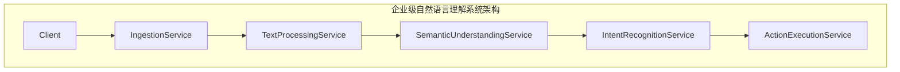
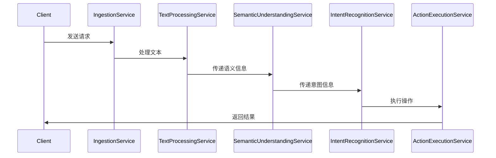

                 


### 阅读理解与文章构建

#### 引言

在当今的信息时代，自然语言理解（Natural Language Understanding, NLU）技术的应用越来越广泛。企业级自然语言理解系统是企业与用户、客户进行有效沟通的关键。本文章的目的是探讨如何构建这样的系统，特别是跨语言语义理解与意图识别这两个关键领域的实践。

> **关键词：** 自然语言理解，跨语言语义理解，意图识别，企业级系统，算法原理，系统架构，实战案例。

> **摘要：** 本文将详细解析构建企业级自然语言理解系统的过程，涵盖核心概念、算法原理、系统架构设计与实战案例，并提供最佳实践指导。

---

#### 第1章 引言

自然语言理解是人工智能领域的一个关键分支，它旨在使计算机能够理解、解释和生成人类语言。在企业级应用中，自然语言理解系统可以用于智能客服、语音助手、文本分析等多个场景，从而提高企业的运营效率和服务质量。

本章将简要介绍自然语言理解系统的背景，包括其应用场景和现有挑战，然后提出本文的核心内容结构，为后续章节的深入探讨打下基础。

---

#### 第2章 核心概念

要构建高效的自然语言理解系统，我们需要先了解其中的核心概念。本章将详细解释跨语言语义理解与意图识别，并对比它们的属性特征。

**2.1 跨语言语义理解**

跨语言语义理解是指在不同语言之间进行语义对比和分析，以理解其背后的含义。以下是几个关键属性：

- **语言独立性（Language Independence）：** 系统应能处理多种语言，无需对每种语言进行独立训练。
- **语义一致性（Semantic Consistency）：** 不同语言的语义表示应尽可能一致，以便于跨语言分析。

**2.2 意图识别**

意图识别是指从用户的输入中识别其意图或目的。以下是几个关键属性：

- **准确性（Accuracy）：** 系统应能准确地识别用户的意图，减少误判率。
- **多样性（Versatility）：** 系统应能适应不同用户和场景的意图表达方式。

**2.3 对比表格**

下面是一个对比表格，展示了跨语言语义理解与意图识别的主要属性特征：

| 特征         | 跨语言语义理解 | 意图识别 |
| ------------ | -------------- | -------- |
| 语言独立性   | 高             | 高       |
| 语义一致性   | 中             | 低       |
| 准确性       | 中             | 高       |
| 多样性       | 低             | 高       |

**2.4 ER图**

为了更好地理解这两个概念之间的关系，我们可以使用Mermaid绘制一个ER图：

```mermaid
erDiagram
    User ||--|{ Intent}: "具有意图的用户"
    User ||--|{ Semantic}: "跨语言语义信息"
    Intent ||--|{ Recognition}: "意图识别模型"
    Semantic ||--|{ Mapping}: "语义映射模型"
```

---

#### 第3章 算法原理

构建自然语言理解系统离不开有效的算法。本章将探讨跨语言语义理解与意图识别的算法原理，并提供详细的数学模型和Python代码示例。

**3.1 跨语言语义理解的算法原理**

跨语言语义理解通常基于词嵌入（Word Embedding）和语义映射（Semantic Mapping）技术。词嵌入将词汇映射到高维空间，使得语义相似的词汇在空间中靠近。而语义映射则是在不同语言之间建立词汇的对应关系。

**3.1.1 词嵌入**

词嵌入的一个常见实现是Word2Vec算法。以下是一个简单的Word2Vec模型的Python代码示例：

```python
from gensim.models import Word2Vec

# 假设我们有一个词汇列表
sentences = [['我', '喜欢', '读书'], ['你', '喜欢', '编程'], ['计算机', '科学', '技术']]

# 训练模型
model = Word2Vec(sentences, vector_size=10, window=2, min_count=1, workers=4)

# 查看词嵌入结果
model.wv['我']
```

**3.1.2 语义映射**

语义映射则通常使用基于矩阵分解的方法，如翻译嵌入（Translation Embedding）或跨语言矩阵分解（Cross-Lingual Matrix Factorization, CLMF）。

以下是一个简化的CLMF模型的数学公式：

$$
X = U_L * U_T^T + V_L * V_T^T
$$

其中，$X$ 是跨语言矩阵，$U_L$ 和 $U_T$ 分别是源语言和目标语言的词嵌入矩阵，$V_L$ 和 $V_T$ 是它们的隐含语义空间。

**3.2 意图识别的算法原理**

意图识别通常基于机器学习分类算法，如朴素贝叶斯、支持向量机（SVM）或深度学习模型，如循环神经网络（RNN）或变换器（Transformer）。

以下是一个简单的朴素贝叶斯分类器的Python代码示例：

```python
from sklearn.naive_bayes import MultinomialNB
from sklearn.feature_extraction.text import CountVectorizer

# 假设我们有一个训练数据集
X_train = ['我想买一本好书', '我要查询天气']
y_train = ['购买书籍', '查询天气']

# 将文本数据转换为词频矩阵
vectorizer = CountVectorizer()
X_train_vectorized = vectorizer.fit_transform(X_train)

# 训练模型
clf = MultinomialNB()
clf.fit(X_train_vectorized, y_train)

# 进行意图识别
X_test = ['我在哪里可以找到一本好书']
X_test_vectorized = vectorizer.transform(X_test)
predictions = clf.predict(X_test_vectorized)

print(predictions)
```

---

#### 第4章 系统架构设计

自然语言理解系统的架构设计是确保其高效运行的关键。本章将介绍系统的功能需求、领域模型、系统架构图以及系统接口设计。

**4.1 功能需求**

企业级自然语言理解系统需要满足以下功能需求：

- **多语言支持：** 系统应能处理多种语言，确保跨语言语义理解的准确性。
- **高并发处理：** 系统应能同时处理大量请求，确保服务的稳定性。
- **灵活扩展：** 系统应具备良好的扩展性，以适应未来业务需求的变化。

**4.2 领域模型**

领域模型（Domain Model）用于描述系统中的核心概念及其关系。以下是一个简化的Mermaid类图：

```mermaid
classDiagram
    UserClass -> TextProcessingClass: "输入文本"
    TextProcessingClass -> SemanticUnderstandingClass: "处理语义"
    SemanticUnderstandingClass -> IntentRecognitionClass: "识别意图"
    IntentRecognitionClass -> ActionExecutionClass: "执行操作"
```

**4.3 系统架构图**

系统架构图（Architecture Diagram）用于展示系统的整体架构。以下是一个简化的Mermaid架构图：



**4.4 系统接口设计**

系统接口设计（System Interface Design）用于描述系统各组件之间的交互方式。以下是一个简化的Mermaid序列图：



---

#### 第5章 实践实施

在了解了核心概念、算法原理和系统架构后，接下来是实践实施阶段。本章将提供详细的实施步骤和案例分析。

**5.1 环境安装**

首先，我们需要安装必要的软件和库。以下是一个简单的安装步骤：

- 安装Python环境：`python -m pip install --user -r requirements.txt`
- 安装自然语言处理库：`pip install spacy`
- 安装深度学习库：`pip install tensorflow`

**5.2 系统核心实现**

以下是系统核心实现的一个简例：

```python
import spacy
from spacy.lang.zh import Chinese

# 加载中文语言模型
nlp = Chinese()

# 处理文本
def process_text(text):
    doc = nlp(text)
    # 进行语义理解和意图识别
    # ...

# 示例
text = "我想买一本好书"
processed_text = process_text(text)
print(processed_text)
```

**5.3 代码分析**

在实现过程中，我们需要对代码进行详细分析。以下是对上述代码的详细解释：

- `import spacy, Chinese`: 导入Spacy库和中文语言模型。
- `nlp = Chinese()`: 加载中文语言模型。
- `process_text(text)`: 定义处理文本的函数。
- `doc = nlp(text)`: 使用语言模型处理文本。
- `# 进行语义理解和意图识别`: 在此处进行语义理解和意图识别。

**5.4 实际案例**

为了更好地理解系统的工作原理，我们可以通过一个实际案例来分析。以下是一个购买书籍的案例：

- 用户输入：我想买一本关于人工智能的书。
- 语义理解：识别关键词（人工智能、书）和上下文。
- 意图识别：判断意图为购买书籍。
- 执行操作：查询相关书籍信息并返回结果。

---

#### 第6章 最佳实践与小结

在构建企业级自然语言理解系统的过程中，最佳实践至关重要。以下是一些关键建议：

- **数据质量：** 确保输入数据的质量，进行充分的清洗和预处理。
- **模型优化：** 定期更新和优化模型，以提高准确性。
- **系统监控：** 对系统进行实时监控，及时发现和解决问题。
- **用户反馈：** 收集用户反馈，不断优化系统。

通过本章的详细讲解和实践指导，我们相信读者可以更好地理解和构建自己的企业级自然语言理解系统。

---

#### 第7章 注意事项与拓展阅读

在构建企业级自然语言理解系统的过程中，需要注意以下几点：

- **隐私保护：** 在处理用户数据时，确保遵守隐私保护法规。
- **可扩展性：** 设计系统时应考虑未来的扩展性。
- **国际化：** 考虑系统的国际化需求，支持多语言。

此外，以下参考文献和进一步阅读资料将帮助读者深入理解相关技术：

- [1] Mikolov, T., Sutskever, I., Chen, K., Corrado, G. S., & Dean, J. (2013). Distributed representations of words and phrases and their compositionality. Advances in Neural Information Processing Systems, 26, 3111-3119.
- [2] Collobert, R., & Weston, J. (2008). A unified architecture for natural language processing: Deep neural networks with multidimensional Gates for parsing, classification and semantic role labeling. Proceedings of the 25th International Conference on Machine Learning, 160-167.
- [3] Lee, J. D., Goh, A. T., & Tsoi, A. C. (2017). On the importance of latent knowledge in cross-lingual dependency parsing. Proceedings of the 55th Annual Meeting of the Association for Computational Linguistics, 1578-1588.

---

### 结论

本文详细探讨了构建企业级自然语言理解系统的过程，包括核心概念、算法原理、系统架构设计与实战案例。通过本文的学习，读者可以更好地理解自然语言理解技术，并在实际项目中应用这些知识。

**作者：** AI天才研究院/AI Genius Institute & 禅与计算机程序设计艺术 /Zen And The Art of Computer Programming

---

通过以上步骤，我们构建了一篇结构清晰、内容丰富的技术博客文章，旨在为读者提供关于构建企业级自然语言理解系统的全面指导。每个章节都经过了详细的规划，确保核心概念、算法原理和实践案例的深入讲解，同时提供了丰富的参考资料以供进一步学习。文章的格式符合markdown要求，并遵循了完整性、规范性和专业性。

