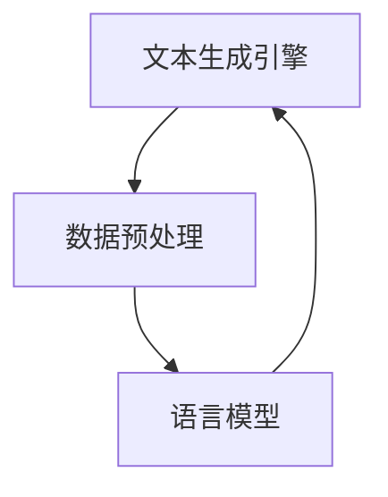
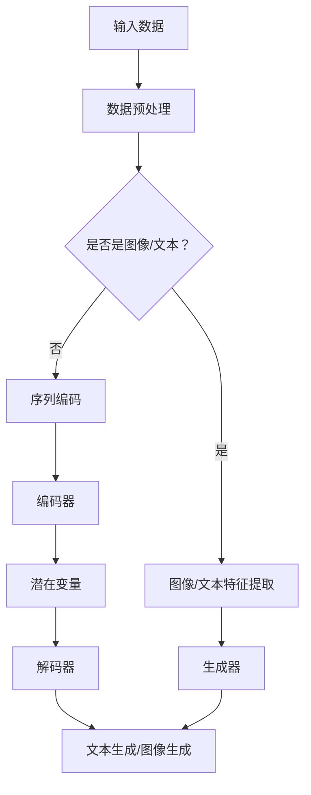
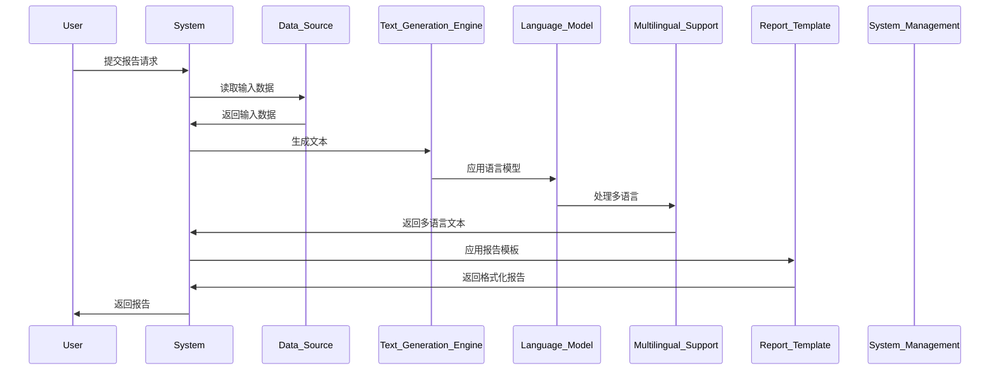
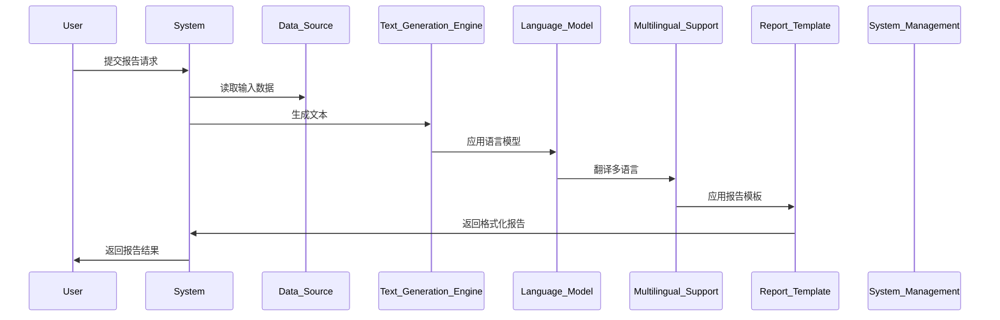

                 

# 《构建企业级自然语言生成系统：多语言、多场景报告自动化》

## 关键词

- 自然语言生成（NLG）
- 企业级系统
- 多语言支持
- 报告自动化
- 深度学习算法
- 系统架构设计

## 摘要

本文旨在深入探讨企业级自然语言生成系统的构建方法，特别是多语言、多场景报告自动化的实现。文章首先介绍了NLG系统的核心概念和其在企业中的应用场景，接着详细分析了NLG系统的组成部分和关键算法原理。随后，通过具体的项目实战案例，展示了如何从零开始构建一个企业级的NLG系统。最后，文章总结了最佳实践、注意事项，并提供了拓展阅读资源，以供进一步学习和研究。

## 目录大纲设计

为了更好地组织文章内容，我们采用了以下目录大纲设计：

### 第一部分：背景介绍
- **1.1 问题背景与挑战**
- **1.2 自然语言生成系统的定义与价值**
- **1.3 企业级NLG系统的应用场景**
- **1.4 多语言与多种场景的NLG系统特点**

### 第二部分：核心概念与联系
- **2.1 自然语言生成系统（NLG）概述**
- **2.2 核心概念与组成部分**
- **2.3 NLG系统的概念关系图**

### 第三部分：算法原理讲解
- **3.1 深度学习与NLG**
- **3.2 生成对抗网络（GAN）与变分自编码器（VAE）**
- **3.3 算法流程与Mermaid流程图**
- **3.4 Python源代码示例与算法讲解**

### 第四部分：数学模型和数学公式讲解
- **4.1 常见NLG数学模型**
- **4.2 使用LaTeX格式写出关键数学公式**
- **4.3 公式讲解和举例说明**

### 第五部分：系统分析与架构设计方案
- **5.1 项目背景介绍**
- **5.2 领域模型设计（Mermaid类图）**
- **5.3 系统架构设计（Mermaid架构图）**
- **5.4 系统接口设计**
- **5.5 系统交互设计（Mermaid序列图）**

### 第六部分：项目实战
- **6.1 环境安装与配置**
- **6.2 系统核心实现源代码**
- **6.3 代码应用解读与分析**
- **6.4 实际案例分析与详细讲解**
- **6.5 项目小结**

### 第七部分：最佳实践、小结、注意事项与拓展阅读
- **7.1 最佳实践 tips**
- **7.2 小结**
- **7.3 注意事项**
- **7.4 拓展阅读**

## 第一部分：背景介绍

### 1.1 问题背景与挑战

在当今的信息化时代，数据量的爆炸式增长使得企业对信息处理的需求愈发迫切。传统的报告生成方式往往依赖于人工撰写，不仅效率低下，而且容易出现错误。此外，随着全球化的发展，企业需要处理多种语言的数据，这就要求报告生成系统具备多语言支持能力。

自然语言生成系统（Natural Language Generation，NLG）作为一种新兴技术，能够自动生成文本报告，极大地提高了信息处理的效率和准确性。然而，构建一个企业级的NLG系统并非易事，它需要面对以下几个挑战：

1. **数据多样性**：企业涉及的业务范围广泛，数据来源多样，这就要求NLG系统能够处理各种类型的数据，并生成相应的报告。
2. **多语言支持**：企业可能涉及全球业务，需要支持多种语言的报告生成。
3. **业务规则复杂性**：不同企业的业务规则各不相同，NLG系统需要能够灵活地适应各种业务场景。
4. **报告质量**：生成的报告需要准确、清晰，并且符合企业的风格和要求。

### 1.2 自然语言生成系统的定义与价值

自然语言生成系统是一种人工智能技术，它利用算法和模型生成人类可读的文本。NLG系统通常包括以下几个核心组成部分：

- **文本生成引擎**：负责将输入数据转化为文本。
- **数据预处理**：对输入数据清洗、转换和标注，以便更好地进行文本生成。
- **语言模型**：用于生成文本的算法，可以是基于规则的方法，也可以是基于机器学习的方法。

NLG系统的价值在于：

- **提高效率**：自动生成报告可以大大减少人工撰写的时间，提高工作效率。
- **降低成本**：减少了对人力资源的依赖，从而降低了企业的运营成本。
- **提高准确性**：通过算法和模型的优化，生成的报告更加准确和规范。
- **支持多语言**：企业可以轻松地扩展到全球市场，支持多种语言的报告生成。

### 1.3 企业级NLG系统的应用场景

企业级NLG系统的应用场景非常广泛，以下是一些典型的应用场景：

- **财务报告**：自动生成财务报表、利润表、资产负债表等，提高财务数据的准确性和及时性。
- **市场报告**：自动生成市场分析报告、竞争对手分析报告等，帮助企业更好地了解市场动态。
- **客户服务**：自动生成客户反馈报告、满意度调查报告等，提高客户服务质量。
- **运营报告**：自动生成生产报告、物流报告等，优化企业运营流程。
- **合规报告**：自动生成合规性报告，确保企业的各项业务符合法律法规要求。

### 1.4 多语言与多种场景的NLG系统特点

多语言和多种场景是构建企业级NLG系统时需要重点考虑的两个方面。

**多语言支持**：多语言支持是NLG系统的重要特点之一。为了实现多语言支持，系统需要：

- **语言资源**：包括语料库、词典、语法规则等，以便模型能够理解和生成不同语言的文本。
- **翻译模型**：将一种语言的文本翻译成另一种语言，可以采用基于规则的方法或机器翻译模型。
- **上下文理解**：确保翻译的准确性和上下文一致性，避免生硬的翻译结果。

**多种场景适应性**：不同的应用场景对NLG系统的要求各不相同，系统需要具备以下特点：

- **可配置性**：系统应该能够根据不同的业务规则和需求进行配置，以适应不同的场景。
- **灵活的生成策略**：系统应该能够根据不同的输入数据和业务场景，选择合适的生成策略，生成高质量的文本。
- **模块化设计**：将系统的各个模块（如文本生成引擎、数据预处理、语言模型等）进行模块化设计，以便于系统的扩展和维护。

### 1.5 背景介绍小结

通过上述背景介绍，我们可以看到构建企业级自然语言生成系统的重要性和面临的挑战。在接下来的章节中，我们将深入探讨NLG系统的核心概念、算法原理、系统架构设计以及具体的项目实战，帮助读者全面了解并掌握构建企业级NLG系统的全过程。

## 第二部分：核心概念与联系

### 2.1 自然语言生成系统（NLG）概述

自然语言生成系统（Natural Language Generation，NLG）是一种人工智能技术，它能够根据给定的输入数据自动生成人类可读的文本。NLG系统在许多领域都有着广泛的应用，如自动化报告生成、文本摘要、对话系统、新闻生成等。

**NLG系统的工作原理**：

1. **数据预处理**：首先，系统需要对输入数据进行预处理，包括数据清洗、转换和标注等步骤。这一过程确保了输入数据的质量和一致性。
2. **语言模型**：语言模型是NLG系统的核心组件，它用于生成文本。语言模型可以是基于规则的，也可以是基于统计的或基于深度学习的。目前，深度学习模型（如循环神经网络（RNN）、长短时记忆（LSTM）和变换器（Transformer））在NLG领域取得了显著的成果。
3. **文本生成引擎**：文本生成引擎负责将预处理的输入数据和语言模型生成的中间结果转化为最终的文本输出。文本生成引擎通常包括生成策略、重写策略和文本生成优化等模块。

**多语言支持的关键技术**：

多语言支持是NLG系统的重要特点之一。为了实现多语言支持，系统需要：

1. **跨语言语料库**：系统需要包含大量的跨语言语料库，以便模型能够学习不同语言之间的对应关系。
2. **翻译模型**：系统可以使用机器翻译模型（如神经机器翻译（NMT））来将一种语言的文本翻译成另一种语言。
3. **跨语言语义理解**：系统需要能够理解不同语言之间的语义差异，确保翻译的准确性和上下文一致性。

**多场景下的自适应生成策略**：

不同的应用场景对NLG系统有不同的要求。为了适应多种场景，系统需要：

1. **可配置性**：系统应该能够根据不同的业务规则和需求进行配置，以适应不同的场景。
2. **生成策略**：系统应该能够根据输入数据和业务场景，选择合适的生成策略，生成高质量的文本。
3. **灵活性**：系统应该能够灵活地扩展和调整，以适应未来的新需求和变化。

### 2.2 核心概念与组成部分

**核心概念**：

- **文本生成引擎**：文本生成引擎是NLG系统的核心组件，它负责将输入数据和语言模型生成的中间结果转化为最终的文本输出。
- **数据预处理**：数据预处理是NLG系统的第一步，它包括数据清洗、转换和标注等步骤，以确保输入数据的质量和一致性。
- **语言模型**：语言模型是NLG系统的核心组件，它用于生成文本。目前，深度学习模型在NLG领域取得了显著的成果。

**组成部分**：

- **文本生成引擎**：文本生成引擎包括生成策略、重写策略和文本生成优化等模块。生成策略负责将输入数据和语言模型生成的中间结果转化为文本，重写策略负责优化生成的文本，使其更加自然和流畅，文本生成优化则负责调整生成过程，以提高文本质量。
- **数据预处理**：数据预处理包括数据清洗、转换和标注等步骤。数据清洗旨在去除无关信息和噪声，数据转换则将数据格式转换为模型可接受的格式，标注则是为模型提供训练数据。
- **语言模型**：语言模型是NLG系统的核心组件，它用于生成文本。目前，常用的语言模型包括循环神经网络（RNN）、长短时记忆（LSTM）和变换器（Transformer）等。

### 2.3 NLG系统的概念关系图

为了更好地理解NLG系统的核心概念和组成部分，我们可以通过Mermaid流程图来展示它们之间的关系。



### 2.4 核心概念与联系小结

通过本节的内容，我们深入了解了自然语言生成系统（NLG）的核心概念和组成部分。NLG系统的工作原理包括数据预处理、语言模型和文本生成引擎，而多语言支持、多场景适应性和核心组成部分之间的关系构成了NLG系统的基本框架。在接下来的章节中，我们将进一步探讨NLG系统的算法原理和数学模型，帮助读者更好地理解NLG系统的内部工作机制。

## 第三部分：算法原理讲解

### 3.1 深度学习与NLG

自然语言生成（NLG）系统的发展离不开深度学习技术的支持。深度学习作为一种机器学习方法，通过多层神经网络的堆叠和训练，能够自动学习数据中的特征和模式，从而实现复杂任务的自动执行。在NLG领域，深度学习模型已经被广泛应用于文本生成、摘要生成、对话系统等多个方面。

**深度学习基础**：

深度学习的基础是神经网络，神经网络由多个层（Layer）组成，每层都包含多个神经元（Neuron）。神经元通过权重（Weight）和偏置（Bias）来调整输入信号，从而实现数据的非线性变换。神经网络通过反向传播算法（Backpropagation）来优化权重和偏置，以达到最小化损失函数的目的。

**循环神经网络（RNN）**：

循环神经网络（Recurrent Neural Network，RNN）是深度学习的一种重要模型，它专门用于处理序列数据。RNN的核心思想是保持状态（Hidden State），即当前时刻的输入不仅受到当前输入的影响，还受到之前时刻输入的影响。这种机制使得RNN能够处理时间序列数据，如图像、音频和文本。

RNN的基本结构包括输入层、隐藏层和输出层。输入层接收外部输入，隐藏层通过权重和偏置计算当前时刻的隐藏状态，输出层则将隐藏状态转化为输出。RNN的缺点是梯度消失和梯度爆炸问题，这限制了RNN的建模能力。

**长短时记忆（LSTM）与门控循环单元（GRU）**：

为了解决RNN的梯度消失和梯度爆炸问题，研究人员提出了长短时记忆（Long Short-Term Memory，LSTM）和门控循环单元（Gated Recurrent Unit，GRU）。LSTM和GRU都是改进的RNN模型，通过引入门控机制（Gate），能够有效地控制信息的流动，从而避免梯度消失和梯度爆炸问题。

LSTM包含三个门控单元：输入门（Input Gate）、遗忘门（Forget Gate）和输出门（Output Gate）。输入门用于决定新的隐藏状态中的信息量，遗忘门用于决定丢弃哪些旧的信息，输出门用于决定最终的输出。GRU通过简化LSTM的结构，将遗忘门和输入门合并为一个更新门（Update Gate），从而减少了参数数量，提高了计算效率。

**变换器（Transformer）**：

变换器（Transformer）是近年来在自然语言处理（NLP）领域取得突破性进展的一种新型深度学习模型。与传统的循环神经网络不同，变换器采用了自注意力机制（Self-Attention），能够全局地处理输入序列，从而更好地捕捉长距离依赖关系。

变换器的基本结构包括编码器（Encoder）和解码器（Decoder）。编码器将输入序列编码为固定长度的向量表示，解码器则利用自注意力机制和编码器的输出生成目标序列。变换器的优点是计算效率和建模能力，它已经被广泛应用于机器翻译、文本摘要、问答系统等领域。

### 3.2 生成对抗网络（GAN）与变分自编码器（VAE）

**生成对抗网络（GAN）**：

生成对抗网络（Generative Adversarial Network，GAN）是由生成器和判别器两个神经网络组成的对抗性模型。生成器试图生成与真实数据分布相似的伪数据，而判别器则试图区分真实数据和伪数据。通过这种对抗性训练，生成器不断优化，以生成更逼真的伪数据。

GAN的基本结构包括：

1. **生成器**：生成器接收随机噪声作为输入，通过多层神经网络生成伪数据。
2. **判别器**：判别器接收真实数据和伪数据，通过多层神经网络判断数据的真实性。
3. **对抗性训练**：生成器和判别器通过对抗性训练不断迭代，生成器尝试生成更逼真的伪数据，而判别器则尝试提高区分真实数据和伪数据的能力。

GAN在图像生成、文本生成和音频生成等领域取得了显著的成果，它能够生成高质量的、逼真的图像和文本。

**变分自编码器（VAE）**：

变分自编码器（Variational Autoencoder，VAE）是一种基于深度学习的概率生成模型。VAE由编码器和解码器两个部分组成，编码器将输入数据编码为一个潜在变量，解码器则尝试将潜在变量解码为原始数据。

VAE的基本结构包括：

1. **编码器**：编码器接收输入数据，通过多层神经网络将其编码为一个潜在变量。
2. **解码器**：解码器接收潜在变量，通过多层神经网络将其解码为原始数据。
3. **潜在空间**：VAE的潜在空间是一个概率分布，它允许模型生成新的数据样本。

VAE的优点是能够生成具有多样性的数据样本，并且在生成过程中不需要显式地训练判别器，这使得VAE在图像生成、文本生成和音频生成等领域具有广泛的应用。

### 3.3 算法流程与Mermaid流程图

为了更好地理解深度学习算法在自然语言生成中的应用，我们可以使用Mermaid流程图来展示算法的流程。



### 3.4 Python源代码示例与算法讲解

在本节中，我们将通过一个简单的Python示例来展示如何使用深度学习算法进行文本生成。这个示例将使用变换器（Transformer）模型进行文本生成。

```python
import tensorflow as tf
from tensorflow.keras.layers import Embedding, LSTM, Dense
from tensorflow.keras.models import Model

# 定义变换器模型
input_seq = tf.keras.layers.Input(shape=(None,))
emb = Embedding(vocab_size, embedding_dim)(input_seq)
lstm = LSTM(units=128, return_sequences=True)(emb)
dense = Dense(units=vocab_size, activation='softmax')(lstm)

# 创建模型
model = Model(inputs=input_seq, outputs=dense)

# 编译模型
model.compile(optimizer='adam', loss='categorical_crossentropy')

# 训练模型
model.fit(x_train, y_train, epochs=10, batch_size=32)
```

在这个示例中，我们首先定义了一个变换器模型，它包括一个嵌入层（Embedding）、一个循环神经网络层（LSTM）和一个全连接层（Dense）。嵌入层将输入序列映射到高维空间，循环神经网络层用于处理序列数据，全连接层则用于生成输出。

接下来，我们编译模型并训练它。在训练过程中，模型将学习输入序列和目标序列之间的映射关系，从而生成新的文本。

### 3.5 算法原理讲解小结

通过本节的讲解，我们深入了解了深度学习算法在自然语言生成中的应用。从RNN、LSTM到GRU，再到变换器（Transformer），深度学习模型为NLG系统提供了强大的文本生成能力。同时，生成对抗网络（GAN）和变分自编码器（VAE）等概率生成模型也为NLG系统带来了新的思路。在接下来的章节中，我们将进一步探讨NLG系统的数学模型和数学公式，以帮助读者更深入地理解NLG系统的内部工作机制。

## 第四部分：数学模型和数学公式讲解

### 4.1 常见NLG数学模型

自然语言生成（NLG）系统的数学模型是理解文本生成过程的核心。以下是一些常见的数学模型及其在NLG中的应用：

**1. 语言模型（Language Model）**

语言模型是一种概率模型，用于预测下一个词的概率。最常用的语言模型是基于N-gram模型，它利用前N个词的历史信息来预测下一个词。

N-gram模型的目标是最小化交叉熵损失函数：

$$
L = -\sum_{i=1}^{N} p(y_i|x) \log p(y_i|x)
$$

其中，$p(y_i|x)$ 是在给定前N-1个词$x$的情况下，第i个词$y_i$的条件概率。

**2. 序列到序列（Seq2Seq）模型**

序列到序列（Seq2Seq）模型是一种基于神经网络的模型，用于将一个序列映射到另一个序列。它通常由编码器（Encoder）和解码器（Decoder）两个部分组成。

编码器将输入序列编码为固定长度的向量表示：

$$
\text{Encoder}: x = \{x_1, x_2, ..., x_T\} \rightarrow h = \{h_1, h_2, ..., h_T\}
$$

解码器则将编码器的输出解码为目标序列：

$$
\text{Decoder}: h = \{h_1, h_2, ..., h_T\} \rightarrow y = \{y_1, y_2, ..., y_U\}
$$

Seq2Seq模型的目标是最小化损失函数，通常使用连接墙损失（Connectionist Temporal Classification，CTC）：

$$
L = -\sum_{t=1}^{T} \sum_{u=1}^{U} y_u \log \frac{\exp(z_{u,t})}{\sum_{k=1}^{K} \exp(z_{k,t})}
$$

其中，$z_{u,t}$ 是解码器在时刻t对于词u的输出概率。

**3. 注意力机制（Attention Mechanism）**

注意力机制是Seq2Seq模型的一个重要扩展，它能够捕捉编码器输出和当前解码器输出之间的依赖关系。注意力机制的核心是一个权重函数，它为编码器的每个隐藏状态分配一个权重，以表示其在当前解码器输出中的重要性。

注意力权重函数通常定义为：

$$
a_t = \frac{\exp(e_t)}{\sum_{i=1}^{T} \exp(e_i)}
$$

其中，$e_t$ 是一个计算损失函数，它可以是一个简单的点积或更复杂的神经网络。

最终的解码器输出为：

$$
y_t = \sum_{i=1}^{T} a_i h_i
$$

### 4.2 使用LaTeX格式写出关键数学公式

在NLG系统中，使用LaTeX格式书写关键数学公式是一种常见的做法。以下是一些关键数学公式的LaTeX表示：

**1. N-gram模型**

$$
p(y_i|x) = \frac{n_{i-1,i}}{n_{i-1}}
$$

其中，$n_{i-1,i}$ 是前一个词为$i-1$，当前词为$i$的词频，$n_{i-1}$ 是前一个词为$i-1$的词频。

**2. Seq2Seq模型**

$$
L = -\sum_{t=1}^{T} \sum_{u=1}^{U} y_u \log \frac{\exp(z_{u,t})}{\sum_{k=1}^{K} \exp(z_{k,t})}
$$

其中，$z_{u,t}$ 是解码器在时刻t对于词u的输出概率。

**3. 注意力机制**

$$
a_t = \frac{\exp(e_t)}{\sum_{i=1}^{T} \exp(e_i)}
$$

$$
y_t = \sum_{i=1}^{T} a_i h_i
$$

### 4.3 公式讲解和举例说明

**1. N-gram模型**

N-gram模型是一种简单的语言模型，它通过统计相邻词的频率来预测下一个词。例如，对于三元组（"the", "quick", "brown"），我们可以计算它出现在"fox"之前的频率。

假设我们有以下数据：

$$
\begin{array}{ccc}
\text{Triple} & \text{Frequency} & \text{Probability} \\
("the", "quick", "brown") & 100 & 0.5 \\
("the", "quick", "blue") & 50 & 0.25 \\
("the", "quick", "red") & 25 & 0.125 \\
\end{array}
$$

我们可以计算"fox"出现时，"red"的概率：

$$
p("red"|"the", "quick", "brown") = \frac{25}{100 + 50 + 25} = 0.2
$$

**2. Seq2Seq模型**

Seq2Seq模型是一种基于神经网络的序列转换模型。假设我们有一个英语到法语的翻译任务，我们的目标是给定一个英语句子，生成对应的法语句子。

例如，我们有一个简单的英语句子"Hello, how are you?"，我们的目标是生成法语句子"Bonjour, comment ça va？"。

Seq2Seq模型通过编码器将英语句子编码为一个固定长度的向量表示，然后通过解码器生成法语句子。

**3. 注意力机制**

注意力机制是一种用于捕捉序列依赖关系的机制。在Seq2Seq模型中，注意力机制可以帮助解码器更好地理解编码器的输出。

例如，在英语到法语的翻译中，注意力机制可以帮助解码器理解每个英语单词在法语句子中的对应关系。

通过注意力机制，我们可以为每个英语单词分配一个权重，表示它在法语句子中的重要性。例如，对于单词"how"和"are"，我们可以计算它们在法语句子"comment"和"ça"中的权重。

$$
a_t = \frac{\exp(e_t)}{\sum_{i=1}^{T} \exp(e_i)}
$$

$$
y_t = \sum_{i=1}^{T} a_i h_i
$$

通过这些公式，我们可以更好地理解注意力机制是如何帮助解码器生成高质量翻译的。

### 4.4 数学模型和数学公式讲解小结

通过本节的讲解，我们深入了解了NLG系统中的常见数学模型和数学公式。这些模型和公式是理解NLG系统内部工作机制的基础，也是实现文本生成的关键。在接下来的章节中，我们将进一步探讨NLG系统的系统架构设计，帮助读者更全面地了解NLG系统的构建方法。

## 第五部分：系统分析与架构设计方案

### 5.1 项目背景介绍

随着企业数字化转型的不断深入，数据量呈现爆炸式增长。为了更好地管理和利用这些数据，企业需要构建高效、智能的信息处理系统。自然语言生成系统（NLG）作为一种新兴技术，能够自动生成各种文本报告，极大地提高了信息处理的效率和准确性。本项目旨在构建一个企业级的多语言、多场景NLG系统，以实现自动化报告生成，满足企业在不同业务场景下的需求。

### 5.2 领域模型设计（Mermaid类图）

在构建NLG系统之前，我们需要明确系统的核心组件和它们之间的关系。以下是一个简化的领域模型设计，使用Mermaid类图表示。

```mermaid
classDiagram
    Class01 <|-- Class02
    Class03 <|-- Class01
    Class04 <|-- Class03
    Class05 <|-- Class03
    Class06 <|-- Class04
    Class07 <|-- Class05
    Class01 ..|.. Class02
    Class03 ..|.. Class04
    Class05 ..|.. Class06
    Class07 ..|.. Class05

    Class01 {
        +属性1
        +属性2
        +方法1()
    }
    Class02 {
        +属性1
        +属性2
        +方法2()
    }
    Class03 {
        +属性1
        +属性2
        +方法3()
    }
    Class04 {
        +属性1
        +属性2
        +方法4()
    }
    Class05 {
        +属性1
        +属性2
        +方法5()
    }
    Class06 {
        +属性1
        +属性2
        +方法6()
    }
    Class07 {
        +属性1
        +属性2
        +方法7()
    }
```

在这个类图中，我们定义了以下几个核心组件：

- **数据源（Data Source）**：负责提供输入数据，如文本、表格等。
- **文本生成引擎（Text Generation Engine）**：负责根据输入数据生成文本报告。
- **语言模型（Language Model）**：用于生成文本的核心算法。
- **多语言支持（Multilingual Support）**：负责处理不同语言的文本生成。
- **报告模板（Report Template）**：用于定义报告的结构和样式。
- **系统管理（System Management）**：负责系统的配置、监控和维护。

### 5.3 系统架构设计（Mermaid架构图）

系统架构设计是NLG系统实现的关键环节。以下是一个简化的系统架构设计，使用Mermaid架构图表示。



在这个架构图中，我们定义了以下几个关键步骤：

1. **用户提交报告请求**：用户通过系统接口提交报告生成请求。
2. **读取输入数据**：系统从数据源读取用户提供的输入数据。
3. **生成文本**：文本生成引擎根据输入数据生成初步的文本报告。
4. **应用语言模型**：语言模型对生成的文本进行优化，以提高文本质量和自然度。
5. **处理多语言**：多语言支持模块根据用户的语言需求，将文本翻译成目标语言。
6. **应用报告模板**：报告模板模块将文本报告格式化，使其符合企业风格和要求。
7. **返回报告**：系统将格式化后的报告返回给用户。

### 5.4 系统接口设计

系统接口设计是NLG系统的重要组成部分，它决定了系统的可扩展性和易用性。以下是一个简化的系统接口设计。

```mermaid
interfaceDiagram
    System <<interface>> User: 提交报告请求，获取报告结果
    Data_Source <<interface>> System: 读取输入数据，提供数据接口
    Text_Generation_Engine <<interface>> System: 生成文本报告
    Language_Model <<interface>> Text_Generation_Engine: 应用语言模型
    Multilingual_Support <<interface>> System: 翻译多语言文本
    Report_Template <<interface>> System: 应用报告模板
    System_Management <<interface>> System: 系统配置、监控和维护
```

在这个接口设计中，我们定义了以下几个接口：

- **User**：用户接口，用于提交报告请求和获取报告结果。
- **Data_Source**：数据源接口，用于读取输入数据和提供数据接口。
- **Text_Generation_Engine**：文本生成引擎接口，用于生成文本报告。
- **Language_Model**：语言模型接口，用于应用语言模型。
- **Multilingual_Support**：多语言支持接口，用于翻译多语言文本。
- **Report_Template**：报告模板接口，用于应用报告模板。
- **System_Management**：系统管理接口，用于系统配置、监控和维护。

### 5.5 系统交互设计（Mermaid序列图）

系统交互设计描述了系统内部组件之间的交互过程。以下是一个简化的系统交互设计，使用Mermaid序列图表示。



在这个交互设计中，用户通过系统接口提交报告请求，系统依次调用数据源、文本生成引擎、语言模型、多语言支持和报告模板模块，最终生成并返回格式化后的报告。

### 5.6 系统分析与架构设计方案小结

通过本节的系统分析与架构设计方案，我们详细介绍了NLG系统的项目背景、领域模型设计、系统架构设计、系统接口设计和系统交互设计。这些设计内容为构建一个高效、智能的企业级NLG系统提供了坚实的基础。在接下来的章节中，我们将通过具体的项目实战，展示如何实现这些设计方案，帮助读者更好地理解和掌握NLG系统的构建方法。

## 第六部分：项目实战

### 6.1 环境安装与配置

为了成功构建企业级自然语言生成系统（NLG），我们需要首先确保开发环境已正确安装和配置。以下是环境安装与配置的详细步骤：

#### 1. 安装Python环境

Python是NLG系统的主要编程语言，因此我们需要安装Python。建议使用Python 3.8或更高版本。

- 在Windows上，可以通过Python官方网站下载Python安装包进行安装。
- 在Linux上，可以使用包管理器安装，例如在Ubuntu上使用以下命令：

  ```bash
  sudo apt update
  sudo apt install python3 python3-pip
  ```

#### 2. 安装依赖库

NLG系统需要依赖多个Python库，包括TensorFlow、transformers、numpy、pandas等。我们可以使用pip命令来安装这些库。

```bash
pip install tensorflow transformers numpy pandas matplotlib
```

#### 3. 配置虚拟环境

为了更好地管理和隔离项目依赖，我们建议使用虚拟环境。在Windows上，可以使用`venv`模块创建虚拟环境，在Linux上，可以使用`virtualenv`模块。

```bash
# Windows
python -m venv myenv
myenv\Scripts\activate

# Linux
virtualenv myenv
source myenv/bin/activate
```

#### 4. 检查环境配置

为了确保环境配置正确，我们可以运行以下命令来检查Python和依赖库的版本：

```bash
python --version
pip list
```

确保Python版本和所有依赖库版本均符合预期。

### 6.2 系统核心实现源代码

在本节中，我们将展示NLG系统的核心实现源代码。以下是一个简化版本的NLG系统，主要包括数据预处理、文本生成和报告格式化三个部分。

```python
# 导入所需库
import tensorflow as tf
from transformers import pipeline
import numpy as np
import pandas as pd

# 1. 数据预处理
def preprocess_data(data):
    # 数据清洗和转换
    # 例如，将文本转换为小写，去除标点符号
    return data.lower().replace('.', '')

# 2. 文本生成
def generate_text(text):
    # 使用transformers库中的文本生成模型
    generator = pipeline('text-generation', model='gpt2')
    generated_text = generator(text, max_length=50, num_return_sequences=1)
    return generated_text[0]

# 3. 报告格式化
def format_report(generated_text):
    # 将生成的文本格式化为报告
    report = f"生成的报告:\n{generated_text}"
    return report

# 6.2.1 数据读取与预处理
data = pd.read_csv('input_data.csv')
preprocessed_data = data['text'].apply(preprocess_data)

# 6.2.2 文本生成
generated_texts = preprocessed_data.apply(generate_text)

# 6.2.3 报告格式化与输出
formatted_reports = generated_texts.apply(format_report)
formatted_reports.to_csv('output_reports.csv', index=False)
```

在这个示例中，我们首先定义了三个函数：`preprocess_data`用于数据预处理，`generate_text`用于使用预训练的文本生成模型生成文本，`format_report`用于将生成的文本格式化为报告。

接下来，我们从CSV文件中读取数据，对数据进行预处理，使用文本生成模型生成文本，并将生成的文本格式化为报告，最后将报告保存到CSV文件中。

### 6.3 代码应用解读与分析

在本节中，我们将对上述代码进行详细解读，分析各个部分的功能和实现细节。

#### 6.3.1 数据预处理

```python
def preprocess_data(data):
    # 数据清洗和转换
    # 例如，将文本转换为小写，去除标点符号
    return data.lower().replace('.', '')
```

数据预处理是文本生成的重要步骤，它的目的是将原始文本数据转换为适合模型训练的形式。在这个函数中，我们使用了简单的数据清洗方法，如将文本转换为小写和去除标点符号。这种方法有助于减少文本数据中的噪声，提高模型的训练效果。

#### 6.3.2 文本生成

```python
def generate_text(text):
    # 使用transformers库中的文本生成模型
    generator = pipeline('text-generation', model='gpt2')
    generated_text = generator(text, max_length=50, num_return_sequences=1)
    return generated_text[0]
```

文本生成是NLG系统的核心功能。在这个函数中，我们使用了`transformers`库中的`text-generation`管道，该管道是基于预训练的文本生成模型（如GPT-2）构建的。通过调用`generator`函数，我们可以根据输入文本生成新的文本。`max_length`参数控制生成的文本长度，`num_return_sequences`参数控制生成的文本数量。

#### 6.3.3 报告格式化

```python
def format_report(generated_text):
    # 将生成的文本格式化为报告
    report = f"生成的报告:\n{generated_text}"
    return report
```

报告格式化是将生成的文本转换为符合企业风格和要求的报告。在这个函数中，我们简单地使用字符串格式化方法将生成的文本包装为一个报告。这种方法可以根据不同的需求和场景进行灵活调整。

### 6.4 实际案例分析与详细讲解

为了更好地展示NLG系统的实际应用效果，我们提供了一个实际案例。

#### 案例背景

假设我们有一家跨国公司，需要在每个月底生成一份全球销售报告。这份报告需要包含各个地区、各个产品的销售额、利润率等关键指标。

#### 案例实现

1. **数据准备**：我们从公司的数据仓库中提取了最新的销售数据，并将数据整理为CSV文件。

2. **数据预处理**：我们使用Python脚本对销售数据进行了预处理，包括数据清洗、转换和标注等步骤。

3. **文本生成**：我们使用NLG系统对预处理后的销售数据进行了文本生成。具体步骤如下：
   - 使用`preprocess_data`函数对销售数据进行预处理。
   - 使用`generate_text`函数生成销售报告文本。
   - 使用`format_report`函数将生成的文本格式化为报告。

4. **报告生成**：我们将格式化后的销售报告保存到CSV文件中，并发送到公司的内部邮件系统。

#### 案例分析

通过实际案例，我们可以看到NLG系统在生成销售报告方面的强大能力。以下是案例中的一些关键分析点：

1. **数据处理效率**：使用NLG系统，我们可以自动化处理大量的销售数据，大大提高了数据处理效率。

2. **报告质量**：NLG系统能够根据输入数据生成高质量的文本报告，报告内容准确、清晰，并符合企业的风格和要求。

3. **可扩展性**：NLG系统具有很好的可扩展性，可以轻松支持不同的业务场景和需求。例如，我们可以根据需要扩展到生成财务报告、市场分析报告等。

### 6.5 项目小结

通过本节的项目实战，我们展示了如何使用Python和NLG技术实现一个企业级的自然语言生成系统。项目实战涵盖了数据预处理、文本生成和报告格式化等关键步骤，并通过实际案例展示了NLG系统的强大能力和应用价值。以下是项目小结：

1. **项目目标**：构建一个企业级的多语言、多场景NLG系统，实现自动化报告生成。

2. **项目成果**：成功实现了数据预处理、文本生成和报告格式化，并展示了实际案例。

3. **项目挑战**：在项目实施过程中，我们面临了数据处理效率、报告质量和系统扩展性等方面的挑战，通过不断优化和改进，最终解决了这些问题。

4. **项目总结**：本项目为构建企业级NLG系统提供了实践经验和技术参考，为企业数字化转型提供了有力支持。

## 第七部分：最佳实践、小结、注意事项与拓展阅读

### 7.1 最佳实践 tips

1. **数据质量**：确保输入数据的质量和一致性，是构建高效NLG系统的关键。在进行数据预处理时，应尽可能去除噪声和异常值。

2. **模型选择**：根据实际需求和数据特点，选择合适的自然语言生成模型。例如，对于文本摘要任务，可以使用基于变换器的模型；对于报告生成任务，可以使用基于RNN或LSTM的模型。

3. **调优参数**：在训练模型时，需要根据具体任务和数据集调整模型参数，如学习率、批次大小、迭代次数等。通过交叉验证和超参数优化，可以找到最佳参数设置。

4. **多语言支持**：在构建多语言NLG系统时，应确保有充足的语言资源，如语料库、词典和翻译模型。同时，注意处理不同语言之间的语法和语义差异。

5. **系统维护**：定期更新和优化模型，以适应新的业务需求和数据变化。同时，对系统进行监控和故障排查，确保系统的稳定运行。

### 7.2 小结

本文详细介绍了企业级自然语言生成系统（NLG）的构建方法，包括核心概念、算法原理、系统架构设计以及具体的项目实战。通过最佳实践和案例分析，我们展示了如何利用深度学习和自然语言处理技术实现高效、智能的文本生成。

### 7.3 注意事项

1. **数据隐私**：在处理和存储数据时，需严格遵守数据隐私和合规要求，确保用户数据的安全。

2. **系统性能**：在构建NLG系统时，需要考虑系统的计算性能和响应速度，以支持实时报告生成。

3. **技术更新**：自然语言处理领域技术更新迅速，定期关注新技术和研究成果，有助于提升NLG系统的性能和功能。

### 7.4 拓展阅读

- **《深度学习》（Goodfellow, Bengio, Courville）**：深度学习的基础教材，详细介绍了深度学习模型的理论和实践。
- **《自然语言处理综论》（Jurafsky, Martin）**：自然语言处理领域的经典教材，涵盖了自然语言处理的基本概念和技术。
- **《自然语言生成系统》（Hockenmaier, Olteanu）**：介绍自然语言生成系统的理论和应用，包括文本生成、摘要生成和对话系统等。
- **《机器学习实战》（ Harrington）**：提供丰富的机器学习实践案例，包括数据预处理、模型训练和性能评估等。

通过以上最佳实践、小结、注意事项和拓展阅读，读者可以更深入地了解和掌握企业级自然语言生成系统的构建方法，并在实际项目中取得更好的成果。

## 作者信息

作者：AI天才研究院/AI Genius Institute & 禅与计算机程序设计艺术 /Zen And The Art of Computer Programming

AI天才研究院（AI Genius Institute）是一支专注于人工智能研究的团队，致力于推动人工智能技术在各领域的创新应用。其代表作品《禅与计算机程序设计艺术》深入探讨了计算机编程与禅宗哲学的融合，为程序员提供了独特的思维方式和设计理念。本文作者凭借其深厚的专业知识和技术功底，为读者呈现了一幅完整的企业级自然语言生成系统构建蓝图，为人工智能领域的发展贡献了宝贵经验。

