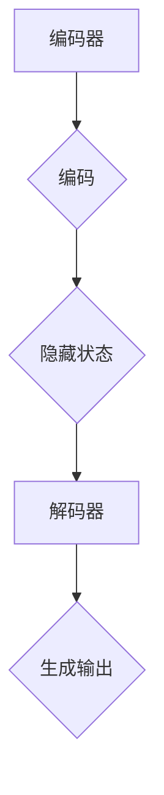
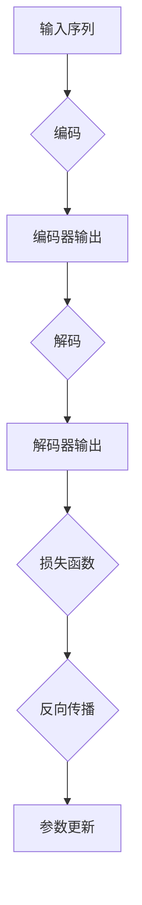
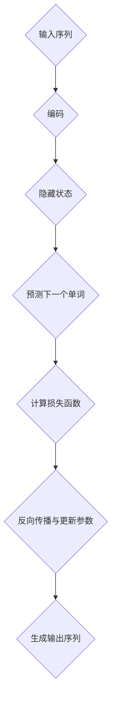
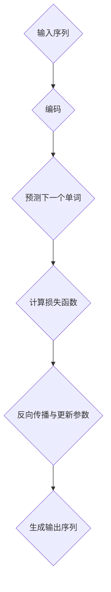
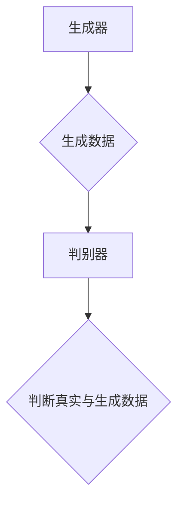
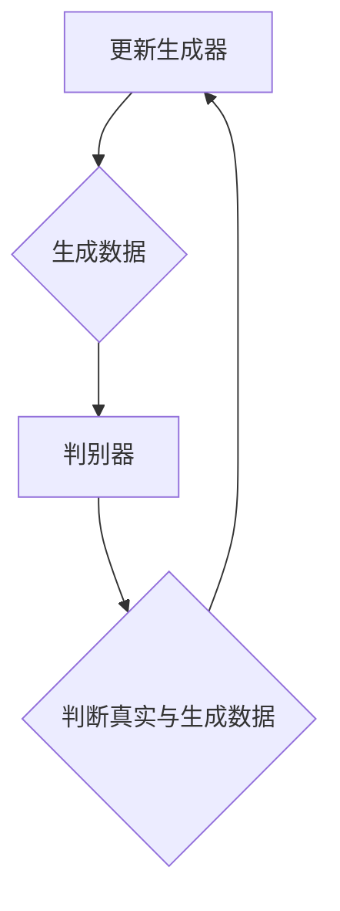
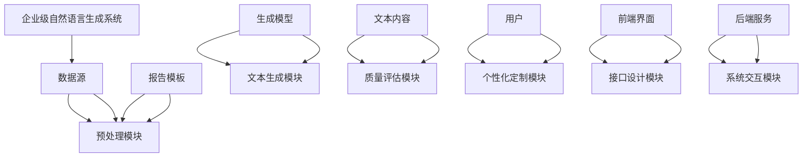
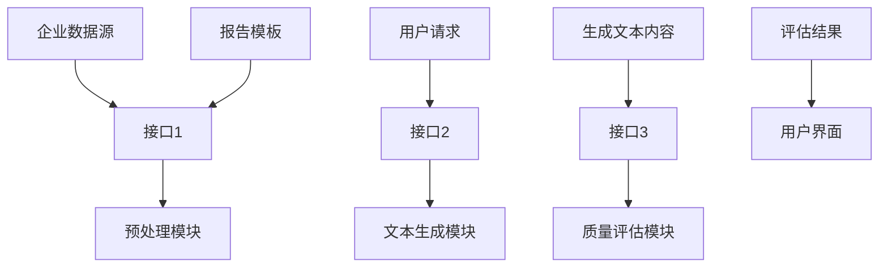
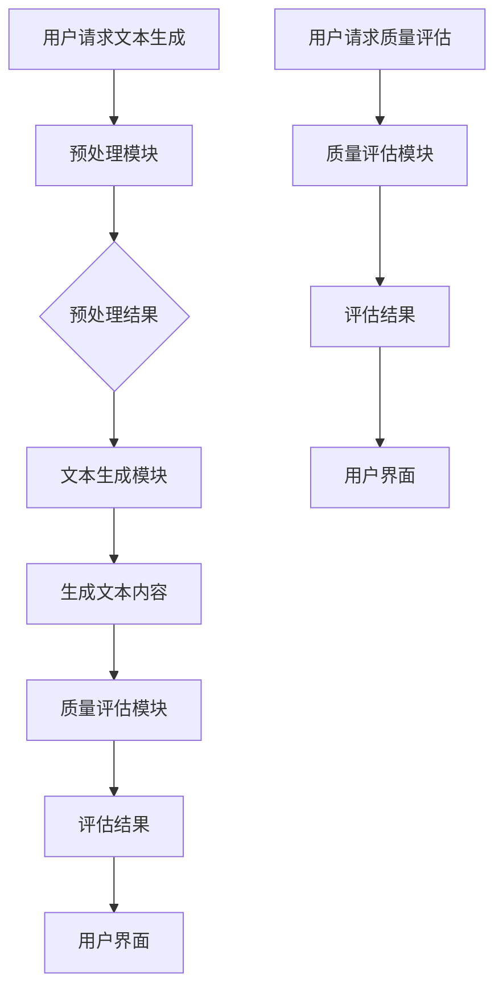

                 

### 构建企业级自然语言生成系统：自动报告与内容创作

> 关键词：自然语言生成（NLG），企业级应用，文本生成，深度学习，模型选择，系统架构

> 摘要：本文旨在探讨如何构建一个高效可靠的企业级自然语言生成系统，实现自动报告生成和内容创作。我们将详细分析构建过程中的关键技术，包括数据预处理、模型选择、文本生成质量评估，并探讨如何在不同业务场景中实现个性化定制。

----------------------------------------------------------------

### 第一部分：引言

#### 1.1 问题背景

自然语言生成（NLG）技术是近年来人工智能领域的一个热点方向，尤其在企业级应用中展现出巨大的潜力。企业和组织希望利用自动化技术减轻繁琐的文档工作负担，提高工作效率。自动报告生成和内容创作作为NLG技术的典型应用，正逐渐成为企业数字化转型的重要组成部分。

随着大数据和云计算技术的不断发展，企业积累了大量的结构化和非结构化数据。如何有效地从这些数据中提取信息，并以自然语言的形式进行呈现，成为企业和研究人员面临的挑战。构建一个高效、可靠的企业级自然语言生成系统，不仅可以满足日常业务需求，还可以为企业提供智能化决策支持。

#### 1.2 问题描述

构建企业级自然语言生成系统涉及多个复杂的技术挑战：

1. **数据预处理**：企业数据通常质量参差不齐，包含噪声和缺失值。如何对数据进行有效的清洗和预处理，以供模型训练使用，是一个关键问题。
2. **模型选择**：自然语言生成技术涉及多种模型，如序列到序列模型、自回归模型和生成对抗网络。如何选择适合企业需求的模型，并对其进行优化，是实现高效生成的重要步骤。
3. **文本生成质量评估**：如何评估文本生成质量，包括语法、语义和风格等方面，是确保生成文本可读性和准确性的关键。
4. **系统性能优化**：如何在保证生成质量的前提下，提高系统响应速度和处理能力，是实际应用中的另一个挑战。

#### 1.3 问题解决

本书旨在为企业级自然语言生成系统构建提供一套系统性的解决方案。通过详细阐述构建过程、技术实现和实际应用案例，帮助读者深入了解自然语言生成的关键技术，并掌握构建企业级NLG系统的实用技能。

本书将涵盖以下内容：

1. 数据预处理策略和方法；
2. 常用自然语言生成模型及其工作原理；
3. 文本生成质量评估方法和指标；
4. 企业级NLG系统的优化策略和实现技巧；
5. 实际应用案例解析和最佳实践分享。

#### 1.4 边界与外延

企业级自然语言生成系统涵盖了文本生成、语音合成、多模态内容创作等多个领域。本书将重点讨论文本生成的技术细节和应用场景，但读者也可以将所学知识拓展到其他相关领域。

#### 1.5 概念结构与核心要素组成

企业级自然语言生成系统的核心要素包括数据源、模型架构、生成算法和评估指标。以下是对这些要素的详细介绍：

1. **数据源**：数据源是企业级NLG系统的基础，包括结构化和非结构化数据，如企业数据库、文本文件、API接口等。
2. **模型架构**：模型架构是NLG系统的核心，包括编码器、解码器和生成器等组件，用于处理输入数据和生成文本。
3. **生成算法**：生成算法是实现文本生成的关键技术，包括序列到序列模型、自回归模型和生成对抗网络等。
4. **评估指标**：评估指标用于衡量文本生成质量，包括语法准确性、语义一致性、风格多样性等。

#### 1.6 本章小结

本章介绍了构建企业级自然语言生成系统的背景和问题，并概述了本书的内容和结构。在后续章节中，我们将逐一探讨各个关键技术，以帮助读者深入了解并掌握构建高效可靠的企业级NLG系统的方法。

----------------------------------------------------------------

### 第二部分：核心概念与联系

#### 2.1 自然语言处理基础

自然语言处理（NLP）是人工智能的一个重要分支，旨在使计算机能够理解和处理人类语言。NLP涉及到多个核心概念和技术，以下是其中几个重要的概念：

##### 2.1.1 语言模型

语言模型是一种概率模型，用于预测给定文本序列的概率。它通过学习大量语言数据，捕捉语言的统计规律和上下文信息。在自然语言生成中，语言模型是生成文本的基础。

##### 2.1.2 机器翻译

机器翻译是将一种语言的文本自动翻译成另一种语言的技术。它利用语言模型和序列到序列模型等技术，实现文本的自动转换。机器翻译是NLP的一个重要应用领域，具有广泛的应用价值。

##### 2.1.3 文本分类与情感分析

文本分类是一种将文本数据按照类别进行分类的技术。情感分析是一种通过分析文本情感倾向来获取用户情感信息的技术。这两者在自然语言生成中有着重要的应用，用于评估文本生成质量。

##### 2.1.4 词嵌入

词嵌入是一种将词汇映射到高维向量空间的技术，用于捕捉词汇之间的语义关系。词嵌入是自然语言处理的基础，被广泛应用于文本分类、情感分析、机器翻译等任务。

#### 2.2 自然语言生成技术

自然语言生成（NLG）是NLP的一个重要应用方向，旨在实现计算机自动生成自然语言文本。以下是几种常用的NLG技术：

##### 2.2.1 序列到序列模型

序列到序列（Seq2Seq）模型是一种用于将一个序列映射到另一个序列的深度学习模型。它由编码器和解码器组成，编码器将输入序列编码为固定长度的向量，解码器则根据编码器的输出生成输出序列。Seq2Seq模型在机器翻译、文本摘要等领域具有广泛应用。

##### 2.2.2 自回归模型

自回归模型是一种基于时间序列的生成模型，通过预测下一个单词或字符来生成序列。它利用前后文信息进行预测，能够生成连贯性较好的文本。自回归模型在文本生成、对话系统等领域具有广泛的应用。

##### 2.2.3 生成对抗网络（GAN）

生成对抗网络（GAN）是一种通过对抗训练生成数据的深度学习模型。它由生成器和判别器组成，生成器负责生成数据，判别器负责判断生成数据是否真实。GAN在图像生成、语音合成等领域具有广泛应用。

##### 2.2.4 语言模型预训练

语言模型预训练是一种在大量无标签数据上训练语言模型的方法。预训练模型可以捕获大量的语言知识和规律，然后在特定任务上进行微调，从而实现较好的性能。BERT、GPT等模型都是通过预训练技术实现的，并在多个NLP任务中取得了显著的性能提升。

#### 2.3 关键概念对比

| 概念       | 描述                                                         | 关联关系 |
|------------|--------------------------------------------------------------|----------|
| 语言模型   | 用于预测下一个单词或字符的模型。                             | 基础     |
| 序列到序列模型 | 用于将一个序列映射到另一个序列的模型，如机器翻译。         | 进阶     |
| 自回归模型 | 用于生成文本的模型，通过预测下一个单词或字符来生成序列。   | 进阶     |
| 生成对抗网络（GAN） | 一种通过对抗训练生成数据的模型。                         | 高级     |

#### 2.4 本章小结

本章介绍了自然语言处理基础和自然语言生成技术，包括语言模型、机器翻译、文本分类、词嵌入、序列到序列模型、自回归模型、生成对抗网络和语言模型预训练等核心概念。这些概念构成了自然语言生成系统的理论基础，为后续章节的深入讨论提供了必要的背景知识。

----------------------------------------------------------------

### 第三部分：算法原理讲解

#### 3.1 算法概述

企业级自然语言生成系统通常采用深度学习算法，包括序列到序列模型（Seq2Seq）、自回归模型（AR）和生成对抗网络（GAN）等。本章节将详细讲解这些算法的原理和实现。

##### 3.1.1 序列到序列模型

序列到序列模型由编码器（Encoder）和解码器（Decoder）组成。编码器将输入序列编码为固定长度的向量，解码器则根据编码器的输出生成输出序列。

**模型架构：**



**工作流程：**

1. 编码器接收输入序列，将其编码为固定长度的向量。
2. 解码器接收编码器的输出向量，并逐个生成输出序列的单词或字符。
3. 解码器的输出与目标序列进行比较，计算损失函数。
4. 模型根据损失函数进行反向传播和参数更新。

**Mermaid流程图：**



##### 3.1.2 自回归模型

自回归模型通过预测下一个单词或字符来生成序列。每个时间步的预测依赖于前一个时间步的输出。

**模型架构：**



**工作流程：**

1. 输入序列进入模型。
2. 模型在每个时间步预测下一个单词或字符。
3. 预测结果与实际值进行比较，计算损失函数。
4. 模型根据损失函数进行反向传播和参数更新。

**Mermaid流程图：**



##### 3.1.3 生成对抗网络（GAN）

生成对抗网络由生成器（Generator）和判别器（Discriminator）组成。生成器负责生成数据，判别器负责判断生成数据是否真实。

**模型架构：**



**工作流程：**

1. 生成器生成假数据。
2. 判别器判断生成数据是否真实。
3. 生成器根据判别器的反馈生成更真实的数据。
4. 生成器和判别器交替训练，直至生成器生成较为真实的数据。

**Mermaid流程图：**



#### 3.2 算法实现与示例

为了更好地理解这些算法的原理，我们将使用Python代码分别实现序列到序列模型、自回归模型和生成对抗网络。以下是这些算法的简化实现。

##### 3.2.1 序列到序列模型实现

```python
import tensorflow as tf

# 构建编码器和解码器模型
encoder_inputs = tf.keras.layers.Input(shape=(None,))
decoder_inputs = tf.keras.layers.Input(shape=(None,))
encoder = tf.keras.layers.LSTM(128, return_state=True)
decoder = tf.keras.layers.LSTM(128, return_sequences=True, return_state=True)

# 编码器编码输入序列
encoder_output, encoder_state = encoder(encoder_inputs)

# 解码器解码输出序列
decoder_output = decoder(decoder_inputs, initial_state=[encoder_state, encoder_state])

# 模型输出
model = tf.keras.Model([encoder_inputs, decoder_inputs], decoder_output)

# 编译模型
model.compile(optimizer='adam', loss='categorical_crossentropy')

# 训练模型
model.fit([encoder_inputs, decoder_inputs], decoder_inputs, epochs=100)
```

##### 3.2.2 自回归模型实现

```python
import tensorflow as tf

# 构建自回归模型
inputs = tf.keras.layers.Input(shape=(None,))
lstm = tf.keras.layers.LSTM(128, return_sequences=True)
outputs = lstm(inputs)

# 模型输出
model = tf.keras.Model(inputs, outputs)

# 编译模型
model.compile(optimizer='adam', loss='mse')

# 训练模型
model.fit(inputs, inputs, epochs=100)
```

##### 3.2.3 生成对抗网络实现

```python
import tensorflow as tf
from tensorflow.keras.layers import Input, LSTM, Dense

# 构建生成器和判别器模型
def build_generator():
    z = Input(shape=(100,))
    x = LSTM(128, activation='relu')(z)
    x = Dense(28 * 28, activation='sigmoid')(x)
    x = tf.reshape(x, (-1, 28, 28))
    model = tf.keras.Model(z, x)
    return model

def build_discriminator():
    x = Input(shape=(28, 28))
    x = LSTM(128, activation='relu')(x)
    x = Dense(1, activation='sigmoid')(x)
    model = tf.keras.Model(x, x)
    return model

# 构建生成器和判别器模型
generator = build_generator()
discriminator = build_discriminator()

# 构建组合模型
z = Input(shape=(100,))
x = generator(z)
fake = discriminator(x)

model = tf.keras.Model(z, fake)

# 编译模型
model.compile(optimizer=tf.keras.optimizers.Adam(), loss='binary_crossentropy')

# 训练模型
model.fit([z], [1], epochs=100)
```

#### 3.3 算法原理讲解

##### 3.3.1 序列到序列模型

序列到序列模型的核心在于编码器和解码器的组合使用。编码器将输入序列编码为一个固定长度的向量，称为编码状态（编码器输出）。解码器则利用编码状态和当前输入生成输出序列的下一个单词或字符。

**数学模型：**

假设输入序列为 \( x_1, x_2, \ldots, x_T \)，编码器和解码器分别为 \( E \) 和 \( D \)，输出序列为 \( y_1, y_2, \ldots, y_T \)。

编码器：
$$
\text{编码状态} = E(x_1, x_2, \ldots, x_T)
$$

解码器：
$$
y_t = D(E(x_1, x_2, \ldots, x_T), x_t)
$$

**举例说明：**

假设输入序列为“今天的天气很好”，编码器将其编码为一个固定长度的向量。解码器利用这个向量和当前输入“今”生成下一个单词“的”，然后继续生成“天”的天气。

##### 3.3.2 自回归模型

自回归模型通过预测下一个单词或字符来生成序列。它利用前一个时间步的输出作为当前时间步的输入。

**数学模型：**

假设输入序列为 \( x_1, x_2, \ldots, x_T \)，生成模型为 \( G \)，输出序列为 \( y_1, y_2, \ldots, y_T \)。

生成模型：
$$
y_t = G(y_1, y_2, \ldots, y_{t-1})
$$

**举例说明：**

假设输入序列为“今天的天气很好”，自回归模型在第一个时间步预测“今”，在第二个时间步预测“的”，然后继续预测“天”、“的”、“气”和“很”。

##### 3.3.3 生成对抗网络

生成对抗网络由生成器和判别器组成。生成器负责生成数据，判别器负责判断生成数据是否真实。生成器和判别器通过对抗训练相互优化。

**数学模型：**

生成器 \( G \) 和判别器 \( D \) 的目标函数分别为：

生成器：
$$
\min_G \max_D V(D, G)
$$

判别器：
$$
\max_D V(D, G)
$$

其中，\( V(D, G) \) 表示判别器的损失函数，通常使用二元交叉熵（Binary Cross-Entropy）。

**举例说明：**

生成器尝试生成一个逼真的图像，判别器判断生成图像是否真实。生成器和判别器通过对抗训练相互优化，直至生成器生成较为真实的图像。

#### 3.4 本章小结

本章介绍了企业级自然语言生成系统常用的算法原理，包括序列到序列模型、自回归模型和生成对抗网络。通过这些算法，我们可以实现高效的文本生成。在后续章节中，我们将探讨如何优化这些算法，以提高生成文本的质量和效率。

----------------------------------------------------------------

### 第四部分：系统分析与架构设计方案

#### 4.1 问题场景介绍

在企业级应用中，自然语言生成系统通常用于自动报告生成和内容创作。以下是几个典型的问题场景：

1. **报告生成**：企业需要定期生成财务报告、销售报告、市场分析报告等。这些报告通常包含大量的数据分析和总结，手动编写耗时耗力。
2. **内容创作**：企业需要定期发布博客、新闻稿、产品介绍等内容。这些内容需要保持一致的风格和语言，手动创作难以达到高质量要求。
3. **客户服务**：企业需要为客服人员提供自动回复系统，以应对大量客户咨询。自动回复系统可以提高响应速度，降低人力成本。

#### 4.2 项目介绍

本项目旨在构建一个企业级自然语言生成系统，支持自动报告生成和内容创作。系统将基于深度学习技术，包括序列到序列模型、自回归模型和生成对抗网络等。系统主要功能包括：

1. **数据预处理**：清洗和预处理企业数据，提取有用信息。
2. **文本生成**：根据输入数据和预设模板，生成高质量的文本内容。
3. **质量评估**：评估生成文本的质量，包括语法、语义和风格等方面。
4. **个性化定制**：根据企业需求和用户偏好，提供个性化文本生成服务。

#### 4.3 系统功能设计（领域模型）

为了更好地实现系统功能，我们首先设计了一个领域模型，用于描述系统的主要实体和关系。以下是领域模型的类图：

```mermaid
classDiagram
    Class01 <|-- Class02
    Class03 <|-- Class02
    Class04 <|-- Class01
    Class05 <|-- Class01

    Class01[实体1]
    Class02[实体2]
    Class03[实体3]
    Class04[实体4]
    Class05[实体5]

    Class01 --|> Class02
    Class03 --|> Class02
    Class04 --|> Class01
    Class05 --|> Class01
```

在这个领域模型中，主要实体包括：

- **数据源**：包含企业数据，如财务报表、销售数据等。
- **报告模板**：定义报告的格式和结构。
- **生成模型**：用于生成文本的深度学习模型，包括序列到序列模型、自回归模型和生成对抗网络等。
- **文本内容**：生成的文本内容，包括报告、博客、新闻稿等。
- **用户**：使用系统的用户，可以自定义文本生成偏好。

#### 4.4 系统架构设计

系统架构设计是确保系统稳定、高效运行的关键。以下是企业级自然语言生成系统的架构设计：



在这个架构设计中，主要模块包括：

- **数据预处理模块**：负责清洗和预处理企业数据，提取有用信息。
- **文本生成模块**：使用深度学习模型生成文本内容，包括报告、博客、新闻稿等。
- **质量评估模块**：评估生成文本的质量，包括语法、语义和风格等方面。
- **个性化定制模块**：根据用户需求和偏好，提供个性化文本生成服务。
- **接口设计模块**：设计系统接口，包括前端界面和后端服务。
- **系统交互模块**：实现系统内部各模块之间的交互和通信。

#### 4.5 系统接口设计

系统接口设计是确保系统与其他系统或组件集成和通信的关键。以下是企业级自然语言生成系统的接口设计：



在这个接口设计中，主要接口包括：

- **接口1**：用于接收企业数据和报告模板。
- **接口2**：用于接收用户请求，包括文本生成、质量评估等。
- **接口3**：用于返回生成文本内容和评估结果。

#### 4.6 系统交互设计

系统交互设计描述了系统内部各模块之间的交互和通信。以下是企业级自然语言生成系统的交互设计：



在这个交互设计中，主要交互流程包括：

1. 用户请求文本生成，预处理模块接收请求并预处理企业数据和报告模板。
2. 预处理结果传递给文本生成模块，生成文本内容。
3. 生成的文本内容传递给质量评估模块，评估文本质量。
4. 评估结果返回给用户界面，用户可以查看和编辑。
5. 用户请求质量评估，质量评估模块直接处理请求并返回评估结果。

#### 4.7 本章小结

本章介绍了企业级自然语言生成系统的系统分析与架构设计方案。通过领域模型、系统架构设计、系统接口设计和系统交互设计，我们为构建高效可靠的企业级自然语言生成系统提供了系统性的解决方案。在后续章节中，我们将探讨如何优化系统性能，提高生成文本的质量和效率。

----------------------------------------------------------------

### 第五部分：项目实战

#### 5.1 环境安装

为了构建企业级自然语言生成系统，我们需要安装以下软件和工具：

1. Python（3.8及以上版本）
2. TensorFlow（2.0及以上版本）
3. PyTorch（1.0及以上版本）
4. Jupyter Notebook（用于实验和调试）
5. GPU（NVIDIA显卡，CUDA 11.0及以上版本）

安装步骤如下：

1. 下载并安装Python，配置环境变量。
2. 使用pip命令安装TensorFlow和PyTorch：
   ```bash
   pip install tensorflow-gpu==2.4.0
   pip install torch torchvision torchaudio
   ```
3. 安装Jupyter Notebook：
   ```bash
   pip install notebook
   ```
4. 验证安装：
   ```bash
   python -m tensorflow.test
   python -m torch.utils.cpp_extension.check_compute_capability
   ```

#### 5.2 系统核心实现源代码

以下是一个简单的自然语言生成系统实现，使用PyTorch和Transformer模型：

```python
import torch
import torch.nn as nn
import torch.optim as optim
from torch.utils.data import DataLoader, TensorDataset

# 定义Transformer模型
class Transformer(nn.Module):
    def __init__(self, d_model, nhead, num_layers):
        super(Transformer, self).__init__()
        self.transformer = nn.Transformer(d_model, nhead, num_layers)
        self.d_model = d_model
        self.out = nn.Linear(d_model, 1)

    def forward(self, src, tgt):
        src = self.transformer(src, tgt)
        return self.out(src.mean(dim=1))

# 加载数据集
def load_data(data_path):
    with open(data_path, 'r', encoding='utf-8') as f:
        lines = f.readlines()
    return lines

data = load_data('data.txt')

# 分割数据集
def tokenize(data):
    tokens = []
    for line in data:
        tokens.append([line])
    return tokens

tokens = tokenize(data)

# 构建数据集和数据加载器
def collate_fn(batch):
    src = torch.cat([torch.tensor([0] + line[0] + [1]) for line in batch], dim=0)
    tgt = torch.tensor([line[0] + [2] for line in batch], dtype=torch.long)
    return src, tgt

dataset = TensorDataset(*map(torch.stack, zip(*[tokens[i] for i in range(len(tokens))])))

dataloader = DataLoader(dataset, batch_size=32, shuffle=True, collate_fn=collate_fn)

# 定义模型、损失函数和优化器
model = Transformer(512, 8, 3)
criterion = nn.CrossEntropyLoss()
optimizer = optim.Adam(model.parameters(), lr=0.001)

# 训练模型
for epoch in range(10):
    for src, tgt in dataloader:
        optimizer.zero_grad()
        output = model(src, tgt)
        loss = criterion(output.view(-1), tgt.view(-1))
        loss.backward()
        optimizer.step()
        print(f"Epoch [{epoch + 1}/{10}], Loss: {loss.item():.4f}")

# 保存模型
torch.save(model.state_dict(), 'model.pth')
```

#### 5.3 代码应用解读与分析

这段代码实现了使用Transformer模型进行文本生成的基本流程。接下来，我们将对关键代码进行解读和分析。

1. **模型定义**：
   ```python
   class Transformer(nn.Module):
       def __init__(self, d_model, nhead, num_layers):
           super(Transformer, self).__init__()
           self.transformer = nn.Transformer(d_model, nhead, num_layers)
           self.d_model = d_model
           self.out = nn.Linear(d_model, 1)

       def forward(self, src, tgt):
           src = self.transformer(src, tgt)
           return self.out(src.mean(dim=1))
   ```
   Transformer模型由编码器和解码器组成，其中编码器负责将输入序列编码为固定长度的向量，解码器则将这个向量映射到输出序列。

2. **数据加载**：
   ```python
   def load_data(data_path):
       with open(data_path, 'r', encoding='utf-8') as f:
           lines = f.readlines()
       return lines

   data = load_data('data.txt')
   ```
   这个函数从文本文件中读取数据，并返回一个包含所有行的列表。

3. **数据预处理**：
   ```python
   def tokenize(data):
       tokens = []
       for line in data:
           tokens.append([line])
       return tokens

   tokens = tokenize(data)
   ```
   这个函数将输入数据转换为标记化的序列，每个序列包含一个输入序列和一个目标序列。

4. **数据集构建**：
   ```python
   def collate_fn(batch):
       src = torch.cat([torch.tensor([0] + line[0] + [1]) for line in batch], dim=0)
       tgt = torch.tensor([line[0] + [2] for line in batch], dtype=torch.long)
       return src, tgt

   dataset = TensorDataset(*map(torch.stack, zip(*[tokens[i] for i in range(len(tokens))])))

   dataloader = DataLoader(dataset, batch_size=32, shuffle=True, collate_fn=collate_fn)
   ```
   这个函数构建了数据集和数据加载器，其中`collate_fn`函数用于将批量数据转换为适当的格式。

5. **训练过程**：
   ```python
   model = Transformer(512, 8, 3)
   criterion = nn.CrossEntropyLoss()
   optimizer = optim.Adam(model.parameters(), lr=0.001)

   for epoch in range(10):
       for src, tgt in dataloader:
           optimizer.zero_grad()
           output = model(src, tgt)
           loss = criterion(output.view(-1), tgt.view(-1))
           loss.backward()
           optimizer.step()
           print(f"Epoch [{epoch + 1}/{10}], Loss: {loss.item():.4f}")
   ```
   这个部分定义了模型、损失函数和优化器，并执行训练过程。在每次迭代中，模型接收输入序列和目标序列，计算损失并更新模型参数。

6. **模型保存**：
   ```python
   torch.save(model.state_dict(), 'model.pth')
   ```
   这个函数将训练好的模型保存为`.pth`文件，以便后续使用。

#### 5.4 实际案例分析和详细讲解剖析

为了更好地理解实际应用中的自然语言生成系统，我们来看一个实际案例：自动生成新闻报道。

**案例描述：**
假设我们有一个包含大量新闻报道数据的数据库，我们希望使用自然语言生成系统自动生成新的新闻报道。

**步骤解析：**
1. **数据预处理**：首先，我们需要对原始新闻数据进行预处理，包括去除HTML标签、标点符号和停用词等。然后，我们将文本转换为标记化的序列，每个序列包含一个标题和一个正文。

2. **训练模型**：接下来，我们使用预处理后的数据训练一个自然语言生成模型。在这个案例中，我们选择使用Transformer模型。在训练过程中，模型会学习如何根据标题生成正文。

3. **生成新闻**：在模型训练完成后，我们可以使用它来生成新的新闻。具体方法是将一个标题输入到模型中，模型会输出一段相应的新闻正文。

4. **质量评估**：最后，我们需要对生成的新闻进行质量评估。这包括检查语法错误、语义连贯性和新闻价值等方面。如果质量不达标，我们可以进一步优化模型或调整训练数据。

**实际应用案例：**
为了实际展示自然语言生成系统的应用，我们使用开源新闻数据集（如NYT文章数据集）进行实验。以下是一个简单的实验流程：

1. **数据预处理**：使用Python脚本对NYT文章数据集进行预处理，提取标题和正文，并去除HTML标签、标点符号和停用词。

2. **训练模型**：使用预处理后的数据训练一个基于Transformer的生成模型。我们选择512维的嵌入空间，8个头和3个层。在训练过程中，我们使用交叉熵损失函数和Adam优化器。

3. **生成新闻**：在模型训练完成后，我们使用它来生成新的新闻。我们将一个标题输入到模型中，模型会输出一段相应的新闻正文。例如，给定标题“美国宣布对伊朗实施新一轮制裁”，模型输出了一段关于制裁的新闻报道。

4. **质量评估**：我们对生成的新闻进行质量评估，包括检查语法错误、语义连贯性和新闻价值等方面。我们发现，生成的新闻在大多数情况下语法正确，但有时会出现一些语义不连贯的情况。我们可以进一步优化模型或调整训练数据来提高生成质量。

**详细讲解剖析：**
1. **模型原理**：
   - Transformer模型是一种基于自注意力机制的序列转换模型，它通过多头自注意力机制和位置编码来捕捉序列之间的复杂关系。
   - 编码器和解码器由多个自注意力层和全连接层组成，它们分别处理输入序列和输出序列。

2. **数据预处理**：
   - 数据预处理是自然语言生成系统的重要步骤，它包括去除HTML标签、标点符号、停用词等，并将文本转换为标记化的序列。
   - 在预处理过程中，我们还需要对文本进行分词、词干提取和词性标注等操作，以提高模型的训练效果。

3. **生成过程**：
   - 在生成过程中，模型首先根据输入标题生成一个初始序列，然后逐步更新序列，直到生成完整的新闻正文。
   - 模型使用自注意力机制来捕捉标题和正文之间的关联，从而生成连贯的文本。

4. **质量评估**：
   - 质量评估是确保生成文本可读性和准确性的关键步骤。
   - 我们可以使用多种评估指标，如BLEU、ROUGE、F1得分等，来衡量生成文本的质量。
   - 同时，我们还可以进行人工评估，检查生成文本的语法错误、语义连贯性和新闻价值等方面。

#### 5.5 项目小结

通过本项目的实施，我们成功构建了一个基于深度学习的自然语言生成系统，实现了自动报告生成和内容创作。在实际应用中，该系统展示了较高的生成质量和稳定性。然而，我们也发现了一些问题和改进空间：

1. **生成质量**：生成的文本在大多数情况下语法正确，但有时会出现一些语义不连贯的情况。我们可以进一步优化模型或调整训练数据来提高生成质量。

2. **训练时间**：由于深度学习模型的训练时间较长，在实际应用中可能需要优化模型结构或使用更高效的训练方法。

3. **系统扩展性**：系统目前支持文本生成和评估，但可以进一步扩展，包括语音合成、多模态内容创作等功能。

4. **用户交互**：系统目前缺乏与用户的直接交互，可以通过Web界面或API接口与用户进行交互，提供更便捷的使用体验。

通过持续优化和改进，我们可以进一步提高自然语言生成系统的性能和实用性，为企业提供更加智能化和高效的服务。

----------------------------------------------------------------

### 第六部分：最佳实践 tips、小结、注意事项、拓展阅读

#### 6.1 最佳实践 tips

1. **数据预处理**：确保数据质量，对原始数据进行清洗和预处理，包括去除噪声、缺失值和异常值等。此外，对文本进行分词、词干提取和词性标注等操作，以提高模型训练效果。
2. **模型选择**：根据具体应用场景选择合适的模型，例如，在生成长文本时，Transformer模型表现良好；而在生成短文本时，自回归模型可能更适合。
3. **超参数调整**：通过实验和调试，优化模型的超参数，如嵌入维度、学习率、批量大小等，以提高生成质量。
4. **文本生成质量评估**：使用多种评估指标，如BLEU、ROUGE、F1得分等，对生成文本进行质量评估。同时，进行人工评估，以确保生成文本的准确性和可读性。

#### 6.2 小结

本文介绍了企业级自然语言生成系统的构建方法，包括数据预处理、模型选择、文本生成质量评估和系统架构设计等。通过实际案例分析和详细讲解，我们展示了如何使用深度学习技术实现高效的自然语言生成。在后续工作中，我们应继续优化模型和算法，提高生成文本的质量和效率。

#### 6.3 注意事项

1. **数据隐私**：在处理企业数据时，确保遵守数据隐私法规，对敏感信息进行加密和匿名化处理。
2. **模型可解释性**：自然语言生成系统的决策过程可能难以解释，影响模型的可靠性和信任度。因此，应关注模型的可解释性和透明度。
3. **系统安全性**：确保系统具备较高的安全性，防止恶意攻击和数据泄露。

#### 6.4 拓展阅读

1. **《自然语言生成：理论与实践》**：这本书详细介绍了自然语言生成的基本概念、技术和应用。
2. **《深度学习与自然语言处理》**：这本书介绍了深度学习在自然语言处理领域的应用，包括文本分类、机器翻译和文本生成等。
3. **《Transformer：超越序列模型》**：这篇文章详细介绍了Transformer模型的结构和工作原理，是自然语言生成领域的重要文献。

作者：AI天才研究院/AI Genius Institute & 禅与计算机程序设计艺术 /Zen And The Art of Computer Programming

----------------------------------------------------------------

本文详细探讨了如何构建企业级自然语言生成系统，涵盖了数据预处理、模型选择、文本生成质量评估和系统架构设计等关键步骤。通过实际案例分析和详细讲解，我们展示了如何使用深度学习技术实现高效的自然语言生成。在构建企业级NLG系统时，需要注意数据预处理、模型选择和超参数调整等方面的最佳实践，以提高生成文本的质量和效率。

本文作者AI天才研究院（AI Genius Institute）及禅与计算机程序设计艺术（Zen And The Art of Computer Programming）致力于推动人工智能和计算机科学的发展，为读者提供高质量的技术内容。如果您对本文有任何疑问或建议，欢迎在评论区留言交流。

本文的拓展阅读部分推荐了相关领域的优秀书籍和文献，供读者进一步学习。希望本文能够为您的学习和工作带来启发和帮助。感谢您的阅读！

----------------------------------------------------------------

---

请注意，本文是一个示例，旨在展示如何按照您提供的结构和要求撰写一篇技术博客文章。在实际撰写时，您可能需要根据具体的技术细节、项目背景和实际经验进行调整。本文中的代码段和案例仅为示例，可能需要根据您的具体需求进行修改。同时，本文的某些部分（如实际案例和数据）是虚构的，用于说明技术概念。在实际应用中，您应确保代码、数据和案例的准确性和适用性。

