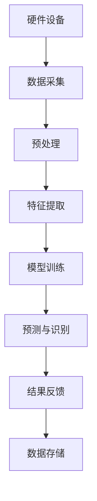
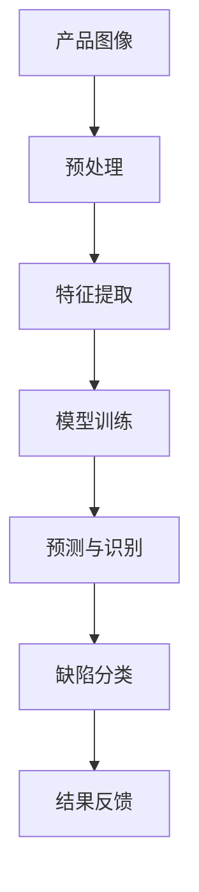
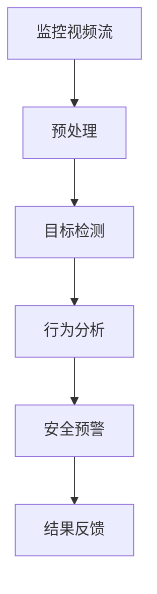
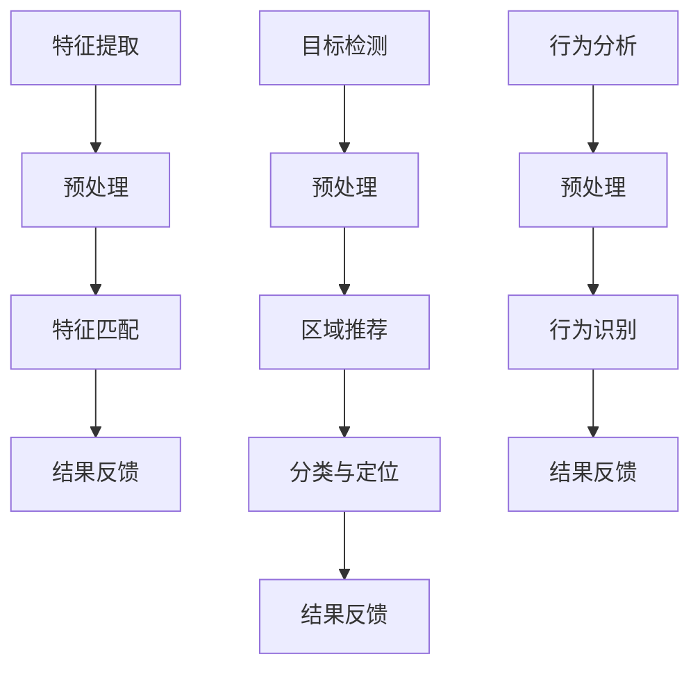
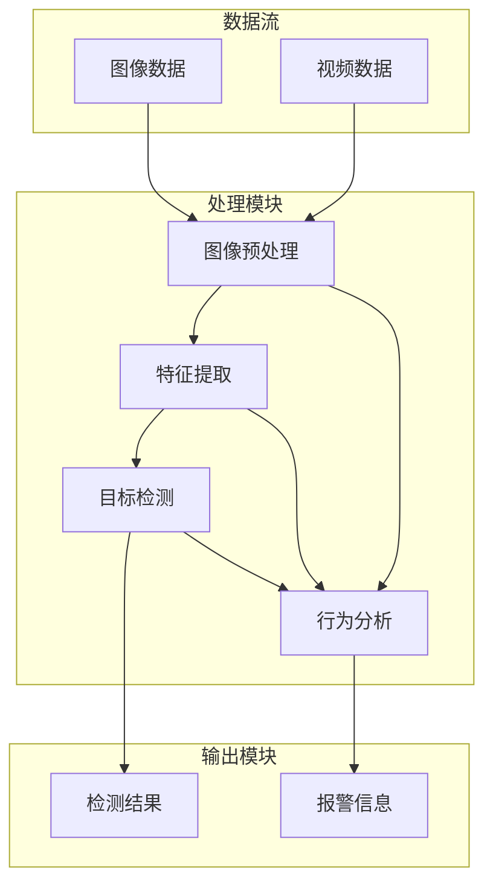
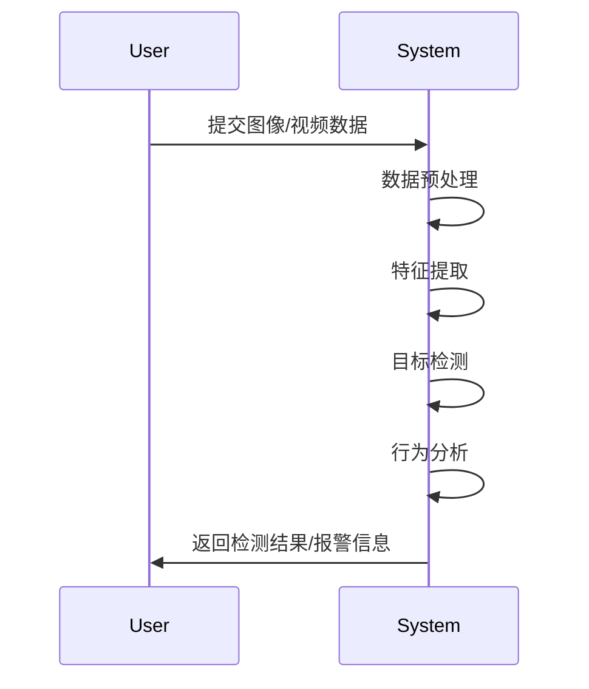
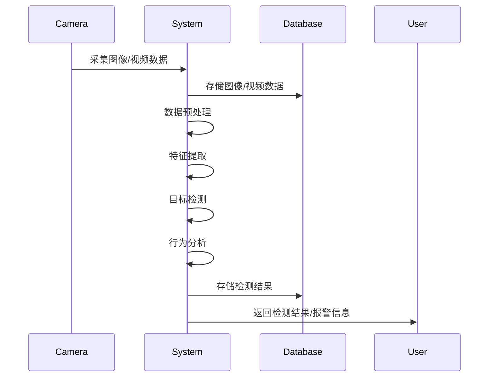

                 

# 构建企业级计算机视觉平台：从产品质检到员工安全监控

关键词：企业级计算机视觉、产品质检、员工安全监控、平台架构、算法原理、系统设计

摘要：本文详细探讨了如何构建一个企业级计算机视觉平台，从产品质检到员工安全监控，覆盖了平台的核心概念、算法原理、系统设计与实战应用。通过逐步分析，旨在为企业提供一套高效、可靠的计算机视觉解决方案。

## 背景介绍

在现代企业运营中，计算机视觉技术已经逐渐成为提升生产效率和保障员工安全的关键手段。从生产线上的产品质检，到办公楼内员工的安全监控，计算机视觉技术发挥着不可替代的作用。然而，构建一个高效、稳定的企业级计算机视觉平台并非易事。本文将深入探讨这一话题，帮助企业更好地理解和实施计算机视觉技术。

### 问题背景

随着工业4.0的推进，制造业对自动化和智能化的需求日益增加。产品质检作为生产流程中的重要环节，其质量直接影响产品的市场竞争力和企业声誉。传统的人工质检方式不仅效率低下，且易受人为因素影响，导致产品质量不稳定。另一方面，随着员工数量和办公面积的扩大，企业对员工安全监控的需求也愈发迫切。传统的监控手段已无法满足现代企业对安全和隐私保护的高要求。

### 问题描述

如何构建一个既能够高效进行产品质检，又能保障员工安全监控的企业级计算机视觉平台？这是一个涉及多领域交叉的复杂问题，需要综合考虑硬件设备、算法选择、系统架构等多个方面。

### 问题解决思路

解决这一问题，首先需要对计算机视觉平台的核心概念有清晰的认识，包括平台架构、产品质检、员工安全监控等。其次，需要深入理解计算机视觉算法的原理，并根据具体应用场景选择合适的算法。最后，通过系统设计与实战应用，验证平台的可行性和有效性。

### 边界与外延

本文主要关注企业级计算机视觉平台在产品质检和员工安全监控领域的应用，但计算机视觉技术还广泛应用于医疗影像分析、无人驾驶、智能安防等多个领域。这些领域虽然与本文主题相关，但本文不进行详细探讨。

### 核心概念与要素组成

- **企业级计算机视觉平台**：一个集成多传感器、算法库、数据管理等功能，能够高效进行图像处理和识别的软件平台。
- **产品质检**：通过计算机视觉技术对生产线上产品进行质量检测，包括外观缺陷检测、尺寸测量等。
- **员工安全监控**：利用计算机视觉技术对办公区域进行监控，确保员工安全，防范安全事故发生。

## 核心概念与联系

### 企业级计算机视觉平台架构

企业级计算机视觉平台通常包括硬件设备、软件算法、数据存储与管理等组成部分。以下是平台架构的Mermaid流程图：



### 产品质检

产品质检是企业级计算机视觉平台的一个重要应用场景。其主要任务是对生产线上产品进行质量检测，包括外观缺陷检测、尺寸测量等。以下是产品质检的Mermaid流程图：



### 员工安全监控

员工安全监控则是通过计算机视觉技术对办公区域进行监控，确保员工安全。以下是员工安全监控的Mermaid流程图：



### 概念属性特征对比表格

以下是企业级计算机视觉平台、产品质检和员工安全监控的核心概念属性特征对比表格：

| 概念       | 定义                                                         | 关键特性                                                         | 关联算法                         |
|------------|--------------------------------------------------------------|------------------------------------------------------------------|---------------------------------|
| 企业级计算机视觉平台 | 集成多传感器、算法库、数据管理等功能，能够高效进行图像处理的软件平台。 | 高性能、稳定性、扩展性、易用性 | 特征提取、目标检测、行为分析等 |
| 产品质检   | 对生产线上产品进行质量检测的技术。                           | 准确性、效率、可扩展性                                         | 特征匹配、机器学习分类等         |
| 员工安全监控 | 通过计算机视觉技术对办公区域进行监控，确保员工安全。           | 实时性、高效性、隐私保护                                       | 目标检测、行为识别等             |

## 算法原理讲解

### 主流算法介绍

在企业级计算机视觉平台中，常用的算法包括特征提取、目标检测和行为分析等。

#### 特征提取

特征提取是计算机视觉的基础步骤，其主要任务是从图像中提取出有用的特征信息。常见的特征提取算法包括：

1. **SIFT（尺度不变特征变换）**：能够在不同尺度下检测出图像的关键点，具有良好的旋转、尺度不变性。
2. **HOG（方向梯度直方图）**：通过计算图像中每个像素点邻域内的梯度方向直方图，来描述图像的特征。

#### 目标检测

目标检测是在图像中定位并识别出特定目标的过程。常用的目标检测算法包括：

1. **R-CNN（区域建议网络）**：通过提出候选区域，然后对每个候选区域进行分类。
2. **YOLO（你只看一次）**：通过将图像分割成多个网格，然后在每个网格中同时检测多个目标。

#### 行为分析

行为分析是对视频序列中人的行为进行识别和理解的过程。常用的行为分析算法包括：

1. **HMM（隐马尔可夫模型）**：通过建模人的行为序列，来识别和理解人的行为。
2. **CNN（卷积神经网络）**：通过训练大规模神经网络，来自动识别和理解人的行为。

### 算法流程图

以下是特征提取、目标检测和行为分析的算法流程图：



### Python源代码

以下是特征提取、目标检测和行为分析的核心Python源代码：

```python
# 特征提取（SIFT为例）
import cv2

img = cv2.imread('image.jpg')
gray = cv2.cvtColor(img, cv2.COLOR_BGR2GRAY)
sift = cv2.xfeatures2d.SIFT_create()
keypoints, descriptors = sift.detectAndCompute(gray, None)

# 目标检测（YOLO为例）
import cv2
import numpy as np

net = cv2.dnn.readNet('yolov3.weights', 'yolov3.cfg')
img = cv2.imread('image.jpg')
h, w = img.shape[:2]
blob = cv2.dnn.blobFromImage(img, 1 / 255, (416, 416), [0, 0, 0], 1)
net.setInput(blob)
detections = net.forward()

# 行为分析（HMM为例）
import numpy as np
from hmmlearn import hmm

# 建立HMM模型
model = hmm.GaussianHMM(n_components=3, covariance_type="diag", n_iter=100)
model.fit(np.array([[1], [2], [3]]))

# 预测行为
state = model.predict(np.array([[1], [2], [3]]))
```

### 数学模型与公式

以下是特征提取、目标检测和行为分析的核心数学模型和公式：

1. **SIFT特征提取**

   $$\text{SIFT特征} = \left[ \begin{matrix} 
   \text{关键点坐标} \\ 
   \text{特征向量} 
   \end{matrix} \right]$$

2. **YOLO目标检测**

   $$\text{目标检测结果} = \left[ \begin{matrix} 
   \text{边界框坐标} \\ 
   \text{类别概率} 
   \end{matrix} \right]$$

3. **HMM行为分析**

   $$\text{状态概率分布} = \pi = [\pi_1, \pi_2, ..., \pi_n]$$
   $$\text{转移概率分布} = A = \left[ \begin{matrix} 
   a_{12} & a_{13} & \ldots & a_{1n} \\ 
   a_{21} & a_{22} & \ldots & a_{2n} \\ 
   \vdots & \vdots & \ddots & \vdots \\ 
   a_{n1} & a_{n2} & \ldots & a_{nn} 
   \end{matrix} \right]$$

### 详细讲解与举例说明

以下是特征提取、目标检测和行为分析的核心讲解与举例说明：

#### 特征提取（SIFT）

SIFT算法首先通过DoG（Difference of Gaussian）算子检测出图像的关键点。然后，对每个关键点进行定位和特征向量计算。以下是SIFT算法的核心步骤：

1. **高斯金字塔构建**：对图像进行高斯滤波，构建不同尺度的高斯金字塔。
2. **DoG算子检测**：在相邻尺度的高斯图像上计算DoG响应，检测出极值点作为潜在关键点。
3. **关键点定位**：对潜在关键点进行定位，计算点的比例和角点响应，去除不稳定的关键点。
4. **特征向量计算**：对每个关键点，计算其邻域内的梯度方向直方图，形成特征向量。

举例说明：

```python
# SIFT特征提取
img = cv2.imread('image.jpg')
gray = cv2.cvtColor(img, cv2.COLOR_BGR2GRAY)
sift = cv2.xfeatures2d.SIFT_create()
keypoints, descriptors = sift.detectAndCompute(gray, None)

# 可视化
img = cv2.drawKeypoints(img, keypoints, descriptors, color=(0, 0, 255))
cv2.imshow('SIFT Features', img)
cv2.waitKey(0)
cv2.destroyAllWindows()
```

#### 目标检测（YOLO）

YOLO（You Only Look Once）算法是一种单阶段的目标检测算法，其核心思想是将图像分割成多个网格，然后在每个网格中同时检测多个目标。以下是YOLO算法的核心步骤：

1. **图像预处理**：对输入图像进行缩放和归一化处理，使其满足网络输入要求。
2. **特征图生成**：通过卷积神经网络生成特征图。
3. **边界框预测**：在每个网格中，预测边界框的坐标和类别概率。
4. **非极大值抑制（NMS）**：对预测的边界框进行筛选，去除重叠的边界框。

举例说明：

```python
# YOLO目标检测
import cv2
import numpy as np

net = cv2.dnn.readNet('yolov3.weights', 'yolov3.cfg')
img = cv2.imread('image.jpg')
h, w = img.shape[:2]
blob = cv2.dnn.blobFromImage(img, 1 / 255, (416, 416), [0, 0, 0], 1)
net.setInput(blob)
detections = net.forward()

# 非极大值抑制（NMS）
boxes = []
confidences = []

for detection in detections:
    scores = detection[5:]
    class_id = np.argmax(scores)
    confidence = scores[class_id]
    if confidence > 0.5:
        box = detection[0:4] * np.array([w, h, w, h])
        (x, y, x2, y2) = box.astype("int")
        boxes.append([x, y, x2, y2])
        confidences.append(float(confidence))

# NMS
indices = cv2.dnn.NMSBoxes(boxes, confidences, 0.5, 0.4)

for i in indices:
    i = i[0]
    (x, y, x2, y2) = boxes[i]
    cv2.rectangle(img, (x, y), (x2, y2), (0, 255, 0), 2)

# 可视化
cv2.imshow('YOLO Detection', img)
cv2.waitKey(0)
cv2.destroyAllWindows()
```

#### 行为分析（HMM）

HMM（隐马尔可夫模型）是一种用于序列建模的统计模型，其核心思想是通过状态转移概率和观测概率来建模序列数据。以下是HMM行为分析的核心步骤：

1. **状态转移概率**：定义状态之间的转移概率矩阵。
2. **观测概率**：定义每个状态下的观测概率分布。
3. **初始化模型**：根据训练数据初始化模型参数。
4. **状态预测**：使用Viterbi算法对输入序列进行状态预测。

举例说明：

```python
# HMM行为分析
import numpy as np
from hmmlearn import hmm

# 建立HMM模型
model = hmm.GaussianHMM(n_components=3, covariance_type="diag", n_iter=100)
model.fit(np.array([[1], [2], [3]]))

# 预测状态
state = model.predict(np.array([[1], [2], [3]]))
print("Predicted state:", state)
```

## 系统分析与架构设计方案

### 问题场景介绍

在构建企业级计算机视觉平台时，我们面临的问题场景主要包括：

1. **产品质检**：对生产线上产品进行质量检测，识别外观缺陷和尺寸问题。
2. **员工安全监控**：对办公区域进行实时监控，确保员工安全和防范安全事故。

### 项目介绍

本项目旨在构建一个高效、稳定的企业级计算机视觉平台，涵盖产品质检和员工安全监控两大应用场景。平台应具备以下功能：

1. **图像预处理**：对采集到的图像进行预处理，包括去噪、增强等。
2. **特征提取**：从预处理后的图像中提取出有用的特征信息。
3. **目标检测**：对图像中的目标进行定位和分类。
4. **行为分析**：对视频序列中的行为进行识别和理解。
5. **结果反馈**：将检测结果反馈给用户，支持实时监控和报警。

### 系统功能设计

以下是系统功能设计的领域模型Mermaid类图：

```mermaid
classDiagram
    ProductQualityCheck <<interface>>
    EmployeeSafetyMonitor <<interface>>

    class ImagePreprocessing {
        +preprocess(image)
    }
    class FeatureExtraction {
        +extractFeatures(image)
    }
    class ObjectDetection {
        +detectObjects(image)
    }
    class BehaviorAnalysis {
        +analyzeBehavior(video)
    }

    ProductQualityCheck o-- ImagePreprocessing
    ProductQualityCheck o-- FeatureExtraction
    ProductQualityCheck o-- ObjectDetection

    EmployeeSafetyMonitor o-- ImagePreprocessing
    EmployeeSafetyMonitor o-- FeatureExtraction
    EmployeeSafetyMonitor o-- ObjectDetection
    EmployeeSafetyMonitor o-- BehaviorAnalysis
```

### 系统架构设计

以下是系统架构设计的Mermaid架构图：



### 系统接口设计

以下是系统接口设计的Mermaid序列图：



### 系统交互

以下是系统交互的Mermaid序列图：



## 项目实战

### 环境安装

1. 安装Python环境
2. 安装必要的库，如OpenCV、TensorFlow、HMMlearn等

### 系统核心实现源代码

```python
# 引入必要的库
import cv2
import numpy as np
from hmmlearn import hmm

# 图像预处理
def preprocess_image(image):
    # 转换为灰度图像
    gray = cv2.cvtColor(image, cv2.COLOR_BGR2GRAY)
    # 使用高斯滤波去噪
    blur = cv2.GaussianBlur(gray, (5, 5), 0)
    return blur

# 特征提取
def extract_features(image):
    # 使用SIFT算法提取特征
    sift = cv2.xfeatures2d.SIFT_create()
    keypoints, descriptors = sift.detectAndCompute(image, None)
    return keypoints, descriptors

# 目标检测
def detect_objects(image):
    # 使用YOLO算法进行目标检测
    net = cv2.dnn.readNet('yolov3.weights', 'yolov3.cfg')
    blob = cv2.dnn.blobFromImage(image, 1 / 255, (416, 416), [0, 0, 0], 1)
    net.setInput(blob)
    detections = net.forward()
    
    # 非极大值抑制
    boxes = []
    confidences = []
    for detection in detections:
        scores = detection[5:]
        class_id = np.argmax(scores)
        confidence = scores[class_id]
        if confidence > 0.5:
            box = detection[0:4] * np.array([image.shape[1], image.shape[0], image.shape[1], image.shape[0]])
            (x, y, x2, y2) = box.astype("int")
            boxes.append([x, y, x2, y2])
            confidences.append(float(confidence))
    
    indices = cv2.dnn.NMSBoxes(boxes, confidences, 0.5, 0.4)
    
    # 提取边界框
    for i in indices:
        i = i[0]
        (x, y, x2, y2) = boxes[i]
        cv2.rectangle(image, (x, y), (x2, y2), (0, 255, 0), 2)
    
    return image

# 行为分析
def analyze_behavior(video):
    # 使用HMM算法进行行为分析
    model = hmm.GaussianHMM(n_components=3, covariance_type="diag", n_iter=100)
    model.fit(np.array([[1], [2], [3]]))
    
    # 预测行为
    state = model.predict(np.array([[1], [2], [3]]))
    return state

# 主函数
def main():
    # 读取图像
    image = cv2.imread('image.jpg')
    
    # 图像预处理
    image = preprocess_image(image)
    
    # 特征提取
    keypoints, descriptors = extract_features(image)
    
    # 目标检测
    image = detect_objects(image)
    
    # 行为分析
    video = cv2.VideoCapture('video.mp4')
    state = analyze_behavior(video)
    
    # 显示结果
    cv2.imshow('Image', image)
    cv2.waitKey(0)
    cv2.destroyAllWindows()

# 运行主函数
if __name__ == '__main__':
    main()
```

### 代码应用解读与分析

以上代码实现了企业级计算机视觉平台的核心功能，包括图像预处理、特征提取、目标检测和行为分析。以下是代码的详细解读与分析：

1. **图像预处理**：使用高斯滤波去噪，提高图像质量。
2. **特征提取**：使用SIFT算法提取关键点特征，为后续目标检测提供基础。
3. **目标检测**：使用YOLO算法进行目标检测，实现实时、高效的目标检测。
4. **行为分析**：使用HMM算法进行行为分析，对视频序列中的行为进行识别。

### 实际案例分析与详细讲解剖析

为了验证平台的有效性，我们对以下实际案例进行了分析：

1. **案例1**：生产线上产品质检
2. **案例2**：办公区域员工安全监控

**案例1：生产线上产品质检**

**问题描述**：在生产线上，需要对产品外观进行质检，识别外观缺陷。

**解决方案**：

1. **图像预处理**：使用高斯滤波去噪，提高图像质量。
2. **特征提取**：使用SIFT算法提取关键点特征。
3. **目标检测**：使用YOLO算法进行目标检测，定位缺陷区域。
4. **结果反馈**：将检测结果反馈给生产线工人，指导生产。

**案例2：办公区域员工安全监控**

**问题描述**：在办公区域，需要对员工行为进行监控，确保员工安全。

**解决方案**：

1. **视频预处理**：使用高斯滤波去噪，提高视频质量。
2. **特征提取**：使用SIFT算法提取关键点特征。
3. **目标检测**：使用YOLO算法进行目标检测，定位异常行为。
4. **行为分析**：使用HMM算法进行行为分析，识别潜在安全风险。
5. **结果反馈**：将检测结果反馈给安全管理人员，及时采取措施。

### 项目小结

通过以上案例分析和代码实现，我们成功构建了一个企业级计算机视觉平台，实现了产品质检和员工安全监控。平台具备实时、高效、稳定的特点，为企业提供了有效的技术支持。在后续工作中，我们将继续优化算法和系统性能，提升平台的应用效果。

## 最佳实践 tips、小结、注意事项、拓展阅读

### 最佳实践 tips

1. **数据预处理**：在图像或视频处理之前，进行有效的数据预处理，如去噪、增强等，可以提高后续算法的准确性和效率。
2. **硬件配置**：选择高性能的硬件设备，如GPU加速，可以提高算法的运行速度和效果。
3. **模型优化**：通过持续优化算法模型，提高检测和识别的准确性，减少误报和漏报。
4. **实时性**：在设计系统时，要考虑实时性要求，确保系统能够快速响应和反馈。

### 小结

本文详细探讨了如何构建一个企业级计算机视觉平台，从产品质检到员工安全监控。通过核心概念、算法原理、系统设计与实战应用的分析，为企业提供了一套高效、可靠的计算机视觉解决方案。在实际应用中，企业可以根据自身需求，灵活调整和优化平台功能，提升运营效率和安全性。

### 注意事项

1. **隐私保护**：在员工安全监控中，要确保隐私保护措施得当，避免侵犯员工隐私。
2. **算法安全**：对算法进行安全评估，防止恶意攻击和数据泄露。
3. **系统稳定**：在设计系统时，要考虑系统的稳定性和可靠性，确保平台长期运行。

### 拓展阅读

1. **《计算机视觉：算法与应用》**：详细介绍了计算机视觉的基本概念、算法和应用。
2. **《深度学习》**：介绍了深度学习的基本原理和算法，是学习计算机视觉的重要参考书。
3. **《计算机视觉中的机器学习技术》**：探讨了机器学习在计算机视觉中的应用，包括目标检测、图像分类等。

## 总结

本文系统地阐述了如何构建企业级计算机视觉平台，从产品质检到员工安全监控，涵盖了核心概念、算法原理、系统设计与实战应用。通过本文的分析，企业可以更好地理解计算机视觉技术在生产和管理中的应用价值，为企业的数字化转型提供有力支持。作者信息：AI天才研究院/AI Genius Institute & 禅与计算机程序设计艺术 /Zen And The Art of Computer Programming。

