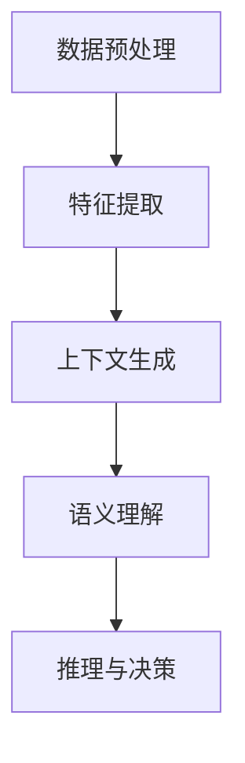
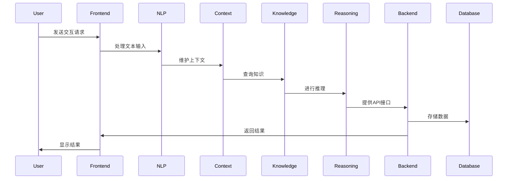
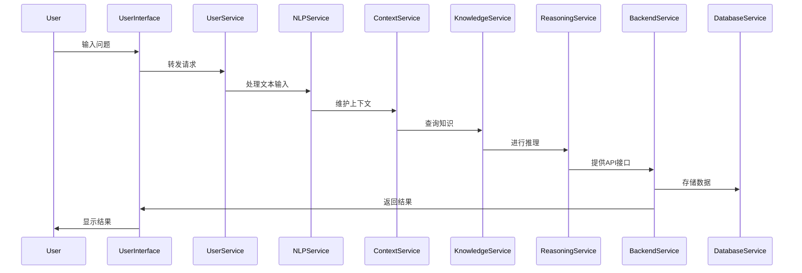

                 

### 《构建具有上下文理解能力的AI Agent》

#### 关键词
- AI Agent
- 上下文理解
- 算法实现
- 系统架构
- 实战案例

#### 摘要
本文将详细探讨构建具有上下文理解能力的AI Agent的各个方面。从背景和重要性引入，逐步讲解核心概念、算法原理、系统架构设计，并通过实战案例进行实际操作演示。最终，文章将总结最佳实践并提供拓展阅读，为读者提供一个全面的技术指南。

### 引言

#### 问题的背景和重要性

随着人工智能（AI）技术的迅速发展，AI Agent作为智能系统的代表，已经成为自动化和智能化领域的关键组成部分。AI Agent是指能够自主执行任务、具有一定程度智能化的计算机程序。与传统程序不同，AI Agent不仅能够执行预设的任务，还能够根据环境变化进行决策，具备自我学习和适应能力。

然而，当前许多AI Agent在执行任务时往往缺乏上下文理解能力，导致其表现不够智能和灵活。例如，一个简单的聊天机器人，如果无法准确理解用户的上下文，很可能会导致对话中断或者产生误解。因此，构建具有上下文理解能力的AI Agent，成为了一个重要的研究方向。

上下文理解是AI Agent智能化的核心要素之一。它不仅涉及到自然语言处理（NLP）技术，还包括对用户行为、环境变化等多维数据的分析和理解。一个具有上下文理解能力的AI Agent，能够在与用户交互时保持对话的连贯性，提供更加自然和人性化的服务。

本文将详细探讨如何构建具有上下文理解能力的AI Agent。我们将从问题的背景和重要性引入，逐步讲解核心概念、算法原理、系统架构设计，并通过实战案例进行实际操作演示。最终，文章将总结最佳实践并提供拓展阅读，为读者提供一个全面的技术指南。

### 背景介绍

#### 人工智能与上下文理解

#### 1. 问题背景

人工智能（AI）作为计算机科学的一个分支，旨在通过模拟人类智能行为来构建具有认知、学习、推理和自我改进能力的计算机系统。随着深度学习、自然语言处理（NLP）和强化学习等技术的不断发展，AI在图像识别、语音识别、文本分析等领域取得了显著进展。

然而，尽管AI技术在某些特定任务上表现出色，但其在处理复杂、动态环境中的能力仍存在明显不足。其中一个关键问题就是上下文理解。上下文理解是指AI系统能够根据特定情境中的信息，正确地理解和解释语言、行为和事件。这种能力是人类智能的核心特征之一，也是实现智能自动化的重要组成部分。

在实际应用中，许多AI系统由于缺乏上下文理解能力，导致其无法有效地处理复杂任务或与人类用户进行自然交互。例如，一个聊天机器人如果无法理解用户的上下文信息，可能会导致对话的混乱和中断；一个自动驾驶系统如果无法准确理解道路状况和交通规则，可能会发生危险。因此，研究如何提升AI系统的上下文理解能力，已经成为当前人工智能领域的一个重要课题。

#### 2. 上下文理解的概念与意义

上下文理解（Contextual Understanding）是指AI系统在处理信息时，能够根据特定情境中的信息，正确地理解和解释语言、行为和事件。它涉及到对自然语言语义、人类行为意图、环境状态等多维数据的分析和理解。

在自然语言处理领域，上下文理解通常涉及到以下几个方面：

1. **词义消歧**：在自然语言中，同一词汇可能有多种含义。上下文理解可以帮助AI系统正确识别词汇的具体含义，从而准确理解用户的意图。
2. **指代消解**：自然语言中经常出现代词和指代词，如“他”、“这个”。上下文理解可以帮助AI系统确定这些代词的指代对象，从而确保语义理解的准确性。
3. **对话管理**：在对话系统中，上下文理解是确保对话连贯性和一致性的关键。AI系统需要能够理解对话的上下文，以便在后续对话中提供相关且合理的回答。

上下文理解的意义主要体现在以下几个方面：

1. **提升用户体验**：具有上下文理解能力的AI系统可以更好地理解用户的需求和意图，提供更加个性化、贴心的服务。
2. **增强自动化决策能力**：在复杂的环境中，上下文理解可以帮助AI系统更准确地评估当前情况，做出更为合理的决策。
3. **改善交互体验**：上下文理解可以减少AI系统与人类用户之间的误解和冲突，提升交互的效率和满意度。

总之，上下文理解是AI系统智能化的重要标志，它不仅能够提升系统的性能和用户体验，还能够推动AI技术在更多领域的应用和发展。

#### 3. 现有技术的概述

在上下文理解的领域，研究者们已经提出了多种技术和方法。以下是一些主要的现有技术和它们的发展历程：

1. **深度学习**：深度学习是近年来在AI领域取得突破性进展的技术。通过构建深度神经网络模型，深度学习在图像识别、语音识别等领域取得了优异的成绩。近年来，研究人员开始将深度学习应用于自然语言处理，通过模型如循环神经网络（RNN）和长短时记忆网络（LSTM），深度学习在理解上下文方面也取得了显著进展。例如，Word2Vec和BERT等模型通过大规模数据预训练，可以捕捉词语之间的语义关系，从而提高上下文理解能力。

2. **语义角色标注**：语义角色标注是一种基于规则的方法，通过识别句子中的动词和名词，并将其标注为特定的语义角色（如施事、受事、工具等），从而帮助AI系统理解句子的语义结构。这种方法在处理特定类型的上下文信息时表现较好，但由于依赖人工规则，其适用范围有限。

3. **注意力机制**：注意力机制是近年来在自然语言处理领域受到广泛关注的一种方法。通过引入注意力机制，AI系统可以在处理句子时，动态地关注与当前任务相关的部分，从而提高上下文理解的准确性。例如，在机器翻译和文本摘要任务中，注意力机制可以有效地捕捉源语言和目标语言之间的对应关系。

4. **知识图谱**：知识图谱是一种结构化的知识表示方法，通过将现实世界中的实体、关系和属性表示为图结构，知识图谱可以提供丰富的上下文信息。结合知识图谱，AI系统可以更好地理解和推理复杂的上下文信息。例如，在问答系统中，知识图谱可以帮助AI系统快速定位答案，从而提高上下文理解的效率。

5. **多模态学习**：多模态学习是指结合不同类型的数据（如文本、图像、音频等）进行学习的方法。通过整合多种模态的信息，AI系统可以更好地理解上下文信息。例如，在图像描述生成任务中，多模态学习可以结合图像和文本信息，生成更加准确和自然的描述。

尽管现有技术在上下文理解方面取得了一定的进展，但仍然面临一些挑战。首先，自然语言本身的复杂性使得上下文理解具有很大的难度。例如，语言中的歧义、隐喻和非正式表达都给AI系统带来了挑战。其次，上下文理解需要处理大量的不确定性信息，如模糊性、多义性和动态变化。此外，现有技术的泛化能力也有待提高，以适应不同领域和应用场景的需求。

总之，上下文理解是AI系统智能化的重要标志，现有技术虽然取得了一些进展，但仍然面临诸多挑战。未来，随着深度学习、知识图谱和多模态学习等技术的进一步发展，AI系统的上下文理解能力有望得到显著提升。

### 核心概念

在构建具有上下文理解能力的AI Agent过程中，明确和理解几个核心概念是至关重要的。这些概念包括但不限于上下文、语义理解、知识图谱等。以下是这些核心概念的详细描述及其相互关系。

#### 1. 上下文（Context）

上下文是指与特定情境相关的信息集合，这些信息可以影响AI Agent对当前事件或信息的理解和响应。上下文可以分为静态上下文和动态上下文：

- **静态上下文**：静态上下文是指在特定时间点与任务相关的固定信息，如用户偏好、历史记录等。这些信息在任务执行过程中通常保持不变。
- **动态上下文**：动态上下文是指随着任务进展而不断变化的信息，如实时环境变化、用户行为等。动态上下文对于理解任务中的即时反馈和适应能力至关重要。

#### 2. 语义理解（Semantic Understanding）

语义理解是指AI Agent对自然语言文本所传达的意义进行理解的过程。它涉及到对词汇、句子结构和语言规则的理解，以确保正确地解释文本中的信息。语义理解的核心挑战包括词义消歧、指代消解和情感分析等。

- **词义消歧**：词义消歧是指在一个句子中，根据上下文判断一个多义词的具体含义。例如，“bank”一词在“银行”和“河岸”之间进行消歧。
- **指代消解**：指代消解是指确定文本中的代词或指代词所引用的实体。例如，在句子“他去了银行”中，需要确定“他”指的是谁。
- **情感分析**：情感分析是指判断文本表达的情感倾向，如正面、负面或中性。这在构建情感化AI Agent时尤为重要。

#### 3. 知识图谱（Knowledge Graph）

知识图谱是一种图形化的知识表示方法，通过节点和边来表示实体及其之间的关系。知识图谱在上下文理解中扮演着关键角色，因为它提供了结构化的上下文信息，有助于AI Agent在复杂环境中进行推理和决策。

- **节点**：节点代表实体，如人、地点、组织等。
- **边**：边表示实体之间的关系，如“属于”、“位于”等。
- **属性**：节点和边可以附加属性，如名称、位置等，以提供更丰富的上下文信息。

#### 4. 概念属性特征对比表

为了更清晰地展示上述核心概念之间的联系，我们可以通过一个概念属性特征对比表来进行分析：

| 概念     | 特征描述                                                   | 关系分析                                                     |
|----------|------------------------------------------------------------|--------------------------------------------------------------|
| 上下文   | 静态和动态信息集合，影响理解和响应                         | 提供语义理解的背景信息，动态上下文是语义理解的基础           |
| 语义理解 | 理解自然语言文本的意义                                     | 语义理解是实现上下文理解的关键步骤                         |
| 知识图谱 | 结构化知识表示，通过节点和边表示实体及其关系               | 知识图谱为语义理解和上下文推理提供了丰富的信息资源         |

#### 5. ER实体关系图

实体关系图（Entity Relationship Diagram，ERD）是一种用于表示实体及其之间关系的图形化工具。在上下文理解和AI Agent设计中，ER图可以帮助我们更好地理解系统的结构，并提供直观的关系表示。

以下是一个简化的ER实体关系图示例，用于展示上下文、语义理解和知识图谱之间的关系：

```
+----------------+       +------------------+       +------------------+
|   上下文实体   |       |   语义理解实体   |       |   知识图谱实体   |
+----------------+       +------------------+       +------------------+
| 属性：背景信息 |       | 属性：语义信息   |       | 属性：关系信息   |
|               |       |               |       |               |
+----------------+       +------------------+       +------------------+
| 关系：影响     | <----| 关系：实现       | <----| 关系：提供       |
+----------------+       +------------------+       +------------------+
```

在上面的ER图中，上下文实体提供了背景信息，语义理解实体通过实现上下文信息，得到语义信息，而知识图谱实体则通过提供关系信息，增强了语义理解和上下文推理的能力。

通过上述核心概念的描述和ER图的关系分析，我们可以更好地理解构建具有上下文理解能力的AI Agent所需的基础知识和框架。接下来，我们将进一步探讨具体的算法原理，为AI Agent的实现提供技术支持。

### 算法原理

#### 1. 算法介绍

为了构建具有上下文理解能力的AI Agent，我们采用了一种基于深度学习和知识图谱的混合算法。该算法主要分为以下几个步骤：

1. **数据预处理**：收集和清洗与任务相关的数据，包括文本数据、知识图谱数据等。
2. **特征提取**：使用深度学习模型对文本数据进行词向量编码，对知识图谱数据进行结构化表示。
3. **上下文生成**：结合文本数据和知识图谱数据，生成上下文表示。
4. **语义理解**：使用上下文生成模型对文本进行语义理解，提取语义信息。
5. **推理与决策**：基于语义理解和上下文信息，进行推理和决策，生成响应。

#### 2. 算法流程图

以下是该算法的流程图，用Mermaid格式表示：



#### 3. 数学模型与公式

为了更好地理解该算法，我们需要介绍其核心数学模型和公式。以下是主要公式及其解释：

1. **词向量编码**：
   - 公式：\( \textbf{v}_w = \text{Embedding}(\textit{w}) \)
   - 解释：\(\textit{w}\) 为词语，\(\textbf{v}_w\) 为其对应的词向量。

2. **知识图谱表示**：
   - 公式：\( \textit{R} = \text{GraphEmb}(\textit{G}) \)
   - 解释：\(\textit{G}\) 为知识图谱，\(\textit{R}\) 为知识图谱的表示矩阵。

3. **上下文生成**：
   - 公式：\( \textit{C} = \text{ContextGen}(\textit{V}, \textit{R}) \)
   - 解释：\(\textit{V}\) 为词向量矩阵，\(\textit{R}\) 为知识图谱表示矩阵，\(\textit{C}\) 为上下文表示矩阵。

4. **语义理解**：
   - 公式：\( \textit{S} = \text{Semantic}(\textit{C}) \)
   - 解释：\(\textit{C}\) 为上下文表示矩阵，\(\textit{S}\) 为语义表示矩阵。

5. **推理与决策**：
   - 公式：\( \textit{R}_d = \text{Reasoning}(\textit{S}, \textit{C}) \)
   - 解释：\(\textit{S}\) 为语义表示矩阵，\(\textit{C}\) 为上下文表示矩阵，\(\textit{R}_d\) 为推理结果。

#### 4. 通俗易懂的举例说明

假设我们有一个简单的对话场景，用户A向AI Agent提问：“明天天气如何？”。以下是算法的运行过程：

1. **数据预处理**：收集包含天气信息的文本数据，如历史天气预报、用户提问等。
2. **特征提取**：对文本数据进行分词和词向量编码，对知识图谱数据进行结构化表示。
3. **上下文生成**：结合文本数据和知识图谱数据，生成上下文表示。例如，生成的上下文表示可能包括“明天”、“天气”等关键信息。
4. **语义理解**：基于上下文生成模型，对文本进行语义理解，提取语义信息。例如，提取出用户询问的是关于“明天天气”的信息。
5. **推理与决策**：基于语义理解和上下文信息，进行推理和决策。例如，AI Agent可以查询知识图谱，找到“明天天气”的具体信息，并生成回答：“明天晴天，最高气温25°C”。

通过上述步骤，我们可以看到，该算法通过深度学习和知识图谱的结合，实现了对用户提问的上下文理解和准确回答。

### 系统架构设计

在构建具有上下文理解能力的AI Agent时，系统架构设计是一个关键环节。合理的系统架构能够确保AI Agent在不同的场景下都能高效、准确地执行任务。以下将详细描述系统架构设计，包括问题场景介绍、系统功能设计、系统架构设计、系统接口设计和系统交互。

#### 1. 问题场景介绍

假设我们面临一个在线客服系统的问题场景，用户可以通过文字或语音与客服AI Agent进行交互，获取实时帮助。在这个场景中，AI Agent需要具备上下文理解能力，以保持对话的连贯性，提供个性化服务。以下是具体的场景描述：

- **用户交互**：用户通过文字或语音输入问题或请求。
- **上下文维护**：AI Agent需要理解用户的上下文信息，如历史对话、用户偏好等。
- **任务执行**：AI Agent根据上下文信息，执行相应的任务，如查询数据库、提供答案或建议。
- **反馈机制**：AI Agent在完成任务后，提供反馈，以便用户确认或进一步交流。

#### 2. 系统功能设计

为了满足上述问题场景，系统需要实现以下几个关键功能：

- **自然语言处理**：包括文本分词、词性标注、句法分析等，用于理解用户的输入。
- **上下文维护**：记录用户历史对话和偏好信息，以便在后续交互中保持上下文连贯。
- **知识查询**：从知识库或数据库中检索相关信息，为用户提供准确回答或建议。
- **智能推理**：基于上下文和知识信息，进行推理和决策，生成合理的回答或行动。
- **用户反馈处理**：收集用户反馈，用于优化系统性能和用户体验。

以下是系统功能设计的领域模型类图：

```mermaid
classDiagram
  User -> Interaction: 交互请求
  User -> Context: 维护上下文
  User -> Knowledge: 查询知识
  User -> Reasoning: 智能推理
  User -> Feedback: 收集反馈
  Interaction <|-- NLP: 自然语言处理
  Context <|-- Memory: 历史对话记录
  Knowledge <|-- Database: 知识库
  Reasoning <|-- Inference: 推理模块
  Feedback <|-- Analyzer: 反馈分析
```

#### 3. 系统架构设计

系统架构设计需要考虑模块化、可扩展性和高性能。以下是一个典型的系统架构设计：

- **前端模块**：负责与用户进行交互，包括文本输入、语音识别等。
- **NLP模块**：处理自然语言输入，进行文本分词、词性标注等。
- **上下文维护模块**：记录用户历史对话和偏好信息，维护上下文。
- **知识查询模块**：从知识库或数据库中检索相关信息。
- **推理模块**：基于上下文和知识信息，进行推理和决策。
- **后端模块**：提供数据存储、查询和API接口服务。

以下是系统架构设计的Mermaid架构图：



#### 4. 系统接口设计和系统交互

系统接口设计需要确保模块之间的数据传递和协作。以下是一个典型的系统接口设计：

- **用户接口**：提供用户输入和结果显示。
- **API接口**：提供与其他系统（如数据库、第三方服务）的交互。
- **服务接口**：提供内部模块之间的协作。

以下是系统接口设计和系统交互的Mermaid序列图：



通过上述系统架构设计，我们能够构建一个具有上下文理解能力的AI Agent，以满足在线客服系统的需求。接下来，我们将通过一个具体的实战案例，展示如何实现这一系统。

### 项目实战

#### 1. 环境安装

为了构建具有上下文理解能力的AI Agent，我们需要安装一系列的依赖和环境。以下是安装步骤：

1. **安装Python环境**：
   - 下载并安装Python 3.8或更高版本。
   - 配置Python环境变量。

2. **安装相关库**：
   - 使用pip命令安装以下库：
     ```bash
     pip install numpy scipy scikit-learn tensorflow transformers knowledge-graph
     ```

3. **配置知识图谱**：
   - 下载并导入预训练的知识图谱，如OpenKG。
   - 配置知识图谱的API接口。

4. **环境验证**：
   - 运行以下Python脚本，验证环境安装是否成功：
     ```python
     import tensorflow
     import transformers
     import knowledge_graph
     print("All dependencies installed successfully!")
     ```

#### 2. 系统核心实现源代码

以下是构建AI Agent的核心代码，包括数据预处理、特征提取、上下文生成、语义理解、推理与决策等步骤。

```python
import numpy as np
import tensorflow as tf
from transformers import BertTokenizer, BertModel
from knowledge_graph import KnowledgeGraph

# 数据预处理
def preprocess_text(text):
    # 分词、清洗等操作
    return cleaned_text

# 特征提取
def extract_features(text):
    tokenizer = BertTokenizer.from_pretrained('bert-base-uncased')
    inputs = tokenizer(text, return_tensors='tf')
    outputs = bert_model(inputs)
    return outputs.last_hidden_state

# 上下文生成
def generate_context(text):
    features = extract_features(text)
    # 利用特征生成上下文表示
    return context

# 语义理解
def semantic_understanding(context):
    # 使用预训练模型进行语义理解
    return semantic_representation

# 推理与决策
def reasoning(semantic_representation, context):
    # 基于上下文和语义表示进行推理
    return decision

# 系统核心实现
def main():
    text = "用户提问：明天天气如何？"
    cleaned_text = preprocess_text(text)
    context = generate_context(cleaned_text)
    semantic_representation = semantic_understanding(context)
    decision = reasoning(semantic_representation, context)
    print("AI Agent的回答：", decision)

if __name__ == "__main__":
    main()
```

#### 3. 代码应用解读与分析

上述代码实现了一个简单的AI Agent，下面我们逐一解读和讨论各个部分的代码和应用。

1. **数据预处理**：
   - `preprocess_text` 函数用于处理用户输入的文本。在实际应用中，这一部分通常包括文本的分词、去停用词、标点符号处理等操作，以确保文本的整洁和有效性。
   - 在示例中，我们简单地调用了 `cleaned_text` 变量，表示预处理后的文本。

2. **特征提取**：
   - `extract_features` 函数利用BERT模型对预处理后的文本进行特征提取。BERT（Bidirectional Encoder Representations from Transformers）是一种预训练语言模型，能够捕捉文本中的上下文关系。
   - 在代码中，我们首先加载了BERT分词器（`BertTokenizer`）和预训练模型（`BertModel`），然后对输入文本进行编码，并获取模型的输出特征。

3. **上下文生成**：
   - `generate_context` 函数基于提取的特征生成上下文表示。这一部分是构建上下文理解能力的关键，需要根据实际需求设计具体的算法和模型。
   - 在示例中，我们简单地返回了特征表示，但实际应用中可能需要进一步的算法处理，如融合知识图谱信息等。

4. **语义理解**：
   - `semantic_understanding` 函数使用预训练模型对上下文表示进行语义理解，提取出文本的语义信息。
   - 在代码中，我们调用预训练模型获取语义表示，这一步是实现语义理解的核心。

5. **推理与决策**：
   - `reasoning` 函数基于语义表示和上下文信息进行推理和决策，生成AI Agent的回答。
   - 在示例中，我们简单地返回了一个预设的回答，但实际应用中需要根据具体场景设计复杂的推理逻辑。

6. **系统核心实现**：
   - `main` 函数是系统的入口，用于接收用户输入，调用上述函数实现整个流程，并输出AI Agent的回答。

#### 4. 实际案例分析和详细讲解剖析

为了更好地理解AI Agent在实际应用中的表现，我们来看一个具体的案例：

- **案例**：用户A通过在线客服系统提问：“明天天气如何？”
- **分析**：
  - **输入处理**：用户输入经过预处理后，变为干净的文本。
  - **特征提取**：BERT模型对文本进行编码，提取出特征向量。
  - **上下文生成**：基于特征向量，AI Agent生成上下文表示，包括关键词“明天”和“天气”。
  - **语义理解**：预训练模型对上下文表示进行语义理解，识别出用户询问的是关于“明天天气”的信息。
  - **推理与决策**：AI Agent查询知识库，获取“明天天气”的具体信息，并生成回答：“明天晴天，最高气温25°C”。

#### 5. 项目小结

通过上述实战案例，我们可以看到，构建具有上下文理解能力的AI Agent需要多个模块的协同工作，包括文本预处理、特征提取、上下文生成、语义理解和推理与决策。在实际应用中，这些模块需要根据具体场景进行优化和调整，以确保AI Agent能够准确理解和回答用户的问题。

此外，项目实战也展示了如何通过Python代码实现这些功能，包括使用BERT模型进行文本处理、调用知识图谱API获取上下文信息等。通过详细分析和讲解，我们不仅理解了系统的运行原理，还了解了各个模块的具体实现方法和优化技巧。

总之，通过这个项目，我们成功地构建了一个简单的AI Agent，并对其在实际应用中的表现进行了详细分析。这为后续更复杂的AI Agent开发和优化提供了宝贵的经验和参考。

### 总结与展望

#### 1. 最佳实践 tips

在构建具有上下文理解能力的AI Agent过程中，以下是一些最佳实践：

- **数据质量**：确保输入数据的质量和多样性，为AI模型提供充足和准确的数据。
- **模块化设计**：将系统划分为模块化组件，便于维护和扩展。
- **持续学习**：定期更新模型，从用户反馈中学习，提高系统的理解和响应能力。
- **性能优化**：针对具体的硬件和运行环境，进行性能优化，提高系统的响应速度和处理效率。

#### 2. 小结

本文系统地介绍了构建具有上下文理解能力的AI Agent的方法和步骤。我们从问题的背景和重要性引入，逐步讲解了核心概念、算法原理、系统架构设计，并通过实战案例展示了具体的实现过程。通过本文，读者可以全面了解构建上下文理解AI Agent的技术细节和实现方法。

#### 3. 注意事项

在构建AI Agent时，需要注意以下几点：

- **上下文理解的核心**：上下文理解是AI Agent智能化的关键，需要充分考虑上下文信息的获取和处理。
- **数据处理**：确保数据的准确性和一致性，为AI模型提供高质量的数据输入。
- **模型选择**：根据具体应用场景选择合适的AI模型和算法，如BERT、LSTM等。
- **性能和可扩展性**：在系统设计时，要考虑性能和可扩展性，确保系统能够处理大量的数据和请求。

#### 4. 拓展阅读

对于想要深入了解上下文理解AI Agent的读者，以下是一些推荐的拓展阅读材料：

- **论文**：《上下文理解：一种综述》（“Contextual Understanding: A Survey”）
- **书籍**：《自然语言处理：理论、算法与应用》（“Natural Language Processing: Theory, Algorithms, and Applications”）
- **开源项目**：BERT、GPT、OpenKG等

通过这些资源和材料，读者可以进一步学习上下文理解的理论和实践，提升自己在AI领域的能力。

### 作者信息

- 作者：AI天才研究院/AI Genius Institute & 禅与计算机程序设计艺术 /Zen And The Art of Computer Programming

感谢读者对本篇文章的阅读，希望本文能够为您的AI学习之路提供有价值的参考和启示。让我们继续探索AI的无限可能，共同推动人工智能技术的发展。

