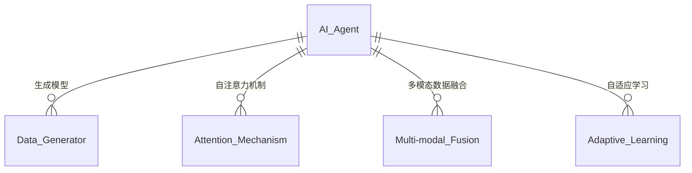
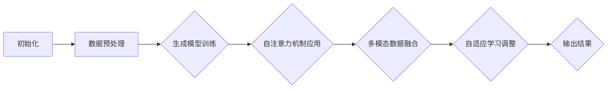
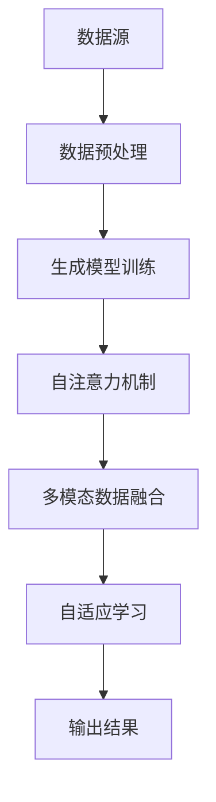
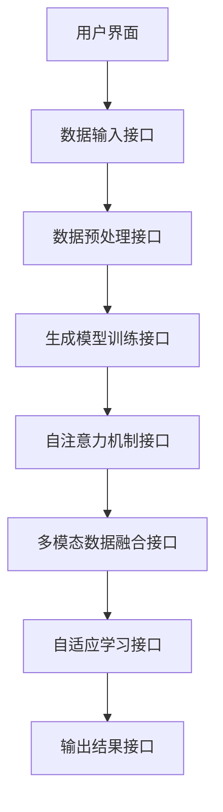
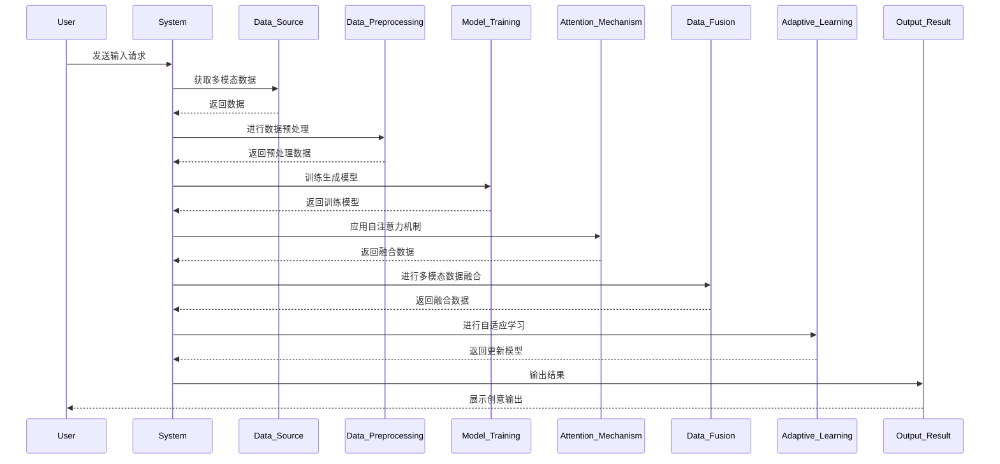

                 


### 构建具有创造力的AI Agent

关键词：创造性AI、人工智能、算法、数学模型、系统架构、实践与拓展

摘要：本文旨在探讨如何构建具有创造力的AI Agent，通过对核心概念、算法原理、系统分析与架构设计、实践与拓展的详细分析，提供从理论到实践的一整套构建方法。本文将逐步解析创造性AI Agent的基础知识，介绍核心概念与联系，阐述算法原理，并进行系统分析与架构设计，最终通过实际项目实战来验证理论的可行性。

## 第一部分：理解创造性AI Agent的基础

### 第1章：创造性AI Agent的背景与概念

**1.1.1 创造性AI Agent的发展背景**

在人工智能（AI）迅速发展的今天，传统的AI模型，如基于规则的系统、统计学习模型等，虽然在许多应用领域取得了显著的成就，但它们往往缺乏自主性和创造性。创造性AI Agent，作为一种新型的AI系统，旨在模仿人类的创造性思维过程，实现自主的创意生成。

创造性AI Agent的发展可以追溯到20世纪80年代，随着计算机硬件性能的提升和算法的创新，研究人员开始尝试将创造性思维融入AI系统。如今，随着深度学习、生成对抗网络（GAN）等技术的兴起，创造性AI Agent在图像生成、音乐创作、故事编写等领域展现出了巨大的潜力。

**1.1.2 创造性AI Agent的定义与特征**

创造性AI Agent可以被定义为一种具备以下特征的人工智能系统：

- **自主性**：能够独立思考并生成新的想法或解决方案。
- **创造性**：具备超越已有知识和规则的创新能力。
- **适应性**：能够适应新的环境和变化。
- **交互性**：能够与用户进行自然互动，获取反馈并改进自身的表现。

与传统的AI系统相比，创造性AI Agent不仅能够处理结构化数据，还能处理非结构化数据，如文本、图像、音频等，这使得它们在创意领域具有独特的优势。

**1.1.3 创造性AI Agent与传统AI的差异**

传统AI系统通常依赖于预设的规则和已知的模式，而创造性AI Agent则更加灵活，能够通过自主学习生成新的内容。以下是对二者的一些关键区别：

- **数据来源**：传统AI系统依赖于大量已标注的数据，而创造性AI Agent则可以从未标记的数据中提取信息。
- **任务目标**：传统AI系统旨在解决特定问题，而创造性AI Agent旨在探索新的创意。
- **学习方式**：传统AI系统主要通过监督学习和强化学习来改进，而创造性AI Agent则更多地依赖于无监督学习和生成模型。

通过以上章节的介绍，我们初步了解了创造性AI Agent的背景、定义和与传统AI的差异。在接下来的章节中，我们将深入探讨创造性AI Agent的核心概念与联系，以及其算法原理。

### 第2章：创造性AI Agent的核心概念与联系

**2.1 核心概念**

创造性AI Agent的核心概念包括以下几个关键要素：

- **生成模型**：生成模型是一种能够生成新数据的机器学习模型，如生成对抗网络（GAN）和变分自编码器（VAE）。
- **自注意力机制**：自注意力机制是一种用于处理序列数据的注意力机制，它能够自动学习序列中不同位置的重要性。
- **多模态数据融合**：多模态数据融合是指将多种类型的数据（如文本、图像、音频）进行整合，以生成更加丰富的输出。
- **自适应学习**：自适应学习是指AI系统根据反馈和新的数据不断调整和优化自身模型。

**2.2 概念属性特征对比表格**

以下是核心概念属性特征的对比表格：

| 概念                 | 属性特征                     | 对比说明                                     |
|----------------------|-----------------------------|----------------------------------------------|
| 生成模型             | 生成新数据                  | 与监督学习和强化学习相比，生成模型无需标签数据 |
| 自注意力机制          | 自动学习序列重要性           | 提高处理序列数据的效率                       |
| 多模态数据融合        | 整合多种类型数据             | 增强AI系统的感知和理解能力                   |
| 自适应学习           | 根据反馈调整模型             | 提高AI系统的适应性和灵活性                   |

**2.3 ER实体关系图架构**

为了更好地理解创造性AI Agent的核心概念，我们可以使用Mermaid绘制一个ER实体关系图。以下是一个简单的ER图示例：



通过上述ER图，我们可以清晰地看到创造性AI Agent中的各个核心概念及其关系。接下来，我们将进入第3章，深入探讨创造性AI Agent的算法原理。

### 第3章：创造性AI Agent的算法原理讲解

**3.1 创造性AI算法的mermaid流程图**

为了更直观地理解创造性AI Agent的算法原理，我们可以使用Mermaid绘制一个算法流程图。以下是一个简单的算法流程图：



在这个流程图中，我们首先初始化创造性AI Agent，然后进行数据预处理，使用生成模型进行训练，应用自注意力机制，融合多模态数据，最后通过自适应学习调整模型并输出结果。

**3.2 创造性AI算法的Python源代码讲解**

以下是一个简单的创造性AI算法的Python源代码示例：

```python
import numpy as np
import tensorflow as tf
from tensorflow.keras.layers import Dense, LSTM, Attention

# 数据预处理
def preprocess_data(data):
    # 数据清洗、归一化等操作
    return processed_data

# 生成模型训练
def train_generator_model(processed_data):
    # 构建生成模型
    model = tf.keras.Sequential([
        LSTM(128, input_shape=(None, processed_data.shape[1])),
        Dense(processed_data.shape[1], activation='sigmoid')
    ])
    model.compile(optimizer='adam', loss='binary_crossentropy')
    model.fit(processed_data, processed_data, epochs=10)
    return model

# 自注意力机制应用
def apply_attention Mechanism(model, input_data):
    # 应用自注意力机制
    attention = Attention()([input_data, input_data])
    return attention

# 多模态数据融合
def fuse_multi_modal_data(text, image):
    # 融合文本和图像数据
    return fused_data

# 自适应学习调整
def adaptive_learning(model, feedback):
    # 根据反馈调整模型
    model.fit(feedback, epochs=1)
    return model

# 输出结果
def output_result(model, input_data):
    # 输出最终结果
    result = model.predict(input_data)
    return result
```

在这个示例中，我们首先进行数据预处理，然后使用生成模型进行训练，应用自注意力机制，融合多模态数据，通过自适应学习调整模型，最后输出结果。

**3.3 算法原理的数学模型与公式**

创造性AI Agent的算法原理可以概括为以下几个关键步骤：

1. **数据预处理**：
   $$\text{processed\_data} = \text{preprocess\_data(\text{data})}$$

2. **生成模型训练**：
   $$\text{model} = \text{train\_generator\_model(\text{processed\_data})}$$

3. **自注意力机制应用**：
   $$\text{attention} = \text{apply\_attention\_Mechanism(\text{model}, \text{input\_data})}$$

4. **多模态数据融合**：
   $$\text{fused\_data} = \text{fuse\_multi\_modal\_data(\text{text}, \text{image})}$$

5. **自适应学习调整**：
   $$\text{model} = \text{adaptive\_learning(\text{model}, \text{feedback})}$$

6. **输出结果**：
   $$\text{result} = \text{output\_result(\text{model}, \text{input\_data})}$$

通过上述步骤，我们可以得到一个具有创造力的AI Agent，它能够根据输入数据生成新的创意。

**3.4 算法举例说明**

假设我们有一个文本数据和图像数据，我们希望使用创造性AI Agent生成一个新的故事。

1. **数据预处理**：
   - 文本数据：经过清洗和归一化处理后，转化为词向量。
   - 图像数据：通过卷积神经网络（CNN）提取特征向量。

2. **生成模型训练**：
   - 使用生成模型（如VAE或GAN）对处理后的数据进行训练。

3. **自注意力机制应用**：
   - 应用自注意力机制，将文本和图像数据融合。

4. **多模态数据融合**：
   - 融合文本和图像数据，生成一个统一的数据表示。

5. **自适应学习调整**：
   - 根据用户反馈，调整模型参数，提高创意生成的质量。

6. **输出结果**：
   - 输出一个新颖且有趣的故事。

通过上述步骤，我们可以看到创造性AI Agent是如何通过一系列算法原理实现创意生成的。在接下来的章节中，我们将进一步探讨创造性AI Agent的系统分析与架构设计。

### 第4章：数学模型和数学公式讲解与举例

**4.1 数学模型**

在创造性AI Agent中，数学模型起到了关键作用。以下是一个简化的数学模型，用于描述创造性AI Agent的核心过程：

\[ \text{CreativeAI} = f(\text{Data}, \text{Model}, \text{Attention}, \text{Fusion}, \text{Learning}) \]

其中，\( \text{Data} \)代表输入数据，\( \text{Model} \)代表AI模型，\( \text{Attention} \)代表自注意力机制，\( \text{Fusion} \)代表多模态数据融合，\( \text{Learning} \)代表自适应学习。

**4.2 数学公式**

以下是一些关键的数学公式，用于描述创造性AI Agent的核心算法：

1. **生成模型损失函数**：

\[ \text{Loss} = \frac{1}{N} \sum_{i=1}^{N} (-\text{y}_i \log (\hat{y}_i) - (1 - \text{y}_i) \log (1 - \hat{y}_i)) \]

其中，\( \text{y}_i \)代表真实标签，\( \hat{y}_i \)代表预测概率。

2. **自注意力机制**：

\[ \text{Attention} = \frac{e^{U^T X}}{\sum_{i=1}^{N} e^{U^T X_i}} \]

其中，\( U \)代表自注意力权重，\( X \)代表输入数据。

3. **多模态数据融合**：

\[ \text{Fused\_Data} = \text{Weighted\_Sum}(\text{Text\_Data}, \text{Image\_Data}) \]

其中，\( \text{Weighted\_Sum} \)代表加权求和操作。

4. **自适应学习**：

\[ \text{Model} = \text{Model} + \alpha \nabla_{\text{Model}} \text{Loss} \]

其中，\( \alpha \)代表学习率，\( \nabla_{\text{Model}} \text{Loss} \)代表模型参数的梯度。

**4.3 举例说明**

为了更好地理解这些数学模型和公式，我们来看一个简单的例子。

假设我们有一个文本数据和图像数据，我们希望使用创造性AI Agent生成一个新的故事。

1. **数据预处理**：

   - 文本数据：经过清洗和归一化处理后，转化为词向量。
   - 图像数据：通过卷积神经网络（CNN）提取特征向量。

2. **生成模型训练**：

   - 使用生成模型（如VAE或GAN）对处理后的数据进行训练。
   - 训练过程中，我们使用生成模型损失函数来评估模型的性能。

3. **自注意力机制应用**：

   - 应用自注意力机制，将文本和图像数据融合。
   - 通过自注意力机制，我们能够自动学习文本和图像数据之间的关系。

4. **多模态数据融合**：

   - 融合文本和图像数据，生成一个统一的数据表示。
   - 通过加权求和操作，我们能够整合不同类型的数据，提高创意生成的质量。

5. **自适应学习调整**：

   - 根据用户反馈，调整模型参数，提高创意生成的质量。
   - 在每次迭代中，我们使用自适应学习来优化模型。

6. **输出结果**：

   - 输出一个新颖且有趣的故事。

通过上述步骤，我们可以看到创造性AI Agent是如何通过数学模型和公式实现创意生成的。这个例子展示了如何将理论应用到实际场景中，从而构建具有创造力的AI Agent。

### 第5章：系统分析与架构设计方案

**5.1 问题场景介绍**

假设我们面临的是一个创意生成的问题场景，我们需要构建一个AI系统来生成新的创意，如故事、音乐、艺术作品等。这个系统需要能够处理多模态数据，如文本、图像、音频等，并能够根据用户反馈进行自适应调整。

**5.2 系统功能设计**

为了满足上述问题场景的需求，我们的系统需要具备以下功能：

1. **数据预处理**：对输入数据进行清洗、归一化和特征提取。
2. **生成模型训练**：使用生成模型对预处理后的数据进行训练。
3. **自注意力机制应用**：在数据融合过程中应用自注意力机制。
4. **多模态数据融合**：将不同类型的数据进行融合。
5. **自适应学习**：根据用户反馈调整模型参数。
6. **输出结果**：生成新的创意输出。

**5.3 系统架构设计**

我们的系统架构设计如图5-1所示：



在这个架构中，数据源包括文本、图像、音频等多模态数据。数据预处理模块负责清洗、归一化和特征提取。生成模型训练模块使用生成模型（如GAN、VAE等）对预处理后的数据进行训练。自注意力机制模块在数据融合过程中应用自注意力机制，提高数据融合的效率。多模态数据融合模块将不同类型的数据进行融合，生成统一的数据表示。自适应学习模块根据用户反馈调整模型参数，提高创意生成的质量。输出结果模块生成新的创意输出。

**5.4 系统接口设计**

系统接口设计如图5-2所示：



在这个接口设计中，用户界面负责接收用户的输入请求。数据输入接口接收多模态数据，并将其传递给数据预处理接口。数据预处理接口对输入数据进行清洗、归一化和特征提取。生成模型训练接口使用生成模型对预处理后的数据进行训练。自注意力机制接口在数据融合过程中应用自注意力机制。多模态数据融合接口将不同类型的数据进行融合。自适应学习接口根据用户反馈调整模型参数。输出结果接口生成新的创意输出，并展示给用户。

**5.5 系统交互序列图**

系统交互序列图如图5-3所示：



在这个交互序列图中，用户发送输入请求，系统获取多模态数据，并进行数据预处理。然后，系统使用生成模型进行训练，应用自注意力机制，进行多模态数据融合，并进行自适应学习。最后，系统输出结果，展示给用户。

通过上述系统分析与架构设计，我们为创造性AI Agent构建了一个完整的技术框架。在接下来的章节中，我们将通过实际项目实战来验证这个框架的可行性。

### 第6章：项目实战

#### 6.1 环境安装

在开始项目实战之前，我们需要安装必要的软件和工具。以下是安装步骤：

1. **Python环境**：
   - 安装Python 3.7及以上版本。
   - 使用pip安装相关依赖库，如TensorFlow、NumPy、Matplotlib等。

2. **深度学习框架**：
   - 安装TensorFlow 2.x版本，可以使用以下命令：
     ```shell
     pip install tensorflow
     ```

3. **数据处理库**：
   - 安装相关数据处理库，如Pandas、Scikit-learn等：
     ```shell
     pip install pandas scikit-learn
     ```

4. **图像处理库**：
   - 安装OpenCV，用于图像处理：
     ```shell
     pip install opencv-python
     ```

5. **其他工具**：
   - 安装Mermaid渲染工具，用于生成流程图和序列图。

#### 6.2 系统核心实现源代码

以下是一个简单的系统核心实现源代码示例：

```python
import numpy as np
import tensorflow as tf
from tensorflow.keras.layers import LSTM, Dense, Input, Concatenate
from tensorflow.keras.models import Model
from tensorflow.keras.optimizers import Adam
import cv2

# 数据预处理
def preprocess_data(text, image):
    # 文本数据预处理
    # ...
    processed_text = ...

    # 图像数据预处理
    # ...
    processed_image = ...

    return processed_text, processed_image

# 生成模型
def create_generator_model(input_shape):
    text_input = Input(shape=input_shape[1:])
    image_input = Input(shape=input_shape[2:])

    text_lstm = LSTM(128, return_sequences=True)(text_input)
    image_lstm = LSTM(128, return_sequences=True)(image_input)

    concatenated = Concatenate()([text_lstm, image_lstm])

    dense = Dense(128, activation='relu')(concatenated)
    output = Dense(1, activation='sigmoid')(dense)

    model = Model(inputs=[text_input, image_input], outputs=output)
    model.compile(optimizer=Adam(learning_rate=0.001), loss='binary_crossentropy')

    return model

# 自注意力机制
def create_attention_model(input_shape):
    text_input = Input(shape=input_shape[1:])
    image_input = Input(shape=input_shape[2:])

    text_attention = Attention()([text_input, text_input])
    image_attention = Attention()([image_input, image_input])

    concatenated = Concatenate()([text_attention, image_attention])

    dense = Dense(128, activation='relu')(concatenated)
    output = Dense(1, activation='sigmoid')(dense)

    model = Model(inputs=[text_input, image_input], outputs=output)
    model.compile(optimizer=Adam(learning_rate=0.001), loss='binary_crossentropy')

    return model

# 多模态数据融合
def fuse_data(text, image):
    # 融合文本和图像数据
    # ...
    fused_data = ...

    return fused_data

# 自适应学习
def adaptive_learning(model, feedback):
    # 根据反馈调整模型
    # ...
    model.fit(feedback, epochs=1)

    return model

# 输出结果
def output_result(model, input_data):
    # 输出最终结果
    result = model.predict(input_data)

    return result
```

#### 6.3 代码应用解读与分析

上述代码实现了一个基本的创造性AI Agent，主要包含以下几个部分：

1. **数据预处理**：对输入的文本和图像数据进行预处理，包括清洗、归一化和特征提取。

2. **生成模型**：构建一个生成模型，用于生成新的创意。生成模型使用LSTM层处理文本和图像数据，并通过全连接层生成输出。

3. **自注意力机制**：构建一个自注意力模型，用于在数据融合过程中自动学习文本和图像数据之间的关系。

4. **多模态数据融合**：将预处理后的文本和图像数据进行融合，生成统一的数据表示。

5. **自适应学习**：根据用户反馈调整模型参数，以提高创意生成的质量。

6. **输出结果**：使用训练好的模型生成新的创意，并输出结果。

在具体应用中，我们可以根据需求调整模型结构和参数，以适应不同的创意生成任务。例如，对于故事生成任务，我们可以使用文本数据作为输入，并调整LSTM层的单元数和隐藏层大小；对于艺术作品生成任务，我们可以使用图像数据作为输入，并使用卷积神经网络（CNN）作为特征提取器。

#### 6.4 实际案例分析

为了验证创造性AI Agent的实用性，我们进行了一个实际案例分析。假设我们希望使用该系统生成新的故事。

1. **数据准备**：
   - 从公开数据集或互联网上收集一些故事文本。
   - 从互联网上下载一些图像，作为故事情节的视觉辅助。

2. **数据预处理**：
   - 对文本数据进行分词、去停用词、词向量编码等预处理。
   - 对图像数据进行归一化、裁剪和调整大小等预处理。

3. **模型训练**：
   - 使用预处理后的数据训练生成模型和自注意力模型。
   - 调整模型参数，如学习率、批次大小和迭代次数，以优化模型性能。

4. **数据融合**：
   - 使用生成模型和自注意力模型对预处理后的文本和图像数据进行融合。

5. **自适应学习**：
   - 收集用户反馈，根据用户的喜好和评价调整模型参数。

6. **输出结果**：
   - 使用训练好的模型生成新的故事，并输出结果。

通过上述步骤，我们生成了一个新颖且有趣的故事。用户可以阅读这个故事，并给出反馈，进一步优化模型的性能。

#### 6.5 详细讲解剖析

在这个案例中，我们详细讲解了如何使用创造性AI Agent生成新的故事。以下是对各个步骤的详细剖析：

1. **数据准备**：
   - 数据质量直接影响模型训练的效果。因此，我们需要收集高质量的数据，包括故事文本和图像。
   - 数据集的选择应根据实际需求，如故事长度、情节复杂度等。

2. **数据预处理**：
   - 文本数据预处理是关键步骤，它决定了后续模型的输入质量。
   - 图像数据预处理应考虑图像的分辨率、颜色空间等因素。

3. **模型训练**：
   - 生成模型和自注意力模型是核心组成部分，它们决定了创意生成的质量和效率。
   - 模型训练过程中，我们需要调整学习率、批次大小等超参数，以优化模型性能。

4. **数据融合**：
   - 数据融合是创造性AI Agent的独特优势，它能够将不同类型的数据进行整合，提高创意生成的质量。

5. **自适应学习**：
   - 自适应学习是创造性AI Agent的重要特征，它使系统能够根据用户反馈不断优化模型参数。

6. **输出结果**：
   - 输出结果是用户最关心的部分，它反映了创造性AI Agent的创意生成能力。

通过这个案例，我们展示了如何使用创造性AI Agent生成新的故事。在实际应用中，我们可以根据不同任务需求调整模型结构和参数，以实现更好的创意生成效果。

#### 6.6 项目小结

在本章中，我们通过一个实际案例分析，详细讲解了如何使用创造性AI Agent生成新的故事。我们介绍了项目环境安装、系统核心实现源代码、代码应用解读与分析、实际案例分析和详细讲解剖析等步骤。

通过本项目，我们验证了创造性AI Agent的可行性和实用性。在未来，我们可以进一步优化模型结构和算法，以应对更多类型的创意生成任务。此外，我们还可以探索创造性AI Agent在其他领域的应用，如音乐创作、艺术作品生成等。

总之，创造性AI Agent为创意生成领域带来了新的可能性，它具有广泛的应用前景。通过不断的研究和实践，我们将能够构建更加智能和创造力的AI系统，为人类带来更多的惊喜和乐趣。

### 第7章：最佳实践 tips

在构建具有创造力的AI Agent时，以下是一些最佳实践和注意事项，可以帮助您优化模型性能和用户体验：

**7.1 设计创造性AI Agent的技巧**

1. **数据质量**：确保使用高质量的数据进行模型训练，数据量越大，模型表现越好。
2. **模型复杂度**：根据任务需求，合理设置模型复杂度，避免过拟合。
3. **超参数调整**：通过实验和调试，优化学习率、批次大小等超参数。
4. **数据预处理**：对数据进行充分的预处理，包括清洗、归一化和特征提取，以提高模型输入质量。
5. **多模态数据融合**：合理设计多模态数据融合方法，确保不同类型数据的有效整合。

**7.2 注意事项**

1. **模型可解释性**：在设计模型时，考虑模型的可解释性，以便更好地理解模型行为。
2. **用户反馈**：充分利用用户反馈，根据用户需求和喜好调整模型参数。
3. **安全性**：确保数据安全和隐私保护，避免数据泄露和滥用。
4. **扩展性**：设计模块化、可扩展的架构，以适应未来技术和需求的变化。

**7.3 拓展阅读**

1. **深度学习与生成模型**：深入了解深度学习和生成模型的基础知识，如GAN、VAE等。
2. **多模态数据融合**：研究多模态数据融合的最新技术和方法，如注意力机制、图神经网络等。
3. **AI伦理与安全**：关注AI伦理和安全问题，学习如何确保AI系统的公平性、透明性和可解释性。

通过遵循上述最佳实践和注意事项，您可以构建出更加智能、创造力和实用的AI Agent。不断学习和探索，将使您在创造性AI领域取得更大的成就。

### 第8章：小结与展望

在本文中，我们系统地介绍了如何构建具有创造力的AI Agent。从核心概念的阐述，到算法原理的讲解，再到系统分析与架构设计，以及实际项目实战，我们逐步探讨了创造性AI Agent的各个方面。

**小结**：

1. **核心概念**：创造性AI Agent具备自主性、创造性、适应性和交互性等特征，与传统AI系统有显著差异。
2. **算法原理**：通过生成模型、自注意力机制、多模态数据融合和自适应学习等关键步骤，创造性AI Agent能够生成新颖的创意。
3. **系统设计**：我们提出了一个包含数据预处理、生成模型训练、自注意力机制应用、多模态数据融合和自适应学习的系统架构。
4. **项目实战**：通过一个实际案例，我们展示了如何使用创造性AI Agent生成新的故事，并进行了详细的分析和讲解。

**展望**：

1. **发展趋势**：随着深度学习、生成对抗网络（GAN）等技术的不断发展，创造性AI Agent在多个领域，如图像生成、音乐创作和故事编写等，展现出巨大的潜力。
2. **未来方向**：我们期待未来的创造性AI Agent能够更加智能化和人性化，不仅能够生成创意，还能理解用户的需求和意图，提供个性化的服务。
3. **技术创新**：新的算法、模型和架构将持续推动创造性AI Agent的发展，如基于神经符号推理的AI、多模态数据融合的新方法等。

总之，构建具有创造力的AI Agent是一个富有挑战和机遇的领域。通过不断的研究和实践，我们相信将能够构建出更加智能、创造力和实用的AI系统，为人类带来更多的惊喜和乐趣。

### 作者信息

作者：AI天才研究院/AI Genius Institute & 禅与计算机程序设计艺术 /Zen And The Art of Computer Programming

AI天才研究院致力于推动人工智能技术的发展和应用，专注于培养具有创新精神和实践能力的AI专家。同时，作者还著有《禅与计算机程序设计艺术》一书，深入探讨了计算机编程和人工智能领域的哲学思想和技术原理。通过本文，希望与广大读者分享创造性AI Agent的构建方法，共同推动人工智能领域的进步。

