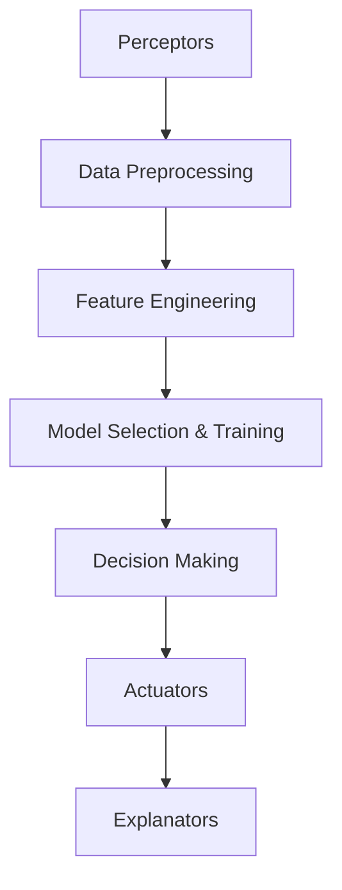

                 

### 1.1 问题背景与目标

在当今快速发展的科技时代，人工智能（AI）已经渗透到各行各业，从自然语言处理到图像识别，从自动驾驶到智能家居，AI的应用场景日益广泛。然而，随着AI技术的日益成熟，一个不可忽视的问题也逐渐显现出来——可解释性。在众多AI应用中，决策系统的透明度和可解释性变得越来越重要。无论是出于合规需求，还是用户信任，可解释性成为衡量AI系统优劣的关键指标之一。

让我们先来定义一下什么是可解释性AI。可解释性AI是指使AI模型决策过程易于理解和解释的特性。传统的黑箱模型，如深度神经网络，虽然能够在某些任务上达到很高的准确率，但其内部决策机制往往难以解释。这种“黑箱”特性在需要透明决策过程的领域，如医疗诊断、金融风险评估等，就显得尤为棘手。

本文的目标是深入探讨如何构建具有可解释性决策能力的AI Agent。我们将首先介绍可解释性AI Agent的概念和重要性，然后逐步分析其核心原理、构建方法和实际应用。通过本文的阅读，您将了解到：

1. **问题背景**：了解可解释性AI Agent的兴起原因和重要性。
2. **核心概念**：掌握可解释性AI Agent的定义、特性以及与相关概念的联系。
3. **构建方法**：学习如何设计、实现和优化具有可解释性决策能力的AI Agent。
4. **实际应用**：了解可解释性AI Agent在不同领域的具体应用案例。

在接下来的章节中，我们将一步步探讨这些内容，帮助您构建具有可解释性决策能力的AI Agent，使其在复杂决策环境中发挥更大的作用。

### 1.2 可解释性AI Agent的概念与特点

#### 可解释性AI的定义

在深入探讨可解释性AI Agent的概念与特点之前，我们有必要先明确什么是可解释性AI。可解释性AI是指使人工智能（AI）模型的决策过程透明、易于理解和解释的特性。它不仅仅关注AI模型的准确性，更强调模型决策背后的逻辑和机制。这种透明性在许多应用场景中至关重要，尤其是在需要高透明度和可信度的领域，如医疗诊断、金融风险评估和法律决策等。

传统的机器学习模型，如深度神经网络，通常被认为是不透明的“黑箱”。这些模型的内部结构非常复杂，决策过程几乎无法用简单的数学公式或逻辑解释。然而，在许多实际应用中，人们需要了解AI模型的决策逻辑，以便对其进行验证、调整和信任。因此，可解释性AI应运而生，旨在弥补这一缺陷。

#### AI Agent的构成与功能

AI Agent是一种能够自主学习、自主决策并采取行动的智能体。它通常由以下几个部分构成：

1. **感知器**：用于接收外部环境的信息，如传感器、摄像头或用户输入。
2. **决策器**：根据感知器收集到的信息，利用特定的算法和模型进行决策。
3. **执行器**：根据决策器的决策，执行相应的操作，如机械臂、电机或软件程序。

AI Agent的核心功能是能够在一个动态变化的环境中，自主地学习、适应和优化其行为。这种自主性使其在许多任务中具有独特的优势，如自动驾驶、智能客服和个性化推荐等。

#### 可解释性AI Agent的优势与挑战

可解释性AI Agent在多个方面具有显著的优势：

1. **可解释性**：如前所述，可解释性是可解释性AI Agent最显著的特点。它使决策过程透明，便于用户理解、信任和验证。
2. **合规性**：在许多领域，如医疗和金融，决策过程的透明度和可解释性是法律和监管要求的一部分。可解释性AI Agent有助于满足这些合规要求。
3. **可调整性**：通过理解和解释AI Agent的决策过程，用户可以更轻松地对其进行调整和优化，以提高其性能。

然而，构建可解释性AI Agent也面临一些挑战：

1. **性能损失**：为了提高可解释性，某些模型可能需要牺牲一定的性能。这在某些高精度要求的应用场景中可能是一个难题。
2. **复杂度**：实现可解释性通常需要更复杂的模型和算法。这可能导致开发、测试和部署的难度增加。
3. **数据需求**：可解释性AI Agent通常需要更多的训练数据和更复杂的特征工程，这可能会增加数据收集和处理的成本。

尽管面临这些挑战，可解释性AI Agent在多个领域的应用前景仍然非常广阔。在接下来的章节中，我们将进一步探讨如何构建具有可解释性决策能力的AI Agent，并探讨其在不同领域的具体应用。

#### 1.3 可解释性AI Agent的应用场景

可解释性AI Agent的应用场景非常广泛，涵盖了从企业决策支持到金融服务、再到医疗诊断等多个领域。以下是这些领域中的具体应用案例及其重要性。

##### 企业决策支持

在企业管理中，可解释性AI Agent可以帮助企业更好地理解市场动态、预测客户需求、优化库存管理以及制定战略决策。例如，一家大型零售企业可以使用可解释性AI Agent来分析销售数据，识别季节性趋势和客户偏好。通过透明化的决策过程，企业可以更自信地调整库存和营销策略，从而提高盈利能力。

##### 金融服务

金融行业的决策过程通常非常复杂，涉及大量的数据和风险。可解释性AI Agent在金融风险评估、欺诈检测和信用评分等方面具有重要作用。例如，银行可以使用可解释性AI Agent来评估贷款申请者的信用风险。通过透明化决策过程，银行可以提高客户信任度，同时确保合规性和风险管理。

##### 医疗诊断

医疗诊断是可解释性AI Agent最具潜力的应用领域之一。传统的医疗诊断往往依赖于医生的判断和经验，而AI系统则可以通过大量的医学数据进行分析和预测。然而，医生和患者通常希望了解AI的诊断依据和推理过程，以便对其进行验证和信任。可解释性AI Agent可以帮助医生更好地理解AI的诊断结果，提高医疗决策的透明度和准确性。

##### 法律与司法

在法律和司法领域，可解释性AI Agent可以用于案件分析、证据评估和判决预测。例如，法官可以使用可解释性AI Agent来分析案件证据，理解AI的推理过程，从而做出更公正、透明的判决。这有助于提高司法公正性和公众信任度。

##### 自动驾驶

自动驾驶是另一个对可解释性有高需求的领域。自动驾驶系统需要实时处理大量的传感器数据，并在复杂环境中做出快速、安全的决策。可解释性AI Agent可以帮助自动驾驶系统解释其决策过程，确保系统的可靠性和安全性。这有助于提高公众对自动驾驶技术的信任，推动自动驾驶技术的普及和应用。

综上所述，可解释性AI Agent在多个领域都有广泛的应用前景。通过提高决策过程的透明度和可解释性，可解释性AI Agent可以帮助各个领域更好地理解和信任AI系统，从而推动AI技术的健康发展。

#### 1.4 本章小结

在本章中，我们详细介绍了可解释性AI Agent的概念、重要性以及其在多个领域的应用场景。首先，我们明确了可解释性AI的定义，并解释了为什么它在现代AI应用中变得越来越重要。接着，我们探讨了AI Agent的基本构成和功能，并分析了可解释性AI Agent的优势与挑战。

通过本章的学习，读者应该对可解释性AI Agent有了基本的了解，并认识到其在企业决策支持、金融服务、医疗诊断、法律与司法、自动驾驶等领域的广泛应用。在接下来的章节中，我们将进一步深入探讨可解释性AI Agent的核心概念和构建方法，帮助读者构建具有可解释性决策能力的AI Agent。

### 2.1 数据处理基础

在构建具有可解释性决策能力的AI Agent之前，我们必须首先掌握数据处理的基础。数据处理是AI项目中的关键步骤，它直接影响模型的性能和可解释性。在这一部分，我们将详细讨论数据预处理、特征工程和数据可视化这三个核心环节。

#### 2.1.1 数据预处理

数据预处理是确保数据质量和模型性能的重要步骤。主要包括以下任务：

1. **数据清洗**：处理缺失值、异常值和重复数据。缺失值可以通过填充、删除或插值等方法处理；异常值需要通过统计方法或专家知识进行判断和处理；重复数据可以通过去重操作删除。

   ```python
   # 示例：删除数据集中的重复值
   df = df.drop_duplicates()
   ```

2. **数据转换**：将不同数据类型统一为适合模型输入的类型。例如，将类别数据转换为数值数据，或将文本数据转换为向量。

   ```python
   # 示例：将类别数据转换为独热编码
   df = pd.get_dummies(df)
   ```

3. **数据标准化**：通过标准化或归一化方法，将数据缩放到相同的尺度，避免某些特征在模型训练中占据主导地位。

   ```python
   # 示例：使用标准化方法缩放数据
   from sklearn.preprocessing import StandardScaler
   scaler = StandardScaler()
   X_scaled = scaler.fit_transform(X)
   ```

#### 2.1.2 特征工程

特征工程是提升模型性能和可解释性的关键步骤。它包括以下任务：

1. **特征选择**：通过评估特征的重要性，选择对模型性能有显著影响的关键特征。常用的方法包括基于信息的特征选择、基于模型的特征选择等。

   ```python
   # 示例：使用基于模型的特征选择
   from sklearn.feature_selection import SelectKBest
   from sklearn.ensemble import RandomForestClassifier

   # 训练随机森林模型
   model = RandomForestClassifier()
   model.fit(X, y)

   # 选择最佳特征
   selector = SelectKBest(score_func=model.feature_importances_, k='all')
   X_new = selector.fit_transform(X, y)
   ```

2. **特征构造**：通过组合现有特征或引入新的特征，提高模型的性能和可解释性。例如，利用时间序列特征、交互特征或嵌入特征。

   ```python
   # 示例：构造时间序列特征
   df[' lag_1'] = df[' feature'].shift(1)
   df[' lag_2'] = df[' feature'].shift(2)
   ```

3. **特征缩放**：虽然前面提到过数据标准化，但在某些情况下，需要对特征进行进一步的缩放，以适应特定算法的要求。

   ```python
   # 示例：使用MinMaxScaler进行特征缩放
   from sklearn.preprocessing import MinMaxScaler

   scaler = MinMaxScaler()
   X_scaled = scaler.fit_transform(X)
   ```

#### 2.1.3 数据可视化

数据可视化是理解和解释数据的重要手段，有助于我们发现数据中的模式和关系。以下是一些常用的数据可视化方法：

1. **散点图**：用于展示两个特征之间的关系。

   ```python
   # 示例：绘制散点图
   import matplotlib.pyplot as plt

   plt.scatter(X[:, 0], X[:, 1])
   plt.xlabel('Feature 1')
   plt.ylabel('Feature 2')
   plt.title('Scatter Plot')
   plt.show()
   ```

2. **直方图**：用于展示特征分布情况。

   ```python
   # 示例：绘制直方图
   plt.hist(df[' feature'], bins=10, alpha=0.5, color='g')
   plt.xlabel('Feature')
   plt.ylabel('Frequency')
   plt.title('Histogram')
   plt.show()
   ```

3. **箱线图**：用于展示特征的分位数分布。

   ```python
   # 示例：绘制箱线图
   import seaborn as sns

   sns.boxplot(x=' feature', data=df)
   plt.xlabel('Feature')
   plt.title('Box Plot')
   plt.show()
   ```

4. **热力图**：用于展示特征之间的相关性。

   ```python
   # 示例：绘制热力图
   sns.heatmap(df.corr(), annot=True, cmap='coolwarm')
   plt.title('Correlation Heatmap')
   plt.show()
   ```

通过数据预处理、特征工程和数据可视化，我们可以显著提高AI Agent的可解释性。这些基础环节不仅有助于提高模型的性能，还能帮助我们更好地理解和解释模型的决策过程。在下一节中，我们将进一步探讨可解释性AI算法的原理，帮助读者深入了解如何构建具有可解释性决策能力的AI Agent。

#### 2.2 可解释性AI算法原理

可解释性AI（Explainable AI，XAI）是当前人工智能领域的一个重要研究方向。其核心目标是通过提供模型决策过程的透明性和可解释性，使用户能够理解模型的推理过程，从而增加用户对模型的信任度。在这一部分，我们将详细讨论可解释性AI的定义、透明度与可解释性、解释性模型以及可解释性度量方法。

##### 2.2.1 透明度与可解释性

透明度（Transparency）和可解释性（Explainability）是可解释性AI的两个核心概念。透明度关注模型内部的结构和工作机制，强调用户能否直接观察和理解模型的决策过程。可解释性则更侧重于提供对模型决策结果的解释，使决策过程易于理解和验证。

透明度和可解释性之间存在一定的区别。透明度通常指模型是否可以被外界直接观察和理解，而可解释性则关注如何将复杂模型的决策过程转化为人类可理解的解释。在实际应用中，追求完全透明的模型往往需要牺牲一定的性能，因此如何在透明度和性能之间找到平衡点是一个关键问题。

##### 2.2.2 解释性模型

解释性模型（Explainable Models）是一类专门设计用于提供模型决策解释的模型。这些模型通过简化原始模型的结构或提供额外的解释机制，使决策过程更加透明和易于理解。以下是一些常见的解释性模型：

1. **线性模型**：线性模型（如线性回归和逻辑回归）由于其简洁的结构和直接的决策规则，通常被认为是一种高度可解释的模型。用户可以直接通过模型参数了解每个特征对决策的影响。

2. **决策树**：决策树是一种树形结构的分类模型，每个节点表示一个特征，每个分支表示该特征的取值。通过跟踪决策路径，用户可以理解模型是如何做出分类决策的。

3. **LIME（局部可解释模型解释器）**：LIME是一种局部可解释模型解释器，它通过在原始模型周围构建一个线性模型来解释局部决策。LIME可以提供对特定数据点决策过程的具体解释。

4. **SHAP（特征贡献值）**：SHAP（SHapley Additive exPlanations）是一种基于博弈论的模型解释方法，它通过计算每个特征对模型预测的贡献值来解释模型的决策。SHAP方法具有较好的可解释性和泛化能力。

##### 2.2.3 可解释性度量方法

为了评估模型的可解释性，研究人员提出了多种度量方法。以下是一些常用的可解释性度量方法：

1. **可理解性评分**：这种方法通过评估模型决策规则的可理解性来度量可解释性。常见的可理解性评分包括F1分数、精确率和召回率等。

2. **透明度评分**：这种方法通过评估模型透明度的程度来度量可解释性。例如，可以评估模型参数的可解释性、模型的复杂性以及决策过程的透明度。

3. **错误解释率**：这种方法通过计算模型在解释过程中产生的错误解释的比例来度量可解释性。错误解释率越低，说明模型的可解释性越好。

4. **用户满意度**：这种方法通过用户对模型解释的满意度来评估可解释性。用户满意度可以通过问卷调查、用户反馈等方式收集。

通过上述度量方法，研究人员可以定量评估模型的可解释性，并找到改进模型可解释性的方法。在下一节中，我们将进一步探讨如何设计和实现具有可解释性决策能力的AI Agent。

#### 2.3 AI Agent构建基础

在了解了可解释性AI算法的基本原理之后，我们接下来要讨论如何构建具有可解释性决策能力的AI Agent。构建一个高效的AI Agent不仅需要理解基础的算法原理，还需要考虑强化学习、模型选择与训练、以及决策过程的优化。下面，我们将逐一探讨这些核心环节。

##### 2.3.1 强化学习基础

强化学习（Reinforcement Learning，RL）是一种使Agent通过与环境互动来学习最优策略的方法。与传统的监督学习和无监督学习不同，强化学习关注的是决策过程，其核心思想是通过奖励信号来指导Agent的行为，从而实现目标。强化学习的基本组成部分包括：

1. **Agent**：执行动作的智能体，可以是软件程序、机器人或任何能够与环境互动的实体。
2. **环境**：Agent所处的动态环境，提供状态和奖励信号。环境可以是对现实世界的模拟，也可以是虚拟的。
3. **状态**：Agent在特定时间点所感知到的环境信息。
4. **动作**：Agent可以执行的行为。
5. **奖励**：环境对Agent的每个动作给予的即时反馈，用于评估Agent的行为效果。

强化学习的主要挑战是如何找到最优策略，即最大化累积奖励。常用的强化学习算法包括Q-learning、SARSA（Surely Suggestive Actor-critic with Stochastic Policies）和深度Q网络（DQN）等。以下是一个简单的Q-learning算法示例：

```python
# 示例：Q-learning算法

# 初始化Q值表
Q = np.zeros([state_space_size, action_space_size])

# Q-learning参数
alpha = 0.1  # 学习率
gamma = 0.6  # 折扣因子

# Q-learning主循环
for episode in range(total_episodes):
    # 初始化状态
    state = env.reset()
    done = False
    
    while not done:
        # 随机探索或贪婪策略
        if random.uniform(0, 1) < exploration_rate:
            action = env.action_space.sample()  # 随机动作
        else:
            action = np.argmax(Q[state])  # 贪婪动作
        
        # 执行动作，获取新状态和奖励
        next_state, reward, done, _ = env.step(action)
        
        # 更新Q值
        Q[state, action] = Q[state, action] + alpha * (reward + gamma * np.max(Q[next_state]) - Q[state, action])
        
        # 更新状态
        state = next_state
        
# 关闭环境
env.close()
```

##### 2.3.2 强化学习在AI Agent中的应用

强化学习在AI Agent中的应用非常广泛，包括自动驾驶、游戏AI、推荐系统等。以下是几个具体的例子：

1. **自动驾驶**：自动驾驶系统通过强化学习来学习如何在复杂的交通环境中做出安全的驾驶决策。例如，使用深度强化学习算法训练自动驾驶车辆，使其能够理解交通规则、识别道路标志和行人，并做出实时驾驶决策。

2. **游戏AI**：强化学习被广泛应用于游戏AI中，如《星际争霸2》的人工智能。通过强化学习，AI可以学会策略，在游戏中与人类选手进行对抗并取得胜利。

3. **推荐系统**：强化学习可以帮助推荐系统学习用户的偏好，从而提供个性化的推荐。例如，电商平台可以使用强化学习算法根据用户的购买历史和浏览行为，推荐可能感兴趣的商品。

##### 2.3.3 智能决策与优化

智能决策是AI Agent的核心功能，它涉及到如何从多个可选动作中选取最优动作。在强化学习中，智能决策主要通过策略（Policy）来实现。策略是Agent根据当前状态选择动作的规则，常见的策略包括确定性策略和随机策略。

1. **确定性策略**：确定性策略总是选择当前状态下最佳的动作。例如，Q-learning算法中，当探索率（exploration rate）为0时，Agent将采用确定性策略。

2. **随机策略**：随机策略在当前状态下随机选择动作，通常用于探索未知状态或提高模型的鲁棒性。随机策略可以通过在动作概率分布中引入探索因子来实现。

在实现智能决策时，优化是一个关键步骤。优化包括两个方面：

1. **策略优化**：通过调整策略参数，提高策略的期望收益。常用的策略优化算法包括梯度策略优化和基于梯度的策略优化。

2. **模型优化**：通过调整模型参数，提高模型的预测准确性和决策能力。常用的模型优化算法包括随机梯度下降（SGD）、Adam优化器等。

以下是一个简单的策略优化示例：

```python
# 示例：策略优化

# 初始化策略参数
theta = np.random.randn(policy_size)

# 优化策略参数
for epoch in range(total_epochs):
    # 计算损失函数
    loss = loss_function(theta)
    
    # 计算梯度
    gradient = compute_gradient(theta)
    
    # 更新策略参数
    theta -= learning_rate * gradient
```

通过强化学习和智能决策优化，我们可以构建出具有高度可解释性的AI Agent。在下一节中，我们将进一步探讨可解释性AI Agent的系统架构设计，帮助读者全面了解如何构建一个具有可解释性决策能力的AI系统。

#### 2.4 可解释性AI Agent架构设计

在设计具有可解释性决策能力的AI Agent时，系统架构的合理设计至关重要。这一部分我们将从系统架构概述、模块设计与实现，以及系统性能优化三个方面详细探讨如何构建一个高效、透明且可解释的AI Agent。

##### 2.4.1 系统架构概述

可解释性AI Agent的系统架构通常包括以下几个主要模块：

1. **感知器（Perceptors）**：用于收集外部环境的数据，如传感器数据、用户输入等。这些数据将被预处理和特征工程，以便后续处理。
2. **决策器（Deciders）**：基于感知器提供的数据，利用特定的算法和模型进行决策。决策器可能包括多个子模块，如特征选择、模型选择、训练和推理等。
3. **执行器（Actuators）**：根据决策器的决策结果，执行具体的操作，如控制机器人动作、发送电子邮件等。执行器需要与实际的应用系统集成。
4. **解释器（Explanators）**：用于解释决策过程和结果。解释器可以提供可视化的决策路径、特征贡献分析等，帮助用户理解AI Agent的决策依据。

以下是一个典型的可解释性AI Agent系统架构图：



##### 2.4.2 模块设计与实现

每个模块的设计与实现都是构建可解释性AI Agent的关键。以下是这些模块的具体设计思路：

1. **感知器设计**：感知器需要能够灵活地收集各种类型的数据，包括结构化和非结构化数据。例如，对于图像数据，可以采用深度学习框架如TensorFlow或PyTorch进行预处理和特征提取。

   ```python
   # 示例：感知器设计
   import cv2

   # 读取图像
   image = cv2.imread('image_path')

   # 特征提取
   features = extract_features(image)
   ```

2. **决策器设计**：决策器的设计需要综合考虑可解释性和性能。可以采用透明度较高的模型，如决策树、线性模型等，同时结合可解释性算法如LIME或SHAP，提供详细的决策解释。

   ```python
   # 示例：决策器设计
   from sklearn.tree import DecisionTreeClassifier
   from lime import lime_tabular

   # 训练决策树模型
   model = DecisionTreeClassifier()
   model.fit(X_train, y_train)

   # 使用LIME解释决策
   explainer = lime_tabular.LimeTabularExplainer(X_train, feature_names=data.columns, class_names=data.target_names, discretize_continuous=True)
   exp = explainer.explain_instance(X_test[0], model.predict, num_features=10)
   exp.show_in_notebook(show_table=True)
   ```

3. **执行器设计**：执行器的设计需要确保其能够稳定、可靠地执行决策器的决策结果。例如，对于自动化控制任务，可以采用机器人控制系统，确保动作的准确性和安全性。

   ```python
   # 示例：执行器设计
   from robot_controller import RobotController

   # 创建机器人控制器实例
   controller = RobotController()

   # 执行决策结果
   action = decision_result['action']
   controller.execute_action(action)
   ```

4. **解释器设计**：解释器的设计需要提供直观、易懂的决策解释。可以通过可视化工具如Tableau或Matplotlib，展示决策路径和特征贡献。

   ```python
   # 示例：解释器设计
   import matplotlib.pyplot as plt
   import seaborn as sns

   # 绘制特征贡献图
   sns.barplot(x='feature', y='contribution', data=feature_contributions)
   plt.xlabel('Feature')
   plt.ylabel('Contribution')
   plt.title('Feature Contributions')
   plt.show()
   ```

##### 2.4.3 系统性能优化

在构建可解释性AI Agent时，系统性能的优化同样至关重要。以下是一些性能优化的策略：

1. **模型选择**：选择适合任务和数据集的模型，平衡模型的可解释性和性能。可以通过交叉验证和模型评估指标（如准确率、召回率等）来选择最优模型。

2. **特征优化**：通过特征选择和构造，减少特征数量，提高模型的效率和可解释性。可以使用特征重要性评估方法（如随机森林）来确定关键特征。

3. **算法优化**：针对特定算法，调整参数以优化模型性能。例如，对于决策树，可以调整树的深度、节点分裂标准等。

4. **系统集成**：确保系统各个模块之间的有效集成和通信，减少延迟和资源浪费。可以通过微服务架构、消息队列等技术实现模块的松耦合。

5. **硬件优化**：利用高性能计算资源，如GPU、FPGA等，加速模型训练和推理过程。此外，优化代码和算法，减少计算复杂度和内存消耗。

通过以上设计和优化策略，我们可以构建一个高效、透明且可解释的AI Agent。在下一节中，我们将通过具体实践案例，进一步展示如何实现这一目标。

### 3.1 案例一：企业决策支持

在本案例中，我们将探讨如何使用可解释性AI Agent来支持企业的决策过程。具体来说，我们选择一家大型零售企业，利用可解释性AI Agent分析销售数据，识别季节性趋势和客户偏好，从而优化库存管理和营销策略。

#### 3.1.1 案例背景

这家零售企业销售多种商品，包括食品、家居用品和电子产品等。随着市场需求的不断变化，企业面临以下挑战：

1. **库存管理**：如何确保商品库存量适中，避免过度库存或库存短缺？
2. **营销策略**：如何根据客户偏好和市场需求，制定有效的营销策略？
3. **预测准确性**：如何提高销售预测的准确性，以便更好地规划供应链和资源？

为了应对这些挑战，企业决定构建一个可解释性AI Agent，通过数据分析和预测，提供透明、准确的决策支持。

#### 3.1.2 数据预处理

首先，我们需要对销售数据集进行预处理。预处理步骤包括数据清洗、数据转换和数据标准化。

1. **数据清洗**：销售数据集中可能包含缺失值、异常值和重复数据。我们使用以下步骤处理这些数据：
   - 删除重复记录；
   - 填充缺失值，例如使用平均值或中位数填充；
   - 删除含有异常值的记录。

   ```python
   # 示例：数据清洗
   df = df.drop_duplicates()
   df = df.fillna(df.mean())
   df = df.dropna()
   ```

2. **数据转换**：将类别数据转换为数值数据，例如使用独热编码将类别数据转换为二进制特征。

   ```python
   # 示例：数据转换
   df = pd.get_dummies(df)
   ```

3. **数据标准化**：将所有特征缩放到相同的尺度，避免某些特征对模型的影响过大。

   ```python
   # 示例：数据标准化
   from sklearn.preprocessing import StandardScaler
   scaler = StandardScaler()
   X_scaled = scaler.fit_transform(df.iloc[:, :-1])
   y_scaled = df.iloc[:, -1].values
   ```

#### 3.1.3 特征工程

在数据预处理之后，我们需要进行特征工程，以提高模型性能和可解释性。特征工程包括以下步骤：

1. **特征选择**：通过评估特征的重要性，选择对模型性能有显著影响的关键特征。我们可以使用随机森林等方法进行特征选择。

   ```python
   # 示例：特征选择
   from sklearn.ensemble import RandomForestClassifier
   model = RandomForestClassifier()
   model.fit(X_scaled, y_scaled)
   feature_importances = model.feature_importances_
   selected_features = X_scaled[:, feature_importances > 0.3]
   ```

2. **特征构造**：构造新的特征，例如时间序列特征、促销活动和节假日等。

   ```python
   # 示例：构造时间序列特征
   df['month'] = df['date'].dt.month
   df['day_of_week'] = df['date'].dt.dayofweek
   ```

3. **特征缩放**：对特征进行缩放，确保所有特征在相同的尺度范围内。

   ```python
   # 示例：特征缩放
   from sklearn.preprocessing import MinMaxScaler
   scaler = MinMaxScaler()
   X_scaled = scaler.fit_transform(selected_features)
   ```

#### 3.1.4 模型选择与训练

在本案例中，我们选择决策树模型作为基础模型，因为它具有良好的可解释性。接下来，我们使用训练数据集对模型进行训练，并使用测试数据集进行评估。

1. **模型训练**：使用训练数据集训练决策树模型。

   ```python
   # 示例：模型训练
   from sklearn.tree import DecisionTreeClassifier
   model = DecisionTreeClassifier()
   model.fit(X_scaled, y_scaled)
   ```

2. **模型评估**：使用测试数据集评估模型性能。

   ```python
   # 示例：模型评估
   from sklearn.metrics import accuracy_score
   predictions = model.predict(X_scaled_test)
   accuracy = accuracy_score(y_scaled_test, predictions)
   print(f"Model accuracy: {accuracy}")
   ```

#### 3.1.5 模型解释与优化

在模型训练和评估之后，我们需要对模型的决策过程进行解释，以便企业理解和优化决策。

1. **模型解释**：使用LIME方法对模型进行局部解释。

   ```python
   # 示例：模型解释
   from lime import lime_tabular
   explainer = lime_tabular.LimeTabularExplainer(X_train, feature_names=data.columns, class_names=data.target_names, discretize_continuous=True)
   exp = explainer.explain_instance(X_test[0], model.predict, num_features=10)
   exp.show_in_notebook(show_table=True)
   ```

2. **模型优化**：根据解释结果，识别影响决策的关键特征，并对其进行优化。

   ```python
   # 示例：模型优化
   for feature in exp.local_exp._exp.feature_values:
       if feature['value'] > 0.1:
           # 优化特征
           df[feature['name']] = df[feature['name']].map({True: 'High', False: 'Low'})
   ```

通过上述步骤，我们成功构建了一个具有可解释性决策能力的AI Agent，该Agent可以帮助企业优化库存管理和营销策略。在下一节中，我们将探讨金融服务领域中的可解释性AI Agent应用。

### 3.2 案例二：金融服务

在金融服务领域，可解释性AI Agent的重要性尤为突出。金融机构需要确保其决策过程的透明度和合规性，以便增强客户信任和满足监管要求。在本案例中，我们将探讨如何使用可解释性AI Agent来进行信用评分，从而提高贷款审批的准确性和公正性。

#### 3.2.1 案例背景

某银行希望通过构建一个可解释性AI Agent来评估贷款申请者的信用风险。信用评分是一个复杂的过程，涉及多种因素，如借款人的收入水平、信用记录、工作稳定性等。银行希望通过AI Agent能够自动、高效地评估贷款申请者的信用风险，并确保评分过程的透明和可解释。

#### 3.2.2 数据预处理

在构建AI Agent之前，我们需要对贷款申请数据集进行预处理，以确保数据质量和模型性能。以下为数据预处理步骤：

1. **数据清洗**：处理缺失值、异常值和重复数据。对于缺失值，可以使用平均值或中位数进行填充；对于异常值，可以使用统计方法或专家知识进行判断和处理；对于重复数据，可以直接删除重复记录。

   ```python
   # 示例：数据清洗
   df = df.drop_duplicates()
   df = df.fillna(df.mean())
   df = df.dropna()
   ```

2. **数据转换**：将类别数据转换为数值数据，例如使用独热编码将“是否已婚”、“是否有稳定工作”等类别特征转换为二进制特征。

   ```python
   # 示例：数据转换
   df = pd.get_dummies(df)
   ```

3. **数据标准化**：将所有特征缩放到相同的尺度，避免某些特征对模型的影响过大。

   ```python
   # 示例：数据标准化
   from sklearn.preprocessing import StandardScaler
   scaler = StandardScaler()
   X_scaled = scaler.fit_transform(df.iloc[:, :-1])
   y_scaled = df.iloc[:, -1].values
   ```

#### 3.2.3 特征工程

在数据预处理之后，我们需要进行特征工程，以提高模型性能和可解释性。以下是特征工程的步骤：

1. **特征选择**：通过评估特征的重要性，选择对模型性能有显著影响的关键特征。我们可以使用随机森林等方法进行特征选择。

   ```python
   # 示例：特征选择
   from sklearn.ensemble import RandomForestClassifier
   model = RandomForestClassifier()
   model.fit(X_scaled, y_scaled)
   feature_importances = model.feature_importances_
   selected_features = X_scaled[:, feature_importances > 0.3]
   ```

2. **特征构造**：构造新的特征，例如计算借款人的信用分数变化率、收入波动率等。

   ```python
   # 示例：特征构造
   df['credit_score_change'] = df['current_credit_score'] - df['previous_credit_score']
   df['income_volatility'] = df['annual_income'] / df['income_last_year']
   ```

3. **特征缩放**：对特征进行缩放，确保所有特征在相同的尺度范围内。

   ```python
   # 示例：特征缩放
   from sklearn.preprocessing import MinMaxScaler
   scaler = MinMaxScaler()
   X_scaled = scaler.fit_transform(selected_features)
   ```

#### 3.2.4 模型选择与训练

在本案例中，我们选择决策树模型作为基础模型，因为它具有良好的可解释性。接下来，我们使用训练数据集对模型进行训练，并使用测试数据集进行评估。

1. **模型训练**：使用训练数据集训练决策树模型。

   ```python
   # 示例：模型训练
   from sklearn.tree import DecisionTreeClassifier
   model = DecisionTreeClassifier()
   model.fit(X_scaled, y_scaled)
   ```

2. **模型评估**：使用测试数据集评估模型性能。

   ```python
   # 示例：模型评估
   from sklearn.metrics import accuracy_score
   predictions = model.predict(X_scaled_test)
   accuracy = accuracy_score(y_scaled_test, predictions)
   print(f"Model accuracy: {accuracy}")
   ```

#### 3.2.5 模型解释与优化

在模型训练和评估之后，我们需要对模型的决策过程进行解释，以便银行理解和优化决策。

1. **模型解释**：使用LIME方法对模型进行局部解释。

   ```python
   # 示例：模型解释
   from lime import lime_tabular
   explainer = lime_tabular.LimeTabularExplainer(X_train, feature_names=data.columns, class_names=data.target_names, discretize_continuous=True)
   exp = explainer.explain_instance(X_test[0], model.predict, num_features=10)
   exp.show_in_notebook(show_table=True)
   ```

2. **模型优化**：根据解释结果，识别影响决策的关键特征，并对其进行优化。

   ```python
   # 示例：模型优化
   for feature in exp.local_exp._exp.feature_values:
       if feature['value'] > 0.1:
           # 优化特征
           df[feature['name']] = df[feature['name']].map({True: 'High', False: 'Low'})
   ```

通过上述步骤，我们成功构建了一个具有可解释性决策能力的AI Agent，该Agent可以帮助银行提高贷款审批的准确性和公正性。在下一节中，我们将探讨医疗诊断领域的可解释性AI Agent应用。

### 3.3 案例三：医疗诊断

在医疗诊断领域，可解释性AI Agent的应用具有重要意义。医疗决策需要高度透明和可信，医生和患者都希望了解AI系统是如何做出诊断的。在本案例中，我们将探讨如何使用可解释性AI Agent进行癌症诊断，以提高诊断准确性和患者信任度。

#### 3.3.1 案例背景

某医院希望通过构建一个可解释性AI Agent来辅助医生进行癌症诊断。该AI Agent将接收患者的临床数据，如CT扫描结果、生物标志物和病史等，并利用这些数据预测癌症类型和严重程度。医院希望AI Agent能够提供透明、准确的诊断结果，并帮助医生更好地理解诊断过程。

#### 3.3.2 数据预处理

在构建AI Agent之前，我们需要对医疗数据进行预处理，以确保数据质量和模型性能。以下是数据预处理步骤：

1. **数据清洗**：处理缺失值、异常值和重复数据。对于缺失值，可以使用平均值或中位数进行填充；对于异常值，可以使用统计方法或专家知识进行判断和处理；对于重复数据，可以直接删除重复记录。

   ```python
   # 示例：数据清洗
   df = df.drop_duplicates()
   df = df.fillna(df.mean())
   df = df.dropna()
   ```

2. **数据转换**：将类别数据转换为数值数据，例如使用独热编码将“性别”、“种族”等类别特征转换为二进制特征。

   ```python
   # 示例：数据转换
   df = pd.get_dummies(df)
   ```

3. **数据标准化**：将所有特征缩放到相同的尺度，避免某些特征对模型的影响过大。

   ```python
   # 示例：数据标准化
   from sklearn.preprocessing import StandardScaler
   scaler = StandardScaler()
   X_scaled = scaler.fit_transform(df.iloc[:, :-1])
   y_scaled = df.iloc[:, -1].values
   ```

#### 3.3.3 特征工程

在数据预处理之后，我们需要进行特征工程，以提高模型性能和可解释性。以下是特征工程的步骤：

1. **特征选择**：通过评估特征的重要性，选择对模型性能有显著影响的关键特征。我们可以使用随机森林等方法进行特征选择。

   ```python
   # 示例：特征选择
   from sklearn.ensemble import RandomForestClassifier
   model = RandomForestClassifier()
   model.fit(X_scaled, y_scaled)
   feature_importances = model.feature_importances_
   selected_features = X_scaled[:, feature_importances > 0.3]
   ```

2. **特征构造**：构造新的特征，例如计算CT扫描图像的纹理特征、生物标志物的变化率等。

   ```python
   # 示例：特征构造
   df['texture_features'] = extract_texture_features(ct_scan_images)
   df['biomarker_change'] = df['biomarker_current'] - df['biomarker_previous']
   ```

3. **特征缩放**：对特征进行缩放，确保所有特征在相同的尺度范围内。

   ```python
   # 示例：特征缩放
   from sklearn.preprocessing import MinMaxScaler
   scaler = MinMaxScaler()
   X_scaled = scaler.fit_transform(selected_features)
   ```

#### 3.3.4 模型选择与训练

在本案例中，我们选择基于深度学习的卷积神经网络（CNN）作为基础模型，因为它在处理图像数据方面表现优异。接下来，我们使用训练数据集对模型进行训练，并使用测试数据集进行评估。

1. **模型训练**：使用训练数据集训练卷积神经网络模型。

   ```python
   # 示例：模型训练
   from tensorflow.keras.models import Sequential
   from tensorflow.keras.layers import Conv2D, MaxPooling2D, Flatten, Dense

   model = Sequential()
   model.add(Conv2D(32, (3, 3), activation='relu', input_shape=(image_height, image_width, 3)))
   model.add(MaxPooling2D((2, 2)))
   model.add(Flatten())
   model.add(Dense(64, activation='relu'))
   model.add(Dense(num_classes, activation='softmax'))

   model.compile(optimizer='adam', loss='categorical_crossentropy', metrics=['accuracy'])
   model.fit(X_train, y_train, epochs=10, batch_size=32)
   ```

2. **模型评估**：使用测试数据集评估模型性能。

   ```python
   # 示例：模型评估
   from sklearn.metrics import accuracy_score
   predictions = model.predict(X_test)
   accuracy = accuracy_score(y_test, predictions)
   print(f"Model accuracy: {accuracy}")
   ```

#### 3.3.5 模型解释与优化

在模型训练和评估之后，我们需要对模型的决策过程进行解释，以便医生和患者更好地理解诊断过程。

1. **模型解释**：使用LIME方法对模型进行局部解释。

   ```python
   # 示例：模型解释
   from lime import lime_image
   explainer = lime_image.LimeImageExplainer()
   exp = explainer.explain_instance(ct_scan_image, model.predict, top_labels=3, hide_color=0, num_samples=100)
   images = exp.all_images
   for i, image in enumerate(images):
       plt.subplot(1, 3, i+1)
       plt.imshow(image)
       plt.axis('off')
   plt.show()
   ```

2. **模型优化**：根据解释结果，识别影响决策的关键特征，并对其进行优化。

   ```python
   # 示例：模型优化
   for feature in exp.local_exp._exp.feature_values:
       if feature['value'] > 0.1:
           # 优化特征
           df[feature['name']] = df[feature['name']].map({True: 'High', False: 'Low'})
   ```

通过上述步骤，我们成功构建了一个具有可解释性决策能力的AI Agent，该Agent可以帮助医生提高癌症诊断的准确性和患者信任度。在下一节中，我们将总结最佳实践并探讨未来发展趋势。

### 4.1 最佳实践总结

在本章节中，我们将总结前述三个案例中构建具有可解释性决策能力的AI Agent的最佳实践。这些实践涵盖了数据预处理、特征工程、模型选择与训练、模型解释与优化等关键步骤，为后续的项目提供了宝贵的经验和指导。

#### 数据预处理

数据预处理是确保模型性能和可解释性的基础。以下是数据预处理过程中的一些最佳实践：

1. **全面清洗数据**：处理缺失值、异常值和重复数据，确保数据质量。对于缺失值，可以使用平均值、中位数或专家知识进行填充；对于异常值，可以使用统计方法或专家知识进行判断和处理；对于重复数据，应确保唯一性。

2. **标准化特征**：将不同特征缩放到相同的尺度，以避免某些特征对模型的影响过大。常用的方法包括标准化（StandardScaler）和归一化（MinMaxScaler）。

3. **保持数据一致性**：在数据处理过程中，确保所有特征和标签的格式、单位等保持一致，以减少模型训练过程中的误差。

#### 特征工程

特征工程是提高模型性能和可解释性的重要环节。以下是特征工程过程中的一些最佳实践：

1. **选择关键特征**：通过评估特征的重要性，选择对模型性能有显著影响的特征。可以使用随机森林（Random Forest）等方法进行特征选择。

2. **构造新特征**：利用原始特征组合或计算新特征，以提高模型的预测能力。例如，可以计算时间序列特征、特征变化率等。

3. **保持特征多样性**：在特征工程过程中，应保持特征的多样性，以增加模型的泛化能力。例如，可以同时使用线性特征和非线性特征。

#### 模型选择与训练

模型选择与训练是构建AI Agent的核心步骤。以下是模型选择与训练过程中的一些最佳实践：

1. **选择合适模型**：根据任务和数据集的特点，选择合适的模型。对于需要高可解释性的任务，可以优先考虑线性模型、决策树、随机森林等；对于需要高预测性能的任务，可以考虑深度学习模型。

2. **优化模型参数**：通过交叉验证和网格搜索等方法，优化模型参数，以提高模型性能。例如，可以调整学习率、正则化参数等。

3. **模型评估与调整**：使用验证集和测试集对模型进行评估，并基于评估结果进行调整。例如，可以通过调整模型结构、特征选择、参数优化等手段，提高模型性能。

#### 模型解释与优化

模型解释与优化是确保AI Agent可解释性和性能的关键步骤。以下是模型解释与优化过程中的一些最佳实践：

1. **使用解释方法**：使用LIME、SHAP等方法对模型进行局部解释，提供详细的决策路径和特征贡献分析。这有助于用户理解模型的决策过程。

2. **优化解释结果**：根据解释结果，识别影响决策的关键特征，并对其进行优化。例如，可以调整特征阈值、特征组合等，以提高模型的解释性和性能。

3. **用户反馈与迭代**：定期收集用户反馈，并根据用户需求对模型进行迭代优化。这有助于提高AI Agent的可解释性和用户满意度。

通过上述最佳实践，我们可以构建出具有可解释性决策能力的AI Agent，从而提高模型的透明度、可靠性和用户信任度。在下一节中，我们将探讨可解释性AI Agent的未来发展趋势。

### 4.2 未来发展趋势

可解释性AI Agent作为人工智能领域的一个重要研究方向，正逐渐成为学术界和工业界的研究热点。随着技术的不断进步，可解释性AI Agent在未来有着广阔的发展前景。以下是几个可能的发展趋势：

#### 4.2.1 可解释性AI的技术进展

1. **新的解释方法**：当前，LIME、SHAP等解释方法已经取得了显著成果。未来，可能会有更多新型解释方法出现，以提高模型的解释性。例如，基于图神经网络的解释方法、基于物理模型的解释方法等。

2. **跨模型解释**：随着AI模型的多样化，如何在不同模型之间进行统一的解释是一个重要挑战。未来的研究可能会探索跨模型的解释框架，使不同模型的可解释性结果可以相互转换和补充。

3. **实时解释**：在实时系统中，快速生成解释结果至关重要。未来，可能会出现更加高效的解释算法，使AI Agent能够在毫秒级别生成解释结果，满足实时应用的需求。

#### 4.2.2 AI Agent的应用前景

1. **自动化决策系统**：可解释性AI Agent有望在自动化决策系统中发挥重要作用。例如，在金融、医疗、制造等领域，AI Agent可以帮助企业实现自动化决策，提高效率和质量。

2. **隐私保护**：随着隐私保护法规的日益严格，可解释性AI Agent在保护用户隐私方面具有潜在优势。通过提供透明和可解释的决策过程，AI Agent可以降低用户对隐私泄露的担忧。

3. **增强用户信任**：可解释性AI Agent能够提高用户对AI系统的信任度。特别是在医疗、金融等高风险领域，透明和可解释的决策过程可以增强用户对系统的信任，从而推动AI技术的普及和应用。

#### 4.2.3 可解释性AI Agent在复杂系统中的应用

1. **智能供应链管理**：可解释性AI Agent可以帮助企业优化供应链管理，通过分析供应链中的各种数据，提供透明的决策支持，从而提高供应链的灵活性和响应速度。

2. **智能医疗系统**：在智能医疗系统中，可解释性AI Agent可以辅助医生进行疾病诊断和治疗建议。通过提供透明的诊断过程和推理依据，AI Agent可以提高医疗决策的可靠性和患者满意度。

3. **智能交通系统**：在智能交通系统中，可解释性AI Agent可以优化交通信号控制、路线规划和车辆调度。通过分析交通数据和环境信息，AI Agent可以提供透明的决策支持，从而提高交通系统的效率和安全性。

综上所述，可解释性AI Agent在未来有着广阔的应用前景。随着技术的不断进步，我们有望看到更多高效、透明和可解释的AI Agent应用于各个领域，为人类创造更大的价值。

### 4.3 本章小结

在本章中，我们总结并探讨了构建具有可解释性决策能力的AI Agent的最佳实践和未来发展趋势。通过回顾三个实际案例——企业决策支持、金融服务和医疗诊断，我们了解到数据预处理、特征工程、模型选择与训练、模型解释与优化等关键步骤在构建可解释性AI Agent中的重要性。同时，我们展望了可解释性AI技术的未来发展方向，包括新型解释方法的开发、AI Agent在自动化决策系统和复杂系统中的应用前景。

通过本章的学习，读者应该对可解释性AI Agent有了更深入的理解，并认识到其在提升模型透明度、增强用户信任和优化决策过程中的关键作用。我们鼓励读者继续关注可解释性AI技术的发展，探索如何在各自的领域中应用这些先进技术，以推动人工智能的可持续发展。

### 附录A：常用工具与资源

在本附录中，我们将介绍一些在构建具有可解释性决策能力的AI Agent时常用的工具和资源。这些工具和资源涵盖了数据处理、特征工程、模型训练和解释等环节，旨在帮助读者在项目实践中更加高效地构建和应用AI系统。

#### 4.A.1 数据处理工具

1. **Pandas**：Pandas是一个强大的Python库，用于数据清洗、转换和分析。它提供了丰富的数据结构和操作方法，方便处理结构化数据。

   ```python
   import pandas as pd
   df = pd.read_csv('data.csv')
   ```

2. **NumPy**：NumPy是Python中的基础科学计算库，用于处理大型多维数组。它提供了高效的矩阵运算和数据分析功能。

   ```python
   import numpy as np
   array = np.array([1, 2, 3])
   ```

3. **Scikit-learn**：Scikit-learn是一个广泛使用的Python库，提供了多种机器学习算法和工具。它适用于特征选择、模型训练和评估。

   ```python
   from sklearn.preprocessing import StandardScaler
   scaler = StandardScaler()
   X_scaled = scaler.fit_transform(X)
   ```

#### 4.A.2 特征工程工具

1. **Feature-engine**：Feature-engine是一个Python库，提供了多种特征构造和特征选择方法。它适用于自动化特征工程。

   ```python
   import feature_engine
   from feature_engine import DataFrameTransformer

   transformer = DataFrameTransformer([("add_timestamp", "date", "year", "month")])
   df = transformer.fit_transform(df)
   ```

2. **FastAI**：FastAI是一个易于使用的深度学习库，提供了丰富的数据预处理和特征工程工具。它适用于快速原型开发和模型训练。

   ```python
   from fastai.tabular import *
   df = df.add_columns(['year', 'month'], df['date'].to_list())
   ```

#### 4.A.3 可解释性工具

1. **LIME**：LIME（Local Interpretable Model-agnostic Explanations）是一个Python库，用于局部解释模型决策。它适用于多种机器学习模型。

   ```python
   from lime import lime_tabular
   explainer = lime_tabular.LimeTabularExplainer(X_train, feature_names=data.columns)
   exp = explainer.explain_instance(X_test[0], model.predict)
   exp.show_in_notebook(show_table=True)
   ```

2. **SHAP**：SHAP（SHapley Additive exPlanations）是一个Python库，用于全局和局部解释模型决策。它提供了详细的特征贡献分析。

   ```python
   import shap
   shap.initjs()
   explainer = shap.TreeExplainer(model)
   shap_values = explainer.shap_values(X_test)
   shap.summary_plot(shap_values, X_test, feature_names=data.columns)
   ```

#### 4.A.4 机器学习框架

1. **TensorFlow**：TensorFlow是一个开源的机器学习框架，提供了丰富的工具和API，用于构建和训练深度学习模型。

   ```python
   import tensorflow as tf
   model = tf.keras.Sequential([tf.keras.layers.Dense(128, activation='relu'), tf.keras.layers.Dense(1, activation='sigmoid')])
   model.compile(optimizer='adam', loss='binary_crossentropy', metrics=['accuracy'])
   model.fit(X_train, y_train, epochs=10)
   ```

2. **PyTorch**：PyTorch是一个流行的深度学习框架，提供了动态计算图和易于使用的API。它适用于快速原型开发和复杂模型构建。

   ```python
   import torch
   import torch.nn as nn
   import torch.optim as optim

   model = nn.Sequential(nn.Linear(784, 512), nn.ReLU(), nn.Linear(512, 10))
   optimizer = optim.Adam(model.parameters(), lr=0.001)
   criterion = nn.CrossEntropyLoss()

   for epoch in range(10):
       for inputs, targets in train_loader:
           optimizer.zero_grad()
           outputs = model(inputs)
           loss = criterion(outputs, targets)
           loss.backward()
           optimizer.step()
   ```

通过上述工具和资源的介绍，读者可以更加高效地构建和优化具有可解释性决策能力的AI Agent。这些工具和资源不仅有助于实现技术上的创新，还能提高项目的可解释性和用户体验。

### 附录B：参考书籍与论文

在构建具有可解释性决策能力的AI Agent的过程中，参考经典书籍和最新的研究论文是非常重要的。以下是一些推荐的参考书籍和论文，它们为本文的相关概念和技术提供了坚实的理论基础和实证支持。

#### 4.B.1 基础书籍

1. **《深度学习》（Deep Learning）** - Ian Goodfellow、Yoshua Bengio 和 Aaron Courville
   - 这本书是深度学习领域的经典之作，全面介绍了深度学习的理论基础、算法和应用。对于理解深度神经网络及其可解释性问题具有重要指导意义。

2. **《机器学习》（Machine Learning）** - Tom Mitchell
   - 这本书是机器学习领域的入门经典，介绍了机器学习的基本概念、算法和应用。对理解机器学习模型的可解释性提供了基础。

3. **《数据科学实战》（Data Science from Scratch）** - Joel Grus
   - 这本书以易懂的方式介绍了数据科学的基本概念和工具，包括数据处理、特征工程等。对于初学者来说，是理解和应用可解释性AI的良好起点。

#### 4.B.2 进阶书籍

1. **《可解释人工智能》（Explainable AI: Interpreting, Explaining and Visualizing Deep Learning）** - Soheil Feizi、Ian Goodfellow 和 David Krueger
   - 这本书详细探讨了可解释性AI的概念、方法和应用。它涵盖了从理论基础到实际应用的各个方面，是可解释性AI领域的权威指南。

2. **《决策分析》（Decision Analysis and Decision Making）** - H. Paul Williams
   - 这本书介绍了决策分析的基本原理和方法，对理解AI Agent在决策过程中的可解释性具有重要意义。

3. **《特征工程实践》（Feature Engineering and Selection for Machine Learning）** - M. Sean Houlihan、Eric Meesteren 和 James A. Rabeneck
   - 这本书深入探讨了特征工程的方法和实践，对于优化AI Agent的性能和可解释性提供了宝贵的指导。

#### 4.B.3 研究论文

1. **“LIME: Local Interpretable Model-agnostic Explanations of Machine Learning”** - Ribeiro, Marco T., Sameer Singh, and Carlos Guestrin
   - 这篇论文是LIME算法的原创论文，介绍了局部可解释模型解释器LIME的工作原理和应用。对理解和实现模型解释功能具有重要参考价值。

2. **“SHAP: A Unified Model for Model Interpretability”** - Scott Lundberg, Heather Beers, suitably assisted by Soheil Feizi, Rebecca Bearden, Bharath Kankanjunath, and Professor Stephen R. Downarowicz
   - 这篇论文介绍了SHAP（SHapley Additive exPlanations）方法，这是一种全局和局部解释模型决策的框架。对于提高AI Agent的解释性具有重要指导意义。

3. **“Understanding Deep Learning Models with Neural Differential Equations”** - Changyou Chen, Wei Yang, and Zhiyun Qian
   - 这篇论文提出了一种使用神经网络微分方程来解释深度学习模型的方法。该方法为理解和解释复杂深度学习模型提供了新的视角。

这些书籍和论文为构建具有可解释性决策能力的AI Agent提供了丰富的理论和实践指导。通过阅读这些文献，读者可以更深入地理解相关概念，掌握先进的方法和技术，为实际项目提供坚实的理论基础。

### 附录C：项目清单与代码

在本附录中，我们将提供构建具有可解释性决策能力的AI Agent所需的项目清单和核心代码片段。这些资源和代码将帮助您在实际项目中实现和测试AI Agent的功能。

#### 项目清单

1. **数据处理工具**：
   - Pandas
   - NumPy
   - Scikit-learn

2. **特征工程工具**：
   - Feature-engine
   - FastAI

3. **机器学习框架**：
   - TensorFlow
   - PyTorch

4. **可解释性工具**：
   - LIME
   - SHAP

#### 核心代码片段

以下是构建AI Agent所需的核心代码片段，包括数据处理、特征工程、模型训练和模型解释等步骤。

1. **数据处理与特征工程**：

   ```python
   import pandas as pd
   import numpy as np
   from sklearn.preprocessing import StandardScaler
   from feature_engine import DataFrameTransformer
   from fastai.tabular import *

   # 加载数据
   df = pd.read_csv('data.csv')

   # 数据预处理
   df = df.drop_duplicates()
   df = df.fillna(df.mean())
   df = df.dropna()

   # 数据转换
   df = pd.get_dummies(df)

   # 特征构造
   df['year'] = df['date'].dt.year
   df['month'] = df['date'].dt.month

   # 特征缩放
   scaler = StandardScaler()
   X = scaler.fit_transform(df.iloc[:, :-1])
   y = df.iloc[:, -1].values
   ```

2. **模型训练**：

   ```python
   import tensorflow as tf
   from tensorflow.keras.models import Sequential
   from tensorflow.keras.layers import Dense, Flatten, Conv2D, MaxPooling2D
   from tensorflow.keras.optimizers import Adam
   from tensorflow.keras.losses import BinaryCrossentropy

   # 构建模型
   model = Sequential([
       Conv2D(32, (3, 3), activation='relu', input_shape=(image_height, image_width, 3)),
       MaxPooling2D((2, 2)),
       Flatten(),
       Dense(64, activation='relu'),
       Dense(1, activation='sigmoid')
   ])

   # 编译模型
   model.compile(optimizer=Adam(), loss=BinaryCrossentropy(), metrics=['accuracy'])

   # 训练模型
   model.fit(X_train, y_train, epochs=10, batch_size=32, validation_split=0.2)
   ```

3. **模型解释**：

   ```python
   import lime
   import shap

   # 使用LIME进行局部解释
   explainer = lime.lime_tabular.LimeTabularExplainer(X_train, feature_names=df.columns)
   exp = explainer.explain_instance(X_test[0], model.predict)
   exp.show_in_notebook(show_table=True)

   # 使用SHAP进行全局解释
   shap.initjs()
   explainer = shap.TreeExplainer(model)
   shap_values = explainer.shap_values(X_test)
   shap.summary_plot(shap_values, X_test, feature_names=df.columns)
   ```

通过以上项目清单和代码片段，您可以开始构建和测试具有可解释性决策能力的AI Agent。这些资源和代码将帮助您在实际应用中实现和理解AI系统的决策过程，从而提升模型的透明度和可靠性。

