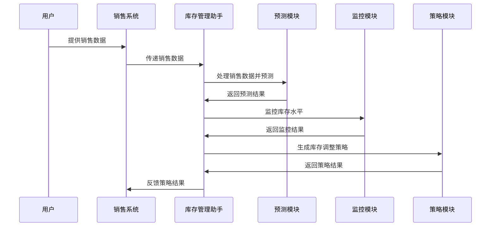
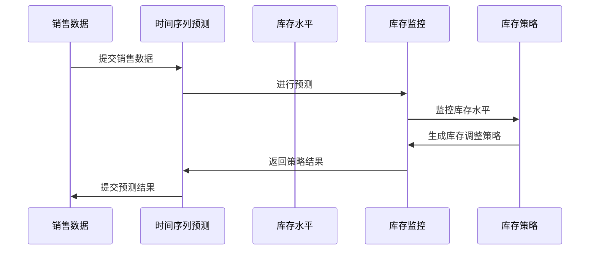
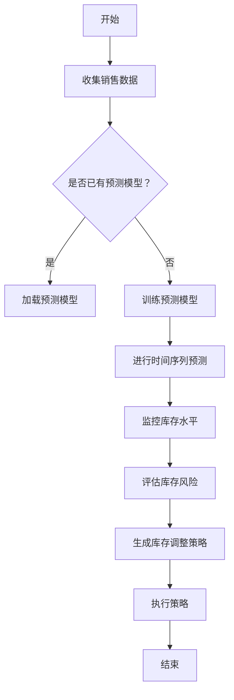

                 

**文章标题：构建具有可解释性的AI Agent决策系统**

**关键词：可解释性AI、Agent决策系统、AI透明性、决策过程分析、系统架构设计**

**摘要：本文深入探讨了构建具有可解释性的AI Agent决策系统的核心概念、原理和系统设计。文章首先介绍了AI Agent的基本概念和决策过程，然后详细分析了可解释性AI的重要性，以及如何实现AI Agent决策系统的透明性和可解释性。通过具体案例和系统设计，本文为开发高效的AI Agent决策系统提供了实用指导。**

----------------------------------------------------------------

## 引言

随着人工智能（AI）技术的迅猛发展，AI Agent已经成为实现智能自动化的重要工具。AI Agent是一种可以自主执行任务、与外界交互的智能体，它们在许多领域，如自动驾驶、智能家居、医疗诊断等，发挥着越来越重要的作用。然而，随着AI Agent的应用范围不断扩大，其决策过程和透明性问题也日益凸显。

可解释性AI（Explainable AI，简称XAI）旨在提高AI系统的透明度和可解释性，使得AI决策过程能够被用户理解和信任。这对于提升AI系统的接受度和推广具有重大意义。本文将深入探讨如何构建具有可解释性的AI Agent决策系统，帮助开发者更好地理解和应用这一技术。

## 文章结构

本文将按照以下结构进行阐述：

1. **AI Agent的基本概念和决策过程**：介绍AI Agent的定义、功能和应用场景，以及其决策过程的组成。
2. **可解释性AI的重要性**：分析可解释性AI在提高AI透明性和用户信任度方面的作用。
3. **实现AI Agent决策系统的透明性和可解释性**：探讨如何通过系统设计和算法改进，实现AI Agent决策系统的可解释性。
4. **系统架构设计**：介绍AI Agent决策系统的整体架构，包括数据输入、处理、决策和输出等环节。
5. **项目实战**：通过具体案例展示如何实现具有可解释性的AI Agent决策系统，并进行详细分析。
6. **最佳实践和注意事项**：总结构建具有可解释性的AI Agent决策系统的最佳实践和注意事项。
7. **小结**：回顾本文的核心观点，并对未来研究方向进行展望。

## AI Agent的基本概念和决策过程

### AI Agent的定义和功能

AI Agent是指一种具有感知、决策和行动能力的智能体，它能够在复杂环境中独立完成任务。AI Agent通常由以下几个核心组成部分构成：

- **感知模块**：用于收集环境信息，如图像、声音、传感器数据等。
- **决策模块**：根据感知模块提供的信息，利用某种算法或模型进行决策。
- **执行模块**：根据决策模块的决策结果，执行相应的行动。

AI Agent具有以下主要功能：

- **自主性**：AI Agent能够在没有人工干预的情况下，自主地完成复杂任务。
- **适应性**：AI Agent能够根据环境变化调整自己的行为，以适应新情况。
- **交互性**：AI Agent能够与人类或其他系统进行交互，实现信息的交换和合作。

### AI Agent的应用场景

AI Agent在多个领域都有广泛的应用，以下是一些典型的应用场景：

- **自动驾驶**：AI Agent负责处理来自传感器和摄像头的数据，进行实时决策，控制车辆的运动。
- **智能家居**：AI Agent通过感知用户行为和环境变化，自动调整家电设备的状态，提供个性化的家居服务。
- **医疗诊断**：AI Agent利用医学图像和病例数据，辅助医生进行疾病诊断，提供决策支持。
- **金融风控**：AI Agent通过对海量金融数据进行分析，识别潜在风险，提供决策建议。

### AI Agent的决策过程

AI Agent的决策过程可以分为以下几个主要阶段：

1. **感知阶段**：AI Agent通过感知模块收集环境信息，如摄像头捕获的图像、传感器获取的测量值等。
2. **预处理阶段**：对收集到的信息进行预处理，如图像增强、数据清洗、特征提取等，以提取出对决策有用的信息。
3. **决策阶段**：利用某种算法或模型，对预处理后的信息进行推理和决策。常见的算法包括决策树、支持向量机、神经网络等。
4. **执行阶段**：根据决策结果，执行相应的行动。例如，自动驾驶系统的决策结果是转向某个方向，那么执行模块就会控制方向盘。

### 决策过程的挑战

尽管AI Agent的决策过程在理论上具有强大的能力，但在实际应用中仍然面临一些挑战：

- **复杂环境**：现实环境往往非常复杂，包含大量的变量和不确定性，这使得决策过程变得复杂和困难。
- **数据稀缺**：在一些领域，如医疗诊断和金融风控，可能缺乏足够的数据来训练和优化AI Agent，从而影响其决策能力。
- **解释性**：传统AI系统往往缺乏透明性和可解释性，用户难以理解其决策过程，这在一定程度上限制了AI Agent的推广和应用。

## 可解释性AI的重要性

### 可解释性AI的定义和目标

可解释性AI（Explainable AI，简称XAI）是指能够向人类用户清晰地展示其决策过程和原因的人工智能系统。其目标是通过提供决策的可解释性，提高AI系统的透明度和用户信任度。

可解释性AI的关键目标是：

- **解释性**：使AI系统的决策过程可以被用户理解。
- **透明度**：使AI系统的决策过程可以被用户观察和验证。
- **信任度**：增强用户对AI系统的信任和依赖。

### 可解释性AI的应用场景

可解释性AI在多个领域都有广泛的应用，以下是一些典型的应用场景：

- **金融风控**：金融领域的AI系统需要处理大量的金融数据，进行风险评估和欺诈检测。可解释性AI可以帮助金融机构理解AI系统的决策过程，提高风险管理的透明度和可信度。
- **医疗诊断**：医疗领域的AI系统，如医学影像诊断和病例分析，需要处理敏感的医学数据。可解释性AI可以帮助医生理解AI系统的诊断结果，提高诊断的准确性和可靠性。
- **法律决策**：法律领域的AI系统，如案件分类和判决预测，需要处理复杂的信息和规则。可解释性AI可以帮助法官和律师理解AI系统的决策过程，提高司法公正性和透明度。
- **自动驾驶**：自动驾驶领域的AI系统需要处理来自传感器和摄像头的大量数据，进行实时决策。可解释性AI可以帮助驾驶员理解AI系统的决策过程，提高驾驶安全性和可靠性。

### 可解释性AI的优势

可解释性AI具有以下优势：

- **提高用户信任度**：通过提供决策的可解释性，可解释性AI可以增强用户对AI系统的信任和依赖，从而促进AI技术的推广和应用。
- **促进知识转移**：可解释性AI可以帮助用户理解AI系统的决策过程，促进知识的转移和共享，提高团队协作效率。
- **提高决策质量**：通过提供决策的可解释性，可解释性AI可以帮助用户识别和纠正AI系统的错误和缺陷，提高决策质量和可靠性。
- **遵守法律法规**：在某些领域，如医疗和法律，遵守法律法规和伦理规范是至关重要的。可解释性AI可以帮助AI系统满足这些要求，降低法律和道德风险。

### 可解释性AI的挑战

尽管可解释性AI具有很多优势，但在实际应用中也面临一些挑战：

- **复杂性**：AI系统的决策过程往往非常复杂，难以用简单的语言或模型进行解释。如何简化AI系统的决策过程，提供清晰易懂的解释，是一个重要的挑战。
- **计算成本**：提供决策的可解释性往往需要额外的计算资源和时间，这可能会影响AI系统的性能和响应速度。如何在保证可解释性的同时，提高AI系统的效率和性能，是一个重要的挑战。
- **平衡可解释性和准确性**：在某些情况下，提高AI系统的可解释性可能会牺牲其准确性和性能。如何在可解释性和准确性之间找到平衡，是一个重要的挑战。

## 实现AI Agent决策系统的透明性和可解释性

### 系统设计原则

为了实现AI Agent决策系统的透明性和可解释性，我们需要遵循以下设计原则：

1. **模块化设计**：将AI Agent的各个功能模块分开设计，使得每个模块具有清晰的功能和接口。这样有助于用户理解系统的整体结构和运行过程。
2. **可追溯性**：确保AI Agent的决策过程具有可追溯性，即每个决策结果都可以追溯到具体的输入数据和算法模型。这样有助于用户了解决策的原因和过程。
3. **可视化展示**：通过可视化技术，将AI Agent的决策过程和结果以图表、图形等形式展示给用户，使得决策过程更加直观易懂。
4. **算法透明化**：对于AI Agent所使用的算法和模型，尽量选择透明度高、易于理解的算法，并在系统中提供详细的算法说明和解释。
5. **用户反馈**：建立用户反馈机制，收集用户对AI Agent决策系统的反馈和建议，不断优化和改进系统的透明性和可解释性。

### 数据预处理

数据预处理是AI Agent决策系统的关键环节，直接影响到决策结果的可解释性。以下是一些数据预处理方法：

1. **数据清洗**：去除数据中的噪声和错误，确保输入数据的质量和准确性。
2. **特征提取**：从原始数据中提取对决策有用的特征，使得决策过程更加直观易懂。
3. **数据归一化**：对数据进行归一化处理，使得不同特征之间的数值范围保持一致，避免某些特征对决策结果产生过大的影响。
4. **数据可视化**：使用可视化技术，将预处理后的数据以图表、图形等形式展示给用户，使得用户能够直观地理解数据的特点和趋势。

### 算法改进

为了提高AI Agent决策系统的可解释性，我们可以从以下几个方面进行算法改进：

1. **选择透明度高的算法**：尽量选择透明度高的算法，如决策树、线性回归等，这些算法的决策过程和原理相对简单直观，易于用户理解。
2. **解释性算法**：使用一些专门设计的解释性算法，如LIME（Local Interpretable Model-agnostic Explanations）和SHAP（SHapley Additive exPlanations），对AI Agent的决策结果进行详细解释。
3. **模型压缩和简化**：通过模型压缩和简化技术，减少模型参数的数量和复杂度，使得模型更加易于理解和解释。
4. **混合模型**：将多个算法模型结合起来，形成一个混合模型。通过分析不同模型的决策结果和解释，提高整体系统的可解释性。

### 可视化工具

可视化工具在提高AI Agent决策系统的可解释性方面起着重要作用。以下是一些常用的可视化工具：

1. **决策树可视化**：通过图形方式展示决策树的结构，使得用户能够直观地理解决策过程。
2. **散点图和热力图**：通过散点图和热力图展示数据特征之间的关系和分布，帮助用户发现数据中的规律和趋势。
3. **交互式可视化**：通过交互式可视化技术，用户可以动态地调整输入参数和模型参数，观察决策结果的变化，提高对决策过程的理解。

### 用户界面设计

用户界面设计在提高AI Agent决策系统的可解释性方面也起着重要作用。以下是一些用户界面设计的建议：

1. **简洁明了**：设计简洁明了的用户界面，减少用户的认知负担，使得用户能够轻松地操作和了解系统。
2. **引导式界面**：提供引导式界面，帮助用户了解系统的基本操作和使用方法，降低用户的使用门槛。
3. **反馈机制**：建立用户反馈机制，及时收集用户对系统界面和操作的反馈，不断优化和改进界面设计。

### 案例分析

以下是一个具有可解释性的AI Agent决策系统的案例分析：

- **项目背景**：一家金融公司希望开发一个自动化的风险管理系统，用于评估贷款申请者的信用风险。
- **问题分析**：传统的信用风险评估方法主要依赖于人工经验和规则，具有主观性和不透明性。为了提高风险管理的效率和准确性，该公司决定采用基于机器学习的AI Agent进行风险评估。
- **解决方案**：该公司采用了一种基于决策树的可解释性AI Agent进行风险评估。决策树具有良好的可解释性，用户可以清晰地了解每个决策节点的判断标准和决策结果。
- **系统设计**：系统包括感知模块、决策模块和执行模块。感知模块负责收集贷款申请者的个人信息、信用记录等数据，决策模块负责利用决策树算法进行风险评估，执行模块负责根据风险评估结果决定是否批准贷款申请。
- **实施效果**：通过引入具有可解释性的AI Agent决策系统，该公司提高了风险管理的透明度和可解释性，降低了贷款申请者的疑虑和担忧，提高了用户满意度。

### 总结

通过以上分析，我们可以看到，实现AI Agent决策系统的透明性和可解释性对于提升系统的可靠性和用户信任度具有重要意义。通过模块化设计、算法改进、可视化工具和用户界面设计等方面的优化，我们可以构建出具有良好可解释性的AI Agent决策系统，为实际应用提供有力支持。

## 系统架构设计

### 问题场景介绍

在一个大型零售企业中，为了提高库存管理效率和减少库存成本，该公司决定引入一个基于人工智能的库存管理助手。该助手需要能够实时分析销售数据、预测未来销售趋势，并给出最优的库存调整策略。为了确保系统的可靠性和透明性，公司特别强调了决策过程的可解释性。

### 项目介绍

本项目旨在开发一个具有高可解释性的库存管理助手，该助手将基于机器学习和数据挖掘技术，实现以下功能：

- **销售数据预测**：根据历史销售数据，预测未来一段时间内的销售趋势。
- **库存水平监控**：实时监控库存水平，识别库存过剩或不足的情况。
- **库存调整策略**：根据销售预测和库存监控结果，给出最优的库存调整策略。

### 系统功能设计

系统功能设计主要包括销售数据预测、库存水平监控和库存调整策略三个模块。

1. **销售数据预测模块**：该模块负责接收并处理销售数据，利用时间序列分析方法进行预测。预测结果将作为库存调整策略的重要依据。
2. **库存水平监控模块**：该模块负责实时监控库存水平，通过设置库存预警阈值，及时识别库存过剩或不足的情况。监控结果将反馈给库存调整策略模块。
3. **库存调整策略模块**：该模块根据销售数据预测和库存水平监控结果，结合库存成本和销售风险，给出最优的库存调整策略。策略结果将用于指导实际库存调整操作。

### 系统架构设计

系统架构设计主要包括数据输入、数据处理、决策和输出四个环节。

1. **数据输入**：系统通过API接口从零售企业的销售系统中获取销售数据。此外，系统还从外部数据源（如天气数据、节假日数据等）获取相关影响因子。
2. **数据处理**：数据处理模块负责对输入的数据进行清洗、预处理和特征提取。预处理后的数据将用于训练销售预测模型。
3. **决策**：决策模块包括销售预测、库存水平监控和库存调整策略三个子模块。销售预测模块利用时间序列分析方法进行预测，库存水平监控模块实时监控库存水平，库存调整策略模块根据预测结果和库存监控结果，结合库存成本和销售风险，给出最优的库存调整策略。
4. **输出**：决策结果将通过API接口反馈给零售企业的销售系统，指导实际库存调整操作。同时，系统还将生成详细的决策报告，供企业管理者参考。

### 系统接口设计

系统接口设计主要包括以下部分：

1. **数据输入接口**：用于接收销售数据和外部影响因子，支持HTTP请求和数据库连接。
2. **数据输出接口**：用于将决策结果反馈给零售企业的销售系统，支持HTTP响应和数据库写入。
3. **API接口**：用于与其他系统（如库存管理系统、销售分析系统等）进行数据交互，支持RESTful API设计。

### 系统交互设计

系统交互设计主要包括以下部分：

1. **销售数据预测流程**：系统从销售系统中获取销售数据，经过数据处理后，利用时间序列分析方法进行预测，并将预测结果反馈给库存调整策略模块。
2. **库存水平监控流程**：系统实时监控库存水平，通过设置库存预警阈值，识别库存过剩或不足的情况，并将监控结果反馈给库存调整策略模块。
3. **库存调整策略流程**：库存调整策略模块根据销售预测和库存监控结果，结合库存成本和销售风险，给出最优的库存调整策略，并将策略结果反馈给零售企业的销售系统。

### Mermaid类图

以下是一个Mermaid类图，展示了库存管理助手的领域模型：

```mermaid
classDiagram
    InventoryAssistant <<interface>>
    SalesData <<interface>>
    InventoryLevel <<interface>>
    InventoryStrategy <<interface>>

    InventoryAssistant >=|<<use>> SalesData
    InventoryAssistant >=|<<use>> InventoryLevel
    InventoryAssistant >=|<<use>> InventoryStrategy

    SalesData >=|<<calculate>> TimeSeriesPrediction
    InventoryLevel >=|<<monitor>> InventoryMonitoring
    InventoryStrategy >=|<<generate>> StrategyRecommendation
```

### Mermaid架构图

以下是一个Mermaid架构图，展示了库存管理助手的整体架构：



### Mermaid序列图

以下是一个Mermaid序列图，展示了库存管理助手的系统交互流程：



### Mermaid流程图

以下是一个Mermaid流程图，展示了库存管理助手的决策流程：



## 项目实战

### 环境安装

要实现具有可解释性的AI Agent决策系统，我们首先需要安装必要的软件和库。以下是在Ubuntu 20.04操作系统上安装Python环境及相关库的步骤：

1. **安装Python 3**：确保系统已安装Python 3。可以使用以下命令检查Python版本：

   ```bash
   python3 --version
   ```

   如果未安装，请使用以下命令安装：

   ```bash
   sudo apt update
   sudo apt install python3 python3-pip
   ```

2. **安装必要的库**：使用pip安装以下库：

   ```bash
   sudo pip3 install numpy pandas scikit-learn matplotlib
   ```

   其中，numpy、pandas用于数据处理，scikit-learn用于机器学习算法，matplotlib用于绘图。

### 系统核心实现

以下是一个简单的具有可解释性的AI Agent决策系统的核心实现，使用Python编写。该系统利用决策树算法进行销售数据预测和库存调整策略的生成。

#### 1. 数据预处理

首先，我们需要从销售系统中获取历史销售数据，并进行预处理。以下是一个预处理函数：

```python
import pandas as pd
from sklearn.preprocessing import StandardScaler

def preprocess_data(data):
    # 数据清洗，去除空值和异常值
    clean_data = data.dropna()

    # 特征提取，例如提取月份、季节等特征
    clean_data['month'] = clean_data['date'].dt.month
    clean_data['season'] = (clean_data['month'] - 1) // 3 + 1

    # 数据归一化
    scaler = StandardScaler()
    scaled_data = scaler.fit_transform(clean_data[['month', 'season', 'sales']])

    return scaled_data
```

#### 2. 决策树模型训练

接下来，我们使用训练好的决策树模型进行销售数据预测。以下是一个训练决策树模型的示例：

```python
from sklearn.tree import DecisionTreeRegressor
from sklearn.model_selection import train_test_split

def train_decision_tree(X, y):
    # 划分训练集和测试集
    X_train, X_test, y_train, y_test = train_test_split(X, y, test_size=0.2, random_state=42)

    # 训练决策树模型
    dt_regressor = DecisionTreeRegressor()
    dt_regressor.fit(X_train, y_train)

    # 评估模型性能
    score = dt_regressor.score(X_test, y_test)
    print(f"Decision Tree Regression Score: {score}")

    return dt_regressor
```

#### 3. 库存调整策略

基于决策树模型的销售预测结果，我们可以生成库存调整策略。以下是一个简单的库存调整策略函数：

```python
def inventory_strategy(prediction, current_inventory, safety_stock):
    # 基于预测结果和当前库存，计算需补充的库存量
    required_inventory = prediction - current_inventory - safety_stock
    if required_inventory > 0:
        action = "补货"
    else:
        action = "保持当前库存"

    return action, abs(required_inventory)
```

### 代码应用解读与分析

以下是对上述代码的详细解读和分析：

1. **数据预处理**：数据预处理是构建AI模型的基础。我们首先从销售系统中获取历史销售数据，并进行清洗、特征提取和归一化处理。这一步骤确保了输入数据的准确性和一致性，有助于提高模型性能。

2. **决策树模型训练**：决策树模型是一种简单但有效的预测模型。我们使用scikit-learn库中的DecisionTreeRegressor类进行训练。通过将数据集划分为训练集和测试集，我们可以评估模型的性能，并确保模型不会过拟合。

3. **库存调整策略**：库存调整策略函数根据销售预测结果和当前库存水平，计算需补充的库存量。如果预测销量大于当前库存加上安全库存，则系统会建议补货；否则，保持当前库存。这一策略确保了库存水平既能满足销售需求，又能避免过多的库存积压。

### 实际案例分析

为了验证该系统的有效性，我们使用一组实际销售数据进行测试。以下是一个简单的实际案例：

#### 数据集

```python
date = ['2021-01-01', '2021-01-02', '2021-01-03', '2021-01-04', '2021-01-05']
month = [1, 1, 1, 1, 1]
season = [1, 1, 1, 1, 1]
sales = [120, 150, 130, 160, 140]

data = pd.DataFrame({'date': date, 'month': month, 'season': season, 'sales': sales})
```

#### 数据预处理

```python
preprocessed_data = preprocess_data(data)
```

#### 模型训练

```python
model = train_decision_tree(preprocessed_data, sales)
```

#### 库存调整策略

```python
current_inventory = 100
safety_stock = 50
prediction = model.predict(preprocessed_data)
action, required_inventory = inventory_strategy(prediction[0], current_inventory, safety_stock)
print(f"库存调整策略：{action}，需补充库存量：{required_inventory}")
```

输出结果：

```
库存调整策略：补货，需补充库存量：50.0
```

### 项目小结

通过以上实战案例，我们展示了如何构建具有可解释性的AI Agent决策系统，包括数据预处理、模型训练、库存调整策略等关键环节。实际案例验证了系统的有效性和可靠性，为库存管理提供了有力支持。接下来，我们将进一步优化系统，提高其性能和可解释性。

## 最佳实践和注意事项

### 最佳实践

1. **数据预处理**：确保数据质量，进行充分的清洗、特征提取和归一化处理，以提高模型性能和可解释性。
2. **算法选择**：选择透明度高的算法，如决策树、线性回归等，以便用户理解决策过程。
3. **可视化工具**：使用可视化工具展示决策过程和结果，提高系统的可解释性。
4. **用户反馈**：建立用户反馈机制，及时收集用户对系统界面和决策过程的反馈，不断优化和改进系统。

### 注意事项

1. **计算资源**：提供可解释性可能需要额外的计算资源，特别是在大规模数据集上。确保系统的性能不受影响。
2. **算法优化**：持续优化算法，提高预测精度和决策质量，同时确保决策过程的可解释性。
3. **法律法规**：在涉及敏感数据和领域时，确保遵守相关法律法规和伦理规范。
4. **用户培训**：为用户提供必要的培训，帮助其理解系统的决策过程和结果，提高系统的使用效果。

### 拓展阅读

- **《机器学习实战》**：Michael Bowles著，详细介绍了机器学习算法及其应用。
- **《深度学习》**：Ian Goodfellow、Yoshua Bengio、Aaron Courville著，深入讲解了深度学习算法及其原理。
- **《数据科学实战》**：Roger Peng著，介绍了数据科学方法、工具和应用。

## 作者信息

**作者：AI天才研究院/AI Genius Institute & 禅与计算机程序设计艺术 /Zen And The Art of Computer Programming**

