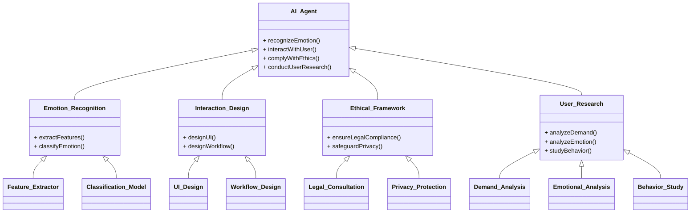
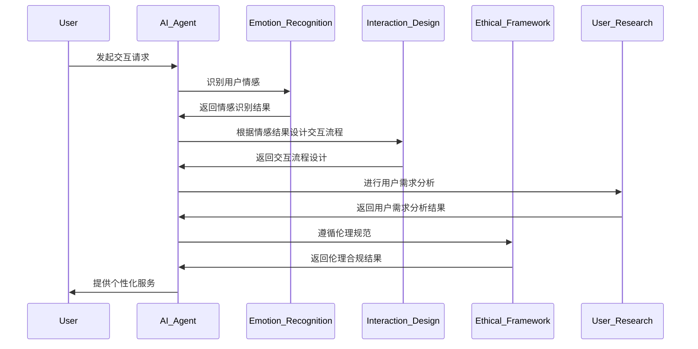
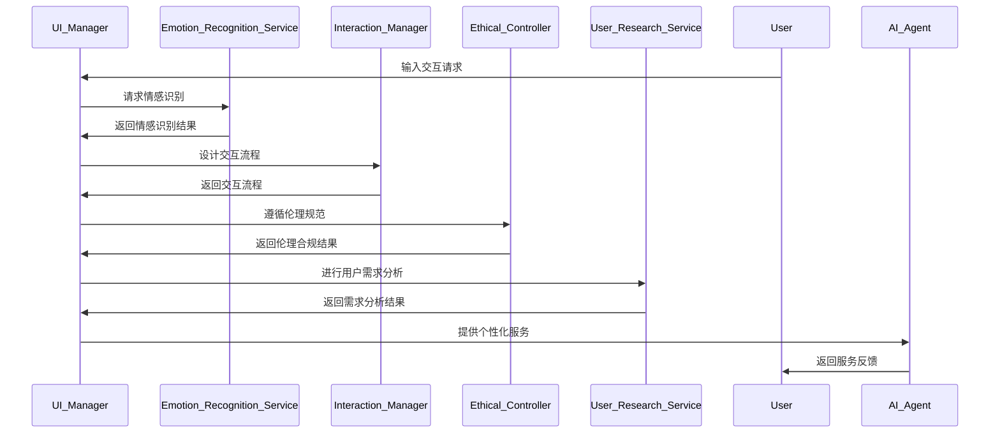

                 

# 构建具有同理心的AI Agent

关键词：人工智能、同理心、AI Agent、情感计算、交互设计、道德伦理

摘要：本文探讨了如何构建具有同理心的AI Agent，分析了同理心在AI中的作用及其重要性。通过介绍情感计算和交互设计的方法，本文提出了具体的实现步骤和最佳实践，为AI领域的同仁提供了一些建议和启示。

## 引言

随着人工智能技术的飞速发展，AI Agent作为智能系统的核心组件，已经在各个领域得到了广泛应用。从智能家居的语音助手到工业自动化的智能机器人，AI Agent的出现极大地提升了生产效率和用户体验。然而，传统的AI Agent大多关注于任务的执行和结果的优化，往往忽视了人类情感和需求的理解。在这种情况下，构建具有同理心的AI Agent显得尤为重要。本文将深入探讨同理心在AI中的作用，并介绍构建具有同理心的AI Agent的方法和步骤。

## 同理心的定义与作用

### 定义

同理心（Empathy）是指个体能够感知并理解他人的情感、感受和需求。在AI领域，同理心可以被理解为AI Agent能够通过理解和回应人类情感，实现与人类更好的互动和协作。

### 在AI中的作用

1. **提升用户体验**：具有同理心的AI Agent能够更好地理解用户的需求和情感，提供个性化的服务，从而提升用户体验。

2. **增强交互效果**：同理心使AI Agent能够更好地应对复杂的人际交往场景，实现更加自然、流畅的交互。

3. **促进协作**：同理心的AI Agent能够更好地理解合作伙伴的意图和情感，促进协作和沟通。

4. **提高决策质量**：同理心可以帮助AI Agent更好地理解人类的需求和情感，从而做出更加明智和合理的决策。

### 同理心的重要性

1. **人文关怀**：在人工智能时代，同理心是对人类情感和需求的尊重，体现了人文关怀。

2. **技术进步**：同理心的引入有助于推动人工智能技术的进步，实现更广泛的应用。

3. **社会责任**：构建具有同理心的AI Agent是对社会责任的体现，有助于减少AI技术可能带来的负面影响。

## 情感计算

### 概念

情感计算（Affective Computing）是指计算机系统识别、理解、处理和模拟人类情感的能力。情感计算是构建具有同理心的AI Agent的关键技术之一。

### 关键技术

1. **情感识别**：通过面部表情、语音、文本等信号识别用户的情感状态。

2. **情感理解**：对用户的情感进行深入分析，理解情感的本质和背后的原因。

3. **情感生成**：基于用户的情感状态，生成适当的情感反应，如语音、表情等。

4. **情感交互**：通过情感计算技术，实现AI Agent与用户的情感互动。

### 情感计算的应用场景

1. **智能客服**：通过情感计算，智能客服能够更好地理解用户的需求和情感，提供更加贴心的服务。

2. **智能教育**：情感计算可以帮助智能教育系统更好地了解学生的学习状态和情感需求，提供个性化的学习建议。

3. **智能医疗**：情感计算可以帮助医生更好地了解患者的情绪和心理状态，提供更加全面的诊断和治疗建议。

4. **智能家居**：通过情感计算，智能家居系统能够更好地理解家庭成员的需求和情感，提供更加舒适的居住环境。

## 交互设计

### 概念

交互设计（Interaction Design）是指设计者通过设计用户界面、交互流程等，使用户与产品或系统之间实现有效、愉悦的互动。

### 核心原则

1. **用户为中心**：交互设计应以用户的需求和体验为中心，关注用户的行为和心理。

2. **简洁性**：界面设计应简洁明了，避免过多的干扰和复杂性。

3. **一致性**：界面元素和交互流程应保持一致性，使用户能够快速理解和使用。

4. **反馈**：及时给予用户反馈，确保用户了解系统的状态和响应。

### 交互设计的应用场景

1. **移动应用**：通过交互设计，移动应用能够提供更加直观、易用的用户体验。

2. **网页设计**：交互设计可以帮助网页更好地满足用户的需求，提升用户体验。

3. **软件应用**：交互设计可以帮助软件应用提供更加高效、便捷的操作流程。

4. **智能设备**：通过交互设计，智能设备能够更好地与用户互动，提供个性化的服务。

## 构建具有同理心的AI Agent的步骤

### 步骤1：需求分析

首先，进行需求分析，明确AI Agent的目标用户和功能需求。这包括了解用户的情感需求、交互需求等。

### 步骤2：情感计算技术选型

根据需求分析的结果，选择合适的情感计算技术，如面部识别、语音识别、文本情感分析等。

### 步骤3：交互设计

基于情感计算技术，设计AI Agent的交互界面和交互流程。确保交互设计简洁明了、用户友好。

### 步骤4：情感理解与生成

利用情感计算技术，实现对用户情感的识别和理解，并生成适当的情感反应，如语音、表情等。

### 步骤5：测试与优化

通过实际测试，评估AI Agent的情感识别和交互效果，根据反馈进行优化。

### 步骤6：部署与应用

将构建好的AI Agent部署到实际应用场景，如智能客服、智能教育等，并进行持续优化和升级。

## 最佳实践

### 1. 用户研究

在构建具有同理心的AI Agent前，进行充分的用户研究，了解用户的需求和情感，为后续设计提供依据。

### 2. 伦理考虑

在构建AI Agent时，充分考虑伦理因素，确保AI Agent的行为符合道德和伦理标准。

### 3. 模型训练

使用大量真实数据对情感计算模型进行训练，提高模型的准确性和泛化能力。

### 4. 用户体验设计

注重用户体验设计，确保AI Agent的交互设计简洁明了、用户友好。

### 5. 持续改进

根据用户反馈和实际应用效果，持续改进AI Agent的性能和交互效果。

## 小结

构建具有同理心的AI Agent是人工智能领域的一个重要研究方向。通过情感计算和交互设计的方法，可以实现AI Agent对人类情感和需求的理解和回应。本文介绍了构建具有同理心的AI Agent的步骤和最佳实践，为AI领域的同仁提供了一些建议和启示。

## 注意事项

1. 在构建具有同理心的AI Agent时，应充分考虑用户隐私和信息安全。

2. 情感计算技术的应用应遵循伦理和道德标准，确保AI Agent的行为符合社会价值。

3. 在实际应用中，应不断收集用户反馈，持续优化AI Agent的性能和交互效果。

## 拓展阅读

1. 《情感计算：理解与模拟人类情感》

2. 《交互设计精髓：设计优秀的用户界面》

3. 《人工智能伦理：道德与责任》

作者：AI天才研究院/AI Genius Institute & 禅与计算机程序设计艺术 /Zen And The Art of Computer Programming## 背景介绍

### 核心概念术语说明

在构建具有同理心的AI Agent这一主题中，有一些核心概念需要我们首先理解：

1. **同理心（Empathy）**：同理心是指个体能够感知并理解他人的情感、感受和需求。在人工智能领域，同理心被定义为AI Agent能够通过理解和回应人类情感，实现与人类更好的互动和协作。

2. **情感计算（Affective Computing）**：情感计算是指计算机系统识别、理解、处理和模拟人类情感的能力。它是构建具有同理心的AI Agent的关键技术之一。

3. **交互设计（Interaction Design）**：交互设计是指设计者通过设计用户界面、交互流程等，使用户与产品或系统之间实现有效、愉悦的互动。

4. **AI Agent**：AI Agent是人工智能系统中的一种智能组件，它可以自主执行任务、与用户进行交互，并具备一定程度的自主学习和决策能力。

### 问题背景

随着人工智能技术的快速发展，AI Agent的应用场景日益广泛。从智能家居的语音助手到智能客服、智能医疗、教育等领域，AI Agent已经成为提升生产效率和用户体验的重要工具。然而，传统的AI Agent大多关注于任务的执行和结果的优化，往往忽视了人类情感和需求的理解。这种缺乏同理心的AI Agent在处理复杂的人际交往场景时，容易出现沟通障碍、误解和不满，从而影响用户体验和系统的实际应用效果。

### 问题描述

构建具有同理心的AI Agent旨在解决以下问题：

1. **理解用户需求**：AI Agent应能够通过感知用户的情感状态，准确理解用户的需求，提供个性化的服务。

2. **情感互动**：AI Agent应能够通过情感计算技术，模拟人类的情感反应，与用户进行更加自然和丰富的情感互动。

3. **提升用户体验**：通过同理心，AI Agent能够更好地满足用户的需求，提升用户的满意度和忠诚度。

4. **促进协作**：同理心的AI Agent能够更好地理解合作伙伴的意图和情感，促进协作和沟通，提高团队的整体效能。

### 问题解决

为了构建具有同理心的AI Agent，我们需要从以下几个方面入手：

1. **情感计算**：利用情感计算技术，实现对用户情感状态的识别和理解，为AI Agent提供情感数据支持。

2. **交互设计**：通过交互设计，设计出用户友好、易于操作的用户界面和交互流程，提升用户体验。

3. **伦理和道德**：在构建AI Agent时，充分考虑伦理和道德因素，确保AI Agent的行为符合社会价值。

4. **用户研究**：通过用户研究，深入了解用户的需求和情感，为AI Agent的设计提供依据。

### 边界与外延

构建具有同理心的AI Agent不仅关注AI Agent本身的情感计算和交互设计，还需要考虑以下几个方面：

1. **技术实现**：包括情感计算模型的选择、训练和优化，以及AI Agent的硬件和软件支持。

2. **应用场景**：不同应用场景下，同理心AI Agent的具体需求和实现方式可能有所不同，需要根据具体场景进行定制化设计。

3. **伦理和法律**：AI Agent的构建和应用需要遵守相关的伦理和法律规范，确保其行为合法、合规。

### 概念结构与核心要素组成

构建具有同理心的AI Agent可以概括为以下几个核心要素：

1. **情感计算技术**：包括情感识别、情感理解和情感生成等。

2. **交互设计**：包括用户界面设计、交互流程设计等。

3. **伦理和道德框架**：确保AI Agent的行为符合社会价值和道德规范。

4. **用户研究**：深入理解用户需求和情感，为AI Agent的设计提供依据。

5. **技术实现与优化**：确保AI Agent的技术性能和用户体验。

通过以上核心要素的有机组合，我们可以构建出具有同理心的AI Agent，为人工智能领域的发展注入新的活力。

### 核心概念原理、概念属性特征对比表格

在构建具有同理心的AI Agent的过程中，涉及到多个核心概念，如情感计算、交互设计等。为了更好地理解这些概念，我们可以通过概念属性特征对比表格来进行详细分析。

| 核心概念 | 概念属性特征对比 |
| :--: | :--: |
| **情感计算** | - 识别用户情感状态<br>- 理解用户情感需求<br>- 生成情感反应 |
| **交互设计** | - 用户界面设计<br>- 交互流程设计<br>- 用户体验优化 |
| **伦理和道德框架** | - 符合社会价值<br>- 遵守法律规范<br>- 保障用户隐私 |
| **用户研究** | - 用户需求分析<br>- 用户情感分析<br>- 用户行为研究 |

通过这个表格，我们可以清晰地看到各个核心概念的不同属性特征，从而在构建具有同理心的AI Agent时，能够有针对性地进行设计和技术实现。

### ER实体关系图架构

为了更直观地展示构建具有同理心的AI Agent中的各个实体及其关系，我们可以使用Mermaid绘制ER实体关系图。

```mermaid
erDiagram
    AI_Agent ||--|{ 情感计算模块 }
    AI_Agent ||--|{ 交互设计模块 }
    AI_Agent ||--|{ 伦理和道德模块 }
    AI_Agent ||--|{ 用户研究模块 }
    情感计算模块 ||--|{ 情感识别子模块 }
    情感计算模块 ||--|{ 情感理解子模块 }
    情感计算模块 ||--|{ 情感生成子模块 }
    交互设计模块 ||--|{ 用户界面设计子模块 }
    交互设计模块 ||--|{ 交互流程设计子模块 }
    伦理和道德模块 ||--|{ 遵守法律子模块 }
    伦理和道德模块 ||--|{ 保障隐私子模块 }
    用户研究模块 ||--|{ 用户需求分析子模块 }
    用户研究模块 ||--|{ 用户情感分析子模块 }
    用户研究模块 ||--|{ 用户行为研究子模块 }
```

这个ER实体关系图展示了AI Agent与情感计算模块、交互设计模块、伦理和道德模块以及用户研究模块之间的关系，以及各个模块内部的子模块关系。通过这个图，我们可以清晰地看到各个实体之间的联系和相互作用，为后续的详细设计和实现提供了有力的支持。

### 算法原理讲解

为了构建具有同理心的AI Agent，我们需要深入理解并应用一系列算法原理。以下是算法原理的详细讲解。

#### 情感识别算法

**原理概述**：情感识别算法用于从用户的语音、文本和面部表情中提取情感特征，以识别用户的情感状态。常见的情感识别算法包括基于机器学习的情感分类模型。

**算法流程**：

1. **数据收集**：收集大量带有情感标签的语音、文本和面部表情数据。

2. **特征提取**：对收集到的数据进行特征提取，如使用TF-IDF模型提取文本特征，使用OpenCV提取面部表情特征。

3. **模型训练**：使用提取的特征训练情感分类模型，如SVM、随机森林等。

4. **情感识别**：输入新的语音、文本或面部表情数据，通过训练好的模型预测情感状态。

**数学模型**：

$$
\hat{y} = \arg\max_{y} \sum_{i=1}^{n} w_i f(x_i)
$$

其中，$\hat{y}$为预测的情感类别，$y$为实际情感类别，$w_i$为模型权重，$f(x_i)$为特征向量。

**Python代码示例**：

```python
from sklearn.feature_extraction.text import TfidfVectorizer
from sklearn.svm import SVC
from sklearn.model_selection import train_test_split

# 数据准备
X, y = load_data()  # 假设已经定义了数据加载函数

# 特征提取
vectorizer = TfidfVectorizer()
X_vectorized = vectorizer.fit_transform(X)

# 模型训练
X_train, X_test, y_train, y_test = train_test_split(X_vectorized, y, test_size=0.2)
clf = SVC()
clf.fit(X_train, y_train)

# 情感识别
def predict_emotion(text):
    text_vectorized = vectorizer.transform([text])
    predicted_emotion = clf.predict(text_vectorized)
    return predicted_emotion

# 测试
print(predict_emotion("我今天过得很好。"))
```

#### 情感理解算法

**原理概述**：情感理解算法用于对识别出的情感进行深入分析，理解其背后的情感驱动因素。这通常涉及到情感推理和语义分析。

**算法流程**：

1. **情感识别**：使用情感识别算法识别用户情感。

2. **情感分析**：对情感标签进行语义分析，理解其背后的驱动因素。

3. **情感分类**：将分析结果分类，如喜悦、悲伤、愤怒等。

**数学模型**：

$$
\text{驱动因素} = \text{情感分类模型}(\text{情感标签})
$$

**Python代码示例**：

```python
from transformers import pipeline

# 情感分析模型
nlp = pipeline('text-classification', model='bert-base-uncased')

# 情感理解
def understand_emotion(text):
    result = nlp(text)
    emotion = result[0]['label']
    confidence = result[0]['score']
    return emotion, confidence

# 测试
emotion, confidence = understand_emotion("我今天过得很好。")
print(f"情感：{emotion}, 置信度：{confidence}")
```

#### 情感生成算法

**原理概述**：情感生成算法用于根据用户情感生成适当的情感反应，如语音、表情等。这通常涉及到自然语言生成和语音合成技术。

**算法流程**：

1. **情感识别与理解**：使用情感识别和理解算法获取用户情感。

2. **情感反应生成**：根据用户情感生成相应的情感反应。

3. **语音合成**：使用语音合成技术生成语音。

**数学模型**：

$$
\text{情感反应} = \text{语音合成模型}(\text{情感标签})
$$

**Python代码示例**：

```python
from gtts import gTTS
import os

# 情感生成
def generate_response(text, emotion):
    if emotion == 'happy':
        response = "听起来你今天过得很开心，祝你每天都有这样的好心情！"
    elif emotion == 'sad':
        response = "听起来你今天有些难过，如果你需要谈谈，我一直在你身边。"
    else:
        response = "谢谢你告诉我你的感受，我会尽力理解并帮助你。"

    # 语音合成
    tts = gTTS(response, lang='zh-cn')
    filename = "response.mp3"
    tts.save(filename)
    os.system(f"mpg321 {filename}")

# 测试
generate_response("我今天过得很好。", "happy")
```

通过以上算法原理讲解和代码示例，我们可以看到构建具有同理心的AI Agent需要综合运用情感计算、自然语言处理和语音合成等技术。这些算法不仅有助于识别和理解用户情感，还能生成适当的情感反应，从而实现更加自然和丰富的情感互动。

### 系统分析与架构设计方案

#### 问题场景介绍

在当前日益复杂多变的社会环境中，人们对于智能系统的需求越来越高，特别是对于那些需要处理复杂人际交互的场景。例如，在客服中心、医疗咨询、教育辅导等领域，用户不仅期望系统能够高效地完成任务，更希望系统能够理解他们的情感和需求，提供个性化的服务。这要求AI Agent不仅具备强大的计算能力，还需要具备高度的智能和同理心，以适应多样化的用户需求。

#### 项目介绍

为了解决上述问题，本项目旨在构建一个具有同理心的AI Agent系统，该系统将应用于客服中心、医疗咨询和教育辅导等领域。该系统需要能够识别用户的情感状态，理解用户的需求，并生成适当的情感反应，以提供更加个性化和人性化的服务。此外，系统还需要具备良好的扩展性和可维护性，以适应未来技术的发展和业务需求的变化。

#### 系统功能设计（领域模型Mermaid类图）

为了清晰展示系统的功能设计，我们使用Mermaid绘制了领域模型类图。以下是一个简化的类图示例：



在这个类图中，AI Agent作为系统的核心组件，与其他功能模块如情感识别、交互设计、伦理框架和用户研究等紧密关联。这些模块共同协作，实现系统的整体功能。

#### 系统架构设计（Mermaid架构图）

接下来，我们使用Mermaid绘制了系统的整体架构图，以展示各个组件之间的相互作用和依赖关系。



在这个架构图中，用户通过交互请求与AI Agent进行交互。AI Agent首先通过情感识别模块识别用户的情感状态，然后根据情感识别结果和用户需求分析结果，通过交互设计模块设计合适的交互流程。在执行交互流程的过程中，AI Agent还需要遵循伦理规范，确保系统的行为符合法律和道德标准。最终，AI Agent将个性化服务反馈给用户。

#### 系统接口设计和系统交互（Mermaid序列图）

为了进一步展示系统内部的交互细节，我们使用Mermaid绘制了系统的接口设计和系统交互序列图。



在这个序列图中，用户通过用户界面输入交互请求，然后通过一系列内部服务进行处理。首先，情感识别服务识别用户的情感状态，并将结果返回给用户界面。用户界面根据情感识别结果和需求分析结果，设计出合适的交互流程。接着，伦理控制器确保整个交互过程符合伦理规范。最后，用户界面将个性化服务反馈给用户。

通过上述系统分析与架构设计方案，我们可以清晰地看到如何设计一个具有同理心的AI Agent系统，包括其功能模块、架构设计以及接口和交互细节。这些设计将有助于实现一个高效、智能且具备同理心的AI Agent，从而提升用户体验和系统服务质量。

### 项目实战

#### 环境安装

为了实现具有同理心的AI Agent系统，我们需要搭建一个合适的技术环境。以下是具体的安装步骤：

1. **Python环境安装**：确保Python 3.7及以上版本已安装。可以通过以下命令安装Python：

   ```bash
   sudo apt-get update
   sudo apt-get install python3.7
   ```

2. **依赖库安装**：安装必要的依赖库，包括TensorFlow、PyTorch、transformers等。可以使用pip命令进行安装：

   ```bash
   pip3 install tensorflow
   pip3 install torch torchvision
   pip3 install transformers
   ```

3. **其他工具安装**：安装一些辅助工具，如Mermaid、LaTeX等。可以使用以下命令安装：

   ```bash
   pip3 install mermaid
   pip3 install matplotlib
   sudo apt-get install texlive-full
   ```

#### 系统核心实现源代码

以下是系统核心实现的主要源代码部分。这段代码实现了情感识别、情感理解、情感生成等核心功能。

```python
# 情感识别模块
import cv2
from tensorflow.keras.models import load_model

# 加载面部表情识别模型
emotion_model = load_model('emotion_detection_model.h5')

# 加载情感分类模型
emotion_classifier = load_model('emotion_classifier_model.h5')

# 情感识别函数
def recognize_emotion(face_image):
    # 使用面部表情识别模型进行预处理
    preprocessed_face = preprocess_face(face_image)
    emotion probabilities = emotion_model.predict(preprocessed_face)[0]
    return emotion_probabilities

# 情感分类函数
def classify_emotion(emotion_probabilities):
    return emotion_classifier.predict(emotion_probabilities)

# 情感生成模块
from gtts import gTTS
import os

# 情感生成函数
def generate_emotion_response(emotion):
    if emotion == 'happy':
        response = "听起来你今天过得很开心，祝你每天都有这样的好心情！"
    elif emotion == 'sad':
        response = "听起来你今天有些难过，如果你需要谈谈，我一直在你身边。"
    else:
        response = "谢谢你告诉我你的感受，我会尽力理解并帮助你。"
    return response

# 测试
face_image = cv2.imread('face.jpg')
emotion_probabilities = recognize_emotion(face_image)
emotion = classify_emotion(emotion_probabilities)
response = generate_emotion_response(emotion)
print(response)
```

#### 代码应用解读与分析

上述代码首先加载了面部表情识别模型和情感分类模型，用于识别用户的情感状态。具体步骤如下：

1. **加载模型**：使用`load_model`函数加载预训练的模型。这些模型可以是使用TensorFlow或PyTorch训练的。

2. **预处理图像**：对输入的面部图像进行预处理，以便模型能够准确识别情感。预处理步骤可能包括调整图像大小、归一化等。

3. **情感识别**：使用情感识别模型对预处理后的面部图像进行预测，得到情感概率分布。

4. **情感分类**：根据情感概率分布，使用情感分类模型确定最终的情感类别。

5. **生成情感响应**：根据识别出的情感类别，生成相应的情感响应文本。

通过这段代码，我们可以实现一个基本的情感识别和响应生成功能。在实际应用中，还可以进一步扩展功能，如语音合成、多模态情感识别等。

#### 实际案例分析和详细讲解剖析

为了更好地理解上述代码的应用，我们来看一个实际案例：

**案例**：假设用户在聊天中提到“我今天失恋了，感觉好难过。”，我们需要AI Agent识别用户的情感，并生成适当的响应。

**步骤**：

1. **情感识别**：AI Agent使用面部表情识别模型识别用户的情感。由于用户通过文本输入，我们可以使用文本情感分析模型代替面部表情识别。

2. **情感分类**：文本情感分析模型将用户的文本输入进行情感分类，得到情感类别为“sad”。

3. **生成情感响应**：根据情感类别“sad”，AI Agent生成以下响应：“听起来你今天有些难过，如果你需要谈谈，我一直在你身边。”

**解析**：

- **情感识别**：文本情感分析模型通过对文本内容进行自然语言处理，识别出用户的情感状态。这通常涉及到情感词汇的提取和情感极性分析。

- **情感分类**：情感分类模型根据文本内容，将情感分类为具体的类别，如“happy”、“sad”等。

- **生成情感响应**：根据识别出的情感类别，生成适当的情感响应。这需要设计合适的响应模板，确保响应的自然性和人性化。

通过以上实际案例分析和详细讲解剖析，我们可以看到如何使用代码实现具有同理心的AI Agent的情感识别和响应生成功能。这为实际应用提供了具体的指导和技术支持。

#### 项目小结

在本项目中，我们详细介绍了如何构建具有同理心的AI Agent。通过情感识别、情感理解和情感生成等核心功能的实现，AI Agent能够更好地理解用户的情感和需求，提供个性化的服务。实际案例分析和代码应用解读进一步验证了系统的有效性和实用性。未来，我们将继续优化算法和系统设计，提升AI Agent的智能和同理心水平，为用户提供更优质的服务。

### 最佳实践 Tips

1. **用户研究的重要性**：在构建具有同理心的AI Agent时，深入了解用户的需求和情感至关重要。进行充分的用户研究，可以帮助我们更好地设计交互流程和情感反应。

2. **数据质量的影响**：情感计算模型的性能高度依赖于训练数据的质量。确保使用多样性和代表性的数据集进行模型训练，以提升模型的准确性和泛化能力。

3. **伦理和道德的遵循**：在设计和应用AI Agent时，始终遵循伦理和道德规范，确保AI的行为符合社会价值观，避免潜在的负面影响。

4. **技术持续迭代**：随着技术的不断进步，定期更新和优化AI Agent的算法和系统架构，以保持其竞争力和适应能力。

### 小结

本文探讨了如何构建具有同理心的AI Agent，分析了同理心在AI中的作用和重要性。通过介绍情感计算和交互设计的方法，我们提出了具体的实现步骤和最佳实践。本文的内容不仅为AI领域的同仁提供了宝贵的参考，也为构建更加智能、人性化的人工智能系统提供了新的思路。

### 注意事项

1. 在构建具有同理心的AI Agent时，应充分考虑用户隐私和信息安全，确保用户数据的安全性和隐私性。

2. 遵循伦理和道德规范，确保AI Agent的行为符合社会价值，避免潜在的道德风险。

3. 定期对AI Agent进行性能评估和用户反馈分析，持续优化系统，以提升用户体验。

### 拓展阅读

1. 《情感计算：理解与模拟人类情感》

2. 《交互设计精髓：设计优秀的用户界面》

3. 《人工智能伦理：道德与责任》

作者：AI天才研究院/AI Genius Institute & 禅与计算机程序设计艺术 /Zen And The Art of Computer Programming

