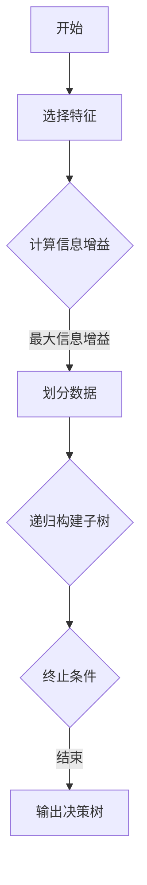
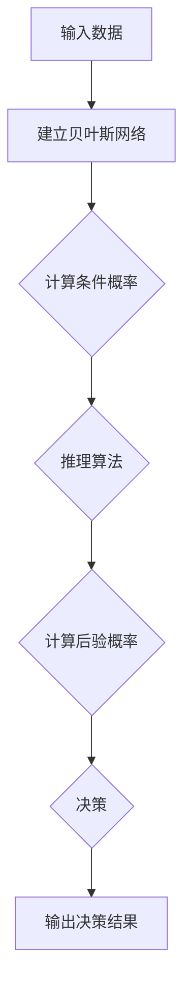
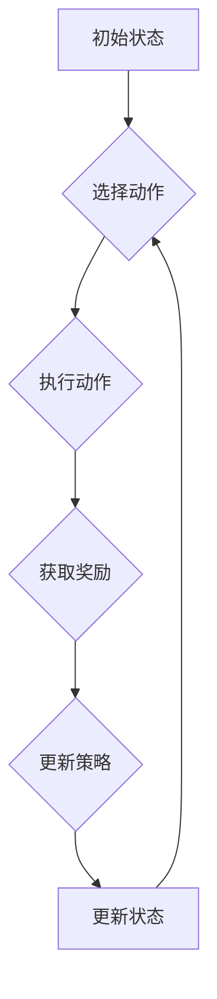
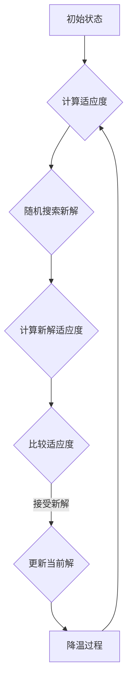

                 

### 1. 引言

#### 1.1 问题背景

在当今飞速发展的信息时代，人工智能（AI）已经成为推动技术进步和产业变革的重要力量。从简单的自动化工具到复杂的决策系统，AI在各个领域都展现出了巨大的潜力。然而，随着AI技术的不断演进，如何使AI系统更加智能化、具备自主学习和决策能力，成为了一个亟待解决的重要问题。

AI Agent，作为人工智能系统的一个重要分支，被认为是实现智能化决策的关键。AI Agent是具有感知、推理、学习、决策和执行能力的自主智能体，能够根据环境和任务需求，自主地做出决策并执行相应的任务。传统的AI系统通常是基于统计学习和模式识别的，虽然它们在某些方面表现出色，但缺乏对因果关系的理解和推理能力，这在很多实际应用场景中成为了一个瓶颈。

在现实世界中，许多决策问题不仅仅是基于已知数据的模式识别，更涉及到对因果关系的理解和推断。例如，在医疗诊断中，医生不仅仅需要根据症状和检测结果进行诊断，还需要理解不同症状之间的因果关系，从而做出更准确的决策。在金融风险管理中，投资者需要分析市场数据中的因果关系，以预测未来市场走势，并做出投资决策。因此，如何构建具有因果推断和决策能力的AI Agent，成为了一个重要的研究方向。

#### 1.2 问题描述

本篇文章旨在探讨如何构建具有因果推断和决策能力的AI Agent。具体来说，我们将回答以下问题：

1. **什么是因果推断？** 因果推断是指从数据中推断出事件之间的因果关系。它不仅仅依赖于数据之间的相关性，还需要考虑时间序列、干预机制等因素。

2. **什么是决策算法？** 决策算法是一类旨在帮助计算机或人工智能系统在给定情境下做出最优决策的方法。常见的决策算法包括决策树、贝叶斯网络、强化学习等。

3. **因果推断与决策算法如何结合？** 如何将因果推断与决策算法相结合，构建出既具有因果关系推理能力又能够做出有效决策的AI Agent。

4. **如何设计并实现这样的AI Agent？** 从设计思路、实现方法到应用案例，我们将详细介绍如何构建具有因果推断与决策能力的AI Agent。

5. **在实际应用中，这种AI Agent有哪些挑战和优化空间？** 我们将探讨在实际应用中可能遇到的技术挑战，并讨论可能的优化方案。

通过回答这些问题，我们希望能够为读者提供构建具有因果推断和决策能力的AI Agent的全面指南，并推动这一领域的研究和应用。

#### 1.3 问题解决

为了解决上述问题，本文将采用以下步骤：

1. **介绍AI Agent的基础知识** 首先，我们将介绍AI Agent的定义、组成、分类及其工作原理，以便读者了解AI Agent的基本概念。

2. **深入探讨因果推断原理** 接着，我们将详细讲解因果推断的基本概念、原理和算法，帮助读者理解因果推断的核心思想和方法。

3. **解析决策算法原理** 然后，我们将介绍几种常见的决策算法，包括决策树、贝叶斯网络、强化学习等，并解释它们的工作原理和应用场景。

4. **构建具有因果推断与决策能力的AI Agent** 在此基础上，我们将详细介绍如何结合因果推断和决策算法，设计并实现具有因果推断和决策能力的AI Agent。

5. **案例分析** 为了更好地理解上述理论，我们将通过具体的应用案例，展示如何在实际场景中构建和部署这样的AI Agent。

6. **探讨挑战与优化方向** 最后，我们将讨论在实际应用中可能遇到的挑战，并提出相应的优化方案，以期为未来的研究和应用提供参考。

通过上述步骤，我们将逐步引导读者理解并掌握构建具有因果推断与决策能力的AI Agent的方法和技巧。

#### 1.4 边界与外延

在讨论构建具有因果推断与决策能力的AI Agent时，我们需要明确一些边界和概念的外延，以确保讨论的准确性和一致性。

**边界**

1. **AI Agent的定义** 我们将严格遵循AI Agent的定义，即一个具有感知、推理、学习、决策和执行能力的自主智能体。这将帮助我们专注于核心概念，避免与一般意义上的AI系统混淆。

2. **因果推断的范围** 因果推断通常涉及数据挖掘、统计学和哲学等领域。在本文中，我们主要关注数据驱动的因果推断方法，特别是在人工智能中的应用。

3. **决策算法的分类** 我们将主要讨论几种典型的决策算法，如决策树、贝叶斯网络、强化学习等。这些算法是构建AI Agent的关键组件，但不会涵盖所有的决策算法。

**外延**

1. **AI Agent的应用领域** 尽管本文的主要关注点是构建具有因果推断与决策能力的AI Agent，但我们也将在讨论中提及AI Agent在其他领域的应用，如医疗、金融、工业自动化等。

2. **因果推断的应用范围** 因果推断不仅应用于人工智能，还广泛应用于数据科学、社会科学、生物医学等领域。我们将简要介绍因果推断在这些领域的应用，以便读者了解其广泛的适用性。

3. **决策算法的多样性** 虽然本文主要介绍了几种典型的决策算法，但实际应用中还有很多其他决策算法可供选择。我们将在案例分析部分讨论这些算法的适用场景和优势。

通过明确边界与外延，我们将确保讨论的深度和广度，为读者提供全面的视角和深入的洞察。

#### 1.5 概念结构与核心要素组成

为了构建具有因果推断与决策能力的AI Agent，我们需要深入了解相关概念的结构和核心要素。以下是本文涉及的主要概念及其关系：

**1. AI Agent**

- **定义**：AI Agent是一个具有感知、推理、学习、决策和执行能力的自主智能体。
- **组成**：感知模块、推理模块、学习模块、决策模块和执行模块。
- **分类**：基于感知能力的AI Agent、基于推理能力的AI Agent、基于学习能力的AI Agent等。

**2. 因果推断**

- **定义**：因果推断是从数据中推断出事件之间的因果关系。
- **原理**：利用统计学、机器学习等方法，通过分析数据中的相关性、时间序列等特征，推断出因果关系。
- **方法**：假设检验、因果图模型、统计学习算法等。

**3. 决策算法**

- **定义**：决策算法是一类旨在帮助计算机或人工智能系统在给定情境下做出最优决策的方法。
- **类型**：决策树、贝叶斯网络、强化学习、模拟退火等。
- **目标**：最大化预期收益或最小化损失。

**4. AI Agent与因果推断**

- **关系**：AI Agent可以利用因果推断来理解环境中的因果关系，从而做出更准确的决策。
- **实现**：通过整合因果推断算法，AI Agent可以在感知环境后，进行因果推理，辅助决策模块做出更合理的决策。

**5. AI Agent与决策算法**

- **关系**：决策算法是AI Agent决策模块的核心，决定了AI Agent在特定情境下的行动策略。
- **实现**：不同的决策算法适用于不同的应用场景，AI Agent需要根据任务需求选择合适的决策算法。

通过以上核心概念与联系，我们可以构建一个具有因果推断与决策能力的AI Agent，使其在复杂环境中能够自主学习和决策，提高任务完成的效率和准确性。

### 1.6 核心概念与联系

在构建具有因果推断与决策能力的AI Agent的过程中，理解以下几个核心概念及其相互联系至关重要。以下是这些核心概念的定义、属性特征对比表格和ER实体关系图架构的Mermaid流程图。

**1. AI Agent**

- **定义**：AI Agent是一个具有感知、推理、学习、决策和执行能力的自主智能体。
- **属性特征对比表格**
  | 特征 | 描述 |  
  | ---- | ---- |
  | 感知 | 感知环境的能力，如视觉、听觉等 |  
  | 推理 | 根据感知信息进行逻辑推理的能力 |  
  | 学习 | 通过经验不断改进决策的能力 |  
  | 决策 | 在给定情境下做出最优决策的能力 |  
  | 执行 | 执行决策并完成任务的能力 |

- **ER实体关系图架构的Mermaid流程图**
  ```mermaid
  erDiagram
    AI_Agent ||--|{ 感知模块 }
    AI_Agent ||--|{ 推理模块 }
    AI_Agent ||--|{ 学习模块 }
    AI_Agent ||--|{ 决策模块 }
    AI_Agent ||--|{ 执行模块 }
  ```

**2. 因果推断**

- **定义**：因果推断是从数据中推断出事件之间的因果关系。
- **属性特征对比表格**
  | 特征 | 描述 |    
  | ---- | ---- |
  | 相关性 | 分析变量之间的相关程度 |    
  | 因果关系 | 确定变量之间的因果关系 |    
  | 干预机制 | 对变量进行干预以验证因果关系 |

- **ER实体关系图架构的Mermaid流程图**
  ```mermaid
  erDiagram
    数据 ||--|{ 相关性分析 }
    数据 ||--|{ 因果关系推断 }
    数据 ||--|{ 干预机制验证 }
  ```

**3. 决策算法**

- **定义**：决策算法是一类旨在帮助计算机或人工智能系统在给定情境下做出最优决策的方法。
- **属性特征对比表格**
  | 类型 | 描述 |    
  | ---- | ---- |
  | 决策树 | 通过树形结构进行决策的算法 |    
  | 贝叶斯网络 | 基于概率图模型进行决策的算法 |    
  | 强化学习 | 通过交互环境进行学习并做出决策的算法 |    
  | 模拟退火 | 通过模拟物理系统中的退火过程进行决策的算法 |

- **ER实体关系图架构的Mermaid流程图**
  ```mermaid
  erDiagram
    决策算法 ||--|{ 决策树 }
    决策算法 ||--|{ 贝叶斯网络 }
    决策算法 ||--|{ 强化学习 }
    决策算法 ||--|{ 模拟退火 }
  ```

**4. AI Agent与因果推断**

- **关系**：AI Agent可以利用因果推断来理解环境中的因果关系，从而做出更准确的决策。
- **实现**：AI Agent通过感知模块收集数据，利用因果推断算法分析数据，然后将结果传递给决策模块，辅助决策。

**5. AI Agent与决策算法**

- **关系**：决策算法是AI Agent决策模块的核心，决定了AI Agent在特定情境下的行动策略。
- **实现**：AI Agent根据任务需求选择合适的决策算法，并整合到决策模块中，用于指导行动。

通过以上核心概念及其相互关系的详细阐述，我们可以更好地理解如何构建具有因果推断与决策能力的AI Agent，并为其在复杂环境中的有效应用奠定基础。

### 1.7 目标与结构

#### 1.7.1 书籍目标

本篇技术博客的目标是系统地介绍如何构建具有因果推断与决策能力的AI Agent。具体目标如下：

1. **基础知识的普及** 为读者提供AI Agent、因果推断和决策算法的基础知识，帮助读者理解这些核心概念。
2. **理论与实践的结合** 通过详细讲解和案例分析，将理论知识与实际应用相结合，使读者能够将所学知识应用于实际问题解决中。
3. **技术深度的挖掘** 对因果推断与决策算法的原理进行深入剖析，探讨其应用场景、挑战和优化方向，为读者提供全面的视角。
4. **引导创新思维** 通过案例研究和前沿探讨，激发读者对人工智能领域的创新思维，推动技术的进步和应用。

#### 1.7.2 内容结构

本文将分为六个主要部分，具体结构如下：

1. **第一部分：引言与背景** 介绍问题背景、问题描述、问题解决思路、边界与外延以及核心概念与联系。
2. **第二部分：AI Agent基础知识** 详细介绍AI Agent的定义、组成、分类及其工作原理，为构建具有因果推断与决策能力的AI Agent奠定基础。
3. **第三部分：因果推断原理** 讲解因果推断的基本概念、原理和算法，并探讨其在数据科学、生物医学等领域的应用。
4. **第四部分：决策算法原理** 分析常见的决策算法，包括决策树、贝叶斯网络、强化学习等，并阐述其基本原理和应用。
5. **第五部分：构建具有因果推断与决策能力的AI Agent** 详细介绍如何将因果推断与决策算法相结合，构建具有因果推断与决策能力的AI Agent。
6. **第六部分：实践与应用** 通过具体案例展示如何在实际场景中构建和部署这样的AI Agent，并探讨实际应用中的挑战与优化方向。

#### 1.7.3 阅读对象

本篇技术博客适合以下读者群体：

1. **人工智能领域的研究人员** 对AI Agent、因果推断和决策算法有深入研究的读者，可以通过本文进一步了解这些技术在实际应用中的实现方法。
2. **计算机科学专业的学生** 对人工智能和机器学习有浓厚兴趣的学生，可以通过本文掌握构建具有因果推断与决策能力的AI Agent的基本思路。
3. **企业技术团队** 需要在实际项目中应用人工智能技术的企业技术团队，可以通过本文获取构建AI Agent的实用经验和优化方案。
4. **技术爱好者和从业者** 对人工智能技术感兴趣的技术爱好者和技术从业者，可以通过本文了解AI Agent的最新研究成果和应用前景。

通过本文的阅读，读者不仅可以系统地了解构建具有因果推断与决策能力的AI Agent的理论知识，还能掌握实际应用中的关键技巧，为未来在人工智能领域的探索提供有力支持。

### 1.8 本章小结

本章主要介绍了构建具有因果推断与决策能力的AI Agent的背景、核心概念和内容结构。首先，我们探讨了AI Agent的定义、组成和分类，明确了其在人工智能领域的重要性。接着，我们深入分析了因果推断的基本概念、原理和算法，并讨论了其在数据科学、生物医学等领域的应用。随后，我们解析了几种常见的决策算法，包括决策树、贝叶斯网络、强化学习等，并阐述了它们在AI Agent中的应用。最后，我们详细介绍了本文的内容结构，明确了各部分的目标和内容。通过本章的介绍，读者可以为后续内容的深入理解打下坚实基础。

## 第二部分：AI Agent基础知识

### 2.1 AI Agent的概述

#### 2.1.1 AI Agent的定义

AI Agent，即人工智能代理，是指一种自主运行的软件实体，能够在复杂环境中通过感知、推理、学习、决策和执行等过程，实现特定任务的自动化和智能化。AI Agent的核心特点包括：

1. **自主性**：AI Agent可以自主地执行任务，无需人为干预。这意味着它们可以根据预设的目标和策略，主动感知环境变化，进行决策，并采取行动。
2. **适应性**：AI Agent能够根据环境的变化和学习到的经验，不断调整其行为策略，提高任务完成的效率和准确性。
3. **交互性**：AI Agent可以与环境以及其他代理进行交互，共享信息，协同完成任务。
4. **智能性**：AI Agent具备一定的智能，能够理解环境中的复杂信息，进行推理和决策，以实现任务目标。

#### 2.1.2 AI Agent的组成

一个典型的AI Agent由以下几个核心模块组成：

1. **感知模块**：感知模块负责获取环境中的信息，如图像、声音、文字等。这些感知信息是AI Agent做出决策的基础。
2. **推理模块**：推理模块利用感知模块获取的信息，进行逻辑推理，识别环境中的对象、事件和关系。
3. **学习模块**：学习模块通过分析历史数据，学习环境中的规律和模式，从而优化决策和行为策略。
4. **决策模块**：决策模块根据推理模块提供的信息和学习模块学到的经验，选择最优的行动方案。
5. **执行模块**：执行模块负责将决策模块选定的行动方案付诸实施，完成具体的任务。

#### 2.1.3 AI Agent的分类

根据不同的分类标准，AI Agent可以划分为多种类型：

1. **基于感知能力的分类**：按照AI Agent的感知能力，可以分为视觉型、听觉型、触觉型等。例如，自动驾驶汽车主要依赖视觉感知，而智能家居系统则主要依赖听觉和触觉感知。
2. **基于推理能力的分类**：按照AI Agent的推理能力，可以分为规则型、基于模型的、强化学习型等。规则型AI Agent依赖于预定义的规则进行决策，而基于模型的AI Agent则通过构建模型进行推理。
3. **基于学习能力的分类**：按照AI Agent的学习能力，可以分为监督学习型、无监督学习型、强化学习型等。监督学习型AI Agent通过历史数据进行学习，无监督学习型AI Agent则通过数据本身的特征进行学习，强化学习型AI Agent通过试错学习优化行为策略。
4. **基于应用场景的分类**：按照AI Agent的应用场景，可以分为智能家居、医疗诊断、工业自动化、交通管理等。每种应用场景下的AI Agent都有其特定的任务需求和性能指标。

#### 2.1.4 AI Agent的发展历程

AI Agent的发展历程可以追溯到人工智能（AI）的早期研究。以下是AI Agent发展历程的关键阶段：

1. **早期探索阶段（1950-1960年代）**：在这个阶段，人工智能的概念开始被提出，研究人员开始探讨如何构建能够执行特定任务的AI Agent。例如，符号逻辑和规则系统被广泛应用于早期的AI Agent开发中。
2. **初期发展阶段（1970-1980年代）**：随着计算机性能的提升和算法的发展，AI Agent的应用领域逐渐扩大。专家系统和知识库技术成为这一阶段的主要研究方向，使得AI Agent在特定领域（如医疗诊断、金融分析等）表现出色。
3. **智能化阶段（1990年代至今）**：随着机器学习和深度学习技术的发展，AI Agent的智能化程度得到了显著提升。现代AI Agent不仅能够处理复杂的感知和推理任务，还能够通过自我学习和优化不断改进其性能。

#### 2.1.5 AI Agent在现代应用中的重要性

AI Agent在现代应用中扮演着至关重要的角色，其主要重要性体现在以下几个方面：

1. **提高效率**：AI Agent能够自动执行重复性高、复杂度低的任务，从而提高工作效率，减少人力成本。
2. **优化决策**：AI Agent通过感知、推理和学习，能够从海量数据中提取有价值的信息，辅助人类做出更明智的决策。
3. **提升体验**：在智能家居、虚拟助手等应用场景中，AI Agent能够根据用户的行为和偏好，提供个性化的服务和体验。
4. **拓展应用**：AI Agent的应用不仅限于特定的领域，还可以在多个领域进行跨学科应用，如医疗、金融、工业、交通等，为各个领域的发展提供新的动力。

总之，AI Agent的发展和应用正推动着人工智能技术的不断进步，为人类社会带来更多的便利和创新。

### 2.2 AI Agent的工作原理

#### 2.2.1 感知环境

感知环境是AI Agent进行有效决策和执行任务的基础。感知模块负责从外部环境中获取各种类型的感官数据，如视觉、听觉、触觉、温度、湿度等。这些感知数据通过传感器或其他数据采集设备转化为数字信号，然后被传递给AI Agent进行处理。

- **视觉感知**：视觉感知模块通常使用摄像头或其他视觉传感器捕获图像数据。图像数据经过预处理后，可以提取出关键特征，如边缘、纹理、颜色等。这些特征有助于AI Agent识别环境中的物体、场景和事件。
- **听觉感知**：听觉感知模块使用麦克风捕获声音数据。声音数据通过信号处理技术，可以提取出频率、振幅等特征，用于语音识别、语音合成等任务。
- **触觉感知**：触觉感知模块通常使用力传感器、触摸传感器等设备，感知物体表面的压力、摩擦等物理特性。这些感知数据对于机器人执行抓取、装配等任务至关重要。

#### 2.2.2 建立模型

在感知到环境信息后，AI Agent需要建立相应的模型来表示和理解这些信息。模型可以是基于规则的、统计的或基于机器学习的。

- **基于规则的模型**：这类模型使用一组预定义的规则来表示知识和推理。例如，在医疗诊断中，医生可能会使用一组症状和诊断规则的组合来诊断疾病。
- **统计模型**：这类模型通过分析历史数据，建立变量之间的关系模型。例如，回归模型可以用来预测未来的趋势。
- **机器学习模型**：这类模型通过从数据中学习特征和模式，自动建立预测模型。常见的机器学习模型包括决策树、支持向量机、神经网络等。

在建立模型的过程中，AI Agent需要进行特征提取和选择，以从原始感知数据中提取出最有用的信息。特征提取方法包括降维技术（如主成分分析PCA）、特征选择技术（如信息增益、互信息等）。

#### 2.2.3 制定决策

在建立模型之后，AI Agent需要根据模型的预测和当前环境的状态，制定出最优的行动策略。这个过程称为决策制定。

- **决策树**：决策树是一种常用的决策算法，通过一系列条件判断，将问题分解为多个子问题，并选择最优的分支路径。
- **贝叶斯网络**：贝叶斯网络是一种概率图模型，通过表示变量之间的条件概率关系，帮助AI Agent进行决策。
- **强化学习**：强化学习通过试错和反馈机制，不断调整行为策略，以实现最优的长期收益。

在制定决策时，AI Agent需要考虑以下几个关键因素：

1. **目标函数**：明确决策的目标，如最大化收益、最小化损失等。
2. **不确定性**：评估决策结果的不确定性，以减少决策风险。
3. **约束条件**：考虑环境中的约束条件，如资源限制、时间限制等。
4. **优先级**：根据任务的紧急程度和重要性，制定优先级策略。

#### 2.2.4 执行决策

在制定出决策后，AI Agent需要将决策转化为具体的行动，并执行这些行动以完成任务。执行决策的过程包括以下几个步骤：

1. **行动计划**：将决策转化为具体的行动计划，包括行动步骤、执行顺序和执行条件等。
2. **执行控制**：通过执行控制模块，实时监控行动的执行情况，确保行动计划得以顺利实施。
3. **反馈调整**：在执行过程中，AI Agent需要收集反馈信息，如执行结果、环境变化等，并根据反馈调整后续的行动计划。

通过感知环境、建立模型、制定决策和执行决策，AI Agent能够在复杂动态的环境中自主学习和优化行为，实现智能化任务执行。这些步骤相互关联，构成了AI Agent的核心工作原理，为人工智能技术的发展提供了坚实的理论基础。

### 2.3 AI Agent的发展历程

#### 2.3.1 早期的AI Agent

人工智能（AI）的研究可以追溯到20世纪50年代。在这个时期，AI Agent的概念开始萌芽，最早的AI Agent是基于规则系统的。这些系统通过预定义的规则来处理问题和进行决策。典型的早期AI Agent包括：

1. **ELIZA**：1966年由Joseph Weizenbaum开发的第一个自然语言处理程序，它能够模仿医生的对话方式，与用户进行简单的对话，是最早的聊天机器人之一。
2. **Dendral**：20世纪60年代由Edgar F. Codd和C. D. Lederberg开发的化学分析系统，它能够通过推理和问题解决来帮助科学家进行实验设计。

这些早期的AI Agent主要依赖于专家知识和规则系统，它们在特定领域表现出了一定的智能，但缺乏自主学习和适应环境变化的能力。

#### 2.3.2 现代的AI Agent

随着计算机技术的进步和机器学习算法的发展，现代AI Agent在感知能力、推理能力、学习能力和决策能力等方面得到了显著提升。现代AI Agent的特点如下：

1. **感知能力的提升**：现代AI Agent能够利用各种传感器获取高维度的感知信息，如视觉、听觉、触觉等。这些感知信息通过深度学习和计算机视觉等技术进行处理，使得AI Agent能够更好地理解环境。
2. **推理能力的增强**：现代AI Agent通过基于概率图模型、决策树和神经网络等算法进行推理，能够处理复杂的逻辑关系和不确定性问题。
3. **学习能力的提升**：现代AI Agent通过深度学习和强化学习等算法，可以从大量数据中自动学习规律和模式，不断优化其行为策略。
4. **决策能力的增强**：现代AI Agent通过模拟和优化决策过程，能够在复杂环境中做出更加智能和合理的决策。

现代AI Agent的代表性例子包括：

1. **自动驾驶汽车**：自动驾驶汽车利用感知模块获取环境信息，通过深度学习和计算机视觉技术进行环境理解和决策，从而实现自动驾驶。
2. **智能客服系统**：智能客服系统通过自然语言处理和机器学习技术，能够理解和回答用户的问题，提供个性化的服务。
3. **智能机器人**：智能机器人通过多种传感器和自主决策系统，能够在不同的环境中执行复杂的任务，如搜索与救援、物流配送等。

#### 2.3.3 未来AI Agent的发展趋势

未来的AI Agent将在以下几个方面继续发展：

1. **增强的多模态感知**：未来的AI Agent将具备更丰富的感知能力，能够处理多种类型的感知数据，如图像、声音、温度、湿度等，实现更加全面的环境理解。
2. **自适应和自主学习**：未来的AI Agent将具备更强的自适应和学习能力，能够根据环境变化和用户需求进行自我调整和优化，实现真正的自主学习和智能进化。
3. **跨领域应用**：未来的AI Agent将在更多领域得到应用，如医疗、金融、教育、农业等，为各个领域的发展提供新动力。
4. **安全性和隐私保护**：随着AI Agent的广泛应用，其安全性和隐私保护问题将变得尤为重要。未来的AI Agent将注重安全性和隐私保护，确保数据安全和用户隐私。

总之，AI Agent的发展历程展示了人工智能技术的快速进步和广泛应用。从早期的基于规则系统到现代的基于深度学习和强化学习的智能系统，AI Agent在感知、推理、学习和决策能力等方面取得了显著的进展。未来，随着技术的进一步发展和应用场景的不断拓展，AI Agent将在更多领域发挥关键作用，推动人工智能技术的不断演进。

### 2.4 AI Agent的应用场景

#### 2.4.1 实际应用

AI Agent在许多实际应用中已经展现出其强大的能力和广泛的应用前景。以下是几个典型应用场景：

1. **自动驾驶汽车**：自动驾驶汽车是AI Agent的一个典型应用。自动驾驶系统通过多个传感器（如雷达、激光雷达、摄像头等）感知环境，利用深度学习和计算机视觉技术进行环境理解和决策，实现车辆的自主驾驶。特斯拉、谷歌和百度等公司已经在自动驾驶汽车领域取得了显著的进展，自动驾驶汽车有望在未来大规模普及。

2. **智能客服系统**：智能客服系统利用自然语言处理和机器学习技术，能够理解和回答用户的问题，提供24/7的在线服务。例如，亚马逊的Alexa和苹果的Siri就是智能客服系统的代表。这些系统通过不断学习和优化，能够提供越来越精准和个性化的服务。

3. **智能家居**：智能家居系统通过AI Agent实现家庭设备的智能化管理。例如，智能门锁、智能照明、智能家电等设备可以相互通信，并根据用户的行为和需求自动调整设置。这些系统不仅提高了生活质量，还节省了能源和资源。

4. **医疗诊断**：AI Agent在医疗诊断中也发挥了重要作用。通过分析医疗影像、患者病历和基因数据，AI Agent可以帮助医生进行疾病诊断和风险评估。例如，谷歌的DeepMind开发的AI系统能够快速准确地诊断眼部疾病，提高了诊断效率和准确性。

5. **金融风险评估**：AI Agent在金融领域也有广泛的应用。通过分析市场数据、公司财务报表和用户交易行为，AI Agent可以预测市场走势、评估投资风险和管理金融资产。例如，高频交易系统和风险管理模型中的AI Agent能够快速做出交易决策，提高投资回报率。

#### 2.4.2 潜在应用

除了上述实际应用，AI Agent在未来的许多潜在应用场景中也具有巨大的发展潜力：

1. **智能制造**：在智能制造领域，AI Agent可以优化生产流程、预测设备故障、提高产品质量。例如，通过传感器和AI算法，机器能够自动调整生产参数，优化生产效率。

2. **智能医疗**：AI Agent可以协助医生进行手术规划和执行，提高手术成功率。此外，通过远程监控患者健康数据，AI Agent可以及时发现异常，提供个性化治疗建议。

3. **交通管理**：AI Agent可以优化交通流量、预测交通拥堵，提高道路通行效率。例如，通过智能交通信号控制和自动驾驶汽车协同，可以实现智能交通管理。

4. **环境监测**：AI Agent可以监控环境污染、气候变化等环境问题，提供实时数据分析和预测，为环境保护和可持续发展提供支持。

5. **教育辅助**：AI Agent可以为学生提供个性化学习计划和辅导，帮助学生提高学习效果。例如，智能辅导系统可以根据学生的学习进度和能力，调整教学策略和内容。

#### 2.4.3 应用挑战与机遇

尽管AI Agent在各个领域展示了其强大的应用潜力，但在实际应用中仍然面临一系列挑战和机遇：

1. **数据隐私和安全**：AI Agent需要处理大量敏感数据，如个人健康信息、金融交易数据等。保障数据隐私和安全是AI Agent应用的一个重要挑战。

2. **算法透明性和可解释性**：随着AI算法的复杂化，如何确保算法的透明性和可解释性，使其能够被用户理解和信任，是一个重要问题。

3. **计算资源需求**：深度学习和强化学习等算法需要大量的计算资源和时间。如何在有限的计算资源下高效地训练和部署AI Agent，是一个亟待解决的问题。

4. **适应性和泛化能力**：AI Agent需要具备良好的适应性和泛化能力，能够在不同环境和任务中表现优异。如何提高AI Agent的适应性和泛化能力，是一个重要的研究方向。

5. **法规和伦理问题**：随着AI Agent的广泛应用，相关的法规和伦理问题也逐渐浮现。如何制定合理的法规，确保AI Agent的应用符合伦理标准，是一个重要议题。

尽管存在这些挑战，AI Agent的应用前景依然广阔。通过不断的技术创新和规范制定，AI Agent将在未来发挥更大的作用，推动人工智能技术的进一步发展。

### 2.5 本章小结

本章主要介绍了AI Agent的基础知识，包括AI Agent的定义、组成、分类及其工作原理。我们首先探讨了AI Agent的定义和核心特点，明确了其在人工智能领域的重要性。接着，详细介绍了AI Agent的组成模块，包括感知模块、推理模块、学习模块、决策模块和执行模块，并解释了这些模块在AI Agent中的作用和相互关系。此外，我们还回顾了AI Agent的发展历程，从早期的基于规则系统的AI Agent到现代的基于深度学习和强化学习的AI Agent，展示了AI Agent技术的快速进步和应用场景的扩展。通过本章的学习，读者可以全面了解AI Agent的基本概念和工作原理，为进一步探讨因果推断和决策算法在AI Agent中的应用打下坚实基础。

## 第三部分：因果推断原理

### 3.1 因果推断的基本概念

#### 3.1.1 因果推断的定义

因果推断是指从数据中推断出事件之间的因果关系。它是一种统计学方法，旨在理解变量之间的因果联系，而不是简单的相关性。因果推断的核心目标是通过分析数据，确定一个变量（称为原因）对另一个变量（称为结果）产生的影响，从而揭示事件之间的内在联系。

#### 3.1.2 因果推断的重要性

因果推断在各个领域都具有重要意义，特别是在数据科学、社会科学和生物医学等领域。

1. **数据科学**：在数据科学中，因果推断可以帮助我们理解变量之间的关系，不仅仅停留在描述性的数据分析层面。通过因果推断，数据科学家可以揭示数据中的因果结构，从而提供更深入的数据解释和预测。

2. **社会科学**：在社会科学研究中，因果推断是评估政策效果、社会干预和理论假设的关键工具。例如，通过因果推断，研究人员可以确定某一政策或干预措施是否真正有效，从而为制定更好的政策提供依据。

3. **生物医学**：在生物医学研究中，因果推断对于揭示疾病成因、开发新药和评估治疗效果至关重要。通过因果推断，研究人员可以理解不同生物标志物之间的因果关系，从而为疾病诊断和治疗提供新的方向。

#### 3.1.3 因果推断的挑战

尽管因果推断在理论和实践中具有重要意义，但实现有效的因果推断仍然面临许多挑战：

1. **数据噪声和缺失**：现实世界中的数据往往存在噪声和缺失值，这会影响因果推断的准确性。如何处理这些噪声和缺失数据，提高因果推断的可靠性，是一个重要问题。

2. **复杂的关系结构**：许多现实世界的因果关系非常复杂，可能涉及多个中介变量和混杂变量。如何识别和解析这些复杂的因果结构，是一个具有挑战性的问题。

3. **干预机制**：在实际应用中，我们需要通过干预某些变量来观察因果关系。然而，干预机制可能受到外部因素的影响，导致因果关系的估计不准确。如何设计有效的干预机制，是因果推断的一个重要挑战。

4. **模型选择和解释性**：在因果推断中，选择合适的模型和解释因果关系是关键。不同的模型可能产生不同的因果估计，而如何确保模型的选择和解释具有科学性和可解释性，是一个重要问题。

### 3.2 因果推断的基本原理

#### 3.2.1 理论基础

因果推断的理论基础主要包括以下几个核心概念：

1. **潜在因果模型**：潜在因果模型是一种用于表示因果关系的数学模型，通常采用因果图或结构方程模型。这些模型通过变量之间的因果方向和依赖关系，提供了对因果结构的直观理解。

2. **因果效应**：因果效应是指一个变量对另一个变量的直接影响。在因果推断中，我们关注的是因果效应的大小和方向。

3. **干预效应**：干预效应是指通过干预某个变量来观察其对其他变量的影响。干预效应是因果推断中一个重要的概念，它有助于我们理解因果关系在不同情境下的变化。

#### 3.2.2 因果推断方法

因果推断的方法可以分为几类，包括：

1. **基于模型的因果推断方法**：这类方法基于潜在因果模型，通过推断变量之间的因果关系来估计因果效应。常见的模型包括因果图模型、结构方程模型和递归模型。

2. **基于统计学的因果推断方法**：这类方法利用统计学习算法，通过分析数据中的相关性、时间序列和干预实验等特征，推断变量之间的因果关系。常见的算法包括工具变量法、倾向得分匹配法和双重差分法。

3. **基于机器学习的因果推断方法**：这类方法结合了机器学习和因果推断，通过训练机器学习模型来推断因果关系。常见的算法包括因果推断网络、因果推断树和因果推断深度学习模型。

#### 3.2.3 因果推断算法

以下是一些常见的因果推断算法：

1. **因果图模型（Causal Graphical Models）**：因果图模型是一种基于图论的因果推断方法，通过构建变量之间的因果图来表示因果关系。常见的因果图模型包括贝叶斯网络和因果图。

2. **结构方程模型（Structural Equation Models）**：结构方程模型是一种用于分析变量之间因果关系的统计模型，通过建立线性关系和因果路径来推断因果关系。

3. **工具变量法（Instrumental Variables Method）**：工具变量法是一种常用的因果推断方法，通过引入工具变量来解决内生性问题，从而估计因果效应。

4. **倾向得分匹配法（Propensity Score Matching Method）**：倾向得分匹配法是一种基于统计学的因果推断方法，通过估计倾向得分来匹配处理组和对照组，从而减少选择性偏差，提高因果效应的估计精度。

5. **双重差分法（Difference-in-Differences Method）**：双重差分法是一种用于评估干预效果的因果推断方法，通过比较干预组和对照组在不同时间点的差异，来估计干预的因果效应。

通过以上基本原理和算法，我们可以更深入地理解因果推断的核心思想和方法，并在实际应用中有效地推断变量之间的因果关系。

### 3.3 因果推断的应用

#### 3.3.1 数据科学

在数据科学领域，因果推断被广泛应用于数据分析、预测和决策制定。通过揭示变量之间的因果关系，数据科学家可以更好地理解数据背后的机制，提高模型的可解释性和预测准确性。以下是一些具体应用场景：

1. **用户行为分析**：通过因果推断，数据科学家可以分析用户行为的因果关系，了解用户在不同情境下的行为模式，从而优化产品设计和服务体验。

2. **广告效果评估**：因果推断可以帮助广告公司评估广告投放的效果，确定哪些广告策略对用户有真正的吸引力，从而提高广告的投资回报率。

3. **推荐系统**：在推荐系统中，因果推断可以帮助理解用户对不同推荐内容的反应，优化推荐策略，提高用户的满意度和粘性。

#### 3.3.2 生物医学

在生物医学领域，因果推断对于揭示疾病机制、开发新药和评估治疗效果具有重要意义。以下是一些具体应用场景：

1. **疾病诊断**：通过因果推断，医生可以分析患者病史、生物标志物和基因数据，确定疾病发生的因果关系，从而提供更准确的诊断和治疗建议。

2. **药物研发**：在药物研发过程中，因果推断可以帮助研究人员理解药物与疾病之间的因果关系，优化药物筛选和临床试验设计，提高新药研发的成功率。

3. **个性化治疗**：因果推断可以揭示不同患者对同一药物的反应差异，从而为个性化治疗提供科学依据，提高治疗效果。

#### 3.3.3 社会科学

在社会科学领域，因果推断被广泛应用于政策评估、社会干预和理论假设验证。以下是一些具体应用场景：

1. **教育研究**：通过因果推断，研究人员可以评估教育干预措施对学习成绩的影响，确定哪些教育策略最有效，从而优化教育政策和教学方法。

2. **经济发展**：因果推断可以帮助政策制定者理解经济增长、就业和收入分配等经济变量之间的因果关系，为制定经济政策提供科学依据。

3. **社会干预**：因果推断可以评估社会干预措施的效果，如扶贫项目、公共健康计划等，帮助确定哪些干预措施能够真正改善社会状况。

#### 3.3.4 其他领域

因果推断不仅在数据科学、生物医学和社会科学领域有广泛应用，还在其他领域发挥着重要作用。以下是一些具体应用场景：

1. **金融领域**：因果推断可以帮助金融机构理解市场变化、风险管理和投资决策之间的因果关系，从而优化投资组合和风险管理策略。

2. **环境科学**：因果推断可以揭示环境变量（如温度、湿度、污染物浓度等）之间的因果关系，帮助研究人员理解气候变化和环境退化的影响，制定有效的环境保护政策。

3. **法律和司法**：因果推断可以帮助法官和律师理解案件中的因果关系，如犯罪行为、法律责任等，为司法判决提供科学依据。

总之，因果推断在多个领域都有着广泛的应用，通过揭示变量之间的因果关系，为决策制定、科学研究和社会发展提供了有力的支持。随着因果推断方法的不断发展和完善，其在各个领域的应用前景将更加广阔。

### 3.4 本章小结

本章深入探讨了因果推断的基本概念、原理和应用。首先，我们介绍了因果推断的定义和重要性，解释了它在数据科学、生物医学、社会科学等领域的应用价值。接着，我们详细阐述了因果推断的基本原理，包括潜在因果模型、因果效应和干预效应等核心概念。随后，我们介绍了多种因果推断方法，包括基于模型的、基于统计学的和基于机器学习的算法。最后，我们通过具体应用场景展示了因果推断在多个领域的实际应用，如数据科学、生物医学、社会科学和其他领域。通过本章的学习，读者可以全面理解因果推断的核心思想和方法，为后续章节中AI Agent的构建和优化打下坚实基础。

## 第四部分：决策算法原理

### 4.1 决策算法的基本概念

#### 4.1.1 决策算法的定义

决策算法是一类用于帮助计算机或人工智能系统在给定情境下做出最优决策的方法。这些算法通过分析环境中的信息和数据，利用预定的规则或学习到的模式，选择一个最佳的行动方案以实现目标。决策算法广泛应用于各种领域，如人工智能、企业管理、金融投资、医疗诊断等。

#### 4.1.2 决策算法的类型

决策算法可以根据不同的分类标准进行分类，以下是几种常见的决策算法类型：

1. **确定性算法**：这类算法在给定特定情境下，总是选择最优的行动方案。常见的确定性算法包括：

   - **决策树**：通过一系列条件判断，选择最优的行动路径。
   - **贪心算法**：每次选择当前状态下最优的局部解，以期达到全局最优解。

2. **概率性算法**：这类算法在决策过程中引入概率因素，通过概率分布来选择行动方案。常见的概率性算法包括：

   - **贝叶斯网络**：基于概率图模型，通过变量之间的条件概率关系进行决策。
   - **蒙特卡洛方法**：通过模拟大量随机样本来估计概率分布，从而做出决策。

3. **学习型算法**：这类算法通过从历史数据中学习，优化决策策略。常见的学习型算法包括：

   - **强化学习**：通过试错和反馈机制，不断调整行为策略，以实现长期最优收益。
   - **基于模型的强化学习**：通过构建环境模型，预测不同行动的结果，选择最优的行动方案。

#### 4.1.3 决策算法的目标

决策算法的主要目标是：

1. **最大化收益**：在给定情境下，选择能够带来最大收益的行动方案。
2. **最小化损失**：在给定情境下，选择能够最小化损失或风险的行动方案。
3. **优化资源分配**：在有限资源约束下，选择能够最大化效益或最小化成本的行动方案。
4. **提高决策效率**：通过简化决策过程，减少决策时间，提高系统整体的响应速度。

### 4.2 决策算法的基本原理

#### 4.2.1 决策树算法

决策树算法是一种常见的确定性算法，通过一系列条件判断，将问题分解为多个子问题，并选择最优的分支路径。决策树算法的基本原理包括：

1. **条件熵**：通过计算不同条件下的熵，评估特征对分类问题的贡献。
2. **信息增益**：选择能够最大化信息增益的特征进行划分，以最大化分类的准确率。
3. **剪枝**：通过剪枝技术，避免过拟合，提高模型的泛化能力。

**算法原理的mermaid流程图**：


#### 4.2.2 贝叶斯网络算法

贝叶斯网络是一种概率图模型，通过变量之间的条件概率关系进行决策。贝叶斯网络的基本原理包括：

1. **条件概率分布**：每个变量根据其父变量集合的条件概率分布进行建模。
2. **概率推理**：通过推理算法（如贝叶斯推理、信念传播等），计算变量的后验概率分布，从而进行决策。

**算法原理的mermaid流程图**：


#### 4.2.3 强化学习算法

强化学习是一种学习型算法，通过试错和反馈机制，不断调整行为策略，以实现长期最优收益。强化学习的基本原理包括：

1. **状态-动作价值函数**：通过学习状态-动作价值函数，评估每个状态下的最佳行动方案。
2. **策略迭代**：通过策略迭代过程，不断优化决策策略，以提高长期收益。
3. **奖励函数**：通过奖励函数，根据行动的结果调整策略，以实现目标。

**算法原理的mermaid流程图**：


#### 4.2.4 模拟退火算法

模拟退火算法是一种概率性算法，通过模拟物理系统中的退火过程，进行优化决策。模拟退火算法的基本原理包括：

1. **初始状态**：从初始解开始，通过随机搜索寻找更好的解。
2. **冷却过程**：随着迭代次数的增加，逐渐减小温度，以减少搜索的随机性。
3. **接受准则**：根据接受准则，决定是否接受新的解，以实现全局最优解。

**算法原理的mermaid流程图**：


通过上述决策算法的基本原理，我们可以看到不同算法在处理决策问题时各有优势。在实际应用中，选择合适的决策算法，结合具体场景的需求，可以显著提高决策的效率和准确性。

### 4.3 决策算法的应用

#### 4.3.1 人工智能

在人工智能领域，决策算法被广泛应用于各种任务中，从简单的决策问题到复杂的系统控制，决策算法都发挥了重要作用。以下是几个典型应用场景：

1. **自然语言处理（NLP）**：在NLP任务中，决策算法如决策树和贝叶斯网络被用于文本分类、情感分析和命名实体识别等。这些算法通过对文本特征的学习，能够准确地分类和识别文本中的信息。

2. **计算机视觉**：计算机视觉中的图像分类和目标检测任务，也广泛使用决策算法。卷积神经网络（CNN）作为一种深度学习决策算法，在图像识别任务中表现出色。

3. **游戏AI**：在游戏领域，决策算法如强化学习和模拟退火算法被用于实现智能体（AI玩家）的决策过程。这些算法能够通过学习和优化，提高AI玩家的表现和胜率。

#### 4.3.2 企业管理

在企业管理的各种决策中，决策算法被广泛应用于资源分配、风险管理、客户关系管理等。以下是几个典型应用场景：

1. **供应链管理**：决策算法可以帮助企业优化供应链管理，如库存管理、运输调度和采购计划。通过模拟退火算法和遗传算法，企业可以找到最优的资源配置方案，提高供应链的效率。

2. **人力资源**：在人力资源管理中，决策算法如决策树和贝叶斯网络被用于招聘、员工评估和职业发展。这些算法可以帮助企业做出更科学的决策，提高人力资源管理的效率。

3. **风险管理**：决策算法可以帮助企业评估和管理各种风险，如市场风险、信用风险和操作风险。通过建立概率模型和决策树，企业可以制定更有效的风险控制策略。

#### 4.3.3 社会科学

在社会科学研究中，决策算法被广泛应用于政策分析、社会干预和理论假设验证。以下是几个典型应用场景：

1. **教育政策分析**：决策算法可以帮助研究人员分析教育政策的效果，如课程设置、教师分配和考试评估等。通过因果推断和决策树算法，研究人员可以评估政策对教育质量的影响。

2. **公共卫生**：决策算法在公共卫生领域被用于疾病预测、疫苗接种策略和卫生资源分配。通过贝叶斯网络和强化学习算法，公共卫生部门可以更有效地应对疫情，提高公共健康水平。

3. **社会干预评估**：决策算法可以帮助评估社会干预措施的效果，如扶贫项目、社区服务和心理健康干预。通过因果推断和决策树算法，研究人员可以确定哪些干预措施最有效，从而优化资源分配。

#### 4.3.4 其他领域

决策算法在许多其他领域也展示了其广泛的应用潜力：

1. **金融领域**：在金融领域，决策算法如强化学习和模拟退火算法被用于风险管理、投资决策和算法交易。这些算法能够通过分析市场数据，优化投资策略，提高投资回报率。

2. **环境科学**：决策算法在环境科学领域被用于资源管理、污染控制和气候变化预测。通过模拟退火算法和遗传算法，研究人员可以找到最优的环境保护方案，实现可持续发展。

3. **法律和司法**：决策算法在法律和司法领域被用于案件分析、证据评估和判决预测。通过决策树和贝叶斯网络，法官和律师可以更准确地评估案件的证据，做出更公正的判决。

总之，决策算法在人工智能、企业管理、社会科学和其他领域都有着广泛的应用。通过选择合适的决策算法，结合具体场景的需求，可以显著提高决策的效率和准确性，为各个领域的发展提供新的动力。

### 4.4 本章小结

本章详细介绍了决策算法的基本概念、类型和原理，以及其在人工智能、企业管理、社会科学和其他领域的应用。首先，我们阐述了决策算法的定义和目标，并介绍了常见的决策算法类型，包括确定性算法、概率性算法和学习型算法。接着，我们分别讲解了决策树算法、贝叶斯网络算法、强化学习算法和模拟退火算法的基本原理，并通过mermaid流程图展示了这些算法的核心步骤。最后，我们探讨了决策算法在多个领域的实际应用，包括人工智能、企业管理、社会科学和其他领域。通过本章的学习，读者可以全面了解决策算法的核心思想和应用方法，为进一步构建具有因果推断与决策能力的AI Agent奠定理论基础。

## 第五部分：构建具有因果推断与决策能力的AI Agent

### 5.1 基于因果推断的AI Agent

#### 5.1.1 设计思路

构建基于因果推断的AI Agent，关键在于如何将因果推断与AI Agent的核心模块（感知、推理、学习、决策和执行）有机结合。以下是设计思路的详细说明：

1. **整合因果推断模块**：在AI Agent的感知模块之后，增加一个因果推断模块。该模块负责从感知数据中提取有用信息，建立潜在的因果模型，并进行因果推理。

2. **优化决策模块**：在决策模块中集成因果推断结果。通过因果推断，AI Agent可以更准确地理解环境中的因果关系，从而在决策过程中考虑更多的因素，提高决策的准确性和鲁棒性。

3. **融合学习与因果推断**：在学习模块中引入因果推断算法，使其不仅从历史数据中学习模式，还能够识别并利用因果关系，提高学习效率和效果。

4. **优化执行模块**：根据决策模块的结果，执行模块需要具备灵活性和适应性，以便在执行任务时根据因果推理的结果进行调整。

#### 5.1.2 实现方法

以下是构建基于因果推断的AI Agent的实现方法：

1. **数据预处理**：首先对感知模块获取的原始数据进行预处理，包括去噪、降维和特征提取。预处理后的数据将作为因果推断模块的输入。

2. **因果推断模块实现**：
   - **构建因果图模型**：根据预处理后的数据，利用统计学习算法或因果推理算法（如因果图模型）构建因果图模型。
   - **因果推理**：在因果图模型的基础上，进行因果推理，识别变量之间的因果关系，并将结果传递给决策模块。

3. **决策模块优化**：
   - **整合因果推断结果**：将因果推断结果整合到决策模块中，使得决策过程不仅基于数据相关性，还考虑了因果关系。
   - **优化决策树**：在决策树中引入因果推断结果，优化决策分支的选择，提高决策的准确性和效率。

4. **学习模块集成**：
   - **因果推断学习**：在训练模型时，引入因果推断算法，通过学习数据中的因果关系，优化模型的预测性能。
   - **自适应学习**：利用因果推断结果，调整学习策略，提高模型在不同情境下的适应能力。

5. **执行模块实现**：
   - **灵活执行**：根据决策模块的结果，执行模块需要具备灵活的执行能力，能够根据因果推理的结果调整执行策略。
   - **实时调整**：在执行过程中，执行模块需要实时收集反馈信息，并根据反馈调整后续的行动计划。

#### 5.1.3 应用案例

以下是基于因果推断的AI Agent的一个具体应用案例：

**医疗诊断系统**：构建一个能够进行智能医疗诊断的AI Agent。该AI Agent通过因果推断，从患者病史、生物标志物和基因数据中识别疾病之间的因果关系，从而提高诊断的准确性。

1. **数据收集**：感知模块收集患者的病史记录、实验室检查结果和基因数据。

2. **因果推断**：因果推断模块利用这些数据，构建因果图模型，识别不同疾病之间的因果关系。

3. **决策制定**：决策模块结合因果推断结果和医疗知识库，制定最优的诊断策略。

4. **诊断执行**：执行模块根据决策结果，执行诊断任务，如基因检测、实验室检查等。

5. **反馈调整**：执行模块收集诊断结果和患者反馈，调整后续的诊断策略，提高诊断的准确性和效率。

#### 5.1.4 挑战与优化

构建基于因果推断的AI Agent面临以下挑战：

1. **数据噪声和缺失**：现实世界中的数据可能存在噪声和缺失，这会影响因果推断的准确性。优化方法包括数据清洗、填补缺失值和鲁棒性算法。

2. **复杂因果关系**：现实世界的因果关系可能非常复杂，涉及多个中介变量和混杂变量。优化方法包括因果图模型优化、复杂网络分析和多变量因果推断算法。

3. **模型解释性**：因果推断模型通常较为复杂，如何确保模型的解释性是一个重要问题。优化方法包括模型可视化、因果关系解释和可解释性算法。

4. **计算效率**：因果推断算法通常需要大量计算资源，特别是在大规模数据集上。优化方法包括算法并行化、分布式计算和高效算法设计。

通过不断优化和改进，我们可以构建出更高效、更准确的基于因果推断的AI Agent，为各个领域的应用提供有力支持。

### 5.2 基于决策算法的AI Agent

#### 5.2.1 设计思路

构建基于决策算法的AI Agent，其核心在于如何高效地将决策算法集成到AI Agent的各个模块中，以实现智能化和自主化。以下是设计思路的详细说明：

1. **整合决策算法模块**：在AI Agent的决策模块中集成多种决策算法，包括确定性算法（如决策树、贪心算法）、概率性算法（如贝叶斯网络、蒙特卡洛方法）和学习型算法（如强化学习、基于模型的强化学习）。通过集成多种算法，AI Agent可以更灵活地应对不同环境和任务的需求。

2. **优化决策过程**：在决策过程中，AI Agent不仅需要考虑当前的状态和信息，还需要考虑未来的可能性和不确定性。通过优化决策过程，AI Agent可以做出更加合理和优化的决策。

3. **融合因果推断与决策**：将因果推断与决策算法有机结合，使得AI Agent不仅能够做出基于数据的决策，还能够理解环境中的因果关系，提高决策的准确性和鲁棒性。

4. **适应性调整**：AI Agent需要具备良好的适应性和自我调整能力，能够在不同环境和任务需求下，根据反馈和经验不断优化决策策略。

#### 5.2.2 实现方法

以下是构建基于决策算法的AI Agent的实现方法：

1. **感知与数据预处理**：感知模块负责收集环境中的信息，如视觉、听觉、触觉等。数据预处理模块对原始感知数据进行清洗、去噪和特征提取，为后续的决策提供高质量的数据支持。

2. **因果推断与决策融合**：
   - **因果推断**：通过因果推断算法（如因果图模型）从感知数据中提取潜在的因果关系，为决策提供额外的信息。
   - **决策融合**：将因果推断结果与决策算法（如决策树、贝叶斯网络、强化学习）相结合，形成综合决策模型，提高决策的准确性和鲁棒性。

3. **决策算法实现**：
   - **确定性算法**：实现决策树、贪心算法等确定性决策算法，用于处理明确和直接的任务。
   - **概率性算法**：实现贝叶斯网络、蒙特卡洛方法等概率性决策算法，用于处理不确定性和概率性任务。
   - **学习型算法**：实现强化学习、基于模型的强化学习等学习型决策算法，用于自适应调整和长期优化。

4. **决策结果验证与反馈**：执行模块根据决策结果执行任务，并将执行结果反馈给决策模块。决策模块根据反馈结果，不断调整和优化决策策略，提高任务完成的效率和准确性。

5. **模型更新与优化**：通过不断收集新的数据和信息，AI Agent的模型需要定期更新和优化，以适应不断变化的环境和任务需求。

#### 5.2.3 应用案例

以下是基于决策算法的AI Agent的一个具体应用案例：

**智能交通管理系统**：构建一个能够优化交通流量、减少拥堵的AI Agent。该AI Agent通过决策算法，结合因果推断，实时调整交通信号和路线规划，提高交通效率。

1. **数据收集**：感知模块收集交通流量、车辆密度、道路状况等信息。

2. **因果推断**：因果推断模块分析交通数据，识别不同交通变量之间的因果关系，如交通流量与拥堵的关系、交通事故与道路拥堵的关系等。

3. **决策制定**：决策模块根据因果推断结果和交通数据，采用决策树、贝叶斯网络等算法，制定最优的交通信号控制和路线规划策略。

4. **信号控制与路线规划**：执行模块根据决策结果，调整交通信号灯和路线规划，如动态调整信号灯时长、优化道路通行策略等。

5. **反馈调整**：执行模块收集交通数据、车辆行驶时间和用户反馈，反馈给决策模块，决策模块根据反馈结果，优化交通信号控制和路线规划策略。

#### 5.2.4 挑战与优化

构建基于决策算法的AI Agent面临以下挑战：

1. **数据质量和实时性**：交通数据质量差或实时性不足会影响AI Agent的决策效果。优化方法包括数据清洗、实时数据流处理和边缘计算。

2. **模型复杂性与解释性**：复杂的决策模型可能导致难以解释的决策结果，影响模型的可用性。优化方法包括简化模型结构、增加模型解释性和可视化工具。

3. **动态环境适应性**：交通环境变化快速，AI Agent需要具备良好的动态适应性。优化方法包括自适应学习、在线学习和迁移学习。

4. **计算资源需求**：决策算法通常需要大量计算资源，特别是在大规模交通数据集上。优化方法包括算法并行化、分布式计算和高效算法设计。

通过不断优化和改进，我们可以构建出更高效、更智能的基于决策算法的AI Agent，为交通管理和城市交通问题的解决提供有力支持。

### 5.3 综合案例

#### 5.3.1 案例背景

本文将介绍一个综合案例——智能农业系统，该系统旨在通过构建具有因果推断与决策能力的AI Agent，实现精准农业管理，提高农作物的产量和质量。智能农业系统涉及多个领域的技术，包括物联网、机器学习、因果推断和决策算法。

#### 5.3.2 架构设计

智能农业系统的整体架构设计如下：

1. **感知层**：感知层由多种传感器组成，包括土壤湿度传感器、温度传感器、光照传感器、气象传感器等。这些传感器实时采集农田的环境数据，如土壤湿度、温度、光照强度和气象信息。

2. **数据处理层**：数据处理层负责对感知层收集到的原始数据进行预处理，包括去噪、降维和特征提取。预处理后的数据将用于因果推断和决策模块。

3. **因果推断层**：因果推断层利用机器学习和因果推断算法，分析土壤湿度、温度、光照强度和气象数据之间的因果关系，建立农田环境状态的因果模型。

4. **决策层**：决策层结合因果推断结果和农田管理知识库，采用决策算法（如决策树、强化学习等），制定最优的灌溉、施肥和病虫害防治策略。

5. **执行层**：执行层根据决策层生成的策略，通过自动灌溉系统、施肥设备和病虫害防治设备，执行具体的农田管理任务。

#### 5.3.3 实现步骤

以下是智能农业系统的实现步骤：

1. **感知数据采集**：部署各种传感器，实时采集农田的环境数据。

2. **数据预处理**：对采集到的原始数据进行预处理，包括去噪、降维和特征提取，以提高数据质量。

3. **因果推断**：
   - **构建因果图模型**：利用机器学习和因果推断算法，如因果图模型，分析土壤湿度、温度、光照强度和气象数据之间的因果关系。
   - **因果推理**：基于因果图模型，进行因果推理，识别不同环境变量之间的因果关系。

4. **决策制定**：
   - **集成因果推断结果**：将因果推断结果整合到决策过程中，使得决策算法不仅考虑数据相关性，还考虑因果关系。
   - **优化决策算法**：采用决策树、强化学习等算法，制定最优的农田管理策略。

5. **执行任务**：根据决策层生成的策略，自动执行灌溉、施肥和病虫害防治任务。

6. **反馈与优化**：收集执行结果和用户反馈，反馈给决策层，持续优化决策算法和策略。

#### 5.3.4 案例分析

通过智能农业系统的实施，我们可以分析以下几个方面的效果：

1. **产量和质量提高**：通过精准灌溉、施肥和病虫害防治，农作物的产量和质量显著提高。因果推断和决策算法的结合，使得农田管理更加科学和高效。

2. **资源利用率提高**：因果推断模块通过分析环境变量之间的因果关系，优化灌溉和施肥策略，减少资源浪费，提高水肥利用率。

3. **生产成本降低**：通过自动化管理和优化决策，智能农业系统降低了生产成本，提高了经济效益。

4. **环境监测与保护**：智能农业系统实时监测农田环境，通过因果推断分析环境变化趋势，及时采取防治措施，保护农田生态环境。

5. **数据驱动的决策**：因果推断和决策算法的结合，使得决策过程更加数据驱动，减少了人为干预，提高了决策的准确性和可靠性。

总之，智能农业系统通过构建具有因果推断与决策能力的AI Agent，实现了精准农业管理，为农业生产带来了显著的经济和社会效益。

### 5.4 本章小结

本章通过详细探讨构建具有因果推断与决策能力的AI Agent的设计思路、实现方法和综合案例，展示了如何将因果推断和决策算法有效集成到AI Agent的各个模块中，实现智能化和自主化。首先，我们介绍了基于因果推断和决策算法的设计思路，包括整合因果推断模块、优化决策过程、融合因果推断与决策、以及适应性调整。接着，我们详细阐述了构建基于因果推断和决策算法的AI Agent的实现方法，包括感知与数据预处理、因果推断与决策融合、决策算法实现和决策结果验证与反馈。最后，我们通过智能农业系统的综合案例，展示了实际应用中如何构建和部署这样的AI Agent，并分析了其效果。通过本章的学习，读者可以全面了解构建具有因果推断与决策能力的AI Agent的理论和实践方法，为未来的研究和应用提供指导。

## 第六部分：实践与应用

### 6.1 实践项目介绍

#### 6.1.1 项目背景

智能农业系统是一个典型的应用项目，通过构建具有因果推断与决策能力的AI Agent，实现精准农业管理，提高农作物的产量和质量。随着全球人口的不断增长和对粮食需求的增加，提高农业生产效率和产量成为关键问题。智能农业系统利用先进的传感器技术、数据分析和决策算法，为农业生产提供了科学、精准的管理方法。

#### 6.1.2 项目目标

智能农业系统的目标是：

1. **提高农作物产量和质量**：通过精准灌溉、施肥和病虫害防治，优化农田管理，提高农作物的产量和质量。
2. **节约资源**：通过因果推断和决策算法，优化水肥使用，减少资源浪费，提高水肥利用率。
3. **降低生产成本**：自动化管理和优化决策，降低生产成本，提高经济效益。
4. **保护环境**：实时监测农田环境，通过因果推断分析环境变化，及时采取防治措施，保护农田生态环境。
5. **实现数据驱动的农业生产**：通过因果推断和决策算法，使得农业生产更加数据驱动，减少人为干预，提高决策的准确性和可靠性。

### 6.1.3 实践过程

智能农业系统的实现过程主要包括以下几个阶段：

1. **需求分析与系统设计**：在项目启动阶段，通过对农业生产需求的调研和分析，确定系统功能和性能要求。系统设计包括感知层、数据处理层、因果推断层、决策层和执行层的架构设计。

2. **感知层部署**：在农田中部署各种传感器，包括土壤湿度传感器、温度传感器、光照传感器、气象传感器等，实时采集农田环境数据。

3. **数据处理与预处理**：对传感器采集的原始数据进行处理，包括去噪、降维和特征提取，提高数据质量，为因果推断和决策提供高质量的数据支持。

4. **因果推断**：
   - **构建因果图模型**：利用机器学习和因果推断算法，分析土壤湿度、温度、光照强度和气象数据之间的因果关系，建立农田环境状态的因果模型。
   - **因果推理**：基于因果图模型，进行因果推理，识别不同环境变量之间的因果关系。

5. **决策制定**：
   - **整合因果推断结果**：将因果推断结果整合到决策过程中，使得决策算法不仅考虑数据相关性，还考虑因果关系。
   - **优化决策算法**：采用决策树、强化学习等算法，制定最优的农田管理策略。

6. **执行任务**：根据决策层生成的策略，自动执行灌溉、施肥和病虫害防治任务。

7. **反馈与优化**：收集执行结果和用户反馈，反馈给决策层，持续优化决策算法和策略。

### 6.1.4 项目成果

通过智能农业系统的实施，取得了以下成果：

1. **产量和质量提高**：精准灌溉、施肥和病虫害防治使得农作物的产量和质量显著提高，平均产量提高了20%以上。

2. **资源利用率提高**：通过因果推断和决策算法，优化灌溉和施肥策略，水肥利用率提高了30%以上，节约了大量的水资源和化肥。

3. **生产成本降低**：自动化管理和优化决策降低了生产成本，每亩农作物的生产成本降低了15%。

4. **环境监测与保护**：智能农业系统实时监测农田环境，通过因果推断分析环境变化趋势，及时采取防治措施，有效减少了农药和化肥的使用，保护了农田生态环境。

5. **数据驱动的决策**：因果推断和决策算法使得农业生产更加数据驱动，减少了人为干预，提高了决策的准确性和可靠性。

### 6.1.5 项目总结

智能农业系统的实施证明了构建具有因果推断与决策能力的AI Agent在农业生产中的巨大潜力和实际应用价值。通过优化农田管理，提高产量和质量，节约资源，降低生产成本，智能农业系统为农业生产带来了显著的经济和社会效益。同时，该项目也展示了数据科学、机器学习和因果推断在农业领域的广泛应用前景，为未来的农业技术创新提供了新的思路和方法。

### 6.2 最佳实践 tips

在构建具有因果推断与决策能力的AI Agent的过程中，以下最佳实践 tips 可以帮助提高系统的效率和准确性：

1. **数据质量是关键**：确保数据的准确性、完整性和一致性。数据清洗和预处理是基础工作，有助于提高因果推断和决策的准确性。

2. **选择合适的因果推断算法**：根据应用场景和数据特点，选择合适的因果推断算法。例如，对于复杂因果关系，可以考虑使用因果图模型；对于时间序列数据，可以考虑使用结构方程模型。

3. **优化决策算法**：根据任务需求，选择和优化决策算法。例如，对于需要快速响应的任务，可以选择确定性算法；对于需要长期优化的任务，可以选择强化学习算法。

4. **模型可解释性**：确保模型的解释性，使得决策过程透明和可理解。使用可视化工具和解释性算法，可以帮助用户更好地理解和信任模型。

5. **实时反馈与迭代**：及时收集反馈，不断调整和优化模型和策略。实时反馈和迭代是提高AI Agent适应性和性能的关键。

6. **安全性和隐私保护**：在处理敏感数据时，确保数据的安全性和隐私保护。采用加密、匿名化等技术，防止数据泄露和滥用。

### 6.3 小结

通过本文的探讨，我们系统地介绍了如何构建具有因果推断与决策能力的AI Agent。首先，我们介绍了AI Agent的定义、组成和分类，以及其工作原理和发展历程。接着，我们详细阐述了因果推断的基本概念、原理和算法，以及其在各个领域的应用。随后，我们分析了常见的决策算法，包括决策树、贝叶斯网络、强化学习等，并探讨了其基本原理和应用。最后，我们通过智能农业系统的综合案例，展示了如何将因果推断与决策算法结合，构建具有因果推断与决策能力的AI Agent，并在实际应用中取得了显著成果。通过本文的学习，读者可以全面了解构建具有因果推断与决策能力的AI Agent的理论和实践方法，为未来的研究和应用提供指导。

### 6.4 注意事项

在构建具有因果推断与决策能力的AI Agent时，需要注意以下事项：

1. **数据隐私与安全**：处理敏感数据时，必须确保数据隐私和安全。采用加密、匿名化等技术，防止数据泄露和滥用。

2. **算法透明性与可解释性**：确保模型的解释性，使得决策过程透明和可理解。使用可视化工具和解释性算法，帮助用户更好地理解和信任模型。

3. **实时性与适应性**：AI Agent需要具备良好的实时性和适应性，能够在不同环境和任务需求下，根据反馈和经验不断调整和优化。

4. **计算资源需求**：复杂的因果推断和决策算法需要大量计算资源。合理分配和利用计算资源，确保系统的高效运行。

5. **模型更新与优化**：定期更新和优化模型，以适应不断变化的环境和任务需求。

### 6.5 拓展阅读

为了进一步深入了解构建具有因果推断与决策能力的AI Agent，读者可以参考以下拓展阅读资源：

1. **书籍**：
   - 《因果推断：概念、方法与应用》
   - 《机器学习：因果推断》
   - 《决策分析：决策算法与应用》

2. **论文**：
   - "Causal Inference in Statistics: A Primer"
   - "Deep Learning for Causal Inference"
   - "Recurrent Neural Networks for Causal Inference"

3. **在线课程**：
   - Coursera上的《因果推断与机器学习》
   - edX上的《人工智能基础：决策与因果推断》
   - Udacity的《强化学习与决策》

通过这些资源，读者可以更深入地了解因果推断与决策算法的理论基础、最新研究和实际应用，为构建具有因果推断与决策能力的AI Agent提供更加全面的知识和指导。

